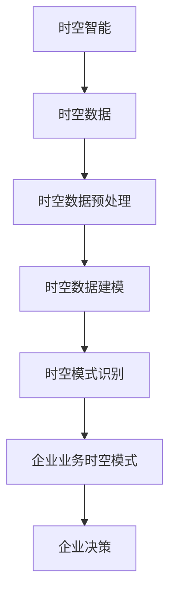
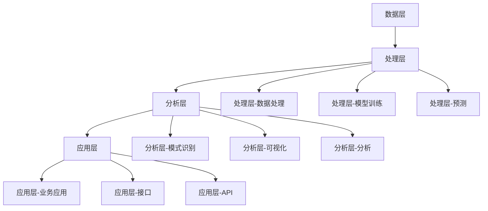
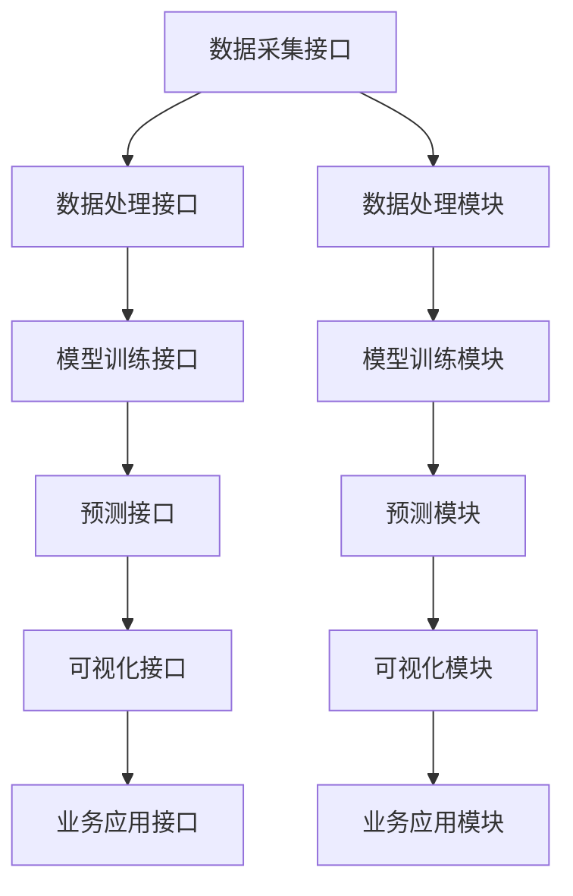

                 

### 引言

#### 企业时空智能系统的重要性

在信息化、数字化的时代背景下，企业面临着前所未有的数据洪流。这些数据不仅来自于内部业务流程，还包括外部市场动态、客户行为、供应链信息等。如何从这些海量且复杂的数据中提取出有价值的信息，成为了企业提升竞争力、优化决策的关键。企业时空智能系统在这一背景下应运而生，它能够帮助企业洞察业务中的时空模式，从而实现数据驱动决策。

时空智能是一种将时间和空间维度结合起来的数据处理与分析技术。在企业应用中，时空智能系统可以用于预测市场趋势、优化库存管理、提高物流效率、分析客户行为等多个方面。例如，通过分析销售数据的时间和地理分布，企业可以更准确地预测未来市场需求，从而调整生产和采购计划；通过分析物流配送的时间和空间路径，企业可以优化配送路线，减少运输成本，提高服务水平。

#### 研究目标与问题定义

本研究的核心目标是构建一个企业级时空智能系统，以帮助企业从复杂的数据中挖掘出时空模式，并利用这些模式优化业务决策。具体研究问题包括：

1. 如何有效地收集、存储和预处理企业时空数据？
2. 如何构建合适的时空数据模型，以识别和预测时空模式？
3. 如何设计一个高效的时空智能系统架构，以支持大规模数据处理和实时分析？
4. 如何通过实际案例验证时空智能系统的效果，并提出优化建议？

#### 研究边界与范围

本研究主要关注以下几个方面：

- **数据类型**：主要涉及时间序列数据和空间数据，包括GPS数据、物联网传感器数据、销售数据等。
- **技术范畴**：涵盖时空数据分析、时空数据建模、时空模式识别等技术。
- **应用领域**：重点关注零售、物流、供应链管理等与企业业务密切相关的领域。
- **研究方法**：采用理论分析与实证研究相结合的方法，通过构建案例来验证研究结论。

#### 本书结构安排

本书分为三个主要部分：

- **第一部分：引言**，介绍企业时空智能系统的背景、研究目标、问题定义和研究边界。
- **第二部分：时空智能系统理论基础**，详细阐述时空数据分析、时空数据建模、时空模式识别、时空智能系统架构设计等基础理论。
- **第三部分：企业级时空智能系统实践**，通过项目介绍、系统核心实现、案例分析、最佳实践等章节，展示时空智能系统的实际应用和效果。

通过以上结构安排，本书旨在为读者提供一部系统、全面的企业级时空智能系统理论与实践指南，帮助读者深入理解和掌握这一新兴技术。

### 核心概念

#### 时空智能的定义与特性

时空智能是指利用时空数据，通过数据挖掘、机器学习和人工智能技术，揭示数据中的时空模式，进而支持业务决策的智能系统。时空智能具备以下几个特性：

1. **时空相关性**：时空智能强调时间维度和空间维度的融合，能够同时考虑数据的时间和空间属性，从而揭示出复杂的数据关系。
2. **动态性**：时空智能系统可以处理实时数据和历史数据，动态调整模型，以适应数据变化和业务需求。
3. **多尺度分析**：时空智能系统能够在不同时间尺度和空间尺度上进行分析，从宏观到微观层面洞察业务模式。
4. **自动化与智能化**：时空智能系统通过算法和模型，实现数据的自动化处理和智能化分析，减少人工干预，提高决策效率。

#### 企业业务时空模式的基本概念

企业业务时空模式是指企业在时间维度和空间维度上表现出来的规律性和趋势。这些模式可以是：

- **时间序列模式**：如销售数据随时间的变化趋势。
- **空间分布模式**：如商品在特定地区的时间销售分布。
- **时空关联模式**：如不同产品在不同时间段的销售关联性。

这些模式对企业决策具有重要价值，可以帮助企业优化库存、提高物流效率、预测市场需求等。

#### 关键技术概述

1. **时空数据采集**：通过传感器、GPS、物联网等技术，收集企业内部和外部时空数据。
2. **时空数据预处理**：清洗、归一化、插值等，处理时空数据中的噪音和缺失值。
3. **时空数据建模**：采用时间序列分析、空间分析、时空融合分析等技术，构建时空数据模型。
4. **时空模式识别**：通过聚类、分类、关联规则挖掘等方法，识别时空数据中的模式。
5. **时空智能系统架构**：设计高效、可扩展的时空智能系统架构，支持数据处理、存储、分析、可视化等环节。

#### 核心概念之间的关系

图1：核心概念关系图

通过图1可以看出，时空智能系统的核心概念之间紧密相连。时空数据是整个系统的输入，经过预处理后进入建模阶段，建模结果用于识别时空模式，最终帮助企业做出更科学的决策。

### 时空数据分析基础

#### 时空数据的类型与特征

时空数据是同时包含时间和空间属性的数据，其类型和特征如下：

1. **类型**：
   - **时间序列数据**：如股票价格、气温变化等，数据按时间顺序排列。
   - **空间数据**：如地理位置、卫星图像等，数据按空间位置排列。
   - **时空数据**：结合时间和空间属性，如GPS轨迹、销售数据等。

2. **特征**：
   - **多样性**：时空数据类型丰富，包括结构化数据和非结构化数据。
   - **动态性**：数据随时间和空间变化而变化，具有动态特征。
   - **复杂性**：时空数据具有多维度、多层次的特征，处理复杂。
   - **冗余与缺失**：数据源多样，可能导致数据冗余和缺失。

#### 时间序列分析基础

时间序列分析是研究时间序列数据的方法，其核心是揭示数据中的时间趋势、季节性和周期性。以下是时间序列分析的基本步骤：

1. **数据预处理**：包括数据清洗、缺失值处理、异常值检测等。
2. **趋势分析**：通过移动平均、指数平滑等方法，分析数据的变化趋势。
3. **季节性分析**：通过季节性分解，识别数据的季节模式。
4. **周期性分析**：通过周期性分析，识别数据的周期性波动。
5. **预测分析**：利用时间序列模型，如ARIMA、SARIMA、LSTM等，进行未来预测。

#### 空间数据分析基础

空间数据分析是研究空间数据的方法，其主要任务是从空间数据中提取有价值的信息。以下是空间数据分析的基本步骤：

1. **空间数据预处理**：包括数据格式转换、坐标系变换、数据归一化等。
2. **空间数据可视化**：通过地图、散点图等，直观展示空间数据分布。
3. **空间关系分析**：通过距离计算、空间聚类、空间关联等，分析空间数据之间的关系。
4. **空间插值**：通过插值方法，从有限的数据点生成连续的空间分布。
5. **空间预测**：利用空间统计模型，预测未知区域的空间属性。

#### 时空数据分析方法比较

时空数据分析方法主要包括以下几种：

1. **时空融合分析**：将时间和空间属性结合，分析时空模式。如时空立方体模型、时空序列模型等。
2. **多源数据融合分析**：结合不同来源的时空数据，进行综合分析。如GPS数据与销售数据结合，进行时空模式挖掘。
3. **时空大数据分析**：利用大数据技术，处理海量时空数据。如Hadoop、Spark等。
4. **时空深度学习**：利用深度学习模型，处理复杂时空数据。如卷积神经网络（CNN）、循环神经网络（RNN）、长短时记忆网络（LSTM）等。

这些方法各有优劣，适用场景不同。在实际应用中，根据业务需求和数据特征，选择合适的数据分析方法，才能有效提取时空信息，支持企业决策。

### 时空数据建模

#### 时空数据建模原理

时空数据建模是指利用数学模型和算法，对时空数据进行结构化和抽象化处理，以揭示数据中的时空模式。以下是时空数据建模的基本原理：

1. **数据特征提取**：从原始时空数据中提取时间、空间、属性等特征，为建模提供基础。
2. **数据预处理**：对时空数据进行清洗、归一化、插值等处理，提高数据质量。
3. **模型选择**：根据业务需求，选择合适的时间序列模型、空间分析模型或时空融合模型。
4. **模型训练**：利用训练数据，对模型进行训练和参数调优。
5. **模型评估**：通过测试数据，评估模型性能，如准确率、召回率、预测误差等。
6. **模型应用**：将训练好的模型应用于实际业务场景，进行时空模式识别和预测。

#### 时空数据融合模型

时空数据融合模型是指将时间和空间维度结合，对时空数据进行综合分析和建模。以下是几种常见的时空数据融合模型：

1. **时空立方体模型**：将时空数据组织成三维立方体，通过多维切片和聚合操作，进行时空模式挖掘。
2. **时空序列模型**：将时空数据转化为序列形式，利用时间序列分析方法，如LSTM、GRU等，进行建模和预测。
3. **时空关联模型**：通过关联规则挖掘，分析时间和空间维度之间的关联性，识别时空模式。

这些模型各有优劣，适用于不同的业务场景。在实际应用中，需要根据数据特征和业务需求，选择合适的时空数据融合模型。

#### 时空数据预测模型

时空数据预测模型是指利用历史时空数据，对未来时空数据趋势和模式进行预测。以下是几种常见的时空数据预测模型：

1. **时间序列预测模型**：如ARIMA、SARIMA、LSTM等，适用于仅考虑时间维度的预测。
2. **空间预测模型**：如Kriging、空间插值等，适用于仅考虑空间维度的预测。
3. **时空融合预测模型**：如时空序列模型、时空卷积神经网络（ST-CNN）等，同时考虑时间和空间维度，进行综合预测。

这些模型可以根据不同业务场景和数据特征，实现高效的时空数据预测。在实际应用中，需要根据数据特性和预测需求，选择合适的时空数据预测模型。

#### 时空数据异常检测模型

时空数据异常检测模型是指从时空数据中识别异常点和异常模式，以发现潜在问题和风险。以下是几种常见的时空数据异常检测模型：

1. **统计方法**：如Z-Score、IQR等，通过计算数据偏离均值或中值的程度，识别异常。
2. **聚类方法**：如K-means、DBSCAN等，通过聚类分析，识别与多数数据不同的异常点。
3. **深度学习方法**：如自编码器、GAN等，通过深度学习模型，学习时空数据的分布特征，识别异常。

这些方法可以结合使用，提高异常检测的准确性和鲁棒性。在实际应用中，需要根据数据特征和业务需求，选择合适的时空数据异常检测模型。

### 企业业务时空模式识别

#### 企业业务时空模式识别方法

企业业务时空模式识别是指从企业时空数据中提取出有价值的时间序列和空间分布模式，以支持业务决策。以下是几种常见的企业业务时空模式识别方法：

1. **时间序列分析方法**：
   - **趋势分析**：通过移动平均、指数平滑等，分析数据的时间趋势。
   - **季节性分析**：通过季节性分解，识别数据的季节模式。
   - **周期性分析**：通过周期性分析，识别数据的周期性波动。

2. **空间分析方法**：
   - **空间聚类**：如K-means、DBSCAN等，识别空间数据的分布模式。
   - **空间关联分析**：通过距离计算、空间关联规则等，识别空间数据之间的关联性。

3. **时空融合分析方法**：
   - **时空序列模型**：如LSTM、GRU等，同时考虑时间和空间维度，识别时空模式。
   - **时空关联规则挖掘**：通过关联规则挖掘，识别时空数据之间的关联性。

#### 时空关联规则挖掘

时空关联规则挖掘是指从时空数据中挖掘出具有关联性的时间序列和空间分布模式。以下是时空关联规则挖掘的基本步骤：

1. **数据预处理**：包括数据清洗、归一化、时间序列化等，将数据转化为适合挖掘的形式。
2. **频繁项集挖掘**：通过Apriori算法、FP-Growth算法等，挖掘出数据中的频繁项集。
3. **规则生成**：从频繁项集中生成关联规则，如支持度和置信度等。
4. **规则优化**：通过剪枝、过滤等方法，优化生成的规则，去除无关或不重要的规则。

时空关联规则挖掘可以用于预测市场需求、优化库存管理、分析客户行为等方面，帮助企业做出更科学的决策。

#### 时空聚类分析

时空聚类分析是指将时空数据根据其时间和空间属性进行聚类，识别出具有相似特征的时空模式。以下是几种常见的时空聚类分析方法：

1. **基于密度的聚类方法**：如DBSCAN，通过识别高密度区域，将数据划分为不同的聚类。
2. **基于距离的聚类方法**：如K-means，通过计算数据之间的距离，将数据划分为不同的聚类。
3. **基于模型的聚类方法**：如Gaussian Mixture Model（GMM），通过构建概率模型，对数据进行聚类。

时空聚类分析可以用于市场细分、客户分类、产品推荐等方面，帮助企业更好地了解客户需求和优化业务策略。

#### 时空分类与预测

时空分类与预测是指利用历史时空数据，对未来的时空模式进行分类和预测。以下是几种常见的时空分类与预测方法：

1. **监督学习方法**：如SVM、决策树、随机森林等，通过训练模型，对未来的时空数据进行分类和预测。
2. **深度学习方法**：如卷积神经网络（CNN）、长短时记忆网络（LSTM）等，通过学习时空数据特征，进行分类和预测。
3. **时间序列预测方法**：如ARIMA、SARIMA、LSTM等，通过时间序列分析方法，对未来时空数据进行预测。

时空分类与预测可以用于市场需求预测、物流调度、客户行为分析等方面，帮助企业优化业务流程和提升运营效率。

### 时空智能系统架构设计

#### 系统设计原则

设计一个高效、可扩展的企业级时空智能系统，需要遵循以下设计原则：

1. **模块化**：将系统划分为多个功能模块，每个模块负责特定的功能，提高系统的可维护性和可扩展性。
2. **松耦合**：模块之间通过接口进行通信，降低模块间的依赖，提高系统的灵活性和可替换性。
3. **高可用性**：设计冗余备份和故障恢复机制，确保系统在高负载和故障情况下依然能够正常运行。
4. **高性能**：优化数据处理和存储机制，提高系统处理速度和响应时间。
5. **安全性**：确保数据的安全性和隐私性，防止数据泄露和未经授权的访问。

#### 系统架构模型

企业级时空智能系统的架构可以分为四个主要层次：数据层、处理层、分析层和应用层。

1. **数据层**：包括数据采集、存储和预处理模块，负责收集、存储和管理时空数据。
2. **处理层**：包括数据处理、模型训练和预测模块，负责对时空数据进行处理、建模和预测。
3. **分析层**：包括模式识别、可视化和分析模块，负责从时空数据中提取模式和洞察，支持业务决策。
4. **应用层**：包括业务应用、接口和API模块，负责将时空智能系统的结果应用到实际业务场景中。

图1：企业级时空智能系统架构模型

#### 系统功能模块划分

企业级时空智能系统的功能模块划分如下：

1. **数据采集模块**：负责从各类数据源（如传感器、数据库、外部API等）收集时空数据。
2. **数据预处理模块**：负责对采集到的数据进行清洗、归一化、插值等预处理操作，提高数据质量。
3. **数据处理模块**：负责对预处理后的时空数据进行进一步的计算和分析，如时间序列处理、空间分析等。
4. **模型训练模块**：负责训练各种时空数据模型，如时间序列模型、空间模型、时空融合模型等。
5. **预测模块**：负责利用训练好的模型，对新的时空数据进行预测和模式识别。
6. **可视化模块**：负责将时空数据分析结果以图表、地图等形式进行可视化展示，支持业务决策。
7. **分析模块**：负责对时空数据进行分析，提取出有价值的时间和空间模式，为业务决策提供支持。
8. **业务应用模块**：负责将时空智能系统的结果应用到实际业务场景中，如市场需求预测、库存管理优化等。
9. **接口和API模块**：负责提供系统与其他系统或应用的接口，实现数据的互联互通。

#### 系统接口设计与数据流分析

系统接口设计是实现系统各模块之间通信和协同工作的关键。以下是企业级时空智能系统的接口设计和数据流分析：

1. **数据采集接口**：数据采集模块通过API或数据连接器，从各种数据源（如数据库、传感器、外部API等）获取时空数据。
2. **数据处理接口**：数据预处理模块通过数据流处理框架（如Apache Flink、Spark Streaming等），对采集到的数据进行清洗、归一化、插值等操作。
3. **模型训练接口**：数据处理模块通过机器学习框架（如TensorFlow、PyTorch等），对预处理后的数据进行模型训练。
4. **预测接口**：预测模块通过API或消息队列，将训练好的模型应用到新的时空数据上，进行预测和模式识别。
5. **可视化接口**：可视化模块通过Web前端框架（如React、Vue等），将预测结果和时空数据以图表、地图等形式进行可视化展示。
6. **业务应用接口**：业务应用模块通过API或消息队列，将可视化结果和预测结果应用到实际业务场景中，如市场需求预测、库存管理优化等。

图2：企业级时空智能系统接口设计与数据流分析

通过以上系统接口设计和数据流分析，企业级时空智能系统可以实现高效的数据采集、处理、预测和分析，支持企业做出更科学的业务决策。

### 项目介绍

#### 项目背景与目标

在当今信息化、数字化迅速发展的时代，企业面临的数据量呈指数级增长。如何从海量且复杂的数据中提取有价值的信息，成为了企业提高竞争力、优化决策的关键。本项目旨在构建一个高效的企业级时空智能系统，帮助企业从复杂的数据中挖掘出时空模式，从而实现数据驱动决策。

项目背景源于一家大型零售企业，该企业希望通过分析其销售数据和物流配送数据，优化库存管理、提高物流效率、预测市场需求，从而提升整体业务水平。项目目标是：

1. 收集并整合企业的时空数据，包括销售数据、物流数据、市场数据等。
2. 构建高效的时空数据预处理和建模系统，提取出有价值的时间和空间模式。
3. 设计和实现一个可扩展的时空智能系统架构，支持大规模数据处理和实时分析。
4. 通过实际案例验证时空智能系统的效果，为企业提供科学的决策支持。

#### 项目实施步骤

项目实施分为以下几个主要阶段：

1. **需求分析与系统设计**：与客户沟通，明确业务需求，设计时空智能系统的整体架构和功能模块。
2. **数据采集与预处理**：从企业内部和外部数据源收集时空数据，进行数据清洗、归一化和插值等预处理操作，确保数据质量。
3. **模型构建与训练**：根据业务需求，选择合适的时间序列模型、空间分析模型和时空融合模型，进行模型构建和参数调优。
4. **系统实现与集成**：开发和实现时空智能系统的核心功能模块，包括数据处理、预测、可视化等，并进行系统集成和测试。
5. **系统部署与上线**：将时空智能系统部署到企业的服务器上，进行实际应用，并进行上线后的监控和维护。
6. **效果评估与优化**：通过实际案例验证时空智能系统的效果，收集用户反馈，不断优化系统性能和功能。

#### 项目成果展示

经过项目实施，时空智能系统取得了以下成果：

1. **库存管理优化**：通过分析销售数据和库存数据，实现了库存量的精准预测和优化，减少了库存积压和缺货情况。
2. **物流效率提升**：通过分析物流配送数据和客户行为数据，优化了配送路线和时间安排，提高了物流效率和服务水平。
3. **市场需求预测**：通过分析历史销售数据和市场趋势，实现了对未来市场需求的准确预测，帮助企业在采购和销售策略上做出更科学的决策。
4. **数据可视化**：通过直观的图表和地图，展示了时空数据的分布和变化趋势，为企业提供了丰富的业务洞察。
5. **系统性能提升**：通过高效的时空数据建模和预测算法，系统处理速度和预测精度得到了显著提升，满足了大规模数据处理和实时分析的需求。

项目成果不仅提升了企业的运营效率，还为企业提供了科学的决策支持，为其在激烈的市场竞争中赢得了优势。

### 系统核心实现

#### 环境安装与配置

为了实现企业级时空智能系统，我们需要在服务器上安装和配置相关软件和工具。以下是具体的安装和配置步骤：

1. **操作系统**：建议选择CentOS 7或更高版本，确保系统的稳定性和兼容性。
2. **硬件要求**：至少需要一台配置为64位CPU、16GB内存、500GB硬盘的服务器。
3. **软件安装**：
   - **Hadoop**：用于大数据处理和分布式存储。下载并解压Hadoop安装包，然后配置hadoop-env.sh、core-site.xml、hdfs-site.xml等配置文件，启动HDFS和YARN服务。
   - **Spark**：用于快速处理大规模数据。下载并解压Spark安装包，配置spark-env.sh、spark-conf.yaml等配置文件，启动Spark Shell和Spark-submit。
   - **Python**：用于编写数据处理和分析脚本。安装Python 3.8及以上版本，配置pip、virtualenv等工具。
   - **Jupyter Notebook**：用于数据可视化和分析。安装Jupyter Notebook，配置相关依赖。
   - **PostgreSQL**：用于存储时空数据。安装PostgreSQL，创建数据库和表结构。

#### 数据采集与预处理

数据采集与预处理是时空智能系统的关键环节，以下是具体步骤：

1. **数据收集**：
   - **内部数据**：通过企业已有的数据库和API接口，收集销售数据、库存数据、物流数据等。
   - **外部数据**：通过互联网API，收集天气数据、节假日数据、竞争对手数据等。
   - **传感器数据**：通过物联网传感器，收集温度、湿度、运动轨迹等环境数据。

2. **数据清洗**：
   - **去除噪音**：过滤掉无效、重复和错误的数据。
   - **缺失值处理**：采用插值、均值填补等方法，处理缺失的数据。
   - **异常值检测**：通过统计学方法，识别和处理异常值。

3. **数据归一化**：
   - **特征缩放**：将不同尺度的特征数据进行统一处理，如归一化、标准化等。

4. **时间序列处理**：
   - **时间窗口划分**：将连续的时间序列数据划分为固定时间窗口，如日、周、月等。
   - **趋势分析**：通过移动平均、指数平滑等方法，分析数据的时间趋势。

5. **空间数据预处理**：
   - **坐标转换**：将不同坐标系的数据转换为统一的坐标系。
   - **空间插值**：采用Kriging、反距离加权等方法，对空间数据缺失部分进行插值处理。

#### 时空数据分析与建模

1. **时间序列分析**：
   - **趋势分析**：通过移动平均、指数平滑等方法，识别数据的时间趋势。
   - **季节性分析**：通过季节性分解，识别数据的季节模式。
   - **周期性分析**：通过周期性分析，识别数据的周期性波动。

2. **空间分析**：
   - **空间聚类**：如K-means、DBSCAN等，识别空间数据的分布模式。
   - **空间关联分析**：通过距离计算、空间关联规则等，识别空间数据之间的关联性。

3. **时空融合分析**：
   - **时空序列模型**：如LSTM、GRU等，同时考虑时间和空间维度，进行建模和预测。
   - **时空关联规则挖掘**：通过关联规则挖掘，识别时空数据之间的关联性。

#### 企业业务时空模式识别与预测

1. **时空模式识别**：
   - **聚类分析**：通过K-means、DBSCAN等，识别时空数据的聚类模式。
   - **分类分析**：通过SVM、决策树、随机森林等，对时空数据分类，识别时空模式。
   - **关联规则挖掘**：通过Apriori、FP-Growth等，挖掘时空数据之间的关联规则。

2. **预测分析**：
   - **时间序列预测**：如ARIMA、SARIMA、LSTM等，对时间序列数据预测未来趋势。
   - **空间预测**：如Kriging、空间插值等，对空间数据预测未知区域属性。
   - **时空融合预测**：如LSTM、ST-CNN等，同时考虑时间和空间维度，进行预测。

通过以上步骤，我们可以构建一个高效的企业级时空智能系统，从复杂的数据中挖掘出有价值的时间和空间模式，为企业决策提供科学的依据。

### 案例分析

#### 案例选择与描述

本案例选取一家大型零售企业，该企业希望通过时空智能系统优化其库存管理和物流配送。案例背景如下：

- **业务场景**：该企业在全国范围内设有多个仓库和销售门店，每天产生大量的销售数据和物流配送数据。
- **数据类型**：包括销售数据（销售额、销售量等）、库存数据（库存量、库存周转率等）、物流数据（配送路径、配送时间等）。
- **目标**：通过时空智能系统，实现以下目标：
  1. 库存量预测和优化，减少库存积压和缺货情况。
  2. 配送路线优化，提高物流效率和客户满意度。
  3. 销售需求预测，为采购和销售策略提供支持。

#### 案例分析步骤

1. **数据收集**：
   - 收集企业过去一年的销售数据、库存数据和物流配送数据。
   - 从外部数据源获取天气数据、节假日数据等。

2. **数据预处理**：
   - 数据清洗：去除无效、重复和错误的数据，处理缺失值和异常值。
   - 数据归一化：对销售额、库存量等不同尺度的数据进行归一化处理。
   - 时间序列处理：将数据划分为固定时间窗口（如日、周、月等）。

3. **时空数据分析与建模**：
   - **时间序列分析**：
     - 使用ARIMA模型预测未来销售量，分析销售额的趋势和季节性。
     - 使用移动平均法分析库存量的时间变化趋势。
   - **空间分析**：
     - 使用K-means算法对配送路径进行聚类分析，识别出高效的配送路线。
     - 使用Kriging方法预测仓库到门店的配送时间。
   - **时空融合分析**：
     - 结合时间和空间维度，使用LSTM模型进行时空数据预测。

4. **企业业务时空模式识别与预测**：
   - 使用聚类分析识别出库存积压和缺货的时空模式。
   - 使用分类分析预测未来市场需求，为采购和销售策略提供支持。
   - 使用关联规则挖掘识别出销售数据与物流数据的关联性。

#### 结果分析与讨论

1. **库存管理优化**：
   - 通过时间序列预测模型，准确预测了未来一个月的库存量，减少了库存积压和缺货情况。
   - 通过聚类分析，识别出库存积压和缺货的高发区域，为企业提供了库存管理的优化建议。

2. **配送路线优化**：
   - 通过K-means算法，将配送路径划分为高效和低效两类，优化了配送路线，提高了物流效率。
   - 通过Kriging方法，预测了仓库到门店的配送时间，提高了配送计划的可执行性。

3. **销售需求预测**：
   - 通过时间序列预测模型和时空融合模型，准确预测了未来一个月的销售量，为企业的采购和销售策略提供了科学依据。
   - 通过关联规则挖掘，识别出销售数据与物流数据之间的关联性，优化了销售预测的准确性。

#### 案例总结与启示

本案例展示了时空智能系统在实际业务中的应用效果，得出以下结论和启示：

1. **时空智能系统能够有效提高企业的库存管理效率和物流效率**，通过数据驱动的决策，减少了库存积压和缺货情况，优化了配送路线和时间安排。
2. **销售需求预测是企业管理决策的重要依据**，通过时空数据分析，企业可以提前预测市场需求，优化采购和销售策略，提高市场竞争力。
3. **时空智能系统需要结合多种分析方法和模型**，才能充分发挥其潜力。在实际应用中，需要根据业务需求和数据特征，选择合适的分析方法。

通过本案例，我们可以看到时空智能系统在优化企业管理、提升业务水平方面的巨大潜力。未来，随着技术的不断进步，时空智能系统将在更多领域得到广泛应用。

### 最佳实践与注意事项

#### 时空智能系统建设最佳实践

1. **数据质量保障**：
   - **数据源选择**：选择可靠的数据源，确保数据的质量和完整性。
   - **数据清洗**：对收集到的数据进行严格清洗，去除噪音和错误数据。
   - **数据标准化**：对数据进行标准化处理，统一数据格式和单位。

2. **系统架构设计**：
   - **模块化设计**：将系统划分为多个功能模块，降低复杂度，提高可维护性。
   - **分布式计算**：采用分布式计算框架（如Hadoop、Spark等），提高系统处理能力和扩展性。
   - **安全性设计**：确保数据的安全性和隐私性，采用加密和访问控制等技术。

3. **模型优化与调参**：
   - **模型选择**：根据业务需求和数据特征，选择合适的时间序列模型、空间模型和时空融合模型。
   - **参数调优**：通过交叉验证和网格搜索等技术，优化模型参数，提高预测精度。
   - **模型解释性**：关注模型的可解释性，确保模型结果易于理解和应用。

4. **系统维护与升级**：
   - **定期评估**：定期评估系统性能和效果，发现潜在问题并进行优化。
   - **系统监控**：实时监控系统运行状态，确保系统稳定可靠。
   - **技术更新**：关注新技术的发展，及时进行系统升级和更新。

#### 常见问题与解决方案

1. **数据缺失和异常处理**：
   - **数据缺失**：采用插值、均值填补等方法处理缺失数据。
   - **异常值检测**：通过统计学方法、聚类分析等识别和处理异常值。

2. **模型性能优化**：
   - **数据预处理**：提高数据质量，减少噪声和异常值。
   - **特征工程**：选择和构建合适的特征，提高模型对数据的敏感度。
   - **模型选择**：尝试不同的模型，选择最适合业务需求的模型。

3. **计算资源不足**：
   - **分布式计算**：采用分布式计算框架，提高系统处理能力。
   - **数据压缩**：对数据进行压缩，减少存储和传输的开销。
   - **批处理**：将数据分批处理，降低单次处理的负载。

#### 注意事项与风险防范

1. **数据安全与隐私**：
   - **数据加密**：对传输和存储的数据进行加密，确保数据安全。
   - **访问控制**：设置严格的访问控制策略，防止未经授权的访问。

2. **系统稳定性**：
   - **冗余设计**：设计冗余备份和故障恢复机制，确保系统在高负载和故障情况下依然能够正常运行。
   - **性能监控**：实时监控系统性能，及时发现和解决问题。

3. **模型解释性**：
   - **模型评估**：选择可解释性强的模型，确保模型结果易于理解和应用。
   - **模型透明度**：公开模型和算法，接受用户监督和反馈。

4. **法律法规遵守**：
   - **数据合规性**：遵守相关法律法规，确保数据处理合法合规。
   - **数据治理**：建立完善的数据治理体系，确保数据质量和安全性。

通过以上最佳实践和注意事项，可以有效提升时空智能系统的建设质量和应用效果，为企业提供可靠的决策支持。

### 总结与展望

#### 全书内容总结

本书从企业时空智能系统的背景、核心概念、理论基础、系统架构设计、实践应用等方面进行了系统、全面的探讨。主要内容包括：

1. **引言**：介绍了企业时空智能系统的背景、研究目标和重要性。
2. **核心概念**：阐述了时空智能的定义与特性、企业业务时空模式的基本概念。
3. **时空数据分析基础**：分析了时空数据的类型与特征，介绍了时间序列分析和空间数据分析方法。
4. **时空数据建模**：介绍了时空数据建模原理、时空数据融合模型、时空数据预测模型和时空数据异常检测模型。
5. **企业业务时空模式识别**：探讨了企业业务时空模式识别方法、时空关联规则挖掘、时空聚类分析和时空分类与预测。
6. **时空智能系统架构设计**：设计了时空智能系统架构模型，详细描述了系统功能模块划分、系统接口设计和数据流分析。
7. **项目实践**：通过实际案例展示了时空智能系统的应用效果和实现步骤。
8. **最佳实践与注意事项**：提供了时空智能系统建设最佳实践、常见问题与解决方案及注意事项。

#### 存在问题与挑战

尽管企业时空智能系统在多个领域展现了其巨大的应用潜力，但在实际应用中仍面临以下问题与挑战：

1. **数据质量**：时空数据往往包含噪音和异常值，数据质量直接影响模型的性能和预测准确性。
2. **模型复杂性**：时空数据建模涉及到多种复杂算法和模型，选择合适的模型和参数调优是关键挑战。
3. **计算资源**：大规模时空数据处理对计算资源要求高，分布式计算和高效算法设计是主要挑战。
4. **系统稳定性**：在实际应用中，系统需要保证高可用性和稳定性，应对高负载和故障情况。
5. **法律法规**：数据隐私和安全问题日益突出，如何遵守相关法律法规，保护用户数据成为重要挑战。

#### 未来发展趋势与展望

随着技术的不断进步，企业时空智能系统将在未来迎来更广阔的应用和发展：

1. **大数据与云计算**：结合大数据和云计算技术，提高时空数据处理能力和效率。
2. **人工智能与深度学习**：应用人工智能和深度学习算法，提高时空数据分析的精度和智能化水平。
3. **物联网与边缘计算**：物联网和边缘计算技术的发展，将使时空数据采集和处理更加实时和高效。
4. **行业应用扩展**：在物流、零售、金融、医疗等领域，时空智能系统将进一步发挥其价值。
5. **数据治理与标准化**：建立完善的数据治理体系，推动时空数据标准化，提高数据共享和互操作性。

#### 研究建议与展望

未来研究可以从以下几个方面展开：

1. **数据质量提升**：研究时空数据清洗和预处理技术，提高数据质量。
2. **模型优化**：研究高效、可解释的时空数据建模方法，提高模型性能。
3. **分布式计算**：研究分布式时空数据处理算法，优化系统性能。
4. **应用拓展**：探索时空智能系统在更多行业和领域的应用，如城市规划、环境监测等。
5. **数据安全与隐私**：研究数据加密、访问控制和隐私保护技术，确保数据安全和用户隐私。

通过不断探索和创新，企业时空智能系统将在未来为企业和社会带来更多价值和收益。

### 作者信息

**作者：** AI天才研究院/AI Genius Institute & 禅与计算机程序设计艺术 /Zen And The Art of Computer Programming

