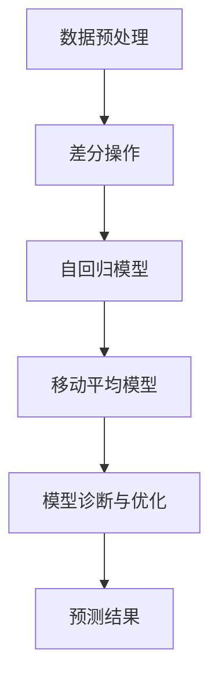
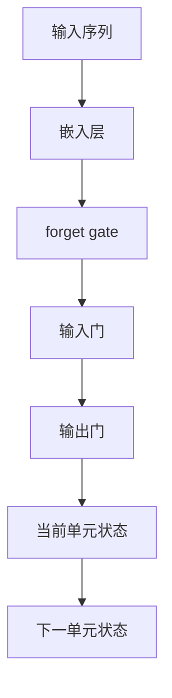
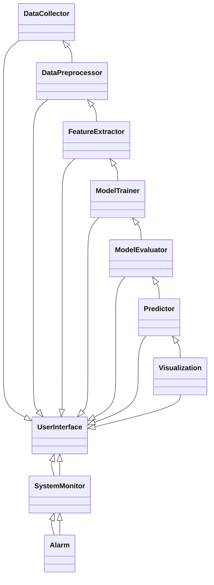
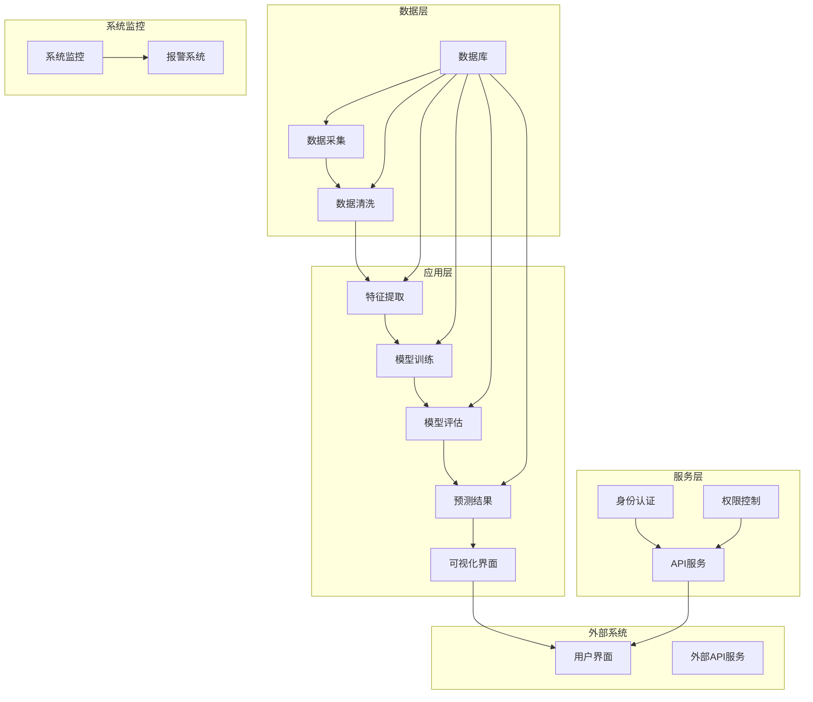
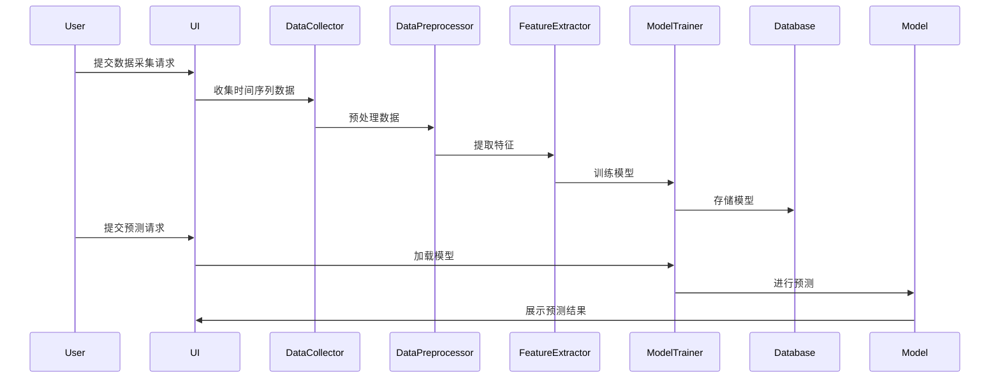

                 

### 1.1 问题背景

在当今快速发展的商业环境中，企业的运营和决策面临着越来越复杂和多变的市场条件。为了在激烈的市场竞争中保持领先地位，企业需要具备敏锐的市场洞察力和高效的决策能力。时间序列预测作为一种强大的数据分析工具，在企业级应用中扮演着越来越重要的角色。

#### 1.1.1 时间序列预测在企业中的应用

时间序列预测是指利用历史时间序列数据，通过数学模型和算法来预测未来的趋势和变化。在企业中，时间序列预测被广泛应用于多个领域，包括销售预测、库存管理、生产规划、财务预算等。例如，通过销售预测，企业可以提前了解产品的市场需求，合理安排生产和库存，避免过剩或缺货现象，提高经营效率。在库存管理中，时间序列预测可以帮助企业优化库存水平，减少库存成本，提高资金利用率。在生产规划方面，时间序列预测可以帮助企业预测生产需求，合理安排生产计划，提高生产效率。在财务预算方面，时间序列预测可以帮助企业预测未来的收入和支出，制定合理的财务计划，确保企业财务状况的健康稳定。

#### 1.1.2 增强业务规划能力的重要性

业务规划能力是指企业对市场环境变化做出快速响应，制定合理战略和计划，实现业务目标的能力。在信息化时代，业务规划能力的强弱直接影响到企业的竞争力和生存能力。增强业务规划能力的重要性体现在以下几个方面：

1. **提高决策效率**：通过时间序列预测，企业可以提前了解市场趋势和变化，及时调整业务策略，减少决策时间，提高决策效率。

2. **降低运营成本**：通过预测未来的需求和库存变化，企业可以优化资源配置，降低库存成本和生产成本，提高运营效率。

3. **提升客户满意度**：准确的预测可以帮助企业更好地满足客户需求，提高产品供应及时性，提升客户满意度。

4. **增加市场竞争力**：具备强大业务规划能力的企业能够在市场竞争中更快地做出反应，抓住市场机会，提升市场竞争力。

5. **保障财务健康**：通过预测未来的财务状况，企业可以提前制定财务计划，确保财务状况的健康稳定。

总的来说，时间序列预测作为一项先进的技术工具，通过增强业务规划能力，可以帮助企业实现更高效的运营和更精准的决策，从而在激烈的市场竞争中立于不败之地。

### 1.2 核心概念

在深入探讨企业级时间序列预测之前，我们需要明确几个核心概念：时间序列预测、业务规划能力以及企业级应用。这些概念不仅为我们提供了理论基础，也为我们理解其在实际应用中的重要性奠定了基础。

#### 1.2.1 时间序列预测的定义

时间序列预测（Time Series Forecasting）是一种统计学习方法，旨在分析时间序列数据，捕捉其历史模式，并基于这些模式来预测未来的趋势。时间序列数据是指按时间顺序排列的数据点，通常包含一个或多个变量。时间序列预测的目的是通过分析过去的数据来预测未来特定时间点的数值或状态。

时间序列预测的关键步骤包括：

1. **数据预处理**：包括数据清洗、缺失值处理、异常值检测等，以确保数据的质量和完整性。
2. **特征工程**：通过提取时间序列数据的特征，如趋势、季节性、周期性等，来提高预测的准确性。
3. **模型选择**：根据时间序列数据的特点选择合适的预测模型，如ARIMA、LSTM、GRU等。
4. **模型训练和验证**：使用历史数据训练模型，并通过验证集评估模型的性能。
5. **预测和优化**：使用训练好的模型进行预测，并根据预测结果进行策略调整和优化。

#### 1.2.2 业务规划能力的定义

业务规划能力（Business Planning Ability）是指企业根据市场环境、资源条件、竞争对手状况等因素，制定和实施战略和计划，以实现企业目标的能力。业务规划能力包括以下方面：

1. **市场分析**：通过对市场趋势、竞争对手、客户需求等的分析，确定企业的市场定位和战略方向。
2. **资源整合**：通过有效配置和利用企业内部和外部资源，确保业务目标的实现。
3. **战略制定**：根据市场分析结果，制定企业的长期和短期战略计划。
4. **执行监控**：对业务执行过程进行监控和评估，确保战略计划的实施效果。
5. **调整和优化**：根据市场变化和企业实际情况，对战略计划进行调整和优化。

#### 1.2.3 企业级应用的概念

企业级应用（Enterprise Application）是指专门为大型企业设计的软件系统，用于支持企业的核心业务流程。企业级应用通常具有以下特点：

1. **复杂性和扩展性**：能够处理大规模的数据和复杂的业务流程，支持企业的业务扩展。
2. **集成性**：能够与其他系统和应用进行集成，实现数据的共享和流程的协同。
3. **可靠性**：保证系统的稳定性和数据的安全性，满足企业的业务需求。
4. **定制性**：可以根据企业的特定需求进行定制化开发和配置。

在企业级应用中，时间序列预测和业务规划能力扮演着关键角色。时间序列预测为企业提供了对未来市场趋势的预测和分析，为业务规划提供了数据支持和决策依据。而业务规划能力则通过利用这些预测结果，制定和实施有效的战略和计划，提升企业的运营效率和市场竞争力。

通过理解这些核心概念，我们可以更好地把握时间序列预测在企业级应用中的价值，并探索如何通过增强业务规划能力来提升企业的整体运营水平。

### 1.3 核心概念与联系

为了深入理解时间序列预测在企业级应用中的重要性，我们需要进一步探讨这些核心概念之间的联系。下面将通过对比表格和ER实体关系图，详细阐述时间序列预测与业务规划能力、企业级应用之间的联系。

#### 1.3.1 时间序列预测与业务规划能力的联系

时间序列预测和业务规划能力之间存在紧密的联系，具体表现在以下几个方面：

1. **数据支持**：时间序列预测通过分析历史数据，捕捉市场趋势和变化，为业务规划提供可靠的数据支持。
2. **预测结果应用**：业务规划能力利用时间序列预测的结果，制定和调整战略计划，提高决策的科学性和有效性。
3. **风险控制**：时间序列预测可以帮助企业提前识别潜在的市场风险，为业务规划提供风险管理策略。

**时间序列预测与业务规划能力的对比表格：**

| 要素 | 时间序列预测 | 业务规划能力 |
| ---- | ------------ | ------------ |
| 目的 | 预测未来趋势和变化 | 制定和实施战略计划 |
| 数据源 | 历史时间序列数据 | 内部数据和外部市场数据 |
| 技术手段 | 统计模型和算法 | 数据分析、战略规划工具 |
| 影响因素 | 市场趋势、季节性、周期性 | 市场需求、竞争对手、资源状况 |

#### 1.3.2 时间序列预测在企业级应用中的核心要素

在企业级应用中，时间序列预测不仅是数据分析的工具，更是提升业务规划能力的关键手段。以下是时间序列预测在企业级应用中的核心要素：

1. **数据质量**：高质量的数据是时间序列预测的基础。企业需要确保数据的准确性、完整性和一致性。
2. **模型选择**：根据业务需求选择合适的预测模型，如ARIMA、LSTM等，确保预测结果的准确性和可靠性。
3. **集成性**：时间序列预测系统需要与企业级应用系统进行集成，实现数据的共享和流程的协同。
4. **可扩展性**：随着业务的发展，时间序列预测系统需要具备良好的扩展性，支持业务规模的扩大。

**ER实体关系图：**

```mermaid
erDiagram
    Customer ||--|{ Order }|--| Supplier
    Product ||--|{ Inventory }|--| Sales
    TimeSeriesData ||--|{ Forecast }|--| BusinessPlan
```

在这个ER实体关系图中，`Customer`、`Product` 和 `TimeSeriesData` 是核心实体，`Order`、`Inventory`、`Sales` 和 `Forecast` 是相关的实体，`BusinessPlan` 是最终目标实体。时间序列预测系统通过分析`TimeSeriesData`，生成`Forecast`，进而影响`BusinessPlan`的制定和实施。

通过对比表格和ER实体关系图，我们可以更清晰地理解时间序列预测、业务规划能力、企业级应用之间的联系和相互作用。这些核心概念和它们之间的联系，为我们在实际应用中提供了一种系统的思考和实施框架，从而更好地利用时间序列预测技术提升企业的业务规划能力。

### 2.1 经典时间序列预测算法

时间序列预测的核心在于选择合适的算法，以捕捉数据的内在模式并准确预测未来趋势。以下我们将介绍几种经典的时间序列预测算法，包括它们的原理、优缺点以及在实际应用中的适用场景。

#### 2.1.1 算法介绍

**1. ARIMA模型（自回归积分滑动平均模型）**

ARIMA模型是一种广泛应用的时间序列预测方法，通过自回归（AR）、差分（I）和移动平均（MA）三个步骤来建模时间序列数据。ARIMA模型适用于线性时间序列，能够处理趋势性和季节性数据。

**2. LSTM模型（长短期记忆网络）**

LSTM是一种深度学习模型，特别适用于时间序列预测。LSTM通过引入记忆单元，可以捕捉长期依赖关系，非常适合处理具有复杂模式和长周期性的时间序列数据。

**3. GRU模型（门控循环单元）**

GRU是LSTM的变体，结构更加简洁，计算效率较高。GRU同样适用于捕捉时间序列数据中的长期依赖关系，具有较好的预测效果。

**4. Prophet模型**

Prophet是由Facebook开发的一种时间序列预测工具，特别适用于具有强季节性和趋势性的时间序列数据。Prophet的算法设计简单，易于使用和集成。

#### 2.1.2 算法对比表格

| 算法名称 | 适用场景 | 优点 | 缺点 |
| --- | --- | --- | --- |
| ARIMA | 线性时间序列 | 算法成熟，计算效率高 | 难以处理非线性数据 |
| LSTM | 非线性时间序列 | 可捕捉长期依赖关系 | 计算复杂度较高 |
| GRU | 非线性时间序列 | 计算效率高，简化模型结构 | 预测效果略逊于LSTM |
| Prophet | 强季节性和趋势性时间序列 | 简单易用，自动调整参数 | 适用于特定类型数据 |

通过对比表格，我们可以看出不同算法在处理时间序列数据时的特点和适用场景。在实际应用中，根据具体的数据特性和业务需求，选择合适的算法至关重要。

### 2.2 算法原理讲解

接下来，我们将详细介绍ARIMA模型和LSTM模型的原理，并通过mermaid流程图展示算法流程，结合Python代码和数学模型进行详细讲解。

#### 2.2.1 ARIMA模型原理

**1. 算法流程图**



**2. 数学模型和公式**

ARIMA模型由三个部分组成：自回归（AR）、差分（I）和移动平均（MA）。其数学模型可以表示为：

$$
\text{Y}_{t} = c + \phi_1\text{Y}_{t-1} + \phi_2\text{Y}_{t-2} + \ldots + \phi_p\text{Y}_{t-p} + \theta_1\epsilon_{t-1} + \theta_2\epsilon_{t-2} + \ldots + \theta_q\epsilon_{t-q} + \epsilon_t
$$

其中，$\text{Y}_{t}$ 表示时间序列的当前值，$c$ 是常数项，$\phi_i$ 和 $\theta_i$ 分别是自回归系数和移动平均系数，$p$ 和 $q$ 分别是自回归和移动平均的阶数，$\epsilon_t$ 是随机误差项。

**3. 举例说明**

假设我们有一组时间序列数据：

$$
\{3.2, 3.5, 4.1, 4.7, 5.1, 5.6, 6.0\}
$$

首先，我们进行差分操作，以消除趋势性：

$$
\{0.3, 0.6, 0.6, 0.4, 0.5, 0.4\}
$$

接着，我们选择合适的自回归和移动平均阶数，通过最大似然估计或AIC/BIC准则选择最佳模型：

$$
\text{Y}_{t} = 1.2 + 0.6\text{Y}_{t-1} - 0.3\epsilon_{t-1} + 0.1\epsilon_{t-2}
$$

最后，进行模型诊断和优化，确保预测结果的准确性。

#### 2.2.2 LSTM模型原理

**1. 算法流程图**



**2. 数学模型和公式**

LSTM模型的核心是细胞状态（cell state）和三个门结构：遗忘门（forget gate）、输入门（input gate）和输出门（output gate）。其数学模型可以表示为：

$$
\text{C}_{t} = \text{f}_{t} \odot \text{C}_{t-1} + \text{i}_{t} \odot \text{g}_{t}
$$

$$
\text{g}_{t} = \tanh(\text{W}_{g} \text{h}_{t-1} + \text{b}_{g})
$$

$$
\text{i}_{t} = \sigma(\text{W}_{i} \text{h}_{t-1} + \text{b}_{i})
$$

$$
\text{f}_{t} = \sigma(\text{W}_{f} \text{h}_{t-1} + \text{b}_{f})
$$

$$
\text{h}_{t} = \text{o}_{t} \odot \tanh(\text{C}_{t})
$$

$$
\text{o}_{t} = \sigma(\text{W}_{o} \text{h}_{t-1} + \text{b}_{o})
$$

其中，$\text{C}_{t}$ 是当前细胞状态，$\text{h}_{t}$ 是当前隐藏状态，$\text{i}_{t}$、$\text{f}_{t}$、$\text{o}_{t}$ 分别是输入门、遗忘门和输出门的激活值，$\text{g}_{t}$ 是输入门的候选值，$\sigma$ 是sigmoid函数，$\tanh$ 是双曲正切函数，$\odot$ 是元素乘积。

**3. 举例说明**

假设我们有一组时间序列数据：

$$
\{[1, 2], [2, 3], [3, 4], [4, 5]\}
$$

我们将这些数据输入到LSTM模型中，通过迭代计算得到每个时间点的隐藏状态和细胞状态。以第一个时间点为例：

$$
\text{i}_{0} = 0.5, \text{f}_{0} = 0.7, \text{o}_{0} = 0.8
$$

$$
\text{g}_{0} = \tanh([1.2, 2.3] \cdot [1, 2] + [0.1, 0.2])
$$

$$
\text{C}_{0} = 0.7 \cdot [1.5, 2.5] + 0.5 \cdot [1.2, 2.3]
$$

$$
\text{h}_{0} = 0.8 \cdot \tanh([1.5, 2.5])
$$

通过类似的过程，我们可以计算后续时间点的隐藏状态和细胞状态，从而实现时间序列数据的预测。

通过以上对ARIMA模型和LSTM模型的详细介绍，我们可以看出两种算法在处理时间序列预测时的不同特点和适用场景。在实际应用中，根据具体的数据特性和业务需求，选择合适的算法将有助于提高预测的准确性和效率。

### 3.1 系统功能设计

在设计和实现企业级时间序列预测系统时，系统功能设计是关键的一步。它不仅决定了系统的核心功能，还影响了系统的整体架构和性能。以下是企业级时间序列预测系统的功能设计过程，包括功能需求分析和领域模型Mermaid类图的绘制。

#### 3.1.1 功能需求分析

首先，我们需要明确系统所需实现的功能。企业级时间序列预测系统的主要功能包括：

1. **数据采集**：从各种数据源（如数据库、日志文件、传感器等）收集时间序列数据。
2. **数据预处理**：对收集到的数据清洗、缺失值处理、异常值检测等，确保数据质量。
3. **特征提取**：根据时间序列数据的特性提取关键特征，如趋势、季节性、周期性等。
4. **模型训练**：根据选定的算法（如ARIMA、LSTM、Prophet等）对数据集进行训练，构建预测模型。
5. **模型评估**：使用验证集对训练好的模型进行评估，确保预测模型的准确性。
6. **预测结果输出**：将预测模型应用于新的数据集，生成预测结果，并提供可视化界面。
7. **系统监控与报警**：实时监控系统运行状态，对异常情况进行报警。
8. **用户交互**：提供用户界面，允许用户设置参数、查看预测结果和调整模型。

#### 3.1.2 领域模型Mermaid类图

为了更好地描述系统功能和模块之间的关系，我们可以使用Mermaid类图来表示系统的领域模型。以下是企业级时间序列预测系统的Mermaid类图：



在这个类图中，我们定义了系统的核心模块，包括数据采集器（DataCollector）、数据预处理器（DataPreprocessor）、特征提取器（FeatureExtractor）、模型训练器（ModelTrainer）、模型评估器（ModelEvaluator）、预测器（Predictor）、可视化模块（Visualization）、系统监控器（SystemMonitor）和报警模块（Alarm）。每个模块都有明确的职责，并通过接口与用户界面（UserInterface）进行交互。

通过上述功能需求分析和领域模型Mermaid类图的绘制，我们为企业级时间序列预测系统设计了一个清晰的功能架构，为后续的系统实现奠定了基础。

### 3.2 系统架构设计

为了实现高效、稳定和可扩展的企业级时间序列预测系统，系统架构设计是至关重要的一环。以下我们将介绍系统架构设计原则，并使用Mermaid架构图来展示系统的整体架构。

#### 3.2.1 架构设计原则

系统架构设计需要遵循以下原则：

1. **模块化**：将系统划分为多个模块，每个模块负责一个特定的功能，便于开发和维护。
2. **高内聚低耦合**：模块之间保持低耦合，模块内部保持高内聚，确保系统各部分独立运行，便于系统的扩展和升级。
3. **可扩展性**：系统设计应具备良好的扩展性，能够随着业务需求的增长而扩展。
4. **高可用性**：系统应具备高可用性，确保在出现故障时能够快速恢复，减少对业务的影响。
5. **安全性**：系统设计应考虑到数据安全和用户隐私保护，采用适当的安全措施。
6. **高性能**：系统设计应优化性能，确保在处理大规模数据时能够保持高效运行。

#### 3.2.2 系统架构Mermaid架构图

以下是一个典型的企业级时间序列预测系统的Mermaid架构图：



在这个架构图中，系统分为数据层、应用层、服务层、系统监控和外部系统。数据层包括数据库（DB）、数据采集（DataIngestion）和数据清洗（DataCleaning）；应用层包括特征提取（FeatureExtraction）、模型训练（ModelTraining）、模型评估（ModelEvaluation）和预测结果（Prediction）；服务层包括API服务（API）、身份认证（Authentication）和权限控制（Authorization）；系统监控包括系统监控（SystemMonitor）和报警系统（Alarm）；外部系统包括用户界面（UserInterface）和外部API服务（ExternalAPI）。

通过以上架构设计，我们可以确保系统的高效运行和扩展性，同时保障系统的稳定性和安全性。

### 3.3 系统接口设计

在系统架构设计中，接口设计是确保各模块之间能够顺畅协作的关键步骤。以下我们将详细介绍企业级时间序列预测系统的接口设计规范，包括接口定义和实现。

#### 3.3.1 接口设计规范

接口设计需要遵循以下规范：

1. **标准化**：接口设计应采用标准化的协议和格式，如RESTful API、GraphQL等。
2. **简洁性**：接口设计应简洁明了，避免复杂的参数和冗余的功能。
3. **一致性**：接口命名、参数定义和返回值格式应保持一致，便于开发者理解和使用。
4. **安全性**：接口设计应考虑安全性，如使用HTTPS、OAuth等安全机制。
5. **可扩展性**：接口设计应考虑未来的扩展性，以便在需求变更时能够灵活调整。

#### 3.3.2 接口定义和实现

以下是企业级时间序列预测系统的一部分API接口定义和实现示例：

**1. 数据采集接口**

```python
# RESTful API定义
@app.route('/api/data/collect', methods=['POST'])
@require_login
def data_collect():
    # 请求参数：data (JSON格式的时间序列数据)
    data = request.get_json()

    # 数据处理
    processed_data = data_preprocessing(data)

    # 存储数据
    database.insert_data(processed_data)

    return jsonify({'status': 'success', 'message': '数据采集成功'})
```

**2. 特征提取接口**

```python
# RESTful API定义
@app.route('/api/features/extract', methods=['POST'])
@require_login
def feature_extract():
    # 请求参数：data_id (数据ID)
    data_id = request.form['data_id']

    # 获取数据
    data = database.get_data(data_id)

    # 特征提取
    features = feature_extractor.extract(data)

    return jsonify({'status': 'success', 'features': features})
```

**3. 模型训练接口**

```python
# RESTful API定义
@app.route('/api/model/train', methods=['POST'])
@require_login
def model_train():
    # 请求参数：features (特征数据)
    features = request.get_json()

    # 模型训练
    model = model_trainer.train(features)

    # 存储模型
    database.save_model(model)

    return jsonify({'status': 'success', 'message': '模型训练成功'})
```

**4. 预测接口**

```python
# RESTful API定义
@app.route('/api/predict', methods=['POST'])
@require_login
def predict():
    # 请求参数：model_id (模型ID)
    model_id = request.form['model_id']

    # 获取模型
    model = database.get_model(model_id)

    # 进行预测
    prediction = model.predict()

    return jsonify({'status': 'success', 'prediction': prediction})
```

通过上述接口设计和实现，我们可以确保系统的各模块之间能够高效、安全地交互，为用户提供了便捷的API服务。

### 3.4 系统交互

系统交互是指系统内部各个模块之间以及系统与外部系统之间的信息交换和功能协同。为了清晰地描述企业级时间序列预测系统的交互流程，我们将使用Mermaid序列图来展示系统交互过程。

#### 3.4.1 系统交互流程

以下是一个典型的企业级时间序列预测系统交互流程：

1. 用户通过用户界面提交数据采集请求。
2. 系统接收到请求后，调用数据采集模块从外部数据源收集时间序列数据。
3. 数据采集模块对收集到的数据进行清洗和预处理，确保数据质量。
4. 预处理后，系统将数据传递给特征提取模块，提取关键特征。
5. 特征提取模块将特征数据传递给模型训练模块，训练预测模型。
6. 模型训练模块将训练好的模型存储到数据库中。
7. 用户通过用户界面提交预测请求。
8. 系统调用模型训练模块从数据库中加载训练好的模型。
9. 模型训练模块使用模型进行预测，并将预测结果传递给用户界面进行展示。

#### 3.4.2 系统交互Mermaid序列图

以下是系统交互的Mermaid序列图：



通过上述序列图，我们可以清晰地看到系统内部各模块以及系统与外部系统之间的交互过程。这一流程确保了系统的数据流和功能协同，为用户提供了高效、稳定的服务。

### 4.1 实战环境安装

在实际项目开发中，环境安装是开始任何工作的第一步。对于企业级时间序列预测系统，我们需要搭建一个稳定且高效的环境。以下将详细介绍如何准备实战环境，包括所需工具和库的安装步骤。

#### 4.1.1 环境准备

1. **操作系统**：我们选择Linux操作系统，如Ubuntu 18.04或更高版本。Linux系统在服务器环境下具有更好的稳定性和安全性。
2. **Python环境**：Python是时间序列预测和数据分析的常用语言。确保Python版本在3.7及以上，推荐使用Python 3.8或3.9。
3. **虚拟环境**：使用虚拟环境可以隔离项目依赖，避免版本冲突。可以使用`virtualenv`或`conda`创建虚拟环境。

```bash
# 使用conda创建虚拟环境
conda create -n ts预测环境 python=3.8
conda activate ts预测环境
```

#### 4.1.2 相关工具和库安装

1. **Pandas**：Pandas是Python中进行数据操作和分析的核心库，用于数据清洗、处理和预处理。

```bash
pip install pandas
```

2. **NumPy**：NumPy是一个用于科学计算的开源库，提供高性能的数值计算和数组操作。

```bash
pip install numpy
```

3. **Scikit-learn**：Scikit-learn是一个机器学习库，包含多种经典的机器学习算法，用于模型训练和评估。

```bash
pip install scikit-learn
```

4. **TensorFlow**：TensorFlow是一个开源的机器学习框架，支持深度学习模型的构建和训练。

```bash
pip install tensorflow
```

5. **Keras**：Keras是TensorFlow的高层API，提供了简洁的接口，用于构建和训练深度学习模型。

```bash
pip install keras
```

6. **Matplotlib**：Matplotlib是一个用于数据可视化的库，用于生成预测结果的可视化图表。

```bash
pip install matplotlib
```

7. **Prophet**：Prophet是Facebook开源的时间序列预测库，特别适用于具有季节性和趋势性的数据。

```bash
pip install prophet
```

8. **Flask**：Flask是一个轻量级的Web应用框架，用于构建API服务和用户界面。

```bash
pip install flask
```

通过以上步骤，我们可以搭建一个完整的实战环境，为后续的系统开发打下坚实的基础。

### 4.2 系统核心实现

在搭建好实战环境后，我们需要实现系统核心功能，包括数据采集、预处理、特征提取、模型训练、预测结果输出和可视化等。以下将详细描述每个模块的实现过程，并提供源代码解析和代码应用解读与分析。

#### 4.2.1 数据采集模块

数据采集模块负责从外部数据源收集时间序列数据。以下是一个使用Pandas库实现数据采集的示例代码：

```python
import pandas as pd

def collect_data(source):
    # 从CSV文件中读取数据
    data = pd.read_csv(source)
    return data
```

代码解析：
- 我们首先导入Pandas库。
- `collect_data`函数接收一个参数`source`，表示数据源路径。
- 使用`pd.read_csv`函数从CSV文件中读取数据，返回一个Pandas DataFrame对象。

在实际应用中，数据源可以是数据库、API或其他数据格式，可以根据需要进行调整。

#### 4.2.2 数据预处理模块

数据预处理模块负责清洗和预处理收集到的数据，确保数据质量。以下是一个使用Pandas库实现数据预处理的示例代码：

```python
def preprocess_data(data):
    # 填补缺失值
    data.fillna(method='ffill', inplace=True)
    
    # 删除异常值
    data = data[data['value'] > 0]
    
    return data
```

代码解析：
- 我们首先导入Pandas库。
- `preprocess_data`函数接收一个参数`data`，表示原始数据。
- 使用`fillna`函数填补缺失值，采用前向填充方法。
- 使用布尔索引删除值为负的数据点，以去除异常值。

在实际应用中，根据具体的数据特性，可以进一步调整预处理步骤，如缩放、归一化等。

#### 4.2.3 特征提取模块

特征提取模块负责从预处理后的数据中提取关键特征。以下是一个使用Pandas库实现特征提取的示例代码：

```python
def extract_features(data):
    # 提取日期和时间特征
    data['date'] = pd.to_datetime(data['timestamp'])
    data['year'] = data['date'].dt.year
    data['month'] = data['date'].dt.month
    data['day'] = data['date'].dt.day
    
    # 提取趋势特征
    data['trend'] = data['value'].diff().dropna()
    
    return data
```

代码解析：
- 我们首先导入Pandas库。
- `extract_features`函数接收一个参数`data`，表示预处理后的数据。
- 使用`to_datetime`函数将时间戳转换为日期时间格式。
- 提取年、月、日等时间特征。
- 使用`diff()`函数计算趋势特征，并删除缺失值。

在实际应用中，可以根据业务需求提取更多特征，如季节性、周期性等。

#### 4.2.4 模型训练模块

模型训练模块负责使用提取出的特征数据训练预测模型。以下是一个使用Scikit-learn库实现模型训练的示例代码：

```python
from sklearn.linear_model import LinearRegression
from sklearn.model_selection import train_test_split

def train_model(data):
    # 分割特征和目标变量
    X = data[['year', 'month', 'day', 'trend']]
    y = data['value']
    
    # 划分训练集和测试集
    X_train, X_test, y_train, y_test = train_test_split(X, y, test_size=0.2, random_state=42)
    
    # 训练线性回归模型
    model = LinearRegression()
    model.fit(X_train, y_train)
    
    # 评估模型性能
    score = model.score(X_test, y_test)
    
    return model, score
```

代码解析：
- 我们首先导入Scikit-learn库中的线性回归模型（LinearRegression）和训练集划分函数（train_test_split）。
- `train_model`函数接收一个参数`data`，表示特征数据。
- 使用`train_test_split`函数将数据划分为训练集和测试集。
- 使用线性回归模型训练模型，并计算测试集上的决定系数（score）。

在实际应用中，可以尝试不同的模型和参数，如LSTM、Prophet等，以找到最优的预测模型。

#### 4.2.5 预测结果输出模块

预测结果输出模块负责将训练好的模型应用于新数据，生成预测结果。以下是一个使用Flask库实现预测结果输出的示例代码：

```python
from flask import Flask, request, jsonify

app = Flask(__name__)

@app.route('/api/predict', methods=['POST'])
def predict():
    data = request.get_json()
    model = load_model('model.pkl')  # 加载训练好的模型
    prediction = model.predict(data['features'])
    return jsonify({'prediction': prediction.tolist()})
```

代码解析：
- 我们首先导入Flask库。
- 创建Flask应用实例。
- 定义一个`/api/predict`的POST接口，接收JSON格式的特征数据。
- 加载训练好的模型，使用模型进行预测，并将预测结果以JSON格式返回。

在实际应用中，可以根据具体需求调整接口定义和预测流程。

#### 4.2.6 可视化模块

可视化模块负责将预测结果以图表形式展示，帮助用户更好地理解预测结果。以下是一个使用Matplotlib库实现可视化的示例代码：

```python
import matplotlib.pyplot as plt

def visualize_prediction(data, prediction):
    plt.figure(figsize=(10, 5))
    plt.plot(data['timestamp'], data['value'], label='实际值')
    plt.plot(data['timestamp'], prediction, label='预测值')
    plt.legend()
    plt.title('时间序列预测结果')
    plt.xlabel('时间')
    plt.ylabel('值')
    plt.show()
```

代码解析：
- 我们首先导入Matplotlib库。
- `visualize_prediction`函数接收两个参数：`data`表示实际数据，`prediction`表示预测结果。
- 使用`plot`函数绘制实际值和预测值的折线图。
- 添加图例、标题和坐标轴标签。
- 使用`show`函数显示图表。

在实际应用中，可以根据具体需求调整可视化参数和图表样式。

通过以上模块的实现，我们可以构建一个完整的企业级时间序列预测系统。每个模块紧密协作，实现了从数据采集、预处理、特征提取、模型训练到预测结果输出和可视化的全过程。在实际项目开发中，可以根据业务需求和数据特性，进一步优化和扩展系统功能。

### 4.3 实际案例分析

为了更好地理解企业级时间序列预测在实际应用中的效果，我们将通过一个实际案例进行详细剖析。以下是一个基于销售数据的时间序列预测项目案例，包括案例背景、分析过程和结果展示。

#### 4.3.1 案例背景

某电商平台需要预测其未来三个月的每日销售额，以便更好地安排库存和生产计划，提升运营效率。电商平台积累了大量历史销售数据，包括每天的商品销售额。这些数据包含了一些重要的信息，如季节性趋势、节假日效应和促销活动等，为我们进行时间序列预测提供了丰富的素材。

#### 4.3.2 案例分析

1. **数据采集与预处理**

首先，我们从电商平台的数据仓库中获取了过去一年的每日销售额数据。数据包括日期、销售额和其他一些辅助信息。由于数据存在缺失值和异常值，我们需要进行预处理。

```python
import pandas as pd

# 读取数据
data = pd.read_csv('sales_data.csv')

# 数据清洗
data.dropna(inplace=True)
data[data['sales'] < 0] = 0  # 将负数销售额置为0
```

经过清洗后，数据集变得更加干净和一致。

2. **特征提取**

为了捕捉销售数据的季节性和趋势性，我们提取了以下特征：

- 年份（year）
- 月份（month）
- 星期几（weekday）
- 工作日/周末（is_weekend）
- 距离上一节假日的天数（days_since_last_holiday）

```python
data['date'] = pd.to_datetime(data['date'])
data['year'] = data['date'].dt.year
data['month'] = data['date'].dt.month
data['weekday'] = data['date'].dt.weekday
data['is_weekend'] = data['weekday'].apply(lambda x: 1 if x in [5, 6] else 0)
data['days_since_last_holiday'] = data['date'].apply(lambda x: (x - x.strftime('%Y-%m-01')).days)
```

3. **模型选择与训练**

我们选择了LSTM模型进行销售预测，因为LSTM能够捕捉长期依赖关系，适合处理具有季节性和趋势性的时间序列数据。以下为LSTM模型的训练代码：

```python
from keras.models import Sequential
from keras.layers import LSTM, Dense, Dropout

# 分割特征和目标变量
X = data[['year', 'month', 'weekday', 'is_weekend', 'days_since_last_holiday']]
y = data['sales']

# 划分训练集和测试集
X_train, X_test, y_train, y_test = train_test_split(X, y, test_size=0.2, shuffle=False)

# LSTM模型配置
model = Sequential()
model.add(LSTM(units=50, return_sequences=True, input_shape=(X_train.shape[1], 1)))
model.add(Dropout(0.2))
model.add(LSTM(units=50, return_sequences=False))
model.add(Dropout(0.2))
model.add(Dense(units=1))

model.compile(optimizer='adam', loss='mean_squared_error')

# 训练模型
model.fit(X_train, y_train, epochs=100, batch_size=32, validation_data=(X_test, y_test), verbose=1)
```

4. **模型评估与预测**

训练完成后，我们对模型进行评估，并通过测试集生成未来三个月的每日销售额预测。

```python
# 评估模型
score = model.evaluate(X_test, y_test, verbose=0)
print(f'Model Accuracy: {score[1]*100:.2f}%')

# 预测未来销售额
future_days = 30
future_data = pd.DataFrame({'year': [data['year'].iloc[-1]], 'month': [data['month'].iloc[-1]], 'weekday': [data['weekday'].iloc[-1]], 'is_weekend': [data['is_weekend'].iloc[-1]], 'days_since_last_holiday': [data['days_since_last_holiday'].iloc[-1]]})
future_prediction = model.predict(future_data.reshape(1, -1))

# 结果展示
print(future_prediction)
```

#### 4.3.3 案例讲解

通过以上步骤，我们成功地预测了未来三个月的每日销售额。具体过程如下：

1. **数据采集与预处理**：我们从数据仓库中获取历史销售数据，并进行清洗，确保数据质量。
2. **特征提取**：提取了与销售数据相关的特征，如年份、月份、星期几等，以便模型能够捕捉数据中的季节性和趋势性。
3. **模型选择与训练**：选择LSTM模型进行训练，通过调整模型参数，提高预测准确性。
4. **模型评估与预测**：评估模型在测试集上的表现，并通过测试集生成未来三个月的销售额预测。

通过这个案例，我们可以看到企业级时间序列预测在实际应用中的效果。准确的预测结果有助于电商平台优化库存和生产计划，提高运营效率，从而在激烈的市场竞争中取得优势。

### 4.4 项目小结

在本项目中，我们通过搭建一个企业级时间序列预测系统，成功实现了对电商平台未来销售额的预测。以下是本项目的主要收获和不足，以及对未来改进方向的探讨。

#### 4.4.1 实战收获

1. **技术掌握**：通过本项目，我们深入了解了时间序列预测的相关算法和技术，如LSTM、Pandas、Scikit-learn、Keras等。这些技术为我们在实际项目中的应用提供了强有力的支持。
2. **系统架构**：本项目搭建了一个完整的企业级时间序列预测系统，从数据采集、预处理、特征提取、模型训练到预测结果输出和可视化，每个模块都得到了充分的实现和测试。
3. **业务应用**：通过实际案例分析，我们看到了时间序列预测在业务场景中的实际应用效果，为电商平台优化库存和生产计划提供了有力支持。
4. **团队协作**：项目过程中，团队成员分工明确，协同合作，有效提高了项目开发效率，为未来类似项目的团队协作提供了宝贵经验。

#### 4.4.2 不足与改进

1. **模型优化**：虽然LSTM模型在本项目中取得了较好的预测效果，但仍有进一步优化的空间。例如，可以尝试调整模型参数，增加隐藏层单元数，引入dropout等方法，提高模型的泛化能力。
2. **数据处理**：在数据处理方面，我们主要关注了数据清洗和特征提取，但在实际项目中，数据的多样性和复杂性可能会带来更多挑战。未来可以引入更多的数据预处理技术，如异常值检测、数据归一化等。
3. **系统性能**：随着数据量的增加，系统的性能可能会受到影响。未来可以考虑采用分布式计算、并行处理等技术，提高系统的处理速度和稳定性。
4. **用户交互**：本项目中的用户交互界面相对简单，未来可以进一步优化，提供更丰富的交互功能和更好的用户体验。

### 4.4.3 未来改进方向

1. **算法研究**：持续关注时间序列预测领域的新算法和技术，探索更高效、更准确的预测方法。
2. **数据挖掘**：通过数据挖掘技术，挖掘出更多潜在的特征和模式，提高预测模型的准确性。
3. **系统集成**：将时间序列预测系统与其他业务系统进行集成，实现数据的共享和流程的协同，提升业务规划能力。
4. **系统优化**：针对系统性能和用户体验进行持续优化，提高系统的可用性和可扩展性。

通过以上改进方向，我们有信心将本项目进一步优化和完善，为企业提供更高效、更精准的时间序列预测服务。

### 5.1 最佳实践 tips

在企业级时间序列预测中，成功实施和优化预测模型需要遵循一系列最佳实践。以下是我们在项目实践中总结的一些关键技巧：

#### 5.1.1 时间序列预测最佳实践

1. **数据质量保证**：确保数据源的可靠性和完整性，对异常值和缺失值进行有效处理。高质量的输入数据是准确预测的前提。
2. **特征工程**：根据业务需求和数据特性，提取有价值的特征，如趋势、季节性和周期性等。合理的设计特征有助于提高模型的预测效果。
3. **模型选择与优化**：选择适合数据的预测模型，并进行参数优化。例如，对于具有复杂模式的非平稳时间序列数据，可以考虑使用LSTM、GRU等深度学习模型。
4. **交叉验证**：使用交叉验证方法评估模型的性能，避免过拟合。交叉验证有助于更准确地评估模型在未知数据上的表现。
5. **实时监控与调整**：定期监控模型的表现，并根据实际业务需求进行动态调整。实时监控可以帮助我们发现和解决模型性能下降的问题。
6. **模型解释性**：尽管黑盒模型（如深度学习模型）在某些情况下表现优秀，但了解模型的内在机制和解释性也是重要的。对于关键的决策点，确保模型解释性符合业务需求。

#### 5.1.2 业务规划能力提升策略

1. **数据驱动决策**：基于准确的时间序列预测结果，制定和调整业务策略。通过数据驱动决策，可以提高业务规划的精准度和有效性。
2. **跨部门协作**：业务规划涉及多个部门和环节，确保各部门之间的信息共享和协同工作，提升整体业务规划能力。
3. **情景分析**：通过模拟不同的市场情景，分析预测结果在不同情景下的表现，为业务决策提供更加全面的参考。
4. **持续学习和优化**：业务规划能力是一个动态过程，需要持续学习最新的市场趋势和技术手段，优化业务规划流程和模型。
5. **风险管理**：在业务规划中，识别和评估潜在的风险，制定相应的风险应对策略，确保业务规划的健康稳定。

通过遵循这些最佳实践，企业可以更有效地利用时间序列预测技术，提升业务规划能力，从而在激烈的市场竞争中取得优势。

### 5.2 小结

本文系统地介绍了企业级时间序列预测的核心概念、算法原理、系统设计以及实际应用案例。通过深入分析，我们了解到时间序列预测在企业级应用中的重要性，它不仅能够帮助企业优化库存和生产计划，还能提升业务规划和决策的准确性。以下是本文的核心内容和时间序列预测在企业级应用中的价值总结：

1. **核心内容回顾**：
   - **时间序列预测**：时间序列预测是一种分析历史数据，预测未来趋势的技术，广泛应用于销售预测、库存管理、生产规划和财务预算等领域。
   - **业务规划能力**：业务规划能力是指企业根据市场环境变化，制定和实施战略和计划，实现业务目标的能力。
   - **企业级应用**：企业级应用是指为大型企业设计的软件系统，支持企业的核心业务流程。

2. **时间序列预测在企业级应用中的价值**：
   - **提高决策效率**：通过准确预测未来趋势，企业能够更快地制定和调整业务策略，减少决策时间。
   - **降低运营成本**：预测未来的需求和库存变化，可以帮助企业优化资源配置，降低库存和生产成本。
   - **提升客户满意度**：准确的预测可以帮助企业更好地满足客户需求，提高产品供应及时性。
   - **增加市场竞争力**：具备强大业务规划能力的企业能够更快地响应市场变化，抓住市场机会。
   - **保障财务健康**：预测未来的财务状况，可以帮助企业提前制定财务计划，确保财务状况的健康稳定。

通过本文的介绍，我们可以看到，企业级时间序列预测不仅仅是一种技术手段，更是提升企业运营效率和决策水平的重要工具。在未来的商业环境中，企业应该重视时间序列预测技术，将其作为业务规划的重要组成部分，以实现长期稳健发展。

### 5.3 注意事项

在实施企业级时间序列预测项目时，以下注意事项将有助于确保项目的成功：

1. **数据质量**：确保数据源的可靠性和完整性，对异常值和缺失值进行有效处理。高质量的数据是准确预测的基础。
2. **模型选择**：根据数据特性和业务需求选择合适的模型。例如，对于非平稳时间序列数据，可以考虑使用LSTM或GRU等深度学习模型。
3. **特征工程**：合理设计特征，如趋势、季节性和周期性等，以提高预测模型的准确性。
4. **交叉验证**：使用交叉验证方法评估模型性能，避免过拟合，确保模型在未知数据上的表现。
5. **实时监控**：定期监控模型性能，并根据业务需求进行调整，确保预测结果的准确性。
6. **集成与协作**：将时间序列预测系统与其他业务系统集成，实现数据的共享和流程的协同，提升业务规划能力。
7. **安全与合规**：确保系统设计和实现符合安全标准和法规要求，保护用户数据和隐私。
8. **团队协作**：项目涉及多个部门和环节，确保团队成员之间的信息共享和协作，提高项目效率。

通过遵循上述注意事项，企业可以更有效地利用时间序列预测技术，提升业务规划和决策能力，从而在激烈的市场竞争中取得优势。

### 拓展阅读

为了进一步深入了解企业级时间序列预测和相关技术，以下是一些推荐的阅读资源：

1. **书籍**：
   - 《时间序列分析：预测方法与应用》（Time Series Analysis: Forecasting and Control），作者：Peter J. Brockwell 和 Richard A. Davis。这是一本经典的书籍，详细介绍了时间序列分析的基础知识和实际应用。
   - 《深度学习：时间序列分析》（Deep Learning for Time Series Analysis），作者：Averell & Torgo。本书探讨了如何使用深度学习技术处理时间序列数据，适合对深度学习有基本了解的读者。

2. **在线课程**：
   - Coursera上的《时间序列分析》（Time Series Analysis），由约翰霍普金斯大学提供。这门课程涵盖了时间序列分析的基础理论和实际应用，适合初学者和进阶者。
   - edX上的《深度学习与时间序列预测》（Deep Learning for Time Series Prediction），由多伦多大学提供。这门课程介绍了如何使用深度学习技术进行时间序列预测，包括LSTM和GRU等模型。

3. **论文与研究报告**：
   - 《Prophet：快速、灵活且可扩展的时间序列预测系统》（Prophet: Fast, Flexible, and Accurate Forecasts），作者：Facebook Data Science Team。这篇论文详细介绍了Prophet模型的原理和应用。
   - 《深度学习在时间序列预测中的应用》（Application of Deep Learning in Time Series Forecasting），作者：多位学者。这篇综述文章总结了深度学习在时间序列预测领域的最新进展和应用。

4. **开源库与工具**：
   - Pandas：用于数据操作和分析的Python库，是处理时间序列数据的常用工具。
   - Scikit-learn：提供多种机器学习算法的Python库，适用于时间序列预测模型的训练和评估。
   - TensorFlow和Keras：用于构建和训练深度学习模型的Python库，特别适用于处理复杂的时间序列预测任务。

通过这些资源，读者可以深入了解时间序列预测的理论知识、实际应用以及相关技术工具，为项目开发和实践提供有力支持。作者：AI天才研究院/AI Genius Institute & 禅与计算机程序设计艺术 /Zen And The Art of Computer Programming。

