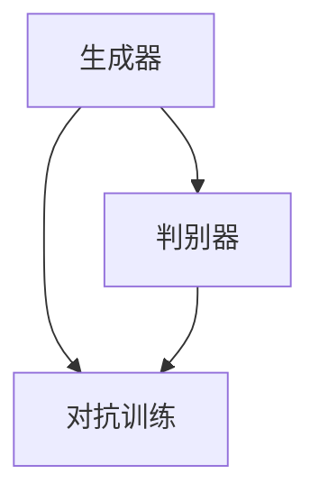
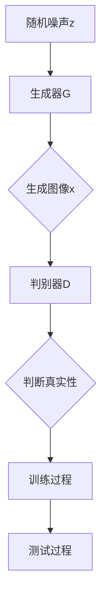
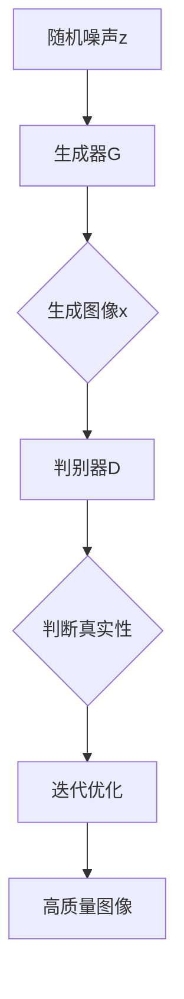
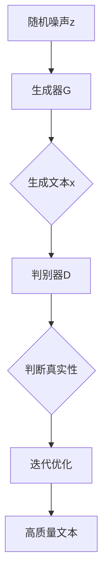
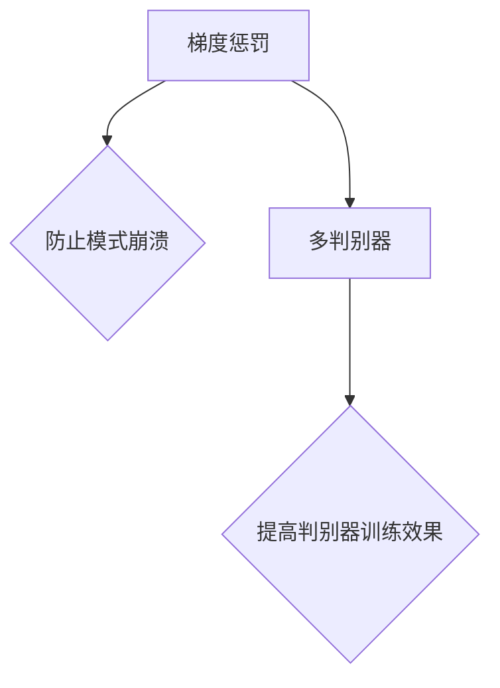
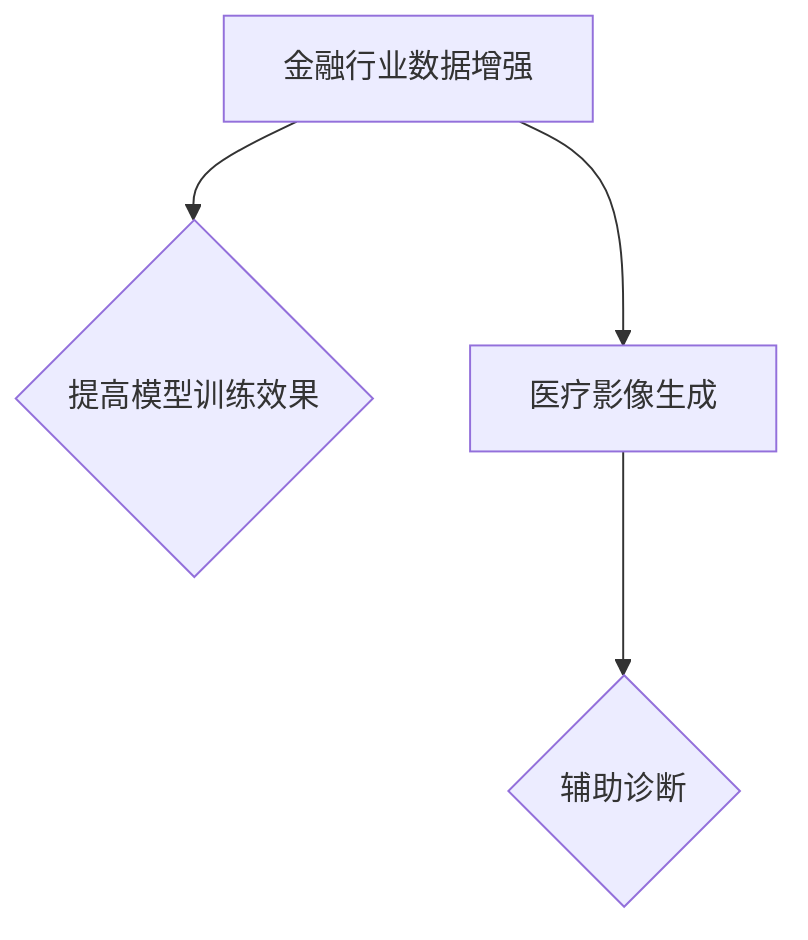

                 

# 企业级生成对抗网络应用：创新产品开发

## 关键词
- 生成对抗网络（GAN）
- 企业级应用
- 图像生成
- 自然语言处理
- 创新产品开发

## 摘要
本文旨在探讨生成对抗网络（GAN）在企业级应用中的潜力，包括其在图像生成和自然语言处理领域的创新应用。通过深入分析GAN的核心原理、算法模型以及在实际案例中的表现，本文将为企业级产品开发提供有价值的指导和最佳实践。

### 第1章：企业级生成对抗网络（GAN）基础

#### 1.1 问题背景与GAN的重要性

随着人工智能技术的快速发展，深度学习在图像处理、自然语言处理等领域取得了显著成果。GAN作为深度学习的一个重要分支，因其强大的生成能力在各类应用中受到广泛关注。

- **问题背景**：在传统的深度学习框架中，数据的获取和处理是一个重要且耗时的过程。GAN通过生成高质量的数据，提高了数据训练的效率和效果，成为解决这一问题的有力工具。
- **GAN的重要性**：GAN不仅能够生成高质量的数据，还能推动深度学习的创新应用，如图像合成、数据增强等。这使得GAN在企业级应用中具有广泛的前景。

#### 1.2 GAN的核心概念与原理

GAN（生成对抗网络）是一种由生成器和判别器组成的深度学习模型。

- **GAN的定义**：GAN由生成器（Generator）和判别器（Discriminator）组成，两者通过对抗训练来提高生成器的生成能力。
- **GAN的原理**：
  - **生成器**：生成器从随机噪声中生成数据，并试图欺骗判别器，使其难以区分生成的数据和真实数据。
  - **判别器**：判别器的任务是区分真实数据和生成数据，其性能直接影响生成器的生成质量。

#### 1.3 GAN的工作流程

GAN的工作流程主要包括训练过程和测试过程。

- **训练过程**：在训练过程中，生成器和判别器交替训练，生成器不断优化，使得生成的数据更接近真实数据，判别器不断优化，提高判断真实与虚假数据的准确率。
- **测试过程**：在测试过程中，使用训练好的生成器生成新的数据，评估其质量。

### 第2章：GAN的算法原理与数学模型

#### 2.1 GAN的数学模型

GAN的数学模型主要包括生成器\( G(z) \)和判别器\( D(x) \)。

- **生成器**：生成器\( G(z) \)从随机噪声\( z \)生成数据\( x \)。
  - $$ G(z) = x $$
- **判别器**：判别器\( D(x) \)判断输入数据\( x \)是真实还是生成。
  - $$ D(x) = P(x \text{ is real}) $$

#### 2.2 GAN的优化目标

GAN的优化目标包括生成器优化目标和判别器优化目标。

- **生成器优化目标**：最大化判别器对其生成的数据的判别结果为假的概率。
  - $$ \max_G \, V(D, G) = \mathbb{E}_{x \sim p_{data}(x)} [\log D(x)] + \mathbb{E}_{z \sim p_z(z)} [\log (1 - D(G(z)))] $$
- **判别器优化目标**：最大化对真实数据和生成数据的判别准确性。
  - $$ \max_D \, V(D) = \mathbb{E}_{x \sim p_{data}(x)} [\log D(x)] + \mathbb{E}_{z \sim p_z(z)} [\log D(G(z))] $$

### 第3章：GAN在图像生成中的应用

#### 3.1 图像生成的基本原理

图像生成是GAN应用的一个重要领域，其基本原理是通过生成器将随机噪声映射为图像。

- **图像生成流程**：首先，生成器从随机噪声中生成初步的图像，然后通过多次迭代优化，逐渐提高图像的质量。

#### 3.2 图像生成的案例

- **案例一：人脸生成**：使用GAN生成高质量的人脸图像，可以为人脸识别、虚拟现实等领域提供重要的数据支持。
- **案例二：艺术风格迁移**：通过GAN将普通图像转换为具有特定艺术风格的图像，如印象派、抽象派等，为艺术创作提供了新的手段。

### 第4章：GAN在自然语言处理中的应用

#### 4.1 自然语言生成的基本原理

自然语言生成是GAN在自然语言处理中的一个重要应用，其基本原理是通过生成器生成符合语法和语义的自然语言文本。

- **自然语言生成流程**：首先，生成器从随机噪声中生成初步的文本，然后通过多次迭代优化，逐渐提高文本的质量。

#### 4.2 自然语言生成的案例

- **案例一：对话系统**：使用GAN生成对话系统中的自然语言回复，可以提高对话系统的自然度和准确性。
- **案例二：文本生成**：使用GAN生成新闻报道、文章摘要等，可以提高文本生成效率和文本质量。

### 第5章：GAN的优化与改进

#### 5.1 GAN的训练难题

GAN的训练过程存在一些难题，如模式崩溃、判别器更新等。

- **模式崩溃**：生成器生成的数据过于简单，缺乏多样性。
- **判别器更新**：生成器和判别器的训练不平衡问题。

#### 5.2 GAN的优化方法

为了解决GAN的训练难题，研究人员提出了一些优化方法。

- **梯度惩罚**：对生成器施加梯度惩罚，防止模式崩溃。
- **多判别器**：使用多个判别器，提高判别器的训练效果。

### 第6章：GAN在企业级应用中的实践

#### 6.1 企业级应用案例

GAN在企业级应用中具有广泛的应用前景，以下是一些案例：

- **案例一：金融行业数据增强**：使用GAN增强金融数据，提高模型训练效果。
- **案例二：医疗影像生成**：使用GAN生成高质量的医疗影像，辅助诊断。

### 第7章：GAN的应用前景与挑战

#### 7.1 GAN的应用前景

GAN在数据增强、艺术创作、自然语言处理等领域具有广泛的应用前景。

- **数据增强**：用于增强训练数据，提高模型性能。
- **艺术创作**：辅助艺术家进行创作，提升创作效率。

#### 7.2 GAN的挑战

GAN的应用也面临着一些挑战，如计算资源消耗、数据隐私问题等。

- **计算资源消耗**：GAN训练过程需要大量的计算资源。
- **数据隐私问题**：GAN在处理敏感数据时，可能涉及到隐私保护问题。

### 第8章：GAN应用的最佳实践与小结

#### 8.1 最佳实践

- **数据预处理**：确保输入数据的多样性。
- **模型调整**：根据应用需求调整生成器和判别器的结构。

#### 8.2 小结

GAN在企业级应用中具有巨大的潜力，但同时也面临着一些挑战。通过最佳实践，可以更好地发挥GAN的优势。

#### 8.3 注意事项

- **数据隐私保护**：在应用GAN时，需注意数据隐私保护。
- **模型验证**：在实际应用中，需对GAN模型进行充分的验证。

#### 8.4 拓展阅读

- **相关书籍**：《生成对抗网络：理论与应用》、《深度学习：gan的视角》
- **论文资源**：搜索相关领域的顶级会议和期刊，如NeurIPS、ICML等。

### 结语

生成对抗网络（GAN）作为深度学习的一个重要分支，在企业级应用中具有广泛的前景。通过本文的探讨，我们深入了解了GAN的核心原理、算法模型以及在实际应用中的表现。未来，随着技术的不断进步，GAN将在更多领域发挥重要作用。希望本文能为读者提供有价值的参考。

### 作者信息

作者：AI天才研究院/AI Genius Institute & 禅与计算机程序设计艺术 /Zen And The Art of Computer Programming

---

## 附录

### 1. GAN的核心概念与联系

| 核心概念 | 定义 | 联系 |
| :--- | :--- | :--- |
| 生成对抗网络（GAN） | 一种由生成器和判别器组成的深度学习模型，通过对抗训练来提高生成器的生成能力。 | 生成器和判别器是GAN的两个主要组成部分，两者相互竞争，共同推动GAN的性能提升。 |
| 生成器（Generator） | 从随机噪声中生成数据，并试图欺骗判别器。 | 生成器的目标是生成尽可能真实的数据，以欺骗判别器，使其难以区分生成的数据和真实数据。 |
| 判别器（Discriminator） | 判断输入数据是真实还是生成。 | 判别器的目标是准确区分真实数据和生成数据，从而提高生成器的生成质量。 |
| 对抗训练（Adversarial Training） | 通过生成器和判别器的对抗训练，不断优化生成器和判别器，提高GAN的整体性能。 | 对抗训练是GAN的核心训练方法，通过生成器和判别器的相互作用，实现模型的优化。 |

### 2. GAN的ER实体关系图

### 3. GAN的算法原理与流程图

### 4. GAN在图像生成中的流程图

### 5. GAN在自然语言处理中的流程图

### 6. GAN的优化方法流程图

### 7. 企业级GAN应用案例的流程图

### 8. GAN应用的前景与挑战

- **前景**：GAN在数据增强、艺术创作、自然语言处理等领域具有广泛的应用前景。
- **挑战**：GAN的训练过程需要大量的计算资源，同时涉及到数据隐私保护问题。

### 9. GAN应用的最佳实践

- **数据预处理**：确保输入数据的多样性。
- **模型调整**：根据应用需求调整生成器和判别器的结构。

### 10. 注意事项

- **数据隐私保护**：在应用GAN时，需注意数据隐私保护。
- **模型验证**：在实际应用中，需对GAN模型进行充分的验证。

### 11. 拓展阅读

- **相关书籍**：《生成对抗网络：理论与应用》、《深度学习：gan的视角》
- **论文资源**：搜索相关领域的顶级会议和期刊，如NeurIPS、ICML等。

---

本文为《企业级生成对抗网络应用：创新产品开发》的附录部分，包括GAN的核心概念与联系、ER实体关系图、算法原理与流程图、图像生成流程图、自然语言处理流程图、优化方法流程图、企业级GAN应用案例流程图、GAN应用的前景与挑战、最佳实践、注意事项以及拓展阅读。通过这些附录，读者可以更深入地了解GAN的核心概念、原理和应用实践。希望对您的研究和开发工作有所帮助。

