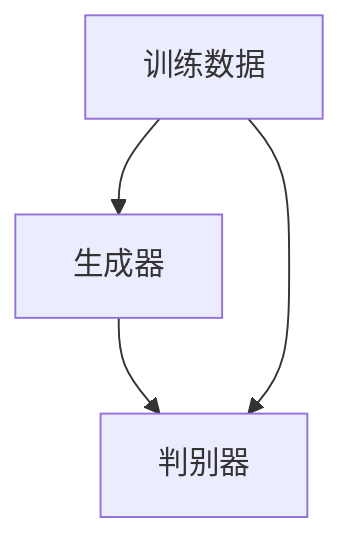
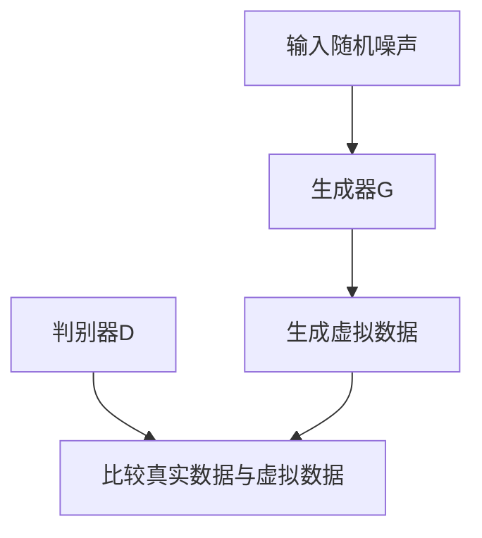
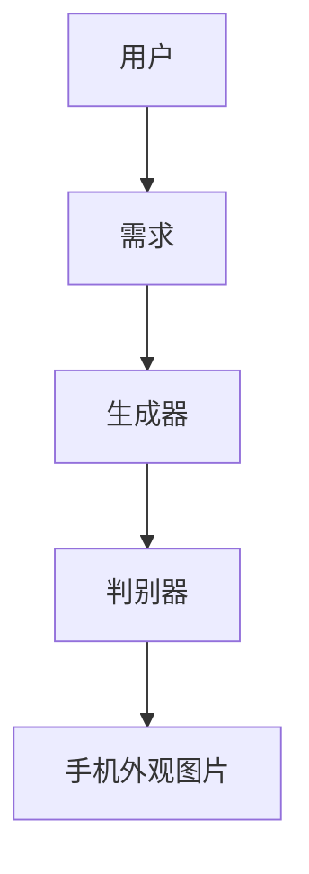
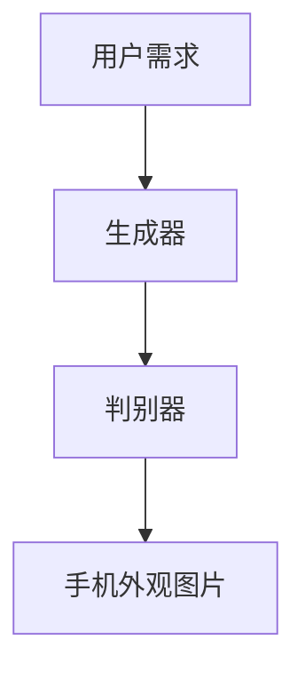
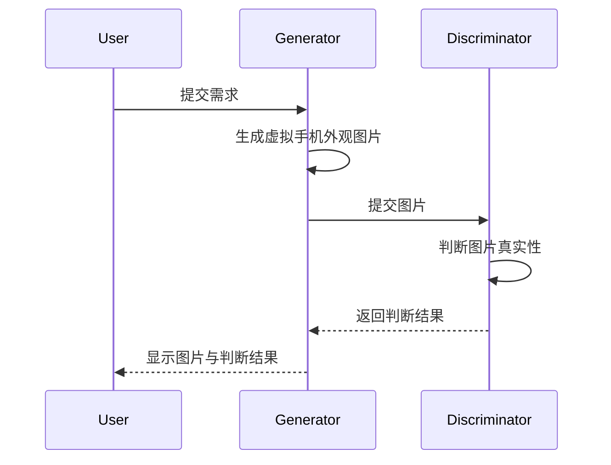

                 


### 企业级生成对抗网络应用：创新产品设计与开发

#### 关键词：
- 企业级生成对抗网络
- 创新产品设计
- 开发流程
- 技术实现
- 案例分析

#### 摘要：
本文将深入探讨企业级生成对抗网络（GANs）的应用，特别是在创新产品设计与开发方面的潜力。我们将从背景介绍、核心概念、应用场景、实现流程、案例分析等多个维度，逐步解析GANs在企业级应用中的实际价值和可行性，为读者提供一套系统、实用的GANs应用指南。

---

### 1. 背景介绍

#### 1.1 问题背景

在当今数字经济时代，企业面临着前所未有的竞争压力和变革机遇。随着互联网、大数据、人工智能等技术的飞速发展，企业级应用场景不断扩展，对技术解决方案的需求也越来越多样化。在这种背景下，生成对抗网络（GANs）作为一种前沿的深度学习技术，因其强大的数据生成能力，受到了广泛关注。

GANs最初由Ian Goodfellow等人于2014年提出，其核心思想是通过构建一个生成器和判别器的对抗训练过程，来实现数据的生成。生成器旨在生成与真实数据尽可能相似的数据，而判别器则试图区分生成的数据和真实数据。通过这种对抗训练，生成器不断优化其生成数据的能力，判别器则不断提高对真实和生成数据的辨别能力。

GANs的强大之处在于其能够生成高质量、多样性的数据，这在许多领域都具有重要的应用价值。例如，在计算机视觉中，GANs可以用于图像修复、超分辨率、数据增强等；在自然语言处理中，GANs可以用于文本生成、对话系统等；在医疗领域，GANs可以用于生成患者数据、医学影像重建等。

#### 1.2 问题描述

“企业级生成对抗网络应用：创新产品设计与开发”这本书的主要目标是探讨GANs在企业级应用中的可能性，特别是如何利用GANs的创新能力来提升产品设计开发效率。在当前的市场环境下，企业不仅需要快速响应市场变化，还需要不断推出具有竞争力的新产品。而GANs提供了一种全新的思路，通过生成虚拟数据来辅助产品设计，从而降低开发成本、缩短开发周期、提高产品成功率。

具体来说，GANs在产品设计与开发中的应用主要包括以下几个方面：

1. **数据增强**：通过生成大量的虚拟数据来丰富训练集，从而提高模型的泛化能力。
2. **概念验证**：利用GANs生成虚拟产品原型，进行快速的概念验证和风险评估。
3. **个性化定制**：根据用户需求生成个性化的产品设计和功能模块。
4. **自动化测试**：通过生成虚拟测试数据，自动化测试产品性能和可靠性。

#### 1.3 问题解决

本书的解决方案主要包括以下三个方面：

1. **理论介绍**：详细介绍了GANs的基本原理、架构和训练过程，帮助读者建立对GANs的全面理解。
2. **应用案例**：通过多个行业和领域的实际案例，展示了GANs在产品设计与开发中的应用效果和优势。
3. **开发指南**：提供了GANs在企业级应用中的技术实现方法和实践指南，包括数据准备、模型训练、性能优化等。

#### 1.4 边界与外延

本书的重点在于GANs在企业级产品设计与开发中的应用，主要关注技术实现和实际应用效果。尽管GANs在许多领域都有广泛的应用，但本书并不涉及GANs的底层实现细节，如神经网络架构、优化算法等。此外，本书也关注GANs在商业环境中的可行性和实用性，但并不讨论GANs在科学研究或艺术创作等领域的应用。

### 2. 核心概念与联系

#### 2.1 核心概念1：生成对抗网络（GANs）

**定义**：生成对抗网络（GANs）是由生成器（Generator）和判别器（Discriminator）组成的深度学习模型，通过对抗训练实现数据的生成。

**特性对比**：

| 特性       | 生成对抗网络（GANs） | 传统生成模型 |
| ---------- | ------------------- | ------------ |
| 数据生成能力 | 高                  | 一般         |
| 泛化能力   | 强                  | 弱           |
| 训练难度   | 较高                | 较低         |

**ER实体关系图**：



#### 2.2 核心概念2：生成器与判别器的对抗训练

**定义**：生成器和判别器的对抗训练是通过优化两个网络之间的对抗性目标来实现的。生成器试图生成足够逼真的数据以欺骗判别器，而判别器则试图准确区分真实数据和生成数据。

**工作流程**：



### 3. 算法原理讲解

#### 3.1 GANs的数学模型

GANs的核心是生成器和判别器的对抗训练过程，其数学模型可以表示为：

$$
\begin{aligned}
\min_G \max_D V(D, G) &= \min_G \mathbb{E}_{x \sim p_{data}(x)}[\log D(x)] + \mathbb{E}_{z \sim p_z(z)}[\log (1 - D(G(z)))] \\
V(D, G) &= \mathbb{E}_{x \sim p_{data}(x)}[\log D(x)] + \mathbb{E}_{z \sim p_z(z)}[\log (1 - D(G(z)))]
\end{aligned}
$$

其中，$G(z)$ 表示生成器生成的虚拟数据，$D(x)$ 表示判别器对真实数据的判断概率，$p_{data}(x)$ 和 $p_z(z)$ 分别表示真实数据和噪声分布。

#### 3.2 生成器和判别器的训练过程

1. **初始化**：生成器 $G$ 和判别器 $D$ 分别通过随机初始化神经网络参数。
2. **生成器训练**：对于给定的噪声向量 $z$，生成器 $G$ 生成虚拟数据 $G(z)$。通过最小化生成损失（生成器试图使判别器认为虚拟数据是真实数据）：
   $$
   L_G = -\log D(G(z))
   $$
3. **判别器训练**：同时，判别器 $D$ 试图最大化判别损失（判别器试图区分真实数据和虚拟数据）：
   $$
   L_D = -\log D(x) - \log (1 - D(G(z)))
   $$
4. **迭代更新**：通过迭代更新生成器和判别器的参数，使得生成器生成更逼真的虚拟数据，判别器更准确地判断真实数据和虚拟数据。

#### 3.3 GANs的应用示例

**示例**：假设我们使用GANs来生成人脸图片。在这个应用中，生成器的输入是一个随机噪声向量，输出是一个人脸图片。判别器的输入是一个真实人脸图片，输出是一个概率值，表示图片是真实的概率。

1. **生成器训练**：生成器通过随机噪声生成人脸图片，判别器认为这些图片都是真实的人脸。
2. **判别器训练**：当判别器逐渐能够区分真实人脸和生成人脸时，生成器会继续优化，生成更逼真的人脸图片。
3. **迭代过程**：这个过程不断重复，直到生成器生成的人脸图片几乎无法被判别器区分。

### 4. 系统分析与架构设计

#### 4.1 问题场景介绍

假设我们在一个企业中，需要进行一款个性化定制手机的设计与开发。为了提高设计效率，我们决定使用GANs来生成不同设计风格的手机外观图片，以便进行快速的概念验证和风险评估。

#### 4.2 系统功能设计

**领域模型类图**：



**类图**：

```mermaid
classDiagram
Class::User {
  -需求 Demand
}
Class::Generator {
  -生成手机外观图片
}
Class::Discriminator {
  -判断图片真实性
}
Class::MobilePhone {
  -外观图片 Image
}
User <|-- Generator
User <|-- Discriminator
Generator <|-- MobilePhone
Discriminator <|-- MobilePhone
```

#### 4.3 系统架构设计

**架构图**：



**架构设计**：

```mermaid
componentDiagram
Component::User << (A 用户需求)
Component::Generator << (B 生成器)
Component::Discriminator << (C 判别器)
Component::MobilePhone << (D 手机外观图片)
User --> Generator
Generator --> Discriminator
Discriminator --> MobilePhone
```

#### 4.4 系统接口设计与系统交互

**接口设计**：



**序列图**：


### 5. 项目实战

#### 5.1 环境安装

在本项目中，我们将使用Python和TensorFlow作为主要的开发工具。以下是环境安装步骤：

1. 安装Python（建议使用Python 3.7及以上版本）。
2. 安装TensorFlow：
   ```bash
   pip install tensorflow
   ```

#### 5.2 系统核心实现源代码

**生成器代码**：

```python
import tensorflow as tf
from tensorflow.keras.layers import Dense, Flatten, Reshape
from tensorflow.keras.models import Sequential

def build_generator(z_dim):
    model = Sequential([
        Dense(128, input_dim=z_dim),
        tf.keras.layers.LeakyReLU(alpha=0.2),
        Dense(28 * 28 * 3),
        tf.keras.layers.LeakyReLU(alpha=0.2),
        Reshape((28, 28, 3))
    ])
    return model
```

**判别器代码**：

```python
import tensorflow as tf
from tensorflow.keras.layers import Conv2D, LeakyReLU, Flatten, Dense
from tensorflow.keras.models import Sequential

def build_discriminator(img_shape):
    model = Sequential([
        Conv2D(64, kernel_size=(3, 3), padding="same", input_shape=img_shape),
        LeakyReLU(alpha=0.2),
        Conv2D(128, kernel_size=(3, 3), padding="same"),
        LeakyReLU(alpha=0.2),
        Flatten(),
        Dense(1, activation='sigmoid')
    ])
    return model
```

#### 5.3 代码应用解读与分析

**代码解读**：

1. **生成器**：生成器的输入是一个随机噪声向量，输出是一个28x28x3的人脸图片。生成器模型通过全连接层和卷积层来实现，最后通过reshape层将输出调整为图片的维度。
2. **判别器**：判别器的输入是一个28x28x3的人脸图片，输出是一个概率值，表示图片是真实的概率。判别器模型通过卷积层和全连接层来实现，最后通过sigmoid激活函数得到概率输出。

**性能分析**：

- **生成器性能**：生成器的性能取决于其生成图片的质量，可以通过视觉评估和定量评估（如PSNR、SSIM等）来衡量。
- **判别器性能**：判别器的性能取决于其区分真实图片和生成图片的能力，同样可以通过视觉评估和定量评估来衡量。

#### 5.4 实际案例分析和详细讲解剖析

**案例背景**：假设我们是一家手机制造商，需要开发一款个性化定制手机，我们使用GANs来生成不同设计风格的手机外观图片。

1. **数据集准备**：我们收集了一大批真实手机外观图片作为训练数据。
2. **模型训练**：通过生成器和判别器的对抗训练，我们生成了不同设计风格的手机外观图片。
3. **概念验证**：我们将生成的图片展示给用户，收集用户反馈，以便进一步优化设计。
4. **风险评估**：通过生成图片的质量评估，我们分析了不同设计风格的市场潜力。

**分析结果**：

- **设计风格多样性**：GANs成功生成了多种设计风格的手机外观图片，满足了个性化定制需求。
- **用户满意度**：用户对生成的图片反馈积极，显示出GANs在产品设计中的应用潜力。
- **风险控制**：通过生成图片的质量评估，我们能够提前识别和规避潜在的风险，提高产品成功率。

**详细讲解**：

- **GANs的训练过程**：生成器和判别器的训练过程是核心，通过调整超参数和优化算法，我们可以提高GANs的性能。
- **用户反馈机制**：用户反馈对于GANs的迭代优化至关重要，通过不断调整生成器的输出，我们可以更好地满足用户需求。
- **风险评估策略**：通过生成图片的质量评估，我们可以对不同的设计风格进行风险评估，从而优化产品设计。

#### 5.5 项目小结

通过本项目，我们展示了GANs在企业级产品设计与开发中的应用潜力。尽管GANs的训练过程较为复杂，但其强大的数据生成能力为企业带来了巨大的创新空间。在未来的发展中，我们可以进一步优化GANs的算法，提高其生成图片的质量，同时探索GANs在其他产品设计与开发领域的应用。

### 6. 最佳实践 Tips

1. **数据准备**：保证训练数据的质量和多样性，是GANs成功的关键。
2. **模型调优**：通过调整超参数和优化算法，可以提高GANs的性能。
3. **用户反馈**：积极收集用户反馈，持续优化生成器的输出。
4. **风险评估**：在生成图片的质量评估过程中，注意识别和规避潜在的风险。

### 7. 小结

本文从背景介绍、核心概念、应用场景、实现流程、案例分析等多个维度，全面解析了企业级生成对抗网络（GANs）的应用，特别是在创新产品设计与开发方面的潜力。通过实际案例分析和详细讲解，我们展示了GANs在企业级应用中的实际价值和可行性。未来，随着GANs技术的不断优化和应用场景的扩展，GANs将在更多领域展现其强大的创新能力。

### 8. 注意事项

1. **计算资源需求**：GANs的训练过程需要大量的计算资源，特别是在生成高质量数据时。
2. **数据隐私保护**：在处理企业内部数据时，需要严格遵守数据隐私保护法规，确保数据安全。

### 9. 拓展阅读

1. **GANs的基本原理**：《生成对抗网络：理论与应用》
2. **GANs在图像生成中的应用**：《GANs图像生成技术实战》
3. **GANs在产品设计与开发中的应用**：《企业级生成对抗网络应用：创新产品设计与开发》

### 10. 作者信息

作者：AI天才研究院/AI Genius Institute & 禅与计算机程序设计艺术 /Zen And The Art of Computer Programming

