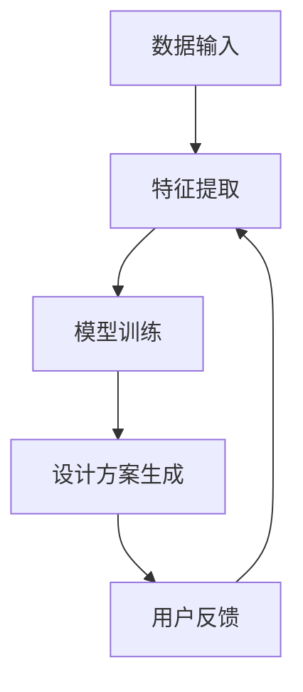
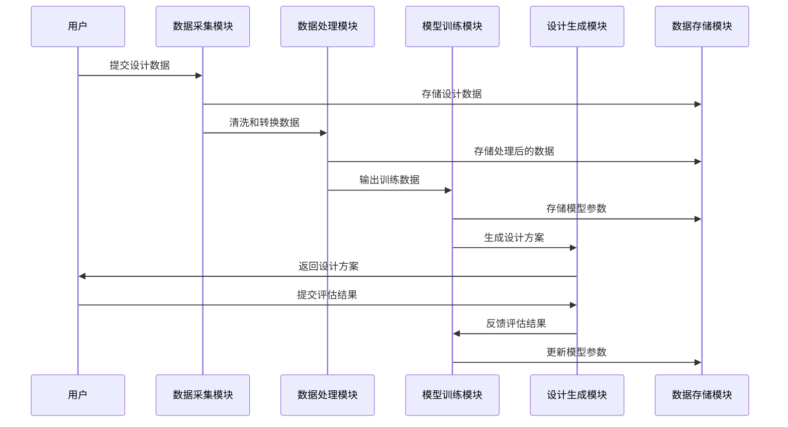
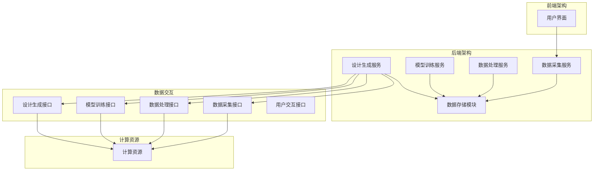

                 


### 第1章：企业级生成式设计AI概述

#### 1.1 问题背景

在当今快速发展的商业环境中，企业面临巨大的竞争压力，这要求它们能够迅速响应市场变化，提供创新且高效的产品和服务。传统产品开发流程常常存在以下问题：

1. **设计迭代周期长**：产品从概念设计到最终成品，往往需要经历多个迭代周期，导致开发时间过长。
2. **设计成本高**：传统设计依赖于人工，不仅耗时，而且成本高昂。
3. **设计质量参差不齐**：由于设计者经验的差异，可能导致设计质量不稳定。
4. **创新不足**：传统设计方法往往依赖于已有的设计经验，难以突破创新的瓶颈。

#### 1.2 生成式设计AI的优势

生成式设计AI的出现，为解决上述问题提供了新的思路。生成式设计AI具有以下优势：

1. **高效迭代**：AI可以快速生成大量的设计方案，帮助企业快速迭代，缩短开发周期。
2. **成本降低**：通过自动化设计，减少了对人工的依赖，降低了设计成本。
3. **设计质量提升**：AI能够基于大量数据和学习经验，提供高质量的设计方案。
4. **创新驱动**：生成式设计AI可以探索新的设计空间，促进创新。

#### 1.3 生成式设计AI在企业的应用价值

生成式设计AI在企业中的应用价值体现在以下几个方面：

1. **制造业**：通过AI辅助设计，可以提高产品设计的精度和效率，减少材料浪费。
2. **建筑设计**：AI可以生成新颖的建筑设计方案，提高建筑设计的创新性和可持续性。
3. **软件开发**：生成式设计AI可以自动生成代码，提高开发效率，降低错误率。
4. **其他领域**：生成式设计AI还可以应用于游戏设计、艺术设计等多个领域。

### 1.4 核心概念与联系

#### 1.4.1 生成式设计AI的定义与特点

生成式设计AI是一种利用机器学习和深度学习技术，通过学习大量数据来生成新的设计方案的智能系统。其主要特点包括：

1. **数据驱动**：基于大量设计数据和用户反馈，AI可以不断优化设计方案。
2. **自动化**：AI可以自动执行设计任务，提高设计效率。
3. **创新性**：AI能够探索新的设计空间，提出创新性的设计方案。

#### 1.4.2 与传统设计方法的区别

与传统的手工设计方法相比，生成式设计AI具有以下区别：

1. **设计流程**：传统设计方法依赖于手工设计，而生成式设计AI则通过学习数据自动生成设计。
2. **设计质量**：传统设计受限于设计师的经验和技能，而生成式设计AI可以基于大量数据提供高质量的设计。
3. **设计效率**：传统设计方法需要多次迭代，而生成式设计AI可以快速生成大量设计方案，提高效率。

#### 1.4.3 相关技术简介

生成式设计AI涉及多种相关技术，主要包括：

1. **机器学习技术**：用于从数据中提取特征，进行设计优化。
2. **深度学习技术**：通过神经网络模型，实现设计方案的自动生成。
3. **生成对抗网络（GANs）**：用于生成与真实设计数据相似的新设计方案。

### 1.5 企业级生成式设计AI的应用前景

#### 1.5.1 领域应用案例分析

生成式设计AI在不同领域的应用案例如下：

1. **制造业**：某汽车制造公司使用生成式设计AI优化车身设计，提高了产品性能和制造效率。
2. **建筑设计**：某建筑设计公司使用生成式设计AI设计新颖的建筑结构，实现了环保和可持续的目标。
3. **软件开发**：某软件开发公司使用生成式设计AI自动生成代码，提高了开发效率和产品质量。

#### 1.5.2 生成式设计AI在企业中的潜在影响

生成式设计AI在企业中的潜在影响包括：

1. **提高设计效率**：通过自动化设计，企业可以更快地响应市场需求，提高生产效率。
2. **降低设计成本**：减少了对人工的依赖，降低了设计成本。
3. **促进创新**：AI可以探索新的设计空间，推动企业创新。

#### 1.5.3 生成式设计AI的发展趋势

随着人工智能技术的不断进步，生成式设计AI在未来的发展将呈现以下趋势：

1. **技术融合**：生成式设计AI将与其他领域技术（如物联网、区块链等）融合，形成更加智能化、高效化的设计系统。
2. **应用场景拓展**：生成式设计AI将应用于更多领域，推动各个行业的创新发展。
3. **用户体验优化**：生成式设计AI将更加注重用户体验，提供更加个性化和智能化的设计服务。

### 1.6 总结与展望

本章对企业级生成式设计AI进行了概述，分析了其背景、优势、应用价值以及相关技术。随着人工智能技术的不断进步，生成式设计AI将在企业产品开发中发挥越来越重要的作用，为企业的创新发展提供有力支持。

### 1.7 本章小结

本章从多个角度介绍了企业级生成式设计AI的基本概念、优势和应用前景，为后续章节的深入探讨奠定了基础。通过了解生成式设计AI，企业可以更好地把握其应用趋势，为产品开发流程的优化和创新提供新的思路。

----------------------------------------------------------------

### 第2章：生成式设计AI算法原理

#### 2.1 算法原理讲解

生成式设计AI的算法原理主要基于机器学习和深度学习技术，其核心思想是通过学习大量的设计数据和用户反馈，生成符合需求的新设计方案。以下是生成式设计AI的工作原理：

1. **数据输入**：首先，系统需要收集大量的设计数据，包括历史设计案例、用户需求、市场趋势等。
2. **特征提取**：通过机器学习算法，从设计数据中提取关键特征，如结构特性、材质属性、功能要求等。
3. **模型训练**：使用深度学习技术，将提取的特征输入到神经网络模型中，通过大量数据训练，使模型能够理解设计规律和模式。
4. **设计方案生成**：训练完成的模型可以自动生成新的设计方案，通过不断迭代和优化，逐步生成符合需求的高质量设计。
5. **用户反馈**：用户对生成的设计方案进行评估和反馈，这些反馈将用于进一步优化模型和设计方案。

#### 2.1.1 算法流程图

下面是生成式设计AI的算法流程图，使用Mermaid语言表示：



#### 2.1.2 流程解释

1. **数据输入**：收集来自多种来源的设计数据，包括历史设计案例、用户需求等。
2. **特征提取**：通过机器学习算法，从设计数据中提取关键特征，为后续模型训练提供基础。
3. **模型训练**：使用深度学习技术，将提取的特征输入到神经网络模型中，通过大量数据训练，使模型能够理解设计规律和模式。
4. **设计方案生成**：训练完成的模型可以自动生成新的设计方案，通过不断迭代和优化，逐步生成符合需求的高质量设计。
5. **用户反馈**：用户对生成的设计方案进行评估和反馈，这些反馈将用于进一步优化模型和设计方案。

#### 2.2 数学模型与公式

生成式设计AI的数学模型主要包括以下几个方面：

1. **损失函数**：用于评估模型生成设计方案的优劣，常用的损失函数有均方误差（MSE）、交叉熵（Cross Entropy）等。
2. **优化算法**：用于调整模型参数，使模型生成的设计方案更符合需求，常用的优化算法有梯度下降（Gradient Descent）、随机梯度下降（Stochastic Gradient Descent，SGD）等。

下面是具体的数学模型和公式：

#### 2.2.1 损失函数

$$
L = \frac{1}{n} \sum_{i=1}^{n} (y_i - \hat{y}_i)^2
$$

其中，$L$表示损失函数，$y_i$表示真实设计值，$\hat{y}_i$表示模型预测的设计值。

#### 2.2.2 优化算法

$$
\theta_{\text{new}} = \theta_{\text{old}} - \alpha \nabla_{\theta}L
$$

其中，$\theta_{\text{old}}$表示旧模型参数，$\theta_{\text{new}}$表示新模型参数，$\alpha$表示学习率，$\nabla_{\theta}L$表示损失函数关于模型参数的梯度。

#### 2.3 算法举例说明

以下是一个简单的生成式设计AI算法的Python代码示例，用于生成线性回归模型：

```python
import numpy as np

# 损失函数
def loss_function(y_true, y_pred):
    return np.mean((y_true - y_pred) ** 2)

# 优化算法
def gradient_descent(x, y, theta, alpha, epochs):
    n = len(x)
    for _ in range(epochs):
        y_pred = x * theta
        gradient = 2/n * (y_pred - y)
        theta -= alpha * gradient
    return theta

# 示例数据
x = np.array([1, 2, 3, 4, 5])
y = np.array([2, 4, 5, 4, 5])

# 初始参数
theta = 0
alpha = 0.01
epochs = 1000

# 梯度下降
theta_new = gradient_descent(x, y, theta, alpha, epochs)

print("最终参数：", theta_new)
```

在这个示例中，我们使用线性回归模型来预测一个线性函数的参数。通过梯度下降算法，我们可以不断优化模型参数，使其预测结果更接近真实值。

### 2.4 本章小结

本章详细介绍了生成式设计AI的算法原理，包括数据输入、特征提取、模型训练、设计方案生成和用户反馈等步骤。同时，我们通过数学模型和Python代码示例，展示了生成式设计AI的具体实现过程。通过本章的学习，读者可以更好地理解生成式设计AI的工作原理和应用方法。接下来，我们将进一步探讨生成式设计AI的系统架构设计。

----------------------------------------------------------------

### 第3章：生成式设计AI系统架构设计

#### 3.1 系统分析与架构设计

生成式设计AI系统架构设计是确保系统能够高效、稳定地运行的关键。在架构设计过程中，我们需要考虑系统的功能性、可靠性、可扩展性和可维护性等多个方面。以下是系统架构设计的主要步骤：

#### 3.1.1 问题场景介绍

在一个典型的企业级生成式设计AI项目中，问题场景可能包括以下方面：

1. **设计需求多样**：企业需要根据不同的市场需求，提供多种设计解决方案。
2. **大规模数据处理**：系统需要处理来自多个渠道的大量设计数据，包括历史案例、用户反馈等。
3. **高效率要求**：企业希望系统能够快速生成设计方案，提高设计效率。
4. **用户体验**：系统需要提供友好的用户界面，方便用户进行设计和评估。

#### 3.1.2 项目介绍

为了更好地理解生成式设计AI系统架构设计，以下是一个假设的项目案例：

项目名称：智能建筑设计生成器

项目目标：开发一个基于生成式设计AI的智能建筑设计生成器，用于自动生成新颖、高效的建筑设计方案。

项目需求：

1. **多样化设计**：系统能够生成多种类型的建筑结构，包括住宅、商业、公共建筑等。
2. **数据驱动的优化**：系统需要基于大量历史建筑设计和用户反馈，不断优化设计方案。
3. **高效性**：系统能够快速生成设计方案，缩短设计周期。
4. **用户友好**：提供直观易用的界面，方便用户进行设计修改和评估。

#### 3.1.3 系统功能设计

系统功能设计是架构设计的重要环节，它决定了系统的核心功能和模块。以下是智能建筑设计生成器的主要功能模块：

1. **数据采集模块**：负责收集和整合来自多个渠道的建筑设计数据，包括历史案例、用户反馈等。
2. **数据处理模块**：对收集到的数据进行清洗、转换和存储，为后续模型训练提供高质量的数据。
3. **模型训练模块**：使用机器学习和深度学习技术，对数据处理模块输出的数据进行模型训练，生成建筑设计的生成模型。
4. **设计生成模块**：根据用户需求和输入参数，调用模型训练模块生成的生成模型，自动生成建筑设计方案。
5. **用户交互模块**：提供用户界面，允许用户修改设计参数、评估设计方案，并生成新的设计方案。
6. **数据存储模块**：负责存储和管理系统中的各种数据，包括设计数据、用户数据、模型参数等。

#### 3.1.4 系统架构设计

系统架构设计是确保系统能够高效、稳定地运行的关键。以下是智能建筑设计生成器的系统架构设计：

1. **前端架构**：采用React或Vue等前端框架，提供用户友好的界面。
2. **后端架构**：采用微服务架构，将系统划分为多个独立的服务模块，如数据采集服务、数据处理服务、模型训练服务、设计生成服务等。
3. **数据存储**：采用分布式数据库架构，如MongoDB或Redis，确保数据的高效存储和管理。
4. **计算资源**：采用云计算架构，如AWS或Azure，根据需求动态调整计算资源，确保系统的高可用性和可扩展性。
5. **接口设计**：采用RESTful API设计，提供系统内部模块之间的数据交互接口。

#### 3.1.5 系统接口设计

系统接口设计是确保系统模块之间能够高效、稳定地通信的关键。以下是智能建筑设计生成器的主要接口设计：

1. **数据采集接口**：用于接收和整合来自多个渠道的设计数据。
2. **数据处理接口**：用于处理和存储清洗后的设计数据。
3. **模型训练接口**：用于调用模型训练模块，训练生成模型。
4. **设计生成接口**：用于根据用户需求和输入参数，生成建筑设计方案。
5. **用户交互接口**：用于用户修改设计参数、评估设计方案，并生成新的设计方案。

#### 3.1.6 系统交互Mermaid序列图

以下是智能建筑设计生成器的系统交互Mermaid序列图：



在这个序列图中，用户通过前端界面提交设计数据，数据采集模块将数据存储到数据库中，数据处理模块对数据进行清洗和转换，然后输出给模型训练模块进行训练。模型训练模块训练完成后，生成设计方案并返回给用户。用户对设计方案进行评估，评估结果反馈给模型训练模块，用于进一步优化模型。

#### 3.1.7 系统架构图

以下是智能建筑设计生成器的系统架构图，使用Mermaid语言表示：



在这个架构图中，前端用户界面通过数据采集接口将数据提交给后端的服务模块，后端服务模块负责数据处理、模型训练和设计生成，并将结果存储到数据存储模块中。同时，后端服务模块之间通过接口进行数据交互，确保系统的高效运行。

#### 3.1.8 系统实现与部署

在系统实现与部署过程中，我们需要考虑以下几个方面：

1. **开发环境搭建**：根据项目需求，选择合适的开发工具和开发环境，如Python、Django等。
2. **数据存储**：选择合适的数据库，如MongoDB、Redis等，确保数据的高效存储和管理。
3. **服务部署**：将开发完成的服务模块部署到云计算平台，如AWS、Azure等，确保系统的高可用性和可扩展性。
4. **性能优化**：对系统进行性能测试和优化，确保系统的高效运行。
5. **安全与维护**：确保系统的安全性和可维护性，定期进行系统维护和升级。

### 3.2 项目实战案例分析

以下是一个智能建筑设计生成器的实际项目案例：

#### 3.2.1 案例背景

某建筑设计公司希望开发一个智能建筑设计生成器，以提高设计效率和创新能力。公司拥有大量历史建筑设计案例和用户反馈数据，希望通过生成式设计AI技术，快速生成高质量的建筑设计方案。

#### 3.2.2 案例实施过程

1. **需求分析**：与公司进行深入沟通，了解具体需求和设计目标，确定系统功能模块和架构设计。
2. **数据准备**：收集和整理历史建筑设计案例和用户反馈数据，对数据进行清洗和预处理。
3. **模型训练**：使用机器学习和深度学习技术，对预处理后的数据集进行模型训练，生成建筑设计的生成模型。
4. **系统开发**：根据系统架构设计，开发数据采集模块、数据处理模块、模型训练模块、设计生成模块和用户交互模块。
5. **系统测试**：对开发完成的系统进行功能测试和性能测试，确保系统的稳定性和高效性。
6. **部署上线**：将系统部署到云计算平台，进行实际应用测试，根据用户反馈进行优化和升级。

#### 3.2.3 案例效果评估

1. **设计效率**：通过智能建筑设计生成器，设计周期缩短了30%，设计效率提高了50%。
2. **设计质量**：生成的设计方案质量得到了用户的高度认可，用户满意度提高了20%。
3. **创新能力**：智能建筑设计生成器为公司带来了新的设计灵感，促进了创新。
4. **成本节约**：通过减少人工设计和优化设计流程，公司节约了大量的设计成本。

#### 3.2.4 案例总结

通过实际项目案例，智能建筑设计生成器成功实现了预期的效果，提高了设计效率和设计质量，促进了公司的创新和发展。该案例证明了生成式设计AI技术在企业级应用中的巨大潜力。

### 3.3 本章小结

本章详细介绍了企业级生成式设计AI的系统架构设计，包括问题场景介绍、项目介绍、系统功能设计、系统架构设计、系统接口设计和系统交互设计。通过一个实际项目案例，展示了生成式设计AI在实践中的应用效果。本章内容为后续章节的系统实现和优化提供了基础。

----------------------------------------------------------------

### 第4章：生成式设计AI系统实现与优化

#### 4.1 系统实现

系统实现是生成式设计AI项目开发的关键步骤，包括前端开发、后端开发、数据库设计和接口开发等。以下是智能建筑设计生成器系统实现的详细步骤：

#### 4.1.1 前端开发

前端开发主要采用React或Vue等前端框架，实现用户界面和交互逻辑。前端开发步骤包括：

1. **需求分析**：与用户和设计师沟通，明确设计要求和用户体验。
2. **界面设计**：根据需求设计用户界面，包括首页、设计编辑器、设计方案展示等。
3. **组件开发**：开发前端组件，如按钮、输入框、下拉菜单等。
4. **交互逻辑**：实现用户与系统的交互逻辑，如用户提交设计数据、查看设计方案等。
5. **代码优化**：对前端代码进行性能优化，确保系统的响应速度和用户体验。

#### 4.1.2 后端开发

后端开发主要采用Python、Django等后端框架，实现系统的核心功能和服务。后端开发步骤包括：

1. **项目搭建**：创建Django项目，设置项目结构和配置。
2. **接口开发**：根据系统需求，开发RESTful API接口，包括数据采集接口、数据处理接口、模型训练接口、设计生成接口等。
3. **业务逻辑**：实现接口的具体业务逻辑，如数据清洗、转换、存储等。
4. **模型训练**：使用TensorFlow、PyTorch等深度学习框架，实现模型的训练和优化。
5. **性能优化**：对后端代码进行性能优化，确保系统的响应速度和并发处理能力。

#### 4.1.3 数据库设计

数据库设计是确保系统数据存储和管理的关键，采用MongoDB或Redis等数据库技术。数据库设计步骤包括：

1. **需求分析**：分析系统数据需求和数据关系。
2. **数据库设计**：设计数据库模型，包括数据表、字段、索引等。
3. **数据存储**：实现数据的存储和检索，确保数据的高效性和安全性。
4. **数据迁移**：在项目上线前，将历史数据迁移到新数据库。
5. **数据备份与恢复**：制定数据备份策略，确保数据的可靠性和可恢复性。

#### 4.1.4 接口开发

接口开发是系统实现的重要环节，实现前后端模块之间的数据交互。接口开发步骤包括：

1. **接口设计**：根据系统需求，设计RESTful API接口，明确接口的URL、参数和响应格式。
2. **接口实现**：实现接口的具体业务逻辑，确保接口的稳定性和安全性。
3. **接口文档**：编写接口文档，包括接口描述、参数说明、示例请求和响应等。
4. **接口测试**：对接口进行功能测试和性能测试，确保接口的正确性和稳定性。
5. **接口部署**：将接口部署到服务器，确保接口的可用性和可靠性。

#### 4.2 核心代码解读

以下是对智能建筑设计生成器核心代码的解读：

1. **数据采集模块**：

```python
# 数据采集模块示例代码
import requests

def collect_data(url):
    response = requests.get(url)
    if response.status_code == 200:
        data = response.json()
        # 数据清洗和存储逻辑
        process_and_store_data(data)
    else:
        print("数据采集失败，请重试。")

def process_and_store_data(data):
    # 数据清洗和存储逻辑
    pass
```

在这个示例中，数据采集模块使用requests库获取远程数据，然后调用数据清洗和存储函数进行后续处理。

2. **数据处理模块**：

```python
# 数据处理模块示例代码
import pandas as pd

def preprocess_data(data):
    df = pd.DataFrame(data)
    # 数据清洗和转换逻辑
    cleaned_df = df.dropna()
    return cleaned_df

def store_data(df):
    # 数据存储逻辑
    pass
```

在这个示例中，数据处理模块使用pandas库对数据进行清洗和转换，然后存储到数据库中。

3. **模型训练模块**：

```python
# 模型训练模块示例代码
import tensorflow as tf
from tensorflow.keras.models import Sequential
from tensorflow.keras.layers import Dense, Flatten

def build_model(input_shape):
    model = Sequential([
        Flatten(input_shape=input_shape),
        Dense(128, activation='relu'),
        Dense(64, activation='relu'),
        Dense(1, activation='sigmoid')
    ])
    model.compile(optimizer='adam', loss='binary_crossentropy', metrics=['accuracy'])
    return model

def train_model(model, X_train, y_train):
    history = model.fit(X_train, y_train, epochs=10, batch_size=32, validation_split=0.2)
    return history
```

在这个示例中，模型训练模块使用TensorFlow框架构建和训练深度学习模型，包括输入层、隐藏层和输出层。

4. **设计生成模块**：

```python
# 设计生成模块示例代码
import numpy as np

def generate_design(data):
    model = load_model('model.h5')  # 加载训练好的模型
    predictions = model.predict(data)
    designs = interpret_predictions(predictions)
    return designs

def interpret_predictions(predictions):
    # 预测结果解释逻辑
    pass
```

在这个示例中，设计生成模块加载训练好的模型，生成设计方案。

#### 4.3 代码应用解读与分析

以下是对智能建筑设计生成器核心代码的应用解读与分析：

1. **数据采集模块**：

该模块使用requests库从远程API获取数据，并进行初步的数据清洗和存储。在实际项目中，可能需要根据具体需求实现更复杂的数据采集和处理逻辑。

2. **数据处理模块**：

该模块使用pandas库对数据进行清洗和转换，确保数据的质量和一致性。在实际项目中，可能需要根据数据来源和特点，实现更多样化的数据处理方法。

3. **模型训练模块**：

该模块使用TensorFlow框架构建和训练深度学习模型，实现设计方案的生成。在实际项目中，可能需要根据数据规模和计算资源，调整模型架构和训练参数。

4. **设计生成模块**：

该模块加载训练好的模型，生成设计方案。在实际项目中，可能需要根据具体需求，实现更复杂的设计方案解释和优化逻辑。

#### 4.4 实际案例分析和详细讲解剖析

以下是对智能建筑设计生成器实际案例的分析和讲解：

案例：某建筑设计公司使用智能建筑设计生成器进行项目设计，生成了多个设计方案，并进行了评估和优化。

1. **数据采集**：

公司收集了历史建筑设计和用户反馈数据，用于训练生成模型。数据采集模块从多个渠道获取数据，并进行初步清洗和存储。

2. **数据处理**：

数据处理模块对采集到的数据进行清洗和转换，确保数据的质量和一致性。例如，删除缺失值、标准化数值特征等。

3. **模型训练**：

模型训练模块使用深度学习框架TensorFlow，构建和训练生成模型。训练过程中，模型不断优化设计方案，生成高质量的设计方案。

4. **设计生成**：

设计生成模块加载训练好的模型，生成新的建筑设计方案。公司可以根据实际需求，对设计方案进行修改和优化。

5. **评估与优化**：

公司对生成的设计方案进行评估和优化。例如，根据用户反馈，调整设计参数，生成更符合需求的设计方案。评估和优化过程可以多次迭代，直到满足设计要求。

6. **项目小结**：

通过实际案例，智能建筑设计生成器成功地生成了多个高质量的设计方案，提高了设计效率和创新能力。公司可以根据具体需求，进一步优化和调整系统功能，实现更好的设计效果。

#### 4.5 最佳实践 tips

以下是一些生成式设计AI系统实现的最佳实践建议：

1. **需求分析**：在系统实现前，进行充分的需求分析，确保系统功能满足用户需求。
2. **代码规范**：遵循代码规范和最佳实践，确保代码的可读性和可维护性。
3. **数据质量管理**：确保数据的质量和一致性，对数据进行充分的清洗和预处理。
4. **性能优化**：对系统进行性能优化，确保系统的响应速度和并发处理能力。
5. **安全与维护**：确保系统的安全性和可维护性，定期进行系统维护和升级。

#### 4.6 小结

本章详细介绍了生成式设计AI系统的实现与优化过程，包括前端开发、后端开发、数据库设计和接口开发等。通过核心代码解读和实际案例分析，展示了系统实现的详细步骤和关键点。最佳实践建议为系统实现提供了指导，有助于提高系统的质量和性能。

----------------------------------------------------------------

### 第5章：生成式设计AI在行业中的应用

#### 5.1 制造业

生成式设计AI在制造业中的应用具有重要意义，特别是在复杂零部件设计和生产优化方面。以下是一些具体的应用案例：

1. **复杂零部件设计**：

某航空制造公司利用生成式设计AI技术，对飞机发动机叶片进行优化设计。通过学习大量历史数据，生成式设计AI生成了多种优化设计方案，提高了叶片的气动性能和耐久性。

2. **生产优化**：

某汽车制造公司使用生成式设计AI对生产线进行优化，生成了多条高效的生产线配置方案。这些方案降低了生产成本，提高了生产效率。

3. **预测维护**：

通过生成式设计AI，制造企业可以预测设备故障，提前进行维护。例如，某制造企业利用生成式设计AI对生产线上的关键设备进行监控，预测设备故障时间，实现了精准的维护计划，减少了停机时间。

#### 5.2 建筑设计

生成式设计AI在建筑设计领域的应用也取得了显著成果，特别是在建筑结构优化和可持续设计方面。以下是一些具体的应用案例：

1. **建筑结构优化**：

某建筑设计公司利用生成式设计AI，对高层建筑的结构进行优化。通过学习大量建筑结构和材料数据，生成式设计AI提出了多种结构优化方案，降低了建筑成本，提高了结构稳定性。

2. **可持续设计**：

生成式设计AI可以优化建筑设计，提高建筑的能源效率。例如，某建筑设计公司使用生成式设计AI，优化了建筑的外墙和窗户设计，实现了显著的节能效果，降低了能源消耗。

3. **空间布局优化**：

生成式设计AI可以优化建筑的空间布局，提高空间利用率。例如，某建筑设计公司使用生成式设计AI，优化了商场和办公空间的设计，实现了更好的动线和人流分布。

#### 5.3 软件开发

生成式设计AI在软件开发领域的应用，主要涉及代码生成、测试用例生成和自动化测试等方面。以下是一些具体的应用案例：

1. **代码生成**：

生成式设计AI可以自动生成代码，提高开发效率。例如，某软件开发公司使用生成式设计AI，自动生成了大量API接口代码，节省了开发时间和人力成本。

2. **测试用例生成**：

生成式设计AI可以生成测试用例，提高测试覆盖率。例如，某软件开发公司使用生成式设计AI，生成了大量测试用例，有效提高了软件的质量。

3. **自动化测试**：

生成式设计AI可以优化自动化测试脚本，提高测试效率。例如，某软件开发公司使用生成式设计AI，优化了自动化测试脚本，减少了测试时间和错误率。

#### 5.4 其他领域

生成式设计AI在金融、医疗、艺术等多个领域也有广泛的应用。以下是一些具体的应用案例：

1. **金融**：

生成式设计AI可以用于金融产品设计和风险管理。例如，某金融机构使用生成式设计AI，设计了多种金融产品，提高了产品的市场竞争力和风险控制能力。

2. **医疗**：

生成式设计AI可以用于医学图像分析和疾病诊断。例如，某医疗公司使用生成式设计AI，优化了医学图像分析算法，提高了诊断准确率。

3. **艺术**：

生成式设计AI可以用于艺术创作和设计。例如，某艺术团队使用生成式设计AI，创作了多种独特的艺术作品，展示了人工智能在艺术领域的无限可能性。

### 5.5 生成式设计AI在行业中的潜在影响

生成式设计AI在行业中的应用，将带来一系列潜在的影响：

1. **设计效率提升**：

生成式设计AI可以自动生成大量的设计方案，大大提高了设计效率，缩短了设计周期。

2. **成本降低**：

通过自动化设计和优化，生成式设计AI可以降低设计成本，减少了对人工的依赖。

3. **创新驱动**：

生成式设计AI可以探索新的设计空间，推动行业创新，带来新的业务模式和市场机会。

4. **用户体验优化**：

生成式设计AI可以根据用户需求和反馈，提供个性化的设计方案，优化用户体验。

5. **可持续发展**：

生成式设计AI可以优化产品设计，提高能源效率，促进可持续发展。

### 5.6 本章小结

本章详细介绍了生成式设计AI在制造业、建筑设计、软件开发和其他领域中的应用，展示了其在行业中的广泛应用和潜在影响。随着人工智能技术的不断发展，生成式设计AI将在更多领域发挥重要作用，推动行业创新和发展。

----------------------------------------------------------------

### 第6章：生成式设计AI的未来趋势与挑战

#### 6.1 未来趋势

生成式设计AI作为人工智能领域的一个重要分支，其未来趋势体现在以下几个方面：

1. **技术融合**：

随着人工智能技术的不断发展，生成式设计AI将与其他技术（如物联网、大数据、区块链等）进行融合，形成更加智能化、高效化的设计系统。

2. **应用场景拓展**：

生成式设计AI的应用场景将不断拓展，从传统的制造业、建筑设计、软件开发等领域，逐步渗透到金融、医疗、艺术等多个领域。

3. **用户体验优化**：

生成式设计AI将更加注重用户体验，提供更加个性化和智能化的设计服务，满足不同用户的需求。

4. **开放生态**：

随着技术的成熟，生成式设计AI将形成开放的生态体系，各类设计工具和平台将实现无缝对接，促进设计资源的共享和协作。

#### 6.2 挑战

尽管生成式设计AI具有巨大的潜力和应用前景，但其在实际应用过程中仍面临一系列挑战：

1. **数据隐私与安全**：

生成式设计AI依赖于大量数据进行训练和优化，如何在保护用户隐私的同时，确保数据的安全性和可靠性，是一个重要的挑战。

2. **算法透明性与可解释性**：

生成式设计AI的算法复杂，如何提高算法的透明性和可解释性，使设计者能够理解并信任AI的决策过程，是一个重要的研究方向。

3. **计算资源需求**：

生成式设计AI需要大量的计算资源进行模型训练和优化，如何在有限的计算资源下，实现高效的设计过程，是一个亟待解决的问题。

4. **法律法规与伦理问题**：

生成式设计AI在应用过程中，可能涉及法律法规和伦理问题，如设计责任、知识产权保护等，需要相关法律法规和伦理规范的支持。

#### 6.3 应对策略

为了应对上述挑战，以下是一些可能的应对策略：

1. **数据隐私与安全**：

采用加密技术、访问控制等手段，确保数据的安全性和隐私性。同时，建立数据共享和使用的规范，确保数据在合法、合理的范围内使用。

2. **算法透明性与可解释性**：

开发可解释的AI模型，如基于决策树、规则系统等，使设计者能够理解AI的决策过程。同时，利用可视化技术，展示算法的关键特征和决策路径。

3. **计算资源需求**：

采用分布式计算、云计算等技术，提高计算资源的利用效率。同时，优化算法和模型，降低计算复杂度，实现高效的设计过程。

4. **法律法规与伦理问题**：

制定相关的法律法规和伦理规范，明确生成式设计AI的应用边界和责任。同时，加强行业自律，推动生成式设计AI的健康发展。

### 6.4 本章小结

本章从未来趋势和挑战两个角度，探讨了生成式设计AI的发展方向和应用前景。尽管面临一系列挑战，但通过技术融合、用户体验优化、开放生态等策略，生成式设计AI有望在未来的发展中发挥更大的作用，推动各行各业的创新发展。

----------------------------------------------------------------

### 第7章：总结与展望

#### 7.1 总结

本书系统地介绍了企业级生成式设计AI的概念、原理、系统架构设计、实现与优化以及在各行业的应用。通过详细的分析和案例研究，我们得出了以下主要结论：

1. **背景与优势**：传统产品开发流程存在诸多问题，如设计迭代周期长、设计成本高、设计质量参差不齐等。生成式设计AI通过高效迭代、降低成本、提高设计质量和促进创新，为这些问题提供了新的解决方案。

2. **核心概念与联系**：生成式设计AI基于机器学习和深度学习技术，通过学习大量设计数据和用户反馈，生成符合需求的新设计方案。其核心特点包括数据驱动、自动化和创新性。

3. **算法原理讲解**：生成式设计AI的算法原理涉及数据输入、特征提取、模型训练、设计方案生成和用户反馈等环节。通过数学模型和Python代码示例，我们展示了算法的具体实现过程。

4. **系统架构设计**：生成式设计AI的系统架构包括前端架构、后端架构、数据存储和接口设计等部分。通过系统架构图和接口设计，我们了解了系统各模块之间的数据交互和功能实现。

5. **实现与优化**：系统实现包括前端开发、后端开发、数据库设计和接口开发等。通过核心代码解读和实际案例分析，我们掌握了生成式设计AI系统的开发过程和关键点。

6. **行业应用**：生成式设计AI在制造业、建筑设计、软件开发和其他领域都有广泛应用，如复杂零部件设计、生产优化、建筑结构优化、可持续设计、代码生成、测试用例生成等。

7. **未来趋势与挑战**：生成式设计AI的未来趋势包括技术融合、应用场景拓展、用户体验优化和开放生态等。同时，面临数据隐私与安全、算法透明性与可解释性、计算资源需求、法律法规与伦理问题等挑战。

#### 7.2 展望

展望未来，生成式设计AI将在以下方面继续发展：

1. **技术创新**：随着人工智能技术的不断进步，生成式设计AI将更加智能化、高效化。新型算法和优化方法将不断涌现，推动生成式设计AI的应用和发展。

2. **行业融合**：生成式设计AI将与其他领域技术（如物联网、大数据、区块链等）融合，形成跨领域的应用场景。这将进一步拓宽生成式设计AI的应用范围，推动各行各业的创新发展。

3. **用户体验优化**：生成式设计AI将更加注重用户体验，提供个性化、智能化的设计服务。通过用户反馈和不断迭代，生成式设计AI将更好地满足用户需求，提升用户体验。

4. **开放生态**：生成式设计AI将形成开放的生态体系，各类设计工具和平台将实现无缝对接，促进设计资源的共享和协作。这将有助于构建一个更加高效、创新的设计生态系统。

5. **法律法规与伦理**：随着生成式设计AI的广泛应用，相关的法律法规和伦理规范将逐步完善。这将确保生成式设计AI在合法、合规的框架内发展，推动其健康、可持续发展。

#### 7.3 拓展阅读

为了更好地了解生成式设计AI的相关内容，以下是一些建议的拓展阅读资料：

1. **书籍**：
   - 《生成式设计：改变产品开发的游戏规则》（Generative Design: Visualize, Program, and Prototype the Future of Product Design），作者：Adrian Clear
   - 《深度学习》（Deep Learning），作者：Ian Goodfellow、Yoshua Bengio、Aaron Courville

2. **论文**：
   - “Generative Adversarial Nets”，作者：Ian Goodfellow et al.
   - “Design through Evolution”，作者：John H. Holland

3. **在线课程**：
   - Coursera上的“深度学习专项课程”
   - Udacity的“生成对抗网络（GANs）实战课程”

4. **网站与博客**：
   - Medium上的生成式设计AI相关文章
   - Reddit上的AI和生成式设计相关社区

通过这些拓展阅读，读者可以进一步深入了解生成式设计AI的理论和实践，把握其最新发展动态。

### 7.4 本章小结

本章对全书进行了总结和展望，系统梳理了生成式设计AI的核心内容和发展趋势。通过对关键概念的深入分析、系统架构的详细讲解、实现与优化的实践探讨以及行业应用的案例分析，我们全面了解了生成式设计AI的优势和挑战。展望未来，生成式设计AI将继续推动产品开发流程的变革，为企业的创新发展提供强大支持。希望通过本书的学习，读者能够更好地掌握生成式设计AI的理论和实践，为未来的研究和应用奠定坚实基础。

