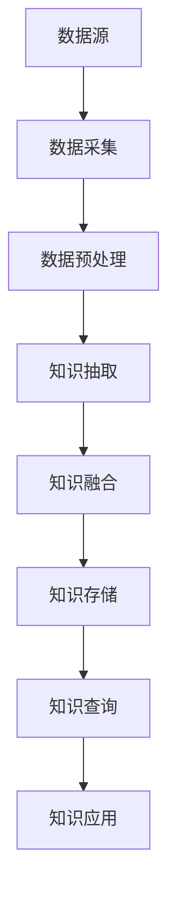

                 

# 《企业级知识图谱应用：构建智能信息网络》

> 关键词：知识图谱、企业应用、智能信息网络、构建与优化

> 摘要：本文将深入探讨企业级知识图谱的构建与应用，从基础知识到实践案例，详细分析知识图谱在企业中的应用场景与价值，旨在为读者提供一套完整的知识图谱构建与优化指南。

## 目录大纲

----------------------------------------------------------------

## 第一部分：基础知识

## 第1章 引言

### 1.1 知识图谱概述

### 1.2 知识图谱在企业中的应用

### 1.3 本书结构与内容安排

## 第2章 知识图谱基础

### 2.1 知识图谱的定义与特点

### 2.2 知识图谱的基本要素

### 2.3 知识图谱的构建方法

### 2.4 知识图谱的存储与查询

## 第3章 知识表示

### 3.1 实体表示

### 3.2 关系表示

### 3.3 属性表示

### 3.4 知识图谱的表示框架

## 第二部分：构建与优化

## 第4章 知识图谱构建

### 4.1 数据采集与清洗

### 4.2 数据预处理

### 4.3 知识抽取

### 4.4 知识融合

### 4.5 知识存储与管理

## 第5章 知识图谱优化

### 5.1 质量评估

### 5.2 语义关联分析

### 5.3 知识更新与维护

### 5.4 知识图谱压缩

## 第6章 知识图谱应用

### 6.1 智能搜索

### 6.2 智能问答

### 6.3 智能推荐

### 6.4 智能决策支持

### 6.5 案例分析

## 第三部分：企业实践

## 第7章 企业级知识图谱应用案例

### 7.1 案例一：企业知识库建设

### 7.2 案例二：供应链协同管理

### 7.3 案例三：客户关系管理

### 7.4 案例四：智能医疗

### 7.5 案例五：金融风控

## 第8章 知识图谱在数字化转型中的作用

### 8.1 数字化转型的趋势与挑战

### 8.2 知识图谱在数字化转型中的应用场景

### 8.3 知识图谱与企业战略的融合

### 8.4 知识图谱在数字化转型中的价值

## 第9章 知识图谱的发展趋势与未来展望

### 9.1 知识图谱技术的演进

### 9.2 知识图谱在行业中的应用拓展

### 9.3 知识图谱与人工智能的深度融合

### 9.4 知识图谱的发展挑战与机遇

## 附录：参考资料与学习资源

### 9.1 参考资料推荐

### 9.2 在线学习资源

### 9.3 知识图谱工具与平台介绍

----------------------------------------------------------------

## 第一部分：基础知识

## 第1章 引言

### 1.1 知识图谱概述

知识图谱是一种语义网络，用于表示实体（人、地点、事物等）及其之间的关系。在企业级应用中，知识图谱被视为构建智能信息网络的核心技术，能够帮助企业更好地理解、管理和利用其数据资产。

知识图谱的特点包括：

- **语义丰富**：通过实体、关系和属性来构建复杂的语义网络，使得数据能够以更直观、更语义化的方式被理解和利用。
- **自适应性强**：能够根据企业的业务需求和数据变化，动态调整和优化知识结构。
- **智能化**：借助机器学习和自然语言处理技术，能够从海量数据中自动提取知识和模式，提供智能决策支持。

### 1.2 知识图谱在企业中的应用

知识图谱在企业中的应用非常广泛，主要包括以下几个方面：

- **智能搜索**：通过知识图谱，实现更精准、更智能的搜索结果，提升用户满意度。
- **智能推荐**：基于知识图谱，实现个性化的推荐系统，提升用户体验和业务价值。
- **智能问答**：通过知识图谱，实现高效的智能问答系统，为用户提供实时、准确的答案。
- **客户关系管理**：利用知识图谱，深入挖掘客户数据，提供个性化的服务和营销策略。
- **供应链管理**：通过知识图谱，实现供应链的协同管理，优化供应链流程，降低成本。

### 1.3 本书结构与内容安排

本书共分为三个部分：

- **第一部分：基础知识**，介绍知识图谱的基本概念、定义、特点及应用场景。
- **第二部分：构建与优化**，详细讲解知识图谱的构建方法、优化策略及应用。
- **第三部分：企业实践**，通过具体案例，展示知识图谱在企业中的实际应用。

接下来，我们将逐步深入探讨知识图谱的基础知识，为后续章节的讨论打下坚实的基础。

## 第2章 知识图谱基础

### 2.1 知识图谱的定义与特点

知识图谱（Knowledge Graph）是一种基于语义网络的数据结构，用于表示实体（如人、地点、事物等）及其之间的关系。知识图谱的核心思想是将现实世界中的各种实体和关系抽象为计算机可以理解和处理的数据模型。

知识图谱的特点包括：

- **结构化**：知识图谱通过实体、关系和属性，将数据组织成一个结构化的网络，使得数据之间能够通过关系进行关联和推理。
- **语义化**：知识图谱不仅仅表示数据本身，更注重数据的语义信息，使得数据能够以更直观、更语义化的方式被理解和利用。
- **自动化**：知识图谱借助机器学习和自然语言处理技术，能够从海量数据中自动提取知识和模式，提供智能决策支持。

### 2.2 知识图谱的基本要素

知识图谱的基本要素包括实体、关系和属性。

#### 实体

实体是知识图谱中的基本元素，可以是人、地点、事物等。例如，在电商领域，实体可以包括商品、用户、订单等。

#### 关系

关系描述了实体之间的关联。例如，在电商领域，关系可以包括购买、评价、推荐等。

#### 属性

属性描述了实体的特征或状态。例如，在电商领域，商品的属性可以包括价格、重量、品牌等。

### 2.3 知识图谱的构建方法

知识图谱的构建方法主要包括数据采集、数据预处理、知识抽取和知识融合。

#### 数据采集

数据采集是知识图谱构建的第一步，主要从各种数据源（如数据库、文本、图片等）中获取数据。

#### 数据预处理

数据预处理包括数据清洗、数据转换和数据去重等，旨在提高数据的准确性和一致性。

#### 知识抽取

知识抽取是从原始数据中提取出实体、关系和属性的过程。常见的方法包括规则抽取、统计学习和深度学习等。

#### 知识融合

知识融合是将来自不同数据源的实体、关系和属性进行整合，形成一个统一的知识图谱。

### 2.4 知识图谱的存储与查询

知识图谱的存储通常使用图数据库，如Neo4j、OrientDB等。图数据库具有高效的图查询能力，能够快速执行复杂的图查询操作。

知识图谱的查询包括点查询、路径查询和子图查询等。点查询是指查找特定实体，路径查询是指查找满足特定条件的实体路径，子图查询是指查找满足特定条件的子图。

## 第3章 知识表示

### 3.1 实体表示

实体是知识图谱中的基本元素，可以是人、地点、事物等。在知识图谱中，实体通常通过唯一标识符进行表示，如URL、ID等。实体的属性用于描述实体的特征或状态，如姓名、年龄、职位等。

实体表示的关键在于如何将现实世界中的复杂实体抽象为计算机可以理解和处理的数据模型。常用的实体表示方法包括：

- **键值对**：通过键值对的方式表示实体的属性，如`{name: "张三", age: 30}`。
- **属性图**：使用图结构表示实体及其属性，如`Node -[属性]-> Node`。

### 3.2 关系表示

关系描述了实体之间的关联，如朋友、同事、购买等。在知识图谱中，关系通常通过两个实体之间的边进行表示。

关系表示的关键在于如何准确地表示实体之间的关系，并能够支持复杂的关系查询。常用的关系表示方法包括：

- **有向边**：使用有向边表示实体之间的关系，如`Node1 -> Node2`。
- **权重边**：为实体之间的关系赋予权重，如`Node1 --[权重]-> Node2`。
- **多重边**：表示实体之间存在多重关系，如`Node1 --[关系A]-- Node2 --[关系B]-- Node3`。

### 3.3 属性表示

属性描述了实体的特征或状态，如价格、重量、品牌等。在知识图谱中，属性通常作为实体的一部分进行表示。

属性表示的关键在于如何有效地组织和管理属性信息，并支持属性的查询和更新。常用的属性表示方法包括：

- **属性列表**：为实体维护一个属性列表，如`{price: 100, weight: 10}`。
- **属性图**：使用图结构表示实体及其属性，如`Node -[属性]-> Node`。

### 3.4 知识图谱的表示框架

知识图谱的表示框架包括实体、关系和属性三个核心要素，以及数据采集、数据预处理、知识抽取和知识融合等构建方法。

一个典型的知识图谱表示框架如下：

通过这个框架，企业可以系统地构建和优化知识图谱，实现智能信息网络的应用。

## 第二部分：构建与优化

## 第4章 知识图谱构建

知识图谱的构建是企业实现智能信息网络的关键步骤。在这一章中，我们将详细探讨知识图谱的构建方法，包括数据采集、数据预处理、知识抽取、知识融合和知识存储与管理。

### 4.1 数据采集

数据采集是知识图谱构建的第一步，其主要目标是获取用于构建知识图谱的原始数据。数据源可以是结构化数据（如数据库）、半结构化数据（如XML、JSON）和非结构化数据（如文本、图片、视频）。

#### 数据采集方法

- **网络爬虫**：通过网络爬虫从互联网上获取公开的数据。
- **API接口**：通过API接口获取第三方平台的数据。
- **数据库连接**：通过数据库连接获取企业内部数据库的数据。
- **手动录入**：对于一些特定的数据，可以通过手动录入的方式获取。

#### 数据采集注意事项

- **数据质量**：采集的数据必须保证质量，包括准确性、完整性和一致性。
- **数据来源**：确保数据的来源可靠，避免采集到不准确或有害的数据。

### 4.2 数据预处理

数据预处理是知识图谱构建的关键步骤，其主要目标是清洗和转换原始数据，使其符合知识图谱构建的要求。数据预处理包括数据清洗、数据转换和数据去重。

#### 数据清洗

- **去除无效数据**：删除重复、错误或无关的数据。
- **数据规范化**：统一数据格式，如日期格式、数字格式等。
- **缺失值处理**：对于缺失的数据，可以采用填充、删除或插值等方法进行处理。

#### 数据转换

- **数据类型转换**：将不同数据类型转换为统一的数据类型，如将文本数据转换为实体和关系。
- **数据映射**：将不同来源的数据映射到统一的数据模型。

#### 数据去重

- **实体去重**：识别并删除重复的实体。
- **关系去重**：识别并删除重复的关系。

### 4.3 知识抽取

知识抽取是从原始数据中提取出实体、关系和属性的过程。知识抽取是构建知识图谱的核心步骤，其方法主要包括规则抽取、统计学习和深度学习。

#### 规则抽取

- **基于规则的方法**：通过预定义的规则，从原始数据中提取出实体、关系和属性。
- **规则学习**：通过机器学习方法自动学习提取规则。

#### 统计学习

- **特征工程**：从原始数据中提取出特征，用于训练分类器或聚类算法。
- **模型训练**：使用特征训练分类器或聚类算法，以识别实体、关系和属性。

#### 深度学习

- **神经网络**：使用神经网络模型，如卷积神经网络（CNN）和循环神经网络（RNN），进行知识抽取。
- **预训练模型**：使用预训练的模型，如BERT和GPT，进行知识抽取。

### 4.4 知识融合

知识融合是将来自不同数据源的实体、关系和属性进行整合，形成一个统一的知识图谱。知识融合主要包括实体融合、关系融合和属性融合。

#### 实体融合

- **基于匹配的方法**：通过预定义的匹配规则，将相同或相似的实体进行合并。
- **基于聚类的方法**：通过聚类算法，将相似实体进行合并。

#### 关系融合

- **基于匹配的方法**：通过预定义的匹配规则，将相同或相似的实体之间的关系进行合并。
- **基于聚类的方法**：通过聚类算法，将相似的关系进行合并。

#### 属性融合

- **基于匹配的方法**：通过预定义的匹配规则，将相同或相似的实体的属性进行合并。
- **基于聚类的方法**：通过聚类算法，将相似的属性进行合并。

### 4.5 知识存储与管理

知识存储与管理是知识图谱构建的最后一个步骤，其主要目标是高效地存储和管理知识图谱，以支持知识查询和应用。

#### 知识存储

- **图数据库**：使用图数据库，如Neo4j和OrientDB，存储知识图谱。
- **关系数据库**：对于一些特殊场景，可以使用关系数据库存储知识图谱。

#### 知识管理

- **知识建模**：通过定义实体、关系和属性的模型，构建知识图谱。
- **知识更新**：定期更新知识图谱，以保持其准确性和时效性。
- **知识查询**：提供高效的知识查询接口，支持复杂的图查询操作。

### 4.6 知识图谱构建案例分析

以下是一个知识图谱构建的案例分析：

#### 项目背景

某电商平台希望通过构建知识图谱，实现智能搜索、推荐和决策支持。

#### 数据采集

采集了电商平台的商品数据、用户数据、订单数据等。

#### 数据预处理

对采集到的数据进行清洗、转换和去重，使其符合知识图谱构建的要求。

#### 知识抽取

使用规则抽取和深度学习方法，从原始数据中提取出商品、用户和订单等实体，以及购买、评价等关系。

#### 知识融合

通过预定义的匹配规则和聚类算法，将相同或相似的实体和关系进行合并，形成一个统一的知识图谱。

#### 知识存储与管理

使用Neo4j图数据库存储知识图谱，并提供高效的查询接口。

通过上述步骤，电商平台成功构建了一个智能信息网络，实现了智能搜索、推荐和决策支持。

## 第5章 知识图谱优化

知识图谱构建完成后，需要对其进行优化，以提高其质量和效率。知识图谱优化主要包括质量评估、语义关联分析、知识更新与维护、知识图谱压缩等方面。

### 5.1 质量评估

知识图谱质量评估是确保知识图谱准确性和一致性的关键步骤。质量评估主要包括以下方面：

- **完整性**：评估知识图谱中实体的数量、关系的数量和属性的数量的完整性。
- **准确性**：评估知识图谱中实体、关系和属性的正确性。
- **一致性**：评估知识图谱中实体、关系和属性的一致性。

常用的质量评估方法包括手动评估和自动化评估。手动评估通常由领域专家进行，而自动化评估则通过编写评估算法实现。

### 5.2 语义关联分析

语义关联分析是指通过分析实体之间的关系，发现潜在的知识关联和模式。语义关联分析可以提高知识图谱的语义丰富性和实用性。

语义关联分析的方法包括：

- **基于规则的语义关联分析**：通过预定义的规则，分析实体之间的关系，发现潜在的知识关联。
- **基于统计的语义关联分析**：通过统计方法，分析实体之间的关系，发现潜在的知识关联。
- **基于机器学习的语义关联分析**：使用机器学习算法，分析实体之间的关系，发现潜在的知识关联。

### 5.3 知识更新与维护

知识更新与维护是知识图谱长期有效性的保障。知识更新包括添加新知识、更新旧知识、删除过时知识等。知识维护则包括数据备份、系统监控、性能优化等方面。

知识更新与维护的方法包括：

- **定期更新**：定期检查知识图谱的准确性、完整性和一致性，进行必要的更新。
- **实时更新**：通过实时监控业务数据，及时更新知识图谱。
- **版本控制**：使用版本控制系统，记录知识图谱的变更历史，方便回滚和追溯。

### 5.4 知识图谱压缩

知识图谱压缩是指通过压缩算法，减小知识图谱的存储空间和查询时间。知识图谱压缩可以提高知识图谱的可扩展性和性能。

知识图谱压缩的方法包括：

- **实体压缩**：通过实体编码，减小实体存储空间。
- **关系压缩**：通过关系编码，减小关系存储空间。
- **属性压缩**：通过属性编码，减小属性存储空间。

常用的知识图谱压缩算法包括哈希编码、字典编码、霍夫曼编码等。

### 5.5 知识图谱优化案例分析

以下是一个知识图谱优化案例分析：

#### 项目背景

某电商平台的知识图谱在数据量和关系复杂性上不断增加，导致查询性能下降，存储空间占用过高。

#### 质量评估

通过手动评估和自动化评估，发现知识图谱中存在大量的冗余数据和不一致关系。

#### 语义关联分析

通过语义关联分析，发现实体之间的关系具有显著的聚类性，可以优化关系存储结构。

#### 知识更新与维护

定期更新知识图谱，确保其准确性和一致性。同时，通过实时监控业务数据，及时更新知识图谱。

#### 知识图谱压缩

采用哈希编码和字典编码，对实体、关系和属性进行压缩，减小存储空间和查询时间。

通过上述优化措施，知识图谱的性能和存储空间得到了显著提升。

## 第6章 知识图谱应用

知识图谱在企业中的应用非常广泛，可以显著提升企业的数据利用效率和业务智能化水平。在这一章中，我们将详细探讨知识图谱在智能搜索、智能问答、智能推荐、智能决策支持和案例分析等方面的应用。

### 6.1 智能搜索

智能搜索是知识图谱在企业应用中的重要场景之一。通过知识图谱，可以实现更精准、更智能的搜索结果，提升用户体验和业务价值。

#### 智能搜索原理

智能搜索的核心在于对用户查询意图的理解和搜索结果的生成。知识图谱通过将实体、关系和属性组织成一个语义网络，可以提供丰富的语义信息，帮助系统更好地理解用户查询意图。

#### 智能搜索实现

实现智能搜索的主要步骤包括：

1. **查询意图分析**：通过自然语言处理技术，分析用户的查询意图。
2. **知识图谱查询**：根据查询意图，从知识图谱中检索相关的实体、关系和属性。
3. **搜索结果生成**：根据查询结果，生成搜索结果页面，提供相关推荐。

### 6.2 智能问答

智能问答是指通过知识图谱，实现高效的智能问答系统，为用户提供实时、准确的答案。

#### 智能问答原理

智能问答的核心在于对用户问题的理解和答案的生成。知识图谱通过将实体、关系和属性组织成一个语义网络，可以为智能问答系统提供丰富的语义信息，帮助系统更好地理解用户问题。

#### 智能问答实现

实现智能问答的主要步骤包括：

1. **问题理解**：通过自然语言处理技术，理解用户的查询意图。
2. **知识图谱查询**：根据问题理解，从知识图谱中检索相关的实体、关系和属性。
3. **答案生成**：根据查询结果，生成问题的答案。

### 6.3 智能推荐

智能推荐是指通过知识图谱，实现个性化的推荐系统，为用户推荐感兴趣的内容、产品或服务。

#### 智能推荐原理

智能推荐的核心在于对用户兴趣的理解和推荐内容的生成。知识图谱通过将实体、关系和属性组织成一个语义网络，可以为智能推荐系统提供丰富的语义信息，帮助系统更好地理解用户兴趣。

#### 智能推荐实现

实现智能推荐的主要步骤包括：

1. **用户兴趣理解**：通过用户行为数据，分析用户的兴趣。
2. **知识图谱查询**：根据用户兴趣，从知识图谱中检索相关的实体、关系和属性。
3. **推荐内容生成**：根据查询结果，生成推荐内容。

### 6.4 智能决策支持

智能决策支持是指通过知识图谱，为企业的决策提供数据支持和智能分析。

#### 智能决策支持原理

智能决策支持的核心在于对业务数据的理解和分析。知识图谱通过将实体、关系和属性组织成一个语义网络，可以为智能决策支持系统提供丰富的语义信息，帮助系统更好地理解业务数据。

#### 智能决策支持实现

实现智能决策支持的主要步骤包括：

1. **业务数据理解**：通过数据分析和挖掘技术，理解业务数据。
2. **知识图谱查询**：根据业务数据，从知识图谱中检索相关的实体、关系和属性。
3. **决策分析**：根据查询结果，进行业务分析和决策。

### 6.5 案例分析

以下是一个知识图谱应用案例分析：

#### 项目背景

某电商企业希望通过知识图谱，提升其搜索、推荐和决策支持能力。

#### 应用场景

- **智能搜索**：通过知识图谱，实现更精准、更智能的搜索结果，提升用户体验和业务价值。
- **智能推荐**：通过知识图谱，实现个性化的推荐系统，提升用户满意度。
- **智能决策支持**：通过知识图谱，为企业的决策提供数据支持和智能分析。

#### 实现步骤

1. **知识图谱构建**：采集电商平台的商品数据、用户数据和订单数据，进行数据预处理、知识抽取和知识融合，构建知识图谱。
2. **智能搜索实现**：通过知识图谱，实现智能搜索功能，提升搜索结果精准度。
3. **智能推荐实现**：通过知识图谱，实现个性化推荐功能，提升用户满意度。
4. **智能决策支持实现**：通过知识图谱，为企业的决策提供数据支持和智能分析。

通过上述应用，该电商企业显著提升了其数据利用效率和业务智能化水平。

## 第三部分：企业实践

## 第7章 企业级知识图谱应用案例

知识图谱在企业中的应用越来越广泛，下面我们将通过几个具体案例，展示知识图谱在企业级应用中的实际效果和实现方法。

### 7.1 案例一：企业知识库建设

#### 案例背景

某大型企业希望在内部构建一个全面的、结构化的知识库，以便员工能够快速找到所需信息，提高工作效率。

#### 应用场景

- **员工信息管理**：通过知识图谱，管理员工的基本信息、工作经历、技能特长等。
- **知识共享**：构建企业内部的知识共享平台，促进员工之间的知识交流。
- **问题排查**：利用知识图谱，快速定位问题并提供解决方案。

#### 实现方法

1. **数据采集**：从企业内部数据库、文档库、邮件系统等渠道采集员工信息。
2. **数据预处理**：对采集到的数据进行清洗、去重、格式统一等预处理。
3. **知识抽取**：通过自然语言处理和机器学习技术，从文本中抽取员工信息、关系和属性。
4. **知识融合**：将来自不同数据源的员工信息进行融合，形成一个统一的知识图谱。
5. **知识存储与管理**：使用图数据库存储和管理知识图谱，提供高效的查询接口。

#### 案例效果

通过知识图谱，企业实现了员工信息的结构化和高效管理，员工能够快速找到所需信息，提高了工作效率。

### 7.2 案例二：供应链协同管理

#### 案例背景

某跨国公司在全球范围内拥有多个供应商和合作伙伴，希望构建一个智能的供应链协同管理平台，以优化供应链流程，降低成本。

#### 应用场景

- **供应商管理**：通过知识图谱，管理供应商的基本信息、产品信息、合作历史等。
- **库存优化**：通过知识图谱，实时监控库存情况，实现智能库存优化。
- **风险预警**：通过知识图谱，发现潜在的风险并提前预警。

#### 实现方法

1. **数据采集**：从企业内部数据库、供应商系统、物流系统等渠道采集供应链相关数据。
2. **数据预处理**：对采集到的数据进行清洗、去重、格式统一等预处理。
3. **知识抽取**：通过自然语言处理和机器学习技术，从文本中抽取供应商信息、关系和属性。
4. **知识融合**：将来自不同数据源的供应链信息进行融合，形成一个统一的知识图谱。
5. **知识存储与管理**：使用图数据库存储和管理知识图谱，提供高效的查询接口。

#### 案例效果

通过知识图谱，企业实现了供应链的智能协同管理，优化了供应链流程，降低了库存成本，提高了供应链的透明度和效率。

### 7.3 案例三：客户关系管理

#### 案例背景

某大型电信运营商希望通过知识图谱，提升其客户关系管理能力，提供个性化的服务和营销策略。

#### 应用场景

- **客户信息管理**：通过知识图谱，管理客户的基本信息、消费记录、偏好等。
- **个性化推荐**：通过知识图谱，为不同客户提供个性化的产品和服务。
- **客户行为分析**：通过知识图谱，分析客户行为，预测客户需求。

#### 实现方法

1. **数据采集**：从企业内部数据库、CRM系统、网站日志等渠道采集客户信息。
2. **数据预处理**：对采集到的数据进行清洗、去重、格式统一等预处理。
3. **知识抽取**：通过自然语言处理和机器学习技术，从文本中抽取客户信息、关系和属性。
4. **知识融合**：将来自不同数据源的客户信息进行融合，形成一个统一的知识图谱。
5. **知识存储与管理**：使用图数据库存储和管理知识图谱，提供高效的查询接口。

#### 案例效果

通过知识图谱，企业实现了客户信息的结构化和高效管理，为不同客户提供个性化的服务和营销策略，提升了客户满意度和忠诚度。

### 7.4 案例四：智能医疗

#### 案例背景

某医疗机构希望通过知识图谱，提升其医疗服务质量，实现精准医疗和智能诊断。

#### 应用场景

- **患者信息管理**：通过知识图谱，管理患者的基本信息、病历、检查结果等。
- **疾病知识库**：构建疾病知识库，为医生提供诊断和治疗方案参考。
- **智能诊断辅助**：通过知识图谱，辅助医生进行疾病诊断和治疗。

#### 实现方法

1. **数据采集**：从医疗机构内部数据库、电子病历系统等渠道采集患者信息和疾病知识。
2. **数据预处理**：对采集到的数据进行清洗、去重、格式统一等预处理。
3. **知识抽取**：通过自然语言处理和机器学习技术，从文本中抽取患者信息、关系和属性，以及疾病知识。
4. **知识融合**：将来自不同数据源的患者信息和疾病知识进行融合，形成一个统一的知识图谱。
5. **知识存储与管理**：使用图数据库存储和管理知识图谱，提供高效的查询接口。

#### 案例效果

通过知识图谱，医疗机构实现了患者信息的结构化和高效管理，为医生提供疾病知识库和智能诊断辅助，提升了医疗服务质量和效率。

### 7.5 案例五：金融风控

#### 案例背景

某金融公司希望通过知识图谱，提升其风险防控能力，实现精准的风险识别和管理。

#### 应用场景

- **客户信息管理**：通过知识图谱，管理客户的基本信息、交易记录、信用状况等。
- **风险识别**：通过知识图谱，识别潜在的风险客户，提供风控策略。
- **风险预警**：通过知识图谱，实时监控客户行为，提前预警风险。

#### 实现方法

1. **数据采集**：从金融公司内部数据库、第三方数据源等渠道采集客户信息和交易数据。
2. **数据预处理**：对采集到的数据进行清洗、去重、格式统一等预处理。
3. **知识抽取**：通过自然语言处理和机器学习技术，从文本中抽取客户信息、关系和属性，以及风险特征。
4. **知识融合**：将来自不同数据源的客户信息和交易数据进行融合，形成一个统一的知识图谱。
5. **知识存储与管理**：使用图数据库存储和管理知识图谱，提供高效的查询接口。

#### 案例效果

通过知识图谱，金融公司实现了客户信息的结构化和高效管理，准确识别潜在风险客户，提升了风险防控能力和业务安全性。

## 第8章 知识图谱在数字化转型中的作用

随着数字化转型的深入，知识图谱在企业中的应用越来越广泛。知识图谱不仅能够帮助企业更好地管理和利用其数据资产，还能够推动企业的数字化转型，提升企业的核心竞争力。

### 8.1 数字化转型的趋势与挑战

数字化转型是指利用数字技术来重塑企业的业务模式、流程和组织结构。当前，数字化转型呈现出以下几个趋势：

- **数据驱动的决策**：企业越来越依赖数据来驱动决策，实现精细化管理和智能化运营。
- **云计算和大数据**：云计算和大数据技术的发展，为企业的数字化转型提供了强大的技术支撑。
- **人工智能和机器学习**：人工智能和机器学习技术的应用，使得企业能够实现更智能的数据分析和预测。

与此同时，数字化转型也面临以下挑战：

- **数据质量**：数据质量是数字化转型的基础，如何保证数据的准确性、完整性和一致性是一个重要问题。
- **数据安全**：数据安全是数字化转型的重要保障，如何确保数据的安全性和隐私性是关键。
- **人才短缺**：数字化转型需要大量的数字技术人才，如何吸引和培养这类人才是企业面临的挑战。

### 8.2 知识图谱在数字化转型中的应用场景

知识图谱在数字化转型中具有广泛的应用场景，主要包括以下几个方面：

- **客户关系管理**：通过知识图谱，企业可以更深入地了解客户需求和行为，提供个性化的服务和体验，提升客户满意度和忠诚度。
- **供应链管理**：通过知识图谱，企业可以实现对供应链的全面监控和管理，优化供应链流程，降低成本，提高效率。
- **智能搜索与推荐**：通过知识图谱，企业可以实现更精准、更智能的搜索和推荐系统，提升用户体验和业务价值。
- **风险管理与合规**：通过知识图谱，企业可以更准确地识别和管理风险，确保业务合规。
- **智能决策支持**：通过知识图谱，企业可以实现对业务数据的深入分析和挖掘，为决策提供数据支持和智能分析。

### 8.3 知识图谱与企业战略的融合

知识图谱在企业战略中的融合，是实现企业数字化转型的重要途径。以下是如何将知识图谱融入企业战略的一些思考：

- **明确战略目标**：首先，企业需要明确其数字化转型和知识图谱的应用目标，例如提升客户满意度、降低运营成本、提升业务效率等。
- **构建知识图谱**：根据战略目标，构建适合企业业务场景的知识图谱，确保知识图谱能够支持企业的业务需求。
- **数据驱动决策**：利用知识图谱，实现数据驱动的决策，通过对业务数据的深入分析和挖掘，为企业的战略决策提供数据支持。
- **持续优化**：数字化转型是一个持续的过程，企业需要不断优化知识图谱，确保其能够适应业务变化和技术进步。

### 8.4 知识图谱在数字化转型中的价值

知识图谱在数字化转型中具有巨大的价值，主要包括以下几个方面：

- **提升数据利用效率**：知识图谱能够将海量数据组织成一个结构化的语义网络，使得数据能够以更直观、更语义化的方式被理解和利用，提升数据利用效率。
- **增强业务洞察力**：知识图谱通过对业务数据的深入分析和挖掘，可以为企业提供更深入的业务洞察，助力企业实现数据驱动决策。
- **优化业务流程**：知识图谱能够帮助企业优化业务流程，提升业务效率和运营效果。
- **提升用户体验**：知识图谱可以实现智能搜索、推荐和问答等功能，提升用户体验和满意度。
- **增强竞争力**：知识图谱能够帮助企业更好地理解客户需求、优化供应链管理、提升风险管理能力等，增强企业的核心竞争力。

### 8.5 知识图谱在数字化转型中的最佳实践

为了充分发挥知识图谱在数字化转型中的作用，企业可以遵循以下最佳实践：

- **构建全局视野**：企业需要从全局视角出发，明确知识图谱在企业数字化转型中的战略地位，确保知识图谱能够支持企业的长期发展战略。
- **数据质量优先**：数据质量是知识图谱应用的基础，企业需要确保数据的准确性、完整性和一致性。
- **持续迭代优化**：知识图谱是一个动态的过程，企业需要持续优化知识图谱，以适应业务变化和技术进步。
- **跨部门协作**：知识图谱的应用涉及到企业的多个部门和业务领域，需要跨部门的协作和配合。
- **人才发展**：知识图谱的应用需要专业的技术人才，企业需要注重人才培养和引进。

通过遵循这些最佳实践，企业可以更好地利用知识图谱，实现数字化转型，提升业务效率和竞争力。

## 第9章 知识图谱的发展趋势与未来展望

知识图谱作为构建智能信息网络的核心技术，正随着技术的不断进步而不断发展。在未来，知识图谱将在更多行业和应用场景中得到广泛应用，并带来深刻的变革。

### 9.1 知识图谱技术的演进

知识图谱技术的演进可以分为以下几个阶段：

- **第一阶段：数据结构化**：这一阶段的重点是将非结构化数据转化为结构化数据，通过建立实体、关系和属性等基本要素，为数据赋予语义信息。
- **第二阶段：语义关联**：这一阶段的重点是建立实体之间的语义关联，通过关系和属性，将实体组织成一个语义网络，实现数据的关联和推理。
- **第三阶段：智能化**：这一阶段的重点是将知识图谱与人工智能技术相结合，利用机器学习、自然语言处理等手段，实现知识自动提取和智能应用。

### 9.2 知识图谱在行业中的应用拓展

随着技术的进步，知识图谱在各个行业中的应用不断拓展，主要包括：

- **金融行业**：知识图谱在金融行业中的应用，包括客户关系管理、风险管理、投资决策支持等，通过构建金融知识图谱，实现精准营销、风险控制等。
- **医疗行业**：知识图谱在医疗行业中的应用，包括患者管理、疾病诊断、药物研发等，通过构建医疗知识图谱，实现智能医疗和精准医疗。
- **零售行业**：知识图谱在零售行业中的应用，包括供应链管理、智能推荐、客户关系管理等，通过构建零售知识图谱，实现精细化运营和个性化服务。
- **物流行业**：知识图谱在物流行业中的应用，包括供应链协同、运输管理、库存优化等，通过构建物流知识图谱，实现物流全流程的智能化管理。

### 9.3 知识图谱与人工智能的深度融合

知识图谱与人工智能的深度融合，将进一步提升知识图谱的应用价值和效率。以下是一些关键领域：

- **自然语言处理**：知识图谱可以提供丰富的语义信息，帮助自然语言处理技术更好地理解和生成语言。
- **智能问答**：知识图谱可以为智能问答系统提供知识库，实现更精准、更智能的问答。
- **推荐系统**：知识图谱可以提供用户和物品的属性和关系，实现更个性化的推荐。
- **智能决策支持**：知识图谱可以提供数据分析和预测，为企业的决策提供支持。

### 9.4 知识图谱的发展挑战与机遇

知识图谱的发展面临以下挑战和机遇：

- **数据质量**：数据质量是知识图谱应用的基础，如何保证数据的准确性、完整性和一致性是关键挑战。
- **数据隐私**：随着数据隐私保护意识的提高，如何保护用户数据隐私成为重要议题。
- **算法效率**：知识图谱的查询和计算效率是影响其应用效果的重要因素，如何提高算法效率是关键挑战。
- **跨领域融合**：知识图谱在不同领域的应用具有较大的差异性，如何实现跨领域的融合和应用是重要机遇。

总之，知识图谱作为构建智能信息网络的核心技术，正随着技术的不断进步而不断发展。在未来，知识图谱将在更多行业和应用场景中得到广泛应用，带来深刻的变革。

## 附录：参考资料与学习资源

### 9.1 参考资料推荐

1. **《知识图谱：技术、方法与应用》** - 本书详细介绍了知识图谱的基本概念、构建方法和应用案例，适合对知识图谱感兴趣的读者。
2. **《人工智能：一种现代方法》** - 本书涵盖了人工智能的基本理论和应用，有助于理解知识图谱与人工智能的深度融合。
3. **《图数据库实战》** - 本书介绍了图数据库的基本原理和操作方法，对知识图谱的存储与管理具有重要参考价值。

### 9.2 在线学习资源

1. **Coursera** - 提供了多门关于知识图谱和人工智能的课程，涵盖基础知识到高级应用。
2. **Udacity** - 提供了针对知识图谱和人工智能的在线课程和项目，适合不同层次的学员。
3. **edX** - 多个高校提供了关于知识图谱和人工智能的在线课程，内容全面，适合自学。

### 9.3 知识图谱工具与平台介绍

1. **Neo4j** - 一个高性能的图数据库，广泛用于知识图谱的存储和管理。
2. **OrientDB** - 一个开源的多模型数据库，支持图数据结构，适合知识图谱应用。
3. **Alibaba Cloud Graph** - 阿里云提供的知识图谱服务，支持大规模知识图谱的构建和应用。

通过这些参考资料和学习资源，读者可以系统地学习和掌握知识图谱的基本概念、构建方法和应用技巧。

## 作者信息

作者：AI天才研究院/AI Genius Institute & 禅与计算机程序设计艺术 /Zen And The Art of Computer Programming

