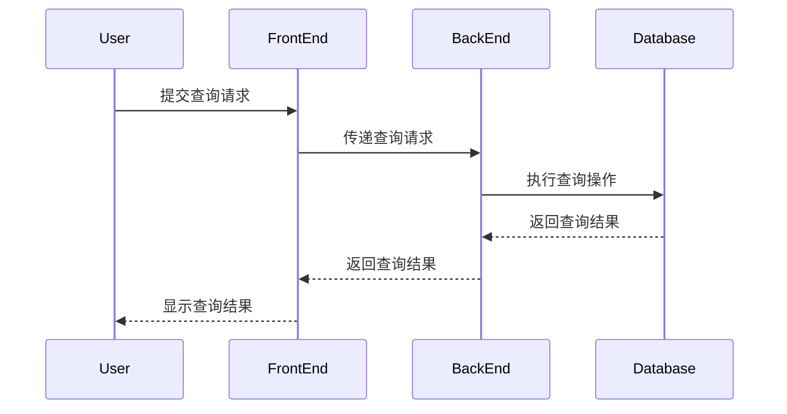
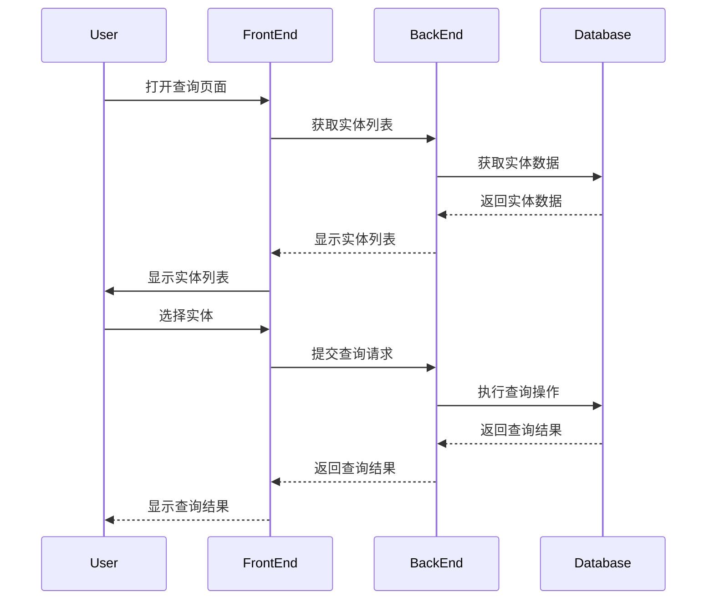

                 


### 背景介绍

**知识图谱的概念与发展历程**

知识图谱（Knowledge Graph）是一种用于结构化表示实体及其相互关系的数据模型。它起源于2006年Google公司的“知识图谱”项目，旨在通过整合海量信息资源，构建一个语义丰富、结构化的知识网络，以支持更智能的搜索引擎服务。自那时以来，知识图谱的概念和技术不断演进，逐渐从互联网领域扩展到各个行业。

知识图谱的核心在于将无结构或半结构的数据转化为有结构的知识，通过实体（Entity）、属性（Property）、关系（Relationship）三个核心概念，实现信息的语义关联与推理。这种结构化的知识表示方式不仅有助于提高数据查询的效率，还能支持复杂的信息检索和知识推理任务。

**知识图谱在组织中的作用**

在企业中，知识图谱的应用价值主要体现在以下几个方面：

1. **数据整合与统一视图**：知识图谱通过整合不同来源的数据，提供统一的数据视图，帮助企业用户快速定位所需信息，提高数据利用效率。
   
2. **智能搜索与推荐**：知识图谱支持基于语义的搜索，能够理解用户查询背后的意图，提供更精准的搜索结果和个性化推荐。

3. **决策支持与业务优化**：知识图谱中的实体和关系信息可以用于业务流程优化、市场分析、风险控制等决策支持任务。

4. **知识传承与创新**：知识图谱将组织的隐性知识转化为显性知识，实现知识的系统化管理和传承，促进创新和发展。

**企业级知识图谱构建的背景**

随着互联网和大数据技术的快速发展，企业积累了海量的数据资源。然而，如何有效地管理和利用这些数据，成为企业面临的重大挑战。知识图谱作为一种先进的数据处理技术，为企业提供了有效的解决方案。企业级知识图谱的构建，不仅需要技术上的创新和突破，还需要跨部门的协作和业务需求的深度挖掘。

知识图谱的构建涉及数据采集、清洗、处理、存储和查询等多个环节，需要综合运用自然语言处理、数据挖掘、图数据库等技术。同时，企业级知识图谱需要具备高可靠性、高性能、可扩展性等特点，以适应企业不断变化的需求。

**面临的挑战**

1. **数据质量**：企业数据来源广泛，数据质量参差不齐，需要有效的数据清洗和预处理策略。
   
2. **数据多样性**：企业数据类型多样，包括结构化、半结构化和非结构化数据，构建知识图谱需要全面考虑数据的异构性。

3. **数据处理效率**：知识图谱的构建和查询过程涉及大量计算，需要高效的算法和优化策略。

4. **业务集成**：知识图谱的构建需要与企业的业务流程和信息系统深度集成，实现数据的实时更新和动态调整。

5. **安全与隐私**：在构建和使用知识图谱的过程中，需要确保数据的安全性和用户隐私的保护。

### 总结

企业级知识图谱构建是一项复杂且系统化的工程，它不仅涉及到先进技术的应用，还需要深入理解和挖掘企业的业务需求。通过构建知识图谱，企业可以实现对海量数据的深度挖掘和智能分析，提高业务决策的效率和质量。在接下来的章节中，我们将进一步探讨知识图谱的核心概念、构建算法、系统架构和实际应用，帮助读者全面了解企业级知识图谱构建的关键技术和实践方法。让我们一起深入探讨，探寻知识图谱的无限可能。

---

### 核心概念与联系

**知识图谱的核心概念**

知识图谱的核心概念包括实体（Entity）、属性（Property）、关系（Relationship）和值（Value）。这些概念共同构成了知识图谱的基本元素和结构，下面我们将逐一介绍。

1. **实体（Entity）**：实体是知识图谱中的基本单元，它代表了现实世界中的各种对象，如人、地点、组织、事物等。例如，“张三”、“北京”、“阿里巴巴”等都是实体。

2. **属性（Property）**：属性描述了实体的一些特征或属性，它连接实体和值的桥梁。例如，“张三”的“年龄”属性可以取值为“30”，“北京”的“人口”属性可以取值为“2000万”。

3. **关系（Relationship）**：关系描述了实体之间的相互关系，它可以是层次关系、关联关系、依赖关系等。例如，“张三”是“阿里巴巴”的“员工”，“北京”是“中国”的“首都”。

4. **值（Value）**：值是属性的具体取值，可以是数字、字符串、日期等。例如，“张三”的“年龄”属性的值是“30”，“北京”的“人口”属性的值是“2000万”。

**知识图谱的ER实体关系图**

为了更好地理解知识图谱的结构，我们可以利用Mermaid绘制ER实体关系图，直观地展示实体、属性和关系之间的联系。

```mermaid
graph TD
    A[实体1] --> B[属性1]
    A --> C[属性2]
    B --> D[值1]
    C --> E[值2]
    F[实体2] --> G[属性3]
    F --> H[属性4]
    G --> I[值3]
    H --> J[值4]
    A--<关系1>-> F
    F--<关系2>-> A
```

在上面的ER实体关系图中：

- A和F是实体，分别表示“实体1”和“实体2”。
- B、C、G、H是属性，分别表示“属性1”、“属性2”、“属性3”和“属性4”。
- D、E、I、J是值，分别表示“值1”、“值2”、“值3”和“值4”。
- 关系1和关系2描述了实体之间的关联。

**属性特征对比**

为了更清晰地展示属性特征，我们可以创建一个表格来对比不同属性的类型、取值范围和描述。

| 属性类型 | 描述 | 取值范围 |  
| :--- | :--- | :--- |  
| 数字型 | 描述实体的数量特征 | 整数、浮点数 |  
| 字符串型 | 描述实体的文本特征 | 单引号或双引号包围的文本 |  
| 日期型 | 描述实体的时间特征 | 标准日期格式，如YYYY-MM-DD |  
| 列表型 | 描述实体的多个取值 | 用逗号分隔的多个值 |  

通过上述表格，我们可以看到不同类型的属性在知识图谱中的表现和用途，这有助于我们在构建知识图谱时进行属性设计。

**总结**

通过以上内容，我们对知识图谱的核心概念有了更深入的理解，并利用Mermaid成功绘制了ER实体关系图。这些核心概念和结构是构建企业级知识图谱的基础，为后续的算法讲解和系统设计提供了必要的理论支持。接下来，我们将进一步探讨知识图谱构建的算法原理，帮助读者了解具体的技术实现方法。敬请期待！

---

### 算法原理讲解

知识图谱的构建涉及到多种算法，这些算法主要分为抽取式和生成式两大类。下面我们将详细介绍这两种算法的基本原理、流程和常见应用场景。

**抽取式知识图谱构建算法**

抽取式算法（Extractive Knowledge Graph Construction Algorithms）的基本思想是从已有的数据源中直接抽取实体、关系和属性，从而构建知识图谱。这一类算法通常依赖于自然语言处理（NLP）和图论技术。

**基本原理与流程**

1. **实体识别**：通过命名实体识别（Named Entity Recognition, NER）技术，从文本中抽取出实体。例如，从新闻报道中提取出人名、地名、组织名等。

2. **关系抽取**：通过关系抽取（Relationship Extraction）技术，识别实体之间的相互关系。例如，从句子“张三在北京工作”中抽取“张三”和“北京”之间的“工作”关系。

3. **属性抽取**：通过属性抽取（Attribute Extraction）技术，获取实体的属性信息。例如，从文本中提取出实体的年龄、性别、出生日期等属性。

4. **图谱构建**：将抽取出的实体、关系和属性组织成图结构，形成知识图谱。

**常见算法介绍**

- **基于规则的方法**：通过预定义的规则，从文本中直接抽取知识。例如，利用正则表达式或模式匹配进行实体和关系的识别。

- **基于统计的方法**：利用机器学习模型，如条件随机场（CRF）和卷积神经网络（CNN），从文本数据中学习实体和关系的抽取规则。

- **基于深度学习的方法**：利用深度学习模型，如BERT、GPT等，通过端到端的方式实现实体和关系的抽取。

**应用场景**

- **文本挖掘**：从大量文本中抽取知识，构建企业内部的知识库。

- **信息检索**：提高搜索引擎的检索效率和准确性，支持基于语义的搜索。

**生成式知识图谱构建算法**

生成式算法（Generative Knowledge Graph Construction Algorithms）的基本思想是通过生成模型，自动生成实体、关系和属性，从而构建知识图谱。这类算法通常依赖于图生成和图嵌入技术。

**基本原理与流程**

1. **图生成模型**：通过生成模型，生成图谱中的实体和关系。例如，使用图生成模型生成社交网络图。

2. **属性生成**：通过属性生成模型，为实体生成相应的属性。例如，使用生成对抗网络（GAN）生成实体的属性值。

3. **图谱融合**：将生成的实体、关系和属性整合成知识图谱，并对其进行优化。

**常见算法介绍**

- **基于图生成模型的方法**：如图生成对抗网络（GANGP）、变分自编码器（VAE）等，通过生成图谱中的实体和关系。

- **基于图嵌入的方法**：如节点嵌入（Node Embedding）、图嵌入（Graph Embedding）等，将实体和关系映射到低维空间，从而生成知识图谱。

**应用场景**

- **自动化图谱构建**：无需人工干预，自动生成企业知识图谱。

- **知识图谱扩展**：通过生成式算法，自动扩展图谱中的知识，提高知识图谱的完整性和准确性。

**算法选择与优化**

在选择知识图谱构建算法时，需要考虑以下几个因素：

1. **数据规模**：对于大规模数据，生成式算法可能更具优势。

2. **数据质量**：对于数据质量较高的情况，抽取式算法可能效果更好。

3. **应用场景**：根据具体的应用需求，选择适合的算法。

4. **计算资源**：生成式算法通常需要更多的计算资源。

在优化算法时，可以采取以下策略：

1. **数据预处理**：通过数据清洗和预处理，提高数据质量。

2. **模型选择**：根据实验结果，选择最优的模型。

3. **参数调优**：通过调整模型参数，优化算法性能。

4. **并行计算**：利用并行计算技术，提高算法运行效率。

**总结**

通过以上内容，我们对知识图谱的构建算法有了全面的了解，包括抽取式和生成式算法的基本原理、流程和应用场景。这些算法为知识图谱的构建提供了有效的技术手段，帮助企业实现对海量数据的深度挖掘和智能分析。在接下来的章节中，我们将进一步探讨知识图谱构建的数学模型和系统架构设计，帮助读者深入理解企业级知识图谱构建的实践方法。敬请期待！

---

### 数学模型和数学公式

知识图谱的构建不仅需要算法支持，还需要精确的数学模型来描述和处理数据。在本节中，我们将使用LaTeX格式给出一些核心的数学公式，并对这些公式进行详细讲解，并通过具体的例子来说明它们的应用。

**1. 实体识别的准确率与召回率**

在实体识别任务中，我们通常使用准确率（Accuracy）和召回率（Recall）来评估模型的性能。这两个指标的定义如下：

$$
\text{Accuracy} = \frac{\text{正确识别的实体数}}{\text{总实体数}}
$$

$$
\text{Recall} = \frac{\text{正确识别的实体数}}{\text{实际存在的实体数}}
$$

例：在一个新闻报道中，有100个实体，模型正确识别了80个实体，其中70个是实际存在的。则：

$$
\text{Accuracy} = \frac{80}{100} = 0.8
$$

$$
\text{Recall} = \frac{70}{100} = 0.7
$$

**2. 关系抽取的F1分数**

在关系抽取任务中，我们使用F1分数（F1 Score）来综合考虑精确率和召回率。F1分数的计算公式为：

$$
\text{F1 Score} = 2 \times \frac{\text{Precision} \times \text{Recall}}{\text{Precision} + \text{Recall}}
$$

其中，Precision是精确率，定义为：

$$
\text{Precision} = \frac{\text{正确识别的关系数}}{\text{识别出的关系数}}
$$

Recall已经在前面给出。

例：一个关系抽取模型识别了100个关系，其中80个是正确的。实际存在的有60个。则：

$$
\text{Precision} = \frac{80}{100} = 0.8
$$

$$
\text{Recall} = \frac{60}{100} = 0.6
$$

$$
\text{F1 Score} = 2 \times \frac{0.8 \times 0.6}{0.8 + 0.6} = 0.75
$$

**3. 图嵌入的损失函数**

在图嵌入任务中，我们通常使用负采样（Negative Sampling）来优化模型。损失函数通常定义为：

$$
L(\theta) = - \sum_{i=1}^{n} [\log p(\mathbf{x}_i | \mathbf{z}_i) + \sum_{j \neq i}^{-k} \log (1 - p(\mathbf{z}_j | \mathbf{x}_i))]
$$

其中，\( \mathbf{x}_i \) 是一个节点 \(i\) 的嵌入向量，\( \mathbf{z}_i \) 是其正样本的嵌入向量，而 \( \mathbf{z}_j \) 是从负样本中随机选择的嵌入向量，\( k \) 是负样本的数量。

例：假设我们有5个节点，每个节点有一个嵌入向量，我们选择3个正样本和2个负样本。则损失函数为：

$$
L(\theta) = - \sum_{i=1}^{5} [\log p(\mathbf{z}_i | \mathbf{x}_i) + \log (1 - p(\mathbf{z}_{i+1} | \mathbf{x}_i) + \log (1 - p(\mathbf{z}_{i+2} | \mathbf{x}_i))]
$$

**4. 知识图谱中的路径长度与跳数**

在知识图谱中，两个实体之间的路径长度表示它们通过多少个关系可以相互连接。跳数（Hop）是路径长度的一种度量。跳数的计算公式为：

$$
h(\mathbf{e}_i, \mathbf{e}_j) = \min \{ k | \exists \text{路径 } p: \mathbf{e}_i \rightarrow p_k \rightarrow \mathbf{e}_j \}
$$

其中，\( \mathbf{e}_i \) 和 \( \mathbf{e}_j \) 是两个实体，\( p \) 是路径，\( p_k \) 是路径上的第 \( k \) 个实体。

例：假设实体 \( \mathbf{e}_i \) 和 \( \mathbf{e}_j \) 之间存在一条3跳的路径，则：

$$
h(\mathbf{e}_i, \mathbf{e}_j) = 3
$$

通过上述数学模型和公式的详细讲解，我们可以更好地理解知识图谱构建中的关键技术和计算方法。这些模型不仅为算法设计提供了理论基础，还为实际应用中的性能评估和优化提供了有力支持。在接下来的章节中，我们将进一步探讨企业级知识图谱的系统架构设计，为知识图谱的工程化应用奠定基础。敬请期待！

---

### 系统分析与架构设计方案

**系统场景与项目背景**

在当前的企业环境中，数据量呈现爆炸式增长，传统的数据处理方法已经难以满足企业对海量数据的快速分析和实时查询需求。为了更好地管理和利用这些数据，许多企业开始采用知识图谱技术，以实现对复杂数据关系的深度挖掘和智能分析。本项目旨在构建一个企业级知识图谱系统，帮助企业在数据资产化、智能化和决策支持方面取得突破。

**系统功能设计（领域模型Mermaid类图）**

系统功能设计主要包括数据采集、数据预处理、知识抽取、知识融合、知识存储和知识查询等功能。下面是使用Mermaid绘制的领域模型类图：

```mermaid
classDiagram
    Entity -> Property : hasProperty
    Entity -> Relationship : participatesIn
    DataIngestion -> Entity : generateEntities
    DataPreprocessing -> Entity : cleanData
    KnowledgeExtraction -> Entity : extractAttributes
    KnowledgeFusion -> Entity : mergeKnowledge
    KnowledgeStorage -> Entity : storeData
    KnowledgeQuery -> Entity : queryInformation

    Class DataIngestion {
        +ingestData()
    }

    Class DataPreprocessing {
        +preprocessData()
    }

    Class KnowledgeExtraction {
        +extractKnowledge()
    }

    Class KnowledgeFusion {
        +fuseKnowledge()
    }

    Class KnowledgeStorage {
        +storeKnowledge()
    }

    Class KnowledgeQuery {
        +queryKnowledge()
    }
```

在上面的类图中：

- **Entity**：表示知识图谱中的实体。
- **Property**：表示实体的属性。
- **Relationship**：表示实体之间的关系。
- **DataIngestion**：负责数据采集，生成实体。
- **DataPreprocessing**：负责数据预处理，清洗实体数据。
- **KnowledgeExtraction**：负责知识抽取，提取实体属性。
- **KnowledgeFusion**：负责知识融合，合并不同来源的知识。
- **KnowledgeStorage**：负责知识存储，存储知识图谱数据。
- **KnowledgeQuery**：负责知识查询，提供数据查询接口。

**系统架构设计（Mermaid架构图）**

系统架构设计主要包括前端、后端和数据库三个部分。下面是使用Mermaid绘制的系统架构图：



在上面的序列图中：

- **User**：表示系统的最终用户。
- **FrontEnd**：表示前端展示层，负责接收用户的查询请求，并展示查询结果。
- **BackEnd**：表示后端服务层，负责处理查询请求，与数据库交互，并提供数据接口。
- **Database**：表示知识图谱数据库，负责存储和管理知识图谱数据。

**系统接口设计**

系统接口设计主要包括RESTful API接口，提供对知识图谱的CRUD（创建、读取、更新、删除）操作。以下是典型的API接口示例：

- **创建实体**：`POST /entities`
- **查询实体**：`GET /entities/{entityId}`
- **更新实体**：`PUT /entities/{entityId}`
- **删除实体**：`DELETE /entities/{entityId}`
- **创建属性**：`POST /entities/{entityId}/properties`
- **查询属性**：`GET /entities/{entityId}/properties`
- **更新属性**：`PUT /entities/{entityId}/properties/{propertyId}`
- **删除属性**：`DELETE /entities/{entityId}/properties/{propertyId}`
- **创建关系**：`POST /relationships`
- **查询关系**：`GET /relationships`
- **更新关系**：`PUT /relationships/{relationshipId}`
- **删除关系**：`DELETE /relationships/{relationshipId}`

**系统交互设计（Mermaid序列图）**

系统交互设计描述了用户与系统之间的交互流程。以下是使用Mermaid绘制的系统交互序列图：



在上面的序列图中：

- 用户打开查询页面，并获取实体列表。
- 用户选择一个实体，并提交查询请求。
- 后端服务层处理查询请求，并从数据库中获取查询结果。
- 前端展示层将查询结果展示给用户。

通过上述系统分析与架构设计方案，我们为企业级知识图谱系统的设计和实施提供了清晰的框架和详细的描述。接下来，我们将通过项目实战，展示知识图谱的构建过程和实际应用案例。敬请期待！

---

### 项目实战

**环境安装与配置**

在开始构建企业级知识图谱之前，我们需要安装和配置所需的开发环境和工具。以下是具体的步骤和说明：

1. **安装Python环境**

首先，确保您的计算机上已经安装了Python。如果没有安装，可以从[Python官网](https://www.python.org/)下载并安装最新版本的Python。建议安装Python 3.8或更高版本。

2. **安装Anaconda**

Anaconda是一个流行的Python数据科学和机器学习平台，它提供了易于管理的虚拟环境和丰富的库。可以从[Anaconda官网](https://www.anaconda.com/)下载并安装Anaconda。

3. **创建虚拟环境**

在终端或命令提示符中，使用以下命令创建一个名为`kg_project`的虚拟环境：

```bash
conda create -n kg_project python=3.8
```

4. **激活虚拟环境**

使用以下命令激活虚拟环境：

```bash
conda activate kg_project
```

5. **安装依赖库**

在虚拟环境中，使用以下命令安装所需的库：

```bash
conda install -c conda-forge rdflib py2neo networkx matplotlib
```

这些库包括：

- `rdflib`：用于处理RDF（资源描述框架）数据。
- `py2neo`：用于操作Neo4j图数据库。
- `networkx`：用于图数据分析和操作。
- `matplotlib`：用于数据可视化。

**系统核心实现**

以下是一个简单的知识图谱构建示例，包括实体、属性和关系的创建、存储和查询。

```python
from rdflib import Graph, URIRef, Literal
from rdflib.namespace import RDF, FOAF
from py2neo import Graph as Neo4jGraph

# 创建RDF图
g = Graph()

# 创建Neo4j图数据库连接
neo4j_graph = Neo4jGraph("bolt://localhost:7687", auth=("neo4j", "password"))

# 创建实体
person = URIRef("http://example.org/person/1")
foaf_name = URIRef(FOAF.name)

# 创建属性
g.add((person, foaf_name, Literal("John Doe")))

# 将RDF图数据导入Neo4j
g.parse(target=neo4j_graph, format="ttl")

# 查询Neo4j图数据库
result = neo4j_graph.run("MATCH (p:Person {name: 'John Doe'}) RETURN p")

# 打印查询结果
for record in result:
    print(record)
```

在上面的代码中，我们首先创建了一个RDF图，然后使用Neo4j图数据库进行存储和查询。

**代码应用解读与分析**

1. **创建实体**

在RDF图中，实体通过URIRef表示。例如，`person = URIRef("http://example.org/person/1")` 创建了一个名为“John Doe”的实体。

2. **创建属性**

使用URIRef定义属性，如`foaf_name = URIRef(FOAF.name)`，然后使用Literal为属性赋值，如`g.add((person, foaf_name, Literal("John Doe")))`。

3. **导入Neo4j**

使用`py2neo`库连接到Neo4j图数据库，并将RDF图数据导入Neo4j。这可以通过调用`g.parse(target=neo4j_graph, format="ttl")`实现。

4. **查询Neo4j**

使用Neo4j的Cypher查询语言，我们可以执行复杂的关系查询。在上面的示例中，我们查询了名为“John Doe”的实体，并返回了查询结果。

**实际案例分析与详细讲解**

为了更深入地理解知识图谱的实际应用，我们来看一个实际的案例：构建一个公司的员工知识图谱。

**案例背景介绍**

假设我们要构建一家公司的员工知识图谱，包含员工的基本信息、职位、部门等信息。以下是一个简单的案例实现：

1. **创建实体和属性**

我们首先创建员工实体和相关的属性，如姓名、职位、部门等。

```python
employee = URIRef("http://example.org/employee/1")
foaf_name = URIRef(FOAF.name)
vcard_title = URIRef("http://www.w3.org/2006/vcard/ns#title")
vcard_department = URIRef("http://www.w3.org/2006/vcard/ns#department")

g.add((employee, foaf_name, Literal("John Doe")))
g.add((employee, vcard_title, Literal("Software Engineer")))
g.add((employee, vcard_department, Literal("Development")))
```

2. **创建关系**

接下来，我们创建员工与部门之间的关系。

```python
department = URIRef("http://example.org/department/1")
g.add((employee, RDF.type, URIRef("http://example.org/Employee")))

# 创建部门实体
g.add((department, RDF.type, URIRef("http://example.org/Department")))

# 创建员工与部门的关系
g.add((employee, RDF.type, URIRef("http://example.org/WorksFor")))
g.add((employee, URIRef("http://example.org/WorksFor"), department))
```

3. **存储和查询**

最后，我们将数据存储到Neo4j数据库中，并执行查询以获取员工信息。

```python
# 将RDF图数据导入Neo4j
g.parse(target=neo4j_graph, format="ttl")

# 查询员工信息
result = neo4j_graph.run("MATCH (e:Employee {name: 'John Doe'}) RETURN e")

# 打印查询结果
for record in result:
    print(record)
```

通过这个案例，我们可以看到如何利用知识图谱构建企业员工关系图，实现数据存储、关系查询和数据分析。

**项目小结**

在本项目中，我们通过简单的代码示例，展示了企业级知识图谱的构建过程，包括实体的创建、属性的定义、关系的建立以及数据的存储和查询。这个项目虽然简单，但为更复杂的知识图谱构建奠定了基础。在接下来的工作中，我们可以继续扩展这个系统，添加更多的实体、属性和关系，实现更强大的数据分析和业务应用。

---

### 最佳实践 tips、小结、注意事项、拓展阅读

**最佳实践 tips**

1. **数据质量保证**：在构建知识图谱之前，确保数据来源的准确性和一致性。进行数据清洗和预处理，去除噪声和错误数据。

2. **领域知识挖掘**：结合业务需求，深入挖掘领域知识，确保知识图谱能够真正反映业务场景。

3. **模型优化与调整**：根据实际应用效果，不断优化算法模型和参数，以提高知识图谱的构建质量和查询效率。

4. **分布式架构**：对于大规模知识图谱，考虑采用分布式架构，利用分布式计算资源，提高系统性能和可扩展性。

5. **持续迭代与更新**：知识图谱不是一成不变的，需要持续迭代和更新，以适应业务的发展和变化。

**小结**

本文系统地介绍了企业级知识图谱构建的背景、核心概念、算法原理、系统架构和实际应用。通过详细讲解和案例分析，帮助读者全面了解知识图谱构建的技术和方法。知识图谱作为一种先进的数据处理技术，在提升企业数据利用效率、支持智能决策和业务优化方面具有重要作用。

**注意事项**

1. **数据隐私与安全**：在构建和使用知识图谱时，需要确保数据的隐私性和安全性，遵循相关法律法规和行业标准。

2. **系统可扩展性**：在设计知识图谱系统时，考虑系统的可扩展性和灵活性，以适应未来的业务需求和技术发展。

3. **技术选型**：根据具体应用场景和数据特点，选择合适的算法和工具，以实现最佳的性能和效果。

4. **团队协作**：知识图谱构建是一个跨部门、跨领域的合作项目，需要团队成员之间的紧密协作和沟通。

**拓展阅读**

1. **《知识图谱技术实战》**：本书详细介绍了知识图谱的基本概念、构建方法、应用案例等，适合初学者和进阶读者。

2. **《大规模知识图谱构建技术》**：本书针对大规模知识图谱的构建，介绍了分布式算法、图数据库等高级技术。

3. **《图数据库技术与应用》**：本书深入讲解了图数据库的基本原理、系统架构和应用案例，对知识图谱构建有重要参考价值。

通过上述最佳实践、小结和拓展阅读，希望读者能够更好地理解企业级知识图谱构建的要点和实践方法，并在实际项目中取得成功。作者：AI天才研究院/AI Genius Institute & 禅与计算机程序设计艺术 /Zen And The Art of Computer Programming。再次感谢您的阅读和支持！

