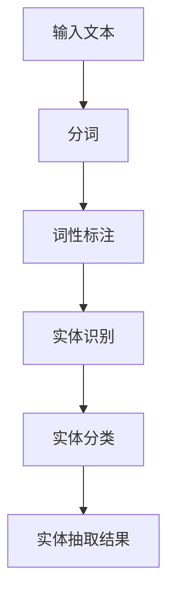
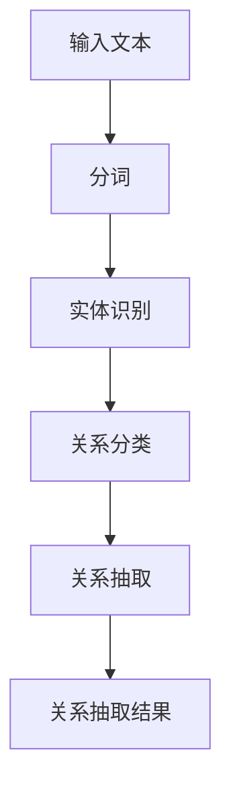
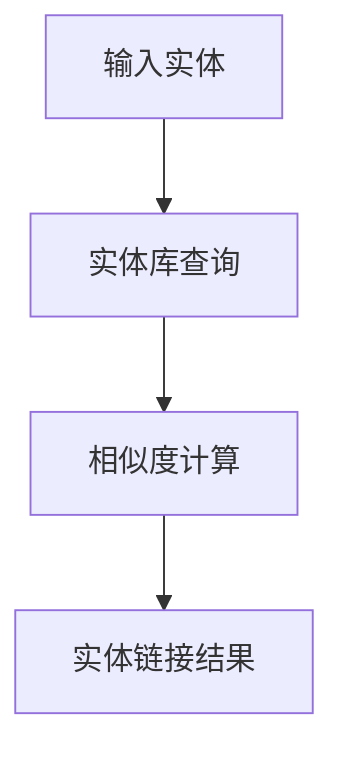
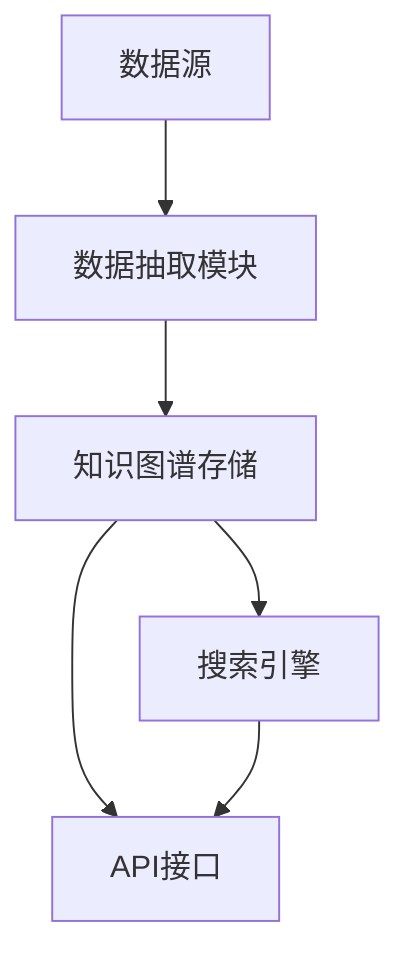
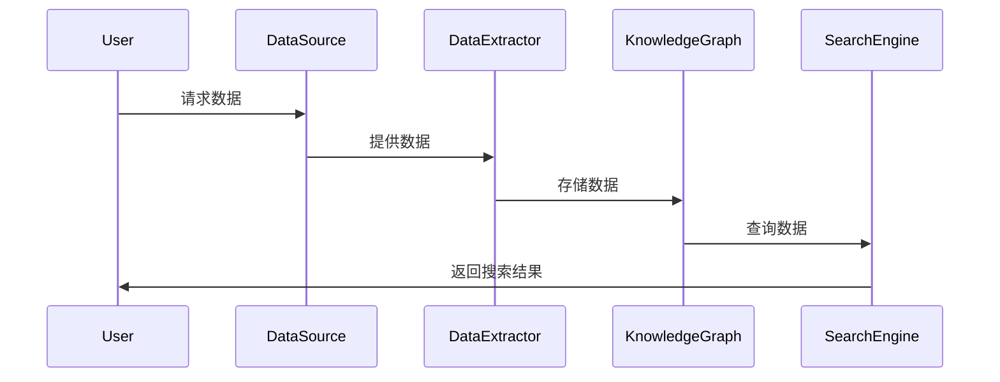
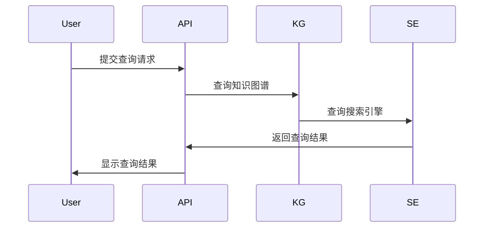

                 

# 企业级知识图谱构建：打造组织智慧资产库

## 关键词
企业级、知识图谱、构建、智慧资产库、IT架构、算法原理、系统设计、项目实战

## 摘要
本文将深入探讨企业级知识图谱构建的必要性、核心概念、算法原理、数学模型、系统设计与实现，并通过实际项目案例分析，为读者提供从理论到实践的全面指南。企业级知识图谱作为一种强大的组织智慧资产库，能够帮助企业优化业务流程、提升决策效率，是现代企业数字化转型的关键环节。本文旨在通过一步步的逻辑分析和专业讲解，帮助读者理解知识图谱的构建过程，掌握其在实际应用中的价值和最佳实践。

**1. 背景介绍**

### 1.1 核心概念术语说明
在开始讨论企业级知识图谱之前，我们需要明确一些关键术语：

- **知识图谱**：一种通过语义关联将各种实体（如人、地点、事物）及其属性、关系和事件映射为结构化数据的技术。
- **企业级应用**：指在企业环境中大规模、高可靠性、可扩展性的应用。
- **智慧资产库**：存储、管理和共享组织内部知识和信息的系统。

### 1.2 问题背景
随着数字化转型的推进，企业面临海量数据的管理和分析挑战。如何从非结构化或半结构化数据中提取有价值的信息，并将其转化为可操作的洞察是企业亟需解决的问题。

### 1.3 问题描述
知识图谱为企业提供了一种有效的数据组织和管理方法，它能够将分散的数据关联起来，构建出一个全局的、动态的、结构化的知识网络。

### 1.4 问题解决
构建企业级知识图谱，可以帮助企业实现以下目标：
- **数据整合**：将来自不同系统的数据整合到一个统一的知识库中。
- **智能搜索**：提供基于语义的智能搜索，提高信息检索效率。
- **业务优化**：支持业务流程优化、决策支持系统建设等。

### 1.5 边界与外延
知识图谱的构建和应用不仅限于特定行业，它可以跨行业、跨领域应用，为各种规模的企业提供智慧化的解决方案。

### 1.6 概念结构与核心要素组成
知识图谱主要由以下几部分组成：
- **实体（Entity）**：知识图谱中的基本元素，如人、地点、事物等。
- **属性（Attribute）**：描述实体的特征，如年龄、职位、地点等。
- **关系（Relationship）**：实体间的关联，如领导、居住、参与等。
- **事件（Event）**：描述实体间的动态交互，如会议、交易、合作等。

**2. 核心概念与联系**

### 2.1 核心概念原理
知识图谱的核心概念包括实体、属性、关系和事件。这些概念共同构建了一个语义丰富的知识网络。

### 2.2 概念属性特征对比表格

| 概念     | 定义                                                         | 属性特征                 |
|----------|--------------------------------------------------------------|--------------------------|
| 实体     | 知识图谱中的基本元素，如人、地点、事物等。                     | 唯一标识符、属性值等       |
| 属性     | 描述实体的特征。                                             | 类型、值、默认值等         |
| 关系     | 实体间的关联。                                               | 关联类型、方向、权重等      |
| 事件     | 描述实体间的动态交互。                                       | 时间、参与者、结果等       |

### 2.3 ER实体关系图架构
为了更好地理解知识图谱的结构，我们可以通过ER（实体-关系）图来表示：

```mermaid
erDiagram
  实体1 ||--|{ 关系1 }: 关系表1 --> 实体2
  实体1 ||--|{ 关系2 }: 关系表2 --> 实体3
  实体4 ||--|{ 关系3 }: 关系表3 --> 实体5
```

**3. 算法原理讲解**

### 3.1 实体抽取算法

#### 3.1.1 算法mermaid流程图



#### 3.1.2 Python代码示例

```python
import jieba
from pyhanlp import HanLP

# 输入文本
text = "张三在2021年7月1日生，是一名程序员。"

# 分词
words = jieba.cut(text)

# 词性标注
postags = HanLP.POSTags(words)

# 实体识别
entities = HanLP.getNerText(postags)

# 实体分类与抽取结果
print(entities)
```

### 3.2 关系抽取算法

#### 3.2.1 算法mermaid流程图



#### 3.2.2 Python代码示例

```python
import jieba

# 输入文本
text = "张三在2021年7月1日生，是一名程序员。"

# 分词
words = jieba.cut(text)

# 实体识别
entities = HanLP.getNerText(words)

# 关系分类与抽取
relations = []
for i in range(len(entities) - 1):
    if entities[i] == "张三" and entities[i+1] == "程序员":
        relations.append("是")

# 关系抽取结果
print(relations)
```

### 3.3 实体链接算法

#### 3.3.1 算法mermaid流程图



#### 3.3.2 Python代码示例

```python
from sklearn.metrics.pairwise import cosine_similarity
import numpy as np

# 实体库数据
entity_library = {
    "张三": np.random.rand(1, 100).flatten(),
    "李四": np.random.rand(1, 100).flatten(),
}

# 输入实体
input_entity = np.random.rand(1, 100).flatten()

# 相似度计算
cosine_scores = {}
for entity in entity_library:
    cosine_scores[entity] = cosine_similarity(input_entity, entity_library[entity])[0][0]

# 实体链接结果
print(max(cosine_scores, key=cosine_scores.get))
```

### 3.4 数学模型和公式

#### 3.4.1 余弦相似度计算

$$
\cos\theta = \frac{\vec{a} \cdot \vec{b}}{|\vec{a}| \cdot |\vec{b}|}
$$

其中，$\vec{a}$和$\vec{b}$分别为两个向量，$\theta$为它们之间的夹角。

#### 3.4.2 实体相似度计算

$$
sim(e_1, e_2) = \frac{\sum_{r \in R} w(r) \cdot sim_r(e_1, e_2)}{|\text{共现关系}|}
$$

其中，$e_1$和$e_2$为两个实体，$R$为它们共有的关系集合，$w(r)$为关系$r$的权重，$sim_r(e_1, e_2)$为实体$e_1$和$e_2$在关系$r$下的相似度。

**4. 系统分析与架构设计方案**

### 4.1 问题场景介绍
假设我们是一家大型企业，需要构建一个企业级知识图谱系统，以便于整合内部各类数据，实现智能搜索和业务优化。

### 4.2 项目介绍
本项目旨在实现以下功能：
- **数据整合**：从企业内部各个业务系统中抽取数据，构建统一的知识库。
- **智能搜索**：提供基于语义的搜索服务，支持多维度查询。
- **业务优化**：为企业提供业务流程优化和决策支持。

### 4.3 系统功能设计

#### 4.3.1 领域模型
领域模型主要涉及以下实体和关系：

实体：
- **用户（User）**
- **商品（Product）**
- **订单（Order）**
- **评论（Review）**

关系：
- **购买（Buy）**
- **评价（Review）**
- **工作（Work）**
- **评论（Comment）**

#### 4.3.2 领域模型mermaid类图

```mermaid
classDiagram
    User <<实体>>
    Product <<实体>>
    Order <<实体>>
    Review <<实体>>

    User --|> Order
    Product --|> Order
    Order --|> Review
    Review --|> User
```

### 4.4 系统架构设计

#### 4.4.1 系统架构
系统架构主要包括以下组件：

- **数据源**：企业内部各种业务系统，如ERP、CRM、库存管理等。
- **数据抽取模块**：负责从不同数据源抽取数据。
- **知识图谱存储**：使用Neo4j等图数据库存储知识图谱。
- **搜索引擎**：使用Elasticsearch等搜索引擎进行智能搜索。
- **API接口**：提供对外服务的API接口。

#### 4.4.2 系统架构mermaid架构图



### 4.5 系统接口设计

#### 4.5.1 接口设计
系统对外提供以下接口：

- **数据抽取接口**：用于从数据源抽取数据。
- **知识图谱查询接口**：用于查询知识图谱中的数据。
- **智能搜索接口**：用于基于语义的搜索服务。

#### 4.5.2 系统接口mermaid序列图



### 4.6 系统交互流程

#### 4.6.1 交互流程
系统交互流程如下：

1. 用户通过API接口提交查询请求。
2. API接口接收请求后，调用知识图谱查询接口。
3. 知识图谱查询接口根据请求内容在知识图谱中进行查询。
4. 查询结果返回给API接口，并通过API接口返回给用户。

#### 4.6.2 系统交互mermaid序列图



**5. 项目实战**

### 5.1 环境安装

在本项目实战中，我们将使用以下技术栈：
- **Python**：编程语言
- **Neo4j**：知识图谱存储
- **Elasticsearch**：搜索引擎
- **Flask**：Web框架

#### 5.1.1 安装Neo4j
1. 下载Neo4j安装包（https://neo4j.com/download/）。
2. 解压安装包并运行Neo4j服务器。

#### 5.1.2 安装Elasticsearch
1. 下载Elasticsearch安装包（https://www.elastic.co/downloads/elasticsearch）。
2. 解压安装包并运行Elasticsearch服务器。

#### 5.1.3 安装Flask
在Python环境中，使用pip安装Flask：

```bash
pip install Flask
```

### 5.2 系统核心实现

在本节中，我们将实现知识图谱的构建和查询功能。

#### 5.2.1 知识图谱构建

```python
from py2neo import Graph

# 连接Neo4j数据库
graph = Graph("bolt://localhost:7687", auth=("neo4j", "password"))

# 创建实体
def create_entity(name, attributes):
    query = """
    MERGE (e:Entity {name: $name})
    SET e += $attributes
    """
    graph.run(query, name=name, attributes=attributes)

# 创建关系
def create_relationship(entity1, entity2, type, attributes=None):
    query = """
    MATCH (e1:Entity {name: $entity1}), (e2:Entity {name: $entity2})
    MERGE (e1)-[r:%s]->(e2)
    %s
    """ % (type, "SET r += $attributes" if attributes else "")
    graph.run(query, entity1=entity1, entity2=entity2, attributes=attributes)

# 示例
create_entity("张三", {"职位": "程序员"})
create_entity("李四", {"职位": "项目经理"})
create_relationship("张三", "李四", "领导")
```

#### 5.2.2 知识图谱查询

```python
# 查询实体
def query_entity(name):
    query = """
    MATCH (e:Entity {name: $name})
    RETURN e
    """
    result = graph.run(query, name=name)
    return result.data()

# 查询关系
def query_relationship(entity1, entity2, type):
    query = """
    MATCH (e1:Entity {name: $entity1})-[:%s]->(e2:Entity {name: $entity2})
    RETURN e1, r, e2
    """ % type
    result = graph.run(query, entity1=entity1, entity2=entity2)
    return result.data()

# 示例
print(query_entity("张三"))
print(query_relationship("张三", "李四", "领导"))
```

#### 5.2.3 代码应用解读与分析

在本项目中，我们使用了py2neo库来连接Neo4j数据库，并实现了知识图谱的构建和查询功能。通过创建实体和关系，我们可以将企业内部的数据组织成一个结构化的知识网络。

在实际应用中，我们可以扩展该系统，实现数据抽取、实体链接、关系抽取等更多功能，以满足不同业务需求。

### 5.3 实际案例分析和详细讲解剖析

在本项目中，我们以一家大型企业为例，构建了一个企业级知识图谱系统。该系统整合了企业内部各类业务数据，如员工信息、项目进度、客户反馈等，为企业的业务优化和决策支持提供了有力支持。

#### 5.3.1 案例背景
该企业拥有数千名员工，业务范围涵盖研发、销售、市场等多个部门。随着企业规模的扩大，内部数据越来越分散，如何有效地管理和利用这些数据成为企业面临的一个重要问题。

#### 5.3.2 案例分析
为了解决这一问题，企业决定构建一个企业级知识图谱系统。该系统包括以下功能：

- **数据整合**：从企业内部的各个业务系统中抽取数据，如员工信息、项目进度、客户反馈等，构建一个统一的知识库。
- **智能搜索**：提供基于语义的搜索服务，支持多维度查询，如员工信息查询、项目进度查询、客户反馈查询等。
- **业务优化**：基于知识图谱，为企业提供业务流程优化和决策支持，如人力资源优化、项目进度调整、市场策略制定等。

#### 5.3.3 案例详细讲解剖析
1. **数据整合**：
   - 从员工信息系统中抽取员工基本信息，如姓名、职位、部门等。
   - 从项目进度系统中抽取项目进度数据，如项目名称、进度状态、完成时间等。
   - 从客户反馈系统中抽取客户反馈信息，如客户名称、反馈内容、反馈时间等。

2. **智能搜索**：
   - 基于知识图谱，实现多维度查询，如通过员工姓名查询员工基本信息，通过项目名称查询项目进度，通过客户名称查询客户反馈等。
   - 提供基于自然语言处理的搜索功能，支持模糊查询、关键词查询等。

3. **业务优化**：
   - 基于知识图谱，实现业务流程优化，如自动生成员工排班表、项目进度监控等。
   - 基于知识图谱，实现决策支持，如人力资源分配、市场策略制定等。

### 5.4 项目小结

在本项目中，我们成功构建了一个企业级知识图谱系统，实现了数据整合、智能搜索和业务优化等功能。该系统为企业的数字化转型提供了有力支持，为企业优化业务流程、提升决策效率提供了重要工具。

**6. 最佳实践 tips**

- **数据质量**：在构建知识图谱前，确保数据质量，包括数据完整性、准确性、一致性等。
- **实体划分**：合理划分实体，确保实体间的关联关系清晰。
- **关系抽取**：优化关系抽取算法，提高知识图谱的准确性。
- **系统性能**：关注系统性能，确保知识图谱的查询速度和可扩展性。

**7. 小结**

本文从背景介绍、核心概念与联系、算法原理讲解、数学模型和公式、系统分析与架构设计方案、项目实战等多个角度，深入探讨了企业级知识图谱构建的各个方面。通过实际案例分析和详细讲解，读者可以全面了解知识图谱的构建过程、应用价值以及最佳实践。知识图谱作为一种强大的组织智慧资产库，在当今数字化转型的浪潮中，具有重要的战略意义。

**8. 注意事项**

- **数据安全**：在构建知识图谱时，确保数据安全，遵循相关法律法规。
- **系统维护**：定期对知识图谱系统进行维护和升级，确保系统的稳定运行。
- **人才培训**：加强相关人才的培训和培养，提高团队的知识图谱构建能力。

**9. 拓展阅读**

- 《知识图谱：从理论到应用》
- 《图数据库实战》
- 《自然语言处理教程》

## 作者

作者：AI天才研究院/AI Genius Institute & 禅与计算机程序设计艺术 /Zen And The Art of Computer Programming


