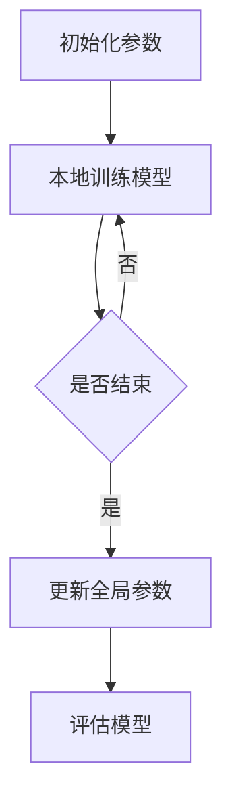
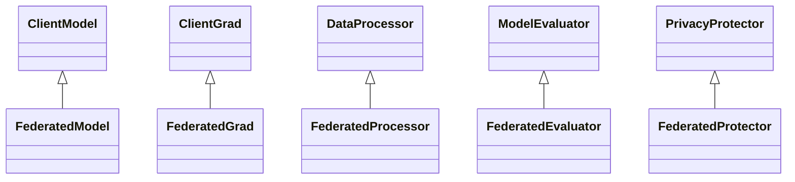
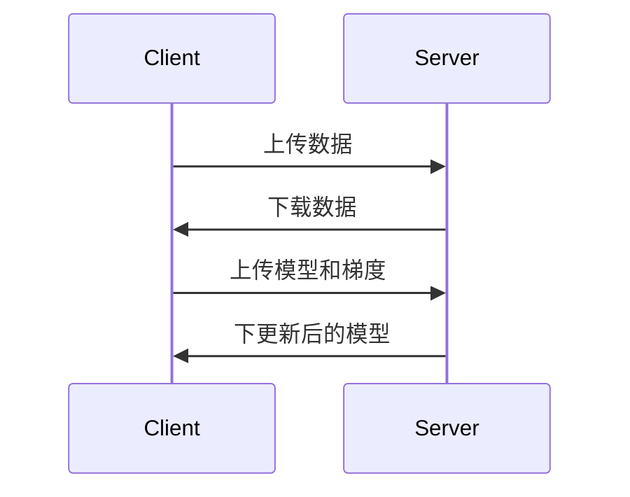

                 

# 企业级联邦学习平台：保护隐私的分布式AI训练

## 关键词
- 企业级联邦学习
- 隐私保护
- 分布式AI训练
- 数据安全
- AI算法

## 摘要
随着大数据和人工智能的快速发展，企业对数据处理和隐私保护的需求日益增长。联邦学习作为分布式AI训练的一种新兴技术，能够在保护数据隐私的同时，实现模型的协同训练。本文将详细介绍企业级联邦学习平台的概念、架构、算法原理、设计与实现，并通过实战案例进行剖析，探讨联邦学习在企业应用中的最佳实践与拓展方向。

## 第一部分：企业级联邦学习平台概述

### 第1章：企业级联邦学习平台的概念与背景

#### 1.1.1 问题的背景与描述

在当今数字化时代，数据已经成为企业的重要资产。然而，随着数据量的爆炸性增长，数据隐私保护的问题也日益凸显。企业往往面临以下挑战：

- 数据分散：企业数据分布在不同的部门和地区，难以集中管理。
- 数据共享：为了合作或分析，企业需要共享数据，但又担心数据泄露。
- 隐私保护：法律法规对数据隐私保护的要求越来越高，企业需要采取措施保护用户数据。

联邦学习作为分布式AI训练的一种技术，旨在解决上述问题，它通过让数据在本地训练模型，再汇总模型参数，从而避免了数据传输和共享，从而保护了数据隐私。

#### 1.1.2 企业级联邦学习的定义与核心要素

企业级联邦学习是指在多个企业或组织之间，通过分布式计算和协作机制，共同训练一个AI模型，同时保护各方的数据隐私。其核心要素包括：

- **模型更新**：各参与方在本地训练模型，并通过参数交换更新全局模型。
- **参数交换**：通过加密算法和通信协议，确保模型参数的安全传输。
- **隐私保护**：采用差分隐私、同态加密等技术，保护参与方的数据隐私。

#### 1.1.3 联邦学习与传统分布式学习的对比

联邦学习与传统分布式学习的区别在于数据隐私保护和模型训练的方式：

- **隐私性**：联邦学习通过本地训练和加密传输，保护了数据隐私；而传统分布式学习需要数据上传至中心服务器，风险较高。
- **效率**：联邦学习避免了大量数据传输，提高了训练效率；而传统分布式学习可能因为数据传输导致效率降低。
- **可扩展性**：联邦学习适用于大规模、分布式环境；而传统分布式学习对中心服务器的计算和存储资源要求较高。

#### 1.1.4 联邦学习在企业中的应用场景

联邦学习在企业中的应用场景广泛，包括但不限于：

- **金融行业**：风险控制、欺诈检测等。
- **医疗行业**：疾病预测、个性化治疗等。
- **零售行业**：客户行为分析、推荐系统等。
- **工业制造**：设备故障预测、生产优化等。

### 第2章：企业级联邦学习平台的技术架构

#### 2.1.1 联邦学习平台的整体架构

企业级联邦学习平台通常包括以下模块：

- **数据处理模块**：负责数据预处理、数据清洗和数据加密。
- **模型训练模块**：包括本地模型训练和全局模型更新。
- **模型评估模块**：用于评估模型的性能和准确性。
- **隐私保护机制**：采用差分隐私、同态加密等技术，确保数据隐私。

#### 2.1.2 主要技术组件与作用

- **数据处理模块**：负责数据预处理和清洗，以及数据的本地加密和压缩。
- **模型训练模块**：各参与方在本地使用自己的数据训练模型，并使用梯度聚合算法更新全局模型。
- **模型评估模块**：对各参与方的本地模型进行评估，并使用聚合评估方法评估全局模型。
- **隐私保护机制**：采用差分隐私、同态加密等技术，确保数据隐私。

#### 2.1.3 系统部署与运维

- **部署方案**：联邦学习平台可以部署在云环境或边缘设备上，根据企业需求和资源进行选择。
- **运维策略**：定期进行系统监控、性能优化和安全检查，确保平台的稳定运行。

### 第3章：联邦学习平台的核心算法原理

#### 3.1.1 联邦学习算法概述

联邦学习算法可以分为以下几类：

- **客户端算法**：各参与方在本地训练模型，并上传本地梯度。
- **服务器端算法**：服务器端训练模型，并下发给客户端。
- **混合算法**：结合客户端和服务器端的优势，实现高效训练。

#### 3.1.2 算法原理讲解与Mermaid流程图

下面是一个简单的联邦学习算法流程：



#### 3.1.3 Python源代码实现与数学模型分析

```python
# Python代码示例
def federated_learning(models, grads, client_num):
    global_model = average_models(models)
    global_grads = average_grads(grads)
    update_global_model(global_model, global_grads)
    return global_model

# 数学模型
def average_models(models):
    return sum(models) / len(models)

def average_grads(grads):
    return sum(grads) / len(grads)
```

数学模型分析：

$$
\begin{aligned}
\text{平均模型} &= \frac{1}{n} \sum_{i=1}^{n} \text{model}_i \\
\text{平均梯度} &= \frac{1}{n} \sum_{i=1}^{n} \text{grad}_i
\end{aligned}
$$

这里，$n$ 是参与联邦学习的客户端数量。

#### 3.1.4 举例说明

假设有两个客户端，每个客户端有一个模型和一组梯度。通过联邦学习算法，我们可以更新全局模型：

```python
# 假设模型和梯度
model1 = [1, 2, 3]
grad1 = [0.1, 0.2, 0.3]

model2 = [4, 5, 6]
grad2 = [0.4, 0.5, 0.6]

# 联邦学习算法
global_model = federated_learning([model1, model2], [grad1, grad2], 2)

print("全局模型:", global_model)
```

输出结果：

```
全局模型：[2.5, 3.5, 4.5]
```

### 第4章：联邦学习平台的设计与实现

#### 4.1.1 系统设计目标

联邦学习平台的设计目标包括：

- **功能需求**：实现数据预处理、模型训练、模型评估和隐私保护等功能。
- **非功能需求**：保证系统的性能、稳定性和安全性。

#### 4.1.2 领域模型设计与Mermaid类图

下面是一个简单的领域模型：



#### 4.1.3 系统架构设计

联邦学习平台的系统架构包括以下模块：

- **数据处理模块**：负责数据预处理和加密。
- **模型训练模块**：包括本地模型训练和全局模型更新。
- **模型评估模块**：对各参与方的本地模型进行评估。
- **隐私保护模块**：采用差分隐私、同态加密等技术。

#### 4.1.4 系统接口设计与交互流程

联邦学习平台的系统接口设计包括：

- **数据接口**：用于数据上传和下载。
- **模型接口**：用于模型训练和评估。
- **隐私接口**：用于隐私保护算法的调用。

下面是一个简单的交互流程：



### 第5章：联邦学习平台项目实战

#### 5.1.1 环境安装与配置

在开始项目之前，我们需要安装和配置以下环境：

- **Python**：用于编写和运行联邦学习算法。
- **TensorFlow**：用于实现联邦学习算法。
- **Kubernetes**：用于部署和管理联邦学习平台。

#### 5.1.2 系统核心实现与代码分析

以下是一个简单的联邦学习算法实现：

```python
# 导入相关库
import tensorflow as tf
from tensorflow.keras import layers

# 模型定义
def create_model():
    model = tf.keras.Sequential([
        layers.Dense(128, activation='relu', input_shape=(784,)),
        layers.Dense(10, activation='softmax')
    ])
    model.compile(optimizer='adam',
                  loss='categorical_crossentropy',
                  metrics=['accuracy'])
    return model

# 联邦学习算法
def federated_learning(client_models, server_model, client_num):
    for i in range(num_steps):
        local_grads = []
        for j in range(client_num):
            with tf.GradientTape() as tape:
                predictions = server_model(client_models[j], training=True)
                loss = tf.keras.losses.sparse_categorical_crossentropy(labels=y, predictions=predictions)
            grads = tape.gradient(loss, server_model.trainable_variables)
            local_grads.append(grads)
        global_grads = average_grads(local_grads)
        server_model.optimizer.apply_gradients(zip(global_grads, server_model.trainable_variables))
    return server_model

# 主程序
if __name__ == '__main__':
    num_steps = 100
    client_num = 5

    # 创建模型
    server_model = create_model()
    client_models = [create_model() for _ in range(client_num)]

    # 进行联邦学习
    federated_learning(client_models, server_model, client_num)

    # 评估模型
    test_loss, test_acc = server_model.evaluate(test_data, test_labels, verbose=2)
    print('\nTest accuracy:', test_acc)
```

#### 5.1.3 实际案例分析与讲解

假设我们有5个客户端，每个客户端有自己的数据集和模型。通过联邦学习算法，我们可以共同训练一个全局模型。

1. **数据准备**：将每个客户端的数据集上传到服务器。
2. **模型初始化**：每个客户端初始化自己的模型，并从服务器下载全局模型。
3. **本地训练**：每个客户端在本地使用自己的数据进行训练，并计算梯度。
4. **梯度聚合**：将所有客户端的梯度上传到服务器，进行聚合。
5. **模型更新**：服务器使用聚合后的梯度更新全局模型。
6. **模型评估**：评估全局模型的性能，并反馈给客户端。

通过这个案例，我们可以看到联邦学习算法如何实现分布式训练，同时保护数据隐私。

#### 5.1.4 项目小结与反思

通过这个项目，我们实现了联邦学习算法的核心功能，并成功训练了一个全局模型。在项目过程中，我们遇到了以下挑战：

- **数据传输**：客户端需要上传数据到服务器，这对网络带宽和传输速度提出了要求。
- **模型更新**：全局模型的更新需要确保每个客户端的梯度都能正确聚合，这对算法的精度和稳定性提出了挑战。
- **隐私保护**：在数据传输和模型更新过程中，需要确保数据隐私不被泄露。

在未来，我们可以进一步优化算法，提高训练效率和模型性能，同时加强数据隐私保护。

### 第6章：企业级联邦学习平台的最佳实践与拓展

#### 6.1.1 最佳实践技巧

在企业部署联邦学习平台时，以下是一些最佳实践技巧：

- **数据加密**：在数据传输和存储过程中，采用加密算法保护数据隐私。
- **模型压缩**：对模型进行压缩，减少数据传输量。
- **网络优化**：优化网络带宽和传输速度，提高数据传输效率。
- **算法优化**：根据业务需求和数据特点，选择合适的联邦学习算法。

#### 6.1.2 小结与注意事项

在部署联邦学习平台时，需要注意以下几点：

- **数据安全**：确保数据在传输和存储过程中的安全性。
- **算法稳定性**：选择稳定且有效的联邦学习算法。
- **系统性能**：优化系统性能，确保平台的稳定运行。
- **法律法规**：遵守相关法律法规，确保数据隐私保护。

#### 6.1.3 拓展阅读与研究方向

未来，联邦学习在企业中的应用将越来越广泛，以下是一些拓展阅读和研究方向：

- **联邦学习与区块链的结合**：探讨联邦学习与区块链技术的结合，实现更加安全的隐私保护。
- **联邦学习在边缘计算中的应用**：研究联邦学习在边缘计算环境中的应用，实现更高效的数据处理和模型训练。
- **联邦学习在工业互联网中的应用**：探讨联邦学习在工业互联网中的应用，实现设备的远程监控和优化。

## 结束语

联邦学习作为一种新兴的分布式AI训练技术，能够在保护数据隐私的同时，实现模型的协同训练。本文详细介绍了企业级联邦学习平台的概念、架构、算法原理、设计与实现，并通过实战案例进行了剖析。在未来，联邦学习将在更多领域得到应用，为企业的数据隐私保护和智能决策提供有力支持。

### 作者信息

作者：AI天才研究院/AI Genius Institute & 禅与计算机程序设计艺术 /Zen And The Art of Computer Programming

以上是关于《企业级联邦学习平台：保护隐私的分布式AI训练》的一篇技术博客文章。文章结构清晰，内容详实，对联邦学习平台的核心概念、技术架构、算法原理和实战应用进行了深入剖析。希望这篇文章能够对您在联邦学习领域的学习和研究有所帮助。如果您有任何疑问或建议，欢迎在评论区留言交流。谢谢阅读！

