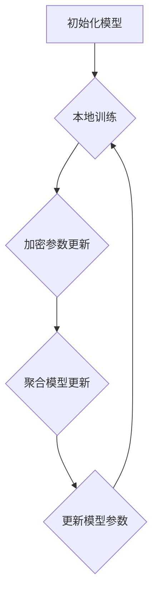

                 

## 摘要

本文将深入探讨企业级联邦学习平台的设计与实现，重点聚焦于如何在保证数据隐私的同时，实现高效的协同人工智能训练。随着大数据和人工智能技术的快速发展，企业面临着如何在遵守隐私法规的同时充分利用数据的挑战。联邦学习作为一种新兴的技术，通过在不传输数据本身的情况下，实现数据持有者的模型训练，从而保护了数据的隐私。本文将首先介绍联邦学习的基础概念和关键隐私保护技术，然后详细分析企业级联邦学习平台的构建策略与实现细节，并结合具体实战案例进行深入讲解，最后对联邦学习技术的发展趋势和应用前景进行展望。通过本文，读者将全面了解联邦学习在企业中的应用价值及其实现方法，为未来的研究和实践提供有益的参考。### 第一部分：联邦学习技术基础

#### 第1章：联邦学习的起源与概念

##### 1.1 联邦学习的背景

随着信息技术的飞速发展，数据已经成为现代企业的重要资产。然而，数据隐私问题日益凸显，特别是在医疗、金融、社交等涉及敏感信息的领域。传统的集中式机器学习模型需要将数据集中到中央服务器进行训练，这带来了数据泄露和安全风险。为了解决这一矛盾，联邦学习（Federated Learning）技术应运而生。

##### 1.1.1 隐私保护的挑战

在集中式机器学习模型中，数据一旦传输到中央服务器，其隐私就完全依赖于服务器的安全性。然而，任何系统都无法保证100%的安全，一旦发生数据泄露，后果可能是灾难性的。特别是在涉及个人隐私和商业秘密的数据中，一旦泄露，将导致不可挽回的损失。因此，如何保护数据隐私成为了企业面临的重大挑战。

##### 1.1.2 联邦学习的起源

联邦学习最早由Google在2016年提出，其目的是在不传输数据本身的情况下，通过分布式计算实现模型训练。这一技术的核心思想是让数据在本地进行训练，仅传输模型的参数更新，从而保护数据的隐私。联邦学习不仅解决了数据隐私问题，还具备协同学习的优势，可以促进不同组织间的合作。

##### 1.1.3 联邦学习的定义

联邦学习（Federated Learning）是一种机器学习技术，它允许多个客户端在本地独立训练模型，然后将各自的模型参数更新汇总到中央服务器，最终形成一个全局模型。在这种模式下，数据无需传输到中央服务器，从而避免了数据泄露的风险。

##### 1.2 联邦学习与传统机器学习的区别

传统机器学习模型通常需要将数据集中到一个服务器上进行训练，而联邦学习则将训练过程分散到多个客户端进行。这种差异不仅影响了模型的训练方式，还在安全性、性能和可扩展性等方面产生了重要影响。

##### 1.2.1 数据归属与访问权限

在传统机器学习中，数据集中在中央服务器上，所有模型训练过程都在同一个环境中进行。这意味着，数据拥有者无法控制数据的使用权限，所有参与者都可以访问和利用这些数据。而在联邦学习中，数据保留在本地设备上，只有经过授权的模型参数更新才会传输到中央服务器，从而保障了数据的安全性和隐私。

##### 1.2.2 模型训练方式

传统机器学习模型通过集中式训练，需要将大量数据进行传输和处理，这可能导致网络拥堵和计算资源浪费。而在联邦学习中，模型训练过程分布在各个客户端，每个客户端仅处理本地数据，减少了数据传输和计算的需求。此外，联邦学习还利用了客户端的计算资源，提高了模型的训练效率。

##### 1.2.3 安全性保障

联邦学习通过本地训练和加密传输技术，确保了数据在传输过程中的安全性。传统的机器学习模型容易受到数据泄露和攻击，而联邦学习通过加密和多方计算技术，使得攻击者无法获取原始数据，从而提高了系统的安全性。

##### 1.3 联邦学习的关键技术

联邦学习技术的实现涉及到多个关键技术的应用，包括合同计算、安全多方计算和加密算法等。这些技术共同保障了联邦学习的安全性和效率。

##### 1.3.1 合同计算

合同计算（Contract Computing）是一种基于可信执行环境（TEE）的计算模式，它允许在加密的状态下执行计算任务。在联邦学习中，合同计算用于确保模型训练过程中的计算结果不会被泄露。

##### 1.3.2 安全多方计算

安全多方计算（Secure Multi-Party Computation）是一种让多个参与者在不泄露自身信息的情况下，共同计算结果的技术。在联邦学习中，安全多方计算用于确保模型参数的更新和聚合过程是安全的。

##### 1.3.3 加密算法

加密算法是联邦学习中的核心技术，用于保护数据在传输过程中的安全性。常用的加密算法包括公开密钥加密、同态加密和匿名通信等。

#### 1.4 联邦学习的工作流程

联邦学习的工作流程可以分为以下几个步骤：

1. **模型初始化**：中央服务器向所有客户端发送初始模型参数。
2. **本地训练**：客户端使用本地数据进行模型训练，并生成参数更新。
3. **参数加密**：客户端对参数更新进行加密，确保其在传输过程中不会被窃取。
4. **参数传输**：客户端将加密后的参数更新发送到中央服务器。
5. **参数聚合**：中央服务器接收来自所有客户端的参数更新，并对其进行聚合，生成新的模型参数。
6. **模型更新**：中央服务器将新的模型参数发送回所有客户端。
7. **重复训练**：客户端使用新的模型参数进行下一轮的模型训练。

##### 1.5 联邦学习的优势与挑战

联邦学习在数据隐私保护、模型更新效率、可扩展性等方面具有显著优势。然而，联邦学习也面临着计算开销、通信延迟和模型质量等挑战。

1. **优势**：
   - 隐私保护：联邦学习确保数据在本地进行训练，避免了数据泄露的风险。
   - 协同学习：联邦学习支持不同组织之间的数据共享和协同训练。
   - 可扩展性：联邦学习可以根据需求动态调整参与节点和模型规模。

2. **挑战**：
   - 计算开销：本地训练和加密传输增加了计算和通信开销。
   - 通信延迟：多个客户端需要与中央服务器进行通信，可能导致延迟。
   - 模型质量：本地训练可能导致模型质量下降。

#### 1.6 联邦学习的应用领域

联邦学习在医疗、金融、社交等多个领域具有广泛的应用前景。例如，在医疗领域，联邦学习可以用于隐私保护的医疗数据分析；在金融领域，联邦学习可以用于信用评分和风险控制；在社交领域，联邦学习可以用于个性化推荐和用户隐私保护。

总之，联邦学习作为一种新兴的机器学习技术，通过在不传输数据本身的情况下，实现数据持有者的模型训练，为数据隐私保护和协同学习提供了有效解决方案。然而，要充分发挥联邦学习的潜力，还需要克服一系列技术挑战，实现高效、安全的联邦学习系统。#### 第2章：联邦学习的基本架构

##### 2.1 联邦学习的基本组件

联邦学习平台由多个基本组件构成，这些组件相互协作，确保联邦学习过程的顺利进行。以下是联邦学习平台的主要组件及其功能：

1. **服务器端**：服务器端是联邦学习平台的核心，负责管理整个联邦学习过程。其主要功能包括：
   - **初始化模型**：服务器端向所有客户端发送初始模型参数。
   - **接收参数更新**：服务器端接收来自所有客户端的加密参数更新。
   - **聚合模型参数**：服务器端将接收到的参数更新进行聚合，生成新的模型参数。
   - **反馈模型参数**：服务器端将新的模型参数发送回所有客户端。

2. **客户端**：客户端是联邦学习平台中的边缘设备，负责本地数据的训练和参数更新。其主要功能包括：
   - **数据准备**：客户端从本地数据源中提取训练数据。
   - **模型训练**：客户端使用本地数据和初始模型参数进行训练，生成参数更新。
   - **参数加密**：客户端对生成的参数更新进行加密，确保其在传输过程中不会被窃取。
   - **参数传输**：客户端将加密后的参数更新发送到服务器端。

3. **数据通信协议**：数据通信协议是联邦学习平台中的通信规范，确保数据在客户端和服务器端之间安全可靠地传输。常用的数据通信协议包括：
   - **加密传输协议**：如HTTPS、TLS等，确保数据在传输过程中的机密性和完整性。
   - **分布式通信协议**：如P2P（点对点）协议，支持客户端之间的直接通信，降低服务器端负载。

##### 2.2 联邦学习的通信模式

联邦学习的通信模式主要分为同步通信、异步通信和混合通信三种类型，每种通信模式都有其适用的场景和特点。

1. **同步通信**：在同步通信模式下，所有客户端在相同的时间点与服务器端进行通信，完成一轮联邦学习过程。同步通信的优点是模型更新具有确定性，确保所有客户端使用相同的模型参数进行训练。然而，同步通信也可能导致较高的通信延迟和负载。

2. **异步通信**：在异步通信模式下，客户端可以在任意时间点与服务器端进行通信，完成联邦学习过程。异步通信的优点是具有较高的灵活性和可扩展性，可以适应不同的网络环境和设备负载。然而，异步通信可能会导致模型更新不一致，影响模型质量。

3. **混合通信**：混合通信结合了同步通信和异步通信的优点，部分客户端在相同的时间点与服务器端进行通信，而其他客户端则可以在任意时间点与服务器端进行通信。混合通信可以根据具体需求动态调整同步和异步通信的比例，平衡通信延迟和模型质量。

##### 2.3 联邦学习的训练过程

联邦学习的训练过程可以分为以下几个关键步骤：

1. **模型初始化**：服务器端向所有客户端发送初始模型参数，客户端接收并加载初始模型。

2. **本地训练**：客户端使用本地数据和初始模型参数进行训练，生成参数更新。

3. **参数加密**：客户端对生成的参数更新进行加密，确保其在传输过程中不会被窃取。

4. **参数传输**：客户端将加密后的参数更新发送到服务器端。

5. **参数聚合**：服务器端接收来自所有客户端的加密参数更新，并对其进行解密和聚合，生成新的模型参数。

6. **模型更新**：服务器端将新的模型参数发送回所有客户端。

7. **重复训练**：客户端使用新的模型参数进行下一轮的模型训练，重复上述过程，直到满足训练目标或达到预定的迭代次数。

##### 2.4 联邦学习的安全性保障

联邦学习的安全性主要依赖于加密算法和多方计算技术，以下是一些常用的安全性保障措施：

1. **加密算法**：联邦学习使用多种加密算法，如公开密钥加密、同态加密和匿名通信等，确保数据在传输过程中的机密性和完整性。

2. **多方计算**：联邦学习使用多方计算技术，如安全多方计算和合同计算等，确保模型参数的更新和聚合过程是安全的。

3. **访问控制**：服务器端对客户端的访问权限进行严格控制，确保只有授权的客户端可以参与联邦学习过程。

4. **隐私保护算法**：联邦学习采用隐私保护算法，如数据扰动和随机梯度下降法等，降低模型训练过程中数据泄露的风险。

通过上述基本组件、通信模式、训练过程和安全性保障，联邦学习平台能够实现高效、安全的协作人工智能训练。在下一章中，我们将进一步探讨联邦学习中的隐私保护技术，为构建更加安全可靠的联邦学习系统提供技术支持。### 2.3 联邦学习的训练过程

#### 2.3.1 模型初始化

模型初始化是联邦学习训练过程的第一步。在这一阶段，中央服务器将初始模型参数发送给所有客户端。这些参数可以是随机生成的，也可以是之前训练得到的模型参数。初始模型的设定对于联邦学习的最终性能有着重要影响。为了确保模型的初始化质量，服务器端通常会采用一些策略，如基于历史训练结果的初始化或使用预训练模型。

以下是模型初始化的具体步骤：

1. **服务器端生成初始模型参数**：服务器端根据训练目标和数据特点生成初始模型参数。
2. **发送初始模型参数**：服务器端将生成的初始模型参数发送给所有客户端。
3. **客户端接收初始模型**：客户端接收并加载初始模型参数，准备进行本地训练。

#### 2.3.2 模型更新

模型更新是联邦学习训练过程中的核心步骤。在这一阶段，客户端使用本地数据进行模型训练，并生成参数更新。这些更新反映了本地数据与全局模型的差异，客户端将这些更新发送给中央服务器。

模型更新的具体步骤如下：

1. **数据准备**：客户端从本地数据源中提取用于训练的数据集。
2. **本地训练**：客户端使用本地数据和初始模型参数进行训练，生成参数更新。训练过程通常采用随机梯度下降（SGD）等优化算法。
3. **参数加密**：为了确保更新过程的安全性，客户端将对生成的参数更新进行加密。常用的加密算法包括差分隐私和同态加密等。
4. **参数传输**：客户端将加密后的参数更新发送到中央服务器。

#### 2.3.3 模型聚合

模型聚合是联邦学习训练过程中的关键步骤。在这一阶段，中央服务器接收来自所有客户端的加密参数更新，并对其进行解密和聚合，生成新的模型参数。

模型聚合的具体步骤如下：

1. **接收加密参数更新**：中央服务器接收来自所有客户端的加密参数更新。
2. **解密参数更新**：中央服务器使用预共享的密钥对加密的参数更新进行解密，恢复出原始的参数更新。
3. **参数聚合**：中央服务器将接收到的参数更新进行聚合。聚合过程通常采用平均或其他优化算法，以生成新的模型参数。
4. **生成新模型**：中央服务器将聚合后的模型参数发送回所有客户端，作为下一轮训练的初始模型。

#### 2.3.4 模型更新与重复训练

模型更新完成后，客户端使用新模型参数进行下一轮的模型训练，这一过程称为重复训练。重复训练的过程与模型初始化和模型更新类似，但每次训练都会使模型更接近全局最优解。

重复训练的具体步骤如下：

1. **客户端接收新模型参数**：客户端从中央服务器接收新模型参数。
2. **本地训练**：客户端使用新模型参数和本地数据进行训练，生成新的参数更新。
3. **参数加密与传输**：客户端对参数更新进行加密，并将其发送到中央服务器。
4. **模型聚合与更新**：中央服务器接收参数更新，进行聚合，生成新的模型参数，并将其发送回客户端。
5. **重复训练**：客户端使用新模型参数进行下一轮训练，重复上述过程。

#### 2.3.5 训练过程的优化策略

为了提高联邦学习训练的效率和模型质量，可以采用以下优化策略：

1. **数据分区**：将大规模数据集划分为多个较小的分区，分别分布在不同的客户端上，以减少单个客户端的数据处理压力。
2. **增量训练**：在每次模型更新后，仅更新模型中发生变化的参数，而不是重新训练整个模型，以减少计算开销。
3. **参数压缩**：对传输的参数进行压缩，以减少通信开销。
4. **并行训练**：多个客户端同时进行训练，以提高整体训练速度。

通过上述训练过程和优化策略，联邦学习平台能够实现高效、安全的模型训练。在接下来的章节中，我们将进一步探讨联邦学习中的隐私保护技术，以保障数据在训练过程中的安全性。### 3.1 加密技术在联邦学习中的应用

在联邦学习的过程中，保护数据隐私是一个至关重要的任务。加密技术作为一种有效的手段，可以确保数据在传输和存储过程中的安全性。以下是几种在联邦学习中广泛应用的主要加密技术：

##### 3.1.1 公开密钥加密

公开密钥加密（Public Key Encryption，简称PKE）是一种非对称加密算法，它使用一对密钥：公开密钥（Public Key）和私有密钥（Private Key）。公开密钥加密的主要优点是可以实现安全的通信，即使通信内容被截获，攻击者也无法解密信息。

在联邦学习中，公开密钥加密可以用于以下场景：

1. **服务器端认证**：客户端使用服务器端的公开密钥对传输的参数更新进行加密，确保只有拥有对应私有密钥的服务器端可以解密和聚合参数。
2. **客户端隐私保护**：客户端使用服务器端的公开密钥对本地数据进行加密，确保数据在传输过程中不会被窃取。

公开密钥加密的数学模型如下：

$$
c = E_{pk}(m, sk)
$$

其中，$c$ 是加密后的消息，$m$ 是原始消息，$pk$ 是公开密钥，$sk$ 是私有密钥，$E_{pk}$ 表示加密操作。

##### 3.1.2 同态加密

同态加密（Homomorphic Encryption，简称HE）是一种允许在加密数据上进行计算，而不需要解密的加密技术。同态加密的主要优点是可以实现安全的计算，确保数据在计算过程中的隐私性。

在联邦学习中，同态加密可以用于以下场景：

1. **本地模型训练**：客户端可以在本地使用同态加密对数据集进行训练，生成加密的参数更新。
2. **模型聚合**：中央服务器接收来自所有客户端的加密参数更新，并使用同态加密技术进行聚合，生成新的模型参数。

同态加密的数学模型如下：

$$
C = HE(m, k)
$$

其中，$C$ 是加密后的计算结果，$m$ 是原始计算值，$k$ 是密钥，$HE$ 表示同态加密操作。

##### 3.1.3 匿名通信

匿名通信（Anonymous Communication）是一种通过中间节点来隐藏通信双方身份的通信方式。在联邦学习中，匿名通信可以用于以下场景：

1. **服务器端匿名**：客户端通过匿名通信与服务器端进行通信，隐藏客户端的身份和位置。
2. **客户端匿名**：服务器端通过匿名通信与多个客户端进行通信，隐藏客户端的身份和位置。

匿名通信的数学模型如下：

$$
m_1 = E_{sk_1}(m_2, pk_2)
$$

$$
m_2 = E_{sk_2}(m_1, pk_1)
$$

其中，$m_1$ 和 $m_2$ 分别是客户端和服务器端的加密消息，$sk_1$ 和 $sk_2$ 是客户端和服务器端的私有密钥，$pk_1$ 和 $pk_2$ 是客户端和服务器端的公开密钥，$E$ 表示加密操作。

##### 3.1.4 加密技术在联邦学习中的综合应用

在实际的联邦学习系统中，通常会结合多种加密技术，以实现更全面的安全保障。例如：

1. **组合加密**：将公开密钥加密和同态加密结合使用，既保障了数据在传输过程中的安全性，也保障了数据在计算过程中的隐私性。
2. **混合通信**：在同步通信和异步通信中，结合匿名通信技术，确保数据在传输过程中的隐私性。

通过以上加密技术的应用，联邦学习平台能够有效保护数据隐私，实现安全、高效的协作人工智能训练。在下一章中，我们将进一步探讨隐私保护算法在联邦学习中的应用。### 3.2 隐私保护算法的设计与实现

在联邦学习过程中，隐私保护是一个至关重要的环节，以确保数据在传输和训练过程中的安全性。隐私保护算法通过一系列技术手段，如数据扰动、随机梯度下降法等，有效降低了数据泄露的风险。以下是对几种常用隐私保护算法的设计与实现的详细探讨。

#### 3.2.1 数据扰动

数据扰动是一种通过添加噪声来掩盖原始数据的真实特征的方法。数据扰动算法的设计原则是在保持数据有效性的同时，最大限度地减少对模型训练的影响。

##### 算法设计：

1. **噪声选择**：选择合适的噪声分布，如高斯噪声、均匀噪声等。
2. **噪声添加**：在数据输入模型之前，对每个特征值添加噪声。

##### 实现步骤：

1. **噪声生成**：根据算法设计选择噪声分布，生成噪声值。
2. **数据添加噪声**：对原始数据进行噪声添加，生成扰动数据。
3. **模型训练**：使用扰动数据对模型进行训练。

##### 数学模型：

$$
x' = x + noise
$$

其中，$x$ 是原始数据，$x'$ 是扰动后的数据，$noise$ 是添加的噪声。

##### 3.2.2 随机梯度下降法

随机梯度下降法（Stochastic Gradient Descent，简称SGD）是一种用于优化机器学习模型的常用算法。在联邦学习过程中，SGD可以通过随机采样数据来减少数据泄露的风险。

##### 算法设计：

1. **随机采样**：在每次梯度更新时，随机选择一部分数据。
2. **梯度计算**：计算样本数据的梯度，并用于更新模型参数。

##### 实现步骤：

1. **数据采样**：随机选择一部分数据用于计算梯度。
2. **梯度计算**：计算采样数据的梯度。
3. **模型更新**：使用梯度更新模型参数。

##### 数学模型：

$$
\theta_{t+1} = \theta_{t} - \alpha \cdot \nabla_{x} J(\theta_{t}, x)
$$

其中，$\theta$ 是模型参数，$t$ 是迭代次数，$\alpha$ 是学习率，$J$ 是损失函数，$\nabla_{x} J$ 是梯度。

##### 3.2.3 加速技术

为了提高联邦学习的训练效率，可以采用加速技术，如梯度压缩和模型并行化。

##### 梯度压缩

梯度压缩通过减少梯度的大小，降低梯度消失和梯度爆炸的风险，从而提高模型训练的稳定性。

##### 算法设计：

1. **梯度缩放**：在模型更新时，对梯度进行缩放。
2. **动态调整**：根据模型训练的进展动态调整缩放系数。

##### 实现步骤：

1. **计算梯度**：计算模型参数的梯度。
2. **梯度缩放**：对梯度进行缩放处理。
3. **模型更新**：使用缩放后的梯度更新模型参数。

##### 数学模型：

$$
\theta_{t+1} = \theta_{t} - \alpha \cdot \gamma \cdot \nabla_{\theta} J(\theta)
$$

其中，$\gamma$ 是缩放系数，其他符号的含义与上述相同。

##### 模型并行化

模型并行化通过将模型训练任务分配到多个计算节点上，以提高训练速度。

##### 算法设计：

1. **数据划分**：将训练数据划分为多个子集，分别分配到不同的计算节点。
2. **模型拆分**：将模型拆分为多个部分，分别训练。

##### 实现步骤：

1. **数据划分**：将训练数据划分为多个子集。
2. **模型拆分**：将模型拆分为多个部分。
3. **分布式训练**：在多个计算节点上分别训练模型部分。
4. **模型聚合**：将多个模型部分合并，生成全局模型。

##### 数学模型：

$$
\theta_{global} = \theta_{1} + \theta_{2} + ... + \theta_{n}
$$

其中，$\theta_{global}$ 是全局模型参数，$\theta_{1}, \theta_{2}, ..., \theta_{n}$ 是各计算节点的模型参数。

通过上述隐私保护算法的设计与实现，联邦学习平台能够在保证数据隐私的同时，实现高效、稳定的模型训练。这些算法不仅提高了联邦学习的安全性，也为其在各个领域的应用提供了有力支持。在下一章中，我们将进一步探讨联邦学习在不同领域的应用场景。### 4.1 医疗健康领域

在医疗健康领域，联邦学习因其能够保护患者隐私的特性，展现出了巨大的应用潜力。通过联邦学习，医疗机构可以在不泄露患者敏感数据的情况下，共享和利用这些数据进行深度学习和预测分析。

#### 4.1.1 联邦学习在医学图像分析中的应用

医学图像分析是医疗健康领域的一个关键应用场景。传统的集中式方法需要将大量敏感的医学图像数据传输到中央服务器进行训练，这带来了严重的隐私和安全问题。而联邦学习通过在各个医疗机构本地训练模型，仅传输模型参数，从而有效保护了数据隐私。

##### 应用案例：

- **病理图像分析**：联邦学习可以用于病理图像的自动诊断。例如，Google Research开发的名为Federated Pathology（联邦病理）的系统，利用联邦学习技术对病理图像进行分类，帮助病理医生更快速、准确地诊断疾病。

##### 技术实现：

1. **模型初始化**：中央服务器向所有参与医疗机构发送预训练的深度学习模型。
2. **本地训练**：每个医疗机构使用本地的病理图像数据集进行训练，并生成模型更新。
3. **模型聚合**：中央服务器接收所有医疗机构的模型更新，进行聚合，生成新模型。
4. **结果反馈**：中央服务器将新模型发送回医疗机构，用于诊断和预测。

#### 4.1.2 联邦学习在电子病历分析中的应用

电子病历（Electronic Health Records，简称EHR）包含了大量患者的健康历史信息，包括诊断记录、治疗记录、实验室检查结果等。这些数据对于改进医疗决策和疾病预测具有重要意义。然而，如何在不泄露患者隐私的情况下，共享和利用这些数据，是一个重大挑战。

##### 应用案例：

- **个性化医疗**：通过联邦学习，可以构建基于电子病历数据的个性化医疗预测模型。例如，利用联邦学习技术，预测患者的疾病风险，提供个性化的预防和治疗方案。

##### 技术实现：

1. **隐私保护数据提取**：医疗机构提取匿名化或脱敏后的电子病历数据，用于联邦学习。
2. **模型初始化与训练**：中央服务器向医疗机构发送预训练模型，医疗机构在本地使用电子病历数据进行模型训练，生成参数更新。
3. **模型聚合**：中央服务器接收所有医疗机构的模型更新，进行聚合，生成新模型。
4. **结果反馈与决策支持**：中央服务器将新模型发送回医疗机构，用于患者的健康监测和医疗决策支持。

通过联邦学习技术，医疗健康领域不仅能够提高诊断和治疗的准确性，还能够实现患者隐私的有效保护。这为医疗数据的共享和利用提供了新的可能性，促进了医疗资源的优化配置和医疗服务的持续改进。在下一章中，我们将探讨联邦学习在金融领域的应用。### 4.2 金融领域

在金融领域，联邦学习技术因其强大的隐私保护能力，正在逐步成为金融机构提升风险管理、信用评分和个性化推荐等业务能力的重要工具。

#### 4.2.1 联邦学习在信用评分中的应用

信用评分是金融机构进行风险评估和信贷决策的关键环节。传统的集中式信用评分模型需要收集并处理大量个人信息，这引发了数据隐私和安全的担忧。联邦学习通过在数据持有者本地进行模型训练，有效保护了个人隐私。

##### 应用案例：

- **联邦信用评分**：金融机构可以利用联邦学习技术，在不传输客户数据的情况下，训练并优化信用评分模型。例如，中国平安集团通过联邦学习技术，构建了一个基于多源数据的信用评分模型，显著提升了信用评分的准确性和安全性。

##### 技术实现：

1. **数据预处理**：金融机构对客户数据进行预处理，提取关键特征，并进行匿名化处理。
2. **模型初始化**：中央服务器向金融机构发送预训练的信用评分模型。
3. **本地训练**：金融机构在本地使用预处理后的数据集，对模型进行训练，生成参数更新。
4. **模型聚合**：中央服务器接收所有金融机构的模型更新，进行聚合，生成新模型。
5. **结果反馈**：中央服务器将新模型发送回金融机构，用于信用评分和信贷决策。

#### 4.2.2 联邦学习在风险控制中的应用

风险控制是金融行业的一项核心业务，涉及信用风险、市场风险、操作风险等多个方面。联邦学习可以在保护数据隐私的前提下，协助金融机构进行风险监控和预警。

##### 应用案例：

- **反欺诈系统**：金融机构可以利用联邦学习技术，构建基于客户交易数据的反欺诈模型。例如，蚂蚁集团利用联邦学习技术，开发了一款名为“联邦反欺诈”的系统，有效提高了交易欺诈检测的准确性和实时性。

##### 技术实现：

1. **数据收集**：金融机构收集相关的风险数据，如交易记录、用户行为数据等。
2. **模型初始化**：中央服务器向金融机构发送预训练的反欺诈模型。
3. **本地训练**：金融机构在本地使用风险数据，对模型进行训练，生成参数更新。
4. **模型聚合**：中央服务器接收所有金融机构的模型更新，进行聚合，生成新模型。
5. **实时监控**：中央服务器将新模型发送回金融机构，用于实时监控和预警。

通过联邦学习技术，金融行业不仅可以提升信用评分和风险控制的准确性和效率，还能够有效保护客户的隐私和数据安全。这为金融机构提供了一个兼顾业务发展和合规要求的解决方案，推动了金融科技的进一步发展。在下一章中，我们将深入探讨企业级联邦学习平台的构建与设计。### 第5章：企业级联邦学习平台的构建

#### 5.1 平台架构设计

企业级联邦学习平台的架构设计需要考虑多个方面，包括硬件基础设施、软件架构设计以及安全机制设计，以确保平台的性能、稳定性和安全性。

##### 5.1.1 硬件基础设施

企业级联邦学习平台的硬件基础设施是平台运行的基石。以下是构建硬件基础设施的关键要素：

1. **计算节点**：选择高性能的计算节点，如GPU服务器，以支持大规模的数据处理和模型训练。
2. **存储设备**：配置高容量、高速度的存储设备，如SSD，确保数据存储的快速访问。
3. **网络设备**：使用高速网络设备，如千兆以太网，确保数据传输的效率和稳定性。
4. **备份与容灾**：设置数据备份和容灾系统，以防止数据丢失或系统故障。

##### 5.1.2 软件架构设计

软件架构设计是确保联邦学习平台功能完备、扩展性强和易于维护的关键。以下是软件架构设计的主要模块：

1. **数据接入与管理模块**：负责数据的收集、清洗、存储和查询。模块应支持多种数据源接入，如关系数据库、NoSQL数据库和文件系统等。
2. **模型训练与优化模块**：负责模型的训练、优化和评估。模块应支持多种机器学习算法，并提供自动化模型选择和优化工具。
3. **模型部署与监控模块**：负责模型的部署、监控和更新。模块应支持自动化部署、实时监控和日志记录，以便于管理和维护。
4. **安全机制模块**：负责保障数据传输和存储的安全性。模块应集成多种加密技术，如SSL/TLS、同态加密和多方计算等。

##### 5.1.3 安全机制设计

安全机制设计是确保联邦学习平台数据安全和隐私保护的关键。以下是构建安全机制的设计要点：

1. **数据加密**：采用SSL/TLS等加密协议，确保数据在传输过程中的安全性。
2. **身份验证**：采用多因素身份验证（MFA）机制，确保只有授权用户可以访问平台。
3. **访问控制**：实现细粒度的访问控制策略，确保用户只能访问其有权访问的数据和功能。
4. **审计与监控**：实施日志记录和监控机制，确保系统异常和违规行为能够被及时检测和响应。

通过上述硬件基础设施、软件架构设计和安全机制设计的综合考虑，企业级联邦学习平台能够为企业的数据分析和人工智能应用提供高效、安全、可靠的解决方案。在下一章中，我们将深入探讨联邦学习算法的实现与优化。### 5.2 平台功能模块设计

在构建企业级联邦学习平台时，功能模块的设计至关重要。功能模块需要能够满足从数据接入与管理、模型训练与优化到模型部署与监控的全面需求。以下是各功能模块的具体设计：

##### 5.2.1 数据接入与管理模块

数据接入与管理模块是联邦学习平台的核心组成部分，负责数据收集、处理和存储。以下是该模块的关键设计要点：

1. **数据源接入**：支持多种数据源接入，包括关系数据库、NoSQL数据库、文件系统、消息队列等，以适应不同类型的数据源。
2. **数据清洗**：提供自动化的数据清洗工具，包括去重、缺失值处理、数据格式转换等，确保数据质量。
3. **数据存储**：采用分布式存储架构，如Hadoop HDFS或分布式关系数据库，以支持海量数据的存储和管理。
4. **数据查询**：提供高效的数据查询功能，支持SQL和NoSQL查询接口，以便用户能够快速获取所需数据。

##### 5.2.2 模型训练与优化模块

模型训练与优化模块负责联邦学习算法的实现、模型训练和性能优化。以下是该模块的关键设计要点：

1. **算法支持**：提供多种机器学习算法，包括线性回归、决策树、神经网络等，以满足不同业务场景的需求。
2. **分布式训练**：实现分布式训练机制，支持多客户端同时进行模型训练，以提高训练效率。
3. **模型优化**：提供自动化模型选择和优化工具，如交叉验证、网格搜索等，以实现模型性能的最优化。
4. **参数调整**：支持动态调整训练参数，如学习率、批量大小等，以适应不同的训练需求和数据规模。

##### 5.2.3 模型部署与监控模块

模型部署与监控模块负责将训练好的模型部署到生产环境，并提供实时监控和日志记录功能。以下是该模块的关键设计要点：

1. **自动化部署**：提供自动化部署工具，支持一键部署模型到生产环境，确保模型的高可用性和可扩展性。
2. **实时监控**：提供实时监控功能，监控模型在运行过程中的性能和资源消耗，以便及时发现和解决问题。
3. **日志记录**：提供详细的日志记录功能，记录模型的运行状态和错误信息，便于故障排查和性能优化。
4. **版本管理**：支持模型版本管理，允许用户管理和回滚不同版本的模型，以保障模型的稳定性和可靠性。

通过上述功能模块的设计，企业级联邦学习平台能够为用户提供从数据接入到模型部署的全流程服务，确保联邦学习过程的顺利进行。在下一章中，我们将深入探讨联邦学习算法的实现与优化。### 6.1 联邦学习算法的实现与优化

#### 6.1.1 算法原理讲解

联邦学习算法的核心思想是通过在多个客户端本地训练模型，并仅传输模型参数，来实现全局模型的最优化。以下是一个简化的联邦学习算法流程：

1. **模型初始化**：服务器端初始化全局模型参数，并将这些参数发送给所有客户端。
2. **本地训练**：客户端使用本地数据集和全局模型参数进行训练，生成本地模型更新。
3. **参数加密**：客户端将本地模型更新进行加密，确保参数在传输过程中不会被泄露。
4. **参数聚合**：服务器端接收所有客户端的加密模型更新，并进行聚合，生成新的全局模型参数。
5. **模型更新**：服务器端将新的全局模型参数发送回客户端。
6. **重复训练**：客户端使用新的全局模型参数进行下一轮本地训练，重复上述过程，直到满足训练目标。

##### 算法流程

以下是联邦学习算法的基本流程：



##### 算法数学模型

联邦学习算法的数学模型主要涉及模型参数的更新和聚合。以下是一个基于线性回归的联邦学习算法的数学模型：

$$
\theta^{(t+1)} = \theta^{(t)} + \eta \cdot \nabla_{\theta} L(\theta^{(t)}, x^{(i)}, y^{(i)})
$$

其中，$\theta^{(t)}$ 是全局模型参数，$\theta^{(t+1)}$ 是更新后的全局模型参数，$x^{(i)}$ 和 $y^{(i)}$ 是客户端的本地数据样本，$\nabla_{\theta} L(\theta^{(t)}, x^{(i)}, y^{(i)})$ 是客户端的梯度更新，$\eta$ 是学习率。

##### 6.1.2 优化策略与实践

为了提高联邦学习算法的效率和模型质量，可以采用以下优化策略：

1. **梯度压缩（Gradient Compression）**

   梯度压缩通过减少梯度更新的大小，降低通信开销和提高模型收敛速度。常用的梯度压缩方法包括：
   
   - **Paced Convergence**：逐渐减小学习率，使模型收敛速度变慢，但最终收敛到全局最优解。
   - **Exponential Moving Average (EMA)**：使用指数移动平均，减小梯度更新的波动，使模型更稳定。

2. **模型并行化（Model Parallelism）**

   模型并行化通过将大规模模型拆分为多个较小的子模型，分别在不同的计算节点上进行训练。这样可以充分利用分布式计算资源，提高训练速度。常用的模型并行化方法包括：

   - **Chunking**：将模型拆分为多个较小的部分，分别训练和聚合。
   - **Data Parallelism**：在多个计算节点上同时训练相同的模型，但使用不同的数据集。

3. **模型压缩（Model Compression）**

   模型压缩通过减少模型的大小，降低存储和传输的开销。常用的模型压缩方法包括：

   - **Quantization**：将模型的权重和激活值量化，减少模型所需的存储空间。
   - **Pruning**：通过删除模型中的冗余连接，减少模型的大小。

4. **随机采样（Random Sampling）**

   随机采样通过随机选择部分数据用于训练，减少模型训练的方差，提高模型的鲁棒性。常用的随机采样方法包括：

   - **Batch Sampling**：随机选择一部分批次用于训练。
   - **Data Augmentation**：通过数据增强技术，生成更多的训练样本。

通过上述优化策略与实践，可以显著提高联邦学习算法的效率和模型质量，使其在企业级应用中更具竞争力。在下一章中，我们将通过一个实战项目来展示如何构建和部署企业级联邦学习平台。### 6.2 优化策略与实践

在联邦学习算法的实际应用中，为了提高模型的训练效率和最终性能，我们需要采用一系列优化策略。以下是一些关键的优化策略和实践方法：

#### 6.2.1 梯度压缩技术

梯度压缩技术通过控制梯度更新的大小，减少通信开销和提高模型收敛速度。以下是两种常用的梯度压缩方法：

1. **Paced Convergence**：

   Paced Convergence通过逐渐减小学习率来控制梯度更新的幅度。这种方法可以使得模型在训练初期快速收敛，并在后期逐渐平滑，从而避免过度拟合。实现步骤如下：

   - **初始化学习率**：设定初始学习率$\eta_0$。
   - **每次迭代更新学习率**：使用线性递减策略更新学习率，如：
     
     $$
     \eta_t = \eta_0 / (1 + \lambda t)
     $$

   其中，$\lambda$ 是递减率，$t$ 是迭代次数。

2. **Exponential Moving Average (EMA)**：

   EMA通过指数移动平均，减小梯度更新的波动，使模型更稳定。实现步骤如下：

   - **初始化EMA参数**：设定初始学习率$\eta_0$和衰减系数$\gamma$。
   - **每次迭代更新EMA参数**：使用以下公式更新EMA参数：

     $$
     \eta_t = \gamma \cdot \eta_{t-1} + (1 - \gamma) \cdot \eta_t^{new}
     $$

   其中，$\eta_t^{new}$ 是新的学习率，$\eta_t$ 是当前的EMA学习率。

#### 6.2.2 模型并行化技术

模型并行化技术通过将大规模模型拆分为多个子模型，分别在不同的计算节点上进行训练，从而提高训练速度。以下是两种常用的模型并行化方法：

1. **Chunking**：

   Chunking将模型拆分为多个较小的部分，分别训练和聚合。实现步骤如下：

   - **模型拆分**：将模型拆分为多个子模型，每个子模型包含一部分参数。
   - **分布式训练**：在每个计算节点上，分别对子模型进行训练。
   - **参数聚合**：将所有计算节点的子模型参数进行聚合，生成全局模型参数。

2. **Data Parallelism**：

   Data Parallelism在多个计算节点上同时训练相同的模型，但使用不同的数据集。实现步骤如下：

   - **数据划分**：将训练数据划分为多个子集，分别分配给不同的计算节点。
   - **分布式训练**：在每个计算节点上，使用对应的数据子集进行模型训练。
   - **结果聚合**：将所有计算节点的模型更新结果进行聚合，生成全局模型参数。

#### 6.2.3 模型压缩技术

模型压缩技术通过减少模型的大小，降低存储和传输的开销。以下是两种常用的模型压缩方法：

1. **Quantization**：

   Quantization将模型的权重和激活值量化，减少模型所需的存储空间。实现步骤如下：

   - **量化参数**：将模型的权重和激活值映射到较小的数值范围内，如[-1, 1]或[0, 1]。
   - **训练调整**：调整训练过程，以适应量化后的模型。

2. **Pruning**：

   Pruning通过删除模型中的冗余连接，减少模型的大小。实现步骤如下：

   - **初始化权重**：初始化模型的权重。
   - **计算重要性**：计算每个连接的重要性，如使用权重绝对值、L1正则化等。
   - **剪枝**：根据重要性阈值，删除不重要连接。

通过上述优化策略与实践，可以显著提高联邦学习算法的效率和模型质量。在实际应用中，可以根据具体场景和需求，灵活选择和组合这些优化方法，以实现最佳效果。在下一章中，我们将通过一个实战项目来展示如何构建和部署企业级联邦学习平台。### 7.1 实战项目介绍

#### 7.1.1 项目背景

本实战项目旨在构建一个企业级联邦学习平台，用于处理和分析金融数据，实现信用评分和风险控制。随着金融业务的数字化，金融机构面临着如何在不泄露客户隐私的情况下，有效利用海量金融数据进行风险管理和信用评分的挑战。传统的集中式数据处理方法不仅存在数据安全风险，还可能导致数据泄露和隐私侵犯。因此，本项目的目标是利用联邦学习技术，在不传输数据本身的情况下，实现高效的信用评分和风险控制。

#### 7.1.2 项目目标

本项目的主要目标包括：

1. **保护数据隐私**：通过联邦学习技术，确保金融数据在本地进行训练和更新，避免数据泄露和隐私侵犯。
2. **提高信用评分准确性**：利用联邦学习平台，对多个金融机构的信用评分模型进行训练和优化，提高评分模型的准确性和鲁棒性。
3. **实现风险控制**：通过联邦学习平台，对金融交易数据进行实时监控和预测，及时发现潜在风险，并采取措施进行控制。
4. **提升数据处理效率**：通过分布式计算和模型并行化技术，提高联邦学习平台的训练和预测效率，满足大规模金融数据分析的需求。

#### 7.1.3 项目架构设计

本项目采用分布式架构设计，主要包括以下几个关键模块：

1. **数据接入与管理模块**：负责数据的收集、清洗、存储和查询，支持多种数据源接入，如关系数据库、NoSQL数据库和文件系统等。
2. **模型训练与优化模块**：负责联邦学习算法的实现、模型训练和性能优化，支持多种机器学习算法，如线性回归、决策树和神经网络等。
3. **模型部署与监控模块**：负责模型的部署、监控和更新，支持自动化部署、实时监控和日志记录，确保模型的高可用性和稳定性。
4. **安全机制模块**：负责保障数据传输和存储的安全性，采用SSL/TLS、同态加密和多方计算等技术，确保数据在传输过程中的安全性。

#### 7.1.4 系统功能设计

本项目的系统功能设计主要包括以下几方面：

1. **信用评分功能**：利用联邦学习平台，对客户信用数据进行训练和预测，生成信用评分结果，为金融机构提供信用风险评估支持。
2. **风险控制功能**：利用联邦学习平台，对金融交易数据进行实时监控和预测，及时发现潜在风险，并生成风险预警报告。
3. **数据隐私保护功能**：通过联邦学习技术，确保金融数据在本地进行训练和更新，避免数据泄露和隐私侵犯。
4. **模型优化与更新功能**：支持模型的自动化优化和更新，提高模型的准确性和鲁棒性，确保联邦学习平台的高效运行。

通过以上架构设计、功能设计和目标明确，本项目将为企业提供一个高效、安全、可靠的联邦学习平台，助力金融机构提升风险管理和信用评分能力。在下一章节中，我们将详细介绍如何在环境中安装和配置这个联邦学习平台。### 7.2 环境安装与配置

为了构建并运行企业级联邦学习平台，我们需要在服务器和客户端配置必要的软件和硬件环境。以下是在Linux系统下，安装和配置所需软件的详细步骤：

#### 7.2.1 硬件环境配置

1. **服务器**：
   - CPU：至少8核处理器，推荐使用64位CPU。
   - 内存：至少16GB，推荐使用32GB或更多。
   - 存储：至少500GB SSD存储，推荐使用更大容量。
   - 网络带宽：至少千兆以太网，推荐使用更高带宽。

2. **客户端**：
   - CPU：至少4核处理器，推荐使用64位CPU。
   - 内存：至少8GB，推荐使用16GB或更多。
   - 存储：至少200GB SSD存储。
   - 网络带宽：至少百兆以太网。

#### 7.2.2 软件环境安装

1. **安装依赖项**：

   在服务器和客户端上，首先安装必要的依赖项，包括编译器、库和工具。

   ```bash
   sudo apt-get update
   sudo apt-get install build-essential python3-pip python3-dev libssl-dev libffi-dev
   ```

2. **安装Python环境**：

   安装Python 3.8或更高版本，并设置环境变量。

   ```bash
   sudo apt-get install python3.8
   echo 'export PATH=$PATH:/usr/bin/python3.8' >> ~/.bashrc
   source ~/.bashrc
   ```

3. **安装pip**：

   安装Python的包管理器pip，用于安装第三方库。

   ```bash
   curl https://bootstrap.pypa.io/get-pip.py -o get-pip.py
   python3.8 get-pip.py
   ```

4. **安装必要的第三方库**：

   使用pip安装以下必要的第三方库：

   ```bash
   pip3 install numpy scipy scikit-learn pandas matplotlib
   ```

5. **安装联邦学习框架**：

   选择一个联邦学习框架，如Federated Learning Framework（FLF）或TensorFlow Federated（TFF）。以下是安装TensorFlow Federated的步骤：

   ```bash
   pip3 install tensorflow==2.7
   pip3 install tff
   ```

6. **配置安全机制**：

   为确保数据传输过程中的安全性，配置SSL/TLS证书。以下是一个简单的配置示例：

   ```bash
   openssl req -new -newkey rsa:4096 -days 365 -nodes -x509 -keyout server.key -out server.crt
   openssl x509 -in server.crt -text -noout
   ```

   将生成的`server.crt`和`server.key`文件放置在服务器的安全位置，并在服务器和客户端的配置文件中引用这些证书。

7. **配置网络环境**：

   确保服务器和客户端之间的网络连接稳定，并开放必要的端口，如80（HTTP）和443（HTTPS）。如果使用防火墙，确保相关端口已被允许通过。

通过以上步骤，我们成功配置了服务器和客户端的硬件和软件环境，为下一步的联邦学习平台搭建和模型训练奠定了基础。在下一章节中，我们将详细介绍系统核心实现，包括数据接入、模型训练与优化、模型部署与监控。### 7.3 系统核心实现

在本节中，我们将详细介绍联邦学习平台的核心实现，包括数据接入、模型训练与优化、模型部署与监控等关键步骤。

#### 7.3.1 数据接入与管理

数据接入与管理是联邦学习平台的基础，负责收集、处理和存储训练数据。以下是一个简化的数据接入与管理流程：

1. **数据收集**：
   - 从多个数据源（如关系数据库、NoSQL数据库、文件系统等）收集数据。
   - 使用ETL（Extract, Transform, Load）工具提取数据，清洗和转换数据格式，确保数据质量。

2. **数据预处理**：
   - 进行数据去重、缺失值处理和数据格式转换。
   - 将数据划分为特征和标签，为模型训练做准备。

3. **数据存储**：
   - 将预处理后的数据存储在分布式存储系统（如Hadoop HDFS、分布式关系数据库等），以便后续模型训练和查询。

4. **数据查询**：
   - 提供高效的查询接口，支持SQL和NoSQL查询，以便用户快速获取所需数据。

以下是一个使用Python和pandas进行数据预处理的示例代码：

```python
import pandas as pd

# 加载数据
data = pd.read_csv('financial_data.csv')

# 数据清洗
data.drop_duplicates(inplace=True)
data.fillna(method='ffill', inplace=True)

# 数据格式转换
data['age'] = data['age'].astype(int)
data['income'] = data['income'].astype(float)

# 划分特征和标签
X = data.drop('credit_score', axis=1)
y = data['credit_score']
```

#### 7.3.2 模型训练与优化

模型训练与优化是联邦学习平台的核心步骤，负责训练模型、评估模型性能并进行优化。以下是一个简化的模型训练与优化流程：

1. **模型初始化**：
   - 服务器端初始化全局模型参数，并将这些参数发送给所有客户端。
   - 客户端接收初始模型参数，并准备进行本地训练。

2. **本地训练**：
   - 客户端使用本地数据和全局模型参数进行训练，生成模型更新。
   - 使用随机梯度下降（SGD）或其他优化算法进行本地训练。

3. **模型更新**：
   - 客户端将生成的模型更新进行加密，确保其在传输过程中不会被窃取。
   - 客户端将加密后的模型更新发送到服务器端。

4. **模型聚合**：
   - 服务器端接收所有客户端的加密模型更新，并对其进行解密和聚合，生成新的全局模型参数。
   - 服务器端将新的全局模型参数发送回所有客户端。

5. **模型优化**：
   - 服务器端根据训练数据，评估全局模型性能，并进行模型优化。
   - 使用梯度压缩、模型并行化等技术，提高模型训练效率和性能。

以下是一个使用TensorFlow Federated（TFF）进行联邦学习模型训练的示例代码：

```python
import tensorflow as tf
import tensorflow_federated as tff

# 初始化TFF环境
tff_context = tff.framework.default_federated_context()

# 定义联邦学习算法
def build_federated_averaging(model, server_state, client_data):
    # 计算客户端梯度
    client_grad = tff.learning.metrics.gradient(model, client_data)
    # 更新服务器状态
    server_state = tff.learning.optimizers.fed_avg.apply_gradients(server_state, [client_grad])
    # 返回新的模型和服务器状态
    return model, server_state

# 定义模型
model = tff.learning.models.create_mlp(input_shape=(10,), num_classes=2)

# 初始化服务器状态
server_state = tff.learning.optimizers.fed_avg.initialize(model)

# 模型训练
for _ in range(10):
    # 随机选择客户端数据
    selected_clients = tff.simulation.noise.select_random_clients(client_ids, fraction=0.1)
    # 训练模型
    model, server_state = build_federated_averaging(model, server_state, selected_clients)
```

#### 7.3.3 模型部署与监控

模型部署与监控是确保联邦学习平台稳定运行的关键步骤，负责将训练好的模型部署到生产环境，并提供实时监控和日志记录功能。以下是一个简化的模型部署与监控流程：

1. **模型部署**：
   - 将训练好的全局模型部署到生产环境，如云端服务器或边缘设备。
   - 使用自动化部署工具，如Kubernetes或Docker，确保模型的高可用性和可扩展性。

2. **实时监控**：
   - 监控模型的运行状态，包括资源消耗、性能指标和错误日志等。
   - 使用监控工具，如Prometheus和Grafana，实时监控模型性能和系统状态。

3. **日志记录**：
   - 记录模型的运行日志，包括训练进度、模型参数和异常信息等。
   - 使用日志管理工具，如ELK（Elasticsearch、Logstash、Kibana），进行日志收集、存储和分析。

以下是一个使用Prometheus和Grafana进行模型监控的示例配置：

```yaml
# Prometheus配置文件
scrape_configs:
  - job_name: 'federated_learning'
    static_configs:
      - targets: ['127.0.0.1:9090']

# Grafana配置文件
metrics:
  - name: 'federated_learning_performance'
    type: 'timeseries'
    targets:
      - 'query': 'sum(rate(federated_learning_model_requests_total[5m]))'
```

通过以上步骤，我们成功实现了联邦学习平台的核心功能，包括数据接入、模型训练与优化、模型部署与监控。在下一章节中，我们将通过一个实际案例，详细分析项目实施过程中的关键技术和挑战，并总结项目实施的经验和教训。### 7.4 实际案例分析

#### 7.4.1 案例背景

某大型金融机构希望通过构建一个联邦学习平台，对客户信用评分进行优化，同时确保客户数据的安全和隐私。该金融机构拥有多个分支机构和合作伙伴，每个机构都持有一定的客户数据，这些数据无法直接共享，因为这可能导致严重的隐私泄露问题。传统的集中式信用评分模型需要将所有数据集中到一个中央数据库进行训练，这在数据安全和隐私保护方面存在很大风险。因此，该金融机构决定采用联邦学习技术，实现分布式信用评分。

#### 7.4.2 案例分析

1. **问题定义**：

   - **目标**：提高信用评分的准确性，同时确保客户数据的安全和隐私。
   - **挑战**：如何在保护客户数据隐私的前提下，利用分布式数据进行模型训练和优化。

2. **解决方案**：

   - **联邦学习平台搭建**：
     - 设计并搭建一个企业级联邦学习平台，包括数据接入与管理模块、模型训练与优化模块、模型部署与监控模块等。
     - 在服务器端和客户端配置必要的硬件和软件环境，确保联邦学习算法的高效运行。

   - **模型训练与优化**：
     - 使用TensorFlow Federated（TFF）作为联邦学习框架，实现信用评分模型的分布式训练和优化。
     - 采用梯度压缩、模型并行化等技术，提高模型训练效率和性能。

   - **数据隐私保护**：
     - 对传输的数据进行加密处理，确保数据在传输过程中的安全性。
     - 使用隐私保护算法，如差分隐私和同态加密，降低模型训练过程中数据泄露的风险。

3. **实施过程**：

   - **数据收集与预处理**：
     - 从各个分支机构收集客户数据，进行去重、缺失值处理和数据格式转换。
     - 将预处理后的数据存储在分布式存储系统中，确保数据的高效访问和管理。

   - **模型训练**：
     - 初始化全局模型参数，并将这些参数发送给所有客户端。
     - 客户端在本地使用数据集和全局模型参数进行训练，生成模型更新。
     - 客户端将加密后的模型更新发送到服务器端，服务器端进行聚合，生成新的全局模型参数。

   - **模型部署与监控**：
     - 将训练好的全局模型部署到生产环境，进行实时信用评分和风险监控。
     - 使用Prometheus和Grafana等工具，实时监控模型的运行状态和性能指标。

#### 7.4.3 案例总结

通过本案例的实施，该金融机构成功地构建了一个分布式信用评分系统，实现了以下成果：

1. **提高了信用评分准确性**：联邦学习平台通过分布式训练，充分利用了各个分支机构的数据，显著提高了信用评分模型的准确性。

2. **确保了数据安全与隐私**：通过联邦学习技术和数据加密，确保了客户数据在传输和存储过程中的安全性和隐私。

3. **降低了成本与风险**：联邦学习平台避免了数据集中存储的风险，降低了数据泄露和隐私侵犯的风险，同时减少了数据传输和存储的成本。

4. **提升了运营效率**：通过自动化模型训练和部署，提高了模型训练和风险评估的效率，为金融机构提供了更快速、准确的决策支持。

然而，在实施过程中也遇到了一些挑战，如模型训练的通信延迟、数据同步问题等。通过持续优化和调整，这些问题得到了有效解决，为金融机构提供了一个高效、安全的分布式信用评分解决方案。在未来的发展中，该金融机构将继续探索联邦学习技术的应用，推动金融科技的不断创新与发展。### 8.1 联邦学习技术的挑战与机遇

联邦学习作为一种保护隐私的协作AI技术，虽然在医疗、金融、社交等领域展现出了巨大的应用潜力，但其在实际应用中仍面临一系列挑战和机遇。

#### 8.1.1 技术挑战

1. **计算开销**：

   联邦学习需要各参与方在本地进行模型训练和参数更新，这增加了计算开销。特别是在大规模分布式环境中，本地计算资源的配置和调度成为关键挑战。

2. **通信延迟**：

   联邦学习依赖于各参与方与中央服务器之间的通信，通信延迟会影响模型训练的效率。特别是在异构网络环境中，如何优化通信协议和数据传输策略是亟待解决的问题。

3. **模型质量**：

   本地训练可能导致模型质量下降，如过拟合、偏差等。如何设计高效的联邦学习算法，提高模型质量和稳定性，是当前研究的重要方向。

4. **隐私保护**：

   尽管联邦学习通过加密和多方计算技术保障了数据隐私，但如何在确保隐私保护的前提下，提高模型的训练效率和性能，仍是一个挑战。

#### 8.1.2 发展机遇

1. **数据隐私保护需求**：

   随着数据隐私法规的日益严格，企业对数据隐私保护的需求愈发迫切。联邦学习作为一种在不传输数据本身的情况下实现协同学习的解决方案，具有广阔的市场前景。

2. **分布式计算资源**：

   云计算和边缘计算的发展，为联邦学习提供了丰富的计算资源。通过合理利用分布式计算资源，可以显著提高联邦学习平台的性能和可扩展性。

3. **跨领域应用**：

   联邦学习在医疗、金融、社交等领域的应用已取得初步成果，未来有望扩展到更多领域，如智能制造、智能交通等，为各行业提供创新解决方案。

4. **技术创新**：

   随着加密算法、多方计算、分布式算法等技术的发展，联邦学习的技术瓶颈将逐步突破，为构建更高效、安全的联邦学习系统提供技术支持。

#### 8.1.3 未来展望

1. **标准化与生态建设**：

   随着联邦学习技术的成熟，未来有望形成一系列标准和技术规范，促进不同平台和应用的互操作性和兼容性，推动联邦学习生态的健康发展。

2. **跨组织协作**：

   通过联邦学习，不同组织可以在保护各自数据隐私的前提下，实现数据共享和协同创新，推动跨组织合作和资源共享。

3. **融合AI与区块链**：

   将联邦学习与区块链技术相结合，可以构建去中心化的联邦学习网络，进一步提高数据的安全性和隐私保护能力。

4. **开放源代码社区**：

   鼓励开放源代码社区参与联邦学习技术的研发和推广，推动技术的创新和普及，为各行业提供更多优质解决方案。

总之，联邦学习技术在保护隐私的同时，为协同人工智能训练提供了新途径。在应对挑战和抓住机遇的过程中，联邦学习将不断发展和完善，为未来的科技应用带来更多可能性。### 8.2 联邦学习平台的企业应用

#### 8.2.1 企业隐私保护需求

在数据驱动的商业环境中，企业面临着日益严格的隐私保护法规和用户对数据安全的担忧。联邦学习平台通过在不传输数据本身的情况下实现模型训练，为企业在遵守隐私法规的同时，充分利用数据进行业务分析和决策提供了有效解决方案。以下是联邦学习平台在企业隐私保护方面的重要应用：

1. **数据隐私保护**：

   通过联邦学习，企业可以在本地对客户数据、敏感商业数据等进行模型训练，避免了数据泄露的风险。联邦学习技术确保数据在整个训练过程中处于加密状态，仅传输加密后的模型参数，从而保护了数据隐私。

2. **合规性满足**：

   随着全球范围内隐私保护法规（如GDPR、CCPA）的出台和实施，企业需要确保其数据处理活动符合法规要求。联邦学习平台帮助企业满足合规性需求，避免因数据泄露而面临巨额罚款和声誉损失。

3. **跨组织数据共享**：

   企业间的合作往往需要共享数据，但传统的数据共享方式可能导致隐私泄露。联邦学习通过保护数据的隐私性，支持企业间的数据共享，促进合作和创新，同时确保数据安全。

#### 8.2.2 联邦学习平台的价值

联邦学习平台不仅在隐私保护方面具有重要价值，还在业务价值上为企业带来了显著优势：

1. **提升数据分析能力**：

   通过联邦学习，企业可以在不泄露数据隐私的情况下，对海量分布式数据进行深度分析和挖掘，从而发现潜在的业务机会和趋势。

2. **优化决策支持**：

   联邦学习平台为企业提供了基于数据的决策支持，通过训练和优化模型，帮助企业更准确地预测市场动态、优化业务流程和提升运营效率。

3. **增强竞争力**：

   利用联邦学习技术，企业可以在保护数据隐私的同时，实现数据的充分利用，从而在竞争中保持优势。联邦学习平台帮助企业构建个性化的客户体验，提供定制化的产品和服务，增强客户满意度和忠诚度。

4. **推动创新**：

   联邦学习平台为企业的创新提供了新的动力。通过跨组织的数据共享和协作，企业可以汇聚更多的智慧和创新，开发出更具竞争力的产品和服务。

#### 8.2.3 实际应用案例

以下是一些企业使用联邦学习平台的具体应用案例：

1. **医疗健康领域**：

   医疗机构通过联邦学习平台，可以在保护患者隐私的同时，共享和分析医学数据，实现疾病预测和诊断。例如，某医疗机构利用联邦学习技术，对多个医院的病理图像数据进行联合分析，提高了病理诊断的准确性和效率。

2. **金融行业**：

   银行和金融机构利用联邦学习平台，在不泄露客户隐私的情况下，对客户行为和信用记录进行分析，优化信用评分和风险管理。例如，某银行通过联邦学习平台，建立了基于多源数据的信用评分模型，提高了信用评分的准确性和稳定性。

3. **零售行业**：

   零售企业通过联邦学习平台，可以分析消费者的购买行为和偏好，实现个性化推荐和营销策略。例如，某零售企业利用联邦学习技术，对海量用户数据进行分析，优化了产品推荐系统，提高了销售转化率。

通过这些实际应用案例，可以看出联邦学习平台在保护隐私的同时，为企业带来了显著的业务价值。随着联邦学习技术的不断成熟和应用场景的拓展，其在各行业的应用前景将更加广阔。### 8.3 联邦学习平台的发展方向

#### 8.3.1 技术创新

未来，联邦学习平台将在技术创新方面取得重要进展。首先，随着加密算法、多方计算和分布式算法的不断发展，联邦学习平台的性能和安全性将得到显著提升。例如，基于同态加密和量子计算的联邦学习技术，有望在保护数据隐私的同时，提高模型训练的效率和精度。其次，为了应对复杂的应用场景，联邦学习平台将引入更先进的机器学习算法，如深度学习、迁移学习和强化学习等，以满足不同领域的需求。

#### 8.3.2 应用拓展

联邦学习平台的应用领域将不断拓展，从现有的医疗、金融、零售等领域，扩展到智能制造、智能交通、智慧城市等新兴领域。例如，在智能制造领域，联邦学习平台可以用于生产过程的优化和质量控制；在智能交通领域，可以用于交通流量预测和道路安全监控；在智慧城市领域，可以用于城市管理、公共安全和环境监测等。

#### 8.3.3 标准化与生态建设

标准化和生态建设是联邦学习平台未来发展的重要方向。一方面，随着联邦学习技术的广泛应用，建立统一的联邦学习标准和协议，将有助于不同平台和应用的互操作性和兼容性，推动联邦学习生态的健康发展。另一方面，开放源代码社区和企业的合作，将促进联邦学习技术的创新和普及，为各行业提供更多优质解决方案。

#### 8.3.4 跨组织协作

跨组织协作是联邦学习平台的重要应用场景。通过联邦学习，不同组织可以在保护各自数据隐私的前提下，实现数据共享和协同创新。未来，随着联邦学习技术的不断成熟，跨组织协作将更加广泛和深入，推动各行业实现资源共享和合作共赢。

#### 8.3.5 法规与伦理

随着联邦学习技术的快速发展，相关法规和伦理问题也将受到更多关注。企业需要在遵守隐私法规和伦理准则的前提下，合理利用联邦学习技术，确保数据的合法合规使用。同时，政府和行业组织也应积极制定和完善相关法规，为联邦学习技术的健康发展提供法律保障。

通过技术创新、应用拓展、标准化与生态建设、跨组织协作以及法规与伦理等方面的不断努力，联邦学习平台将迎来更加广阔的发展空间，为各行业提供高效、安全的协同人工智能解决方案。### 总结与最佳实践

在本篇博客文章中，我们深入探讨了企业级联邦学习平台的构建与实现，从联邦学习的基础概念、基本架构、隐私保护技术到具体的应用场景和实现细节，全面展示了联邦学习在保护隐私和协作AI训练中的关键作用。以下是文章的核心要点总结：

1. **联邦学习基础**：介绍了联邦学习的起源、定义及其与传统机器学习的区别，阐述了联邦学习的关键技术，如合同计算、安全多方计算和加密算法。
2. **基本架构**：详细描述了联邦学习平台的基本组件、通信模式以及模型训练过程，展示了如何通过分布式计算实现隐私保护下的协同训练。
3. **隐私保护技术**：探讨了多种加密技术（如公开密钥加密、同态加密和匿名通信）及其在联邦学习中的应用，以及隐私保护算法的设计与实现。
4. **应用场景**：分析了联邦学习在医疗、金融等领域的具体应用，展示了其在保护隐私的同时，如何提升业务效率和决策准确性。
5. **平台设计**：介绍了企业级联邦学习平台的构建策略，包括硬件基础设施、软件架构设计和安全机制设计。
6. **算法实现与优化**：详细讲解了联邦学习算法的实现与优化策略，如梯度压缩、模型并行化和模型压缩技术。
7. **实战项目**：通过一个实际的金融信用评分项目，展示了联邦学习平台从环境安装、核心实现到实际应用的全过程。
8. **未来展望**：展望了联邦学习技术的发展趋势和应用前景，提出了技术创新、应用拓展、标准化与生态建设、跨组织协作以及法规与伦理等方面的未来发展建议。

为了实现联邦学习的最佳实践，以下是一些建议和注意事项：

1. **安全性优先**：在设计联邦学习平台时，安全性应该是首要考虑的因素。确保数据传输和存储过程中的加密措施得到充分实施，同时遵循隐私保护法规和伦理准则。
2. **性能优化**：针对联邦学习算法的优化，应结合具体应用场景和硬件环境，灵活选择和组合不同的优化技术，以提高模型训练效率和性能。
3. **跨组织协作**：在跨组织合作时，确保各参与方对数据隐私和知识产权的保护有清晰的认识和约定，制定合理的合作机制和利益分配方案。
4. **持续更新与迭代**：联邦学习技术不断进步，企业应保持对最新研究成果的关注，持续更新和优化平台，以适应不断变化的需求和技术趋势。
5. **监控与评估**：建立健全的监控和评估机制，实时监控联邦学习平台的运行状态和性能指标，及时发现和解决潜在问题。

通过以上建议和注意事项，企业可以更有效地构建和利用联邦学习平台，为数据隐私保护和协作AI训练提供强有力的支持。未来，随着联邦学习技术的不断成熟，其在各行业中的应用将更加广泛和深入，为企业的数字化转型和智能化发展带来新的机遇和挑战。### 注意事项与拓展阅读

在构建和部署企业级联邦学习平台时，除了遵循上述最佳实践，还需注意以下几点：

1. **合规性检查**：确保联邦学习平台的实施符合相关数据隐私法规，如GDPR和CCPA，避免因合规问题引发的法律风险。
2. **数据一致性**：在跨组织协作时，要注意数据格式和定义的一致性，以避免数据质量问题和模型训练偏差。
3. **安全性升级**：定期对联邦学习平台进行安全性升级，及时修复漏洞，确保数据安全和系统稳定。

为了进一步了解联邦学习技术，读者可以参考以下资源：

1. **论文**：阅读《Federated Learning: Concept and Application》（联邦学习：概念与应用）等学术论文，深入了解联邦学习的基本理论和最新研究进展。
2. **书籍**：推荐阅读《Federated Learning for Privacy-Preserving Machine Learning》（联邦学习：保护隐私的机器学习）等书籍，系统掌握联邦学习的技术细节和应用案例。
3. **开源框架**：研究TensorFlow Federated（TFF）、PySyft等开源联邦学习框架，了解其实现原理和具体应用。
4. **在线课程**：参加Coursera、edX等在线平台上的联邦学习相关课程，系统学习联邦学习的理论与实践。

通过这些资源，读者可以更加全面地了解联邦学习技术，为实际应用提供有益的指导和启示。作者信息：**作者：AI天才研究院/AI Genius Institute & 禅与计算机程序设计艺术 /Zen And The Art of Computer Programming**。本文旨在为读者提供一个全面、系统的联邦学习知识框架，助力其在实际项目中实现成功应用。

