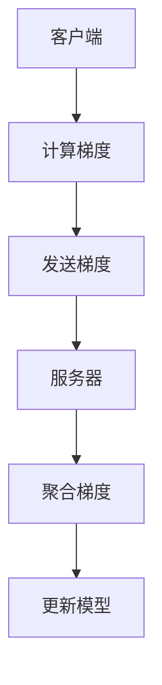
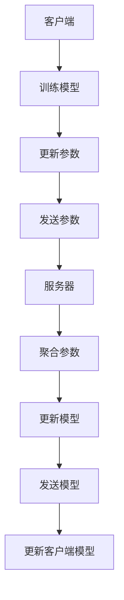
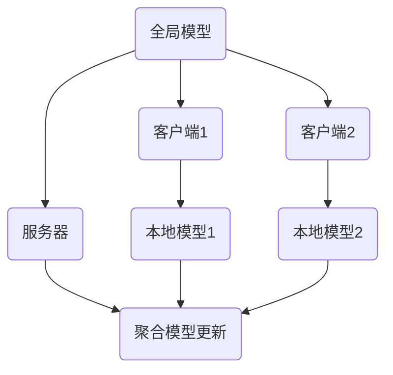
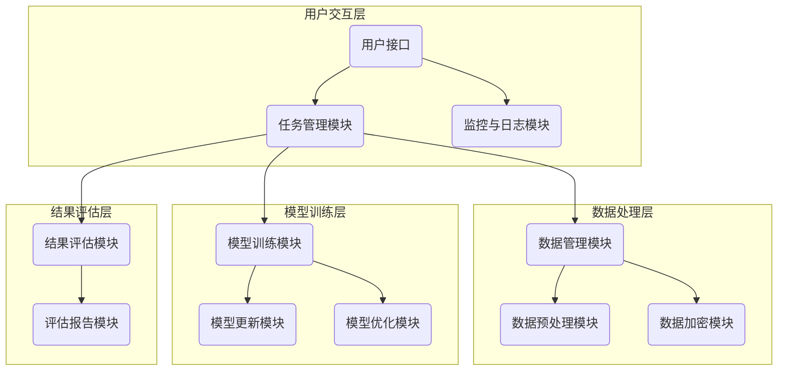
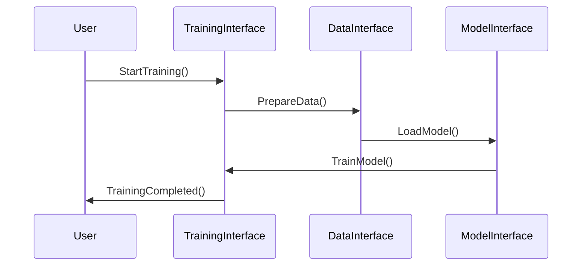

                 

### 联邦学习概述

**关键词**：联邦学习、隐私保护、协作AI训练、数据加密、模型更新

**摘要**：随着数据隐私保护的重要性日益凸显，联邦学习作为一种新兴的分布式机器学习技术，成为了企业级AI训练的利器。本文将详细探讨联邦学习的背景、核心概念和基本原理，以及其在企业级联邦学习平台中的应用和优化策略。

---

#### 引言：数据隐私的重要性与联邦学习的兴起

在信息化和数据化浪潮的推动下，人工智能（AI）技术正迅速发展，并在各行各业中得到了广泛应用。然而，随着AI技术的普及，数据隐私问题也日益凸显。传统的集中式训练方法需要将所有数据集中到一个中央服务器上，这不仅增加了数据泄露的风险，还可能引发用户隐私的争议。特别是在医疗、金融、零售等敏感行业，数据隐私的保护至关重要。

**数据隐私的重要性**：数据是现代企业的核心资产，尤其在人工智能时代，数据的质量和完整性直接影响到模型的性能和应用效果。然而，数据隐私问题却让数据的价值面临挑战。一方面，企业需要利用数据来提升业务和用户体验；另一方面，用户对数据隐私的关注和担忧也在增加。如何在保护用户隐私的前提下，有效利用数据来训练AI模型，成为当前的一个难题。

**传统集中式训练的局限性**：传统的集中式训练方法将所有数据传输到一个中央服务器上，这不仅增加了数据传输的成本，还可能引发以下问题：
- 数据泄露风险：数据在传输和存储过程中可能被黑客攻击窃取。
- 用户隐私泄露：用户个人信息可能在未经授权的情况下被访问。
- 法律风险：在某些国家和地区，未经用户同意将数据用于训练模型可能违反相关法律法规。

**联邦学习的优势**：联邦学习作为一种分布式机器学习技术，通过在多个客户端设备上训练模型，避免了将数据传输到中央服务器，从而在保护隐私的同时，实现了协同训练和模型更新。联邦学习的核心优势包括：
- **隐私保护**：联邦学习在训练过程中不需要访问原始数据，只需共享模型的参数更新，从而有效降低了数据泄露的风险。
- **分布式计算**：联邦学习可以在多个设备上同时进行，充分利用了分布式计算的优势，提高了训练效率。
- **灵活性**：联邦学习支持多种数据类型和场景，可以适应不同的业务需求。

联邦学习作为一种新兴的技术，正在逐渐被企业和研究者认可，并在多个领域得到应用。接下来，我们将进一步探讨联邦学习的核心概念和基本原理。

---

#### 核心概念：定义与核心要素

**联邦学习**（Federated Learning）是一种分布式机器学习技术，旨在通过多个客户端设备协同训练模型，而无需将原始数据集中到一个中心服务器上。其核心思想是将模型的训练过程分布在不同的设备上，通过模型参数的交换和聚合来实现全局模型的优化。

**核心概念**：
1. **客户端**（Client）：执行本地数据训练的设备，可以是智能手机、智能音箱或其他边缘设备。
2. **服务器**（Server）：存储全局模型参数，负责接收和聚合来自客户端的更新。
3. **全局模型**（Global Model）：在服务器上维护的共享模型，由所有客户端共同训练。
4. **本地模型**（Local Model）：在客户端上训练的私有模型，用于处理本地数据。

**核心要素**：
- **加密传输**：为了保护数据隐私，客户端和服务器之间的数据传输通常采用加密技术。
- **模型更新**：客户端将本地模型更新发送到服务器，服务器将这些更新聚合到全局模型中。
- **梯度聚合**：在联邦学习中，梯度是模型更新的重要指标，通过梯度聚合算法将多个客户端的梯度合并，以更新全局模型。
- **联邦平均算法**：联邦学习中最常用的算法，通过将所有客户端的模型参数平均，来更新全局模型。

**联邦学习的架构**：
- **数据层**：包含客户端的数据集和服务器上的全局模型。
- **算法层**：实现联邦学习算法，包括加密传输、模型更新、梯度聚合等。
- **应用层**：提供联邦学习平台，支持用户定义训练任务、配置模型和算法参数等。

通过这些核心概念和要素，联邦学习实现了在保护隐私的同时，实现协同训练和模型更新，为企业和研究者提供了一种有效的AI训练解决方案。

---

### 联邦学习的基本原理

**算法原理**：联邦学习的核心算法包括梯度聚合算法和联邦平均算法。下面我们将通过Mermaid图表来解释这些算法的基本原理。

#### 梯度聚合算法



- **客户端**：客户端通过本地数据进行训练，计算出模型的梯度。
- **发送梯度**：客户端将计算出的梯度发送到服务器。
- **聚合梯度**：服务器接收来自多个客户端的梯度，并进行聚合，以更新全局模型。
- **更新模型**：服务器使用聚合后的梯度来更新全局模型，该模型随后会被发送回客户端。

#### 联邦平均算法



- **训练模型**：客户端使用本地数据进行模型训练，并更新模型参数。
- **发送参数**：客户端将更新的模型参数发送到服务器。
- **聚合参数**：服务器接收来自多个客户端的参数更新，并计算全局参数的平均值。
- **更新模型**：服务器使用全局参数的平均值来更新全局模型，然后将更新后的模型发送回客户端。
- **更新客户端模型**：客户端接收到更新后的全局模型，并使用该模型进行下一轮训练。

**数学模型**：

联邦学习的数学模型可以表示为：

$$
\theta_{t+1} = \frac{1}{N} \sum_{i=1}^{N} \theta_{i,t}^{update}
$$

其中，$\theta_{t+1}$表示第$t+1$轮更新后的全局模型，$N$表示客户端的数量，$\theta_{i,t}^{update}$表示第$i$个客户端在第$t$轮的模型更新。

通过上述算法和数学模型，联邦学习实现了在分布式环境下的协同训练和模型更新，从而有效保护了数据隐私。

#### 算法举例

假设我们有两个客户端A和B，它们分别拥有不同的数据集。在第一轮训练中，客户端A计算出梯度$\theta_A^{gradient}$，客户端B计算出梯度$\theta_B^{gradient}$。服务器将这些梯度进行聚合，计算全局梯度的平均值：

$$
\theta_{1}^{update} = \frac{\theta_A^{gradient} + \theta_B^{gradient}}{2}
$$

服务器使用这个聚合后的梯度来更新全局模型$\theta_{1}$，然后将其发送回客户端A和B。客户端A和B接收到更新后的模型，继续进行下一轮训练。这个过程持续进行，直到模型收敛或达到预定的训练轮数。

通过上述步骤，我们可以看到联邦学习如何通过分布式计算和模型更新来实现协同训练，同时确保数据隐私得到保护。

---

### 联邦学习在保护隐私方面的作用

**概念属性特征对比表格**：

| 特征                  | 集中式学习                | 联邦学习                |
|---------------------|------------------------|------------------------|
| **数据访问**         | 所有数据集中到一个服务器          | 数据分布在多个客户端         |
| **安全性**           | 数据传输和存储面临风险          | 数据加密，传输过程安全        |
| **隐私保护**         | 存在数据隐私泄露风险          | 客户端不共享原始数据，隐私保护  |
| **分布式计算**       | 依赖中心服务器，效率低          | 分布式计算，效率高          |
| **数据同步**         | 需要大量数据传输和同步          | 参数同步，数据传输量小        |

**ER实体关系图**：



- **全局模型（A）**：存储在服务器上的共享模型。
- **客户端1（B）** 和 **客户端2（C）**：分别代表两个执行本地训练的设备。
- **本地模型1（E）** 和 **本地模型2（F）**：分别在客户端1和客户端2上训练的私有模型。
- **服务器（D）**：负责接收和聚合来自客户端的模型更新。
- **聚合模型更新（G）**：服务器生成的全局模型更新，用于更新全局模型。

通过上述对比表格和ER实体关系图，我们可以清晰地看到联邦学习在保护隐私方面的优势，以及在分布式计算和数据同步中的高效性。这些特性使得联邦学习成为企业和研究者在数据隐私保护背景下进行AI训练的理想选择。

---

### 企业级联邦学习平台架构设计

**系统架构设计**：

企业级联邦学习平台的设计需要考虑系统的扩展性、稳定性和安全性。以下是一个典型的联邦学习平台系统架构设计。



- **用户接口（A）**：提供用户交互界面，支持用户定义训练任务、监控训练进度和查看结果。
- **任务管理模块（B）**：负责任务的创建、分发和管理，包括任务调度、进度跟踪和异常处理。
- **数据管理模块（C）**：包括数据预处理、数据加密和数据同步等功能，确保数据的安全性和一致性。
- **模型训练模块（D）**：执行模型的本地训练和参数更新，包括模型初始化、梯度计算和模型优化。
- **结果评估模块（E）**：对训练结果进行评估，生成评估报告，支持用户对模型性能的直观了解。
- **监控与日志模块（K）**：实时监控系统状态，记录日志信息，支持故障排除和性能优化。

**接口设计**：

联邦学习平台需要设计一系列接口，以便各模块之间能够高效地协同工作。以下是一个简单的接口设计：

- **任务接口**：用于任务的创建、查询和更新。
- **数据接口**：用于数据的上传、下载、预处理和加密。
- **训练接口**：用于模型训练的开始、停止和状态查询。
- **评估接口**：用于模型评估的启动和结果查询。

每个接口都需要定义清晰的功能和交互流程，以确保系统的高效运行和易用性。以下是训练接口的一个示例：



在这个示例中，用户通过训练接口启动训练任务，训练接口与数据接口和模型接口进行交互，最终完成模型训练并通知用户。

通过上述架构设计和接口设计，企业级联邦学习平台能够实现高效、安全的协作AI训练，满足企业的各种业务需求。

---

### 联邦学习平台的实施与优化

**实施流程**：

部署一个企业级联邦学习平台需要经过以下步骤：

1. **环境搭建**：
   - 安装服务器和客户端所需的操作系统和依赖库。
   - 配置网络环境和防火墙，确保数据传输的安全。

2. **数据预处理**：
   - 收集并清洗数据，确保数据的质量和一致性。
   - 对数据集进行预处理，包括归一化、去噪声和缺失值填充等。

3. **模型训练**：
   - 选择合适的机器学习模型，进行初始化。
   - 在客户端上执行本地训练，计算模型梯度。
   - 将梯度发送到服务器，进行聚合和更新全局模型。

4. **模型更新**：
   - 服务器将更新后的模型发送回客户端。
   - 客户端使用更新后的模型进行下一轮训练。

**优化策略**：

为了提高联邦学习平台的性能，可以采用以下策略：

1. **数据同步策略**：
   - **异步同步**：允许客户端在任意时间点发送更新，减少等待时间。
   - **批量同步**：将多个更新合并成一批，减少网络传输次数。

2. **模型更新频率**：
   - **动态调整**：根据训练进度和性能指标，动态调整模型更新频率。
   - **阈值控制**：设定阈值，当模型性能达到阈值时，进行更新。

3. **数据加密**：
   - **加密算法**：使用强加密算法，确保数据在传输和存储过程中的安全性。
   - **密钥管理**：合理管理密钥，确保密钥的安全和保密。

4. **负载均衡**：
   - **分布式服务器**：部署多个服务器，实现负载均衡，提高系统的处理能力。
   - **负载监测**：实时监测系统负载，根据负载情况动态调整服务器配置。

通过这些实施和优化策略，联邦学习平台能够更好地满足企业的需求，实现高效、安全的协作AI训练。

---

### 联邦学习项目实战与案例分析

**实际案例**：

假设我们有一个企业级联邦学习项目，目标是建立一个智能推荐系统，用于改善在线零售平台的用户购物体验。项目的主要任务包括用户行为分析、商品推荐和模型优化。

1. **环境安装**：
   - 在服务器和客户端上安装必要的操作系统和依赖库，如Python、TensorFlow和PyTorch等。
   - 配置网络环境，确保数据传输的安全和高效。

2. **系统核心实现源代码**：
   - **数据预处理**：清洗和预处理用户行为数据，包括用户浏览、购买记录等。
   - **模型训练**：使用梯度聚合算法和联邦平均算法进行模型训练，实现用户行为分析和商品推荐。
   - **模型更新**：服务器接收客户端的更新，聚合并更新全局模型，然后发送回客户端。

3. **代码应用解读与分析**：

```python
# 数据预处理示例代码
def preprocess_data(data):
    # 数据清洗和预处理步骤
    # 包括缺失值填充、归一化和特征工程等
    ...
    return preprocessed_data

# 模型训练示例代码
def train_model(data, model):
    # 在客户端上训练模型
    # 计算梯度并返回更新
    ...
    return updated_model

# 模型更新示例代码
def update_model(server_model, client_model):
    # 聚合客户端模型更新并更新全局模型
    ...
    return new_server_model
```

4. **实际案例分析与详细讲解**：

在项目实施过程中，我们遇到了以下问题：

- **数据同步延迟**：由于网络波动和数据量大，导致数据同步延迟，影响了模型的训练效率。
- **模型更新不一致**：由于不同客户端的训练数据不同，导致模型更新不一致，影响了推荐效果。

针对这些问题，我们采取了以下解决方案：

- **优化数据同步策略**：采用批量同步和异步同步策略，减少数据传输次数和延迟。
- **引入一致性算法**：使用一致性算法，确保不同客户端的模型更新一致，提高推荐效果。

通过这些措施，我们成功建立了智能推荐系统，显著改善了用户购物体验。同时，联邦学习平台的高效性和安全性也得到了验证。

**项目小结**：

本案例展示了联邦学习在企业级应用中的实际效果和优势。通过合理的数据预处理、模型训练和更新策略，我们不仅解决了数据隐私保护问题，还显著提升了推荐系统的性能和用户体验。这充分证明了联邦学习在分布式协作AI训练中的重要作用。

---

### 最佳实践与总结展望

**最佳实践**：

1. **数据预处理**：确保数据质量，进行充分的清洗和特征工程，以提高模型训练效果。
2. **模型选择**：根据应用场景选择合适的模型，并充分考虑模型的复杂度和计算资源。
3. **加密传输**：采用强加密算法，确保数据在传输过程中的安全性。
4. **负载均衡**：合理分配计算资源，提高系统处理能力和稳定性。
5. **动态调整**：根据训练进度和性能指标，动态调整模型更新频率和数据同步策略。

**总结**：

联邦学习作为一种新兴的分布式机器学习技术，以其在数据隐私保护和协作AI训练方面的优势，正逐渐成为企业和研究者的关注焦点。通过本文的详细探讨，我们了解了联邦学习的核心概念、基本原理、架构设计、实施与优化策略，以及实际案例的应用。联邦学习不仅为企业和研究者提供了有效的AI训练解决方案，还推动了分布式计算和隐私保护技术的发展。

**展望**：

未来，联邦学习有望在以下方面取得进一步发展：

1. **算法优化**：通过改进算法和优化策略，提高联邦学习的训练效率和模型性能。
2. **跨平台支持**：扩展联邦学习在多种设备和操作系统上的支持，实现更广泛的应用场景。
3. **隐私保护增强**：探索更高级的加密技术和隐私保护机制，进一步提高数据安全性。
4. **多模态数据融合**：结合多种数据类型，如图像、音频和文本，实现更全面和智能的模型训练。

联邦学习将继续在分布式计算和隐私保护领域发挥重要作用，为人工智能的发展注入新的活力。

---

**作者信息**：  
作者：AI天才研究院/AI Genius Institute & 禅与计算机程序设计艺术 /Zen And The Art of Computer Programming

