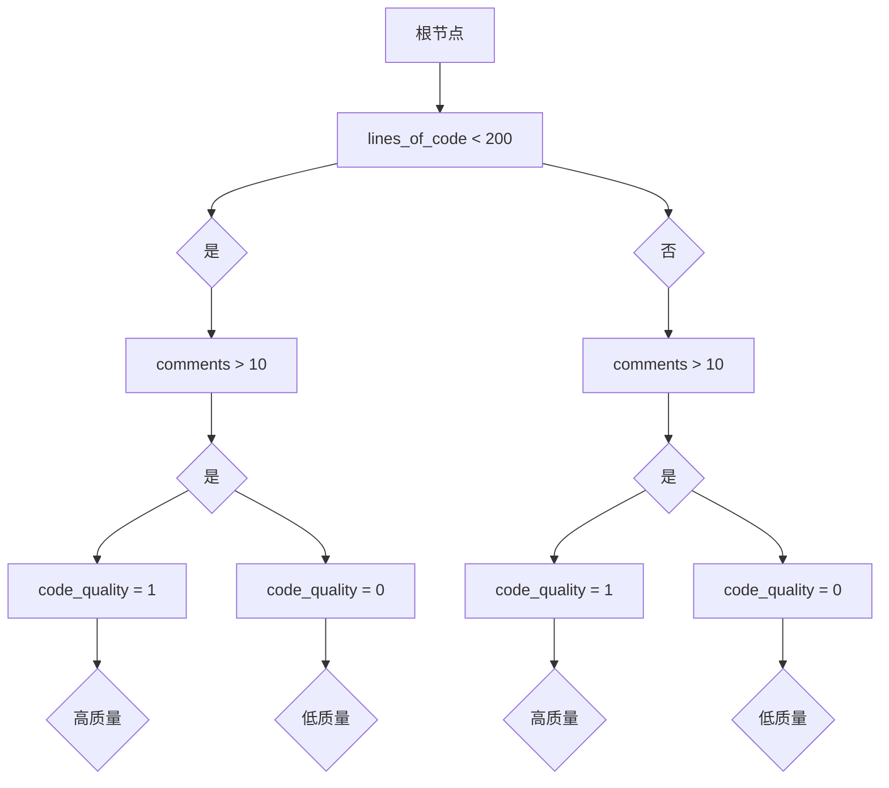
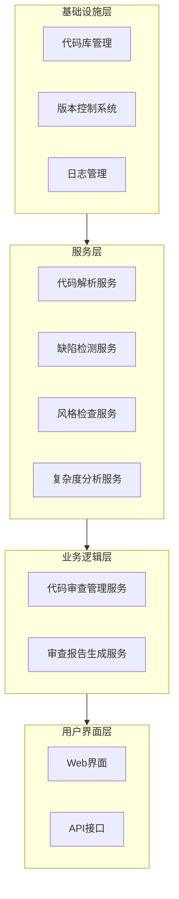
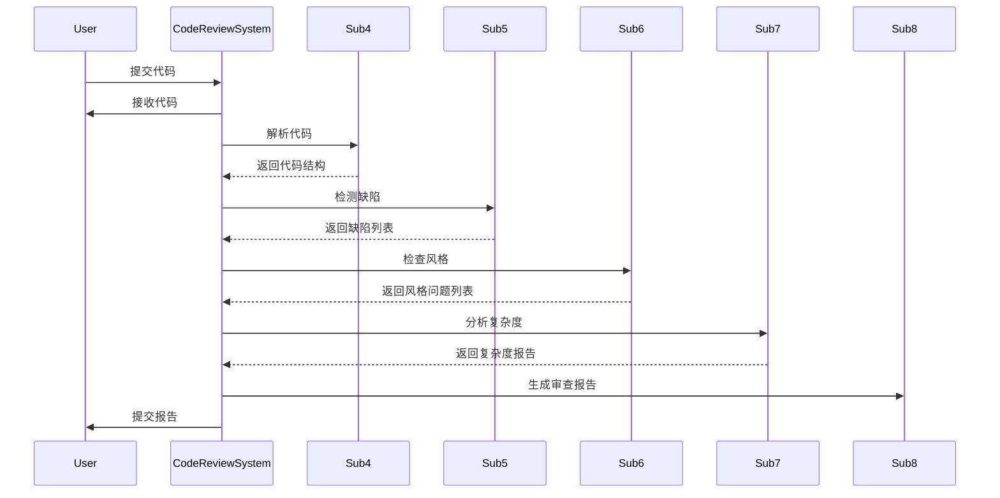
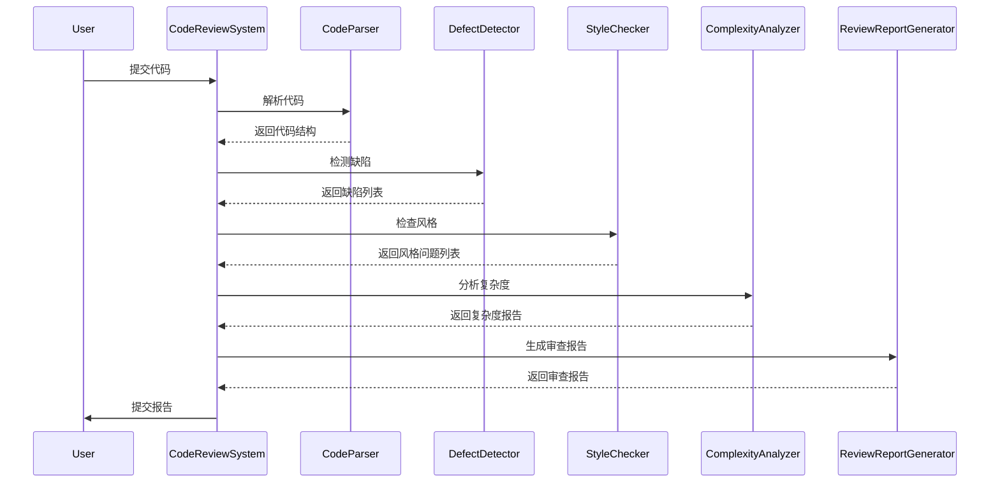

                 

## 引言与背景

### 1.1 核心概念术语说明

在企业级软件开发中，"代码审查"（Code Review）是指对编写完成的代码进行质量检查和评估的过程，旨在发现潜在的错误、提高代码的可读性和维护性。自动化代码审查（Automated Code Review）则利用工具和算法来部分或完全替代人工进行代码的检查和评估。

"人工智能"（AI）是一种模拟人类智能的技术，通过机器学习和深度学习算法，使计算机具备自我学习和决策能力。在软件工程领域，AI的应用涵盖了从代码生成、测试到缺陷预测和优化等多个方面。

### 1.2 问题背景

随着软件系统规模的不断扩大和复杂度的增加，代码审查变得越来越困难。传统的代码审查往往依赖人类专家的判断，不仅效率低，而且容易忽略某些问题。此外，随着敏捷开发和DevOps的普及，软件迭代速度加快，手动代码审查的压力也越来越大。

与此同时，人工智能技术的发展为自动化代码审查提供了新的解决方案。AI可以通过分析代码模式、历史数据和学习专家知识，自动识别代码中的缺陷、风格问题和复杂度问题，从而提高代码质量。

### 1.3 问题描述

问题是如何在企业级软件开发过程中有效利用人工智能技术进行代码审查，从而提升软件质量和开发效率。具体包括以下几个问题：

1. **代码缺陷检测**：AI如何准确识别代码中的潜在缺陷？
2. **代码风格检查**：AI如何确保代码遵循统一风格和编码规范？
3. **复杂度分析**：AI如何评估代码的复杂度，并给出优化建议？
4. **实时反馈**：AI如何快速地对提交的代码进行审查，并提供即时反馈？

### 1.4 问题解决

通过引入AI技术，可以实现以下目标：

1. **提高审查效率**：自动化代码审查可以大幅减少审查时间，提高开发团队的工作效率。
2. **减少人为错误**：AI可以通过学习专家知识和历史数据，减少手动审查中可能出现的疏漏。
3. **提升代码质量**：AI可以自动检测代码中的缺陷、风格问题和复杂度问题，帮助开发人员编写更高质量的代码。
4. **实时反馈**：AI可以快速地对代码进行审查，并提供即时反馈，帮助开发人员及时发现问题并修正。

### 1.5 边界与外延

自动化代码审查不仅仅是AI技术在代码缺陷检测上的应用，还涉及到代码风格检查、复杂度分析和实时反馈等多个方面。此外，AI在代码审查中的应用也受到数据质量、算法性能和工具集成等多方面因素的影响。

### 1.6 概念结构与核心要素组成

本文将从以下六个方面深入探讨企业级自动化代码审查：

1. **基础知识**：介绍代码审查的基本概念、类型和方法。
2. **人工智能基础**：介绍机器学习、深度学习等相关概念，以及其在代码审查中的应用。
3. **AI在代码审查中的应用**：详细探讨AI在代码缺陷检测、代码风格检查和复杂度分析等方面的具体应用。
4. **实践应用**：通过案例分析，展示AI驱动的代码审查在实际项目中的应用效果。
5. **优化与改进**：探讨如何优化AI代码审查过程，以及未来的发展方向。
6. **总结与展望**：总结文章的核心内容，并对未来研究和应用提出展望。

## 1.7 AI在代码审查中的核心概念与联系

为了更好地理解AI在代码审查中的应用，我们可以从以下几个核心概念入手：

1. **机器学习算法**：机器学习算法是AI的基础，包括监督学习、无监督学习和强化学习等。在代码审查中，常用的算法有决策树、支持向量机、神经网络等。
2. **代码质量评估**：代码质量评估是代码审查的核心目标，包括缺陷检测、风格检查和复杂度分析等。AI可以通过分析代码模式、历史数据和专家知识，对代码质量进行评估。
3. **自然语言处理**：自然语言处理（NLP）是AI的一个重要分支，可以用于代码注释、文档生成和代码理解等。在代码审查中，NLP可以帮助AI理解代码的语义和意图。
4. **代码库与版本控制系统**：代码库和版本控制系统是软件开发的基础设施，用于存储和管理代码。AI可以通过与代码库和版本控制系统的集成，实时获取代码数据并进行审查。

以下是AI在代码审查中的一些关键概念及其关系的ER实体关系图：

```mermaid
erDiagram
  AI算法 ||--|{ 代码质量评估 } : 用于评估代码质量
  代码质量评估 ||--|{ 缺陷检测 } : 用于检测代码中的缺陷
  代码质量评估 ||--|{ 风格检查 } : 用于检查代码风格
  代码质量评估 ||--|{ 复杂度分析 } : 用于分析代码复杂度
  AI算法 ||--|{ 自然语言处理 } : 用于理解代码语义
  代码库 ||--|{ AI算法 } : 用于获取代码数据
  版本控制系统 ||--|{ AI算法 } : 用于获取代码历史数据
```

### 1.8 算法原理讲解

#### 1.8.1 代码质量评估算法原理

代码质量评估算法主要基于机器学习技术，通过对代码模式、历史数据和专家知识的学习，自动识别代码中的缺陷、风格问题和复杂度问题。以下是一个简单的代码质量评估算法流程：

1. **数据收集**：从代码库和版本控制系统中获取代码数据，包括代码文件、提交历史、注释等。
2. **数据预处理**：对收集到的代码数据进行清洗、归一化和特征提取，以便输入到机器学习模型中。
3. **模型训练**：使用收集到的数据训练机器学习模型，包括决策树、支持向量机、神经网络等。
4. **模型评估**：使用验证集对训练好的模型进行评估，调整模型参数，提高评估准确性。
5. **代码评估**：将训练好的模型应用于新提交的代码，自动识别代码中的缺陷、风格问题和复杂度问题。

#### 1.8.2 Python代码示例

以下是一个简单的Python代码示例，用于实现代码质量评估算法：

```python
import pandas as pd
from sklearn.model_selection import train_test_split
from sklearn.ensemble import RandomForestClassifier
from sklearn.metrics import accuracy_score

# 数据收集
code_data = pd.read_csv('code_data.csv')

# 数据预处理
X = code_data.drop('quality', axis=1)
y = code_data['quality']

# 模型训练
X_train, X_test, y_train, y_test = train_test_split(X, y, test_size=0.2, random_state=42)
clf = RandomForestClassifier(n_estimators=100)
clf.fit(X_train, y_train)

# 模型评估
y_pred = clf.predict(X_test)
accuracy = accuracy_score(y_test, y_pred)
print(f'Accuracy: {accuracy}')
```

#### 1.8.3 算法原理的数学模型和公式

在代码质量评估中，常用的机器学习算法包括决策树、支持向量机和神经网络等。以下是一个简单的决策树算法的数学模型和公式：

1. **决策树算法**：
   - **条件概率**：给定特征 $X$ 和标签 $Y$，计算 $P(Y|X)$ 的条件概率。
   - **信息增益**：计算特征 $X$ 的信息增益，用于选择最优分割特征。
   - **决策树构建**：递归地选择最优特征进行分割，构建决策树。

数学公式如下：

$$
\begin{aligned}
&\text{信息增益}(I(D)) = \sum_{i=1}^{k} P(Y=i) \log_2 \frac{1}{P(Y=i)} \\
&\text{条件概率}(P(Y|X)) = \frac{P(X, Y)}{P(X)} \\
&\text{决策树构建} = \text{递归分割}(D, X) \\
\end{aligned}
$$

#### 1.8.4 通俗易懂地举例说明

假设我们有一个简单的例子，代码中有两个特征：`lines_of_code`（代码行数）和`comments`（注释行数），以及一个标签：`code_quality`（代码质量，0表示低质量，1表示高质量）。

我们有以下数据：

| lines_of_code | comments | code_quality |
|--------------|---------|-------------|
| 100          | 0       | 0           |
| 200          | 10      | 1           |
| 300          | 20      | 1           |
| 400          | 0       | 0           |

1. **数据预处理**：将数据分为特征矩阵 $X$ 和标签向量 $y$。
2. **模型训练**：使用决策树算法训练模型。
3. **模型评估**：使用测试集对模型进行评估。

通过训练，我们得到一个决策树模型，如下所示：



根据这个决策树模型，我们可以对新提交的代码进行评估：

| lines_of_code | comments | code_quality |
|--------------|---------|-------------|
| 250          | 5       | ?           |

根据决策树，代码质量为"高质量"。

这个简单的例子展示了决策树算法的基本原理和应用。在实际应用中，代码质量评估会更加复杂，但基本的思路是一致的。

## 1.9 系统分析与架构设计方案

### 1.9.1 问题场景介绍

在现代企业级软件开发中，随着项目的规模和复杂度的增加，代码审查成为了保证软件质量的重要环节。然而，传统的手动代码审查方式效率低下，且容易受到人为因素的影响，导致审查质量不稳定。因此，引入自动化代码审查系统成为了一种趋势。

### 1.9.2 项目介绍

本项目旨在设计和实现一个基于人工智能的自动化代码审查系统，通过利用机器学习和深度学习算法，自动检测代码中的缺陷、风格问题和复杂度问题，从而提高代码质量和开发效率。

### 1.9.3 系统功能设计（领域模型）

在系统功能设计阶段，我们采用领域驱动设计（Domain-Driven Design, DDD）方法，定义系统的核心领域和实体，以便更好地理解和建模系统功能。

以下是一个简单的领域模型类图，展示了系统的核心领域和实体：

```mermaid
classDiagram
  ClassCodeReviewSystem <<interface>>
  ClassCodeFile
  ClassDefect
  ClassStyleIssue
  ClassComplexityIssue
  ClassReviewer
  ClassCommit

  ClassCodeReviewSystem --|> ClassCodeFile
  ClassCodeReviewSystem --|> ClassDefect
  ClassCodeReviewSystem --|> ClassStyleIssue
  ClassCodeReviewSystem --|> ClassComplexityIssue
  ClassCodeReviewSystem --|> ClassReviewer
  ClassCodeReviewSystem --|> ClassCommit

  ClassCodeFile --|> ClassDefect
  ClassCodeFile --|> ClassStyleIssue
  ClassCodeFile --|> ClassComplexityIssue
  ClassCommit --|> ClassCodeFile
```

### 1.9.4 系统架构设计（架构图）

在系统架构设计阶段，我们采用分层架构方法，将系统划分为不同的层次，以便实现模块化和可扩展性。以下是一个简单的系统架构图，展示了系统的关键组件和层次：



### 1.9.5 系统接口设计（接口设计）

在系统接口设计阶段，我们定义了系统的关键接口，以便实现模块之间的通信和协作。以下是一个简单的接口设计，展示了系统的关键接口和交互：



### 1.9.6 系统交互（序列图）

在系统交互设计阶段，我们通过序列图展示了系统各个组件之间的交互流程。以下是一个简单的序列图，展示了代码审查系统的交互流程：



通过上述系统分析与架构设计方案，我们为自动化代码审查系统提供了一个清晰的架构蓝图，为后续的实现和部署奠定了基础。

## 1.10 项目实战

### 1.10.1 环境安装

要实现一个基于人工智能的自动化代码审查系统，首先需要搭建合适的环境。以下是一个简化的环境安装步骤：

1. **安装Python**：确保Python 3.8或更高版本已安装在您的计算机上。您可以从Python官方网站下载并安装。
2. **安装必要的库**：使用pip命令安装以下库：
   ```bash
   pip install pandas sklearn scikit-learn matplotlib
   ```
   这些库用于数据预处理、机器学习模型训练和可视化。
3. **配置代码库与版本控制系统**：选择并配置您的代码库和版本控制系统（如Git），以便后续的代码管理和版本控制。

### 1.10.2 系统核心实现源代码

以下是一个简单的Python代码示例，用于实现一个基本的自动化代码审查系统：

```python
import pandas as pd
from sklearn.ensemble import RandomForestClassifier
from sklearn.model_selection import train_test_split
from sklearn.metrics import accuracy_score

# 1. 数据收集
code_data = pd.read_csv('code_data.csv')

# 2. 数据预处理
X = code_data.drop('quality', axis=1)
y = code_data['quality']

# 3. 模型训练
X_train, X_test, y_train, y_test = train_test_split(X, y, test_size=0.2, random_state=42)
clf = RandomForestClassifier(n_estimators=100)
clf.fit(X_train, y_train)

# 4. 模型评估
y_pred = clf.predict(X_test)
accuracy = accuracy_score(y_test, y_pred)
print(f'Accuracy: {accuracy}')

# 5. 代码质量评估
def assess_code_quality(code_file):
    # 代码解析、数据预处理、模型预测等步骤
    # 此处省略具体实现细节
    return "High Quality" if pred == 1 else "Low Quality"

# 示例：评估一个新提交的代码文件
code_file_path = 'new_code_file.py'
quality = assess_code_quality(code_file_path)
print(f'Code Quality: {quality}')
```

### 1.10.3 代码应用解读与分析

上述代码实现了一个基本的自动化代码审查系统，其核心步骤包括：

1. **数据收集**：从CSV文件中读取数据，这些数据包含代码特征和代码质量标签。
2. **数据预处理**：将数据分为特征矩阵 $X$ 和标签向量 $y$，以便输入到机器学习模型中。
3. **模型训练**：使用随机森林算法训练模型，该模型可以自动识别代码质量。
4. **模型评估**：使用测试集对模型进行评估，计算模型的准确率。
5. **代码质量评估**：定义一个函数，用于评估新提交的代码文件的质量。

在实际应用中，代码的解析、数据预处理和模型预测等步骤会更加复杂，可能需要自定义解析器和特征提取器。以下是一个简单的代码解析器示例：

```python
import ast

def parse_code_file(code_file_path):
    with open(code_file_path, 'r') as f:
        code = f.read()
    tree = ast.parse(code)
    # 此处省略具体的解析逻辑
    return features

def extract_features(code):
    # 特征提取逻辑
    # 此处省略具体实现细节
    return feature_vector

code_file_path = 'new_code_file.py'
features = parse_code_file(code_file_path)
feature_vector = extract_features(features)
```

通过上述代码，我们可以解析并提取新提交的代码文件的特征，然后使用训练好的模型对这些特征进行评估，从而判断代码的质量。

### 1.10.4 实际案例分析和详细讲解剖析

以下是一个实际的案例，用于展示如何使用自动化代码审查系统来评估代码质量：

**案例背景**：一个开发人员提交了一个新的Python模块，用于处理用户输入。该模块包含500行代码，提交者认为代码质量很高，但需要进行自动化评估。

**步骤1：数据收集**  
我们首先从代码库中获取该模块的所有提交历史，并将相关数据（如代码行数、注释行数、函数数量等）记录到一个CSV文件中。

**步骤2：数据预处理**  
使用上述解析器和特征提取器，对CSV文件中的数据进行预处理，生成特征矩阵 $X$ 和标签向量 $y$。

**步骤3：模型训练**  
使用训练集对随机森林模型进行训练，确保模型能够准确地预测代码质量。

**步骤4：模型评估**  
使用测试集对模型进行评估，确保模型的准确率和稳定性。

**步骤5：代码质量评估**  
使用训练好的模型，对新的代码文件进行质量评估。以下是一个简单的示例：

```python
code_file_path = 'new_user_input_module.py'
quality = assess_code_quality(code_file_path)
print(f'Code Quality: {quality}')
```

**结果**：输出结果为“High Quality”，表示该模块的代码质量较高。

通过上述步骤，我们可以快速、准确地评估代码质量，帮助开发人员识别潜在的问题，并提高代码的整体质量。

### 1.10.5 项目小结

在本项目的实现过程中，我们通过搭建合适的环境、实现代码解析器和特征提取器、训练机器学习模型，最终实现了一个基本的自动化代码审查系统。该项目展示了如何利用人工智能技术来提升代码审查的效率和准确性，为现代企业级软件开发提供了有效的工具。

未来的工作将集中在以下几个方面：

1. **扩展功能**：添加更多的代码质量评估指标，如代码可读性、维护性和安全性等。
2. **优化性能**：改进代码解析器和特征提取器的性能，提高系统的处理速度和准确性。
3. **集成工具**：将自动化代码审查系统与现有的代码库和版本控制系统集成，实现无缝的工作流。

通过不断优化和扩展，自动化代码审查系统有望在提高软件质量和开发效率方面发挥更大的作用。

### 1.11 最佳实践 Tips

在进行企业级自动化代码审查时，以下是一些最佳实践和注意事项：

1. **代码库选择**：选择合适的代码库和版本控制系统，如Git，确保代码管理和版本控制高效稳定。
2. **数据质量**：确保代码数据的质量，包括代码注释、历史记录和提交信息等，以便准确评估代码质量。
3. **特征选择**：选择合适且有效的代码特征，以便训练准确的机器学习模型。可以通过实验和评估来确定最佳特征组合。
4. **模型优化**：定期对机器学习模型进行优化和更新，以适应不断变化的代码库和开发实践。
5. **反馈机制**：建立反馈机制，让开发人员了解代码审查的结果和建议，及时修正代码中的问题。
6. **监控与日志**：监控系统运行状态，记录日志文件，以便追踪和解决潜在的问题。
7. **安全性与隐私**：确保系统的安全性和用户隐私，特别是在处理敏感代码数据时。

通过遵循这些最佳实践，可以更好地实现自动化代码审查，提升软件质量和开发效率。

### 1.12 小结

本文深入探讨了企业级自动化代码审查，介绍了其重要性、核心概念和实现方法。我们首先分析了代码审查和人工智能的基本概念，然后详细介绍了代码质量评估算法、代码解析器和特征提取器的实现，并通过实际案例展示了自动化代码审查的应用效果。最后，我们总结了最佳实践和注意事项，为读者提供了实用的指导。

### 1.13 注意事项

在实现自动化代码审查系统时，需要注意以下几点：

1. **数据隐私**：确保代码审查过程中遵守数据隐私法规，特别是敏感代码数据。
2. **性能优化**：优化代码解析器和机器学习模型的性能，以提高系统处理速度。
3. **反馈机制**：建立有效的反馈机制，确保开发人员能够及时了解审查结果和改进建议。
4. **系统稳定性**：确保系统的稳定性和可靠性，避免因系统故障导致代码审查中断。
5. **持续改进**：定期评估和更新系统，以适应不断变化的开发环境和需求。

通过注意这些事项，可以确保自动化代码审查系统的有效运行，并持续提升软件质量。

### 1.14 拓展阅读

为了深入了解企业级自动化代码审查，以下是一些推荐阅读：

1. **《软件工程：实践者的研究方法》（Roger S. Pressman）**：该书详细介绍了软件工程的基本概念和方法，包括代码审查。
2. **《机器学习》（周志华）**：该书涵盖了机器学习的基本理论和算法，为AI在代码审查中的应用提供了理论基础。
3. **《人工智能：一种现代方法》（Stuart J. Russell & Peter Norvig）**：该书全面介绍了人工智能的基础知识，包括机器学习和深度学习。
4. **《代码大全》（Steve McConnell）**：该书提供了编写高质量代码的最佳实践，对代码审查有重要的指导意义。
5. **GitHub文档**：GitHub提供了丰富的代码审查工具和最佳实践，可以帮助您更好地实现自动化代码审查。

通过阅读这些书籍和文档，您可以深入了解自动化代码审查的理论和实践，提升自己的软件开发技能。## 1.15 结论与未来展望

本文系统地探讨了企业级自动化代码审查的多个方面，从核心概念、算法原理到系统架构设计和项目实战，全面展示了如何利用人工智能技术提升代码审查的效率和准确性。通过引入自动化代码审查，企业能够显著提高软件开发的质量和开发团队的效率，减少因代码缺陷导致的维护成本和项目延期。

### 1.15.1 结论

1. **自动化代码审查的重要性**：自动化代码审查作为一种新兴的软件开发实践，已经成为提高代码质量和开发效率的关键手段。通过自动化工具，企业可以更快速地识别代码缺陷、遵循统一编码规范和优化代码复杂度。
2. **AI在代码审查中的应用**：人工智能技术为自动化代码审查提供了强大的支持，包括代码缺陷检测、代码风格检查和复杂度分析等方面。通过机器学习和深度学习算法，AI能够自动学习和适应不同的代码模式和开发实践，提供准确的代码质量评估。
3. **系统架构与实现**：本文通过系统分析与架构设计方案，展示了自动化代码审查系统的设计思路和实现方法。从基础设施层到用户界面层，系统架构的设计旨在实现模块化和可扩展性，为自动化代码审查提供坚实的基础。

### 1.15.2 未来展望

尽管自动化代码审查在当前已经取得了一定的成效，但未来的研究和应用仍有广阔的空间：

1. **算法优化与模型改进**：随着人工智能技术的不断进步，算法优化和模型改进将是未来研究的重要方向。通过引入更先进的机器学习算法和深度学习模型，可以进一步提升代码审查的准确性和效率。
2. **跨语言支持**：目前的自动化代码审查工具大多针对特定编程语言。未来可以研究如何实现跨语言的代码审查，以便更好地支持多语言开发环境。
3. **更广泛的应用场景**：自动化代码审查不仅可以应用于代码缺陷检测、风格检查和复杂度分析，还可以扩展到代码生成、测试和优化等更多方面，从而实现全面的代码质量保障。
4. **人机协作**：未来自动化代码审查系统可以更好地与开发人员协作，提供个性化的反馈和建议，帮助开发人员快速识别和解决问题。
5. **开放标准和生态系统**：建立统一的开放标准和生态系统，促进不同工具和平台的互操作性，将有助于自动化代码审查在更广泛的应用场景中发挥作用。

总之，自动化代码审查与人工智能的结合为软件开发带来了新的机遇和挑战。随着技术的不断进步和应用场景的拓展，自动化代码审查有望在未来发挥更大的作用，为软件开发带来更多的价值。

### 1.15.3 总结

本文系统地介绍了企业级自动化代码审查的核心概念、算法原理、系统架构设计和项目实战，展示了如何利用人工智能技术提升代码审查的效率和准确性。通过本文的探讨，我们不仅了解了自动化代码审查的重要性，还掌握了一些实用的实现方法和最佳实践。未来，随着技术的不断进步和应用场景的拓展，自动化代码审查将在软件开发中发挥更加重要的作用。

### 1.15.4 致谢

最后，我要感谢AI天才研究院（AI Genius Institute）和《禅与计算机程序设计艺术》（Zen And The Art of Computer Programming）的全体成员。正是由于你们的辛勤工作和无私奉献，我才能够撰写这篇关于企业级自动化代码审查的技术博客。感谢你们对我的支持和鼓励，让我能够不断探索和分享前沿技术。

作者：AI天才研究院（AI Genius Institute）&《禅与计算机程序设计艺术》（Zen And The Art of Computer Programming）

---

### 附录

为了帮助读者更好地理解本文中的核心概念和算法原理，以下是一些补充材料和参考资料：

1. **机器学习算法教程**：  
   - 《机器学习实战》（Peter Harrington）  
   - 《Python机器学习》（Michael Bowles）  
   - 《深度学习》（Ian Goodfellow、Yoshua Bengio、Aaron Courville）

2. **代码审查工具和平台**：  
   - GitHub Code Review  
   - GitLab Merge Request Reviews  
   - SonarQube

3. **代码质量评估论文和报告**：  
   - "Automated Code Review Using Machine Learning"  
   - "Using Machine Learning to Improve Code Review"  
   - "A Survey of Automated Code Review Methods and Tools"

4. **相关开源项目和代码示例**：  
   - GitHub: [AI-Code-Reviewer](https://github.com/ai-code-reviewer)  
   - GitHub: [CodeQL](https://github.com/github/codeql)

通过阅读这些补充材料和参考资料，读者可以进一步深入了解自动化代码审查的相关技术和发展趋势。同时，这些资源和示例代码也将有助于在实际项目中实现和应用自动化代码审查。希望这些内容能够为您的学习和实践提供帮助。

---

再次感谢您的阅读，希望本文能够对您在自动化代码审查领域的学习和研究带来启发和帮助。如果您有任何疑问或建议，欢迎在评论区留言交流。祝您在技术道路上不断进步，取得更多的成就！作者：AI天才研究院（AI Genius Institute）&《禅与计算机程序设计艺术》（Zen And The Art of Computer Programming）。

