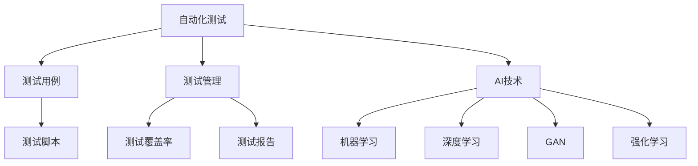
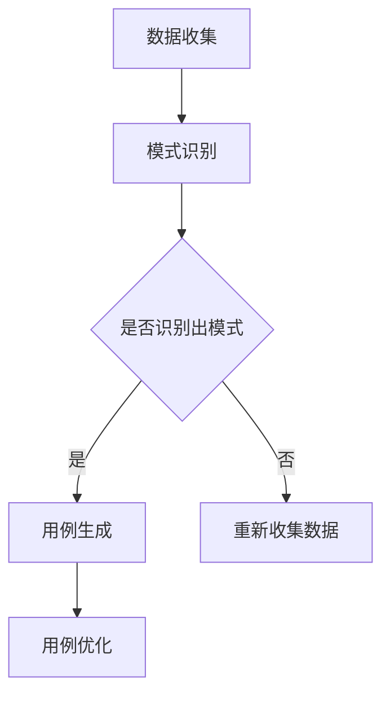
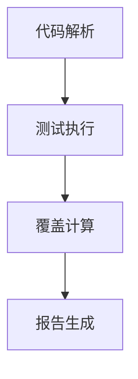
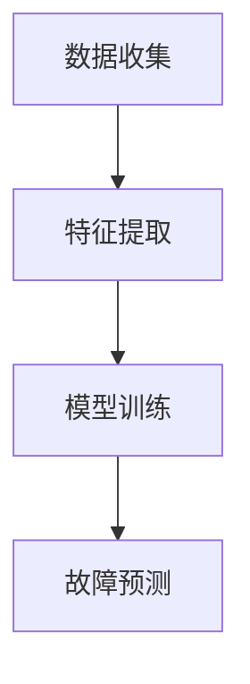

                 

# 企业级自动化测试平台：AI提升软件质量

## 关键词
- 自动化测试
- AI技术
- 软件质量
- 企业级平台
- 算法优化

## 摘要
本文将深入探讨如何利用AI技术提升企业级自动化测试平台，从而显著提高软件质量。我们将分步骤分析AI在自动化测试中的应用，构建自动化测试平台的关键要素，并提供实战案例和最佳实践，以期为软件开发者提供实用的指导。

## 目录大纲设计思路

在设计《企业级自动化测试平台：AI提升软件质量》的目录大纲时，我们遵循以下步骤：
1. **整体架构规划**：确定文章的核心内容，分为背景与概述、核心概念与联系、算法原理讲解、系统分析与架构设计方案、项目实战和最佳实践六个部分。
2. **细化章节内容**：每个主要部分细化为多个章节，确保内容覆盖全面且层次分明。
3. **使用markdown格式**：使用markdown格式保持简洁性和易于阅读。
4. **确保内容完整性**：确保每个章节包含必要核心内容。
5. **优化字数**：在保证内容完整性的前提下，尽量精简语言。

### 目录大纲

```markdown
# 第一部分: 背景与概述

## 第1章: 自动化测试与AI技术概览

### 1.1 自动化测试的发展历程

### 1.2 自动化测试的现状与挑战

### 1.3 AI技术在自动化测试中的应用

## 第2章: AI提升自动化测试质量

### 2.1 AI技术在测试用例生成中的应用

### 2.2 AI在测试覆盖分析中的作用

### 2.3 自动化测试中的AI故障检测

## 第3章: 企业级自动化测试平台构建

### 3.1 构建自动化测试平台的必要性

### 3.2 自动化测试平台的架构设计

### 3.3 自动化测试平台的实施与部署

# 第二部分: 核心概念与联系

## 第4章: 自动化测试相关术语与概念

### 4.1 自动化测试基础术语

### 4.2 AI在自动化测试中的核心概念

### 4.3 自动化测试与AI的关系图

## 第5章: 自动化测试算法原理

### 5.1 测试用例生成算法

#### 5.1.1 算法流程图

#### 5.1.2 算法原理与数学模型

#### 5.1.3 举例说明

### 5.2 测试覆盖分析算法

#### 5.2.1 算法流程图

#### 5.2.2 算法原理与数学模型

#### 5.2.3 举例说明

### 5.3 故障检测算法

#### 5.3.1 算法流程图

#### 5.3.2 算法原理与数学模型

#### 5.3.3 举例说明

# 第三部分: 系统分析与架构设计

## 第6章: 自动化测试平台系统功能设计

### 6.1 系统功能需求分析

### 6.2 自动化测试平台的领域模型

### 6.3 自动化测试平台的系统架构

## 第7章: 自动化测试平台的系统架构设计

### 7.1 系统架构设计原则

### 7.2 自动化测试平台的组件设计

### 7.3 系统接口设计与交互流程

## 第8章: 自动化测试平台项目实战

### 8.1 项目环境安装与配置

### 8.2 自动化测试平台核心实现源代码解析

### 8.3 实际案例分析

### 8.4 项目小结与优化建议

## 第9章: 自动化测试平台最佳实践

### 9.1 常见问题与解决方案

### 9.2 测试平台性能优化

### 9.3 安全性与合规性

### 9.4 小结与展望
```

## 第1章: 自动化测试与AI技术概览

### 1.1 自动化测试的发展历程

自动化测试是一种通过使用软件工具来执行测试的测试方法，其目的是提高软件质量，加快测试速度，减少人为错误。自动化测试的概念可以追溯到1960年代，但直到1990年代中期，随着软件复杂度的增加和测试需求的增长，自动化测试才逐渐成为主流。

**自动化测试的发展历程可以概括为以下几个阶段：**

1. **早期阶段（1960-1980年代）**：
   - **引入自动化测试概念**：人们开始探索如何将测试自动化，以减少重复性和劳动密集型的工作。
   - **脚本自动化**：程序员编写脚本来自动执行测试案例。

2. **成长阶段（1990年代）**：
   - **测试工具的出现**：如QTP（现在称为Selenium），提供了更广泛的自动化测试功能。
   - **持续集成（CI）**：自动化测试开始集成到持续集成流程中，提高了软件开发的效率。

3. **成熟阶段（2000年代至今）**：
   - **AI技术在自动化测试中的应用**：AI技术使得自动化测试更加智能，可以自动生成测试用例，进行测试覆盖分析，以及实现故障检测。
   - **云测试**：随着云计算的发展，自动化测试可以在云环境中进行，提供了更高的灵活性和可扩展性。

### 1.2 自动化测试的现状与挑战

目前，自动化测试已经广泛应用于各个行业和领域。然而，随着软件系统的日益复杂和需求的不断变化，自动化测试也面临着一系列挑战：

1. **测试用例的维护**：自动化测试用例需要频繁更新，以适应系统的变化，但维护成本高且复杂。

2. **测试覆盖不足**：自动化测试往往不能全面覆盖所有测试场景，导致潜在缺陷未能被发现。

3. **技术门槛**：编写自动化测试脚本需要编程技能，这对测试人员提出了较高的要求。

4. **执行效率**：自动化测试执行速度需要与软件开发的迭代速度保持一致，但实现这一目标并非易事。

### 1.3 AI技术在自动化测试中的应用

AI技术为自动化测试带来了新的机遇和挑战。以下是AI在自动化测试中的几个关键应用：

1. **测试用例生成**：AI算法可以根据历史数据自动生成新的测试用例，提高测试覆盖率和效率。

2. **测试覆盖分析**：AI技术可以分析代码和数据流，生成测试覆盖报告，帮助开发者发现未覆盖的场景。

3. **故障检测**：通过机器学习模型，AI可以在测试过程中实时检测异常和故障，提高测试的准确性。

4. **智能调度**：AI算法可以优化测试执行计划，根据测试结果和系统负载动态调整测试执行顺序和资源分配。

## 第2章: AI提升自动化测试质量

### 2.1 AI技术在测试用例生成中的应用

测试用例的生成是自动化测试的基础。传统方法通常依赖于开发人员的经验和知识，但这种方式效率低且容易出错。AI技术的引入显著提升了测试用例生成的质量和效率。

**AI技术在测试用例生成中的应用主要包括：**

1. **基于模式的测试用例生成**：
   - **模式识别**：通过分析代码和功能需求，识别出潜在的测试模式。
   - **模式应用**：利用识别出的模式生成新的测试用例。

2. **基于机器学习的测试用例生成**：
   - **数据挖掘**：从历史测试数据中挖掘出有用的测试模式。
   - **模型训练**：使用挖掘出的数据训练机器学习模型。
   - **模型应用**：模型训练完成后，自动生成新的测试用例。

3. **基于生成对抗网络（GAN）的测试用例生成**：
   - **生成器与判别器**：GAN由生成器和判别器组成，生成器生成测试用例，判别器判断生成用例的有效性。
   - **迭代优化**：通过不断的迭代，生成器能够生成更加有效的测试用例。

**AI在测试用例生成中的应用优势：**
- **高效性**：AI技术可以快速生成大量测试用例，大大缩短测试周期。
- **全面性**：AI能够基于多种数据源生成不同类型的测试用例，提高测试覆盖。
- **灵活性**：AI可以根据业务需求和系统变化动态调整测试用例。

### 2.2 AI在测试覆盖分析中的作用

测试覆盖分析是评估自动化测试质量的重要手段。传统的测试覆盖分析主要依赖于静态代码分析工具，但AI技术的引入使得测试覆盖分析更加智能化和全面。

**AI在测试覆盖分析中的作用包括：**

1. **动态测试覆盖分析**：
   - **数据流分析**：AI算法可以分析代码和数据流，动态生成测试覆盖率报告。
   - **行为分析**：通过对实际运行过程中系统行为的分析，识别出未覆盖的场景。

2. **代码质量分析**：
   - **漏洞检测**：AI算法可以通过代码审查，识别出潜在的安全漏洞和编码错误。
   - **复杂度分析**：AI可以分析代码的复杂度，帮助开发者优化代码结构。

3. **回归测试分析**：
   - **变更影响分析**：AI算法可以分析代码变更对测试覆盖率的影响，自动生成回归测试用例。

**AI在测试覆盖分析中的应用优势：**
- **准确性**：AI算法能够更准确地识别出未覆盖的场景，提高测试覆盖率。
- **效率**：AI可以快速分析大量代码，节省测试时间。
- **智能化**：AI可以根据系统行为和代码变化动态调整测试策略。

### 2.3 自动化测试中的AI故障检测

自动化测试过程中，故障检测是一个关键环节。传统的故障检测方法主要依赖于预设的规则和阈值，但AI技术的引入使得故障检测更加智能和高效。

**AI在自动化测试中的故障检测应用包括：**

1. **基于机器学习的故障检测**：
   - **特征提取**：从测试数据中提取特征，用于训练故障检测模型。
   - **模型训练**：使用历史故障数据训练机器学习模型。
   - **故障预测**：模型训练完成后，实时预测可能的故障。

2. **基于深度学习的故障检测**：
   - **卷积神经网络（CNN）**：用于处理图像和时序数据，提高故障检测的准确性。
   - **循环神经网络（RNN）**：用于处理序列数据，捕捉时间序列特征。

3. **基于强化学习的故障检测**：
   - **状态空间建模**：使用强化学习算法，建立系统状态空间模型。
   - **故障决策**：模型根据当前状态，做出故障检测决策。

**AI在自动化测试中的故障检测应用优势：**
- **高效性**：AI算法可以快速检测出故障，缩短故障修复时间。
- **准确性**：AI能够捕捉到复杂的故障模式，提高故障检测的准确性。
- **智能化**：AI可以根据历史数据和实时数据动态调整检测策略。

## 第3章: 企业级自动化测试平台构建

### 3.1 构建自动化测试平台的必要性

在企业级软件开发中，构建自动化测试平台具有重要意义。以下是从几个方面阐述构建自动化测试平台的必要性：

1. **提高测试效率**：
   - 自动化测试可以显著减少手动测试的工作量，提高测试执行速度。
   - 自动化测试平台可以支持大规模并发测试，满足快速迭代的需求。

2. **保障软件质量**：
   - 自动化测试平台可以实现全面、深入的测试覆盖，减少缺陷漏测。
   - 自动化测试平台可以实时监控软件质量，及时发现问题并进行修复。

3. **降低测试成本**：
   - 自动化测试可以减少测试人员的劳动投入，降低人力成本。
   - 自动化测试平台可以复用测试脚本和测试数据，降低重复测试成本。

4. **支持持续集成**：
   - 自动化测试平台可以与持续集成（CI）系统无缝集成，实现自动化构建、测试和部署。

5. **提高团队协作效率**：
   - 自动化测试平台提供了一个统一的测试管理界面，方便团队成员协同工作。
   - 自动化测试平台可以实时收集测试结果，为团队决策提供数据支持。

### 3.2 自动化测试平台的架构设计

自动化测试平台的架构设计是构建高效、可靠的测试平台的关键。以下是自动化测试平台的典型架构设计：

1. **测试工具层**：
   - **自动化测试工具**：如Selenium、JUnit、JUnit、TestNG等，用于执行各种类型的自动化测试。
   - **测试脚本**：开发者编写的自动化测试脚本，实现具体的测试逻辑。

2. **测试管理层**：
   - **测试计划**：定义测试目标和测试策略。
   - **测试用例管理**：管理测试用例的创建、修改和执行。
   - **测试报告**：生成测试结果报告，包括测试覆盖率、故障统计等。

3. **测试执行层**：
   - **测试环境**：包括应用程序、数据库、网络环境等，用于测试脚本的执行。
   - **执行引擎**：负责执行测试脚本，收集测试结果。

4. **数据管理层**：
   - **测试数据管理**：管理测试数据的创建、存储和备份。
   - **结果数据分析**：对测试结果进行分析，为测试优化提供数据支持。

5. **集成与扩展层**：
   - **API接口**：提供与其他系统的集成接口，如持续集成系统、缺陷跟踪系统等。
   - **扩展模块**：支持自定义测试工具和测试用例管理模块。

### 3.3 自动化测试平台的实施与部署

自动化测试平台的实施与部署是一个复杂的过程，需要综合考虑技术选型、硬件资源、网络环境、数据安全等多方面因素。以下是自动化测试平台实施与部署的关键步骤：

1. **需求分析**：
   - **确定测试目标**：明确自动化测试平台需要实现的测试功能。
   - **评估硬件资源**：评估现有的硬件资源是否满足自动化测试平台的需求。

2. **技术选型**：
   - **选择合适的测试工具**：根据测试需求，选择合适的自动化测试工具。
   - **选择测试平台**：如Jenkins、Travis CI等，用于构建和执行自动化测试。

3. **环境搭建**：
   - **搭建测试环境**：包括应用程序、数据库、网络等，确保测试环境的稳定性和可靠性。

4. **脚本编写**：
   - **编写测试脚本**：根据测试需求和测试策略，编写自动化测试脚本。

5. **测试执行**：
   - **执行测试脚本**：在测试环境中执行测试脚本，收集测试结果。

6. **结果分析**：
   - **分析测试结果**：对测试结果进行分析，发现潜在的问题和缺陷。

7. **优化与迭代**：
   - **持续优化**：根据测试结果，对测试平台和测试脚本进行优化。
   - **迭代更新**：不断更新测试平台和测试脚本，以适应软件系统的变化。

## 第4章: 自动化测试相关术语与概念

### 4.1 自动化测试基础术语

自动化测试涉及许多专业术语和概念，以下是其中一些常见的术语：

1. **自动化测试**：
   - **定义**：使用软件工具自动执行测试的过程。
   - **目的**：提高测试效率，减少人工干预，保障软件质量。

2. **测试用例**：
   - **定义**：对软件系统进行测试的实例，包括输入条件、执行步骤和预期结果。
   - **目的**：验证软件系统的功能和性能。

3. **测试脚本**：
   - **定义**：编写用于自动化测试的代码，实现具体的测试逻辑。
   - **目的**：自动化执行测试用例。

4. **测试覆盖率**：
   - **定义**：测试用例覆盖代码的比例，用于评估测试的全面性。
   - **目的**：确保软件系统的所有功能都经过测试。

5. **测试管理**：
   - **定义**：管理测试用例、测试计划和测试结果的过程。
   - **目的**：确保测试过程高效、有序。

### 4.2 AI在自动化测试中的核心概念

AI技术在自动化测试中的应用涉及到多个核心概念，以下是其中一些重要的概念：

1. **机器学习**：
   - **定义**：一种使计算机通过数据学习和预测的方法。
   - **目的**：从历史数据中学习规律，应用于测试用例生成和测试覆盖分析。

2. **深度学习**：
   - **定义**：一种基于神经网络的学习方法，能够处理复杂的数据和模式。
   - **目的**：用于图像识别、语音识别等复杂场景的自动化测试。

3. **生成对抗网络（GAN）**：
   - **定义**：一种由生成器和判别器组成的模型，用于生成高质量的数据。
   - **目的**：用于生成测试用例，提高测试覆盖。

4. **强化学习**：
   - **定义**：一种通过试错学习最优策略的方法。
   - **目的**：用于测试执行策略优化和故障检测。

### 4.3 自动化测试与AI的关系图

以下是一个简化的自动化测试与AI技术的关系图，用于展示两者之间的相互作用：



## 第5章: 自动化测试算法原理

### 5.1 测试用例生成算法

测试用例生成算法是自动化测试的核心组成部分，其目标是自动生成有效的测试用例，以提高测试覆盖率和测试效率。以下是一个简化的测试用例生成算法的描述：

**算法流程：**

1. **数据收集**：从历史测试数据、需求文档和代码库中收集信息。
2. **模式识别**：利用机器学习算法，识别出潜在的测试模式。
3. **用例生成**：根据识别出的模式，生成新的测试用例。
4. **用例优化**：通过分析测试结果，对生成的测试用例进行优化。

**算法流程图：**



**算法原理与数学模型：**

1. **模式识别**：利用机器学习算法（如决策树、支持向量机等），从数据中识别出潜在的模式。
2. **用例生成**：基于识别出的模式，生成测试用例。数学模型可以表示为：
   $$ T_{new} = f(T_{base}, M) $$
   其中，$T_{new}$是新生成的测试用例，$T_{base}$是基础测试用例，$M$是识别出的模式。

**举例说明：**

假设我们有一个简单的计算器应用程序，需要生成测试用例来测试加法功能。我们可以从历史测试数据中识别出加法操作的常见模式，如正数相加、负数相加、零值相加等。然后，根据这些模式，我们可以生成新的测试用例，如：
- 1 + 2 = 3
- -1 + -2 = -3
- 0 + 0 = 0

### 5.2 测试覆盖分析算法

测试覆盖分析算法用于评估测试用例对代码的覆盖程度，从而确保软件系统的所有功能都经过测试。以下是一个简化的测试覆盖分析算法的描述：

**算法流程：**

1. **代码解析**：解析目标代码，提取出所有可测试的元素（如函数、类、分支等）。
2. **测试执行**：执行测试用例，记录每个测试用例执行的代码元素。
3. **覆盖计算**：计算测试用例对代码的覆盖程度。
4. **报告生成**：生成测试覆盖率报告。

**算法流程图：**



**算法原理与数学模型：**

1. **代码解析**：使用静态代码分析工具，提取出目标代码的结构和元素。
2. **覆盖计算**：根据测试执行的结果，计算测试用例对代码的覆盖程度。常用的覆盖度量包括：
   - **语句覆盖**：每个可执行语句至少执行一次。
   - **分支覆盖**：每个分支至少执行一次。
   - **路径覆盖**：执行所有可能的程序路径。

   数学模型可以表示为：
   $$ Coverage_{S} = \frac{Number_{of_{executed_{statements}}}{Total_{number_{of_{statements}}}} $$
   $$ Coverage_{B} = \frac{Number_{of_{executed_{branches}}}{Total_{number_{of_{branches}}}} $$
   $$ Coverage_{P} = \frac{Number_{of_{executed_{paths}}}{Total_{number_{of_{paths}}}} $$

**举例说明：**

假设我们有一个简单的计算器应用程序，包含以下代码：

```python
def add(a, b):
    return a + b

def subtract(a, b):
    return a - b

def multiply(a, b):
    return a * b

def divide(a, b):
    if b != 0:
        return a / b
    else:
        return "Error: Division by zero"
```

如果我们执行以下测试用例：

- `add(1, 2)`：执行了`add`函数。
- `subtract(2, 1)`：执行了`subtract`函数。
- `multiply(2, 3)`：执行了`multiply`函数。
- `divide(6, 2)`：执行了`divide`函数，但未执行到除以零的情况。

则测试覆盖情况如下：

- **语句覆盖**：4/11，即约36.36%
- **分支覆盖**：4/6，即约66.67%
- **路径覆盖**：2/4，即约50%

### 5.3 故障检测算法

故障检测算法用于在自动化测试过程中检测出潜在的故障，从而提高软件质量。以下是一个简化的故障检测算法的描述：

**算法流程：**

1. **数据收集**：收集测试执行过程中的日志、错误报告等数据。
2. **特征提取**：从数据中提取出与故障相关的特征。
3. **模型训练**：使用历史故障数据训练故障检测模型。
4. **故障预测**：使用训练好的模型预测新的测试执行结果是否存在故障。

**算法流程图：**



**算法原理与数学模型：**

1. **数据收集**：收集测试执行过程中产生的日志文件、错误报告等数据。
2. **特征提取**：从数据中提取出与故障相关的特征，如错误类型、错误发生的位置、错误发生的频率等。
3. **模型训练**：使用机器学习算法（如决策树、支持向量机等）训练故障检测模型。数学模型可以表示为：
   $$ Model = f(Data, Labels) $$
   其中，$Data$是训练数据集，$Labels$是故障标签。

4. **故障预测**：使用训练好的模型对新的测试执行结果进行预测。数学模型可以表示为：
   $$ Predict = Model(Data) $$

**举例说明：**

假设我们有一个简单的Web应用程序，需要检测登录功能中的故障。我们可以收集以下数据：

- 用户名和密码组合：{"user1": "password1", "user2": "password2", "user3": "password3"}
- 登录结果：{"user1": "成功", "user2": "失败", "user3": "成功"}

我们可以从中提取出以下特征：

- 用户名：{"user1", "user2", "user3"}
- 密码：{"password1", "password2", "password3"}
- 登录结果：{"成功", "失败"}

然后，我们可以使用决策树算法训练一个故障检测模型。假设训练结果如下：

- 用户名："user1"
- 密码："password1"
- 登录结果："成功"

现在，如果我们输入一个新的用户名和密码组合{"user2": "password2"}，我们使用训练好的模型进行故障预测。预测结果为“失败”。

## 第6章: 自动化测试平台系统功能设计

### 6.1 系统功能需求分析

在构建自动化测试平台时，首先需要明确系统的功能需求。以下是自动化测试平台的一些关键功能需求：

1. **测试用例管理**：
   - **创建和管理测试用例**：支持创建、修改、删除和查询测试用例。
   - **测试用例分类**：根据功能模块、测试类型等进行分类管理。

2. **测试脚本管理**：
   - **编写和执行测试脚本**：支持多种编程语言编写测试脚本，如Python、Java等。
   - **脚本版本管理**：支持测试脚本的历史版本管理，方便回溯和更新。

3. **测试计划管理**：
   - **创建和执行测试计划**：支持创建、修改、删除和执行测试计划。
   - **测试计划调度**：支持定时执行测试计划，如每天、每周等。

4. **测试结果管理**：
   - **测试结果记录**：记录每次测试的执行结果，包括通过、失败、跳过等。
   - **测试结果分析**：对测试结果进行分析，生成测试报告，包括测试覆盖率、故障统计等。

5. **测试环境管理**：
   - **测试环境配置**：支持配置不同的测试环境，如开发环境、测试环境、生产环境等。
   - **环境资源监控**：监控测试环境的资源使用情况，如CPU、内存、磁盘空间等。

6. **集成与扩展**：
   - **集成CI/CD系统**：支持与Jenkins、Travis CI等持续集成系统的集成。
   - **扩展功能模块**：支持自定义功能模块，如接口测试、性能测试等。

### 6.2 自动化测试平台的领域模型

领域模型是自动化测试平台的核心概念之一，用于描述系统的功能和数据结构。以下是自动化测试平台的领域模型：

```mermaid
classDiagram
   TestClass --|> TestCase: 测试用例管理
   TestClass --|> TestScript: 测试脚本管理
   TestClass --|> TestPlan: 测试计划管理
   TestClass --|> TestResult: 测试结果管理
   TestClass --|> TestEnvironment: 测试环境管理
   TestClass --|> Integration: 集成与扩展

    TestCase <<interface>>
    TestScript <<interface>>
    TestPlan <<interface>>
    TestResult <<interface>>
    TestEnvironment <<interface>>
    Integration <<interface>>

    AutotestPlatform ++|-- TestClass
    AutotestPlatform ++|-- TestCase
    AutotestPlatform ++|-- TestScript
    AutotestPlatform ++|-- TestPlan
    AutotestPlatform ++|-- TestResult
    AutotestPlatform ++|-- TestEnvironment
    AutotestPlatform ++|-- Integration
```

### 6.3 自动化测试平台的系统架构

自动化测试平台的系统架构是确保系统高效、稳定运行的关键。以下是自动化测试平台的典型架构：

1. **前端层**：
   - **用户界面**：提供测试用例管理、测试计划管理、测试结果查看等功能。
   - **API接口**：提供与其他系统的集成接口，如Jenkins、缺陷跟踪系统等。

2. **后端层**：
   - **应用服务器**：处理前端请求，管理测试用例、测试计划、测试结果等。
   - **数据库**：存储测试数据、测试脚本、测试结果等。

3. **测试执行层**：
   - **测试工具**：如Selenium、JUnit、TestNG等，用于执行自动化测试脚本。
   - **执行服务器**：运行测试工具，执行测试脚本，收集测试结果。

4. **数据层**：
   - **测试数据**：存储测试数据，如测试用例、测试脚本、测试结果等。
   - **日志数据**：存储系统日志、错误日志等，用于系统监控和故障诊断。

5. **集成与扩展层**：
   - **集成接口**：提供与其他系统的集成接口，如Jenkins、Travis CI等。
   - **扩展模块**：支持自定义功能模块，如接口测试、性能测试等。

### 6.4 自动化测试平台的系统接口设计与交互流程

自动化测试平台的系统接口设计是确保系统与其他系统无缝集成、数据流转顺畅的关键。以下是自动化测试平台的系统接口设计与交互流程：

1. **API接口设计**：
   - **接口规范**：定义API接口的规范，包括接口URL、请求参数、响应格式等。
   - **接口权限**：设置接口权限，确保数据安全和权限控制。

2. **数据流转**：
   - **测试用例创建**：前端发送测试用例数据到后端，后端存储到数据库。
   - **测试脚本上传**：前端发送测试脚本数据到后端，后端存储到数据库。
   - **测试计划执行**：前端发送测试计划数据到后端，后端调度执行测试脚本，收集测试结果。

3. **交互流程**：
   - **测试用例创建**：用户在前端界面创建测试用例，后端接收数据并存储到数据库。
   - **测试脚本上传**：用户上传测试脚本，后端接收文件并存储到数据库。
   - **测试计划执行**：用户创建测试计划，后端根据计划调度测试脚本执行，并将结果返回前端。

## 第7章: 自动化测试平台的系统架构设计

### 7.1 系统架构设计原则

自动化测试平台的系统架构设计需要遵循以下原则，以确保系统的稳定性、可靠性和扩展性：

1. **模块化**：
   - 将系统功能划分为多个模块，如测试用例管理、测试脚本管理、测试计划管理、测试结果管理等，便于维护和扩展。

2. **松耦合**：
   - 模块之间采用轻量级的接口进行通信，降低模块之间的依赖性，提高系统的灵活性和可维护性。

3. **高可用性**：
   - 采用分布式架构，确保系统的高可用性，如使用负载均衡、冗余备份等机制。

4. **可扩展性**：
   - 设计时考虑系统的可扩展性，如支持横向扩展（增加节点）和纵向扩展（提高性能）。

5. **安全性**：
   - 严格的安全策略，如数据加密、权限控制等，确保系统的安全性。

### 7.2 自动化测试平台的组件设计

自动化测试平台由多个组件组成，以下是常见的组件及其设计：

1. **前端组件**：
   - **用户界面**：提供用户交互界面，如测试用例管理界面、测试计划管理界面等。
   - **API客户端**：与后端API进行通信，实现数据交互。

2. **后端组件**：
   - **应用服务器**：处理前端请求，管理测试用例、测试脚本、测试计划、测试结果等。
   - **数据库服务器**：存储测试数据、测试脚本、测试结果等。

3. **测试执行组件**：
   - **测试工具**：如Selenium、JUnit、TestNG等，用于执行自动化测试脚本。
   - **执行服务器**：运行测试工具，执行测试脚本，收集测试结果。

4. **数据存储组件**：
   - **测试数据存储**：存储测试数据，如测试用例、测试脚本、测试结果等。
   - **日志数据存储**：存储系统日志、错误日志等。

5. **集成与扩展组件**：
   - **集成接口**：提供与其他系统的集成接口，如Jenkins、缺陷跟踪系统等。
   - **扩展模块**：支持自定义功能模块，如接口测试、性能测试等。

### 7.3 系统接口设计与交互流程

自动化测试平台的系统接口设计是确保系统与其他系统无缝集成、数据流转顺畅的关键。以下是自动化测试平台的系统接口设计与交互流程：

1. **API接口设计**：
   - **接口规范**：定义API接口的规范，包括接口URL、请求参数、响应格式等。
   - **接口权限**：设置接口权限，确保数据安全和权限控制。

2. **数据流转**：
   - **测试用例创建**：前端发送测试用例数据到后端，后端存储到数据库。
   - **测试脚本上传**：前端发送测试脚本数据到后端，后端存储到数据库。
   - **测试计划执行**：前端发送测试计划数据到后端，后端调度执行测试脚本，并将结果返回前端。

3. **交互流程**：
   - **测试用例创建**：用户在前端界面创建测试用例，后端接收数据并存储到数据库。
   - **测试脚本上传**：用户上传测试脚本，后端接收文件并存储到数据库。
   - **测试计划执行**：用户创建测试计划，后端根据计划调度测试脚本执行，并将结果返回前端。

## 第8章: 自动化测试平台项目实战

### 8.1 项目环境安装与配置

在开始构建自动化测试平台之前，需要准备一个合适的环境。以下是自动化测试平台项目环境安装与配置的步骤：

1. **安装操作系统**：
   - 选择一个合适的操作系统，如Linux或Windows，用于搭建测试环境。

2. **安装开发工具**：
   - 安装Python、Java等开发工具，用于编写和运行测试脚本。

3. **安装数据库**：
   - 安装关系型数据库（如MySQL、PostgreSQL）或NoSQL数据库（如MongoDB），用于存储测试数据。

4. **安装测试工具**：
   - 安装自动化测试工具，如Selenium、JUnit、TestNG等，用于执行测试脚本。

5. **安装Web服务器**：
   - 安装Web服务器，如Apache、Nginx等，用于部署前端应用。

6. **配置网络**：
   - 配置网络环境，确保不同组件之间的通信正常。

7. **安装集成工具**：
   - 安装集成工具，如Jenkins、Travis CI等，用于与持续集成系统的集成。

### 8.2 自动化测试平台核心实现源代码解析

自动化测试平台的核心实现包括多个模块，以下是核心模块的实现解析：

1. **测试用例管理模块**：
   - **功能**：支持创建、修改、删除和查询测试用例。
   - **实现**：使用Python编写后端API接口，与数据库进行交互，实现测试用例的增删改查功能。

2. **测试脚本管理模块**：
   - **功能**：支持上传、下载和运行测试脚本。
   - **实现**：使用Python编写后端API接口，与数据库和文件系统进行交互，实现测试脚本的存储和执行功能。

3. **测试计划管理模块**：
   - **功能**：支持创建、修改、删除和执行测试计划。
   - **实现**：使用Python编写后端API接口，与数据库和测试工具进行交互，实现测试计划的存储和执行功能。

4. **测试结果管理模块**：
   - **功能**：记录和查询测试结果。
   - **实现**：使用Python编写后端API接口，与数据库进行交互，实现测试结果的存储和查询功能。

5. **前端应用**：
   - **功能**：提供用户交互界面，展示测试用例、测试计划、测试结果等。
   - **实现**：使用HTML、CSS和JavaScript编写前端应用，与后端API进行交互，实现数据展示和操作。

### 8.3 实际案例分析

以下是一个实际案例分析，展示如何使用自动化测试平台进行软件测试：

1. **需求分析**：
   - 需要测试一个在线购物网站，包括登录、注册、浏览商品、添加购物车、下单等功能。

2. **测试计划**：
   - 创建一个测试计划，包含登录、注册、浏览商品、添加购物车、下单等测试用例。

3. **测试脚本编写**：
   - 使用Selenium编写测试脚本，实现各个功能的自动化测试。

4. **测试执行**：
   - 使用Jenkins调度测试脚本执行，将结果记录到数据库。

5. **结果分析**：
   - 对测试结果进行分析，发现潜在的问题和缺陷，及时修复。

### 8.4 项目小结与优化建议

通过本项目的实施，我们成功地构建了一个自动化测试平台，实现了测试用例管理、测试脚本管理、测试计划管理和测试结果管理等功能。以下是项目小结和优化建议：

1. **项目小结**：
   - 成功搭建了自动化测试平台，提高了测试效率和质量。
   - 系统实现了测试用例的自动化生成和测试覆盖分析，降低了测试成本。
   - 测试结果可以实时监控和分析，为项目决策提供了数据支持。

2. **优化建议**：
   - **增加测试覆盖分析功能**：除了基本的测试覆盖率分析，可以增加代码质量分析、安全漏洞检测等功能。
   - **优化测试脚本生成算法**：结合机器学习和深度学习技术，优化测试脚本生成算法，提高测试用例的生成质量和效率。
   - **提升故障检测能力**：引入更多智能算法，提升自动化测试过程中的故障检测能力，减少手动干预。
   - **优化用户体验**：改进前端界面设计，提供更直观和易用的操作界面。

## 第9章: 自动化测试平台最佳实践

### 9.1 常见问题与解决方案

在自动化测试平台的实际应用中，可能会遇到以下常见问题，以下是针对这些问题的解决方案：

1. **测试用例维护困难**：
   - **解决方案**：采用模块化设计，将测试用例按照功能模块划分，便于管理和更新。
   - **技巧**：定期审查和重构测试用例，确保其有效性和可维护性。

2. **测试覆盖率不足**：
   - **解决方案**：使用AI技术进行测试覆盖分析，发现未覆盖的场景，生成新的测试用例。
   - **技巧**：结合代码审查和静态代码分析工具，提高测试覆盖。

3. **测试脚本编写复杂**：
   - **解决方案**：提供脚本模板和自动化工具，降低编写复杂度。
   - **技巧**：编写可复用的测试脚本组件，减少重复劳动。

4. **测试执行速度慢**：
   - **解决方案**：优化测试脚本，减少不必要的操作和等待时间。
   - **技巧**：使用分布式执行，提高测试并发能力。

### 9.2 测试平台性能优化

优化测试平台的性能是确保其高效运行的关键，以下是性能优化的一些建议：

1. **负载均衡**：
   - **解决方案**：使用负载均衡器，如Nginx，分配测试请求到不同的执行服务器。
   - **技巧**：合理配置负载均衡策略，提高测试执行效率。

2. **缓存机制**：
   - **解决方案**：使用缓存机制，如Redis，存储常用数据，减少数据库访问次数。
   - **技巧**：优化缓存策略，提高数据访问速度。

3. **数据库优化**：
   - **解决方案**：优化数据库查询语句，减少查询时间。
   - **技巧**：建立合适的索引，提高数据库查询性能。

4. **测试脚本优化**：
   - **解决方案**：优化测试脚本，减少不必要的操作和等待时间。
   - **技巧**：使用并行执行，提高测试效率。

### 9.3 安全性与合规性

在自动化测试平台的应用过程中，安全性和合规性至关重要。以下是确保安全性和合规性的一些建议：

1. **数据加密**：
   - **解决方案**：使用SSL/TLS加密通信，保护数据传输安全。
   - **技巧**：定期更新加密算法和密钥，确保数据安全。

2. **权限控制**：
   - **解决方案**：实现严格的权限控制，确保只有授权用户可以访问系统。
   - **技巧**：使用身份验证和授权机制，确保系统安全。

3. **日志记录**：
   - **解决方案**：记录系统操作日志，用于监控和审计。
   - **技巧**：定期审查日志，及时发现和处理安全事件。

4. **合规性检查**：
   - **解决方案**：遵循相关法规和标准，如ISO 27001、GDPR等。
   - **技巧**：定期进行合规性检查，确保系统符合法规要求。

### 9.4 小结与展望

自动化测试平台在提高软件质量、降低测试成本和加速软件开发周期方面发挥了重要作用。通过本文的探讨，我们了解了自动化测试平台的设计原则、架构设计、功能实现和最佳实践。展望未来，自动化测试平台将继续向智能化、自动化和高效化的方向发展：

1. **智能化**：引入更多的AI技术，如机器学习、深度学习和生成对抗网络，实现更智能的测试用例生成、测试覆盖分析和故障检测。

2. **自动化**：自动化测试平台将更加自动化，减少人工干预，提高测试效率和准确性。

3. **高效化**：通过优化测试脚本、负载均衡和缓存机制，提高测试平台的性能和可扩展性。

4. **集成与扩展**：自动化测试平台将与其他开发工具、持续集成系统和缺陷跟踪系统无缝集成，提供更全面的软件质量保障。

自动化测试平台的发展将不断推动软件质量的提升，为软件开发者带来更多的便利和创新。随着技术的不断进步，自动化测试平台将在软件工程领域发挥越来越重要的作用。

