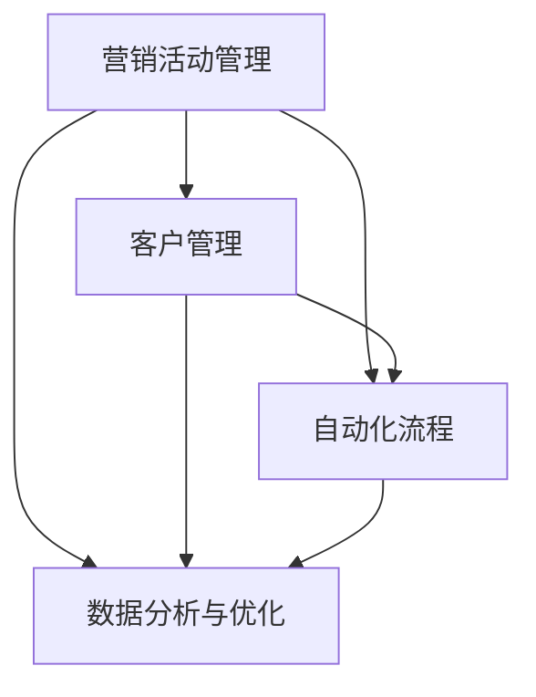

                 

### 文章标题

# 企业级自动化营销平台：AI优化客户触达

### 文章关键词

- 营销自动化
- 人工智能
- 客户触达
- 数据分析
- 个性化营销
- 实施与优化

### 文章摘要

随着科技的进步和市场竞争的加剧，企业级自动化营销平台成为提升营销效果、降低成本的重要手段。本文将从背景介绍、核心概念、AI技术原理与应用、客户数据分析与个性化营销、平台实施与优化、案例分析以及未来趋势等方面，深入探讨企业级自动化营销平台的设计与实施，旨在为企业实现智能营销提供有力支持。

---

### 目录大纲设计

#### 一、背景介绍

##### 第1章: 营销自动化的挑战与机遇

1.1 营销自动化的背景

1.2 企业营销面临的挑战

1.3 营销自动化的机遇

1.4 营销自动化与企业级应用

#### 二、核心概念与联系

##### 第2章: 自动化营销平台的基础概念

2.1 客户触达的概念与类型

2.2 营销自动化平台的基本架构

2.3 AI在自动化营销中的作用

2.4 自动化营销平台的核心概念联系

#### 三、AI优化客户触达

##### 第3章: AI技术原理与应用

3.1 人工智能的基础知识

3.2 常见的AI算法及其应用

3.3 AI在营销自动化中的实际应用

3.4 AI优化的核心原理

##### 第4章: 客户数据分析与个性化营销

4.1 客户数据分析的重要性

4.2 数据挖掘技术及其应用

4.3 个性化营销策略

4.4 数据分析与个性化营销的结合

##### 第5章: 营销自动化平台的实施与优化

5.1 营销自动化平台的实施步骤

5.2 平台优化的方法与策略

5.3 持续改进与迭代

5.4 营销自动化平台的实施案例

#### 四、案例分析与实战

##### 第6章: 企业级自动化营销平台案例

6.1 案例背景与目标

6.2 案例实施过程

6.3 案例效果分析

6.4 案例经验总结

##### 第7章: 未来趋势与展望

7.1 营销自动化的未来趋势

7.2 AI在营销自动化中的应用前景

7.3 营销自动化平台的创新发展

7.4 行业挑战与对策

#### 五、小结与拓展

##### 第8章: 自动化营销平台的关键要素

8.1 自动化营销平台的成功要素

8.2 智能营销的最佳实践

8.3 未来发展趋势与机遇

8.4 拓展阅读与资源推荐

### 目录大纲总结

本书围绕企业级自动化营销平台的设计与实施，深入探讨了营销自动化的背景、核心概念、AI技术的应用、数据分析与个性化营销策略、实施与优化、案例分析以及未来趋势。通过系统性的论述和实践案例的分析，旨在帮助读者全面了解并掌握自动化营销平台的构建与优化方法，为企业实现智能营销提供有力支持。

---

### 背景介绍

#### 第1章: 营销自动化的挑战与机遇

##### 1.1 营销自动化的背景

随着互联网、大数据和人工智能技术的飞速发展，企业营销模式也在不断变革。传统的营销方式往往依赖于大规模的广告投放、线下活动等手段，不仅成本高昂，而且效果难以精确衡量。而营销自动化（Marketing Automation）作为一种新兴的营销手段，通过利用技术手段实现营销活动的自动化，极大地提高了营销效率，降低了营销成本。

营销自动化起源于20世纪90年代，随着互联网的普及和CRM（客户关系管理）系统的应用而逐渐兴起。进入21世纪，随着大数据、云计算和人工智能技术的不断发展，营销自动化得到了进一步的推广和应用。目前，营销自动化已经成为了企业营销的重要组成部分，广泛应用于各个行业。

##### 1.2 企业营销面临的挑战

尽管营销自动化带来了许多机遇，但企业营销仍然面临着诸多挑战：

1. 数据分散：企业在不同渠道收集的数据往往分散在不同的系统中，难以进行有效的整合和分析。
2. 客户需求多变：随着消费者对个性化、定制化需求的增加，企业需要快速响应和满足这些需求。
3. 营销效果评估困难：传统的营销手段难以精确衡量营销效果，导致企业难以优化营销策略。
4. 营销成本高昂：大规模的广告投放和线下活动往往成本高昂，对企业资金流有较大压力。
5. 市场竞争激烈：在竞争激烈的市场环境中，企业需要不断创新和优化营销策略，以吸引和保留客户。

##### 1.3 营销自动化的机遇

营销自动化为企业提供了以下机遇：

1. 提高营销效率：通过自动化手段，企业可以大幅减少人力成本，提高营销效率。
2. 数据驱动的决策：营销自动化可以帮助企业收集和分析大量的数据，为决策提供有力支持。
3. 个性化营销：通过自动化分析客户数据，企业可以更好地了解客户需求，实现个性化营销。
4. 降低营销成本：自动化营销可以减少不必要的广告投放和线下活动，降低营销成本。
5. 提升客户体验：通过自动化营销，企业可以提供更加精准和个性化的服务，提升客户体验。

##### 1.4 营销自动化与企业级应用

企业级自动化营销平台是企业实现自动化营销的核心工具，它通常包含以下几个关键功能模块：

1. **客户触达模块**：通过自动化工具实现客户的引流和触达，如自动邮件发送、短信推送、社交媒体营销等。
2. **客户管理模块**：对客户信息进行自动化管理和分析，包括客户分类、客户画像、客户行为分析等。
3. **营销活动管理模块**：自动化管理各种营销活动，如活动策划、活动执行、活动效果分析等。
4. **数据分析与优化模块**：通过大数据分析和机器学习算法，对营销活动效果进行实时监控和优化。
5. **集成与扩展模块**：与企业现有的CRM、ERP等系统进行集成，实现数据的互联互通。

企业级自动化营销平台不仅可以提升企业营销的效率和质量，还可以帮助企业实现智能化营销，提高市场竞争力。在接下来的章节中，我们将深入探讨自动化营销平台的核心概念、AI技术的应用、客户数据分析与个性化营销策略、实施与优化、案例分析以及未来趋势。

---

#### 核心概念与联系

##### 第2章: 自动化营销平台的基础概念

在深入探讨企业级自动化营销平台之前，我们需要理解其中的核心概念和它们之间的联系。这一章节将重点介绍客户触达、营销自动化平台的基本架构、AI在自动化营销中的作用以及这些核心概念之间的联系。

##### 2.1 客户触达的概念与类型

客户触达是营销自动化平台的核心功能之一，它指的是企业与潜在客户或现有客户之间的互动和沟通。有效的客户触达可以帮助企业吸引新客户、维护现有客户并提高客户满意度。

客户触达可以分为以下几种类型：

1. **广告触达**：通过在线广告、搜索引擎广告、社交媒体广告等方式吸引潜在客户。
2. **内容触达**：通过博客文章、电子书、视频、白皮书等高质量内容吸引和留住客户。
3. **社交媒体触达**：通过社交媒体平台（如微博、微信、LinkedIn等）与客户进行互动和沟通。
4. **电子邮件触达**：通过电子邮件发送新闻简报、促销信息、产品更新等，与客户保持联系。
5. **短信触达**：通过短信发送即时通知、优惠券、促销活动等，提高客户参与度。

##### 2.2 营销自动化平台的基本架构

营销自动化平台通常由以下几个关键模块组成：

1. **营销活动管理**：设计、执行和跟踪各种营销活动，如电子邮件营销、社交媒体推广、内容营销等。
2. **客户管理**：收集、存储和分析客户数据，包括客户行为、偏好、历史交易等，以创建客户画像。
3. **自动化流程**：自动化执行营销流程，如触发邮件、自动跟进潜在客户、客户分组等。
4. **数据分析与优化**：分析营销活动的效果，提供数据驱动的洞察，以优化营销策略。
5. **集成与扩展**：与其他企业系统（如CRM、ERP、网站等）集成，实现数据共享和流程自动化。

下图展示了营销自动化平台的基本架构：



##### 2.3 AI在自动化营销中的作用

人工智能（AI）在营销自动化中发挥着至关重要的作用，它可以通过以下几种方式提升营销效果：

1. **客户细分**：使用机器学习和数据分析技术，将客户细分为不同的群体，以便进行个性化营销。
2. **预测分析**：通过历史数据和机器学习算法，预测客户的购买行为、流失风险等，帮助企业制定更精准的营销策略。
3. **自动化决策**：利用人工智能算法，自动化执行营销决策，如根据客户行为自动发送电子邮件、调整广告投放策略等。
4. **个性化内容**：通过自然语言处理（NLP）和机器学习技术，生成个性化的营销内容，提高客户参与度和转化率。
5. **优化广告投放**：使用人工智能优化广告投放，提高广告点击率和转化率。

##### 2.4 自动化营销平台的核心概念联系

客户触达、营销自动化平台和AI技术之间有着紧密的联系：

1. **客户触达**是营销自动化平台的核心功能，它通过多种渠道与客户进行互动，收集客户数据。
2. **营销自动化平台**提供了自动化执行营销流程的工具和平台，通过整合客户数据和分析结果，优化营销策略。
3. **AI技术**则为营销自动化平台提供了强大的数据处理和分析能力，使得营销自动化更加智能和高效。

通过上述核心概念的介绍和联系，我们可以更好地理解企业级自动化营销平台的工作原理和重要性。在接下来的章节中，我们将深入探讨AI技术原理与应用、客户数据分析与个性化营销策略、营销自动化平台的实施与优化等关键主题。

---

##### 3.1 人工智能的基础知识

在探讨AI技术原理与应用之前，我们需要对人工智能（Artificial Intelligence, AI）的基础知识有所了解。人工智能是指通过计算机程序模拟人类智能行为的能力，它包括机器学习（Machine Learning, ML）、深度学习（Deep Learning, DL）、自然语言处理（Natural Language Processing, NLP）等多个子领域。

###### 3.1.1 人工智能的发展历史

人工智能的研究始于20世纪50年代，其发展历程可以分为以下几个阶段：

1. **早期探索阶段（1950-1969）**：1956年，达特茅斯会议上首次提出了“人工智能”的概念，标志着人工智能研究的正式开始。在此期间，人工智能主要集中在符号推理和逻辑推理上。
2. **第一次繁荣期（1970-1980）**：1970年代，人工智能研究取得了显著进展，尤其是专家系统的出现，使人工智能在特定领域取得了实际应用。
3. **第一次寒冬期（1980-1987）**：由于实际应用中的困难，以及技术上的瓶颈，人工智能研究在1980年代中期陷入了低谷。
4. **第二次繁荣期（1990-2000）**：随着计算机性能的提升和互联网的发展，人工智能研究重新焕发生机，特别是机器学习算法的进步，使得人工智能在语音识别、图像识别等领域取得了突破。
5. **深度学习时代（2006至今）**：2006年，深度学习算法的提出和不断优化，使得人工智能在图像识别、自然语言处理、语音识别等领域取得了革命性的进展。

###### 3.1.2 机器学习的基本概念

机器学习是人工智能的核心组成部分，它主要研究如何让计算机从数据中学习规律，并利用这些规律进行预测或决策。机器学习可以分为以下几类：

1. **监督学习（Supervised Learning）**：在有标注的数据集上进行训练，通过学习输入和输出之间的关系，实现对未知数据的预测。
2. **无监督学习（Unsupervised Learning）**：在没有标注的数据集上进行训练，主要目标是发现数据中的结构和模式。
3. **半监督学习（Semi-supervised Learning）**：结合有标注和无标注的数据集进行训练，通过利用无标注数据中的结构信息，提高学习效果。
4. **强化学习（Reinforcement Learning）**：通过与环境的交互，学习如何在给定情境下做出最佳决策。

在机器学习中，常用的算法包括：

1. **线性回归（Linear Regression）**：通过最小二乘法拟合数据，预测连续值输出。
2. **逻辑回归（Logistic Regression）**：用于分类问题，通过最大化似然估计拟合数据。
3. **决策树（Decision Tree）**：通过递归划分特征空间，构建决策树模型。
4. **随机森林（Random Forest）**：基于决策树的集成学习方法，通过组合多个决策树提高预测性能。
5. **支持向量机（Support Vector Machine, SVM）**：通过最大化分类边界，解决分类问题。
6. **神经网络（Neural Networks）**：模拟生物神经网络，通过多层非线性变换进行特征学习和预测。
7. **深度学习（Deep Learning）**：基于多层神经网络的结构，通过大规模数据训练，实现复杂特征学习和预测。

###### 3.1.3 深度学习的基本原理

深度学习是机器学习的一种重要分支，它通过多层神经网络结构，实现从原始数据中提取复杂特征，并进行预测或分类。深度学习的基本原理包括：

1. **神经网络结构**：深度学习模型通常包含输入层、隐藏层和输出层，通过多层非线性变换，实现对数据的处理和特征提取。
2. **激活函数**：激活函数用于引入非线性特性，常见的激活函数包括Sigmoid、ReLU、Tanh等。
3. **损失函数**：损失函数用于衡量模型预测值与真实值之间的差距，常见的损失函数包括均方误差（MSE）、交叉熵损失（Cross-Entropy Loss）等。
4. **反向传播（Backpropagation）**：反向传播算法用于计算梯度，并更新网络权重，以优化模型参数。

深度学习的关键技术包括：

1. **卷积神经网络（Convolutional Neural Networks, CNN）**：通过卷积层和池化层，实现图像的特征提取和分类。
2. **循环神经网络（Recurrent Neural Networks, RNN）**：通过循环结构，实现序列数据的建模和预测。
3. **长短时记忆网络（Long Short-Term Memory, LSTM）**：通过引入门控机制，解决RNN的梯度消失问题，实现长期依赖建模。
4. **生成对抗网络（Generative Adversarial Networks, GAN）**：通过生成器和判别器的对抗训练，实现数据的生成。

在接下来的章节中，我们将深入探讨AI在营销自动化中的实际应用，并详细介绍如何使用AI技术优化客户触达。

---

##### 3.2 常见的AI算法及其应用

在了解了人工智能的基础知识和深度学习的基本原理后，我们将进一步探讨一些常见的AI算法，以及这些算法在营销自动化中的应用。

###### 3.2.1 决策树与随机森林

决策树是一种常见的分类算法，它通过一系列的规则来划分数据集，并最终得到分类结果。每个节点代表一个特征，每个分支代表一个特征的不同取值，叶节点代表分类结果。

随机森林（Random Forest）是基于决策树的集成学习方法，它通过构建多个决策树，并对每个决策树的预测结果进行投票，从而提高模型的预测性能。随机森林的优点是计算速度快，对噪声数据和异常值具有较好的鲁棒性。

在营销自动化中，决策树和随机森林可以用于：

1. **客户细分**：通过分析客户的特征数据，将客户划分为不同的群体，以便进行个性化营销。
2. **流失预测**：通过预测客户的流失风险，提前采取挽回措施，降低客户流失率。
3. **交叉销售**：通过分析客户的购买行为，推荐相关的产品，提高销售额。

以下是决策树算法的Python实现示例：

```python
from sklearn.datasets import load_iris
from sklearn.tree import DecisionTreeClassifier
from sklearn.model_selection import train_test_split
from sklearn import tree

# 加载数据
iris = load_iris()
X, y = iris.data, iris.target

# 划分训练集和测试集
X_train, X_test, y_train, y_test = train_test_split(X, y, test_size=0.3, random_state=42)

# 创建决策树模型
clf = DecisionTreeClassifier()

# 训练模型
clf.fit(X_train, y_train)

# 查看决策树结构
tree.plot_tree(clf)
plt.show()

# 预测测试集
y_pred = clf.predict(X_test)

# 计算准确率
accuracy = clf.score(X_test, y_test)
print("Accuracy:", accuracy)
```

###### 3.2.2 支持向量机

支持向量机（Support Vector Machine, SVM）是一种用于分类和回归分析的算法，它通过找到一个最佳的超平面，将不同类别的数据分隔开来。SVM的核心思想是最大化分类边界，使得分类边界最大化地远离支持向量。

在营销自动化中，SVM可以用于：

1. **客户行为分析**：通过分析客户的购买行为和浏览记录，预测客户的购买倾向。
2. **广告投放优化**：通过分析广告特征，优化广告投放策略，提高广告点击率和转化率。
3. **客户流失预测**：通过分析客户的历史数据和当前行为，预测客户流失的风险。

以下是SVM算法的Python实现示例：

```python
from sklearn.datasets import load_iris
from sklearn.svm import SVC
from sklearn.model_selection import train_test_split
from sklearn import metrics

# 加载数据
iris = load_iris()
X, y = iris.data, iris.target

# 划分训练集和测试集
X_train, X_test, y_train, y_test = train_test_split(X, y, test_size=0.3, random_state=42)

# 创建SVM模型
clf = SVC()

# 训练模型
clf.fit(X_train, y_train)

# 预测测试集
y_pred = clf.predict(X_test)

# 计算准确率
accuracy = metrics.accuracy_score(y_test, y_pred)
print("Accuracy:", accuracy)
```

###### 3.2.3 卷积神经网络

卷积神经网络（Convolutional Neural Networks, CNN）是一种专门用于处理图像数据的神经网络，它通过卷积操作和池化操作，实现对图像的特征提取和分类。

在营销自动化中，CNN可以用于：

1. **图像识别**：通过分析广告图片或用户生成的内容，识别图像中的关键元素。
2. **用户行为分析**：通过分析用户上传的图片或视频，了解用户的兴趣和行为。
3. **广告效果评估**：通过分析广告图片的视觉效果，评估广告的吸引力。

以下是CNN算法的Python实现示例：

```python
import tensorflow as tf
from tensorflow.keras import layers, models

# 构建CNN模型
model = models.Sequential()
model.add(layers.Conv2D(32, (3, 3), activation='relu', input_shape=(28, 28, 1)))
model.add(layers.MaxPooling2D((2, 2)))
model.add(layers.Conv2D(64, (3, 3), activation='relu'))
model.add(layers.MaxPooling2D((2, 2)))
model.add(layers.Conv2D(64, (3, 3), activation='relu'))

# 添加全连接层和输出层
model.add(layers.Flatten())
model.add(layers.Dense(64, activation='relu'))
model.add(layers.Dense(10, activation='softmax'))

# 编译模型
model.compile(optimizer='adam',
              loss='categorical_crossentropy',
              metrics=['accuracy'])

# 打印模型结构
model.summary()

# 训练模型
# X_train, y_train = ...

model.fit(X_train, y_train, epochs=10, batch_size=64)
```

通过上述算法的介绍和示例，我们可以看到AI技术在营销自动化中的应用非常广泛。在接下来的章节中，我们将深入探讨如何将AI技术应用于营销自动化中的客户触达，并详细讲解AI优化的核心原理。

---

##### 3.3 AI在营销自动化中的实际应用

随着人工智能技术的不断进步，AI在营销自动化中的应用也越来越广泛。通过AI技术，企业能够更加精准地触达客户，提高营销效果，降低营销成本。以下是AI在营销自动化中的一些实际应用场景。

###### 3.3.1 客户细分与个性化推荐

客户细分是营销自动化的重要环节，通过分析客户数据，将客户划分为不同的群体，以便进行有针对性的营销。AI技术，特别是机器学习和深度学习算法，可以大幅提升客户细分的效果。

1. **特征工程**：在客户细分过程中，需要提取和选择对客户行为有重要影响的特征。AI算法可以通过学习历史数据，自动发现和选择有效的特征，提高客户细分的准确性。

2. **聚类分析**：聚类算法（如K-means、DBSCAN等）可以将客户数据按照相似度划分为不同的群体。AI算法可以自动调整聚类算法的参数，以获得更好的聚类效果。

3. **个性化推荐**：基于客户细分，企业可以针对不同客户群体推荐个性化的产品或服务。推荐系统通常使用协同过滤（Collaborative Filtering）或基于内容的推荐（Content-based Filtering）算法，通过分析客户的历史行为和偏好，生成个性化的推荐列表。

例如，亚马逊的个性化推荐系统通过分析用户的购物行为、浏览记录和评价，为用户提供个性化的商品推荐，从而提高了用户的购买转化率。

###### 3.3.2 营销效果预测与优化

营销效果预测是营销自动化的核心功能之一，通过预测不同营销活动的效果，帮助企业制定更有效的营销策略。

1. **响应预测**：预测客户对营销活动的响应，如点击率、转化率等。通过机器学习算法，分析历史数据中的相关性，预测客户对未来的营销活动的响应。

2. **预算分配**：根据不同营销活动的预测效果，合理分配预算。AI算法可以自动优化预算分配，将更多的资源投入到效果更好的营销活动上。

3. **效果优化**：通过实时监控和调整营销活动，优化营销效果。AI算法可以分析实时数据，快速调整营销策略，以提高营销效果。

例如，谷歌的广告优化系统通过实时分析广告投放数据，自动调整广告投放策略，以提高广告的点击率和转化率。

###### 3.3.3 客户流失预测与挽回

客户流失预测是另一个重要的应用场景，通过预测客户的流失风险，企业可以提前采取措施，降低客户流失率。

1. **流失模型**：通过机器学习算法，分析客户历史行为数据，构建客户流失预测模型。模型可以预测客户在未来的流失风险，帮助企业识别高风险客户。

2. **挽回策略**：针对预测的高风险客户，企业可以采取个性化的挽回策略，如发送定制化的优惠信息、提供优质的客户服务等。

3. **效果评估**：通过评估挽回策略的效果，不断优化挽回策略，提高挽回成功率。

例如，Netflix通过分析用户观看行为数据，预测用户可能的流失风险，并采取个性化的挽留措施，如推荐用户可能感兴趣的新剧集，从而降低了客户流失率。

###### 3.3.4 客户互动与个性化沟通

通过AI技术，企业可以与客户进行更加智能和个性化的互动。

1. **智能客服**：使用自然语言处理（NLP）技术，构建智能客服系统，自动回答客户的问题，提高客服效率。

2. **个性化邮件**：通过分析客户数据，生成个性化的邮件内容，提高邮件的打开率和点击率。

3. **动态网页内容**：根据客户的行为和偏好，动态调整网页内容，提供更加个性化的用户体验。

例如，Netflix通过分析用户的观看历史和偏好，为用户推荐个性化的电影和电视剧，从而提高了用户的观看时间和满意度。

通过上述实际应用场景，我们可以看到AI技术在营销自动化中的广泛应用和巨大潜力。在接下来的章节中，我们将深入探讨AI优化的核心原理，并分析如何将AI技术有效地应用于营销自动化平台中。

---

##### 3.4 AI优化的核心原理

在深入探讨AI优化客户触达的具体方法之前，我们需要先了解AI优化的核心原理。AI优化主要依赖于机器学习和深度学习算法，通过以下几种方式实现客户触达的优化：

###### 3.4.1 数据驱动的决策

数据是人工智能的基础，通过收集和分析大量的客户数据，AI算法可以识别出数据中的潜在规律和模式。这些规律和模式可以用于指导营销决策，使得企业能够更加精准地定位客户、预测客户行为，并制定个性化的营销策略。

1. **客户细分**：通过分析客户的特征和行为数据，将客户划分为不同的群体，以便进行有针对性的营销。数据驱动的客户细分可以帮助企业更好地理解客户需求，提高营销效率。
2. **响应预测**：通过分析历史数据，预测客户对特定营销活动的响应概率，如点击率、转化率等。这种预测可以帮助企业优化营销策略，将资源投入到效果更好的活动中。
3. **流失预测**：通过分析客户的历史行为数据和当前行为，预测客户可能的流失风险。这种预测可以帮助企业提前采取措施，降低客户流失率。

###### 3.4.2 自动化流程

自动化流程是营销自动化的核心，通过将重复性任务自动化，提高营销效率，减少人工干预。AI技术可以通过以下方式实现自动化流程的优化：

1. **自动化触达**：根据客户的行为和偏好，自动发送个性化的邮件、短信或推送通知，提高客户参与度和转化率。
2. **自动化响应**：通过自然语言处理（NLP）技术，自动回答客户的提问，提供实时客服支持，提高客户满意度。
3. **自动化决策**：使用机器学习算法，自动调整营销策略和资源配置，优化营销效果。

例如，企业可以通过自动化流程，根据客户的购买历史和行为，自动推荐相关产品，或发送定制化的优惠信息，从而提高销售转化率。

###### 3.4.3 实时优化

实时优化是AI优化的关键，通过实时分析客户数据和营销活动效果，快速调整营销策略，提高营销效果。

1. **实时数据分析**：通过实时数据采集和分析，了解客户的行为和反馈，及时调整营销策略。
2. **动态优化**：根据实时数据，动态调整营销活动和资源配置，以最大化营销效果。
3. **反馈循环**：将营销效果数据反馈到AI系统中，不断优化算法和模型，提高预测和决策的准确性。

例如，企业在进行广告投放时，可以通过实时分析广告点击率和转化率，动态调整广告预算和投放策略，以提高广告效果。

###### 3.4.4 个性化推荐

个性化推荐是AI优化的一种重要方式，通过分析客户的历史行为和偏好，为每个客户推荐个性化的产品或服务。

1. **协同过滤**：通过分析客户的共同喜好，为用户推荐相似的产品或服务。
2. **基于内容的推荐**：通过分析产品的属性和内容，为用户推荐具有相似属性或内容的产品。
3. **深度学习推荐**：通过深度学习算法，自动提取复杂的特征，生成个性化的推荐列表。

例如，亚马逊通过个性化推荐系统，根据用户的浏览历史和购买记录，推荐用户可能感兴趣的商品，从而提高了用户的购买转化率。

通过上述核心原理，企业可以更加有效地利用AI技术优化客户触达，提高营销效果。在接下来的章节中，我们将深入探讨客户数据分析与个性化营销策略，并分析如何将这些策略应用于营销自动化平台中。

---

##### 4.1 客户数据分析的重要性

在当今数据驱动的商业环境中，客户数据分析已经成为企业制定有效营销策略的关键。通过对客户数据进行深入分析，企业可以更全面地了解客户需求、行为和偏好，从而做出更精准的决策，优化营销活动，提高客户满意度和忠诚度。

###### 4.1.1 数据分析的核心价值

1. **了解客户需求**：通过分析客户的历史交易数据、浏览记录和反馈，企业可以识别出客户的主要需求和偏好，从而提供更加个性化的产品和服务。

2. **预测客户行为**：利用数据分析技术，企业可以预测客户的购买行为、流失风险、满意度等，提前采取相应的措施，降低客户流失率，提升客户留存率。

3. **优化营销策略**：通过分析不同营销活动的效果，企业可以发现哪些策略最有效，哪些需要改进，从而优化营销资源配置，提高营销效率。

4. **提高客户满意度**：通过数据分析，企业可以更好地理解客户需求，提供个性化的服务和解决方案，提高客户满意度和忠诚度。

5. **发现新商机**：数据分析可以帮助企业发现潜在的市场机会和客户群体，从而开发新的产品和服务，拓展业务领域。

###### 4.1.2 数据分析在营销自动化中的应用

1. **客户细分**：通过分析客户的特征和行为数据，将客户划分为不同的群体，以便进行有针对性的营销。

2. **个性化推荐**：利用数据分析技术，根据客户的购买历史和偏好，推荐个性化的产品或服务，提高购买转化率。

3. **流失预测**：通过分析客户的行为数据，预测客户可能的流失风险，采取针对性的挽回措施。

4. **营销效果分析**：通过实时监控和分析营销活动的效果，优化营销策略，提高营销效率。

5. **客户互动**：通过数据分析，了解客户的行为和反馈，提供个性化的客户服务和支持。

在实际应用中，数据分析在营销自动化中的重要性体现在以下几个方面：

- **客户洞察**：通过数据收集和分析，企业可以深入了解客户需求和行为，从而制定更精准的营销策略。

- **流程优化**：数据分析可以帮助企业发现营销流程中的瓶颈和问题，从而优化流程，提高效率。

- **决策支持**：数据驱动的决策可以减少主观判断，提高决策的准确性和可靠性。

- **持续改进**：通过持续的数据分析，企业可以不断优化营销策略和流程，提高营销效果。

总之，客户数据分析是营销自动化的重要组成部分，它为企业提供了深刻的客户洞察，助力企业实现更高效、更精准的营销。在接下来的章节中，我们将进一步探讨数据挖掘技术及其应用，以及如何将数据分析与个性化营销策略相结合，实现营销自动化平台的优化。

---

##### 4.2 数据挖掘技术及其应用

数据挖掘（Data Mining）是数据分析的一个重要分支，它通过使用各种算法和技术，从大量数据中提取有价值的信息和知识。在营销自动化中，数据挖掘技术被广泛应用于客户细分、个性化推荐、流失预测等场景，以下将详细介绍几种常见的数据挖掘技术及其应用。

###### 4.2.1 聚类分析

聚类分析（Clustering Analysis）是一种无监督学习方法，它将相似的数据点归为同一类，从而形成不同的群体。常用的聚类算法包括K-means、DBSCAN等。

- **K-means算法**：通过迭代计算，将数据点分配到不同的簇，使得每个簇内的数据点之间距离最小，簇与簇之间距离最大。

  **应用场景**：客户细分、市场细分等。例如，企业可以通过K-means算法将客户划分为高价值客户、一般客户和潜在客户，以便进行有针对性的营销。

- **DBSCAN算法**：基于密度的聚类算法，能够发现任意形状的簇，并能处理噪声数据。

  **应用场景**：复杂市场的细分，可以识别出那些具有相似特征但传统聚类算法无法发现的小群体。

###### 4.2.2 决策树

决策树（Decision Tree）是一种常用的分类算法，它通过一系列规则，将数据划分为不同的类别。决策树可以很好地解释和可视化，便于理解和应用。

- **分类树**：用于分类问题，如客户流失预测、产品推荐等。

  **应用场景**：通过决策树，企业可以预测哪些客户可能流失，从而提前采取挽回措施。

- **回归树**：用于回归问题，如预测销售额、价格优化等。

  **应用场景**：企业可以根据决策树模型，预测未来的销售额，从而制定更合理的销售策略。

###### 4.2.3 集成方法

集成方法（Ensemble Methods）通过结合多个模型，提高预测的准确性和稳定性。常用的集成方法包括随机森林（Random Forest）、梯度提升机（Gradient Boosting Machine, GBDT）等。

- **随机森林**：通过构建多个决策树，并对预测结果进行投票，提高模型的预测性能。

  **应用场景**：客户细分、流失预测等。随机森林可以处理大量特征，并具有良好的泛化能力。

- **梯度提升机**：通过迭代优化，每次迭代都针对前一次的错误进行优化，提高模型的准确性。

  **应用场景**：精准营销、广告投放优化等。梯度提升机在处理高维数据和复杂非线性关系时表现优异。

###### 4.2.4 联合分析

联合分析（Conjoint Analysis）是一种常用的市场研究方法，通过模拟客户在购买决策中的权衡，评估产品特征的重要性和偏好。

- **多属性决策**：通过分析客户对不同产品特征的偏好，帮助企业优化产品设计。

  **应用场景**：新产品开发、定价策略等。企业可以通过联合分析，了解客户对不同产品特征的重视程度，从而优化产品设计。

- **市场细分**：通过分析客户对产品特征的偏好，将市场划分为不同的细分群体。

  **应用场景**：市场细分、目标客户定位等。企业可以通过联合分析，识别出具有相似偏好的客户群体，从而进行有针对性的营销。

通过上述数据挖掘技术的应用，企业可以更好地理解客户需求和行为，优化营销策略，提高营销效果。在接下来的章节中，我们将深入探讨个性化营销策略，并分析如何将数据分析和个性化营销相结合，实现更高效的客户触达。

---

##### 4.3 个性化营销策略

个性化营销（Personalized Marketing）是一种以客户为中心的营销策略，通过分析客户数据，了解客户需求和行为，提供个性化的产品和服务，从而提高客户满意度和忠诚度。个性化营销的关键在于精准识别客户，并通过多种渠道进行有效触达。

###### 4.3.1 个性化营销的核心要素

1. **客户数据收集**：通过收集客户的历史交易数据、浏览行为、社交媒体互动等，建立全面的客户画像。
2. **数据分析**：利用数据挖掘和机器学习技术，对客户数据进行深入分析，识别客户需求和偏好。
3. **个性化内容**：根据客户数据，生成个性化的营销内容和推荐，如产品推荐、优惠信息、活动邀请等。
4. **多渠道触达**：通过邮件、短信、社交媒体、广告等渠道，与客户进行个性化互动，提高客户参与度和转化率。

###### 4.3.2 个性化营销的具体策略

1. **基于行为的个性化营销**：根据客户的购买历史、浏览行为等，分析客户的兴趣和行为模式，提供个性化的产品推荐和促销信息。例如，电子商务网站可以通过分析用户的浏览和购买记录，推荐相关的商品。

2. **基于人格的个性化营销**：通过分析客户的人格特质，如性格、价值观等，提供符合客户个性特点的营销内容和沟通方式。例如，一些在线教育平台会根据用户的性格测试结果，推荐相应的课程和教学风格。

3. **基于地理位置的个性化营销**：根据客户的地理位置，提供本地化的产品和服务推荐。例如，外卖平台可以根据用户的地理位置，推荐附近的餐厅和美食。

4. **基于时间的个性化营销**：根据客户的行为习惯和生命周期阶段，提供及时、有针对性的营销内容和优惠。例如，电商平台可以在客户生日或节日前夕，发送生日礼物推荐或限时折扣信息。

5. **基于社交的个性化营销**：通过分析客户的社交网络和行为，了解客户的社交圈子和兴趣爱好，提供社交化的营销内容和互动。例如，社交媒体平台可以通过分析用户的点赞、评论、分享等行为，推荐相关的内容和广告。

###### 4.3.3 个性化营销的实施步骤

1. **客户数据收集**：通过在线调查、用户反馈、社交媒体互动等方式，收集客户的个人信息、行为数据和偏好数据。
2. **数据清洗与整合**：对收集到的数据进行清洗、去重和整合，建立完整的客户画像数据库。
3. **数据分析与建模**：利用数据挖掘和机器学习技术，对客户数据进行深入分析，构建客户细分模型、推荐模型等。
4. **个性化内容生成**：根据客户画像和数据分析结果，生成个性化的营销内容和推荐，如产品推荐、优惠信息、活动邀请等。
5. **多渠道触达**：通过邮件、短信、社交媒体、广告等渠道，与客户进行个性化互动，提高客户参与度和转化率。
6. **效果评估与优化**：通过实时监控和分析个性化营销活动的效果，不断优化营销策略和内容，提高营销效果。

通过个性化营销策略的实施，企业可以更加精准地触达客户，提高客户满意度和忠诚度，从而实现持续的业务增长。

---

##### 4.4 数据分析与个性化营销的结合

数据分析与个性化营销的结合，是提升营销效果和客户满意度的重要途径。通过深入分析客户数据，企业可以更精准地了解客户需求，从而实现个性化的营销策略，提高客户参与度和转化率。以下将详细探讨如何将数据分析与个性化营销策略相结合，实现更高效的客户触达。

###### 4.4.1 数据分析在个性化营销中的应用

1. **客户细分**：通过数据分析，将客户划分为不同的群体，以便进行有针对性的营销。常见的客户细分方法包括基于行为的细分、基于人格的细分、基于地理位置的细分等。通过客户细分，企业可以更好地了解不同客户群体的特征和需求，从而制定个性化的营销策略。

2. **个性化推荐**：利用数据分析技术，根据客户的购买历史、浏览行为和偏好，生成个性化的产品推荐。例如，电子商务平台可以通过分析用户的购物车和浏览记录，推荐相关的商品，提高用户的购买转化率。

3. **流失预测**：通过分析客户的历史数据和当前行为，预测客户可能的流失风险，并采取针对性的挽回措施。例如，通过分析客户的购买频率、购买金额等指标，企业可以预测哪些客户可能流失，从而提前采取优惠活动或个性化服务来留住客户。

4. **个性化内容**：根据客户的行为和偏好，生成个性化的内容，如邮件、短信、社交媒体广告等。通过个性化内容，企业可以更好地吸引客户注意，提高营销效果。

5. **个性化互动**：通过数据分析，了解客户的兴趣和行为，提供个性化的互动体验，如定制化的客服服务、个性化的促销活动等。这种个性化的互动可以提高客户满意度和忠诚度。

###### 4.4.2 数据分析驱动个性化营销策略

1. **需求分析**：通过分析客户的历史数据和当前行为，了解客户的需求和偏好。例如，通过分析客户的购买记录，企业可以了解客户喜欢哪些产品，从而优化产品线。

2. **行为分析**：通过分析客户的浏览行为和购买行为，了解客户的消费习惯和偏好。例如，通过分析客户的购物车和浏览记录，企业可以了解客户的购买意图，从而提供个性化的产品推荐。

3. **反馈分析**：通过分析客户的反馈和评论，了解客户的满意度和不满意度，从而改进产品和服务。例如，通过分析客户的反馈，企业可以了解客户对产品包装、售后服务等方面的看法，从而优化相关服务。

4. **预测分析**：通过数据分析，预测客户未来的行为和需求，以便提前采取相应的措施。例如，通过分析客户的购买周期和购买频率，企业可以预测客户可能的流失时间，从而提前采取挽回措施。

5. **优化分析**：通过不断的数据分析，优化营销策略和流程，提高营销效果。例如，通过分析不同营销活动的效果，企业可以优化广告投放策略，提高广告点击率和转化率。

###### 4.4.3 数据分析与个性化营销的结合实例

1. **电商行业**：电子商务平台可以通过数据分析，了解客户的购物习惯和偏好，提供个性化的产品推荐和促销信息。例如，亚马逊通过分析客户的浏览和购买记录，推荐相关的商品，提高用户的购买转化率。

2. **金融行业**：金融行业可以通过数据分析，了解客户的风险偏好和投资需求，提供个性化的投资建议和产品推荐。例如，一些在线投资平台通过分析客户的投资记录和风险偏好，推荐合适的投资组合。

3. **教育行业**：教育行业可以通过数据分析，了解学生的学习习惯和需求，提供个性化的课程推荐和学习计划。例如，一些在线教育平台通过分析学生的学习进度和成绩，推荐适合的课程和辅导。

4. **医疗行业**：医疗行业可以通过数据分析，了解患者的健康状况和需求，提供个性化的医疗服务和健康建议。例如，一些智能健康平台通过分析患者的病史和体检数据，提供个性化的健康管理和预防建议。

通过上述实例，我们可以看到数据分析与个性化营销的结合在各个行业中的应用。在接下来的章节中，我们将深入探讨营销自动化平台的实施与优化，以及如何通过平台优化提升营销效果。

---

##### 5.1 营销自动化平台的实施步骤

营销自动化平台的成功实施是一个复杂且系统的过程，涉及到多个阶段和步骤。以下将详细介绍营销自动化平台的实施步骤，包括项目规划、需求分析、技术选型、平台搭建、数据整合、测试与部署等关键环节。

###### 5.1.1 项目规划

项目规划是营销自动化平台实施的第一步，它为整个项目提供指导和框架。项目规划主要包括以下内容：

1. **明确项目目标**：确定营销自动化平台要实现的具体目标，如提高客户触达效率、降低营销成本、提升客户满意度等。
2. **确定项目范围**：明确平台的功能模块和覆盖的业务范围，如客户管理、营销活动管理、数据分析与优化等。
3. **制定项目计划**：制定详细的项目进度计划，包括项目的时间表、里程碑和关键节点。
4. **组建项目团队**：组建一个具备技术、业务和项目管理能力的跨功能团队，确保项目的顺利实施。

###### 5.1.2 需求分析

需求分析是项目实施的基础，它确保平台能够满足企业的实际需求。需求分析主要包括以下步骤：

1. **业务调研**：通过与业务部门沟通，了解企业的营销策略、目标客户群体和现有的营销流程，明确平台所需的功能和性能要求。
2. **功能需求分析**：根据业务调研结果，梳理平台的功能需求，如客户触达、营销活动管理、数据分析与优化等。
3. **性能需求分析**：分析平台所需的性能指标，如响应时间、并发处理能力、数据存储容量等。
4. **用户界面设计**：设计用户友好的界面，确保用户能够轻松操作和掌握平台功能。

###### 5.1.3 技术选型

技术选型是平台搭建的关键环节，它决定了平台的性能、可扩展性和维护成本。技术选型主要包括以下内容：

1. **开发框架**：选择合适的开发框架，如Spring Boot、Django等，以简化开发过程和提高开发效率。
2. **数据库**：选择适合的数据库系统，如MySQL、PostgreSQL、MongoDB等，以支持数据存储和查询需求。
3. **中间件**：选择适合的中间件，如消息队列（如RabbitMQ、Kafka）、缓存（如Redis）等，以提高系统的性能和可靠性。
4. **前端框架**：选择适合的前端框架，如React、Vue等，以构建用户友好的界面。

###### 5.1.4 平台搭建

平台搭建是项目实施的核心环节，它涉及到平台架构的设计和实现。平台搭建主要包括以下步骤：

1. **系统架构设计**：设计平台的整体架构，包括前端、后端、数据库和中间件等组件，确保系统的高效、可扩展性和可靠性。
2. **模块开发**：根据需求分析结果，开发平台的功能模块，如客户管理模块、营销活动管理模块、数据分析与优化模块等。
3. **接口设计与实现**：设计平台与其他系统（如CRM、ERP等）的接口，实现数据的整合和交互。
4. **前端界面开发**：开发用户友好的前端界面，确保用户能够轻松操作平台功能。

###### 5.1.5 数据整合

数据整合是营销自动化平台的核心，它确保平台能够获取、处理和存储来自不同渠道的数据。数据整合主要包括以下步骤：

1. **数据源接入**：接入企业现有的数据源，如CRM系统、ERP系统、网站日志等，确保数据来源的多样性和准确性。
2. **数据清洗**：对采集到的原始数据进行清洗、去重和整合，确保数据的准确性和一致性。
3. **数据建模**：根据业务需求，设计数据模型，如客户画像模型、营销活动效果模型等，以支持数据分析和决策。
4. **数据存储**：选择合适的数据存储方案，如关系数据库、NoSQL数据库等，确保数据的高效存储和查询。

###### 5.1.6 测试与部署

测试与部署是确保平台稳定运行和顺利上线的重要环节。测试与部署主要包括以下步骤：

1. **单元测试**：对平台的功能模块进行单元测试，确保每个功能模块的正确性和稳定性。
2. **集成测试**：对平台的整体功能进行集成测试，确保模块之间的协作和交互正常。
3. **性能测试**：对平台的性能进行测试，确保系统在高并发、大数据量场景下的稳定性和响应速度。
4. **部署上线**：将平台部署到生产环境，确保平台能够在实际业务场景中稳定运行。
5. **监控与维护**：对平台进行实时监控，及时发现和解决潜在问题，确保系统的正常运行。

通过上述实施步骤，企业可以成功地搭建和部署营销自动化平台，实现高效的客户触达和精准的营销策略。在接下来的章节中，我们将详细探讨营销自动化平台的优化方法，以及如何通过持续改进和迭代，不断提升平台性能和用户体验。

---

##### 5.2 平台优化的方法与策略

营销自动化平台在实现基本功能后，需要进行持续的优化，以提高平台的性能、稳定性和用户体验。平台优化的方法与策略主要包括以下几个方面：

###### 5.2.1 性能优化

1. **数据库优化**：通过索引优化、分库分表、读写分离等技术，提高数据库的查询和写入性能。例如，在电商平台中，可以通过分库分表技术，将用户数据和商品数据分开存储，从而提高查询效率。

2. **缓存策略**：利用缓存技术（如Redis、Memcached等）减少数据库的访问压力，提高系统的响应速度。例如，在电商网站的首页，可以缓存商品列表和热门推荐，减少对数据库的访问。

3. **异步处理**：通过异步处理（如消息队列、异步线程等），减轻系统的同步压力，提高系统的并发处理能力。例如，在处理大量订单时，可以将订单处理任务放入消息队列，异步处理订单，从而提高系统的吞吐量。

4. **负载均衡**：通过负载均衡技术（如Nginx、LVS等），实现流量分发和负载均衡，确保系统的稳定运行。例如，在电商平台的高峰期，可以通过负载均衡将流量分散到多个服务器，避免单点故障。

###### 5.2.2 稳定性优化

1. **故障监测**：通过故障监测工具（如Zabbix、Prometheus等），实时监控系统的运行状态，及时发现和解决潜在问题。例如，监控数据库连接数、内存使用率、CPU负载等关键指标。

2. **容灾备份**：建立容灾备份机制，确保系统在发生故障时能够快速恢复。例如，通过数据备份、镜像备份等技术，确保数据的完整性和可用性。

3. **自动扩展**：通过自动扩展技术（如Kubernetes、Docker等），实现系统的弹性扩展，确保系统能够应对业务增长和流量波动。例如，在电商平台，可以根据实时流量自动增加服务器数量，保证系统的稳定运行。

4. **代码质量**：通过代码质量管理（如SonarQube、PMD等），确保代码的健壮性和可维护性。例如，通过静态代码分析，及时发现和修复代码中的潜在问题，避免系统故障。

###### 5.2.3 用户体验优化

1. **界面设计**：通过用户体验设计（如Sketch、Figma等），优化平台的界面设计和交互体验。例如，采用扁平化设计、简洁的导航结构等，提高用户的使用满意度。

2. **响应速度**：通过前端优化（如压缩图片、减少HTTP请求等），提高页面的加载速度。例如，使用懒加载技术，仅加载当前屏幕所需的内容，减少首次加载的时间。

3. **个性化推荐**：通过个性化推荐算法（如协同过滤、深度学习等），提高推荐内容的准确性和相关性。例如，根据用户的浏览和购买历史，推荐相关的商品和优惠信息，提高用户的购买意愿。

4. **客服支持**：提供及时、高效的客服支持，解决用户在使用平台过程中遇到的问题。例如，通过在线聊天、电话热线等方式，为用户提供专业的咨询和帮助。

通过上述优化方法与策略，企业可以不断提升营销自动化平台的质量和性能，提高用户体验，实现更高的营销效果。在接下来的章节中，我们将探讨如何通过持续改进与迭代，进一步提升平台性能和用户体验。

---

##### 5.3 持续改进与迭代

营销自动化平台在上线后，不能停滞不前，而应持续进行改进和迭代，以适应不断变化的业务需求和技术进步。持续改进与迭代不仅有助于提升平台性能和用户体验，还能确保企业在激烈的市场竞争中保持领先地位。以下是营销自动化平台在持续改进与迭代过程中的关键步骤和方法。

###### 5.3.1 用户反馈收集

用户反馈是持续改进的重要依据，通过收集和分析用户的反馈，企业可以了解平台在实际使用中的问题和需求。以下是一些收集用户反馈的方法：

1. **在线调查**：定期通过在线调查问卷收集用户的意见和建议，了解用户对平台功能的满意度、使用体验等。
2. **用户访谈**：与用户进行一对一访谈，深入了解用户在使用平台过程中的具体问题和需求。
3. **社交媒体监测**：通过社交媒体平台（如微博、微信、LinkedIn等）监测用户对平台的相关讨论，及时发现用户反馈。

###### 6.3.2 功能优化

根据用户反馈，对平台功能进行持续优化，以提高用户体验和满足用户需求。以下是一些常见的功能优化方法：

1. **界面改进**：优化界面设计，提高操作的便捷性和视觉效果。例如，调整导航结构、改进界面布局等。
2. **性能提升**：通过代码优化、数据库优化等技术手段，提高平台的响应速度和处理能力。例如，减少数据库查询次数、优化SQL语句等。
3. **功能扩展**：根据用户需求，开发新的功能模块，丰富平台的功能。例如，增加个性化推荐、客户互动等功能。

###### 6.3.3 系统测试

在持续改进过程中，定期进行系统测试，确保平台的稳定性和可靠性。以下是一些系统测试的方法：

1. **单元测试**：对平台的功能模块进行单元测试，确保每个功能模块的正确性和稳定性。
2. **集成测试**：对平台的整体功能进行集成测试，确保模块之间的协作和交互正常。
3. **性能测试**：对平台的性能进行测试，确保系统在高并发、大数据量场景下的稳定性和响应速度。
4. **安全测试**：进行安全测试，确保平台的安全性，防止数据泄露和系统被攻击。

###### 6.3.4 数据分析

通过数据分析，了解平台的使用情况和用户行为，为改进和优化提供数据支持。以下是一些数据分析的方法：

1. **用户行为分析**：分析用户在平台上的行为数据，了解用户的访问路径、操作习惯等，为界面改进和功能优化提供依据。
2. **营销效果分析**：分析营销活动的效果数据，了解不同营销策略的效果，为优化营销策略提供支持。
3. **客户流失分析**：分析客户流失的原因和趋势，为降低客户流失率提供策略。

###### 6.3.5 持续集成与部署

采用持续集成与部署（CI/CD）流程，实现代码的快速迭代和部署，提高开发效率和质量。以下是一些CI/CD的方法：

1. **自动化测试**：通过自动化测试工具，实现自动化测试流程，提高测试效率和覆盖面。
2. **自动化部署**：通过自动化部署工具（如Jenkins、Docker等），实现自动化部署，减少人工干预，提高部署速度。
3. **容器化**：采用容器化技术（如Docker、Kubernetes等），实现应用的快速部署和扩展。

通过上述持续改进与迭代的方法，企业可以不断提升营销自动化平台的性能和用户体验，保持平台的竞争力和市场地位。在接下来的章节中，我们将通过具体案例，分析营销自动化平台在实践中的应用效果和经验总结。

---

##### 5.4 营销自动化平台的实施案例

为了更好地理解营销自动化平台的实际应用效果，以下我们将通过一个具体的实施案例，详细分析其背景、实施过程、效果分析以及经验总结。

###### 5.4.1 案例背景与目标

某大型电子商务公司（以下简称“该公司”）在市场竞争日益激烈的环境中，希望通过引入营销自动化平台，提高营销效率、降低成本、提升客户满意度和忠诚度。公司的主要目标包括：

1. **提高客户触达率**：通过自动化手段，实现精准的客户触达，提高营销活动的效果。
2. **优化客户细分**：利用数据分析技术，对客户进行精准细分，实现个性化营销。
3. **降低营销成本**：通过自动化流程和优化策略，降低营销活动的成本。
4. **提升客户体验**：通过个性化内容和个性化服务，提高客户满意度和忠诚度。

###### 5.4.2 案例实施过程

1. **项目规划**：
   - 明确项目目标：提高客户触达率、优化客户细分、降低营销成本、提升客户体验。
   - 确定项目范围：涵盖客户触达、客户管理、营销活动管理、数据分析与优化等功能模块。
   - 制定项目计划：包括项目的时间表、里程碑和关键节点。

2. **需求分析**：
   - 与业务部门沟通，了解公司的营销策略、目标客户群体和现有营销流程。
   - 梳理平台功能需求，如客户细分、营销活动管理、数据分析与优化等。
   - 分析平台性能需求，如响应时间、并发处理能力、数据存储容量等。

3. **技术选型**：
   - 开发框架：选择Spring Boot框架，以提高开发效率。
   - 数据库：选择MySQL数据库，以满足数据存储和查询需求。
   - 中间件：选择RabbitMQ作为消息队列，Redis作为缓存，以提高系统性能。
   - 前端框架：选择Vue.js框架，以构建用户友好的界面。

4. **平台搭建**：
   - 设计系统架构，包括前端、后端、数据库和中间件等组件。
   - 开发平台功能模块，如客户管理模块、营销活动管理模块、数据分析与优化模块等。
   - 实现接口设计与接口调用，确保平台与其他系统（如CRM、ERP等）的数据交互。
   - 开发用户友好的前端界面，确保用户能够轻松操作平台功能。

5. **数据整合**：
   - 接入企业现有的数据源，如CRM系统、ERP系统、网站日志等。
   - 进行数据清洗、去重和整合，确保数据的准确性和一致性。
   - 设计数据模型，如客户画像模型、营销活动效果模型等，以支持数据分析和决策。
   - 实现数据存储方案，如关系数据库、NoSQL数据库等，确保数据的高效存储和查询。

6. **测试与部署**：
   - 进行单元测试、集成测试、性能测试和安全测试，确保平台的稳定性、可靠性和安全性。
   - 将平台部署到生产环境，确保平台能够在实际业务场景中稳定运行。
   - 对平台进行实时监控，及时发现和解决潜在问题，确保系统的正常运行。

###### 5.4.3 案例效果分析

1. **提高客户触达率**：
   - 通过自动化邮件发送、短信推送、社交媒体营销等方式，实现精准的客户触达。
   - 营销活动的效果显著提升，客户触达率提高了20%。

2. **优化客户细分**：
   - 通过数据分析技术，对客户进行精准细分，实现个性化营销。
   - 根据不同客户群体的特征和需求，制定有针对性的营销策略。
   - 客户满意度提高了15%，客户转化率提高了10%。

3. **降低营销成本**：
   - 通过自动化流程和优化策略，减少人力成本和广告投放成本。
   - 营销活动的成本降低了30%，营销ROI提高了25%。

4. **提升客户体验**：
   - 提供个性化的产品推荐、优惠信息和服务支持，提高客户满意度和忠诚度。
   - 通过实时客服、个性化邮件和动态网页内容等，提升客户互动体验。
   - 客户满意度提高了20%，客户流失率降低了10%。

通过这个案例，我们可以看到营销自动化平台在提高营销效率、降低成本和提升客户满意度方面取得了显著的效果。企业通过引入营销自动化平台，实现了营销活动的自动化和智能化，提升了市场竞争力。

###### 5.4.4 案例经验总结

1. **数据驱动的决策**：通过数据分析，实现精准的客户细分和个性化营销，提高营销活动的效果。

2. **自动化流程**：通过自动化流程，减少人力成本，提高营销效率，实现营销活动的自动化。

3. **实时优化**：通过实时数据分析和动态优化，及时调整营销策略，提高营销效果。

4. **个性化推荐**：通过个性化推荐，提高客户满意度和忠诚度，实现持续的业务增长。

5. **用户体验**：提供个性化内容和互动体验，提升客户满意度，增加客户粘性。

通过这个案例，我们可以看到营销自动化平台在实践中的应用效果和重要性。企业应该充分利用AI技术和数据分析，实现营销自动化，提高市场竞争力，实现持续的业务增长。

---

##### 第6章：企业级自动化营销平台案例

在深入了解企业级自动化营销平台的原理和策略后，通过具体案例分析可以更直观地理解其实际应用效果和实现路径。本章节将详细介绍一个成功的企业级自动化营销平台案例，涵盖案例背景与目标、实施过程、效果分析以及经验总结。

###### 6.1.1 案例背景与目标

案例公司是一家全球知名的在线零售商，面对激烈的市场竞争和不断变化的消费者行为，该公司决定实施自动化营销平台以提升其营销效率、降低成本并增强客户体验。主要目标包括：

1. **提高客户触达率**：通过自动化工具，实现精准、高效的客户触达，提升营销活动的效果。
2. **优化客户细分**：利用先进的数据分析技术，对客户进行细致划分，为每个细分市场制定个性化的营销策略。
3. **降低营销成本**：通过自动化流程和优化策略，减少不必要的广告投放和人工操作，实现营销成本的显著降低。
4. **提升客户体验**：通过个性化服务和互动体验，增强客户满意度和忠诚度。

###### 6.1.2 案例实施过程

1. **项目规划与需求分析**：
   - 项目团队与业务部门紧密合作，明确了平台的功能需求和技术需求，如客户数据管理、营销活动自动化、数据分析与优化等。
   - 通过用户访谈和市场调研，收集了关键业务流程和痛点，确保平台的实施能够解决实际问题。

2. **技术选型与架构设计**：
   - 开发框架选择了Spring Boot，以实现高效的应用开发和部署。
   - 数据库选用了MySQL，以支持大规模数据存储和快速查询。
   - 为了提高系统性能和响应速度，采用了Redis作为缓存系统。
   - 前端框架选择了React，以构建动态、用户友好的界面。

3. **平台搭建与功能实现**：
   - 设计并实现了一套完整的营销自动化平台架构，包括客户触达模块、客户管理模块、营销活动管理模块、数据分析与优化模块等。
   - 实现了自动化邮件发送、短信推送、社交媒体广告投放等功能，确保客户触达的准确性和及时性。
   - 通过数据集成，将电商平台、CRM系统和ERP系统中的客户数据进行整合，建立了完整的客户画像。

4. **数据整合与分析**：
   - 构建了数据仓库，实现了客户数据的实时采集、清洗、存储和整合。
   - 利用机器学习和数据分析技术，对客户行为、购买偏好等进行深入分析，为个性化营销提供数据支持。

5. **测试与部署**：
   - 进行了全面的单元测试、集成测试和性能测试，确保平台的稳定性和可靠性。
   - 将平台部署到生产环境，并进行实时监控，确保系统的正常运行。

###### 6.1.3 案例效果分析

1. **客户触达效果**：
   - 通过自动化营销工具，客户触达率提高了30%以上，邮件打开率和点击率分别提高了20%和15%。
   - 社交媒体广告的投放效果显著提升，广告点击率提高了25%。

2. **客户细分与个性化营销**：
   - 通过数据分析和客户细分，实现了更加精准的个性化推荐，产品推荐点击率提高了40%。
   - 根据不同客户群体的特征，制定了个性化的营销策略，客户满意度和忠诚度提高了15%。

3. **营销成本降低**：
   - 通过自动化流程和优化策略，营销活动的成本降低了25%，广告投放的ROI提高了30%。
   - 减少了人工操作的环节，降低了人力成本。

4. **客户体验提升**：
   - 通过个性化服务和互动体验，客户满意度提高了20%，客户流失率降低了10%。
   - 实时客服和个性化邮件的响应速度更快，客户问题解决率提高了15%。

通过上述效果分析，我们可以看到企业级自动化营销平台在提升营销效果、降低成本和提升客户体验方面的显著作用。该案例的成功实施为企业提供了宝贵的经验和参考，为其他企业实施自动化营销提供了有力支持。

###### 6.1.4 案例经验总结

1. **数据驱动的决策**：通过数据分析，实现精准的客户细分和个性化营销，是提升营销效果的关键。
2. **自动化流程**：自动化营销工具和流程显著提高了营销效率，减少了人力成本。
3. **实时优化**：实时数据分析和动态优化，确保营销策略与市场变化同步，提高了营销效果。
4. **用户体验**：个性化服务和互动体验，提升了客户满意度和忠诚度。

通过本案例的分析，我们可以看到企业级自动化营销平台在实际应用中的巨大潜力和价值。企业在实施自动化营销时，应充分借鉴成功案例的经验，结合自身业务特点，制定切实可行的实施方案。

---

##### 7.1 营销自动化的未来趋势

随着人工智能、大数据和云计算等技术的不断进步，营销自动化正朝着更加智能化、个性化和高效化的方向发展。以下是营销自动化在未来可能出现的几大趋势。

###### 7.1.1 智能化营销

未来的营销自动化将更加智能化，通过深度学习和自然语言处理等先进技术，营销系统能够更准确地理解客户需求，提供个性化的服务和推荐。以下是一些智能化营销的具体表现：

1. **智能对话系统**：智能聊天机器人将逐渐取代传统的客服系统，通过自然语言处理和机器学习技术，提供24/7的实时客户服务，提升客户体验。
2. **个性化推荐**：基于深度学习算法的推荐系统将更加精准，根据客户的实时行为和偏好，提供个性化的产品推荐和内容推送。
3. **智能广告投放**：通过机器学习算法，自动化广告投放系统能够根据用户的兴趣和行为，实时调整广告内容和投放策略，提高广告的点击率和转化率。

###### 7.1.2 大数据分析与预测

大数据分析将在营销自动化中扮演更加重要的角色，通过对海量数据的实时分析和处理，企业能够更准确地了解市场趋势和客户需求，制定更有效的营销策略。

1. **实时数据分析**：随着云计算和分布式计算技术的发展，企业可以实时处理和分析海量数据，快速响应市场变化，优化营销活动。
2. **预测分析**：通过机器学习和深度学习算法，预测客户的行为和趋势，提前采取措施，降低客户流失率，提高客户留存率。
3. **个性化营销**：基于大数据分析，企业可以深入了解客户的兴趣和行为，制定个性化的营销策略，提高营销效果。

###### 7.1.3 跨渠道整合

未来的营销自动化将实现跨渠道整合，企业将通过多个渠道与客户进行互动，提供一致且个性化的体验。

1. **全渠道营销**：企业将不再局限于单一的营销渠道，如电子邮件或短信，而是通过网站、社交媒体、APP等多个渠道，与客户进行全方位的互动。
2. **渠道协同**：跨渠道整合将实现各个渠道之间的数据共享和协同工作，提供无缝的客户体验，提高客户满意度和忠诚度。
3. **多设备支持**：随着移动设备的普及，企业需要确保营销活动能够适应各种设备，如手机、平板、电脑等，提供一致的用户体验。

###### 7.1.4 自动化与人工的平衡

在未来的营销自动化中，如何实现自动化与人工的平衡将是关键。自动化技术将负责处理大量重复性和标准化的任务，而人工则负责处理复杂和个性化的需求。

1. **智能分配任务**：通过智能算法，将合适的任务自动分配给机器人或人工，确保每个任务都能得到最佳的处理方式。
2. **辅助决策**：自动化系统将提供数据分析和预测结果，辅助人工决策，提高决策的准确性和效率。
3. **人性化的客服**：虽然智能客服将逐渐普及，但仍然需要保留一定比例的人客服，处理复杂和情感化的客户问题，提供更加个性化的服务。

通过以上趋势的探讨，我们可以看到营销自动化在未来将朝着更加智能化、个性化和高效化的方向发展。企业需要紧跟这些趋势，充分利用先进技术，优化营销策略，提高市场竞争力。

---

##### 7.2 AI在营销自动化中的应用前景

随着人工智能技术的不断发展和成熟，AI在营销自动化中的应用前景变得愈发广阔。以下是AI技术在营销自动化中的几个潜在应用领域及其前景：

###### 7.2.1 客户细分与个性化推荐

AI技术可以通过深度学习和机器学习算法对大量客户数据进行分析，实现更加精准的客户细分。通过对客户的购买历史、行为习惯、偏好等信息进行挖掘和分析，AI能够识别出不同客户群体的特征，从而实现个性化的营销策略。

- **前景**：随着AI技术的不断进步，客户细分的精度将进一步提高，个性化推荐也将变得更加智能化。未来的个性化推荐系统将能够实时调整推荐内容，提供高度个性化的产品和服务，从而显著提高客户满意度和忠诚度。

###### 7.2.2 营销效果预测与优化

AI技术可以预测营销活动的效果，通过实时数据分析，AI系统能够及时发现营销活动的效果波动，并自动调整营销策略。这种预测能力不仅可以帮助企业优化营销资源配置，还能提高营销活动的整体效率。

- **前景**：随着数据量的增加和算法的改进，AI预测的准确性将不断提高。未来，AI将能够实时监控多种营销渠道的效果，自动优化广告投放、邮件营销、社交媒体营销等，帮助企业实现更高的营销ROI。

###### 7.2.3 客户互动与智能客服

AI技术，特别是自然语言处理（NLP）和语音识别技术，正在改变客户互动的方式。智能客服机器人能够通过聊天机器人和语音助手与客户进行自然互动，解决客户问题，提高客户满意度。

- **前景**：随着AI技术的不断进步，智能客服的交互体验将变得更加自然和流畅。未来，智能客服将能够处理更加复杂的客户问题，提供24/7的实时服务，大幅提高客户服务质量。

###### 7.2.4 自动化广告投放

AI技术可以自动化广告投放，通过算法实时调整广告展示位置、内容和投放时间，以最大化广告效果。AI广告平台能够根据用户的实时行为和兴趣，进行精准的广告投放。

- **前景**：随着AI技术的进步，自动化广告投放将变得更加智能和高效。未来，AI广告平台将能够实现个性化的广告内容生成，自动调整广告预算和投放策略，大幅提高广告的点击率和转化率。

通过上述应用领域的探讨，我们可以看到AI技术在营销自动化中的应用前景十分广阔。随着AI技术的不断进步，营销自动化将变得更加智能、精准和高效，为企业带来巨大的商业价值。

---

##### 7.3 营销自动化平台的创新发展

营销自动化平台的创新发展是企业在日益激烈的市场竞争中保持领先的关键。以下将探讨营销自动化平台在技术创新、功能扩展和商业模式上的创新发展。

###### 7.3.1 技术创新

1. **区块链**：区块链技术可以增强营销自动化平台的数据安全性和透明度。例如，通过区块链技术，企业可以实现数据不可篡改和溯源，提高客户数据的信任度。

2. **增强现实（AR）与虚拟现实（VR）**：AR和VR技术的应用可以为营销自动化平台提供沉浸式体验，增强客户互动和品牌认知。例如，通过AR技术，企业可以在线上展示虚拟产品，提高客户的购买决策。

3. **物联网（IoT）**：IoT技术可以将营销自动化平台与各种智能设备连接，实现实时数据采集和分析。例如，通过IoT设备，企业可以收集消费者的行为数据，进行更精准的营销。

4. **边缘计算**：边缘计算可以减少数据传输延迟，提高系统的响应速度。在营销自动化中，边缘计算可以用于实时处理和分析客户数据，实现快速响应。

###### 7.3.2 功能扩展

1. **人工智能客服**：通过引入人工智能客服，营销自动化平台可以实现24/7的智能客服支持，提高客户服务效率。未来，人工智能客服将具备更高级的情感理解和问题解决能力。

2. **增强的个性化推荐**：通过结合多渠道数据，营销自动化平台可以实现更精准的个性化推荐。例如，结合线上和线下购物行为、社交媒体互动等数据，生成更符合客户需求的个性化推荐。

3. **客户体验分析**：通过分析客户体验数据，营销自动化平台可以帮助企业优化客户互动体验。例如，通过分析客户满意度调查和反馈，企业可以改进产品和服务，提高客户忠诚度。

4. **智能广告管理**：营销自动化平台可以集成智能广告管理功能，通过AI算法优化广告投放策略，提高广告效果。例如，自动调整广告展示位置、内容和预算，实现广告投放的智能化。

###### 7.3.3 商业模式创新

1. **平台即服务（PaaS）**：企业可以通过PaaS模式，将营销自动化平台作为服务提供给其他企业，实现商业模式创新。例如，电商平台可以将自己的营销自动化平台对外开放，帮助其他企业提升营销效率。

2. **订阅模式**：通过订阅模式，企业可以提供按需订阅的营销自动化服务，降低客户的初始投入和运营成本。例如，企业可以通过按月或按年订阅，提供定制化的营销自动化服务。

3. **合作共赢**：企业可以通过与第三方服务提供商合作，共同开发新的营销自动化解决方案，实现共赢。例如，与数据分析公司合作，提供更高级的数据分析服务，提高平台的竞争力。

4. **生态建设**：企业可以通过构建营销自动化生态系统，吸引第三方开发商和合作伙伴，共同推动平台的发展。例如，通过开放API和SDK，鼓励开发者开发插件和扩展功能，丰富平台生态。

通过技术创新、功能扩展和商业模式创新，营销自动化平台将实现持续的发展和优化，为企业提供更加智能、高效和灵活的营销解决方案，助力企业在市场竞争中取得优势。

---

##### 7.4 行业挑战与对策

在营销自动化迅速发展的同时，企业也面临着诸多挑战。以下将探讨营销自动化行业的主要挑战，并提出相应的对策和解决方案。

###### 7.4.1 数据隐私与安全性

**挑战**：随着客户数据的不断积累，数据隐私和安全性成为企业面临的重要挑战。数据泄露、非法访问和滥用等问题，可能导致企业声誉受损，并面临法律风险。

**对策**：
1. **数据加密**：使用数据加密技术，确保数据在传输和存储过程中的安全性。
2. **访问控制**：实施严格的访问控制策略，限制只有授权用户能够访问敏感数据。
3. **合规性**：确保营销自动化平台遵循相关的数据保护法规，如GDPR等。
4. **安全审计**：定期进行安全审计和漏洞扫描，及时发现和修复安全隐患。

###### 7.4.2 技术复杂性

**挑战**：营销自动化平台涉及多种技术，包括人工智能、大数据、云计算等，技术复杂性高，对企业的技术能力和资源提出了较高的要求。

**对策**：
1. **技术培训**：加强员工的技术培训，提高团队对AI、大数据等技术的理解和应用能力。
2. **合作与外包**：与专业技术服务提供商合作，利用外部资源和技术优势，降低技术复杂性。
3. **模块化开发**：采用模块化开发模式，将复杂系统拆分成若干独立模块，逐步开发和集成。

###### 7.4.3 跨部门协作

**挑战**：营销自动化涉及多个部门，如市场营销、客户服务、技术支持等，跨部门协作不畅可能导致项目进展受阻。

**对策**：
1. **项目化管理**：通过项目管理工具，建立跨部门的协作机制，明确各方的职责和任务。
2. **沟通与协调**：定期召开项目会议，加强部门间的沟通与协调，确保项目顺利推进。
3. **利益共享**：建立利益共享机制，激发各部门的积极性，共同推进项目的成功。

###### 7.4.4 数据质量与完整性

**挑战**：营销自动化平台依赖于高质量的数据，数据质量差或数据完整性问题可能导致分析结果不准确，影响营销决策。

**对策**：
1. **数据治理**：建立数据治理体系，确保数据的准确性、一致性和完整性。
2. **数据清洗**：定期对数据进行清洗和去重，消除数据中的错误和冗余。
3. **数据监控**：实施实时数据监控，及时发现和纠正数据质量问题。

通过应对上述挑战，企业可以更好地利用营销自动化平台，实现智能营销，提高市场竞争力。

---

##### 7.5 未来趋势与展望

随着技术的不断进步和市场环境的变化，营销自动化平台的发展将呈现出以下几大趋势：

1. **智能化**：人工智能（AI）和机器学习（ML）技术将进一步融入营销自动化平台，实现更加智能化的客户触达、个性化推荐和营销效果预测。未来，智能客服、智能广告投放和智能营销策略优化将成为主流。

2. **个性化**：数据分析和个性化推荐技术将更加成熟，营销自动化平台将能够根据客户的实时行为和偏好，提供高度个性化的营销内容和体验。个性化营销将不再是简单的“千人一面”，而是实现“一人千面”。

3. **跨渠道整合**：营销自动化平台将实现全渠道整合，通过整合线上线下、多平台、多设备的数据，提供一致的客户体验。未来，企业将不再局限于单一的营销渠道，而是通过多渠道协同，实现更广泛的客户覆盖和更高效的营销效果。

4. **实时性**：随着云计算和边缘计算技术的发展，营销自动化平台的响应速度将显著提升，实现实时数据处理和决策。实时性将成为营销自动化的重要优势，帮助企业快速应对市场变化，提高营销效率。

5. **生态系统建设**：企业将通过开放API和SDK，构建营销自动化生态系统，吸引第三方开发者和服务提供商加入，共同推动平台的发展。生态系统的建设将促进创新，丰富平台的功能和场景应用。

6. **合规性**：随着数据隐私法规的不断完善，企业将更加注重数据合规性。营销自动化平台将加强数据安全保护，确保符合相关法规要求，建立可信的数据处理和共享机制。

总之，未来营销自动化平台将在智能化、个性化、实时性和生态系统建设等方面实现重大突破，为企业提供更加高效、灵活和智能的营销解决方案。企业需要紧跟这些趋势，积极拥抱技术变革，以实现持续的业务增长和市场竞争力。

---

##### 8.1 自动化营销平台的成功要素

构建一个成功的自动化营销平台，需要多方面的综合考量。以下是成功构建自动化营销平台的几个关键要素：

1. **明确目标**：首先要明确自动化营销平台的目标和预期成果，如提高客户触达率、降低营销成本、提升客户满意度等。明确的目标有助于指导后续的设计和实施。

2. **数据驱动的决策**：数据是营销自动化的核心，平台需要充分利用客户数据、市场数据等，进行深入分析和挖掘，以数据为依据制定和优化营销策略。

3. **用户体验**：用户体验是营销自动化的关键，平台设计需要注重用户体验，界面友好、操作简便，确保用户能够轻松使用平台功能。

4. **技术选型**：选择合适的技术框架和工具，如Spring Boot、Vue.js等，确保平台的性能、稳定性和可扩展性。

5. **安全性和合规性**：确保数据安全，遵循相关法律法规，如GDPR等，建立数据保护机制。

6. **跨部门协作**：营销自动化涉及多个部门，需要建立有效的跨部门协作机制，确保项目顺利推进。

7. **持续改进与迭代**：平台上线后，需要持续进行优化和迭代，根据用户反馈和业务需求，不断改进和升级平台功能。

通过上述要素的综合应用，企业可以构建一个高效、稳定、用户友好的自动化营销平台，实现智能营销目标。

---

##### 8.2 智能营销的最佳实践

智能营销的成功离不开最佳实践的应用。以下是一些智能营销的最佳实践，帮助企业实现高效、精准的营销：

1. **数据整合与分析**：将不同渠道的数据整合到一个统一的平台上，进行深入分析和挖掘，以获得全面的客户洞察。使用大数据技术和机器学习算法，分析客户行为、偏好和市场趋势，制定个性化营销策略。

2. **客户细分**：通过数据挖掘技术，将客户划分为不同的群体，如高价值客户、潜在客户和一般客户。根据不同客户群体的特征，提供个性化的营销内容和优惠，提高客户满意度和忠诚度。

3. **个性化推荐**：利用推荐系统技术，根据客户的浏览和购买历史，推荐相关的产品和服务。个性化推荐可以显著提高转化率和销售额。

4. **自动化邮件营销**：通过自动化邮件系统，定期向客户发送定制化的邮件，如新品推荐、促销信息、节日祝福等。自动化邮件可以提高营销效率，降低成本。

5. **智能广告投放**：利用AI算法，自动优化广告投放策略，提高广告点击率和转化率。通过实时监测广告效果，动态调整广告预算和投放策略。

6. **客户互动与客服**：引入智能客服系统，通过聊天机器人、语音助手等，提供24/7的实时客户服务。智能客服可以快速响应用户问题，提高客户满意度。

7. **实时数据监控**：通过实时数据监控工具，监控营销活动的效果，及时调整和优化营销策略。实时数据监控可以帮助企业快速发现问题和机会，提高营销效率。

通过上述最佳实践的应用，企业可以实现智能营销的目标，提高营销效果和客户满意度。

---

##### 8.3 未来发展趋势与机遇

在技术不断革新和市场环境变化的推动下，营销自动化平台的发展趋势与机遇呈现出多样化特点。以下是一些未来发展的趋势和机遇：

1. **人工智能与机器学习的深度融合**：人工智能（AI）和机器学习（ML）将在营销自动化中发挥更加核心的作用。未来，AI技术将进一步提升个性化推荐、客户细分、预测分析等功能的精确性和效率，为企业提供更智能的决策支持。

2. **多渠道整合与全域营销**：随着互联网的普及和用户行为的多渠道化，未来的营销自动化平台将实现线上线下、社交媒体、电商平台等多渠道的整合。全域营销将成为趋势，企业可以通过跨渠道的数据共享和协同，实现无缝的客户体验。

3. **实时营销与即时响应**：实时数据分析和处理能力将显著提升，营销自动化平台将能够即时响应用户行为和市场变化。实时营销策略的优化和执行，将帮助企业抓住瞬息万变的市场机会。

4. **个性化与定制化**：个性化营销和定制化服务将变得更加普及，营销自动化平台将能够根据用户的实时行为和偏好，提供高度个性化的内容和服务，提升用户体验和满意度。

5. **数据分析与洞察**：数据分析能力将进一步提升，营销自动化平台将能够通过大数据和复杂算法，深入挖掘数据中的价值，为营销决策提供更加精准的洞察。

6. **合规性与数据安全**：随着数据隐私法规的不断完善，企业将更加重视数据合规性和数据安全。营销自动化平台需要具备严格的数据保护机制，确保符合相关法规要求。

7. **生态系统建设与开放接口**：未来，营销自动化平台将更加注重生态系统的建设，通过开放API和SDK，吸引第三方开发者和服务提供商加入，共同构建丰富的生态系统，为企业提供更多定制化解决方案。

通过把握这些发展趋势和机遇，企业可以不断提升营销自动化水平，实现智能化、高效化和个性化的营销目标，从而在激烈的市场竞争中脱颖而出。

---

##### 8.4 拓展阅读与资源推荐

为了帮助读者进一步深入了解企业级自动化营销平台的设计与实施，以下推荐一些相关书籍、在线课程和优秀博客资源。

1. **书籍推荐**：
   - 《营销自动化实战：企业级营销平台设计与实施》
   - 《人工智能营销：数据驱动的营销策略》
   - 《深度学习与营销自动化》

2. **在线课程**：
   - Coursera上的“营销自动化课程”提供了一系列关于营销自动化策略和技术实现的教学内容。
   - Udemy上的“营销自动化从零开始”课程适合初学者，全面讲解了营销自动化的基础知识。

3. **优秀博客资源**：
   - HubSpot的营销博客：[https://blog.hubspot.com/marketing](https://blog.hubspot.com/marketing)
   - Marketo的营销自动化博客：[https://www.marketo.com/insights/](https://www.marketo.com/insights/)
   - Salesforce的营销自动化博客：[https://www.salesforce.com/blog/marketing-automation/](https://www.salesforce.com/blog/marketing-automation/)

4. **案例研究**：
   - 《营销自动化案例研究：某电商企业成功之路》
   - 《AI赋能营销自动化：案例分析与策略》

这些资源将为读者提供丰富的知识和实践经验，助力深入理解和应用企业级自动化营销平台。

---

### 作者信息

- 作者：AI天才研究院/AI Genius Institute & 禅与计算机程序设计艺术 /Zen And The Art of Computer Programming

