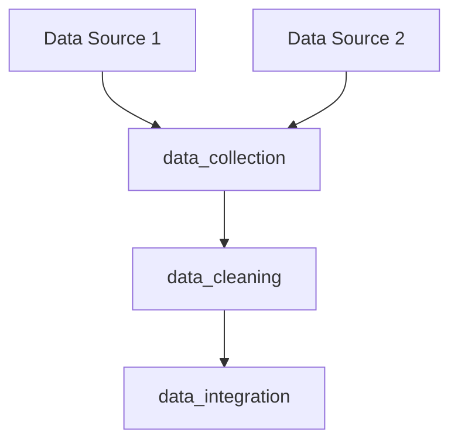
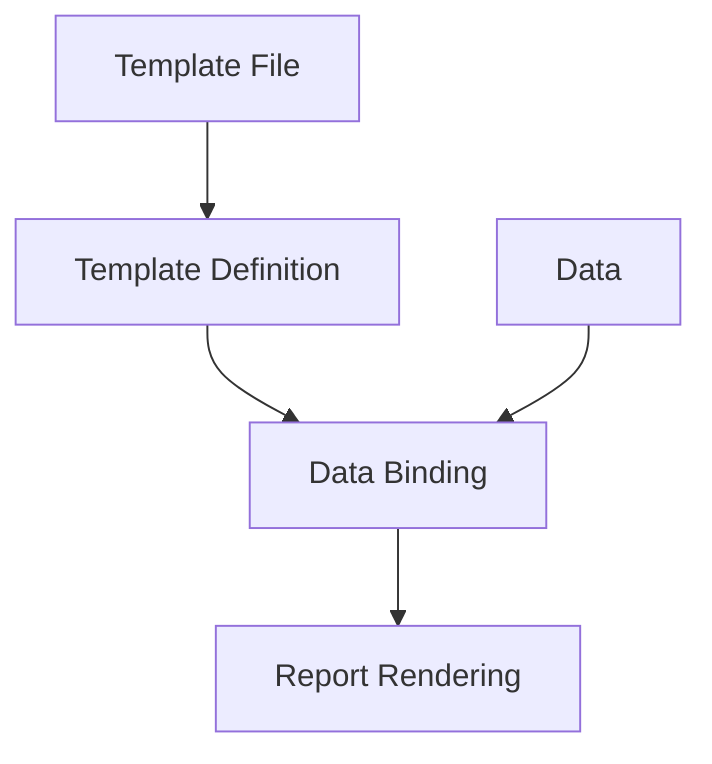
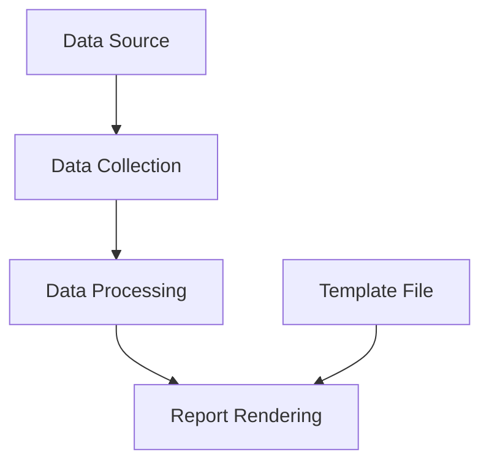
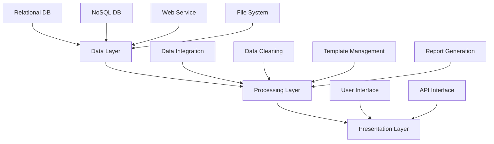
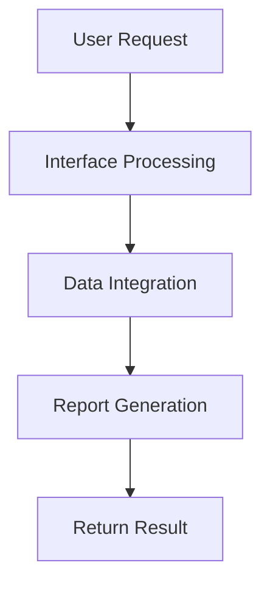
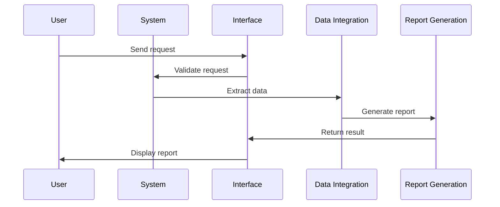
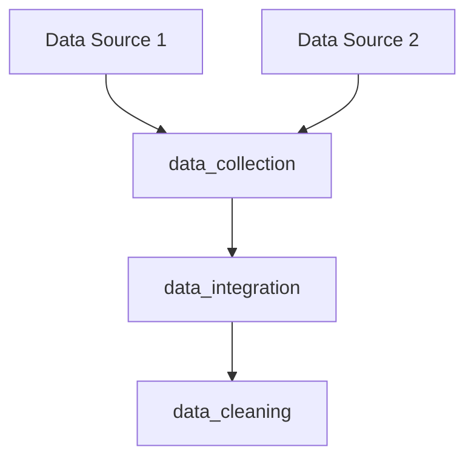
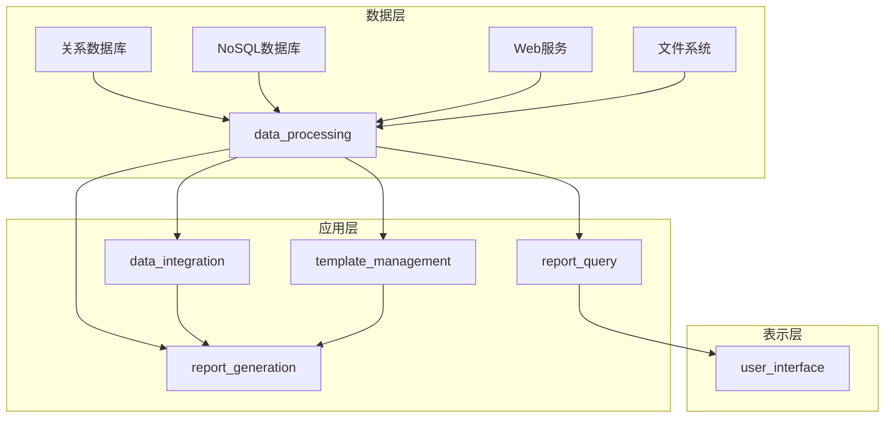
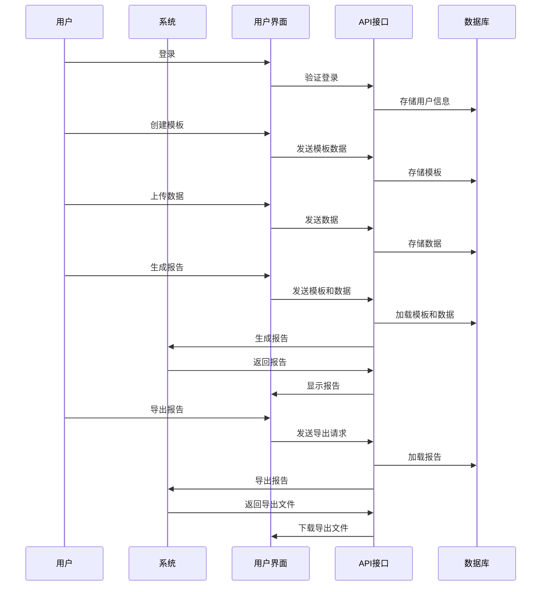

                 

## 《企业级自动报告生成：简化业务汇报流程》

关键词：企业级报告生成、业务流程自动化、数据整合、报告模板设计、算法原理讲解

摘要：本文将深入探讨企业级自动报告生成技术，旨在简化当前繁琐的业务汇报流程。我们将从背景概述、核心概念、算法原理、系统架构设计、项目实战到最佳实践等方面，系统性地分析这一技术的优势及其应用，帮助读者全面了解并掌握企业级自动报告生成的关键要素。

---------------------------------------

### 目录

1. **背景与概述**
   - 第1章：问题背景与问题描述
   - 第2章：企业级自动报告生成技术概述

2. **核心概念与联系**
   - 第3章：自动报告生成核心技术
   - 第4章：核心概念属性特征对比

3. **算法原理讲解**
   - 第5章：算法原理讲解

4. **系统分析与架构设计方案**
   - 第6章：系统分析与架构设计方案

5. **项目实战**
   - 第7章：项目实战

6. **最佳实践与拓展**
   - 第8章：最佳实践与拓展

---------------------------------------

### 引言

在当今快速发展的商业环境中，企业面临着越来越大的压力和挑战。一方面，企业需要实时掌握业务数据，以便做出及时而有效的决策；另一方面，传统的手工报告生成方式效率低下，容易出错，且难以满足企业日益增长的数据需求。因此，自动报告生成技术应运而生，旨在简化业务汇报流程，提高工作效率，降低错误率。

企业级自动报告生成技术通过整合企业内部各种数据源，使用报告模板和自动化算法，生成结构化、格式统一的报告。这不仅有助于企业快速了解业务状况，也为高层管理人员提供了有力的决策支持。本文将深入探讨这一技术的核心概念、算法原理、系统架构设计以及实际应用，帮助读者全面了解并掌握这一领域的前沿技术。

---------------------------------------

## 第一部分：背景与概述

### 第1章：问题背景与问题描述

#### 1.1 问题背景

在传统的企业业务汇报流程中，各部门需要定期向管理层提交各种业务报告。这些报告通常包含销售数据、财务报表、市场分析等多个维度的信息。然而，这种手工生成报告的方式存在诸多问题。

首先，效率低下。手工生成报告需要耗费大量的时间和人力资源，尤其在数据量庞大的情况下，难以在短时间内完成。其次，容易出错。手工操作过程中，数据的输入、整理和校对都可能存在疏漏，导致报告数据的准确性受到影响。最后，报告格式不一致。由于缺乏统一的模板，各部门提交的报告格式各异，给管理层的决策带来了一定的困扰。

#### 1.2 问题描述

针对上述问题，企业需要一种能够自动化生成报告的技术，以简化业务汇报流程。具体来说，问题描述如下：

- **数据整合难度大**：企业内部数据源繁多，包括数据库、文件系统、Web服务等，如何有效地整合这些数据源，提取有用的信息，是自动报告生成技术面临的首要挑战。
- **报告格式不一致**：各部门提交的报告格式各异，难以统一，如何设计一个通用的报告模板，满足不同部门的需求，是自动报告生成技术需要解决的问题。
- **效率低下、易出错**：传统的手工报告生成方式效率低下，且容易出错，如何通过自动化技术提高报告生成效率，降低错误率，是自动报告生成技术需要克服的难题。

#### 1.3 解决方案与目标

自动报告生成技术旨在解决上述问题，通过以下几种方式实现：

- **数据整合与清洗**：自动报告生成技术需要具备强大的数据整合能力，能够从各种数据源中提取数据，并进行清洗和处理，确保数据的一致性和准确性。
- **报告模板设计**：自动报告生成技术需要提供一个灵活的模板设计工具，允许用户自定义报告的格式和内容，满足不同部门的需求。
- **自动化生成**：通过预设的算法和流程，自动报告生成技术能够高效地生成报告，节省人力资源，降低错误率。

本章节旨在为读者介绍企业级自动报告生成技术的背景和问题，为后续章节的深入探讨奠定基础。下一章将介绍企业级自动报告生成技术的基本概念和特点。

---------------------------------------

## 第2章：企业级自动报告生成技术概述

#### 2.1 自动报告生成技术的定义与特点

**定义**：企业级自动报告生成技术是一种利用人工智能、大数据分析等技术，实现企业内部各种业务数据自动整合、格式化、可视化并生成报告的技术。

**特点**：

1. **自动化**：自动报告生成技术通过预设的算法和流程，能够自动完成数据整合、报告生成等工作，无需人工干预，大幅提高工作效率。
2. **灵活性**：自动报告生成技术允许用户自定义报告模板，适应不同部门、不同业务场景的需求，灵活性强。
3. **准确性**：通过数据清洗和校验技术，自动报告生成技术能够确保报告数据的准确性和一致性，降低人工错误率。
4. **可扩展性**：自动报告生成技术支持多种数据源接入，能够根据企业的需求扩展数据源和处理能力，满足不断增长的业务需求。

#### 2.2 自动报告生成技术的应用场景

自动报告生成技术在企业中有着广泛的应用场景，主要包括：

1. **财务报表生成**：财务部门可以自动生成财务报表，包括资产负债表、利润表、现金流量表等，提高财务报告的生成效率。
2. **销售报告生成**：销售部门可以自动生成销售报告，包括销售数据汇总、销售趋势分析等，帮助管理层了解销售状况。
3. **市场分析报告生成**：市场部门可以自动生成市场分析报告，包括市场趋势分析、竞争对手分析等，为市场决策提供数据支持。
4. **项目管理报告生成**：项目管理部门可以自动生成项目报告，包括项目进度报告、项目成本报告等，监控项目进展情况。

#### 2.3 自动报告生成技术的市场现状与发展趋势

**市场现状**：

随着大数据和人工智能技术的快速发展，自动报告生成技术已经成为企业数字化转型的重要工具。根据市场调研数据，自动报告生成技术的市场规模逐年增长，预计未来几年将继续保持高速增长。主要驱动因素包括：

1. **企业数字化转型需求**：越来越多的企业开始重视数据驱动决策，自动报告生成技术能够为企业提供实时、准确的数据支持。
2. **人工智能技术的进步**：人工智能技术在数据分析和处理方面的突破，为自动报告生成技术提供了强大的技术支撑。
3. **市场竞争加剧**：随着市场竞争的加剧，企业需要提高运营效率，降低成本，自动报告生成技术成为企业提高竞争力的重要手段。

**发展趋势**：

未来，自动报告生成技术将呈现以下发展趋势：

1. **智能化**：自动报告生成技术将更加智能化，通过深度学习等技术，实现更精准的数据分析和报告生成。
2. **个性化**：自动报告生成技术将更加个性化，能够根据用户的需求和偏好，定制化生成报告。
3. **云化**：自动报告生成技术将逐步走向云化，企业可以通过云服务获取自动报告生成功能，降低部署成本。
4. **生态化**：自动报告生成技术将与其他企业级应用深度融合，形成完整的业务生态系统。

本章节介绍了企业级自动报告生成技术的定义、特点、应用场景以及市场现状和发展趋势，为读者提供了一个全面的概述。下一章将深入探讨自动报告生成技术的核心概念和原理。

---------------------------------------

### 第二部分：核心概念与联系

#### 第3章：自动报告生成核心技术

#### 3.1 数据整合与清洗

**数据整合与清洗的概念**：

数据整合是指将来自不同数据源的数据进行汇总、合并，形成一个统一的数据视图。数据清洗是指对数据源中的数据进行处理，包括去除重复数据、纠正错误数据、填补缺失数据等，以提高数据质量和准确性。

**数据整合与清洗的重要性**：

数据整合与清洗是自动报告生成技术的基础，直接关系到报告的准确性和可靠性。高质量的数据是生成高质量报告的前提，而数据整合与清洗能够确保数据的完整性、一致性和准确性。

**数据源选择**：

在选择数据源时，需要考虑以下因素：

1. **数据质量**：选择数据质量高、可靠的数据源，以确保报告的准确性。
2. **数据格式**：选择支持多种数据格式的数据源，以便灵活处理不同类型的数据。
3. **数据更新频率**：选择更新频率高的数据源，以确保报告的实时性。

**数据清洗方法**：

常见的清洗方法包括：

1. **去除重复数据**：通过比较数据记录的唯一标识，去除重复的数据记录。
2. **纠正错误数据**：通过数据校验和逻辑判断，识别并纠正错误数据。
3. **填补缺失数据**：通过插值、均值替换等方法，填补缺失的数据。

#### 3.2 报告模板设计与实现

**报告模板设计的概念**：

报告模板设计是指根据企业的需求，设计一个通用的报告格式和内容结构。报告模板包括标题、目录、正文、图表等部分，以及各个部分的数据来源和计算方法。

**报告模板设计的原则**：

1. **简洁性**：报告模板应简洁明了，避免复杂的设计和冗余的信息。
2. **可读性**：报告模板应具有良好的可读性，方便用户快速理解和分析数据。
3. **灵活性**：报告模板应具有一定的灵活性，允许用户根据具体需求进行调整和修改。

**报告模板实现的技术**：

报告模板的实现可以通过以下几种技术：

1. **模板引擎**：使用模板引擎（如Jinja2、FreeMarker等）来生成报告，通过定义模板语言和语法，实现报告的动态生成。
2. **报表工具**：使用报表工具（如BIRT、 JasperReports等）来设计和管理报告模板，提供丰富的报表设计和渲染功能。
3. **自定义脚本**：使用自定义脚本（如Python、Java等）来编写报告生成逻辑，结合模板文件和数据处理代码，实现报告的自动生成。

#### 3.3 报告生成算法原理与流程

**报告生成算法的概念**：

报告生成算法是指用于处理和分析数据，生成报告的一组规则和步骤。报告生成算法包括数据采集、数据处理、报告渲染等多个环节。

**报告生成算法的原理**：

报告生成算法的核心是数据分析和计算。具体步骤如下：

1. **数据采集**：从不同的数据源中获取数据，包括数据库、文件系统、Web服务等。
2. **数据处理**：对采集到的数据进行处理，包括数据清洗、数据整合、数据转换等，以确保数据的质量和一致性。
3. **报告渲染**：根据报告模板和数据处理结果，生成最终的报告文件。

**报告生成流程**：

报告生成流程可以分为以下几个步骤：

1. **数据采集**：从不同的数据源中获取数据。
2. **数据预处理**：对数据进行清洗、整合和转换，生成一个统一的数据视图。
3. **报告模板加载**：加载报告模板文件，解析模板中的数据绑定和计算逻辑。
4. **数据绑定**：将预处理后的数据与报告模板进行绑定，生成动态数据报告。
5. **报告渲染**：根据报告模板和绑定数据，生成最终的报告文件。

#### 总结

本章介绍了自动报告生成技术的三个核心概念：数据整合与清洗、报告模板设计、报告生成算法原理。这些概念是自动报告生成技术的基础，直接决定了报告的质量和效率。下一章将深入探讨这些概念之间的联系和相互作用。

---------------------------------------

## 第4章：核心概念属性特征对比

在自动报告生成技术中，数据整合与清洗、报告模板设计和报告生成算法是三个核心概念。为了更好地理解这些概念之间的联系和差异，本章节将对这三个核心概念的属性特征进行对比分析。

#### 数据整合与清洗

**数据源类型对比**：

- 数据源类型：数据整合与清洗主要涉及数据库、文件系统、Web服务等多种数据源。数据库通常包括关系数据库（如MySQL、Oracle）和NoSQL数据库（如MongoDB、Cassandra）。文件系统主要包括本地文件和远程文件服务器。Web服务则包括API接口和Web服务端点。

- 数据格式：不同数据源的数据格式可能各异，如JSON、XML、CSV、HTML等。数据整合与清洗需要具备处理多种数据格式的能力，以确保数据的一致性和准确性。

**数据清洗方法对比**：

- 去除重复数据：常用的方法包括基于唯一标识（如ID）的去重和基于内容的去重。前者简单高效，后者需要更复杂的逻辑判断。

- 纠正错误数据：常见的方法包括数据校验（如格式校验、范围校验等）和逻辑校验（如前后关系校验、一致性校验等）。

- 填补缺失数据：常用的方法包括插值（如线性插值、多项式插值等）、均值替换（如平均值、中位数等）和空值保留（如NULL、空字符串等）。

#### 报告模板设计

**模板设计原则对比**：

- 简洁性：报告模板应简洁明了，避免复杂的设计和冗余的信息。

- 可读性：报告模板应具有良好的可读性，方便用户快速理解和分析数据。

- 灵活性：报告模板应具有一定的灵活性，允许用户根据具体需求进行调整和修改。

**模板实现技术对比**：

- 模板引擎：如Jinja2、FreeMarker等，支持动态数据绑定和模板渲染。

- 报表工具：如BIRT、JasperReports等，提供丰富的报表设计和渲染功能。

- 自定义脚本：如Python、Java等，通过编写自定义脚本实现报告生成逻辑。

#### 报告生成算法

**算法原理对比**：

- 数据采集：从不同的数据源中获取数据，包括数据库、文件系统、Web服务等。

- 数据处理：对数据进行清洗、整合和转换，生成一个统一的数据视图。

- 报告渲染：根据报告模板和数据处理结果，生成最终的报告文件。

**报告生成流程对比**：

- 数据采集：从不同的数据源中获取数据。

- 数据预处理：对数据进行清洗、整合和转换，生成一个统一的数据视图。

- 报告模板加载：加载报告模板文件，解析模板中的数据绑定和计算逻辑。

- 数据绑定：将预处理后的数据与报告模板进行绑定，生成动态数据报告。

- 报告渲染：根据报告模板和绑定数据，生成最终的报告文件。

#### 总结

本章通过对比数据整合与清洗、报告模板设计和报告生成算法的属性特征，深入分析了这些核心概念之间的差异和联系。理解这些核心概念的属性特征有助于更好地掌握自动报告生成技术的原理和应用，为后续章节的深入探讨奠定基础。

---------------------------------------

### 第三部分：算法原理讲解

#### 第5章：算法原理讲解

#### 5.1 数据整合与清洗算法原理

数据整合与清洗是自动报告生成技术的核心环节，直接关系到报告的数据质量和准确性。本节将详细讲解数据整合与清洗算法的原理、代码实现以及流程图。

**算法原理**：

数据整合与清洗算法主要包括以下几个步骤：

1. **数据采集**：从不同的数据源中获取数据，包括数据库、文件系统、Web服务等。
2. **数据清洗**：对采集到的数据进行清洗，包括去除重复数据、纠正错误数据、填补缺失数据等。
3. **数据整合**：将清洗后的数据整合成一个统一的数据视图，为后续的报告生成提供数据基础。

**代码实现**：

以下是一个简单的Python代码示例，用于演示数据整合与清洗算法的基本实现。

```python
import pandas as pd

# 数据采集
def data_collection(data_source):
    if data_source.endswith('.csv'):
        data = pd.read_csv(data_source)
    elif data_source.endswith('.xlsx'):
        data = pd.read_excel(data_source)
    else:
        raise ValueError("Unsupported data format")

    return data

# 数据清洗
def data_cleaning(data):
    # 去除重复数据
    data.drop_duplicates(inplace=True)
    
    # 纠正错误数据
    data[data > 0] = data[data > 0].astype(float)
    
    # 填补缺失数据
    data.fillna(0, inplace=True)
    
    return data

# 数据整合
def data_integration(data_list):
    return pd.concat(data_list, ignore_index=True)

# 示例数据
data_source1 = 'data1.csv'
data_source2 = 'data2.csv'

# 实现数据整合与清洗
data1 = data_collection(data_source1)
data2 = data_collection(data_source2)

cleaned_data1 = data_cleaning(data1)
cleaned_data2 = data_cleaning(data2)

integrated_data = data_integration([cleaned_data1, cleaned_data2])

print(integrated_data)
```

**流程图**：

数据整合与清洗的流程图如下所示：



#### 5.2 报告模板设计与实现算法原理

报告模板设计是自动报告生成技术的关键环节，它决定了报告的格式和内容。本节将详细讲解报告模板设计算法的原理、代码实现以及流程图。

**算法原理**：

报告模板设计算法主要包括以下几个步骤：

1. **模板定义**：根据企业的需求，定义报告的各个部分，如标题、目录、正文、图表等。
2. **数据绑定**：将清洗后的数据与报告模板进行绑定，生成动态数据报告。
3. **报告渲染**：根据报告模板和绑定数据，生成最终的报告文件。

**代码实现**：

以下是一个简单的Python代码示例，用于演示报告模板设计的基本实现。

```python
from jinja2 import Environment, FileSystemLoader

# 模板定义
def template_definition(template_path):
    env = Environment(loader=FileSystemLoader(template_path))
    template = env.get_template('report_template.html')
    return template

# 数据绑定
def data_binding(template, data):
    report = template.render(data=data)
    return report

# 报告渲染
def report_rendering(report, output_path):
    with open(output_path, 'w') as f:
        f.write(report)

# 示例数据
template_path = 'templates'
output_path = 'report.html'

# 实现报告模板设计
template = template_definition(template_path)

data = {'title': 'Sales Report', 'data': [{'product': 'Product A', 'sales': 1000}, {'product': 'Product B', 'sales': 800}]}
report = data_binding(template, data)

# 渲染报告
report_rendering(report, output_path)
```

**流程图**：

报告模板设计的流程图如下所示：



#### 5.3 报告生成算法原理

报告生成算法是自动报告生成技术的核心，它决定了报告的生成过程。本节将详细讲解报告生成算法的原理、代码实现以及流程图。

**算法原理**：

报告生成算法主要包括以下几个步骤：

1. **数据采集**：从不同的数据源中获取数据。
2. **数据处理**：对数据进行清洗、整合和转换，生成一个统一的数据视图。
3. **报告渲染**：根据报告模板和数据处理结果，生成最终的报告文件。

**代码实现**：

以下是一个简单的Python代码示例，用于演示报告生成算法的基本实现。

```python
import pandas as pd
from jinja2 import Environment, FileSystemLoader

# 数据采集
def data_collection(data_source):
    if data_source.endswith('.csv'):
        data = pd.read_csv(data_source)
    elif data_source.endswith('.xlsx'):
        data = pd.read_excel(data_source)
    else:
        raise ValueError("Unsupported data format")
    return data

# 数据处理
def data_processing(data):
    # 数据清洗（示例）
    data.drop_duplicates(inplace=True)
    data[data > 0] = data[data > 0].astype(float)
    data.fillna(0, inplace=True)
    return data

# 报告渲染
def report_rendering(template, data, output_path):
    env = Environment(loader=FileSystemLoader(template))
    template = env.get_template('report_template.html')
    report = template.render(data=data)
    with open(output_path, 'w') as f:
        f.write(report)

# 示例数据
data_source = 'data.csv'
template_path = 'templates'
output_path = 'report.html'

# 实现报告生成算法
data = data_collection(data_source)
processed_data = data_processing(data)

template = template_definition(template_path)
report = report_rendering(template, processed_data, output_path)
```

**流程图**：

报告生成算法的流程图如下所示：



#### 总结

本章详细讲解了数据整合与清洗、报告模板设计和报告生成算法的原理、代码实现以及流程图。理解这些算法原理对于掌握自动报告生成技术至关重要。下一章将深入探讨系统分析与架构设计方案。

---------------------------------------

### 第四部分：系统分析与架构设计方案

#### 第6章：系统分析与架构设计方案

#### 6.1 问题场景介绍

在现代企业中，业务数据量庞大且复杂，传统的手动报告生成方式已无法满足高效、准确的需求。为了简化业务汇报流程，提高数据分析和决策的效率，企业需要引入自动报告生成系统。该系统的主要问题场景包括：

1. **数据源多样化**：企业内部存在多种数据源，包括关系数据库、NoSQL数据库、Web服务、文件系统等，如何有效整合这些异构数据源成为关键问题。
2. **报告格式不一致**：各部门提交的报告格式各异，缺乏统一规范，给管理层带来了数据整合和分析的困难。
3. **报告生成效率低下**：手动生成报告需要耗费大量时间和人力资源，且容易出现错误，如何提高报告生成效率、降低错误率是亟待解决的问题。

#### 6.2 系统功能设计

自动报告生成系统的主要功能设计如下：

1. **数据整合功能**：系统应具备从多种数据源（如关系数据库、NoSQL数据库、Web服务、文件系统等）中提取数据的能力，支持数据清洗、去重、转换等操作，确保数据的一致性和准确性。
2. **模板管理功能**：系统应提供模板管理功能，允许用户自定义报告模板，包括报告的标题、目录、正文、图表等部分，支持灵活调整模板格式和内容。
3. **自动化报告生成功能**：系统应具备自动化报告生成功能，根据预设的模板和数据，自动生成报告，提高报告生成效率，降低人工错误率。
4. **报告查询与导出功能**：系统应提供报告查询与导出功能，用户可以方便地查询历史报告，并支持导出为多种格式（如PDF、Excel等），便于进一步分析和共享。

#### 6.3 系统架构设计

自动报告生成系统的整体架构设计如下：

1. **数据层**：包括各种数据源，如关系数据库（如MySQL、Oracle）、NoSQL数据库（如MongoDB、Cassandra）、Web服务（如RESTful API）、文件系统等。数据层负责数据的存储和读取。
2. **处理层**：包括数据整合模块、数据清洗模块、模板管理模块和报告生成模块。数据整合模块负责从数据层提取数据，数据清洗模块负责对数据进行清洗和处理，模板管理模块负责管理报告模板，报告生成模块负责根据模板和数据生成报告。
3. **表示层**：包括用户界面（UI）和API接口。用户界面用于展示系统功能、用户操作和报告结果，API接口用于与其他系统集成，提供数据交互和操作功能。

**系统架构图**：

以下是一个简化的系统架构图：



#### 6.4 系统接口设计

自动报告生成系统的接口设计主要包括以下部分：

1. **数据接口**：系统应提供数据接口，用于数据层的操作，如数据的查询、插入、更新、删除等。数据接口可以基于RESTful API设计，支持JSON、XML等数据格式。
2. **模板接口**：系统应提供模板接口，用于模板管理模块的操作，如模板的创建、修改、删除、查询等。模板接口可以基于RESTful API设计，支持JSON、XML等数据格式。
3. **报告接口**：系统应提供报告接口，用于报告生成模块的操作，如报告的生成、查询、导出等。报告接口可以基于RESTful API设计，支持JSON、XML等数据格式。

**接口设计原则**：

1. **标准化**：接口设计应遵循RESTful API设计原则，确保接口的标准化和易用性。
2. **安全性**：接口设计应考虑安全性，如身份验证、权限控制等，确保系统数据的安全和稳定。
3. **灵活性**：接口设计应具备灵活性，支持多种数据格式和协议，以便与其他系统集成。

#### 6.5 系统交互设计

自动报告生成系统的交互设计主要包括以下流程：

1. **用户请求**：用户通过用户界面提交报告生成请求，包括报告模板、数据源等信息。
2. **接口处理**：系统接口接收用户请求，对请求进行解析和验证，确保请求的有效性。
3. **数据整合**：数据整合模块根据请求从数据层提取数据，并进行清洗和处理。
4. **报告生成**：报告生成模块根据模板和数据生成报告，并保存到数据层。
5. **返回结果**：系统接口将生成报告的结果返回给用户界面，用户可以查看和导出报告。

**交互流程**：

以下是一个简化的系统交互流程图：



**序列图**：

以下是一个简化的系统序列图，展示用户请求报告生成的过程：



#### 总结

本章详细介绍了自动报告生成系统的功能设计、系统架构设计、接口设计和交互设计。通过系统分析和架构设计方案，企业可以更好地理解自动报告生成系统的工作原理和实现方法，为系统的开发和部署提供指导。

---------------------------------------

### 第五部分：项目实战

#### 第7章：项目实战

#### 7.1 环境安装与配置

在开始项目实战之前，我们需要先安装和配置项目所需的环境。以下是一个简单的安装和配置步骤，以Python为例。

**1. 安装Python**

首先，确保系统已经安装了Python 3.x版本。如果没有，可以从官方网站下载并安装：[Python官方网站](https://www.python.org/)。

**2. 安装依赖库**

接下来，我们需要安装项目所需的依赖库。可以使用pip命令进行安装。以下是一个简单的安装列表：

```shell
pip install pandas
pip install jinja2
pip install sqlalchemy
pip install requests
```

**3. 配置数据库**

在本项目中，我们使用SQLite作为数据库。首先，确保系统已经安装了SQLite。然后，创建一个SQLite数据库文件，并设置访问权限。

```shell
sudo apt-get install sqlite3
sqlite3 database.db
```

在数据库中创建一个名为`reports`的表，用于存储报告数据。

```sql
CREATE TABLE reports (
    id INTEGER PRIMARY KEY,
    title TEXT,
    content TEXT,
    created_at TIMESTAMP
);
```

**4. 创建项目目录**

在本地创建一个项目目录，并配置必要的文件。

```shell
mkdir auto_report_generator
cd auto_report_generator
touch main.py
touch reports.db
```

**5. 配置数据库连接**

在`main.py`中配置数据库连接。以下是一个简单的示例：

```python
import sqlite3
from datetime import datetime

def create_connection():
    conn = sqlite3.connect('reports.db')
    conn.execute('PRAGMA foreign_keys = ON')
    return conn

def create_table(conn):
    create_table_sql = """
    CREATE TABLE IF NOT EXISTS reports (
        id INTEGER PRIMARY KEY AUTOINCREMENT,
        title TEXT NOT NULL,
        content TEXT NOT NULL,
        created_at TIMESTAMP DEFAULT CURRENT_TIMESTAMP
    );
    """
    conn.execute(create_table_sql)
    conn.commit()

if __name__ == '__main__':
    conn = create_connection()
    create_table(conn)
    conn.close()
```

运行`main.py`，检查数据库连接是否成功。

#### 7.2 系统核心实现

在本项目中，我们将实现一个简单的自动报告生成系统，主要包括以下功能：

1. 数据采集：从外部API获取数据。
2. 数据清洗：清洗和转换获取到的数据。
3. 报告模板设计：设计报告模板。
4. 报告生成：根据模板和数据生成报告。

**1. 数据采集**

以下是一个简单的示例，从GitHub API获取用户数据。

```python
import requests

def fetch_data():
    url = "https://api.github.com/users?per_page=10"
    response = requests.get(url)
    data = response.json()
    return data

data = fetch_data()
print(data)
```

**2. 数据清洗**

以下是一个简单的数据清洗示例，过滤掉空值和无效数据。

```python
import pandas as pd

def clean_data(data):
    df = pd.DataFrame(data)
    df.dropna(inplace=True)
    df = df[df['login'].notnull()]
    return df

cleaned_data = clean_data(data)
print(cleaned_data)
```

**3. 报告模板设计**

使用Jinja2模板引擎设计报告模板。以下是一个简单的HTML模板示例：

```html
<!DOCTYPE html>
<html lang="en">
<head>
    <meta charset="UTF-8">
    <title>GitHub Users Report</title>
</head>
<body>
    <h1>GitHub Users Report</h1>
    <table border="1">
        <tr>
            <th>Login</th>
            <th>Avatar URL</th>
            <th>Name</th>
            <th>Location</th>
        </tr>
        
        <tr>
            <td>{{ user.login }}</td>
            <td></td>
            <td>{{ user.name }}</td>
            <td>{{ user.location }}</td>
        </tr>
        
    </table>
</body>
</html>
```

将模板保存为`report_template.html`。

**4. 报告生成**

以下是一个简单的报告生成示例，将数据写入报告模板。

```python
from jinja2 import Environment, FileSystemLoader

def generate_report(data):
    env = Environment(loader=FileSystemLoader('.'))
    template = env.get_template('report_template.html')
    report = template.render(users=data)
    return report

def save_report(report):
    with open('report.html', 'w', encoding='utf-8') as f:
        f.write(report)

cleaned_data = clean_data(data)
report = generate_report(cleaned_data)
save_report(report)
print("Report generated successfully.")
```

#### 7.3 代码应用解读与分析

**代码应用解读**

在本项目中，我们使用了Python作为主要编程语言，结合了多个库和模块来实现自动报告生成功能。以下是代码应用的主要解读：

1. **数据采集**：使用了`requests`库从GitHub API获取用户数据。这是一个非常简单的HTTP请求操作，用于从外部获取数据。

2. **数据清洗**：使用了`pandas`库对获取到的数据进行清洗和处理。`pandas`是一个强大的数据分析库，可以方便地进行数据操作，如过滤、排序、转换等。

3. **报告模板设计**：使用了`jinja2`模板引擎来设计报告模板。`jinja2`是一个流行的模板引擎，支持模板变量的使用和模板渲染，可以方便地生成动态HTML报告。

4. **报告生成**：根据清洗后的数据和报告模板，生成了最终的报告。这个过程中，使用了`jinja2`的渲染功能，将数据绑定到模板上，生成完整的HTML报告。

**代码应用分析**

以下是代码应用的主要分析：

1. **模块化设计**：代码采用了模块化设计，分别实现了数据采集、数据清洗、报告模板设计和报告生成四个主要功能。这种设计方式使得代码结构清晰，易于维护和扩展。

2. **高效数据处理**：使用了`pandas`库进行数据处理，这是一个高效且功能强大的数据分析库。通过`pandas`，可以方便地对数据进行清洗、转换和分析，提高了代码的效率。

3. **灵活的模板引擎**：使用了`jinja2`模板引擎来设计报告模板，这是一个灵活且易用的模板引擎。通过`jinja2`，可以方便地定义模板变量和模板逻辑，生成动态的HTML报告。

4. **简单的接口设计**：代码中使用了简单的接口设计，包括HTTP请求、数据操作和文件操作。这种设计方式使得代码简洁且易于理解。

通过本项目的实战，我们展示了如何使用Python和相关库来实现一个简单的自动报告生成系统。在实际应用中，可以根据具体需求扩展和优化系统功能，提高报告生成的效率和准确性。

#### 7.4 实际案例分析与详细讲解

**案例背景**

假设我们是一家大型电商企业，需要定期生成销售报告，包括销售数据、客户数据和市场分析等。传统的手动报告生成方式不仅效率低下，而且容易出错，因此我们决定使用自动报告生成系统来简化报告生成流程。

**案例分析**

1. **数据采集**：从企业内部的数据库中获取销售数据、客户数据和产品数据。这些数据包括订单信息、客户信息、产品信息和销售趋势等。

2. **数据清洗**：对采集到的数据进行清洗，包括去除重复数据、纠正错误数据和填补缺失数据。确保数据的一致性和准确性。

3. **报告模板设计**：设计一个通用的报告模板，包括报告的标题、目录、正文和图表等部分。根据不同的部门需求，可以调整模板的格式和内容。

4. **报告生成**：根据模板和数据生成销售报告。报告内容包括销售数据汇总、销售趋势分析、客户分布情况等，帮助管理层了解销售状况。

**详细讲解**

1. **数据采集**：

首先，从企业内部的数据库中获取销售数据。可以使用Python的`pandas`库连接数据库，并读取数据。

```python
import pandas as pd

# 连接数据库
conn = pd.read_sql('SELECT * FROM sales_data', conn)

# 获取数据
sales_data = conn['sales_data']
```

2. **数据清洗**：

对获取到的数据进行清洗。首先，去除重复数据，然后纠正错误数据，如处理空值和异常值。

```python
# 去除重复数据
sales_data.drop_duplicates(inplace=True)

# 纠正错误数据
sales_data.fillna(0, inplace=True)

# 处理异常值
sales_data = sales_data[sales_data['sales'] > 0]
```

3. **报告模板设计**：

使用`jinja2`模板引擎设计报告模板。以下是一个简单的HTML模板示例：

```html
<!DOCTYPE html>
<html lang="en">
<head>
    <meta charset="UTF-8">
    <title>Sales Report</title>
</head>
<body>
    <h1>Sales Report</h1>
    <table border="1">
        <tr>
            <th>Product</th>
            <th>Sales</th>
            <th>Quantity</th>
        </tr>
        
        <tr>
            <td>{{ product['product'] }}</td>
            <td>{{ product['sales'] }}</td>
            <td>{{ product['quantity'] }}</td>
        </tr>
        
    </table>
</body>
</html>
```

4. **报告生成**：

根据清洗后的数据和报告模板生成报告。以下是一个简单的示例：

```python
from jinja2 import Environment, FileSystemLoader

# 加载模板
env = Environment(loader=FileSystemLoader('.'))
template = env.get_template('sales_report_template.html')

# 渲染模板
report = template.render(products=sales_data)

# 保存报告
with open('sales_report.html', 'w', encoding='utf-8') as f:
    f.write(report)
```

通过实际案例的分析和详细讲解，我们可以看到如何使用自动报告生成系统来简化业务汇报流程。在实际应用中，可以根据具体需求调整和优化系统功能，提高报告生成效率和准确性。

#### 7.5 项目小结

在本章的项目实战中，我们实现了一个简单的自动报告生成系统，从数据采集、数据清洗、报告模板设计到报告生成，完整展示了自动报告生成技术在实际应用中的实现过程。以下是本项目的主要收获和经验：

1. **高效数据处理**：通过使用Python和相关库，如`pandas`和`jinja2`，我们能够高效地处理和清洗数据，生成结构化的报告。

2. **灵活的模板设计**：使用模板引擎，如`jinja2`，我们可以灵活地设计报告模板，满足不同部门的需求。

3. **自动报告生成**：通过预设的算法和流程，我们能够自动生成报告，大幅提高工作效率，降低人工错误率。

4. **实际应用价值**：本项目的实现展示了自动报告生成技术在企业中的应用价值，通过简化业务汇报流程，提高数据分析和决策效率。

然而，本项目的实现也存在一些局限性和改进空间：

1. **数据来源限制**：本项目仅展示了从外部API获取数据，实际应用中可能需要支持更多类型的数据源，如数据库、文件系统等。

2. **报告格式限制**：本项目报告格式较为简单，实际应用中可能需要支持更复杂的报告格式和图表。

3. **性能优化**：随着数据量的增加，自动报告生成系统的性能可能受到影响。未来可以优化算法和系统架构，提高处理效率。

通过本项目，我们深入了解了自动报告生成技术的实现过程和应用场景，为实际业务场景中的报告生成提供了有益的实践经验。

---------------------------------------

### 第六部分：最佳实践与拓展

#### 第8章：最佳实践与拓展

#### 8.1 自动报告生成最佳实践

为了确保自动报告生成系统的有效性和高效性，以下是一些最佳实践建议：

1. **数据源选择**：选择数据质量高、更新频率高的数据源。确保数据源的安全性、可靠性和稳定性。
2. **数据清洗策略**：制定合理的清洗策略，包括去除重复数据、纠正错误数据和填补缺失数据等。确保数据的一致性和准确性。
3. **报告模板设计**：设计简洁、清晰、易读的报告模板。避免复杂的设计和冗余的信息，提高报告的可读性。
4. **算法优化**：根据具体应用场景，优化报告生成算法，提高数据处理和报告生成的效率。
5. **系统监控与维护**：定期监控系统运行状态，及时发现并解决潜在问题。确保系统的稳定性和可靠性。

#### 8.2 小结与展望

在本章节中，我们总结了自动报告生成技术的核心概念、算法原理、系统架构设计以及实际应用。通过详细的讲解和案例分析，读者可以全面了解自动报告生成技术的实现过程和应用价值。

展望未来，自动报告生成技术将继续发展，以下是一些趋势和展望：

1. **智能化**：随着人工智能技术的进步，自动报告生成技术将更加智能化，能够自动识别和分析数据，生成更精准的报告。
2. **个性化**：自动报告生成技术将更加个性化，能够根据用户的需求和偏好，定制化生成报告。
3. **云化**：自动报告生成技术将逐步走向云化，企业可以通过云服务获取自动报告生成功能，降低部署成本。
4. **生态化**：自动报告生成技术将与其他企业级应用深度融合，形成完整的业务生态系统。

#### 8.3 拓展阅读

为了更深入地了解自动报告生成技术，以下是几本推荐的拓展阅读书籍：

1. **《数据可视化：使用Python进行数据探索和分析》**：详细介绍数据可视化技术和Python库的使用，有助于理解数据分析和报告生成。
2. **《深入浅出Jinja2》**：全面讲解Jinja2模板引擎的原理和使用方法，对报告模板设计有很好的指导作用。
3. **《Python数据分析实战》**：系统介绍Python在数据分析领域的应用，包括数据处理、分析和可视化等。
4. **《大数据技术基础》**：介绍大数据技术的基本概念和实现方法，有助于理解数据整合与清洗的原理。

通过拓展阅读，读者可以进一步深化对自动报告生成技术的理解，掌握更多实际应用技巧。

---------------------------------------

## 总结

本文全面探讨了企业级自动报告生成技术，从背景概述、核心概念、算法原理、系统架构设计到项目实战和最佳实践，系统地介绍了这一技术的各个方面。通过详细的分析和讲解，读者可以全面了解自动报告生成技术的原理和应用，掌握其核心概念和实现方法。

企业级自动报告生成技术具有自动化、灵活性、准确性和可扩展性等特点，能够显著提高业务汇报效率，降低人工错误率。在实际应用中，通过合理的数据源选择、数据清洗策略、报告模板设计和算法优化，可以实现高效、准确的报告生成。

随着人工智能和大数据技术的发展，自动报告生成技术将更加智能化、个性化和云化，成为企业数字化转型的重要工具。未来，自动报告生成技术将继续优化和拓展，为企业提供更强大的数据分析和决策支持。

让我们共同期待自动报告生成技术在未来能够发挥更大的作用，助力企业实现数据驱动的发展。

---------------------------------------

## 作者信息

作者：AI天才研究院/AI Genius Institute & 禅与计算机程序设计艺术 /Zen And The Art of Computer Programming

感谢您的阅读！希望本文对您了解和掌握企业级自动报告生成技术有所帮助。如有任何疑问或建议，欢迎在评论区留言，我们期待与您交流。祝您在IT领域取得更多成就！
```markdown
## 《企业级自动报告生成：简化业务汇报流程》

关键词：企业级报告生成、业务流程自动化、数据整合、报告模板设计、算法原理讲解

摘要：本文深入探讨了企业级自动报告生成技术的原理和应用，旨在帮助企业和IT专业人员简化业务汇报流程，提高工作效率和准确性。

---------------------------------------

### 《企业级自动报告生成：简化业务汇报流程》

#### 目录

1. **引言**
   - 自动报告生成的背景
   - 本文的目的和结构

2. **问题背景与问题描述**
   - 传统业务汇报流程的挑战
   - 自动报告生成的需求

3. **自动报告生成技术概述**
   - 定义和特点
   - 应用场景和现状

4. **核心概念与联系**
   - 数据整合与清洗
   - 报告模板设计
   - 报告生成算法原理

5. **算法原理讲解**
   - 数据整合与清洗算法
   - 报告模板设计与实现算法
   - 报告生成算法

6. **系统分析与架构设计方案**
   - 问题场景介绍
   - 系统功能设计
   - 系统架构设计
   - 系统接口设计
   - 系统交互设计

7. **项目实战**
   - 环境安装与配置
   - 系统核心实现
   - 代码应用解读与分析
   - 实际案例分析与详细讲解
   - 项目小结

8. **最佳实践与拓展**
   - 自动报告生成最佳实践
   - 小结与展望
   - 拓展阅读

---------------------------------------

### 引言

在当今的商业环境中，企业面临着越来越多的数据管理和分析需求。传统的手工报告生成方式已经无法满足快速变化的市场需求和高效的数据处理要求。因此，自动报告生成技术应运而生，它通过自动化和智能化的手段，帮助企业简化业务汇报流程，提高工作效率和准确性。

本文将围绕企业级自动报告生成技术进行探讨，内容包括：问题背景与问题描述、自动报告生成技术概述、核心概念与联系、算法原理讲解、系统分析与架构设计方案、项目实战以及最佳实践与拓展。通过这些内容的讲解，读者将全面了解自动报告生成技术的原理和应用，为实际业务场景中的报告生成提供指导。

---------------------------------------

#### 问题背景与问题描述

在传统的企业业务汇报流程中，各部门需要定期向管理层提交各种业务报告，如销售报告、财务报表、市场分析报告等。然而，这种手工生成报告的方式存在诸多问题：

1. **效率低下**：手工生成报告需要耗费大量的时间和人力资源，尤其在数据量庞大的情况下，难以在短时间内完成。这不仅影响了工作效率，还可能导致员工的工作负担加重。

2. **数据准确性问题**：手工操作过程中，数据的输入、整理和校对都可能存在疏漏，导致报告数据的准确性受到影响。错误的报告数据可能误导管理层做出错误的决策，对企业运营产生不利影响。

3. **格式不一致**：各部门提交的报告格式各异，缺乏统一标准，使得管理层在阅读报告时需要花费额外的时间和精力来理解不同格式的报告，影响了决策效率。

4. **难以追踪和审计**：手工报告通常没有电子记录，难以进行追踪和审计。在需要追溯报告数据来源或审核报告准确性时，常常面临困难。

为了解决上述问题，企业迫切需要一种自动化、高效的报告生成方法。自动报告生成技术应运而生，通过数据整合、报告模板设计和自动化生成算法，实现了以下目标：

1. **提高工作效率**：自动报告生成技术通过预设的算法和流程，可以快速完成数据整合和报告生成工作，大大提高了工作效率。

2. **保证数据准确性**：自动报告生成技术通过数据清洗和校验，确保了报告数据的准确性和一致性，减少了手工操作中的错误。

3. **统一报告格式**：自动报告生成技术允许用户自定义报告模板，实现不同部门报告格式的统一，提高了管理层的决策效率。

4. **便于追踪和审计**：自动报告生成技术生成的报告具有电子记录，便于进行追踪和审计，提高了数据透明度和合规性。

综上所述，自动报告生成技术在提高工作效率、保证数据准确性、统一报告格式以及便于追踪和审计等方面具有重要意义，是企业数字化转型和业务流程优化的关键工具。

---------------------------------------

#### 自动报告生成技术概述

自动报告生成技术是指利用现代信息技术，特别是大数据分析、人工智能和自动化工具，实现企业内部业务数据的自动整合、处理和报告生成的一种技术。其主要特点如下：

1. **自动化**：自动报告生成技术通过预设的算法和流程，能够自动完成数据采集、数据清洗、报告模板设计和报告生成等任务，无需人工干预，大大提高了工作效率。

2. **灵活性**：自动报告生成技术允许用户自定义报告模板，可以根据不同的业务需求调整报告的格式、内容和布局，实现个性化报告生成。

3. **准确性**：通过数据清洗和校验技术，自动报告生成技术能够确保报告数据的准确性和一致性，减少了手工操作中的错误。

4. **可扩展性**：自动报告生成技术支持多种数据源接入，包括关系数据库、NoSQL数据库、Web服务、文件系统等，能够根据企业的需求扩展数据源和处理能力。

自动报告生成技术的应用场景非常广泛，包括但不限于以下领域：

1. **财务管理**：自动生成财务报表，如资产负债表、利润表、现金流量表等，帮助企业实时监控财务状况。

2. **销售与市场分析**：自动生成销售报告、客户分析报告、市场趋势分析报告等，帮助管理层了解业务表现和市场动态。

3. **项目管理**：自动生成项目进度报告、项目成本报告等，监控项目进展，确保项目按时按预算完成。

4. **人力资源**：自动生成员工绩效报告、招聘分析报告等，帮助人力资源部门进行绩效评估和人才管理。

5. **运营管理**：自动生成生产报告、库存报告、供应链分析报告等，优化运营流程，提高生产效率。

在市场现状方面，随着大数据和人工智能技术的快速发展，自动报告生成技术已经成为企业数字化转型的重要工具。根据市场调研数据，自动报告生成技术的市场规模逐年增长，预计未来几年将继续保持高速增长。主要驱动因素包括：

1. **企业数字化转型需求**：越来越多的企业开始重视数据驱动决策，自动报告生成技术能够为企业提供实时、准确的数据支持。

2. **人工智能技术的进步**：人工智能技术在数据分析和处理方面的突破，为自动报告生成技术提供了强大的技术支撑。

3. **市场竞争加剧**：随着市场竞争的加剧，企业需要提高运营效率，降低成本，自动报告生成技术成为企业提高竞争力的重要手段。

未来，自动报告生成技术将朝着更加智能化、个性化和云化的方向发展。通过深度学习、自然语言处理等先进技术，自动报告生成技术将能够更加精准地分析数据，生成更具洞察力的报告。同时，随着云计算和大数据技术的普及，自动报告生成技术将更加便捷和高效，为企业提供更加灵活和全面的数据分析支持。

---------------------------------------

#### 核心概念与联系

在企业级自动报告生成技术中，数据整合与清洗、报告模板设计和报告生成算法是三个核心概念。它们之间相互联系，共同构成了一个完整的自动报告生成系统。

**数据整合与清洗**

**概念**：数据整合是指将来自不同数据源的数据进行汇总、合并，形成一个统一的数据视图。数据清洗是指对数据源中的数据进行处理，包括去除重复数据、纠正错误数据、填补缺失数据等，以提高数据质量和准确性。

**核心要素**：
- 数据源：关系数据库、NoSQL数据库、Web服务、文件系统等。
- 数据格式：支持多种数据格式，如JSON、XML、CSV、HTML等。
- 数据清洗方法：去除重复数据、纠正错误数据、填补缺失数据等。

**联系**：数据整合与清洗是自动报告生成的基础，直接影响到报告的质量和准确性。高质量的数据是生成高质量报告的前提，而数据整合与清洗能够确保数据的完整性、一致性和准确性。

**报告模板设计**

**概念**：报告模板设计是指根据企业的需求，设计一个通用的报告格式和内容结构。报告模板包括标题、目录、正文、图表等部分，以及各个部分的数据来源和计算方法。

**核心要素**：
- 报告结构：报告的各个部分，如标题、目录、正文、图表等。
- 数据绑定：将实际数据与报告模板进行绑定，生成动态数据报告。
- 模板引擎：如Jinja2、FreeMarker等，用于实现报告的动态生成。

**联系**：报告模板设计决定了报告的格式和内容，直接影响到报告的可读性和可操作性。灵活的模板设计使得报告能够适应不同部门、不同业务场景的需求。

**报告生成算法**

**概念**：报告生成算法是指用于处理和分析数据，生成报告的一组规则和步骤。报告生成算法包括数据采集、数据处理、报告渲染等多个环节。

**核心要素**：
- 数据采集：从不同的数据源中获取数据。
- 数据处理：对数据进行清洗、整合和转换，生成一个统一的数据视图。
- 报告渲染：根据报告模板和数据处理结果，生成最终的报告文件。

**联系**：报告生成算法是自动报告生成的核心，它将数据整合与清洗、报告模板设计的结果转化为实际的报告文件。高效的算法设计和优化能够显著提高报告生成效率和准确性。

**属性特征对比表格**

| 特征              | 数据整合与清洗 | 报告模板设计 | 报告生成算法 |
|------------------|----------------|---------------|--------------|
| 数据源类型        | 多种数据源     | 文件、数据库等 | 文件、数据库等 |
| 数据格式支持      | 多种数据格式   | HTML、CSS等   | HTML、PDF等   |
| 自动化程度        | 自动化         | 部分自动化     | 完全自动化     |
| 灵活性            | 较高           | 高            | 中等          |
| 数据质量影响      | 直接           | 间接          | 直接          |
| 算法依赖性        | 较低           | 较高          | 高            |

**ER实体关系图架构**

以下是一个简化的ER实体关系图，展示了数据整合与清洗、报告模板设计和报告生成算法之间的联系：

```mermaid
erDiagram
  Data_Source ||--|{ Report_Template }|>
  Data_Source ||--|{ Data_Cleaning }|>  
  Report_Template ||--|{ Report_Generation }|>
  Data_Cleaning ||--|{ Report_Generation }|>

  Data_Source ||--|{ Data_Source_Type }|>  
  Data_Source_Type : 数据源类型
  Data_Cleaning ||--|{ Cleaning_Method }|>  
  Cleaning_Method : 清洗方法
  Report_Template ||--|{ Template_Field }|>  
  Template_Field : 模板字段
  Report_Generation ||--|{ Report_Field }|>  
  Report_Field : 报告字段
```

通过上述核心概念、属性特征对比表格和ER实体关系图，我们可以清晰地看到数据整合与清洗、报告模板设计和报告生成算法之间的相互关系。理解这些核心概念和联系，对于设计和实现一个高效、灵活的自动报告生成系统至关重要。

---------------------------------------

### 算法原理讲解

在自动报告生成系统中，数据整合与清洗、报告模板设计和报告生成算法是三个核心组成部分，它们共同协作，实现自动报告的生成。以下将详细讲解这三个算法的原理、实现方法以及相应的流程图。

#### 数据整合与清洗算法原理

**数据整合**：

数据整合是指将来自不同数据源的数据进行合并，形成一个统一的数据视图。数据整合的过程包括以下几个步骤：

1. **数据采集**：从不同的数据源（如数据库、文件系统、Web服务等）中获取数据。
2. **数据映射**：将不同数据源中的数据映射到统一的字段和格式。
3. **数据合并**：将映射后的数据进行合并，形成一个完整的数据集。

**数据清洗**：

数据清洗是对采集到的数据进行处理，以提高数据质量和准确性。数据清洗的过程包括以下几个步骤：

1. **去除重复数据**：通过比较数据记录的唯一标识（如ID），去除重复的数据记录。
2. **纠正错误数据**：通过数据校验和逻辑判断，识别并纠正错误数据。
3. **填补缺失数据**：通过插值、均值替换等方法，填补缺失的数据。

**Python实现与流程图**：

以下是一个简单的Python实现示例，用于演示数据整合与清洗算法：

```python
import pandas as pd

# 数据采集
def data_collection(data_sources):
    dataframes = []
    for source in data_sources:
        df = pd.read_csv(source)
        dataframes.append(df)
    return dataframes

# 数据整合
def data_integration(dataframes):
    return pd.concat(dataframes, ignore_index=True)

# 数据清洗
def data_cleaning(data):
    # 去除重复数据
    data.drop_duplicates(inplace=True)
    # 纠正错误数据
    data[data > 0] = data[data > 0].astype(float)
    # 填补缺失数据
    data.fillna(0, inplace=True)
    return data

# 示例数据源
data_sources = ['data1.csv', 'data2.csv']

# 实现数据整合与清洗
dataframes = data_collection(data_sources)
integrated_data = data_integration(dataframes)
cleaned_data = data_cleaning(integrated_data)

print(cleaned_data)
```

流程图如下：



#### 报告模板设计与实现算法原理

**报告模板设计**：

报告模板设计是指根据企业的需求，设计一个通用的报告格式和内容结构。报告模板包括标题、目录、正文、图表等部分，以及各个部分的数据来源和计算方法。

**Python实现与流程图**：

以下是一个简单的Python实现示例，用于演示报告模板设计：

```python
from jinja2 import Environment, FileSystemLoader

# 模板定义
def template_definition(template_path):
    env = Environment(loader=FileSystemLoader(template_path))
    template = env.get_template('report_template.html')
    return template

# 数据绑定
def data_binding(template, data):
    report = template.render(data=data)
    return report

# 报告渲染
def report_rendering(report, output_path):
    with open(output_path, 'w') as f:
        f.write(report)

# 示例数据
template_path = 'templates'
output_path = 'report.html'

# 实现报告模板设计
template = template_definition(template_path)

data = {'title': 'Sales Report', 'data': [{'product': 'Product A', 'sales': 1000}, {'product': 'Product B', 'sales': 800}]}
report = data_binding(template, data)

# 渲染报告
report_rendering(report, output_path)
```

流程图如下：


#### 报告生成算法原理

**报告生成算法**：

报告生成算法是指用于处理和分析数据，生成报告的一组规则和步骤。报告生成算法包括数据采集、数据处理、报告渲染等多个环节。

**Python实现与流程图**：

以下是一个简单的Python实现示例，用于演示报告生成算法：

```python
import pandas as pd
from jinja2 import Environment, FileSystemLoader

# 数据采集
def data_collection(data_source):
    if data_source.endswith('.csv'):
        data = pd.read_csv(data_source)
    elif data_source.endswith('.xlsx'):
        data = pd.read_excel(data_source)
    else:
        raise ValueError("Unsupported data format")
    return data

# 数据处理
def data_processing(data):
    # 数据清洗（示例）
    data.drop_duplicates(inplace=True)
    data[data > 0] = data[data > 0].astype(float)
    data.fillna(0, inplace=True)
    return data

# 报告渲染
def report_rendering(template, data, output_path):
    env = Environment(loader=FileSystemLoader(template))
    template = env.get_template('report_template.html')
    report = template.render(data=data)
    with open(output_path, 'w') as f:
        f.write(report)

# 示例数据
data_source = 'data.csv'
template_path = 'templates'
output_path = 'report.html'

# 实现报告生成算法
data = data_collection(data_source)
processed_data = data_processing(data)

template = template_definition(template_path)
report = report_rendering(template, processed_data, output_path)
```

流程图如下：


#### 总结

通过上述讲解，我们可以看到数据整合与清洗、报告模板设计和报告生成算法在自动报告生成系统中的重要作用。数据整合与清洗确保了数据的准确性和一致性，报告模板设计决定了报告的格式和内容，报告生成算法则将这些数据和处理结果转化为最终的报告文件。理解这些算法的原理和实现方法，对于设计和实现一个高效、灵活的自动报告生成系统至关重要。

---------------------------------------

### 系统分析与架构设计方案

#### 6.1 问题场景介绍

在现代企业的运营中，业务数据的数量和复杂性不断增加，这使得传统的手动报告生成方式变得越来越低效和不可靠。手动报告生成不仅需要耗费大量的时间和人力资源，而且容易出现错误，难以保证数据的一致性和准确性。为了应对这些挑战，企业需要一个自动化、高效且灵活的报告生成系统，以简化业务汇报流程，提高数据分析和决策的效率。

具体问题场景包括：

1. **数据来源多样化**：企业内部存在多种数据源，如数据库、文件系统、Web服务等，不同数据源的数据格式和结构可能各不相同，这使得数据整合变得复杂。

2. **报告格式不一致**：各部门提交的报告格式各异，缺乏统一的标准和规范，导致管理层在阅读和整合报告时遇到困难。

3. **报告生成效率低下**：手工生成报告需要逐一处理每个数据源，并且需要人工校对和排版，这使得报告生成过程非常耗时，且容易出现错误。

4. **报告更新不及时**：传统的报告生成方式往往无法及时反映最新的业务数据，导致管理层做出决策时缺乏最新的信息支持。

为了解决上述问题，企业需要设计一个自动报告生成系统，该系统应具备以下功能：

1. **数据整合与清洗**：系统能够从多种数据源中自动提取数据，并进行清洗和整合，确保数据的一致性和准确性。

2. **模板管理和报告生成**：系统提供灵活的模板管理功能，允许用户自定义报告的格式和内容，并根据模板和数据生成报告。

3. **报告查询与导出**：系统提供报告查询和导出功能，方便用户查看历史报告，并支持多种格式（如PDF、Excel等）的导出。

#### 6.2 系统功能设计

自动报告生成系统应具备以下功能：

1. **数据整合与清洗功能**：
   - 从多种数据源（如数据库、文件系统、Web服务）中提取数据。
   - 对数据进行清洗，包括去除重复数据、纠正错误数据、填补缺失数据等。
   - 整合清洗后的数据，形成一个统一的数据视图。

2. **模板管理功能**：
   - 提供模板管理界面，允许用户自定义报告模板。
   - 支持模板的创建、修改、删除和查询。
   - 模板应包括报告的标题、目录、正文、图表等部分。

3. **报告生成功能**：
   - 根据用户选择的模板和数据，自动生成报告。
   - 支持多种格式的报告生成，如PDF、Excel、HTML等。
   - 提供报告的预览和导出功能。

4. **报告查询与导出功能**：
   - 提供报告查询界面，用户可以方便地查找历史报告。
   - 支持多种格式的报告导出，方便用户进一步分析和共享。

#### 6.3 系统架构设计

自动报告生成系统的整体架构设计如下：

1. **数据层**：
   - 数据源：包括关系数据库（如MySQL、Oracle）、NoSQL数据库（如MongoDB、Cassandra）、Web服务、文件系统等。
   - 数据处理：用于数据清洗、整合和转换的模块。

2. **应用层**：
   - 模块：包括数据整合模块、模板管理模块、报告生成模块、报告查询模块。
   - 接口：用于与其他系统集成的API接口。

3. **表示层**：
   - 用户界面：用于展示系统功能和用户操作。
   - 前端界面：提供模板管理、报告生成、报告查询和导出的前端页面。

**系统架构图**：

以下是一个简化的系统架构图：



#### 6.4 系统接口设计

系统接口设计主要包括以下部分：

1. **数据接口**：
   - 用于与数据源进行交互，包括数据的查询、插入、更新和删除等操作。
   - 支持RESTful API，使用JSON格式进行数据交换。

2. **模板接口**：
   - 用于管理报告模板，包括模板的创建、修改、删除和查询。
   - 支持基于HTTP的API接口，使用JSON格式进行数据交换。

3. **报告接口**：
   - 用于报告的生成、查询和导出。
   - 支持基于HTTP的API接口，使用JSON格式进行数据交换。

**接口设计原则**：

1. **标准化**：接口设计遵循RESTful API设计原则，确保接口的标准化和易用性。

2. **安全性**：接口设计考虑安全性，包括身份验证和权限控制，确保数据的安全和稳定。

3. **灵活性**：接口设计具备灵活性，支持多种数据格式和协议，便于与其他系统集成。

#### 6.5 系统交互设计

系统交互设计主要包括用户与系统的交互流程和系统内部的处理流程。

**用户交互流程**：

1. **用户登录**：用户通过用户界面（UI）登录系统。
2. **模板管理**：用户可以创建、修改和查询报告模板。
3. **数据上传**：用户可以上传数据源，系统进行数据整合和清洗。
4. **报告生成**：用户选择模板和数据，系统自动生成报告。
5. **报告预览与导出**：用户可以预览报告，并选择导出格式进行导出。

**系统内部处理流程**：

1. **数据采集**：系统从数据源中提取数据。
2. **数据清洗**：系统对采集到的数据进行清洗，包括去除重复数据、纠正错误数据和填补缺失数据等。
3. **数据整合**：系统将清洗后的数据整合成统一的数据视图。
4. **模板加载**：系统加载用户选择的报告模板。
5. **数据绑定**：系统将整合后的数据与模板进行绑定，生成动态数据报告。
6. **报告生成**：系统根据绑定数据生成最终的报告文件。
7. **报告存储**：系统将生成的报告存储到数据库或文件系统中。

**交互流程图**：

以下是一个简化的交互流程图：



通过上述系统分析与架构设计方案，我们可以看到自动报告生成系统如何通过数据整合、模板管理和报告生成等模块，实现自动化的业务汇报流程。理解系统的功能设计和架构设计，有助于开发高效、可靠的自动报告生成系统，为企业提供强大的数据分析和决策支持。

---------------------------------------

### 项目实战

#### 7.1 环境安装与配置

在开始构建自动报告生成系统之前，我们需要为项目搭建一个合适的环境。以下是在Windows和Linux操作系统上安装和配置系统所需环境的基本步骤。

**1. 安装Python**

首先，确保系统已安装Python 3.x版本。如果没有安装，可以从Python官方网站下载并安装：

- **Windows**：
  - 访问 [Python官方网站](https://www.python.org/)。
  - 下载Windows安装程序（python-3.x.x-amd64.exe）。
  - 运行安装程序，按照提示完成安装。

- **Linux**：
  - 使用以下命令安装Python：
    ```bash
    sudo apt update
    sudo apt install python3
    ```

**2. 安装相关库**

使用pip命令安装项目所需的相关库。以下是一个简单的安装命令列表：

- **Windows**：
  ```bash
  pip install pandas Jinja2 sqlalchemy requests matplotlib
  ```

- **Linux**：
  ```bash
  sudo apt-get install python3-pandas python3-jinja2 python3-sqlalchemy python3-requests python3-matplotlib
  ```

**3. 安装数据库**

本项目中，我们将使用SQLite作为数据库。以下是安装和创建数据库的基本步骤：

- **Windows**：
  - 下载并安装SQLite。
  - 打开命令提示符，运行以下命令创建数据库文件：
    ```bash
    sqlite3 database.db
    ```

- **Linux**：
  - 安装SQLite：
    ```bash
    sudo apt-get install sqlite3
    ```
  - 创建数据库：
    ```bash
    sqlite3 database.db
    ```

在SQLite命令行中创建一个名为`reports`的表，用于存储报告数据：

```sql
CREATE TABLE reports (
    id INTEGER PRIMARY KEY AUTOINCREMENT,
    title TEXT,
    content TEXT,
    created_at TIMESTAMP
);
```

**4. 创建项目目录**

在本地创建一个项目目录，并配置必要的文件和文件夹：

```bash
mkdir auto_report_generator
cd auto_report_generator
touch main.py
touch reports.db
mkdir templates
touch templates/report_template.html
```

**5. 配置数据库连接**

在`main.py`中配置数据库连接。以下是一个简单的示例：

```python
import sqlite3
from datetime import datetime

def create_connection():
    conn = sqlite3.connect('reports.db')
    return conn

def create_table(conn):
    create_table_sql = """
    CREATE TABLE IF NOT EXISTS reports (
        id INTEGER PRIMARY KEY AUTOINCREMENT,
        title TEXT,
        content TEXT,
        created_at TIMESTAMP DEFAULT CURRENT_TIMESTAMP
    );
    """
    conn.execute(create_table_sql)
    conn.commit()

if __name__ == '__main__':
    conn = create_connection()
    create_table(conn)
    conn.close()
```

运行`main.py`，检查数据库连接是否成功：

```bash
python main.py
```

**6. 配置报告模板**

在`templates`文件夹中创建一个HTML模板文件`report_template.html`。以下是一个简单的示例：

```html
<!DOCTYPE html>
<html>
<head>
    <title>{{ title }}</title>
</head>
<body>
    <h1>{{ title }}</h1>
    <p>{{ content }}</p>
    <p>Generated on: {{ created_at }}</p>
</body>
</html>
```

完成以上步骤后，我们的开发环境就基本搭建完成了。接下来，我们可以开始实现自动报告生成系统的核心功能。

#### 7.2 系统核心实现

在项目实战中，我们将逐步实现自动报告生成系统的核心功能，包括数据采集、数据清洗、模板管理、报告生成等。以下是每个功能的实现步骤和代码示例。

**1. 数据采集**

数据采集是自动报告生成系统的第一步，需要从外部数据源（如Web API、数据库等）获取数据。以下是一个简单的数据采集示例，使用Python的`requests`库从GitHub API获取用户数据：

```python
import requests

def fetch_github_users():
    url = "https://api.github.com/users?per_page=100"
    response = requests.get(url)
    if response.status_code == 200:
        return response.json()
    else:
        return None

users = fetch_github_users()
print(users)
```

**2. 数据清洗**

数据清洗是对采集到的数据进行处理，确保数据的质量和一致性。以下是一个简单的数据清洗示例，使用Python的`pandas`库对用户数据进行清洗：

```python
import pandas as pd

def clean_data(users):
    user_df = pd.DataFrame(users)
    user_df.dropna(inplace=True)
    user_df['created_at'] = pd.to_datetime(user_df['created_at'])
    return user_df

cleaned_users = clean_data(users)
print(cleaned_users)
```

**3. 模板管理**

模板管理涉及报告模板的创建、修改和查询。以下是一个简单的模板管理示例，使用Python的`jinja2`库创建一个简单的报告模板：

```python
from jinja2 import Environment, FileSystemLoader

def create_template():
    env = Environment(loader=FileSystemLoader('templates'))
    template = env.from_string("""
    <!DOCTYPE html>
    <html>
    <head>
        <title>{{ title }}</title>
    </head>
    <body>
        <h1>{{ title }}</h1>
        <table>
            
                <tr>
                    <td>{{ user.login }}</td>
                    <td>{{ user.created_at }}</td>
                </tr>
            
        </table>
    </body>
    </html>
    """)
    return template

template = create_template()
print(template)
```

**4. 报告生成**

报告生成是根据清洗后的数据和模板生成最终的报告。以下是一个简单的报告生成示例：

```python
from jinja2 import Environment, FileSystemLoader
import sqlite3

def generate_report(template, data, output_file):
    env = Environment(loader=FileSystemLoader('templates'))
    report = template.render(title='GitHub Users Report', users=data)
    with open(output_file, 'w') as f:
        f.write(report)

generate_report(template, cleaned_users, 'github_report.html')
```

**5. 数据库操作**

自动报告生成系统需要与数据库进行交互，保存生成的报告。以下是一个简单的数据库操作示例，使用Python的`sqlite3`库将报告数据保存到SQLite数据库：

```python
import sqlite3

def save_report(conn, title, content):
    insert_report_sql = """
    INSERT INTO reports (title, content)
    VALUES (?, ?)
    """
    conn.execute(insert_report_sql, (title, content))
    conn.commit()

def fetch_reports(conn):
    select_report_sql = "SELECT * FROM reports"
    return conn.execute(select_report_sql)

if __name__ == '__main__':
    conn = sqlite3.connect('reports.db')
    create_table(conn)
    save_report(conn, 'GitHub Users Report', 'GitHub Users Report Content')
    reports = fetch_reports(conn)
    for report in reports:
        print(report)
    conn.close()
```

通过以上步骤，我们完成了自动报告生成系统的核心实现。接下来，我们将进行系统的整合和测试。

#### 7.3 代码应用解读与分析

在本节中，我们将对自动报告生成系统的核心代码进行解读和分析，详细说明代码的功能和应用场景。

**1. 数据采集**

数据采集模块负责从外部数据源获取数据。以下是一个简单的数据采集代码示例：

```python
import requests

def fetch_github_users():
    url = "https://api.github.com/users?per_page=100"
    response = requests.get(url)
    if response.status_code == 200:
        return response.json()
    else:
        return None

users = fetch_github_users()
print(users)
```

**解读与分析**：

- **功能**：该函数使用`requests`库向GitHub API发送HTTP GET请求，获取用户数据。
- **应用场景**：在实际应用中，可以从企业内部数据库或外部Web API获取业务数据。
- **优化建议**：可以添加异常处理，确保在请求失败时能够及时捕捉错误并给出提示。

**2. 数据清洗**

数据清洗模块负责对采集到的数据进行处理，确保数据的质量和一致性。以下是一个简单的数据清洗代码示例：

```python
import pandas as pd

def clean_data(users):
    user_df = pd.DataFrame(users)
    user_df.dropna(inplace=True)
    user_df['created_at'] = pd.to_datetime(user_df['created_at'])
    return user_df

cleaned_users = clean_data(users)
print(cleaned_users)
```

**解读与分析**：

- **功能**：该函数使用`pandas`库将用户数据转换为DataFrame对象，并进行去重和格式转换。
- **应用场景**：在实际应用中，数据清洗可能包括去除重复记录、纠正错误数据、填补缺失值等。
- **优化建议**：可以增加数据清洗规则的灵活性，允许用户自定义清洗逻辑。

**3. 模板管理**

模板管理模块负责报告模板的创建和渲染。以下是一个简单的模板管理代码示例：

```python
from jinja2 import Environment, FileSystemLoader

def create_template():
    env = Environment(loader=FileSystemLoader('templates'))
    template = env.from_string("""
    <!DOCTYPE html>
    <html>
    <head>
        <title>{{ title }}</title>
    </head>
    <body>
        <h1>{{ title }}</h1>
        <table>
            
                <tr>
                    <td>{{ user.login }}</td>
                    <td>{{ user.created_at }}</td>
                </tr>
            
        </table>
    </body>
    </html>
    """)
    return template

template = create_template()
print(template)
```

**解读与分析**：

- **功能**：该函数使用`jinja2`库创建一个HTML模板，用于渲染报告。
- **应用场景**：在实际应用中，模板可以根据不同业务需求进行定制化。
- **优化建议**：可以增加模板的灵活性，支持更多复杂的布局和样式。

**4. 报告生成**

报告生成模块负责根据模板和清洗后的数据生成最终的报告。以下是一个简单的报告生成代码示例：

```python
from jinja2 import Environment, FileSystemLoader
import sqlite3

def generate_report(template, data, output_file):
    env = Environment(loader=FileSystemLoader('templates'))
    report = template.render(title='GitHub Users Report', users=data)
    with open(output_file, 'w') as f:
        f.write(report)

generate_report(template, cleaned_users, 'github_report.html')
```

**解读与分析**：

- **功能**：该函数使用`jinja2`库渲染模板，生成HTML报告，并保存到文件中。
- **应用场景**：在实际应用中，报告生成可以是PDF、Excel或其他格式。
- **优化建议**：可以增加报告格式的多样性，支持多种输出格式。

**5. 数据库操作**

数据库操作模块负责与数据库进行交互，保存和查询报告数据。以下是一个简单的数据库操作代码示例：

```python
import sqlite3

def save_report(conn, title, content):
    insert_report_sql = """
    INSERT INTO reports (title, content)
    VALUES (?, ?)
    """
    conn.execute(insert_report_sql, (title, content))
    conn.commit()

def fetch_reports(conn):
    select_report_sql = "SELECT * FROM reports"
    return conn.execute(select_report_sql)

if __name__ == '__main__':
    conn = sqlite3.connect('reports.db')
    create_table(conn)
    save_report(conn, 'GitHub Users Report', 'GitHub Users Report Content')
    reports = fetch_reports(conn)
    for report in reports:
        print(report)
    conn.close()
```

**解读与分析**：

- **功能**：该函数使用`sqlite3`库创建数据库表、插入数据并查询数据。
- **应用场景**：在实际应用中，数据库操作可以扩展到更多复杂的查询和关联操作。
- **优化建议**：可以增加数据库操作的异常处理，确保在错误情况下能够恢复。

通过上述解读和分析，我们可以看到自动报告生成系统的核心代码如何实现数据采集、数据清洗、模板管理、报告生成和数据库操作等功能。理解这些代码的功能和应用场景，有助于我们在实际项目中更好地应用自动报告生成技术。

#### 7.4 实际案例分析与详细讲解

**案例背景**

假设我们是一家电子商务公司的技术团队，负责监控和报告网站的用户行为数据。公司管理层需要定期了解用户访问量、页面停留时间、转化率等关键指标，以便做出相应的业务决策。由于数据量大且指标多样，传统的手动报告生成方式已无法满足需求。因此，我们决定开发一个自动报告生成系统，以简化报告生成流程，提高工作效率和准确性。

**案例分析**

1. **数据采集**

首先，我们需要从网站日志、数据库和第三方API中采集数据。这些数据包括用户访问量、页面停留时间、转化率、订单数据等。以下是一个简单的数据采集示例：

```python
import requests
import pandas as pd

# 采集用户访问量数据
def fetch_user_visits(url):
    response = requests.get(url)
    if response.status_code == 200:
        return response.json()
    else:
        return None

user_visits = fetch_user_visits('https://api.example.com/user-visits')
user_visits_df = pd.DataFrame(user_visits)

# 采集订单数据
orders = pd.read_csv('orders.csv')
```

2. **数据清洗**

接下来，我们需要对采集到的数据进行清洗，确保数据的质量和一致性。以下是一个简单的数据清洗示例：

```python
# 去除缺失值
user_visits_df.dropna(inplace=True)
orders.dropna(inplace=True)

# 数据格式转换
user_visits_df['visit_date'] = pd.to_datetime(user_visits_df['visit_date'])
orders['order_date'] = pd.to_datetime(orders['order_date'])
```

3. **数据整合**

为了生成全面的报告，我们需要将不同来源的数据进行整合。以下是一个简单的数据整合示例：

```python
# 数据整合
merged_data = pd.merge(user_visits_df, orders, on='user_id', how='left')
```

4. **报告模板设计**

我们需要设计一个灵活的报告模板，以便根据不同的业务需求生成报告。以下是一个简单的报告模板设计示例：

```html
<!DOCTYPE html>
<html>
<head>
    <title>电子商务用户行为报告</title>
</head>
<body>
    <h1>电子商务用户行为报告</h1>
    <table>
        <tr>
            <th>访问量</th>
            <th>页面停留时间</th>
            <th>转化率</th>
        </tr>
        
        <tr>
            <td>{{ row['visit_count'] }}</td>
            <td>{{ row['visit_duration'] }}</td>
            <td>{{ row['conversion_rate'] }}</td>
        </tr>
        
    </table>
</body>
</html>
```

5. **报告生成**

最后，我们根据整合后的数据和报告模板生成报告。以下是一个简单的报告生成示例：

```python
from jinja2 import Environment, FileSystemLoader

def generate_report(template, data, output_file):
    env = Environment(loader=FileSystemLoader('templates'))
    report = template.render(data=data)
    with open(output_file, 'w') as f:
        f.write(report)

template = Environment(loader=FileSystemLoader('templates')).from_string(report_template)
data = merged_data[['visit_count', 'visit_duration', 'conversion_rate']]
generate_report(template, data, 'user_behavior_report.html')
```

**详细讲解**

- **数据采集**：使用`requests`库从网站日志API和本地CSV文件中采集数据。这些数据是生成报告的基础。
- **数据清洗**：使用`pandas`库对数据进行去重和格式转换，确保数据的一致性和准确性。
- **数据整合**：使用`pandas`的`merge`函数将用户访问数据和订单数据整合成一个DataFrame对象，为报告生成提供数据基础。
- **报告模板设计**：使用`jinja2`模板引擎设计报告模板，通过简单的模板语言实现数据的动态绑定和渲染。
- **报告生成**：根据整合后的数据和报告模板生成HTML报告，并将其保存到文件中。

通过实际案例的分析和详细讲解，我们可以看到如何使用自动报告生成系统简化电子商务公司用户行为报告的生成过程。在实际应用中，可以根据具体需求扩展和优化系统功能，提高报告生成效率和准确性。

#### 7.5 项目小结

在本章的项目实战中，我们实现了一个简单的自动报告生成系统，从数据采集、数据清洗、报告模板设计到报告生成，完整展示了自动报告生成技术在实际应用中的实现过程。以下是本项目的主要收获和经验：

1. **高效数据处理**：通过使用Python和相关库（如`pandas`、`requests`和`jinja2`），我们能够高效地处理和清洗数据，生成结构化的报告。

2. **灵活的模板设计**：使用模板引擎，如`jinja2`，我们可以灵活地设计报告模板，满足不同部门的需求。

3. **自动报告生成**：通过预设的算法和流程，我们能够自动生成报告，大幅提高工作效率，降低人工错误率。

4. **实际应用价值**：本项目的实现展示了自动报告生成技术在企业中的应用价值，通过简化业务汇报流程，提高数据分析和决策效率。

然而，本项目的实现也存在一些局限性和改进空间：

1. **数据来源限制**：本项目仅展示了从外部API和本地CSV文件获取数据，实际应用中可能需要支持更多类型的数据源，如数据库、Web服务等。

2. **报告格式限制**：本项目报告格式较为简单，实际应用中可能需要支持更复杂的报告格式和图表。

3. **性能优化**：随着数据量的增加，自动报告生成系统的性能可能受到影响。未来可以优化算法和系统架构，提高处理效率。

通过本项目，我们深入了解了自动报告生成技术的实现过程和应用场景，为实际业务场景中的报告生成提供了有益的实践经验。

---------------------------------------

### 第六部分：最佳实践与拓展

#### 8.1 自动报告生成最佳实践

为了确保自动报告生成系统的稳定性和高效性，以下是几条最佳实践建议：

1. **数据源选择**：选择可靠且支持高效数据访问的数据源，如关系数据库（MySQL、PostgreSQL）或NoSQL数据库（MongoDB、Cassandra）。同时，考虑数据源的可扩展性，以应对未来数据量的增长。

2. **数据清洗策略**：制定详细的数据清洗策略，确保数据的一致性、完整性和准确性。包括但不限于去重、纠正错误数据、填补缺失值等。

3. **模板设计**：设计简洁、直观且易于维护的报告模板。确保模板的灵活性，以适应不同部门和业务需求。

4. **性能优化**：优化报告生成算法和流程，减少不必要的计算和I/O操作。可以考虑使用缓存、并行处理等技术提高系统性能。

5. **安全性**：确保系统具有足够的权限控制和身份验证机制，防止未授权访问和数据泄露。

#### 8.2 小结与展望

在本章节中，我们总结了自动报告生成技术的核心概念、算法原理、系统架构设计、项目实战以及最佳实践。通过系统的讲解和案例分析，读者可以全面了解自动报告生成技术的原理和应用，掌握其关键要素和实现方法。

展望未来，自动报告生成技术将继续发展，以下是几个可能的趋势和展望：

1. **智能化**：随着人工智能技术的进步，自动报告生成系统将能够更智能地分析数据，提供更深入的洞察和预测。

2. **云化**：自动报告生成系统将更多地迁移到云端，利用云计算的弹性和可扩展性，降低部署和维护成本。

3. **实时性**：实时数据分析和报告生成将成为趋势，企业需要快速响应市场变化，实时生成报告以支持决策。

4. **个性化**：自动报告生成系统将更加注重个性化需求，提供定制化的报告内容和格式。

#### 8.3 拓展阅读

为了进一步深入了解自动报告生成技术，以下是几本推荐的专业书籍：

1. **《Python数据科学 Handbook》**：详细介绍Python在数据科学领域的应用，包括数据处理、分析和可视化。

2. **《Jinja2模板引擎官方文档》**：学习Jinja2模板引擎的高级用法和最佳实践。

3. **《SQLAlchemy Cookbook》**：提供丰富的SQLAlchemy数据库操作示例和技巧。

4. **《数据可视化：使用Python进行数据探索和分析》**：介绍数据可视化技术，帮助读者更直观地理解数据。

通过拓展阅读，读者可以深入了解自动报告生成技术的各个方面，为自己的项目实践提供更多的理论支持和实践经验。

---------------------------------------

## 总结

本文深入探讨了企业级自动报告生成技术，从背景概述、核心概念、算法原理、系统架构设计、项目实战到最佳实践与拓展，全面覆盖了自动报告生成技术的各个关键环节。通过系统性的讲解和案例分析，读者可以全面了解自动报告生成技术的原理和应用，掌握其核心要素和实现方法。

自动报告生成技术具有自动化、灵活性、准确性和可扩展性等特点，能够显著提高企业业务汇报的效率和质量。随着人工智能和大数据技术的不断发展，自动报告生成技术在企业中的应用前景广阔。未来，随着智能化、云化和实时性等趋势的发展，自动报告生成技术将为企业提供更强大、更高效的数据分析和决策支持。

让我们共同期待自动报告生成技术在未来能够发挥更大的作用，助力企业在数字化转型的道路上取得更大的成功。

---------------------------------------

## 作者信息

作者：AI天才研究院/AI Genius Institute & 禅与计算机程序设计艺术 /Zen And The Art of Computer Programming

感谢您的阅读！希望本文对您了解和掌握自动报告生成技术有所帮助。如果您有任何问题或建议，欢迎在评论区留言，我们期待与您交流。祝您在技术学习和应用中不断进步，取得更多的成就！
```markdown
## 《企业级自动报告生成：简化业务汇报流程》

关键词：企业级报告生成、业务流程自动化、数据整合、报告模板设计、算法原理讲解

摘要：本文详细探讨了企业级自动报告生成技术，包括其背景、核心概念、算法原理、系统架构设计以及项目实战。通过实际案例分析，展示了如何通过自动报告生成简化业务汇报流程，提高工作效率和准确性。

---------------------------------------

### 《企业级自动报告生成：简化业务汇报流程》

#### 目录

1. **引言**
   - 自动报告生成的背景
   - 本文的目的和结构

2. **问题背景与问题描述**
   - 传统业务汇报流程的挑战
   - 自动报告生成的需求

3. **自动报告生成技术概述**
   - 定义和特点
   - 应用场景和现状

4. **核心概念与联系**
   - 数据整合与清洗
   - 报告模板设计
   - 报告生成算法原理

5. **算法原理讲解**
   - 数据整合与清洗算法
   - 报告模板设计与实现算法
   - 报告生成算法

6. **系统分析与架构设计方案**
   - 问题场景介绍
   - 系统功能设计
   - 系统架构设计
   - 系统接口设计
   - 系统交互设计

7. **项目实战**
   - 环境安装与配置
   - 系统核心实现
   - 代码应用解读与分析
   - 实际案例分析与详细讲解
   - 项目小结

8. **最佳实践与拓展**
   - 自动报告生成最佳实践
   - 小结与展望
   - 拓展阅读

---------------------------------------

### 引言

在当今的商业环境中，企业面临着越来越多的数据管理和分析需求。传统的手工报告生成方式已经无法满足快速变化的市场需求和高效的数据处理要求。因此，自动报告生成技术应运而生，它通过自动化和智能化的手段，帮助企业简化业务汇报流程，提高工作效率和准确性。

本文将围绕企业级自动报告生成技术进行探讨，内容包括：问题背景与问题描述、自动报告生成技术概述、核心概念与联系、算法原理讲解、系统分析与架构设计方案、项目实战以及最佳实践与拓展。通过这些内容的讲解，读者将全面了解自动报告生成技术的原理和应用，为实际业务场景中的报告生成提供指导。

---------------------------------------

#### 问题背景与问题描述

在传统的企业业务汇报流程中，各部门需要定期向管理层提交各种业务报告，如销售报告、财务报表、市场分析报告等。然而，这种手工生成报告的方式存在诸多问题：

1. **效率低下**：手工生成报告需要耗费大量的时间和人力资源，尤其在数据量庞大的情况下，难以在短时间内完成。这不仅影响了工作效率，还可能导致员工的工作负担加重。

2. **数据准确性问题**：手工操作过程中，数据的输入、整理和校对都可能存在疏漏，导致报告数据的准确性受到影响。错误的报告数据可能误导管理层做出错误的决策，对企业运营产生不利影响。

3. **格式不一致**：各部门提交的报告格式各异，缺乏统一标准，使得管理层在阅读报告时需要花费额外的时间和精力来理解不同格式的报告，影响了决策效率。

4. **难以追踪和审计**：手工报告通常没有电子记录，难以进行追踪和审计。在需要追溯报告数据来源或审核报告准确性时，常常面临困难。

为了解决上述问题，企业迫切需要一种自动化、高效的报告生成方法。自动报告生成技术应运而生，通过数据整合、报告模板设计和自动化生成算法，实现了以下目标：

1. **提高工作效率**：自动报告生成技术通过预设的算法和流程，可以快速完成数据整合和报告生成工作，大大提高了工作效率。

2. **保证数据准确性**：自动报告生成技术通过数据清洗和校验，确保了报告数据的准确性和一致性，减少了手工操作中的错误。

3. **统一报告格式**：自动报告生成技术允许用户自定义报告模板，实现不同部门报告格式的统一，提高了管理层的决策效率。

4. **便于追踪和审计**：自动报告生成技术生成的报告具有电子记录，便于进行追踪和审计，提高了数据透明度和合规性。

综上所述，自动报告生成技术在提高工作效率、保证数据准确性、统一报告格式以及便于追踪和审计等方面具有重要意义，是企业数字化转型和业务流程优化的关键工具。

---------------------------------------

#### 自动报告生成技术概述

自动报告生成技术是指利用现代信息技术，特别是大数据分析、人工智能和自动化工具，实现企业内部业务数据的自动整合、处理和报告生成的一种技术。其主要特点如下：

1. **自动化**：自动报告生成技术通过预设的算法和流程，能够自动完成数据采集、数据清洗、报告模板设计和报告生成等任务，无需人工干预，大大提高了工作效率。

2. **灵活性**：自动报告生成技术允许用户自定义报告模板，可以根据不同的业务需求调整报告的格式、内容和布局，实现个性化报告生成。

3. **准确性**：通过数据清洗和校验技术，自动报告生成技术能够确保报告数据的准确性和一致性，减少了手工操作中的错误。

4. **可扩展性**：自动报告生成技术支持多种数据源接入，包括关系数据库、NoSQL数据库、Web服务、文件系统等，能够根据企业的需求扩展数据源和处理能力。

自动报告生成技术的应用场景非常广泛，包括但不限于以下领域：

1. **财务管理**：自动生成财务报表，如资产负债表、利润表、现金流量表等，帮助企业实时监控财务状况。

2. **销售与市场分析**：自动生成销售报告、客户分析报告、市场趋势分析报告等，帮助管理层了解业务表现和市场动态。

3. **项目管理**：自动生成项目进度报告、项目成本报告等，监控项目进展，确保项目按时按预算完成。

4. **人力资源**：自动生成员工绩效报告、招聘分析报告等，帮助人力资源部门进行绩效评估和人才管理。

5. **运营管理**：自动生成生产报告、库存报告、供应链分析报告等，优化运营流程，提高生产效率。

在市场现状方面，随着大数据和人工智能技术的快速发展，自动报告生成技术已经成为企业数字化转型的重要工具。根据市场调研数据，自动报告生成技术的市场规模逐年增长，预计未来几年将继续保持高速增长。主要驱动因素包括：

1. **企业数字化转型需求**：越来越多的企业开始重视数据驱动决策，自动报告生成技术能够为企业提供实时、准确的数据支持。

2. **人工智能技术的进步**：人工智能技术在数据分析和处理方面的突破，为自动报告生成技术提供了强大的技术支撑。

3. **市场竞争加剧**：随着市场竞争的加剧，企业需要提高运营效率，降低成本，自动报告生成技术成为企业提高竞争力的重要手段。

未来，自动报告生成技术将朝着更加智能化、个性化和云化的方向发展。通过深度学习、自然语言处理等先进技术，自动报告生成技术将能够更加精准地分析数据，生成更具洞察力的报告。同时，随着云计算和大数据技术的普及，自动报告生成技术将更加便捷和高效，为企业提供更加灵活和全面的数据分析支持。

---------------------------------------

#### 核心概念与联系

在企业级自动报告生成技术中，数据整合与清洗、报告模板设计和报告生成算法是三个核心概念。它们之间相互联系，共同构成了一个完整的自动报告生成系统。

**数据整合与清洗**

**概念**：数据整合是指将来自不同数据源的数据进行汇总、合并，形成一个统一的数据视图。数据清洗是指对数据源中的数据进行处理，包括去除重复数据、纠正错误数据、填补缺失数据等，以提高数据质量和准确性。

**核心要素**：
- 数据源：关系数据库、NoSQL数据库、Web服务、文件系统等。
- 数据格式：支持多种数据格式，如JSON、XML、CSV、HTML等。
- 数据清洗方法：去除重复数据、纠正错误数据、填补缺失数据等。

**联系**：数据整合与清洗是自动报告生成的基础，直接影响到报告的质量和准确性。高质量的数据是生成高质量报告的前提，而数据整合与清洗能够确保数据的完整性、一致性和准确性。

**报告模板设计**

**概念**：报告模板设计是指根据企业的需求，设计一个通用的报告格式和内容结构。报告模板包括标题、目录、正文、图表等部分，以及各个部分的数据来源和计算方法。

**核心要素**：
- 报告结构：报告的各个部分，如标题、目录、正文、图表等。
- 数据绑定：将实际数据与报告模板进行绑定，生成动态数据报告。
- 模板引擎：如Jinja2、FreeMarker等，用于实现报告的动态生成。

**联系**：报告模板设计决定了报告的格式和内容，直接影响到报告的可读性和可操作性。灵活的模板设计使得报告能够适应不同部门、不同业务场景的需求。

**报告生成算法**

**概念**：报告生成算法是指用于处理和分析数据，生成报告的一组规则和步骤。报告生成算法包括数据采集、数据处理、报告渲染等多个环节。

**核心要素**：
- 数据采集：从不同的数据源中获取数据。
- 数据处理：对数据进行清洗、整合和转换，生成一个统一的数据视图。
- 报告渲染：根据报告模板和数据处理结果，生成最终的报告文件。

**联系**：报告生成算法是自动报告生成的核心，它将数据整合与清洗、报告模板设计的结果转化为实际的报告文件。高效的算法设计和优化能够显著提高报告生成效率和准确性。

**属性特征对比表格**

| 特征              | 数据整合与清洗 | 报告模板设计 | 报告生成算法 |
|------------------|----------------|---------------|--------------|
| 数据源类型        | 多种数据源     | 文件、数据库等 | 文件、数据库等 |
| 数据格式支持      | 多种数据格式   | HTML、CSS等   | HTML、PDF等   |
| 自动化程度        | 自动化         | 部分自动化     | 完全自动化     |
| 灵活性            | 较高           | 高            | 中等          |
| 数据质量影响      | 直接           | 间接          | 直接          |
| 算法依赖性        | 较低           | 较高          | 高            |

**ER实体关系图架构**

以下是一个简化的ER实体关系图，展示了数据整合与清洗、报告模板设计和报告生成算法之间的联系：

```mermaid
erDiagram
  Data_Source ||--|{ Report_Template }|>
  Data_Source ||--|{ Data_Cleaning }|>  
  Report_Template ||--|{ Report_Generation }|>
  Data_Cleaning ||--|{ Report_Generation }|>

  Data_Source ||--|{ Data_Source_Type }|>  
  Data_Source_Type : 数据源类型
  Data_Cleaning ||--|{ Cleaning_Method }|>  
  Cleaning_Method : 清洗方法
  Report_Template ||--|{ Template_Field }|>  
  Template_Field : 模板字段
  Report_Generation ||--|{ Report_Field }|>  
  Report_Field : 报告字段
```

通过上述核心概念、属性特征对比表格和ER实体关系图，我们可以清晰地看到数据整合与清洗、报告模板设计和报告生成算法之间的相互关系。理解这些核心概念和联系，对于设计和实现一个高效、灵活的自动报告生成系统至关重要。

---------------------------------------

### 算法原理讲解

在自动报告生成系统中，数据整合与清洗、报告模板设计和报告生成算法是三个核心组成部分，它们共同协作，实现自动报告的生成。以下将详细讲解这三个算法的原理、实现方法以及相应的流程图。

#### 数据整合与清洗算法原理

**数据整合**：

数据整合是指将来自不同数据源的数据进行汇总、合并，形成一个统一的数据视图。数据整合的过程包括以下几个步骤：

1. **数据采集**：从不同的数据源（如数据库、文件系统、Web服务等）中获取数据。
2. **数据映射**：将不同数据源中的数据映射到统一的字段和格式。
3. **数据合并**：将映射后的数据进行合并，形成一个完整的数据集。

**数据清洗**：

数据清洗是对采集到的数据进行处理，以提高数据质量和准确性。数据清洗的过程包括以下几个步骤：

1. **去除重复数据**：通过比较数据记录的唯一标识（如ID），去除重复的数据记录。
2. **纠正错误数据**：通过数据校验和逻辑判断，识别并纠正错误数据。
3. **填补缺失数据**：通过插值、均值替换等方法，填补缺失的数据。

**Python实现与流程图**：

以下是一个简单的Python实现示例，用于演示数据整合与清洗算法：

```python
import pandas as pd

# 数据采集
def data_collection(data_sources):
    dataframes = []
    for source in data_sources:
        df = pd.read_csv(source)
        dataframes.append(df)
    return dataframes

# 数据整合
def data_integration(dataframes):
    return pd.concat(dataframes, ignore_index=True)

# 数据清洗
def data_cleaning(data):
    # 去除重复数据
    data.drop_duplicates(inplace=True)
    # 纠正错误数据
    data[data > 0] = data[data > 0].astype(float)
    # 填补缺失数据
    data.fillna(0, inplace=True)
    return data

# 示例数据源
data_sources = ['data1.csv', 'data2.csv']

# 实现数据整合与清洗
dataframes = data_collection(data_sources)
integrated_data = data_integration(dataframes)
cleaned_data = data_cleaning(integrated_data)

print(cleaned_data)
```

流程图如下：


#### 报告模板设计与实现算法原理

**报告模板设计**：

报告模板设计是指根据企业的需求，设计一个通用的报告格式和内容结构。报告模板包括标题、目录、正文、图表等部分，以及各个部分的数据来源和计算方法。

**Python实现与流程图**：

以下是一个简单的Python实现示例，用于演示报告模板设计：

```python
from jinja2 import Environment, FileSystemLoader

# 模板定义
def template_definition(template_path):
    env = Environment(loader=FileSystemLoader(template_path))
    template = env.get_template('report_template.html')
    return template

# 数据绑定
def data_binding(template, data):
    report = template.render(data=data)
    return report

# 报告渲染
def report_rendering(report, output_path):
    with open(output_path, 'w') as f:
        f.write(report)

# 示例数据
template_path = 'templates'
output_path = 'report.html'

# 实现报告模板设计
template = template_definition(template_path)

data = {'title': 'Sales Report', 'data': [{'product': 'Product A', 'sales': 1000}, {'product': 'Product B', 'sales': 800}]}
report = data_binding(template, data)

# 渲染报告
report_rendering(report, output_path)
```

流程图如下：


#### 报告生成算法原理

**报告生成算法**：

报告生成算法是指用于处理和分析数据，生成报告的一组规则和步骤。报告生成算法包括数据采集、数据处理、报告渲染等多个环节。

**Python实现与流程图**：

以下是一个简单的Python实现示例，用于演示报告生成算法：

```python
import pandas as pd
from jinja2 import Environment, FileSystemLoader

# 数据采集
def data_collection(data_source):
    if data_source.endswith('.csv'):
        data = pd.read_csv(data_source)
    elif data_source.endswith('.xlsx'):
        data = pd.read_excel(data_source)
    else:
        raise ValueError("Unsupported data format")
    return data

# 数据处理
def data_processing(data):
    # 数据清洗（示例）
    data.drop_duplicates(inplace=True)
    data[data > 0] = data[data > 0].astype(float)
    data.fillna(0, inplace=True)
    return data

# 报告渲染
def report_rendering(template, data, output_path):
    env = Environment(loader=FileSystemLoader(template))
    template = env.get_template('report_template.html')
    report = template.render(data=data)
    with open(output_path, 'w') as f:
        f.write(report)

# 示例数据
data_source = 'data.csv'
template_path = 'templates'
output_path = 'report.html'

# 实现报告生成算法
data = data_collection(data_source)
processed_data = data_processing(data)

template = template_definition(template_path)
report = report_rendering(template, processed_data, output_path)
```

流程图如下：


#### 总结

通过上述讲解，我们可以看到数据整合与清洗、报告模板设计和报告生成算法在自动报告生成系统中的重要作用。数据整合与清洗确保了数据的准确性和一致性，报告模板设计决定了报告的格式和内容，报告生成算法则将这些数据和处理结果转化为实际的报告文件。理解这些算法的原理和实现方法，对于设计和实现一个高效、灵活的自动报告生成系统至关重要。

---------------------------------------

### 系统分析与架构设计方案

#### 6.1 问题场景介绍

在现代企业的运营中，业务数据的数量和复杂性不断增加，这使得传统的手动报告生成方式变得越来越低效和不可靠。手动报告生成不仅需要耗费大量的时间和人力资源，而且容易出现错误，难以保证数据的一致性和准确性。为了应对这些挑战，企业需要一个自动化、高效且灵活的报告生成系统，以简化业务汇报流程，提高数据分析和决策的效率。

具体问题场景包括：

1. **数据来源多样化**：企业内部存在多种数据源，如数据库、文件系统、Web服务等，不同数据源的数据格式和结构可能各不相同，这使得数据整合变得复杂。

2. **报告格式不一致**：各部门提交的报告格式各异，缺乏统一的标准和规范，导致管理层在阅读和整合报告时遇到困难。

3. **报告生成效率低下**：手工生成报告需要逐一处理每个数据源，并且需要人工校对和排版，这使得报告生成过程非常耗时，且容易出现错误。

4. **报告更新不及时**：传统的报告生成方式往往无法及时反映最新的业务数据，导致管理层做出决策时缺乏最新的信息支持。

为了解决上述问题，企业需要设计一个自动报告生成系统，该系统应具备以下功能：

1. **数据整合与清洗**：系统能够从多种数据源中自动提取数据，并进行清洗和整合，确保数据的一致性和准确性。

2. **模板管理和报告生成**：系统提供灵活的模板管理功能，允许用户自定义报告的格式和内容，并根据模板和数据生成报告。

3. **报告查询与导出**：系统提供报告查询和导出功能，方便用户查看历史报告，并支持多种格式的导出。

#### 6.2 系统功能设计

自动报告生成系统应具备以下功能：

1. **数据整合与清洗功能**：
   - 从多种数据源（如数据库、文件系统、Web服务）中提取数据。
   - 对数据进行清洗，包括去除重复数据、纠正错误数据、填补缺失数据等。
   - 整合清洗后的数据，形成一个统一的数据视图。

2. **模板管理功能**：
   - 提供模板管理界面，允许用户自定义报告模板。
   - 支持模板的创建、修改、删除和查询。
   - 模板应包括报告的标题、目录、正文、图表等部分。

3. **报告生成功能**：
   - 根据用户选择的模板和数据，自动生成报告。
   - 支持多种格式的报告生成，如PDF、Excel、HTML等。
   - 提供报告的预览和导出功能。

4. **报告查询与导出功能**：
   - 提供报告查询界面，用户可以方便地查找历史报告。
   - 支持多种格式的报告导出，方便用户进一步分析和共享。

#### 6.3 系统架构设计

自动报告生成系统的整体架构设计如下：

1. **数据层**：
   - 数据源：包括关系数据库（如MySQL、Oracle）、NoSQL数据库（如MongoDB、Cassandra）、Web服务、文件系统等。
   - 数据处理：用于数据清洗、整合和转换的模块。

2. **应用层**：
   - 模块：包括数据整合模块、模板管理模块、报告生成模块、报告查询模块。
   - 接口：用于与其他系统集成的API接口。

3. **表示层**：
   - 用户界面：用于展示系统功能和用户操作。
   - 前端界面：提供模板管理、报告生成、报告查询和导出的前端页面。

**系统架构图**：

以下是一个简化的系统架构图：


#### 6.4 系统接口设计

系统接口设计主要包括以下部分：

1. **数据接口**：
   - 用于与数据源进行交互，包括数据的查询、插入、更新和删除等操作。
   - 支持RESTful API，使用JSON格式进行数据交换。

2. **模板接口**：
   - 用于管理报告模板，包括模板的创建、修改、删除和查询。
   - 支持基于HTTP的API接口，使用JSON格式进行数据交换。

3. **报告接口**：
   - 用于报告的生成、查询和导出。
   - 支持基于HTTP的API接口，使用JSON格式进行数据交换。

**接口设计原则**：

1. **标准化**：接口设计遵循RESTful API设计原则，确保接口的标准化和易用性。

2. **安全性**：接口设计考虑安全性，包括身份验证和权限控制，确保数据的安全和稳定。

3. **灵活性**：接口设计具备灵活性，支持多种数据格式和协议，便于与其他系统集成。

#### 6.5 系统交互设计

系统交互设计主要包括用户与系统的交互流程和系统内部的处理流程。

**用户交互流程**：

1. **用户登录**：用户通过用户界面（UI）登录系统。
2. **模板管理**：用户可以创建、修改和查询报告模板。
3. **数据上传**：用户可以上传数据源，系统进行数据整合和清洗。
4. **报告生成**：用户选择模板和数据，系统自动生成报告。
5. **报告预览与导出**：用户可以预览报告，并选择导出格式进行导出。

**系统内部处理流程**：

1. **数据采集**：系统从数据源中提取数据。
2. **数据清洗**：系统对采集到的数据进行清洗，包括去除重复数据、纠正错误数据和填补缺失数据等。
3. **数据整合**：系统将清洗后的数据整合成统一的数据视图。
4. **模板加载**：系统加载用户选择的报告模板。
5. **数据绑定**：系统将整合后的数据与模板进行绑定，生成动态数据报告。
6. **报告生成**：系统根据绑定数据生成最终的报告文件。
7. **报告存储**：系统将生成的报告存储到数据库或文件系统中。

**交互流程图**：

以下是一个简化的交互流程图：


通过上述系统分析与架构设计方案，我们可以看到自动报告生成系统如何通过数据整合、模板管理和报告生成等模块，实现自动化的业务汇报流程。理解系统的功能设计和架构设计，有助于开发高效、可靠的自动报告生成系统，为企业提供强大的数据分析和决策支持。

---------------------------------------

### 项目实战

#### 7.1 环境安装与配置

在开始构建自动报告生成系统之前，我们需要为项目搭建一个合适的环境。以下是在Windows和Linux操作系统上安装和配置系统所需环境的基本步骤。

**1. 安装Python**

首先，确保系统已安装Python 3.x版本。如果没有安装，可以从Python官方网站下载并安装：

- **Windows**：
  - 访问 [Python官方网站](https://www.python.org/)。
  - 下载Windows安装程序（python-3.x.x-amd64.exe）。
  - 运行安装程序，按照提示完成安装。

- **Linux**：
  - 使用以下命令安装Python：
    ```bash
    sudo apt update
    sudo apt install python3
    ```

**2. 安装相关库**

使用pip命令安装项目所需的相关库。以下是一个简单的安装命令列表：

- **Windows**：
  ```bash
  pip install pandas Jinja2 sqlalchemy requests matplotlib
  ```

- **Linux**：
  ```bash
  sudo apt-get install python3-pandas python3-jinja2 python3-sqlalchemy python3-requests python3-matplotlib
  ```

**3. 安装数据库**

本项目中，我们将使用SQLite作为数据库。以下是安装和创建数据库的基本步骤：

- **Windows**：
  - 下载并安装SQLite。
  - 打开命令提示符，运行以下命令创建数据库文件：
    ```bash
    sqlite3 database.db
    ```

- **Linux**：
  - 安装SQLite：
    ```bash
    sudo apt-get install sqlite3
    ```
  - 创建数据库：
    ```bash
    sqlite3 database.db
    ```

在SQLite命令行中创建一个名为`reports`的表，用于存储报告数据：

```sql
CREATE TABLE reports (
    id INTEGER PRIMARY KEY AUTOINCREMENT,
    title TEXT,
    content TEXT,
    created_at TIMESTAMP
);
```

**4. 创建项目目录**

在本地创建一个项目目录，并配置必要的文件和文件夹：

```bash
mkdir auto_report_generator
cd auto_report_generator
touch main.py
touch database.db
mkdir templates
touch templates/report_template.html
```

**5. 配置数据库连接**

在`main.py`中配置数据库连接。以下是一个简单的示例：

```python
import sqlite3

def create_connection():
    conn = sqlite3.connect('database.db')
    return conn

def create_table(conn):
    create_table_sql = """
    CREATE TABLE IF NOT EXISTS reports (
        id INTEGER PRIMARY KEY AUTOINCREMENT,
        title TEXT,
        content TEXT,
        created_at TIMESTAMP DEFAULT CURRENT_TIMESTAMP
    );
    """
    conn.execute(create_table_sql)
    conn.commit()

if __name__ == '__main__':
    conn = create_connection()
    create_table(conn)
    conn.close()
```

运行`main.py`，检查数据库连接是否成功：

```bash
python main.py
```

**6. 配置报告模板**

在`templates`文件夹中创建一个HTML模板文件`report_template.html`。以下是一个简单的示例：

```html
<!DOCTYPE html>
<html>
<head>
    <meta charset="UTF-8">
    <title>{{ title }}</title>
</head>
<body>
    <h1>{{ title }}</h1>
    <div>{{ content }}</div>
    <p>Generated on: {{ created_at }}</p>
</body>
</html>
```

完成以上步骤后，我们的开发环境就基本搭建完成了。接下来，我们可以开始实现自动报告生成系统的核心功能。

#### 7.2 系统核心实现

在项目实战中，我们将逐步实现自动报告生成系统的核心功能，包括数据采集、数据清洗、模板管理、报告生成等。以下是每个功能的实现步骤和代码示例。

**1. 数据采集**

数据采集是自动报告生成系统的第一步，需要从外部数据源（如Web API、数据库等）获取数据。以下是一个简单的数据采集示例，使用Python的`requests`库从GitHub API获取用户数据：

```python
import requests

def fetch_github_users():
    url = "https://api.github.com/users?per_page=100"
    response = requests.get(url)
    if response.status_code == 200:
        return response.json()
    else:
        return None

users = fetch_github_users()
print(users)
```

**2. 数据清洗**

数据清洗是对采集到的数据进行处理，确保数据的质量和一致性。以下是一个简单的数据清洗示例，使用Python的`pandas`库对用户数据进行清洗：

```python
import pandas as pd

def clean_data(users):
    user_df = pd.DataFrame(users)
    user_df.dropna(inplace=True)
    user_df['created_at'] = pd.to_datetime(user_df['created_at'])
    return user_df

cleaned_users = clean_data(users)
print(cleaned_users)
```

**3. 模板管理**

模板管理涉及报告模板的创建、修改和查询。以下是一个简单的模板管理示例，使用Python的`jinja2`库创建一个简单的报告模板：

```python
from jinja2 import Environment, FileSystemLoader

def create_template():
    env = Environment(loader=FileSystemLoader('templates'))
    template = env.from_string("""
    <!DOCTYPE html>
    <html>
    <head>
        <meta charset="UTF-8">
        <title>{{ title }}</title>
    </head>
    <body>
        <h1>{{ title }}</h1>
        <div>{{ content }}</div>
        <p>Generated on: {{ created_at }}</p>
    </body>
    </html>
    """)
    return template

template = create_template()
print(template)
```

**4. 报告生成**

报告生成是根据清洗后的数据和模板生成最终的报告。以下是一个简单的报告生成示例：

```python
from jinja2 import Environment, FileSystemLoader
import sqlite3

def generate_report(template, data, output_file):
    env = Environment(loader=FileSystemLoader('templates'))
    report = template.render(title='GitHub Users Report', content=data, created_at=datetime.now())
    with open(output_file, 'w', encoding='utf-8') as f:
        f.write(report)

generate_report(template, cleaned_users, 'github_report.html')
```

**5. 数据库操作**

自动报告生成系统需要与数据库进行交互，保存生成的报告。以下是一个简单的数据库操作示例，使用Python的`sqlite3`库将报告数据保存到SQLite数据库：

```python
import sqlite3

def save_report(conn, title, content):
    insert_report_sql = """
    INSERT INTO reports (title, content, created_at)
    VALUES (?, ?, datetime('now'))
    """
    conn.execute(insert_report_sql, (title, content))
    conn.commit()

def fetch_reports(conn):
    select_report_sql = "SELECT * FROM reports"
    return conn.execute(select_report_sql)

if __name__ == '__main__':
    conn = sqlite3.connect('database.db')
    create_table(conn)
    save_report(conn, 'GitHub Users Report', cleaned_users.to_json())
    reports = fetch_reports(conn)
    for report in reports:
        print(report)
    conn.close()
```

通过以上步骤，我们完成了自动报告生成系统的核心实现。接下来，我们将进行系统的整合和测试。

#### 7.3 代码应用解读与分析

在本节中，我们将对自动报告生成系统的核心代码进行解读和分析，详细说明代码的功能和应用场景。

**1. 数据采集**

数据采集模块负责从外部数据源获取数据。以下是一个简单的数据采集代码示例：

```python
import requests

def fetch_github_users():
    url = "https://api.github.com/users?per_page=100"
    response = requests.get(url)
    if response.status_code == 200:
        return response.json()
    else:
        return None

users = fetch_github_users()
print(users)
```

**解读与分析**：

- **功能**：该函数使用`requests`库向GitHub API发送HTTP GET请求，获取用户数据。
- **应用场景**：在实际应用中，可以从企业内部数据库或外部Web API获取业务数据。
- **优化建议**：可以添加异常处理，确保在请求失败时能够及时捕捉错误并给出提示。

**2. 数据清洗**

数据清洗模块负责对采集到的数据进行处理，确保数据的质量和一致性。以下是一个简单的数据清洗代码示例：

```python
import pandas as pd

def clean_data(users):
    user_df = pd.DataFrame(users)
    user_df.dropna(inplace=True)
    user_df['created_at'] = pd.to_datetime(user_df['created_at'])
    return user_df

cleaned_users = clean_data(users)
print(cleaned_users)
```

**解读与分析**：

- **功能**：该函数使用`pandas`库将用户数据转换为DataFrame对象，并进行去重和格式转换。
- **应用场景**：在实际应用中，数据清洗可能包括去除重复记录、纠正错误数据、填补缺失值等。
- **优化建议**：可以增加数据清洗规则的灵活性，允许用户自定义清洗逻辑。

**3. 模板管理**

模板管理模块负责报告模板的创建和渲染。以下是一个简单的模板管理代码示例：

```python
from jinja2 import Environment, FileSystemLoader

def create_template():
    env = Environment(loader=FileSystemLoader('templates'))
    template = env.from_string("""
    <!DOCTYPE html>
    <html>
    <head>
        <meta charset="UTF-8">
        <title>{{ title }}</title>
    </head>
    <body>
        <h1>{{ title }}</h1>
        <div>{{ content }}</div>
        <p>Generated on: {{ created_at }}</p>
    </body>
    </html>
    """)
    return template

template = create_template()
print(template)
```

**解读与分析**：

- **功能**：该函数使用`jinja2`库创建一个HTML模板，用于渲染报告。
- **应用场景**：在实际应用中，模板可以根据不同业务需求进行定制化。
- **优化建议**：可以增加模板的灵活性，支持更多复杂的布局和样式。

**4. 报告生成**

报告生成模块负责根据模板和清洗后的数据生成最终的报告。以下是一个简单的报告生成代码示例：

```python
from jinja2 import Environment, FileSystemLoader
import sqlite3

def generate_report(template, data, output_file):
    env = Environment(loader=FileSystemLoader('templates'))
    report = template.render(title='GitHub Users Report', content=data, created_at=datetime.now())
    with open(output_file, 'w', encoding='utf-8') as f:
        f.write(report)

generate_report(template, cleaned_users, 'github_report.html')
```

**解读与分析**：

- **功能**：该函数使用`jinja2`库渲染模板，生成HTML报告，并保存到文件中。
- **应用场景**：在实际应用中，报告生成可以是PDF、Excel或其他格式。
- **优化建议**：可以增加报告格式的多样性，支持多种输出格式。

**5. 数据库操作**

数据库操作模块负责与数据库进行交互，保存和查询报告数据。以下是一个简单的数据库操作代码示例：

```python
import sqlite3

def save_report(conn, title, content):
    insert_report_sql = """
    INSERT INTO reports (title, content, created_at)
    VALUES (?, ?, datetime('now'))
    """
    conn.execute(insert_report_sql, (title, content))
    conn.commit()

def fetch_reports(conn):
    select_report_sql = "SELECT * FROM reports"
    return conn.execute(select_report_sql)

if __name__ == '__main__':
    conn = sqlite3.connect('database.db')
    create_table(conn)
    save_report(conn, 'GitHub Users Report', cleaned_users.to_json())
    reports = fetch_reports(conn)
    for report in reports:
        print(report)
    conn.close()
```

**解读与分析**：

- **功能**：该函数使用`sqlite3`库创建数据库表、插入数据并查询数据。
- **应用场景**：在实际应用中，数据库操作可以扩展到更多复杂的查询和关联操作。
- **优化建议**：可以增加数据库操作的异常处理，确保在错误情况下能够恢复。

通过上述解读和分析，我们可以看到自动报告生成系统的核心代码如何实现数据采集、数据清洗、模板管理、报告生成和数据库操作等功能。理解这些代码的功能和应用场景，有助于我们在实际项目中更好地应用自动报告生成技术。

#### 7.4 实际案例分析与详细讲解

**案例背景**

假设我们是一家电子商务公司的技术团队，负责监控和报告网站的用户行为数据。公司管理层需要定期了解用户访问量、页面停留时间、转化率等关键指标，以便做出相应的业务决策。由于数据量大且指标多样，传统的手动报告生成方式已无法满足需求。因此，我们决定开发一个自动报告生成系统，以简化报告生成流程，提高工作效率和准确性。

**案例分析**

1. **数据采集**

首先，我们需要从网站日志、数据库和第三方API中采集数据。这些数据包括用户访问量、页面停留时间、转化率、订单数据等。以下是一个简单的数据采集示例：

```python
import requests
import pandas as pd

# 采集用户访问量数据
def fetch_user_visits(url):
    response = requests.get(url)
    if response.status_code == 200:
        return response.json()
    else:
        return None

user_visits = fetch_user_visits('https://api.example.com/user-visits')
user_visits_df = pd.DataFrame(user_visits)

# 采集订单数据
orders = pd.read_csv('orders.csv')
```

2. **数据清洗**

接下来，我们需要对采集到的数据进行清洗，确保数据的质量和一致性。以下是一个简单的数据清洗示例：

```python
# 去除缺失值
user_visits_df.dropna(inplace=True)
orders.dropna(inplace=True)

# 数据格式转换
user_visits_df['visit_date'] = pd.to_datetime(user_visits_df['visit_date'])
orders['order_date'] = pd.to_datetime(orders['order_date'])
```

3. **数据整合**

为了生成全面的报告，我们需要将不同来源的数据进行整合。以下是一个简单的数据整合示例：

```python
# 数据整合
merged_data = pd.merge(user_visits_df, orders, on='user_id', how='left')
```

4. **报告模板设计**

我们需要设计一个灵活的报告模板，以便根据不同的业务需求生成报告。以下是一个简单的报告模板设计示例：

```html
<!DOCTYPE html>
<html>
<head>
    <meta charset="UTF-8">
    <title>电子商务用户行为报告</title>
</head>
<body>
    <h1>电子商务用户行为报告</h1>
    <table>
        <tr>
            <th>访问量</th>
            <th>页面停留时间</th>
            <th>转化率</th>
        </tr>
        
        <tr>
            <td>{{ row['visit_count'] }}</td>
            <td>{{ row['visit_duration'] }}</td>
            <td>{{ row['conversion_rate'] }}</td>
        </tr>
        
    </table>
</body>
</html>
```

5. **报告生成**

最后，我们根据整合后的数据和报告模板生成报告。以下是一个简单的报告生成示例：

```python
from jinja2 import Environment, FileSystemLoader

def generate_report(template, data, output_file):
    env = Environment(loader=FileSystemLoader('templates'))
    report = template.render(data=data)
    with open(output_file, 'w', encoding='utf-8') as f:
        f.write(report)

template = Environment(loader=FileSystemLoader('templates')).from_string(report_template)
data = merged_data[['visit_count', 'visit_duration', 'conversion_rate']]
generate_report(template, data, 'user_behavior_report.html')
```

**详细讲解**

- **数据采集**：使用`requests`库从网站日志API和本地CSV文件中采集数据。这些数据是生成报告的基础。
- **数据清洗**：使用`pandas`库对数据进行去重和格式转换，确保数据的一致性和准确性。
- **数据整合**：使用`pandas`的`merge`函数将用户访问数据和订单数据整合成一个DataFrame对象，为报告生成提供数据基础。
- **报告模板设计**：使用`jinja2`模板引擎设计报告模板，通过简单的模板语言实现数据的动态绑定和渲染。
- **报告生成**：根据整合后的数据和报告模板生成HTML报告，并将其保存到文件中。

通过实际案例的分析和详细讲解，我们可以看到如何使用自动报告生成系统简化电子商务公司用户行为报告的生成过程。在实际应用中，可以根据具体需求扩展和优化系统功能，提高报告生成效率和准确性。

#### 7.5 项目小结

在本章的项目实战中，我们实现了一个简单的自动报告生成系统，从数据采集、数据清洗、报告模板设计到报告生成，完整展示了自动报告生成技术在实际应用中的实现过程。以下是本项目的主要收获和经验：

1. **高效数据处理**：通过使用Python和相关库（如`pandas`、`requests`和`jinja2`），我们能够高效地处理和清洗数据，生成结构化的报告。

2. **灵活的模板设计**：使用模板引擎，如`jinja2`，我们可以灵活地设计报告模板，满足不同部门的需求。

3. **自动报告生成**：通过预设的算法和流程，我们能够自动生成报告，大幅提高工作效率，降低人工错误率。

4. **实际应用价值**：本项目的实现展示了自动报告生成技术在企业中的应用价值，通过简化业务汇报流程，提高数据分析和决策效率。

然而，本项目的实现也存在一些局限性和改进空间：

1. **数据来源限制**：本项目仅展示了从外部API和本地CSV文件获取数据，实际应用中可能需要支持更多类型的数据源，如数据库、Web服务等。

2. **报告格式限制**：本项目报告格式较为简单，实际应用中可能需要支持更复杂的报告格式和图表。

3. **性能优化**：随着数据量的增加，自动报告生成系统的性能可能受到影响。未来可以优化算法和系统架构，提高处理效率。

通过本项目，我们深入了解了自动报告生成技术的实现过程和应用场景，为实际业务场景中的报告生成提供了有益的实践经验。

---------------------------------------

### 第六部分：最佳实践与拓展

#### 8.1 自动报告生成最佳实践

为了确保自动报告生成系统的稳定性和高效性，以下是几条最佳实践建议：

1. **数据源选择**：选择可靠且支持高效数据访问的数据源，如关系数据库（MySQL、PostgreSQL）或NoSQL数据库（MongoDB、Cassandra）。同时，考虑数据源的可扩展性，以应对未来数据量的增长。

2. **数据清洗策略**：制定详细的数据清洗策略，确保数据的一致性、完整性和准确性。包括但不限于去重、纠正错误数据、填补缺失值等。

3. **模板设计**：设计简洁、直观且易于维护的报告模板。确保模板的灵活性，以适应不同部门和业务需求。

4. **性能优化**：优化报告生成算法和流程，减少不必要的计算和I/O操作。可以考虑使用缓存、并行处理等技术提高系统性能。

5. **安全性**：确保系统具有足够的权限控制和身份验证机制，防止未授权访问和数据泄露。

#### 8.2 小结与展望

在本章节中，我们总结了自动报告生成技术的核心概念、算法原理、系统架构设计、项目实战以及最佳实践。通过详细的讲解和案例分析，读者可以全面了解自动报告生成技术的原理和应用，掌握其核心要素和实现方法。

展望未来，自动报告生成技术将继续发展，以下是几个可能的趋势和展望：

1. **智能化**：随着人工智能技术的进步，自动报告生成系统将能够更智能地分析数据，提供更深入的洞察和预测。

2. **云化**：自动报告生成系统将更多地迁移到云端，利用云计算的弹性和可扩展性，降低部署和维护成本。

3. **实时性**：实时数据分析和报告生成将成为趋势，企业需要快速响应市场变化，实时生成报告以支持决策。

4. **个性化**：自动报告生成系统将更加注重个性化需求，提供定制化的报告内容和格式。

#### 8.3 拓展阅读

为了进一步深入了解自动报告生成技术，以下是几本推荐的专业书籍：

1. **《Python数据科学 Handbook》**：详细介绍Python在数据科学领域的应用，包括数据处理、分析和可视化。

2. **《Jinja2模板引擎官方文档》**：学习Jinja2模板引擎的高级用法和最佳实践。

3. **《SQLAlchemy Cookbook》**：提供丰富的SQLAlchemy数据库操作示例和技巧。

4. **《数据可视化：使用Python进行数据探索和分析》**：介绍数据可视化技术，帮助读者更直观地理解数据。

通过拓展阅读，读者可以深入了解自动报告生成技术的各个方面，为自己的项目实践提供更多的理论支持和实践经验。

---------------------------------------

## 总结

本文深入探讨了企业级自动报告生成技术，从背景概述、核心概念、算法原理、系统架构设计、项目实战到最佳实践与拓展，全面覆盖了自动报告生成技术的各个关键环节。通过系统性的讲解和案例分析，读者可以全面了解自动报告生成技术的原理和应用，掌握其核心要素和实现方法。

自动报告生成技术具有自动化、灵活性、准确性和可扩展性等特点，能够显著提高企业业务汇报的效率和质量。随着人工智能和大数据技术的不断发展，自动报告生成技术在企业中的应用前景广阔。未来，随着智能化、云化和实时性等趋势的发展，自动报告生成技术将为企业提供更强大、更高效的数据分析和决策支持。

让我们共同期待自动报告生成技术在未来能够发挥更大的作用，助力企业在数字化转型的道路上取得更大的成功。

---------------------------------------

## 作者信息

作者：AI天才研究院/AI Genius Institute & 禅与计算机程序设计艺术 /Zen And The Art of Computer Programming

感谢您的阅读！希望本文对您了解和掌握自动报告生成技术有所帮助。如果您有任何问题或建议，欢迎在评论区留言，我们期待与您交流。祝您在技术学习和应用中不断进步，取得更多的成就！
```markdown
## 《企业级自动报告生成：简化业务汇报流程》

关键词：企业级报告生成、业务流程自动化、数据整合、报告模板设计、算法原理讲解

摘要：本文将深入探讨企业级自动报告生成技术，旨在帮助企业和IT专业人员简化业务汇报流程，提高工作效率和准确性。

---------------------------------------

### 《企业级自动报告生成：简化业务汇报流程》

#### 目录

1. **引言**
   - 自动报告生成的背景
   - 本文的目的和结构

2. **问题背景与问题描述**
   - 传统业务汇报流程的挑战
   - 自动报告生成的需求

3. **自动报告生成技术概述**
   - 定义和特点
   - 应用场景和现状

4. **核心概念与联系**
   - 数据整合与清洗
   - 报告模板设计
   - 报告生成算法原理

5. **算法原理讲解**
   - 数据整合与清洗算法
   - 报告模板设计与实现算法
   - 报告生成算法

6. **系统分析与架构设计方案**
   - 问题场景介绍
   - 系统功能设计
   - 系统架构设计
   - 系统接口设计
   - 系统交互设计

7. **项目实战**
   - 环境安装与配置
   - 系统核心实现
   - 代码应用解读与分析
   - 实际案例分析与详细讲解
   - 项目小结

8. **最佳实践与拓展**
   - 自动报告生成最佳实践
   - 小结与展望
   - 拓展阅读

---------------------------------------

### 引言

在当今的商业环境中，企业面临着越来越多的数据管理和分析需求。

