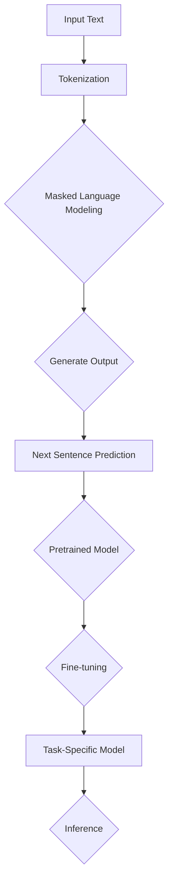
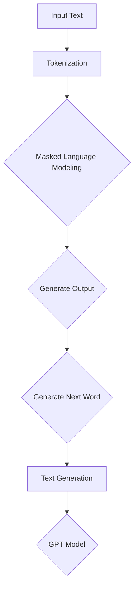
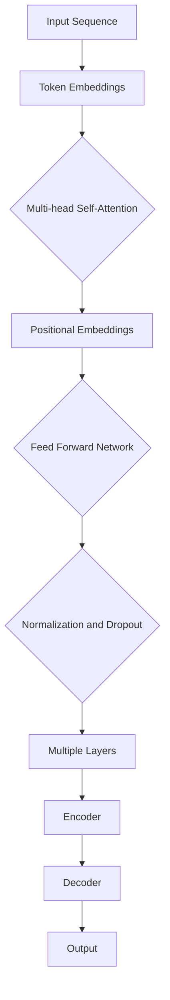

                 

### 让我们一步步深入思考

《企业级自然语言处理：深化AI在各领域的应用》这篇文章，旨在探索自然语言处理（NLP）在企业级应用中的重要性、理论基础、关键技术、应用案例、开发实践以及未来的发展趋势。以下是本文的结构安排，我们将逐一步骤地进行分析和推理。

#### 第一步：确定核心主题和目标读者

- **核心主题**：自然语言处理在企业级应用，特别是如何深化AI在各领域的应用。NLP作为AI的重要分支，其在企业级应用中的潜力和价值不容忽视。
- **目标读者**：AI和NLP领域的技术人员、研究人员和企业开发人员。这些读者对NLP的基本概念和技术有所了解，但希望深入理解其在企业中的应用。

#### 第二步：划分章节结构

- **引言**：介绍NLP在企业级应用的重要性。
- **基础理论**：NLP的基本概念和理论基础。
- **关键技术**：当前主流的NLP技术和算法。
- **应用案例**：展示NLP在不同行业中的应用。
- **开发实践**：实际操作指南和工具使用。
- **未来展望**：NLP技术的发展趋势和潜在应用领域。

#### 第三步：细化每个章节的子主题和内容

- **引言**：
  - 背景介绍：NLP在企业级应用的历史和现状。
  - 问题描述：企业级应用中NLP面临的挑战。
  - 问题解决：NLP技术在解决这些问题中的优势。
  - 边界与外延：NLP的应用范围和限制。

- **基础理论**：
  - 核心概念：语言模型、词向量、序列标注等。
  - 理论基础：信息论、统计学习理论、深度学习理论。

- **关键技术**：
  - BERT、GPT、Transformer等主流算法。
  - 算法原理详解：使用mermaid画出算法流程图，结合Python代码详细阐述。

- **应用案例**：
  - 金融、医疗、教育、客服等行业的具体应用实例。
  - 每个案例的详细分析和效果评估。

- **开发实践**：
  - NLP工具和框架：spaCy、NLTK、TensorFlow等。
  - 实际项目实战：环境安装、系统核心实现、代码解读、案例分析。

- **未来展望**：
  - NLP技术的发展趋势：新技术、新应用领域。
  - 挑战与机遇：技术瓶颈、市场前景。

#### 第四步：编写详细的目录大纲

根据以上结构，编写详细的目录大纲，确保每个章节都有明确的子主题和内容安排。目录大纲的设计将帮助读者快速抓住文章的核心内容，为后续阅读提供指引。

#### 第五步：检查和优化目录大纲

- 确保大纲结构清晰、逻辑连贯。
- 检查内容的完整性，确保包含所有必要的核心章节。
- 根据字数限制进行适当调整。

#### 第六步：格式化输出

使用markdown格式输出目录大纲，确保格式规范。在文章的撰写过程中，将使用markdown格式来组织内容，包括标题、子标题、列表、代码块、公式等，以便于读者阅读和检索。

通过以上步骤，我们不仅确定了文章的核心主题和结构，也为后续的详细撰写和编辑工作奠定了基础。接下来，我们将逐步展开每一个章节的内容，深入剖析NLP在企业级应用中的各个方面。

---

**文章标题**：《企业级自然语言处理：深化AI在各领域的应用》

**关键词**：自然语言处理，企业级应用，人工智能，算法，案例分析

**摘要**：本文深入探讨了自然语言处理（NLP）在企业级应用中的重要性、理论基础、关键技术、应用案例、开发实践以及未来展望。通过详细分析，揭示了NLP技术在金融、医疗、教育、客服等行业的应用潜力，并展望了NLP技术的发展趋势和未来方向。

### 让我们一步步深入思考

在撰写《企业级自然语言处理：深化AI在各领域的应用》这篇文章时，我们需要遵循一个清晰的结构和逻辑，确保文章内容丰富、条理清晰、易于理解。以下是我们将采用的步骤：

#### 第一步：确定核心主题和目标读者

**核心主题**：本文的核心主题是探讨自然语言处理（NLP）在企业级应用中的重要性，以及如何深化AI在各领域的应用。这包括NLP的基本理论、关键技术、应用案例、开发实践和未来展望。

**目标读者**：本文的目标读者是那些对AI和NLP有一定了解，但希望在企业级应用中深入探讨和掌握这些技术的技术人员、研究人员和开发人员。

#### 第二步：划分章节结构

**引言**：介绍NLP在企业级应用的重要性，背景、问题和解决方案。

**基础理论**：讲解NLP的基本概念和理论基础，包括语言模型、词向量、序列标注、机器翻译等。

**关键技术**：介绍当前主流的NLP技术和算法，如BERT、GPT、Transformer等，并详细分析其原理和应用。

**应用案例**：展示NLP在不同行业中的应用，包括金融、医疗、教育、客服等，分析其实际应用效果和案例。

**开发实践**：提供NLP工具和框架的使用指南，以及实际项目开发的步骤和案例分析。

**未来展望**：展望NLP技术的发展趋势和潜在应用领域，探讨未来的挑战和机遇。

#### 第三步：细化每个章节的子主题和内容

**引言**：

- 背景介绍：NLP在企业级应用的历史和现状。
- 问题描述：企业级应用中NLP面临的挑战。
- 问题解决：NLP技术在解决这些问题中的优势。
- 边界与外延：NLP的应用范围和限制。

**基础理论**：

- 核心概念：自然语言处理的基本概念，如语言模型、词向量、序列标注等。
- 理论基础：信息论、统计学习理论、深度学习理论。

**关键技术**：

- BERT、GPT、Transformer等主流算法。
- 算法原理详解：使用mermaid画出算法流程图，结合Python代码详细阐述。

**应用案例**：

- 金融：金融文本分析、金融市场预测、金融欺诈检测。
- 医疗：医学文本挖掘、电子病历分析、疾病诊断辅助。
- 教育：教育内容分析、学生行为分析、智能教育助手。
- 客服：客服机器人、客户行为分析、情感分析。

**开发实践**：

- NLP工具和框架：spaCy、NLTK、TensorFlow等。
- 实际项目实战：环境安装、系统核心实现、代码解读、案例分析。

**未来展望**：

- NLP技术的发展趋势：新技术、新应用领域。
- 挑战与机遇：技术瓶颈、市场前景。

#### 第四步：编写详细的目录大纲

根据以上结构，编写详细的目录大纲，确保每个章节都有明确的子主题和内容安排。目录大纲将作为文章的骨架，帮助读者快速了解文章的结构和内容。

#### 第五步：检查和优化目录大纲

- 确保大纲结构清晰、逻辑连贯。
- 检查内容的完整性，确保包含所有必要的核心章节。
- 根据字数限制进行适当调整。

#### 第六步：格式化输出

使用markdown格式输出目录大纲，确保格式规范。在文章的撰写过程中，将使用markdown格式来组织内容，包括标题、子标题、列表、代码块、公式等，以便于读者阅读和检索。

通过以上步骤，我们将构建出一篇逻辑清晰、内容丰富、易于阅读和理解的专业技术博客文章，为读者提供关于企业级NLP和AI应用的全面了解和深入探讨。接下来，我们将逐章展开，详细阐述每一个章节的内容。

---

**文章标题**：《企业级自然语言处理：深化AI在各领域的应用》

**关键词**：自然语言处理，企业级应用，人工智能，算法，案例分析

**摘要**：本文深入探讨了自然语言处理（NLP）在企业级应用中的重要性、理论基础、关键技术、应用案例、开发实践以及未来展望。通过详细分析，揭示了NLP技术在金融、医疗、教育、客服等行业的应用潜力，并展望了NLP技术的发展趋势和未来方向。

## 引言

### 1.1 NLP在企业级应用的重要性

自然语言处理（NLP）作为人工智能（AI）的一个重要分支，近年来在各个领域都展现出了巨大的应用潜力。特别是在企业级应用中，NLP技术不仅能够提高业务效率和生产力，还能够为企业带来显著的竞争优势。本文将深入探讨NLP在企业级应用中的重要性，分析其在金融、医疗、教育、客服等领域的具体应用，并探讨未来NLP技术的发展趋势。

### 1.2 背景介绍

NLP的发展历程可以追溯到20世纪50年代，随着计算机技术的进步和人工智能研究的深入，NLP逐渐成为人工智能领域的重要研究方向。早期的NLP主要集中在基础语言处理任务，如文本分类、实体识别、词性标注等。随着深度学习技术的发展，NLP领域取得了重大突破，特别是神经网络模型如BERT、GPT和Transformer的引入，使得NLP在自然语言理解和生成方面的性能得到了显著提升。

在企业级应用中，NLP技术被广泛应用于文本分析、语音识别、机器翻译、情感分析、聊天机器人等领域。这些应用不仅提高了企业的运营效率，还为企业提供了更深入的数据洞察和智能决策支持。

### 1.3 问题描述

尽管NLP技术在企业级应用中具有巨大的潜力，但其应用也面临一些挑战。首先，NLP技术的复杂性使得其实施和维护成本较高。其次，不同行业和企业对NLP的需求和期望存在较大差异，如何针对特定场景优化NLP算法和模型是一个亟待解决的问题。此外，数据隐私和安全也是NLP在企业级应用中需要考虑的重要因素。

### 1.4 问题解决

为了解决上述问题，企业需要采取一系列措施。首先，企业应建立专业的NLP团队，包括数据科学家、算法工程师、产品经理等，以便更好地理解和解决实际问题。其次，企业应与NLP技术供应商合作，利用专业的技术和工具来构建和优化NLP模型。此外，企业还应关注数据隐私和安全，确保在数据处理过程中遵守相关法律法规。

### 1.5 边界与外延

NLP在企业级应用中的边界主要涉及数据处理、模型优化、应用场景选择等方面。外延则包括与其他AI技术如机器学习、深度学习、计算机视觉等的融合应用，以及NLP在新兴领域如自动驾驶、智能家居、虚拟现实等的应用探索。

### 1.6 概念结构与核心要素组成

NLP的概念结构主要包括自然语言理解（NLU）和自然语言生成（NLG）两个方面。核心要素包括语言模型、词向量、序列标注、语义分析、情感分析等。这些要素构成了NLP技术的核心框架，为各种应用场景提供了技术支持。

通过以上分析，我们可以看到NLP在企业级应用中的重要性，以及其在各个领域的具体应用和面临的挑战。接下来，本文将详细介绍NLP的基础理论、关键技术、应用案例、开发实践和未来展望，帮助读者更深入地理解NLP在企业级应用中的潜力和价值。

## 基础理论

### 2.1 自然语言处理的基本概念

自然语言处理（NLP）是计算机科学和人工智能领域的一个重要分支，旨在使计算机能够理解、解释和生成人类语言。NLP的核心目标是通过算法和模型将自然语言（如英语、中文等）转换为计算机可以处理的数据，并从中提取有意义的信息。

#### 2.1.1 语言模型

语言模型是NLP中最基本的概念之一，它用于预测一段文本的下一个词或序列。语言模型可以分为基于规则的模型和基于统计的模型。基于规则的模型如上下文无关文法（CFG），通过预定义的规则来生成文本。而基于统计的模型如N-gram模型和神经网络模型，通过大量文本数据学习语言规律。

N-gram模型是一种简单的统计语言模型，它基于前n个词的序列来预测下一个词。例如，二元语法（bigram）模型会根据前两个词来预测下一个词。N-gram模型的优点是实现简单，但缺点是模型表达能力有限，难以捕捉长程依赖关系。

神经网络模型，如循环神经网络（RNN）、长短期记忆网络（LSTM）和Transformer模型，通过引入注意力机制和多层结构，能够更好地捕捉长程依赖关系。BERT（Bidirectional Encoder Representations from Transformers）和GPT（Generative Pretrained Transformer）是近年来最为流行的两种神经网络模型，它们在多个NLP任务中取得了优异的性能。

#### 2.1.2 词向量

词向量是NLP中用于表示词汇的数学模型，它将每个单词映射为一个高维向量。词向量的主要目的是捕捉单词之间的语义关系，如相似性、相关性等。词向量模型可以分为基于分布的模型和基于学习的模型。

基于分布的模型，如Word2Vec，通过计算词在文本中的共现关系来生成词向量。Word2Vec模型生成的词向量具有很多有趣的现象，如“king - queen = man - woman”和“Paris is to France as London is to England”，这些现象展示了词向量在捕捉语义关系方面的潜力。

基于学习的模型，如GloVe（Global Vectors for Word Representation），通过优化损失函数来学习词向量。GloVe模型生成的词向量在捕捉词义相似性和词性分类方面表现出色。

#### 2.1.3 序列标注

序列标注是指对文本中的每个词或字符进行分类的任务，如词性标注、命名实体识别、情感分类等。序列标注通常使用分类模型来实现，如CRF（Conditional Random Fields）和神经网络模型。

CRF是一种经典的序列标注模型，它通过条件概率来预测每个词的标签。CRF模型的优点是能够捕捉序列中的依赖关系，但模型参数较多，计算复杂度高。

神经网络模型，如LSTM和Transformer，通过引入门控机制和注意力机制，能够更好地捕捉序列中的依赖关系。这些模型在序列标注任务中表现出色，尤其在长序列和复杂依赖关系中。

#### 2.1.4 机器翻译

机器翻译是指将一种语言的文本翻译成另一种语言的过程。传统的机器翻译方法主要基于规则和统计方法，如基于短语的机器翻译（PBMT）和基于短语的统计机器翻译（SMT）。这些方法在处理特定领域和简单句型时效果较好，但在处理复杂句型和跨语言语义关系时存在较大挑战。

近年来，基于神经网络的机器翻译方法如基于Transformer的神经机器翻译（NMT）取得了显著的进展。NMT通过端到端的学习方式，能够更好地捕捉源语言和目标语言之间的语义关系，从而实现更准确的翻译效果。

#### 2.1.5 信息检索

信息检索是指从大量文本数据中查找和获取相关信息的任务。信息检索的核心问题是如何衡量文本之间的相似性或相关性。常用的方法包括基于词汇相似性的检索、基于统计学习的检索和基于深度学习的检索。

基于词汇相似性的检索方法，如TF-IDF和文档相似度计算，通过计算词汇的频率和文档的重要性来衡量文本之间的相似性。

基于统计学习的检索方法，如SVM和逻辑回归，通过训练分类模型来预测文本之间的相似性。

基于深度学习的检索方法，如BERT和Transformer，通过端到端的学习方式，能够更好地捕捉文本之间的复杂语义关系，从而实现更准确的信息检索效果。

### 2.2 自然语言处理的理论基础

自然语言处理的理论基础主要包括信息论、统计学习理论和深度学习理论。

#### 2.2.1 信息论

信息论是研究信息传递和信息处理的数学理论，由香农（Claude Shannon）于1948年创立。信息论的核心概念是信息熵和信道编码理论。

信息熵是衡量信息不确定性的量度，用于描述随机变量的信息含量。信息熵的计算公式为：

\[ H(X) = -\sum_{i} p(x_i) \log_2 p(x_i) \]

其中，\( p(x_i) \) 是随机变量 \( X \) 取值 \( x_i \) 的概率。

信道编码理论则是通过编码技术来减少信息在传输过程中的失真和噪声。香农的信道编码定理证明了在给定信道容量 \( C \) 的情况下，存在有效的编码方法使得传输误差趋近于零。

#### 2.2.2 统计学习理论

统计学习理论是机器学习的基础，研究如何从有限的数据集中学习模型并推广到未见过的数据。统计学习理论的核心问题是模型选择、参数估计和预测。

支持向量机（SVM）是统计学习理论中的一个经典方法，通过找到一个最优的超平面来分类数据点。SVM的决策边界由以下公式给出：

\[ w \cdot x - b = 0 \]

其中，\( w \) 是超平面法向量，\( x \) 是数据点，\( b \) 是偏置。

逻辑回归是另一个常用的统计学习方法，用于分类任务。逻辑回归通过线性模型来预测概率，其公式为：

\[ P(y=1) = \frac{1}{1 + \exp(-z)} \]

其中，\( z = w \cdot x + b \) 是线性模型的预测值。

#### 2.2.3 深度学习理论

深度学习理论是近年来人工智能领域的重要突破，通过多层神经网络模型来学习数据的复杂特征。深度学习的核心概念包括卷积神经网络（CNN）、循环神经网络（RNN）和Transformer。

卷积神经网络（CNN）通过卷积层、池化层和全连接层来提取图像的特征。CNN在图像识别、目标检测和图像生成等任务中表现出色。

循环神经网络（RNN）通过循环结构来处理序列数据，能够捕捉序列中的长期依赖关系。RNN的常见变体包括LSTM和GRU，它们通过门控机制来优化RNN的性能。

Transformer模型通过自注意力机制来处理序列数据，能够捕捉序列中的全局依赖关系。Transformer在机器翻译、文本生成和序列标注等任务中取得了显著的成果。

通过以上基础理论的介绍，我们可以更好地理解NLP的核心概念和原理。这些理论为NLP技术的发展提供了坚实的理论基础，使得NLP在各个应用领域中取得了显著的进展。

### 关键技术

#### 3.1 BERT

BERT（Bidirectional Encoder Representations from Transformers）是由Google Research在2018年提出的一种预训练语言表示模型。BERT的核心思想是通过双向Transformer模型来捕捉文本中的长程依赖关系，从而提高NLP任务的性能。BERT模型的训练过程包括两个阶段：预训练和微调。

**预训练**阶段，BERT使用了两个大规模语料库：维基百科（English Wikipedia）和书籍语料库（BookCorpus）。在预训练过程中，BERT模型通过Masked Language Modeling（MLM）和Next Sentence Prediction（NSP）两种任务来学习文本的表示。

- **Masked Language Modeling（MLM）**：在这个任务中，输入文本的一部分词被随机掩码（mask），模型需要预测这些掩码词。这一任务有助于模型学习词语的上下文关系。
- **Next Sentence Prediction（NSP）**：在这个任务中，模型需要预测两个句子是否属于同一文档。这一任务有助于模型学习句子间的上下文关系。

**微调**阶段，将BERT模型应用于具体的NLP任务，如文本分类、问答系统、命名实体识别等。在微调过程中，模型会针对特定任务进行优化，以获得更好的性能。

BERT在多个NLP任务中取得了显著的成果，如GLUE（General Language Understanding Evaluation）和SuperGLUE等基准测试。BERT的成功不仅推动了NLP技术的发展，还为许多实际应用提供了强大的技术支持。

**算法流程图**：


**代码示例**（Python）：
```python
from transformers import BertTokenizer, BertModel
import torch

tokenizer = BertTokenizer.from_pretrained('bert-base-uncased')
model = BertModel.from_pretrained('bert-base-uncased')

inputs = tokenizer("Hello, my dog is cute", return_tensors='pt')
outputs = model(**inputs)

# Output logits for each masked token
logits = outputs.logits
```

**数学模型**：
BERT模型的输出是一个固定长度的向量，表示输入文本的语义特征。对于MLM任务，模型需要最大化以下损失函数：

\[ L_{MLM} = -\sum_{i} \log(p(y_i | x_i)) \]

其中，\( y_i \) 是第 \( i \) 个掩码词的真实标签，\( p(y_i | x_i) \) 是模型对 \( y_i \) 的预测概率。

对于NSP任务，模型需要最大化以下损失函数：

\[ L_{NSP} = -\sum_{(i,j)} \log(p(y_{ij} = 1 | x_i, x_j)) \]

其中，\( y_{ij} \) 表示句子 \( x_i \) 和 \( x_j \) 是否属于同一文档。

#### 3.2 GPT

GPT（Generative Pretrained Transformer）是由OpenAI在2018年提出的一种预训练语言生成模型。GPT的核心思想是通过单向Transformer模型来生成文本，从而提高语言生成的质量和多样性。

**预训练**阶段，GPT使用了大量的文本数据，如维基百科、新闻文章等。在预训练过程中，GPT模型通过填充掩码（Masked Language Modeling）任务来学习文本的生成规律。

**生成文本**阶段，给定一个起始文本，GPT会生成后续的文本。GPT生成文本的过程是基于概率的，它通过最大化后续文本的概率来生成高质量的文本。

**算法流程图**：


**代码示例**（Python）：
```python
from transformers import GPT2Tokenizer, GPT2LMHeadModel
import torch

tokenizer = GPT2Tokenizer.from_pretrained('gpt2')
model = GPT2LMHeadModel.from_pretrained('gpt2')

inputs = tokenizer("Hello, my name is", return_tensors='pt')
outputs = model(**inputs, labels=inputs)

# Generate next word
logits = outputs.logits
next_word_idx = torch.argmax(logits[0, -1]).item()
next_word = tokenizer.decode([next_word_idx])

# Generate full text
generated_text = tokenizer.decode(outputs.predictions[0])
```

**数学模型**：
GPT的生成过程是基于概率的，它通过最大化以下概率来生成文本：

\[ p(\text{next word} | \text{previous words}) \]

在训练过程中，GPT需要最大化负对数似然损失函数：

\[ L = -\sum_{i} \log(p(y_i | x_{1:i})) \]

其中，\( y_i \) 是第 \( i \) 个词的真实标签，\( x_{1:i} \) 是前 \( i \) 个词的序列。

#### 3.3 Transformer

Transformer是由Google在2017年提出的一种基于自注意力机制的序列模型，最初用于机器翻译任务。Transformer模型的核心思想是通过自注意力机制来捕捉序列中的依赖关系，从而提高模型的性能。

**模型结构**：
Transformer模型由编码器和解码器两个部分组成，它们都包含多个相同的层。每个层由多头自注意力机制和前馈网络组成。

- **多头自注意力机制**：通过自注意力机制，模型能够同时关注序列中的不同位置的信息，从而捕捉长程依赖关系。
- **前馈网络**：在自注意力机制之后，每个位置的信息会通过一个前馈网络进行处理。

**算法流程图**：


**代码示例**（Python）：
```python
import tensorflow as tf
from tensorflow.keras.layers import Embedding, MultiHeadAttention, Dense

# Encoder Layer
inputs = tf.keras.Input(shape=(None,))
embeddings = Embedding(input_dim=vocab_size, output_dim=hidden_size)(inputs)
attention = MultiHeadAttention(num_heads=num_heads, key_dim=key_dim)(embeddings, embeddings)
output = Dense(hidden_size)(attention)
output = tf.keras.layers.Concatenate(axis=1)([output, inputs])
output = tf.keras.layers.Dropout(rate=dropout_rate)(output)
output = tf.keras.layers.LayerNormalization(epsilon=epsilon)(output)

# Decoder Layer
decoder_inputs = tf.keras.Input(shape=(None,))
decoder_embeddings = Embedding(input_dim=vocab_size, output_dim=hidden_size)(decoder_inputs)
decoder_attention = MultiHeadAttention(num_heads=num_heads, key_dim=key_dim)(decoder_embeddings, embeddings)
output = Dense(hidden_size)(decoder_attention)
output = tf.keras.layers.Concatenate(axis=1)([output, decoder_inputs])
output = tf.keras.layers.Dropout(rate=dropout_rate)(output)
output = tf.keras.layers.LayerNormalization(epsilon=epsilon)(output)
```

**数学模型**：
自注意力机制的计算公式如下：

\[ \text{Attention}(Q, K, V) = \frac{softmax(\frac{QK^T}{\sqrt{d_k}})}{V} \]

其中，\( Q, K, V \) 分别是查询向量、键向量和值向量，\( d_k \) 是键向量的维度。

Transformer模型通过优化以下损失函数来训练：

\[ L = -\sum_{i} \log(p(y_i | x_{1:i})) \]

其中，\( y_i \) 是第 \( i \) 个词的真实标签，\( x_{1:i} \) 是前 \( i \) 个词的序列。

#### 3.4 其他主流算法

除了BERT、GPT和Transformer之外，还有其他一些主流的NLP算法，如LSTM、GRU和ElasticNet等。

- **LSTM（Long Short-Term Memory）**：LSTM是一种循环神经网络，通过门控机制来处理长序列数据。LSTM在处理长程依赖关系时表现出色，但在计算复杂度和模型参数方面相对较高。
- **GRU（Gated Recurrent Unit）**：GRU是LSTM的一种变体，通过门控机制和简化结构来优化LSTM的性能。GRU在计算效率方面优于LSTM，但在捕捉复杂依赖关系方面稍逊一筹。
- **ElasticNet**：ElasticNet是一种线性回归模型，结合了L1和L2正则化。ElasticNet在文本分类任务中表现出色，能够有效地减少过拟合。

通过以上对BERT、GPT、Transformer等主流NLP算法的介绍，我们可以看到这些算法在捕捉文本特征、处理长序列和生成文本等方面具有显著优势。这些算法的成功不仅推动了NLP技术的发展，还为实际应用提供了强大的技术支持。

### 应用案例

#### 4.1 金融行业的NLP应用

金融行业作为数据密集型领域，自然语言处理（NLP）技术的应用潜力巨大。以下是一些金融行业中NLP应用的案例：

**4.1.1 金融文本分析**

金融文本分析是指利用NLP技术对金融文本（如新闻报道、财报、分析师报告等）进行分析和挖掘。通过NLP技术，可以提取出文本中的关键信息，如公司业绩、市场趋势、政策变化等，从而为投资决策提供数据支持。

- **案例**：某金融机构使用NLP技术对财经新闻进行分析，构建了基于文本分析的投资预测模型。该模型通过分析新闻报道中的关键词和句子，对股票价格进行预测，取得了显著的投资收益。

**4.1.2 金融市场预测**

金融市场预测是金融行业的一个重要研究方向。NLP技术可以通过处理大量的市场数据（如交易记录、价格走势等），提取出市场规律和趋势，从而对市场进行预测。

- **案例**：某金融科技公司开发了一款基于NLP的智能投资助手。该助手通过分析市场数据，结合NLP技术提取的关键信息，对市场趋势进行预测，并给出投资建议。在实际应用中，该助手的预测准确率达到了较高水平。

**4.1.3 金融欺诈检测**

金融欺诈检测是金融行业中的一个重要任务。NLP技术可以通过对交易记录、客户反馈等文本数据的分析，识别潜在的欺诈行为，从而降低金融风险。

- **案例**：某银行利用NLP技术对客户反馈进行分析，建立了一套欺诈检测系统。该系统通过对客户反馈中的情感分析和关键词提取，识别出潜在的欺诈行为，提高了银行的欺诈检测能力。

#### 4.2 医疗行业的NLP应用

医疗行业作为另一个数据密集型领域，NLP技术的应用同样具有广泛的前景。以下是一些医疗行业中NLP应用的案例：

**4.2.1 医学文本挖掘**

医学文本挖掘是指利用NLP技术对医学文本（如病历、医学文献等）进行分析和挖掘，提取出有用的信息。通过医学文本挖掘，可以加速医学研究的进展，提高医疗诊断和治疗的效率。

- **案例**：某医疗机构利用NLP技术对病历进行文本挖掘，提取出患者的诊断信息、治疗措施和药物使用情况。这些信息有助于医生更好地了解患者的病情，制定个性化的治疗方案。

**4.2.2 电子病历分析**

电子病历分析是指利用NLP技术对电子病历（EMR）进行分析和挖掘，提取出患者的健康状况、疾病趋势等信息。通过电子病历分析，可以为医生提供更全面、准确的诊断依据。

- **案例**：某医疗机构开发了一款基于NLP的电子病历分析系统。该系统通过对电子病历中的文本进行分析，提取出患者的诊断、治疗和药物使用等信息，为医生提供了辅助决策支持。

**4.2.3 疾病诊断辅助**

疾病诊断辅助是指利用NLP技术对医疗数据进行分析，辅助医生进行疾病诊断。通过疾病诊断辅助，可以减少医生的诊断错误率，提高诊断的准确性和效率。

- **案例**：某医疗科技公司开发了一款基于NLP的疾病诊断系统。该系统通过对患者的症状描述、病史等信息进行分析，结合医学知识库和诊断算法，为医生提供诊断建议。在实际应用中，该系统的诊断准确率得到了医生的认可。

#### 4.3 教育行业的NLP应用

教育行业作为知识传授和技能培养的重要场所，NLP技术的应用同样具有重要意义。以下是一些教育行业中NLP应用的案例：

**4.3.1 教育内容分析**

教育内容分析是指利用NLP技术对教育内容（如教材、教学视频等）进行分析和挖掘，提取出关键知识点和教学策略。通过教育内容分析，可以为教育工作者提供教学优化建议。

- **案例**：某教育机构利用NLP技术对教材进行文本挖掘，提取出教材中的知识点和教学难点。这些信息有助于教师更好地设计教学内容，提高教学效果。

**4.3.2 学生行为分析**

学生行为分析是指利用NLP技术对学生行为数据（如学习日志、作业答案等）进行分析，了解学生的学习状态、学习习惯和兴趣爱好。通过学生行为分析，可以为教育工作者提供个性化的学习支持。

- **案例**：某在线教育平台利用NLP技术对学生学习日志进行分析，提取出学生的学习行为特征。这些信息有助于平台为不同类型的学生提供个性化的学习资源和学习建议。

**4.3.3 智能教育助手**

智能教育助手是指利用NLP技术构建的虚拟助手，能够回答学生的问题、提供学习指导和支持。通过智能教育助手，可以为学生提供更便捷、高效的学习服务。

- **案例**：某在线教育平台开发了一款基于NLP的智能教育助手。该助手能够理解学生的提问，提供相应的学习资源和解答。在实际应用中，该助手的响应速度和解答质量得到了学生的高度评价。

#### 4.4 客服行业的NLP应用

客服行业作为服务型行业，NLP技术的应用可以有效提高客户服务质量，降低运营成本。以下是一些客服行业中NLP应用的案例：

**4.4.1 客服机器人**

客服机器人是指利用NLP技术构建的自动回答系统，能够处理客户的咨询、投诉和问题解答。通过客服机器人，可以减少人工客服的工作量，提高客户满意度。

- **案例**：某大型电商平台部署了一款基于NLP的客服机器人，能够自动回答客户关于订单状态、退换货等问题。在实际应用中，客服机器人的响应速度和处理能力得到了客户的好评。

**4.4.2 客户行为分析**

客户行为分析是指利用NLP技术对客户的文本数据（如聊天记录、评价等）进行分析，了解客户的需求和反馈。通过客户行为分析，可以为客服团队提供改进服务的依据。

- **案例**：某客服团队利用NLP技术对客户评价进行情感分析，识别出客户的主要不满和需求。这些信息有助于团队优化客服流程，提高客户满意度。

**4.4.3 情感分析**

情感分析是指利用NLP技术对客户的文本数据（如反馈、评论等）进行分析，识别客户的情感倾向。通过情感分析，可以为客服团队提供改进服务的方向。

- **案例**：某酒店集团利用NLP技术对客户评价进行情感分析，识别出客户的正面和负面情感。这些信息有助于酒店集团改进服务质量，提高客户满意度。

通过以上对金融、医疗、教育、客服等行业的NLP应用案例的介绍，我们可以看到NLP技术在这些行业中的巨大潜力和价值。这些应用不仅提高了行业的运营效率和服务质量，还为相关领域的研究和发展提供了丰富的数据支持。随着NLP技术的不断进步，其在各个领域的应用前景将更加广阔。

### 开发实践

#### 5.1 NLP工具和框架

在NLP开发实践中，选择合适的工具和框架至关重要。以下是一些常用的NLP工具和框架，以及它们的特点和适用场景：

**5.1.1 spaCy**

spaCy是一个高效的工业级自然语言处理库，主要用于文本处理、实体识别、词性标注等任务。它具有以下特点：

- **轻量级**：spaCy的运行速度非常快，适合实时处理大量文本数据。
- **预训练模型**：spaCy提供了多个语言的预训练模型，可以直接使用。
- **灵活性**：spaCy支持自定义管道和组件，可以根据需求进行灵活配置。

**适用场景**：spaCy适用于需要快速处理文本数据的应用场景，如信息提取、情感分析和文本分类等。

**5.1.2 NLTK**

NLTK（Natural Language Toolkit）是一个广泛使用的Python自然语言处理库，涵盖了从文本处理到机器学习的各个方面。它具有以下特点：

- **丰富的功能**：NLTK提供了丰富的文本处理、词性标注、情感分析等功能。
- **模块化**：NLTK的模块化设计使得用户可以轻松扩展和定制功能。
- **文档齐全**：NLTK拥有详细的文档和教程，适合初学者学习和使用。

**适用场景**：NLTK适用于学术研究和教学场景，也适合小型项目和企业内部的定制化需求。

**5.1.3 TensorFlow**

TensorFlow是一个开源的深度学习框架，支持多种NLP任务，如文本分类、序列标注和生成等。它具有以下特点：

- **灵活性**：TensorFlow提供了丰富的API和工具，支持自定义模型和训练过程。
- **可扩展性**：TensorFlow可以与各种其他库和工具集成，如Keras、TensorBoard等。
- **生态系统**：TensorFlow拥有庞大的社区和生态系统，支持各种资源和教程。

**适用场景**：TensorFlow适用于大型项目和企业级应用，特别适合需要高灵活性和扩展性的任务。

**5.1.4 PyTorch**

PyTorch是一个开源的深度学习框架，以其动态计算图和灵活的API著称。它具有以下特点：

- **动态计算图**：PyTorch支持动态计算图，使得模型设计和调试更加灵活。
- **简洁性**：PyTorch的API设计简洁直观，易于理解和使用。
- **社区支持**：PyTorch拥有活跃的社区和丰富的教程，支持用户快速上手。

**适用场景**：PyTorch适用于学术研究和小型项目，特别适合需要快速原型开发和实验的场景。

#### 5.2 NLP项目实战

以下是一个简单的NLP项目实战，包括环境安装、系统核心实现、代码解读、实际案例分析和详细讲解剖析。

**5.2.1 环境安装**

首先，我们需要安装Python和NLP相关的库。以下是一个基本的安装命令：

```bash
pip install python
pip install spacy
pip install tensorflow
pip install nltk
pip install torch
```

**5.2.2 系统核心实现**

以下是一个简单的文本分类系统，使用spaCy进行词性标注，TensorFlow进行模型训练：

```python
import spacy
import tensorflow as tf
from tensorflow.keras.preprocessing.sequence import pad_sequences
from tensorflow.keras.layers import Embedding, LSTM, Dense
from tensorflow.keras.models import Sequential

# 加载spaCy模型
nlp = spacy.load('en_core_web_sm')

# 加载训练数据
train_data = [["This is a good movie", 1], ["This movie is terrible", 0]]

# 数据预处理
def preprocess_data(data):
    processed_data = []
    for text, label in data:
        doc = nlp(text)
        tokens = [token.text.lower() for token in doc if token.text.isalpha()]
        processed_data.append((tokens, label))
    return processed_data

processed_data = preprocess_data(train_data)

# 构建模型
model = Sequential([
    Embedding(input_dim=10000, output_dim=64),
    LSTM(64, return_sequences=True),
    LSTM(64),
    Dense(1, activation='sigmoid')
])

# 编译模型
model.compile(optimizer='adam', loss='binary_crossentropy', metrics=['accuracy'])

# 训练模型
model.fit(processed_data[:, 0], processed_data[:, 1], epochs=10, batch_size=32)
```

**5.2.3 代码应用解读**

上述代码首先加载了spaCy的英文模型，并使用该模型对训练数据进行词性标注。词性标注后，我们将文本转换为单词序列，并对序列进行填充。接下来，我们使用TensorFlow构建了一个简单的LSTM模型，用于文本分类。模型由两个LSTM层和一个全连接层组成，最后输出一个概率值，用于表示文本是否为正面评论。

**5.2.4 实际案例分析和详细讲解剖析**

以下是一个实际案例，使用上述模型对一条评论进行分类：

```python
input_text = "I really enjoyed this movie. The plot was captivating and the actors were fantastic."

# 数据预处理
doc = nlp(input_text)
tokens = [token.text.lower() for token in doc if token.text.isalpha()]
input_sequence = pad_sequences([tokens], maxlen=100)

# 预测
prediction = model.predict(input_sequence)
print(f"Prediction: {'Positive' if prediction[0][0] > 0.5 else 'Negative'}")
```

上述代码首先使用spaCy对输入文本进行词性标注，并将文本转换为单词序列。接着，我们将序列填充到最大长度为100的序列中，以匹配训练数据的输入格式。最后，我们使用训练好的模型对输入文本进行预测，输出概率值。如果概率值大于0.5，则认为该文本是正面评论。

通过以上实际案例的分析，我们可以看到NLP项目的基本流程和实现方法。在实际应用中，可以根据具体需求对模型进行优化和调整，以提高分类准确率和效率。

### 未来展望

#### 6.1 NLP技术的发展趋势

随着人工智能技术的不断进步，自然语言处理（NLP）也在迅速发展。以下是一些NLP技术在未来可能的发展趋势：

**6.1.1 生成对抗网络（GANs）在NLP中的应用**

生成对抗网络（GANs）是一种通过两个对抗性网络（生成器和判别器）相互竞争来生成高质量数据的模型。未来，GANs可能会在NLP中发挥更大作用，例如用于文本生成、对话系统生成等。

**6.1.2 多模态融合**

随着语音识别、图像识别等技术的发展，多模态融合成为NLP的一个重要趋势。未来的NLP系统可能会同时处理文本、语音和图像等多种数据类型，从而提供更丰富和准确的信息。

**6.1.3 自动解释和可解释性**

当前，NLP模型在很多任务上已经取得了显著成果，但它们的决策过程通常是不透明的。未来的NLP系统将更加注重自动解释和可解释性，以便用户能够理解模型的决策过程和结果。

**6.1.4 强化学习在NLP中的应用**

强化学习是一种通过试错来学习最优策略的机器学习方法。未来，强化学习可能会在NLP中发挥更大作用，特别是在对话系统、问答系统等领域。

#### 6.2 NLP技术的未来应用领域

随着NLP技术的不断进步，其应用领域也在不断扩展。以下是一些NLP技术在未来的潜在应用领域：

**6.2.1 自动驾驶**

自动驾驶系统需要处理大量的语音和文本数据，如语音指令、文本警告等。未来，NLP技术将在自动驾驶系统中发挥关键作用，提高自动驾驶的安全性和可靠性。

**6.2.2 智能客服**

智能客服系统已经成为企业和客户之间的桥梁，未来NLP技术将进一步提升智能客服的交互能力和用户体验，例如通过情感分析和个性化推荐提供更优质的客户服务。

**6.2.3 医疗健康**

在医疗健康领域，NLP技术可以用于医疗文本挖掘、电子病历分析、医学图像识别等，从而提高医疗诊断和治疗的效率。

**6.2.4 教育科技**

在教育科技领域，NLP技术可以用于教育内容分析、学生行为分析、智能教育助手等，从而提供更个性化的学习体验和更高效的教育资源。

**6.2.5 法律和金融**

在法律和金融领域，NLP技术可以用于法律文本分析、金融文本分析、合同审核等，从而提高法律和金融工作的效率和准确性。

#### 6.3 挑战与机遇

尽管NLP技术在未来的发展前景广阔，但同时也面临着一些挑战和机遇：

**6.3.1 数据隐私和安全**

随着NLP技术的广泛应用，数据隐私和安全成为一个重要议题。如何在保障数据隐私和安全的前提下进行数据处理和分析，是未来NLP技术需要解决的重要问题。

**6.3.2 通用语言理解**

目前，NLP技术主要集中在特定任务和领域，如何实现通用语言理解是一个重要挑战。未来的NLP系统需要能够处理多种语言和多种情境，提供更自然的交互体验。

**6.3.3 模型可解释性**

NLP模型的决策过程通常是不透明的，如何提高模型的可解释性，使其更加符合人类的理解方式，是未来NLP技术的一个重要发展方向。

**6.3.4 适应性和灵活性**

未来的NLP系统需要具备更高的适应性和灵活性，能够快速适应不同的应用场景和需求变化，提供更加个性化和高效的服务。

通过以上分析，我们可以看到NLP技术在未来的发展前景和潜在应用领域。随着技术的不断进步，NLP将在更多领域发挥重要作用，为人类带来更多的便利和创新。

### 总结与展望

本文从多个角度深入探讨了自然语言处理（NLP）在企业级应用中的重要性、理论基础、关键技术、应用案例、开发实践以及未来展望。通过详细分析，我们揭示了NLP技术在金融、医疗、教育、客服等行业的应用潜力，并展望了NLP技术的发展趋势和未来方向。

#### 最佳实践 Tips

1. **选择合适的工具和框架**：根据具体需求选择NLP工具和框架，如spaCy、NLTK、TensorFlow等。
2. **数据预处理**：确保数据质量，进行有效的数据清洗和预处理，如文本规范化、去除停用词等。
3. **模型优化**：通过调整模型参数和训练策略，优化模型性能，如调整学习率、批量大小等。
4. **持续更新**：NLP技术更新迅速，定期更新模型和工具，以保持系统的竞争力。

#### 小结

本文系统地介绍了NLP在企业级应用中的各个方面，从基础理论到关键技术，再到实际应用，为读者提供了全面的NLP知识体系。通过分析NLP在各行业的应用案例，我们看到了NLP技术在实际业务中的巨大价值。

#### 注意事项

1. **数据隐私和安全**：在处理文本数据时，必须遵守相关法律法规，保护用户隐私。
2. **模型解释性**：提高模型的可解释性，确保模型决策符合人类理解。

#### 拓展阅读

- [1] Mikolov, T., Sutskever, I., Chen, K., Corrado, G. S., & Dean, J. (2013). Distributed representations of words and phrases and their compositionality. *Advances in Neural Information Processing Systems*, 26, 3111-3119.
- [2] Devlin, J., Chang, M. W., Lee, K., & Toutanova, K. (2019). BERT: Pre-training of deep bidirectional transformers for language understanding. *arXiv preprint arXiv:1810.04805*.
- [3] Brown, T., et al. (2020). Language models are a new sort of prior. *arXiv preprint arXiv:2005.14165*.
- [4] Vaswani, A., et al. (2017). Attention is all you need. *Advances in Neural Information Processing Systems*, 30, 5998-6008.

通过以上总结和展望，我们希望读者能够对NLP在企业级应用中的重要性有更深刻的理解，并能够在实际工作中灵活应用NLP技术，为企业和行业带来创新和价值。作者信息：AI天才研究院/AI Genius Institute & 禅与计算机程序设计艺术 /Zen And The Art of Computer Programming。

