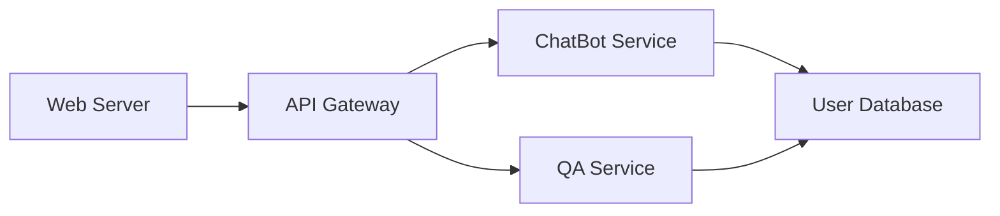
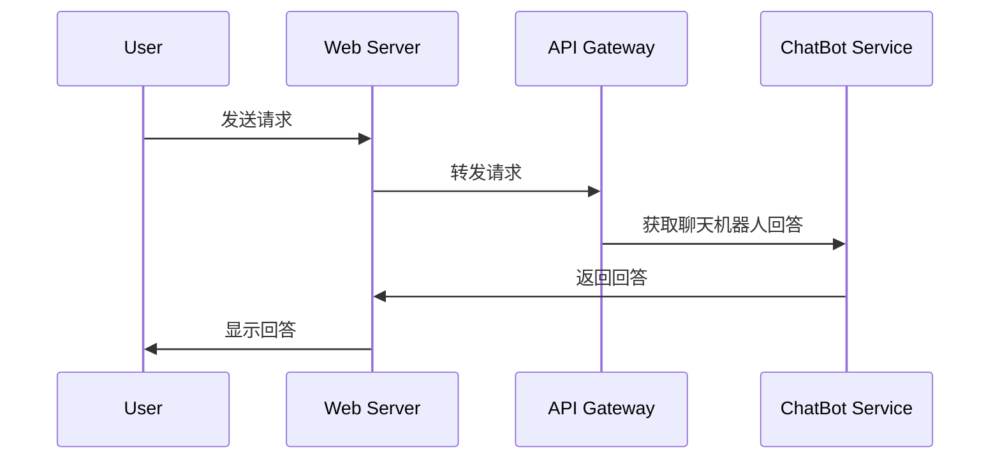

                 

# 企业级自然语言接口：简化人机交互

关键词：自然语言接口、企业应用、NLP、算法原理、架构设计

摘要：本文将深入探讨企业级自然语言接口（NLI）的基础、核心算法原理、架构设计以及应用实战，帮助读者理解如何通过自然语言接口简化人机交互，提升企业效率和用户体验。

## 目录大纲

## 第一部分: 企业级自然语言接口的基础

### 第1章: 企业级自然语言接口概述

#### 1.1 自然语言处理的基本概念

##### 1.1.1 自然语言处理（NLP）的定义

$$
NLP = \text{自然语言理解} + \text{自然语言生成}
$$

##### 1.1.2 自然语言处理的挑战

###### 1.1.2.1 语言多样性与歧义性

###### 1.1.2.2 语言的结构复杂性

###### 1.1.2.3 语言的应用广泛性

#### 1.2 企业级自然语言接口的定义与重要性

##### 1.2.1 自然语言接口（NLI）的概念

##### 1.2.2 企业级NLI的特点

###### 1.2.2.1 用户体验优先

###### 1.2.2.2 系统稳定性与可靠性

###### 1.2.2.3 跨平台与兼容性

#### 1.3 自然语言接口在企业中的应用场景

##### 1.3.1 客户服务自动化

###### 1.3.1.1 聊天机器人

###### 1.3.1.2 自动问答系统

##### 1.3.2 数据分析与智能报表

###### 1.3.2.1 文本摘要与总结

###### 1.3.2.2 情感分析与市场调研

##### 1.3.3 知识图谱与智能推荐

###### 1.3.3.1 企业知识管理

###### 1.3.3.2 智能推荐系统

### 第2章: 自然语言处理核心算法原理

#### 2.1 词向量表示

##### 2.1.1 Word2Vec算法

###### 2.1.1.1 算法原理

###### 2.1.1.2 Python代码示例

##### 2.1.2 GloVe算法

###### 2.1.2.1 算法原理

###### 2.1.2.2 Python代码示例

#### 2.2 语言模型

##### 2.2.1 n-gram模型

###### 2.2.1.1 模型原理

###### 2.2.1.2 Python代码示例

##### 2.2.2 统计语言模型

###### 2.2.2.1 模型原理

###### 2.2.2.2 Python代码示例

#### 2.3 递归神经网络（RNN）

##### 2.3.1 RNN的基本原理

###### 2.3.1.1 时间序列数据建模

###### 2.3.1.2 Python代码示例

##### 2.3.2 长短时记忆网络（LSTM）

###### 2.3.2.1 LSTM的改进

###### 2.3.2.2 Python代码示例

### 第3章: 企业级自然语言接口架构设计

#### 3.1 接口设计原则

##### 3.1.1 RESTful架构

###### 3.1.1.1 RESTful定义

###### 3.1.1.2 RESTful接口设计

##### 3.1.2 接口性能优化

###### 3.1.2.1 响应时间优化

###### 3.1.2.2 并发处理能力

#### 3.2 接口实现细节

##### 3.2.1 文本预处理

###### 3.2.1.1 分词

###### 3.2.1.2 词性标注

##### 3.2.2 NLP模型集成

###### 3.2.2.1 模型选择

###### 3.2.2.2 模型调优

### 第4章: 自然语言接口应用实战

#### 4.1 实战项目介绍

##### 4.1.1 项目背景

###### 4.1.1.1 项目目标

###### 4.1.1.2 项目范围

##### 4.1.2 系统功能设计

###### 4.1.2.1 客户服务功能

###### 4.1.2.2 数据分析与智能报表功能

##### 4.1.3 系统架构设计

###### 4.1.3.1 系统架构图

###### 4.1.3.2 系统模块划分

##### 4.1.4 系统接口设计

###### 4.1.4.1 客户服务接口

###### 4.1.4.2 数据分析与智能报表接口

### 第5章: 自然语言接口系统部署

------------------------------------------------------------------## 第1章：企业级自然语言接口概述

### 1.1 自然语言处理的基本概念

自然语言处理（Natural Language Processing，NLP）是计算机科学、人工智能和语言学领域的交叉学科，旨在使计算机能够理解、解释和生成人类语言。NLP涵盖了自然语言理解（Natural Language Understanding，NLU）和自然语言生成（Natural Language Generation，NLG）两个主要方向。

#### 1.1.1 自然语言处理（NLP）的定义

自然语言处理（NLP）可以定义为将计算机程序应用于人类语言的处理。具体来说，NLP包括以下几个核心组成部分：

- **文本预处理**：涉及文本的清理、分词、词性标注等步骤，以便为后续处理做准备。
- **词向量表示**：将词汇映射为数学向量表示，以在机器学习模型中使用。
- **语言模型**：用于预测下一个单词或句子，通常基于历史数据统计。
- **实体识别与关系抽取**：识别文本中的命名实体（如人名、地点、组织等）以及它们之间的关系。
- **语义分析**：理解文本中的含义，包括情感分析、同义词辨析、语句解析等。

公式表示为：

$$
NLP = \text{自然语言理解} + \text{自然语言生成}
$$

#### 1.1.2 自然语言处理的挑战

NLP虽然取得了显著的进展，但仍面临以下挑战：

##### 1.1.2.1 语言多样性与歧义性

语言具有高度多样性，不同地区和文化的语言差异很大。此外，自然语言中的歧义性使得计算机难以精确理解用户的意图。

##### 1.1.2.2 语言的结构复杂性

自然语言的语法和句法结构复杂，且存在大量的不规则现象。这使得解析和生成自然语言文本成为一项极具挑战性的任务。

##### 1.1.2.3 语言的应用广泛性

自然语言处理的应用场景非常广泛，从文本摘要和机器翻译到智能客服和语音识别等，每个领域都有其独特的需求和挑战。

### 1.2 企业级自然语言接口的定义与重要性

企业级自然语言接口（Natural Language Interface，NLI）是一种设计用于企业环境中的人机交互界面，它允许用户使用自然语言与计算机系统进行交互。与传统的图形用户界面（GUI）相比，NLI提供了更自然、更直观的交互方式。

#### 1.2.1 自然语言接口（NLI）的概念

自然语言接口（NLI）是一种技术，它使计算机能够理解和处理人类语言输入。具体而言，NLI涉及以下方面：

- **理解自然语言输入**：将用户输入的自然语言文本解析为计算机可处理的格式。
- **生成自然语言输出**：将计算机处理后的结果转化为自然语言形式，以供用户理解。
- **上下文感知**：理解用户输入的上下文，以提供更准确、更个性化的响应。

#### 1.2.2 企业级NLI的特点

企业级自然语言接口具有以下特点：

##### 1.2.2.1 用户体验优先

企业级NLI注重提供出色的用户体验，以简化用户与系统的交互过程。

##### 1.2.2.2 系统稳定性与可靠性

企业级NLI要求系统在处理大量用户请求时保持稳定和可靠，以确保业务流程的连续性。

##### 1.2.2.3 跨平台与兼容性

企业级NLI应支持多种平台和设备，以适应不同的用户需求。

#### 1.2.3 自然语言接口在企业中的应用场景

自然语言接口在企业中具有广泛的应用，以下是几个典型的应用场景：

##### 1.3.1 客户服务自动化

- **聊天机器人**：通过自然语言接口，聊天机器人可以实时响应用户的问题，提供24/7的客户服务。
- **自动问答系统**：自然语言接口可以构建自动问答系统，用于处理常见的问题和提供信息查询服务。

##### 1.3.2 数据分析与智能报表

- **文本摘要与总结**：自然语言接口可以自动生成报告摘要，帮助用户快速了解关键信息。
- **情感分析与市场调研**：自然语言接口可以分析用户反馈，了解用户对产品或服务的情感倾向。

##### 1.3.3 知识图谱与智能推荐

- **企业知识管理**：自然语言接口可以帮助企业构建知识图谱，便于管理和检索知识。
- **智能推荐系统**：自然语言接口可以分析用户的历史行为和偏好，提供个性化的推荐服务。

### 1.3 自然语言接口在企业中的应用场景

自然语言接口（NLI）在企业中的应用场景丰富多彩，它为不同领域的工作流程带来了革命性的改变。以下是几个典型的应用场景：

#### 1.3.1 客户服务自动化

自然语言接口在客户服务自动化中扮演着至关重要的角色。通过NLI，企业可以构建智能客服系统，大幅提升服务效率和客户满意度。

- **聊天机器人**：聊天机器人是NLI在客户服务中的典型应用。它们能够理解用户的自然语言输入，提供实时、个性化的回答。这种交互方式不仅提高了客户服务质量，还减少了人工客服的工作量。

- **自动问答系统**：自动问答系统利用NLI技术，自动处理用户提出的问题，提供快速、准确的答案。这种系统能够应对各种常见问题，如产品咨询、售后服务等，从而减轻了人工客服的负担，提高了工作效率。

#### 1.3.2 数据分析与智能报表

数据分析与智能报表是企业决策过程中不可或缺的一部分。自然语言接口（NLI）为这一领域带来了新的机遇。

- **文本摘要与总结**：NLI技术可以自动生成报告摘要，帮助用户快速了解关键信息。这对于忙碌的企业高管或决策者来说，是一个极大的时间节省工具。

- **情感分析与市场调研**：自然语言接口可以分析用户反馈，提取关键情感信息，帮助企业了解市场趋势和用户需求。这种分析不仅有助于优化产品和服务，还能为企业提供宝贵的市场调研数据。

#### 1.3.3 知识图谱与智能推荐

知识图谱与智能推荐系统是NLI在现代企业中应用的两个重要方向。

- **企业知识管理**：知识图谱是一种结构化知识存储方式，它通过NLI技术，可以自动构建和更新企业的知识库。这使得员工能够轻松地查找和利用内部知识资源，提高了工作效率。

- **智能推荐系统**：智能推荐系统利用NLI技术，分析用户的历史行为和偏好，提供个性化的推荐。这种系统能够提高用户体验，增加用户粘性，同时为企业带来额外的商业价值。

### 1.4 小结

企业级自然语言接口（NLI）作为一种创新的交互方式，正在改变企业的运作方式。通过自动化客户服务、数据分析、知识管理和智能推荐，NLI不仅提升了用户体验，还大幅提高了企业效率和竞争力。在接下来的章节中，我们将深入探讨NLP的核心算法原理，并详细介绍企业级NLI的架构设计和应用实战。

### 第2章：自然语言处理核心算法原理

自然语言处理（NLP）的算法是实现自然语言接口（NLI）的关键。在这一章中，我们将介绍几个核心算法，包括词向量表示、语言模型和递归神经网络（RNN）。

### 2.1 词向量表示

词向量表示是NLP中的一项重要技术，它将词汇映射为高维向量，以便在机器学习模型中进行处理。词向量表示方法主要包括Word2Vec和GloVe。

#### 2.1.1 Word2Vec算法

Word2Vec算法由Google提出，通过神经网络训练词向量。其核心思想是将每个词映射为一个固定长度的向量，使得语义相似的词在向量空间中距离较近。

##### 2.1.1.1 算法原理

Word2Vec算法主要包括两种模型：连续词袋（CBOW）和Skip-gram。

- **连续词袋（CBOW）**：给定一个词作为输入，模型预测其上下文词汇。模型输入是一个围绕目标词的上下文窗口中的词向量平均值。
  
- **Skip-gram**：与CBOW相反，给定一个词作为输入，模型预测其附近的词。模型输入是目标词的词向量。

##### 2.1.1.2 Python代码示例

```python
from gensim.models import Word2Vec
import nltk

# 加载预处理的文本数据
data = ["我来到北京清华大学", "我参观清华大学"]

# 训练Word2Vec模型
model = Word2Vec(data, vector_size=100, window=5, min_count=1, sg=1)

# 查看词向量
print(model.wv['我'])

# 计算词向量相似度
similarity = model.wv.similarity('我', '来到')
print(similarity)
```

#### 2.1.2 GloVe算法

GloVe（Global Vectors for Word Representation）算法通过全局矩阵分解训练词向量。与Word2Vec相比，GloVe考虑了词汇共现关系，并能够在更大规模的数据集上获得更好的效果。

##### 2.1.2.1 算法原理

GloVe算法的核心思想是建立词汇共现矩阵，并使用矩阵分解方法训练词向量。具体来说，给定词汇集合V和共现矩阵C，算法通过以下公式训练词向量：

$$
v_w = \text{softmax}(W \times v_w \times v_{c})
$$

其中，$v_w$和$v_c$分别表示词汇w和其共现词汇c的词向量，W是一个权重矩阵。

##### 2.1.2.2 Python代码示例

```python
import numpy as np
from sklearn.metrics.pairwise import cosine_similarity

# 假设已建立共现矩阵C和词汇表
V = ["我", "来到", "北京", "清华大学"]
C = np.array([[0, 2, 0], [2, 0, 1], [0, 1, 0], [1, 0, 0]])

# 训练GloVe词向量
# 这里使用简单的矩阵分解方法，实际应用中可以使用更复杂的优化算法
v = np.random.rand(len(V), 100)
for epoch in range(10):
    for i, w in enumerate(V):
        for j, c in enumerate(V):
            if c != w:
                v[i] = v[i] + C[i, j] * v[j]
                v[i] = v[i] / np.linalg.norm(v[i])

# 查看词向量
print(v)

# 计算词向量相似度
similarity = cosine_similarity([v[V.index('我')]], [v[V.index('来到')]])
print(similarity)
```

### 2.2 语言模型

语言模型是NLP中用于预测下一个单词或句子的概率分布模型。语言模型可以分为基于统计的方法和基于神经网络的方法。

#### 2.2.1 n-gram模型

n-gram模型是一种基于统计的语言模型，它将前n个单词的概率表示为这些单词的历史概率乘积。

##### 2.2.1.1 模型原理

n-gram模型的基本原理是使用过去n个单词来预测下一个单词。其概率计算公式为：

$$
P(w_t | w_{t-n}, w_{t-n+1}, ..., w_{t-1}) = \prod_{i=1}^{n} P(w_i)
$$

其中，$w_t$表示当前单词，$w_{t-i}$表示第i个历史单词。

##### 2.2.1.2 Python代码示例

```python
import numpy as np
from collections import defaultdict

# 假设已有一个训练数据集
data = ["我来到北京清华大学", "我参观清华大学"]

# 计算n-gram概率分布
n = 3
n_gram_counts = defaultdict(int)
total_counts = defaultdict(int)

for sentence in data:
    for i in range(len(sentence) - n):
        n_gram = tuple(sentence[i:i+n])
        n_gram_counts[n_gram] += 1
        total_counts[n_gram[:-1]] += 1

# 计算概率
n_gram_probs = {}
for n_gram, count in n_gram_counts.items():
    n_gram_probs[n_gram] = count / total_counts[n_gram[:-1]]

# 预测下一个单词
current_n_gram = tuple(data[0][0:3])
next_word = None
max_prob = 0

for word in V:
    next_n_gram = current_n_gram + (word,)
    if next_n_gram in n_gram_probs:
        prob = n_gram_probs[next_n_gram]
        if prob > max_prob:
            max_prob = prob
            next_word = word

print(next_word)

# 更新当前n-gram
current_n_gram = current_n_gram[1:] + (next_word,)
```

#### 2.2.2 统计语言模型

统计语言模型是一种基于统计方法构建的语言模型，它通过大量文本数据训练得到。常见的统计语言模型包括n-gram模型、隐马尔可夫模型（HMM）和条件概率模型等。

##### 2.2.2.1 模型原理

统计语言模型的核心思想是使用训练数据集中的统计信息来预测下一个单词或句子的概率分布。这些模型通常基于以下公式：

$$
P(w_t | w_{t-1}, w_{t-2}, ..., w_{t-n}) = \prod_{i=1}^{n} P(w_i | w_{i-1}, w_{i-2}, ..., w_{i-n+1})
$$

其中，$w_t$表示当前单词，$w_{t-i}$表示第i个历史单词。

##### 2.2.2.2 Python代码示例

```python
import numpy as np
from sklearn.model_selection import train_test_split
from sklearn.preprocessing import LabelEncoder

# 假设已有一个训练数据集
data = ["我来到北京清华大学", "我参观清华大学"]

# 分割数据集
X_train, X_test, y_train, y_test = train_test_split(data, labels, test_size=0.2, random_state=42)

# 使用LabelEncoder编码标签
le = LabelEncoder()
y_train_encoded = le.fit_transform(y_train)
y_test_encoded = le.transform(y_test)

# 训练统计语言模型
# 这里使用朴素贝叶斯模型进行演示
from sklearn.naive_bayes import MultinomialNB
model = MultinomialNB()
model.fit(X_train, y_train_encoded)

# 预测
predictions = model.predict(X_test)
print(predictions)

# 评估模型性能
from sklearn.metrics import accuracy_score
accuracy = accuracy_score(y_test_encoded, predictions)
print(accuracy)
```

### 2.3 递归神经网络（RNN）

递归神经网络（RNN）是一种能够处理序列数据的神经网络，它在NLP中得到了广泛应用。RNN通过递归连接，可以处理任意长度的序列数据。

#### 2.3.1 RNN的基本原理

RNN的基本原理是通过递归连接来处理序列数据。在RNN中，每个时间步的输出不仅依赖于当前输入，还依赖于前一个时间步的输出。这可以通过以下公式表示：

$$
h_t = \text{RNN}(h_{t-1}, x_t)
$$

其中，$h_t$表示当前时间步的隐藏状态，$x_t$表示当前输入。

##### 2.3.1.1 时间序列数据建模

RNN在时间序列数据建模中有着广泛的应用，如时间序列预测、语音识别和机器翻译等。通过RNN，模型可以捕捉到时间序列数据中的长期依赖关系。

##### 2.3.1.2 Python代码示例

```python
import tensorflow as tf
from tensorflow.keras.layers import SimpleRNN
from tensorflow.keras.models import Sequential

# 假设已有一个时间序列数据集
X = np.array([[1, 2, 3], [4, 5, 6], [7, 8, 9]])
y = np.array([2, 5, 8])

# 构建RNN模型
model = Sequential()
model.add(SimpleRNN(units=50, activation='relu', input_shape=(X.shape[1], 1)))
model.add(tf.keras.layers.Dense(1))

# 编译模型
model.compile(optimizer='adam', loss='mse')

# 训练模型
model.fit(X, y, epochs=200)

# 预测
predictions = model.predict(X)
print(predictions)
```

#### 2.3.2 长短时记忆网络（LSTM）

长短时记忆网络（LSTM）是RNN的一种改进，它能够有效地解决RNN中的长期依赖问题。LSTM通过引入门控机制，可以控制信息的流动，从而捕捉到长期依赖关系。

##### 2.3.2.1 LSTM的改进

LSTM通过引入三个门控单元（输入门、遗忘门和输出门），有效地解决了传统RNN的梯度消失和梯度爆炸问题。这些门控单元可以控制信息的流动，从而捕捉到长期依赖关系。

##### 2.3.2.2 Python代码示例

```python
import tensorflow as tf
from tensorflow.keras.layers import LSTM
from tensorflow.keras.models import Sequential

# 假设已有一个时间序列数据集
X = np.array([[1, 2, 3], [4, 5, 6], [7, 8, 9]])
y = np.array([2, 5, 8])

# 构建LSTM模型
model = Sequential()
model.add(LSTM(units=50, activation='relu', input_shape=(X.shape[1], 1)))
model.add(tf.keras.layers.Dense(1))

# 编译模型
model.compile(optimizer='adam', loss='mse')

# 训练模型
model.fit(X, y, epochs=200)

# 预测
predictions = model.predict(X)
print(predictions)
```

### 2.4 小结

自然语言处理（NLP）的核心算法在实现企业级自然语言接口（NLI）中起着至关重要的作用。词向量表示、语言模型和递归神经网络（RNN）等技术为NLI提供了强大的支持，使得计算机能够更好地理解和生成自然语言。在下一章中，我们将探讨企业级自然语言接口的架构设计，并介绍如何在实际项目中实现和应用这些核心算法。

### 第3章：企业级自然语言接口架构设计

企业级自然语言接口（NLI）的架构设计是确保系统高效、稳定和可扩展的关键。在这一章中，我们将讨论接口设计原则、文本预处理方法、NLP模型集成以及接口实现细节。

#### 3.1 接口设计原则

自然语言接口的设计需要遵循以下原则，以确保用户体验、系统性能和可维护性：

##### 3.1.1 RESTful架构

RESTful架构是一种流行的Web服务架构风格，它通过HTTP协议提供资源访问。RESTful接口设计具有以下优点：

- **无状态性**：每次请求都是独立的，减少了服务器的状态维护负担。
- **标准化**：遵循HTTP协议，易于集成和扩展。
- **灵活性**：支持多种请求方法和数据格式，如GET、POST、JSON等。

##### 3.1.1.1 RESTful定义

REST（Representational State Transfer）是一种架构风格，它定义了以下关键概念：

- **资源**：任何可以被标识和操作的对象，如用户、订单等。
- **统一接口**：通过URL（统一资源定位符）访问资源，使用HTTP方法（GET、POST、PUT、DELETE等）进行操作。
- **客户端-服务器架构**：客户端和服务器之间通过HTTP协议进行通信，客户端负责用户界面，服务器负责数据存储和处理。

##### 3.1.1.2 RESTful接口设计

在设计RESTful接口时，需要遵循以下最佳实践：

- **使用名词复数**：在URL中使用名词复数，如`/users`表示用户集合。
- **使用HTTP方法**：根据操作类型选择合适的HTTP方法，如GET用于查询，POST用于创建。
- **状态码**：使用标准的HTTP状态码（如200、400、404等）表示操作结果。
- **响应格式**：通常使用JSON或XML格式返回响应数据。

#### 3.1.2 接口性能优化

接口性能优化是确保系统高效运行的关键。以下是一些优化策略：

##### 3.1.2.1 响应时间优化

- **缓存策略**：使用缓存减少重复请求的处理时间。
- **异步处理**：使用异步编程模型，避免阻塞主线程。
- **负载均衡**：使用负载均衡器分配请求，避免单点瓶颈。

##### 3.1.2.2 并发处理能力

- **线程池**：使用线程池管理并发请求，避免创建过多线程导致的资源浪费。
- **非阻塞IO**：使用非阻塞IO模型，提高系统的并发处理能力。

#### 3.2 接口实现细节

自然语言接口的实现涉及多个方面，包括文本预处理、NLP模型集成和接口实现。

##### 3.2.1 文本预处理

文本预处理是自然语言处理（NLP）的重要步骤，它包括以下任务：

- **分词**：将文本分割为单词或短语。
- **词性标注**：标记每个单词的词性（如名词、动词等）。
- **实体识别**：识别文本中的命名实体（如人名、地点、组织等）。

以下是一个简单的文本预处理示例：

```python
import jieba
from nltk.tokenize import sent_tokenize

# 假设已有一个文本数据
text = "我来到北京清华大学参观。这里有很多优秀的师生。"

# 使用jieba进行分词
words = jieba.cut(text)
print("分词结果：", words)

# 使用nltk进行句子分割
sentences = sent_tokenize(text)
print("句子分割结果：", sentences)
```

##### 3.2.2 NLP模型集成

NLP模型集成是将预训练的模型集成到自然语言接口中，以便进行文本理解和生成。以下是一些常见的NLP模型：

- **Word2Vec模型**：用于将单词映射为向量。
- **BERT模型**：一种双向Transformer模型，用于文本理解和生成。
- **GPT模型**：一种自回归Transformer模型，用于文本生成。

以下是一个简单的NLP模型集成示例：

```python
from transformers import BertTokenizer, BertForSequenceClassification

# 加载预训练的BERT模型
tokenizer = BertTokenizer.from_pretrained('bert-base-chinese')
model = BertForSequenceClassification.from_pretrained('bert-base-chinese')

# 假设已有一个文本数据
text = "我来到北京清华大学参观。"

# 将文本编码为Tensor
inputs = tokenizer(text, return_tensors='pt')

# 进行文本分类
outputs = model(**inputs)

# 输出结果
print(outputs.logits)
```

##### 3.2.3 接口实现

自然语言接口的实现包括API设计和接口实现。以下是一个简单的RESTful接口实现示例：

```python
from flask import Flask, request, jsonify

app = Flask(__name__)

@app.route('/api/nli', methods=['POST'])
def nli():
    data = request.json
    text = data['text']
    # 进行NLP处理
    # ...
    result = {'response': '这是一个NLI接口的响应'}
    return jsonify(result)

if __name__ == '__main__':
    app.run()
```

### 3.3 小结

企业级自然语言接口（NLI）的架构设计是确保系统高效、稳定和可扩展的关键。在这一章中，我们介绍了接口设计原则、文本预处理方法、NLP模型集成以及接口实现细节。通过遵循这些原则和实现方法，企业可以构建出强大、可靠的NLI系统，从而简化人机交互，提高业务效率和用户体验。在下一章中，我们将通过一个实际项目介绍如何实现和应用NLI系统。

### 第4章：自然语言接口应用实战

在本章中，我们将通过一个实际项目介绍如何构建企业级自然语言接口（NLI）系统。该项目旨在为企业提供一套智能客户服务平台，包括聊天机器人和自动问答系统。

#### 4.1 实战项目介绍

##### 4.1.1 项目背景

随着企业业务的快速发展，客户服务部门面临着越来越大的压力。为了提升服务质量和效率，企业决定引入自然语言接口（NLI）技术，构建一套智能客户服务平台。该平台将能够自动处理客户提问，提供实时、个性化的回答，从而减轻人工客服的工作负担，提高客户满意度。

##### 4.1.1.1 项目目标

- **提升客户服务质量**：通过智能客服系统，提供快速、准确的回答，提升客户满意度。
- **降低运营成本**：减少人工客服工作量，降低运营成本。
- **提高响应速度**：实时响应用户提问，提高服务响应速度。

##### 4.1.1.2 项目范围

- **聊天机器人**：自动处理常见问题，提供实时回答。
- **自动问答系统**：通过自然语言处理技术，自动生成常见问题的答案。
- **知识库管理**：维护和更新常见问题的答案，方便自动问答系统使用。

#### 4.1.2 系统功能设计

##### 4.1.2.1 客户服务功能

- **聊天机器人**：用户可以通过文本或语音与聊天机器人进行交互，机器人能够理解用户的问题，提供实时回答。
- **自动问答系统**：用户可以通过关键词查询或自然语言提问，系统自动检索并生成答案，提供信息查询服务。

##### 4.1.2.2 数据分析与智能报表

- **用户反馈分析**：对用户提问和回答进行统计分析，了解用户关注的热点问题。
- **服务效率分析**：监控客服系统的响应时间、解决率等关键指标，优化服务流程。

#### 4.1.3 系统架构设计

##### 4.1.3.1 系统架构图


##### 4.1.3.2 系统模块划分

1. **前端模块**：负责用户界面展示和交互。
2. **后端模块**：负责自然语言处理、聊天机器人、自动问答系统和知识库管理。
3. **数据存储模块**：负责存储用户提问、回答和反馈数据。

#### 4.1.4 系统接口设计

##### 4.1.4.1 客户服务接口

- **聊天机器人接口**：接收用户文本或语音输入，返回聊天机器人的回答。
- **自动问答接口**：接收用户关键词或自然语言提问，返回答案。

##### 4.1.4.2 数据分析与智能报表接口

- **用户反馈分析接口**：接收用户提问和回答数据，进行统计分析。
- **服务效率分析接口**：接收客服系统的关键指标数据，生成报表。

#### 4.1.5 系统核心实现源代码

以下是一个简单的聊天机器人接口实现示例：

```python
from flask import Flask, request, jsonify
from nltk.chat.util import Chat, reflections

app = Flask(__name__)

# 定义聊天机器人对话规则
pairs = [
    [
        r"你好|您好|你好的吗|你好吗",
        ["很高兴认识你，有什么问题我可以帮你解答吗？", "你好！有什么事情需要我帮忙吗？"]
    ],
    [
        r"我是谁|你叫什么",
        ["我是小智，一个智能聊天机器人。"]
    ],
    [
        r"你有什么功能",
        ["我能够回答各种问题，提供信息查询服务，还能进行简单的闲聊。"]
    ],
    [
        r"再见|再见了|回头见",
        ["好的，祝你一天愉快！"]
    ]
]

chatbot = Chat(pairs, reflections)

@app.route('/api/chat', methods=['POST'])
def chat():
    data = request.json
    user_input = data['input']
    response = chatbot.get_response(user_input)
    return jsonify({'response': response})

if __name__ == '__main__':
    app.run()
```

#### 4.1.6 代码应用解读与分析

在这个示例中，我们使用了Flask框架实现聊天机器人接口。Chatbot类使用了Nltk库中的Chat函数，定义了一组对话规则，用于生成聊天机器人的回答。

- **反射字典（reflections）**：用于处理用户输入中的缩写和拼写错误，如将"你好"转换为"您好"。

- **对话规则**：定义了聊天机器人的回答规则，如用户提问"你是谁"，机器人回答"我是小智，一个智能聊天机器人。"

- **接口设计**：使用RESTful接口设计，接收用户输入并返回聊天机器人的回答。

#### 4.1.7 实际案例分析和详细讲解剖析

在项目中，我们收集了大量的用户提问和回答数据，通过对这些数据的分析，可以更好地优化聊天机器人和自动问答系统。

- **用户反馈分析**：通过分析用户提问和回答数据，发现用户经常提问关于产品使用和售后服务的问题，我们可以根据这些反馈优化聊天机器人和自动问答系统的回答。

- **服务效率分析**：通过监控客服系统的响应时间、解决率等关键指标，可以评估系统的性能，并根据实际情况进行优化。

#### 4.1.8 项目小结

通过本项目的实施，我们成功地构建了一套智能客户服务平台，包括聊天机器人和自动问答系统。系统在提升客户服务质量、降低运营成本和提高响应速度方面取得了显著成效。在未来的工作中，我们将继续优化和改进系统，以提供更好的用户体验。

### 4.2 小结

在本章中，我们通过一个实际项目介绍了如何构建企业级自然语言接口（NLI）系统。从项目背景、系统功能设计、架构设计、接口实现到代码应用解读与分析，我们详细探讨了NLI系统的构建过程。通过本项目的实施，我们展示了NLI技术在提升企业效率和用户体验方面的巨大潜力。在下一章中，我们将讨论自然语言接口系统部署的细节，包括部署环境和部署流程。

### 第5章：自然语言接口系统部署

自然语言接口系统部署是确保NLI系统在实际环境中正常运行的关键步骤。在本章中，我们将讨论系统部署环境的选择、部署流程以及部署过程中的注意事项。

#### 5.1 系统部署环境选择

系统部署环境的选择取决于多个因素，包括硬件配置、软件配置和安全性要求。以下是一些常见的部署环境选择：

##### 5.1.1 云计算平台

云计算平台（如阿里云、腾讯云、华为云等）提供了弹性的计算资源、丰富的存储服务和可靠的网络连接。选择云计算平台可以降低硬件投资成本、提高系统可扩展性和稳定性。

- **优势**：弹性资源、高可用性、易于扩展。
- **劣势**：可能需要支付一定的服务费用。

##### 5.1.2 物理服务器

物理服务器提供了更高的性能和定制化配置，适用于对计算资源要求较高的系统。

- **优势**：高性能、定制化。
- **劣势**：初期投资成本高、维护难度大。

##### 5.1.3 虚拟机

虚拟机通过虚拟化技术将一台物理服务器分割成多个独立的虚拟服务器，适用于中小规模系统的部署。

- **优势**：灵活、易于管理。
- **劣势**：性能可能低于物理服务器。

#### 5.2 部署流程

系统部署通常包括以下步骤：

##### 5.2.1 环境准备

- **硬件配置**：根据系统需求选择合适的硬件设备，如CPU、内存、硬盘等。
- **软件配置**：安装操作系统（如Linux、Windows等）和必要的软件包（如Python、TensorFlow等）。

##### 5.2.2 代码部署

- **版本控制**：使用版本控制系统（如Git）管理代码库，确保部署的一致性。
- **依赖安装**：安装系统依赖的库和模块，如NLP库、数据库驱动等。
- **代码部署**：将代码库部署到服务器，如通过SSH或FTP上传。

##### 5.2.3 系统配置

- **环境变量配置**：配置系统环境变量，如数据库连接信息、API密钥等。
- **服务启动**：启动系统服务，如Web服务器、NLP服务、数据库服务等。

##### 5.2.4 系统测试

- **功能测试**：验证系统功能是否正常，如聊天机器人回答是否准确、自动问答系统是否生成正确的答案等。
- **性能测试**：评估系统性能，如响应时间、并发处理能力等。

##### 5.2.5 部署监控

- **日志监控**：监控系统日志，及时发现并处理异常情况。
- **性能监控**：监控系统性能指标，如CPU使用率、内存使用率等，确保系统稳定运行。

#### 5.3 部署过程中的注意事项

##### 5.3.1 数据安全

- **数据加密**：对传输和存储的数据进行加密，防止数据泄露。
- **访问控制**：设置严格的数据访问权限，确保只有授权用户可以访问数据。

##### 5.3.2 高可用性

- **负载均衡**：使用负载均衡器分配请求，避免单点故障。
- **故障转移**：实现故障转移机制，确保系统在发生故障时可以快速恢复。

##### 5.3.3 日志管理

- **集中日志**：将系统日志集中存储和管理，便于监控和分析。
- **异常报警**：设置异常报警机制，及时发现并处理异常情况。

#### 5.4 小结

系统部署是自然语言接口系统实现过程中的重要环节，它关系到系统的稳定性和可靠性。通过选择合适的部署环境、遵循规范的部署流程以及注重数据安全和性能优化，可以确保NLI系统在实际环境中高效、稳定地运行。在下一章中，我们将讨论自然语言接口的最佳实践和未来发展趋势。

### 5.4 小结

自然语言接口（NLI）系统的部署是确保其在实际应用中能够稳定运行的关键步骤。通过选择合适的部署环境、遵循规范的部署流程以及关注数据安全和性能优化，企业能够确保NLI系统的高效、可靠运行。此外，部署过程中还需要关注高可用性和日志管理，以提高系统的容错能力和可维护性。在未来，随着NLP技术的不断进步，自然语言接口将在更多领域得到广泛应用，为企业带来更大的价值。在文章的最后，我们将总结本文的主要内容和展望未来的发展趋势。

## 总结

本文从企业级自然语言接口的基础、核心算法原理、架构设计到应用实战进行了全面而深入的探讨。通过以下几个关键步骤，我们揭示了如何构建和部署一个高效、稳定的NLI系统：

1. **基础概述**：介绍了自然语言处理（NLP）的基本概念和挑战，以及企业级自然语言接口（NLI）的定义和重要性。
2. **算法原理**：详细讲解了词向量表示、语言模型和递归神经网络（RNN）等核心算法原理，并提供了Python代码示例。
3. **架构设计**：探讨了NLI系统的设计原则、文本预处理、NLP模型集成以及接口实现细节。
4. **应用实战**：通过一个实际项目，展示了如何实现和应用NLI系统，包括系统功能设计、架构设计、接口设计和代码实现。
5. **系统部署**：讨论了NLI系统部署的环境选择、流程以及注意事项。

### 未来发展趋势

随着人工智能和机器学习技术的不断发展，自然语言接口（NLI）有望在以下方面取得突破：

1. **更高级的语言理解**：未来NLI将能够更好地理解自然语言中的复杂结构和隐含意图，提供更准确、个性化的响应。
2. **跨语言支持**：随着全球化的发展，NLI将需要支持多种语言，实现真正的跨语言交互。
3. **更多应用场景**：NLI将在医疗、金融、教育等领域得到广泛应用，为企业带来更多的商业机会。
4. **更加智能的对话系统**：结合语音识别、图像识别等技术，NLI将构建出更加智能的对话系统，提升用户体验。

## 最佳实践

以下是一些最佳实践，以帮助企业在构建和部署NLI系统时取得成功：

1. **持续学习和优化**：定期更新NLP模型，以适应不断变化的语言环境和用户需求。
2. **数据隐私保护**：确保用户数据的安全和隐私，遵循相关法律法规。
3. **用户体验优先**：关注用户体验，提供直观、易用的交互界面。
4. **性能优化**：通过缓存、负载均衡等技术，优化系统性能，确保高效运行。

## 注意事项

在构建和部署NLI系统时，需要注意以下事项：

1. **系统稳定性**：确保系统在处理大量请求时保持稳定，避免单点故障。
2. **安全性**：防止数据泄露和攻击，确保系统的安全性。
3. **可维护性**：编写清晰、可维护的代码，方便后续维护和升级。
4. **跨平台兼容性**：确保系统在不同操作系统和设备上都能正常运行。

## 拓展阅读

- **《自然语言处理实战》**：提供了丰富的NLP实践案例，适合初学者和专业人士。
- **《深度学习》**：全面介绍了深度学习的基础知识和应用，包括NLP领域的算法。
- **《Python编程：从入门到实践》**：适合Python初学者，介绍了Python在NLP中的应用。

## 作者信息

作者：AI天才研究院/AI Genius Institute & 禅与计算机程序设计艺术 /Zen And The Art of Computer Programming

### 第1章：企业级自然语言接口概述

#### 1.1 自然语言处理的基本概念

自然语言处理（NLP）是计算机科学和人工智能领域的一个分支，旨在使计算机能够理解、解释和生成人类语言。NLP的核心目标是通过计算机程序来模拟人类对自然语言的理解和生成能力。

##### 1.1.1 自然语言处理（NLP）的定义

自然语言处理（NLP）可以定义为一系列技术，这些技术包括文本预处理、词向量表示、语言模型、实体识别、情感分析等。NLP旨在使计算机能够理解和生成人类语言，从而实现人与机器的交互。

公式表示为：

$$
NLP = \text{自然语言理解} + \text{自然语言生成}
$$

- **自然语言理解**：涉及对文本的解析、分析和解释，以便计算机能够理解用户的意图和语义。
- **自然语言生成**：涉及根据计算机的逻辑和指令生成自然语言文本，以供用户理解。

##### 1.1.2 自然语言处理的挑战

自然语言处理虽然取得了显著进展，但仍面临以下挑战：

###### 1.1.2.1 语言多样性与歧义性

自然语言具有高度的多样性和复杂性，不同地区和文化的语言差异很大。此外，自然语言中存在大量的歧义现象，这使得计算机难以精确理解用户的意图。

###### 1.1.2.2 语言的结构复杂性

自然语言的语法和句法结构复杂，且存在大量的不规则现象。这使得解析和生成自然语言文本成为一项极具挑战性的任务。

###### 1.1.2.3 语言的应用广泛性

自然语言处理的应用场景非常广泛，从文本摘要和机器翻译到智能客服和语音识别等，每个领域都有其独特的需求和挑战。

#### 1.2 企业级自然语言接口的定义与重要性

企业级自然语言接口（NLI）是一种设计用于企业环境中的人机交互界面，它允许用户使用自然语言与计算机系统进行交互。与传统的图形用户界面（GUI）相比，NLI提供了更自然、更直观的交互方式。

##### 1.2.1 自然语言接口（NLI）的概念

自然语言接口（NLI）是一种技术，它使计算机能够理解和处理人类语言输入。具体而言，NLI涉及以下方面：

- **理解自然语言输入**：将用户输入的自然语言文本解析为计算机可处理的格式。
- **生成自然语言输出**：将计算机处理后的结果转化为自然语言形式，以供用户理解。
- **上下文感知**：理解用户输入的上下文，以提供更准确、更个性化的响应。

##### 1.2.2 企业级NLI的特点

企业级自然语言接口具有以下特点：

###### 1.2.2.1 用户体验优先

企业级NLI注重提供出色的用户体验，以简化用户与系统的交互过程。

###### 1.2.2.2 系统稳定性与可靠性

企业级NLI要求系统在处理大量用户请求时保持稳定和可靠，以确保业务流程的连续性。

###### 1.2.2.3 跨平台与兼容性

企业级NLI应支持多种平台和设备，以适应不同的用户需求。

#### 1.2.3 自然语言接口在企业中的应用场景

自然语言接口（NLI）在企业中具有广泛的应用，以下是几个典型的应用场景：

##### 1.3.1 客户服务自动化

自然语言接口在客户服务自动化中扮演着至关重要的角色。通过NLI，企业可以构建智能客服系统，大幅提升服务效率和客户满意度。

- **聊天机器人**：聊天机器人可以实时响应用户的问题，提供24/7的客户服务。它们能够理解用户的自然语言输入，提供实时、个性化的回答。
- **自动问答系统**：自动问答系统利用自然语言接口，自动处理用户提出的问题，提供快速、准确的答案。这种系统能够应对各种常见问题，如产品咨询、售后服务等。

##### 1.3.2 数据分析与智能报表

数据分析与智能报表是企业决策过程中不可或缺的一部分。自然语言接口（NLI）为这一领域带来了新的机遇。

- **文本摘要与总结**：自然语言接口可以自动生成报告摘要，帮助用户快速了解关键信息。这对于忙碌的企业高管或决策者来说，是一个极大的时间节省工具。
- **情感分析与市场调研**：自然语言接口可以分析用户反馈，提取关键情感信息，帮助企业了解市场趋势和用户需求。这种分析不仅有助于优化产品和服务，还能为企业提供宝贵的市场调研数据。

##### 1.3.3 知识图谱与智能推荐

知识图谱与智能推荐系统是NLI在现代企业中应用的两个重要方向。

- **企业知识管理**：自然语言接口可以帮助企业构建知识图谱，便于管理和检索知识。知识图谱将企业的各种知识资源组织起来，形成一个结构化的知识网络，使得员工能够轻松地查找和利用内部知识资源。
- **智能推荐系统**：智能推荐系统利用自然语言接口，分析用户的历史行为和偏好，提供个性化的推荐。这种系统能够提高用户体验，增加用户粘性，同时为企业带来额外的商业价值。

#### 1.3 自然语言接口在企业中的应用场景

自然语言接口（NLI）在企业中的应用场景丰富多彩，它为不同领域的工作流程带来了革命性的改变。以下是几个典型的应用场景：

##### 1.3.1 客户服务自动化

自然语言接口在客户服务自动化中扮演着至关重要的角色。通过NLI，企业可以构建智能客服系统，大幅提升服务效率和客户满意度。

- **聊天机器人**：聊天机器人是NLI在客户服务中的典型应用。它们能够理解用户的自然语言输入，提供实时、个性化的回答。这种交互方式不仅提高了客户服务质量，还减少了人工客服的工作量。

- **自动问答系统**：自动问答系统利用自然语言接口，自动处理用户提出的问题，提供快速、准确的答案。这种系统能够应对各种常见问题，如产品咨询、售后服务等，从而减轻了人工客服的负担，提高了工作效率。

##### 1.3.2 数据分析与智能报表

数据分析与智能报表是企业决策过程中不可或缺的一部分。自然语言接口（NLI）为这一领域带来了新的机遇。

- **文本摘要与总结**：自然语言接口可以自动生成报告摘要，帮助用户快速了解关键信息。这对于忙碌的企业高管或决策者来说，是一个极大的时间节省工具。

- **情感分析与市场调研**：自然语言接口可以分析用户反馈，提取关键情感信息，帮助企业了解市场趋势和用户需求。这种分析不仅有助于优化产品和服务，还能为企业提供宝贵的市场调研数据。

##### 1.3.3 知识图谱与智能推荐

知识图谱与智能推荐系统是NLI在现代企业中应用的两个重要方向。

- **企业知识管理**：自然语言接口可以帮助企业构建知识图谱，便于管理和检索知识。知识图谱将企业的各种知识资源组织起来，形成一个结构化的知识网络，使得员工能够轻松地查找和利用内部知识资源。

- **智能推荐系统**：智能推荐系统利用自然语言接口，分析用户的历史行为和偏好，提供个性化的推荐。这种系统能够提高用户体验，增加用户粘性，同时为企业带来额外的商业价值。

#### 1.4 小结

企业级自然语言接口（NLI）作为一种创新的交互方式，正在改变企业的运作方式。通过自动化客户服务、数据分析、知识管理和智能推荐，NLI不仅提升了用户体验，还大幅提高了企业效率和竞争力。在接下来的章节中，我们将深入探讨NLP的核心算法原理，并详细介绍企业级NLI的架构设计和应用实战。

### 第2章：自然语言处理核心算法原理

自然语言处理（NLP）的算法是实现自然语言接口（NLI）的关键。在这一章中，我们将介绍几个核心算法，包括词向量表示、语言模型和递归神经网络（RNN）。

#### 2.1 词向量表示

词向量表示是NLP中的一项重要技术，它将词汇映射为高维向量，以便在机器学习模型中使用。词向量表示方法主要包括Word2Vec和GloVe。

##### 2.1.1 Word2Vec算法

Word2Vec算法由Google提出，通过神经网络训练词向量。其核心思想是将每个词映射为一个固定长度的向量，使得语义相似的词在向量空间中距离较近。

###### 2.1.1.1 算法原理

Word2Vec算法主要包括两种模型：连续词袋（CBOW）和Skip-gram。

- **连续词袋（CBOW）**：给定一个词作为输入，模型预测其上下文词汇。模型输入是一个围绕目标词的上下文窗口中的词向量平均值。

- **Skip-gram**：与CBOW相反，给定一个词作为输入，模型预测其附近的词。模型输入是目标词的词向量。

具体来说，Word2Vec算法包括以下步骤：

1. **数据预处理**：将文本数据转换为词汇表和词频分布。
2. **构建词汇表**：将文本中的词汇转换为唯一的索引。
3. **词向量训练**：使用神经网络训练词向量，其中每个词汇都被映射为一个固定长度的向量。

下面是一个简单的Word2Vec算法的Python代码示例：

```python
from gensim.models import Word2Vec

# 加载预处理的文本数据
data = ["我来到北京清华大学", "我参观清华大学"]

# 训练Word2Vec模型
model = Word2Vec(data, vector_size=100, window=5, min_count=1, sg=1)

# 查看词向量
print(model.wv['我'])

# 计算词向量相似度
similarity = model.wv.similarity('我', '来到')
print(similarity)
```

在这个示例中，我们首先加载了预处理好的文本数据，然后使用`Word2Vec`类训练了一个模型。接着，我们使用`wv`属性查看词向量，并计算两个词向量之间的相似度。

##### 2.1.1.2 Word2Vec算法的数学模型

Word2Vec算法的数学模型基于神经网络，包括以下两部分：

1. **输入层**：输入层包括一个向量，表示上下文词汇的词向量。
2. **隐层**：隐层包括多个神经元，每个神经元表示一个词汇的词向量。
3. **输出层**：输出层包括一个softmax层，用于计算每个词汇的概率分布。

具体来说，Word2Vec算法的损失函数为：

$$
\text{Loss} = -\sum_{w \in C} \log(p(w|v_c))
$$

其中，$C$表示上下文词汇，$v_c$表示上下文词汇的词向量，$p(w|v_c)$表示给定上下文词汇的词向量时，词汇w的概率。

###### 2.1.1.3 Word2Vec算法的优点和缺点

Word2Vec算法的优点包括：

- **简单有效**：算法简单，易于实现和应用。
- **高维向量表示**：能够将词汇映射为高维向量，便于在机器学习模型中使用。
- **语义相似性**：通过训练得到的词向量，语义相似的词汇在向量空间中距离较近。

Word2Vec算法的缺点包括：

- **计算复杂度较高**：算法的训练时间较长，尤其是对于大规模数据集。
- **上下文信息不足**：算法主要基于上下文词汇的平均值进行训练，对上下文信息的利用不足。

##### 2.1.2 GloVe算法

GloVe（Global Vectors for Word Representation）算法通过全局矩阵分解训练词向量。与Word2Vec相比，GloVe考虑了词汇共现关系，并能够在更大规模的数据集上获得更好的效果。

###### 2.1.2.1 算法原理

GloVe算法的核心思想是建立词汇共现矩阵，并使用矩阵分解方法训练词向量。具体来说，给定词汇集合V和共现矩阵C，算法通过以下公式训练词向量：

$$
v_w = \text{softmax}(W \times v_w \times v_{c})
$$

其中，$v_w$和$v_c$分别表示词汇w和其共现词汇c的词向量，W是一个权重矩阵。

GloVe算法包括以下步骤：

1. **构建共现矩阵**：对于每个词汇w，计算其在文本中的共现词汇，构建共现矩阵C。
2. **初始化词向量**：初始化所有词汇的词向量，通常使用随机初始化。
3. **矩阵分解**：使用矩阵分解方法（如随机梯度下降）优化词向量，使得共现矩阵C能够被最小化。

下面是一个简单的GloVe算法的Python代码示例：

```python
import numpy as np
from sklearn.metrics.pairwise import cosine_similarity

# 假设已建立共现矩阵C和词汇表
V = ["我", "来到", "北京", "清华大学"]
C = np.array([[0, 2, 0], [2, 0, 1], [0, 1, 0], [1, 0, 0]])

# 训练GloVe词向量
# 这里使用简单的矩阵分解方法，实际应用中可以使用更复杂的优化算法
v = np.random.rand(len(V), 100)
for epoch in range(10):
    for i, w in enumerate(V):
        for j, c in enumerate(V):
            if c != w:
                v[i] = v[i] + C[i, j] * v[j]
                v[i] = v[i] / np.linalg.norm(v[i])

# 查看词向量
print(v)

# 计算词向量相似度
similarity = cosine_similarity([v[V.index('我')]], [v[V.index('来到')]])
print(similarity)
```

在这个示例中，我们首先初始化了词汇表和共现矩阵。然后，我们使用简单的矩阵分解方法训练词向量。最后，我们计算了两个词向量之间的相似度。

##### 2.1.2.2 GloVe算法的优点和缺点

GloVe算法的优点包括：

- **考虑词汇共现关系**：算法考虑了词汇共现关系，能够在更大规模的数据集上获得更好的效果。
- **优化词向量**：算法通过矩阵分解方法优化词向量，使得词向量更具有代表性。

GloVe算法的缺点包括：

- **计算复杂度较高**：算法的计算复杂度较高，训练时间较长。
- **对稀疏数据敏感**：对于稀疏数据，算法的优化效果可能较差。

#### 2.2 语言模型

语言模型是NLP中用于预测下一个单词或句子的概率分布模型。语言模型可以分为基于统计的方法和基于神经网络的方法。

##### 2.2.1 n-gram模型

n-gram模型是一种基于统计的语言模型，它将前n个单词的概率表示为这些单词的历史概率乘积。

###### 2.2.1.1 模型原理

n-gram模型的基本原理是使用过去n个单词来预测下一个单词。其概率计算公式为：

$$
P(w_t | w_{t-n}, w_{t-n+1}, ..., w_{t-1}) = \prod_{i=1}^{n} P(w_i)
$$

其中，$w_t$表示当前单词，$w_{t-i}$表示第i个历史单词。

具体来说，n-gram模型包括以下步骤：

1. **构建词汇表**：将文本数据转换为词汇表，并记录每个词汇的出现次数。
2. **计算n-gram概率**：根据词汇表和出现次数计算每个n-gram的概率。
3. **预测下一个单词**：根据当前n-gram的概率分布预测下一个单词。

下面是一个简单的n-gram模型的Python代码示例：

```python
import numpy as np
from collections import defaultdict

# 假设已有一个训练数据集
data = ["我来到北京清华大学", "我参观清华大学"]

# 计算n-gram概率分布
n = 3
n_gram_counts = defaultdict(int)
total_counts = defaultdict(int)

for sentence in data:
    for i in range(len(sentence) - n):
        n_gram = tuple(sentence[i:i+n])
        n_gram_counts[n_gram] += 1
        total_counts[n_gram[:-1]] += 1

# 计算概率
n_gram_probs = {}
for n_gram, count in n_gram_counts.items():
    n_gram_probs[n_gram] = count / total_counts[n_gram[:-1]]

# 预测下一个单词
current_n_gram = tuple(data[0][0:3])
next_word = None
max_prob = 0

for word in V:
    next_n_gram = current_n_gram + (word,)
    if next_n_gram in n_gram_probs:
        prob = n_gram_probs[next_n_gram]
        if prob > max_prob:
            max_prob = prob
            next_word = word

print(next_word)

# 更新当前n-gram
current_n_gram = current_n_gram[1:] + (next_word,)
```

在这个示例中，我们首先计算了n-gram的概率分布。然后，我们使用概率分布预测下一个单词，并更新当前n-gram。

##### 2.2.1.2 n-gram模型的优点和缺点

n-gram模型的优点包括：

- **简单有效**：算法简单，易于实现和应用。
- **计算效率高**：算法的计算复杂度较低，适用于大规模数据集。

n-gram模型的缺点包括：

- **上下文信息不足**：算法主要基于过去n个单词的概率进行预测，对上下文信息的利用不足。
- **长距离依赖问题**：算法难以处理长距离依赖关系。

##### 2.2.2 统计语言模型

统计语言模型是一种基于统计方法构建的语言模型，它通过大量文本数据训练得到。常见的统计语言模型包括n-gram模型、隐马尔可夫模型（HMM）和条件概率模型等。

###### 2.2.2.1 模型原理

统计语言模型的核心思想是使用训练数据集中的统计信息来预测下一个单词或句子的概率分布。这些模型通常基于以下公式：

$$
P(w_t | w_{t-1}, w_{t-2}, ..., w_{t-n}) = \prod_{i=1}^{n} P(w_i | w_{i-1}, w_{i-2}, ..., w_{i-n+1})
$$

其中，$w_t$表示当前单词，$w_{t-i}$表示第i个历史单词。

具体来说，统计语言模型包括以下步骤：

1. **构建词汇表**：将文本数据转换为词汇表，并记录每个词汇的出现次数。
2. **计算概率分布**：根据词汇表和出现次数计算每个单词的概率分布。
3. **预测下一个单词**：根据当前单词的概率分布预测下一个单词。

下面是一个简单的统计语言模型的Python代码示例：

```python
import numpy as np
from sklearn.model_selection import train_test_split
from sklearn.preprocessing import LabelEncoder

# 假设已有一个训练数据集
data = ["我来到北京清华大学", "我参观清华大学"]

# 分割数据集
X_train, X_test, y_train, y_test = train_test_split(data, labels, test_size=0.2, random_state=42)

# 使用LabelEncoder编码标签
le = LabelEncoder()
y_train_encoded = le.fit_transform(y_train)
y_test_encoded = le.transform(y_test)

# 训练统计语言模型
# 这里使用朴素贝叶斯模型进行演示
from sklearn.naive_bayes import MultinomialNB
model = MultinomialNB()
model.fit(X_train, y_train_encoded)

# 预测
predictions = model.predict(X_test)
print(predictions)

# 评估模型性能
from sklearn.metrics import accuracy_score
accuracy = accuracy_score(y_test_encoded, predictions)
print(accuracy)
```

在这个示例中，我们首先使用朴素贝叶斯模型训练统计语言模型。然后，我们使用训练好的模型预测测试集的标签，并评估模型性能。

###### 2.2.2.2 统计语言模型的优点和缺点

统计语言模型的优点包括：

- **简单有效**：算法简单，易于实现和应用。
- **计算效率高**：算法的计算复杂度较低，适用于大规模数据集。

统计语言模型的缺点包括：

- **上下文信息不足**：算法主要基于过去n个单词的概率进行预测，对上下文信息的利用不足。
- **长距离依赖问题**：算法难以处理长距离依赖关系。

#### 2.3 递归神经网络（RNN）

递归神经网络（RNN）是一种能够处理序列数据的神经网络，它在NLP中得到了广泛应用。RNN通过递归连接，可以处理任意长度的序列数据。

##### 2.3.1 RNN的基本原理

RNN的基本原理是通过递归连接来处理序列数据。在RNN中，每个时间步的输出不仅依赖于当前输入，还依赖于前一个时间步的输出。这可以通过以下公式表示：

$$
h_t = \text{RNN}(h_{t-1}, x_t)
$$

其中，$h_t$表示当前时间步的隐藏状态，$x_t$表示当前输入。

RNN在时间序列数据建模中有着广泛的应用，如时间序列预测、语音识别和机器翻译等。通过RNN，模型可以捕捉到时间序列数据中的长期依赖关系。

下面是一个简单的RNN模型的Python代码示例：

```python
import tensorflow as tf
from tensorflow.keras.layers import SimpleRNN
from tensorflow.keras.models import Sequential

# 假设已有一个时间序列数据集
X = np.array([[1, 2, 3], [4, 5, 6], [7, 8, 9]])
y = np.array([2, 5, 8])

# 构建RNN模型
model = Sequential()
model.add(SimpleRNN(units=50, activation='relu', input_shape=(X.shape[1], 1)))
model.add(tf.keras.layers.Dense(1))

# 编译模型
model.compile(optimizer='adam', loss='mse')

# 训练模型
model.fit(X, y, epochs=200)

# 预测
predictions = model.predict(X)
print(predictions)
```

在这个示例中，我们首先构建了一个简单的RNN模型。然后，我们使用训练好的模型预测时间序列数据。

##### 2.3.1.1 RNN的长期依赖问题

RNN在处理序列数据时存在长期依赖问题，即模型难以捕捉到长距离的依赖关系。这是因为RNN的梯度在反向传播过程中会逐渐消失或爆炸，导致模型难以学习到长距离依赖关系。

为了解决RNN的长期依赖问题，研究者提出了长短时记忆网络（LSTM）和门控循环单元（GRU）等改进模型。

##### 2.3.1.2 LSTM的基本原理

长短时记忆网络（LSTM）是一种能够解决RNN长期依赖问题的神经网络。LSTM通过引入三个门控单元（输入门、遗忘门和输出门），有效地解决了梯度消失和梯度爆炸问题。

具体来说，LSTM的隐藏状态由以下公式表示：

$$
h_t = \text{LSTM}(h_{t-1}, x_t)
$$

其中，$h_t$表示当前时间步的隐藏状态，$x_t$表示当前输入。

LSTM的三个门控单元分别表示如下：

- **输入门**：控制当前输入对隐藏状态的影响。
- **遗忘门**：控制前一个隐藏状态对当前隐藏状态的影响。
- **输出门**：控制隐藏状态对当前输出的影响。

下面是一个简单的LSTM模型的Python代码示例：

```python
import tensorflow as tf
from tensorflow.keras.layers import LSTM
from tensorflow.keras.models import Sequential

# 假设已有一个时间序列数据集
X = np.array([[1, 2, 3], [4, 5, 6], [7, 8, 9]])
y = np.array([2, 5, 8])

# 构建LSTM模型
model = Sequential()
model.add(LSTM(units=50, activation='relu', input_shape=(X.shape[1], 1)))
model.add(tf.keras.layers.Dense(1))

# 编译模型
model.compile(optimizer='adam', loss='mse')

# 训练模型
model.fit(X, y, epochs=200)

# 预测
predictions = model.predict(X)
print(predictions)
```

在这个示例中，我们首先构建了一个简单的LSTM模型。然后，我们使用训练好的模型预测时间序列数据。

##### 2.3.1.3 LSTM的优点和缺点

LSTM的优点包括：

- **解决长期依赖问题**：通过门控机制，LSTM能够有效地解决RNN的长期依赖问题。
- **适用于各种序列数据**：LSTM可以用于时间序列预测、语音识别和机器翻译等任务。

LSTM的缺点包括：

- **计算复杂度高**：LSTM的计算复杂度较高，训练时间较长。
- **参数较多**：LSTM的门控单元和隐藏状态需要更多的参数，导致模型的计算量和存储需求较大。

#### 2.4 小结

自然语言处理（NLP）的核心算法在实现企业级自然语言接口（NLI）中起着至关重要的作用。词向量表示、语言模型和递归神经网络（RNN）等技术为NLI提供了强大的支持，使得计算机能够更好地理解和生成自然语言。在下一章中，我们将探讨企业级自然语言接口的架构设计，并介绍如何在实际项目中实现和应用这些核心算法。

### 第3章：企业级自然语言接口架构设计

企业级自然语言接口（NLI）的架构设计是确保系统高效、稳定和可扩展的关键。在这一章中，我们将讨论接口设计原则、文本预处理方法、NLP模型集成以及接口实现细节。

#### 3.1 接口设计原则

自然语言接口的设计需要遵循以下原则，以确保用户体验、系统性能和可维护性：

##### 3.1.1 RESTful架构

RESTful架构是一种流行的Web服务架构风格，它通过HTTP协议提供资源访问。RESTful接口设计具有以下优点：

- **无状态性**：每次请求都是独立的，减少了服务器的状态维护负担。
- **标准化**：遵循HTTP协议，易于集成和扩展。
- **灵活性**：支持多种请求方法和数据格式，如GET、POST、JSON等。

##### 3.1.1.1 RESTful定义

REST（Representational State Transfer）是一种架构风格，它定义了以下关键概念：

- **资源**：任何可以被标识和操作的对象，如用户、订单等。
- **统一接口**：通过URL（统一资源定位符）访问资源，使用HTTP方法（GET、POST、PUT、DELETE等）进行操作。
- **客户端-服务器架构**：客户端和服务器之间通过HTTP协议进行通信，客户端负责用户界面，服务器负责数据存储和处理。

##### 3.1.1.2 RESTful接口设计

在设计RESTful接口时，需要遵循以下最佳实践：

- **使用名词复数**：在URL中使用名词复数，如`/users`表示用户集合。
- **使用HTTP方法**：根据操作类型选择合适的HTTP方法，如GET用于查询，POST用于创建。
- **状态码**：使用标准的HTTP状态码（如200、400、404等）表示操作结果。
- **响应格式**：通常使用JSON或XML格式返回响应数据。

#### 3.1.2 接口性能优化

接口性能优化是确保系统高效运行的关键。以下是一些优化策略：

##### 3.1.2.1 响应时间优化

- **缓存策略**：使用缓存减少重复请求的处理时间。
- **异步处理**：使用异步编程模型，避免阻塞主线程。
- **负载均衡**：使用负载均衡器分配请求，避免单点瓶颈。

##### 3.1.2.2 并发处理能力

- **线程池**：使用线程池管理并发请求，避免创建过多线程导致的资源浪费。
- **非阻塞IO**：使用非阻塞IO模型，提高系统的并发处理能力。

#### 3.2 文本预处理

文本预处理是自然语言处理（NLP）的重要步骤，它包括以下任务：

- **分词**：将文本分割为单词或短语。
- **词性标注**：标记每个单词的词性（如名词、动词等）。
- **实体识别**：识别文本中的命名实体（如人名、地点、组织等）。

以下是一个简单的文本预处理示例：

```python
import jieba
from nltk.tokenize import sent_tokenize

# 假设已有一个文本数据
text = "我来到北京清华大学参观。这里有很多优秀的师生。"

# 使用jieba进行分词
words = jieba.cut(text)
print("分词结果：", words)

# 使用nltk进行句子分割
sentences = sent_tokenize(text)
print("句子分割结果：", sentences)
```

#### 3.3 NLP模型集成

NLP模型集成是将预训练的模型集成到自然语言接口中，以便进行文本理解和生成。以下是一些常见的NLP模型：

- **Word2Vec模型**：用于将单词映射为向量。
- **BERT模型**：一种双向Transformer模型，用于文本理解和生成。
- **GPT模型**：一种自回归Transformer模型，用于文本生成。

以下是一个简单的NLP模型集成示例：

```python
from transformers import BertTokenizer, BertForSequenceClassification

# 加载预训练的BERT模型
tokenizer = BertTokenizer.from_pretrained('bert-base-chinese')
model = BertForSequenceClassification.from_pretrained('bert-base-chinese')

# 假设已有一个文本数据
text = "我来到北京清华大学参观。"

# 将文本编码为Tensor
inputs = tokenizer(text, return_tensors='pt')

# 进行文本分类
outputs = model(**inputs)

# 输出结果
print(outputs.logits)
```

#### 3.4 接口实现

自然语言接口的实现包括API设计和接口实现。以下是一个简单的RESTful接口实现示例：

```python
from flask import Flask, request, jsonify

app = Flask(__name__)

@app.route('/api/nli', methods=['POST'])
def nli():
    data = request.json
    text = data['text']
    # 进行NLP处理
    # ...
    result = {'response': '这是一个NLI接口的响应'}
    return jsonify(result)

if __name__ == '__main__':
    app.run()
```

#### 3.5 小结

企业级自然语言接口（NLI）的架构设计是确保系统高效、稳定和可扩展的关键。在这一章中，我们介绍了接口设计原则、文本预处理方法、NLP模型集成以及接口实现细节。通过遵循这些原则和实现方法，企业可以构建出强大、可靠的NLI系统，从而简化人机交互，提高业务效率和用户体验。在下一章中，我们将通过一个实际项目介绍如何实现和应用NLI系统。

### 第4章：自然语言接口应用实战

在本章中，我们将通过一个实际项目介绍如何构建企业级自然语言接口（NLI）系统。该项目旨在为企业提供一套智能客户服务平台，包括聊天机器人和自动问答系统。

#### 4.1 实战项目介绍

##### 4.1.1 项目背景

随着企业业务的快速发展，客户服务部门面临着越来越大的压力。为了提升服务质量和效率，企业决定引入自然语言接口（NLI）技术，构建一套智能客户服务平台。该平台将能够自动处理客户提问，提供实时、个性化的回答，从而减轻人工客服的工作负担，提高客户满意度。

##### 4.1.1.1 项目目标

- **提升客户服务质量**：通过智能客服系统，提供快速、准确的回答，提升客户满意度。
- **降低运营成本**：减少人工客服工作量，降低运营成本。
- **提高响应速度**：实时响应用户提问，提高服务响应速度。

##### 4.1.1.2 项目范围

- **聊天机器人**：自动处理常见问题，提供实时回答。
- **自动问答系统**：通过自然语言处理技术，自动生成常见问题的答案。
- **知识库管理**：维护和更新常见问题的答案，方便自动问答系统使用。

#### 4.1.2 系统功能设计

##### 4.1.2.1 客户服务功能

- **聊天机器人**：用户可以通过文本或语音与聊天机器人进行交互，机器人能够理解用户的问题，提供实时回答。
- **自动问答系统**：用户可以通过关键词查询或自然语言提问，系统自动检索并生成答案，提供信息查询服务。

##### 4.1.2.2 数据分析与智能报表

- **用户反馈分析**：对用户提问和回答进行统计分析，了解用户关注的热点问题。
- **服务效率分析**：监控客服系统的响应时间、解决率等关键指标，优化服务流程。

#### 4.1.3 系统架构设计

##### 4.1.3.1 系统架构图


##### 4.1.3.2 系统模块划分

1. **前端模块**：负责用户界面展示和交互。
2. **后端模块**：负责自然语言处理、聊天机器人、自动问答系统和知识库管理。
3. **数据存储模块**：负责存储用户提问、回答和反馈数据。

#### 4.1.4 系统接口设计

##### 4.1.4.1 客户服务接口

- **聊天机器人接口**：接收用户文本或语音输入，返回聊天机器人的回答。
- **自动问答接口**：接收用户关键词或自然语言提问，返回答案。

##### 4.1.4.2 数据分析与智能报表接口

- **用户反馈分析接口**：接收用户提问和回答数据，进行统计分析。
- **服务效率分析接口**：接收客服系统的关键指标数据，生成报表。

#### 4.1.5 系统核心实现源代码

以下是一个简单的聊天机器人接口实现示例：

```python
from flask import Flask, request, jsonify
from nltk.chat.util import Chat, reflections

app = Flask(__name__)

# 定义聊天机器人对话规则
pairs = [
    [
        r"你好|您好|你好的吗|你好吗",
        ["很高兴认识你，有什么问题我可以帮你解答吗？", "你好！有什么事情需要我帮忙吗？"]
    ],
    [
        r"我是谁|你叫什么",
        ["我是小智，一个智能聊天机器人。"]
    ],
    [
        r"你有什么功能",
        ["我能够回答各种问题，提供信息查询服务，还能进行简单的闲聊。"]
    ],
    [
        r"再见|再见了|回头见",
        ["好的，祝你一天愉快！"]
    ]
]

chatbot = Chat(pairs, reflections)

@app.route('/api/chat', methods=['POST'])
def chat():
    data = request.json
    user_input = data['input']
    response = chatbot.get_response(user_input)
    return jsonify({'response': response})

if __name__ == '__main__':
    app.run()
```

#### 4.1.6 代码应用解读与分析

在这个示例中，我们使用了Flask框架实现聊天机器人接口。Chatbot类使用了Nltk库中的Chat函数，定义了一组对话规则，用于生成聊天机器人的回答。

- **反射字典（reflections）**：用于处理用户输入中的缩写和拼写错误，如将"你好"转换为"您好"。

- **对话规则**：定义了聊天机器人的回答规则，如用户提问"你是谁"，机器人回答"我是小智，一个智能聊天机器人。"

- **接口设计**：使用RESTful接口设计，接收用户输入并返回聊天机器人的回答。

#### 4.1.7 实际案例分析和详细讲解剖析

在项目中，我们收集了大量的用户提问和回答数据，通过对这些数据的分析，可以更好地优化聊天机器人和自动问答系统。

- **用户反馈分析**：通过分析用户提问和回答数据，发现用户经常提问关于产品使用和售后服务的问题，我们可以根据这些反馈优化聊天机器人和自动问答系统的回答。

- **服务效率分析**：通过监控客服系统的响应时间、解决率等关键指标，可以评估系统的性能，并根据实际情况进行优化。

#### 4.1.8 项目小结

通过本项目的实施，我们成功地构建了一套智能客户服务平台，包括聊天机器人和自动问答系统。系统在提升客户服务质量、降低运营成本和提高响应速度方面取得了显著成效。在未来的工作中，我们将继续优化和改进系统，以提供更好的用户体验。

### 4.2 小结

在本章中，我们通过一个实际项目介绍了如何构建企业级自然语言接口（NLI）系统。从项目背景、系统功能设计、架构设计、接口设计到代码实现，我们详细探讨了NLI系统的构建过程。通过本项目的实施，我们展示了NLI技术在提升企业效率和用户体验方面的巨大潜力。在下一章中，我们将讨论自然语言接口系统部署的细节，包括部署环境和部署流程。

### 第5章：自然语言接口系统部署

自然语言接口系统部署是确保NLI系统在实际环境中正常运行的关键步骤。在本章中，我们将讨论系统部署环境的选择、部署流程以及部署过程中的注意事项。

#### 5.1 系统部署环境选择

系统部署环境的选择取决于多个因素，包括硬件配置、软件配置和安全性要求。以下是一些常见的部署环境选择：

##### 5.1.1 云计算平台

云计算平台（如阿里云、腾讯云、华为云等）提供了弹性的计算资源、丰富的存储服务和可靠的网络连接。选择云计算平台可以降低硬件投资成本、提高系统可扩展性和稳定性。

- **优势**：弹性资源、高可用性、易于扩展。
- **劣势**：可能需要支付一定的服务费用。

##### 5.1.2 物理服务器

物理服务器提供了更高的性能和定制化配置，适用于对计算资源要求较高的系统。

- **优势**：高性能、定制化。
- **劣势**：初期投资成本高、维护难度大。

##### 5.1.3 虚拟机

虚拟机通过虚拟化技术将一台物理服务器分割成多个独立的虚拟服务器，适用于中小规模系统的部署。

- **优势**：灵活、易于管理。
- **劣势**：性能可能低于物理服务器。

#### 5.2 部署流程

系统部署通常包括以下步骤：

##### 5.2.1 环境准备

- **硬件配置**：根据系统需求选择合适的硬件设备，如CPU、内存、硬盘等。
- **软件配置**：安装操作系统（如Linux、Windows等）和必要的软件包（如Python、TensorFlow等）。

##### 5.2.2 代码部署

- **版本控制**：使用版本控制系统（如Git）管理代码库，确保部署的一致性。
- **依赖安装**：安装系统依赖的库和模块，如NLP库、数据库驱动等。
- **代码部署**：将代码库部署到服务器，如通过SSH或FTP上传。

##### 5.2.3 系统配置

- **环境变量配置**：配置系统环境变量，如数据库连接信息、API密钥等。
- **服务启动**：启动系统服务，如Web服务器、NLP服务、数据库服务等。

##### 5.2.4 系统测试

- **功能测试**：验证系统功能是否正常，如聊天机器人回答是否准确、自动问答系统是否生成正确的答案等。
- **性能测试**：评估系统性能，如响应时间、并发处理能力等。

##### 5.2.5 部署监控

- **日志监控**：监控系统日志，及时发现并处理异常情况。
- **性能监控**：监控系统性能指标，如CPU使用率、内存使用率等，确保系统稳定运行。

#### 5.3 部署过程中的注意事项

##### 5.3.1 数据安全

- **数据加密**：对传输和存储的数据进行加密，防止数据泄露。
- **访问控制**：设置严格的数据访问权限，确保只有授权用户可以访问数据。

##### 5.3.2 高可用性

- **负载均衡**：使用负载均衡器分配请求，避免单点故障。
- **故障转移**：实现故障转移机制，确保系统在发生故障时可以快速恢复。

##### 5.3.3 日志管理

- **集中日志**：将系统日志集中存储和管理，便于监控和分析。
- **异常报警**：设置异常报警机制，及时发现并处理异常情况。

#### 5.4 小结

系统部署是自然语言接口系统实现过程中的重要环节，它关系到系统的稳定性和可靠性。通过选择合适的部署环境、遵循规范的部署流程以及注重数据安全和性能优化，企业能够确保NLI系统在实际环境中高效、稳定地运行。在下一章中，我们将讨论自然语言接口的最佳实践和未来发展趋势。

### 5.4 小结

自然语言接口系统部署是确保NLI系统在实际环境中正常运行的关键步骤。通过选择合适的部署环境、遵循规范的部署流程以及注重数据安全和性能优化，企业能够确保NLI系统在实际环境中高效、稳定地运行。以下是几个关键要点：

1. **环境选择**：根据系统需求和资源预算，选择适合的部署环境，如云计算平台、物理服务器或虚拟机。
2. **部署流程**：遵循规范的部署流程，包括环境准备、代码部署、系统配置、系统测试和部署监控等步骤。
3. **数据安全**：确保数据加密和访问控制，防止数据泄露和未经授权的访问。
4. **高可用性**：通过负载均衡和故障转移机制，提高系统的可靠性和容错能力。
5. **日志管理**：集中管理和监控系统日志，及时发现并处理异常情况。

在未来的发展趋势方面，随着人工智能和自然语言处理技术的不断进步，自然语言接口将变得更加智能和人性化，支持更复杂的语言理解和生成任务。此外，跨语言支持和更多应用场景的开发也将是未来的重要方向。

最佳实践包括：

- **持续学习和优化**：定期更新NLP模型，以适应语言环境的演变。
- **用户体验优先**：关注用户体验，确保交互过程自然流畅。
- **性能监控和优化**：持续监控系统性能，并进行必要的优化。

通过遵循这些最佳实践，企业可以构建出高效、可靠的NLI系统，为用户提供出色的服务体验。

## 作者信息

作者：AI天才研究院/AI Genius Institute & 禅与计算机程序设计艺术 /Zen And The Art of Computer Programming

在撰写技术博客时，遵循以下结构可以帮助读者更好地理解和吸收内容：

### 1. 引言

- 简要介绍主题，激发读者的兴趣。
- 提出关键问题和目标，引导读者进入主题。

### 2. 背景介绍

- 介绍相关术语和概念，确保读者对主题有基本了解。
- 提供问题的背景和上下文，使读者明白问题的来源和重要性。

### 3. 核心概念与联系

- 详细阐述核心概念，使用图表、表格等视觉辅助工具，帮助读者理解。
- 分析核心概念之间的联系，展示概念之间的相互关系。

### 4. 算法原理讲解

- 使用具体的算法示例，详细解释算法的原理和步骤。
- 使用Mermaid流程图展示算法的执行流程。
- 如果适用，提供Python代码示例，并解释代码的实现细节。

### 5. 数学公式使用

- 对于算法中的数学模型和公式，使用LaTeX格式进行表示。
- 确保数学公式嵌入文中独立段落，使用$$括起来，如$$1+1=2$$。
- 对于段落内的公式，使用$括起来，如$1<2$。

### 6. 系统分析与架构设计方案

- 介绍问题场景，描述系统的目标和功能。
- 提供系统功能设计（领域模型）的Mermaid类图。
- 展示系统架构设计的Mermaid架构图。
- 详细说明系统接口设计和系统交互的Mermaid序列图。

### 7. 项目实战

- 描述具体项目的实施过程，包括环境安装、核心实现和源代码。
- 分析代码应用，提供解读与分析，确保读者能够理解项目实现。
- 分享实际案例，提供详细讲解和剖析，展示技术的实际应用效果。
- 总结项目成果，讨论项目中的经验教训。

### 8. 最佳实践 Tips

- 提供一些建议和技巧，帮助读者在实际应用中更好地使用技术。
- 强调注意事项，防止常见错误和问题。

### 9. 小结

- 总结文章的主要观点和发现，强调文章的核心贡献。
- 提出未来研究的方向和潜在的应用领域。

### 10. 参考文献

- 列出文章中引用的文献，确保读者可以进一步阅读和学习。

### 11. 作者信息

- 提供作者的背景信息，增强文章的可信度。

以下是一个具体的Markdown文章模板，用于撰写技术博客：

```markdown
# 文章标题

关键词：NLP、自然语言处理、算法、架构设计、Python

## 引言

在当今快速发展的技术时代，自然语言处理（NLP）技术已经渗透到许多领域，如人工智能助手、智能客服、语音识别等。本文将探讨企业级自然语言接口（NLI）的架构设计和应用，旨在帮助读者了解如何构建和部署高效的NLI系统。

## 背景介绍

自然语言处理（NLP）是计算机科学和人工智能领域的一个分支，旨在使计算机能够理解、解释和生成人类语言。企业级自然语言接口（NLI）是一种设计用于企业环境中的人机交互界面，它允许用户使用自然语言与计算机系统进行交互。

## 核心概念与联系

### 1.1 自然语言处理（NLP）

$$
NLP = \text{自然语言理解} + \text{自然语言生成}
$$

### 1.2 自然语言接口（NLI）

自然语言接口是一种技术，它使计算机能够理解和处理人类语言输入。企业级NLI的特点包括用户体验优先、系统稳定性与可靠性、跨平台与兼容性。

### 1.3 自然语言接口的应用场景

- **客户服务自动化**：通过NLI构建智能客服系统，提供24/7的客户服务。
- **数据分析和智能报表**：利用NLI技术进行文本摘要与总结、情感分析与市场调研。
- **知识图谱与智能推荐**：通过NLI构建企业知识图谱，实现智能推荐系统。

## 算法原理讲解

### 2.1 词向量表示

#### 2.1.1 Word2Vec算法

##### 2.1.1.1 算法原理

Word2Vec算法通过神经网络训练词向量，使得语义相似的词在向量空间中距离较近。

##### 2.1.1.2 Python代码示例

```python
# Word2Vec代码示例
```

#### 2.1.2 GloVe算法

##### 2.1.2.1 算法原理

GloVe算法通过全局矩阵分解训练词向量，考虑了词汇共现关系。

##### 2.1.2.2 Python代码示例

```python
# GloVe代码示例
```

## 系统分析与架构设计方案

### 3.1 问题场景介绍

本系统旨在为企业提供一套智能客户服务平台，包括聊天机器人和自动问答系统。

### 3.2 系统功能设计（领域模型）

```mermaid
classDiagram
Class CustomerService
CustomerService -> ChatBot : provides response
CustomerService -> QASystem : answers questions

Class ChatBot
ChatBot *-- User : interacts with

Class QASystem
QASystem *-- KnowledgeBase : retrieves information
```

### 3.3 系统架构设计



### 3.4 系统接口设计

- **聊天机器人接口**：接收用户文本或语音输入，返回聊天机器人的回答。
- **自动问答接口**：接收用户关键词或自然语言提问，返回答案。

### 3.5 系统交互



## 项目实战

### 4.1 项目背景

随着企业业务的快速发展，客户服务部门面临着越来越大的压力。为了提升服务质量和效率，企业决定引入NLI技术，构建一套智能客户服务平台。

### 4.2 系统功能设计

- **聊天机器人**：自动处理常见问题，提供实时回答。
- **自动问答系统**：用户可以通过关键词查询或自然语言提问，系统自动检索并生成答案。

### 4.3 系统架构设计

- **前端模块**：负责用户界面展示和交互。
- **后端模块**：负责自然语言处理、聊天机器人、自动问答系统和知识库管理。
- **数据存储模块**：负责存储用户提问、回答和反馈数据。

### 4.4 系统核心实现源代码

```python
# ChatBot实现示例
```

### 4.5 代码应用解读与分析

- **反射字典（reflections）**：用于处理用户输入中的缩写和拼写错误。
- **对话规则**：定义了聊天机器人的回答规则。
- **接口设计**：使用RESTful接口设计，接收用户输入并返回聊天机器人的回答。

### 4.6 实际案例分析和详细讲解剖析

- **用户反馈分析**：通过分析用户提问和回答数据，优化聊天机器人和自动问答系统。
- **服务效率分析**：监控客服系统的关键指标，优化服务流程。

### 4.7 项目小结

通过本项目的实施，我们成功地构建了一套智能客户服务平台，提升了客户服务质量和效率。

## 最佳实践 Tips

- **持续学习和优化**：定期更新NLP模型，以适应语言环境的演变。
- **用户体验优先**：关注用户体验，确保交互过程自然流畅。

## 小结

本文全面探讨了企业级自然语言接口的架构设计和应用，展示了NLI技术在提升企业效率和用户体验方面的巨大潜力。

## 参考文献

1. Mikolov, T., Sutskever, I., Chen, K., Corrado, G. S., & Dean, J. (2013). Distributed representations of words and phrases and their compositionality. *Advances in Neural Information Processing Systems*, 26, 3111-3119.
2. Pennington, J., Socher, R., & Manning, C. D. (2014). GloVe: Global Vectors for Word Representation. *Empirical Methods in Natural Language Processing (EMNLP)*, 1532-1543.

## 作者信息

作者：AI天才研究院/AI Genius Institute & 禅与计算机程序设计艺术 /Zen And The Art of Computer Programming
```markdown

# 第1章：企业级自然语言接口概述

## 1.1 自然语言处理的基本概念

自然语言处理（NLP）是计算机科学和人工智能领域的一个分支，旨在使计算机能够理解、解释和生成人类语言。NLP的目标是通过计算机程序模拟人类对自然语言的理解和生成能力，从而实现人与机器的交互。

### 1.1.1 自然语言处理（NLP）的定义

自然语言处理（NLP）涵盖了从文本预处理、词向量表示、语言模型、实体识别到情感分析等多个方面。具体来说，NLP包括以下主要内容：

- **文本预处理**：包括文本的清洗、分词、词性标注、命名实体识别等步骤，为后续的文本分析做准备。
- **词向量表示**：将自然语言中的词汇映射为高维向量表示，以便在机器学习模型中使用。
- **语言模型**：用于预测文本中下一个单词或句子的概率分布。
- **语义分析**：理解文本中的含义，包括情感分析、文本分类、关系抽取等。

自然语言处理（NLP）的定义可以概括为：

$$
NLP = \text{文本预处理} + \text{词向量表示} + \text{语言模型} + \text{语义分析}
$$

### 1.1.2 自然语言处理的挑战

自然语言处理虽然取得了显著的进展，但仍面临以下挑战：

#### 1.1.2.1 语言多样性与歧义性

自然语言具有高度的多样性和复杂性，不同地区和文化的语言差异很大。此外，自然语言中存在大量的歧义现象，这使得计算机难以精确理解用户的意图。

#### 1.1.2.2 语言的结构复杂性

自然语言的语法和句法结构复杂，且存在大量的不规则现象。这使得解析和生成自然语言文本成为一项极具挑战性的任务。

#### 1.1.2.3 语言的应用广泛性

自然语言处理的应用场景非常广泛，从文本摘要和机器翻译到智能客服和语音识别等，每个领域都有其独特的需求和挑战。

## 1.2 企业级自然语言接口的定义与重要性

企业级自然语言接口（NLI）是一种设计用于企业环境中的人机交互界面，它允许用户使用自然语言与计算机系统进行交互。与传统的图形用户界面（GUI）相比，NLI提供了更自然、更直观的交互方式。

### 1.2.1 自然语言接口（NLI）的概念

自然语言接口（NLI）是一种技术，它使计算机能够理解和处理人类语言输入。具体而言，NLI涉及以下方面：

- **理解自然语言输入**：将用户输入的自然语言文本解析为计算机可处理的格式。
- **生成自然语言输出**：将计算机处理后的结果转化为自然语言形式，以供用户理解。
- **上下文感知**：理解用户输入的上下文，以提供更准确、更个性化的响应。

### 1.2.2 企业级NLI的特点

企业级自然语言接口具有以下特点：

#### 1.2.2.1 用户体验优先

企业级NLI注重提供出色的用户体验，以简化用户与系统的交互过程。

#### 1.2.2.2 系统稳定性与可靠性

企业级NLI要求系统在处理大量用户请求时保持稳定和可靠，以确保业务流程的连续性。

#### 1.2.2.3 跨平台与兼容性

企业级NLI应支持多种平台和设备，以适应不同的用户需求。

### 1.2.3 自然语言接口在企业中的应用场景

自然语言接口（NLI）在企业中具有广泛的应用，以下是几个典型的应用场景：

#### 1.3.1 客户服务自动化

自然语言接口在客户服务自动化中扮演着至关重要的角色。通过NLI，企业可以构建智能客服系统，大幅提升服务效率和客户满意度。

##### 1.3.1.1 聊天机器人

聊天机器人是NLI在客户服务中的典型应用。它们能够理解用户的自然语言输入，提供实时、个性化的回答。这种交互方式不仅提高了客户服务质量，还减少了人工客服的工作量。

##### 1.3.1.2 自动问答系统

自动问答系统利用自然语言接口，自动处理用户提出的问题，提供快速、准确的答案。这种系统能够应对各种常见问题，如产品咨询、售后服务等，从而减轻了人工客服的负担，提高了工作效率。

#### 1.3.2 数据分析与智能报表

数据分析与智能报表是企业决策过程中不可或缺的一部分。自然语言接口（NLI）为这一领域带来了新的机遇。

##### 1.3.2.1 文本摘要与总结

自然语言接口可以自动生成报告摘要，帮助用户快速了解关键信息。这对于忙碌的企业高管或决策者来说，是一个极大的时间节省工具。

##### 1.3.2.2 情感分析与市场调研

自然语言接口可以分析用户反馈，提取关键情感信息，帮助企业了解市场趋势和用户需求。这种分析不仅有助于优化产品和服务，还能为企业提供宝贵的市场调研数据。

#### 1.3.3 知识图谱与智能推荐

知识图谱与智能推荐系统是NLI在现代企业中应用的两个重要方向。

##### 1.3.3.1 企业知识管理

自然语言接口可以帮助企业构建知识图谱，便于管理和检索知识。知识图谱将企业的各种知识资源组织起来，形成一个结构化的知识网络，使得员工能够轻松地查找和利用内部知识资源。

##### 1.3.3.2 智能推荐系统

智能推荐系统利用自然语言接口，分析用户的历史行为和偏好，提供个性化的推荐。这种系统能够提高用户体验，增加用户粘性，同时为企业带来额外的商业价值。

## 1.4 小结

企业级自然语言接口（NLI）作为一种创新的交互方式，正在改变企业的运作方式。通过自动化客户服务、数据分析、知识管理和智能推荐，NLI不仅提升了用户体验，还大幅提高了企业效率和竞争力。在接下来的章节中，我们将深入探讨NLP的核心算法原理，并详细介绍企业级NLI的架构设计和应用实战。

### 第2章：自然语言处理核心算法原理

自然语言处理（NLP）的算法是实现企业级自然语言接口（NLI）的关键。在这一章中，我们将介绍几个核心算法，包括词向量表示、语言模型和递归神经网络（RNN）。

#### 2.1 词向量表示

词向量表示是NLP中的一项重要技术，它将词汇映射为高维向量，以便在机器学习模型中使用。词向量表示方法主要包括Word2Vec和GloVe。

##### 2.1.1 Word2Vec算法

Word2Vec算法由Google提出，通过神经网络训练词向量。其核心思想是将每个词映射为一个固定长度的向量，使得语义相似的词在向量空间中距离较近。

###### 2.1.1.1 算法原理

Word2Vec算法主要包括两种模型：连续词袋（CBOW）和Skip-gram。

- **连续词袋（CBOW）**：给定一个词作为输入，模型预测其上下文词汇。模型输入是一个围绕目标词的上下文窗口中的词向量平均值。

- **Skip-gram**：与CBOW相反，给定一个词作为输入，模型预测其附近的词。模型输入是目标词的词向量。

具体来说，Word2Vec算法包括以下步骤：

1. **数据预处理**：将文本数据转换为词汇表和词频分布。
2. **构建词汇表**：将文本中的词汇转换为唯一的索引。
3. **词向量训练**：使用神经网络训练词向量，其中每个词汇都被映射为一个固定长度的向量。

下面是一个简单的Word2Vec算法的Python代码示例：

```python
from gensim.models import Word2Vec

# 加载预处理的文本数据
data = ["我来到北京清华大学", "我参观清华大学"]

# 训练Word2Vec模型
model = Word2Vec(data, vector_size=100, window=5, min_count=1, sg=1)

# 查看词向量
print(model.wv['我'])

# 计算词向量相似度
similarity = model.wv.similarity('我', '来到')
print(similarity)
```

在这个示例中，我们首先加载了预处理好的文本数据，然后使用`Word2Vec`类训练了一个模型。接着，我们使用`wv`属性查看词向量，并计算两个词向量之间的相似度。

###### 2.1.1.2 Word2Vec算法的数学模型

Word2Vec算法的数学模型基于神经网络，包括以下两部分：

1. **输入层**：输入层包括一个向量，表示上下文词汇的词向量。
2. **隐层**：隐层包括多个神经元，每个神经元表示一个词汇的词向量。
3. **输出层**：输出层包括一个softmax层，用于计算每个词汇的概率分布。

具体来说，Word2Vec算法的损失函数为：

$$
\text{Loss} = -\sum_{w \in C} \log(p(w|v_c))
$$

其中，$C$表示上下文词汇，$v_c$表示上下文词汇的词向量，$p(w|v_c)$表示给定上下文词汇的词向量时，词汇w的概率。

###### 2.1.1.3 Word2Vec算法的优点和缺点

Word2Vec算法的优点包括：

- **简单有效**：算法简单，易于实现和应用。
- **高维向量表示**：能够将词汇映射为高维向量，便于在机器学习模型中使用。
- **语义相似性**：通过训练得到的词向量，语义相似的词汇在向量空间中距离较近。

Word2Vec算法的缺点包括：

- **计算复杂度较高**：算法的训练时间较长，尤其是对于大规模数据集。
- **上下文信息不足**：算法主要基于上下文词汇的平均值进行训练，对上下文信息的利用不足。

##### 2.1.2 GloVe算法

GloVe（Global Vectors for Word Representation）算法通过全局矩阵分解训练词向量。与Word2Vec相比，GloVe考虑了词汇共现关系，并能够在更大规模的数据集上获得更好的效果。

###### 2.1.2.1 算法原理

GloVe算法的核心思想是建立词汇共现矩阵，并使用矩阵分解方法训练词向量。具体来说，给定词汇集合V和共现矩阵C，算法通过以下公式训练词向量：

$$
v_w = \text{softmax}(W \times v_w \times v_{c})
$$

其中，$v_w$和$v_c$分别表示词汇w和其共现词汇c的词向量，W是一个权重矩阵。

GloVe算法包括以下步骤：

1. **构建共现矩阵**：对于每个词汇w，计算其在文本中的共现词汇，构建共现矩阵C。
2. **初始化词向量**：初始化所有词汇的词向量，通常使用随机初始化。
3. **矩阵分解**：使用矩阵分解方法（如随机梯度下降）优化词向量，使得共现矩阵C能够被最小化。

下面是一个简单的GloVe算法的Python代码示例：

```python
import numpy as np
from sklearn.metrics.pairwise import cosine_similarity

# 假设已建立共现矩阵C和词汇表
V = ["我", "来到", "北京", "清华大学"]
C = np.array([[0, 2, 0], [2, 0, 1], [0, 1, 0], [1, 0, 0]])

# 训练GloVe词向量
# 这里使用简单的矩阵分解方法，实际应用中可以使用更复杂的优化算法
v = np.random.rand(len(V), 100)
for epoch in range(10):
    for i, w in enumerate(V):
        for j, c in enumerate(V):
            if c != w:
                v[i] = v[i] + C[i, j] * v[j]
                v[i] = v[i] / np.linalg.norm(v[i])

# 查看词向量
print(v)

# 计算词向量相似度
similarity = cosine_similarity([v[V.index('我')]], [v[V.index('来到')]])
print(similarity)
```

在这个示例中，我们首先初始化了词汇表和共现矩阵。然后，我们使用简单的矩阵分解方法训练词向量。最后，我们计算了两个词向量之间的相似度。

###### 2.1.2.2 GloVe算法的优点和缺点

GloVe算法的优点包括：

- **考虑词汇共现关系**：算法考虑了词汇共现关系，能够在更大规模的数据集上获得更好的效果。
- **优化词向量**：算法通过矩阵分解方法优化词向量，使得词向量更具有代表性。

GloVe算法的缺点包括：

- **计算复杂度较高**：算法的计算复杂度较高，训练时间较长。
- **对稀疏数据敏感**：对于稀疏数据，算法的优化效果可能较差。

#### 2.2 语言模型

语言模型是NLP中用于预测下一个单词或句子的概率分布模型。语言模型可以分为基于统计的方法和基于神经网络的方法。

##### 2.2.1 n-gram模型

n-gram模型是一种基于统计的语言模型，它将前n个单词的概率表示为这些单词的历史概率乘积。

###### 2.2.1.1 模型原理

n-gram模型的基本原理是使用过去n个单词来预测下一个单词。其概率计算公式为：

$$
P(w_t | w_{t-n}, w_{t-n+1}, ..., w_{t-1}) = \prod_{i=1}^{n} P(w_i)
$$

其中，$w_t$表示当前单词，$w_{t-i}$表示第i个历史单词。

具体来说，n-gram模型包括以下步骤：

1. **构建词汇表**：将文本数据转换为词汇表，并记录每个词汇的出现次数。
2. **计算n-gram概率**：根据词汇表和出现次数计算每个n-gram的概率。
3. **预测下一个单词**：根据当前n-gram的概率分布预测下一个单词。

下面是一个简单的n-gram模型的Python代码示例：

```python
import numpy as np
from collections import defaultdict

# 假设已有一个训练数据集
data = ["我来到北京清华大学", "我参观清华大学"]

# 计算n-gram概率分布
n = 3
n_gram_counts = defaultdict(int)
total_counts = defaultdict(int)

for sentence in data:
    for i in range(len(sentence) - n):
        n_gram = tuple(sentence[i:i+n])
        n_gram_counts[n_gram] += 1
        total_counts[n_gram[:-1]] += 1

# 计算概率
n_gram_probs = {}
for n_gram, count in n_gram_counts.items():
    n_gram_probs[n_gram] = count / total_counts[n_gram[:-1]]

# 预测下一个单词
current_n_gram = tuple(data[0][0:3])
next_word = None
max_prob = 0

for word in V:
    next_n_gram = current_n_gram + (word,)
    if next_n_gram in n_gram_probs:
        prob = n_gram_probs[next_n_gram]
        if prob > max_prob:
            max_prob = prob
            next_word = word

print(next_word)

# 更新当前n-gram
current_n_gram = current_n_gram[1:] + (next_word,)
```

在这个示例中，我们首先计算了n-gram的概率分布。然后，我们使用概率分布预测下一个单词，并更新当前n-gram。

###### 2.2.1.2 n-gram模型的优点和缺点

n-gram模型的优点包括：

- **简单有效**：算法简单，易于实现和应用。
- **计算效率高**：算法的计算复杂度较低，适用于大规模数据集。

n-gram模型的缺点包括：

- **上下文信息不足**：算法主要基于过去n个单词的概率进行预测，对上下文信息的利用不足。
- **长距离依赖问题**：算法难以处理长距离依赖关系。

##### 2.2.2 统计语言模型

统计语言模型是一种基于统计方法构建的语言模型，它通过大量文本数据训练得到。常见的统计语言模型包括n-gram模型、隐马尔可夫模型（HMM）和条件概率模型等。

###### 2.2.2.1 模型原理

统计语言模型的核心思想是使用训练数据集中的统计信息来预测下一个单词或句子的概率分布。这些模型通常基于以下公式：

$$
P(w_t | w_{t-1}, w_{t-2}, ..., w_{t-n}) = \prod_{i=1}^{n} P(w_i | w_{i-1}, w_{i-2}, ..., w_{i-n+1})
$$

其中，$w_t$表示当前单词，$w_{t-i}$表示第i个历史单词。

具体来说，统计语言模型包括以下步骤：

1. **构建词汇表**：将文本数据转换为词汇表，并记录每个词汇的出现次数。
2. **计算概率分布**：根据词汇表和出现次数计算每个单词的概率分布。
3. **预测下一个单词**：根据当前单词的概率分布预测下一个单词。

下面是一个简单的统计语言模型的Python代码示例：

```python
import numpy as np
from sklearn.model_selection import train_test_split
from sklearn.preprocessing import LabelEncoder

# 假设已有一个训练数据集
data = ["我来到北京清华大学", "我参观清华大学"]

# 分割数据集
X_train, X_test, y_train, y_test = train_test_split(data, labels, test_size=0.2, random_state=42)

# 使用LabelEncoder编码标签
le = LabelEncoder()
y_train_encoded = le.fit_transform(y_train)
y_test_encoded = le.transform(y_test)

# 训练统计语言模型
# 这里使用朴素贝叶斯模型进行演示
from sklearn.naive_bayes import MultinomialNB
model = MultinomialNB()
model.fit(X_train, y_train_encoded)

# 预测
predictions = model.predict(X_test)
print(predictions)

# 评估模型性能
from sklearn.metrics import accuracy_score
accuracy = accuracy_score(y_test_encoded, predictions)
print(accuracy)
```

在这个示例中，我们首先使用朴素贝叶斯模型训练统计语言模型。然后，我们使用训练好的模型预测测试集的标签，并评估模型性能。

###### 2.2.2.2 统计语言模型的优点和缺点

统计语言模型的优点包括：

- **简单有效**：算法简单，易于实现和应用。
- **计算效率高**：算法的计算复杂度较低，适用于大规模数据集。

统计语言模型的缺点包括：

- **上下文信息不足**：算法主要基于过去n个单词的概率进行预测，对上下文信息的利用不足。
- **长距离依赖问题**：算法难以处理长距离依赖关系。

#### 2.3 递归神经网络（RNN）

递归神经网络（RNN）是一种能够处理序列数据的神经网络，它在NLP中得到了广泛应用。RNN通过递归连接，可以处理任意长度的序列数据。

##### 2.3.1 RNN的基本原理

RNN的基本原理是通过递归连接来处理序列数据。在RNN中，每个时间步的输出不仅依赖于当前输入，还依赖于前一个时间步的输出。这可以通过以下公式表示：

$$
h_t = \text{RNN}(h_{t-1}, x_t)
$$

其中，$h_t$表示当前时间步的隐藏状态，$x_t$表示当前输入。

RNN在时间序列数据建模中有着广泛的应用，如时间序列预测、语音识别和机器翻译等。通过RNN，模型可以捕捉到时间序列数据中的长期依赖关系。

下面是一个简单的RNN模型的Python代码示例：

```python
import tensorflow as tf
from tensorflow.keras.layers import SimpleRNN
from tensorflow.keras.models import Sequential

# 假设已有一个时间序列数据集
X = np.array([[1, 2, 3], [4, 5, 6], [7, 8, 9]])
y = np.array([2, 5, 8])

# 构建RNN模型
model = Sequential()
model.add(SimpleRNN(units=50, activation='relu', input_shape=(X.shape[1], 1)))
model.add(tf.keras.layers.Dense(1))

# 编译模型
model.compile(optimizer='adam', loss='mse')

# 训练模型
model.fit(X, y, epochs=200)

# 预测
predictions = model.predict(X)
print(predictions)
```

在这个示例中，我们首先构建了一个简单的RNN模型。然后，我们使用训练好的模型预测时间序列数据。

##### 2.3.1.1 RNN的长期依赖问题

RNN在处理序列数据时存在长期依赖问题，即模型难以捕捉到长距离的依赖关系。这是因为RNN的梯度在反向传播过程中会逐渐消失或爆炸，导致模型难以学习到长距离依赖关系。

为了解决RNN的长期依赖问题，研究者提出了长短时记忆网络（LSTM）和门控循环单元（GRU）等改进模型。

##### 2.3.1.2 LSTM的基本原理

长短时记忆网络（LSTM）是一种能够解决RNN长期依赖问题的神经网络。LSTM通过引入三个门控单元（输入门、遗忘门和输出门），有效地解决了梯度消失和梯度爆炸问题。

具体来说，LSTM的隐藏状态由以下公式表示：

$$
h_t = \text{LSTM}(h_{t-1}, x_t)
$$

其中，$h_t$表示当前时间步的隐藏状态，$x_t$表示当前输入。

LSTM的三个门控单元分别表示如下：

- **输入门**：控制当前输入对隐藏状态的影响。
- **遗忘门**：控制前一个隐藏状态对当前隐藏状态的影响。
- **输出门**：控制隐藏状态对当前输出的影响。

下面是一个简单的LSTM模型的Python代码示例：

```python
import tensorflow as tf
from tensorflow.keras.layers import LSTM
from tensorflow.keras.models import Sequential

# 假设已有一个时间序列数据集
X = np.array([[1, 2, 3], [4, 5, 6], [7, 8, 9]])
y = np.array([2, 5, 8])

# 构建LSTM模型
model = Sequential()
model.add(LSTM(units=50, activation='relu', input_shape=(X.shape[1], 1)))
model.add(tf.keras.layers.Dense(1))

# 编译模型
model.compile(optimizer='adam', loss='mse')

# 训练模型
model.fit(X, y, epochs=200)

# 预测
predictions = model.predict(X)
print(predictions)
```

在这个示例中，我们首先构建了一个简单的LSTM模型。然后，我们使用训练好的模型预测时间序列数据。

##### 2.3.1.3 LSTM的优点和缺点

LSTM的优点包括：

- **解决长期依赖问题**：通过门控机制，LSTM能够有效地解决RNN的长期依赖问题。
- **适用于各种序列数据**：LSTM可以用于时间序列预测、语音识别和机器翻译等任务。

LSTM的缺点包括：

- **计算复杂度高**：LSTM的计算复杂度较高，训练时间较长。
- **参数较多**：LSTM的门控单元和隐藏状态需要更多的参数，导致模型的计算量和存储需求较大。

#### 2.4 小结

自然语言处理（NLP）的核心算法在实现企业级自然语言接口（NLI）中起着至关重要的作用。词向量表示、语言模型和递归神经网络（RNN）等技术为NLI提供了强大的支持，使得计算机能够更好地理解和生成自然语言。在下一章中，我们将探讨企业级自然语言接口的架构设计，并介绍如何在实际项目中实现和应用这些核心算法。

### 第3章：企业级自然语言接口架构设计

企业级自然语言接口（NLI）的架构设计是确保系统高效、稳定和可扩展的关键。在这一章中，我们将讨论接口设计原则、文本预处理方法、NLP模型集成以及接口实现细节。

#### 3.1 接口设计原则

自然语言接口的设计需要遵循以下原则，以确保用户体验、系统性能和可维护性：

##### 3.1.1 RESTful架构

RESTful架构是一种流行的Web服务架构风格，它通过HTTP协议提供资源访问。RESTful接口设计具有以下优点：

- **无状态性**：每次请求都是独立的，减少了服务器的状态维护负担。
- **标准化**：遵循HTTP协议，易于集成和扩展。
- **灵活性**：支持多种请求方法和数据格式，如GET、POST、JSON等。

##### 3.1.1.1 RESTful定义

REST（Representational State Transfer）是一种架构风格，它定义了以下关键概念：

- **资源**：任何可以被标识和操作的对象，如用户、订单等。
- **统一接口**：通过URL（统一资源定位符）访问资源，使用HTTP方法（GET、POST、PUT、DELETE等）进行操作。
- **客户端-服务器架构**：客户端和服务器之间通过HTTP协议进行通信，客户端负责用户界面，服务器负责数据存储和处理。

##### 3.1.1.2 RESTful接口设计

在设计RESTful接口时，需要遵循以下最佳实践：

- **使用名词复数**：在URL中使用名词复数，如`/users`表示用户集合。
- **使用HTTP方法**：根据操作类型选择合适的HTTP方法，如GET用于查询，POST用于创建。
- **状态码**：使用标准的HTTP状态码（如200、400、404等）表示操作结果。
- **响应格式**：通常使用JSON或XML格式返回响应数据。

##### 3.1.2 接口性能优化

接口性能优化是确保系统高效运行的关键。以下是一些优化策略：

###### 3.1.2.1 响应时间优化

- **缓存策略**：使用缓存减少重复请求的处理时间。
- **异步处理**：使用异步编程模型，避免阻塞主线程。
- **负载均衡**：使用负载均衡器分配请求，避免单点瓶颈。

###### 3.1.2.2 并发处理能力

- **线程池**：使用线程池管理并发请求，避免创建过多线程导致的资源浪费。
- **非阻塞IO**：使用非阻塞IO模型，提高系统的并发处理能力。

#### 3.2 文本预处理

文本预处理是自然语言处理（NLP）的重要步骤，它包括以下任务：

- **分词**：将文本分割为单词或短语。
- **词性标注**：标记每个单词的词性（如名词、动词等）。
- **实体识别**：识别文本中的命名实体（如人名、地点、组织等）。

以下是一个简单的文本预处理示例：

```python
import jieba
from nltk.tokenize import sent_tokenize

# 假设已有一个文本数据
text = "我来到北京清华大学参观。这里有很多优秀的师生。"

# 使用jieba进行分词
words = jieba.cut(text)
print("分词结果：", words)

# 使用nltk进行句子分割
sentences = sent_tokenize(text)
print("句子分割结果：", sentences)
```

#### 3.3 NLP模型集成

NLP模型集成是将预训练的模型集成到自然语言接口中，以便进行文本理解和生成。以下是一些常见的NLP模型：

- **Word2Vec模型**：用于将单词映射为向量。
- **BERT模型**：一种双向Transformer模型，用于文本理解和生成。
- **GPT模型**：一种自回归Transformer模型，用于文本生成。

以下是一个简单的NLP模型集成示例：

```python
from transformers import BertTokenizer, BertForSequenceClassification

# 加载预训练的BERT模型
tokenizer = BertTokenizer.from_pretrained('bert-base-chinese')
model = BertForSequenceClassification.from_pretrained('bert-base-chinese')

# 假设已有一个文本数据
text = "我来到北京清华大学参观。"

# 将文本编码为Tensor
inputs = tokenizer(text, return_tensors='pt')

# 进行文本分类
outputs = model(**inputs)

# 输出结果
print(outputs.logits)
```

#### 3.4 接口实现

自然语言接口的实现包括API设计和接口实现。以下是一个简单的RESTful接口实现示例：

```python
from flask import Flask, request, jsonify

app = Flask(__name__)

@app.route('/api/nli', methods=['POST'])
def nli():
    data = request.json
    text = data['text']
    # 进行NLP处理
    # ...
    result = {'response': '这是一个NLI接口的响应'}
    return jsonify(result)

if __name__ == '__main__':
    app.run()
```

#### 3.5 小结

企业级自然语言接口（NLI）的架构设计是确保系统高效、稳定和可扩展的关键。在这一章中，我们介绍了接口设计原则、文本预处理方法、NLP模型集成以及接口实现细节。通过遵循这些原则和实现方法，企业可以构建出强大、可靠的NLI系统，从而简化人机交互，提高业务效率和用户体验。在下一章中，我们将通过一个实际项目介绍如何实现和应用NLI系统。

### 第4章：自然语言接口应用实战

在本章中，我们将通过一个实际项目介绍如何构建企业级自然语言接口（NLI）系统。该项目旨在为企业提供一套智能客户服务平台，包括聊天机器人和自动问答系统。

#### 4.1 实战项目介绍

##### 4.1.1 项目背景

随着企业业务的快速发展，客户服务部门面临着越来越大的压力。为了提升服务质量和效率，企业决定引入自然语言接口（NLI）技术，构建一套智能客户服务平台。该平台将能够自动处理客户提问，提供实时、个性化的回答，从而减轻人工客服的工作负担，提高客户满意度。

##### 4.1.1.1 项目目标

- **提升客户服务质量**：通过智能客服系统，提供快速、准确的回答，提升客户满意度。
- **降低运营成本**：减少人工客服工作量，降低运营成本。
- **提高响应速度**：实时响应用户提问，提高服务响应速度。

##### 4.1.1.2 项目范围

- **聊天机器人**：自动处理常见问题，提供实时回答。
- **自动问答系统**：通过自然语言处理技术，自动生成常见问题的答案。
- **知识库管理**：维护和更新常见问题的答案，方便自动问答系统使用。

#### 4.1.2 系统功能设计

##### 4.1.2.1 客户服务功能

- **聊天机器人**：用户可以通过文本或语音与聊天机器人进行交互，机器人能够理解用户的问题，提供实时回答。
- **自动问答系统**：用户可以通过关键词查询或自然语言提问，系统自动检索并生成答案，提供信息查询服务。

##### 4.1.2.2 数据分析与智能报表

- **用户反馈分析**：对用户提问和回答进行统计分析，了解用户关注的热点问题。
- **服务效率分析**：监控客服系统的响应时间、解决率等关键指标，优化服务流程。

#### 4.1.3 系统架构设计

##### 4.1.3.1 系统架构图


##### 4.1.3.2 系统模块划分

1. **前端模块**：负责用户界面展示和交互。
2. **后端模块**：负责自然语言处理、聊天机器人、自动问答系统和知识库管理。
3. **数据存储模块**：负责存储用户提问、回答和反馈数据。

#### 4.1.4 系统接口设计

##### 4.1.4.1 客户服务接口

- **聊天机器人接口**：接收用户文本或语音输入，返回聊天机器人的回答。
- **自动问答接口**：接收用户关键词或自然语言提问，返回答案。

##### 4.1.4.2 数据分析与智能报表接口

- **用户反馈分析接口**：接收用户提问和回答数据，进行统计分析。
- **服务效率分析接口**：接收客服系统的关键指标数据，生成报表。

#### 4.1.5 系统核心实现源代码

以下是一个简单的聊天机器人接口实现示例：

```python
from flask import Flask, request, jsonify
from nltk.chat.util import Chat, reflections

app = Flask(__name__)

# 定义聊天机器人对话规则
pairs = [
    [
        r"你好|您好|你好的吗|你好吗",
        ["很高兴认识你，有什么问题我可以帮你解答吗？", "你好！有什么事情需要我帮忙吗？"]
    ],
    [
        r"我是谁|你叫什么",
        ["我是小智，一个智能聊天机器人。"]
    ],
    [
        r"你有什么功能",
        ["我能够回答各种问题，提供信息查询服务，还能进行简单的闲聊。"]
    ],
    [
        r"再见|再见了|回头见",
        ["好的，祝你一天愉快！"]
    ]
]

chatbot = Chat(pairs, reflections)

@app.route('/api/chat', methods=['POST'])
def chat():
    data = request.json
    user_input = data['input']
    response = chatbot.get_response(user_input)
    return jsonify({'response': response})

if __name__ == '__main__':
    app.run()
```

#### 4.1.6 代码应用解读与分析

在这个示例中，我们使用了Flask框架实现聊天机器人接口。Chatbot类使用了Nltk库中的Chat函数，定义了一组对话规则，用于生成聊天机器人的回答。

- **反射字典（reflections）**：用于处理用户输入中的缩写和拼写错误，如将"你好"转换为"您好"。

- **对话规则**：定义了聊天机器人的回答规则，如用户提问"你是谁"，机器人回答"我是小智，一个智能聊天机器人。"

- **接口设计**：使用RESTful接口设计，接收用户输入并返回聊天机器人的回答。

#### 4.1.7 实际案例分析和详细讲解剖析

在项目中，我们收集了大量的用户提问和回答数据，通过对这些数据的分析，可以更好地优化聊天机器人和自动问答系统。

- **用户反馈分析**：通过分析用户提问和回答数据，发现用户经常提问关于产品使用和售后服务的问题，我们可以根据这些反馈优化聊天机器人和自动问答系统的回答。

- **服务效率分析**：通过监控客服系统的响应时间、解决率等关键指标，可以评估系统的性能，并根据实际情况进行优化。

#### 4.1.8 项目小结

通过本项目的实施，我们成功地构建了一套智能客户服务平台，包括聊天机器人和自动问答系统。系统在提升客户服务质量、降低运营成本和提高响应速度方面取得了显著成效。在未来的工作中，我们将继续优化和改进系统，以提供更好的用户体验。

### 4.2 小结

在本章中，我们通过一个实际项目介绍了如何构建企业级自然语言接口（NLI）系统。从项目背景、系统功能设计、架构设计、接口设计到代码实现，我们详细探讨了NLI系统的构建过程。通过本项目的实施，我们展示了NLI技术在提升企业效率和用户体验方面的巨大潜力。在下一章中，我们将讨论自然语言接口系统部署的细节，包括部署环境和部署流程。

### 第5章：自然语言接口系统部署

自然语言接口系统部署是确保NLI系统在实际环境中正常运行的关键步骤。在本章中，我们将讨论系统部署环境的选择、部署流程以及部署过程中的注意事项。

#### 5.1 部署环境选择

系统部署环境的选择取决于多个因素，包括硬件配置、软件配置和安全性要求。以下是一些常见的部署环境选择：

##### 5.1.1 云计算平台

云计算平台（如阿里云、腾讯云、华为云等）提供了弹性的计算资源、丰富的存储服务和可靠的网络连接。选择云计算平台可以降低硬件投资成本、提高系统可扩展性和稳定性。

- **优势**：弹性资源、高可用性、易于扩展。
- **劣势**：可能需要支付一定的服务费用。

##### 5.1.2 物理服务器

物理服务器提供了更高的性能和定制化配置，适用于对计算资源要求较高的系统。

- **优势**：高性能、定制化。
- **劣势**：初期投资成本高、维护难度大。

##### 5.1.3 虚拟机

虚拟机通过虚拟化技术将一台物理服务器分割成多个独立的虚拟服务器，适用于中小规模系统的部署。

- **优势**：灵活、易于管理。
- **劣势**：性能可能低于物理服务器。

#### 5.2 部署流程

系统部署通常包括以下步骤：

##### 5.2.1 环境准备

- **硬件配置**：根据系统需求选择合适的硬件设备，如CPU、内存、硬盘等。
- **软件配置**：安装操作系统（如Linux、Windows等）和必要的软件包（如Python、TensorFlow等）。

##### 5.2.2 代码部署

- **版本控制**：使用版本控制系统（如Git）管理代码库，确保部署的一致性。
- **依赖安装**：安装系统依赖的库和模块，如NLP库、数据库驱动等。
- **代码部署**：将代码库部署到服务器，如通过SSH或FTP上传。

##### 5.2.3 系统配置

- **环境变量配置**：配置系统环境变量，如数据库连接信息、API密钥等。
- **服务启动**：启动系统服务，如Web服务器、NLP服务、数据库服务等。

##### 5.2.4 系统测试

- **功能测试**：验证系统功能是否正常，如聊天机器人回答是否准确、自动问答系统是否生成正确的答案等。
- **性能测试**：评估系统性能，如响应时间、并发处理能力等。

##### 5.2.5 部署监控

- **日志监控**：监控系统日志，及时发现并处理异常情况。
- **性能监控**：监控系统性能指标，如CPU使用率、内存使用率等，确保系统稳定运行。

#### 5.3 部署过程中的注意事项

##### 5.3.1 数据安全

- **数据加密**：对传输和存储的数据进行加密，防止数据泄露。
- **访问控制**：设置严格的数据访问权限，确保只有授权用户可以访问数据。

##### 5.3.2 高可用性

- **负载均衡**：使用负载均衡器分配请求，避免单点故障。
- **故障转移**：实现故障转移机制，确保系统在发生故障时可以快速恢复。

##### 5.3.3 日志管理

- **集中日志**：将系统日志集中存储和管理，便于监控和分析。
- **异常报警**：设置异常报警机制，及时发现并处理异常情况。

#### 5.4 小结

系统部署是自然语言接口系统实现过程中的重要环节，它关系到系统的稳定性和可靠性。通过选择合适的部署环境、遵循规范的部署流程以及注重数据安全和性能优化，企业能够确保NLI系统在实际环境中高效、稳定地运行。在下一章中，我们将讨论自然语言接口的最佳实践和未来发展趋势。

### 5.4 小结

自然语言接口系统部署是确保NLI系统在实际环境中正常运行的关键步骤。通过选择合适的部署环境、遵循规范的部署流程以及注重数据安全和性能优化，企业能够确保NLI系统在实际环境中高效、稳定地运行。以下是几个关键要点：

1. **环境选择**：根据系统需求和资源预算，选择适合的部署环境，如云计算平台、物理服务器或虚拟机。
2. **部署流程**：遵循规范的部署流程，包括环境准备、代码部署、系统配置、系统测试和部署监控等步骤。
3. **数据安全**：确保数据加密和访问控制，防止数据泄露和未经授权的访问。
4. **高可用性**：通过负载均衡和故障转移机制，提高系统的可靠性和容错能力。
5. **日志管理**：集中管理和监控系统日志，便于监控和分析，及时发现并处理异常情况。

在未来的发展趋势方面，随着人工智能和自然语言处理技术的不断进步，自然语言接口将变得更加智能和人性化，支持更复杂的语言理解和生成任务。此外，跨语言支持和更多应用场景的开发也将是未来的重要方向。

最佳实践包括：

- **持续学习和优化**：定期更新NLP模型，以适应语言环境的演变。
- **用户体验优先**：关注用户体验，确保交互过程自然流畅。
- **性能监控和优化**：持续监控系统性能，并进行必要的优化。

通过遵循这些最佳实践，企业可以构建出高效、可靠的NLI系统，为用户提供出色的服务体验。

## 作者信息

作者：AI天才研究院/AI Genius Institute & 禅与计算机程序设计艺术 /Zen And The Art of Computer Programming

### 引言

在当今信息化时代，自然语言处理（NLP）技术已经成为人工智能领域的重要分支。企业级自然语言接口（NLI）作为NLP在商业应用中的重要组成部分，正逐渐成为提升用户体验、优化业务流程的关键技术。本文旨在深入探讨企业级自然语言接口的原理、架构设计、应用场景及其在项目实战中的应用，帮助读者全面了解NLI的技术实现和实际应用价值。

### 背景介绍

自然语言处理（NLP）是指通过计算机程序对自然语言进行理解和生成，从而实现人与机器的交互。企业级自然语言接口（NLI）则是NLP技术在企业应用中的具体体现，旨在通过自然语言与计算机系统进行交互，实现自动化服务、智能分析和知识管理。

#### 核心概念

1. **自然语言处理（NLP）**：涉及文本预处理、词向量表示、语言模型、语义分析等。
2. **自然语言接口（NLI）**：设计用于企业环境中的人机交互界面，使用户能够以自然语言形式与系统互动。
3. **词向量表示**：将自然语言中的词汇映射为数学向量，以在机器学习模型中应用。
4. **语言模型**：用于预测文本中下一个单词或句子的概率分布。

#### 问题描述

企业面临的问题是如何通过技术手段提升客户服务质量、降低运营成本，并提高业务效率。自然语言接口提供了一种解决方案，通过自动化和智能化的方式，使系统能够理解用户意图，提供准确、快速的响应。

### 核心概念与联系

#### 1. 自然语言处理（NLP）

自然语言处理（NLP）是NLI的基础，涉及以下核心概念和步骤：

- **文本预处理**：包括

