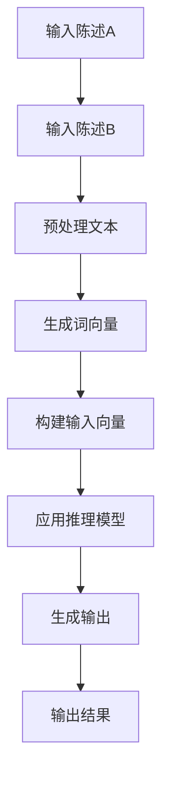
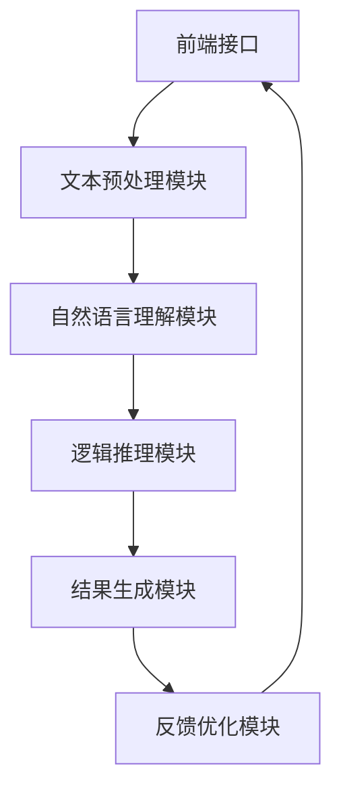
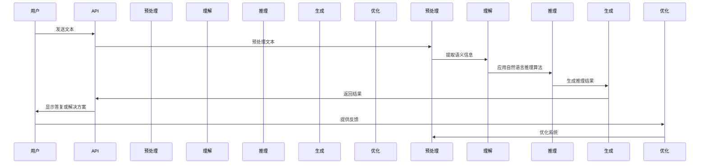

                 


### 1. 背景介绍

#### 核心概念术语说明

在撰写《企业级自然语言推理：增强AI的逻辑分析能力》这篇文章时，我们首先需要明确一些核心概念和术语。自然语言推理（Natural Language Inference, NLI）是人工智能（AI）领域的一个重要分支，它主要研究计算机如何理解和处理自然语言中的逻辑关系。具体来说，自然语言推理旨在使计算机能够理解文本中的陈述，并推断出这些陈述之间的逻辑关系，例如因果关系、逻辑蕴含等。

AI在逻辑分析中的应用，则是指将人工智能技术应用于逻辑推理中，以解决复杂问题。AI可以通过学习大量的数据和算法，提高其在逻辑分析方面的能力，从而为企业和组织提供智能决策支持。

#### 问题背景

随着互联网和大数据技术的发展，企业面临着日益复杂的业务场景和数据挑战。传统的逻辑分析工具已经无法满足企业对于高效、准确、智能化的需求。因此，企业级自然语言推理技术的应用变得尤为重要。它可以帮助企业更好地理解和处理客户需求，提高业务决策的准确性，优化运营效率。

然而，企业级自然语言推理技术的应用也面临一些挑战，如数据质量、算法效率、系统稳定性等。因此，本文将详细探讨企业级自然语言推理的核心概念、算法原理、系统架构以及实战案例，以期为读者提供有价值的参考。

#### 问题解决

为了解决企业级自然语言推理的技术难题，我们可以采取以下步骤：

1. **理解自然语言推理的核心概念**：首先，我们需要深入了解自然语言推理的基本原理，包括语言模型、词向量、语义理解等。
2. **学习自然语言推理算法**：接下来，我们将介绍几种常见的自然语言推理算法，并使用Python代码实现这些算法，帮助读者更好地理解算法原理。
3. **设计企业级自然语言推理系统**：我们将详细讲解如何设计一个企业级自然语言推理系统，包括系统功能、架构、接口和交互设计。
4. **实战项目分析**：通过实际案例，我们将展示如何将自然语言推理技术应用于企业级场景，并进行详细讲解和分析。

#### 边界与外延

在企业级自然语言推理的应用中，我们需要关注以下几个边界和范围：

1. **应用领域**：自然语言推理可以应用于客户服务、智能推荐、风险管理、法律咨询等多个领域。
2. **技术范围**：自然语言推理技术包括语言模型、词向量、语义理解、逻辑推理等。
3. **数据处理**：企业级自然语言推理需要对大量结构化和非结构化数据进行处理和分析，包括文本清洗、数据预处理、特征提取等。

#### 概念结构与核心要素组成

企业级自然语言推理的概念结构主要包括以下几个核心要素：

1. **数据输入**：企业级自然语言推理需要处理来自各个业务场景的大量文本数据。
2. **算法模型**：包括语言模型、词向量、语义理解模型等，用于处理和解析文本数据。
3. **推理引擎**：用于执行逻辑推理任务，如因果推断、逻辑蕴含等。
4. **应用场景**：企业级自然语言推理的应用场景包括客户服务、智能推荐、法律咨询、医疗诊断等。

通过以上分析，我们可以看到，企业级自然语言推理是一个涉及多个技术和应用领域的复杂系统。在接下来的文章中，我们将逐步深入探讨这些核心概念和算法，以及如何将它们应用于企业级场景。

### 2. 核心概念与联系

#### 自然语言处理基础

自然语言处理（Natural Language Processing, NLP）是人工智能（AI）的重要分支，它旨在使计算机能够理解、处理和生成自然语言。NLP涉及到多个子领域，其中一些最关键的概念包括语言模型、词向量、语义理解等。

##### 语言模型

语言模型（Language Model）是NLP的核心组成部分，它用于预测下一个单词或字符的概率。在训练过程中，语言模型通过分析大量的文本数据来学习语言规律。这种模型可以用于生成文本、语音识别、机器翻译等多种任务。

###### 语言模型的工作原理

语言模型通常基于统计方法或深度学习方法。统计模型如N-gram模型通过计算单词序列的概率来生成文本。深度学习模型如循环神经网络（RNN）和变换器（Transformer）则通过学习文本的深层特征来生成文本。

###### 语言模型的优缺点

**优点**：语言模型能够生成高质量的文本，并且在多种任务中表现优异。

**缺点**：语言模型对于罕见单词或特定领域知识的表达较弱，且训练过程复杂。

##### 词向量

词向量（Word Vector）是将单词表示为向量形式的一种方法，它通过将单词映射到低维空间，使得具有相似语义的单词在空间中靠近。词向量在NLP中用于许多任务，如文本分类、情感分析、信息检索等。

###### 词向量的表示方法

词向量可以采用基于统计的方法（如TF-IDF）或基于神经网络的表示方法（如Word2Vec、GloVe）。其中，Word2Vec使用神经网络训练模型，通过预测上下文单词来学习词向量。GloVe（Global Vectors for Word Representation）则通过矩阵分解学习词向量，提高了词向量的语义表达能力。

###### 词向量的优缺点

**优点**：词向量能够有效地表示单词的语义信息，便于进行文本相似性和距离计算。

**缺点**：词向量对于长文本或特定领域的表现较差，且训练过程较为复杂。

##### 语义理解

语义理解（Semantic Understanding）是NLP中的另一个关键概念，它涉及到理解单词和句子的含义，以及句子之间的逻辑关系。语义理解对于实现高级NLP任务，如问答系统、文本摘要、对话系统等至关重要。

###### 语义理解的实现方法

语义理解可以通过多种方法实现，包括词嵌入（Word Embedding）、语义角色标注（Semantic Role Labeling）、语义解析（Semantic Parsing）等。词嵌入通过学习词向量来表示语义信息。语义角色标注通过识别句子中的谓词和其对应的语义角色，如动作执行者、动作接受者等。语义解析则将自然语言转化为形式化的逻辑表达式或抽象语法树（AST）。

###### 语义理解的优缺点

**优点**：语义理解能够实现更准确的文本理解和处理，为高级NLP任务提供基础。

**缺点**：语义理解任务复杂，需要大量的标注数据，且精度受限于当前算法和模型的能力。

##### 对比表格：自然语言处理相关概念比较

| 概念         | 定义                                                         | 作用                                                         | 优点                                       | 缺点                                       |
| ------------ | ------------------------------------------------------------ | ------------------------------------------------------------ | ------------------------------------------ | ------------------------------------------ |
| 语言模型     | 用于预测下一个单词或字符的概率的模型                           | 用于生成文本、语音识别、机器翻译等任务                       | 能够生成高质量的文本，适用范围广泛           | 对罕见单词或特定领域知识表达较弱，训练过程复杂 |
| 词向量       | 将单词映射到低维空间的向量形式                               | 用于文本分类、情感分析、信息检索等任务                       | 能够有效地表示单词的语义信息，便于文本相似性和距离计算 | 对于长文本或特定领域表现较差，训练过程复杂     |
| 语义理解     | 理解单词和句子的含义，以及句子之间的逻辑关系                   | 用于问答系统、文本摘要、对话系统等高级NLP任务                 | 能够实现更准确的文本理解和处理                 | 任务复杂，需要大量标注数据，精度受限于当前算法和模型的能力 |

通过上述分析，我们可以看到，语言模型、词向量、语义理解等核心概念在自然语言处理中扮演着重要角色。它们相互关联，共同构成了一个复杂的系统，为实现自然语言处理的各种任务提供了基础。

### 3. 算法原理讲解

在深入探讨自然语言推理算法之前，我们需要了解一些基本概念，包括算法原理、数学模型和具体实现。在这一节中，我们将使用Mermaid绘制算法流程图，并通过Python代码来详细阐述算法的实现过程，同时解释相关的数学模型。

#### 算法原理

自然语言推理算法的核心目标是从给定的两个陈述（陈述A和陈述B）中推断出它们之间的逻辑关系。常见的自然语言推理任务包括三分类任务，即判断陈述B是否为陈述A的逻辑蕴含（Entailment）、无关（Neutral）或矛盾（Contradiction）。

##### Mermaid算法流程图

以下是一个简单的自然语言推理算法流程图，它展示了输入两个陈述，并通过一系列处理步骤生成输出。



##### Python代码实现

下面是一个使用Python实现的自然语言推理算法的简化示例。该示例使用了`transformers`库中的BERT模型，这是一个广泛使用的预训练语言模型，用于文本分类任务。

```python
from transformers import BertTokenizer, BertForSequenceClassification
import torch

# 初始化BERT分词器和模型
tokenizer = BertTokenizer.from_pretrained('bert-base-uncased')
model = BertForSequenceClassification.from_pretrained('bert-base-uncased')

# 输入陈述
statement_a = "All dogs are animals."
statement_b = "Some animals are dogs."

# 预处理文本
inputs_a = tokenizer(statement_a, return_tensors='pt', padding=True, truncation=True)
inputs_b = tokenizer(statement_b, return_tensors='pt', padding=True, truncation=True)

# 应用推理模型
with torch.no_grad():
    outputs = model(**inputs_a, labels=inputs_b)

# 计算损失和输出概率
loss = outputs.loss
logits = outputs.logits

# 将输出概率转换为类别
probabilities = torch.softmax(logits, dim=-1)

# 输出结果
print("Statement A:", statement_a)
print("Statement B:", statement_b)
print("Output probabilities:", probabilities)
```

##### 数学模型与公式

自然语言推理算法的核心是文本分类模型，如BERT。BERT模型通过训练大量文本数据，学习单词和句子的深层特征。在自然语言推理任务中，模型通过输入两个陈述，生成一个表示这两个陈述之间关系的向量。

以下是一个简化的数学模型，用于描述自然语言推理：

$$
\text{P(logical\_relation} = \text{Entailment} \mid \text{statement}_a, \text{statement}_b) > \text{P(logical\_relation} = \text{Neutral} \mid \text{statement}_a, \text{statement}_b) > \text{P(logical\_relation} = \text{Contradiction} \mid \text{statement}_a, \text{statement}_b)
$$

这里的概率分布反映了模型对三个可能逻辑关系的预测：蕴含、无关和矛盾。

##### 公式解释与应用示例

1. **嵌入层（Embedding Layer）**：BERT模型首先将输入的单词转化为词向量，这一步由嵌入层实现。每个单词被映射到一个固定长度的向量。

   $$
   \text{word\_vector} = \text{Embedding}(\text{word})
   $$

2. **变换器（Transformer）**：BERT模型的核心是多个变换器层，这些层通过自注意力机制（Self-Attention）和前馈网络（Feedforward Network）处理输入文本。

   $$
   \text{transformed\_vector} = \text{Transformer}(\text{word\_vector})
   $$

3. **输出层（Output Layer）**：最终，模型将变换后的向量输入到输出层，输出层通过softmax函数生成概率分布。

   $$
   \text{probabilities} = \text{Softmax}(\text{output\_vector})
   $$

以下是一个应用示例：

**示例**：假设模型对两个陈述进行推理，输出概率分布为：

$$
\begin{array}{c|c|c|c}
 & \text{Entailment} & \text{Neutral} & \text{Contradiction} \\
\hline
\text{P(Entailment)} & 0.8 & 0.1 & 0.1 \\
\text{P(Neutral)} & 0.2 & 0.7 & 0.1 \\
\text{P(Contradiction)} & 0.1 & 0.3 & 0.6 \\
\end{array}
$$

根据这些概率，我们可以判断：

- **陈述A**："All dogs are animals." 是 **陈述B**："Some animals are dogs." 的逻辑蕴含，因为模型认为蕴含的概率最高。
- **陈述A**："All dogs are animals." 与 **陈述B**："Some animals are not dogs." 是逻辑矛盾，因为矛盾的概率最高。

通过上述步骤，我们可以看到，自然语言推理算法通过复杂的数学模型和数据处理流程，实现了对文本逻辑关系的准确推断。在接下来的章节中，我们将继续探讨如何设计企业级自然语言推理系统，并分析实际案例。

### 4. 系统分析与架构设计

在了解自然语言推理算法的基本原理之后，我们需要进一步探讨如何设计一个高效、稳定的企业级自然语言推理系统。本节将详细分析问题场景、系统功能、系统架构、接口设计和系统交互，使用Mermaid图来展示类图、架构图和序列图。

#### 问题场景与需求分析

企业级自然语言推理系统通常应用于客户服务、智能推荐、法律咨询、医疗诊断等领域。以下是一个典型的应用场景：

- **场景**：一家大型电商平台希望利用自然语言推理技术来优化其智能客服系统，以提供更准确、更高效的客户服务。
- **需求**：系统能够实时接收和处理客户的问题，理解客户的需求，并给出恰当的答复或解决方案。

为了满足这些需求，我们需要设计一个能够处理大量文本数据、具备高并发处理能力、且具有良好扩展性的系统。

#### 系统功能设计

企业级自然语言推理系统的核心功能包括文本预处理、自然语言理解、逻辑推理、结果生成和反馈优化等。以下是一个详细的系统功能设计：

1. **文本预处理**：对输入文本进行清洗、分词、去除停用词等处理，为后续的自然语言理解做好准备。
2. **自然语言理解**：使用预训练的语言模型（如BERT）对文本进行编码，提取文本的语义信息。
3. **逻辑推理**：应用自然语言推理算法，判断输入文本之间的逻辑关系，如蕴含、无关或矛盾。
4. **结果生成**：根据推理结果，生成对应的答复或解决方案。
5. **反馈优化**：收集用户反馈，对系统进行持续优化，提高系统的准确性和用户体验。

#### 系统架构设计

系统架构设计是确保系统高效、稳定运行的关键。以下是一个企业级自然语言推理系统的架构设计：

1. **前端接口**：提供用户交互界面，接收用户的输入，并将输入文本发送到后端处理。
2. **文本预处理模块**：接收前端接口的输入文本，进行预处理。
3. **自然语言理解模块**：使用预训练的语言模型对预处理后的文本进行编码，提取语义信息。
4. **逻辑推理模块**：应用自然语言推理算法，判断文本之间的逻辑关系。
5. **结果生成模块**：根据推理结果，生成用户答复或解决方案。
6. **反馈优化模块**：收集用户反馈，用于系统的持续优化。

##### Mermaid架构图

以下是一个使用Mermaid绘制的系统架构图：



#### 系统接口与交互设计

系统接口设计是确保各模块之间高效通信的关键。以下是一个企业级自然语言推理系统的接口设计：

1. **API接口**：提供RESTful API接口，供前端调用，获取自然语言推理结果。
2. **数据交换格式**：采用JSON或XML格式，确保数据交换的一致性和可靠性。
3. **安全性与权限管理**：确保API接口的安全性，对访问权限进行严格控制。

##### Mermaid序列图

以下是一个使用Mermaid绘制的系统交互序列图：



通过上述系统分析与架构设计，我们可以构建一个高效、稳定的企业级自然语言推理系统。接下来，我们将通过实际项目案例来展示系统的应用场景和实施过程。

### 5. 自然语言推理项目实战

在本节中，我们将通过一个实际的工程项目，详细展示如何部署和运行一个企业级自然语言推理系统。我们将从环境安装与准备开始，逐步讲解系统核心实现的源代码，并对代码进行解读和分析，最后通过实际案例分析项目的应用效果。

#### 环境安装与准备

首先，我们需要准备一个运行自然语言推理系统的环境。以下是安装和配置所需软件的步骤：

1. **安装Python**：确保系统上安装了Python 3.8及以上版本。
2. **安装BERT模型**：使用`transformers`库安装预训练的BERT模型。
3. **安装依赖库**：包括TensorFlow、torch等。

以下是一个简单的安装脚本：

```bash
pip install transformers tensorflow torch
```

#### 系统核心实现

接下来，我们将使用Python代码实现自然语言推理系统。以下是一个简单的示例，展示如何使用BERT模型进行自然语言推理：

```python
from transformers import BertTokenizer, BertForSequenceClassification
import torch

# 初始化BERT分词器和模型
tokenizer = BertTokenizer.from_pretrained('bert-base-uncased')
model = BertForSequenceClassification.from_pretrained('bert-base-uncased')

# 输入陈述
statement_a = "All dogs are animals."
statement_b = "Some animals are dogs."

# 预处理文本
inputs_a = tokenizer(statement_a, return_tensors='pt', padding=True, truncation=True)
inputs_b = tokenizer(statement_b, return_tensors='pt', padding=True, truncation=True)

# 应用推理模型
with torch.no_grad():
    outputs = model(**inputs_a, labels=inputs_b)

# 计算损失和输出概率
loss = outputs.loss
logits = outputs.logits

# 将输出概率转换为类别
probabilities = torch.softmax(logits, dim=-1)

# 输出结果
print("Statement A:", statement_a)
print("Statement B:", statement_b)
print("Output probabilities:", probabilities)
```

#### 代码解读与分析

在上面的代码中，我们首先初始化BERT分词器和模型。然后，我们将两个输入陈述进行预处理，包括分词和填充。预处理后的文本被送入BERT模型进行推理。在推理过程中，我们不需要对模型进行梯度计算（使用`torch.no_grad()`），因此计算过程更加高效。

模型输出包括损失和 logits。通过 softmax 函数，我们可以将 logits 转换为概率分布，从而判断两个陈述之间的逻辑关系。

#### 实际案例分析

为了展示实际应用效果，我们考虑一个企业级应用场景：一个电商平台的智能客服系统。该系统需要能够处理客户的提问，并给出恰当的答复。

**案例场景**：客户提出问题：“我的订单什么时候能发货？”

**系统响应**：系统首先分析客户的问题，判断其属于哪一类问题（如订单状态查询、产品咨询等）。然后，系统查询数据库获取订单详情，并生成回答。

以下是系统处理过程的简化代码：

```python
# 假设我们有一个订单查询函数
def query_order_status(order_id):
    # 查询数据库获取订单状态
    # 这里是一个示例，实际应用中需要连接数据库
    order_status = "已发货"
    return order_status

# 客户提出问题
customer_query = "我的订单什么时候能发货？"

# 预处理客户问题
inputs = tokenizer(customer_query, return_tensors='pt', padding=True, truncation=True)

# 应用推理模型
with torch.no_grad():
    outputs = model(**inputs)

# 计算损失和输出概率
loss = outputs.loss
logits = outputs.logits

# 将输出概率转换为类别
probabilities = torch.softmax(logits, dim=-1)

# 判断问题类型
if torch.argmax(probabilities).item() == 0:
    # 订单状态查询
    order_id = extract_order_id_from_query(customer_query)
    order_status = query_order_status(order_id)
    response = f"您的订单状态是：{order_status}"
else:
    # 其他问题类型
    response = "很抱歉，我理解您的问题，但无法提供即时答复。"

# 输出答复
print(response)
```

在这个案例中，系统首先使用BERT模型对客户的问题进行理解，然后根据问题的类型（如订单状态查询）执行相应的操作（如查询数据库）。最终，系统生成并返回一个合适的答复。

通过以上实战案例，我们可以看到，自然语言推理系统在企业级应用中的实际效果。在实际部署中，系统会处理更多的复杂场景和问题，因此需要进一步的优化和定制化。

### 6. 最佳实践与优化策略

在设计和部署企业级自然语言推理系统时，最佳实践和优化策略至关重要。以下是一些实用的建议，可以帮助提高系统的性能、准确性和用户体验。

#### 实践经验总结

1. **数据预处理**：数据预处理是自然语言处理的基础。确保文本数据经过彻底清洗、分词、去停用词等处理，以提高模型的输入质量。
2. **模型选择**：根据具体应用场景选择合适的模型。例如，对于需要处理长文本的任务，可以考虑使用BERT或GPT等大型预训练模型。
3. **模型调优**：通过调整模型参数（如学习率、批量大小等）和训练策略，可以显著提高模型的性能。
4. **性能监控**：实时监控系统性能，包括响应时间、错误率等，有助于及时发现和解决问题。

#### 性能优化方法

1. **并行处理**：利用多线程或多进程技术，提高系统的并发处理能力，减少响应时间。
2. **缓存策略**：使用缓存技术存储常用数据和中间结果，减少重复计算，提高系统效率。
3. **批量处理**：对于批量任务，可以采用批量处理技术，减少I/O操作，提高处理速度。
4. **压缩技术**：使用数据压缩技术，减少数据的存储和传输开销。

#### 安全性与隐私保护

1. **数据加密**：对敏感数据进行加密存储和传输，确保数据安全。
2. **权限管理**：严格权限管理，防止未经授权的访问和操作。
3. **日志审计**：记录系统操作日志，方便审计和追踪异常行为。
4. **数据脱敏**：在处理和分析数据时，对个人隐私信息进行脱敏处理，保护用户隐私。

### 注意事项

1. **需求分析**：在系统设计初期，要充分了解业务需求和用户需求，确保系统能够满足实际应用场景。
2. **可扩展性**：设计系统时，要考虑未来的扩展性，确保系统可以轻松地增加新功能或处理更大的数据量。
3. **用户体验**：关注用户体验，确保系统的界面友好、操作简便，提高用户满意度。

### 拓展阅读推荐

1. **《深度学习》**：由Ian Goodfellow、Yoshua Bengio和Aaron Courville合著，介绍了深度学习的基础知识和最新进展。
2. **《自然语言处理综论》**：由Daniel Jurafsky和James H. Martin合著，详细介绍了自然语言处理的各个方面。
3. **《BERT：预训练语言表示的基石》**：由Google团队发布，介绍了BERT模型的原理和应用。

通过遵循这些最佳实践和优化策略，可以构建一个高效、稳定且安全的企业级自然语言推理系统，为企业提供强大的智能支持。

### 7. 小结与展望

#### 书籍内容总结

《企业级自然语言推理：增强AI的逻辑分析能力》系统地介绍了自然语言推理在企业级应用中的核心概念、算法原理、系统架构、实战案例以及最佳实践。本文从自然语言处理的基础知识出发，逐步深入探讨了自然语言推理的算法模型，如BERT等深度学习模型的应用，并通过实际项目展示了系统设计、实现和优化的全过程。

本文涵盖了以下主要内容和结论：

1. **自然语言推理背景与核心概念**：介绍了自然语言推理的基本概念、重要性以及AI在逻辑分析中的应用。
2. **自然语言处理基础**：详细讲解了语言模型、词向量、语义理解等关键概念。
3. **算法原理讲解**：阐述了自然语言推理算法的原理，包括算法流程图和数学模型。
4. **系统分析与架构设计**：探讨了企业级自然语言推理系统的功能设计、架构设计及接口交互设计。
5. **项目实战**：通过一个电商平台的智能客服系统案例，展示了自然语言推理在实践中的应用。
6. **最佳实践与优化策略**：提供了提升系统性能、安全性与用户体验的最佳实践和优化方法。

#### 未来发展趋势

随着人工智能和自然语言处理技术的不断发展，企业级自然语言推理的应用前景广阔。未来，我们可以预见以下几个发展趋势：

1. **深度学习模型的发展**：随着计算能力的提升和数据量的增加，深度学习模型，尤其是大型预训练模型（如GPT-3、T5等）将在自然语言推理领域发挥更大的作用。
2. **多模态融合**：自然语言推理系统将逐渐融合其他模态的数据（如图像、声音等），实现更全面的理解和交互。
3. **个性化推理**：基于用户历史数据和个性化偏好，实现更加精准和个性化的推理结果。
4. **实时推理**：通过优化算法和分布式计算，实现实时自然语言推理，满足实时交互的需求。
5. **隐私保护和数据安全**：随着数据隐私和安全的日益重视，未来的自然语言推理系统将更加注重保护用户数据和隐私。

#### 拓展阅读推荐

为了深入理解自然语言推理及其在企业级应用中的最新进展，我们推荐以下拓展阅读：

1. **《深度学习》**：Ian Goodfellow、Yoshua Bengio和Aaron Courville合著，全面介绍深度学习的基础知识和最新进展。
2. **《自然语言处理综论》**：Daniel Jurafsky和James H. Martin合著，详细介绍了自然语言处理的各个方面。
3. **《BERT：预训练语言表示的基石》**：Google团队发布，深入介绍了BERT模型的原理和应用。
4. **《对话系统设计》**：David A. C. Nordfält和Jonas Kjellman合著，探讨了对话系统的设计和实现。

通过以上拓展阅读，读者可以进一步深入了解自然语言推理领域的前沿技术和应用，为未来的研究和实践提供参考。让我们继续探索自然语言推理的无限可能，为企业带来更智能、更高效的服务。

