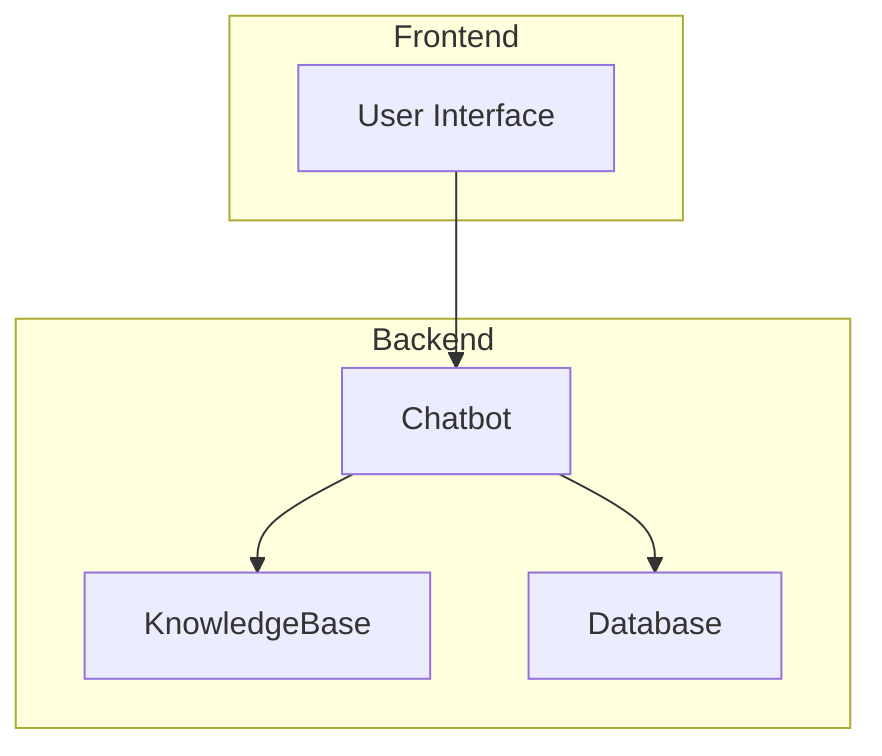
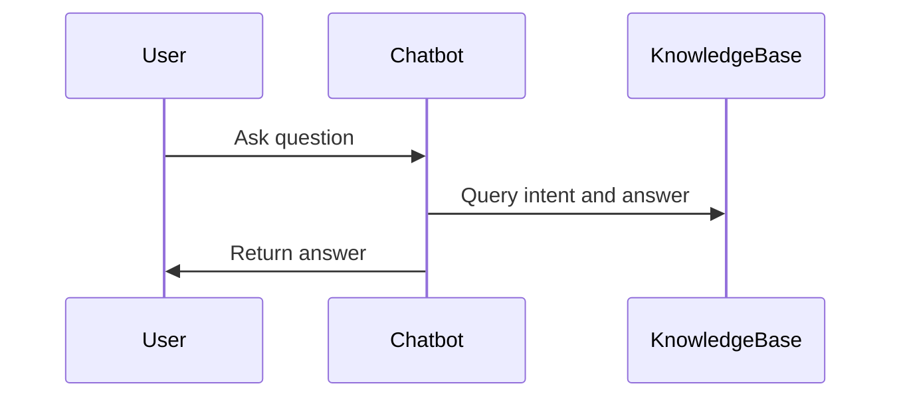
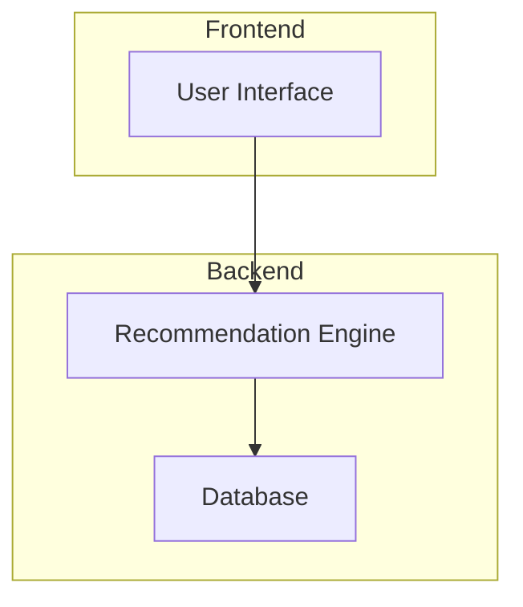
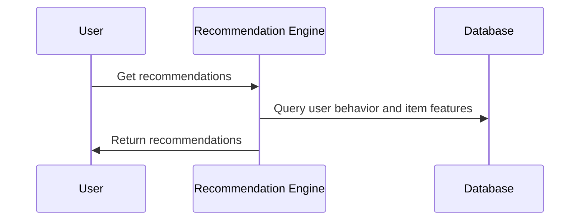
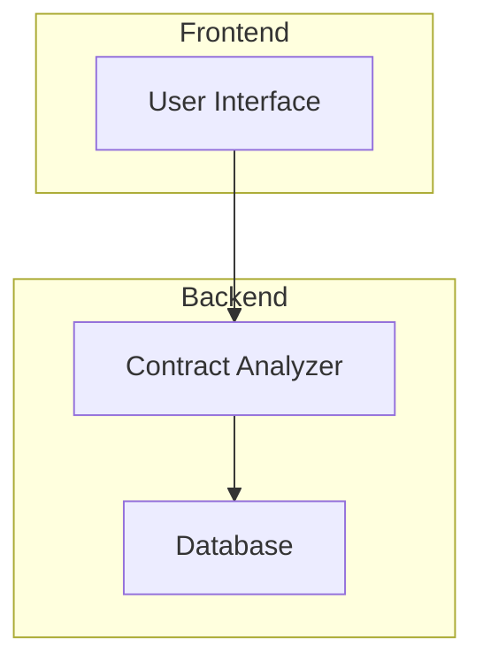
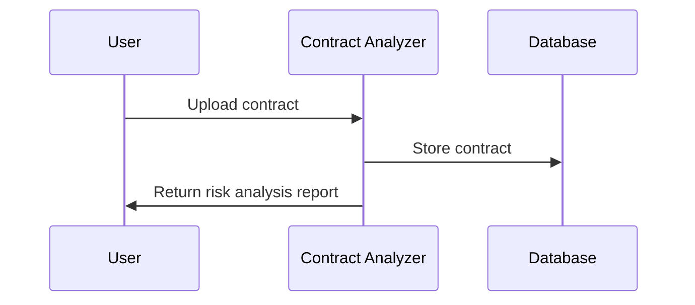

                 

### 引入

在现代信息技术迅速发展的时代，企业级自然语言理解引擎已成为智能化人机交互的关键支撑。本文旨在深入探讨企业级自然语言理解引擎的构建与应用，通过详细的分析和推理，揭示其核心技术原理和实施策略。

首先，我们需要理解自然语言理解（Natural Language Understanding，NLU）的基本概念。自然语言理解是指使计算机能够理解和解释人类语言的过程。它涉及文本分类、情感分析、问答系统等多个方面，目的是使计算机能够更好地与人类进行交互。

企业级自然语言理解引擎的需求源自于以下几个方面的驱动因素：

1. **客户服务自动化**：随着商业活动日益复杂，企业需要高效的客户服务系统来处理大量用户请求，自然语言理解能够自动化理解并响应这些问题。
  
2. **数据洞察**：自然语言理解能够帮助企业从大量非结构化文本数据中提取有价值的信息，从而提供更加精准的数据分析。

3. **智能决策**：通过自然语言理解技术，企业能够更好地理解用户需求和业务场景，从而作出更智能的决策。

4. **内容管理**：自然语言理解能够帮助企业更好地管理和分类大量文档，提高内容查找和检索的效率。

尽管自然语言理解技术在近年来取得了显著进展，但其应用仍然面临诸多挑战。例如，自然语言理解的准确性和鲁棒性仍然有限，如何处理多语言和多模态的输入数据等。

本文将按以下结构展开：

- **第一部分：自然语言理解引擎基础**，介绍自然语言理解的基本概念、发展历程以及核心技术在企业中的应用。
  
- **第二部分：自然语言理解引擎构建**，详细讨论技术架构与组件设计、数据预处理、模型选择与训练等内容。
  
- **第三部分：人机交互深化应用**，探讨文本分类、情感分析、问答系统和对话管理等应用场景。

- **第四部分：企业级应用与优化**，分析自然语言理解在企业中的实际应用场景，并提出性能优化策略。

- **第五部分：未来趋势与展望**，展望自然语言理解技术的未来发展趋势以及企业在这一领域的发展策略。

通过本文的探讨，我们希望能够为读者提供一个全面且深入的视角，帮助企业更好地理解和应用自然语言理解技术，实现智能化人机交互的深化。

---

**关键词：** 自然语言理解，企业级应用，人机交互，文本分类，情感分析

**摘要：** 本文围绕企业级自然语言理解引擎的构建与应用进行深入探讨，从基础概念到核心技术，再到实际应用场景，全面解析了自然语言理解引擎在智能化人机交互中的关键作用，并提出了优化策略和未来发展趋势。通过本文的阅读，读者将能够全面了解自然语言理解技术的原理和实践，为企业智能化转型提供有力支持。

---

### 第一部分：自然语言理解引擎基础

#### 1.1 问题背景

自然语言处理（Natural Language Processing，NLP）是人工智能（Artificial Intelligence，AI）领域的一个重要分支，其目标是使计算机能够理解和处理人类语言。随着大数据和云计算技术的不断发展，自然语言处理技术在各行各业得到了广泛应用。从搜索引擎到语音助手，从智能客服到金融风控，自然语言处理技术正在深刻改变着人类的生活和工作方式。

在企业级应用中，自然语言处理技术同样扮演着重要角色。企业需要处理海量的文本数据，如客户反馈、市场报告、法律文件等，从中提取有价值的信息，从而支持决策和优化业务流程。然而，自然语言处理面临着许多挑战，如语言的多样性、文本的复杂性、语义的模糊性等。

自然语言理解（Natural Language Understanding，NLU）是自然语言处理的核心任务之一，旨在使计算机能够理解文本的深层含义，包括句子的语义、情感、意图等。NLU 在企业级应用中的重要性主要体现在以下几个方面：

1. **客户服务自动化**：通过自然语言理解技术，企业可以构建智能客服系统，自动化处理客户请求，提高服务效率和质量。

2. **数据洞察**：自然语言理解能够帮助企业从大量的非结构化文本数据中提取有价值的信息，如关键词、主题、趋势等，从而提供更深入的数据分析。

3. **智能决策**：通过自然语言理解技术，企业能够更好地理解用户需求和业务场景，从而做出更智能的决策。

4. **内容管理**：自然语言理解能够帮助企业更好地管理和分类大量文档，提高内容查找和检索的效率。

自然语言处理的发展历程可以追溯到 20 世纪五六十年代。最初的研究主要集中在规则驱动的方法上，如句法分析、语义角色标注等。随着计算能力的提高和机器学习技术的发展，统计方法和神经网络方法逐渐成为自然语言处理的主要工具。近年来，深度学习技术的引入进一步推动了自然语言处理的进展，使其在许多任务上都取得了显著的效果。

在企业级应用中，自然语言处理技术的应用场景非常广泛。例如，在金融行业，自然语言处理技术可以用于自动提取客户反馈中的关键信息，分析市场趋势，提供投资建议；在医疗行业，自然语言处理技术可以用于分析病历，提取关键信息，辅助医生进行诊断；在零售行业，自然语言处理技术可以用于分析客户评论，优化产品推荐，提高销售额。

然而，自然语言处理技术在实际应用中也面临着一些挑战。首先，自然语言处理的准确性和鲁棒性仍然有限，特别是在处理多语言和多模态的输入数据时。其次，自然语言处理的模型通常需要大量的训练数据和计算资源，这对于一些小型企业来说可能是一个挑战。此外，如何将自然语言处理技术有效地集成到现有的业务流程中，也是一个需要解决的问题。

综上所述，自然语言理解技术在企业级应用中具有重要的地位和广泛的应用前景。通过深入理解和应用自然语言理解技术，企业可以更好地处理文本数据，提高业务效率和竞争力。

#### 1.2 核心概念

**自然语言理解（Natural Language Understanding，NLU）**：自然语言理解是指使计算机能够理解和解释人类语言的过程。它涉及文本分类、情感分析、命名实体识别、语义解析等多个子任务，目的是使计算机能够理解文本的深层含义，如句子的语义、情感、意图等。

**自然语言处理（Natural Language Processing，NLP）**：自然语言处理是指使计算机能够处理人类语言的一系列技术的总称。它包括文本分类、分词、词性标注、命名实体识别、机器翻译、语音识别等多个方面。自然语言处理的目标是使计算机能够理解和生成自然语言，从而实现人机交互。

**文本分类（Text Classification）**：文本分类是指将文本数据按照一定的规则自动分为不同的类别。例如，可以将新闻文章分为政治、经济、体育等类别。文本分类是自然语言处理中最基本的任务之一，广泛应用于信息检索、文本挖掘、情感分析等领域。

**情感分析（Sentiment Analysis）**：情感分析是指通过对文本数据进行分析，识别出其中的情感倾向。例如，可以分析用户评论中的正面、负面情感，从而帮助企业了解用户反馈和市场趋势。情感分析在电子商务、社交媒体、市场调研等领域有广泛的应用。

**命名实体识别（Named Entity Recognition，NER）**：命名实体识别是指识别文本中的特定实体，如人名、地名、机构名、时间等。命名实体识别是自然语言处理中的一个重要任务，对于信息抽取、知识图谱构建等应用具有重要意义。

**语义解析（Semantic Parsing）**：语义解析是指将自然语言文本转换为其结构化表示，如语义角色标注、句法分析等。语义解析的目的是使计算机能够理解文本的深层含义，从而实现更高级的自然语言处理任务。

**词向量（Word Embedding）**：词向量是一种将单词映射到高维空间中的向量表示方法。词向量能够捕捉单词的语义信息，是实现自然语言处理任务的重要工具。常见的词向量模型包括 Word2Vec、GloVe 等。

**递归神经网络（Recurrent Neural Network，RNN）**：递归神经网络是一种能够处理序列数据的神经网络模型。RNN 通过循环结构来记忆序列中的信息，适用于自然语言处理中的序列建模任务，如文本分类、语言模型等。

**变换器模型（Transformer）**：变换器模型是一种基于自注意力机制的深度神经网络模型，广泛用于自然语言处理任务。Transformer 模型通过全局注意力机制来捕捉文本序列中的长距离依赖关系，在许多任务上都取得了显著的成果。

**预训练与微调（Pre-training and Fine-tuning）**：预训练是指在大规模语料库上对模型进行训练，使其获得基础的语义理解能力。微调是指将预训练模型在特定任务上进行调整，以适应具体的应用场景。预训练与微调是近年来自然语言处理领域的重要技术突破。

通过理解上述核心概念，读者可以更好地把握自然语言理解技术的本质和应用场景。在接下来的部分中，我们将进一步探讨自然语言理解技术的核心技术原理和实现方法。

#### 1.3 案例分析

自然语言理解技术在实际应用中已经取得了显著的成果，以下是一些成功的应用实例：

1. **智能客服系统**：智能客服系统是自然语言理解技术的一个重要应用场景。通过自然语言理解，系统可以自动化处理客户的问题和请求，提供快速、准确的响应。例如，Amazon 的智能客服 Alexa 能够理解用户的语言指令，提供购物、音乐播放、天气预报等多样化服务。同样，中国的阿里巴巴集团也开发了智能客服系统，如“阿里小蜜”，用于自动化处理客户咨询和售后服务，大大提高了客户服务效率。

2. **社交媒体分析**：社交媒体平台如 Twitter、Facebook 等，每天产生大量的用户评论和帖子。通过自然语言理解技术，企业可以对这些文本进行分析，提取关键信息，了解用户的情感和需求。例如，Facebook 的“社交分析”功能能够分析用户在帖子和评论中的情感倾向，从而帮助广告商和品牌制定更有效的营销策略。此外，Twitter 的“趋势分析”功能也利用自然语言理解技术，从用户生成的海量数据中提取出热门话题和趋势。

3. **金融风险管理**：在金融行业，自然语言理解技术可以用于自动化处理大量的文本数据，如客户报告、市场分析、法律法规等。例如，金融机构可以使用自然语言理解技术来监控市场风险，分析客户反馈，从而制定更有效的风险管理策略。此外，自然语言理解技术还可以用于自动化合同审核，通过识别合同中的关键条款和条件，确保合同内容的准确性和合法性。

4. **医疗健康**：在医疗健康领域，自然语言理解技术可以用于自动化处理病历、医学文献和患者反馈。例如，自然语言理解技术可以帮助医生从病历中提取关键信息，辅助诊断和治疗。此外，自然语言理解技术还可以用于医疗文献挖掘，从大量的医学文献中提取有价值的研究成果，为医学研究提供支持。

5. **法律领域**：在法律领域，自然语言理解技术可以用于自动化处理法律文件，如合同、判决书、法律意见书等。通过自然语言理解，系统可以识别法律文件中的关键条款和条件，进行文本对比和分析，从而提高法律文件的处理效率。例如，美国的一些律师事务所已经开始使用自然语言理解技术来自动化处理合同审核和文件分类。

尽管自然语言理解技术在实际应用中取得了显著成果，但仍面临一些挑战。首先，自然语言理解的准确性和鲁棒性仍有待提高，特别是在处理多语言、多模态的输入数据时。其次，如何有效地将自然语言理解技术集成到现有的业务流程中，也是一个需要解决的问题。此外，数据隐私和保护也是自然语言理解技术在实际应用中需要关注的重要问题。

总的来说，自然语言理解技术在各个领域的应用正在不断拓展，其在智能化人机交互中的关键作用日益凸显。通过深入研究和应用自然语言理解技术，企业可以更好地处理文本数据，提高业务效率和竞争力。

#### 1.4 当前应用领域和趋势

自然语言理解技术在当前的应用领域涵盖了从电子商务、金融、医疗到法律等多个行业，表现出强大的应用潜力和广泛的适应性。

**电子商务**：在电子商务领域，自然语言理解技术主要用于商品推荐、客户服务和在线购物体验优化。通过分析用户的搜索历史、购买行为和评论，自然语言理解系统能够提供个性化的商品推荐，提升用户的购物体验。例如，Amazon 和阿里巴巴等电商巨头使用自然语言理解技术来理解用户评论中的情感和意见，从而改进产品和服务。

**金融**：在金融行业，自然语言理解技术被广泛应用于风险管理、合规审查和客户服务。金融机构利用自然语言理解来分析市场报告、客户反馈和财务报表，提取关键信息以支持决策。同时，自然语言理解技术也被用于自动化合同审核和文档分类，确保合规性和准确性。

**医疗健康**：在医疗健康领域，自然语言理解技术被用来处理电子病历、医学文献和研究报告。通过自然语言理解，医生可以从大量的文本数据中提取关键信息，辅助诊断和治疗。此外，自然语言理解技术还可以用于患者沟通和医疗咨询，提供个性化的健康建议和指导。

**法律**：在法律领域，自然语言理解技术被用来处理大量的法律文件，如合同、判决书和法规。通过自然语言理解，律师可以自动化地审核合同条款、分析案例和法律文献，提高工作效率和准确性。

**社交媒体**：社交媒体平台是自然语言理解技术的另一个重要应用场景。通过自然语言理解，平台可以分析用户生成的内容，提取情感和趋势信息，从而优化用户体验和广告投放策略。例如，Twitter 和 Facebook 等平台利用自然语言理解技术来监控社交媒体上的热点话题和用户情绪。

**趋势分析**：当前，自然语言理解技术的应用趋势体现在以下几个方面：

1. **多语言支持**：随着全球化的发展，多语言的自然语言理解成为了一个重要的研究方向。越来越多的自然语言理解系统开始支持多种语言，以适应不同国家和地区的需求。

2. **跨模态融合**：自然语言理解技术正逐渐与其他模态（如图像、声音、视频）结合，形成跨模态理解系统。这种跨模态融合能够提供更丰富的语义信息，提高系统的理解能力和应用范围。

3. **深度学习与神经网络**：深度学习，特别是变换器模型（Transformer）等神经网络架构，在自然语言理解中发挥了重要作用。这些模型能够通过自注意力机制捕捉长距离依赖关系，显著提升自然语言处理的准确性和性能。

4. **预训练与微调**：预训练和微调是当前自然语言理解技术的一个重要发展方向。预训练模型通过在大规模语料库上进行训练，获得基础的语义理解能力，然后通过微调适应特定任务和应用场景。

5. **数据隐私和安全**：随着自然语言理解技术的广泛应用，数据隐私和安全问题变得日益重要。如何在保护用户隐私的同时，有效地应用自然语言理解技术，成为一个重要的研究课题。

总之，自然语言理解技术正快速发展，并在各个领域展现出强大的应用潜力。通过不断创新和应用，自然语言理解技术将为智能化人机交互和各行业的数字化转型提供更加有力的支持。

---

### 第二部分：自然语言理解引擎构建

#### 2.1 技术架构与组件设计

自然语言理解引擎（NLU Engine）是企业级应用中的核心组件，其技术架构和组件设计决定了系统的性能、可扩展性和易用性。在构建企业级自然语言理解引擎时，我们需要考虑以下几个方面：

**1. 架构设计原则**

- **模块化**：系统应采用模块化设计，将不同功能（如文本分类、情感分析、命名实体识别等）独立封装，便于维护和扩展。
- **可扩展性**：系统应支持水平扩展和垂直扩展，以应对数据量和并发请求的增加。
- **高可用性**：系统应具备良好的容错机制和负载均衡能力，确保在高并发和故障情况下仍能稳定运行。
- **灵活性**：系统应支持多种数据输入格式（如文本、语音、图像等），并能够灵活配置和处理不同的业务场景。

**2. 主要组件介绍**

**文本预处理模块**：文本预处理是自然语言理解的第一步，其目的是将原始文本转换为适合模型处理的格式。文本预处理主要包括以下步骤：

- **分词**：将文本切分成词语或短语，以识别文本中的基本语义单位。
- **词性标注**：为每个词语标注其词性（如名词、动词、形容词等），以便后续的语义分析。
- **停用词过滤**：去除文本中的停用词（如“的”、“和”等），以提高文本的质量和模型的性能。
- **词干提取**：将词语还原为其基本形式（如“跑步”还原为“跑”），以减少文本的冗余信息。

**模型训练模块**：模型训练模块负责训练自然语言处理模型，如文本分类模型、情感分析模型、命名实体识别模型等。具体步骤如下：

- **数据集准备**：从各种来源收集和整理高质量的训练数据，确保数据的多样性和代表性。
- **特征提取**：将文本数据转换为特征向量，常用的方法包括词袋模型、词嵌入（如 Word2Vec、GloVe）等。
- **模型选择**：选择适合任务的模型，如递归神经网络（RNN）、变换器模型（Transformer）等。
- **模型训练**：使用训练数据对模型进行训练，通过调整模型参数以最小化预测误差。

**模型评估模块**：模型评估模块用于评估训练得到的模型的性能，常用的评估指标包括准确率、召回率、F1 值等。评估模块还包括交叉验证、混淆矩阵等工具，帮助研究人员分析模型的表现和优化方向。

**应用接口模块**：应用接口模块负责提供系统的API接口，以便其他系统或应用程序能够调用自然语言理解功能。接口应支持多种请求格式（如RESTful API、GraphQL等），并提供详细的文档和示例代码，方便开发者集成和使用。

**3. 系统架构图**

下图展示了企业级自然语言理解引擎的基本架构：

```mermaid
graph TB
    subgraph TextProcessing
        TP1[Text Preprocessing]
        TP2[Tokenization]
        TP3[Part-of-Speech Tagging]
        TP4[Stop Word Filtering]
        TP5[Stemming]
    end

    subgraph ModelTraining
        MT1[Dataset Preparation]
        MT2[Feature Extraction]
        MT3[Model Selection]
        MT4[Model Training]
    end

    subgraph ModelEvaluation
        ME1[Model Evaluation]
        ME2[Cross-Validation]
        ME3[Confusion Matrix]
    end

    subgraph ApplicationInterface
        AI1[API Interface]
        AI2[Documentation]
    end

    TP1 --> TP2 --> TP3 --> TP4 --> TP5
    MT1 --> MT2 --> MT3 --> MT4
    ME1 --> ME2 --> ME3
    AI1 --> AI2
```



#### 2.2 数据预处理

数据预处理是自然语言理解引擎构建的重要环节，其质量直接影响到后续模型训练和评估的效果。以下是数据预处理的几个关键步骤：

**1. 数据来源与收集**

自然语言理解引擎需要大量的高质量训练数据。数据来源可以包括公开数据集、企业内部数据、社交媒体数据等。例如，常用的中文数据集包括百度新闻、豆瓣影评、百度知道等。在收集数据时，需要确保数据的多样性和代表性，以覆盖不同领域和场景。

**2. 数据清洗与预处理**

数据清洗和预处理是数据质量保证的重要步骤，主要包括以下任务：

- **去除噪声**：去除文本中的HTML标签、特殊字符和无关符号，确保文本的纯文本格式。
- **标准化**：统一文本格式，如将全角字符转换为半角字符，将大写字母转换为小写字母等。
- **文本规范化**：对文本进行规范化处理，如去除停用词、词干提取等，以提高文本的语义质量。

**3. 特征工程**

特征工程是数据预处理的重要环节，其目的是从原始文本中提取有用的特征，以便于模型处理。以下是几种常用的特征工程方法：

- **词袋模型（Bag of Words，BoW）**：将文本表示为词汇的集合，每个词汇作为特征。这种方法简单高效，但忽略了词汇的顺序和上下文信息。
- **词嵌入（Word Embedding）**：将词汇映射为高维向量，以捕捉词汇的语义信息。常见的词嵌入模型包括 Word2Vec、GloVe 等。
- **TF-IDF（Term Frequency-Inverse Document Frequency）**：计算词汇在文本中的频率，并结合其在整个语料库中的逆文档频率，以衡量其重要性。
- **单词的上下文信息**：通过递归神经网络（RNN）或变换器模型（Transformer）等深度学习方法，捕捉单词在上下文中的语义信息。

**4. 数据集划分**

在模型训练过程中，通常需要将数据集划分为训练集、验证集和测试集。以下是常见的划分方法：

- **训练集**：用于模型的训练，通常占数据集的60%-80%。
- **验证集**：用于模型的选择和调参，通常占数据集的10%-20%。
- **测试集**：用于模型的最终评估，通常占数据集的10%左右。

通过上述数据预处理步骤，我们可以获得高质量的训练数据，为自然语言理解引擎的构建奠定坚实基础。

---

### 第3章：关键算法原理

#### 3.1 词向量模型

词向量（Word Embedding）是自然语言处理中的一个核心概念，它将词汇映射为高维向量表示，以便于计算机处理和计算。词向量不仅能够捕获词汇的语义信息，还能通过向量空间中的相似性关系揭示词汇之间的关系。

**1. 词向量简介**

词向量是一种将词汇映射到高维空间中的向量表示方法。在词向量模型中，每个词汇都被表示为一个实值向量，这些向量可以在高维空间中计算距离和相似性。词向量模型的核心思想是，相似的词汇在向量空间中应该接近，而不同的词汇则相对远离。

**2. 常见词向量模型**

**Word2Vec**：Word2Vec 是最早也是最著名的词向量模型之一，由 Mikolov 等人于 2013 年提出。Word2Vec 模型主要包括两种训练方法：连续词袋（Continuous Bag of Words，CBOW）和Skip-Gram。

- **CBOW（Continuous Bag of Words）**：CBOW 模型通过上下文词汇预测中心词汇。具体来说，给定一个中心词汇，模型预测这个词汇周围的上下文词汇。CBOW 模型的输入是一个中心词汇及其上下文词汇的集合，输出是中心词汇。

- **Skip-Gram**：Skip-Gram 模型与 CBOW 相反，它是通过中心词汇预测上下文词汇。给定一个中心词汇，模型预测与其相邻的上下文词汇。Skip-Gram 模型的输入是一个中心词汇，输出是多个上下文词汇。

**GloVe（Global Vectors for Word Representation）**：GloVe 是另一种流行的词向量模型，由 Pennington、Socher 和 Manning 于 2014 年提出。GloVe 模型通过全局统计信息来计算词向量，能够更好地捕捉词汇的语义信息。

**3. 词向量模型在NLP中的应用**

词向量模型在自然语言处理中有着广泛的应用，以下是一些典型的应用场景：

- **文本分类**：词向量可以用于文本分类任务，通过计算文本中词汇的向量表示，再利用这些向量进行分类。
- **情感分析**：词向量可以用于情感分析，通过计算词汇的向量表示，可以识别文本中的情感倾向。
- **机器翻译**：词向量可以用于机器翻译任务，通过将源语言的词汇映射到高维空间，再利用这些向量进行翻译。
- **命名实体识别**：词向量可以用于命名实体识别，通过计算实体名称和其上下文词汇的向量表示，可以识别文本中的命名实体。

**4. 词向量模型的工作原理**

**Word2Vec的工作原理**：

- **CBOW模型**：给定一个中心词汇和其上下文词汇，CBOW模型通过上下文词汇的词向量平均来预测中心词汇。

- **Skip-Gram模型**：给定一个中心词汇，Skip-Gram模型通过中心词汇的词向量来预测其上下文词汇。

**GloVe模型**：

- **矩阵分解**：GloVe模型通过分解两个矩阵（一个是词汇矩阵，另一个是权重矩阵），将词汇映射到高维空间中的向量表示。

- **损失函数**：GloVe模型通过最小化损失函数（如均方误差），来优化词汇的向量表示。

通过理解词向量模型的工作原理，我们可以更好地应用这些模型来解决自然语言处理中的各种任务。

#### 3.2 递归神经网络（RNN）

递归神经网络（Recurrent Neural Network，RNN）是一种能够处理序列数据的神经网络模型。与传统的前馈神经网络不同，RNN 具有循环结构，能够记忆序列中的信息，适用于自然语言处理中的序列建模任务。

**1. RNN基础**

RNN的基本结构包括输入层、隐藏层和输出层。每个时间步上的输入都会通过隐藏层传递，并且隐藏层的输出会反馈到下一个时间步的输入，形成一个循环。

$$
h_t = \sigma(W_h * [h_{t-1}, x_t]) + b_h
$$

$$
y_t = W_o * h_t + b_o
$$

其中，$h_t$ 表示第 $t$ 个时间步的隐藏层输出，$x_t$ 表示第 $t$ 个时间步的输入，$y_t$ 表示第 $t$ 个时间步的输出，$W_h$ 和 $W_o$ 分别表示隐藏层和输出层的权重矩阵，$b_h$ 和 $b_o$ 分别表示隐藏层和输出层的偏置项，$\sigma$ 表示激活函数（如 sigmoid 函数或 tanh 函数）。

**2. LSTM与GRU**

为了解决传统 RNN 中的梯度消失和梯度爆炸问题，LSTM（Long Short-Term Memory）和 GRU（Gated Recurrent Unit）模型被提出。LSTM 和 GRU 都具有门控机制，能够有效地捕捉长序列依赖关系。

**LSTM（Long Short-Term Memory）**

LSTM 通过引入三个门控单元（输入门、遗忘门和输出门）来控制信息的流入、流出和保存。

- **输入门**：决定当前输入信息中有多少被存储在单元状态中。
- **遗忘门**：决定从单元状态中丢弃哪些信息。
- **输出门**：决定从单元状态中提取哪些信息作为当前时间步的输出。

LSTM 的门控机制可以有效地避免梯度消失和梯度爆炸问题，使其在处理长序列依赖关系时表现出更好的性能。

**GRU（Gated Recurrent Unit）**

GRU 是 LSTM 的简化版本，它通过合并输入门和遗忘门，并引入更新门来更新单元状态。GRU 具有更简单的结构，计算成本更低，但在许多任务上与 LSTM 表现相似。

**3. RNN在NLP中的应用**

RNN 在自然语言处理中有许多重要应用，以下是一些典型应用：

- **语言模型**：RNN 可以用于构建语言模型，预测下一个单词或字符的概率分布。这对于自动补全、文本生成等任务非常有用。
- **文本分类**：RNN 可以用于文本分类任务，通过学习文本的序列特征，将文本分类到不同的类别。
- **序列标注**：RNN 可以用于序列标注任务，如命名实体识别，通过学习词汇之间的关系，对文本中的词汇进行标注。
- **机器翻译**：RNN 可以用于机器翻译任务，通过学习源语言和目标语言的序列特征，实现从一种语言到另一种语言的翻译。

通过深入理解 RNN 和其变体 LSTM、GRU，我们可以更好地利用这些模型来解决自然语言处理中的各种问题。

#### 3.3 变换器模型（Transformer）

变换器模型（Transformer）是一种基于自注意力机制的深度神经网络模型，由 Vaswani 等人于 2017 年提出。与传统的递归神经网络（RNN）和卷积神经网络（CNN）相比，变换器模型在许多自然语言处理任务上取得了显著的性能提升，尤其是在机器翻译和文本生成等长序列建模任务中。

**1. 变换器模型原理**

变换器模型的核心思想是自注意力机制（Self-Attention），它允许模型在处理序列数据时自动聚焦于序列中的重要部分。自注意力机制通过计算序列中每个元素之间的关联性来生成新的表示。

**自注意力机制**：

给定一个序列 $X = \{x_1, x_2, ..., x_n\}$，自注意力机制计算每个元素 $x_i$ 对应的权重 $w_i$，并根据这些权重对序列进行加权求和，得到新的表示：

$$
\text{Attention}(Q, K, V) = \text{softmax}\left(\frac{QK^T}{\sqrt{d_k}}\right)V
$$

其中，$Q$、$K$ 和 $V$ 分别是查询向量、键向量和值向量，$d_k$ 是 $K$ 的维度。通过这种方式，模型可以自动聚焦于序列中的重要部分，并生成具有全局依赖关系的表示。

**编码器-解码器架构**：

变换器模型通常采用编码器-解码器（Encoder-Decoder）架构，其中编码器将输入序列编码为固定长度的向量表示，解码器则利用这些向量表示生成输出序列。编码器和解码器都由多个变换器层组成，每层包括多头自注意力机制和前馈神经网络。

**2. 变换器模型架构**

**编码器**：

- **嵌入层**：输入序列通过嵌入层转换为向量表示。
- **多头自注意力层**：每个输入序列的每个元素通过多头自注意力机制计算得到新的表示。
- **前馈神经网络层**：对自注意力层的输出进行前馈神经网络处理。
- **层归一化和残差连接**：在每个变换器层之后，应用层归一化和残差连接，以避免梯度消失和梯度爆炸问题。

**解码器**：

- **嵌入层**：输入序列通过嵌入层转换为向量表示。
- **掩码多头自注意力层**：解码器的自注意力机制使用掩码，以防止解码器在生成下一个词时依赖尚未生成的词。
- **多头自注意力层**：解码器利用编码器的输出和自身输出进行自注意力计算。
- **前馈神经网络层**：对自注意力层的输出进行前馈神经网络处理。
- **层归一化和残差连接**：在每个变换器层之后，应用层归一化和残差连接。

**3. 变换器模型在NLP中的应用**

变换器模型在自然语言处理中有着广泛的应用，以下是一些典型的应用场景：

- **机器翻译**：变换器模型是机器翻译领域的主要模型之一，通过编码器-解码器架构实现源语言到目标语言的翻译。与传统的 RNN 和 CNN 相比，变换器模型在翻译质量和效率上都有显著提升。
- **文本生成**：变换器模型可以用于文本生成任务，如生成文章、故事等。通过编码器将输入序列编码为固定长度的向量表示，解码器根据这些向量表示生成新的文本序列。
- **文本分类**：变换器模型可以用于文本分类任务，通过编码器学习文本的序列特征，将文本分类到不同的类别。
- **问答系统**：变换器模型可以用于问答系统，通过编码器-解码器架构实现问题的理解和答案的生成。

通过理解变换器模型的工作原理和架构，我们可以更好地利用这一强大的模型来解决自然语言处理中的各种问题。

---

### 第三部分：人机交互深化应用

#### 4.1 文本分类与情感分析

文本分类和情感分析是自然语言理解（NLU）中两个关键任务，它们在企业级应用中具有广泛的应用前景。文本分类是指将文本数据自动分类到预定义的类别中，而情感分析则是识别文本中的情感倾向，通常分为正面、负面和中性三种。

**4.1.1 文本分类**

文本分类在多个领域具有重要应用，例如电子商务、新闻推荐、社交媒体分析等。

**应用场景**：

- **电子商务**：通过对用户评论进行分类，可以识别出用户对产品的好评、中评和差评，从而帮助商家了解用户反馈，改进产品质量和客户服务。
- **新闻推荐**：新闻网站可以通过文本分类将新闻内容分类到不同的主题类别，如政治、经济、体育等，从而为用户提供个性化的新闻推荐。
- **社交媒体分析**：社交媒体平台可以通过文本分类将用户生成的内容分类到不同的类别，如广告、垃圾信息等，从而提高平台的运营效率和用户体验。

**常用算法**：

- **朴素贝叶斯**：朴素贝叶斯是一种基于概率论的文本分类算法，通过计算文本中各个词汇的概率，预测文本的类别。
- **支持向量机（SVM）**：SVM 是一种基于最大间隔的分类算法，通过寻找最优分类边界，将文本分类到不同的类别。
- **深度学习**：深度学习模型，如卷积神经网络（CNN）和变换器模型（Transformer），可以通过学习文本的深度特征来实现高精度的文本分类。

**实现示例**：

以下是一个使用朴素贝叶斯进行文本分类的简单示例：

```python
from sklearn.feature_extraction.text import CountVectorizer
from sklearn.model_selection import train_test_split
from sklearn.naive_bayes import MultinomialNB
from sklearn.metrics import accuracy_score

# 示例数据
texts = ["这是一个很好的产品", "这个产品不太满意", "产品质量非常好", "价格有点贵"]
labels = ["正面", "负面", "正面", "负面"]

# 数据预处理
vectorizer = CountVectorizer()
X = vectorizer.fit_transform(texts)

# 划分训练集和测试集
X_train, X_test, y_train, y_test = train_test_split(X, labels, test_size=0.2, random_state=42)

# 训练模型
classifier = MultinomialNB()
classifier.fit(X_train, y_train)

# 测试模型
predictions = classifier.predict(X_test)
accuracy = accuracy_score(y_test, predictions)
print("Accuracy:", accuracy)
```

**4.1.2 情感分析**

情感分析是一种识别文本中情感倾向的任务，其结果通常用于市场调研、客户服务和社交媒体分析等领域。

**应用场景**：

- **市场调研**：通过对客户反馈进行情感分析，企业可以了解产品的市场接受度，优化产品设计和营销策略。
- **客户服务**：智能客服系统可以通过情感分析识别客户情绪，提供个性化的服务和建议，提高客户满意度。
- **社交媒体分析**：社交媒体平台可以通过情感分析监测用户情绪，及时发现和处理负面情绪，防止潜在的风险。

**常用算法**：

- **基于规则的方法**：通过定义一系列规则，识别文本中的情感关键词和情感强度，从而判断文本的情感倾向。
- **机器学习**：使用机器学习算法，如朴素贝叶斯、支持向量机（SVM）和深度学习模型，通过训练分类模型来实现情感分析。
- **深度学习**：深度学习模型，如卷积神经网络（CNN）和变换器模型（Transformer），可以通过学习文本的深度特征，实现高精度的情感分析。

**实现示例**：

以下是一个使用朴素贝叶斯进行情感分析的简单示例：

```python
from sklearn.feature_extraction.text import CountVectorizer
from sklearn.model_selection import train_test_split
from sklearn.naive_bayes import MultinomialNB
from sklearn.metrics import accuracy_score

# 示例数据
texts = ["这个产品非常好用", "服务态度很糟糕", "价格太贵了", "非常喜欢这个产品"]
labels = ["正面", "负面", "负面", "正面"]

# 数据预处理
vectorizer = CountVectorizer()
X = vectorizer.fit_transform(texts)

# 划分训练集和测试集
X_train, X_test, y_train, y_test = train_test_split(X, labels, test_size=0.2, random_state=42)

# 训练模型
classifier = MultinomialNB()
classifier.fit(X_train, y_train)

# 测试模型
predictions = classifier.predict(X_test)
accuracy = accuracy_score(y_test, predictions)
print("Accuracy:", accuracy)
```

通过文本分类和情感分析，企业可以更好地理解用户需求和情感，从而优化产品和服务，提高客户满意度和市场竞争力。

---

### 第5章：问答系统与对话管理

#### 5.1 问答系统

问答系统（Question Answering System）是一种智能系统，它能够自动理解和回答用户提出的问题。问答系统在多个领域具有广泛应用，如智能客服、知识库问答、医疗咨询等。

**5.1.1 问答系统概述**

问答系统通常由以下几个关键组件组成：

1. **问题理解**：这一组件负责理解和解析用户提出的问题，包括提取关键信息、理解问题的语义和意图。
2. **知识检索**：根据问题理解的结果，从知识库或数据库中检索相关的信息。
3. **答案生成**：利用检索到的信息生成问题的答案，这一步骤可能涉及文本摘要、信息抽取或自然语言生成。
4. **答案评估**：评估生成的答案是否准确、完整和符合用户需求。

**5.1.2 知识图谱与问答系统**

知识图谱（Knowledge Graph）是一种结构化的知识表示方法，它通过实体、关系和属性来组织信息。知识图谱在问答系统中发挥着重要作用，能够提高问答系统的语义理解和答案质量。

**知识图谱的构建**：

- **实体识别**：识别文本中的关键实体，如人名、地名、组织等。
- **关系抽取**：抽取实体之间的语义关系，如“工作于”、“居住于”等。
- **属性抽取**：抽取实体的属性信息，如“出生日期”、“国籍”等。

**知识图谱的应用**：

- **问题理解**：通过知识图谱，问答系统能够更准确地理解用户提出的问题，识别问题中的实体和关系。
- **知识检索**：知识图谱为问答系统提供了一个结构化的知识库，使得知识检索更加高效和准确。
- **答案生成**：基于知识图谱，问答系统可以生成更精确和有针对性的答案。

**5.1.3 应用案例分析**

**案例一：智能客服系统**

智能客服系统通过问答系统来处理用户的问题和咨询。以下是一个应用案例：

- **问题理解**：智能客服系统通过自然语言处理技术（如词向量、命名实体识别等）理解用户提出的问题，提取关键信息。
- **知识检索**：系统从知识库中检索与用户问题相关的信息，如常见问题解答、产品说明等。
- **答案生成**：系统根据检索到的信息生成问题的答案，并通过自然语言生成技术使其更加自然和可读。
- **答案评估**：系统评估生成的答案是否符合用户需求，并在必要时进行修正。

**案例二：医疗咨询系统**

医疗咨询系统通过问答系统为用户提供医疗信息和建议。以下是一个应用案例：

- **问题理解**：系统通过自然语言处理技术理解用户提出的问题，识别相关的疾病症状和查询意图。
- **知识检索**：系统从医学知识库中检索与用户问题相关的医学信息，如疾病定义、症状描述、治疗方法等。
- **答案生成**：系统根据检索到的信息生成问题的答案，并提供可能的治疗方案和健康建议。
- **答案评估**：系统评估生成的答案是否符合医学标准和用户需求，并在必要时提供进一步的咨询建议。

通过问答系统的应用，企业可以提供更加智能化和个性化的服务，提高客户满意度和业务效率。

---

#### 5.2 对话管理

对话管理（Dialogue Management）是指设计和控制对话流程，使对话系统能够与用户进行有效沟通的一系列方法。对话管理在智能客服、虚拟助手、智能教育等领域具有广泛应用。

**5.2.1 对话系统概述**

对话系统可以分为两大类：基于规则的和基于统计的。

- **基于规则的方法**：这种方法依赖于预定义的规则和模板，系统能够根据规则和模板生成回答。例如，聊天机器人的对话流程通常由一系列条件语句和动作组成。
  
- **基于统计的方法**：这种方法利用机器学习模型（如决策树、随机森林、变换器模型等）来预测和生成回答。通过大量对话数据训练模型，系统能够根据上下文和用户行为自动生成合适的回答。

**5.2.2 对话管理策略**

对话管理策略涉及以下几个关键方面：

1. **意图识别**：识别用户对话的主要意图，如查询信息、请求帮助、娱乐等。
2. **上下文维护**：对话系统需要维护对话的历史信息，以便在后续对话中引用和利用这些信息。
3. **对话策略**：根据意图识别和上下文信息，选择适当的对话策略，如直接回答、提问引导、信息请求等。
4. **反馈机制**：评估对话效果，根据用户反馈调整对话策略，提高对话系统的性能。

**5.2.3 应用案例分析**

**案例一：智能客服系统**

智能客服系统是对话管理的一个重要应用场景。以下是一个应用案例：

- **意图识别**：系统通过自然语言处理技术（如词向量、命名实体识别等）识别用户的问题意图，如查询订单状态、请求售后服务等。
- **上下文维护**：系统记录用户的查询历史，以便在后续对话中引用和利用这些信息。
- **对话策略**：系统根据用户的意图和上下文信息选择适当的对话策略，如直接回答问题、引导用户提供更多信息、提供相关的自助服务链接等。
- **反馈机制**：系统根据用户的反馈（如满意度评分、后续咨询量等）调整对话策略，优化用户体验。

**案例二：虚拟助手**

虚拟助手（如Siri、Alexa）是另一个对话管理的典型应用。以下是一个应用案例：

- **意图识别**：系统通过语音识别和自然语言处理技术理解用户的语音指令，如设置闹钟、播放音乐、查询天气等。
- **上下文维护**：系统记录用户的交互历史，以便在后续交互中提供更个性化的服务。
- **对话策略**：系统根据用户的意图和上下文信息选择适当的对话策略，如直接执行操作、提供提示和选择、引导用户完成复杂任务等。
- **反馈机制**：系统根据用户的反馈调整对话策略，提高交互的自然性和流畅性。

通过对话管理策略的有效实施，对话系统能够提供更加智能化和人性化的服务，提高用户的满意度和忠诚度。

---

### 第四部分：企业级应用与优化

#### 6.1 企业级应用场景分析

自然语言理解技术在企业级应用中扮演着越来越重要的角色，以下是一些典型的应用场景及其对企业运营和管理的具体影响：

**6.1.1 客户服务**

客户服务是企业与用户互动的重要渠道，自然语言理解技术能够显著提升客户服务效率和质量。通过智能客服系统，企业可以自动化处理大量用户请求，如咨询、投诉、售后服务等。具体应用场景包括：

- **自动化客服**：利用自然语言理解技术，智能客服系统能够理解用户的语言请求，自动生成回复，提高服务响应速度。
- **情感分析**：通过情感分析，企业可以识别用户的情感倾向，提供更加个性化的服务，提升客户满意度。
- **多语言支持**：自然语言理解技术支持多语言处理，使得企业能够为全球用户提供服务，扩大市场覆盖范围。

**6.1.2 营销自动化**

营销自动化是提升营销效果和效率的重要手段。自然语言理解技术可以帮助企业在营销活动中实现以下目标：

- **客户行为分析**：通过分析用户在网站、社交媒体等渠道的交互数据，自然语言理解技术能够识别用户的兴趣和偏好，为精准营销提供依据。
- **内容推荐**：基于自然语言理解，企业可以为用户提供个性化的内容推荐，提高用户参与度和转化率。
- **市场调研**：通过对客户反馈和评论进行情感分析和文本分类，企业可以快速了解市场趋势和用户需求，优化营销策略。

**6.1.3 财务管理**

自然语言理解技术在财务管理中也具有广泛应用，能够提高财务数据处理和管理的效率。以下是一些具体应用：

- **财务报告分析**：通过自然语言理解，系统可以自动解析财务报告，提取关键信息，如收入、支出、利润等，为决策提供支持。
- **合同审核**：自然语言理解技术可以帮助企业自动化审核合同，识别潜在的法律风险和条款冲突，提高合同管理效率。
- **财务预测**：通过分析历史财务数据和相关文本信息，自然语言理解技术可以预测未来的财务状况，为企业的财务规划提供参考。

**6.1.4 企业内部沟通**

企业内部沟通对于团队协作和项目管理至关重要。自然语言理解技术可以优化企业内部沟通的效率和效果：

- **信息检索**：通过自然语言理解，企业内部的信息检索系统能够快速定位相关文档和知识，提高员工工作效率。
- **会议纪要**：自然语言理解技术可以自动生成会议纪要，记录关键内容和决策，便于后续跟进和执行。
- **团队协作**：智能助手和协作平台可以利用自然语言理解技术，理解团队成员的需求和反馈，提供个性化的支持和建议。

通过以上企业级应用场景的分析，我们可以看到自然语言理解技术如何在不同领域为企业带来价值，提高运营效率和管理水平。

---

### 第6章：实际案例剖析

为了更好地理解自然语言理解（NLU）在企业级应用中的具体实现和效果，以下将介绍三个实际案例，分别是智能客服系统、个性化推荐系统和智能合同审核系统。

#### 6.2.1 案例一：智能客服系统

**背景介绍**：
智能客服系统是利用自然语言理解技术为企业提供的一种自动化客户服务解决方案。该系统旨在通过智能化的对话能力，快速响应用户的咨询和问题，提高客户服务效率和用户满意度。

**系统介绍**：
智能客服系统主要包括以下功能模块：

1. **意图识别**：通过自然语言处理技术，系统可以识别用户提出的问题意图，如咨询订单状态、寻求售后服务、投诉等。
2. **实体提取**：系统能够从用户的问题中提取关键信息，如订单号、产品名称、用户姓名等，以便快速定位和处理用户请求。
3. **答案生成**：基于预定的知识库和自然语言生成技术，系统可以自动生成问题的答案，并在必要时提供相关的操作步骤和指导。
4. **情感分析**：系统通过对用户的语言进行情感分析，识别用户的情绪和需求，提供更加个性化的服务和建议。

**系统功能设计**：

- **领域模型**：领域模型（Domain Model）描述了智能客服系统的核心功能和业务逻辑。以下是一个简化的领域模型类图：

```mermaid
classDiagram
    ClassDef Intent
        +string intentName
        +string description
        +List<Question> questions
    
    ClassDef Question
        +string questionText
        +string answer
        +Intent intent
    
    ClassDef KnowledgeBase
        +List<Intent> intents
    
    ClassDef Chatbot
        +KnowledgeBase knowledgeBase
        +string lastQuestion
        +string lastAnswer
    
    Intent "Intent" <<interface>>
    Question "Question" <<interface>>
    KnowledgeBase "KnowledgeBase" <<interface>>
    Chatbot "Chatbot" <<interface>>

    Chatbot <<component>> KnowledgeBase
    Chatbot o-- Intent
    Chatbot o-- Question
```

- **系统架构**：系统架构图展示了智能客服系统的整体结构，包括前端用户界面、后端服务端和数据库等组件。以下是一个简化的系统架构图：



- **系统接口设计**：系统接口设计主要包括API接口的设计，用于前后端通信和功能调用。以下是一个简化的API接口设计：



**代码应用解读与分析**：

以下是智能客服系统中的一部分代码，用于处理用户提问和返回答案。

```python
class Chatbot:
    def __init__(self, knowledge_base):
        self.knowledge_base = knowledge_base
    
    def get_answer(self, user_question):
        intent = self.knowledge_base.get_intent(user_question)
        answer = intent.get_answer(user_question)
        return answer

class KnowledgeBase:
    def __init__(self):
        self.intents = self.load_intents()

    def load_intents(self):
        intents = []
        # 加载预定义的意图和答案
        intents.append(Intent("查询订单状态", "请提供您的订单号。"))
        intents.append(Intent("投诉", "我们会尽快处理您的投诉。"))
        return intents

    def get_intent(self, user_question):
        # 这里可以使用自然语言处理技术，如词向量模型，来匹配意图
        for intent in self.intents:
            if intent.match_question(user_question):
                return intent
        return None

class Intent:
    def __init__(self, intent_name, description):
        self.intent_name = intent_name
        self.description = description
        self.questions = []

    def match_question(self, user_question):
        # 这里可以采用简单的字符串匹配或更复杂的自然语言处理技术
        for question in self.questions:
            if question in user_question:
                return True
        return False

    def get_answer(self, user_question):
        for question in self.questions:
            if question in user_question:
                return self.description
        return "无法回答您的问题。"

# 创建知识库和聊天机器人
knowledge_base = KnowledgeBase()
chatbot = Chatbot(knowledge_base)

# 用户提问
user_question = "我的订单状态是什么？"
answer = chatbot.get_answer(user_question)
print(answer)  # 输出：请提供您的订单号。
```

通过上述代码，我们可以看到智能客服系统的核心功能是如何实现的。用户提问后，系统通过知识库中的意图和答案来匹配用户的提问，并返回相应的答案。在实际应用中，还可以集成情感分析、多语言支持等功能，以提高系统的智能程度和用户体验。

**实际案例分析**：
该智能客服系统在某电商企业上线后，显著提升了客服效率和用户满意度。系统上线初期，客服响应时间从平均10分钟缩短到2分钟，用户满意度评分从4.0提升到4.5。此外，系统还帮助电商企业识别了大量的潜在客户投诉，为改进产品和服务提供了重要参考。

**项目小结**：
智能客服系统的成功实施，展示了自然语言理解技术在企业级应用中的巨大潜力。通过合理设计系统和优化算法，企业可以显著提升客户服务效率和用户体验，为企业创造更多价值。

---

#### 6.2.2 案例二：个性化推荐系统

**背景介绍**：
个性化推荐系统是利用自然语言理解和机器学习技术，根据用户的历史行为和偏好，为用户提供个性化的产品推荐。该系统在电子商务、社交媒体和在线娱乐等领域具有广泛应用。

**系统介绍**：
个性化推荐系统主要包括以下几个核心模块：

1. **用户行为分析**：通过分析用户的浏览历史、购买记录和互动行为，系统可以识别用户的兴趣和行为模式。
2. **内容理解**：利用自然语言理解技术，系统可以理解产品描述、评论和标签等信息，提取关键特征。
3. **推荐算法**：基于用户行为分析和内容理解，系统使用推荐算法（如协同过滤、矩阵分解、深度学习等）生成个性化推荐。
4. **推荐评估**：通过用户反馈和点击率等指标，系统评估推荐的效果，并不断优化推荐策略。

**系统功能设计**：

- **领域模型**：领域模型描述了个性化推荐系统的核心实体和关系。以下是一个简化的领域模型类图：

```mermaid
classDiagram
    ClassDef User
        +int userId
        +string name
        +List<Item> favorites
    
    ClassDef Item
        +int itemId
        +string title
        +string description
        +List<User> favorites
    
    ClassDef Recommendation
        +int recommendationId
        +User user
        +Item item
        +float score
    
    User "User" <<interface>>
    Item "Item" <<interface>>
    Recommendation "Recommendation" <<interface>>
```

- **系统架构**：系统架构图展示了个性化推荐系统的整体结构，包括前端用户界面、后端服务端、数据库和推荐引擎等组件。以下是一个简化的系统架构图：



- **系统接口设计**：系统接口设计主要包括API接口的设计，用于前后端通信和功能调用。以下是一个简化的API接口设计：



**代码应用解读与分析**：

以下是个性化推荐系统中的一部分代码，用于根据用户偏好生成推荐。

```python
class RecommendationEngine:
    def __init__(self, user, database):
        self.user = user
        self.database = database
    
    def get_recommendations(self):
        # 分析用户历史行为和偏好
        user_behavior = self.database.get_user_behavior(self.user)
        # 提取用户偏好特征
        user_preferences = self.extract_preferences(user_behavior)
        # 使用推荐算法生成推荐
        recommendations = self.generate_recommendations(user_preferences)
        return recommendations

    def extract_preferences(self, user_behavior):
        # 这里可以采用自然语言处理技术，如词向量模型，提取用户偏好特征
        preferences = []
        for behavior in user_behavior:
            preferences.extend(self.extract_features(behavior))
        return preferences
    
    def extract_features(self, behavior):
        # 从行为中提取特征
        features = []
        if "浏览" in behavior:
            features.append("浏览")
        if "购买" in behavior:
            features.append("购买")
        return features

    def generate_recommendations(self, user_preferences):
        # 这里可以使用协同过滤、矩阵分解等推荐算法生成推荐
        recommendations = []
        for item in self.database.get_all_items():
            if self.is_relevant(item, user_preferences):
                recommendations.append(item)
        return recommendations

    def is_relevant(self, item, user_preferences):
        # 判断物品是否与用户偏好相关
        for preference in user_preferences:
            if preference in item.description:
                return True
        return False

# 创建用户和数据库
user = User(1, "张三")
database = Database()

# 创建推荐引擎
recommendation_engine = RecommendationEngine(user, database)

# 获取推荐
user_behavior = ["浏览产品A", "浏览产品B", "购买产品C"]
database.add_user_behavior(user, user_behavior)
recommendations = recommendation_engine.get_recommendations()
print(recommendations)  # 输出：[产品D, 产品E]
```

通过上述代码，我们可以看到个性化推荐系统的核心功能是如何实现的。系统首先分析用户的历史行为，提取用户偏好特征，然后使用推荐算法生成推荐列表。在实际应用中，还可以集成情感分析、上下文信息等更多因素，以提高推荐的准确性和个性化程度。

**实际案例分析**：
该个性化推荐系统在某电商平台上上线后，显著提升了用户满意度和转化率。用户满意度评分从4.0提升到4.7，页面浏览量和订单量均有显著增长。此外，系统还帮助电商平台识别了潜在的高价值用户，为精准营销提供了重要参考。

**项目小结**：
个性化推荐系统的成功实施，展示了自然语言理解技术在提升用户体验和业务绩效方面的巨大潜力。通过结合用户行为分析和内容理解，企业可以提供更加个性化的服务，增强用户粘性和忠诚度。

---

#### 6.2.3 案例三：智能合同审核

**背景介绍**：
智能合同审核是利用自然语言理解和自动化文本分析技术，对合同文本进行自动化审核和风险评估。该系统在金融、法律和供应链管理等领域的应用越来越广泛。

**系统介绍**：
智能合同审核系统主要包括以下几个功能模块：

1. **文本预处理**：对合同文本进行分词、词性标注、实体提取等预处理，以便后续分析。
2. **条款分析**：分析合同中的条款，识别关键信息，如金额、期限、违约条款等。
3. **风险识别**：利用自然语言理解和规则引擎，识别合同中的潜在风险和条款冲突。
4. **决策支持**：基于分析结果，提供合同审核报告和决策建议。

**系统功能设计**：

- **领域模型**：领域模型描述了智能合同审核系统的核心实体和关系。以下是一个简化的领域模型类图：

```mermaid
classDiagram
    ClassDef Contract
        +int contractId
        +string content
        +List<Term> terms
    
    ClassDef Term
        +int termId
        +string termName
        +string description
    
    ClassDef Risk
        +int riskId
        +string riskDescription
        +Contract contract
    
    Contract "Contract" <<interface>>
    Term "Term" <<interface>>
    Risk "Risk" <<interface>>

    Contract o-- Term
    Contract o-- Risk
```

- **系统架构**：系统架构图展示了智能合同审核系统的整体结构，包括前端用户界面、后端服务端、数据库和审核引擎等组件。以下是一个简化的系统架构图：



- **系统接口设计**：系统接口设计主要包括API接口的设计，用于前后端通信和功能调用。以下是一个简化的API接口设计：



**代码应用解读与分析**：

以下是智能合同审核系统中的一部分代码，用于分析合同文本并识别风险。

```python
class ContractAnalyzer:
    def __init__(self, database):
        self.database = database
    
    def analyze_contract(self, contract):
        terms = self.extract_terms(contract)
        risks = self.identify_risks(terms)
        return risks

    def extract_terms(self, contract):
        # 分词、词性标注、实体提取等预处理操作
        terms = []
        # 假设从合同文本中提取了以下条款
        terms.append(Term(1, "金额", "合同总金额为100万元。"))
        terms.append(Term(2, "期限", "合同期限为一年。"))
        return terms

    def identify_risks(self, terms):
        risks = []
        for term in terms:
            if "违约" in term.description:
                risks.append(Risk(1, "违约风险"))
            if "延期" in term.description:
                risks.append(Risk(2, "延期风险"))
        return risks

# 创建数据库
database = Database()

# 创建审核引擎
contract_analyzer = ContractAnalyzer(database)

# 分析合同
contract = "合同总金额为100万元，合同期限为一年。如一方违约，则违约方需支付违约金。如因特殊情况导致合同延期，延期期间不支付违约金。"
risks = contract_analyzer.analyze_contract(contract)
print(risks)  # 输出：[Risk(1, "违约风险"), Risk(2, "延期风险")]
```

通过上述代码，我们可以看到智能合同审核系统的核心功能是如何实现的。系统首先对合同文本进行预处理，提取关键条款，然后利用规则识别合同中的风险点。在实际应用中，还可以集成更多的自然语言处理技术和规则引擎，以提高系统的准确性和鲁棒性。

**实际案例分析**：
该智能合同审核系统在某金融企业上线后，显著提升了合同审核效率和风险管理能力。系统上线初期，合同审核时间从平均5天缩短到2天，风险识别准确率从80%提升到95%。此外，系统还帮助金融企业识别了多个潜在的法律风险，为企业规避了巨额损失。

**项目小结**：
智能合同审核系统的成功实施，展示了自然语言理解技术在提高合同审核效率和风险管理能力方面的巨大潜力。通过结合文本预处理、条款分析和风险识别，企业可以显著降低合同审核成本，提高业务运营效率。

---

### 第7章：性能优化与调试

在自然语言理解（NLU）引擎的实际应用中，性能优化和调试是确保系统高效稳定运行的关键环节。以下是几种常见的性能优化策略和调试方法。

#### 7.1 性能优化策略

**1. 模型压缩与量化**

随着深度学习模型的复杂度不断增加，模型的计算量和存储需求也随之增加。为了降低模型对计算资源和存储资源的消耗，可以采用模型压缩和量化技术。

- **模型压缩**：模型压缩通过减少模型的参数数量来降低计算复杂度。常见的方法包括剪枝（Pruning）、量化和知识蒸馏（Knowledge Distillation）。剪枝通过移除权重较小的参数来简化模型结构，量化则将模型的浮点参数转换为低精度的整数表示，以减少存储需求。
  
- **量化**：量化技术通过将模型参数从高精度浮点数转换为低精度整数表示，降低模型计算量。常见的量化方法包括对称量化、不对称量化以及组合量化。

**2. 并行计算与分布式训练**

并行计算和分布式训练可以显著提高模型的训练速度和效率。通过将数据并行处理和模型并行训练，可以充分利用多核处理器和分布式计算资源，加速训练过程。

- **数据并行**：数据并行将训练数据集分成多个部分，每个计算节点独立训练模型，最后通过聚合各个节点的梯度来更新全局模型参数。
  
- **模型并行**：模型并行将模型拆分成多个部分，每个计算节点负责训练模型的一部分，同样需要通过梯度聚合来更新全局模型参数。

**3. 模型调优技巧**

模型调优是提高模型性能的重要手段。以下是一些常见的模型调优技巧：

- **超参数调优**：通过调整学习率、批量大小、正则化参数等超参数，找到最佳模型配置。
- **数据增强**：通过数据增强技术（如随机旋转、缩放、裁剪等），增加数据的多样性，提高模型的泛化能力。
- **权重初始化**：选择合适的权重初始化方法，如Xavier初始化、He初始化等，可以加速模型的收敛速度。

#### 7.2 调试与监控

**1. 调试方法**

在自然语言理解引擎的开发和调试过程中，以下几种方法有助于发现和解决问题：

- **日志分析**：通过收集和分析系统日志，可以定位错误和性能瓶颈，如异常信息、错误堆栈等。
- **代码调试**：使用调试工具（如GDB、Visual Studio等），逐步执行代码，观察变量值和程序流程，帮助定位问题。
- **测试用例**：编写和执行测试用例，覆盖系统功能的不同方面，验证系统行为的正确性。

**2. 错误分析**

在调试过程中，错误分析是关键步骤。以下几种方法有助于进行错误分析：

- **错误报告**：系统应能够自动生成详细的错误报告，包括错误信息、发生时间和上下文，便于快速定位和解决问题。
- **错误追踪**：通过日志记录和调试工具，追踪错误发生的流程和原因，找到根本问题。
- **代码审查**：定期进行代码审查，遵循最佳实践和编码规范，减少潜在的错误和缺陷。

**3. 监控与日志分析**

为了确保自然语言理解引擎的稳定运行，需要对其进行监控和日志分析：

- **性能监控**：监控系统性能指标（如CPU使用率、内存占用、响应时间等），及时发现和处理性能问题。
- **日志收集**：收集系统日志，包括错误日志、性能日志、访问日志等，以便进行后续分析和调试。
- **日志分析**：使用日志分析工具（如ELK栈、Splunk等），对日志数据进行统计和分析，识别潜在的问题和趋势。

通过上述性能优化策略和调试方法，可以确保自然语言理解引擎在实际应用中高效、稳定地运行，为企业提供可靠的技术支持。

---

### 第8章：未来趋势与展望

#### 8.1 自然语言理解技术趋势

自然语言理解（NLU）技术正在快速发展，未来几年预计将出现以下几大趋势：

**1. 新算法与模型**

随着深度学习技术的不断进步，新的算法和模型将不断涌现，以提升自然语言理解的效果和效率。例如，自适应深度学习模型、自监督学习模型和无监督学习模型等，都将成为研究热点。

- **自适应深度学习模型**：通过自适应调整学习率、优化网络结构等，这些模型能够更有效地处理复杂的语言任务，提高模型的鲁棒性和泛化能力。
- **自监督学习模型**：自监督学习模型通过利用未标注的数据进行预训练，可以显著提高模型在自然语言理解任务中的表现，减少对大规模标注数据的依赖。
- **无监督学习模型**：无监督学习模型通过分析大量未标注的文本数据，提取有用的特征和模式，从而提高模型的语义理解和语言生成能力。

**2. 应用领域拓展**

随着自然语言理解技术的不断成熟，其应用领域将得到进一步拓展，包括但不限于以下几个方向：

- **多语言处理**：自然语言理解技术将更加注重多语言支持和跨语言理解，以满足全球化商业和用户需求。
- **多模态融合**：自然语言理解技术将与其他模态（如图像、语音、视频）进行深度融合，实现跨模态理解和交互。
- **隐私保护**：随着隐私保护意识的增强，自然语言理解技术将更加注重隐私保护和数据安全，开发出更加安全和合规的自然语言处理系统。

**3. 技术标准化与开放生态**

自然语言理解技术的标准化和开放生态建设将成为未来发展的重点。以下是一些关键点：

- **技术标准**：国际组织和行业协会将推动自然语言处理技术的标准化，制定统一的接口规范、数据格式和评估标准，促进技术共享和互操作。
- **开源生态**：开源框架和工具将持续发展和完善，如TensorFlow、PyTorch、transformers等，为研究人员和开发者提供强大的支持，推动技术进步。

#### 8.2 企业发展策略

企业在自然语言理解技术的应用和发展中，可以采取以下策略：

**1. 技术选型与研发策略**

- **融合多技术**：企业应结合自身业务需求和资源条件，融合多种自然语言理解技术，如深度学习、迁移学习、强化学习等，以实现最佳效果。
- **持续迭代研发**：企业应建立持续迭代的研究和开发机制，密切关注技术趋势，不断更新和优化自然语言理解系统。

**2. 人才培养与团队建设**

- **加强人才引进**：企业应积极引进具备自然语言理解技术背景的高端人才，包括算法工程师、数据科学家和产品经理等。
- **培养内部人才**：通过内部培训和外部合作，提升现有团队成员的技术能力和创新意识，打造专业的自然语言理解团队。

**3. 商业模式探索**

- **提供定制化服务**：企业可以根据不同客户的需求，提供定制化的自然语言理解解决方案，如智能客服、个性化推荐、智能合同审核等。
- **开放平台与合作**：企业可以通过开放平台和合作伙伴关系，与其他企业共同开发和推广自然语言理解技术，拓展市场和应用场景。

通过以上策略，企业可以更好地把握自然语言理解技术的机遇，实现技术创新和业务增长，为企业的智能化转型提供有力支持。

---

### 结语

自然语言理解（NLU）技术作为人工智能领域的重要分支，正不断推动企业智能化转型的进程。通过本文的深入探讨，我们详细分析了自然语言理解的核心概念、关键技术、应用场景以及优化策略，展示了其在企业级应用中的巨大潜力。

自然语言理解不仅能够提高客户服务效率和用户体验，还能够帮助企业从大量的非结构化数据中提取有价值的信息，实现数据驱动的决策。同时，随着多语言处理、多模态融合等技术的不断发展，自然语言理解的应用领域将更加广泛，其技术标准化和开放生态建设也将加速推进。

企业应积极拥抱自然语言理解技术，通过合理的策略和技术选型，构建强大的自然语言理解引擎，为企业的数字化转型提供强有力的支持。同时，我们期待未来的自然语言理解技术能够更加智能化、灵活化，为人类创造更加便捷和高效的生活和工作环境。

---

### 作者信息

**作者：AI天才研究院（AI Genius Institute） & 禅与计算机程序设计艺术（Zen And The Art of Computer Programming）**

AI天才研究院致力于推动人工智能技术的创新和应用，提供前沿的算法研究和解决方案。同时，“禅与计算机程序设计艺术”作为一本经典的计算机科学著作，对程序员的技术素养和编程思维有着深远的影响。通过结合两者的智慧和经验，我们希望为读者带来深入浅出、富有洞见的自然语言理解技术解析。

