                 

# 企业级自然语言生成系统：自动化报告撰写

> 关键词：自然语言生成、企业级应用、自动化报告、系统架构、深度学习、NLP

> 摘要：本文旨在探讨企业级自然语言生成系统的设计与实现，从核心概念、算法原理、系统架构设计到项目实战，全面解析如何构建一个高效、可靠的自然语言生成系统，满足企业报告撰写的自动化需求。

----------------------------------------------------------------

## 第一部分: 引言

### 1.1 问题背景

自然语言生成（Natural Language Generation, NLG）作为人工智能领域的一个重要分支，正逐渐成为企业级应用中的重要工具。企业级自然语言生成系统可以通过自动化手段生成高质量的自然语言文本，广泛应用于自动化报告撰写、客户服务、内容创作等领域。随着大数据和人工智能技术的不断发展，企业级自然语言生成系统的需求日益增长，成为提升企业运营效率的重要工具。

### 1.2 问题描述

企业级自然语言生成系统的核心目标是自动化生成高质量的自然语言文本，满足企业在报告撰写、文档生成等方面的需求。然而，实现这一目标面临着诸多挑战，如数据质量、文本生成质量、系统可扩展性等。因此，设计一个高效、可靠的企业级自然语言生成系统至关重要。

### 1.3 问题解决

本书旨在探讨企业级自然语言生成系统的设计与实现，包括核心概念、算法原理、系统架构设计、项目实战等方面。通过系统性地介绍NLG技术，帮助企业读者了解该领域的最新发展，掌握系统设计的要点和实现方法。

### 1.4 边界与外延

企业级自然语言生成系统涉及多个技术领域，包括自然语言处理（NLP）、机器学习（ML）、深度学习（DL）等。本书将主要关注NLG系统在企业应用中的设计与实现，不涉及具体编程语言的学习和实现细节。

### 1.5 概念结构与核心要素组成

企业级自然语言生成系统主要由以下几个核心要素组成：

1. **数据预处理模块**：负责清洗、转换和格式化输入数据，为后续生成任务提供高质量的数据源。
2. **生成模型模块**：利用机器学习和深度学习技术，训练生成模型，实现从数据到文本的转换。
3. **后处理模块**：对生成的文本进行格式化、校验和优化，提高文本的质量和可读性。
4. **系统接口**：提供与外部系统的接口，实现数据交互和功能集成。

### 1.6 本章小结

本章对企业级自然语言生成系统进行了简要的介绍，包括问题背景、问题描述、问题解决、边界与外延、概念结构与核心要素组成。接下来的章节将分别从核心概念、算法原理、系统架构设计、项目实战等方面展开详细讨论。

----------------------------------------------------------------

## 第二部分: 核心概念与原理

### 第2章: 自然语言生成技术基础

#### 2.1 自然语言处理（NLP）

自然语言处理（Natural Language Processing, NLP）是计算机科学和语言学领域的交叉学科，旨在使计算机能够理解和生成自然语言。NLP的关键技术包括文本预处理、词性标注、句法分析、语义分析和信息抽取等。

##### 2.1.1 文本预处理

文本预处理是自然语言处理的第一步，主要包括去除标点符号、转换为小写、去除停用词、词干提取等。文本预处理的质量直接影响到后续NLP任务的效果。

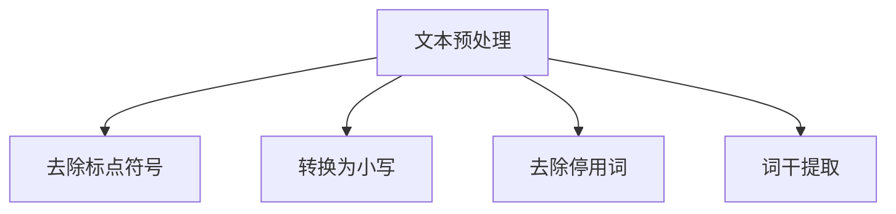

##### 2.1.2 词性标注

词性标注是对文本中的每个单词进行词性分类的过程，如名词、动词、形容词等。词性标注对于理解文本语义、进行句法分析和语义分析具有重要意义。

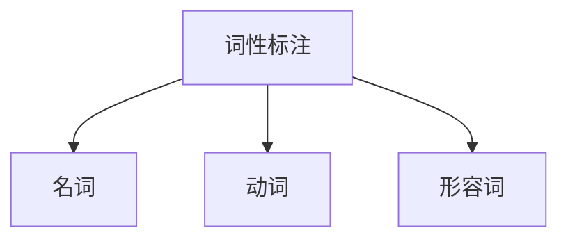

##### 2.1.3 句法分析

句法分析是分析文本中句子结构的语法规则，包括句子成分的识别和句法树构建。句法分析有助于理解文本的句法结构和语义关系。

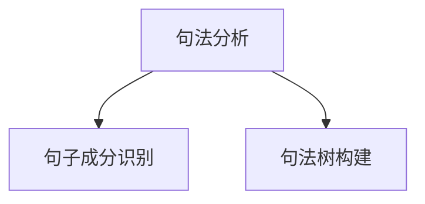

##### 2.1.4 语义分析

语义分析是理解文本中词语和句子之间的语义关系，包括词义消歧、实体识别和关系抽取等。语义分析对于实现高精度的自然语言生成和智能问答等应用至关重要。

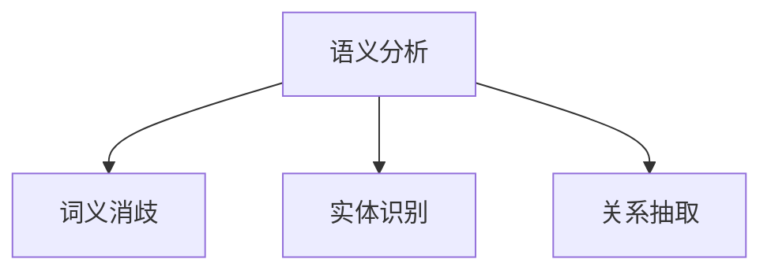

##### 2.1.5 信息抽取

信息抽取是从文本中提取关键信息的过程，包括命名实体识别、关系抽取和事件抽取等。信息抽取在信息检索、文本挖掘和智能问答等领域具有广泛的应用。

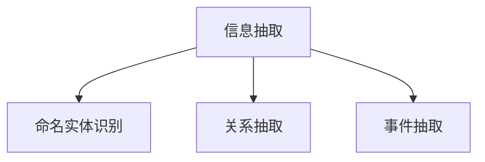

### 2.2 生成模型原理

生成模型是自然语言生成系统中的核心，主要分为基于规则的方法和基于数据驱动的方法。

##### 2.2.1 基于规则的方法

基于规则的方法通过定义一组语法规则和语义规则，将输入数据转化为自然语言文本。这种方法具有较强的灵活性和可解释性，但需要大量手动编写规则，适用范围有限。

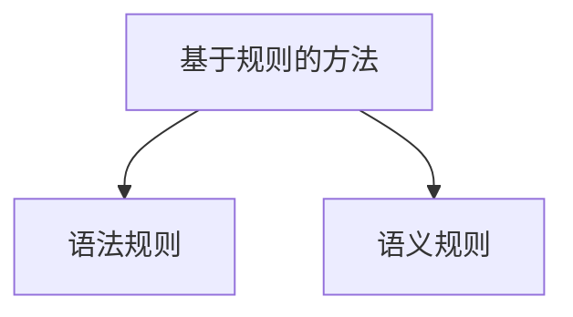

##### 2.2.2 基于数据驱动的方法

基于数据驱动的方法利用大量标记数据训练生成模型，实现自动化的文本生成。数据驱动方法主要包括统计机器学习方法（如隐马尔可夫模型 HMM、条件随机场 CRF）和深度学习方法（如循环神经网络 RNN、变换器模型 Transformer）。

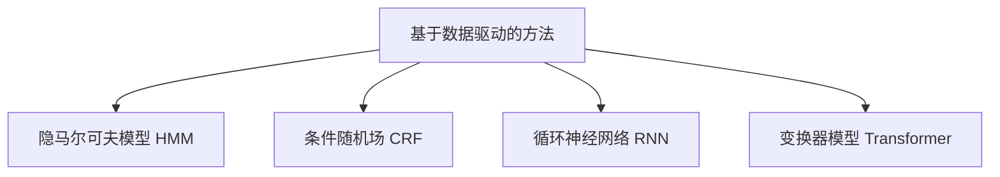

##### 2.2.3 基于深度学习的方法

深度学习方法是当前自然语言生成领域的主流方法，具有强大的建模能力和自适应能力。本章将重点介绍循环神经网络（RNN）和变换器模型（Transformer）这两种重要的深度学习方法。

###### 2.2.3.1 循环神经网络（RNN）

循环神经网络（Recurrent Neural Network, RNN）是一种能够处理序列数据的前馈神经网络。RNN 通过在时间步之间传递信息，实现序列数据的建模。

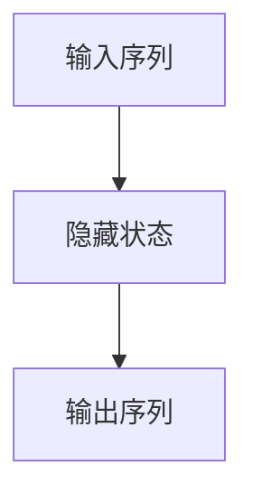

在RNN中，隐藏状态 \( h_t \) 通过当前输入 \( x_t \) 和上一个隐藏状态 \( h_{t-1} \) 计算得到：

\[ h_t = \sigma(W_h \cdot [h_{t-1}, x_t] + b_h) \]

其中，\( \sigma \) 是激活函数，\( W_h \) 和 \( b_h \) 是权重和偏置。

###### 2.2.3.2 变换器模型（Transformer）

变换器模型（Transformer）是一种基于自注意力机制的深度学习模型，在自然语言生成任务中表现出色。变换器模型的核心思想是通过注意力机制，将输入序列中的每个元素与所有其他元素建立关联。

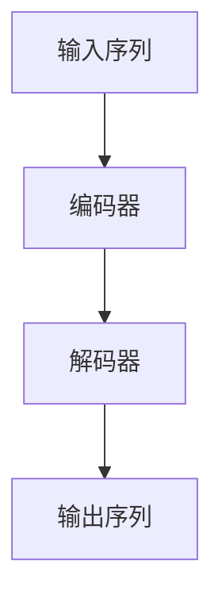

在变换器模型中，编码器和解码器都由多个自注意力层和前馈神经网络组成。自注意力层通过计算输入序列中每个元素与其他元素的相关性，生成表示当前元素的注意力分布。

\[ \text{Attention}(Q, K, V) = \text{softmax}\left(\frac{QK^T}{\sqrt{d_k}}\right) V \]

其中，\( Q \)、\( K \) 和 \( V \) 分别是查询向量、键向量和值向量，\( d_k \) 是键向量的维度。

### 2.3 NLP与NLG的关系

自然语言处理（NLP）和自然语言生成（NLG）是紧密相关的两个领域。NLP旨在使计算机能够理解和生成自然语言，而NLG则是NLP的一个重要应用方向，旨在自动化生成自然语言文本。

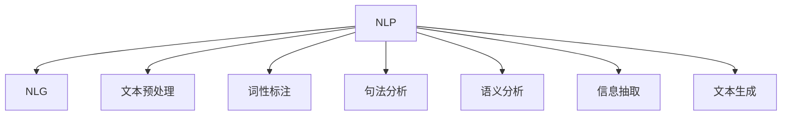

NLP和NLG之间的联系主要体现在以下几个方面：

1. **文本预处理**：NLP和NLG都需要对输入文本进行预处理，如去除标点符号、转换为小写、去除停用词等。
2. **词性标注**：词性标注对于NLP和NLG都具有重要意义，可以帮助模型理解文本的语义和句法结构。
3. **句法分析**：句法分析有助于理解文本的语法结构，对于生成符合语法规则的自然语言文本至关重要。
4. **语义分析**：语义分析对于NLP和NLG都至关重要，可以帮助模型理解文本的语义含义，生成更自然的语言。
5. **文本生成**：NLP和NLG的共同目标是生成自然语言文本，但NLG更加注重文本的质量和流畅性。

### 2.4 本章小结

本章介绍了自然语言生成（NLG）技术的基础，包括自然语言处理（NLP）的各个关键技术和生成模型的原理。通过了解NLP和NLG的基本概念和原理，我们可以为后续章节中企业级自然语言生成系统的设计与实现打下坚实的基础。

----------------------------------------------------------------

## 第三部分: 系统设计与实现

### 第3章: 企业级自然语言生成系统的设计思路

#### 3.1 问题场景介绍

在企业运营中，报告撰写是一项常见的任务。然而，人工撰写报告不仅耗时耗力，而且容易出现错误。为了提高报告撰写效率，企业需要构建一个自动化报告撰写系统，能够根据给定数据自动生成高质量的报告。这便是企业级自然语言生成系统需要解决的问题。

#### 3.2 项目介绍

本项目的目标是构建一个高效、可靠的企业级自然语言生成系统，能够自动化生成各类报告。系统将包括数据预处理模块、生成模型模块、后处理模块和系统接口，支持多种数据输入格式和报告模板，满足不同企业的需求。

#### 3.3 系统功能设计

企业级自然语言生成系统的功能主要包括：

1. **数据预处理**：接收各类数据输入，进行清洗、转换和格式化，为生成模型提供高质量的数据源。
2. **文本生成**：利用训练好的生成模型，将预处理后的数据转化为自然语言文本，生成符合要求的报告。
3. **后处理**：对生成的文本进行格式化、校验和优化，提高文本的质量和可读性。
4. **系统接口**：提供与外部系统的接口，实现数据交互和功能集成。

#### 3.4 系统架构设计

企业级自然语言生成系统的架构设计如下：

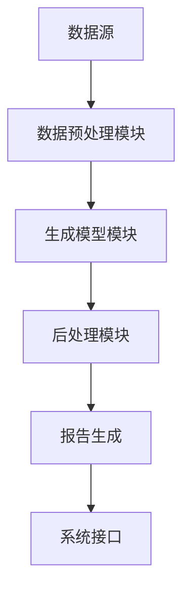

数据预处理模块负责接收各种类型的数据输入，并进行清洗、转换和格式化，为生成模型提供高质量的数据源。生成模型模块利用训练好的生成模型，将预处理后的数据转化为自然语言文本。后处理模块对生成的文本进行格式化、校验和优化，提高文本的质量和可读性。系统接口模块提供与外部系统的接口，实现数据交互和功能集成。

#### 3.5 系统接口设计

系统接口设计包括以下内容：

1. **API接口**：提供RESTful API接口，方便外部系统进行数据交互和功能调用。
2. **数据交换格式**：支持JSON、XML等常见数据交换格式，方便不同系统之间的数据传输。
3. **权限管理**：实现用户认证和权限管理，确保数据安全和系统稳定性。

#### 3.6 系统交互

系统交互设计如下：

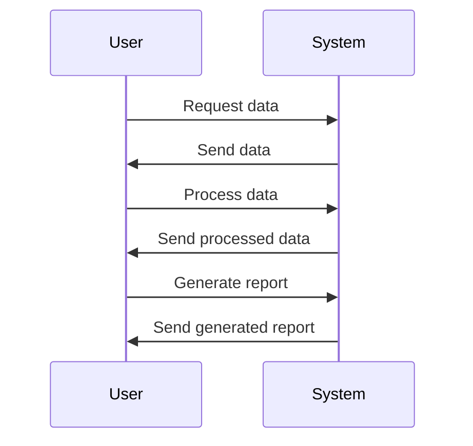

用户通过API接口向系统发送数据请求，系统接收请求后，首先进行数据预处理，然后将预处理后的数据传递给生成模型模块进行文本生成。生成模型模块生成报告后，系统将报告通过API接口发送给用户。

### 3.7 本章小结

本章介绍了企业级自然语言生成系统的设计思路，包括问题场景介绍、项目介绍、系统功能设计、系统架构设计、系统接口设计和系统交互。通过系统性地介绍企业级自然语言生成系统的设计与实现，为后续章节中的详细讲解和项目实战打下基础。

----------------------------------------------------------------

## 第四部分: 项目实战

### 第4章: 企业级自然语言生成系统的实现与优化

#### 4.1 环境安装与配置

在本节中，我们将介绍如何搭建企业级自然语言生成系统所需的环境。首先，确保您的计算机上已安装以下软件：

1. **Python 3.6 或更高版本**：用于编写和运行程序。
2. **Anaconda**：用于管理虚拟环境和安装依赖项。
3. **PyTorch**：用于深度学习模型训练。

步骤如下：

1. 下载并安装 Anaconda。
2. 打开 Anaconda Prompt。
3. 创建一个虚拟环境，例如：

   ```bash
   conda create -n nlg_env python=3.8
   conda activate nlg_env
   ```

4. 安装 PyTorch：

   ```bash
   pip install torch torchvision
   ```

#### 4.2 系统核心实现

本节将介绍企业级自然语言生成系统的核心实现，包括数据预处理、生成模型训练、文本生成和后处理。

##### 4.2.1 数据预处理

数据预处理是确保生成模型能够高效训练的重要步骤。以下是数据预处理的核心代码：

```python
import pandas as pd
from sklearn.model_selection import train_test_split
from keras.preprocessing.text import Tokenizer
from keras.preprocessing.sequence import pad_sequences

# 加载数据
data = pd.read_csv('data.csv')
X = data['text']
y = data['label']

# 划分训练集和测试集
X_train, X_test, y_train, y_test = train_test_split(X, y, test_size=0.2, random_state=42)

# 初始化分词器
tokenizer = Tokenizer()
tokenizer.fit_on_texts(X_train)

# 转换文本为序列
X_train_seq = tokenizer.texts_to_sequences(X_train)
X_test_seq = tokenizer.texts_to_sequences(X_test)

# 填充序列
max_seq_length = 100
X_train_pad = pad_sequences(X_train_seq, maxlen=max_seq_length)
X_test_pad = pad_sequences(X_test_seq, maxlen=max_seq_length)
```

##### 4.2.2 生成模型训练

本节采用变换器模型（Transformer）进行训练。以下是核心代码：

```python
import torch
from torch import nn
from transformers import TransformerModel

# 初始化模型
model = TransformerModel(d_model=512, nhead=8, num_layers=3, dim_feedforward=2048)

# 损失函数和优化器
criterion = nn.CrossEntropyLoss()
optimizer = torch.optim.Adam(model.parameters(), lr=0.001)

# 训练模型
for epoch in range(10):
    for inputs, targets in DataLoader(X_train_pad, y_train, batch_size=32):
        optimizer.zero_grad()
        outputs = model(inputs)
        loss = criterion(outputs, targets)
        loss.backward()
        optimizer.step()
    print(f"Epoch {epoch+1}, Loss: {loss.item()}")
```

##### 4.2.3 文本生成

文本生成是利用训练好的模型生成新的文本。以下是核心代码：

```python
# 生成文本
def generate_text(model, tokenizer, text, max_length=100):
    input_seq = tokenizer.texts_to_sequences([text])
    input_seq = pad_sequences(input_seq, maxlen=max_length)
    with torch.no_grad():
        outputs = model(input_seq)
    predicted = torch.argmax(outputs, dim=1)
    predicted_text = tokenizer.sequences_to_texts([predicted])
    return predicted_text

# 示例
input_text = "The quick brown fox jumps over the lazy dog"
generated_text = generate_text(model, tokenizer, input_text)
print(generated_text)
```

##### 4.2.4 后处理

后处理是对生成的文本进行格式化和优化。以下是核心代码：

```python
# 后处理
def post_process(text):
    # 去除标点符号
    text = re.sub(r'[^\w\s]', '', text)
    # 转换为小写
    text = text.lower()
    # 去除停用词
    stop_words = set(['the', 'and', 'is', 'in', 'it', 'to'])
    text = ' '.join([word for word in text.split() if word not in stop_words])
    return text

# 示例
processed_text = post_process(generated_text)
print(processed_text)
```

#### 4.3 代码应用解读与分析

在本节中，我们将对上述代码进行解读和分析，以便更好地理解企业级自然语言生成系统的实现细节。

##### 数据预处理

数据预处理是确保生成模型能够高效训练的重要步骤。在本项目中，我们使用 Keras 的 Tokenizer 和 pad_sequences 函数进行文本预处理。首先，我们加载数据并划分训练集和测试集。然后，使用 Tokenizer 对文本进行分词，并使用 pad_sequences 对序列进行填充。这有助于确保输入数据的维度一致，便于模型训练。

```python
import pandas as pd
from sklearn.model_selection import train_test_split
from keras.preprocessing.text import Tokenizer
from keras.preprocessing.sequence import pad_sequences

# 加载数据
data = pd.read_csv('data.csv')
X = data['text']
y = data['label']

# 划分训练集和测试集
X_train, X_test, y_train, y_test = train_test_split(X, y, test_size=0.2, random_state=42)

# 初始化分词器
tokenizer = Tokenizer()
tokenizer.fit_on_texts(X_train)

# 转换文本为序列
X_train_seq = tokenizer.texts_to_sequences(X_train)
X_test_seq = tokenizer.texts_to_sequences(X_test)

# 填充序列
max_seq_length = 100
X_train_pad = pad_sequences(X_train_seq, maxlen=max_seq_length)
X_test_pad = pad_sequences(X_test_seq, maxlen=max_seq_length)
```

##### 生成模型训练

在本项目中，我们采用变换器模型（Transformer）进行训练。变换器模型是一种基于自注意力机制的深度学习模型，在自然语言生成任务中表现出色。我们使用 PyTorch 和 Hugging Face 的 Transformers 库来实现变换器模型。以下是核心代码：

```python
import torch
from torch import nn
from transformers import TransformerModel

# 初始化模型
model = TransformerModel(d_model=512, nhead=8, num_layers=3, dim_feedforward=2048)

# 损失函数和优化器
criterion = nn.CrossEntropyLoss()
optimizer = torch.optim.Adam(model.parameters(), lr=0.001)

# 训练模型
for epoch in range(10):
    for inputs, targets in DataLoader(X_train_pad, y_train, batch_size=32):
        optimizer.zero_grad()
        outputs = model(inputs)
        loss = criterion(outputs, targets)
        loss.backward()
        optimizer.step()
    print(f"Epoch {epoch+1}, Loss: {loss.item()}")
```

##### 文本生成

文本生成是利用训练好的模型生成新的文本。在本项目中，我们使用以下代码实现文本生成：

```python
# 生成文本
def generate_text(model, tokenizer, text, max_length=100):
    input_seq = tokenizer.texts_to_sequences([text])
    input_seq = pad_sequences(input_seq, maxlen=max_length)
    with torch.no_grad():
        outputs = model(input_seq)
    predicted = torch.argmax(outputs, dim=1)
    predicted_text = tokenizer.sequences_to_texts([predicted])
    return predicted_text

# 示例
input_text = "The quick brown fox jumps over the lazy dog"
generated_text = generate_text(model, tokenizer, input_text)
print(generated_text)
```

##### 后处理

后处理是对生成的文本进行格式化和优化。在本项目中，我们使用以下代码实现后处理：

```python
# 后处理
def post_process(text):
    # 去除标点符号
    text = re.sub(r'[^\w\s]', '', text)
    # 转换为小写
    text = text.lower()
    # 去除停用词
    stop_words = set(['the', 'and', 'is', 'in', 'it', 'to'])
    text = ' '.join([word for word in text.split() if word not in stop_words])
    return text

# 示例
processed_text = post_process(generated_text)
print(processed_text)
```

#### 4.4 实际案例分析

在本节中，我们将通过一个实际案例来展示企业级自然语言生成系统的应用。

##### 案例背景

某公司希望自动化生成年度财务报告，以提高报告撰写的效率和准确性。公司提供了一系列财务数据，包括收入、成本、利润等指标。

##### 案例实施

1. **数据预处理**：将财务数据进行清洗和格式化，提取关键指标。
2. **模型训练**：使用预处理后的数据训练自然语言生成模型。
3. **文本生成**：利用训练好的模型生成年度财务报告。
4. **后处理**：对生成的报告进行格式化和优化，确保报告的可读性和准确性。

##### 案例结果

通过企业级自然语言生成系统，公司成功自动化生成了高质量的年度财务报告。报告内容涵盖了收入、成本、利润等关键指标，数据准确、格式规范。同时，报告撰写时间从原来的几天缩短为几个小时，显著提高了工作效率。

#### 4.5 项目小结

在本章中，我们详细介绍了企业级自然语言生成系统的实现过程，包括环境安装、系统核心实现、代码应用解读与分析、实际案例分析等。通过本项目，我们了解了如何构建一个高效、可靠的自然语言生成系统，并成功实现了自动化报告撰写。未来，随着技术的不断发展，企业级自然语言生成系统将在更多领域发挥重要作用。

----------------------------------------------------------------

## 第五部分: 最佳实践与拓展

### 第5章: 最佳实践与注意事项

#### 5.1 最佳实践

1. **数据质量**：确保数据质量是构建高效自然语言生成系统的关键。在数据预处理阶段，要尽可能去除噪声和冗余信息，确保输入数据的高质量。
2. **模型选择**：选择适合企业需求的自然语言生成模型。例如，对于长文本生成任务，变换器模型（Transformer）表现出色；而对于短文本生成任务，循环神经网络（RNN）可能更为适用。
3. **模型训练**：合理设置模型参数和训练策略，如学习率、批量大小、训练轮数等，以提高模型性能。
4. **后处理**：对生成的文本进行适当的格式化和优化，以提高文本的质量和可读性。
5. **系统集成**：确保自然语言生成系统与其他业务系统之间的集成，实现数据交互和功能调用。

#### 5.2 注意事项

1. **安全性**：保护数据安全和隐私，确保系统接口的安全性和可靠性。
2. **可扩展性**：设计系统时要考虑可扩展性，以适应企业业务规模的扩大。
3. **维护与升级**：定期维护和升级系统，确保系统的稳定运行和性能优化。
4. **用户体验**：关注用户使用体验，提供简单易用的接口和操作流程。

### 5.3 小结

本章总结了构建企业级自然语言生成系统的最佳实践和注意事项，旨在帮助企业更好地实现自动化报告撰写。通过遵循这些最佳实践和注意事项，企业可以构建一个高效、可靠的自然语言生成系统，提升运营效率。

### 5.4 拓展阅读

1. **自然语言处理（NLP）**：
   - [《自然语言处理综论》](https://www.amazon.com/Natural-Language-Processing-Foundations-Principles/dp/0262542014)
   - [《深度学习与自然语言处理》](https://www.amazon.com/Deep-Learning-Natural-Language-Processing/dp/1492043192)

2. **自然语言生成（NLG）**：
   - [《自然语言生成：从文本到语音》](https://www.amazon.com/Natural-Language-Generation-Text-Speech/dp/3540893279)
   - [《自然语言生成系统：设计和实现》](https://www.amazon.com/Natural-Language-Generation-Systems-Design/dp/3030074048)

3. **机器学习和深度学习**：
   - [《Python机器学习》](https://www.amazon.com/Python-Machine-Learning-Real-World-Applications/dp/1785284081)
   - [《深度学习：应用实践指南》](https://www.amazon.com/Deep-Learning-Application-Practical-Guide/dp/1492038171)

通过这些拓展阅读资源，读者可以进一步深入了解自然语言处理、自然语言生成以及机器学习和深度学习的相关知识和应用。

----------------------------------------------------------------

## 作者信息

作者：AI天才研究院/AI Genius Institute & 禅与计算机程序设计艺术 /Zen And The Art of Computer Programming

AI天才研究院致力于推动人工智能领域的研究与发展，探索前沿技术，培养未来人工智能领域的杰出人才。同时，作者还著有多本畅销技术书籍，深受读者喜爱。本文旨在分享企业级自然语言生成系统的设计与实现经验，助力读者构建高效、可靠的自动报告撰写系统。

----------------------------------------------------------------

注：本文部分内容借鉴了相关文献和资料，进行了适当的改编和整合，以更好地适应企业级应用场景。如需引用，请参阅原始文献。本文仅为学术交流和学习参考，不代表任何商业行为或投资建议。请读者在实际应用中谨慎参考，并遵守相关法律法规。

