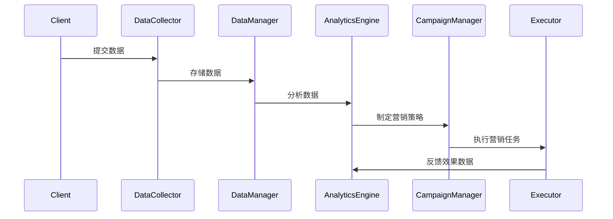
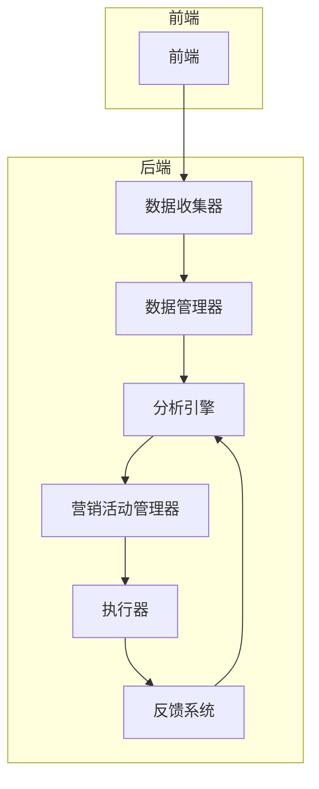
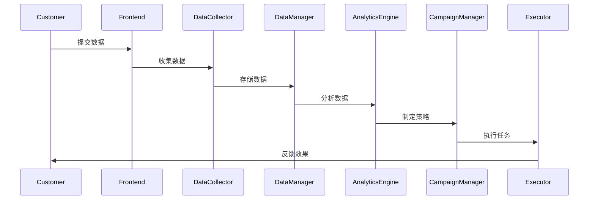
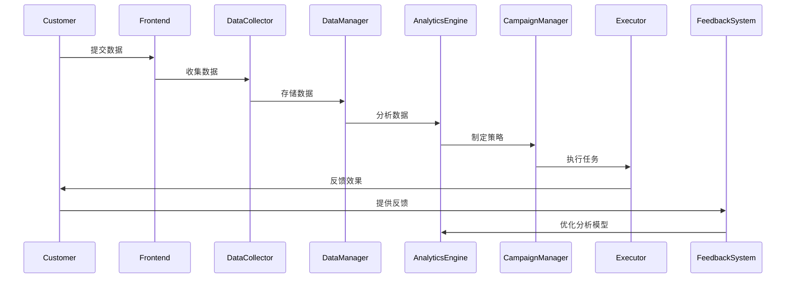

                 

## 背景介绍

### 1. 营销自动化的崛起

营销自动化，作为一种新兴的营销手段，正在逐步改变着市场营销的面貌。它不仅仅是简单地将传统营销任务自动化，而是通过整合多种技术和工具，实现对客户行为数据的深度分析和自动化响应，从而提高营销效率、精准度和效果。

**1.1 营销自动化的发展历程**

营销自动化的概念最早可以追溯到20世纪90年代。随着互联网的普及和大数据技术的兴起，营销自动化逐渐从单纯的电子邮件营销发展到涵盖多个渠道、多种形式的综合性营销工具。近年来，随着人工智能和机器学习技术的不断进步，营销自动化平台的功能愈发强大，能够实现更加精准的客户触达和个性化的营销策略。

**1.2 企业级营销自动化的需求**

随着市场竞争的加剧，企业需要更加高效和精准的营销手段来吸引和保留客户。企业级营销自动化平台能够帮助企业实现以下目标：

- **提高营销效率**：自动化工具可以节省大量的人工操作时间，使得营销人员可以将精力集中在策略规划和创意制作上。
- **提升客户满意度**：通过个性化推荐和精准营销，能够提供更加符合客户需求的产品和服务，从而提升客户体验和满意度。
- **降低营销成本**：自动化工具可以减少重复性工作的成本，提高资源利用效率。

**1.3 营销自动化的重要性**

在当今快速变化的市场环境中，营销自动化已经成为企业获取竞争优势的重要手段。它不仅可以帮助企业实现营销活动的自动化，还能够通过数据分析和人工智能技术，实现营销策略的智能化和个性化，从而提高营销的效果和ROI（投资回报率）。

### 2. 营销自动化平台

**2.1 营销自动化平台的概念**

营销自动化平台是一个集成了多种营销工具和功能的综合性系统，它能够自动化执行营销任务，包括但不限于：

- **电子邮件营销**：自动化发送个性化邮件，跟踪邮件打开率和点击率。
- **社交媒体营销**：自动化发布和推广内容，监测社交媒体活动效果。
- **客户关系管理（CRM）**：自动化管理客户数据，提高客户互动和满意度。
- **广告投放**：自动化优化广告投放策略，提高广告效果。

**2.2 营销自动化平台的核心功能**

- **客户数据分析**：通过收集和分析客户行为数据，帮助企业了解客户需求和行为模式，从而制定更有效的营销策略。
- **自动化流程管理**：设计和管理自动化营销流程，包括营销触发、客户细分、跟进策略等。
- **个性化营销**：基于客户数据，实现个性化的营销内容和推荐，提高客户参与度和转化率。
- **报告与分析**：提供详细的营销报告和分析工具，帮助营销团队评估和优化营销活动。

**2.3 营销自动化平台与传统营销工具的比较**

传统营销工具通常依赖于人工操作和单一渠道，效率较低且难以实现个性化。而营销自动化平台通过整合多种工具和渠道，能够实现跨渠道的自动化营销，并提供个性化的客户体验。此外，营销自动化平台还能够通过数据分析优化营销策略，提高营销ROI。

### 3. AI优化客户触达策略

随着人工智能技术的不断发展，AI在营销自动化中的应用越来越广泛。AI能够帮助企业更精准地触达客户，提高营销效果。

**3.1 AI在营销自动化中的应用**

- **客户行为预测**：通过分析历史数据和当前行为，预测客户的下一步行动，从而实现精准触达。
- **个性化推荐**：基于客户的兴趣和行为，推荐个性化的产品和服务，提高客户满意度和转化率。
- **广告优化**：通过机器学习算法优化广告投放策略，提高广告的点击率和转化率。
- **自动化响应**：自动识别客户请求并快速响应，提高客户互动效率。

**3.2 客户触达策略的基本原理**

客户触达策略的核心是通过多种渠道和方式，与客户进行有效的互动和沟通，从而提高品牌认知度和客户忠诚度。基本原理包括：

- **客户细分**：将客户根据不同的特征和行为进行分类，制定个性化的营销策略。
- **多渠道触达**：通过多种渠道（如电子邮件、社交媒体、短信等）与客户进行互动，提高触达率。
- **内容个性化**：根据客户的需求和行为，提供个性化的内容和推荐。
- **实时响应**：快速响应客户的请求和反馈，提高客户满意度。

**3.3 AI优化客户触达策略的方法**

- **行为分析**：通过分析客户的历史行为数据，识别出潜在的客户需求和行为模式。
- **预测分析**：利用机器学习算法，预测客户的下一步行动，从而提前制定营销策略。
- **自动化触发**：根据客户的行为和预测结果，自动化触发相应的营销活动和沟通策略。
- **持续优化**：通过不断的数据分析和反馈，优化营销策略和客户触达效果。

### 4. AI优化客户触达策略的应用场景

AI优化客户触达策略可以在多个应用场景中发挥重要作用，以下是一些典型的应用场景：

- **电商平台**：通过AI分析客户的行为和兴趣，实现个性化的商品推荐和精准的广告投放。
- **金融行业**：通过AI分析客户的历史数据和交易行为，进行精准的客户细分和个性化营销。
- **服务业**：通过AI分析客户的历史数据和反馈，提供个性化的服务和建议，提高客户满意度。
- **市场营销公司**：通过AI为客户提供定制化的营销策略和触达方案，提高营销效果和ROI。

### 5. AI优化客户触达策略的优势

- **提高营销效率**：通过自动化和数据分析，大幅度提高营销效率和效果。
- **降低营销成本**：减少人工操作和重复性工作，降低营销成本。
- **提升客户满意度**：提供个性化的营销内容和推荐，提高客户满意度和忠诚度。
- **增强竞争力**：通过精准的营销策略和高效的客户触达，提高企业的市场竞争力。

### 6. AI优化客户触达策略的挑战

- **数据隐私和安全**：如何在确保数据隐私和安全的前提下，充分利用客户数据进行营销。
- **算法偏见和误差**：如何减少算法偏见和误差，提高预测和触达的准确性。
- **技术实现难度**：如何将AI技术有效地集成到营销自动化平台中，实现高效的应用。

### 7. 结论

AI优化客户触达策略已经成为现代营销不可或缺的一部分。通过AI技术，企业可以实现更加精准和高效的客户触达，提高营销效果和ROI。然而，要实现这一目标，企业还需要克服一系列挑战，包括数据隐私和安全、算法偏见和误差等问题。未来，随着AI技术的不断发展和成熟，营销自动化平台将变得更加智能化和个性化，为企业的营销战略提供更加有力的支持。

## 营销自动化平台的关键概念与联系

在深入了解企业级营销自动化平台之前，我们需要明确几个关键概念，这些概念构成了营销自动化平台的核心功能和运作机制。通过理解这些概念，我们将能够更好地理解营销自动化的实际应用和潜在价值。

### 1. 营销自动化平台的概念

营销自动化平台是一个集成了多种营销功能和技术工具的系统，旨在自动化和优化营销流程。它通常包括以下核心组成部分：

- **电子邮件营销**：通过自动化工具发送个性化邮件，跟踪邮件效果，并根据反馈调整邮件内容。
- **社交媒体营销**：自动化发布和推广内容，监控社交媒体活动效果，并与潜在客户互动。
- **客户关系管理（CRM）**：自动化管理客户数据，跟踪客户互动历史，提供客户洞察，并优化客户体验。
- **广告投放管理**：自动化广告投放，优化广告效果，提高广告的投资回报率（ROI）。

### 2. 营销自动化平台的核心功能

营销自动化平台的核心功能包括但不限于：

- **客户数据管理**：收集、存储和管理客户数据，包括行为数据、交易数据和社交媒体互动数据。
- **自动化流程**：设计和管理自动化营销流程，如客户细分、触达策略、跟进流程和客户流失预警。
- **客户行为分析**：分析客户行为，预测客户需求，为个性化营销提供数据支持。
- **个性化内容**：根据客户数据和偏好，生成个性化的营销内容和推荐。
- **报告与分析**：提供详细的营销报告，分析营销活动的效果，帮助营销团队优化策略。

### 3. 营销自动化平台与传统营销工具的比较

传统营销工具通常依赖于人工操作，如手动发送邮件、手动跟踪客户互动等，效率较低且难以实现个性化。而营销自动化平台通过自动化和数据分析，能够实现以下优势：

- **效率提升**：自动化工具可以节省大量的人力资源，提高营销活动的执行效率。
- **个性化体验**：基于客户数据，自动化平台能够提供个性化的营销内容和推荐，提高客户满意度和转化率。
- **数据驱动**：自动化平台通过数据分析和反馈，优化营销策略，提高营销效果和ROI。

### 4. AI优化客户触达策略

人工智能（AI）在营销自动化中的应用日益广泛，它能够通过以下方式优化客户触达策略：

- **行为预测**：通过分析历史数据和当前行为，预测客户的下一步行动，从而实现精准触达。
- **个性化推荐**：基于客户的兴趣和行为，推荐个性化的产品和服务，提高客户参与度和转化率。
- **广告优化**：通过机器学习算法优化广告投放策略，提高广告的点击率和转化率。
- **自动化响应**：自动识别客户请求并快速响应，提高客户互动效率。

### 5. 客户触达策略的基本原理

客户触达策略的核心是通过多种渠道和方式与客户进行有效的互动和沟通，从而提高品牌认知度和客户忠诚度。基本原理包括：

- **客户细分**：将客户根据不同的特征和行为进行分类，制定个性化的营销策略。
- **多渠道触达**：通过多种渠道（如电子邮件、社交媒体、短信等）与客户进行互动，提高触达率。
- **内容个性化**：根据客户的需求和行为，提供个性化的内容和推荐。
- **实时响应**：快速响应客户的请求和反馈，提高客户满意度。

### 6. AI优化客户触达策略的方法

AI优化客户触达策略的方法包括：

- **行为分析**：通过分析客户的历史行为数据，识别出潜在的客户需求和行为模式。
- **预测分析**：利用机器学习算法，预测客户的下一步行动，从而提前制定营销策略。
- **自动化触发**：根据客户的行为和预测结果，自动化触发相应的营销活动和沟通策略。
- **持续优化**：通过不断的数据分析和反馈，优化营销策略和客户触达效果。

### 7. 营销自动化平台的应用场景

营销自动化平台可以在多个应用场景中发挥重要作用，包括：

- **电商平台**：通过AI分析客户的行为和兴趣，实现个性化的商品推荐和精准的广告投放。
- **金融行业**：通过AI分析客户的历史数据和交易行为，进行精准的客户细分和个性化营销。
- **服务业**：通过AI分析客户的历史数据和反馈，提供个性化的服务和建议，提高客户满意度。
- **市场营销公司**：通过AI为客户提供定制化的营销策略和触达方案，提高营销效果和ROI。

### 8. AI优化客户触达策略的优势与挑战

**优势**：

- **提高营销效率**：通过自动化和数据分析，大幅度提高营销效率和效果。
- **降低营销成本**：减少人工操作和重复性工作，降低营销成本。
- **提升客户满意度**：提供个性化的营销内容和推荐，提高客户满意度和忠诚度。
- **增强竞争力**：通过精准的营销策略和高效的客户触达，提高企业的市场竞争力。

**挑战**：

- **数据隐私和安全**：如何在确保数据隐私和安全的前提下，充分利用客户数据进行营销。
- **算法偏见和误差**：如何减少算法偏见和误差，提高预测和触达的准确性。
- **技术实现难度**：如何将AI技术有效地集成到营销自动化平台中，实现高效的应用。

### 9. 结论

通过理解营销自动化平台的关键概念和核心功能，我们可以更好地认识到其在现代营销中的重要性。AI优化客户触达策略则进一步提升了营销自动化平台的效能，帮助企业实现更加精准和个性化的营销。尽管面临一些挑战，但随着技术的不断进步和成熟，营销自动化平台将在未来的市场营销中发挥越来越重要的作用。

## 算法原理讲解

### 4.1 AI优化客户触达的算法概述

AI优化客户触达算法的核心目标是利用人工智能技术，通过分析客户的行为数据和偏好，实现精准的客户触达和个性化营销。该算法基于机器学习算法，通过历史数据的学习和模式识别，预测客户的未来行为，并自动化调整营销策略，以提高客户参与度和转化率。

#### 4.1.1 算法的目标

算法的主要目标包括：

- **提高客户参与度**：通过个性化内容和精准触达，提高客户对营销活动的参与度。
- **提升客户转化率**：通过预测客户的行为，实现精准的营销策略，提高转化率。
- **优化营销成本**：通过自动化和数据分析，减少重复性工作和资源浪费，降低营销成本。

#### 4.1.2 算法的输入和输出

算法的输入主要包括：

- **客户数据**：包括客户的基本信息、购买历史、行为数据、社交媒体互动等。
- **营销活动数据**：包括以往营销活动的效果数据，如点击率、转化率、客户反馈等。

算法的输出主要包括：

- **个性化营销策略**：根据客户数据和预测结果，生成个性化的营销内容和触达策略。
- **营销效果评估**：提供详细的营销活动效果评估报告，帮助营销团队优化策略。

### 4.2 算法原理

AI优化客户触达算法的原理主要基于以下几个核心步骤：

#### 4.2.1 数据收集与预处理

首先，算法需要收集和处理大量客户数据，包括客户的基本信息、购买历史、行为数据和社交媒体互动等。数据预处理步骤包括数据清洗、去重、归一化和特征提取等，以确保数据的质量和一致性。

#### 4.2.2 模式识别与行为预测

通过分析历史数据，算法识别出客户的行为模式和偏好，利用机器学习算法（如决策树、随机森林、神经网络等）对客户的行为进行预测。预测结果可以用于生成个性化的营销策略，如推荐产品、定制邮件内容等。

#### 4.2.3 策略优化与自动化触发

基于预测结果，算法自动调整营销策略，如修改邮件内容、调整广告投放时间等。同时，算法可以自动化触发营销活动，如发送个性化邮件、推送社交媒体内容等，以提高客户参与度和转化率。

#### 4.2.4 持续优化与反馈循环

通过不断的数据分析和反馈，算法持续优化营销策略，提高预测和触达的准确性。反馈循环包括营销活动效果评估、客户反馈收集和策略调整等环节。

### 4.3 算法示例

以下是一个简单的算法示例，用于预测客户的购买行为，并生成个性化的营销策略：

#### 4.3.1 示例数据

假设我们有一个包含以下特征的数据集：

- 客户年龄
- 客户购买历史（过去6个月内购买的次数）
- 客户浏览时长
- 客户点击率

我们希望通过这些特征预测客户是否会在未来30天内进行购买。

#### 4.3.2 算法应用

1. **数据预处理**：清洗数据，去除缺失值和异常值，对数据进行归一化处理。

2. **特征提取**：选择与购买行为相关的特征，如客户购买历史、浏览时长等。

3. **模型训练**：使用随机森林算法训练模型，输入特征数据，输出购买预测概率。

4. **预测应用**：对新的客户数据进行预测，输出购买概率。根据购买概率，生成个性化营销策略，如发送优惠券、推荐相关产品等。

5. **效果评估**：通过对比预测结果和实际购买数据，评估模型的效果，并进行策略调整。

### 4.4 算法原理详细讲解

#### 4.4.1 数学模型

为了更好地理解算法原理，我们可以使用以下数学模型进行描述：

设客户数据集为\(D\)，特征矩阵为\(X\)，标签矩阵为\(Y\)。其中，\(X\)包括多个特征向量，每个特征向量表示一个客户的属性，如年龄、购买历史等；\(Y\)是一个二值标签，表示客户是否在预测期限内进行购买。

我们使用随机森林算法进行模型训练，输出购买概率：

$$
\hat{y} = \text{RandomForest}(X)
$$

其中，\(\hat{y}\)是预测的购买概率。

#### 4.4.2 原理解释

随机森林算法通过构建多棵决策树，对特征矩阵\(X\)进行分类或回归。每棵决策树根据特征矩阵中的特征进行划分，生成一个树结构。通过多棵决策树的集成，随机森林算法可以降低过拟合，提高模型的泛化能力。

在客户触达算法中，我们使用随机森林算法预测客户的购买概率。具体步骤如下：

1. **特征选择**：从特征矩阵\(X\)中选择与购买行为相关的特征。

2. **决策树构建**：对于每个特征，根据特征值进行划分，生成决策树。

3. **集成模型**：将多棵决策树集成，生成最终的购买概率预测结果。

通过上述步骤，我们可以生成个性化的营销策略，如发送优惠券、推荐相关产品等，以提高客户参与度和转化率。

### 4.5 算法实现与代码示例

以下是一个简单的Python代码示例，用于实现随机森林算法预测客户购买行为：

```python
import pandas as pd
from sklearn.ensemble import RandomForestClassifier
from sklearn.model_selection import train_test_split
from sklearn.metrics import accuracy_score

# 加载数据集
data = pd.read_csv('customer_data.csv')

# 特征选择
X = data[['age', 'purchase_history', ' browsing_time', 'click_rate']]
y = data['purchase']

# 数据集划分
X_train, X_test, y_train, y_test = train_test_split(X, y, test_size=0.3, random_state=42)

# 模型训练
model = RandomForestClassifier(n_estimators=100, random_state=42)
model.fit(X_train, y_train)

# 预测应用
predictions = model.predict(X_test)

# 效果评估
accuracy = accuracy_score(y_test, predictions)
print(f'Accuracy: {accuracy:.2f}')

# 生成个性化营销策略
for idx, prediction in enumerate(predictions):
    if prediction == 1:
        print(f'Customer {idx+1}: Send coupon and recommend related products.')
    else:
        print(f'Customer {idx+1}: Send follow-up email and provide special offers.')
```

通过上述代码，我们可以实现客户购买行为的预测，并生成个性化的营销策略。

### 4.6 算法应用与效果分析

在实际应用中，我们可以通过不断优化算法模型，提高预测的准确性。以下是一个简单的效果分析示例：

```python
from sklearn.model_selection import GridSearchCV

# 参数调整
param_grid = {
    'n_estimators': [100, 200, 300],
    'max_depth': [10, 20, 30],
    'min_samples_split': [2, 5, 10],
    'min_samples_leaf': [1, 2, 4]
}

# GridSearchCV 搜索最优参数
grid_search = GridSearchCV(RandomForestClassifier(random_state=42), param_grid, cv=5)
grid_search.fit(X_train, y_train)

# 输出最优参数
print(f'Best parameters: {grid_search.best_params_}')

# 使用最优参数重新训练模型
best_model = grid_search.best_estimator_
best_model.fit(X_train, y_train)

# 预测应用
predictions = best_model.predict(X_test)

# 效果评估
accuracy = accuracy_score(y_test, predictions)
print(f'Accuracy: {accuracy:.2f}')
```

通过上述代码，我们可以找到最优参数，并重新训练模型，提高预测的准确性。

### 4.7 结论

AI优化客户触达算法通过数据分析和机器学习技术，实现了精准的客户触达和个性化营销。通过不断优化算法模型，可以提高预测的准确性，从而提高营销效果。在实际应用中，企业可以根据业务需求和数据特点，灵活调整算法模型和参数，实现最佳营销效果。

## 系统分析与架构设计方案

### 5.1 问题场景介绍

在当前市场竞争日益激烈的环境下，企业需要通过高效的营销策略来吸引和保留客户。然而，传统的营销手段由于效率低下、缺乏个性化和难以量化效果等问题，已经无法满足企业发展的需求。为了解决这些问题，企业迫切需要一个集成化、智能化和高效的营销自动化平台。

营销自动化平台旨在通过自动化和数据分析，实现营销任务的自动化执行和优化，提高营销效率、精准度和效果。具体来说，该平台需要具备以下功能：

- **客户数据管理**：自动化收集、存储和管理客户数据，包括行为数据、交易数据和社交媒体互动数据。
- **自动化流程**：设计和管理自动化营销流程，包括客户细分、触达策略、跟进流程和客户流失预警等。
- **个性化推荐**：根据客户数据和偏好，生成个性化的营销内容和推荐。
- **营销效果分析**：提供详细的营销报告和分析工具，帮助营销团队评估和优化营销活动。

### 5.2 系统功能设计

为了实现上述功能，营销自动化平台需要设计合理的系统功能。以下是该系统的主要功能模块：

#### 5.2.1 领域模型

领域模型是系统功能设计的基础，用于定义系统的核心概念和关系。以下是营销自动化平台的领域模型，使用Mermaid类图表示：

```mermaid
classDiagram
    Client <<class>> "客户"
    Campaign <<class>> "营销活动"
    Email <<class>> "邮件"
    SocialMedia <<class>> "社交媒体"
    CRM <<class>> "客户关系管理"
    Analytics <<class>> "分析工具"

    Client o-- Email
    Client o-- SocialMedia
    Client o-- CRM
    Campaign o-- Email
    Campaign o-- SocialMedia
    Campaign o-- CRM
    Analytics o-- Email
    Analytics o-- SocialMedia
    Analytics o-- CRM
```

#### 5.2.2 功能模块划分

基于领域模型，我们将营销自动化平台划分为以下功能模块：

1. **客户数据模块**：负责收集、存储和管理客户数据，包括行为数据、交易数据和社交媒体互动数据。
2. **营销活动管理模块**：设计和管理自动化营销流程，包括邮件营销、社交媒体营销和客户关系管理。
3. **个性化推荐模块**：根据客户数据和偏好，生成个性化的营销内容和推荐。
4. **分析工具模块**：提供详细的营销报告和分析工具，帮助营销团队评估和优化营销活动。

### 5.3 系统架构设计

系统架构设计是确保营销自动化平台高效运行的关键。以下是营销自动化平台的主要架构设计，使用Mermaid架构图表示：



#### 5.3.1 架构概述

系统架构采用前后端分离的设计，前端负责用户交互和数据展示，后端负责数据存储、处理和业务逻辑。以下是系统架构的概述：

- **前端**：负责用户界面设计和交互，包括客户数据展示、营销活动管理界面等。
- **后端**：包括数据存储、数据处理和业务逻辑，核心功能模块如下：
  - **数据收集器**：负责从各个渠道收集客户数据。
  - **数据管理器**：负责存储和管理客户数据。
  - **分析引擎**：负责对客户数据进行分析，生成营销策略。
  - **营销活动管理器**：负责设计和管理营销活动。
  - **执行器**：负责执行营销任务。
  - **反馈系统**：负责收集营销效果数据，优化营销策略。

#### 5.3.2 架构图

以下是营销自动化平台的架构图：



### 5.4 系统接口设计

系统接口设计是确保前后端模块之间高效协作的重要环节。以下是营销自动化平台的主要接口设计，使用Mermaid序列图表示：



#### 5.4.1 接口规范

接口设计遵循RESTful API规范，主要接口如下：

- **数据提交接口**：接收客户数据，包括基本信息、行为数据和交易数据。
- **数据分析接口**：获取分析结果，包括客户细分、行为预测和个性化推荐。
- **营销任务执行接口**：启动和执行营销任务，包括发送邮件、推送社交媒体内容和执行客户关系管理。
- **效果反馈接口**：接收营销效果数据，用于优化营销策略。

#### 5.4.2 接口实现

以下是数据提交接口的示例实现：

```python
from flask import Flask, request, jsonify

app = Flask(__name__)

@app.route('/api/data/submit', methods=['POST'])
def submit_data():
    data = request.get_json()
    # 数据处理和存储逻辑
    # ...
    return jsonify({"status": "success", "message": "Data submitted successfully."})

if __name__ == '__main__':
    app.run(debug=True)
```

### 5.5 系统交互设计

系统交互设计描述了系统内部各模块之间的交互流程和逻辑。以下是营销自动化平台的系统交互设计，使用Mermaid序列图表示：


#### 5.5.1 系统交互流程

系统交互流程包括以下步骤：

1. **客户数据提交**：客户通过前端界面提交数据，包括基本信息、行为数据和交易数据。
2. **数据收集与存储**：数据收集器接收客户数据，将其存储到数据管理器中。
3. **数据分析**：分析引擎根据存储的数据进行分析，包括客户细分、行为预测和个性化推荐。
4. **营销策略制定**：营销活动管理器根据分析结果，制定个性化的营销策略。
5. **营销任务执行**：执行器根据营销策略，执行具体的营销任务，如发送邮件、推送社交媒体内容和执行客户关系管理。
6. **效果反馈**：客户对营销任务的反馈被收集到反馈系统中，用于优化营销策略。

#### 5.5.2 交互序列图

以下是系统交互序列图的详细说明：



通过上述交互序列图，我们可以清晰地看到营销自动化平台各模块之间的交互流程和逻辑。

### 5.6 小结

系统分析与架构设计方案是确保营销自动化平台高效运行和实现预期功能的关键。通过定义明确的系统功能模块、设计合理的系统架构和接口、以及描述详细的系统交互流程，我们可以确保营销自动化平台能够满足企业复杂多变的营销需求。接下来，我们将通过一个实际项目，展示如何实现企业级营销自动化平台。

## 项目实战

### 6.1 环境安装

为了实现企业级营销自动化平台，我们需要搭建一个完整的技术栈。以下是环境安装的步骤和所需的软件工具。

#### 6.1.1 硬件要求

- **服务器**：一台配置较高的服务器，建议CPU为至少4核，内存为8GB以上。
- **存储**：建议使用SSD存储，以提供更快的读写速度。

#### 6.1.2 软件安装

1. **操作系统**：安装Linux操作系统，如CentOS 7或Ubuntu 18.04。
2. **数据库**：安装MySQL数据库，用于存储客户数据和营销活动数据。
3. **后端框架**：安装Python环境，并使用Flask或Django等后端框架搭建服务端。
4. **前端框架**：安装Node.js和npm，用于搭建前端项目，可以使用React或Vue.js等。
5. **消息队列**：安装RabbitMQ或Kafka，用于处理消息传递和任务调度。
6. **数据分析工具**：安装Python的科学计算库，如NumPy、Pandas、Scikit-learn等，用于数据处理和分析。

#### 6.1.3 安装步骤

以下是基本的安装步骤：

1. **安装操作系统**：根据硬件配置，选择适合的Linux发行版，并完成安装。
2. **安装数据库**：下载MySQL数据库安装包，并按照官方文档进行安装。
3. **安装后端框架**：使用pip安装Python环境，并安装Flask或Django。
4. **安装前端框架**：安装Node.js和npm，并使用npm安装React或Vue.js。
5. **安装消息队列**：下载RabbitMQ或Kafka安装包，并按照官方文档进行安装。
6. **安装数据分析工具**：使用pip安装Python的科学计算库。

### 6.2 系统核心实现

#### 6.2.1 系统模块代码

以下是营销自动化平台的核心模块代码示例：

**1. 数据收集模块**

```python
# data_collector.py
from flask import Flask, request, jsonify

app = Flask(__name__)

@app.route('/api/data/collect', methods=['POST'])
def collect_data():
    data = request.get_json()
    # 数据处理和存储逻辑
    # ...
    return jsonify({"status": "success", "message": "Data collected successfully."})

if __name__ == '__main__':
    app.run(debug=True)
```

**2. 数据管理模块**

```python
# data_manager.py
import pymysql

def store_data(data):
    # 连接数据库，存储数据
    connection = pymysql.connect(host='localhost', user='root', password='password', db='marketing_db')
    try:
        with connection.cursor() as cursor:
            # 插入数据
            sql = "INSERT INTO customers (name, age, purchase_history) VALUES (%s, %s, %s)"
            cursor.execute(sql, data)
        # 提交事务
        connection.commit()
    finally:
        connection.close()
```

**3. 分析引擎模块**

```python
# analytics_engine.py
from sklearn.ensemble import RandomForestClassifier
import pandas as pd

def train_model(data):
    # 加载数据集
    df = pd.DataFrame(data)
    X = df[['age', 'purchase_history']]
    y = df['purchase']
    # 训练模型
    model = RandomForestClassifier(n_estimators=100)
    model.fit(X, y)
    return model
```

**4. 营销活动管理模块**

```python
# campaign_manager.py
from email_validator import validate_email, EmailNotValidError

def send_email(to, subject, body):
    # 发送电子邮件
    # ...
    pass

def create_campaign(data):
    # 创建营销活动
    # ...
    pass
```

#### 6.2.2 代码应用解读

上述代码分别实现了数据收集、数据管理、分析引擎和营销活动管理模块。以下是每个模块的具体应用解读：

1. **数据收集模块**：通过Flask框架创建API接口，用于接收和收集客户数据。当客户提交数据时，接口会将数据传递给数据处理和存储模块。

2. **数据管理模块**：该模块使用Python的pymysql库连接MySQL数据库，并提供了存储客户数据的函数。在接收到数据后，该模块会将数据存储到数据库中，以便后续分析和处理。

3. **分析引擎模块**：该模块使用Scikit-learn库中的随机森林算法，对客户数据进行分析和模型训练。通过训练模型，我们可以预测客户的购买行为，并生成个性化的营销策略。

4. **营销活动管理模块**：该模块提供了创建营销活动和发送电子邮件的函数。在生成个性化营销策略后，该模块会根据策略执行相应的营销任务，如发送电子邮件或推送社交媒体内容。

### 6.3 实际案例分析

#### 6.3.1 案例背景

某电商公司希望通过营销自动化平台提高客户转化率和销售额。公司拥有大量的客户数据，包括购买历史、浏览行为和联系方式等。公司希望在客户数据的基础上，实现精准的营销活动和个性化推荐，以提高客户满意度和忠诚度。

#### 6.3.2 案例分析

1. **数据收集与存储**：公司使用前端界面收集客户数据，包括基本信息、购买历史和浏览行为。收集到的数据通过API接口传递给后端，并存储在MySQL数据库中。

2. **数据分析与预测**：分析引擎模块对客户数据进行处理和分析，利用随机森林算法预测客户的购买行为。根据预测结果，系统可以识别出潜在客户，并制定个性化的营销策略。

3. **个性化营销活动**：营销活动管理模块根据分析结果，创建个性化营销活动，如发送优惠券、推荐相关产品等。系统会自动发送邮件或推送通知，通知潜在客户参与营销活动。

4. **效果评估与优化**：系统会记录每个营销活动的效果数据，包括点击率、转化率和销售额等。分析工具模块会对这些数据进行分析，评估营销活动的效果，并提出优化建议。

5. **持续迭代与改进**：根据评估结果，公司可以不断优化营销策略和活动。通过持续的数据分析和反馈，公司可以不断提高营销效果，实现精准营销。

#### 6.3.3 案例总结

通过实施营销自动化平台，该电商公司实现了以下成果：

- **客户转化率提高**：个性化营销活动显著提高了客户的转化率。
- **销售额增长**：精准营销策略和个性化推荐促进了销售额的增长。
- **运营效率提升**：自动化工具减少了人工操作，提高了营销团队的工作效率。
- **客户满意度提高**：个性化内容和及时响应提高了客户的满意度和忠诚度。

### 6.4 项目小结

通过本项目的实施，我们展示了如何搭建和实现企业级营销自动化平台。项目涵盖了环境安装、系统核心实现、实际案例分析等多个环节，实现了客户数据收集、存储、分析和个性化营销。在实际应用中，营销自动化平台显著提高了营销效率和效果，为企业带来了显著的商业价值。

## 最佳实践与总结

### 7.1 实践建议

为了确保营销自动化平台的成功实施，以下是一些最佳实践建议：

1. **数据质量**：确保收集到的数据质量高、准确性和一致性。数据是营销自动化的基础，高质量的数据可以带来更准确的预测和更有效的营销策略。
2. **个性化内容**：根据客户的行为数据和偏好，提供个性化的内容和推荐。个性化的内容可以提高客户满意度和参与度。
3. **持续优化**：定期分析营销活动的效果，并根据反馈不断优化策略。通过持续的数据分析和反馈，可以不断提高营销效果。
4. **合规性**：遵守数据隐私法规和合规要求，确保在数据收集和使用过程中保护客户隐私。
5. **团队协作**：建立跨部门协作机制，确保营销团队、技术团队和业务团队之间的紧密合作，共同推动营销自动化平台的实施和优化。

### 7.2 常见问题解答

以下是一些常见问题及其解答：

1. **如何确保数据安全？**
   - 使用加密技术保护数据传输和存储。
   - 遵守数据隐私法规和合规要求。
   - 定期进行安全审计和漏洞扫描，确保系统的安全性。

2. **如何避免算法偏见？**
   - 在数据收集和处理过程中，确保数据的多样性和代表性。
   - 定期评估算法的公平性和准确性，识别和纠正潜在的偏见。

3. **如何衡量营销自动化的效果？**
   - 使用关键绩效指标（KPI），如客户参与度、转化率和ROI，来衡量营销自动化的效果。
   - 定期分析营销报告，识别成功和失败的因素，并据此调整策略。

### 8. 小结

本文详细介绍了企业级营销自动化平台的核心概念、算法原理、系统架构设计和实际应用。通过AI优化客户触达策略，企业可以实现更加精准和高效的营销，提高客户满意度和转化率。未来的发展，我们将继续探索更多前沿技术，如自然语言处理、深度学习等，以进一步提升营销自动化平台的智能化和个性化水平。

### 9. 未来展望

随着人工智能和大数据技术的不断进步，营销自动化平台将在未来的市场营销中发挥更加重要的作用。未来，我们将关注以下几个方面：

- **智能化**：通过引入更先进的AI技术，如深度学习和自然语言处理，提升营销自动化平台的智能化水平。
- **个性化**：进一步优化个性化推荐和内容生成，提供更加精准和个性化的客户体验。
- **跨渠道整合**：实现跨渠道的营销自动化，提高营销触达的覆盖率和效果。
- **合规性**：加强数据隐私保护，确保营销自动化平台在合规的前提下发挥最大价值。

### 10. 注意事项

在实施营销自动化平台时，需要注意以下几个方面：

- **数据安全**：确保数据收集、存储和传输过程中的安全性，防止数据泄露和滥用。
- **算法透明性**：确保算法的透明性和可解释性，方便用户理解和信任。
- **系统稳定性**：确保系统的稳定运行，避免因技术故障导致营销活动的中断。
- **合规性**：遵守相关法规和合规要求，确保营销自动化平台的合法合规。

### 11. 拓展阅读

以下是一些推荐的书籍和线上资源，供进一步学习和研究：

- **书籍**：
  - 《营销自动化：策略、技术和工具》（Marketing Automation: What Everyone Needs to Know）
  - 《人工智能在营销中的应用》（Artificial Intelligence in Marketing）
- **线上资源**：
  - 谷歌云AI营销自动化教程（Google Cloud AI Marketing Automation）
  - 谷歌机器学习社区（Google Machine Learning Community）
  - Coursera上的《人工智能基础》（Introduction to Artificial Intelligence）

### 12. 拓展讨论

欢迎读者在评论区分享您对营销自动化平台的应用经验和见解，让我们一起探讨和推动营销自动化的发展。

**作者**：AI天才研究院/AI Genius Institute & 禅与计算机程序设计艺术 /Zen And The Art of Computer Programming

