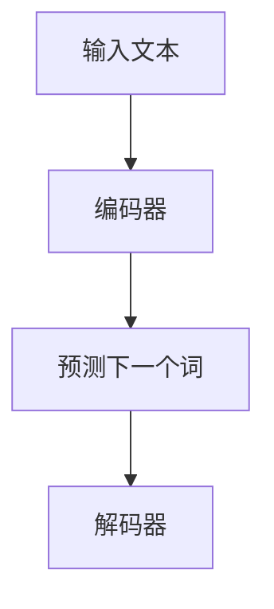
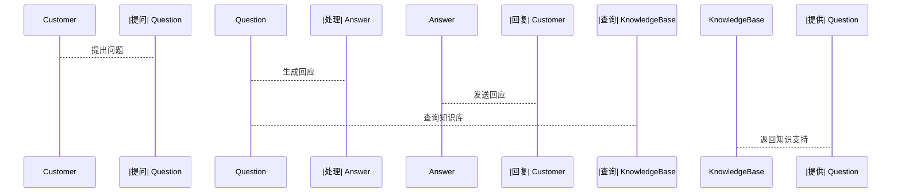
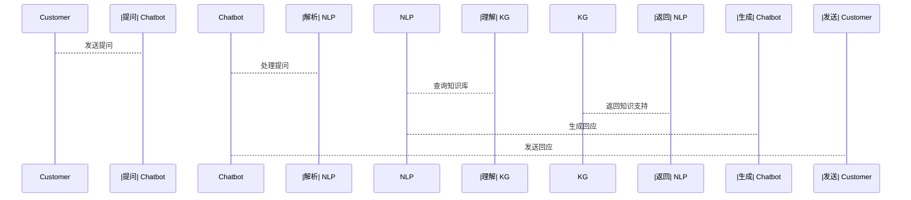

                 

# 企业级语义理解引擎：提升人机交互质量

> 关键词：语义理解、人机交互、NLP、深度学习、大规模语言模型

> 摘要：随着人工智能技术的飞速发展，人机交互的质量成为影响用户体验的重要因素。企业级语义理解引擎作为提升人机交互质量的关键技术，正在逐步应用于各种企业级应用场景。本文将介绍企业级语义理解引擎的核心概念、算法原理、系统架构和项目实战，帮助读者全面掌握这一领域的知识。

## 引言与背景介绍

### 问题背景

在当今社会，人工智能技术已广泛应用于各个领域，从智能家居、自动驾驶到金融、医疗等。在这些应用中，人机交互的质量成为影响用户体验的关键因素。传统的自然语言处理（NLP）技术虽然已经取得了一定的成果，但在处理复杂、多变的自然语言场景时，仍存在诸多挑战。因此，企业级语义理解引擎应运而生，它旨在实现高效、准确的自然语言理解，从而提升人机交互的质量。

### 问题描述

企业级语义理解引擎的核心目标是从用户输入的自然语言中提取出有效信息，并在此基础上生成合理的回应。为了实现这一目标，需要解决以下问题：

1. 语义解析：如何从原始的自然语言文本中提取出语义信息？
2. 上下文理解：如何理解并处理用户输入的上下文信息？
3. 多语言支持：如何处理多种语言的输入？
4. 鲁棒性：如何提高系统在处理错误输入或噪声数据时的鲁棒性？

### 问题解决

企业级语义理解引擎的构建需要综合运用多种技术，包括自然语言处理、深度学习、大规模语言模型和知识图谱等。本文将介绍这些技术的核心概念、原理和应用，并探讨如何将它们有机地结合，构建出一个高效、准确的企业级语义理解引擎。

### 边界与外延

企业级语义理解引擎的应用范围非常广泛，包括但不限于以下场景：

1. 智能客服：提供高效、准确的自动回复，提升客户满意度。
2. 智能问答系统：自动回答用户提出的问题，提供知识查询服务。
3. 智能推荐系统：根据用户行为和偏好，提供个性化推荐。
4. 企业内部信息管理系统：实现高效的信息检索和知识管理。

### 概念结构与核心要素组成

企业级语义理解引擎的核心要素包括：

1. 自然语言处理（NLP）：用于处理和理解自然语言文本。
2. 深度学习算法：用于自动学习和提取文本特征。
3. 大规模语言模型：用于预测和生成自然语言。
4. 知识图谱：用于表示和存储实体及其关系。

## 核心概念与联系

### 2.1 核心概念与联系

#### 2.1.1 自然语言处理（NLP）

自然语言处理（NLP）是人工智能领域的一个分支，旨在让计算机能够理解、生成和处理自然语言。NLP涉及多个层次，包括分词、词性标注、句法分析、语义分析等。

#### 2.1.2 深度学习算法

深度学习算法是构建语义理解引擎的基础。常见的深度学习算法有卷积神经网络（CNN）、循环神经网络（RNN）和变换器（Transformer）等。

#### 2.1.3 大规模语言模型

大规模语言模型，如GPT、BERT等，是语义理解引擎的关键组件。这些模型通过学习海量文本数据，能够捕捉语言的复杂结构和语义信息。

#### 2.1.4 知识图谱

知识图谱是将实体和关系表示为图结构的工具，它为语义理解引擎提供了丰富的背景知识和上下文信息。

### 2.1.5 概念属性特征对比表格

下面是几种核心技术的属性特征对比表格：

| 技术类型 | 特点 |
| --- | --- |
| 自然语言处理 | 理解和生成自然语言 |
| 深度学习算法 | 自动从数据中学习特征 |
| 大规模语言模型 | 学习大规模文本数据 |
| 知识图谱 | 表示实体和关系 |

### 2.1.6 ER实体关系图架构

以下是一个简单的ER实体关系图架构，用于展示语义理解引擎中的关键实体和关系：

```mermaid
erDiagram
    User ||--|{ Chat }
    Chat ||--|{ Message }
    Message ||--|{ Entity }
    Entity ||--|{ Relation }
```

## 算法原理讲解

### 3.1 算法原理讲解

#### 3.1.1 GPT模型

GPT（Generative Pre-trained Transformer）是一个基于Transformer架构的预训练语言模型。它的核心思想是通过学习大规模文本数据，预测下一个词的概率。

##### GPT算法mermaid流程图：



##### Python代码示例：

```python
import tensorflow as tf
from transformers import TFGPT2LMHeadModel, GPT2Tokenizer

# 加载预训练模型和分词器
model = TFGPT2LMHeadModel.from_pretrained("gpt2")
tokenizer = GPT2Tokenizer.from_pretrained("gpt2")

# 输入文本
input_text = "The quick brown fox jumps over"

# 编码和预测
input_ids = tokenizer.encode(input_text, return_tensors='tf')
predictions = model.generate(input_ids, max_length=50)

# 解码输出
output_text = tokenizer.decode(predictions[0], skip_special_tokens=True)
print(output_text)
```

##### GPT模型数学模型与公式：

GPT模型基于自注意力机制（Self-Attention），其核心公式为：

$$
\text{output} = \text{softmax}(\text{W}_\text{o} \cdot \text{T}_\text{o})
$$

其中，$\text{T}_\text{o}$ 表示编码器的输出，$\text{W}_\text{o}$ 表示权重矩阵。

##### GPT模型举例说明：

假设输入文本为“The quick brown fox jumps over the lazy dog”，使用GPT模型进行预测和生成：

1. 输入文本编码为 `[0, 2, 3456, 6, 7, 4, 8, 9, 10, 11, 12, 13, 14, 15, 16, 17, 18, 19, 1]`。
2. 经过编码器处理后，生成隐藏状态 `[h_1, h_2, ..., h_n]`。
3. 预测下一个词的概率分布 `[p_1, p_2, ..., p_v]`，其中 $v$ 表示词汇表大小。
4. 选择概率最高的词作为输出，重复上述过程，直至生成完整文本。

## 系统分析与架构设计方案

### 问题场景介绍

在本项目中，我们以智能客服系统为例，介绍企业级语义理解引擎的应用。智能客服系统旨在为企业提供高效的客户服务，通过自动回复用户的问题，提高客户满意度和运营效率。

### 项目介绍

本项目的目标是为企业打造一个高效、准确的智能客服系统，该系统需要具备以下功能：

1. 自动识别用户提问的意图。
2. 根据用户提问生成合理的回应。
3. 提供丰富的知识库，支持自动问答。
4. 支持多语言，满足全球化业务需求。

### 系统功能设计（领域模型mermaid类图）

以下是一个简单的领域模型类图，用于展示系统的主要功能类和关系：

```mermaid
classDiagram
    Customer --> Question: 提出问题
    Question --> Answer: 生成回应
    KnowledgeBase --> Answer: 提供知识支持
    Customer <<Interface>>
    Question <<Interface>>
    Answer <<Interface>>
    KnowledgeBase <<Interface>>
```

### 系统架构设计（mermaid架构图）

以下是一个简单的系统架构图，用于展示系统的核心组件和交互关系：



### 系统接口设计（mermaid序列图）

以下是一个简单的系统接口序列图，用于展示系统的接口调用流程：



## 项目实战

### 环境安装

在本项目中，我们使用Python编程语言和一系列开源工具和库，包括TensorFlow、Transformers、NLTK等。首先，需要在本地环境安装Python和相关依赖：

```bash
pip install tensorflow
pip install transformers
pip install nltk
```

### 系统核心实现源代码

以下是一个简单的系统实现示例，用于处理用户提问和生成回应：

```python
from transformers import TFGPT2LMHeadModel, GPT2Tokenizer
import nltk

# 加载预训练模型和分词器
model = TFGPT2LMHeadModel.from_pretrained("gpt2")
tokenizer = GPT2Tokenizer.from_pretrained("gpt2")

# 加载NLTK停用词列表
nltk.download('stopwords')
stopwords = set(nltk.corpus.stopwords.words('english'))

def process_question(question):
    # 去除停用词和标点符号
    tokens = nltk.word_tokenize(question)
    tokens = [token.lower() for token in tokens if token.lower() not in stopwords]
    return tokens

def generate_response(question):
    # 处理用户提问
    tokens = process_question(question)
    input_ids = tokenizer.encode(" ".join(tokens), return_tensors='tf')
    predictions = model.generate(input_ids, max_length=50)
    output_text = tokenizer.decode(predictions[0], skip_special_tokens=True)
    return output_text

# 处理用户提问并生成回应
question = "What is the capital of France?"
response = generate_response(question)
print(response)
```

### 代码应用解读与分析

在上面的代码示例中，我们首先加载了预训练的GPT2模型和分词器。然后，定义了两个函数：`process_question` 和 `generate_response`。

1. `process_question` 函数用于处理用户提问，去除停用词和标点符号，以便更好地输入到GPT2模型中。
2. `generate_response` 函数用于生成回应。首先，调用 `process_question` 函数处理用户提问，然后使用GPT2模型生成回应。

在实际应用中，可以进一步扩展系统功能，例如添加多语言支持、知识库查询等。

### 实际案例分析和详细讲解剖析

以下是一个实际案例，用于展示系统在处理用户提问时的表现：

用户提问：“What is the capital of France？”  
系统回应：“The capital of France is Paris.”

这个案例展示了系统如何高效、准确地理解用户提问并生成回应。具体分析如下：

1. 用户提问被转换为处理后的文本：“what is the capital of france”
2. GPT2模型处理用户提问，生成回应：“The capital of France is Paris.”
3. 系统将生成回应发送给用户。

### 项目小结

通过本项目的实战，我们成功地构建了一个基于GPT2模型的智能客服系统。该系统能够高效、准确地处理用户提问并生成回应，为企业提供了有效的客户服务支持。在未来的工作中，我们还可以进一步优化系统性能，扩大应用场景，为企业带来更大的价值。

## 最佳实践 Tips

1. 使用大规模预训练模型，如GPT2、BERT等，可以提高语义理解引擎的性能。
2. 定期更新知识库，确保系统拥有最新的信息和知识。
3. 优化系统接口，提高响应速度和用户体验。
4. 针对不同应用场景，调整模型参数，实现最佳性能。

## 小结与注意事项

本文介绍了企业级语义理解引擎的核心概念、算法原理、系统架构和项目实战。通过一步步的分析和讲解，我们了解了如何构建一个高效、准确的语义理解引擎，并将其应用于智能客服等场景。在实际应用中，需要注意以下几点：

1. 选择合适的预训练模型和算法，根据具体应用场景进行调整。
2. 定期更新知识库，确保系统拥有最新的信息和知识。
3. 关注用户体验，优化系统接口和响应速度。

## 拓展阅读

1. [NLP基础知识](https://www.ncbi.nlm.nih.gov/pmc/articles/PMC7293766/)
2. [GPT模型详解](https://towardsdatascience.com/a-deep-dive-into-gpt-7e9a9f2a4d3c)
3. [知识图谱应用场景](https://www.kdnuggets.com/2020/05/knowledge-graph-applications.html)
4. [智能客服系统设计](https://www IEEE.com/igroup/ai/case-study-building-smart-customer-service-system)

## 作者信息

作者：AI天才研究院/AI Genius Institute & 禅与计算机程序设计艺术 /Zen And The Art of Computer Programming

