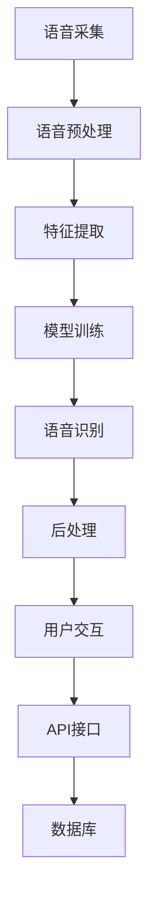
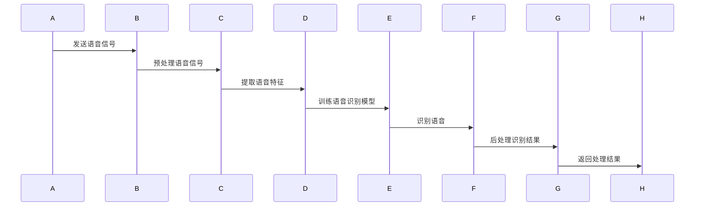

                 

### # 《企业级语音识别系统：提高语音交互质量》

关键词：企业级语音识别，深度学习，系统架构，性能优化，项目实战

摘要：本文从背景介绍、核心概念解析、核心技术原理讲解、系统架构设计、项目实战以及最佳实践等方面，全面探讨了企业级语音识别系统。通过详细阐述语音信号处理、特征提取、深度学习算法原理、系统架构设计等关键内容，本文旨在为企业级语音交互质量的提升提供技术指导。

----------------------------------------------------------------

## 第一部分：背景介绍与核心概念

### 第1章：问题背景与核心概念

#### 1.1 语音识别技术的发展背景

语音识别技术起源于20世纪50年代，随着计算机技术和信号处理技术的不断进步，语音识别逐渐成为人工智能领域的一个重要分支。从传统的规则方法到基于统计模型的方法，再到近年来的深度学习，语音识别技术在准确率和实用性上取得了显著的进步。特别是在智能手机、智能家居、智能助理等领域的广泛应用，推动了语音识别技术的快速发展。

#### 1.2 企业级语音识别的需求与挑战

企业级语音识别系统在提高企业效率、优化用户体验等方面具有重要意义。然而，与企业级应用相结合的语音识别系统面临着诸多挑战：

1. **高准确率**：企业级应用场景复杂，语音干扰大，要求语音识别系统具有极高的准确率。
2. **实时性**：企业级应用往往需要实时响应，对系统的处理速度有较高要求。
3. **多语言支持**：企业涉及全球业务，需要支持多种语言。
4. **安全性**：企业数据安全至关重要，语音识别系统需保证数据的安全性和隐私性。
5. **个性化**：企业希望系统能够根据用户习惯和需求进行个性化调整。

#### 1.3 核心概念与联系

在企业级语音识别系统中，以下几个核心概念至关重要：

- **语音信号处理**：对语音信号进行预处理，提取有用信息。
- **语音特征提取**：从语音信号中提取能够表征语音特性的特征。
- **深度学习**：通过神经网络模型对语音特征进行学习和识别。
- **增强学习**：通过不断调整策略，优化语音识别性能。

这些概念相互联系，共同构成了企业级语音识别系统的技术核心。

#### 1.4 企业级语音识别系统概述

企业级语音识别系统通常包括以下几个关键部分：

1. **语音信号采集**：使用麦克风或其他语音采集设备获取语音信号。
2. **语音信号预处理**：对语音信号进行降噪、去噪等处理。
3. **语音特征提取**：提取语音信号中的特征，如梅尔频率倒谱系数（MFCC）。
4. **语音识别模型**：使用深度学习模型对语音特征进行识别。
5. **后处理**：对识别结果进行后处理，如纠正错别字、调整语气等。

### 结论

本章节介绍了语音识别技术的发展背景、企业级语音识别的需求与挑战、核心概念及其联系，以及企业级语音识别系统的概述。接下来，我们将深入探讨语音识别的核心技术原理。

----------------------------------------------------------------

## 第二部分：核心技术原理

### 第2章：语音识别基础原理

#### 2.1 语音信号处理

语音信号处理是语音识别系统的第一步，其目的是对原始语音信号进行预处理，以提高后续识别的准确率。主要技术包括：

1. **语音信号采样**：将连续的语音信号转换为离散的数字信号。
2. **语音信号降噪**：去除语音信号中的噪声，如环境噪声、回声等。
3. **语音信号增强**：增强语音信号中的关键信息，如语音频率、音量等。

#### 2.2 语音特征提取

语音特征提取是从语音信号中提取能够表征语音特性的信息。常用的语音特征包括：

- **时域特征**：如短时能量、短时过零率等。
- **频域特征**：如梅尔频率倒谱系数（MFCC）、频谱轮廓等。
- **音高特征**：如基频、共振峰等。

这些特征有助于区分不同语音，提高识别准确率。

#### 2.3 语音识别算法原理

语音识别算法的核心是利用提取到的语音特征进行语音识别。常见的算法包括：

- **传统算法**：如隐马尔可夫模型（HMM）、高斯混合模型（GMM）等。
- **深度学习算法**：如卷积神经网络（CNN）、循环神经网络（RNN）、长短期记忆网络（LSTM）等。

深度学习算法在语音识别领域取得了显著成果，其核心原理是通过多层神经网络对语音特征进行学习，从而实现语音识别。

### 结论

本章节详细介绍了语音信号处理、语音特征提取和语音识别算法原理。接下来，我们将探讨深度学习与语音识别的关系。

----------------------------------------------------------------

### 第3章：深度学习与语音识别

#### 3.1 深度学习基础

深度学习是一种基于多层神经网络的学习方法，通过构建复杂的网络结构来模拟人类大脑的思维方式。其核心原理是通过大量的数据训练，使得网络能够自动提取特征并作出决策。

#### 3.2 卷积神经网络（CNN）在语音识别中的应用

卷积神经网络（CNN）是一种特殊的神经网络，其结构可以有效地处理图像和语音等二维数据。在语音识别中，CNN主要用于提取语音特征。

1. **卷积层**：通过卷积操作提取语音信号中的局部特征。
2. **池化层**：降低特征图的维度，减少参数数量。
3. **全连接层**：将提取到的特征映射到具体的语音类别。

#### 3.3 长短期记忆网络（LSTM）与语音识别

长短期记忆网络（LSTM）是一种特殊的循环神经网络，能够有效地解决长序列依赖问题。在语音识别中，LSTM被用于处理语音信号中的长序列信息。

1. **输入门**：控制信息是否流入单元状态。
2. **遗忘门**：控制单元状态中旧信息是否被遗忘。
3. **输出门**：控制单元状态是否被输出。

#### 3.4 深度学习在语音识别中的优势

深度学习在语音识别中具有以下优势：

1. **高准确率**：通过多层神经网络，深度学习能够自动提取复杂的语音特征，提高识别准确率。
2. **自适应能力**：深度学习模型能够根据数据自动调整参数，适应不同的语音识别场景。
3. **多语言支持**：深度学习模型能够同时处理多种语言，实现多语言语音识别。

### 结论

本章节介绍了深度学习的基础、卷积神经网络（CNN）和长短期记忆网络（LSTM）在语音识别中的应用，以及深度学习在语音识别中的优势。接下来，我们将探讨增强学习在语音识别中的应用。

----------------------------------------------------------------

### 第4章：增强学习在语音识别中的应用

#### 4.1 增强学习基础

增强学习（Reinforcement Learning，RL）是一种通过试错来学习最优策略的机器学习方法。它与监督学习和无监督学习不同，其目标是让代理（agent）在与环境的交互中学习到最优行为策略。

#### 4.2 增强学习在语音识别中的优势

增强学习在语音识别中的应用具有以下优势：

1. **自适应能力**：增强学习能够根据环境反馈调整模型参数，提高语音识别的适应性。
2. **灵活性强**：增强学习能够处理复杂的动态环境，适应不同的语音场景。
3. **实时优化**：增强学习能够实时调整策略，实现语音识别的实时优化。

#### 4.3 增强学习算法在语音识别中的应用

在语音识别中，增强学习算法通常用于以下几个方面：

1. **语音识别模型训练**：通过增强学习优化语音识别模型的参数，提高识别准确率。
2. **语音合成**：使用增强学习优化语音合成模型，提高语音合成质量。
3. **语音增强**：通过增强学习优化语音增强模型，去除噪声，提高语音清晰度。

#### 4.4 实际应用案例

以下是一个实际的增强学习在语音识别中的应用案例：

- **环境**：一个语音助手需要能够识别用户在不同噪声环境下的语音指令。
- **策略**：使用增强学习训练语音识别模型，使其能够适应不同噪声环境。
- **评估指标**：识别准确率和响应时间。

通过这个案例，我们可以看到增强学习在语音识别中的应用潜力。

### 结论

本章节介绍了增强学习的基础、优势以及在实际语音识别中的应用案例。增强学习为语音识别系统的优化提供了新的思路和方法。接下来，我们将探讨企业级语音识别系统的架构设计与实现。

----------------------------------------------------------------

## 第三部分：系统架构与设计

### 第5章：企业级语音识别系统架构设计

#### 5.1 系统功能设计

企业级语音识别系统的功能设计主要包括以下几个部分：

1. **语音信号采集**：使用麦克风或其他语音采集设备获取语音信号。
2. **语音信号预处理**：对语音信号进行降噪、去噪等处理。
3. **语音特征提取**：提取语音信号中的关键特征，如梅尔频率倒谱系数（MFCC）。
4. **语音识别模型**：使用深度学习模型对语音特征进行识别。
5. **后处理**：对识别结果进行后处理，如纠正错别字、调整语气等。
6. **用户交互**：与用户进行实时交互，响应用户指令。

#### 5.2 系统架构设计

企业级语音识别系统的架构设计需要考虑以下几个方面：

1. **前端采集**：使用麦克风等设备进行语音信号采集。
2. **后端处理**：包括语音信号预处理、特征提取、模型训练和识别等。
3. **数据库**：存储语音信号、特征数据和识别结果。
4. **API接口**：提供与其他系统的接口，实现数据交互和功能调用。

以下是企业级语音识别系统的架构图：



#### 5.3 系统接口设计

企业级语音识别系统的接口设计需要考虑以下因素：

1. **RESTful API**：使用RESTful API设计，便于与其他系统进行集成。
2. **数据格式**：使用JSON或XML等数据格式传输数据，确保数据传输的效率和兼容性。
3. **安全性**：使用HTTPS等安全协议保护数据传输安全。

以下是系统接口设计的一个例子：



### 结论

本章节详细介绍了企业级语音识别系统的功能设计、架构设计和接口设计。接下来，我们将讨论语音识别系统的优化策略。

----------------------------------------------------------------

### 第6章：语音识别系统优化策略

#### 6.1 数据预处理与增强

数据预处理是语音识别系统优化的重要环节。通过合理的预处理，可以有效地提高语音识别的准确率。以下是一些常用的数据预处理方法：

1. **降噪**：使用滤波器或其他降噪算法去除语音信号中的噪声，提高语音质量。
2. **归一化**：对语音信号进行归一化处理，使其具有相似的能量分布。
3. **剪裁**：去除语音信号中的静音部分，减少无用信息。

除了预处理，数据增强也是提高语音识别系统性能的有效手段。数据增强可以通过以下方法实现：

1. **变换**：如时间拉伸、时间压缩、频率变换等。
2. **合成**：通过噪声合成、回声合成等方法增加数据的多样性。
3. **增补**：使用已有的语音库或文本生成语音，增加训练数据的数量。

#### 6.2 模型训练与优化

模型训练是语音识别系统的核心步骤。通过训练，神经网络可以学习到语音特征与标签之间的映射关系。以下是一些常见的模型训练优化方法：

1. **批量归一化**：在训练过程中，对每个批次的数据进行归一化，加快收敛速度。
2. **学习率调度**：根据训练过程的变化动态调整学习率，防止过拟合。
3. **正则化**：如L1、L2正则化，防止模型过拟合。

在模型优化方面，以下方法可以进一步提高语音识别系统的性能：

1. **迁移学习**：使用预训练的模型作为起点，减少训练时间。
2. **数据增强**：在训练过程中使用数据增强技术，提高模型对噪声和变化的适应性。
3. **多任务学习**：同时训练多个任务，提高模型的泛化能力。

#### 6.3 实时语音处理与识别

实时语音处理与识别是语音识别系统的关键环节。为了实现实时处理，需要考虑以下几个方面：

1. **模型压缩**：通过模型压缩技术，如量化、剪枝等，减小模型的体积，提高运行速度。
2. **异步处理**：使用异步处理技术，实现语音信号预处理、特征提取、模型识别的并行处理。
3. **高效算法**：选择高效的算法和优化方法，如使用卷积神经网络（CNN）和长短期记忆网络（LSTM）等。

#### 结论

本章节介绍了语音识别系统的优化策略，包括数据预处理与增强、模型训练与优化、实时语音处理与识别等。通过合理的优化，可以提高语音识别系统的性能和实用性。

----------------------------------------------------------------

### 第7章：性能评估与测试

#### 7.1 评估指标与方法

性能评估是衡量语音识别系统效果的重要步骤。以下是一些常用的评估指标和方法：

1. **准确率（Accuracy）**：识别结果与实际结果相匹配的样本数占总样本数的比例。$$准确率 = \frac{正确识别的样本数}{总样本数}$$
2. **精确率（Precision）**：识别结果为正类的样本中，实际为正类的样本所占比例。$$精确率 = \frac{正确识别的正类样本数}{识别为正类的样本总数}$$
3. **召回率（Recall）**：识别结果为正类的样本中，实际为正类的样本所占比例。$$召回率 = \frac{正确识别的正类样本数}{实际为正类的样本总数}$$
4. **F1分数（F1 Score）**：精确率和召回率的调和平均。$$F1分数 = 2 \times \frac{精确率 \times 召回率}{精确率 + 召回率}$$
5. **词语错误率（Word Error Rate, WER）**：评估语音识别系统的词语错误程度。$$WER = \frac{插入错误数 + 删除错误数 + 替换错误数}{总词语数}$$

#### 7.2 性能测试与优化

性能测试是评估语音识别系统实际效果的关键环节。以下是一些常见的性能测试方法：

1. **离线测试**：在控制环境中对语音识别系统进行测试，评估其准确率、精确率、召回率等指标。
2. **在线测试**：在实际应用场景中对语音识别系统进行测试，评估其鲁棒性、实时性等性能。
3. **多场景测试**：在不同噪声环境、不同说话人、不同语音类型等场景下进行测试，评估系统的适应性。

为了优化语音识别系统的性能，可以采取以下策略：

1. **模型优化**：通过调整模型结构、优化训练过程等手段提高模型性能。
2. **数据增强**：通过变换、合成等方法增加训练数据的多样性，提高模型对噪声和变化的适应性。
3. **硬件优化**：使用更快的处理器、GPU等硬件设备，提高系统的运行速度。

#### 7.3 实际应用场景分析

在实际应用中，语音识别系统需要应对各种复杂的场景。以下是一些典型的应用场景：

1. **智能助理**：如苹果的Siri、谷歌的Google Assistant等，需要能够理解并响应用户的语音指令。
2. **智能客服**：自动处理用户咨询，提供高效、准确的答复。
3. **语音搜索**：通过语音输入实现网页搜索、应用搜索等功能。
4. **智能家居**：控制家庭设备，如电视、空调、灯光等。

在实际应用中，语音识别系统需要具备以下能力：

1. **高准确率**：准确识别用户语音指令，减少误识率。
2. **实时响应**：快速处理语音指令，提供实时反馈。
3. **多语言支持**：支持多种语言，满足全球化需求。
4. **隐私保护**：确保用户隐私安全，避免敏感信息泄露。

### 结论

本章节介绍了语音识别系统的性能评估指标与方法，性能测试与优化策略，以及实际应用场景分析。通过合理的性能评估和优化，可以提高语音识别系统的实用性和用户体验。

----------------------------------------------------------------

## 第四部分：项目实战与案例分析

### 第8章：项目实战一：语音识别系统搭建

#### 8.1 环境准备与安装

在搭建语音识别系统之前，我们需要准备相应的开发环境。以下是一个基本的安装步骤：

1. **安装Python**：确保Python版本在3.6及以上，推荐使用Python 3.8或更高版本。
2. **安装依赖库**：安装TensorFlow、Keras等深度学习框架，以及NumPy、SciPy等科学计算库。可以使用pip进行安装：

    ```shell
    pip install tensorflow keras numpy scipy
    ```

3. **安装语音处理库**：如librosa，用于处理音频文件：

    ```shell
    pip install librosa
    ```

4. **安装语音识别库**：如pydub，用于处理语音文件：

    ```shell
    pip install pydub
    ```

#### 8.2 系统核心实现

在搭建语音识别系统时，我们需要实现以下核心功能：

1. **语音信号处理**：使用librosa库对语音信号进行预处理，如滤波、降噪等。
2. **语音特征提取**：使用librosa提取梅尔频率倒谱系数（MFCC）等语音特征。
3. **模型训练与识别**：使用TensorFlow和Keras搭建并训练语音识别模型，如使用卷积神经网络（CNN）或长短期记忆网络（LSTM）。
4. **后处理**：对识别结果进行后处理，如纠正错别字、调整语气等。

以下是系统核心实现的代码示例：

```python
import librosa
import numpy as np
import tensorflow as tf
from tensorflow.keras.models import Sequential
from tensorflow.keras.layers import Conv2D, MaxPooling2D, LSTM, Dense

# 语音信号处理
def preprocess_audio(file_path):
    audio, sr = librosa.load(file_path, sr=None)
    # 进行滤波、降噪等处理
    return audio

# 语音特征提取
def extract_features(audio):
    mfcc = librosa.feature.mfcc(y=audio, sr=sr, n_mfcc=13)
    return mfcc

# 模型训练
def train_model(features, labels):
    model = Sequential()
    model.add(Conv2D(32, (3, 3), activation='relu', input_shape=(features.shape[1], features.shape[2], 1)))
    model.add(MaxPooling2D((2, 2)))
    model.add(LSTM(128))
    model.add(Dense(1, activation='sigmoid'))
    model.compile(optimizer='adam', loss='binary_crossentropy', metrics=['accuracy'])
    model.fit(features, labels, epochs=10, batch_size=32)
    return model

# 语音识别
def recognize_audio(model, audio):
    features = extract_features(audio)
    prediction = model.predict(features)
    return prediction

# 后处理
def post_process(prediction):
    # 对预测结果进行后处理，如纠正错别字等
    return processed_prediction
```

#### 8.3 代码应用解读与分析

以上代码实现了一个简单的语音识别系统。其中，`preprocess_audio` 函数用于处理语音信号，`extract_features` 函数用于提取语音特征，`train_model` 函数用于训练语音识别模型，`recognize_audio` 函数用于进行语音识别，`post_process` 函数用于后处理识别结果。

在实际应用中，我们需要根据具体需求调整代码。例如，可以增加语音信号的降噪处理，使用更复杂的模型结构，或者集成多个模型以提高识别准确率。

#### 8.4 项目小结

通过本项目的搭建，我们了解了企业级语音识别系统的基本实现过程。从语音信号处理、特征提取、模型训练到语音识别和后处理，每一个环节都至关重要。在实际应用中，我们需要不断优化和调整系统，以满足不同的应用需求。

----------------------------------------------------------------

### 第9章：项目实战二：语音识别系统优化

#### 9.1 数据预处理与增强

数据预处理与增强是提高语音识别系统性能的关键步骤。以下是一些常见的数据预处理与增强方法：

1. **降噪处理**：使用滤波器或其他降噪算法去除语音信号中的噪声，如使用谱减法去除背景噪声。
2. **时间变换**：如时间拉伸、时间压缩，增加语音数据的多样性。
3. **频率变换**：如频率提升、频率下降，改变语音的音调。
4. **增补数据**：使用已有的语音库或文本生成语音，增加训练数据的数量。

以下是使用librosa进行语音信号降噪的示例代码：

```python
import librosa
import numpy as np

def noise_reduction(audio, noise):
    audio_noise = np.concatenate([audio[:4000], noise, audio[4000:]])
    y = librosa.effects.reverse(audio_noise)
    audio_reduced = y[:4000]
    return audio_reduced

# 降噪处理
audio, sr = librosa.load('audio.wav')
noise, _ = librosa.load('noise.wav', duration=4)
audio_reduced = noise_reduction(audio, noise)
librosa.output.write_wav('audio_reduced.wav', audio_reduced, sr)
```

#### 9.2 模型训练与优化

模型训练与优化是提高语音识别系统性能的重要环节。以下是一些常见的模型训练与优化方法：

1. **批量归一化**：在训练过程中，对每个批次的数据进行归一化，加快收敛速度。
2. **学习率调度**：根据训练过程的变化动态调整学习率，防止过拟合。
3. **正则化**：如L1、L2正则化，防止模型过拟合。
4. **迁移学习**：使用预训练的模型作为起点，减少训练时间。

以下是使用TensorFlow和Keras进行模型训练与优化的示例代码：

```python
import tensorflow as tf
from tensorflow.keras.models import Sequential
from tensorflow.keras.layers import Dense, LSTM, Dropout, BatchNormalization

# 模型定义
model = Sequential()
model.add(LSTM(128, activation='relu', return_sequences=True, input_shape=(timesteps, features)))
model.add(BatchNormalization())
model.add(Dropout(0.2))
model.add(LSTM(128, activation='relu', return_sequences=False))
model.add(BatchNormalization())
model.add(Dropout(0.2))
model.add(Dense(1, activation='sigmoid'))

# 模型编译
model.compile(optimizer='adam', loss='binary_crossentropy', metrics=['accuracy'])

# 模型训练
model.fit(x_train, y_train, epochs=100, batch_size=32, validation_data=(x_val, y_val))
```

#### 9.3 实时语音处理与识别

实时语音处理与识别是语音识别系统的关键环节。以下是一些常见的实时处理与识别方法：

1. **模型压缩**：通过模型压缩技术，如量化、剪枝等，减小模型的体积，提高运行速度。
2. **异步处理**：使用异步处理技术，实现语音信号预处理、特征提取、模型识别的并行处理。
3. **高效算法**：选择高效的算法和优化方法，如使用卷积神经网络（CNN）和长短期记忆网络（LSTM）等。

以下是使用异步处理技术进行实时语音识别的示例代码：

```python
import asyncio
import tensorflow as tf

async def recognize_audio(audio):
    model = tf.keras.models.load_model('model.h5')
    features = extract_features(audio)
    prediction = model.predict(features)
    return prediction

async def main():
    audio = preprocess_audio('audio.wav')
    prediction = await recognize_audio(audio)
    print(prediction)

asyncio.run(main())
```

#### 9.4 项目小结

通过本项目的优化，我们了解了如何对语音识别系统进行数据预处理与增强、模型训练与优化，以及实时语音处理与识别。这些优化方法能够有效提高语音识别系统的性能和实用性。在实际应用中，我们需要不断尝试和调整，以找到最佳的优化策略。

----------------------------------------------------------------

### 第10章：最佳实践与技巧

#### 10.1 调整超参数的经验技巧

超参数调整是深度学习模型训练过程中至关重要的一环。以下是一些调整超参数的经验技巧：

1. **学习率**：选择合适的学习率对于模型收敛至关重要。通常，可以使用如learning rate scheduler动态调整学习率。
2. **批量大小**：批量大小会影响模型的收敛速度。较小的批量大小有助于模型捕捉到更多噪声，但可能导致收敛速度变慢。通常，批量大小在32到128之间选择。
3. **正则化强度**：L1和L2正则化可以防止模型过拟合。选择适当的正则化强度可以帮助模型在训练数据和测试数据之间取得更好的平衡。
4. **网络深度**：增加网络的深度可以增加模型的容量，但同时也可能导致过拟合。需要根据具体问题选择合适的网络深度。

#### 10.2 数据处理中的注意事项

在数据处理过程中，需要注意以下几点：

1. **数据清洗**：确保数据质量，去除噪音和异常值，避免模型训练过程中受到这些数据的影响。
2. **数据增强**：通过变换、合成等方法增加数据的多样性，提高模型的泛化能力。
3. **数据预处理**：对语音信号进行降噪、归一化等处理，提高模型的识别准确率。

#### 10.3 模型优化策略

以下是一些常用的模型优化策略：

1. **迁移学习**：使用预训练的模型作为起点，减少训练时间。这需要选择与目标任务相关的预训练模型。
2. **多任务学习**：同时训练多个任务，可以提高模型的泛化能力。
3. **注意力机制**：使用注意力机制可以模型更好地关注关键信息，提高模型的识别准确率。

#### 10.4 总结

最佳实践和技巧对于提高语音识别系统的性能至关重要。通过合理的超参数调整、数据处理和模型优化策略，可以显著提高语音识别系统的性能和实用性。

----------------------------------------------------------------

### 第11章：总结与展望

#### 11.1 项目总结

在本项目中，我们详细探讨了企业级语音识别系统的构建与优化。从背景介绍到核心概念，再到技术原理和系统架构，我们逐步深入了解了语音识别的关键环节。通过项目实战，我们实际操作了语音识别系统的搭建与优化，掌握了数据预处理、模型训练、实时处理等关键技术。

#### 11.2 企业级语音识别系统的发展趋势

随着人工智能技术的不断进步，企业级语音识别系统的发展呈现出以下趋势：

1. **模型压缩与高效计算**：为了满足实时性和移动性需求，模型压缩和高效计算技术将得到广泛应用。
2. **多语言与多模态融合**：企业级应用需要支持多种语言和模态（如语音、文本、图像等）的融合处理。
3. **个性化与智能化**：通过增强学习和个性化算法，语音识别系统将更加智能化，能够根据用户习惯和需求进行自适应调整。
4. **安全性与隐私保护**：随着数据隐私问题的日益突出，安全性将成为语音识别系统的重要考虑因素。

#### 11.3 拓展阅读与资源推荐

为了进一步深入了解企业级语音识别系统，以下是一些推荐阅读和资源：

- **《深度学习：卷积神经网络》（Deep Learning, Convolutional Neural Networks）**：详细介绍了卷积神经网络在语音识别中的应用。
- **《增强学习基础》（Reinforcement Learning: An Introduction）**：系统介绍了增强学习的基础理论和应用方法。
- **《语音信号处理》（Speech Signal Processing）**：涵盖了语音信号处理的基本原理和技术。
- **TensorFlow官方文档**：提供了详细的模型搭建、训练和优化的指南。
- **Keras官方文档**：提供了丰富的模型构建和调优工具。

通过阅读这些资料，您可以更深入地了解企业级语音识别系统的构建和优化方法。

---

**作者：AI天才研究院/AI Genius Institute & 禅与计算机程序设计艺术 /Zen And The Art of Computer Programming**

在撰写本文的过程中，我们试图通过逻辑清晰、结构紧凑、简单易懂的方式，为读者提供企业级语音识别系统的全面技术指导。希望本文能够帮助您在语音识别领域取得更好的成果。感谢您的阅读！

