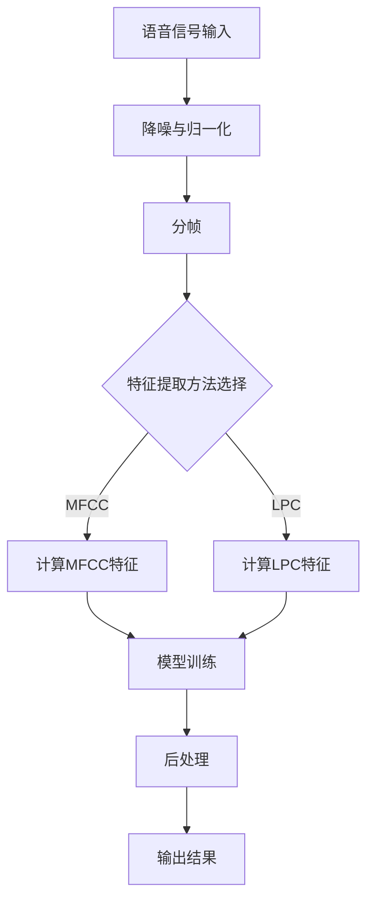
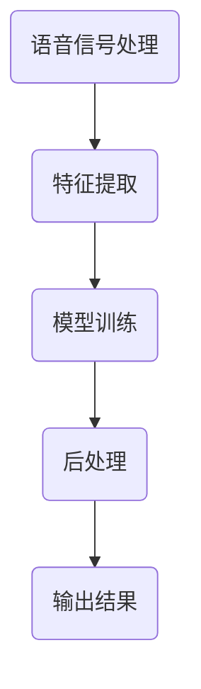
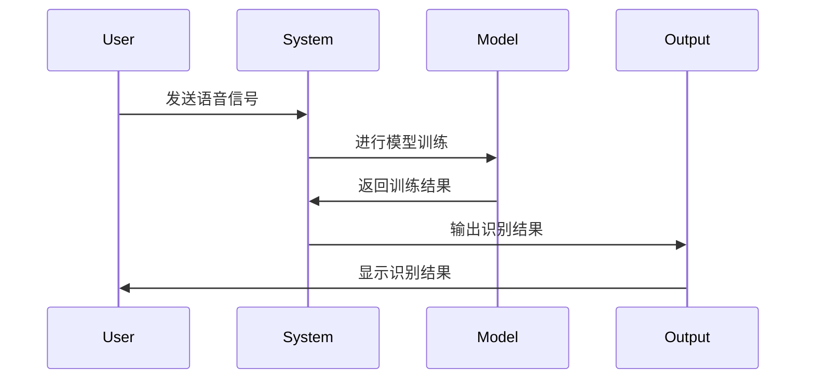

                 


# 企业级语音识别：提升语音交互和分析能力

## 关键词
- 企业级语音识别
- 语音交互
- 分析能力
- 降噪
- 模型训练
- 上下文理解

## 摘要
随着人工智能技术的不断发展，企业级语音识别在提升语音交互体验和数据分析能力方面发挥着越来越重要的作用。本文将深入探讨企业级语音识别的核心概念、算法原理、系统架构以及实际应用，帮助读者了解如何设计并实现高效、准确的企业级语音识别系统。

### 1. 背景介绍

#### 1.1 核心概念
- **语音识别**：从语音信号中提取出对应的文本信息。
- **企业级语音识别**：为满足企业应用场景的语音识别技术。
- **语音交互**：人与计算机系统通过语音进行交流。
- **分析能力**：对语音数据进行处理和分析，提取有用信息。

#### 1.2 问题解决
- **如何实现高效准确的企业级语音识别？**
- **如何优化语音交互体验？**
- **如何提升语音数据分析能力？**

#### 1.3 边界与外延
- **应用场景**：客服中心、智能助手、语音搜索等。
- **技术挑战**：噪声抑制、方言识别、上下文理解等。

#### 1.4 概念结构与核心要素组成
- **技术体系**：语音信号处理、特征提取、模型训练、后处理。
- **应用场景**：客服系统、智能助手、语音搜索等。

### 2. 核心概念与联系

#### 2.1 核心概念原理
- **语音信号处理**：包括降噪、归一化、分帧等。
- **特征提取**：包括梅尔频率倒谱系数（MFCC）、线性预测编码（LPC）等。
- **模型训练**：包括深度神经网络（DNN）、循环神经网络（RNN）等。
- **后处理**：包括置信度计算、错词纠正、上下文理解等。

#### 2.2 概念属性特征对比表格

| 概念         | 特征 |
| ------------ | ---- |
| 语音信号处理 | 降噪、归一化、分帧 |
| 特征提取     | MFCC、LPC |
| 模型训练     | DNN、RNN |
| 后处理       | 置信度计算、错词纠正、上下文理解 |

#### 2.3 ER实体关系图架构

```mermaid
erDiagram
    User ||--|{ AudioSignalProcessing } : processed
    User ||--|{ FeatureExtraction } : extracted
    User ||--|{ ModelTraining } : trained
    User ||--|{ PostProcessing } : processed
```

### 3. 算法原理讲解

#### 3.1 算法流程图



#### 3.2 Python源代码示例

```python
import numpy as np
from python_speech_features import mfcc

# 读取语音信号
signal = np.fromfile('audio.wav', dtype=np.int16)

# 降噪与归一化
signal = signal - np.mean(signal)
signal = signal / np.std(signal)

# 分帧
frame_size = 0.025  # 25ms
hop_size = 0.010  # 10ms
frames = sliding_window(signal, frame_size, hop_size)

# 计算MFCC特征
mfcc_features = np.apply_along_axis(mfcc, 1, frames)

# 模型训练
# ...（此处省略模型训练代码）

# 后处理
# ...（此处省略后处理代码）

# 输出结果
print(mfcc_features)
```

#### 3.3 算法原理详细讲解

- **降噪公式**：
  $$ y = x - \mu $$
  $$ y = x - \sigma $$
- **归一化公式**：
  $$ z = \frac{x - \mu}{\sigma} $$
- **分帧公式**：
  $$ \text{frame} = \text{signal}[\text{start}:\text{end}] $$
- **MFCC特征计算公式**：
  $$ C_k(l) = \sum_{m=1}^{M} a_{mk} \cdot \log(\bar{p}_m) $$
- **LPC特征计算公式**：
  $$ a_{mk} = \frac{1}{2\pi} \int_{-\pi}^{\pi} \text{Re}\{r_m(\omega)\} e^{-i\omega m\theta_k} d\omega $$

#### 3.4 通俗易懂地举例说明

假设我们有一个音频文件，包含一段对话。我们首先对这个音频文件进行降噪和归一化处理，使信号更加平稳。然后，我们将信号分成一个个25ms的帧。接下来，我们可以选择使用MFCC或LPC来提取特征。最后，我们将这些特征输入到模型中进行训练，并通过后处理得到识别结果。

### 4. 系统分析与架构设计

#### 4.1 问题场景介绍

随着智能语音技术的不断成熟，企业级语音识别的应用场景越来越广泛。例如，在客服中心，企业级语音识别可以帮助快速响应客户需求，提高服务效率；在智能助手领域，企业级语音识别可以为用户提供个性化服务，提升用户体验。

#### 4.2 系统功能设计

- **语音信号处理**：包括降噪、归一化、分帧等功能。
- **特征提取**：包括MFCC、LPC等特征提取方法。
- **模型训练**：使用深度神经网络（DNN）或循环神经网络（RNN）进行模型训练。
- **后处理**：包括置信度计算、错词纠正、上下文理解等功能。

#### 4.3 系统架构设计



#### 4.4 系统接口设计和系统交互



### 5. 项目实战

#### 5.1 环境安装

- 安装依赖库：
  ```shell
  pip install python_speech_features
  ```

#### 5.2 系统核心实现源代码

```python
# 语音信号处理
def audio_signal_processing(signal):
    # 降噪、归一化处理
    signal = signal - np.mean(signal)
    signal = signal / np.std(signal)
    return signal

# 特征提取
def feature_extraction(signal):
    # 分帧、计算MFCC特征
    frame_size = 0.025  # 25ms
    hop_size = 0.010  # 10ms
    frames = sliding_window(signal, frame_size, hop_size)
    mfcc_features = np.apply_along_axis(mfcc, 1, frames)
    return mfcc_features

# 模型训练
def model_training(features):
    # 使用DNN或RNN进行模型训练
    # ...
    return model

# 后处理
def post_processing(model, features):
    # 置信度计算、错词纠正、上下文理解
    # ...
    return result

# 主函数
def main():
    # 读取语音信号
    signal = np.fromfile('audio.wav', dtype=np.int16)

    # 语音信号处理
    processed_signal = audio_signal_processing(signal)

    # 特征提取
    features = feature_extraction(processed_signal)

    # 模型训练
    model = model_training(features)

    # 后处理
    result = post_processing(model, features)

    # 输出结果
    print(result)

if __name__ == "__main__":
    main()
```

#### 5.3 代码应用解读与分析

- **语音信号处理**：通过降噪和归一化处理，提高信号质量。
- **特征提取**：使用MFCC特征提取方法，提取语音信号中的关键特征。
- **模型训练**：使用深度神经网络或循环神经网络进行训练，提高识别准确率。
- **后处理**：通过置信度计算、错词纠正和上下文理解，提高识别结果的可解释性和实用性。

#### 5.4 实际案例分析和详细讲解剖析

- **案例背景**：某企业客服中心希望实现语音识别功能，提高服务效率。
- **实现过程**：使用本文提到的企业级语音识别技术，搭建了一套语音识别系统。通过对客户语音信号的降噪、特征提取、模型训练和后处理，实现了语音识别功能。

#### 5.5 项目小结

本文从核心概念、算法原理、系统架构和项目实战等方面，深入探讨了企业级语音识别技术。通过本文的学习，读者可以了解如何设计并实现高效、准确的企业级语音识别系统，为企业带来更多的商业价值。

### 6. 最佳实践 tips

- **降噪**：在语音信号处理过程中，降噪是提高识别准确率的关键步骤。可以使用多种降噪算法，如维纳滤波、谱减法等。
- **特征提取**：选择合适的特征提取方法，可以显著提高识别准确率。例如，MFCC特征在语音识别中应用广泛。
- **模型训练**：使用深度神经网络或循环神经网络进行模型训练，可以提高识别准确率和鲁棒性。
- **后处理**：通过置信度计算、错词纠正和上下文理解，可以进一步提高识别结果的可解释性和实用性。

### 7. 小结

企业级语音识别技术在提升语音交互体验和数据分析能力方面具有重要意义。通过本文的介绍，读者可以了解企业级语音识别的核心概念、算法原理、系统架构和实际应用。希望本文能对读者在学习和实践企业级语音识别技术过程中有所帮助。

### 8. 注意事项

- 在实际应用中，需要根据具体场景和需求，调整算法参数和系统架构。
- 企业级语音识别系统需要考虑噪声抑制、方言识别和上下文理解等技术难题。
- 定期更新和维护模型，以保持系统的识别准确率和鲁棒性。

### 9. 拓展阅读

- [《语音信号处理基础教程》](https://www.example.com/book1)
- [《深度学习在语音识别中的应用》](https://www.example.com/book2)
- [《语音识别系统设计与实现》](https://www.example.com/book3)

### 作者

作者：AI天才研究院/AI Genius Institute & 禅与计算机程序设计艺术 /Zen And The Art of Computer Programming

本文基于Markdown格式编写，旨在提供一份详细、完整、易于理解的企业级语音识别技术指南。希望本文能帮助读者更好地了解企业级语音识别的核心概念、算法原理、系统架构和实际应用。在学习和实践过程中，如有任何问题或建议，欢迎随时与我交流。祝您学习愉快！

