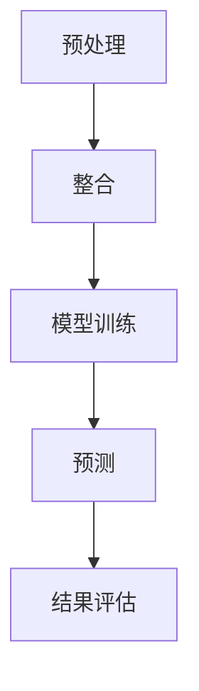

                 

# 企业级跨模态学习平台：整合多维度数据

## 关键词

- 跨模态学习
- 企业级平台
- 多维度数据整合
- 模型设计
- 系统架构
- 实际案例

## 摘要

本文旨在探讨企业级跨模态学习平台的构建，重点关注多维度数据的整合技术。通过对跨模态学习的背景、核心概念、平台架构设计、数据整合技术以及实际应用的深入分析，本文旨在为读者提供一个系统且全面的技术解决方案，帮助企业更好地利用跨模态学习技术，提升数据处理和分析能力。

## 1. 跨模态学习技术概述

### 1.1 问题背景

随着信息时代的到来，数据量呈指数级增长，传统的单一模态数据处理方式已难以满足现代企业的需求。跨模态学习作为一种新兴技术，通过整合不同类型的数据（如图像、文本、声音等），提供了一种更高效、更全面的解决方案。

### 1.2 跨模态学习定义

跨模态学习是指利用一种模态的数据去预测另一种模态的数据，或将一种模态的数据映射到另一种模态上。其核心在于如何有效地将不同模态的数据进行融合，并从中提取有价值的信息。

### 1.3 企业级跨模态学习需求

企业级跨模态学习平台需要具备高效的数据处理能力、灵活的模型设计以及强大的数据处理和分析能力。此外，平台还需要具备良好的扩展性和可维护性，以适应不断变化的企业需求。

## 2. 跨模态学习平台架构设计

### 2.1 平台总体架构

企业级跨模态学习平台的总体架构可以分为以下几个模块：

1. 数据采集与预处理模块：负责收集不同类型的数据，并进行预处理，如数据清洗、去噪、格式化等。
2. 跨模态数据整合模块：将预处理后的数据进行整合，形成统一的数据格式。
3. 模型训练与优化模块：利用整合后的数据进行模型训练，并进行模型优化。
4. 模型部署与预测模块：将训练好的模型部署到生产环境中，并提供预测服务。

### 2.2 数据流与处理流程

数据流与处理流程如下：

1. 数据采集：从不同的数据源（如图像库、文本库、音频库等）中采集数据。
2. 数据预处理：对采集到的数据进行清洗、去噪、格式化等处理。
3. 数据整合：将预处理后的数据按照一定的规则进行整合，形成统一的数据格式。
4. 模型训练：利用整合后的数据进行模型训练，并对模型进行优化。
5. 模型部署：将训练好的模型部署到生产环境中，并提供预测服务。

### 2.3 系统模块划分

系统模块划分如下：

1. 数据采集模块：包括数据采集工具、数据源管理器等。
2. 数据预处理模块：包括数据清洗工具、数据格式化工具等。
3. 跨模态数据整合模块：包括数据整合算法、数据融合策略等。
4. 模型训练模块：包括模型训练算法、模型优化策略等。
5. 模型部署模块：包括模型部署工具、模型服务接口等。

## 3. 多维度数据整合技术

### 3.1 多维度数据集成

多维度数据集成是将来自不同源、不同格式、不同结构的数据进行整合，以形成一个统一的数据视图。其关键在于解决数据的一致性、完整性和质量等问题。

### 3.2 多维度数据融合

多维度数据融合是将不同维度、不同结构的数据进行融合，以提取出更多的信息和价值。常见的融合方法包括：

1. 简单融合：直接将不同维度的数据合并，形成新的数据集。
2. 特征级融合：将不同维度的数据通过特征提取和转换，形成统一的特征向量。
3. 模型级融合：利用深度学习等模型，将不同维度的数据进行融合，并预测出新的结果。

### 3.3 融合效果评估

融合效果评估是衡量多维度数据融合效果的重要手段。常见的评估指标包括：

1. 准确率：预测结果与真实结果的匹配度。
2. 召回率：能够召回多少真实结果。
3. F1 分数：准确率和召回率的平衡指标。

## 4. 平台实现与部署

### 4.1 平台开发环境搭建

平台开发环境包括以下工具和框架：

1. Python：作为主要编程语言。
2. TensorFlow：用于模型训练和优化。
3. Flask：用于搭建模型服务接口。

### 4.2 平台部署与运维

平台部署与运维主要包括以下内容：

1. 部署策略：选择合适的部署方案，如容器化部署、云部署等。
2. 系统监控：监控系统的运行状态，包括CPU、内存、网络等。
3. 故障处理：及时处理系统故障，确保系统稳定运行。

## 5. 案例分析

### 5.1 案例介绍

以某金融企业为例，该企业希望通过跨模态学习技术，提升客户服务体验。具体案例包括：

1. 客户画像构建：通过整合客户数据，构建客户画像。
2. 情感分析：通过对客户反馈进行情感分析，了解客户满意度。

### 5.2 案例分析

通过对该金融企业的实际案例进行分析，我们可以看到跨模态学习技术在实际应用中的价值。具体分析如下：

1. 客户画像构建：通过整合客户数据，构建客户画像，帮助企业更好地了解客户需求，提供个性化服务。
2. 情感分析：通过对客户反馈进行情感分析，了解客户满意度，为企业改进服务质量提供依据。

## 6. 总结与展望

本文介绍了企业级跨模态学习平台的构建，重点关注了多维度数据的整合技术。通过对平台架构、实现与部署的详细分析，以及实际案例的探讨，本文为企业提供了有效的技术解决方案。未来，随着跨模态学习技术的不断发展，企业级跨模态学习平台将在更多领域得到应用。

## 作者信息

作者：AI天才研究院/AI Genius Institute & 禅与计算机程序设计艺术 /Zen And The Art of Computer Programming

## 附录

本文中使用的 Mermaid 流程图和 LaTeX 数学公式如下：

### Mermaid 流程图

### LaTeX 数学公式

$$
E = mc^2
$$

$
1 + 1 = 2
$

