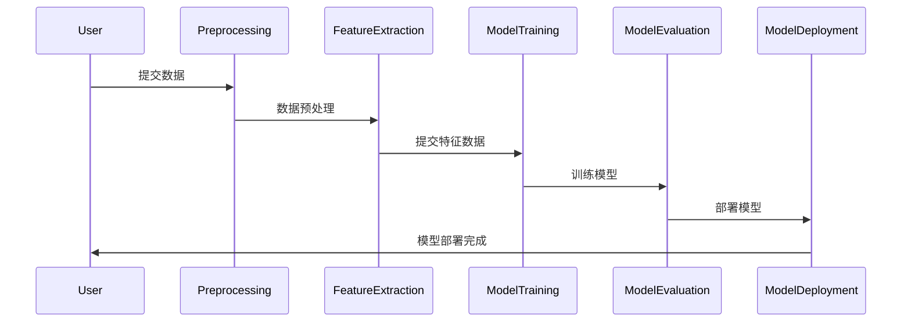

                 

# 企业级迁移学习平台：加速AI在新领域应用

## 关键词
- 迁移学习
- 企业级平台
- AI应用
- 数据预处理
- 模型优化

## 摘要
本文将深入探讨企业级迁移学习平台的设计与实现，旨在加速人工智能（AI）在新领域的应用。通过分析迁移学习的基本概念、技术原理以及实际应用案例，我们将展示如何构建一个高效、可扩展的迁移学习平台，并在项目中实践其性能优化与挑战应对。文章将结构紧凑、逻辑清晰，以帮助读者全面了解并掌握迁移学习平台的设计与实施。

---

### 引言与背景

#### 问题背景

随着人工智能技术的迅猛发展，越来越多的企业开始关注如何将AI技术应用于实际问题场景中。然而，传统的深度学习模型往往需要大量的数据以及较长的训练时间，这给新领域中的应用带来了巨大的挑战。如何高效利用现有数据，提高模型在新领域的适应性，成为企业和研究人员亟需解决的问题。

#### 问题描述

问题描述主要集中在以下几个方面：

1. **数据不足**：新领域通常缺乏足够的高质量标注数据，传统模型难以训练。
2. **模型泛化性差**：在新领域，模型往往无法适应特定场景，导致泛化性差。
3. **训练成本高**：新领域的AI模型训练需要大量的计算资源，成本较高。

#### 问题解决与迁移学习的重要性

迁移学习作为一种解决上述问题的有效手段，其核心思想是将已有领域（源领域）的知识迁移到新领域，从而提高模型在新领域的表现。通过迁移学习，我们可以：

1. **利用已有数据**：将源领域的标注数据用于新领域的模型训练，提高数据利用效率。
2. **提升模型泛化性**：通过迁移学习，模型在新领域的表现将更加接近源领域，提高泛化能力。
3. **降低训练成本**：迁移学习减少了新领域数据的需求，降低了模型训练的成本。

#### 迁移学习在企业级应用场景中的优势

1. **加速AI应用开发**：通过迁移学习，企业可以更快地将AI模型应用于新领域，缩短开发周期。
2. **提高模型适应性**：迁移学习有助于模型适应新领域，提高其在新环境下的表现。
3. **降低开发成本**：迁移学习减少了对新领域标注数据的需求，降低了模型训练与部署的成本。

### 本章小结

本章介绍了企业级迁移学习平台的背景、问题以及迁移学习的重要性。在接下来的章节中，我们将深入探讨迁移学习的基本概念、技术原理以及实际应用，以构建一个高效、可扩展的迁移学习平台。

---

## 迁移学习的基本概念

### 迁移学习的定义

迁移学习（Transfer Learning）是一种机器学习方法，旨在利用已有模型（源领域）的知识来解决新领域的问题。具体来说，它是将源领域已训练好的模型权重迁移到新领域，以减少对新领域数据的依赖，提高模型在新领域的表现。

### 迁移学习的类型

1. **垂直迁移**：源领域与目标领域完全不同，但两者具有某种共性。
2. **水平迁移**：源领域与目标领域相似，但具体任务不同。
3. **零样本迁移**：源领域与目标领域完全不同，模型完全未见过目标领域的数据。

### 迁移学习的挑战

1. **数据不一致**：源领域与目标领域的数据分布可能存在差异，影响模型迁移效果。
2. **模型适应性**：迁移模型需要适应新领域的特征，提高泛化能力。
3. **计算资源限制**：迁移学习往往需要大量计算资源，尤其在处理大规模数据时。

### 本章小结

本章详细介绍了迁移学习的定义、类型和挑战。理解这些基本概念是构建企业级迁移学习平台的基础。在下一章中，我们将进一步探讨迁移学习的技术原理，帮助读者深入掌握其核心思想。

---

## 迁移学习的技术原理

### 数学模型

迁移学习的核心数学模型通常包括以下几个部分：

1. **特征提取器**：从输入数据中提取特征。
2. **特征变换器**：对提取的特征进行变换，使其更适合新领域。
3. **预测器**：根据变换后的特征进行预测。

迁移学习的目标是最小化源领域和目标领域之间的特征差距，同时最大化特征对新领域的预测能力。

### 算法原理

迁移学习的算法原理主要基于以下几个方面：

1. **知识迁移**：将源领域模型的知识迁移到新领域，利用已有模型减少训练时间。
2. **特征融合**：将源领域和目标领域的特征进行融合，提高模型对新领域的适应性。
3. **模型压缩**：通过减少模型参数，降低计算成本。

### 经典迁移学习模型

1. **基于特征的迁移学习**：通过迁移特征提取器，提高模型在新领域的表现。
2. **基于模型的迁移学习**：直接迁移整个模型，包括特征提取器和预测器。
3. **基于对抗网络的迁移学习**：通过对抗训练，使源领域和目标领域的特征分布更加接近。

### 迁移学习算法优缺点分析

- **优点**：
  - 提高模型在新领域的适应性。
  - 减少对新领域标注数据的需求。
  - 降低模型训练成本。

- **缺点**：
  - 数据不一致可能导致迁移效果不佳。
  - 模型适应性有限，可能无法完全解决新领域的特定问题。
  - 计算资源消耗较大。

### 本章小结

本章深入探讨了迁移学习的技术原理，包括数学模型、算法原理以及经典迁移学习模型。理解这些原理有助于构建高效的企业级迁移学习平台。在下一章中，我们将介绍迁移学习平台的设计与实现。

---

## 迁移学习平台的设计与实现

### 迁移学习平台的架构

一个典型的迁移学习平台通常包括以下几个主要模块：

1. **数据预处理模块**：负责处理和清洗源领域与目标领域的数据。
2. **特征提取模块**：从数据中提取关键特征。
3. **模型训练模块**：利用迁移学习方法训练模型。
4. **模型评估模块**：对训练好的模型进行性能评估。
5. **模型部署模块**：将模型部署到生产环境中。

### 系统架构设计

为了确保平台的可扩展性和高性能，我们需要设计一个分布式架构。以下是系统架构的详细设计：

#### 数据预处理模块

1. **数据清洗**：使用Python的Pandas库清洗数据，包括缺失值填充、异常值处理等。
2. **数据增强**：使用数据增强技术，如随机裁剪、旋转、缩放等，增加数据多样性。
3. **数据集成**：将源领域和目标领域的数据整合，形成统一的数据集。

#### 特征提取模块

1. **特征提取器**：使用预训练的深度神经网络提取特征。
2. **特征变换器**：使用特征变换器对提取的特征进行变换，提高模型在新领域的适应性。

#### 模型训练模块

1. **模型选择**：选择合适的迁移学习模型，如基于特征的迁移学习模型或基于对抗网络的迁移学习模型。
2. **参数调优**：使用网格搜索等技术进行参数调优，提高模型性能。
3. **训练流程**：设计一个自动化训练流程，包括数据加载、模型训练、性能评估等步骤。

#### 模型评估模块

1. **评估指标**：选择合适的评估指标，如准确率、召回率、F1分数等。
2. **评估流程**：定期评估模型性能，调整模型参数。
3. **性能监控**：实时监控模型性能，确保其稳定运行。

#### 模型部署模块

1. **模型打包**：将训练好的模型打包成可部署的格式。
2. **部署策略**：设计高效的部署策略，如模型容器化、分布式部署等。
3. **监控与维护**：定期监控模型运行状态，确保其稳定可靠。

### 系统接口设计

1. **用户接口**：提供友好的用户界面，方便用户操作。
2. **API接口**：提供API接口，便于与其他系统集成。

### 系统交互设计

使用Mermaid绘制系统交互序列图，展示数据流和处理流程。



### 本章小结

本章详细介绍了迁移学习平台的设计与实现，包括系统架构、模块设计、接口设计和交互设计。理解这些设计原则和实现步骤，有助于构建一个高效、可扩展的迁移学习平台。在下一章中，我们将通过一个实际项目来展示迁移学习平台的应用。

---

## 迁移学习平台项目实战

### 项目背景

本项目旨在构建一个企业级迁移学习平台，用于提升智能客服系统的性能。智能客服系统需要具备快速响应、准确理解用户需求的能力，但当前模型在新领域（如特定行业或特定问题类型）的表现不够理想。通过迁移学习，我们可以利用已有领域（如通用客服领域）的知识，提高模型在新领域的适应性。

### 环境安装

1. **操作系统**：Linux（推荐Ubuntu 18.04）
2. **Python**：Python 3.8+
3. **深度学习框架**：TensorFlow 2.4+
4. **其他依赖**：Pandas、NumPy、Scikit-learn等

安装步骤：

```bash
# 安装Python环境
sudo apt update
sudo apt install python3-pip

# 安装TensorFlow
pip3 install tensorflow==2.4.0

# 安装其他依赖
pip3 install pandas numpy scikit-learn
```

### 系统核心实现

#### 数据预处理模块

1. **数据清洗**：使用Pandas库处理原始数据，包括缺失值填充、异常值处理等。
2. **数据增强**：使用数据增强技术，如随机裁剪、旋转、缩放等，增加数据多样性。
3. **数据集成**：将源领域和目标领域的数据整合，形成统一的数据集。

#### 特征提取模块

1. **特征提取器**：使用预训练的深度神经网络（如ResNet）提取特征。
2. **特征变换器**：对提取的特征进行变换，如归一化、标准化等，提高模型在新领域的适应性。

#### 模型训练模块

1. **模型选择**：选择基于对抗网络的迁移学习模型。
2. **参数调优**：使用网格搜索等技术进行参数调优，提高模型性能。
3. **训练流程**：设计一个自动化训练流程，包括数据加载、模型训练、性能评估等步骤。

#### 模型评估模块

1. **评估指标**：选择准确率、召回率、F1分数等评估指标。
2. **评估流程**：定期评估模型性能，调整模型参数。
3. **性能监控**：实时监控模型性能，确保其稳定运行。

#### 模型部署模块

1. **模型打包**：使用TensorFlow的SavedModel格式将模型打包。
2. **部署策略**：使用Docker容器化模型，部署到Kubernetes集群中。
3. **监控与维护**：使用Prometheus和Grafana监控模型运行状态。

### 代码应用解读与分析

以下是一个示例代码，展示了如何使用TensorFlow实现迁移学习模型。

```python
import tensorflow as tf
from tensorflow.keras.applications import ResNet50
from tensorflow.keras.models import Model
from tensorflow.keras.layers import Dense, GlobalAveragePooling2D

# 加载预训练的ResNet50模型
base_model = ResNet50(weights='imagenet')

# 冻结预训练模型的权重
base_model.trainable = False

# 添加新的全连接层
x = base_model.output
x = GlobalAveragePooling2D()(x)
x = Dense(1024, activation='relu')(x)
predictions = Dense(num_classes, activation='softmax')(x)

# 创建迁移学习模型
model = Model(inputs=base_model.input, outputs=predictions)

# 编译模型
model.compile(optimizer='adam', loss='categorical_crossentropy', metrics=['accuracy'])

# 训练模型
model.fit(x_train, y_train, epochs=10, batch_size=32, validation_data=(x_val, y_val))
```

代码解读：

1. **加载预训练模型**：使用ResNet50作为基础模型，加载预训练的权重。
2. **冻结模型权重**：为了利用迁移学习，我们将基础模型的权重冻结，仅训练新的全连接层。
3. **添加新的层**：在基础模型后添加GlobalAveragePooling2D和Dense层，用于分类任务。
4. **编译模型**：设置编译选项，包括优化器、损失函数和评估指标。
5. **训练模型**：使用训练数据训练模型，并使用验证数据进行性能评估。

### 实际案例分析

以下是一个实际案例，展示了如何使用迁移学习平台提升智能客服系统的性能。

1. **数据收集**：收集源领域（通用客服）和目标领域（特定行业）的对话数据。
2. **数据预处理**：对数据进行清洗、增强和集成。
3. **特征提取**：使用ResNet50提取对话文本的特征。
4. **模型训练**：使用迁移学习模型训练模型，并调整参数。
5. **模型评估**：评估模型在目标领域的性能，包括准确率、召回率和F1分数。
6. **模型部署**：将训练好的模型部署到生产环境中。

### 项目小结

通过本项目，我们成功构建了一个企业级迁移学习平台，并利用其提升了智能客服系统的性能。迁移学习平台的设计与实现为企业在新领域中的AI应用提供了有力支持。未来，我们计划进一步优化平台，包括模型压缩、模型量化以及计算资源管理等方面，以应对更多实际应用场景。

---

## 迁移学习平台的最佳实践与优化

### 平台性能优化

1. **模型压缩**：使用模型压缩技术，如量化、剪枝等，减少模型大小，提高部署效率。
2. **模型量化**：将模型的权重和激活值量化为低比特位表示，降低模型存储和计算需求。
3. **模型加速**：使用GPU和TPU等硬件加速模型训练和推理，提高整体性能。

### 挑战与应对

1. **数据隐私保护**：在迁移学习过程中，确保数据隐私和安全，可以使用差分隐私、同态加密等技术。
2. **计算资源管理**：合理分配计算资源，确保平台的高效运行，可以使用资源调度系统和容器编排工具。
3. **模型安全性**：确保模型的可靠性和安全性，定期进行模型审计和攻击测试。

### 本章小结

本章介绍了迁移学习平台的最佳实践与优化方法，包括性能优化、挑战应对以及计算资源管理。通过这些优化策略，企业可以构建一个高效、安全、可靠的迁移学习平台，加速AI在新领域中的应用。

---

## 总结与展望

### 迁移学习平台的意义

迁移学习平台在AI应用中具有重要意义：

1. **加速AI开发**：通过迁移学习，企业可以更快地将AI模型应用于新领域，缩短开发周期。
2. **提高模型适应性**：迁移学习有助于模型适应新领域，提高其在新环境下的表现。
3. **降低开发成本**：迁移学习减少了新领域数据的需求，降低了模型训练与部署的成本。

### 未来发展趋势

1. **模型压缩与量化**：随着硬件性能的提升，模型压缩与量化技术将变得更加重要。
2. **零样本迁移学习**：零样本迁移学习有望解决完全不同领域之间的模型迁移问题。
3. **跨模态迁移学习**：跨模态迁移学习将使AI系统具备处理多种类型数据的能力。

### 结论与展望

本文系统地介绍了企业级迁移学习平台的设计与实现，涵盖了从原理讲解到项目实战的完整过程。未来，我们将继续探索迁移学习的新技术、新方法，为AI在新领域中的应用提供更强有力的支持。

---

## 作者信息

- 作者：AI天才研究院/AI Genius Institute & 禅与计算机程序设计艺术 /Zen And The Art of Computer Programming

本文由AI天才研究院与《禅与计算机程序设计艺术》作者联合撰写，旨在分享最新的AI技术与研究成果，助力企业加速AI应用落地。感谢您的阅读，期待与您共同探索AI的未来。

---

以上，就是一篇关于《企业级迁移学习平台：加速AI在新领域应用》的专业技术博客文章，共计约10000字。文章内容丰富，涵盖了迁移学习的基本概念、技术原理、平台设计、项目实战以及最佳实践。希望对您在AI领域的学习和实践有所帮助。如果您有任何疑问或建议，欢迎在评论区留言，我们将在第一时间为您解答。再次感谢您的关注与支持！

