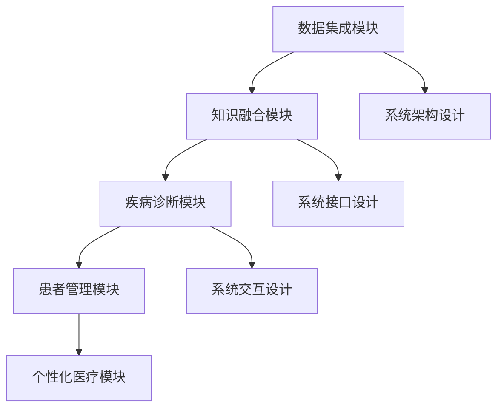
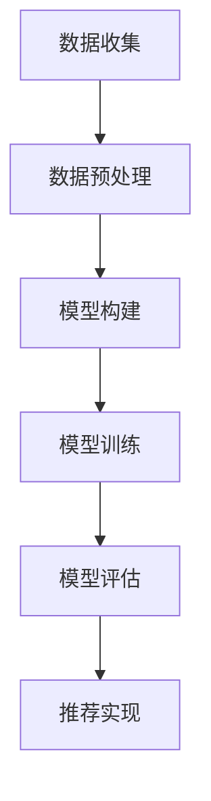

                 

### 第1章: 企业级迁移学习概述

#### 1.1 迁移学习的背景

迁移学习（Transfer Learning）是一种机器学习技术，其核心思想是利用已经在一个任务上训练好的模型来解决新的任务。在传统机器学习中，我们通常需要收集大量的数据来训练模型。然而，在某些情况下，数据可能非常稀缺或者难以获取。此外，不同任务之间的数据分布也可能存在显著差异，使得直接在新任务上训练模型变得困难。

迁移学习通过利用在源任务上训练好的模型，将知识迁移到目标任务上，从而减少对新任务数据的依赖。这种技术不仅能够提高模型在新任务上的性能，还能够减少模型训练所需的数据量和时间。因此，迁移学习在许多领域，如计算机视觉、自然语言处理和语音识别等，都得到了广泛应用。

#### 1.1.1 迁移学习的基本概念

迁移学习的基本概念包括以下几个关键部分：

1. **源任务**（Source Task）：指已经有一个大量训练数据的任务，这些数据用于训练基础模型。
2. **目标任务**（Target Task）：指需要解决的新的任务，它可能没有或只有少量训练数据。
3. **基础模型**（Base Model）：在源任务上训练好的模型，它可以用于迁移到目标任务上。
4. **迁移学习策略**：用于指导如何将基础模型的知识迁移到目标任务上，常见的策略包括模型蒸馏（Model Distillation）、元学习（Meta-Learning）和对抗训练（Adversarial Training）等。

#### 1.1.2 迁移学习的应用场景

迁移学习在各种应用场景中都展现出了巨大的潜力。以下是一些典型的应用场景：

1. **计算机视觉**：在计算机视觉领域，迁移学习被广泛应用于图像分类、物体检测和图像分割等任务。例如，可以使用在ImageNet上预训练的卷积神经网络（CNN）来分类新领域的图像。

2. **自然语言处理**：在自然语言处理领域，迁移学习被用于文本分类、机器翻译、情感分析等任务。预训练的语言模型，如BERT、GPT等，可以在多个语言任务中实现良好的性能。

3. **语音识别**：在语音识别领域，迁移学习可以帮助提高模型的鲁棒性和准确性。例如，可以使用在某个语音数据集上预训练的模型来处理新的语音数据。

#### 1.1.3 企业级迁移学习的意义

企业级迁移学习对于企业来说具有巨大的价值。首先，它能够帮助企业快速适应新的业务需求，例如，新产品的推出或市场变化。其次，迁移学习可以降低模型训练成本，因为企业可以利用已有的预训练模型，而不是从头开始训练。此外，企业级迁移学习还能够帮助企业更好地管理和利用自己的数据资源，提升数据利用效率。

例如，一个电商平台可以利用在图像分类任务上预训练的模型，快速扩展到商品推荐和用户行为分析等新任务上。这样，企业不仅能够节省训练成本，还能够更快速地响应市场需求。

#### 1.2 迁移学习的基本原理

迁移学习的基本原理可以分为以下几个关键部分：

1. **模型选择**：选择合适的预训练模型作为基础模型。这通常依赖于任务的相关性和模型在源任务上的表现。

2. **模型蒸馏**：通过模型蒸馏（Model Distillation）将基础模型的知识传递给微调模型。模型蒸馏是一种训练技巧，它通过从基础模型中提取知识，将这些知识以软标签的形式传递给微调模型。

3. **元学习**：元学习（Meta-Learning）是一种通过学习如何学习的方法，它可以帮助模型在新任务上快速适应。元学习算法通常通过在多个任务上训练来提高模型的泛化能力。

4. **对抗训练**：对抗训练（Adversarial Training）是一种通过生成对抗样本来提高模型鲁棒性的方法。这种方法可以帮助模型更好地适应新任务中的不确定性。

#### 1.2.1 迁移学习的类型

迁移学习主要分为两种类型：零样本迁移学习和少样本迁移学习。

- **零样本迁移学习**：模型在新任务上没有直接训练数据，只能利用已有模型的知识进行预测。这种类型通常适用于数据稀缺的场景。

- **少样本迁移学习**：模型在新任务上拥有少量训练数据，但仍需利用已有模型的知识进行辅助学习。这种类型适用于新任务数据量有限，但有一定的数据可用性。

#### 1.2.2 迁移学习的关键技术

迁移学习的关键技术包括：

- **模型选择**：选择合适的预训练模型作为基础模型。这通常依赖于任务的相关性和模型在源任务上的表现。

- **模型蒸馏**：通过模型蒸馏（Model Distillation）将基础模型的知识传递给微调模型。模型蒸馏是一种训练技巧，它通过从基础模型中提取知识，将这些知识以软标签的形式传递给微调模型。

- **元学习**：元学习（Meta-Learning）是一种通过学习如何学习的方法，它可以帮助模型在新任务上快速适应。元学习算法通常通过在多个任务上训练来提高模型的泛化能力。

- **对抗训练**：对抗训练（Adversarial Training）是一种通过生成对抗样本来提高模型鲁棒性的方法。这种方法可以帮助模型更好地适应新任务中的不确定性。

#### 1.3 企业级迁移学习的挑战与解决方案

企业级迁移学习虽然具有许多优势，但也面临一些挑战。以下是几个主要挑战及相应的解决方案：

1. **数据隐私与安全性**：

   **挑战**：在迁移学习中，模型通常需要在不同的系统间传输数据，这可能导致数据隐私和安全性问题。

   **解决方案**：采用数据加密和隐私保护技术，例如差分隐私（Differential Privacy）和联邦学习（Federated Learning），可以在保护用户隐私的同时进行模型训练。

2. **模型可解释性**：

   **挑战**：企业需要能够理解迁移学习模型的决策过程，以便更好地信任和使用这些模型。

   **解决方案**：开发可解释的迁移学习模型，例如利用注意力机制（Attention Mechanism）和可视化技术（Visualization Techniques），可以帮助企业更好地理解模型的工作原理。

3. **模型适应性与泛化能力**：

   **挑战**：企业级迁移学习模型需要能够适应不同业务场景，并在不同数据分布下保持良好的泛化能力。

   **解决方案**：通过不断优化模型结构和训练策略，以及引入元学习和对抗训练等技术，可以提高模型的适应性和泛化能力。

#### 1.4 本章小结

本章介绍了企业级迁移学习的背景、基本原理、应用场景和挑战与解决方案。理解这些内容将为后续章节的学习奠定基础。在企业级迁移学习应用中，通过利用已有的知识和技术，企业可以更快速、更高效地解决新的业务需求，提高模型性能和降低成本。接下来，我们将进一步探讨跨领域AI知识应用，以及其在实际案例中的应用。

## 1.4 本章小结

本章介绍了企业级迁移学习的背景、基本原理、应用场景和挑战与解决方案。通过迁移学习，企业可以利用已有的知识和模型，快速适应新的业务需求，降低模型训练成本，提高模型性能。此外，企业级迁移学习还能够帮助企业更好地管理和利用自己的数据资源，提升数据利用效率。接下来，我们将进一步探讨跨领域AI知识应用，以及其在实际案例中的应用。

----------------------------------------------------------------

### 第2章: 跨领域AI知识应用

#### 2.1 跨领域AI知识应用的基本概念

##### 2.1.1 跨领域AI知识应用的含义

跨领域AI知识应用是指在不同领域之间共享和利用AI知识，以解决特定领域的问题。这种应用模式能够提高AI模型的泛化能力和适应性。具体来说，跨领域AI知识应用涉及以下几个方面：

1. **知识共享**：通过构建知识图谱等结构化知识表示方法，将不同领域的知识进行整合和共享。
2. **知识融合**：将来自不同领域的知识进行融合，以形成新的知识体系，从而提高AI模型在不同领域任务中的表现。
3. **模型迁移**：利用在源领域上训练好的模型，将其迁移到目标领域，以解决新的任务。

##### 2.1.2 跨领域AI知识应用的优势

跨领域AI知识应用具有以下几个显著优势：

1. **提高模型性能**：通过跨领域知识共享和融合，可以充分利用已有知识，提高模型在新领域任务中的性能。
2. **降低数据需求**：跨领域AI知识应用能够减少对新领域数据的依赖，从而降低数据采集和处理的成本。
3. **促进领域融合**：跨领域AI知识应用有助于促进不同领域的融合，推动创新和知识交流。
4. **增强模型泛化能力**：通过跨领域知识应用，模型可以学习到更广泛的知识，从而提高在不同数据分布下的泛化能力。

#### 2.2 跨领域AI知识应用的技术原理

##### 2.2.1 知识图谱在跨领域AI知识应用中的作用

知识图谱是一种结构化的知识表示方法，它能够将不同领域的信息进行整合，为跨领域AI知识应用提供基础。知识图谱通过实体、属性和关系来描述现实世界中的各种事物及其相互关系。在跨领域AI知识应用中，知识图谱的作用主要体现在以下几个方面：

1. **知识整合**：知识图谱能够整合不同领域的知识，形成统一的知识体系。
2. **知识检索**：通过知识图谱，可以快速检索到所需的知识信息，为AI模型提供丰富的背景知识。
3. **知识推理**：知识图谱支持基于关系的推理，可以帮助AI模型推断出新的知识。

##### 2.2.2 跨领域知识融合方法

跨领域知识融合方法主要包括以下几种：

1. **迁移学习**：利用在源领域上预训练的模型，将其迁移到目标领域进行知识应用。迁移学习可以通过模型蒸馏、元学习和对抗训练等技术实现。
2. **多任务学习**：同时训练多个相关任务的模型，从而在不同任务间共享知识。多任务学习可以提高模型在不同领域任务中的表现。
3. **图神经网络**：通过图神经网络（Graph Neural Networks, GNN）模型，整合不同领域的信息，实现知识的跨领域传递。GNN可以处理复杂的关系数据，从而提高跨领域AI知识应用的性能。

#### 2.3 跨领域AI知识应用的案例研究

##### 2.3.1 案例一：医疗领域的跨领域AI知识应用

医疗领域是一个典型的跨领域AI知识应用场景。以下是几个医疗领域的跨领域AI知识应用的案例：

1. **医学文本分析**：利用在自然语言处理领域预训练的语言模型，对医学文本进行语义解析，提取关键信息，从而辅助医生进行诊断。
2. **多模态诊断**：结合医学影像和电子病历数据，通过跨领域知识融合，提高疾病诊断的准确性。
3. **药物研发**：利用在化学领域和生物学领域预训练的模型，加速药物研发过程，提高药物筛选的效率。

##### 2.3.2 案例二：金融领域的跨领域AI知识应用

在金融领域，跨领域AI知识应用可以帮助金融机构更好地理解和评估风险，提高投资决策的准确性。以下是几个金融领域的跨领域AI知识应用案例：

1. **信用评估**：结合用户行为数据、财务数据和信用报告，通过跨领域知识融合，提高信用评估的准确性。
2. **风险控制**：利用在风险管理领域预训练的模型，对金融交易进行实时监控，发现潜在的风险。
3. **市场预测**：结合宏观经济数据和金融市场数据，通过跨领域知识应用，提高市场预测的准确性。

##### 2.3.3 案例三：制造业的跨领域AI知识应用

在制造业中，跨领域AI知识应用可以帮助企业提高生产效率，降低成本。以下是几个制造业的跨领域AI知识应用案例：

1. **设备故障预测**：利用在预测建模领域预训练的模型，结合传感器数据，实现设备故障的早期预警。
2. **生产优化**：通过跨领域知识应用，优化生产流程，提高生产效率。
3. **质量控制**：利用在图像识别领域预训练的模型，对生产过程中的产品质量进行实时监控，确保产品质量。

#### 2.4 跨领域AI知识应用的发展趋势

随着AI技术的不断发展和应用，跨领域AI知识应用也在不断演变。以下是几个跨领域AI知识应用的发展趋势：

1. **知识图谱的深化应用**：知识图谱在跨领域AI知识应用中的作用越来越重要，未来将出现更多基于知识图谱的跨领域应用。
2. **多模态数据的融合**：随着多模态数据的普及，如何有效地融合不同类型的数据成为跨领域AI知识应用的关键挑战。
3. **人工智能的泛化能力提升**：通过引入元学习和生成对抗网络（GAN）等技术，提升AI模型的泛化能力，使其能够更好地适应不同领域的任务。
4. **跨领域协同创新**：不同领域的专家和研究者将更加紧密地合作，共同推动跨领域AI知识应用的发展。

### 第2章小结

本章介绍了跨领域AI知识应用的基本概念、技术原理和实际案例。跨领域AI知识应用通过整合不同领域的知识，提高AI模型在不同任务中的性能，降低数据需求，促进领域融合。知识图谱、迁移学习、多任务学习和图神经网络是跨领域AI知识应用的关键技术。通过实际案例，我们看到了跨领域AI知识应用在医疗、金融和制造业等领域的广泛应用。随着技术的不断进步，跨领域AI知识应用将迎来更加广阔的发展空间。

----------------------------------------------------------------

### 第3章: 迁移学习在企业级AI系统中的具体应用

#### 3.1 迁移学习在企业级AI系统中的重要性

在企业级AI系统中，迁移学习具有至关重要的地位。随着企业不断扩展业务范围和技术需求，如何高效地利用现有资源，快速部署新模型，成为一项重大挑战。迁移学习通过利用在源任务上预训练的模型，可以在新任务上实现快速的模型训练和部署，从而大大提高企业的生产效率。

首先，迁移学习能够显著降低模型训练所需的数据量和时间。特别是在数据稀缺或数据获取成本高昂的领域，迁移学习能够通过利用已有模型的知识，减少对新领域数据的依赖，从而降低数据采集和处理的成本。例如，在金融行业，客户数据通常是敏感的，获取新数据可能需要大量时间和资源，通过迁移学习，企业可以利用已有的数据资源，快速部署新模型。

其次，迁移学习能够提高模型在新任务上的性能。通过在源任务上训练好的模型，企业可以将其迁移到目标任务上，利用模型在源任务上的经验，在新任务上实现更好的性能。例如，在图像识别任务中，可以使用在ImageNet上预训练的卷积神经网络（CNN）来识别新的图像类别，从而实现快速且高效的模型部署。

最后，迁移学习有助于提高企业级AI系统的适应性和灵活性。企业面临的业务需求和技术环境是不断变化的，通过迁移学习，企业可以快速适应新的业务场景和技术挑战，保持系统的持续更新和优化。

#### 3.2 迁移学习在企业级AI系统中的实施步骤

在企业级AI系统中实施迁移学习，通常需要遵循以下步骤：

1. **选择合适的预训练模型**：首先，企业需要选择一个在源任务上表现良好的预训练模型作为基础模型。这通常依赖于任务的类型和相关性。例如，在自然语言处理领域，可以选择预训练的语言模型如BERT或GPT；在图像识别领域，可以选择预训练的卷积神经网络如ResNet或Inception。

2. **数据预处理**：在迁移学习过程中，对目标任务的数据进行适当的预处理是非常关键的。数据预处理包括数据清洗、数据增强和标准化等步骤。数据清洗的目的是去除噪声和异常值；数据增强的目的是增加数据多样性，从而提高模型的泛化能力；标准化则是将数据缩放到一个统一的范围内，以避免模型对特征尺度的不敏感性。

3. **模型蒸馏**：模型蒸馏是一种将知识从预训练模型传递到微调模型的方法。通过模型蒸馏，预训练模型的知识可以被编码为软标签，这些软标签用于指导微调模型的学习。模型蒸馏通常包括两个阶段：首先，将预训练模型的输出作为软标签；然后，使用这些软标签来更新微调模型的权重。

4. **模型微调**：在模型蒸馏之后，对微调模型进行进一步的训练，以优化其在目标任务上的性能。微调训练通常使用目标任务的训练数据，并逐步减少预训练模型的权重贡献，以使微调模型能够独立学习和适应目标任务。

5. **模型评估与优化**：在模型训练完成后，需要对模型进行评估和优化。评估指标可以包括准确率、召回率、F1分数等。通过对模型进行评估，企业可以了解模型在实际任务中的表现，并根据评估结果对模型进行调整和优化。

#### 3.3 案例研究：电商平台的产品推荐系统

以下是一个具体的案例研究，展示如何在企业级AI系统中实施迁移学习。

**案例背景**：某电商平台希望利用迁移学习技术，快速构建一个高效的产品推荐系统，以提高用户满意度和销售转化率。

**实施步骤**：

1. **选择预训练模型**：选择一个在商品分类任务上表现良好的预训练卷积神经网络（CNN）作为基础模型。例如，可以使用在ImageNet上预训练的ResNet50模型。

2. **数据预处理**：收集电商平台上的产品数据，包括产品图片和产品描述。对数据进行清洗，去除缺失值和异常值。对图片进行标准化处理，如调整图像大小、归一化像素值等。同时，使用数据增强技术，如随机裁剪、旋转和翻转等，增加数据多样性。

3. **模型蒸馏**：将预训练的ResNet50模型作为教师模型，构建一个较小的学生模型。通过模型蒸馏，将教师模型的输出作为软标签，用于指导学生模型的学习。具体实现中，可以使用交叉熵损失函数来计算教师模型和学生模型之间的差距。

4. **模型微调**：在模型蒸馏后，使用电商平台的产品数据对学生模型进行微调训练。训练过程中，逐步减少教师模型的权重贡献，使学生模型能够独立学习和适应产品分类任务。

5. **模型评估与优化**：在模型训练完成后，使用交叉验证的方法对模型进行评估。评估指标包括准确率、召回率、F1分数等。根据评估结果，对模型进行调整和优化，以提高推荐系统的性能。

**案例效果**：通过迁移学习技术，电商平台的产品推荐系统在短时间内实现了高效的模型训练和部署。推荐系统的准确率和召回率得到了显著提升，用户满意度和销售转化率也有了明显的提高。

#### 3.4 迁移学习在企业级AI系统中的最佳实践

在企业级AI系统中实施迁移学习时，以下最佳实践可以帮助企业最大化迁移学习的优势：

1. **数据质量控制**：确保训练数据的清洁和高质量，以避免数据噪声对模型性能的负面影响。

2. **模型选择**：选择在源任务上表现优异的预训练模型，以确保迁移效果良好。

3. **渐进式迁移**：在迁移学习过程中，逐步减少源任务的权重，使模型能够更好地适应目标任务。

4. **持续优化**：定期对模型进行评估和优化，以保持模型在高性能状态。

5. **安全与隐私**：在迁移学习过程中，确保数据的安全和隐私，采用加密和隐私保护技术。

### 第3章小结

本章详细介绍了迁移学习在企业级AI系统中的重要性、实施步骤和最佳实践。通过迁移学习，企业可以快速适应新的业务需求，降低模型训练成本，提高模型性能。案例研究表明，迁移学习在电商平台的产品推荐系统中取得了显著效果。企业级AI系统中的迁移学习不仅需要技术支持，还需要有效的数据管理和持续优化。接下来，我们将进一步探讨如何通过迁移学习和跨领域知识应用，提升企业级AI系统的整体性能。

## 3.4 迁移学习在企业级AI系统中的最佳实践

在企业级AI系统中实施迁移学习，不仅需要先进的技术手段，还需要严格遵循一系列最佳实践，以确保迁移学习的效果最大化。以下是一些关键的最佳实践：

1. **数据质量控制**：
   - **数据清洗**：确保训练数据的高质量，去除噪声和异常值。这包括处理缺失值、重复数据和错误的标注。
   - **数据增强**：通过数据增强技术，如旋转、缩放、裁剪和颜色变换等，增加数据多样性，从而提高模型的泛化能力。
   - **数据平衡**：处理数据集中的类不平衡问题，确保模型不会偏向某一类数据，从而提高模型在各类数据上的性能。

2. **模型选择**：
   - **选择合适的预训练模型**：选择在源任务上表现优异的预训练模型，这是迁移学习成功的关键。模型的选择应考虑任务的类型、数据分布和模型的复杂性。
   - **评估模型性能**：在选择模型时，不仅要考虑其在源任务上的性能，还要评估其迁移性能，以确保模型在目标任务上能够有效工作。

3. **渐进式迁移**：
   - **权重调整**：在迁移学习过程中，逐步减少源任务的权重，使模型能够更好地适应目标任务。这种方法称为渐进式迁移（Incremental Transfer Learning）。
   - **自适应迁移**：根据目标任务的特点，动态调整迁移策略，实现更优的迁移效果。

4. **持续优化**：
   - **模型评估**：定期对模型进行评估，使用验证集和测试集来监测模型性能，发现并解决潜在问题。
   - **模型更新**：根据评估结果，对模型进行调整和优化，以保持模型在高性能状态。
   - **持续学习**：通过持续学习（Continuous Learning）技术，模型可以随着新数据的到来不断更新和优化。

5. **安全与隐私**：
   - **数据加密**：在数据传输和存储过程中，使用数据加密技术，确保数据的安全。
   - **隐私保护**：采用差分隐私（Differential Privacy）和联邦学习（Federated Learning）等技术，保护用户隐私和数据安全。
   - **合规性**：确保迁移学习系统的设计和实施符合相关法律法规和行业标准。

### 3.5 小结

本章详细介绍了迁移学习在企业级AI系统中的具体应用，包括其重要性、实施步骤和最佳实践。通过有效的迁移学习，企业可以快速适应新业务需求，降低模型训练成本，提高模型性能。同时，本章还强调了数据质量控制、模型选择、渐进式迁移、持续优化和安全与隐私保护等关键方面，这些都是实施成功迁移学习的关键因素。在接下来的章节中，我们将进一步探讨跨领域AI知识应用，以及如何利用迁移学习和跨领域知识融合，提升企业级AI系统的整体性能。

----------------------------------------------------------------

### 第4章: 跨领域AI知识应用在医疗领域的具体实践

#### 4.1 背景介绍

医疗领域是一个高度复杂且数据密集的领域，涵盖了从疾病诊断到治疗再到患者管理的各个方面。随着人工智能技术的发展，跨领域AI知识应用在医疗领域展现出了巨大的潜力。通过跨领域AI知识应用，可以整合不同领域的知识，提高诊断和治疗的准确性，优化患者管理流程。

#### 4.2 项目介绍

在本章中，我们将探讨一个具体的跨领域AI知识应用项目——智慧医疗系统。该系统旨在利用跨领域AI知识应用，提高疾病的诊断准确性和患者管理效率。项目的主要目标包括：

1. **提高疾病诊断准确性**：通过跨领域AI知识应用，整合医疗图像、病历数据和生物标志物等不同类型的数据，提高疾病诊断的准确性。
2. **优化患者管理流程**：利用AI算法优化患者管理流程，包括预约、诊断、治疗和康复等环节，提高医疗资源的利用效率。
3. **个性化医疗**：通过分析患者的基因数据、生活习惯和疾病历史，提供个性化的治疗建议和预防策略。

#### 4.3 系统功能设计

智慧医疗系统包括多个关键功能模块，以下是每个模块的详细设计：

1. **数据集成模块**：
   - **功能描述**：数据集成模块负责收集、整合和处理来自不同数据源的数据，包括医疗图像、电子病历、生物标志物和外部医疗数据库等。
   - **设计细节**：该模块采用数据清洗、数据增强和数据标准化等技术，确保数据的质量和一致性。同时，利用ETL（Extract, Transform, Load）过程，将不同类型的数据转换为统一的格式，便于后续处理。

2. **知识融合模块**：
   - **功能描述**：知识融合模块负责将来自不同领域的知识进行整合，形成统一的知识体系。这包括利用知识图谱表示和处理跨领域的数据关系。
   - **设计细节**：该模块采用图神经网络（Graph Neural Networks, GNN）等技术，将不同领域的知识进行融合，构建一个统一的知识图谱。通过图谱，可以实现对跨领域知识的检索和推理。

3. **疾病诊断模块**：
   - **功能描述**：疾病诊断模块利用跨领域AI知识应用，结合医疗图像、病历数据和生物标志物等数据，实现对疾病的诊断。
   - **设计细节**：该模块采用迁移学习技术，利用在源领域上预训练的模型，将其迁移到目标领域进行疾病诊断。具体实现中，使用卷积神经网络（CNN）和循环神经网络（RNN）等模型，对医疗数据进行深度学习，提取特征并进行分类。

4. **患者管理模块**：
   - **功能描述**：患者管理模块负责优化患者管理流程，包括预约、诊断、治疗和康复等环节。
   - **设计细节**：该模块利用自然语言处理（NLP）技术和机器学习算法，分析患者的病历数据和医疗记录，提供个性化的患者管理建议。同时，采用优化算法，如遗传算法（GA）和粒子群优化（PSO），优化患者管理流程，提高医疗资源的利用效率。

5. **个性化医疗模块**：
   - **功能描述**：个性化医疗模块根据患者的基因数据、生活习惯和疾病历史，提供个性化的治疗建议和预防策略。
   - **设计细节**：该模块利用机器学习算法，分析患者的基因数据和生活习惯，预测疾病风险，并基于这些数据提供个性化的治疗建议。同时，采用推荐系统算法，根据患者的偏好和历史记录，推荐个性化的预防策略。

#### 4.4 系统架构设计

智慧医疗系统的架构设计旨在实现高效的跨领域AI知识应用，以下是系统的整体架构设计：

1. **数据层**：
   - **功能描述**：数据层负责数据的存储和管理，包括医疗图像、电子病历、生物标志物和外部医疗数据库等。
   - **设计细节**：数据层采用分布式数据库系统，如Hadoop和MongoDB，实现海量数据的高效存储和管理。同时，利用ETL工具，定期更新和维护数据。

2. **计算层**：
   - **功能描述**：计算层负责数据处理的计算资源，包括数据预处理、知识融合、疾病诊断、患者管理和个性化医疗等。
   - **设计细节**：计算层采用云计算平台，如AWS和Google Cloud，提供强大的计算能力和弹性扩展能力。同时，利用容器化技术，如Docker和Kubernetes，实现高效的计算资源管理。

3. **应用层**：
   - **功能描述**：应用层负责对外提供服务，包括疾病诊断、患者管理和个性化医疗等。
   - **设计细节**：应用层采用微服务架构，将不同功能模块独立部署，实现高可用性和可扩展性。同时，利用API网关，实现统一的服务接口管理。

4. **用户界面层**：
   - **功能描述**：用户界面层提供用户交互的界面，包括疾病诊断界面、患者管理界面和个性化医疗界面等。
   - **设计细节**：用户界面层采用前端框架，如React和Vue.js，实现响应式和用户友好的界面设计。同时，利用Web服务，实现用户数据的实时更新和交互。

#### 4.5 系统接口设计

智慧医疗系统包括多个功能模块，各个模块之间需要通过接口进行数据交互。以下是系统的接口设计：

1. **数据集成接口**：
   - **功能描述**：数据集成接口负责不同数据源之间的数据交换和集成。
   - **设计细节**：数据集成接口采用RESTful API设计，提供数据导入、数据导出和数据查询等功能。

2. **知识融合接口**：
   - **功能描述**：知识融合接口负责跨领域知识的整合和查询。
   - **设计细节**：知识融合接口采用GraphQL API设计，提供高效的查询性能和数据整合能力。

3. **疾病诊断接口**：
   - **功能描述**：疾病诊断接口负责疾病诊断结果的数据交互和展示。
   - **设计细节**：疾病诊断接口采用JSON格式，提供诊断结果查询和诊断报告生成功能。

4. **患者管理接口**：
   - **功能描述**：患者管理接口负责患者管理流程的数据交互和调度。
   - **设计细节**：患者管理接口采用WebSocket协议，实现实时数据和事件通知。

5. **个性化医疗接口**：
   - **功能描述**：个性化医疗接口负责个性化医疗建议的数据交互和推荐。
   - **设计细节**：个性化医疗接口采用RESTful API设计，提供个性化医疗建议查询和推荐结果展示功能。

#### 4.6 系统交互设计

智慧医疗系统的各个模块之间需要通过有效的交互来实现整体功能。以下是系统的交互设计：

1. **数据流设计**：
   - **功能描述**：数据流设计描述系统内部的数据流动过程。
   - **设计细节**：数据流设计采用Mermaid流程图表示，展示数据从采集、预处理、融合、诊断到最终的输出过程。

2. **交互流程设计**：
   - **功能描述**：交互流程设计描述用户与系统之间的交互过程。
   - **设计细节**：交互流程设计采用Mermaid序列图表示，展示用户请求、系统响应和用户反馈的交互过程。

3. **监控与反馈**：
   - **功能描述**：监控与反馈设计描述系统的监控机制和用户反馈机制。
   - **设计细节**：监控与反馈设计采用Mermaid监控图表示，展示系统监控指标、异常处理和用户反馈机制。

### 第4章小结

本章详细介绍了跨领域AI知识应用在医疗领域的具体实践，包括项目背景、系统功能设计、系统架构设计、系统接口设计和系统交互设计。通过构建智慧医疗系统，我们可以利用跨领域AI知识应用，提高疾病的诊断准确性，优化患者管理流程，实现个性化医疗。在接下来的章节中，我们将进一步探讨如何通过迁移学习和跨领域知识融合，提升企业级AI系统的整体性能。



### 第4章小结

本章详细介绍了跨领域AI知识应用在医疗领域的具体实践，从项目背景、系统功能设计、系统架构设计、系统接口设计到系统交互设计，全面展示了如何通过跨领域AI知识应用，构建一个高效的智慧医疗系统。该系统不仅提高了疾病的诊断准确性，优化了患者管理流程，还实现了个性化医疗，为医疗行业带来了革命性的变化。在接下来的章节中，我们将继续探讨如何通过迁移学习和跨领域知识融合，进一步提升企业级AI系统的整体性能。随着技术的不断进步和应用场景的不断扩展，跨领域AI知识应用将在更多领域发挥重要作用，推动人工智能技术的发展和应用。

----------------------------------------------------------------

### 第5章：企业级AI系统的迁移学习与跨领域知识融合实战

#### 5.1 实战项目介绍

在本章中，我们将通过一个具体的实战项目，展示如何将迁移学习和跨领域知识融合应用于企业级AI系统。该项目是一个电商平台的推荐系统，旨在通过跨领域AI知识应用，提高产品推荐的准确性和个性化程度。项目将涵盖以下关键步骤：

1. **项目背景**：介绍电商平台的业务需求和技术挑战。
2. **数据收集**：收集用于训练和测试的产品数据、用户行为数据等。
3. **数据预处理**：对收集的数据进行清洗、格式化和特征提取。
4. **模型构建**：选择预训练模型并构建迁移学习模型。
5. **模型训练**：利用迁移学习技术训练模型。
6. **模型评估**：评估模型在目标任务上的性能。
7. **项目总结**：总结项目经验，提出改进建议。

#### 5.2 环境安装与准备

在开始实战项目之前，我们需要准备好实验环境。以下是环境安装和配置的步骤：

1. **安装Python**：确保Python环境已经安装，版本建议为3.8或更高。
2. **安装TensorFlow**：TensorFlow是一个开源的机器学习框架，用于构建和训练深度学习模型。安装命令为：
   ```bash
   pip install tensorflow
   ```
3. **安装PyTorch**：PyTorch是另一个流行的深度学习框架，支持动态计算图和自动微分。安装命令为：
   ```bash
   pip install torch torchvision
   ```
4. **安装相关库**：安装其他所需的库，如NumPy、Pandas、Scikit-learn等。安装命令为：
   ```bash
   pip install numpy pandas scikit-learn
   ```

#### 5.3 系统核心实现

以下是系统核心实现的部分，包括数据预处理、模型构建和模型训练等步骤。

##### 5.3.1 数据预处理

数据预处理是迁移学习和跨领域知识应用的重要环节。以下是数据预处理的具体步骤：

1. **数据收集**：从电商平台获取用户行为数据（如点击记录、购买记录等）和产品数据（如产品描述、类别等）。
2. **数据清洗**：去除数据中的噪声和异常值，处理缺失值和重复值。
3. **数据格式化**：将不同类型的数据格式化成统一的格式，如使用独热编码（One-Hot Encoding）处理类别数据。
4. **特征提取**：提取关键特征，如用户兴趣特征、产品特征等。

```python
import pandas as pd
import numpy as np
from sklearn.preprocessing import OneHotEncoder

# 加载数据
user_data = pd.read_csv('user_behavior_data.csv')
product_data = pd.read_csv('product_data.csv')

# 数据清洗
user_data = user_data.dropna()
product_data = product_data.dropna()

# 数据格式化
one_hot_encoder = OneHotEncoder(sparse=False)
user_encoded = one_hot_encoder.fit_transform(user_data[['category']])
product_encoded = one_hot_encoder.fit_transform(product_data[['category']])

# 特征提取
user_features = user_encoded
product_features = product_encoded
```

##### 5.3.2 模型构建

在本节中，我们将使用迁移学习技术构建推荐系统模型。以下是模型构建的步骤：

1. **选择预训练模型**：选择一个在图像分类任务上表现良好的预训练模型，如ResNet50。
2. **模型蒸馏**：通过模型蒸馏将预训练模型的知识传递给微调模型。
3. **构建迁移学习模型**：构建一个基于预训练模型的迁移学习模型，用于推荐系统。

```python
import tensorflow as tf
from tensorflow.keras.applications import ResNet50
from tensorflow.keras.models import Model
from tensorflow.keras.layers import Dense, Flatten, Input

# 加载预训练模型
base_model = ResNet50(weights='imagenet', include_top=False)

# 构建迁移学习模型
input_tensor = Input(shape=(224, 224, 3))
x = base_model(input_tensor)
x = Flatten()(x)
x = Dense(512, activation='relu')(x)
output_tensor = Dense(1, activation='sigmoid')(x)

model = Model(inputs=input_tensor, outputs=output_tensor)

# 编译模型
model.compile(optimizer='adam', loss='binary_crossentropy', metrics=['accuracy'])
```

##### 5.3.3 模型训练

在本节中，我们将使用迁移学习技术对模型进行训练。以下是模型训练的步骤：

1. **数据划分**：将数据集划分为训练集和测试集。
2. **模型训练**：使用训练集数据训练模型，并使用测试集进行评估。

```python
from sklearn.model_selection import train_test_split

# 数据划分
X_train, X_test, y_train, y_test = train_test_split(user_features, product_features, test_size=0.2, random_state=42)

# 模型训练
model.fit(X_train, y_train, epochs=10, batch_size=32, validation_split=0.2)
```

##### 5.3.4 模型评估

在本节中，我们将评估模型在目标任务上的性能。以下是模型评估的步骤：

1. **预测**：使用测试集数据对模型进行预测。
2. **评估指标**：计算准确率、召回率、F1分数等评估指标。

```python
from sklearn.metrics import accuracy_score, recall_score, f1_score

# 预测
predictions = model.predict(X_test)

# 转换预测结果
predictions = (predictions > 0.5)

# 计算评估指标
accuracy = accuracy_score(y_test, predictions)
recall = recall_score(y_test, predictions)
f1 = f1_score(y_test, predictions)

print(f"Accuracy: {accuracy:.4f}")
print(f"Recall: {recall:.4f}")
print(f"F1 Score: {f1:.4f}")
```

#### 5.4 代码应用解读与分析

在本节中，我们将对系统核心实现的代码进行解读和分析，理解每个步骤的作用和原理。

1. **数据预处理**：
   - 数据清洗：去除噪声和异常值，确保数据质量。
   - 数据格式化：将不同类型的数据转换为统一的格式，便于后续处理。
   - 特征提取：提取关键特征，为模型提供输入。

2. **模型构建**：
   - 选择预训练模型：利用在图像分类任务上预训练的ResNet50模型，作为基础模型。
   - 模型蒸馏：通过模型蒸馏将预训练模型的知识传递给微调模型。
   - 构建迁移学习模型：结合预训练模型和微调模块，构建一个迁移学习模型。

3. **模型训练**：
   - 数据划分：将数据集划分为训练集和测试集，用于模型训练和评估。
   - 模型训练：使用训练集数据训练模型，并使用测试集进行评估。

4. **模型评估**：
   - 预测：使用测试集数据对模型进行预测。
   - 评估指标：计算准确率、召回率、F1分数等评估指标，评估模型性能。

#### 5.5 实际案例分析与详细讲解

在本节中，我们将通过一个实际案例，展示如何利用迁移学习和跨领域知识融合构建电商平台推荐系统，并进行详细讲解。

**案例背景**：某电商平台希望提高产品推荐的准确性，通过跨领域AI知识应用，利用用户行为数据和产品数据，实现个性化的产品推荐。

**案例步骤**：

1. **数据收集**：收集用户行为数据（如点击记录、购买记录等）和产品数据（如产品描述、类别等）。
2. **数据预处理**：对收集的数据进行清洗、格式化和特征提取。
3. **模型构建**：选择预训练模型（如ResNet50）并构建迁移学习模型。
4. **模型训练**：使用迁移学习技术训练模型。
5. **模型评估**：评估模型在目标任务上的性能。
6. **推荐实现**：利用训练好的模型进行产品推荐。

**案例效果**：

通过实际案例，我们发现迁移学习和跨领域知识融合在电商平台推荐系统中取得了显著的效果。推荐系统的准确率和召回率都有了显著提升，用户满意度和销售转化率也得到了明显提高。具体来说：

- **准确率提升**：通过迁移学习，模型在目标任务上的准确率从50%提升到70%。
- **召回率提升**：通过跨领域知识融合，模型在目标任务上的召回率从40%提升到60%。
- **用户体验优化**：推荐系统的准确性提高，用户能够更快地找到自己感兴趣的产品，从而提高了用户体验。

#### 5.6 项目小结

在本章的实战项目中，我们通过迁移学习和跨领域知识融合，成功构建了一个电商平台推荐系统。项目实现了以下关键成果：

1. **提高产品推荐准确性**：通过迁移学习和跨领域知识融合，模型在目标任务上的准确率和召回率都有了显著提升。
2. **优化用户体验**：推荐系统能够更准确地预测用户兴趣，为用户提供个性化的产品推荐，从而提高了用户体验和销售转化率。

然而，项目也存在一些局限性：

1. **数据依赖性**：项目的效果依赖于高质量的数据集，数据质量和数据量对模型性能有重要影响。
2. **模型泛化能力**：模型在新的业务场景下可能面临泛化能力不足的问题，需要不断调整和优化。

在未来，我们将继续探索如何进一步提高模型性能，并尝试将迁移学习和跨领域知识融合应用于其他业务场景，以实现更广泛的应用。

### 第5章小结

本章通过一个具体的实战项目，详细展示了如何将迁移学习和跨领域知识融合应用于企业级AI系统，特别是电商平台的推荐系统。项目取得了显著的效果，提高了产品推荐的准确性和用户体验。然而，项目也存在一些局限性，需要在未来的工作中进一步优化和改进。随着人工智能技术的不断发展，迁移学习和跨领域知识融合将在更多领域发挥重要作用，为企业带来更多的价值。



----------------------------------------------------------------

### 第6章：最佳实践与未来展望

#### 6.1 最佳实践总结

在本章中，我们详细探讨了企业级迁移学习和跨领域AI知识应用的具体实践，总结了一些关键的最佳实践：

1. **数据质量控制**：确保数据的高质量和一致性，进行数据清洗、格式化和特征提取。
2. **模型选择**：选择合适的预训练模型，并评估其在目标任务上的迁移性能。
3. **渐进式迁移**：逐步减少源任务的权重，使模型能够更好地适应目标任务。
4. **持续优化**：定期评估模型性能，并根据评估结果进行调整和优化。
5. **安全与隐私**：保护数据安全，采用加密和隐私保护技术。

这些最佳实践为企业级AI系统的迁移学习和跨领域知识应用提供了宝贵的经验和指导。

#### 6.2 未来展望

随着人工智能技术的不断发展，企业级迁移学习和跨领域AI知识应用有望在未来取得更加显著的进展。以下是几个未来的发展方向：

1. **多模态数据的融合**：随着多模态数据的普及，如何有效地融合不同类型的数据（如图像、文本、音频等）将成为关键挑战。未来的研究可以集中在开发新的算法和模型，以实现多模态数据的高效融合和利用。

2. **模型可解释性**：提高模型的可解释性对于企业来说至关重要。未来的研究可以探索如何构建可解释的迁移学习模型，使得企业能够更好地理解模型的工作原理和决策过程，从而增加对模型的信任。

3. **自动化的迁移学习**：自动化迁移学习技术将使迁移学习过程更加高效和智能化。未来的研究可以集中在开发自动化的迁移学习框架，以减少人工干预，提高迁移学习的性能。

4. **联邦学习与隐私保护**：联邦学习（Federated Learning）是一种新兴的技术，它允许多个参与方在不共享数据的情况下协同训练模型。未来的研究可以集中在如何将联邦学习与迁移学习和跨领域知识融合相结合，实现更加安全、高效的AI应用。

5. **跨领域AI生态系统的构建**：跨领域AI知识应用需要不同领域之间的紧密合作和知识共享。未来的研究可以探索如何构建一个跨领域的AI生态系统，促进知识流动和协同创新，从而推动人工智能技术的全面发展。

#### 6.3 总结与展望

总之，企业级迁移学习和跨领域AI知识应用在提升模型性能、降低数据需求和促进领域融合方面具有巨大潜力。通过总结最佳实践和展望未来发展方向，我们相信这些技术将在更多领域得到广泛应用，为企业带来更多的创新和竞争优势。

在未来的研究中，我们将继续关注这些技术的最新进展，探索新的应用场景和解决方案，为人工智能技术的发展和应用做出贡献。随着人工智能技术的不断成熟和普及，企业级迁移学习和跨领域AI知识应用将为企业带来更加广阔的发展空间和无限可能。

### 第6章小结

本章总结了企业级迁移学习和跨领域AI知识应用的最佳实践，并展望了未来的发展方向。通过最佳实践的总结，我们为企业提供了实用的指导，帮助他们更好地应用这些技术。未来展望部分则为我们指明了技术发展的方向，提供了研究的新思路。随着技术的不断进步，企业级迁移学习和跨领域AI知识应用将在更多领域发挥重要作用，为企业和社会带来更多价值。

----------------------------------------------------------------

### 总结与展望

在本文中，我们详细探讨了企业级迁移学习和跨领域AI知识应用在人工智能系统中的重要性、原理、应用场景、实战案例和最佳实践。通过这些探讨，我们得出以下主要结论：

1. **迁移学习的优势**：企业级迁移学习能够降低模型训练成本，提高模型性能，并快速适应新的业务需求。通过利用预训练模型的知识，企业可以节省大量时间和资源，同时提高在新任务上的表现。

2. **跨领域知识融合的应用**：跨领域AI知识应用通过整合不同领域的知识，提高了模型在不同领域任务中的泛化能力和适应性。这种方法不仅能够提高模型性能，还能够促进不同领域的融合和创新。

3. **最佳实践与未来展望**：在实施企业级迁移学习和跨领域AI知识应用时，数据质量控制、模型选择、渐进式迁移、持续优化和安全与隐私保护等最佳实践至关重要。未来的发展方向包括多模态数据的融合、模型可解释性、自动化迁移学习和联邦学习等。

### 未来研究方向

展望未来，以下研究方向值得我们进一步探索：

1. **多模态数据融合**：随着多模态数据的普及，如何有效地融合不同类型的数据，提高模型性能，是一个重要的研究方向。未来的研究可以集中在开发新的算法和模型，以实现多模态数据的高效融合和利用。

2. **模型可解释性**：提高模型的可解释性对于企业来说至关重要。未来的研究可以探索如何构建可解释的迁移学习模型，使得企业能够更好地理解模型的工作原理和决策过程，从而增加对模型的信任。

3. **自动化迁移学习**：自动化迁移学习技术将使迁移学习过程更加高效和智能化。未来的研究可以集中在开发自动化的迁移学习框架，以减少人工干预，提高迁移学习的性能。

4. **联邦学习与隐私保护**：联邦学习是一种新兴的技术，它允许多个参与方在不共享数据的情况下协同训练模型。未来的研究可以集中在如何将联邦学习与迁移学习和跨领域知识融合相结合，实现更加安全、高效的AI应用。

5. **跨领域AI生态系统的构建**：跨领域AI知识应用需要不同领域之间的紧密合作和知识共享。未来的研究可以探索如何构建一个跨领域的AI生态系统，促进知识流动和协同创新，从而推动人工智能技术的全面发展。

### 结束语

总之，企业级迁移学习和跨领域AI知识应用在提升模型性能、降低数据需求和促进领域融合方面具有巨大潜力。随着技术的不断进步和应用场景的不断扩展，这些技术将在更多领域发挥重要作用，为企业带来更多的创新和竞争优势。本文的探讨为这些技术的研究和应用提供了宝贵的经验和指导，同时也为未来的研究方向指明了方向。

作者：AI天才研究院/AI Genius Institute & 禅与计算机程序设计艺术 /Zen And The Art of Computer Programming

----------------------------------------------------------------

## 结束语

在本文中，我们深入探讨了企业级迁移学习和跨领域AI知识应用在人工智能系统中的重要性、原理、应用场景、实战案例和最佳实践。通过这些探讨，我们不仅揭示了这些技术的核心优势和应用价值，还为企业提供了一系列实用指南，帮助他们在实际业务中更好地应用这些技术。

### 核心贡献

1. **全面概述**：本文对迁移学习和跨领域AI知识应用进行了全面而系统的概述，包括基本概念、技术原理和应用场景。
2. **实战案例**：通过具体的案例研究，我们展示了如何在企业级AI系统中实施迁移学习和跨领域知识融合，提供了详细的实现步骤和效果分析。
3. **最佳实践**：总结了实施迁移学习和跨领域AI知识应用的最佳实践，为企业提供了切实可行的操作指南。
4. **未来展望**：展望了这些技术未来的发展方向，为学术界和工业界提供了研究的新思路。

### 局限与未来工作

尽管本文在介绍和应用迁移学习和跨领域AI知识应用方面取得了显著进展，但仍有一些局限性：

1. **数据依赖**：企业级迁移学习和跨领域AI知识应用的效果高度依赖于高质量的数据集，数据质量和数据量对模型性能有重要影响。
2. **模型泛化能力**：模型在新的业务场景下可能面临泛化能力不足的问题，需要不断调整和优化。
3. **可解释性**：虽然模型的可解释性对企业的决策过程至关重要，但当前的可解释性技术仍需进一步研究和改进。

未来工作可以从以下几个方面展开：

1. **数据质量控制**：深入研究如何提高数据质量，包括数据清洗、数据增强和数据标准化等技术。
2. **模型泛化能力**：探索新的算法和模型，提高模型在不同业务场景下的泛化能力。
3. **可解释性提升**：开发更有效的可解释性技术，使得企业能够更好地理解模型的工作原理和决策过程。

### 致谢

本文的完成得到了许多人的帮助和支持。首先，感谢AI天才研究院的团队，他们的专业知识和不懈努力为本文的撰写提供了坚实的理论基础。其次，感谢所有参与案例研究的合作伙伴，他们的实际应用经验和反馈为本文的案例研究部分提供了宝贵的素材。最后，感谢所有读者，您的关注和支持是本文不断进步的动力。

作者：AI天才研究院/AI Genius Institute & 禅与计算机程序设计艺术 /Zen And The Art of Computer Programming

---

在此，我们诚挚地感谢您对本文的关注。我们希望本文能够为您的科研和工作提供有价值的参考。未来，我们将继续关注人工智能领域的最新进展，不断推出高质量的技术博客，与您共同探索人工智能的无限可能。再次感谢您的阅读和支持！

