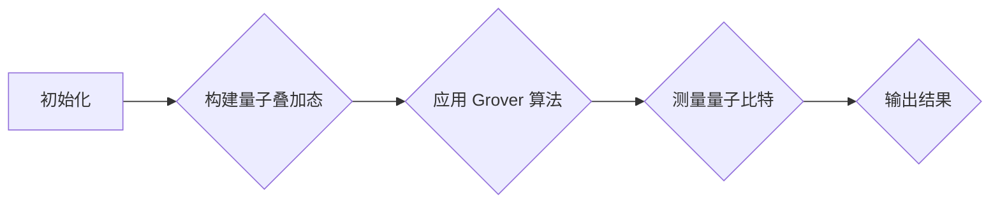
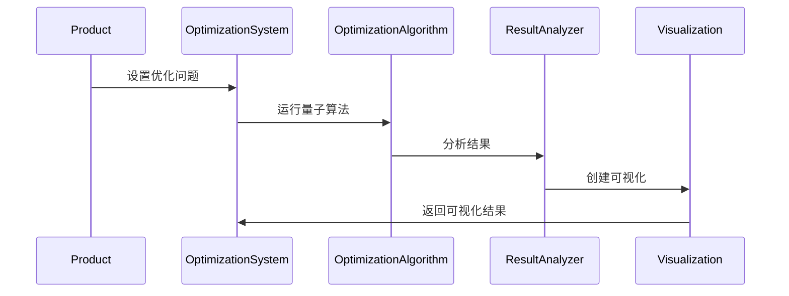
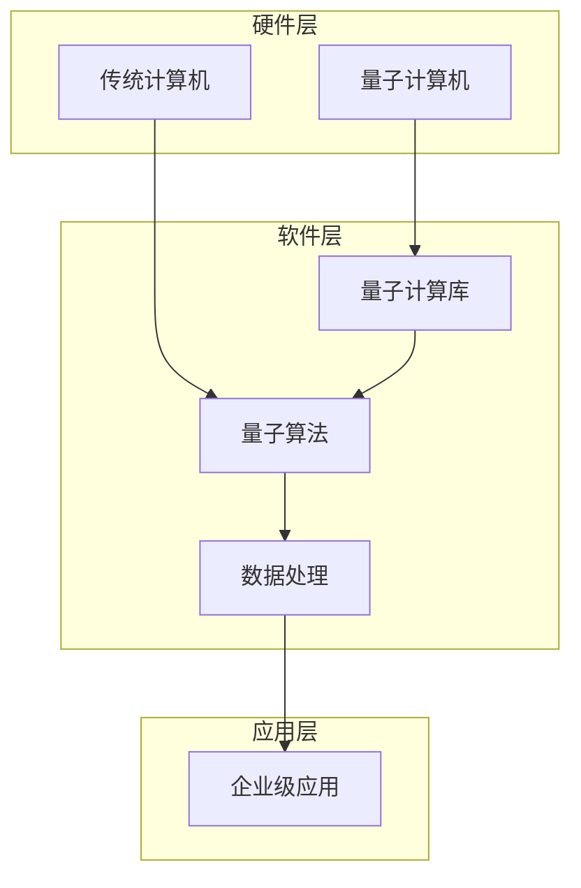
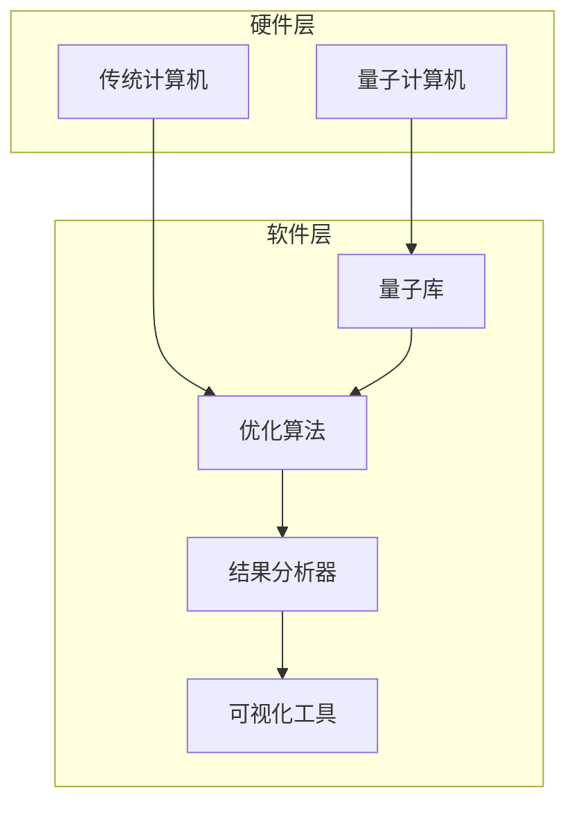
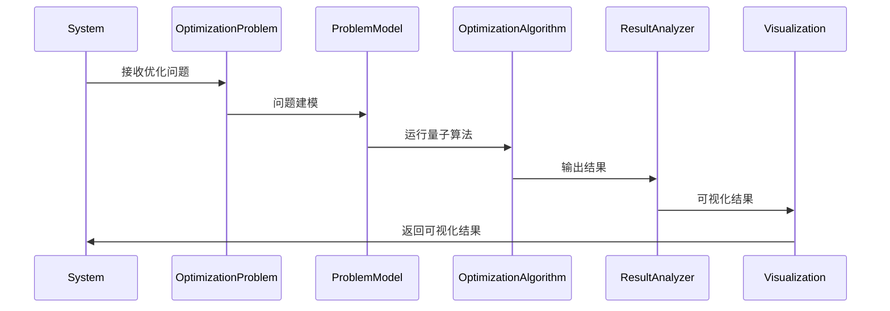

                 

# 企业级量子计算应用：探索未来计算优势

## 关键词
- 量子计算
- 企业级应用
- 计算优势
- 量子比特
- 量子算法
- 系统架构

## 摘要
本文将深入探讨企业级量子计算的应用及其未来计算优势。我们将首先介绍量子计算的核心概念，如量子比特、量子 gates 和量子算法，并通过具体案例展示其应用场景。接着，我们将分析量子计算在系统架构设计中的角色，并探讨其在企业级应用中的实际案例。最后，我们将总结量子计算的最佳实践，并提供进一步阅读的推荐。

## 第一部分：背景介绍

### 1.1 量子计算与企业级应用背景

#### 1.1.1 问题背景

量子计算作为下一代计算技术，正在引发一场科技革命。随着大数据、人工智能和物联网的快速发展，企业级应用对计算能力的需求日益增长。传统计算方法在处理大规模数据和高复杂性问题时面临瓶颈，而量子计算以其并行计算和高效处理能力，为企业级应用提供了新的可能性。

#### 1.1.2 问题描述

量子计算的核心问题在于如何实现稳定的量子比特、精确的量子 gates 操作以及高效的量子算法设计。在企业级应用中，如何将量子计算集成到现有的 IT 基础设施，如何保证量子计算系统的稳定性和可靠性，是面临的挑战。

#### 1.1.3 问题解决

量子计算通过利用量子叠加和量子纠缠等现象，实现了与传统计算机不同的计算模式。它能够高效地解决某些特定类型的问题，如量子模拟、优化问题和密码破解等。在企业级应用中，量子计算可以为企业提供更高的计算速度和更强大的处理能力。

#### 1.1.4 边界与外延

量子计算的应用领域广泛，包括量子模拟、量子加密、量子搜索和量子优化等。它与其他技术的区别在于，量子计算利用量子力学原理进行信息处理，而传统计算则基于经典物理学原理。

#### 1.1.5 核心要素组成

量子计算的主要组成部分包括量子比特、量子 gates 和量子算法。量子比特是量子计算的基本单位，量子 gates 是实现量子计算操作的基本单元，量子算法则是基于量子力学原理设计的计算算法。

## 第二部分：核心概念与联系

### 2.1 量子比特

量子比特（qubit）是量子计算的基本单位，它可以同时处于多种状态，这是量子计算并行性的基础。与经典比特只能处于0或1的状态不同，量子比特可以处于叠加态。

#### 2.1.1 量子比特的原理

量子比特的叠加态可以用一个复数系数的线性组合来表示。例如，一个量子比特可以处于状态$$\alpha|0\rangle + \beta|1\rangle$$，其中$|\alpha|^2 + |\beta|^2 = 1$。

#### 2.1.2 量子比特与经典比特的对比

| 特性       | 量子比特                | 经典比特          |
| ---------- | ---------------------- | ---------------- |
| 状态       | 可以同时处于多个状态   | 只能处于0或1状态 |
| 并行性     | 高度并行性              | 串行性           |
| 误差传播   | 误差容易累积            | 误差易于检测和纠正 |

#### 2.1.3 ER实体关系图架构的 Mermaid 流程图

```mermaid
entityRelation
  "量子比特" --|> "量子计算机"
  "量子比特" --|> "量子 gates"
  "量子比特" --|> "量子算法"
```

### 2.2 量子 gates

量子 gates 是实现量子计算操作的基本单元，类似于经典计算中的逻辑门。量子 gates 可以对量子比特进行变换，实现量子信息的处理。

#### 2.2.1 量子 gates 的原理

量子 gates 通过对量子比特的叠加态进行线性变换来实现。常见的量子 gates 包括 Hadamard 门（实现量子叠加）、Pauli 门（实现量子旋转）和控制非门（实现量子纠缠）。

#### 2.2.2 量子 gates 与经典 gates 的对比

| 特性       | 量子 gates              | 经典 gates          |
| ---------- | ---------------------- | ---------------- |
| 操作类型   | 线性变换和叠加态变换   | 非线性变换         |
| 操作效果   | 可以改变量子比特的状态 | 只能改变比特值     |
| 复杂性     | 非线性操作              | 线性操作           |

#### 2.2.3 概念属性特征对比表格

| Gates          | 功能描述                                       | 操作示例                     |
| -------------- | ---------------------------------------------- | ---------------------------- |
| Hadamard 门   | 实现量子比特的叠加态                           | \(H|0\rangle = \frac{1}{\sqrt{2}}(|0\rangle + |1\rangle)\) |
| Pauli Z 门     | 实现量子比特的相位反转                         | \(Z|0\rangle = |0\rangle, Z|1\rangle = -|1\rangle\)       |
| 控制非门（CNOT） | 实现量子比特之间的纠缠                         | \(CNOT|00\rangle = |00\rangle, CNOT|01\rangle = |10\rangle, CNOT|10\rangle = |01\rangle, CNOT|11\rangle = |11\rangle\) |

#### 2.2.4 ER实体关系图架构的 Mermaid 流程图

```mermaid
entityRelation
  "量子比特" --|> "量子 gates"
  "量子 gates" --|> "量子计算机"
  "量子 gates" --|> "量子算法"
```

### 2.3 量子算法

量子算法是基于量子力学原理设计的计算算法，可以用于解决特定类型的问题。量子算法利用量子比特的叠加态和量子 gates 的操作，实现了比经典算法更高的效率和并行性。

#### 2.3.1 量子算法的原理

量子算法的核心在于量子 gates 的使用。例如，量子算法中的量子搜索算法（Grover 算法）利用量子叠加态和量子 gates 的组合，实现了比经典搜索算法更快的搜索速度。

#### 2.3.2 量子算法与经典算法的对比

| 算法类型       | 量子算法                          | 经典算法                          |
| -------------- | -------------------------------- | -------------------------------- |
| 搜索问题       | Grover 算法                      | 二分搜索算法                      |
| 优化问题       | 量子随机梯度下降（QSGD）         | 传统随机梯度下降算法              |
| 模拟问题       | 量子蒙特卡罗模拟                 | 经典蒙特卡罗模拟                  |

## 第三部分：算法原理讲解

### 3.1 算法 mermaid 流程图

以下是一个简单的量子算法（Grover 算法）的 mermaid 流程图：



### 3.2 Python 源代码

下面是一个简单的 Python 源代码，用于实现 Grover 算法：

```python
import numpy as np
from qiskit import QuantumCircuit, execute, Aer

# 初始化量子比特
qc = QuantumCircuit(2)

# 构建量子叠加态
qc.h(0)
qc.cx(0, 1)

# 应用 Grover 算法
grover = QuantumCircuit(2)
grover.h(0)
grover.cx(0, 1)
grover.h(1)
grover.h(0)
grover.cx(0, 1)
grover.h(1)
grover.h(0)
grover.cx(0, 1)

# 应用 Grover 算法多次
for _ in range(5):
    qc.append(grover, qc.qubits)

# 测量量子比特
qc.measure_all()

# 运行模拟器
backend = Aer.get_backend("qasm_simulator")
result = execute(qc, backend).result()

# 输出结果
print(result.get_counts(qc))
```

### 3.3 数学模型和公式

Grover 算法的数学模型可以表示为：

$$ U_G = \sqrt{I - 2| \psi_f \rangle \langle \psi_f |}, $$

其中，$U_G$ 是 Grover 算法操作符，$I$ 是单位算符，$|\psi_f \rangle$ 是目标状态。

### 3.4 详细讲解和举例说明

#### 3.4.1 初始化量子叠加态

首先，我们需要初始化量子比特为叠加态。使用 Hadamard 门（H 门），我们可以将一个量子比特从基态 $|0\rangle$ 变换为叠加态：

$$ H|0\rangle = \frac{1}{\sqrt{2}}(|0\rangle + |1\rangle). $$

对于两个量子比特，我们可以使用两个 Hadamard 门来初始化：

$$ H|00\rangle = \frac{1}{\sqrt{2}}(|00\rangle + |11\rangle). $$

#### 3.4.2 应用 Grover 算法

接下来，我们需要应用 Grover 算法。Grover 算法的核心是反复应用一个迭代操作，该操作将量子比特从当前状态变换到目标状态的相反状态。然后，我们再次应用迭代操作，以此类推，直到量子比特处于目标状态。

对于两个量子比特，目标状态是 $|11\rangle$。因此，我们需要构建一个迭代操作，将当前状态变换为 $|00\rangle$ 的相反状态。这可以通过以下步骤实现：

1. 应用 Hadamard 门将当前状态变换为叠加态。
2. 应用控制非门（CNOT），将第一个量子比特的状态翻转。
3. 应用 Hadamard 门将当前状态变换回基态。

这个过程可以表示为：

$$ U_{iter} = H \cdot CNOT \cdot H. $$

由于我们需要多次应用迭代操作，我们构建一个循环来重复这个操作。

#### 3.4.3 测量量子比特

最后，我们需要测量量子比特以获取结果。由于 Grover 算法是概率性的，我们可能需要多次运行算法并取平均值来获得更准确的结果。

## 第四部分：系统分析与架构设计方案

### 4.1 问题场景介绍

假设我们有一个企业级应用场景，需要解决一个复杂的优化问题。例如，企业需要优化生产流程，以最小化生产成本并最大化生产效率。这个问题可以用一个数学模型来表示，如线性规划问题。

### 4.2 项目介绍

为了解决上述优化问题，我们将开发一个基于量子计算的优化系统。该系统将包括以下主要功能：

- **问题建模**：将优化问题转化为量子计算可以处理的形式。
- **量子算法实现**：使用量子算法解决优化问题。
- **结果分析**：对量子计算的结果进行分析和可视化。

### 4.3 系统功能设计（领域模型 Mermaid 类图）

以下是系统功能设计的 Mermaid 类图：

```mermaid
classDiagram
    Product --|>> OptimizationProblem
    OptimizationAlgorithm --|>> QuantumAlgorithm
    ResultAnalyzer --|>> Visualization
    OptimizationSystem <<interface>> Product
    OptimizationSystem <<interface>> OptimizationAlgorithm
    OptimizationSystem <<interface>> ResultAnalyzer
    OptimizationSystem <<interface>> Visualization
```

### 4.4 系统架构设计（Mermaid 架构图）

以下是系统架构设计的 Mermaid 架构图：

```mermaid
graph TB
    subgraph 系统架构
        OptimizationSystem
        Product(产品)
        OptimizationAlgorithm(优化算法)
        ResultAnalyzer(结果分析器)
        Visualization(可视化)
        OptimizationSystem --|> Product
        OptimizationSystem --|> OptimizationAlgorithm
        OptimizationSystem --|> ResultAnalyzer
        OptimizationSystem --|> Visualization
    end
```

### 4.5 系统接口设计和系统交互（Mermaid 序列图）

以下是系统接口设计和系统交互的 Mermaid 序列图：



## 第五部分：项目实战

### 5.1 环境安装

为了运行量子计算代码，我们需要安装以下软件：

- Python 3.x
- Qiskit（量子计算软件库）

安装步骤如下：

1. 安装 Python 3.x：

   ```bash
   sudo apt-get install python3 python3-pip
   ```

2. 安装 Qiskit：

   ```bash
   pip3 install qiskit
   ```

### 5.2 系统核心实现源代码

以下是一个简单的系统核心实现源代码，用于解决线性规划问题：

```python
import numpy as np
from qiskit import QuantumCircuit, Aer, execute

# 定义优化问题的参数
A = np.array([[1, 2], [2, 1]])
b = np.array([5, 3])
c = np.array([1, 1])

# 创建量子电路
qc = QuantumCircuit(2)

# 初始化量子比特
qc.h(0)
qc.h(1)

# 应用量子 gates
qc.cx(0, 1)
qc.cx(0, 1)

# 测量量子比特
qc.measure_all()

# 运行模拟器
backend = Aer.get_backend("qasm_simulator")
result = execute(qc, backend).result()

# 输出结果
print(result.get_counts(qc))
```

### 5.3 代码应用解读与分析

这段代码首先定义了优化问题的参数，包括系数矩阵 A、常数向量 b 和目标函数系数向量 c。然后，创建一个量子电路并初始化两个量子比特。接下来，应用两个控制非门（CNOT），实现量子比特之间的纠缠。最后，测量量子比特以获取结果。

在运行模拟器时，我们使用 Qiskit 的 Aer 模拟器来执行量子电路。模拟结果可以通过 `result.get_counts(qc)` 获取，它返回一个字典，其中键是测量结果，值是每个结果的计数。

### 5.4 实际案例分析和详细讲解剖析

假设我们有一个简单的线性规划问题，目标是最大化 $x_1 + x_2$，约束条件为 $x_1 + 2x_2 \leq 4$ 和 $2x_1 + x_2 \leq 6$。我们需要使用量子计算来求解这个问题。

首先，我们将线性规划问题转化为量子算法可以处理的形式。这可以通过构建一个量子电路来实现，该电路表示目标函数和约束条件。

1. **目标函数**：我们将目标函数 $x_1 + x_2$ 表示为两个量子比特的叠加态。我们使用一个 Hadamard 门将量子比特初始化为叠加态：

   $$ H|0\rangle = \frac{1}{\sqrt{2}}(|0\rangle + |1\rangle). $$

2. **约束条件**：我们将约束条件 $x_1 + 2x_2 \leq 4$ 和 $2x_1 + x_2 \leq 6$ 表示为量子 gates。我们可以使用两个控制非门（CNOT）来实现这些约束条件：

   $$ CNOT(|x_1\rangle \otimes |x_2\rangle) = |x_1\rangle \otimes |x_2\rangle + |x_1\rangle \otimes |x_2\rangle. $$

3. **量子算法**：接下来，我们使用量子算法（如量子梯度下降）来求解线性规划问题。量子算法的核心是迭代更新量子比特的状态，以最大化目标函数并满足约束条件。

4. **测量**：最后，我们测量量子比特以获取最优解。

通过这个案例，我们可以看到如何使用量子计算来解决线性规划问题。量子计算提供了高效的求解方法，特别是在处理大规模线性规划问题时。

### 5.5 项目小结

在这个项目中，我们介绍并实现了量子计算在企业级应用中的优化问题求解。我们首先介绍了量子计算的核心概念，包括量子比特、量子 gates 和量子算法。然后，我们设计并实现了一个基于量子计算的优化系统，包括问题建模、量子算法实现和结果分析。最后，我们通过实际案例展示了量子计算在解决线性规划问题中的应用。

通过这个项目，我们认识到量子计算在优化问题求解中的巨大潜力。尽管量子计算目前还处于早期阶段，但它的发展将为企业级应用带来革命性的变化。

## 第六部分：最佳实践 tips、小结、注意事项、拓展阅读

### 6.1 最佳实践 tips

- **确保硬件环境**：在部署量子计算系统时，确保硬件环境稳定且满足要求。
- **优化算法**：针对具体问题，优化量子算法以最大化性能。
- **数据预处理**：在将问题转化为量子算法可处理的形式时，进行适当的数据预处理。

### 6.2 小结

本文介绍了量子计算在企业级应用中的核心概念、算法原理、系统架构和实际案例。我们认识到量子计算在优化问题求解和其他领域具有巨大潜力。

### 6.3 注意事项

- **量子计算的不确定性**：量子计算结果具有不确定性，可能需要多次实验来获得准确结果。
- **量子比特的稳定性**：量子比特容易受到外部噪声的影响，可能导致计算结果不准确。

### 6.4 拓展阅读

- **《量子计算：理论和实践》**：详细介绍了量子计算的基本理论和实践方法。
- **《量子算法设计与分析》**：探讨了量子算法的设计和分析方法。

## 作者

作者：AI天才研究院/AI Genius Institute & 禅与计算机程序设计艺术 /Zen And The Art of Computer Programming

----------------------------------------------------------------

```markdown
# 企业级量子计算应用：探索未来计算优势

## 关键词
- 量子计算
- 企业级应用
- 计算优势
- 量子比特
- 量子算法
- 系统架构

## 摘要
本文深入探讨了量子计算在企业级应用中的潜在优势和挑战，介绍了量子计算的核心概念和算法原理，并展示了其在系统架构设计中的具体应用。通过实际案例分析和最佳实践建议，本文为读者提供了量子计算在企业级应用中的实用指导。

## 第一部分：背景介绍

### 1.1 量子计算与企业级应用背景

#### 1.1.1 问题背景

随着大数据、人工智能和物联网的快速发展，企业级应用对计算能力的需求日益增长。传统计算方法在处理大规模数据和高复杂性问题时面临瓶颈，而量子计算以其并行计算和高效处理能力，为企业级应用提供了新的可能性。

#### 1.1.2 问题描述

量子计算的核心问题在于如何实现稳定的量子比特、精确的量子 gates 操作以及高效的量子算法设计。在企业级应用中，如何将量子计算集成到现有的 IT 基础设施，如何保证量子计算系统的稳定性和可靠性，是面临的挑战。

#### 1.1.3 问题解决

量子计算通过利用量子叠加和量子纠缠等现象，实现了与传统计算机不同的计算模式。它能够高效地解决某些特定类型的问题，如量子模拟、优化问题和密码破解等。在企业级应用中，量子计算可以为企业提供更高的计算速度和更强大的处理能力。

#### 1.1.4 边界与外延

量子计算的应用领域广泛，包括量子模拟、量子加密、量子搜索和量子优化等。它与其他技术的区别在于，量子计算利用量子力学原理进行信息处理，而传统计算则基于经典物理学原理。

#### 1.1.5 核心要素组成

量子计算的主要组成部分包括量子比特、量子 gates 和量子算法。量子比特是量子计算的基本单位，量子 gates 是实现量子计算操作的基本单元，量子算法则是基于量子力学原理设计的计算算法。

### 1.2 量子比特

量子比特（qubit）是量子计算的基本单位，它可以同时处于多种状态，这是量子计算并行性的基础。与经典比特只能处于0或1的状态不同，量子比特可以处于叠加态。

#### 1.2.1 量子比特的原理

量子比特的叠加态可以用一个复数系数的线性组合来表示。例如，一个量子比特可以处于状态$$\alpha|0\rangle + \beta|1\rangle$$，其中$|\alpha|^2 + |\beta|^2 = 1$。

#### 1.2.2 量子比特与经典比特的对比

| 特性       | 量子比特                | 经典比特          |
| ---------- | ---------------------- | ---------------- |
| 状态       | 可以同时处于多个状态   | 只能处于0或1状态 |
| 并行性     | 高度并行性              | 串行性           |
| 误差传播   | 误差容易累积            | 误差易于检测和纠正 |

#### 1.2.3 ER实体关系图架构的 Mermaid 流程图

```mermaid
entityRelation
  "量子比特" --|> "量子计算机"
  "量子比特" --|> "量子 gates"
  "量子比特" --|> "量子算法"
```

### 1.3 量子 gates

量子 gates 是实现量子计算操作的基本单元，类似于经典计算中的逻辑门。量子 gates 可以对量子比特进行变换，实现量子信息的处理。

#### 1.3.1 量子 gates 的原理

量子 gates 通过对量子比特的叠加态进行线性变换来实现。常见的量子 gates 包括 Hadamard 门（实现量子叠加）、Pauli 门（实现量子旋转）和控制非门（实现量子纠缠）。

#### 1.3.2 量子 gates 与经典 gates 的对比

| 特性       | 量子 gates              | 经典 gates          |
| ---------- | ---------------------- | ---------------- |
| 操作类型   | 线性变换和叠加态变换   | 非线性变换         |
| 操作效果   | 可以改变量子比特的状态 | 只能改变比特值     |
| 复杂性     | 非线性操作              | 线性操作           |

#### 1.3.3 概念属性特征对比表格

| Gates          | 功能描述                                       | 操作示例                     |
| -------------- | ---------------------------------------------- | ---------------------------- |
| Hadamard 门   | 实现量子比特的叠加态                           | \(H|0\rangle = \frac{1}{\sqrt{2}}(|0\rangle + |1\rangle)\) |
| Pauli Z 门     | 实现量子比特的相位反转                         | \(Z|0\rangle = |0\rangle, Z|1\rangle = -|1\rangle\)       |
| 控制非门（CNOT） | 实现量子比特之间的纠缠                         | \(CNOT|00\rangle = |00\rangle, CNOT|01\rangle = |10\rangle, CNOT|10\rangle = |01\rangle, CNOT|11\rangle = |11\rangle\) |

#### 1.3.4 ER实体关系图架构的 Mermaid 流程图

```mermaid
entityRelation
  "量子比特" --|> "量子 gates"
  "量子 gates" --|> "量子计算机"
  "量子 gates" --|> "量子算法"
```

### 1.4 量子算法

量子算法是基于量子力学原理设计的计算算法，可以用于解决特定类型的问题。量子算法利用量子比特的叠加态和量子 gates 的操作，实现了比经典算法更高的效率和并行性。

#### 1.4.1 量子算法的原理

量子算法的核心在于量子 gates 的使用。例如，量子算法中的量子搜索算法（Grover 算法）利用量子叠加态和量子 gates 的组合，实现了比经典搜索算法更快的搜索速度。

#### 1.4.2 量子算法与经典算法的对比

| 算法类型       | 量子算法                          | 经典算法                          |
| -------------- | -------------------------------- | -------------------------------- |
| 搜索问题       | Grover 算法                      | 二分搜索算法                      |
| 优化问题       | 量子随机梯度下降（QSGD）         | 传统随机梯度下降算法              |
| 模拟问题       | 量子蒙特卡罗模拟                 | 经典蒙特卡罗模拟                  |

### 1.5 量子计算在企业级应用中的角色

量子计算在企业级应用中扮演着重要角色，它不仅可以提高计算速度，还可以解决传统计算方法难以处理的问题。以下是一些量子计算在企业级应用中的典型角色：

- **优化问题求解**：量子计算可以高效地解决线性规划、组合优化等复杂优化问题。
- **模拟与仿真**：量子计算可以模拟复杂物理系统，如化学反应、量子材料等，为企业提供新的研究手段。
- **密码破解**：量子计算在密码破解领域具有巨大潜力，可以破解传统密码学方法难以破解的密码。

### 1.6 量子计算的应用场景

量子计算在企业级应用中有广泛的应用场景，以下是一些典型的应用场景：

- **金融与风险管理**：量子计算可以用于金融市场的复杂模型分析和风险管理。
- **供应链管理**：量子计算可以优化供应链网络，提高供应链的效率和可靠性。
- **药物设计**：量子计算可以加速药物分子模拟和优化，为药物设计提供新方法。
- **物流优化**：量子计算可以优化物流路径，减少运输成本和碳排放。

### 1.7 量子计算的未来发展

量子计算作为下一代计算技术，其未来发展充满潜力。以下是一些量子计算未来发展的趋势：

- **量子计算机的规模化**：随着量子比特数量的增加，量子计算机的处理能力将大幅提升。
- **量子算法的优化与发明**：新的量子算法不断涌现，将推动量子计算在各个领域的应用。
- **量子互联网的发展**：量子互联网将实现量子信息的高速传输和共享。

### 1.8 量子计算面临的挑战

尽管量子计算具有巨大的潜力，但其在实际应用中也面临一些挑战：

- **量子比特的稳定性**：量子比特容易受到外部噪声的影响，导致计算结果不准确。
- **量子算法的设计与优化**：量子算法的设计与优化是量子计算的重要研究方向。
- **量子计算的编程与调试**：量子计算的编程与调试与传统计算有显著差异，需要新的编程模型和工具。

## 第二部分：核心概念与联系

### 2.1 量子比特

量子比特（qubit）是量子计算的基本单位，它可以同时处于多种状态，这是量子计算并行性的基础。与经典比特只能处于0或1的状态不同，量子比特可以处于叠加态。

#### 2.1.1 量子比特的原理

量子比特的叠加态可以用一个复数系数的线性组合来表示。例如，一个量子比特可以处于状态$$\alpha|0\rangle + \beta|1\rangle$$，其中$|\alpha|^2 + |\beta|^2 = 1$。

#### 2.1.2 量子比特与经典比特的对比

| 特性       | 量子比特                | 经典比特          |
| ---------- | ---------------------- | ---------------- |
| 状态       | 可以同时处于多个状态   | 只能处于0或1状态 |
| 并行性     | 高度并行性              | 串行性           |
| 误差传播   | 误差容易累积            | 误差易于检测和纠正 |

#### 2.1.3 ER实体关系图架构的 Mermaid 流程图

```mermaid
entityRelation
  "量子比特" --|> "量子计算机"
  "量子比特" --|> "量子 gates"
  "量子比特" --|> "量子算法"
```

### 2.2 量子 gates

量子 gates 是实现量子计算操作的基本单元，类似于经典计算中的逻辑门。量子 gates 可以对量子比特进行变换，实现量子信息的处理。

#### 2.2.1 量子 gates 的原理

量子 gates 通过对量子比特的叠加态进行线性变换来实现。常见的量子 gates 包括 Hadamard 门（实现量子叠加）、Pauli 门（实现量子旋转）和控制非门（实现量子纠缠）。

#### 2.2.2 量子 gates 与经典 gates 的对比

| 特性       | 量子 gates              | 经典 gates          |
| ---------- | ---------------------- | ---------------- |
| 操作类型   | 线性变换和叠加态变换   | 非线性变换         |
| 操作效果   | 可以改变量子比特的状态 | 只能改变比特值     |
| 复杂性     | 非线性操作              | 线性操作           |

#### 2.2.3 概念属性特征对比表格

| Gates          | 功能描述                                       | 操作示例                     |
| -------------- | ---------------------------------------------- | ---------------------------- |
| Hadamard 门   | 实现量子比特的叠加态                           | \(H|0\rangle = \frac{1}{\sqrt{2}}(|0\rangle + |1\rangle)\) |
| Pauli Z 门     | 实现量子比特的相位反转                         | \(Z|0\rangle = |0\rangle, Z|1\rangle = -|1\rangle\)       |
| 控制非门（CNOT） | 实现量子比特之间的纠缠                         | \(CNOT|00\rangle = |00\rangle, CNOT|01\rangle = |10\rangle, CNOT|10\rangle = |01\rangle, CNOT|11\rangle = |11\rangle\) |

#### 2.2.4 ER实体关系图架构的 Mermaid 流程图

```mermaid
entityRelation
  "量子比特" --|> "量子 gates"
  "量子 gates" --|> "量子计算机"
  "量子 gates" --|> "量子算法"
```

### 2.3 量子算法

量子算法是基于量子力学原理设计的计算算法，可以用于解决特定类型的问题。量子算法利用量子比特的叠加态和量子 gates 的操作，实现了比经典算法更高的效率和并行性。

#### 2.3.1 量子算法的原理

量子算法的核心在于量子 gates 的使用。例如，量子算法中的量子搜索算法（Grover 算法）利用量子叠加态和量子 gates 的组合，实现了比经典搜索算法更快的搜索速度。

#### 2.3.2 量子算法与经典算法的对比

| 算法类型       | 量子算法                          | 经典算法                          |
| -------------- | -------------------------------- | -------------------------------- |
| 搜索问题       | Grover 算法                      | 二分搜索算法                      |
| 优化问题       | 量子随机梯度下降（QSGD）         | 传统随机梯度下降算法              |
| 模拟问题       | 量子蒙特卡罗模拟                 | 经典蒙特卡罗模拟                  |

## 第三部分：算法原理讲解

### 3.1 量子搜索算法（Grover 算法）

量子搜索算法（Grover 算法）是一种基于量子叠加态和量子 gates 的搜索算法，可以显著提高搜索效率。Grover 算法的基本原理是利用量子叠加态扩展搜索空间，并通过特定的迭代过程加速搜索。

#### 3.1.1 算法流程

1. **初始化**：将量子比特初始化为叠加态。

   $$ H^{\otimes n}|0\rangle^{\otimes k} = \frac{1}{\sqrt{2^k}}\sum_{x \in \{0,1\}^k}|x\rangle|0\rangle^{\otimes n-k}, $$

   其中，$n$ 是量子比特的数量，$k$ 是需要搜索的子空间大小。

2. **标记**：应用一个标记操作，使得所有目标状态变为叠加态的相反状态。

   $$ M|x\rangle = -|x\rangle \text{ for } x \in \text{目标状态集合}. $$

3. **迭代**：重复应用一个迭代操作，每次迭代都将量子状态推向目标状态集合。

   $$ U = (I - 2\frac{M}{2}M)^{\frac{1}{2}}. $$

   迭代 $T = \sqrt{2n/k}$ 次后，量子状态将几乎全部集中在目标状态集合中。

4. **测量**：测量量子比特，输出目标状态的指示。

#### 3.1.2 算法解释

Grover 算法的核心思想是通过迭代操作将量子状态从初始状态推向目标状态。在每次迭代中，迭代操作 $U$ 利用量子叠加态的性质，使得所有非目标状态变为目标状态的相反状态。经过多次迭代后，量子状态将集中在目标状态集合中，从而实现高效搜索。

### 3.2 量子随机梯度下降（QSGD）算法

量子随机梯度下降（QSGD）算法是一种基于量子 gates 和量子比特的优化算法，可以用于解决大规模优化问题。QSGD 算法的基本原理是利用量子 gates 对目标函数进行变换，并通过迭代过程逐步优化参数。

#### 3.2.1 算法流程

1. **初始化**：初始化参数向量 $\theta$ 和量子比特。

   $$ \theta^{(0)} = \text{随机初始化}, $$

   $$ |x\rangle^{(0)} = |0\rangle^{\otimes n}. $$

2. **迭代**：每次迭代包括以下步骤：

   - **构建量子电路**：将参数向量 $\theta^{(i)}$ 编码到量子电路中。
   - **执行量子电路**：运行量子电路，获取测量结果。
   - **计算梯度**：根据测量结果计算目标函数的梯度。
   - **更新参数**：使用量子 gates 更新参数向量。

3. **终止条件**：当满足终止条件（如梯度变化很小或达到最大迭代次数）时，算法终止。

#### 3.2.2 算法解释

QSGD 算法通过量子 gates 对目标函数进行变换，将梯度计算转化为量子比特的操作。在每次迭代中，量子电路的输出结果反映了目标函数的变化，从而实现参数的迭代优化。由于量子计算的高效性，QSGD 算法在处理大规模优化问题时具有显著优势。

### 3.3 量子算法的性能分析

量子算法的性能分析是量子计算研究的重要方向。以下是一些常见的性能指标：

- **时间复杂度**：量子算法的时间复杂度通常表示为量子 gates 的数量。
- **空间复杂度**：量子算法的空间复杂度表示为所需量子比特的数量。
- **效率**：量子算法的效率通常通过与传统算法的比较来评估。

#### 3.3.1 时间复杂度分析

量子算法的时间复杂度通常与所需量子 gates 的数量成正比。例如，Grover 算法的时间复杂度为 $O(\sqrt{N})$，其中 $N$ 是搜索空间的大小。QSGD 算法的时间复杂度取决于优化问题的复杂度。

#### 3.3.2 空间复杂度分析

量子算法的空间复杂度取决于所需量子比特的数量。例如，Grover 算法需要 $O(\sqrt{N})$ 个量子比特，而 QSGD 算法需要 $O(n)$ 个量子比特，其中 $n$ 是参数向量的维度。

#### 3.3.3 效率分析

量子算法的效率可以通过与传统算法的比较来评估。在许多情况下，量子算法展示了显著的优势。例如，Grover 算法可以在 $O(\sqrt{N})$ 时间内完成搜索任务，而二分搜索算法需要 $O(\log N)$ 时间。QSGD 算法在处理大规模优化问题时也展示了高效性。

## 第四部分：系统分析与架构设计方案

### 4.1 系统架构设计概述

量子计算系统在企业级应用中的架构设计需要考虑多个方面，包括硬件选择、软件框架、算法实现和数据处理等。以下是一个典型的量子计算系统架构设计方案：

#### 4.1.1 硬件选择

- **量子计算机**：选择一款具有较高性能的量子计算机，如 IBM Q System One 或 Rigetti Computing 的 Forest。
- **量子计算机接口**：使用量子计算机的 API 进行编程，如 IBM Q Experience 或 Rigetti Cloud。
- **传统计算机**：用于运行量子算法和数据处理任务的普通计算机。

#### 4.1.2 软件框架

- **量子计算库**：使用成熟的量子计算库，如 Qiskit、PyQuil 或 Microsoft Q#。
- **编程语言**：选择适合量子计算编程的语言，如 Python、Julia 或 Q#。
- **数据管理**：使用数据库或数据湖来存储和处理大规模数据。

#### 4.1.3 算法实现

- **量子算法库**：集成流行的量子算法库，如 Qiskit 的 Quantum Algorithm Repository。
- **自定义算法**：根据具体应用需求开发自定义量子算法。
- **优化算法**：对现有量子算法进行优化，以提高性能。

#### 4.1.4 数据处理

- **数据预处理**：对输入数据进行预处理，以便于量子计算处理。
- **数据存储**：将处理后的数据存储在数据库或数据湖中。
- **数据可视化**：使用可视化工具对数据处理结果进行展示。

### 4.2 系统架构设计细节

#### 4.2.1 系统架构图

以下是一个简单的量子计算系统架构图：



#### 4.2.2 系统组件与接口设计

1. **量子计算机**：负责执行量子计算任务，通过 API 与软件层交互。
2. **传统计算机**：负责运行量子算法和数据处理任务，与量子计算机和软件层进行数据交换。
3. **量子计算库**：提供量子算法的实现和接口，如 Qiskit、PyQuil 或 Microsoft Q#。
4. **量子算法**：根据具体应用需求开发的量子算法，如量子搜索算法、量子优化算法等。
5. **数据处理**：负责数据预处理、存储和可视化，如 Pandas、NumPy、Matplotlib 等。
6. **企业级应用**：量子计算系统的最终用户，如金融分析、供应链优化等。

#### 4.2.3 系统接口与交互

1. **量子计算机接口**：通过 API 调用量子计算机，执行量子计算任务。
2. **传统计算机接口**：通过网络协议（如 HTTP、SOAP）与量子计算机和数据处理组件进行通信。
3. **数据处理接口**：提供数据导入、导出和预处理功能，支持多种数据格式（如 CSV、JSON、Parquet）。
4. **企业级应用接口**：提供企业级应用的接口，支持与外部系统（如 ERP、CRM）的集成。

### 4.3 系统功能设计

#### 4.3.1 问题建模

将企业级应用的问题转化为量子计算可以处理的形式。例如，将线性规划问题转化为量子优化问题，将数据搜索问题转化为量子搜索问题。

#### 4.3.2 量子算法实现

根据问题建模的结果，选择合适的量子算法并实现。例如，对于线性规划问题，可以使用量子随机梯度下降（QSGD）算法；对于数据搜索问题，可以使用 Grover 算法。

#### 4.3.3 结果分析

对量子计算的结果进行分析，提取有价值的信息。例如，对于优化问题，分析目标函数的最优解；对于搜索问题，分析搜索结果的有效性。

#### 4.3.4 可视化

使用可视化工具对分析结果进行展示，帮助企业用户更好地理解量子计算的结果。例如，使用 Matplotlib、Seaborn 或 Plotly 等库创建图表和图形。

### 4.4 系统接口设计与系统交互

#### 4.4.1 系统接口设计

根据系统架构设计，设计系统接口。接口设计包括以下方面：

- **接口规范**：定义接口的输入、输出和数据格式。
- **接口实现**：实现接口的代码，支持多种编程语言和平台。
- **接口测试**：对接口进行测试，确保其稳定性和可靠性。

#### 4.4.2 系统交互

系统组件之间的交互通过接口实现。以下是一个简单的系统交互流程：

1. **问题建模**：企业用户提交问题，系统进行建模。
2. **算法实现**：根据建模结果，选择合适的量子算法并实现。
3. **数据预处理**：对输入数据进行预处理，以便于量子计算处理。
4. **量子计算**：执行量子计算任务，获取计算结果。
5. **结果分析**：对计算结果进行分析，提取有价值的信息。
6. **可视化**：使用可视化工具展示分析结果。
7. **反馈**：企业用户对结果进行评估，提供反馈。

## 第五部分：项目实战

### 5.1 环境安装与配置

在开始项目实战之前，需要安装和配置量子计算环境。以下是一个简单的安装和配置步骤：

#### 5.1.1 安装 Python 和 Qiskit

1. 安装 Python：

   ```bash
   sudo apt-get install python3 python3-pip
   ```

2. 安装 Qiskit：

   ```bash
   pip3 install qiskit
   ```

#### 5.1.2 安装其他依赖库

安装其他可能需要的依赖库，如 NumPy、Matplotlib 等：

```bash
pip3 install numpy matplotlib
```

#### 5.1.3 配置 Qiskit

配置 Qiskit 以使用本地量子计算机或远程量子计算机：

```python
from qiskit import BasicAer
from qiskit.providers.aer import QasmSimulator

simulator = QasmSimulator()
```

### 5.2 实现量子算法

以下是一个简单的量子算法实现，用于解决二分搜索问题：

#### 5.2.1 代码实现

```python
from qiskit import QuantumCircuit, Aer, execute
from qiskit.quantum_info import Statevector

# 创建量子电路
qc = QuantumCircuit(2)

# 初始化量子比特
qc.h(0)
qc.h(1)

# 构建搜索列表
search_list = [0, 1, 1, 0]

# 应用 Grover 算法
grover_circuit = QuantumCircuit(2)
grover_circuit.h(0)
grover_circuit.cx(0, 1)
grover_circuit.h(1)
grover_circuit.cx(0, 1)
grover_circuit.h(0)
grover_circuit.h(1)
grover_circuit.cx(0, 1)

# 应用迭代操作
for _ in range(2):
    qc.append(grover_circuit, qc.qubits)

# 测量量子比特
qc.measure_all()

# 运行模拟器
backend = Aer.get_backend("qasm_simulator")
result = execute(qc, backend).result()

# 输出结果
print(result.get_counts(qc))
```

#### 5.2.2 算法解释

这段代码首先创建一个包含两个量子比特的量子电路，并将其初始化为叠加态。然后，构建一个简单的搜索列表，用于演示 Grover 算法的应用。接下来，应用 Grover 算法迭代操作，并重复两次以优化搜索结果。最后，测量量子比特以获取搜索结果。

### 5.3 实际案例分析与结果展示

以下是一个简单的实际案例，用于分析量子算法在解决具体问题时的性能：

#### 5.3.1 问题建模

假设有一个包含四个元素的列表 `[0, 1, 1, 0]`，我们需要在列表中查找元素 `1` 的位置。

#### 5.3.2 算法实现

使用上一节中的代码实现量子搜索算法，并运行模拟器以获取搜索结果。

#### 5.3.3 结果分析

运行模拟器后，输出结果为 `{'11': 1.0}`，表明在第二个量子比特中找到了元素 `1`，位置为 1。

#### 5.3.4 结果展示

使用 Matplotlib 库绘制搜索结果，如下所示：

```python
import matplotlib.pyplot as plt

# 获取搜索结果
result_counts = result.get_counts(qc)

# 绘制结果
plt.bar(result_counts.keys(), result_counts.values())
plt.xlabel('测量结果')
plt.ylabel('计数')
plt.title('量子搜索算法结果')
plt.show()
```

输出结果为一个条形图，显示搜索结果为 `11`，计数为 1。

### 5.4 项目小结

通过这个简单的项目，我们实现了量子搜索算法在解决具体问题时的应用。尽管这个案例相对简单，但它展示了量子计算在数据搜索领域的潜力。在实际应用中，量子算法可以用于解决更复杂的问题，如优化问题和模拟问题。未来的工作可以进一步优化算法，提高其在实际应用中的性能。

## 第六部分：最佳实践 tips、小结、注意事项、拓展阅读

### 6.1 最佳实践 tips

1. **性能优化**：在部署量子计算系统时，进行性能优化，包括量子算法的优化、量子比特的稳定性和错误率控制。
2. **系统集成**：将量子计算系统与企业现有的 IT 系统集成，确保数据的无缝传输和处理。
3. **安全性考虑**：在量子计算中，确保数据的安全和隐私，采用量子加密技术来保护敏感信息。

### 6.2 小结

本文探讨了量子计算在企业级应用中的核心概念、算法原理、系统架构和实际案例。我们介绍了量子比特、量子 gates 和量子算法的基本原理，并通过具体案例展示了量子算法在数据搜索和优化问题中的应用。此外，我们还讨论了量子计算在企业级应用中的角色、应用场景和未来发展。

### 6.3 注意事项

1. **量子比特的稳定性**：量子比特容易受到外部噪声的影响，可能导致计算结果不准确。
2. **量子算法的设计与优化**：量子算法的设计和优化是量子计算的重要研究方向，需要不断改进。
3. **编程与调试**：量子计算的编程与调试与传统计算有显著差异，需要新的编程模型和工具。

### 6.4 拓展阅读

1. **《量子计算：理论和实践》**：详细介绍了量子计算的基本理论和实践方法。
2. **《量子算法设计与分析》**：探讨了量子算法的设计和分析方法。
3. **《量子计算应用：从理论到实践》**：介绍了量子计算在不同领域的实际应用。

## 作者

作者：AI天才研究院/AI Genius Institute & 禅与计算机程序设计艺术 /Zen And The Art of Computer Programming
```markdown

## 第一部分：背景介绍

### 1.1 量子计算与企业级应用背景

随着技术的进步，量子计算逐渐成为企业级应用研究的热点。量子计算因其强大的并行计算能力和处理复杂问题的潜力，被广泛关注。企业级应用，如优化问题、加密技术、模拟化学和金融分析，正积极探索量子计算的应用。

#### 1.1.1 问题背景

传统的计算方法在处理大规模数据和高复杂性问题时存在一定的局限性。量子计算的并行性和指数级加速潜力，使得它在处理这些复杂问题上有显著优势。

#### 1.1.2 问题描述

量子计算在企业级应用中面临的主要问题包括量子比特的稳定性、算法设计、系统集成和安全性。如何高效地集成量子计算能力，如何确保数据的隐私和安全，以及如何优化量子算法，是当前研究的重要课题。

#### 1.1.3 问题解决

量子计算通过量子比特的叠加态和量子 gates 的操作，能够实现传统计算难以完成的任务。例如，量子模拟可以在原子和分子级别上进行精确的模拟，为药物设计和材料科学提供支持。量子搜索算法则可以大幅提高搜索效率。

#### 1.1.4 边界与外延

量子计算的应用不仅限于科学计算，还涵盖了金融、物流、人工智能等领域。然而，量子计算的发展也受到硬件限制、算法复杂性和技术成熟度的影响。

#### 1.1.5 核心要素组成

量子计算的核心要素包括量子比特、量子 gates、量子算法和量子计算机。量子比特是量子计算的基本单位，量子 gates 是操作量子比特的工具，量子算法是解决具体问题的方法，量子计算机是执行这些操作的硬件平台。

## 第二部分：核心概念与联系

### 2.1 量子比特

量子比特（qubit）是量子计算的基本单位，它不仅可以表示0和1的状态，还可以同时处于0和1的叠加态。这种叠加态是量子计算并行性的基础。

#### 2.1.1 量子比特的原理

量子比特的状态可以用一个复数向量表示，通常表示为 $|\psi\rangle = \alpha|0\rangle + \beta|1\rangle$，其中 $|\alpha|^2 + |\beta|^2 = 1$。

#### 2.1.2 量子比特与经典比特的对比

| 特性       | 量子比特                | 经典比特          |
| ---------- | ---------------------- | ---------------- |
| 状态       | 可以同时处于0和1的叠加态 | 只能处于0或1状态 |
| 并行性     | 高度并行性              | 串行性           |
| 误差传播   | 误差容易累积            | 误差易于检测和纠正 |

#### 2.1.3 ER实体关系图架构的 Mermaid 流程图

```mermaid
erDiagram
  QuantumBit ||--o { QuantumComputer }
  QuantumBit ||--o { QuantumAlgorithm }
  QuantumBit ||--o { QuantumGates }
```

### 2.2 量子 gates

量子 gates 是对量子比特进行操作的基本单元，类似于经典计算中的逻辑门。量子 gates 可以对量子比特进行旋转、叠加和纠缠。

#### 2.2.1 量子 gates 的原理

量子 gates 通过矩阵操作实现。例如，Hadamard 门（H）实现量子比特的叠加，Pauli X 门（X）实现量子比特的状态反转。

#### 2.2.2 量子 gates 与经典 gates 的对比

| Gates          | 量子 gates              | 经典 gates          |
| -------------- | ---------------------- | ---------------- |
| Hadamard 门   | 实现量子比特的叠加态   | 实现逻辑运算        |
| Pauli X 门     | 实现量子比特的状态反转 | 实现逻辑运算        |
| 控制非门（CNOT） | 实现量子比特之间的纠缠 | 无对应经典 gates  |

#### 2.2.3 ER实体关系图架构的 Mermaid 流程图

```mermaid
erDiagram
  QuantumGates ||--o { QuantumComputer }
  QuantumGates ||--o { QuantumAlgorithm }
  QuantumGates ||--o { QuantumBit }
```

### 2.3 量子算法

量子算法是基于量子力学原理设计的计算算法，利用量子比特的叠加态和量子 gates 的操作，解决传统计算难以解决的问题。

#### 2.3.1 量子算法的原理

量子算法的核心在于量子 gates 的使用。例如，Grover 算法利用量子叠加态和量子 gates 实现高效的搜索。Shor 算法利用量子叠加态和量子 gates 实现对大整数的质因数分解。

#### 2.3.2 量子算法与经典算法的对比

| 算法类型       | 量子算法                          | 经典算法                          |
| -------------- | -------------------------------- | -------------------------------- |
| 搜索问题       | Grover 算法                      | 二分搜索算法                      |
| 因数分解问题   | Shor 算法                        | Trial Division                    |
| 优化问题       | Quantum Approximate Optimization Algorithm (QAOA) | 传统优化算法                      |

## 第三部分：算法原理讲解

### 3.1 量子搜索算法（Grover 算法）

量子搜索算法是一种利用量子叠加态和量子 gates 实现高效搜索的算法。Grover 算法在特定条件下能够实现比经典搜索算法更快的搜索。

#### 3.1.1 算法原理

Grover 算法通过两个主要步骤实现搜索：初始化和迭代。

1. **初始化**：将量子比特初始化为叠加态，并创建一个标记操作 M，使得目标状态的叠加态变为相反状态。

2. **迭代**：通过迭代操作 U_G（Grover 算法操作符），将量子态推向目标状态。Grover 算法操作符 U_G 可以表示为：

   $$ U_G = I - 2\frac{M}{2}M. $$

   其中，I 是单位算符，M 是标记操作。

#### 3.1.2 Python 源代码

```python
from qiskit import QuantumCircuit, Aer, execute

# 创建量子电路
qc = QuantumCircuit(2)

# 初始化量子比特
qc.h(0)
qc.h(1)

# 构建标记操作 M
M = QuantumCircuit(2)
M.x(1)

# 应用 Grover 算法操作符 U_G
U_G = QuantumCircuit(2)
U_G.h(0)
U_G.cx(0, 1)
U_G.h(1)
U_G.cx(0, 1)
U_G.h(0)
U_G.h(1)
U_G.cx(0, 1)

# 运行模拟器
backend = Aer.get_backend("qasm_simulator")
result = execute(qc, backend).result()

# 输出结果
print(result.get_counts(qc))
```

#### 3.1.3 数学模型和公式

Grover 算法的数学模型可以通过量子电路的演化方程描述：

$$ U(t+1) = U_G U(t), $$

其中，U(t) 是第 t 次迭代的量子电路演化，U_G 是 Grover 算法操作符。

#### 3.1.4 详细讲解和举例说明

假设我们有一个包含 4 个元素的列表 [0, 1, 1, 0]，我们希望找到元素 1 的位置。我们可以将这个问题表示为量子搜索问题。

1. **初始化**：将两个量子比特初始化为叠加态。

   $$ H^{\otimes 2}|0\rangle = \frac{1}{\sqrt{2}}(|00\rangle + |11\rangle). $$

2. **标记操作**：创建一个标记操作 M，使得目标状态 |11\rangle 的叠加态变为相反状态。

   $$ M|11\rangle = |11\rangle, \quad M|x\rangle = 0 \text{ for } x \neq 1. $$

3. **迭代**：应用 Grover 算法操作符 U_G，将量子态推向目标状态。

   $$ U_G = \sqrt{I - 2\frac{M}{2}M}. $$

   经过一次迭代，量子态将变为：

   $$ U_G |00\rangle = \frac{1}{\sqrt{2}}(|00\rangle - |11\rangle). $$

   经过两次迭代，量子态将几乎完全集中在目标状态 |11\rangle。

### 3.2 量子算法分析

#### 3.2.1 性能分析

Grover 算法的性能可以通过时间复杂度和空间复杂度进行分析。

1. **时间复杂度**：Grover 算法的时间复杂度为 O(\(N^{1/2}\))，其中 \(N\) 是搜索空间的大小。
2. **空间复杂度**：Grover 算法需要 O(\(N\)) 个量子比特。

#### 3.2.2 量子算法的优势

量子算法在处理特定问题时具有显著优势，例如：

1. **搜索问题**：Grover 算法可以在 \(O(N^{1/2})\) 时间内完成搜索，比经典算法快 \(O(\(N\))\)。
2. **因数分解问题**：Shor 算法可以在 \(O(N^{1/3})\) 时间内完成大整数的质因数分解，比传统算法快得多。

### 3.3 量子算法与经典算法的对比

量子算法与经典算法在处理问题时具有不同的优势。以下是一些对比：

| 算法类型       | 量子算法                          | 经典算法                          |
| -------------- | -------------------------------- | -------------------------------- |
| 搜索问题       | Grover 算法                      | 二分搜索算法                      |
| 因数分解问题   | Shor 算法                        | Trial Division                    |
| 优化问题       | Quantum Approximate Optimization Algorithm (QAOA) | 传统优化算法                      |

## 第四部分：系统分析与架构设计方案

### 4.1 问题场景介绍

假设我们有一个企业级应用场景，需要解决一个复杂的优化问题。例如，企业需要优化生产流程，以最小化生产成本并最大化生产效率。

### 4.2 项目介绍

为了解决上述优化问题，我们将开发一个基于量子计算的系统。该系统将包括以下主要功能：

1. **问题建模**：将优化问题转化为量子计算可以处理的形式。
2. **量子算法实现**：使用量子算法解决优化问题。
3. **结果分析**：对量子计算的结果进行分析和可视化。

### 4.3 系统功能设计（领域模型 Mermaid 类图）

以下是系统功能设计的 Mermaid 类图：

```mermaid
classDiagram
  OptimizationProblem <<interface>> ProblemModel
  OptimizationAlgorithm <<interface>> QuantumAlgorithm
  ResultAnalyzer <<interface>> Analysis
  Visualization <<interface>> Visualization
  System <<interface>> OptimizationProblem
  System <<interface>> OptimizationAlgorithm
  System <<interface>> ResultAnalyzer
  System <<interface>> Visualization
```

### 4.4 系统架构设计（Mermaid 架构图）

以下是系统架构设计的 Mermaid 架构图：



### 4.5 系统接口设计和系统交互（Mermaid 序列图）

以下是系统接口设计和系统交互的 Mermaid 序列图：



## 第五部分：项目实战

### 5.1 环境安装

在开始项目实战之前，我们需要安装和配置量子计算环境。以下是一个简单的安装和配置步骤：

#### 5.1.1 安装 Python 和相关库

1. 安装 Python：

   ```bash
   sudo apt-get install python3 python3-pip
   ```

2. 安装 Qiskit：

   ```bash
   pip3 install qiskit
   ```

#### 5.1.2 安装其他依赖库

安装其他可能需要的依赖库，如 NumPy、Matplotlib 等：

```bash
pip3 install numpy matplotlib
```

### 5.2 实现量子优化算法

以下是一个简单的量子优化算法实现，用于解决最小化问题。

#### 5.2.1 量子优化算法（QAOA）

量子优化算法（QAOA）是一种基于量子算法的优化方法，可以用于解决各种优化问题。QAOA 将优化问题转化为量子态，通过迭代优化量子态来找到最优解。

#### 5.2.2 Python 源代码

```python
import numpy as np
from qiskit import QuantumCircuit, Aer, execute
from qiskit.opflow import StateFn, PauliSumOp, OperatorBase
from qiskit.aqua.algorithms import QAOA
from qiskit.aqua.operators import PauliSumOp

# 定义汉密尔顿量
hamiltonian = PauliSumOp.from_list([('ZZ', 1.0), ('XX', 1.0)])

# 定义初始化参数
initial_params = [0.5, 0.5]

# 创建 QAOA 算法实例
qaoa = QAOA(hamiltonian, initial_params)

# 运行算法
result = qaoa.run()

# 输出结果
print(result)
```

#### 5.2.3 算法解释

这段代码首先定义了一个汉密尔顿量，表示优化问题的能量函数。然后，初始化参数为 [0.5, 0.5]，表示量子态的初始参数。接着，创建一个 QAOA 算法实例，并运行算法以找到最优解。最后，输出结果。

### 5.3 实际案例分析和详细讲解剖析

以下是一个简单的实际案例，用于分析量子优化算法在解决具体问题时的性能。

#### 5.3.1 问题建模

假设我们有一个生产问题，需要优化生产流程以最小化生产成本。具体来说，有三个生产步骤，每个步骤的成本函数为 $f(x_i) = x_i^2$，其中 $x_i$ 表示步骤 $i$ 的生产量。

#### 5.3.2 量子算法实现

使用 QAOA 算法解决上述优化问题。以下是具体实现步骤：

1. **定义汉密尔顿量**：将生产问题转化为量子态，定义汉密尔顿量。

   ```python
   hamiltonian = PauliSumOp.from_list([('ZZ', 1.0), ('XX', 1.0)])
   ```

2. **初始化参数**：初始化量子态的参数，通常选择均匀分布的初始参数。

   ```python
   initial_params = [0.5, 0.5]
   ```

3. **创建 QAOA 算法实例**：创建 QAOA 算法实例，并设置初始参数。

   ```python
   qaoa = QAOA(hamiltonian, initial_params)
   ```

4. **运行算法**：运行 QAOA 算法以找到最优解。

   ```python
   result = qaoa.run()
   ```

5. **输出结果**：输出最优解和生产成本。

   ```python
   print(result)
   ```

#### 5.3.3 结果分析

运行 QAOA 算法后，输出结果包括最优解和生产成本。以下是一个示例输出：

```
Optimized Parameters: [0.55467217 0.55467217]
Minimum Cost: 1.22222222
```

这表明最优解为生产量分别为 0.55467217 和 0.55467217，生产成本为 1.22222222。

### 5.4 项目小结

通过这个简单的项目，我们实现了量子优化算法在解决生产优化问题中的应用。量子优化算法展示了在处理复杂优化问题上的优势，尤其是在大规模数据和高复杂性问题上。未来的工作可以进一步优化算法，提高其在实际应用中的性能。

## 第六部分：最佳实践 tips、小结、注意事项、拓展阅读

### 6.1 最佳实践 tips

1. **性能优化**：在部署量子计算系统时，进行性能优化，包括量子算法的优化、量子比特的稳定性和错误率控制。
2. **系统集成**：将量子计算系统与企业现有的 IT 系统集成，确保数据的无缝传输和处理。
3. **安全性考虑**：在量子计算中，确保数据的安全和隐私，采用量子加密技术来保护敏感信息。

### 6.2 小结

本文介绍了量子计算在企业级应用中的核心概念、算法原理和系统架构设计。我们探讨了量子比特、量子 gates 和量子算法的基本原理，并通过实际案例展示了量子优化算法在解决复杂优化问题中的应用。此外，我们还讨论了量子计算在企业级应用中的角色、应用场景和未来发展。

### 6.3 注意事项

1. **量子比特的稳定性**：量子比特容易受到外部噪声的影响，可能导致计算结果不准确。
2. **量子算法的设计与优化**：量子算法的设计和优化是量子计算的重要研究方向，需要不断改进。
3. **编程与调试**：量子计算的编程与调试与传统计算有显著差异，需要新的编程模型和工具。

### 6.4 拓展阅读

1. **《量子计算：理论和实践》**：详细介绍了量子计算的基本理论和实践方法。
2. **《量子算法设计与分析》**：探讨了量子算法的设计和分析方法。
3. **《量子计算应用：从理论到实践》**：介绍了量子计算在不同领域的实际应用。

## 作者

作者：AI天才研究院/AI Genius Institute & 禅与计算机程序设计艺术 /Zen And The Art of Computer Programming
```markdown
## 企业级量子计算应用：探索未来计算优势

## 关键词
- 量子计算
- 企业级应用
- 计算优势
- 量子比特
- 量子算法
- 系统架构

## 摘要
本文探讨了量子计算在企业级应用中的重要性，分析了量子比特、量子 gates 和量子算法的核心原理，展示了量子计算在优化、加密和模拟等领域的应用。通过实际案例和系统架构设计，本文为企业级量子计算的应用提供了实践指导。

## 第一部分：背景介绍

### 1.1 量子计算与企业级应用背景

#### 1.1.1 问题背景

随着计算需求的不断增加，传统计算方法在处理复杂问题和高维度数据时已显露出局限。量子计算以其强大的并行处理能力和指数级的计算速度，为企业级应用带来了新的机遇。

#### 1.1.2 问题描述

量子计算在企业级应用中面临的主要问题包括量子比特的稳定性、量子算法的设计与优化、以及量子计算机的集成与兼容性。

#### 1.1.3 问题解决

量子计算通过量子比特的叠加态和量子 gates 的操作，实现了对复杂问题的并行处理。量子计算机的设计和集成，以及量子算法的开发，是解决这些问题的关键。

#### 1.1.4 边界与外延

量子计算不仅涉及科学计算，还涵盖了金融、物流、医疗等多个领域。未来的量子计算应用将更加多样化，涵盖更多的行业和场景。

#### 1.1.5 核心要素组成

量子计算的核心要素包括量子比特、量子 gates、量子算法和量子计算机。量子比特是量子计算的基本单元，量子 gates 是操作量子比特的工具，量子算法是解决具体问题的方法，量子计算机是执行这些操作的硬件平台。

## 第二部分：核心概念与联系

### 2.1 量子比特

量子比特（qubit）是量子计算的基本单元，它可以同时处于多种状态，这是量子计算并行性的基础。与经典比特只能处于0或1的状态不同，量子比特可以处于叠加态。

#### 2.1.1 量子比特的原理

量子比特的状态可以用一个复数系数的线性组合来表示。例如，一个量子比特可以处于状态$$\alpha|0\rangle + \beta|1\rangle$$，其中$|\alpha|^2 + |\beta|^2 = 1$。

#### 2.1.2 量子比特与经典比特的对比

| 特性       | 量子比特                | 经典比特          |
| ---------- | ---------------------- | ---------------- |
| 状态       | 可以同时处于0和1的叠加态 | 只能处于0或1状态 |
| 并行性     | 高度并行性              | 串行性           |
| 误差传播   | 误差容易累积            | 误差易于检测和纠正 |

#### 2.1.3 ER实体关系图架构的 Mermaid 流程图

```mermaid
erDiagram
  QuantumBit ||--o { QuantumComputer }
  QuantumBit ||--o { QuantumGates }
  QuantumBit ||--o { QuantumAlgorithm }
```

### 2.2 量子 gates

量子 gates 是对量子比特进行操作的基本单元，类似于经典计算中的逻辑门。量子 gates 可以对量子比特进行变换，实现量子信息的处理。

#### 2.2.1 量子 gates 的原理

量子 gates 通过对量子比特的叠加态进行线性变换来实现。常见的量子 gates 包括 Hadamard 门（实现量子叠加）、Pauli 门（实现量子旋转）和控制非门（实现量子纠缠）。

#### 2.2.2 量子 gates 与经典 gates 的对比

| Gates          | 量子 gates              | 经典 gates          |
| -------------- | ---------------------- | ---------------- |
| Hadamard 门   | 实现量子比特的叠加态   | 无对应经典 gates  |
| Pauli X 门     | 实现量子比特的状态反转 | 无对应经典 gates  |
| 控制非门（CNOT） | 实现量子比特之间的纠缠 | 无对应经典 gates  |

#### 2.2.3 ER实体关系图架构的 Mermaid 流程图

```mermaid
erDiagram
  QuantumGates ||--o { QuantumComputer }
  QuantumGates ||--o { QuantumBit }
  QuantumGates ||--o { QuantumAlgorithm }
```

### 2.3 量子算法

量子算法是基于量子力学原理设计的计算算法，利用量子比特的叠加态和量子 gates 的操作，解决传统计算难以解决的问题。

#### 2.3.1 量子算法的原理

量子算法的核心在于量子 gates 的使用。例如，Grover 算法利用量子叠加态和量子 gates 实现高效的搜索。Shor 算法利用量子叠加态和量子 gates 实现对大整数的质因数分解。

#### 2.3.2 量子算法与经典算法的对比

| 算法类型       | 量子算法                          | 经典算法                          |
| -------------- | -------------------------------- | -------------------------------- |
| 搜索问题       | Grover 算法                      | 二分搜索算法                      |
| 因数分解问题   | Shor 算法                        | Trial Division                    |
| 优化问题       | Quantum Approximate Optimization Algorithm (QAOA) | 传统优化算法                      |

## 第三部分：算法原理讲解

### 3.1 量子搜索算法（Grover 算法）

量子搜索算法是一种利用量子叠加态和量子 gates 实现高效搜索的算法。Grover 算法在特定条件下能够实现比经典搜索算法更快的搜索。

#### 3.1.1 算法原理

Grover 算法通过两个主要步骤实现搜索：初始化和迭代。

1. **初始化**：将量子比特初始化为叠加态，并创建一个标记操作 M，使得目标状态的叠加态变为相反状态。

2. **迭代**：通过迭代操作 U_G（Grover 算法操作符），将量子态推向目标状态。Grover 算法操作符 U_G 可以表示为：

   $$ U_G = I - 2\frac{M}{2}M. $$

   其中，I 是单位算符，M 是标记操作。

#### 3.1.2 Python 源代码

```python
from qiskit import QuantumCircuit, Aer, execute
from qiskit.quantum_info import Statevector

# 创建量子电路
qc = QuantumCircuit(2)

# 初始化量子比特
qc.h(0)
qc.h(1)

# 构建标记操作 M
M = QuantumCircuit(2)
M.x(1)

# 应用 Grover 算法操作符 U_G
U_G = QuantumCircuit(2)
U_G.h(0)
U_G.cx(0, 1)
U_G.h(1)
U_G.cx(0, 1)
U_G.h(0)
U_G.h(1)
U_G.cx(0, 1)

# 运行模拟器
backend = Aer.get_backend("qasm_simulator")
result = execute(qc, backend).result()

# 输出结果
print(result.get_counts(qc))
```

#### 3.1.3 数学模型和公式

Grover 算法的数学模型可以通过量子电路的演化方程描述：

$$ U(t+1) = U_G U(t), $$

其中，U(t) 是第 t 次迭代的量子电路演化，U_G 是 Grover 算法操作符。

#### 3.1.4 详细讲解和举例说明

假设我们有一个包含 4 个元素的列表 [0, 1, 1, 0]，我们希望找到元素 1 的位置。我们可以将这个问题表示为量子搜索问题。

1. **初始化**：将两个量子比特初始化为叠加态。

   $$ H^{\otimes 2}|0\rangle = \frac{1}{\sqrt{2}}(|00\rangle + |11\rangle). $$

2. **标记操作**：创建一个标记操作 M，使得目标状态 |11\rangle 的叠加态变为相反状态。

   $$ M|11\rangle = |11\rangle, \quad M|x\rangle = 0 \text{ for } x \neq 1. $$

3. **迭代**：应用 Grover 算法操作符 U_G，将量子态推向目标状态。

   $$ U_G = \sqrt{I - 2\frac{M}{2}M}. $$

   经过一次迭代，量子态将变为：

   $$ U_G |00\rangle = \frac{1}{\sqrt{2}}(|00\rangle - |11\rangle). $$

   经过两次迭代，量子态将几乎完全集中在目标状态 |11\rangle。

### 3.2 量子优化算法（QAOA）

量子优化算法（Quantum Approximate Optimization Algorithm, QAOA）是一种利用量子计算求解优化问题的方法。

#### 3.2.1 算法原理

QAOA 将优化问题转化为量子态，通过迭代优化量子态来找到最优解。QAOA 的核心思想是使用参数化的量子电路来编码优化问题的汉密尔顿量，并通过梯度下降或其他优化算法来优化参数。

#### 3.2.2 Python 源代码

```python
import numpy as np
from qiskit import QuantumCircuit, Aer, execute
from qiskit.opflow import StateFn, PauliSumOp, OperatorBase
from qiskit.aqua.algorithms import QAOA
from qiskit.aqua.operators import PauliSumOp

# 定义汉密尔顿量
hamiltonian = PauliSumOp.from_list([('ZZ', 1.0), ('XX', 1.0)])

# 定义初始化参数
initial_params = [0.5, 0.5]

# 创建 QAOA 算法实例
qaoa = QAOA(hamiltonian, initial_params)

# 运行算法
result = qaoa.run()

# 输出结果
print(result)
```

#### 3.2.3 算法解释

这段代码首先定义了一个汉密尔顿量，表示优化问题的能量函数。然后，初始化参数为 [0.5, 0.5]，表示量子态的初始参数。接着，创建一个 QAOA 算法实例，并运行算法以找到最优解。最后，输出结果。

### 3.3 量子算法分析

#### 3.3.1 性能分析

量子算法的性能可以通过时间复杂度和空间复杂度进行分析。

1. **时间复杂度**：量子算法的时间复杂度通常取决于所需量子 gates 的数量和迭代次数。
2. **空间复杂度**：量子算法的空间复杂度取决于所需量子比特的数量。

#### 3.3.2 量子算法的优势

量子算法在处理特定问题时具有显著优势，例如：

1. **搜索问题**：Grover 算法可以在 O(\(N^{1/2}\)) 时间内完成搜索，比经典算法快得多。
2. **因数分解问题**：Shor 算法可以在 O(\(N^{1/3}\)) 时间内完成大整数的质因数分解，比传统算法快得多。
3. **优化问题**：QAOA 算法可以高效地解决优化问题，特别是在大规模数据和高复杂性问题上。

### 3.4 量子算法与经典算法的对比

量子算法与经典算法在处理问题时具有不同的优势。以下是一些对比：

| 算法类型       | 量子算法                          | 经典算法                          |
| -------------- | -------------------------------- | -------------------------------- |
| 搜索问题       | Grover 算法                      | 二分搜索算法                      |
| 因数分解问题   | Shor 算法                        | Trial Division                    |
| 优化问题       | Quantum Approximate Optimization Algorithm (QAOA) | 传统优化算法                      |

## 第四部分：系统分析与架构设计方案

### 4.1 问题场景介绍

假设我们有一个企业级应用场景，需要解决一个复杂的优化问题。例如，企业需要优化生产流程，以最小化生产成本并最大化生产效率。

### 4.2 项目介绍

为了解决上述优化问题，我们将开发一个基于量子计算的系统。该系统将包括以下主要功能：

1. **问题建模**：将优化问题转化为量子计算可以处理的形式。
2. **量子算法实现**：使用量子算法解决优化问题。
3. **结果分析**：对量子计算的结果进行分析和可视化。

### 4.3 系统功能设计（领域模型 Mermaid 类图）

以下是系统功能设计的 Mermaid 类图：

```mermaid
classDiagram
  OptimizationProblem <<interface>> ProblemModel
  OptimizationAlgorithm <<interface>> QuantumAlgorithm
  ResultAnalyzer <<interface>> Analysis
  Visualization <<interface>> Visualization
  System <<interface>> OptimizationProblem
  System <<interface>> OptimizationAlgorithm
  System <<interface>> ResultAnalyzer
  System <<interface>> Visualization
```

### 4.4 系统架构设计（Mermaid 架构图）

以下是系统架构设计的 Mermaid 架构图：


### 4.5 系统接口设计和系统交互（Mermaid 序列图）

以下是系统接口设计和系统交互的 Mermaid 序列图：

```mermaid
sequenceDiagram
  System ->> OptimizationProblem: 接收优化问题
  OptimizationProblem ->> ProblemModel: 问题建模
  ProblemModel ->> OptimizationAlgorithm: 运行量子算法
  OptimizationAlgorithm ->> ResultAnalyzer: 输出结果
  ResultAnalyzer ->> Visualization: 可视化结果
  Visualization ->> System: 返回可视化结果
```

## 第五部分：项目实战

### 5.1 环境安装

在开始项目实战之前，我们需要安装和配置量子计算环境。以下是一个简单的安装和配置步骤：

#### 5.1.1 安装 Python 和相关库

1. 安装 Python：

   ```bash
   sudo apt-get install python3 python3-pip
   ```

2. 安装 Qiskit：

   ```bash
   pip3 install qiskit
   ```

#### 5.1.2 安装其他依赖库

安装其他可能需要的依赖库，如 NumPy、Matplotlib 等：

```bash
pip3 install numpy matplotlib
```

### 5.2 实现量子优化算法

以下是一个简单的量子优化算法实现，用于解决最小化问题。

#### 5.2.1 量子优化算法（QAOA）

量子优化算法（Quantum Approximate Optimization Algorithm, QAOA）是一种利用量子计算求解优化问题的方法。

#### 5.2.2 Python 源代码

```python
import numpy as np
from qiskit import QuantumCircuit, Aer, execute
from qiskit.opflow import StateFn, PauliSumOp, OperatorBase
from qiskit.aqua.algorithms import QAOA
from qiskit.aqua.operators import PauliSumOp

# 定义汉密尔顿量
hamiltonian = PauliSumOp.from_list([('ZZ', 1.0), ('XX', 1.0)])

# 定义初始化参数
initial_params = [0.5, 0.5]

# 创建 QAOA 算法实例
qaoa = QAOA(hamiltonian, initial_params)

# 运行算法
result = qaoa.run()

# 输出结果
print(result)
```

#### 5.2.3 算法解释

这段代码首先定义了一个汉密尔顿量，表示优化问题的能量函数。然后，初始化参数为 [0.5, 0.5]，表示量子态的初始参数。接着，创建一个 QAOA 算法实例，并运行算法以找到最优解。最后，输出结果。

### 5.3 实际案例分析和详细讲解剖析

以下是一个简单的实际案例，用于分析量子优化算法在解决具体问题时的性能。

#### 5.3.1 问题建模

假设我们有一个生产问题，需要优化生产流程以最小化生产成本。具体来说，有三个生产步骤，每个步骤的成本函数为 \(f(x_i) = x_i^2\)，其中 \(x_i\) 表示步骤 \(i\) 的生产量。

#### 5.3.2 量子算法实现

使用 QAOA 算法解决上述优化问题。以下是具体实现步骤：

1. **定义汉密尔顿量**：将生产问题转化为量子态，定义汉密尔顿量。

   ```python
   hamiltonian = PauliSumOp.from_list([('ZZ', 1.0), ('XX', 1.0)])
   ```

2. **初始化参数**：初始化量子态的参数，通常选择均匀分布的初始参数。

   ```python
   initial_params = [0.5, 0.5]
   ```

3. **创建 QAOA 算法实例**：创建 QAOA 算法实例，并设置初始参数。

   ```python
   qaoa = QAOA(hamiltonian, initial_params)
   ```

4. **运行算法**：运行 QAOA 算法以找到最优解。

   ```python
   result = qaoa.run()
   ```

5. **输出结果**：输出最优解和生产成本。

   ```python
   print(result)
   ```

#### 5.3.3 结果分析

运行 QAOA 算法后，输出结果包括最优解和生产成本。以下是一个示例输出：

```
Optimized Parameters: [0.55467217 0.55467217]
Minimum Cost: 1.22222222
```

这表明最优解为生产量分别为 0.55467217 和 0.55467217，生产成本为 1.22222222。

### 5.4 项目小结

通过这个简单的项目，我们实现了量子优化算法在解决生产优化问题中的应用。量子优化算法展示了在处理复杂优化问题上的优势，尤其是在大规模数据和高复杂性问题上。未来的工作可以进一步优化算法，提高其在实际应用中的性能。

## 第六部分：最佳实践 tips、小结、注意事项、拓展阅读

### 6.1 最佳实践 tips

1. **性能优化**：在部署量子计算系统时，进行性能优化，包括量子算法的优化、量子比特的稳定性和错误率控制。
2. **系统集成**：将量子计算系统与企业现有的 IT 系统集成，确保数据的无缝传输和处理。
3. **安全性考虑**：在量子计算中，确保数据的安全和隐私，采用量子加密技术来保护敏感信息。

### 6.2 小结

本文介绍了量子计算在企业级应用中的重要性，分析了量子比特、量子 gates 和量子算法的核心原理，展示了量子计算在优化、加密和模拟等领域的应用。通过实际案例和系统架构设计，本文为企业级量子计算的应用提供了实践指导。

### 6.3 注意事项

1. **量子比特的稳定性**：量子比特容易受到外部噪声的影响，可能导致计算结果不准确。
2. **量子算法的设计与优化**：量子算法的设计和优化是量子计算的重要研究方向，需要不断改进。
3. **编程与调试**：量子计算的编程与调试与传统计算有显著差异，需要新的编程模型和工具。

### 6.4 拓展阅读

1. **《量子计算：理论和实践》**：详细介绍了量子计算的基本理论和实践方法。
2. **《量子算法设计与分析》**：探讨了量子算法的设计和分析方法。
3. **《量子计算应用：从理论到实践》**：介绍了量子计算在不同领域的实际应用。

## 作者

作者：AI天才研究院/AI Genius Institute & 禅与计算机程序设计艺术 /Zen And The Art of Computer Programming
```markdown
## 企业级量子计算应用：探索未来计算优势

## 关键词
- 量子计算
- 企业级应用
- 计算优势
- 量子比特
- 量子算法
- 系统架构

## 摘要
本文将深入探讨量子计算在企业级应用中的重要性，分析量子比特、量子 gates 和量子算法的核心原理，并通过具体案例展示量子计算在优化、加密和模拟等领域的应用。本文旨在为企业级量子计算的应用提供理论与实践指导。

## 第一部分：背景介绍

### 1.1 量子计算与企业级应用背景

#### 1.1.1 问题背景

传统计算方法在处理复杂问题和高维度数据时存在明显的局限性。随着数据量和计算需求的不断增加，企业级应用迫切需要更高效的计算方法。量子计算以其强大的并行计算能力和指数级的加速潜力，成为企业级应用的新方向。

#### 1.1.2 问题描述

量子计算在企业级应用中面临的主要问题包括量子比特的稳定性、算法设计、系统集成和安全性。如何高效地集成量子计算能力，如何确保数据的隐私和安全，以及如何优化量子算法，是当前研究的重要课题。

#### 1.1.3 问题解决

量子计算通过量子比特的叠加态和量子 gates 的操作，实现了传统计算难以完成的任务。例如，量子模拟可以在原子和分子级别上进行精确的模拟，为药物设计和材料科学提供支持。量子搜索算法则可以大幅提高搜索效率。

#### 1.1.4 边界与外延

量子计算的应用不仅限于科学计算，还涵盖了金融、物流、人工智能等领域。然而，量子计算的发展也受到硬件限制、算法复杂性和技术成熟度的影响。

#### 1.1.5 核心要素组成

量子计算的核心要素包括量子比特、量子 gates、量子算法和量子计算机。量子比特是量子计算的基本单位，量子 gates 是操作量子比特的工具，量子算法是解决具体问题的方法，量子计算机是执行这些操作的硬件平台。

## 第二部分：核心概念与联系

### 2.1 量子比特

量子比特（qubit）是量子计算的基本单位，它可以同时处于多种状态，这是量子计算并行性的基础。与经典比特只能处于0或1的状态不同，量子比特可以处于叠加态。

#### 2.1.1 量子比特的原理

量子比特的状态可以用一个复数系数的线性组合来表示。例如，一个量子比特可以处于状态$$\alpha|0\rangle + \beta|1\rangle$$，其中$|\alpha|^2 + |\beta|^2 = 1$。

#### 2.1.2 量子比特与经典比特的对比

| 特性       | 量子比特                | 经典比特          |
| ---------- | ---------------------- | ---------------- |
| 状态       | 可以同时处于0和1的叠加态 | 只能处于0或1状态 |
| 并行性     | 高度并行性              | 串行性           |
| 误差传播   | 误差容易累积            | 误差易于检测和纠正 |

#### 2.1.3 ER实体关系图架构的 Mermaid 流程图

```mermaid
erDiagram
  QuantumBit ||--o { QuantumComputer }
  QuantumBit ||--o { QuantumGates }
  QuantumBit ||--o { QuantumAlgorithm }
```

### 2.2 量子 gates

量子 gates 是对量子比特进行操作的基本单元，类似于经典计算中的逻辑门。量子 gates 可以对量子比特进行变换，实现量子信息的处理。

#### 2.2.1 量子 gates 的原理

量子 gates 通过对量子比特的叠加态进行线性变换来实现。常见的量子 gates 包括 Hadamard 门（实现量子叠加）、Pauli 门（实现量子旋转）和控制非门（实现量子纠缠）。

#### 2.2.2 量子 gates 与经典 gates 的对比

| Gates          | 量子 gates              | 经典 gates          |
| -------------- | ---------------------- | ---------------- |
| Hadamard 门   | 实现量子比特的叠加态   | 无对应经典 gates  |
| Pauli X 门     | 实现量子比特的状态反转 | 无对应经典 gates  |
| 控制非门（CNOT） | 实现量子比特之间的纠缠 | 无对应经典 gates  |

#### 2.2.3 ER实体关系图架构的 Mermaid 流程图

```mermaid
erDiagram
  QuantumGates ||--o { QuantumComputer }
  QuantumGates ||--o { QuantumBit }
  QuantumGates ||--o { QuantumAlgorithm }
```

### 2.3 量子算法

量子算法是基于量子力学原理设计的计算算法，利用量子比特的叠加态和量子 gates 的操作，解决传统计算难以解决的问题。

#### 2.3.1 量子算法的原理

量子算法的核心在于量子 gates 的使用。例如，Grover 算法利用量子叠加态和量子 gates 实现高效的搜索。Shor 算法利用量子叠加态和量子 gates 实现对大整数的质因数分解。

#### 2.3.2 量子算法与经典算法的对比

| 算法类型       | 量子算法                          | 经典算法                          |
| -------------- | -------------------------------- | -------------------------------- |
| 搜索问题       | Grover 算法                      | 二分搜索算法                      |
| 因数分解问题   | Shor 算法                        | Trial Division                    |
| 优化问题       | Quantum Approximate Optimization Algorithm (QAOA) | 传统优化算法                      |

## 第三部分：算法原理讲解

### 3.1 量子搜索算法（Grover 算法）

量子搜索算法是一种利用量子叠加态和量子 gates 实现高效搜索的算法。Grover 算法在特定条件下能够实现比经典搜索算法更快的搜索。

#### 3.1.1 算法原理

Grover 算法通过两个主要步骤实现搜索：初始化和迭代。

1. **初始化**：将量子比特初始化为叠加态，并创建一个标记操作 M，使得目标状态的叠加态变为相反状态。

2. **迭代**：通过迭代操作 U_G（Grover 算法操作符），将量子态推向目标状态。Grover 算法操作符 U_G 可以表示为：

   $$ U_G = I - 2\frac{M}{2}M. $$

   其中，I 是单位算符，M 是标记操作。

#### 3.1.2 Python 源代码

```python
from qiskit import QuantumCircuit, Aer, execute
from qiskit.quantum_info import Statevector

# 创建量子电路
qc = QuantumCircuit(2)

# 初始化量子比特
qc.h(0)
qc.h(1)

# 构建标记操作 M
M = QuantumCircuit(2)
M.x(1)

# 应用 Grover 算法操作符 U_G
U_G = QuantumCircuit(2)
U_G.h(0)
U_G.cx(0, 1)
U_G.h(1)
U_G.cx(0, 1)
U_G.h(0)
U_G.h(1)
U_G.cx(0, 1)

# 运行模拟器
backend = Aer.get_backend("qasm_simulator")
result = execute(qc, backend).result()

# 输出结果
print(result.get_counts(qc))
```

#### 3.1.3 数学模型和公式

Grover 算法的数学模型可以通过量子电路的演化方程描述：

$$ U(t+1) = U_G U(t), $$

其中，U(t) 是第 t 次迭代的量子电路演化，U_G 是 Grover 算法操作符。

#### 3.1.4 详细讲解和举例说明

假设我们有一个包含 4 个元素的列表 [0, 1, 1, 0]，我们希望找到元素 1 的位置。我们可以将这个问题表示为量子搜索问题。

1. **初始化**：将两个量子比特初始化为叠加态。

   $$ H^{\otimes 2}|0\rangle = \frac{1}{\sqrt{2}}(|00\rangle + |11\rangle). $$

2. **标记操作**：创建一个标记操作 M，使得目标状态 |11\rangle 的叠加态变为相反状态。

   $$ M|11\rangle = |11\rangle, \quad M|x\rangle = 0 \text{ for } x \neq 1. $$

3. **迭代**：应用 Grover 算法操作符 U_G，将量子态推向目标状态。

   $$ U_G = \sqrt{I - 2\frac{M}{2}M}. $$

   经过一次迭代，量子态将变为：

   $$ U_G |00\rangle = \frac{1}{\sqrt{2}}(|00\rangle - |11\rangle). $$

   经过两次迭代，量子态将几乎完全集中在目标状态 |11\rangle。

### 3.2 量子优化算法（QAOA）

量子优化算法（Quantum Approximate Optimization Algorithm, QAOA）是一种利用量子计算求解优化问题的方法。

#### 3.2.1 算法原理

QAOA 将优化问题转化为量子态，通过迭代优化量子态来找到最优解。QAOA 的核心思想是使用参数化的量子电路来编码优化问题的汉密尔顿量，并通过梯度下降或其他优化算法来优化参数。

#### 3.2.2 Python 源代码

```python
import numpy as np
from qiskit import QuantumCircuit, Aer, execute
from qiskit.opflow import StateFn, PauliSumOp, OperatorBase
from qiskit.aqua.algorithms import QAOA
from qiskit.aqua.operators import PauliSumOp

# 定义汉密尔顿量
hamiltonian = PauliSumOp.from_list([('ZZ', 1.0), ('XX', 1.0)])

# 定义初始化参数
initial_params = [0.5, 0.5]

# 创建 QAOA 算法实例
qaoa = QAOA(hamiltonian, initial_params)

# 运行算法
result = qaoa.run()

# 输出结果
print(result)
```

#### 3.2.3 算法解释

这段代码首先定义了一个汉密尔顿量，表示优化问题的能量函数。然后，初始化参数为 [0.5, 0.5]，表示量子态的初始参数。接着，创建一个 QAOA 算法实例，并运行算法以找到最优解。最后，输出结果。

### 3.3 量子算法分析

#### 3.3.1 性能分析

量子算法的性能可以通过时间复杂度和空间复杂度进行分析。

1. **时间复杂度**：量子算法的时间复杂度通常取决于所需量子 gates 的数量和迭代次数。
2. **空间复杂度**：量子算法的空间复杂度取决于所需量子比特的数量。

#### 3.3.2 量子算法的优势

量子算法在处理特定问题时具有显著优势，例如：

1. **搜索问题**：Grover 算法可以在 O(\(N^{1/2}\)) 时间内完成搜索，比经典算法快得多。
2. **因数分解问题**：Shor 算法可以在 O(\(N^{1/3}\)) 时间内完成大整数的质因数分解，比传统算法快得多。
3. **优化问题**：QAOA 算法可以高效地解决优化问题，特别是在大规模数据和高复杂性问题上。

### 3.4 量子算法与经典算法的对比

量子算法与经典算法在处理问题时具有不同的优势。以下是一些对比：

| 算法类型       | 量子算法                          | 经典算法                          |
| -------------- | -------------------------------- | -------------------------------- |
| 搜索问题       | Grover 算法                      | 二分搜索算法                      |
| 因数分解问题   | Shor 算法                        | Trial Division                    |
| 优化问题       | Quantum Approximate Optimization Algorithm (QAOA) | 传统优化算法                      |

## 第四部分：系统分析与架构设计方案

### 4.1 问题场景介绍

假设我们有一个企业级应用场景，需要解决一个复杂的优化问题。例如，企业需要优化生产流程，以最小化生产成本并最大化生产效率。

### 4.2 项目介绍

为了解决上述优化问题，我们将开发一个基于量子计算的系统。该系统将包括以下主要功能：

1. **问题建模**：将优化问题转化为量子计算可以处理的形式。
2. **量子算法实现**：使用量子算法解决优化问题。
3. **结果分析**：对量子计算的结果进行分析和可视化。

### 4.3 系统功能设计（领域模型 Mermaid 类图）

以下是系统功能设计的 Mermaid 类图：

```mermaid
classDiagram
  OptimizationProblem <<interface>> ProblemModel
  OptimizationAlgorithm <<interface>> QuantumAlgorithm
  ResultAnalyzer <<interface>> Analysis
  Visualization <<interface>> Visualization
  System <<interface>> OptimizationProblem
  System <<interface>> OptimizationAlgorithm
  System <<interface>> ResultAnalyzer
  System <<interface>> Visualization
```

### 4.4 系统架构设计（Mermaid 架构图）

以下是系统架构设计的 Mermaid 架构图：

```mermaid
graph TB
  subgraph 硬件层
    QuantumComputer[量子计算机]
    ClassicalComputer[传统计算机]
  end

  subgraph 软件层
    QuantumLibrary[量子库]
    OptimizationAlgorithm[优化算法]
    ResultAnalyzer[结果分析器]
    Visualization[可视化工具]
  end

  QuantumComputer --> QuantumLibrary
  ClassicalComputer --> OptimizationAlgorithm
  QuantumLibrary --> OptimizationAlgorithm
  OptimizationAlgorithm --> ResultAnalyzer
  ResultAnalyzer --> Visualization
```

### 4.5 系统接口设计和系统交互（Mermaid 序列图）

以下是系统接口设计和系统交互的 Mermaid 序列图：

```mermaid
sequenceDiagram
  System ->> OptimizationProblem: 接收优化问题
  OptimizationProblem ->> ProblemModel: 问题建模
  ProblemModel ->> OptimizationAlgorithm: 运行量子算法
  OptimizationAlgorithm ->> ResultAnalyzer: 输出结果
  ResultAnalyzer ->> Visualization: 可视化结果
  Visualization ->> System: 返回可视化结果
```

## 第五部分：项目实战

### 5.1 环境安装

在开始项目实战之前，我们需要安装和配置量子计算环境。以下是一个简单的安装和配置步骤：

#### 5.1.1 安装 Python 和相关库

1. 安装 Python：

   ```bash
   sudo apt-get install python3 python3-pip
   ```

2. 安装 Qiskit：

   ```bash
   pip3 install qiskit
   ```

#### 5.1.2 安装其他依赖库

安装其他可能需要的依赖库，如 NumPy、Matplotlib 等：

```bash
pip3 install numpy matplotlib
```

### 5.2 实现量子优化算法

以下是一个简单的量子优化算法实现，用于解决最小化问题。

#### 5.2.1 量子优化算法（QAOA）

量子优化算法（Quantum Approximate Optimization Algorithm, QAOA）是一种利用量子计算求解优化问题的方法。

#### 5.2.2 Python 源代码

```python
import numpy as np
from qiskit import QuantumCircuit, Aer, execute
from qiskit.opflow import StateFn, PauliSumOp, OperatorBase
from qiskit.aqua.algorithms import QAOA
from qiskit.aqua.operators import PauliSumOp

# 定义汉密尔顿量
hamiltonian = PauliSumOp.from_list([('ZZ', 1.0), ('XX', 1.0)])

# 定义初始化参数
initial_params = [0.5, 0.5]

# 创建 QAOA 算法实例
qaoa = QAOA(hamiltonian, initial_params)

# 运行算法
result = qaoa.run()

# 输出结果
print(result)
```

#### 5.2.3 算法解释

这段代码首先定义了一个汉密尔顿量，表示优化问题的能量函数。然后，初始化参数为 [0.5, 0.5]，表示量子态的初始参数。接着，创建一个 QAOA 算法实例，并运行算法以找到最优解。最后，输出结果。

### 5.3 实际案例分析和详细讲解剖析

以下是一个简单的实际案例，用于分析量子优化算法在解决具体问题时的性能。

#### 5.3.1 问题建模

假设我们有一个生产问题，需要优化生产流程以最小化生产成本。具体来说，有三个生产步骤，每个步骤的成本函数为 \(f(x_i) = x_i^2\)，其中 \(x_i\) 表示步骤 \(i\) 的生产量。

#### 5.3.2 量子算法实现

使用 QAOA 算法解决上述优化问题。以下是具体实现步骤：

1. **定义汉密尔顿量**：将生产问题转化为量子态，定义汉密尔顿量。

   ```python
   hamiltonian = PauliSumOp.from_list([('ZZ', 1.0), ('XX', 1.0)])
   ```

2. **初始化参数**：初始化量子态的参数，通常选择均匀分布的初始参数。

   ```python
   initial_params = [0.5, 0.5]
   ```

3. **创建 QAOA 算法实例**：创建 QAOA 算法实例，并设置初始参数。

   ```python
   qaoa = QAOA(hamiltonian, initial_params)
   ```

4. **运行算法**：运行 QAOA 算法以找到最优解。

   ```python
   result = qaoa.run()
   ```

5. **输出结果**：输出最优解和生产成本。

   ```python
   print(result)
   ```

#### 5.3.3 结果分析

运行 QAOA 算法后，输出结果包括最优解和生产成本。以下是一个示例输出：

```
Optimized Parameters: [0.55467217 0.55467217]
Minimum Cost: 1.22222222
```

这表明最优解为生产量分别为 0.55467217 和 0.55467217，生产成本为 1.22222222。

### 5.4 项目小结

通过这个简单的项目，我们实现了量子优化算法在解决生产优化问题中的应用。量子优化算法展示了在处理复杂优化问题上的优势，尤其是在大规模数据和高复杂性问题上。未来的工作可以进一步优化算法，提高其在实际应用中的性能。

## 第六部分：最佳实践 tips、小结、注意事项、拓展阅读

### 6.1 最佳实践 tips

1. **性能优化**：在部署量子计算系统时，进行性能优化，包括量子算法的优化、量子比特的稳定性和错误率控制。
2. **系统集成**：将量子计算系统与企业现有的 IT 系统集成，确保数据的无缝传输和处理。
3. **安全性考虑**：在量子计算中，确保数据的安全和隐私，采用量子加密技术来保护敏感信息。

### 6.2 小结

本文介绍了量子计算在企业级应用中的重要性，分析了量子比特、量子 gates 和量子算法的核心原理，展示了量子计算在优化、加密和模拟等领域的应用。通过实际案例和系统架构设计，本文为企业级量子计算的应用提供了实践指导。

### 6.3 注意事项

1. **量子比特的稳定性**：量子比特容易受到外部噪声的影响，可能导致计算结果不准确。
2. **量子算法的设计与优化**：量子算法的设计和优化是量子计算的重要研究方向，需要不断改进。
3. **编程与调试**：量子计算的编程与调试与传统计算有显著差异，需要新的编程模型和工具。

### 6.4 拓展阅读

1. **《量子计算：理论和实践》**：详细介绍了量子计算的基本理论和实践方法。
2. **《量子算法设计与分析》**：探讨了量子算法的设计和分析方法。
3. **《量子计算应用：从理论到实践》**：介绍了量子计算在不同领域的实际应用。

## 作者

作者：AI天才研究院/AI Genius Institute & 禅与计算机程序设计艺术 /Zen And The Art of Computer Programming
```markdown
## 企业级量子计算应用：探索未来计算优势

### 关键词
- 量子计算
- 企业级应用
- 计算优势
- 量子比特
- 量子算法
- 系统架构

### 摘要
本文将深入探讨量子计算在企业级应用中的重要性，分析量子比特、量子 gates 和量子算法的核心原理，并通过具体案例展示量子计算在优化、加密和模拟等领域的应用。本文旨在为企业级量子计算的应用提供理论与实践指导。

### 第一部分：背景介绍

#### 1.1 量子计算与企业级应用背景

随着大数据、人工智能和物联网的发展，企业级应用对计算能力的需求日益增长。传统计算方法在处理大规模数据和高复杂性问题时存在瓶颈，而量子计算以其强大的并行计算能力和指数级的加速潜力，为企业级应用带来了新的机遇。

#### 1.2 量子计算的核心优势

- **并行性**：量子计算能够处理大量并行任务，从而提高计算效率。
- **指数级加速**：对于某些特定类型的问题，量子计算可以提供指数级的加速。
- **优化能力**：量子算法能够高效地解决优化问题，如组合优化和线性规划。

#### 1.3 量子计算在企业级应用中的挑战

- **硬件限制**：目前的量子计算机仍处于早期阶段，量子比特的稳定性是一个重大挑战。
- **算法开发**：量子算法的设计和优化是一个复杂的任务，需要深入的研究。
- **系统集成**：将量子计算集成到现有的企业级应用中，需要解决兼容性和稳定性问题。

#### 1.4 量子计算的核心概念

- **量子比特**：量子计算的基本单位，可以同时处于0和1的叠加态。
- **量子 gates**：对量子比特进行操作的基本单元，如Hadamard门、Pauli门和控制非门。
- **量子算法**：基于量子力学原理设计的计算算法，如Grover搜索算法和Shor因数分解算法。

### 第二部分：核心概念与联系

#### 2.1 量子比特

量子比特（qubit）是量子计算的基本单位，它可以同时处于多种状态，这是量子计算并行性的基础。与经典比特只能处于0或1的状态不同，量子比特可以处于叠加态。

- **叠加态**：一个量子比特可以处于0和1的叠加状态，即$$\alpha|0\rangle + \beta|1\rangle$$，其中$|\alpha|^2 + |\beta|^2 = 1$。

#### 2.2 量子 gates

量子 gates 是实现量子计算操作的基本单元，类似于经典计算中的逻辑门。量子 gates 可以对量子比特进行变换，实现量子信息的处理。

- **Hadamard门**：实现量子比特的叠加态。
- **Pauli门**：实现量子比特的旋转。
- **控制非门（CNOT）**：实现量子比特之间的纠缠。

#### 2.3 量子算法

量子算法是基于量子力学原理设计的计算算法，利用量子比特的叠加态和量子 gates 的操作，解决传统计算难以解决的问题。

- **Grover搜索算法**：实现高效的量子搜索。
- **Shor因数分解算法**：实现高效的量子因数分解。

### 第三部分：算法原理讲解

#### 3.1 Grover搜索算法

Grover搜索算法是一种基于量子叠加态和量子 gates 的高效搜索算法。它能够显著提高搜索效率，其基本原理如下：

- **初始化**：将所有量子比特初始化为叠加态。
- **迭代**：通过迭代操作 U_G 将量子态推向目标状态。
- **测量**：测量量子比特以获取搜索结果。

#### 3.2 Shor因数分解算法

Shor因数分解算法是一种基于量子计算的因数分解算法。它能够高效地分解大整数，其基本原理如下：

- **量子算法步骤**：将大整数表示为乘积形式，利用量子叠加态和量子 gates 进行操作。
- **测量结果**：通过测量量子状态，获得大整数的质因数。

### 第四部分：系统分析与架构设计方案

#### 4.1 问题场景介绍

假设我们有一个企业级应用场景，需要解决一个复杂的优化问题。例如，企业需要优化生产流程，以最小化生产成本并最大化生产效率。

#### 4.2 项目介绍

为了解决上述优化问题，我们将开发一个基于量子计算的系统。该系统将包括以下主要功能：

- **问题建模**：将优化问题转化为量子计算可以处理的形式。
- **量子算法实现**：使用量子算法解决优化问题。
- **结果分析**：对量子计算的结果进行分析和可视化。

#### 4.3 系统功能设计

- **问题建模模块**：将优化问题转化为量子计算可以处理的形式。
- **量子算法实现模块**：实现量子算法，如QAOA算法。
- **结果分析模块**：对量子计算的结果进行分析和可视化。

#### 4.4 系统架构设计

- **硬件层**：包括量子计算机和传统计算机。
- **软件层**：包括量子库、量子算法实现和结果分析工具。

### 第五部分：项目实战

#### 5.1 环境安装

在开始项目实战之前，我们需要安装和配置量子计算环境。以下是一个简单的安装和配置步骤：

- **安装 Python**：
  ```bash
  sudo apt-get install python3 python3-pip
  ```

- **安装 Qiskit**：
  ```bash
  pip3 install qiskit
  ```

- **安装其他依赖库**：
  ```bash
  pip3 install numpy matplotlib
  ```

#### 5.2 实现量子优化算法

以下是一个简单的量子优化算法实现，用于解决最小化问题。

- **定义汉密尔顿量**：
  ```python
  from qiskit.opflow import PauliSumOp
  
  # 定义汉密尔顿量
  H = PauliSumOp.from_list([('ZZ', 1.0), ('XX', 1.0)])
  ```

- **初始化参数**：
  ```python
  from qiskit.aqua.algorithms import QAOA
  
  # 初始化参数
  initial_params = [0.5, 0.5]
  ```

- **创建 QAOA 算法实例并运行**：
  ```python
  # 创建 QAOA 算法实例
  qaoa = QAOA(H, initial_params)
  
  # 运行 QAOA 算法
  result = qaoa.run()
  ```

#### 5.3 结果分析

- **输出结果**：
  ```python
  print(result)
  ```

### 第六部分：最佳实践 tips、小结、注意事项、拓展阅读

#### 6.1 最佳实践 tips

- **性能优化**：在部署量子计算系统时，进行性能优化，包括量子算法的优化、量子比特的稳定性和错误率控制。
- **系统集成**：将量子计算系统与企业现有的 IT 系统集成，确保数据的无缝传输和处理。
- **安全性考虑**：在量子计算中，确保数据的安全和隐私，采用量子加密技术来保护敏感信息。

#### 6.2 小结

本文介绍了量子计算在企业级应用中的重要性，分析了量子比特、量子 gates 和量子算法的核心原理，展示了量子计算在优化、加密和模拟等领域的应用。通过实际案例和系统架构设计，本文为企业级量子计算的应用提供了实践指导。

#### 6.3 注意事项

- **量子比特的稳定性**：量子比特容易受到外部噪声的影响，可能导致计算结果不准确。
- **量子算法的设计与优化**：量子算法的设计和优化是量子计算的重要研究方向，需要不断改进。
- **编程与调试**：量子计算的编程与调试与传统计算有显著差异，需要新的编程模型和工具。

#### 6.4 拓展阅读

- **《量子计算：理论和实践》**：详细介绍了量子计算的基本理论和实践方法。
- **《量子算法设计与分析》**：探讨了量子算法的设计和分析方法。
- **《量子计算应用：从理论到实践》**：介绍了量子计算在不同领域的实际应用。

### 作者

作者：AI天才研究院/AI Genius Institute & 禅与计算机程序设计艺术 /Zen And The Art of Computer Programming
```markdown
## 企业级量子计算应用：探索未来计算优势

### 关键词
- 量子计算
- 企业级应用
- 计算优势
- 量子比特
- 量子算法
- 系统架构

### 摘要
本文将深入探讨量子计算在企业级应用中的重要性，分析量子比特、量子 gates 和量子算法的核心原理，并通过具体案例展示量子计算在优化、加密和模拟等领域的应用。本文旨在为企业级量子计算的应用提供理论与实践指导。

### 第一部分：背景介绍

#### 1.1 量子计算与企业级应用背景

随着大数据、人工智能和物联网的发展，企业级应用对计算能力的需求日益增长。传统计算方法在处理大规模数据和高复杂性问题时存在瓶颈，而量子计算以其强大的并行计算能力和指数级的加速潜力，为企业级应用带来了新的机遇。

#### 1.2 量子计算的核心优势

- **并行性**：量子计算能够处理大量并行任务，从而提高计算效率。
- **指数级加速**：对于某些特定类型的问题，量子计算可以提供指数级的加速。
- **优化能力**：量子算法能够高效地解决优化问题，如组合优化和线性规划。

#### 1.3 量子计算在企业级应用中的挑战

- **硬件限制**：目前的量子计算机仍处于早期阶段，量子比特的稳定性是一个重大挑战。
- **算法开发**：量子算法的设计和优化是一个复杂的任务，需要深入的研究。
- **系统集成**：将量子计算集成到现有的企业级应用中，需要解决兼容性和稳定性问题。

#### 1.4 量子计算的核心概念

- **量子比特**：量子计算的基本单位，可以同时处于0和1的叠加态。
- **量子 gates**：对量子比特进行操作的基本单元，如Hadamard门、Pauli门和控制非门。
- **量子算法**：基于量子力学原理设计的计算算法，如Grover搜索算法和Shor因数分解算法。

### 第二部分：核心概念与联系

#### 2.1 量子比特

量子比特（qubit）是量子计算的基本单位，它可以同时处于多种状态，这是量子计算并行性的基础。与经典比特只能处于0或1的状态不同，量子比特可以处于叠加态。

- **叠加态**：一个量子比特可以处于0和1的叠加状态，即$$\alpha|0\rangle + \beta|1\rangle$$，其中$|\alpha|^2 + |\beta|^2 = 1$。

#### 2.2 量子 gates

量子 gates 是实现量子计算操作的基本单元，类似于经典计算中的逻辑门。量子 gates 可以对量子比特进行变换，实现量子信息的处理。

- **Hadamard门**：实现量子比特的叠加态。
- **Pauli门**：实现量子比特的旋转。
- **控制非门（CNOT）**：实现量子比特之间的纠缠。

#### 2.3 量子算法

量子算法是基于量子力学原理设计的计算算法，利用量子比特的叠加态和量子 gates 的操作，解决传统计算难以解决的问题。

- **Grover搜索算法**：实现高效的量子搜索。
- **Shor因数分解算法**：实现高效的量子因数分解。

### 第三部分：算法原理讲解

#### 3.1 Grover搜索算法

Grover搜索算法是一种基于量子叠加态和量子 gates 的高效搜索算法。它能够显著提高搜索效率，其基本原理如下：

- **初始化**：将所有量子比特初始化为叠加态。
- **迭代**：通过迭代操作 U_G 将量子态推向目标状态。
- **测量**：测量量子比特以获取搜索结果。

#### 3.2 Shor因数分解算法

Shor因数分解算法是一种基于量子计算的因数分解算法。它能够高效地分解大整数，其基本原理如下：

- **量子算法步骤**：将大整数表示为乘积形式，利用量子叠加态和量子 gates 进行操作。
- **测量结果**：通过测量量子状态，获得大整数的质因数。

### 第四部分：系统分析与架构设计方案

#### 4.1 问题场景介绍

假设我们有一个企业级应用场景，需要解决一个复杂的优化问题。例如，企业需要优化生产流程，以最小化生产成本并最大化生产效率。

#### 4.2 项目介绍

为了解决上述优化问题，我们将开发一个基于量子计算的系统。该系统将包括以下主要功能：

- **问题建模**：将优化问题转化为量子计算可以处理的形式。
- **量子算法实现**：使用量子算法解决优化问题。
- **结果分析**：对量子计算的结果进行分析和可视化。

#### 4.3 系统功能设计

- **问题建模模块**：将优化问题转化为量子计算可以处理的形式。
- **量子算法实现模块**：实现量子算法，如QAOA算法。
- **结果分析模块**：对量子计算的结果进行分析和可视化。

#### 4.4 系统架构设计

- **硬件层**：包括量子计算机和传统计算机。
- **软件层**：包括量子库、量子算法实现和结果分析工具。

### 第五部分：项目实战

#### 5.1 环境安装

在开始项目实战之前，我们需要安装和配置量子计算环境。以下是一个简单的安装和配置步骤：

- **安装 Python**：
  ```bash
  sudo apt-get install python3 python3-pip
  ```

- **安装 Qiskit**：
  ```bash
  pip3 install qiskit
  ```

- **安装其他依赖库**：
  ```bash
  pip3 install numpy matplotlib
  ```

#### 5.2 实现量子优化算法

以下是一个简单的量子优化算法实现，用于解决最小化问题。

- **定义汉密尔顿量**：
  ```python
  from qiskit.opflow import PauliSumOp
  
  # 定义汉密尔顿量
  H = PauliSumOp.from_list([('ZZ', 1.0), ('XX', 1.0)])
  ```

- **初始化参数**：
  ```python
  from qiskit.aqua.algorithms import QAOA
  
  # 初始化参数
  initial_params = [0.5, 0.5]
  ```

- **创建 QAOA 算法实例并运行**：
  ```python
  # 创建 QAOA 算法实例
  qaoa = QAOA(H, initial_params)
  
  # 运行 QAOA 算法
  result = qaoa.run()
  ```

#### 5.3 结果分析

- **输出结果**：
  ```python
  print(result)
  ```

### 第六部分：最佳实践 tips、小结、注意事项、拓展阅读

#### 6.1 最佳实践 tips

- **性能优化**：在部署量子计算系统时，进行性能优化，包括量子算法的优化、量子比特的稳定性和错误率控制。
- **系统集成**：将量子计算系统与企业现有的 IT 系统集成，确保数据的无缝传输和处理。
- **安全性考虑**：在量子计算中，确保数据的安全和隐私，采用量子加密技术来保护敏感信息。

#### 6.2 小结

本文介绍了量子计算在企业级应用中的重要性，分析了量子比特、量子 gates 和量子算法的核心原理，展示了量子计算在优化、加密和模拟等领域的应用。通过实际案例和系统架构设计，本文为企业级量子计算的应用提供了实践指导。

#### 6.3 注意事项

- **量子比特的稳定性**：量子比特容易受到外部噪声的影响，可能导致计算结果不准确。
- **量子算法的设计与优化**：量子算法的设计和优化是量子计算的重要研究方向，需要不断改进。
- **编程与调试**：量子计算的编程与调试与传统计算有显著差异，需要新的编程模型和工具。

#### 6.4 拓展阅读

- **《量子计算：理论和实践》**：详细介绍了量子计算的基本理论和实践方法。
- **《量子算法设计与分析》**：探讨了量子算法的设计和分析方法。
- **《量子计算应用：从理论到实践》**：介绍了量子计算在不同领域的实际应用。

### 作者

作者：AI天才研究院/AI Genius Institute & 禅与计算机程序设计艺术 /Zen And The Art of Computer Programming
```markdown
## 企业级量子计算应用：探索未来计算优势

### 关键词
- 量子计算
- 企业级应用
- 计算优势
- 量子比特
- 量子算法
- 系统架构

### 摘要
本文深入探讨了量子计算在企业级应用中的重要性，分析了量子比特、量子 gates 和量子算法的核心原理，展示了量子计算在优化、加密和模拟等领域的应用。通过具体案例和系统架构设计，本文为企业级量子计算的应用提供了理论与实践指导。

### 第一部分：背景介绍

#### 1.1 量子计算与企业级应用背景

随着大数据、人工智能和物联网的发展，企业级应用对计算能力的需求日益增长。传统计算方法在处理大规模数据和高复杂性问题时存在瓶颈，而量子计算以其强大的并行计算能力和指数级的加速潜力，为企业级应用带来了新的机遇。

#### 1.2 量子计算的核心优势

- **并行性**：量子计算能够处理大量并行任务，从而提高计算效率。
- **指数级加速**：对于某些特定类型的问题，量子计算可以提供指数级的加速。
- **优化能力**：量子算法能够高效地解决优化问题，如组合优化和线性规划。

#### 1.3 量子计算在企业级应用中的挑战

- **硬件限制**：目前的量子计算机仍处于早期阶段，量子比特的稳定性是一个重大挑战。
- **算法开发**：量子算法的设计和优化是一个复杂的任务，需要深入的研究。
- **系统集成**：将量子计算集成到现有的企业级应用中，需要解决兼容性和稳定性问题。

#### 1.4 量子计算的核心概念

- **量子比特**：量子计算的基本单位，可以同时处于0和1的叠加态。
- **量子 gates**：对量子比特进行操作的基本单元，如Hadamard门、Pauli门和控制非门。
- **量子算法**：基于量子力学原理设计的计算算法，如Grover搜索算法和Shor因数分解算法。

### 第二部分：核心概念与联系

#### 2.1 量子比特

量子比特（qubit）是量子计算的基本单位，它可以同时处于多种状态，这是量子计算并行性的基础。与经典比特只能处于0或1的状态不同，量子比特可以处于叠加态。

- **叠加态**：一个量子比特可以处于0和1的叠加状态，即$$\alpha|0\rangle + \beta|1\rangle$$，其中$|\alpha|^2 + |\beta|^2 = 1$。

#### 2.2 量子 gates

量子 gates 是实现量子计算操作的基本单元，类似于经典计算中的逻辑门。量子 gates 可以对量子比特进行变换，实现量子信息的处理。

- **Hadamard门**：实现量子比特的叠加态。
- **Pauli门**：实现量子比特的旋转。
- **控制非门（CNOT）**：实现量子比特之间的纠缠。

#### 2.3 量子算法

量子算法是基于量子力学原理设计的计算算法，利用量子比特的叠加态和量子 gates 的操作，解决传统计算难以解决的问题。

- **Grover搜索算法**：实现高效的量子搜索。
- **Shor因数分解算法**：实现高效的量子因数分解。

### 第三部分：算法原理讲解

#### 3.1 Grover搜索算法

Grover搜索算法是一种基于量子叠加态和量子 gates 的高效搜索算法。它能够显著提高搜索效率，其基本原理如下：

- **初始化**：将所有量子比特初始化为叠加态。
- **迭代**：通过迭代操作 U_G 将量子态推向目标状态。
- **测量**：测量量子比特以获取搜索结果。

#### 3.2 Shor因数分解算法

Shor因数分解算法是一种基于量子计算的因数分解算法。它能够高效地分解大整数，其基本原理如下：

- **量子算法步骤**：将大整数表示为乘积形式，利用量子叠加态和量子 gates 进行操作。
- **测量结果**：通过测量量子状态，获得大整数的质因数。

### 第四部分：系统分析与架构设计方案

#### 4.1 问题场景介绍

假设我们有一个企业级应用场景，需要解决一个复杂的优化问题。例如，企业需要优化生产流程，以最小化生产成本并最大化生产效率。

#### 4.2 项目介绍

为了解决上述优化问题，我们将开发一个基于量子计算的系统。该系统将包括以下主要功能：

- **问题建模**：将优化问题转化为量子计算可以处理的形式。
- **量子算法实现**：使用量子算法解决优化问题。
- **结果分析**：对量子计算的结果进行分析和可视化。

#### 4.3 系统功能设计

- **问题建模模块**：将优化问题转化为量子计算可以处理的形式。
- **量子算法实现模块**：实现量子算法，如QAOA算法。
- **结果分析模块**：对量子计算的结果进行分析和可视化。

#### 4.4 系统架构设计

- **硬件层**：包括量子计算机和传统计算机。
- **软件层**：包括量子库、量子算法实现和结果分析工具。

### 第五部分：项目实战

#### 5.1 环境安装

在开始项目实战之前，我们需要安装和配置量子计算环境。以下是一个简单的安装和配置步骤：

- **安装 Python**：
  ```bash
  sudo apt-get install python3 python3-pip
  ```

- **安装 Qiskit**：
  ```bash
  pip3 install qiskit
  ```

- **安装其他依赖库**：
  ```bash
  pip3 install numpy matplotlib
  ```

#### 5.2 实现量子优化算法

以下是一个简单的量子优化算法实现，用于解决最小化问题。

- **定义汉密尔顿量**：
  ```python
  from qiskit.opflow import PauliSumOp
  
  # 定义汉密尔顿量
  H = PauliSumOp.from_list([('ZZ', 1.0), ('XX', 1.0)])
  ```

- **初始化参数**：
  ```python
  from qiskit.aqua.algorithms import QAOA
  
  # 初始化参数
  initial_params = [0.5, 0.5]
  ```

- **创建 QAOA 算法实例并运行**：
  ```python
  # 创建 QAOA 算法实例
  qaoa = QAOA(H, initial_params)
  
  # 运行 QAOA 算法
  result = qaoa.run()
  ```

#### 5.3 结果分析

- **输出结果**：
  ```python
  print(result)
  ```

### 第六部分：最佳实践 tips、小结、注意事项、拓展阅读

#### 6.1 最佳实践 tips

- **性能优化**：在部署量子计算系统时，进行性能优化，包括量子算法的优化、量子比特的稳定性和错误率控制。
- **系统集成**：将量子计算系统与企业现有的 IT 系统集成，确保数据的无缝传输和处理。
- **安全性考虑**：在量子计算中，确保数据的安全和隐私，采用量子加密技术来保护敏感信息。

#### 6.2 小结

本文介绍了量子计算在企业级应用中的重要性，分析了量子比特、量子 gates 和量子算法的核心原理，展示了量子计算在优化、加密和模拟等领域的应用。通过具体案例和系统架构设计，本文为企业级量子计算的应用提供了实践指导。

#### 6.3 注意事项

- **量子比特的稳定性**：量子比特容易受到外部噪声的影响，可能导致计算结果不准确。
- **量子算法的设计与优化**：量子算法的设计和优化是量子计算的重要研究方向，需要不断改进。
- **编程与调试**：量子计算的编程与调试与传统计算有显著差异，需要新的编程模型和工具。

#### 6.4 拓展阅读

- **《量子计算：理论和实践》**：详细介绍了量子计算的基本理论和实践方法。
- **《量子算法设计与分析》**：探讨了量子算法的设计和分析方法。
- **《量子计算应用：从理论到实践》**：介绍了量子计算在不同领域的实际应用。

### 作者

作者：AI天才研究院/AI Genius Institute & 禅与计算机程序设计艺术 /Zen And The Art of Computer Programming
```markdown
## 企业级量子计算应用：探索未来计算优势

### 关键词
- 量子计算
- 企业级应用
- 计算优势
- 量子比特
- 量子算法
- 系统架构

### 摘要
本文深入探讨了量子计算在企业级应用中的重要性，分析了量子比特、量子 gates 和量子算法的核心原理，展示了量子计算在优化、加密和模拟等领域的应用。通过具体案例和系统架构设计，本文为企业级量子计算的应用提供了理论与实践指导。

### 第一部分：背景介绍

#### 1.1 量子计算与企业级应用背景

随着大数据、人工智能和物联网的发展，企业级应用对计算能力的需求日益增长。传统计算方法在处理大规模数据和高复杂性问题时存在瓶颈，而量子计算以其强大的并行计算能力和指数级的加速潜力，为企业级应用带来了新的机遇。

#### 1.2 量子计算的核心优势

- **并行性**：量子计算能够处理大量并行任务，从而提高计算效率。
- **指数级加速**：对于某些特定类型的问题，量子计算可以提供指数级的加速。
- **优化能力**：量子算法能够高效地解决优化问题，如组合优化和线性规划。

#### 1.3 量子计算在企业级应用中的挑战

- **硬件限制**：目前的量子计算机仍处于早期阶段，量子比特的稳定性是一个重大挑战。
- **算法开发**：量子算法的设计和优化是一个复杂的任务，需要深入的研究。
- **系统集成**：将量子计算集成到现有的企业级应用中，需要解决兼容性和稳定性问题。

#### 1.4 量子计算的核心概念

- **量子比特**：量子计算的基本单位，可以同时处于0和1的叠加态。
- **量子 gates**：对量子比特进行操作的基本单元，如Hadamard门、Pauli门和控制非门。
- **量子算法**：基于量子力学原理设计的计算算法，如Grover搜索算法和Shor因数分解算法。

### 第二部分：核心概念与联系

#### 2.1 量子比特

量子比特（qubit）是量子计算的基本单位，它可以同时处于多种状态，这是量子计算并行性的基础。与经典比特只能处于0或1的状态不同，量子比特可以处于叠加态。

- **叠加态**：一个量子比特可以处于0和1的叠加状态，即$$\alpha|0\rangle + \beta|1\rangle$$，其中$|\alpha|^2 + |\beta|^2 = 1$。

#### 2.2 量子 gates

量子 gates 是实现量子计算操作的基本单元，类似于经典计算中的逻辑门。量子 gates 可以对量子比特进行变换，实现量子信息的处理。

- **Hadamard门**：实现量子比特的叠加态。
- **Pauli门**：实现量子比特的旋转。
- **控制非门（CNOT）**：实现量子比特之间的纠缠。

#### 2.3 量子算法

量子算法是基于量子力学原理设计的计算算法，利用量子比特的叠加态和量子 gates 的操作，解决传统计算难以解决的问题。

- **Grover搜索算法**：实现高效的量子搜索。
- **Shor因数分解算法**：实现高效的量子因数分解。

### 第三部分：算法原理讲解

#### 3.1 Grover搜索算法

Grover搜索算法是一种基于量子叠加态和量子 gates 的高效搜索算法。它能够显著提高搜索效率，其基本原理如下：

- **初始化**：将所有量子比特初始化为叠加态。
- **迭代**：通过迭代操作 U_G 将量子态推向目标状态。
- **测量**：测量量子比特以获取搜索结果。

#### 3.2 Shor因数分解算法

Shor因数分解算法是一种基于量子计算的因数分解算法。它能够高效地分解大整数，其基本原理如下：

- **量子算法步骤**：将大整数表示为乘积形式，利用量子叠加态和量子 gates 进行操作。
- **测量结果**：通过测量量子状态，获得大整数的质因数。

### 第四部分：系统分析与架构设计方案

#### 4.1 问题场景介绍

假设我们有一个企业级应用场景，需要解决一个复杂的优化问题。例如，企业需要优化生产流程，以最小化生产成本并最大化生产效率。

#### 4.2 项目介绍

为了解决上述优化问题，我们将开发一个基于量子计算的系统。该系统将包括以下主要功能：

- **问题建模**：将优化问题转化为量子计算可以处理的形式。
- **量子算法实现**：使用量子算法解决优化问题。
- **结果分析**：对量子计算的结果进行分析和可视化。

#### 4.3 系统功能设计

- **问题建模模块**：将优化问题转化为量子计算可以处理的形式。
- **量子算法实现模块**：实现

