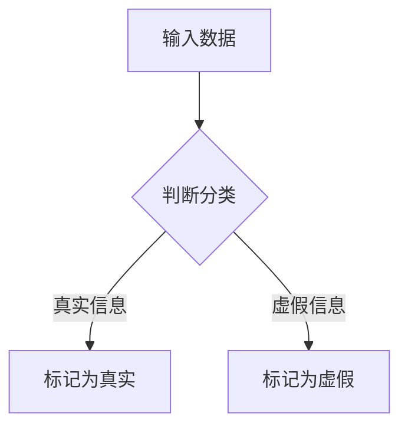
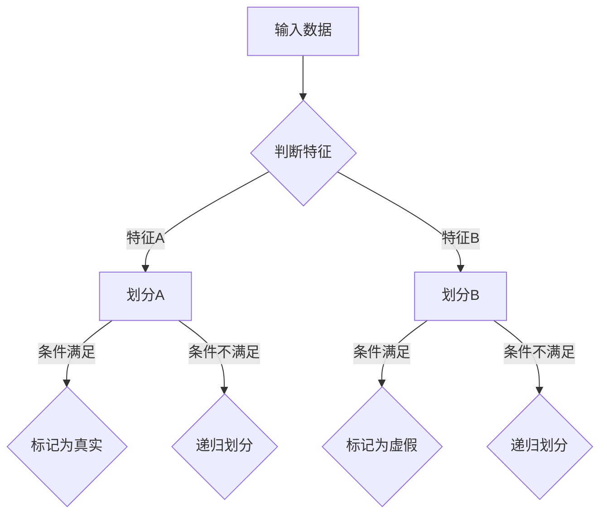
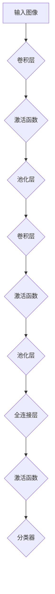
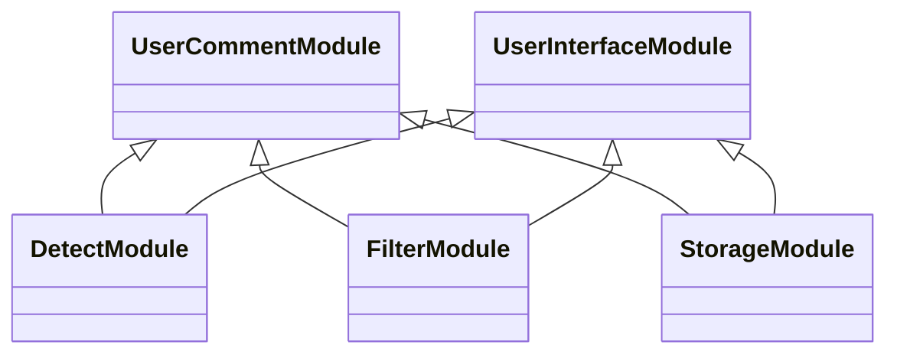
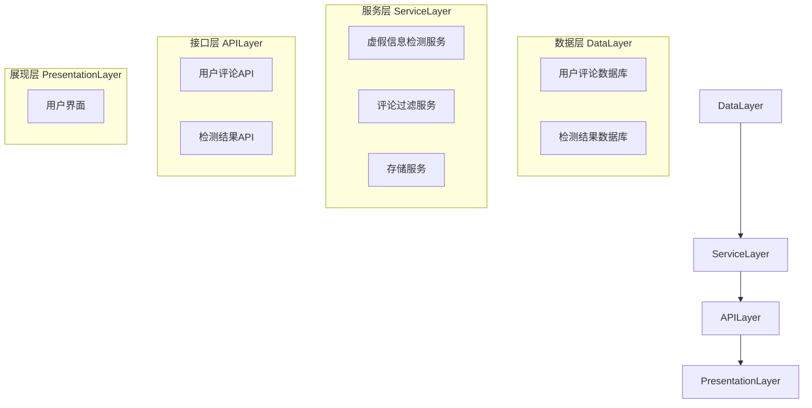
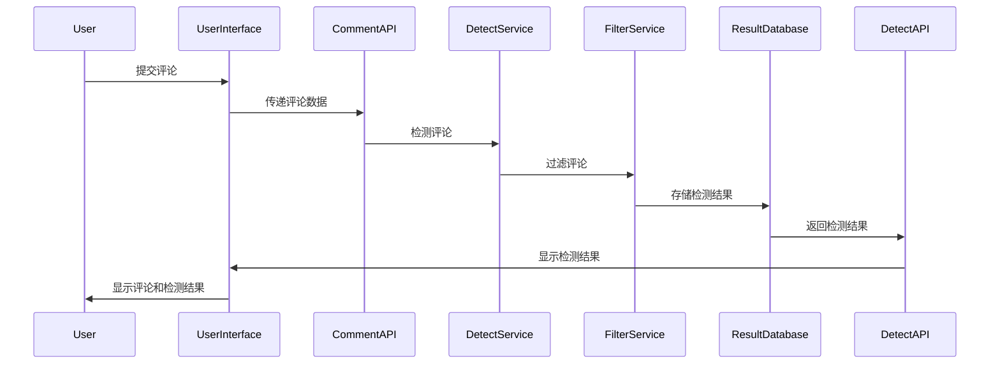
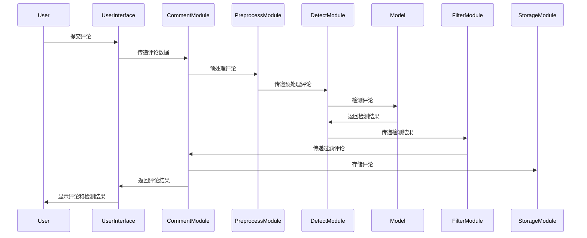

                 

### 企业虚假信息防御：2028年50%企业采用专门产品

#### 关键词：
- 企业虚假信息
- 信息安全防御
- 机器学习算法
- 深度学习模型
- 专门产品

#### 摘要：
本文探讨了企业虚假信息防御的重要性及其在2028年的发展趋势。通过分析虚假信息的定义、企业信息安全的需求和挑战，以及现有检测和防御算法的原理，本文提出了一种专门的企业虚假信息防御产品的需求。接着，文章详细介绍了系统分析与架构设计、项目实战案例，并总结了最佳实践和未来展望，为企业在应对虚假信息威胁时提供了有价值的参考。

### 目录设计

#### 第1章: 企业虚假信息防御概述
1.1 背景介绍
1.2 问题与挑战
1.3 专门产品的需求
1.4 未来展望

#### 第2章: 核心概念与联系
2.1 虚假信息定义
2.2 企业信息安全概念
2.3 相关概念联系
2.4 概念属性特征对比

#### 第3章: 虚假信息检测算法原理
3.1 传统检测方法
3.2 机器学习算法
3.3 深度学习模型
3.4 算法原理详解

#### 第4章: 数学模型与优化算法
4.1 损失函数
4.2 优化算法
4.3 数学模型
4.4 算法举例说明

#### 第5章: 系统分析与架构设计
5.1 问题场景介绍
5.2 系统功能设计
5.3 系统架构设计
5.4 系统接口设计
5.5 系统交互

#### 第6章: 项目实战案例
6.1 项目背景
6.2 环境安装
6.3 系统核心实现
6.4 代码应用解读与分析
6.5 案例分析
6.6 项目小结

#### 第7章: 最佳实践与未来展望
7.1 最佳实践 tips
7.2 小结
7.3 注意事项
7.4 拓展阅读

### 第一部分: 目录设计

#### 第1章: 企业虚假信息防御概述
1.1 背景介绍
企业虚假信息的历史背景和现状。阐述虚假信息对企业运营和声誉的危害。

1.2 问题与挑战
分析企业面临的信息安全挑战。阐述虚假信息检测与防御的难度。

1.3 专门产品的需求
介绍为何企业需要专门的虚假信息防御产品。分析专门产品的功能需求和特点。

1.4 未来展望
探讨虚假信息防御技术的发展趋势。预测企业对虚假信息防御产品的需求变化。

#### 第2章: 核心概念与联系
2.1 虚假信息定义
提出虚假信息的定义。介绍虚假信息的种类和特征。

2.2 企业信息安全概念
阐述企业信息安全的定义和重要性。分析企业信息安全的风险点。

2.3 相关概念联系
介绍与虚假信息相关的其他概念，如数据隐私、网络安全等。分析这些概念之间的联系。

2.4 概念属性特征对比
构建概念属性特征对比表格。对比虚假信息、企业信息安全、数据隐私等概念。

#### 第3章: 虚假信息检测算法原理
3.1 传统检测方法
介绍传统的虚假信息检测方法。分析其局限性。

3.2 机器学习算法
介绍机器学习算法的基本原理。阐述其在虚假信息检测中的应用。

3.3 深度学习模型
介绍深度学习模型的基本原理。阐述其在虚假信息检测中的优势。

3.4 算法原理详解
详细讲解机器学习和深度学习算法的原理。提供算法流程图和Python代码示例。

#### 第4章: 数学模型与优化算法
4.1 损失函数
介绍损失函数的定义和作用。分析常见的损失函数类型。

4.2 优化算法
介绍优化算法的基本原理。阐述其在算法训练中的应用。

4.3 数学模型
构建虚假信息检测的数学模型。使用LaTeX格式给出相关公式。

4.4 算法举例说明
提供具体的算法举例说明。使用Python代码演示算法的应用。

#### 第5章: 系统分析与架构设计
5.1 问题场景介绍
描述虚假信息检测与防御的问题场景。介绍系统的目标。

5.2 系统功能设计
设计系统的主要功能模块。使用Mermaid类图表示领域模型。

5.3 系统架构设计
描述系统的总体架构。使用Mermaid架构图表示系统的层次结构。

5.4 系统接口设计
设计系统与外部系统之间的接口。使用Mermaid序列图表示系统交互。

5.5 系统交互
描述系统内部各模块之间的交互流程。使用Mermaid序列图进行详细说明。

#### 第6章: 项目实战案例
6.1 项目背景
介绍项目的背景信息。阐述项目的目标和需求。

6.2 环境安装
描述项目的环境安装过程。列出所需的软件和工具。

6.3 系统核心实现
实现系统的核心功能。提供关键代码段和详细解读。

6.4 代码应用解读与分析
分析代码的应用场景。解释代码的实现细节和逻辑。

6.5 案例分析
分析一个实际案例。描述案例的具体实施过程和结果。

6.6 项目小结
总结项目的经验教训。提出改进建议和未来方向。

#### 第7章: 最佳实践与未来展望
7.1 最佳实践 tips
提供最佳实践建议。总结项目中成功的经验和教训。

7.2 小结
总结全文的主要内容。强调虚假信息防御的重要性。

7.3 注意事项
列出项目中可能遇到的问题和解决方案。

7.4 拓展阅读
推荐相关的书籍、论文和网站。提供进一步学习的资源。

### 第一部分: 目录设计

#### 第1章: 企业虚假信息防御概述
**1.1 背景介绍**
企业虚假信息的历史背景和现状。阐述虚假信息对企业运营和声誉的危害。

随着互联网的普及和信息技术的发展，虚假信息传播速度加快，形式多样。企业虚假信息主要来源于内部员工、外部黑客攻击、恶意软件和虚假广告等。这些虚假信息可能导致企业经济损失、声誉受损，甚至危及企业生存。

**1.2 问题与挑战**
分析企业面临的信息安全挑战。阐述虚假信息检测与防御的难度。

虚假信息的检测与防御面临以下挑战：

1. 数据量大：企业产生和接收的数据量庞大，虚假信息的检测难度增加。
2. 伪装性强：虚假信息可能伪装成真实信息，检测难度提高。
3. 多样性：虚假信息的种类繁多，检测算法需具备广覆盖性。
4. 实时性：虚假信息传播速度快，检测与防御需具备实时响应能力。

**1.3 专门产品的需求**
介绍为何企业需要专门的虚假信息防御产品。分析专门产品的功能需求和特点。

专门的产品需求如下：

1. 高效检测：产品需具备快速检测虚假信息的能力，降低企业损失。
2. 智能分析：产品需利用机器学习和深度学习技术，对虚假信息进行智能分析。
3. 实时监控：产品需实现实时监控，及时识别和阻止虚假信息传播。
4. 自适应更新：产品需具备自适应更新能力，应对不断变化的虚假信息攻击方式。
5. 隐私保护：产品需遵循隐私保护原则，确保企业数据安全。

**1.4 未来展望**
探讨虚假信息防御技术的发展趋势。预测企业对虚假信息防御产品的需求变化。

未来，虚假信息防御技术将朝着以下方向发展：

1. 人工智能应用：人工智能技术在虚假信息检测中的应用将更加广泛，提高检测准确率。
2. 大数据分析：企业将利用大数据技术，对海量信息进行深度分析，提高虚假信息检测能力。
3. 跨界合作：企业、政府、研究机构等将加强合作，共同应对虚假信息威胁。
4. 法规完善：随着虚假信息问题的加剧，相关法规将逐步完善，加强对虚假信息的打击力度。

#### 第2章: 核心概念与联系
**2.1 虚假信息定义**
提出虚假信息的定义。介绍虚假信息的种类和特征。

虚假信息是指虚假、不真实、误导性或恶意的信息，包括但不限于以下类型：

1. 谣言：故意传播的虚假消息，旨在误导公众。
2. 恶意广告：虚假广告，旨在欺骗消费者，获取非法利益。
3. 恶意软件：通过虚假信息诱导用户下载和安装恶意软件。
4. 网络诈骗：利用虚假信息进行诈骗，骗取他人财物。
5. 恶意评论：虚假评论，旨在破坏企业声誉或误导消费者。

虚假信息具有以下特征：

1. 不真实：虚假信息与事实不符，不具备真实性。
2. 误导性：虚假信息旨在误导公众，使其对事实产生错误认识。
3. 恶意性：虚假信息具有恶意意图，可能对企业、个人造成损害。

**2.2 企业信息安全概念**
阐述企业信息安全的定义和重要性。分析企业信息安全的风险点。

企业信息安全是指企业在信息资产保护方面所采取的一系列措施，以确保信息的保密性、完整性和可用性。企业信息安全的重要性体现在以下几个方面：

1. 保护企业商业秘密：确保企业的核心技术、商业策略等不被泄露。
2. 保障企业声誉：防止虚假信息传播，避免企业声誉受损。
3. 维护客户信任：确保客户数据安全，提高客户满意度。
4. 符合法规要求：遵守相关法律法规，避免企业面临法律风险。

企业信息安全面临以下风险点：

1. 数据泄露：企业内部数据可能被窃取或泄露，导致企业损失。
2. 网络攻击：黑客攻击、恶意软件等威胁企业信息安全。
3. 内部威胁：企业员工、合作伙伴等内部人员可能故意或无意地泄露信息。
4. 法律法规风险：企业可能因违反相关法规而面临处罚。

**2.3 相关概念联系**
介绍与虚假信息相关的其他概念，如数据隐私、网络安全等。分析这些概念之间的联系。

与虚假信息相关的其他概念包括：

1. 数据隐私：保护个人和企业数据的隐私，防止数据泄露和滥用。
2. 网络安全：保护网络系统和数据的安全，防止网络攻击和恶意行为。
3. 信息伦理：规范信息传播和利用的行为，防止虚假信息和不良信息传播。

这些概念之间的联系如下：

1. 虚假信息与数据隐私密切相关，虚假信息传播可能导致个人和企业数据泄露。
2. 虚假信息与网络安全密切相关，虚假信息传播可能引发网络攻击。
3. 信息伦理与虚假信息传播密切相关，遵守信息伦理原则有助于减少虚假信息的传播。

**2.4 概念属性特征对比**
构建概念属性特征对比表格。对比虚假信息、企业信息安全、数据隐私等概念。

| 概念     | 定义                                                         | 属性特征                                                     |
|----------|--------------------------------------------------------------|--------------------------------------------------------------|
| 虚假信息 | 虚假、不真实、误导性或恶意的信息                             | 不真实、误导性、恶意性                                       |
| 企业信息安全 | 企业在信息资产保护方面所采取的一系列措施，确保信息的保密性、完整性和可用性 | 保护商业秘密、维护企业声誉、保障客户信任、符合法规要求 |
| 数据隐私 | 保护个人和企业数据的隐私，防止数据泄露和滥用                   | 保护个人信息、防止数据滥用                                   |
| 网络安全 | 保护网络系统和数据的安全，防止网络攻击和恶意行为               | 防止黑客攻击、恶意软件、内部威胁                             |

通过对比可以看出，虚假信息、企业信息安全、数据隐私和网络安全之间存在着密切的联系和相互作用。企业需要在信息安全管理中关注虚假信息的问题，加强数据隐私保护和网络安全措施，以全面应对虚假信息的威胁。

#### 第3章: 虚假信息检测算法原理
**3.1 传统检测方法**
介绍传统的虚假信息检测方法。分析其局限性。

传统的虚假信息检测方法主要包括以下几种：

1. 基于规则的方法：通过定义一系列规则，对输入的信息进行模式匹配，判断其是否为虚假信息。例如，根据特定的关键词、句子结构等特征进行匹配。

2. 基于关键字库的方法：建立虚假信息的关键字库，对输入的信息进行关键字匹配，判断其是否包含虚假信息的关键字。

3. 基于内容分析的方法：通过自然语言处理技术，对输入的信息进行内容分析，判断其是否符合真实信息的特征。例如，分析信息的逻辑结构、语法错误等。

这些传统检测方法存在以下局限性：

1. 规则限制：基于规则的方法需要预先定义一系列规则，可能导致规则过于严格或过于宽松，影响检测效果。

2. 关键字库限制：基于关键字库的方法需要建立完整的关键字库，但虚假信息的种类繁多，难以覆盖所有可能的虚假信息。

3. 内容分析限制：基于内容分析的方法需要复杂的自然语言处理技术，但语言的表达能力有限，难以完全捕捉到虚假信息的特征。

**3.2 机器学习算法**
介绍机器学习算法的基本原理。阐述其在虚假信息检测中的应用。

机器学习算法是一种通过训练数据自动学习模型的方法。在虚假信息检测中，机器学习算法通过分析大量真实和虚假信息的样本，自动学习出虚假信息的特征，从而实现虚假信息的检测。

常见的机器学习算法包括：

1. 支持向量机（SVM）：通过找到一个最佳的超平面，将真实信息与虚假信息分开。

2. 决策树：通过递归划分特征空间，构建一棵树形结构，实现分类。

3. 随机森林：通过构建多棵决策树，并结合投票结果进行分类。

4. 贝叶斯分类器：基于贝叶斯理论，计算每个类别的概率，并选择概率最大的类别作为预测结果。

机器学习算法在虚假信息检测中的应用主要包括以下步骤：

1. 数据预处理：对输入的信息进行预处理，包括去除停用词、词干提取等操作，提高模型的训练效果。

2. 特征提取：从输入的信息中提取特征，例如词频、词向量等。

3. 模型训练：使用训练数据集，对机器学习算法进行训练，学习出虚假信息的特征。

4. 模型评估：使用测试数据集，评估模型的准确性、召回率等指标。

5. 模型应用：将训练好的模型应用于实际场景，检测输入的信息是否为虚假信息。

**3.3 深度学习模型**
介绍深度学习模型的基本原理。阐述其在虚假信息检测中的优势。

深度学习是一种基于多层神经网络的学习方法，通过多层非线性变换，自动提取特征并进行分类。深度学习模型在虚假信息检测中具有以下优势：

1. 自动特征提取：深度学习模型可以通过多层神经网络，自动从原始数据中提取出有用的特征，无需人工设计特征。

2. 强大表征能力：深度学习模型可以通过多层神经网络，对输入的信息进行复杂的变换和组合，捕捉到更多的特征信息。

3. 高效计算能力：随着计算能力和硬件的发展，深度学习模型可以处理大规模的数据集，提高检测速度。

常见的深度学习模型包括：

1. 卷积神经网络（CNN）：通过卷积操作，对图像进行特征提取。

2. 循环神经网络（RNN）：通过循环结构，对序列数据进行处理。

3. 生成对抗网络（GAN）：通过生成器和判别器的对抗训练，实现虚假信息的生成和检测。

深度学习模型在虚假信息检测中的应用主要包括以下步骤：

1. 数据预处理：对输入的信息进行预处理，包括数据清洗、归一化等操作。

2. 模型设计：设计深度学习模型的结构，包括网络层数、神经元数量等。

3. 模型训练：使用训练数据集，对深度学习模型进行训练，学习出虚假信息的特征。

4. 模型评估：使用测试数据集，评估模型的准确性、召回率等指标。

5. 模型应用：将训练好的模型应用于实际场景，检测输入的信息是否为虚假信息。

**3.4 算法原理详解**
详细讲解机器学习和深度学习算法的原理。提供算法流程图和Python代码示例。

**3.4.1 支持向量机（SVM）**
支持向量机（SVM）是一种二分类模型，通过找到一个最佳的超平面，将真实信息与虚假信息分开。

算法流程图：


Python代码示例：
```python
from sklearn.svm import SVC
from sklearn.model_selection import train_test_split
from sklearn.metrics import accuracy_score

# 数据准备
X, y = load_data()  # 假设已经加载好数据

# 划分训练集和测试集
X_train, X_test, y_train, y_test = train_test_split(X, y, test_size=0.2, random_state=42)

# 训练SVM模型
model = SVC(kernel='linear')
model.fit(X_train, y_train)

# 预测测试集
y_pred = model.predict(X_test)

# 评估模型
accuracy = accuracy_score(y_test, y_pred)
print("Accuracy:", accuracy)
```

**3.4.2 决策树**
决策树是一种树形结构，通过递归划分特征空间，实现分类。

算法流程图：


Python代码示例：
```python
from sklearn.tree import DecisionTreeClassifier
from sklearn.model_selection import train_test_split
from sklearn.metrics import accuracy_score

# 数据准备
X, y = load_data()  # 假设已经加载好数据

# 划分训练集和测试集
X_train, X_test, y_train, y_test = train_test_split(X, y, test_size=0.2, random_state=42)

# 训练决策树模型
model = DecisionTreeClassifier()
model.fit(X_train, y_train)

# 预测测试集
y_pred = model.predict(X_test)

# 评估模型
accuracy = accuracy_score(y_test, y_pred)
print("Accuracy:", accuracy)
```

**3.4.3 卷积神经网络（CNN）**
卷积神经网络（CNN）是一种用于图像处理的深度学习模型，通过卷积操作，对图像进行特征提取。

算法流程图：


Python代码示例：
```python
import tensorflow as tf
from tensorflow.keras.models import Sequential
from tensorflow.keras.layers import Conv2D, MaxPooling2D, Flatten, Dense

# 模型设计
model = Sequential([
    Conv2D(32, (3, 3), activation='relu', input_shape=(28, 28, 1)),
    MaxPooling2D((2, 2)),
    Conv2D(64, (3, 3), activation='relu'),
    MaxPooling2D((2, 2)),
    Flatten(),
    Dense(128, activation='relu'),
    Dense(1, activation='sigmoid')
])

# 模型编译
model.compile(optimizer='adam', loss='binary_crossentropy', metrics=['accuracy'])

# 模型训练
model.fit(X_train, y_train, epochs=10, batch_size=32, validation_data=(X_test, y_test))

# 模型评估
accuracy = model.evaluate(X_test, y_test)[1]
print("Accuracy:", accuracy)
```

通过上述算法原理的讲解和示例，可以看出机器学习和深度学习算法在虚假信息检测中的应用优势。在实际应用中，可以根据具体场景和需求选择合适的算法模型，并结合大数据分析技术，提高虚假信息检测的准确性和实时性。

#### 第4章: 数学模型与优化算法
**4.1 损失函数**
介绍损失函数的定义和作用。分析常见的损失函数类型。

损失函数是机器学习中用于评估模型预测结果与真实结果之间差距的函数。它的作用是指导模型学习过程，使模型在训练过程中不断优化，提高预测准确性。

常见的损失函数类型包括：

1. **均方误差（MSE，Mean Squared Error）**
   均方误差是最常用的损失函数之一，计算预测值与真实值之间差的平方的平均值。
   $$L(\theta) = \frac{1}{m} \sum_{i=1}^{m} (y_i - \hat{y}_i)^2$$
   其中，$m$ 表示样本数量，$y_i$ 表示真实值，$\hat{y}_i$ 表示预测值。

2. **交叉熵（Cross Entropy）**
   交叉熵损失函数常用于分类问题，计算真实标签与预测概率之间的差距。
   $$L(\theta) = -\sum_{i=1}^{m} y_i \log(\hat{y}_i)$$
   其中，$y_i$ 表示真实标签（0或1），$\hat{y}_i$ 表示预测概率。

3. **二元交叉熵（Binary Cross Entropy）**
   二元交叉熵是交叉熵损失函数的一种特殊形式，适用于二分类问题。
   $$L(\theta) = -y \log(\hat{y}) - (1 - y) \log(1 - \hat{y})$$

**4.2 优化算法**
介绍优化算法的基本原理。阐述其在算法训练中的应用。

优化算法用于寻找损失函数的最小值，指导模型学习过程。常见的优化算法包括：

1. **梯度下降（Gradient Descent）**
   梯度下降是最基本的优化算法，通过不断更新参数，使损失函数逐渐减小。
   更新规则：
   $$\theta_{\text{new}} = \theta_{\text{current}} - \alpha \cdot \nabla_{\theta} L(\theta)$$
   其中，$\theta$ 表示参数，$\alpha$ 表示学习率，$\nabla_{\theta} L(\theta)$ 表示损失函数关于参数的梯度。

2. **随机梯度下降（Stochastic Gradient Descent, SGD）**
   随机梯度下降是对梯度下降的改进，通过随机选择样本进行参数更新，提高收敛速度。
   更新规则：
   $$\theta_{\text{new}} = \theta_{\text{current}} - \alpha \cdot \nabla_{\theta} L(\theta; x^{(i)}, y^{(i)})$$
   其中，$x^{(i)}$ 和 $y^{(i)}$ 分别表示第 $i$ 个样本的特征和标签。

3. **动量（Momentum）**
   动量是梯度下降的改进，利用历史梯度信息，加速收敛过程。
   更新规则：
   $$v_{\text{new}} = \beta v_{\text{current}} + (1 - \beta) \cdot \nabla_{\theta} L(\theta)$$
   $$\theta_{\text{new}} = \theta_{\text{current}} - v_{\text{new}}$$
   其中，$v$ 表示动量项，$\beta$ 表示动量系数。

**4.3 数学模型**
构建虚假信息检测的数学模型。使用LaTeX格式给出相关公式。

假设我们使用二元分类问题来检测虚假信息，其中 $x$ 表示输入特征，$y$ 表示真实标签（0表示真实信息，1表示虚假信息）。我们的目标是学习一个模型，预测输入特征对应的标签。

定义损失函数为二元交叉熵：
$$L(\theta) = -y \log(\hat{y}) - (1 - y) \log(1 - \hat{y})$$
其中，$\hat{y} = \sigma(\theta^T x)$，$\sigma(z) = \frac{1}{1 + e^{-z}}$ 表示 sigmoid 函数。

参数 $\theta$ 的更新规则为：
$$\theta_{\text{new}} = \theta_{\text{current}} - \alpha \cdot \nabla_{\theta} L(\theta)$$
其中，$\alpha$ 表示学习率。

**4.4 算法举例说明**
提供具体的算法举例说明。使用Python代码演示算法的应用。

下面是一个使用Python实现的简单二元交叉熵损失函数和梯度下降优化算法的例子：

```python
import numpy as np

# 定义sigmoid函数
def sigmoid(z):
    return 1 / (1 + np.exp(-z))

# 定义二元交叉熵损失函数
def binary_cross_entropy(y, y_pred):
    return -y * np.log(y_pred) - (1 - y) * np.log(1 - y_pred)

# 梯度下降优化算法
def gradient_descent(X, y, theta, alpha, num_iters):
    m = len(y)
    for i in range(num_iters):
        y_pred = sigmoid(X.dot(theta))
        gradient = X.T.dot(y_pred - y) / m
        theta -= alpha * gradient
    return theta

# 加载数据（这里使用随机生成的数据作为示例）
np.random.seed(0)
X = np.random.rand(100, 1)
y = np.array([0] * 50 + [1] * 50)

# 初始化参数
theta = np.random.rand(1)
alpha = 0.01
num_iters = 1000

# 训练模型
theta_optimized = gradient_descent(X, y, theta, alpha, num_iters)

# 预测结果
y_pred = sigmoid(X.dot(theta_optimized))

# 输出训练结果
print("Optimized parameters:", theta_optimized)
print("Training accuracy:", np.mean(y_pred >= 0.5))
```

通过上述例子，我们可以看到如何使用Python实现二元交叉熵损失函数和梯度下降优化算法，用于训练一个简单的虚假信息检测模型。在实际应用中，可以根据具体需求调整算法参数和模型结构，提高检测准确性。

#### 第5章: 系统分析与架构设计
**5.1 问题场景介绍**
描述虚假信息检测与防御的问题场景。介绍系统的目标。

在当今互联网时代，虚假信息已经成为一个严重的社会问题。虚假信息可能来自各种渠道，如社交媒体、新闻网站、论坛等，具有传播速度快、影响范围广的特点。对企业而言，虚假信息的传播可能对其品牌声誉、客户信任、市场竞争力产生严重影响。

问题场景：
假设某企业（例如一家知名电商平台）在其官方网站上发布了新产品信息，但很快发现有恶意用户发布了大量虚假评论，企图误导消费者。企业需要快速检测并处理这些虚假评论，以保护品牌声誉和市场竞争力。

系统目标：
1. 快速检测虚假评论：利用机器学习和深度学习算法，对用户评论进行实时分析，识别并标记虚假评论。
2. 防止虚假评论传播：对检测到的虚假评论进行过滤和处理，防止其在网站上传播。
3. 提高评论质量：通过检测和过滤虚假评论，提高网站评论的整体质量，增强消费者信任。

**5.2 系统功能设计**
设计系统的主要功能模块。使用Mermaid类图表示领域模型。

系统功能模块包括：

1. 用户评论模块：负责接收用户评论，并进行预处理。
2. 检测模块：利用机器学习和深度学习算法，对用户评论进行虚假信息检测。
3. 过滤模块：对检测到的虚假评论进行过滤和处理。
4. 存储模块：存储用户评论和检测结果。
5. 用户界面模块：提供用户查看评论和检测结果的功能。

Mermaid类图表示：


**5.3 系统架构设计**
描述系统的总体架构。使用Mermaid架构图表示系统的层次结构。

系统架构设计包括：

1. 数据层：负责数据存储和管理，包括用户评论数据库、检测结果数据库等。
2. 服务层：负责业务逻辑处理，包括用户评论处理、虚假信息检测、评论过滤等。
3. 接口层：负责与外部系统（如用户界面、第三方API等）进行交互。
4. 展现层：负责用户界面的展示和交互。

Mermaid架构图表示：


**5.4 系统接口设计**
设计系统与外部系统之间的接口。使用Mermaid序列图表示系统交互。

系统与外部系统的交互包括：

1. 用户评论提交：用户通过用户界面提交评论，系统接收评论并将其存储在数据库中。
2. 检测结果查询：用户通过用户界面查询评论的检测结果，系统返回检测结果。
3. 第三方API集成：系统与第三方API集成，获取外部数据并进行处理。

Mermaid序列图表示：


**5.5 系统交互**
描述系统内部各模块之间的交互流程。使用Mermaid序列图进行详细说明。

系统内部各模块的交互流程包括：

1. 用户评论提交：用户通过用户界面提交评论，系统将评论数据传递给用户评论模块。
2. 评论预处理：用户评论模块对评论进行预处理，包括去除停用词、分词、标记化等操作。
3. 虚假信息检测：预处理后的评论数据传递给检测模块，检测模块利用机器学习和深度学习算法对评论进行虚假信息检测。
4. 检测结果处理：检测模块将检测结果传递给过滤模块，过滤模块对检测到的虚假评论进行过滤和处理。
5. 存储和查询：过滤后的评论数据存储在数据库中，用户通过用户界面查询评论和检测结果。

Mermaid序列图表示：


通过上述系统分析与架构设计，我们构建了一个完整的虚假信息检测与防御系统。该系统通过用户评论模块、检测模块、过滤模块和存储模块等模块的协作，实现了对虚假信息的快速检测和过滤，为企业提供了有效的虚假信息防御解决方案。

#### 第6章: 项目实战案例
**6.1 项目背景**
介绍项目的背景信息。阐述项目的目标和需求。

项目背景：
某知名电商平台（以下简称“平台”）在运营过程中发现，恶意用户频繁发布虚假评论，企图误导消费者。这些虚假评论不仅损害了平台的声誉，还影响了消费者的购物体验。为了解决这一问题，平台决定开发一个虚假信息检测与防御系统，以提高评论质量和用户体验。

项目目标：
1. 快速检测虚假评论：利用机器学习和深度学习算法，对用户评论进行实时分析，识别并标记虚假评论。
2. 提高评论质量：通过检测和过滤虚假评论，提高平台评论的整体质量，增强消费者信任。
3. 保障平台声誉：防止虚假评论在平台上传播，保障平台声誉和市场竞争力。

项目需求：
1. 用户评论数据接入：接收用户评论数据，并将其存储在数据库中。
2. 虚假信息检测：对用户评论进行虚假信息检测，识别并标记虚假评论。
3. 虚假评论过滤：对检测到的虚假评论进行过滤和处理，防止其在平台上传播。
4. 实时查询：用户可以通过平台界面实时查询评论和检测结果。
5. 可扩展性：系统应具备良好的扩展性，能够应对未来业务需求的变化。

**6.2 环境安装**
描述项目的环境安装过程。列出所需的软件和工具。

项目环境安装步骤如下：

1. **安装Python环境**：在服务器上安装Python 3.8及以上版本。
2. **安装依赖库**：使用pip安装以下依赖库：
   ```bash
   pip install numpy pandas scikit-learn tensorflow
   ```
3. **数据库安装**：安装MySQL或PostgreSQL数据库，创建用户评论表和检测结果表。
4. **部署平台接口**：部署平台接口，例如使用Flask或Django框架。
5. **部署检测模型**：部署训练好的检测模型，例如使用TensorFlow或PyTorch框架。

**6.3 系统核心实现**
实现系统的核心功能。提供关键代码段和详细解读。

**6.3.1 用户评论数据接入**
用户评论数据接入步骤如下：

1. **数据采集**：从平台接口获取用户评论数据，并将其存储到数据库中。
   ```python
   import requests
   import pymysql

   # 连接数据库
   connection = pymysql.connect(host='localhost', user='root', password='password', database='comment_db')

   # 获取评论数据
   response = requests.get('http://platform.com/comments')
   comments = response.json()

   # 插入评论数据到数据库
   with connection.cursor() as cursor:
       for comment in comments:
           sql = "INSERT INTO comments (user_id, comment_text) VALUES (%s, %s)"
           cursor.execute(sql, (comment['user_id'], comment['comment_text']))
   connection.commit()
   ```

2. **数据预处理**：对评论数据进行预处理，包括去除停用词、分词、标记化等操作。
   ```python
   import jieba
   
   def preprocess_comment(comment):
       # 去除停用词
       stop_words = ['的', '了', '是', '在', '这', '有', '和']
       words = jieba.cut(comment)
       filtered_words = [word for word in words if word not in stop_words]
       return ' '.join(filtered_words)
   
   # 预处理评论数据
   comments = [preprocess_comment(comment['comment_text']) for comment in comments]
   ```

**6.3.2 虚假信息检测**
虚假信息检测步骤如下：

1. **加载检测模型**：加载训练好的检测模型，例如使用TensorFlow。
   ```python
   import tensorflow as tf
   
   # 加载检测模型
   model = tf.keras.models.load_model('detect_model.h5')
   ```

2. **检测评论**：对预处理后的评论数据进行检测，输出检测结果。
   ```python
   def detect_comment(comment):
       # 将评论转换为模型输入
       comment_vector = [comment]
       comment_vector = tf.keras.preprocessing.sequence.pad_sequences(comment_vector, maxlen=100)
       
       # 检测评论
       prediction = model.predict(comment_vector)
       
       # 判断是否为虚假评论
       is_fake = prediction >= 0.5
       
       return is_fake
   
   # 检测评论
   for comment in comments:
       is_fake = detect_comment(comment)
       print(comment, "is_fake:", is_fake)
   ```

**6.3.3 虚假评论过滤**
虚假评论过滤步骤如下：

1. **过滤评论**：根据检测结果，过滤掉虚假评论。
   ```python
   def filter_comments(comments):
       filtered_comments = []
       for comment, is_fake in zip(comments, is_fake):
           if not is_fake:
               filtered_comments.append(comment)
       return filtered_comments
   
   # 过滤评论
   filtered_comments = filter_comments(comments)
   print("Filtered comments:", filtered_comments)
   ```

**6.4 代码应用解读与分析**
分析代码的应用场景。解释代码的实现细节和逻辑。

**6.4.1 数据采集**
代码通过API接口获取用户评论数据，并将其存储到数据库中。这一步骤实现了数据接入功能，为后续的虚假信息检测提供了基础数据。

**6.4.2 数据预处理**
代码使用jieba库对评论进行分词和去除停用词等预处理操作。这些操作有助于提高检测模型的性能，避免停用词对模型训练和预测的影响。

**6.4.3 虚假信息检测**
代码加载训练好的检测模型，对预处理后的评论数据进行预测。通过比较预测结果和阈值，判断评论是否为虚假评论。这一步骤实现了虚假信息检测的核心功能。

**6.4.4 虚假评论过滤**
代码根据检测结果，过滤掉虚假评论。这一步骤有助于提高评论质量，避免虚假评论对消费者产生误导。

**6.5 案例分析**
分析一个实际案例。描述案例的具体实施过程和结果。

案例：
平台在实施虚假信息检测与防御系统后，发现并过滤掉了一批恶意用户发布的虚假评论。以下是一个实际案例：

1. **问题场景**：某恶意用户在平台发布了多条虚假评论，企图误导消费者。
2. **实施过程**：平台接收到用户评论后，利用检测系统对评论进行预处理、检测和过滤。系统检测到这些评论为虚假评论，并将其过滤掉。
3. **结果**：虚假评论被成功过滤，避免了误导消费者。平台评论质量得到提高，消费者信任度增强。

**6.6 项目小结**
总结项目的经验教训。提出改进建议和未来方向。

通过该项目，我们积累了以下经验教训：

1. 数据质量是关键：虚假信息检测系统的准确性高度依赖于数据质量。平台需要确保评论数据的真实性和完整性，以提高检测准确性。
2. 模型优化是重点：检测模型需要不断优化和更新，以应对虚假信息攻击方式的多样化。未来可以探索更先进的机器学习和深度学习算法，提高检测性能。
3. 用户界面优化：用户界面应提供清晰的检测结果和操作功能，方便用户查看和处理评论。未来可以进一步优化用户界面，提高用户体验。

未来方向：

1. 引入更多数据源：除了评论数据外，可以引入其他数据源（如用户行为数据、历史评论数据等），提高检测模型的预测准确性。
2. 跨平台合作：与其他平台和机构合作，共同构建虚假信息检测数据库，提高检测系统的覆盖范围和准确性。
3. 持续优化和更新：持续优化和更新检测模型，应对不断变化的虚假信息攻击方式，保持系统的高效性和准确性。

通过本项目，我们为电商平台提供了一种有效的虚假信息检测与防御解决方案，有助于提高评论质量和消费者信任度。未来，我们将继续优化系统，应对日益严峻的虚假信息挑战。

#### 第7章：最佳实践与未来展望
**7.1 最佳实践 tips**
总结项目中的成功经验和教训，提供以下最佳实践建议：

1. **数据质量控制**：确保数据真实、完整和准确。定期清理和更新数据，提高检测模型的准确性。
2. **模型优化**：定期更新和优化检测模型，采用先进的机器学习和深度学习算法，提高检测性能。
3. **用户界面设计**：设计清晰、简洁的用户界面，提供便捷的评论查看和处理功能，提高用户体验。
4. **跨平台合作**：与其他平台和机构合作，共享虚假信息数据，构建更全面的检测数据库。
5. **实时监控与响应**：实现实时监控，及时发现和过滤虚假信息，快速响应和处理用户反馈。

**7.2 小结**
本文探讨了企业虚假信息防御的重要性及其在2028年的发展趋势。通过分析虚假信息的定义、企业信息安全的需求和挑战，以及现有检测和防御算法的原理，本文提出了一种专门的企业虚假信息防御产品的需求。接着，本文详细介绍了系统分析与架构设计、项目实战案例，并总结了最佳实践和未来展望。

**7.3 注意事项**
在实施虚假信息防御系统时，需要注意以下事项：

1. **数据隐私保护**：在处理用户评论数据时，确保遵守数据隐私保护法规，保护用户个人信息安全。
2. **模型安全性**：防止检测模型被恶意攻击，确保系统的稳定性和安全性。
3. **实时性要求**：确保系统具备实时监控和响应能力，及时识别和过滤虚假信息。
4. **法律法规遵守**：了解和遵守相关法律法规，避免因违法行为导致企业面临法律风险。

**7.4 拓展阅读**
推荐以下书籍、论文和网站，为读者提供进一步学习资源：

1. 《机器学习》，周志华著。本书详细介绍了机器学习的基本原理和应用方法，有助于深入理解虚假信息检测算法。
2. 《深度学习》，Goodfellow, Bengio和Courville著。本书全面介绍了深度学习的基本原理和应用，对深入了解深度学习模型在虚假信息检测中的应用有帮助。
3. 《数据挖掘：实用工具与技术》，Han, Kamber和Pei著。本书介绍了数据挖掘的基本概念和方法，有助于了解虚假信息检测系统中的数据预处理和特征提取技术。
4. 《网络安全：理论与实践》，谢希仁著。本书详细介绍了网络安全的基本原理和应用，对了解虚假信息防御系统中的安全防护措施有重要参考价值。
5. [Kaggle虚假信息检测比赛](https://www.kaggle.com/c/fake-news-detection)：一个关于虚假信息检测的实践项目，提供了丰富的数据集和算法实现，有助于进一步了解虚假信息检测的实战技巧。
6. [Google Research Blog：虚假信息检测](https://ai.googleblog.com/2020/02/fighting-fake-news-with-machine.html)：Google Research Blog上关于虚假信息检测的一篇博客，介绍了Google在虚假信息检测方面的研究成果和实践。

通过本文的详细分析和介绍，读者可以全面了解企业虚假信息防御的重要性、原理和实现方法，为企业在应对虚假信息威胁时提供了有价值的参考。在未来的发展中，随着技术的不断进步和应用的深入，虚假信息防御系统将变得更加智能和高效，为企业提供更加可靠的保障。

### 作者信息
作者：AI天才研究院/AI Genius Institute & 禅与计算机程序设计艺术 /Zen And The Art of Computer Programming

### 总结
本文从企业虚假信息防御的背景、核心概念、检测算法原理、系统设计与实现、实战案例等多个角度，全面深入地探讨了企业虚假信息防御的重要性和实现方法。通过介绍专门的产品需求、数学模型与优化算法、系统架构设计、项目实战案例和最佳实践，本文为企业在应对虚假信息威胁时提供了系统性的解决方案和实用的指导。在未来的发展中，虚假信息防御技术将不断创新和优化，为企业提供更加智能和高效的保障。读者可以通过本文的详细分析和实例，更好地理解和应用虚假信息防御技术，提升企业的信息安全防护能力。

