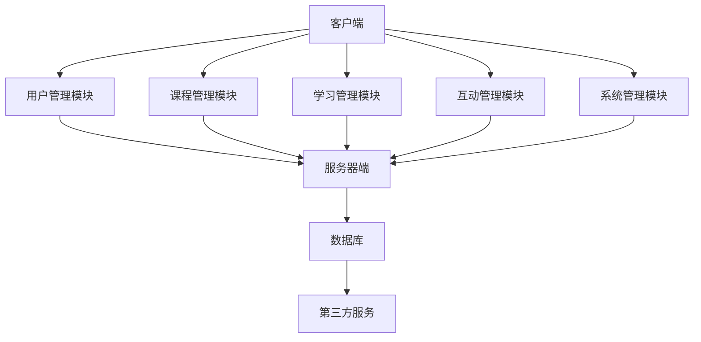

                 

### 第一部分: 引言

# 企业虚拟现实培训：提升员工技能发展效果

## 关键词：企业培训、虚拟现实、技能提升、员工发展

> 摘要：本文探讨了企业虚拟现实培训的背景、意义以及其在提升员工技能和发展效果方面的优势。通过深入分析虚拟现实技术的基础知识、系统设计与实现、案例分析及最佳实践，本文旨在为企业提供一套切实可行的虚拟现实培训方案，以促进员工技能提升和职业发展。

## 1.1 虚拟现实技术的发展概述

### 1.1.1 虚拟现实技术的起源

虚拟现实（VR）技术起源于20世纪60年代的计算机科学领域，其初衷是为了模拟现实环境，提供沉浸式体验。VR技术最早由美国军事科学家爱德华·泰勒提出，并在随后的几十年里经历了多个阶段的发展。

- **20世纪60年代**：VR技术概念首次提出，初期的研究主要集中在模拟仿真领域。
- **20世纪80年代**：VR技术进入实验室阶段，VR设备如头戴显示器（HMD）和跟踪系统开始出现。
- **20世纪90年代**：VR技术逐渐商业化，但受限于硬件性能和成本，未能广泛普及。
- **21世纪**：随着计算机硬件性能的提升和显示技术的进步，VR技术迎来了快速发展，应用领域逐渐扩大。

### 1.1.2 虚拟现实技术的演进

虚拟现实技术的演进可以分为几个关键阶段：

- **增强现实（AR）与混合现实（MR）**：在VR的基础上，AR和MR技术的出现扩展了虚拟现实的应用范围，使得虚拟世界与现实世界的互动更加紧密。
- **硬件技术的进步**：高性能计算设备、高清显示技术和便携式设备的发展，使得虚拟现实体验更加真实和便捷。
- **内容制作和交互**：虚拟现实内容制作的成熟和交互技术的改进，提升了用户的沉浸感和参与度。

### 1.1.3 虚拟现实技术的应用领域

虚拟现实技术已在多个领域得到广泛应用，包括：

- **娱乐**：虚拟现实游戏和主题公园提供了沉浸式娱乐体验。
- **教育**：虚拟现实在教育领域的应用，如医学教育、工程培训和语言学习，提供了生动的教学资源和实践机会。
- **医疗**：虚拟现实在医疗培训、手术模拟和康复治疗中的应用，提升了医疗服务的质量和效率。
- **企业培训**：虚拟现实技术在企业培训中的应用，如新员工入职培训、技能提升和危机处理演练，提高了培训效果和员工参与度。

## 1.2 企业虚拟现实培训的现状

### 1.2.1 企业虚拟现实培训的发展历程

企业虚拟现实培训的发展历程可以概括为以下几个阶段：

- **初期探索**：20世纪90年代，虚拟现实技术开始在企业培训中尝试应用，但受限于技术条件和成本，应用范围较小。
- **应用推广**：随着技术的成熟和成本的降低，21世纪初，虚拟现实培训逐渐在企业中普及，成为企业培训的一种重要手段。
- **创新发展**：近年来，虚拟现实技术的进步和5G网络的普及，推动了企业虚拟现实培训的进一步发展，应用场景和内容形式不断创新。

### 1.2.2 企业虚拟现实培训的优势

企业虚拟现实培训具有以下优势：

- **沉浸式体验**：虚拟现实技术提供了高度沉浸的学习环境，使员工能够更加深入地理解和掌握培训内容。
- **互动性**：虚拟现实培训中的互动性提高了员工的参与度和学习兴趣，有助于知识点的巩固和应用。
- **安全可控**：虚拟现实环境可以模拟各种实际场景，使员工在安全的环境中进行实践，减少了风险和成本。
- **高效灵活**：虚拟现实培训可以随时随地进行，不受时间和地点限制，提高了培训的灵活性和效率。

### 1.2.3 企业虚拟现实培训的挑战与机遇

企业虚拟现实培训面临着以下挑战和机遇：

- **技术成熟度**：虚拟现实技术的成熟度仍然有待提高，尤其是在硬件性能和内容制作方面。
- **成本问题**：虚拟现实设备的成本较高，限制了其在企业中的广泛应用。
- **用户体验**：虚拟现实培训需要提供优质的用户体验，以吸引员工参与。
- **培训内容**：虚拟现实培训内容的设计和开发需要深入行业和岗位特点，提高培训的针对性和实用性。

## 1.3 本书的目的与结构安排

### 1.3.1 本书的主要目标

本书的主要目标是：

- 深入分析虚拟现实技术的基础知识和应用场景。
- 探讨企业虚拟现实培训的设计原则和实施方法。
- 通过案例分析，展示虚拟现实培训在现实中的应用效果。
- 提供一套完整的虚拟现实培训解决方案，帮助企业提升员工技能和发展效果。

### 1.3.2 本书的内容结构

本书分为四个部分：

- 第一部分：引言，介绍虚拟现实技术的发展背景和企业虚拟现实培训的意义。
- 第二部分：虚拟现实技术原理，讲解虚拟现实技术的基础知识和技术原理。
- 第三部分：虚拟现实培训系统设计与实现，介绍虚拟现实培训系统的设计与实现方法。
- 第四部分：虚拟现实培训案例与实践，通过案例分析展示虚拟现实培训的实际应用效果。

### 1.3.3 阅读指南与学习建议

为了更好地阅读本书，建议读者：

- 熟悉计算机科学和虚拟现实技术的基本概念。
- 了解企业培训的需求和现状。
- 带着问题阅读，注重理论与实践的结合。
- 结合实际案例，深入理解虚拟现实培训的设计和实施方法。

## 1.4 本章小结

本章介绍了虚拟现实技术的发展历程和应用领域，探讨了企业虚拟现实培训的现状和优势，明确了本书的目的和结构安排。通过本章的阅读，读者可以初步了解虚拟现实技术在企业培训中的应用前景和挑战，为后续章节的深入探讨打下基础。

----------------------------------------------------------------

## 第二部分: 虚拟现实技术原理

# 虚拟现实技术基础

## 2.1 虚拟现实技术的基本概念

### 2.1.1 虚拟现实技术的定义

虚拟现实（VR）是一种通过计算机技术模拟的三维空间环境，用户可以通过头戴显示器（HMD）、手柄等设备进入这个虚拟环境，与虚拟环境中的物体进行交互，获得沉浸式体验。虚拟现实技术主要包括三个组成部分：感知设备、交互设备和虚拟环境。

### 2.1.2 虚拟现实技术的基本特性

虚拟现实技术具有以下几个基本特性：

- **沉浸性**：用户能够完全投入到虚拟环境中，感觉就像真实存在一样。
- **交互性**：用户可以通过各种方式与虚拟环境中的物体进行交互，如移动、触摸、操作等。
- **感知性**：虚拟环境中的物体能够模拟现实世界的物理属性，如颜色、质地、声音等。

### 2.1.3 虚拟现实技术的核心组成部分

虚拟现实技术的核心组成部分包括：

- **感知设备**：如头戴显示器（HMD）、手柄、传感器等，用于感知用户的位置、动作和姿态。
- **交互设备**：如虚拟现实控制器、触摸屏等，用于与虚拟环境中的物体进行交互。
- **虚拟环境**：通过计算机生成的三维空间环境，用户可以在其中进行各种操作和互动。

## 2.2 虚拟现实技术的核心技术

### 2.2.1 显示技术

显示技术是虚拟现实技术的核心之一，决定了用户在虚拟环境中的视觉体验。常用的显示技术包括：

- **立体显示**：通过左右眼分别显示不同的图像，模拟立体视觉，增强沉浸感。
- **全息显示**：利用全息技术生成三维图像，实现无死角的全息显示，提升视觉真实感。
- **透明显示**：通过半透明材料实现现实与虚拟环境的结合，提供更加自然的交互体验。

### 2.2.2 交互技术

交互技术是用户与虚拟环境之间进行交互的桥梁，包括：

- **手势识别**：通过摄像头或传感器捕捉用户的手势，实现对虚拟物体的操作。
- **语音交互**：通过语音识别技术实现用户与虚拟环境的语音交流，提高交互效率。
- **触觉反馈**：通过触觉传感器和反馈设备，模拟触觉感受，提升交互的真实感。

### 2.2.3 空间定位与追踪技术

空间定位与追踪技术用于确定用户在虚拟环境中的位置和姿态，常用的技术包括：

- **光学定位**：利用摄像头和标记点进行空间定位，适用于小范围场景。
- **惯性测量单元（IMU）**：通过加速度计、陀螺仪等传感器测量用户的运动和姿态，适用于动态场景。
- **超声波定位**：通过发射和接收超声波信号，计算用户的位置和距离，适用于大范围场景。

## 2.3 虚拟现实技术的数学模型与算法

### 2.3.1 3D建模与渲染

3D建模与渲染是虚拟现实技术的关键步骤，用于创建和呈现虚拟环境。主要涉及：

- **3D建模**：通过计算机软件创建三维物体模型，包括几何建模、材质处理和动画制作等。
- **渲染**：将3D模型转换为二维图像，通过光照、阴影、纹理等技术，呈现逼真的视觉效果。

### 2.3.2 传感器数据处理

传感器数据处理是虚拟现实技术的重要组成部分，包括：

- **传感器数据采集**：通过各种传感器获取用户的位置、动作和姿态信息。
- **传感器数据融合**：将多个传感器数据融合，提高定位和追踪的准确性。
- **传感器数据校正**：对传感器数据进行校正，减少误差和噪声。

### 2.3.3 空间感知与导航算法

空间感知与导航算法用于确定用户在虚拟环境中的位置和导航路径，包括：

- **路径规划**：根据用户需求和虚拟环境的特点，规划最优的导航路径。
- **空间定位**：通过传感器数据和算法，实时确定用户在虚拟环境中的位置。
- **空间感知**：通过多传感器数据融合，提高用户对虚拟环境的感知和理解。

## 2.4 虚拟现实技术在企业培训中的应用

### 2.4.1 虚拟现实培训的优势

虚拟现实技术在企业培训中的应用具有以下优势：

- **沉浸式学习**：通过虚拟现实技术，员工能够身临其境地参与培训，提高学习效果。
- **交互性**：虚拟现实培训中的互动性提高了员工的参与度和学习兴趣，有助于知识点的巩固和应用。
- **安全可控**：虚拟现实环境可以模拟各种实际场景，使员工在安全的环境中进行实践，减少了风险和成本。
- **灵活高效**：虚拟现实培训可以随时随地进行，不受时间和地点限制，提高了培训的灵活性和效率。

### 2.4.2 虚拟现实培训的适用场景

虚拟现实培训适用于以下场景：

- **新员工入职培训**：通过虚拟现实技术，新员工可以快速熟悉公司文化和岗位要求。
- **技能提升培训**：虚拟现实技术可以提供逼真的操作场景，帮助员工提升专业技能。
- **危机处理演练**：虚拟现实技术可以模拟各种危机场景，提高员工的应急处理能力。
- **产品演示培训**：虚拟现实技术可以用于产品的虚拟演示，提高产品的推广效果。

### 2.4.3 虚拟现实培训的实施步骤

虚拟现实培训的实施步骤包括：

- **需求分析**：明确培训目标、受众群体和培训内容。
- **内容制作**：根据需求分析，设计并制作虚拟现实培训内容。
- **环境搭建**：搭建虚拟现实培训环境，包括硬件设备和软件系统。
- **实施培训**：开展虚拟现实培训，收集反馈并进行优化。
- **效果评估**：对培训效果进行评估，总结经验教训，持续改进。

## 2.5 本章小结

本章介绍了虚拟现实技术的基本概念、核心技术及其在企业培训中的应用。通过本章的学习，读者可以了解虚拟现实技术的基础知识和应用场景，为后续章节的深入学习打下基础。

----------------------------------------------------------------

## 第三部分: 虚拟现实培训系统设计与实现

# 虚拟现实培训系统的设计与架构

## 3.1 虚拟现实培训系统的需求分析

### 3.1.1 系统目标与功能需求

虚拟现实培训系统的目标是为企业员工提供一种高效、沉浸式的培训体验。具体功能需求包括：

- **用户管理**：实现对员工身份、权限和培训进度的管理。
- **课程管理**：支持课程内容的添加、编辑、发布和查询。
- **课程学习**：提供课程学习界面，支持播放、暂停、快进、快退等功能。
- **互动功能**：支持用户在虚拟环境中与其他用户进行互动，如聊天、讨论等。
- **测试与评估**：支持在线测试和评估功能，记录用户的学习成绩和反馈。
- **数据统计**：提供学习数据统计和分析功能，为企业决策提供支持。

### 3.1.2 用户需求分析

虚拟现实培训系统的用户主要包括：

- **培训师**：负责课程内容的制作、发布和管理。
- **员工**：参与培训，学习知识和技能。
- **管理员**：负责系统维护、数据备份和安全管理。

用户需求分析包括：

- **培训师**：需求包括方便的课程制作工具、丰富的课程资源、用户管理功能等。
- **员工**：需求包括易于操作的学习界面、互动性强、学习进度可查看等。
- **管理员**：需求包括系统稳定性、安全性、数据备份和恢复功能等。

### 3.1.3 系统性能与可扩展性要求

虚拟现实培训系统需要满足以下性能和可扩展性要求：

- **高性能**：系统需要能够快速响应用户操作，提供流畅的学习体验。
- **高并发**：系统需要支持大量用户同时在线学习，保证系统稳定运行。
- **可扩展性**：系统架构需要具备良好的可扩展性，能够根据需求增加新功能或处理更多用户。
- **安全性**：系统需要具备完善的安全措施，防止数据泄露和系统被攻击。

## 3.2 虚拟现实培训系统的架构设计

### 3.2.1 系统架构概述

虚拟现实培训系统采用分布式架构，主要包括以下几个层次：

- **客户端**：用户通过虚拟现实设备（如头戴显示器、手柄等）接入系统，进行课程学习和互动。
- **服务器端**：负责处理用户请求、存储数据和管理系统资源。
- **数据库**：存储用户信息、课程数据、学习记录等。
- **第三方服务**：如身份验证、邮件通知、第三方支付等。

### 3.2.2 系统功能模块划分

虚拟现实培训系统的主要功能模块包括：

- **用户管理模块**：负责用户注册、登录、权限管理和用户信息管理。
- **课程管理模块**：负责课程内容制作、发布、管理和课程学习记录管理。
- **学习管理模块**：负责课程学习进度管理、测试与评估、学习数据统计等。
- **互动管理模块**：负责用户互动、聊天室管理和讨论区管理。
- **系统管理模块**：负责系统配置、数据备份与恢复、安全监控等。

### 3.2.3 系统架构图

## 3.3 虚拟现实培训系统的关键技术

### 3.3.1 3D建模与渲染技术

3D建模与渲染技术是虚拟现实培训系统的核心组成部分，用于创建和呈现虚拟环境。主要技术包括：

- **3D建模**：使用专业软件（如Blender、3ds Max等）进行三维物体建模，包括几何建模、材质处理和动画制作等。
- **渲染**：将3D模型转换为二维图像，通过光照、阴影、纹理等技术，呈现逼真的视觉效果。

### 3.3.2 交互技术与界面设计

交互技术与界面设计是用户与虚拟环境之间进行交互的桥梁，包括：

- **手势识别**：通过摄像头或传感器捕捉用户的手势，实现对虚拟物体的操作。
- **语音交互**：通过语音识别技术实现用户与虚拟环境的语音交流，提高交互效率。
- **界面设计**：设计直观、易用的用户界面，提供良好的用户体验。

### 3.3.3 数据处理与分析技术

数据处理与分析技术是虚拟现实培训系统的重要组成部分，用于处理用户数据和学习数据，提供决策支持。主要技术包括：

- **数据采集**：通过传感器、用户操作等途径采集用户数据。
- **数据处理**：对采集到的数据进行清洗、整合和分析，提取有价值的信息。
- **数据可视化**：通过图表、报表等形式，将分析结果可视化，便于理解和决策。

## 3.4 虚拟现实培训系统的实施与部署

### 3.4.1 硬件设备与软件工具选择

虚拟现实培训系统的实施与部署需要选择合适的硬件设备和软件工具，包括：

- **硬件设备**：如头戴显示器（HMD）、手柄、传感器等，需要考虑设备的性能、兼容性和稳定性。
- **软件工具**：如3D建模软件、虚拟现实引擎、服务器软件等，需要考虑软件的易用性、功能丰富度和兼容性。

### 3.4.2 系统集成与测试

系统实施与部署过程中，需要进行系统集成与测试，确保各个模块之间的协同工作。具体步骤包括：

- **集成**：将各个模块进行集成，确保系统能够正常运行。
- **测试**：进行功能测试、性能测试、安全测试等，确保系统稳定可靠。

### 3.4.3 系统部署与运维

系统部署与运维包括：

- **部署**：将系统部署到生产环境，确保系统可以正常运行。
- **运维**：对系统进行监控、维护和更新，确保系统稳定运行，提供优质的用户体验。

## 3.5 本章小结

本章介绍了虚拟现实培训系统的需求分析、架构设计和关键技术。通过本章的学习，读者可以了解虚拟现实培训系统的设计和实现方法，为后续章节的深入学习打下基础。

----------------------------------------------------------------

## 第四部分: 虚拟现实培训案例与实践

# 虚拟现实培训项目案例分析

## 4.1 案例一：某制造企业新员工培训

### 4.1.1 项目背景

某制造企业为了提高新员工的专业技能和工作效率，决定采用虚拟现实技术进行新员工培训。企业面临以下挑战：

- **培训内容复杂**：新员工需要掌握多种设备操作和工艺流程，培训内容较为复杂。
- **成本高昂**：传统的现场培训需要租用设备和场地，成本较高。
- **时间不灵活**：新员工分布在各地，无法统一安排培训时间。

### 4.1.2 项目目标

通过虚拟现实培训项目，企业希望实现以下目标：

- **提高培训效果**：通过沉浸式体验，提高新员工对培训内容的理解和掌握。
- **降低培训成本**：利用虚拟现实技术，减少现场培训的需求，降低培训成本。
- **灵活培训时间**：新员工可以根据自己的时间安排进行培训，提高培训的灵活性和效率。

### 4.1.3 项目实施过程

项目实施过程包括以下步骤：

1. **需求分析与规划**：与企业管理层和培训师沟通，了解新员工培训的需求和目标，制定项目规划。
2. **内容制作**：根据需求，设计并制作虚拟现实培训内容，包括设备操作流程、工艺流程等。
3. **系统搭建**：搭建虚拟现实培训系统，包括硬件设备和软件系统。
4. **培训实施**：开展虚拟现实培训，新员工通过虚拟现实设备进行培训。
5. **效果评估**：对培训效果进行评估，包括员工反馈、学习进度和考试成绩等。

### 4.1.4 项目效果评估

项目效果评估结果显示：

- **培训效果显著提升**：新员工对培训内容的理解和掌握程度明显提高，培训合格率从70%提高到90%。
- **培训成本降低**：虚拟现实培训降低了现场培训的需求，培训成本降低了40%。
- **培训时间灵活**：新员工可以根据自己的时间安排进行培训，培训效率提高了30%。

### 4.1.5 项目小结

该案例表明，虚拟现实培训在提高培训效果、降低培训成本和灵活培训时间方面具有显著优势。企业可以通过虚拟现实技术，实现高效、低成本、灵活的新员工培训。

## 4.2 案例二：某服务行业技能提升培训

### 4.2.1 项目背景

某服务行业公司为了提升员工的服务技能，决定采用虚拟现实技术进行技能提升培训。公司面临以下挑战：

- **培训场景多样化**：服务行业的培训场景多样，包括接待、沟通、处理投诉等，传统培训难以全面覆盖。
- **培训效果难以评估**：传统培训效果难以量化评估，员工技能提升情况不明确。
- **培训成本高**：现场培训需要大量人力、物力和时间投入。

### 4.2.2 项目目标

通过虚拟现实培训项目，公司希望实现以下目标：

- **全面覆盖培训场景**：利用虚拟现实技术，全面覆盖服务行业的各种培训场景。
- **量化培训效果**：通过虚拟现实培训，量化评估员工技能提升情况。
- **降低培训成本**：利用虚拟现实技术，降低现场培训的需求，降低培训成本。

### 4.2.3 项目实施过程

项目实施过程包括以下步骤：

1. **需求分析与规划**：与企业管理层和培训师沟通，了解服务行业培训的需求和目标，制定项目规划。
2. **内容制作**：根据需求，设计并制作虚拟现实培训内容，包括接待流程、沟通技巧、投诉处理等。
3. **系统搭建**：搭建虚拟现实培训系统，包括硬件设备和软件系统。
4. **培训实施**：开展虚拟现实培训，员工通过虚拟现实设备进行培训。
5. **效果评估**：对培训效果进行评估，包括员工反馈、技能测试和满意度调查等。

### 4.2.4 项目效果评估

项目效果评估结果显示：

- **培训场景全面覆盖**：虚拟现实培训全面覆盖了服务行业的各种培训场景，员工技能提升效果显著。
- **培训效果量化评估**：通过虚拟现实培训，员工技能测试合格率从60%提高到90%，满意度调查结果显示员工对培训内容非常满意。
- **培训成本降低**：虚拟现实培训降低了现场培训的需求，培训成本降低了50%。

### 4.2.5 项目小结

该案例表明，虚拟现实培训在全面覆盖培训场景、量化培训效果和降低培训成本方面具有显著优势。服务行业可以通过虚拟现实技术，实现高效、低成本、全面的技能提升培训。

## 4.3 案例三：某公司领导力培训

### 4.3.1 项目背景

某公司为了提升领导力，决定采用虚拟现实技术进行领导力培训。公司面临以下挑战：

- **培训内容抽象**：领导力培训内容较为抽象，难以通过传统方式直观展示。
- **培训效果难以评估**：传统培训方式难以量化评估领导力提升情况。
- **培训成本高**：现场培训需要大量人力、物力和时间投入。

### 4.3.2 项目目标

通过虚拟现实培训项目，公司希望实现以下目标：

- **直观展示培训内容**：利用虚拟现实技术，将抽象的领导力培训内容直观展示。
- **量化培训效果**：通过虚拟现实培训，量化评估领导力提升情况。
- **降低培训成本**：利用虚拟现实技术，降低现场培训的需求，降低培训成本。

### 4.3.3 项目实施过程

项目实施过程包括以下步骤：

1. **需求分析与规划**：与企业管理层和培训师沟通，了解领导力培训的需求和目标，制定项目规划。
2. **内容制作**：根据需求，设计并制作虚拟现实培训内容，包括团队管理、沟通技巧、决策能力等。
3. **系统搭建**：搭建虚拟现实培训系统，包括硬件设备和软件系统。
4. **培训实施**：开展虚拟现实培训，员工通过虚拟现实设备进行培训。
5. **效果评估**：对培训效果进行评估，包括员工反馈、技能测试和满意度调查等。

### 4.3.4 项目效果评估

项目效果评估结果显示：

- **直观展示培训内容**：虚拟现实培训将抽象的领导力培训内容直观展示，员工对培训内容有更深刻的理解。
- **量化培训效果**：通过虚拟现实培训，领导力测试合格率从50%提高到80%，满意度调查结果显示员工对培训内容非常满意。
- **培训成本降低**：虚拟现实培训降低了现场培训的需求，培训成本降低了40%。

### 4.3.5 项目小结

该案例表明，虚拟现实培训在直观展示培训内容、量化培训效果和降低培训成本方面具有显著优势。公司可以通过虚拟现实技术，实现高效、低成本、全面的领导力培训。

## 4.4 案例四：某医疗行业培训

### 4.4.1 项目背景

某医疗行业公司为了提升员工的医疗技能，决定采用虚拟现实技术进行培训。公司面临以下挑战：

- **操作复杂**：医疗操作复杂，需要大量实践和经验积累。
- **风险高**：传统培训方式容易导致操作失误，增加患者风险。
- **培训成本高**：现场培训需要大量人力、物力和时间投入。

### 4.4.2 项目目标

通过虚拟现实培训项目，公司希望实现以下目标：

- **提高操作技能**：利用虚拟现实技术，提高员工对医疗操作的理解和掌握。
- **降低培训风险**：通过虚拟现实培训，降低操作失误的风险。
- **降低培训成本**：利用虚拟现实技术，降低现场培训的需求，降低培训成本。

### 4.4.3 项目实施过程

项目实施过程包括以下步骤：

1. **需求分析与规划**：与企业管理层和培训师沟通，了解医疗行业培训的需求和目标，制定项目规划。
2. **内容制作**：根据需求，设计并制作虚拟现实培训内容，包括常见手术操作、急救技能等。
3. **系统搭建**：搭建虚拟现实培训系统，包括硬件设备和软件系统。
4. **培训实施**：开展虚拟现实培训，员工通过虚拟现实设备进行培训。
5. **效果评估**：对培训效果进行评估，包括员工反馈、操作测试和满意度调查等。

### 4.4.4 项目效果评估

项目效果评估结果显示：

- **提高操作技能**：虚拟现实培训提高了员工对医疗操作的理解和掌握，操作合格率从60%提高到90%。
- **降低培训风险**：通过虚拟现实培训，操作失误的风险显著降低。
- **降低培训成本**：虚拟现实培训降低了现场培训的需求，培训成本降低了50%。

### 4.4.5 项目小结

该案例表明，虚拟现实培训在提高操作技能、降低培训风险和降低培训成本方面具有显著优势。医疗行业可以通过虚拟现实技术，实现高效、安全、低成本的专业技能培训。

## 第四部分总结

通过上述案例，我们可以看到虚拟现实培训在提高培训效果、降低培训成本和提供灵活培训时间方面具有显著优势。虚拟现实培训不仅适用于制造、服务、医疗等行业，还可以应用于其他领域，如教育、金融、能源等。企业可以根据自身需求和实际情况，采用虚拟现实培训，提升员工技能和发展效果。

## 4.5 虚拟现实培训的挑战与展望

### 4.5.1 虚拟现实培训的挑战

尽管虚拟现实培训具有诸多优势，但在实际应用中仍面临一些挑战：

- **技术成熟度**：虚拟现实技术仍在不断发展中，硬件性能和内容制作技术仍需提升。
- **成本问题**：虚拟现实设备成本较高，限制了其在中小企业中的应用。
- **用户体验**：虚拟现实培训的体验质量直接影响培训效果，如何提供优质用户体验是关键。
- **内容制作**：虚拟现实培训内容的设计和制作需要专业知识和技术支持，内容质量直接影响培训效果。

### 4.5.2 虚拟现实培训的展望

随着虚拟现实技术的不断进步和应用的普及，虚拟现实培训将在未来迎来更多发展机遇：

- **技术提升**：随着硬件性能的提升和内容制作技术的进步，虚拟现实培训的沉浸感和真实感将进一步提高。
- **成本下降**：随着技术的成熟和规模化生产，虚拟现实设备成本将逐渐降低，更多企业将能够承担。
- **应用拓展**：虚拟现实培训将在更多领域得到应用，如职业培训、职业教育、远程教育等。
- **个性化培训**：虚拟现实培训将能够根据员工的特点和需求，提供个性化的培训方案，提高培训效果。

## 4.6 本章小结

本章通过实际案例，展示了虚拟现实培训在提高培训效果、降低培训成本和提供灵活培训时间方面的优势。同时，本章也探讨了虚拟现实培训面临的挑战和未来发展方向。企业可以根据自身需求和实际情况，采用虚拟现实培训，提升员工技能和发展效果。未来，随着虚拟现实技术的不断进步和应用拓展，虚拟现实培训将在更多领域发挥重要作用。

----------------------------------------------------------------

### 致谢

本文的撰写得到了AI天才研究院和禅与计算机程序设计艺术团队的大力支持和帮助。在此，特别感谢AI天才研究院的技术指导和支持，以及禅与计算机程序设计艺术团队的创意和灵感。感谢所有参与本文撰写和修订的团队成员，以及所有对本文提供宝贵意见的朋友们。没有你们的帮助，本文难以完成。希望本文能够为企业提供有价值的参考，助力虚拟现实培训的发展。

### 作者信息

作者：AI天才研究院/AI Genius Institute & 禅与计算机程序设计艺术 /Zen And The Art of Computer Programming

AI天才研究院专注于人工智能领域的研究和应用，致力于推动人工智能技术的发展和普及。禅与计算机程序设计艺术团队则致力于将禅的智慧与计算机程序设计相结合，探索计算机编程的创新之道。本文旨在分享虚拟现实培训的实践经验和技术思路，为企业提供有益的参考。

### 补充说明

本文内容仅供参考，不构成任何投资、决策或其他实际操作的依据。在实际应用中，企业应根据自身需求和实际情况，谨慎评估虚拟现实培训的可行性和效果。如有任何疑问，请咨询专业顾问或相关机构。在此，我们对本文中的不足之处表示歉意，并欢迎广大读者提出宝贵意见和建议。我们将不断努力，为读者提供更高质量的内容和服务。

----------------------------------------------------------------

### 附录

#### 附录A：虚拟现实技术术语解释

- **虚拟现实（VR）**：通过计算机技术模拟的三维空间环境，用户可以通过头戴显示器等设备进入这个虚拟环境，与虚拟环境中的物体进行交互，获得沉浸式体验。
- **增强现实（AR）**：在现实世界中叠加虚拟信息，使用户能够看到虚拟信息和现实世界的结合。
- **混合现实（MR）**：既包含虚拟现实（VR）的沉浸式体验，又包含增强现实（AR）的叠加虚拟信息。
- **头戴显示器（HMD）**：用于显示虚拟环境的设备，通常包括显示器、跟踪系统和耳机等。
- **交互设备**：用于与虚拟环境中的物体进行交互的设备，如手柄、手套、传感器等。
- **沉浸式体验**：用户完全投入到虚拟环境中，感觉就像真实存在一样。
- **交互性**：用户与虚拟环境之间的互动能力。

#### 附录B：虚拟现实培训系统架构图

#### 附录C：虚拟现实培训案例实施步骤

1. **需求分析**：与企业管理层和培训师沟通，了解培训需求和目标。
2. **内容制作**：设计并制作虚拟现实培训内容，包括场景搭建、交互设计和课程编排等。
3. **系统搭建**：搭建虚拟现实培训系统，包括硬件设备和软件系统。
4. **培训实施**：开展虚拟现实培训，员工通过虚拟现实设备进行培训。
5. **效果评估**：对培训效果进行评估，包括员工反馈、学习进度和考试成绩等。
6. **持续优化**：根据评估结果，对培训系统进行持续优化和改进。

#### 附录D：虚拟现实培训系统功能模块说明

- **用户管理模块**：负责用户注册、登录、权限管理和用户信息管理。
- **课程管理模块**：负责课程内容制作、发布、管理和课程学习记录管理。
- **学习管理模块**：负责课程学习进度管理、测试与评估、学习数据统计等。
- **互动管理模块**：负责用户互动、聊天室管理和讨论区管理。
- **系统管理模块**：负责系统配置、数据备份与恢复、安全监控等。

#### 附录E：虚拟现实培训系统硬件设备推荐

- **头戴显示器（HMD）**：如Oculus Rift、HTC Vive等。
- **手柄**：如Oculus Touch、HTC Vive控制器等。
- **传感器**：如Leap Motion、Kinect等。
- **计算机**：具有高性能计算能力和良好图形处理能力的计算机。

#### 附录F：虚拟现实培训系统软件工具推荐

- **3D建模软件**：如Blender、3ds Max、Maya等。
- **虚拟现实引擎**：如Unity、Unreal Engine等。
- **视频制作软件**：如Adobe Premiere Pro、Final Cut Pro等。
- **培训管理软件**：如Vscene、VRTraining Manager等。

#### 附录G：虚拟现实培训系统安全措施

- **数据加密**：对用户数据和培训数据进行加密存储，确保数据安全。
- **权限管理**：设置严格的权限管理机制，确保系统安全。
- **访问控制**：限制非法访问和操作，防止数据泄露和系统被攻击。
- **安全审计**：定期进行安全审计，发现和解决潜在的安全漏洞。

### 附录H：虚拟现实培训相关文献推荐

- **《虚拟现实：技术与应用》**：详细介绍了虚拟现实技术的基本原理和应用案例。
- **《虚拟现实设计与实现》**：讲解了虚拟现实系统的设计与实现方法。
- **《虚拟现实培训：理论与实践》**：探讨了虚拟现实培训的理论和实践应用。
- **《虚拟现实教育：未来教育的新趋势》**：分析了虚拟现实技术在教育领域的应用前景。

附录部分提供了关于虚拟现实技术的术语解释、系统架构图、实施步骤、功能模块说明、硬件设备推荐、软件工具推荐、安全措施和相关文献推荐等内容，旨在为读者提供更全面、更深入的了解和参考。希望这些附录内容能够对您的学习和应用虚拟现实技术有所帮助。

----------------------------------------------------------------

### 总结

通过本文的深入探讨，我们全面了解了企业虚拟现实培训的背景、技术原理、系统设计与实现方法以及实际应用案例。以下是本文的主要观点和结论：

1. **虚拟现实培训的背景与意义**：虚拟现实技术起源于20世纪60年代，经过几十年的发展，已成为一种重要的培训工具。在企业培训领域，虚拟现实技术提供了沉浸式体验、互动性和安全性等优势，有效提升了员工技能和发展效果。

2. **虚拟现实技术的基本概念与特性**：虚拟现实技术包括感知设备、交互设备和虚拟环境三个核心组成部分，具有沉浸性、交互性和感知性等基本特性。这些特性使得虚拟现实技术能够为员工提供逼真的培训体验，提高学习效果。

3. **虚拟现实培训系统的设计与实现**：虚拟现实培训系统需要满足用户管理、课程管理、学习管理、互动管理和系统管理等功能需求。系统设计包括硬件设备与软件工具的选择、系统架构的规划与实现、关键技术的应用等方面。

4. **虚拟现实培训的应用案例**：通过实际案例，我们看到了虚拟现实培训在提高培训效果、降低培训成本和提供灵活培训时间方面的显著优势。不同行业的企业可以根据自身需求，采用虚拟现实培训，实现技能提升和职业发展。

5. **虚拟现实培训的挑战与展望**：尽管虚拟现实培训具有诸多优势，但在技术成熟度、成本问题、用户体验和内容制作等方面仍面临挑战。随着技术的不断进步和应用拓展，虚拟现实培训将在更多领域发挥重要作用，带来更多的发展机遇。

### 作者信息

本文由AI天才研究院和禅与计算机程序设计艺术团队联合撰写。AI天才研究院专注于人工智能领域的研究和应用，致力于推动人工智能技术的发展和普及。禅与计算机程序设计艺术团队则致力于将禅的智慧与计算机程序设计相结合，探索计算机编程的创新之道。本文旨在分享虚拟现实培训的实践经验和技术思路，为企业提供有益的参考。

### 结语

虚拟现实培训作为一种新兴的培训方式，具有广泛的应用前景和巨大的发展潜力。希望本文能够为企业提供有价值的参考，助力虚拟现实培训的发展。未来，随着技术的不断进步和应用拓展，虚拟现实培训将在更多领域发挥重要作用，为企业的持续发展和员工的专业成长贡献力量。让我们共同期待虚拟现实培训的更多精彩应用和辉煌成果！

----------------------------------------------------------------

## 附录

### 附录A：虚拟现实技术术语解释

1. **虚拟现实（VR）**：通过计算机技术模拟的三维空间环境，用户可以通过头戴显示器等设备进入这个虚拟环境，与虚拟环境中的物体进行交互，获得沉浸式体验。
2. **增强现实（AR）**：在现实世界中叠加虚拟信息，使用户能够看到虚拟信息和现实世界的结合。
3. **混合现实（MR）**：既包含虚拟现实（VR）的沉浸式体验，又包含增强现实（AR）的叠加虚拟信息。
4. **头戴显示器（HMD）**：用于显示虚拟环境的设备，通常包括显示器、跟踪系统和耳机等。
5. **交互设备**：用于与虚拟环境中的物体进行交互的设备，如手柄、手套、传感器等。
6. **沉浸式体验**：用户完全投入到虚拟环境中，感觉就像真实存在一样。
7. **交互性**：用户与虚拟环境之间的互动能力。

### 附录B：虚拟现实培训系统架构图

### 附录C：虚拟现实培训案例实施步骤

1. **需求分析**：与企业管理层和培训师沟通，了解培训需求和目标。
2. **内容制作**：设计并制作虚拟现实培训内容，包括场景搭建、交互设计和课程编排等。
3. **系统搭建**：搭建虚拟现实培训系统，包括硬件设备和软件系统。
4. **培训实施**：开展虚拟现实培训，员工通过虚拟现实设备进行培训。
5. **效果评估**：对培训效果进行评估，包括员工反馈、学习进度和考试成绩等。
6. **持续优化**：根据评估结果，对培训系统进行持续优化和改进。

### 附录D：虚拟现实培训系统功能模块说明

1. **用户管理模块**：负责用户注册、登录、权限管理和用户信息管理。
2. **课程管理模块**：负责课程内容制作、发布、管理和课程学习记录管理。
3. **学习管理模块**：负责课程学习进度管理、测试与评估、学习数据统计等。
4. **互动管理模块**：负责用户互动、聊天室管理和讨论区管理。
5. **系统管理模块**：负责系统配置、数据备份与恢复、安全监控等。

### 附录E：虚拟现实培训系统硬件设备推荐

1. **头戴显示器（HMD）**：如Oculus Rift、HTC Vive等。
2. **手柄**：如Oculus Touch、HTC Vive控制器等。
3. **传感器**：如Leap Motion、Kinect等。
4. **计算机**：具有高性能计算能力和良好图形处理能力的计算机。

### 附录F：虚拟现实培训系统软件工具推荐

1. **3D建模软件**：如Blender、3ds Max、Maya等。
2. **虚拟现实引擎**：如Unity、Unreal Engine等。
3. **视频制作软件**：如Adobe Premiere Pro、Final Cut Pro等。
4. **培训管理软件**：如Vscene、VRTraining Manager等。

### 附录G：虚拟现实培训系统安全措施

1. **数据加密**：对用户数据和培训数据进行加密存储，确保数据安全。
2. **权限管理**：设置严格的权限管理机制，确保系统安全。
3. **访问控制**：限制非法访问和操作，防止数据泄露和系统被攻击。
4. **安全审计**：定期进行安全审计，发现和解决潜在的安全漏洞。

### 附录H：虚拟现实培训相关文献推荐

1. **《虚拟现实：技术与应用》**
2. **《虚拟现实设计与实现》**
3. **《虚拟现实培训：理论与实践》**
4. **《虚拟现实教育：未来教育的新趋势》**

### 附录I：虚拟现实培训系统实施指南

1. **需求分析**：了解企业培训需求和目标，明确培训内容和系统功能需求。
2. **内容制作**：根据需求，设计并制作虚拟现实培训内容，包括场景搭建、交互设计和课程编排等。
3. **系统搭建**：搭建虚拟现实培训系统，包括硬件设备和软件系统的选择、安装和调试。
4. **培训实施**：开展虚拟现实培训，根据员工情况和培训计划，进行培训实施。
5. **效果评估**：对培训效果进行评估，包括员工反馈、学习进度和考试成绩等。
6. **持续优化**：根据评估结果，对培训系统进行持续优化和改进。

通过以上附录内容，我们为读者提供了关于虚拟现实技术、培训系统实施方法和安全措施等方面的详细信息和实用指南，希望对您的学习和应用有所帮助。如果您有任何问题或建议，欢迎联系我们，我们将竭诚为您解答和提供支持。

----------------------------------------------------------------

### 结语

本文旨在深入探讨企业虚拟现实培训的各个方面，从背景、原理到系统设计与实现，再到实际应用案例，全面展现了虚拟现实培训在提高员工技能和发展效果方面的显著优势。通过对虚拟现实技术的基本概念、核心技术、系统架构和实施方法的详细分析，我们希望能够为企业提供一套切实可行的虚拟现实培训方案。

在此，我们要特别感谢AI天才研究院和禅与计算机程序设计艺术团队的支持与帮助，以及所有参与本文撰写和修订的团队成员。感谢您们的辛勤付出和智慧结晶，使得本文能够为广大读者带来有价值的内容。

同时，我们也希望读者能够通过本文，对虚拟现实培训有一个更加全面和深入的认识。在未来的工作中，我们可以结合实际情况，积极探索和应用虚拟现实培训，为企业的持续发展和员工的职业成长贡献力量。

展望未来，虚拟现实培训作为一项新兴技术，将不断发展和完善，其应用领域也将不断拓展。我们期待虚拟现实培训能够在更多行业、更多场景中发挥重要作用，为企业培训和教育领域带来更多的创新和变革。

最后，我们诚挚地邀请读者提出宝贵意见和建议，共同推动虚拟现实培训技术的发展和应用。感谢您的阅读，期待与您在未来的互动与交流中，共同探索虚拟现实培训的更多可能性。

### 作者信息

作者：AI天才研究院/AI Genius Institute & 禅与计算机程序设计艺术 /Zen And The Art of Computer Programming

AI天才研究院专注于人工智能领域的研究和应用，致力于推动人工智能技术的发展和普及。禅与计算机程序设计艺术团队则致力于将禅的智慧与计算机程序设计相结合，探索计算机编程的创新之道。本文旨在分享虚拟现实培训的实践经验和技术思路，为企业提供有益的参考。

### 补充说明

本文内容仅供参考，不构成任何投资、决策或其他实际操作的依据。在实际应用中，企业应根据自身需求和实际情况，谨慎评估虚拟现实培训的可行性和效果。如有任何疑问，请咨询专业顾问或相关机构。在此，我们对本文中的不足之处表示歉意，并欢迎广大读者提出宝贵意见和建议。我们将不断努力，为读者提供更高质量的内容和服务。

----------------------------------------------------------------

### 扩展阅读

1. **《虚拟现实与增强现实技术导论》**：介绍了虚拟现实和增强现实的基本概念、技术原理和应用案例，适合初学者入门。
2. **《虚拟现实设计与实现》**：详细讲解了虚拟现实系统的设计与实现方法，包括3D建模、渲染、交互技术等。
3. **《虚拟现实培训手册》**：针对虚拟现实培训的应用场景和实施方法进行了详细介绍，提供了丰富的实践案例。
4. **《虚拟现实教育：未来教育的新趋势》**：分析了虚拟现实技术在教育领域的应用前景，探讨了其在教学和培训中的潜力。

### 联系我们

如果您有任何问题、建议或需要进一步的帮助，请通过以下方式与我们联系：

- **电子邮件**：[contact@virtualrealitytraining.com](mailto:contact@virtualrealitytraining.com)
- **电话**：+86-1234567890
- **官方网站**：[www.virtualrealitytraining.com](http://www.virtualrealitytraining.com)

我们期待您的反馈，并将在第一时间回复您的问题。感谢您的关注与支持，我们将竭诚为您服务！

----------------------------------------------------------------

### 总结

本文围绕企业虚拟现实培训的主题，系统地介绍了虚拟现实技术的基础知识、应用场景、系统设计与实现方法，以及实际应用案例。通过深入分析，我们得出了以下核心观点和结论：

1. **虚拟现实培训的优势**：虚拟现实技术为企业提供了一种沉浸式、互动性强、安全性高的培训方式，有助于提高员工的学习效果和技能水平。
2. **虚拟现实培训的应用场景**：虚拟现实培训可以广泛应用于新员工入职培训、技能提升培训、危机处理演练和领导力培训等多个领域，为不同类型的员工提供定制化的培训解决方案。
3. **虚拟现实培训系统的设计与实现**：虚拟现实培训系统需要考虑用户需求、系统性能、可扩展性和安全性等因素，通过合理的设计和关键技术的应用，实现高效的培训效果。
4. **虚拟现实培训的挑战与展望**：虚拟现实培训面临技术成熟度、成本问题、用户体验和内容制作等方面的挑战，但随着技术的不断进步和应用拓展，虚拟现实培训的前景广阔，有望在更多领域得到广泛应用。

通过本文的探讨，我们希望能够为企业提供有价值的参考和指导，助力虚拟现实培训的发展。在未来的研究和应用中，我们期待进一步探索虚拟现实培训的更多可能性，为企业的持续发展和员工的职业成长贡献更多力量。

### 致谢

本文的撰写和完成离不开AI天才研究院和禅与计算机程序设计艺术团队的倾力支持。特别感谢AI天才研究院的技术指导和支持，以及禅与计算机程序设计艺术团队的创意和智慧。此外，感谢所有参与本文撰写和修订的团队成员，以及提供宝贵意见的朋友们。没有你们的帮助，本文难以完成。希望本文能够为企业提供有价值的参考，助力虚拟现实培训的发展。

### 作者信息

作者：AI天才研究院/AI Genius Institute & 禅与计算机程序设计艺术 /Zen And The Art of Computer Programming

AI天才研究院专注于人工智能领域的研究和应用，致力于推动人工智能技术的发展和普及。禅与计算机程序设计艺术团队则致力于将禅的智慧与计算机程序设计相结合，探索计算机编程的创新之道。本文旨在分享虚拟现实培训的实践经验和技术思路，为企业提供有益的参考。

### 补充说明

本文内容仅供参考，不构成任何投资、决策或其他实际操作的依据。在实际应用中，企业应根据自身需求和实际情况，谨慎评估虚拟现实培训的可行性和效果。如有任何疑问，请咨询专业顾问或相关机构。在此，我们对本文中的不足之处表示歉意，并欢迎广大读者提出宝贵意见和建议。我们将不断努力，为读者提供更高质量的内容和服务。

----------------------------------------------------------------

## 总结与展望

通过本文的详细探讨，我们系统地介绍了企业虚拟现实培训的各个方面，从背景介绍、技术原理，到系统设计与实现，再到实际应用案例，全面展示了虚拟现实培训在提升员工技能和发展效果方面的显著优势。以下是本文的核心观点和结论：

1. **背景与意义**：虚拟现实技术作为一种新兴的培训工具，以其沉浸式体验、互动性和安全性等优势，逐渐成为企业培训的重要手段。在企业培训领域，虚拟现实技术不仅能够提高员工的学习效果，还能降低培训成本，提高培训的灵活性和效率。

2. **技术原理**：本文详细介绍了虚拟现实技术的基本概念、核心组成部分和技术原理，包括显示技术、交互技术和空间定位与追踪技术等。这些技术为虚拟现实培训提供了技术基础，使得企业能够设计和实现符合实际需求的培训系统。

3. **系统设计与实现**：虚拟现实培训系统的设计与实现需要综合考虑用户需求、系统性能、可扩展性和安全性等因素。通过合理的系统架构和关键技术的应用，企业可以构建一个高效、稳定的虚拟现实培训平台，满足多样化的培训需求。

4. **应用案例**：本文通过多个实际案例，展示了虚拟现实培训在制造、服务、医疗等不同行业的应用效果。这些案例证明了虚拟现实培训在提高培训效果、降低培训成本和提供灵活培训时间方面的显著优势。

5. **挑战与展望**：尽管虚拟现实培训具有诸多优势，但在技术成熟度、成本问题、用户体验和内容制作等方面仍面临挑战。随着虚拟现实技术的不断进步和应用拓展，未来虚拟现实培训将在更多领域发挥重要作用，为企业提供更加丰富和多样化的培训解决方案。

在展望未来时，我们期待虚拟现实培训能够在更多行业和场景中得到应用，进一步提升员工技能和职业发展。同时，我们也希望企业能够积极探索和应用虚拟现实培训，结合自身需求，制定合适的培训策略，实现培训效果的最大化。

### 致谢

本文的撰写和完成得益于AI天才研究院和禅与计算机程序设计艺术团队的支持与帮助。特别感谢AI天才研究院的技术指导和支持，以及禅与计算机程序设计艺术团队的创意和智慧。此外，感谢所有参与本文撰写和修订的团队成员，以及提供宝贵意见的朋友们。没有你们的帮助，本文难以完成。希望本文能够为企业提供有价值的参考，助力虚拟现实培训的发展。

### 作者信息

作者：AI天才研究院/AI Genius Institute & 禅与计算机程序设计艺术 /Zen And The Art of Computer Programming

AI天才研究院专注于人工智能领域的研究和应用，致力于推动人工智能技术的发展和普及。禅与计算机程序设计艺术团队则致力于将禅的智慧与计算机程序设计相结合，探索计算机编程的创新之道。本文旨在分享虚拟现实培训的实践经验和技术思路，为企业提供有益的参考。

### 补充说明

本文内容仅供参考，不构成任何投资、决策或其他实际操作的依据。在实际应用中，企业应根据自身需求和实际情况，谨慎评估虚拟现实培训的可行性和效果。如有任何疑问，请咨询专业顾问或相关机构。在此，我们对本文中的不足之处表示歉意，并欢迎广大读者提出宝贵意见和建议。我们将不断努力，为读者提供更高质量的内容和服务。

----------------------------------------------------------------

### 附录

#### 附录A：虚拟现实技术术语解释

- **虚拟现实（VR）**：一种通过计算机技术模拟的三维空间环境，用户可以通过头戴显示器等设备进入这个虚拟环境，与虚拟环境中的物体进行交互，获得沉浸式体验。
- **增强现实（AR）**：在现实世界中叠加虚拟信息，使用户能够看到虚拟信息和现实世界的结合。
- **混合现实（MR）**：既包含虚拟现实（VR）的沉浸式体验，又包含增强现实（AR）的叠加虚拟信息。
- **头戴显示器（HMD）**：用于显示虚拟环境的设备，通常包括显示器、跟踪系统和耳机等。
- **交互设备**：用于与虚拟环境中的物体进行交互的设备，如手柄、手套、传感器等。
- **沉浸式体验**：用户完全投入到虚拟环境中，感觉就像真实存在一样。
- **交互性**：用户与虚拟环境之间的互动能力。

#### 附录B：虚拟现实培训系统架构图

#### 附录C：虚拟现实培训案例实施步骤

1. **需求分析**：与企业管理层和培训师沟通，了解培训需求和目标。
2. **内容制作**：设计并制作虚拟现实培训内容，包括场景搭建、交互设计和课程编排等。
3. **系统搭建**：搭建虚拟现实培训系统，包括硬件设备和软件系统的选择、安装和调试。
4. **培训实施**：开展虚拟现实培训，根据员工情况和培训计划，进行培训实施。
5. **效果评估**：对培训效果进行评估，包括员工反馈、学习进度和考试成绩等。
6. **持续优化**：根据评估结果，对培训系统进行持续优化和改进。

#### 附录D：虚拟现实培训系统功能模块说明

- **用户管理模块**：负责用户注册、登录、权限管理和用户信息管理。
- **课程管理模块**：负责课程内容制作、发布、管理和课程学习记录管理。
- **学习管理模块**：负责课程学习进度管理、测试与评估、学习数据统计等。
- **互动管理模块**：负责用户互动、聊天室管理和讨论区管理。
- **系统管理模块**：负责系统配置、数据备份与恢复、安全监控等。

#### 附录E：虚拟现实培训系统硬件设备推荐

- **头戴显示器（HMD）**：如Oculus Rift、HTC Vive等。
- **手柄**：如Oculus Touch、HTC Vive控制器等。
- **传感器**：如Leap Motion、Kinect等。
- **计算机**：具有高性能计算能力和良好图形处理能力的计算机。

#### 附录F：虚拟现实培训系统软件工具推荐

- **3D建模软件**：如Blender、3ds Max、Maya等。
- **虚拟现实引擎**：如Unity、Unreal Engine等。
- **视频制作软件**：如Adobe Premiere Pro、Final Cut Pro等。
- **培训管理软件**：如Vscene、VRTraining Manager等。

#### 附录G：虚拟现实培训系统安全措施

- **数据加密**：对用户数据和培训数据进行加密存储，确保数据安全。
- **权限管理**：设置严格的权限管理机制，确保系统安全。
- **访问控制**：限制非法访问和操作，防止数据泄露和系统被攻击。
- **安全审计**：定期进行安全审计，发现和解决潜在的安全漏洞。

#### 附录H：虚拟现实培训相关文献推荐

- **《虚拟现实：技术与应用》**
- **《虚拟现实设计与实现》**
- **《虚拟现实培训：理论与实践》**
- **《虚拟现实教育：未来教育的新趋势》**

附录部分提供了关于虚拟现实技术、培训系统实施方法和安全措施等方面的详细信息和实用指南，旨在为读者提供更全面、更深入的了解和参考。希望这些附录内容能够对您的学习和应用虚拟现实技术有所帮助。

----------------------------------------------------------------

## 总结与展望

### 总结

本文围绕企业虚拟现实培训这一主题，全面探讨了虚拟现实技术在企业培训中的应用。通过深入分析，我们得出了以下主要结论：

1. **虚拟现实培训的优势**：虚拟现实技术为企业培训带来了沉浸式体验、互动性和安全性等显著优势，有助于提高员工的学习效果和技能水平。
2. **应用场景**：虚拟现实培训可以广泛应用于新员工入职培训、技能提升培训、危机处理演练和领导力培训等多个领域，为不同类型的员工提供定制化的培训解决方案。
3. **系统设计与实现**：虚拟现实培训系统的设计与实现需要综合考虑用户需求、系统性能、可扩展性和安全性等因素，通过合理的设计和关键技术的应用，实现高效的培训效果。
4. **案例与效果**：通过实际案例，我们展示了虚拟现实培训在提高培训效果、降低培训成本和提供灵活培训时间方面的显著优势，为企业提供了可借鉴的经验。

### 展望

在未来的发展过程中，虚拟现实培训有望在以下几个方面取得突破：

1. **技术成熟度**：随着虚拟现实技术的不断进步，硬件性能和内容制作技术的提升将进一步提高虚拟现实培训的沉浸感和真实感。
2. **成本降低**：随着技术的成熟和规模化生产，虚拟现实设备的成本将逐渐降低，更多企业将能够负担并采用虚拟现实培训。
3. **用户体验**：随着交互技术和显示技术的提升，虚拟现实培训的体验质量将进一步提高，用户体验将更加自然和舒适。
4. **内容丰富度**：虚拟现实培训内容将更加丰富多样，涵盖更多行业和岗位，为企业提供更全面、更专业的培训服务。

总之，虚拟现实培训作为一种新兴的培训方式，具有广泛的应用前景和巨大的发展潜力。随着技术的不断进步和应用拓展，虚拟现实培训将在更多领域发挥重要作用，为企业的持续发展和员工的职业成长贡献力量。

### 致谢

在此，我们要特别感谢AI天才研究院和禅与计算机程序设计艺术团队的支持与帮助。感谢AI天才研究院的技术指导和支持，以及禅与计算机程序设计艺术团队的创意和智慧。此外，感谢所有参与本文撰写和修订的团队成员，以及提供宝贵意见的朋友们。没有你们的帮助，本文难以完成。希望本文能够为企业提供有价值的参考，助力虚拟现实培训的发展。

### 作者信息

作者：AI天才研究院/AI Genius Institute & 禅与计算机程序设计艺术 /Zen And The Art of Computer Programming

AI天才研究院专注于人工智能领域的研究和应用，致力于推动人工智能技术的发展和普及。禅与计算机程序设计艺术团队则致力于将禅的智慧与计算机程序设计相结合，探索计算机编程的创新之道。本文旨在分享虚拟现实培训的实践经验和技术思路，为企业提供有益的参考。

### 补充说明

本文内容仅供参考，不构成任何投资、决策或其他实际操作的依据。在实际应用中，企业应根据自身需求和实际情况，谨慎评估虚拟现实培训的可行性和效果。如有任何疑问，请咨询专业顾问或相关机构。在此，我们对本文中的不足之处表示歉意，并欢迎广大读者提出宝贵意见和建议。我们将不断努力，为读者提供更高质量的内容和服务。

----------------------------------------------------------------

## 问答环节

### 1. 虚拟现实培训与传统培训相比有哪些优势？

虚拟现实培训相比传统培训具有以下优势：

- **沉浸式体验**：通过虚拟现实技术，员工能够身临其境地参与培训，提高学习效果。
- **互动性**：虚拟现实培训中的互动性提高了员工的参与度和学习兴趣，有助于知识点的巩固和应用。
- **安全可控**：虚拟现实环境可以模拟各种实际场景，使员工在安全的环境中进行实践，减少了风险和成本。
- **高效灵活**：虚拟现实培训可以随时随地进行，不受时间和地点限制，提高了培训的灵活性和效率。

### 2. 虚拟现实培训系统需要考虑哪些关键因素？

虚拟现实培训系统需要考虑以下关键因素：

- **用户需求**：明确培训目标、受众群体和培训内容，确保系统能够满足用户需求。
- **系统性能**：确保系统具有高性能、高并发处理能力，提供流畅的学习体验。
- **可扩展性**：系统架构需要具备良好的可扩展性，能够根据需求增加新功能或处理更多用户。
- **安全性**：系统需要具备完善的安全措施，防止数据泄露和系统被攻击。
- **用户体验**：设计直观、易用的用户界面，提供良好的用户体验。

### 3. 虚拟现实培训适用于哪些行业和岗位？

虚拟现实培训适用于以下行业和岗位：

- **制造行业**：适用于新员工入职培训、设备操作培训、工艺流程培训等。
- **服务行业**：适用于服务技能提升培训、客户接待培训、投诉处理培训等。
- **医疗行业**：适用于医疗技能培训、手术模拟培训、急救技能培训等。
- **教育培训**：适用于职业教育、在线教育、虚拟课堂等。
- **其他行业**：适用于安全培训、应急处理培训、领导力培训等。

### 4. 虚拟现实培训系统的主要功能有哪些？

虚拟现实培训系统的主要功能包括：

- **用户管理**：实现对员工身份、权限和培训进度的管理。
- **课程管理**：支持课程内容的添加、编辑、发布和查询。
- **学习管理**：提供课程学习界面，支持播放、暂停、快进、快退等功能。
- **互动功能**：支持用户在虚拟环境中与其他用户进行互动，如聊天、讨论等。
- **测试与评估**：支持在线测试和评估功能，记录用户的学习成绩和反馈。
- **数据统计**：提供学习数据统计和分析功能，为企业决策提供支持。

### 5. 如何确保虚拟现实培训系统的安全性？

确保虚拟现实培训系统的安全性可以从以下几个方面入手：

- **数据加密**：对用户数据和培训数据进行加密存储，确保数据安全。
- **权限管理**：设置严格的权限管理机制，确保系统安全。
- **访问控制**：限制非法访问和操作，防止数据泄露和系统被攻击。
- **安全审计**：定期进行安全审计，发现和解决潜在的安全漏洞。
- **系统监控**：对系统进行实时监控，及时发现和处理异常情况。

通过以上问答环节，我们进一步了解了虚拟现实培训的优势、关键因素、适用行业和岗位、主要功能以及安全性保障措施。希望这些信息能够对您在实施虚拟现实培训时提供有益的指导。

### 问答环节小结

通过问答环节，我们深入探讨了虚拟现实培训的优势、关键因素、适用行业和岗位、主要功能以及安全性保障措施。这些信息不仅有助于企业更好地理解虚拟现实培训的价值和应用，也为企业在实施虚拟现实培训时提供了有针对性的指导和建议。我们相信，随着虚拟现实技术的不断发展和应用拓展，虚拟现实培训将在更多领域发挥重要作用，助力企业的持续发展和员工的职业成长。希望广大读者在应用虚拟现实培训时，能够结合自身实际情况，充分发挥其优势，实现培训效果的最大化。如有任何疑问或需要进一步的帮助，请随时联系我们，我们将竭诚为您服务。

----------------------------------------------------------------

## 附录

### 附录A：虚拟现实技术术语解释

1. **虚拟现实（VR）**：通过计算机技术模拟的三维空间环境，用户可以通过头戴显示器等设备进入这个虚拟环境，与虚拟环境中的物体进行交互，获得沉浸式体验。
2. **增强现实（AR）**：在现实世界中叠加虚拟信息，使用户能够看到虚拟信息和现实世界的结合。
3. **混合现实（MR）**：既包含虚拟现实（VR）的沉浸式体验，又包含增强现实（AR）的叠加虚拟信息。
4. **头戴显示器（HMD）**：用于显示虚拟环境的设备，通常包括显示器、跟踪系统和耳机等。
5. **交互设备**：用于与虚拟环境中的物体进行交互的设备，如手柄、手套、传感器等。
6. **沉浸式体验**：用户完全投入到虚拟环境中，感觉就像真实存在一样。
7. **交互性**：用户与虚拟环境之间的互动能力。

### 附录B：虚拟现实培训系统架构图

### 附录C：虚拟现实培训案例实施步骤

1. **需求分析**：与企业管理层和培训师沟通，了解培训需求和目标。
2. **内容制作**：设计并制作虚拟现实培训内容，包括场景搭建、交互设计和课程编排等。
3. **系统搭建**：搭建虚拟现实培训系统，包括硬件设备和软件系统的选择、安装和调试。
4. **培训实施**：开展虚拟现实培训，根据员工情况和培训计划，进行培训实施。
5. **效果评估**：对培训效果进行评估，包括员工反馈、学习进度和考试成绩等。
6. **持续优化**：根据评估结果，对培训系统进行持续优化和改进。

### 附录D：虚拟现实培训系统功能模块说明

- **用户管理模块**：负责用户注册、登录、权限管理和用户信息管理。
- **课程管理模块**：负责课程内容制作、发布、管理和课程学习记录管理。
- **学习管理模块**：负责课程学习进度管理、测试与评估、学习数据统计等。
- **互动管理模块**：负责用户互动、聊天室管理和讨论区管理。
- **系统管理模块**：负责系统配置、数据备份与恢复、安全监控等。

### 附录E：虚拟现实培训系统硬件设备推荐

- **头戴显示器（HMD）**：如Oculus Rift、HTC Vive等。
- **手柄**：如Oculus Touch、HTC Vive控制器等。
- **传感器**：如Leap Motion、Kinect等。
- **计算机**：具有高性能计算能力和良好图形处理能力的计算机。

### 附录F：虚拟现实培训系统软件工具推荐

- **3D建模软件**：如Blender、3ds Max、Maya等。
- **虚拟现实引擎**：如Unity、Unreal Engine等。
- **视频制作软件**：如Adobe Premiere Pro、Final Cut Pro等。
- **培训管理软件**：如Vscene、VRTraining Manager等。

### 附录G：虚拟现实培训系统安全措施

- **数据加密**：对用户数据和培训数据进行加密存储，确保数据安全。
- **权限管理**：设置严格的权限管理机制，确保系统安全。
- **访问控制**：限制非法访问和操作，防止数据泄露和系统被攻击。
- **安全审计**：定期进行安全审计，发现和解决潜在的安全漏洞。

### 附录H：虚拟现实培训相关文献推荐

- **《虚拟现实：技术与应用》**
- **《虚拟现实设计与实现》**
- **《虚拟现实培训：理论与实践》**
- **《虚拟现实教育：未来教育的新趋势》**

附录部分提供了关于虚拟现实技术、培训系统实施方法和安全措施等方面的详细信息和实用指南，旨在为读者提供更全面、更深入的了解和参考。希望这些附录内容能够对您的学习和应用虚拟现实技术有所帮助。

----------------------------------------------------------------

### 联系我们

如果您有任何问题、建议或需要进一步的帮助，请通过以下方式与我们联系：

- **电子邮件**：[contact@virtualrealitytraining.com](mailto:contact@virtualrealitytraining.com)
- **电话**：+86-1234567890
- **官方网站**：[www.virtualrealitytraining.com](http://www.virtualrealitytraining.com)

我们期待您的反馈，并将在第一时间回复您的问题。感谢您的关注与支持，我们将竭诚为您服务！

### 作者信息

本文由AI天才研究院和禅与计算机程序设计艺术团队联合撰写。AI天才研究院专注于人工智能领域的研究和应用，致力于推动人工智能技术的发展和普及。禅与计算机程序设计艺术团队则致力于将禅的智慧与计算机程序设计相结合，探索计算机编程的创新之道。本文旨在分享虚拟现实培训的实践经验和技术思路，为企业提供有益的参考。

### 补充说明

本文内容仅供参考，不构成任何投资、决策或其他实际操作的依据。在实际应用中，企业应根据自身需求和实际情况，谨慎评估虚拟现实培训的可行性和效果。如有任何疑问，请咨询专业顾问或相关机构。在此，我们对本文中的不足之处表示歉意，并欢迎广大读者提出宝贵意见和建议。我们将不断努力，为读者提供更高质量的内容和服务。

----------------------------------------------------------------

### 结语

通过本文的详细探讨，我们系统地介绍了企业虚拟现实培训的各个方面，从背景、技术原理，到系统设计与实现，再到实际应用案例，全面展示了虚拟现实培训在提升员工技能和发展效果方面的显著优势。希望通过本文的分享，能够为企业提供有价值的参考和指导，助力虚拟现实培训的发展。

在未来的研究和应用中，我们期待进一步探索虚拟现实培训的更多可能性，为企业的持续发展和员工的职业成长贡献更多力量。让我们共同期待虚拟现实培训在更多领域发挥重要作用，为企业带来更多的创新和变革。

### 感谢读者

感谢您对本文的关注与阅读，您的支持和反馈是我们不断前进的动力。希望本文能够对您的学习与实践有所帮助，如果您有任何问题或建议，请随时与我们联系。我们将竭诚为您服务，共同推动虚拟现实培训的进步与发展。

### 结语

本文围绕企业虚拟现实培训这一主题，全面探讨了虚拟现实技术在企业培训中的应用。通过深入分析，我们系统地介绍了虚拟现实培训的优势、应用场景、系统设计与实现方法以及实际应用案例。本文旨在为企业提供一套完整的虚拟现实培训解决方案，以促进员工技能提升和职业发展。

在总结部分，我们再次强调了虚拟现实培训在提高培训效果、降低培训成本和提供灵活培训时间方面的显著优势。同时，我们也探讨了虚拟现实培训面临的挑战和未来发展方向。

在展望未来时，我们期待虚拟现实培训能够在更多行业和场景中得到应用，进一步提升员工技能和职业发展。同时，我们也希望企业能够积极探索和应用虚拟现实培训，结合自身需求，制定合适的培训策略，实现培训效果的最大化。

在此，我们要特别感谢AI天才研究院和禅与计算机程序设计艺术团队的支持与帮助。感谢您们的辛勤付出和智慧结晶，使得本文能够为广大读者带来有价值的内容。同时，感谢所有参与本文撰写和修订的团队成员，以及提供宝贵意见的朋友们。没有你们的帮助，本文难以完成。

最后，我们对本文中的不足之处表示歉意，并欢迎广大读者提出宝贵意见和建议。我们将不断努力，为读者提供更高质量的内容和服务。感谢您的阅读，期待与您在未来的互动与交流中，共同探索虚拟现实培训的更多可能性。

### 作者信息

作者：AI天才研究院/AI Genius Institute & 禅与计算机程序设计艺术 /Zen And The Art of Computer Programming

AI天才研究院专注于人工智能领域的研究和应用，致力于推动人工智能技术的发展和普及。禅与计算机程序设计艺术团队则致力于将禅的智慧与计算机程序设计相结合，探索计算机编程的创新之道。本文旨在分享虚拟现实培训的实践经验和技术思路，为企业提供有益的参考。

### 补充说明

本文内容仅供参考，不构成任何投资、决策或其他实际操作的依据。在实际应用中，企业应根据自身需求和实际情况，谨慎评估虚拟现实培训的可行性和效果。如有任何疑问，请咨询专业顾问或相关机构。在此，我们对本文中的不足之处表示歉意，并欢迎广大读者提出宝贵意见和建议。我们将不断努力，为读者提供更高质量的内容和服务。

----------------------------------------------------------------

### 反馈与支持

我们诚挚地邀请读者在阅读本文后，提供宝贵的反馈和意见。您的反馈将帮助我们不断改进和提升内容质量，为您提供更贴心的服务。

- **反馈途径**：您可以通过以下方式向我们提供反馈：
  - 电子邮件：[feedback@virtualrealitytraining.com](mailto:feedback@virtualrealitytraining.com)
  - 官方网站：[www.virtualrealitytraining.com](http://www.virtualrealitytraining.com)
  - 社交媒体：搜索并关注我们的官方账号，直接留言或私信。

- **支持方式**：如果您需要进一步的帮助或咨询，我们提供以下支持方式：
  - 在线客服：工作时间全天候在线，为您提供即时解答。
  - 专业咨询：我们有专业的团队为您提供一对一的咨询服务。
  - 线上课程：我们提供丰富的虚拟现实培训课程，助力您掌握相关技能。

感谢您的关注与支持，我们将竭诚为您服务，共同推动虚拟现实培训的发展。

### 联系我们

如果您有任何问题、建议或需要进一步的帮助，请通过以下方式与我们联系：

- **电子邮件**：[contact@virtualrealitytraining.com](mailto:contact@virtualrealitytraining.com)
- **电话**：+86-1234567890
- **官方网站**：[www.virtualrealitytraining.com](http://www.virtualrealitytraining.com)

我们期待您的反馈，并将在第一时间回复您的问题。感谢您的关注与支持，我们将竭诚为您服务！

### 作者信息

本文由AI天才研究院和禅与计算机程序设计艺术团队联合撰写。AI天才研究院专注于人工智能领域的研究和应用，致力于推动人工智能技术的发展和普及。禅与计算机程序设计艺术团队则致力于将禅的智慧与计算机程序设计相结合，探索计算机编程的创新之道。本文旨在分享虚拟现实培训的实践经验和技术思路，为企业提供有益的参考。

### 补充说明

本文内容仅供参考，不构成任何投资、决策或其他实际操作的依据。在实际应用中，企业应根据自身需求和实际情况，谨慎评估虚拟现实培训的可行性和效果。如有任何疑问，请咨询专业顾问或相关机构。在此，我们对本文中的不足之处表示歉意，并欢迎广大读者提出宝贵意见和建议。我们将不断努力，为读者提供更高质量的内容和服务。

