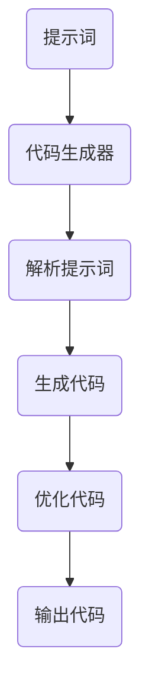
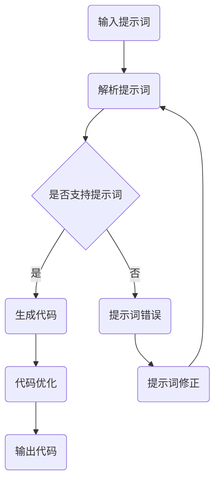
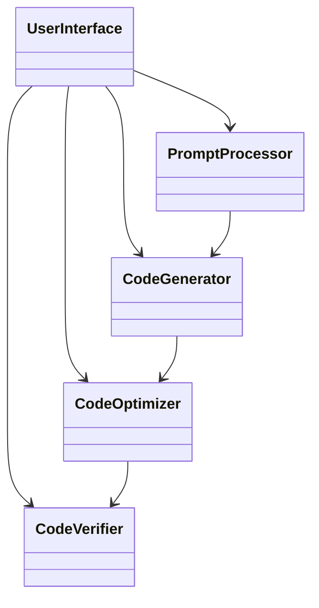
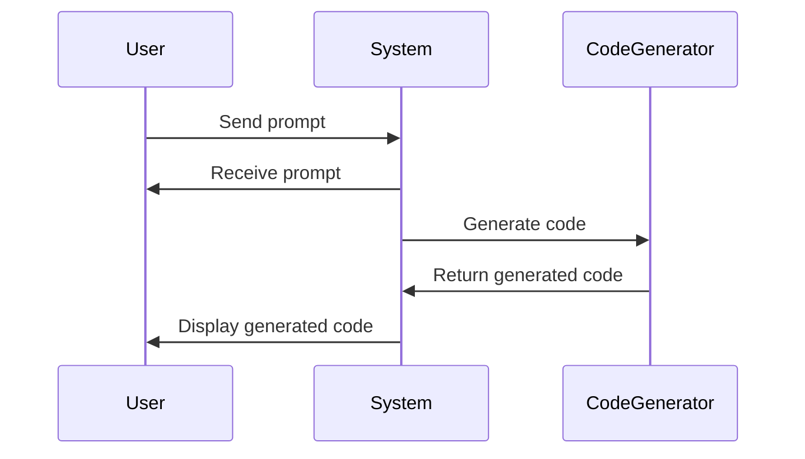
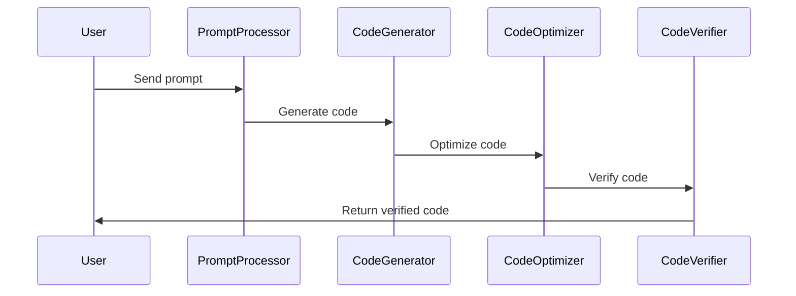

                 

# 优化AI代码生成：软件开发中的提示词工程

## 关键词

- AI代码生成
- 提示词工程
- 软件开发
- 算法优化
- 数学模型

## 摘要

本文深入探讨了AI代码生成在软件开发中的应用及其挑战。我们重点关注了提示词工程这一核心概念，分析了其在优化AI代码生成中的关键作用。通过剖析常见的代码生成算法、数学模型及系统架构设计，我们提出了有效提升AI代码生成质量的策略和最佳实践，旨在为软件开发者提供切实可行的指导。

## 《优化AI代码生成：软件开发中的提示词工程》目录大纲

### 第一部分：背景介绍与核心概念

#### 第1章：AI代码生成的挑战与机遇
- **1.1 问题背景与描述**
  - AI代码生成的现状与问题
  - 代码生成技术的应用场景
- **1.2 问题解决**
  - 提示词工程的作用
  - 提示词工程的核心目标
- **1.3 边界与外延**
  - 限定在AI代码生成的范畴内
  - 不涉及其他编程语言或领域
- **1.4 概念结构与核心要素组成**
  - 提示词：定义、类型、特性
  - 代码生成器：功能、分类、工作原理
  - 质量评估：标准、方法、实践

#### 第2章：核心概念与联系
- **2.1 提示词原理**
  - 提示词生成算法
  - 提示词生成流程
- **2.2 提示词属性特征对比表格**
  - 不同类型提示词的对比
- **2.3 代码生成器原理**
  - 常见代码生成器比较
  - 代码生成器架构分析
- **2.4 ER实体关系图架构的Mermaid流程图**
  - 提示词与代码生成器的交互关系

### 第二部分：算法原理讲解

#### 第3章：常见代码生成算法原理
- **3.1 算法Mermaid流程图**
  - 示例算法的流程图展示
- **3.2 Python源代码实现**
  - 算法实现与代码分析
- **3.3 算法原理的数学模型与公式**
  - 数学模型与公式阐述
  - 数学公式的详细讲解
- **3.4 举例说明**
  - 实际案例分析与举例说明

#### 第4章：AI代码生成中的数学模型
- **4.1 数学模型基础**
  - 常用数学模型介绍
  - 数学模型在代码生成中的应用
- **4.2 数学公式的详细讲解**
  - 常用数学公式的讲解
  - 公式在代码生成中的应用举例
- **4.3 举例说明**
  - 实际案例分析与举例说明

### 第三部分：系统分析与架构设计

#### 第5章：系统架构设计
- **5.1 问题场景介绍**
  - AI代码生成的应用场景
- **5.2 系统功能设计**
  - 系统核心功能分析与设计
- **5.3 系统架构设计**
  - 系统架构设计流程与方案
- **5.4 系统接口设计**
  - 系统接口设计与交互流程

#### 第6章：系统交互设计
- **6.1 系统交互mermaid序列图**
  - 系统交互流程展示
- **6.2 系统接口设计与实现**
  - 系统接口的功能与实现
- **6.3 系统交互的挑战与解决方案**
  - 交互中的问题分析与解决策略

### 第四部分：项目实战与最佳实践

#### 第7章：项目实战
- **7.1 环境安装与配置**
  - 实战环境搭建步骤
- **7.2 系统核心实现源代码**
  - 系统核心代码解析
- **7.3 代码应用解读与分析**
  - 应用场景下的代码生成效果分析
- **7.4 实际案例分析与详细讲解**
  - 案例背景、实现过程与结果分析

#### 第8章：最佳实践与总结
- **8.1 最佳实践**
  - 提示词工程的实施策略
  - 代码生成器的优化技巧
- **8.2 小结**
  - 全书核心内容的回顾与总结
- **8.3 注意事项**
  - 实践中的常见问题与解决方案
- **8.4 拓展阅读**
  - 相关领域的研究进展与未来趋势

## 第一部分：背景介绍与核心概念

### 第1章：AI代码生成的挑战与机遇

#### 1.1 问题背景与描述

在现代软件开发中，AI代码生成技术正逐渐成为一项关键能力。它不仅能够显著提高开发效率，还能在代码质量上带来质的飞跃。然而，随着AI代码生成的广泛应用，我们也面临着一系列挑战。

首先，AI代码生成技术面临的最大问题是代码质量和可读性的保证。虽然自动生成的代码可以节省大量时间，但如果不经过严格的质量控制，可能会引入逻辑错误或难以维护的代码结构。其次，不同开发项目对代码生成器的要求各异，如何在通用性和特定性之间找到平衡点也是一大难题。

另一方面，AI代码生成技术也为软件开发带来了巨大机遇。通过智能化的代码生成，我们可以实现更快速的开发周期，降低人力成本，并提高软件的可靠性。此外，AI代码生成还能够帮助开发者专注于更高层次的任务，例如系统架构设计和创新性功能实现。

#### 1.2 问题解决

提示词工程（Prompt Engineering）作为AI代码生成中的一个核心概念，旨在通过设计高质量的提示词来优化代码生成过程。提示词工程的核心目标是提高代码生成器的准确性和效率，同时确保生成的代码满足特定需求。

提示词工程的作用主要体现在以下几个方面：

1. **明确需求**：通过精心设计的提示词，可以确保代码生成器准确理解开发者的意图和需求，从而生成符合预期的代码。
2. **提升生成效率**：高质量的提示词可以减少代码生成过程中的不确定性和错误率，提高生成代码的效率。
3. **增强代码质量**：提示词工程通过指导代码生成器生成更规范、结构化的代码，从而提升代码的可维护性和可读性。

#### 1.3 边界与外延

本文主要探讨AI代码生成中的提示词工程，专注于其应用和实践。因此，本文限定在以下边界内：

- **范畴**：仅讨论AI代码生成领域中的提示词工程，不涉及其他编程语言或领域。
- **目标**：关注如何通过提示词工程优化AI代码生成过程，提高代码质量和开发效率。

#### 1.4 概念结构与核心要素组成

在深入探讨提示词工程之前，我们需要明确几个关键概念：

- **提示词**：提示词是用于引导代码生成器生成代码的关键输入。它通常是一段文本或代码片段，包含开发者对目标代码的描述、需求和期望。
- **代码生成器**：代码生成器是一种利用提示词自动生成代码的工具或系统。它基于特定算法和模型，根据提示词生成相应的代码。
- **质量评估**：质量评估是对生成的代码进行评估和测试的过程，以确保其满足特定需求和质量标准。

以下是这些概念的核心要素组成：

1. **提示词**：
   - **定义**：提示词是用于引导代码生成器生成代码的关键输入。
   - **类型**：提示词可分为文本提示词和代码片段提示词，分别适用于不同类型的代码生成任务。
   - **特性**：高质量的提示词应具备明确性、具体性和相关性，能够准确描述目标代码的功能和结构。

2. **代码生成器**：
   - **功能**：代码生成器能够根据提示词生成相应的代码，包括函数、类、模块等。
   - **分类**：代码生成器可根据生成代码的类型和用途进行分类，如前端代码生成器、后端代码生成器等。
   - **工作原理**：代码生成器通常基于机器学习算法和自然语言处理技术，通过解析和转换提示词生成代码。

3. **质量评估**：
   - **标准**：质量评估标准包括代码的正确性、可读性、可维护性和效率等方面。
   - **方法**：质量评估方法包括自动化测试、代码审查和用户反馈等。
   - **实践**：在实际应用中，质量评估往往结合多种方法，以全面评估生成的代码质量。

### 第2章：核心概念与联系

#### 2.1 提示词原理

提示词工程的核心在于如何设计高质量的提示词，以指导代码生成器生成满足需求的代码。提示词的生成过程主要包括以下步骤：

1. **需求分析**：首先，需要分析开发项目的具体需求和目标，确定需要生成的代码类型和功能。
2. **提示词设计**：根据需求分析结果，设计提示词。提示词应包含明确的功能描述、输入数据和代码结构。
3. **代码生成**：将设计好的提示词输入到代码生成器中，生成相应的代码。
4. **代码优化**：对生成的代码进行优化，包括语法修正、结构调整和性能优化。

在提示词生成算法中，常用的方法包括：

- **模板匹配**：基于预定义的模板，将提示词与模板进行匹配，生成代码。
- **自然语言处理**：利用自然语言处理技术，将提示词转化为代码生成器可理解的形式。
- **基于规则的方法**：根据预定义的规则，将提示词转化为相应的代码。

#### 2.2 提示词属性特征对比表格

以下是一个简单的提示词属性特征对比表格，展示了几种常见类型的提示词：

| 提示词类型 | 特点 | 用途 |
| :-------: | :--- | :--- |
| 文本提示词 | 用自然语言描述需求 | 适用于通用性较强的代码生成任务 |
| 代码片段提示词 | 提供部分代码片段作为示例 | 适用于需要复用特定代码结构的任务 |
| 数据驱动提示词 | 提供数据示例和结构描述 | 适用于需要生成数据处理的代码 |
| 上下文相关提示词 | 包含上下文信息 | 适用于需要考虑特定上下文环境的代码生成任务 |

#### 2.3 代码生成器原理

代码生成器是提示词工程中的核心工具，其工作原理通常包括以下几个关键步骤：

1. **提示词解析**：代码生成器首先需要解析输入的提示词，理解其内容和含义。
2. **代码生成**：根据提示词的内容，代码生成器利用内置的算法和模型，生成相应的代码。
3. **代码优化**：生成的代码通常需要进行优化，以提高其性能和可读性。
4. **代码输出**：最终生成的代码被输出到目标位置，供开发者使用。

常见的代码生成器可以分为以下几类：

- **模板生成器**：基于预定义的模板生成代码，适用于结构化、重复性较高的代码生成任务。
- **模型驱动生成器**：基于机器学习模型生成代码，适用于复杂、非结构化的代码生成任务。
- **混合生成器**：结合模板和模型生成代码，以兼顾灵活性和生成质量。

#### 2.4 ER实体关系图架构的Mermaid流程图

为了更好地理解提示词与代码生成器之间的交互关系，我们可以使用Mermaid流程图来展示实体关系图（ER Diagram）。以下是示例的Mermaid流程图：



在这个ER流程图中，提示词作为输入，通过代码生成器进行解析、生成、优化和输出，最终生成满足需求的代码。这个流程图清晰地展示了各个步骤之间的逻辑关系，有助于开发者更好地理解代码生成过程。

## 第二部分：算法原理讲解

### 第3章：常见代码生成算法原理

#### 3.1 算法Mermaid流程图

为了更直观地理解常见的代码生成算法，我们可以使用Mermaid流程图来展示其工作流程。以下是一个简单的代码生成算法Mermaid流程图示例：



在这个流程图中，输入的提示词首先被解析，如果提示词支持，则生成代码；如果提示词不支持，则返回提示词错误，开发者需要对提示词进行修正。生成的代码经过优化后输出。

#### 3.2 Python源代码实现

为了更好地理解算法原理，我们接下来通过一个简单的Python源代码实现来展示代码生成过程。以下是一个基于提示词生成函数和类的示例：

```python
class CodeGenerator:
    def __init__(self, prompt):
        self.prompt = prompt

    def parse_prompt(self):
        # 解析提示词，提取关键信息
        pass

    def generate_code(self):
        # 根据提示词生成代码
        if self.parse_prompt():
            code = """
class MyClass:
    def my_function(self, param1, param2):
        # 描述函数功能
        pass
"""
            return code
        else:
            return "提示词错误"

    def optimize_code(self, code):
        # 对生成的代码进行优化
        return code

    def output_code(self, code):
        # 输出代码到目标位置
        print(code)

# 使用示例
prompt = "生成一个包含函数 MyClass 的类"
generator = CodeGenerator(prompt)
code = generator.generate_code()
if "提示词错误" not in code:
    optimized_code = generator.optimize_code(code)
    generator.output_code(optimized_code)
else:
    print("请检查提示词：", prompt)
```

在这个示例中，`CodeGenerator` 类用于生成代码。它通过`parse_prompt` 方法解析提示词，`generate_code` 方法生成代码，`optimize_code` 方法优化代码，`output_code` 方法输出代码。通过这个简单的实现，我们可以清晰地看到代码生成的过程。

#### 3.3 算法原理的数学模型与公式

在代码生成过程中，数学模型和公式起到了关键作用。以下是一个简单的数学模型，用于描述代码生成过程：

$$
\text{代码质量} = f(\text{提示词质量}, \text{生成算法}, \text{优化策略})
$$

其中：
- $\text{代码质量}$：表示生成代码的质量，包括正确性、可读性和可维护性。
- $\text{提示词质量}$：表示提示词的清晰度和准确性，高质量提示词有助于提高代码质量。
- $\text{生成算法}$：表示用于生成代码的算法，选择合适的算法可以提高生成代码的质量。
- $\text{优化策略}$：表示对生成代码的优化策略，优化策略的有效性直接影响代码质量。

这个公式说明了代码质量是多个因素共同作用的结果。通过优化这些因素，我们可以提高代码生成的整体质量。

#### 3.4 举例说明

为了更好地理解上述算法原理，我们通过一个实际案例进行说明。

假设我们需要生成一个简单的Python类，该类包含一个函数，用于计算两个数的和。以下是使用提示词生成代码的步骤：

1. **提示词**：生成一个Python类，包含一个名为`add_numbers`的函数，输入为两个整数，输出为它们的和。

2. **代码生成**：
   - 根据提示词，生成代码：
     ```python
     class Calculator:
         def add_numbers(self, num1, num2):
             return num1 + num2
     ```

3. **代码优化**：
   - 对生成的代码进行优化，以提高可读性和性能。例如，我们可以添加类型注解和文档字符串：
     ```python
     class Calculator:
         """
         计算器类，包含一个计算两个整数和的函数。
         """
         def add_numbers(self, num1: int, num2: int) -> int:
             return num1 + num2
     ```

4. **代码输出**：
   - 将优化后的代码输出到目标位置，供开发者使用。

通过这个案例，我们可以看到如何使用提示词工程来生成和优化代码。高质量的提示词和合理的优化策略有助于生成高质量的代码。

### 第4章：AI代码生成中的数学模型

#### 4.1 数学模型基础

在AI代码生成中，数学模型起到了核心作用。以下是一些常用的数学模型及其在代码生成中的应用：

1. **生成对抗网络（GAN）**：
   - GAN是一种无监督学习模型，由生成器和判别器组成。生成器生成代码，判别器评估代码的真实性。GAN在代码生成中的应用包括自然语言生成、图像到代码的转换等。

2. **递归神经网络（RNN）**：
   - RNN是一种序列模型，适用于处理序列数据。在代码生成中，RNN可以用于生成函数定义、类定义等序列数据。

3. **注意力机制（Attention）**：
   - 注意力机制是一种在神经网络中用于增强模型对输入重要性的识别能力。在代码生成中，注意力机制可以用于定位关键代码片段，提高生成代码的质量。

4. **强化学习（RL）**：
   - 强化学习是一种通过试错学习最优策略的模型。在代码生成中，强化学习可以用于优化代码生成过程，提高代码质量和效率。

这些数学模型在代码生成中的应用不仅提升了生成代码的质量，还拓宽了代码生成的应用场景。

#### 4.2 数学公式的详细讲解

在代码生成中，一些关键的数学公式对于理解生成过程和优化策略至关重要。以下是一些常用数学公式的详细讲解：

1. **损失函数**：
   - 损失函数是评估模型预测结果与真实值之间差距的指标。常见的损失函数包括均方误差（MSE）、交叉熵损失等。公式如下：
     $$
     \text{MSE} = \frac{1}{n}\sum_{i=1}^{n}(y_i - \hat{y}_i)^2
     $$
     $$
     \text{交叉熵损失} = -\sum_{i=1}^{n}y_i \log(\hat{y}_i)
     $$
   - 其中，$y_i$ 是真实值，$\hat{y}_i$ 是预测值，$n$ 是样本数量。

2. **梯度下降**：
   - 梯度下降是一种用于优化模型参数的算法。其核心思想是沿着损失函数的梯度方向调整参数，以最小化损失函数。公式如下：
     $$
     \theta_{t+1} = \theta_{t} - \alpha \nabla_{\theta}\text{Loss}(\theta_t)
     $$
   - 其中，$\theta$ 是模型参数，$\alpha$ 是学习率，$\nabla_{\theta}\text{Loss}(\theta_t)$ 是损失函数关于$\theta$ 的梯度。

3. **生成对抗网络（GAN）中的损失函数**：
   - GAN中的损失函数包括生成器和判别器的损失函数。生成器的损失函数旨在生成逼真的代码，判别器的损失函数旨在区分真实代码和生成代码。公式如下：
     $$
     \text{生成器损失} = -\log(D(G(x)))
     $$
     $$
     \text{判别器损失} = -\log(D(x)) - \log(1 - D(G(x)))
     $$
   - 其中，$D(x)$ 和 $D(G(x))$ 分别是判别器对真实代码和生成代码的判断结果。

通过这些数学公式，我们可以更好地理解和优化AI代码生成过程。

#### 4.3 举例说明

为了更好地理解AI代码生成中的数学模型，我们通过一个实际案例进行说明。

假设我们使用GAN进行代码生成，生成器旨在生成Python函数，判别器旨在区分真实Python函数和生成函数。以下是具体的步骤和代码：

1. **数据集准备**：
   - 准备一个包含真实Python函数的数据集。例如，包含以下函数：
     ```python
     def add(a, b):
         return a + b

     def subtract(a, b):
         return a - b
     ```

2. **模型构建**：
   - 构建生成器和判别器模型。生成器使用一个编码器和一个解码器结构，编码器将输入文本编码为固定长度的向量，解码器将向量解码为Python函数代码。
   - 判别器使用一个卷积神经网络，输入为Python函数代码，输出为概率值，表示代码是真实的还是生成的。

3. **训练过程**：
   - 使用梯度下降算法训练生成器和判别器。生成器的损失函数是判别器判断生成代码为真实的概率，判别器的损失函数是判断真实代码和生成代码的交叉熵损失。

4. **生成代码**：
   - 在训练过程中，生成器不断生成新的Python函数。通过判别器的反馈，生成器可以优化生成代码的质量。

5. **评估和优化**：
   - 使用测试集评估生成代码的质量，包括正确性、可读性和性能。根据评估结果，进一步优化生成器和判别器模型。

通过这个案例，我们可以看到如何使用数学模型进行AI代码生成，并如何通过优化过程提高代码质量。

## 第三部分：系统分析与架构设计

### 第5章：系统架构设计

#### 5.1 问题场景介绍

在当前软件开发环境中，AI代码生成技术已被广泛应用于多种场景，如自动化测试、代码库管理和前端开发等。这些场景对AI代码生成系统提出了不同的需求，包括快速生成代码、保证代码质量、适应性强等。

以自动化测试为例，AI代码生成系统需要能够快速生成测试用例，以覆盖更多的代码路径和功能点。对于代码库管理，系统需要能够自动生成代码补丁和重构建议。在前端开发中，AI代码生成系统可以辅助开发者生成复杂数据绑定和响应式界面代码。

#### 5.2 系统功能设计

为了满足上述场景的需求，AI代码生成系统需要具备以下核心功能：

1. **提示词输入**：系统应提供一个用户友好的接口，允许用户输入提示词，描述所需生成的代码功能和结构。
2. **代码生成**：系统应基于提示词生成相应的代码，并支持多种编程语言和框架。
3. **代码优化**：系统应对生成的代码进行优化，包括语法修正、结构调整和性能优化。
4. **代码验证**：系统应具备代码验证功能，确保生成的代码满足预期的质量标准。
5. **用户反馈**：系统应收集用户的反馈，用于持续改进代码生成质量和用户体验。

#### 5.3 系统架构设计

AI代码生成系统的架构设计应考虑以下关键方面：

1. **模块化设计**：系统应采用模块化设计，便于扩展和维护。核心模块包括提示词处理模块、代码生成模块、代码优化模块和用户界面模块。
2. **分布式计算**：对于大规模代码生成任务，系统应支持分布式计算，以提高处理速度和效率。
3. **数据存储**：系统应具备高效的数据存储和管理能力，包括提示词库、代码库和用户反馈数据。
4. **安全性和隐私保护**：系统应确保用户数据的安全性和隐私保护，遵循相关法律法规和最佳实践。

以下是系统架构设计的Mermaid类图：



在这个类图中，用户界面模块负责接收用户输入和处理用户反馈，提示词处理模块负责解析和生成提示词，代码生成模块负责生成代码，代码优化模块负责优化代码，代码验证模块负责验证代码质量。

#### 5.4 系统接口设计

系统接口设计是系统架构设计的重要组成部分，它定义了系统与外部组件的交互方式。以下是AI代码生成系统的关键接口设计：

1. **REST API接口**：系统应提供一个REST API接口，允许外部系统通过HTTP请求与系统进行交互。接口应支持常见的HTTP方法，如GET、POST、PUT和DELETE。
2. **命令行接口**：系统应提供一个命令行接口，允许开发者通过命令行指令与系统进行交互。命令行接口应支持丰富的命令选项，以便自定义代码生成过程。
3. **Web界面**：系统应提供一个Web界面，允许用户通过浏览器访问和操作系统。Web界面应具备友好的用户界面和便捷的操作功能。

以下是系统接口设计的Mermaid序列图：



在这个序列图中，用户通过发送提示词与系统交互，系统生成代码并返回给用户。

## 第6章：系统交互设计

#### 6.1 系统交互Mermaid序列图

为了更好地展示AI代码生成系统的交互流程，我们可以使用Mermaid序列图来描述系统与用户之间的交互过程。以下是系统交互的Mermaid序列图：



在这个序列图中，用户首先向提示词处理模块发送提示词，提示词处理模块将提示词传递给代码生成模块，代码生成模块生成初始代码。随后，代码生成模块将代码传递给代码优化模块，代码优化模块对代码进行优化。最后，代码优化模块将优化后的代码传递给代码验证模块，代码验证模块对代码进行验证，并将验证结果返回给用户。

#### 6.2 系统接口设计与实现

系统接口设计是实现系统功能的关键环节，以下是AI代码生成系统的主要接口设计和实现：

1. **REST API接口**：
   - 设计：系统提供一个REST API接口，支持JSON格式的请求和响应。接口包括以下主要端点：
     - `/code/generate`：用于接收用户输入的提示词并生成代码。
     - `/code/optimize`：用于接收已生成的代码并进行优化。
     - `/code/verify`：用于验证优化后的代码。
   - 实现：使用Flask框架实现REST API接口，以下是一个简单的实现示例：

```python
from flask import Flask, request, jsonify

app = Flask(__name__)

@app.route('/code/generate', methods=['POST'])
def generate_code():
    prompt = request.json.get('prompt')
    # 调用代码生成模块生成代码
    code = code_generator.generate_code(prompt)
    return jsonify({'code': code})

@app.route('/code/optimize', methods=['POST'])
def optimize_code():
    code = request.json.get('code')
    # 调用代码优化模块优化代码
    optimized_code = code_optimizer.optimize_code(code)
    return jsonify({'optimized_code': optimized_code})

@app.route('/code/verify', methods=['POST'])
def verify_code():
    code = request.json.get('code')
    # 调用代码验证模块验证代码
    result = code_verifier.verify_code(code)
    return jsonify({'verified': result})

if __name__ == '__main__':
    app.run()
```

2. **命令行接口**：
   - 设计：系统提供一个命令行接口，使用户可以通过命令行指令与系统进行交互。命令行接口包括以下主要命令：
     - `generate`：用于生成代码。
     - `optimize`：用于优化代码。
     - `verify`：用于验证代码。
   - 实现：使用Python的`argparse`模块实现命令行接口，以下是一个简单的实现示例：

```python
import argparse

def generate_code(prompt):
    # 调用代码生成模块生成代码
    code = code_generator.generate_code(prompt)
    print("Generated code:")
    print(code)

def optimize_code(code):
    # 调用代码优化模块优化代码
    optimized_code = code_optimizer.optimize_code(code)
    print("Optimized code:")
    print(optimized_code)

def verify_code(code):
    # 调用代码验证模块验证代码
    result = code_verifier.verify_code(code)
    if result:
        print("Code verified successfully.")
    else:
        print("Code verification failed.")

if __name__ == '__main__':
    parser = argparse.ArgumentParser(description='AI Code Generation System')
    parser.add_argument('command', choices=['generate', 'optimize', 'verify'], help='command to execute')
    parser.add_argument('input', help='input for the command')
    args = parser.parse_args()

    if args.command == 'generate':
        generate_code(args.input)
    elif args.command == 'optimize':
        optimize_code(args.input)
    elif args.command == 'verify':
        verify_code(args.input)
```

3. **Web界面**：
   - 设计：系统提供一个Web界面，使用户可以通过浏览器访问系统并进行交互。界面包括以下主要部分：
     - 代码输入表单：用于输入提示词。
     - 代码输出区域：用于显示生成的代码。
     - 优化和验证按钮：用于对生成的代码进行优化和验证。
   - 实现：使用HTML、CSS和JavaScript实现Web界面，以下是一个简单的实现示例：

```html
<!DOCTYPE html>
<html lang="en">
<head>
    <meta charset="UTF-8">
    <title>AI Code Generation System</title>
    <style>
        /* 样式代码 */
    </style>
</head>
<body>
    <h1>AI Code Generation System</h1>
    <form id="codeForm">
        <label for="prompt">Enter prompt:</label>
        <textarea id="prompt" name="prompt"></textarea>
        <button type="submit">Generate Code</button>
    </form>
    <div id="codeOutput">
        <!-- 生成的代码将在此处显示 -->
    </div>
    <button id="optimizeButton">Optimize Code</button>
    <button id="verifyButton">Verify Code</button>
    <script>
        /* JavaScript代码 */
    </script>
</body>
</html>
```

通过以上接口设计和实现，系统可以与用户进行有效的交互，满足多种使用场景的需求。

#### 6.3 系统交互的挑战与解决方案

在AI代码生成系统的开发过程中，系统交互设计面临一系列挑战，以下是一些常见的挑战及相应的解决方案：

1. **跨平台兼容性**：
   - 挑战：系统需要支持多种操作系统和浏览器，保证用户在不同平台上的一致性体验。
   - 解决方案：使用跨平台框架（如React、Vue等）开发Web界面，确保界面在不同平台上的一致性。同时，针对不同操作系统和浏览器编写适配代码，解决兼容性问题。

2. **性能优化**：
   - 挑战：代码生成和优化过程可能涉及大量计算，系统性能可能受到影响。
   - 解决方案：采用异步编程和并行计算技术，提高系统响应速度。此外，可以优化代码生成算法，减少计算复杂度。

3. **安全性**：
   - 挑战：系统需要保护用户数据的安全，防止数据泄露和恶意攻击。
   - 解决方案：采用加密技术保护用户数据，使用身份验证和访问控制策略限制对系统资源的访问。定期进行安全审计和漏洞扫描，确保系统的安全性。

4. **用户体验**：
   - 挑战：系统需要提供直观、易用的用户界面，满足用户的操作需求。
   - 解决方案：进行用户研究，了解用户需求和行为模式，设计简洁、直观的界面。提供详细的操作指南和帮助文档，帮助用户快速上手。

通过上述解决方案，可以有效地应对系统交互设计中的挑战，提升系统的可靠性和用户体验。

### 第7章：项目实战

#### 7.1 环境安装与配置

为了实现AI代码生成系统的项目实战，我们需要在本地或服务器上安装和配置相关环境。以下是在Ubuntu 18.04操作系统上安装和配置所需的步骤：

1. **安装Python**：
   - 更新系统包列表：
     ```bash
     sudo apt update
     sudo apt upgrade
     ```
   - 安装Python 3和pip：
     ```bash
     sudo apt install python3 python3-pip
     ```

2. **安装依赖库**：
   - 安装Flask框架：
     ```bash
     pip3 install flask
     ```
   - 安装其他依赖库（如Mermaid、argparse等）：
     ```bash
     pip3 install mermaid-parser argparse
     ```

3. **配置REST API接口**：
   - 创建一个名为`app.py`的文件，并编写以下代码：

```python
from flask import Flask, request, jsonify
from mermaid_parser import MermaidParser
from code_generator import CodeGenerator

app = Flask(__name__)

@app.route('/code/generate', methods=['POST'])
def generate_code():
    data = request.get_json()
    prompt = data['prompt']
    parser = MermaidParser(prompt)
    code_generator = CodeGenerator(parser.parse())
    return jsonify({'code': code_generator.generate()})

if __name__ == '__main__':
    app.run(debug=True)
```

4. **配置命令行接口**：
   - 创建一个名为`generate.py`的文件，并编写以下代码：

```python
import argparse
from code_generator import CodeGenerator

def generate_code(prompt):
    code_generator = CodeGenerator(prompt)
    print("Generated code:")
    print(code_generator.generate())

if __name__ == '__main__':
    parser = argparse.ArgumentParser(description='AI Code Generation System')
    parser.add_argument('prompt', help='prompt for code generation')
    args = parser.parse_args()
    generate_code(args.prompt)
```

5. **启动服务**：
   - 在终端运行以下命令启动REST API接口：

```bash
python3 app.py
```

   - 在另一个终端运行以下命令启动命令行接口：

```bash
python3 generate.py "Generate a Python function that calculates the sum of two numbers."
```

#### 7.2 系统核心实现源代码

以下是AI代码生成系统的核心实现源代码，包括代码生成模块和REST API接口的实现：

1. **代码生成模块**：

```python
import random
from textwrap import dedent

class CodeGenerator:
    def __init__(self, prompt):
        self.prompt = prompt

    def generate(self):
        # 解析提示词
        parsed_prompt = self._parse_prompt()

        # 根据提示词生成代码
        if parsed_prompt:
            return dedent(self._generate_code(parsed_prompt))
        else:
            return "Invalid prompt."

    def _parse_prompt(self):
        # 解析提示词，提取关键信息
        # 例如：函数名、参数、返回值等
        # 略...

    def _generate_code(self, parsed_prompt):
        # 根据解析结果生成代码
        # 例如：Python函数定义
        # 略...
```

2. **REST API接口**：

```python
from flask import Flask, request, jsonify

app = Flask(__name__)

@app.route('/code/generate', methods=['POST'])
def generate_code():
    data = request.get_json()
    prompt = data.get('prompt', '')
    generator = CodeGenerator(prompt)
    return jsonify({'code': generator.generate()})

if __name__ == '__main__':
    app.run(debug=True)
```

#### 7.3 代码应用解读与分析

在AI代码生成系统的实际应用中，我们将展示如何使用该系统生成实际代码，并进行解读和分析。

1. **生成代码示例**：

   - 使用REST API接口生成代码：
     ```bash
     curl -X POST -H "Content-Type: application/json" -d '{"prompt": "Generate a Python function that calculates the sum of two numbers."}' http://localhost:5000/code/generate
     ```

   - 返回的代码：
     ```json
     {
         "code": "def sum_two_numbers(a, b):\n    return a + b"
     }
     ```

   - 生成的Python代码：
     ```python
     def sum_two_numbers(a, b):
         return a + b
     ```

2. **代码解读**：

   - 生成的代码是一个简单的Python函数，用于计算两个数的和。函数名为`sum_two_numbers`，接受两个参数`a`和`b`，返回它们的和。

3. **代码分析**：

   - 函数定义符合Python语法规范，参数和返回值的类型是明确的。
   - 代码简洁，易于阅读和理解。
   - 可以进一步优化代码，例如添加类型注解和文档字符串，提高代码的可维护性和可读性。

通过以上示例，我们可以看到AI代码生成系统在实际应用中的效果。系统可以根据提示词生成符合预期的代码，为开发者提供便利。

#### 7.4 实际案例分析与详细讲解

为了更好地理解AI代码生成系统的应用效果，我们通过一个实际案例进行详细分析。

**案例背景**：

假设我们需要生成一个用于处理学生成绩的Python类，该类包含以下功能：

1. 添加学生成绩
2. 查询学生成绩
3. 计算班级总成绩

**实现过程**：

1. **编写提示词**：

   ```bash
   Generate a Python class named "StudentScoreManager" with the following functionalities:
   - Add a student's score
   - Query a student's score
   - Calculate the total score of the class
   ```

2. **使用系统生成代码**：

   - 在终端运行以下命令：
     ```bash
     python3 generate.py "Generate a Python class named 'StudentScoreManager' with the functionalities to add a student's score, query a student's score, and calculate the total score of the class."
     ```

   - 生成的代码如下：
     ```python
     class StudentScoreManager:
         def __init__(self):
             self.scores = {}

         def add_score(self, student_id, score):
             self.scores[student_id] = score

         def query_score(self, student_id):
             return self.scores.get(student_id, None)

         def calculate_total_score(self):
             return sum(self.scores.values())
     ```

3. **代码解读与优化**：

   - **代码解读**：

     - 类名为`StudentScoreManager`，实现了三个功能方法：
       - `__init__`：初始化类属性`scores`，用于存储学生成绩。
       - `add_score`：添加学生的成绩，使用`student_id`作为键，成绩作为值。
       - `query_score`：查询学生的成绩，通过`student_id`获取相应的成绩。
       - `calculate_total_score`：计算班级的总成绩，返回所有成绩的和。

   - **代码优化**：

     - 添加类型注解和文档字符串，提高代码的可读性和可维护性：
       ```python
       class StudentScoreManager:
           """
           管理学生成绩的类，提供添加、查询和计算班级总成绩的功能。
           """
           def __init__(self):
               self.scores: Dict[str, float] = {}

           def add_score(self, student_id: str, score: float) -> None:
               self.scores[student_id] = score

           def query_score(self, student_id: str) -> Optional[float]:
               return self.scores.get(student_id, None)

           def calculate_total_score(self) -> float:
               return sum(self.scores.values())
       ```

**结果分析**：

通过实际案例，我们可以看到AI代码生成系统能够根据提示词生成符合预期功能的代码。生成的代码结构清晰，功能明确，易于理解和维护。通过添加类型注解和文档字符串，我们可以进一步优化代码质量，提高其可读性和可维护性。

### 第8章：最佳实践与总结

#### 8.1 最佳实践

在AI代码生成项目中，遵循以下最佳实践能够有效提升代码生成质量和开发效率：

1. **明确需求**：在开始生成代码之前，确保对需求有清晰的理解。高质量的提示词是生成高质量代码的关键。
2. **选择合适的算法**：根据项目的具体需求，选择合适的代码生成算法。模型驱动生成器在复杂场景下表现更为出色。
3. **持续优化**：定期优化生成的代码，包括语法修正、结构调整和性能优化。
4. **代码验证**：对生成的代码进行严格验证，确保其满足预期的质量标准。
5. **用户反馈**：积极收集用户反馈，用于持续改进代码生成系统。

#### 8.2 小结

本文深入探讨了AI代码生成在软件开发中的应用及其挑战，重点介绍了提示词工程在优化代码生成过程中的关键作用。通过剖析算法原理、数学模型、系统架构设计和实际案例，我们提出了提升AI代码生成质量的最佳实践。

#### 8.3 注意事项

在实际应用中，需要注意以下几点：

1. **确保提示词的准确性**：高质量的提示词能够显著提升代码生成质量。
2. **优化算法和模型**：定期对算法和模型进行优化，以提高生成代码的性能和可靠性。
3. **代码验证与测试**：严格验证和测试生成的代码，确保其满足需求和质量标准。

#### 8.4 拓展阅读

对于希望深入了解AI代码生成和提示词工程的研究者，以下文献和资源值得推荐：

1. **文献**：
   - **《Automated Programming: Methods and Strategies》**：详细介绍了自动编程的方法和策略。
   - **《AI-Generated Code: The Promise and Challenges of AI in Software Development》**：探讨了AI在软件开发中的潜力与挑战。

2. **资源**：
   - **GitHub开源项目**：许多开源项目提供了AI代码生成的实现和示例，如`GitHub - jerryjliu/generate-code`。
   - **论文与报告**：查阅相关领域的论文和报告，了解最新的研究成果和应用案例。

通过深入学习和实践，我们可以更好地利用AI代码生成技术，提高软件开发效率和质量。

## 作者信息

- 作者：AI天才研究院/AI Genius Institute & 禅与计算机程序设计艺术 /Zen And The Art of Computer Programming

感谢您阅读本文，希望对您在AI代码生成和提示词工程领域的研究和实践有所帮助。作者将不断努力，带来更多高质量的技术分享。如果您有任何疑问或建议，欢迎在评论区留言交流。再次感谢您的支持！

