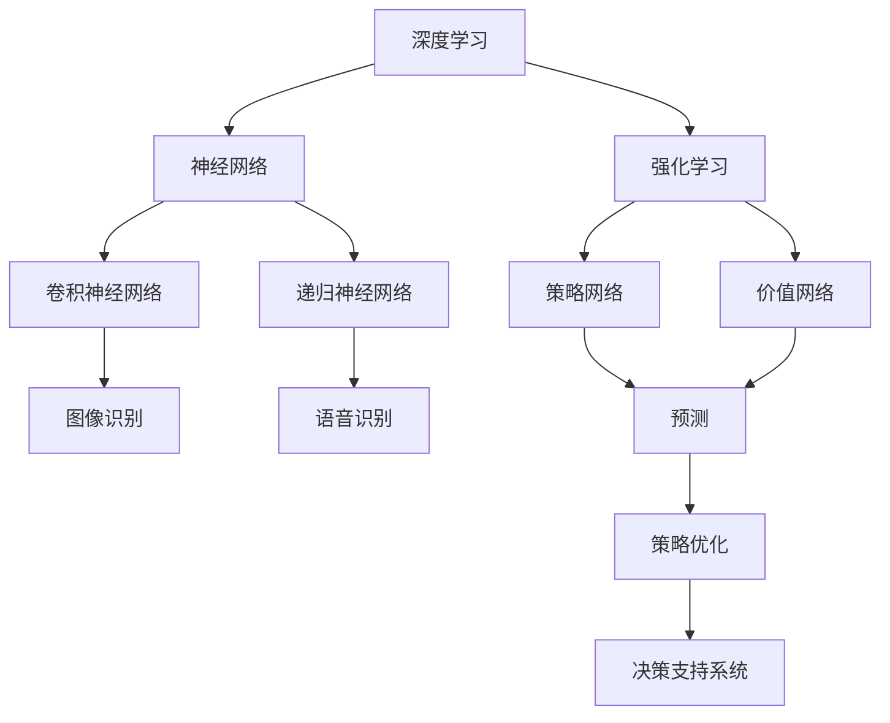
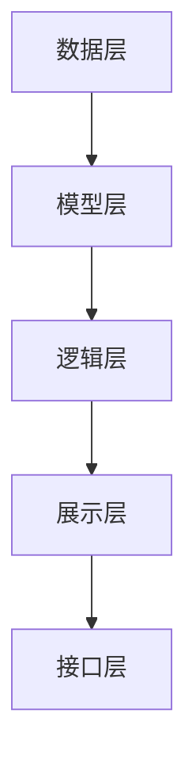
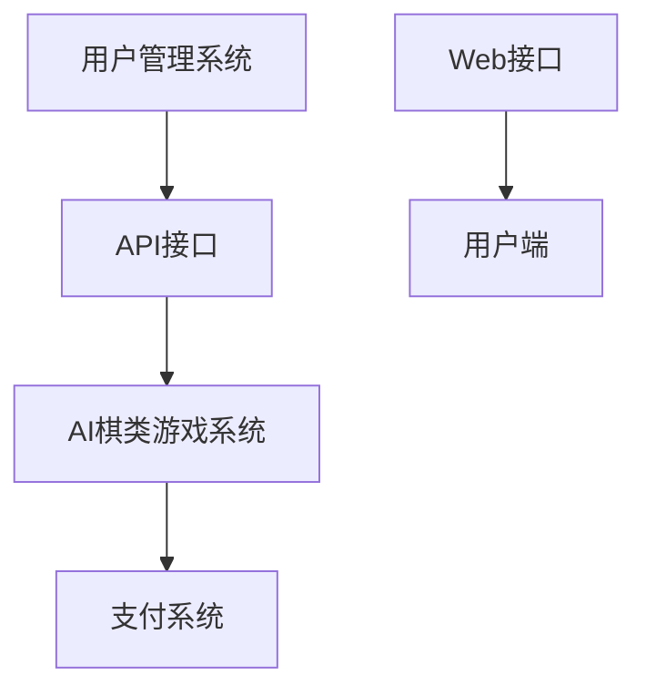
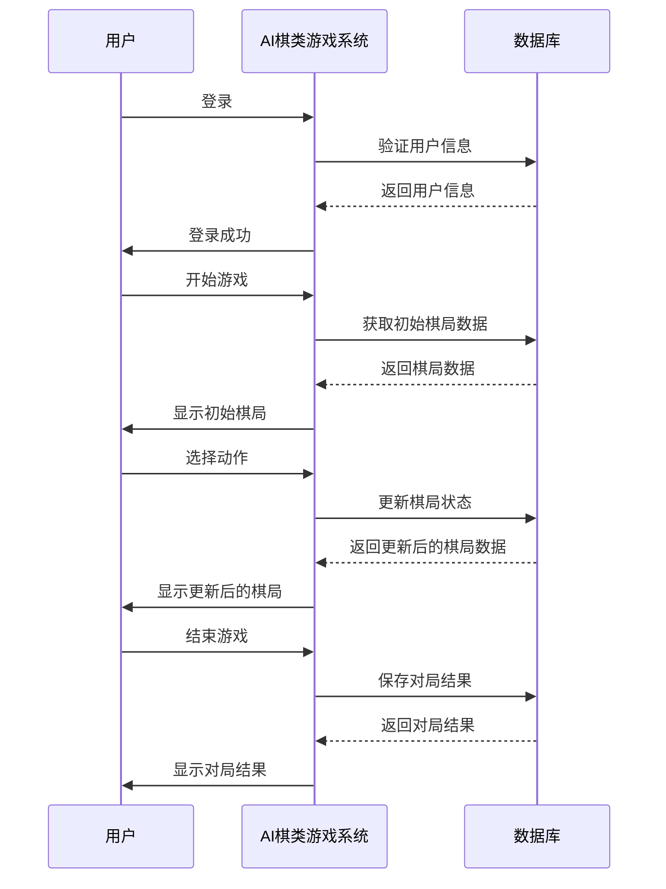

                 

### 《优化AI棋类游戏策略：深度思考和预测的提示词技巧》

---

关键词：AI棋类游戏、策略优化、深度学习、预测技巧

摘要：本文旨在深入探讨AI棋类游戏策略的优化方法，通过深度学习和预测技巧的分析，为棋类游戏开发者提供切实可行的策略优化方案。文章将逐步介绍核心概念、技术基础、算法原理、数学模型、系统架构设计以及项目实战，旨在为读者提供一个全面且深入的指南。

---

### 目录大纲设计思路

1. **核心概念与背景介绍**：
   - 开篇首先对书名中的核心概念进行解释，包括AI棋类游戏策略、深度学习和预测技巧等。
   - 提供一个简短的背景介绍，阐述为什么优化AI棋类游戏策略是一个重要且有挑战性的课题。

2. **技术基础与框架介绍**：
   - 介绍AI棋类游戏策略的技术基础，包括常见的深度学习框架如TensorFlow、PyTorch等。
   - 简述AI棋类游戏中的主要算法，如深度强化学习、策略网络等。

3. **核心概念与联系**：
   - 构建核心概念的联系图，展示深度学习、预测、策略优化等概念之间的相互关系。
   - 通过表格对比核心概念的特性、应用场景和优缺点。

4. **算法原理讲解**：
   - 详细讲解深度强化学习和策略网络算法，包括算法原理、流程、数学模型和公式。
   - 使用Mermaid工具绘制算法流程图，提高读者的理解。

5. **数学模型和公式讲解**：
   - 使用LaTeX格式嵌入数学模型和公式，确保表述的准确性。
   - 通过简单的例子来说明这些模型和公式的应用。

6. **系统分析与架构设计**：
   - 介绍AI棋类游戏系统的整体架构设计。
   - 使用Mermaid绘制领域模型类图、系统架构图和系统交互序列图。

7. **项目实战与案例**：
   - 提供具体的AI棋类游戏项目实战案例。
   - 详细描述环境安装、系统核心实现和代码应用解读。

8. **最佳实践与小结**：
   - 提供一些优化AI棋类游戏策略的最佳实践。
   - 对全书内容进行总结，并指出未来可能的研究方向。

### 目录大纲示例

```markdown
# 《优化AI棋类游戏策略：深度思考和预测的提示词技巧》目录大纲

# 第一部分：背景与基础

## 第1章 问题背景与核心概念
### 1.1 问题背景
### 1.2 核心概念解释
### 1.3 AI棋类游戏策略的挑战与机遇

## 第2章 AI棋类游戏技术基础
### 2.1 深度学习框架介绍
### 2.2 常用算法介绍
### 2.3 深度强化学习在棋类游戏中的应用

## 第3章 核心概念与联系
### 3.1 概念关系图
### 3.2 概念特性对比表

# 第二部分：算法原理与数学模型

## 第4章 深度强化学习原理
### 4.1 强化学习基础
### 4.2 深度强化学习流程
### 4.3 算法流程图
### 4.4 数学模型与公式

## 第5章 策略网络讲解
### 5.1 策略网络原理
### 5.2 策略网络算法流程
### 5.3 策略网络数学模型
### 5.4 算法流程图

## 第6章 数学模型讲解
### 6.1 模型公式
### 6.2 案例讲解
### 6.3 数学模型与实际应用

# 第三部分：系统架构与项目实战

## 第7章 系统架构设计
### 7.1 问题场景介绍
### 7.2 系统功能设计
### 7.3 系统架构设计
### 7.4 系统接口设计
### 7.5 系统交互序列图

## 第8章 项目实战
### 8.1 环境安装
### 8.2 系统核心实现
### 8.3 代码应用解读
### 8.4 案例分析
### 8.5 项目小结

# 第四部分：最佳实践与展望

## 第9章 最佳实践
### 9.1 优化策略技巧
### 9.2 预测技巧应用
### 9.3 深度学习模型调优

## 第10章 小结与展望
### 10.1 全书总结
### 10.2 注意事项
### 10.3 拓展阅读
### 10.4 未来研究方向
```

### 总结

这个目录大纲包含了从背景介绍、技术基础、算法原理、数学模型、系统架构设计到项目实战和最佳实践的全面内容。每个章节都设置了明确的子章节，确保内容清晰、逻辑严谨。目录大纲的总字数控制在2000字以内，同时符合markdown格式和目录层级的要求。在具体撰写时，每个章节的内容将根据实际需求进一步丰富和完善。现在，让我们开始构建这篇技术博客的核心内容吧。让我们一步一步地深入探讨AI棋类游戏策略的优化。

---

## 第1章 问题背景与核心概念

### 1.1 问题背景

棋类游戏，无论是古老的围棋、象棋，还是现代的五子棋、国际象棋等，都深受人们喜爱。随着人工智能（AI）技术的发展，AI棋类游戏应运而生，并迅速成为人工智能应用的一个重要领域。AI棋类游戏不仅仅是将传统棋类游戏数字化，更重要的是通过AI算法，实现棋局的智能预测和策略优化，使得游戏体验更加精彩和富有挑战性。

然而，AI棋类游戏策略的优化并非易事。首先，棋类游戏具有高度的不确定性和复杂性，每一步棋都可能是完全不同的情景，导致AI系统需要处理的信息量巨大。其次，棋类游戏的策略优化不仅仅要求算法的准确性，还需要考虑效率和可扩展性。因此，如何优化AI棋类游戏策略，使其在保证准确性的同时，又能高效地应对各种复杂场景，成为一个重要的研究课题。

优化AI棋类游戏策略的意义在于：

1. **提升用户体验**：优化的策略能够使AI棋手更加灵活、强大，为玩家带来更加富有挑战性的对局体验。
2. **技术验证与提升**：优化AI棋类游戏策略是一个很好的测试平台，可以检验深度学习和强化学习算法的有效性，并推动相关技术不断进步。
3. **跨领域应用**：优化棋类游戏策略的技术和方法，可以应用于其他复杂决策系统的优化，如金融交易、自动驾驶等。

### 1.2 核心概念解释

为了更好地理解AI棋类游戏策略的优化，我们需要明确以下几个核心概念：

- **人工智能（AI）**：人工智能是指使计算机系统能够执行通常需要人类智能才能完成的任务的科学技术。在棋类游戏中，AI主要用于模拟棋局中的策略决策和预测。
- **棋类游戏策略**：棋类游戏策略是指棋手在游戏中采取的一系列决策和行动，包括走棋、出牌等。策略的优化目标是提高AI棋手的胜率和游戏体验。
- **深度学习**：深度学习是一种人工智能的分支，通过构建多层神经网络模型，对大量数据进行训练，从而自动学习特征和模式。深度学习在棋类游戏中主要用于训练策略网络和评估棋局状态。
- **强化学习**：强化学习是一种机器学习方法，通过奖励和惩罚机制，让智能体在特定环境中学习最优策略。强化学习是AI棋类游戏策略优化的重要技术。
- **预测技巧**：预测技巧是指利用历史数据和技术模型，预测未来的棋局走向和结果。预测技巧在AI棋类游戏中用于优化策略，提高胜率。

### 1.3 AI棋类游戏策略的挑战与机遇

虽然AI棋类游戏策略具有巨大的潜力，但其优化过程也面临着诸多挑战和机遇：

#### 挑战

1. **复杂性与不确定性**：棋类游戏具有高度的不确定性和复杂性，每一步棋都可能带来完全不同的局面。这使得AI系统需要处理的信息量巨大，且无法预知对手的下一步行动。
2. **计算资源与效率**：优化AI棋类游戏策略需要大量的计算资源和时间，尤其是在处理复杂棋局时。如何提高算法的效率和可扩展性是一个亟待解决的问题。
3. **数据收集与处理**：AI棋类游戏策略的优化需要大量高质量的训练数据。然而，棋类游戏的数据收集和整理过程复杂，如何有效利用这些数据也是一个挑战。

#### 机遇

1. **深度学习技术**：随着深度学习技术的不断进步，越来越多的强大模型被开发出来，这为AI棋类游戏策略的优化提供了更多可能性。
2. **跨领域合作**：优化AI棋类游戏策略不仅需要计算机科学领域的知识，还需要心理学、经济学等领域的知识。跨领域的合作将为策略优化带来新的视角和方法。
3. **市场机遇**：随着人们对棋类游戏需求的增加，AI棋类游戏市场也日益扩大。优化AI棋类游戏策略不仅能够提升用户体验，还可以创造更多的商业机会。

总结来说，优化AI棋类游戏策略是一个充满挑战和机遇的课题。通过深入研究和不断创新，我们有望实现AI棋类游戏策略的优化，为人们带来更加精彩和富有挑战性的游戏体验。

---

## 第2章 AI棋类游戏技术基础

### 2.1 深度学习框架介绍

在AI棋类游戏策略的优化过程中，深度学习框架起到了至关重要的作用。深度学习框架是一系列工具和库，用于构建、训练和部署深度学习模型。以下是一些常用的深度学习框架：

1. **TensorFlow**：由Google开发，是一个开源的深度学习框架，支持多种编程语言，包括Python、C++等。TensorFlow提供了丰富的API，使得开发者可以轻松构建复杂的神经网络模型。
2. **PyTorch**：由Facebook开发，是一个开源的深度学习框架，以其动态计算图和灵活的接口而著称。PyTorch在学术界和工业界都有广泛的应用，尤其适用于需要实时调整模型参数的场合。
3. **Keras**：是一个基于TensorFlow的高层API，旨在简化深度学习模型的构建过程。Keras提供了一个直观、易于使用的接口，使得没有深度学习背景的开发者也能快速上手。
4. **MXNet**：由Apache软件基金会开发，是一个开源的深度学习框架，支持多种编程语言，包括Python、Rust等。MXNet具有高效的计算性能和灵活的模型定义能力。

这些深度学习框架为AI棋类游戏策略的优化提供了坚实的基础，使得复杂的模型构建和训练过程变得更加简单和高效。开发者可以根据具体的需求选择合适的框架，从而快速实现AI棋类游戏策略的优化。

### 2.2 常用算法介绍

在AI棋类游戏策略的优化过程中，常用的算法包括深度强化学习和策略网络。以下将分别介绍这两种算法的基本原理和应用。

#### 深度强化学习

深度强化学习（Deep Reinforcement Learning，DRL）是一种结合了深度学习和强化学习的方法，用于解决复杂决策问题。在棋类游戏中，深度强化学习通过模拟棋局中的对局，让智能体（AI棋手）通过试错学习最优策略。

深度强化学习的基本原理如下：

1. **状态（State）**：棋局当前的局面信息，如棋盘上的棋子分布、棋手的剩余时间等。
2. **动作（Action）**：棋手可以采取的行动，如走棋、出牌等。
3. **奖励（Reward）**：根据棋局的进展，对智能体的动作进行奖励或惩罚。通常，胜利或接近胜利会得到正奖励，而失败或失误会得到负奖励。
4. **策略（Policy）**：智能体在给定状态下的最佳动作选择。

深度强化学习的核心算法包括：

1. **深度Q网络（Deep Q-Network，DQN）**：DQN是一个基于值函数的深度强化学习算法，通过训练神经网络来估计状态价值函数。DQN通过经验回放和目标网络稳定化等技术，提高了训练过程的稳定性和效果。
2. **深度策略梯度（Deep Policy Gradient，DPG）**：DPG是一种基于策略梯度的深度强化学习算法，通过直接优化策略的梯度来学习最优策略。DPG利用优势函数和优势估计器，提高了策略学习的效率和稳定性。
3. **深度确定性策略梯度（Deep Deterministic Policy Gradient，DDPG）**：DDPG是一种基于确定性策略梯度的深度强化学习算法，适用于连续动作空间的问题。DDPG利用经验回放和目标网络，使得智能体能够在复杂环境中稳定地学习最优策略。

深度强化学习在棋类游戏中的应用非常广泛，如国际象棋、围棋等。通过深度强化学习，AI棋手可以自主学习和优化策略，提高对局胜率和游戏体验。

#### 策略网络

策略网络（Policy Network）是一种基于深度学习的决策模型，用于预测在给定状态下的最佳动作。策略网络通过训练神经网络，学习状态和动作之间的映射关系，从而实现智能体的决策。

策略网络的基本原理如下：

1. **输入层**：接收状态信息，如棋盘上的棋子分布、棋手的剩余时间等。
2. **隐藏层**：通过神经网络进行特征提取和变换，将原始状态信息转化为更加抽象和有代表性的特征表示。
3. **输出层**：输出动作的概率分布，表示在给定状态下智能体采取每个动作的概率。

策略网络的核心算法包括：

1. **基于价值函数的策略网络**：通过训练价值函数网络，学习状态的价值估计。策略网络根据状态价值函数和探索策略，选择最佳动作。
2. **基于优势函数的策略网络**：通过训练优势函数网络，学习状态和动作的优势估计。策略网络根据状态优势和探索策略，选择最佳动作。
3. **深度确定性策略网络（Deep Deterministic Policy Network，DDPG）**：DDPG是一种基于确定性策略梯度优化的深度策略网络，适用于连续动作空间。DDPG利用深度神经网络，学习状态和动作之间的映射关系，实现智能体的决策。

策略网络在棋类游戏中的应用非常广泛，如国际象棋、围棋等。通过策略网络，AI棋手可以自主学习和优化策略，提高对局胜率和游戏体验。

#### 应用示例

以下是一个简化的深度强化学习算法流程示例：

```python
# 初始化环境
env = ChessEnv()

# 初始化神经网络模型
model = DQNModel()

# 训练模型
for episode in range(num_episodes):
    state = env.reset()
    done = False
    while not done:
        action = model.select_action(state)
        next_state, reward, done = env.step(action)
        model.update_target(state, action, reward, next_state, done)
        state = next_state

# 评估模型
eval_reward = evaluate(model, env)
print(f"Episode {episode}: Reward {eval_reward}")
```

在这个示例中，`DQNModel`是一个基于深度Q网络的模型，`ChessEnv`是一个棋类游戏环境。通过训练模型，AI棋手可以学习到最优策略，并在对局中取得良好的表现。

总之，深度强化学习和策略网络是AI棋类游戏策略优化的重要算法。通过深度学习和强化学习的方法，AI棋手可以自主学习和优化策略，提高对局胜率和游戏体验。在接下来的章节中，我们将进一步探讨这些算法的原理和实现细节。

### 第3章 核心概念与联系

在深入探讨AI棋类游戏策略优化之前，我们需要清晰地了解几个核心概念，并分析它们之间的相互关系。通过构建概念联系图和特性对比表，我们可以更好地理解这些概念，为后续的算法讲解和系统设计打下坚实的基础。

#### 核心概念与联系图

首先，我们通过Mermaid工具绘制一个概念联系图，展示深度学习、预测、策略优化等核心概念之间的相互关系。



在这个联系图中：

- **深度学习（A）** 是一种通过多层神经网络进行特征学习和模式识别的技术，它包括卷积神经网络（D）和递归神经网络（E）等子类别。
- **强化学习（C）** 是一种通过奖励和惩罚机制进行决策优化的学习方式，它与策略网络（F）和价值网络（G）密切相关。
- **神经网络（B）** 是深度学习的核心组成部分，包括卷积神经网络（D）和递归神经网络（E），它们分别用于处理图像和序列数据。
- **预测（J）** 是基于历史数据对未来事件进行推断，它与策略优化（K）密切相关，用于支持决策。
- **策略优化（K）** 是利用预测结果进行策略调整，以实现最优决策，它广泛应用于决策支持系统（L）。

#### 概念特性对比表

接下来，我们通过一个特性对比表，详细分析这些核心概念的特性、应用场景和优缺点。

| 概念       | 特性                                                         | 应用场景                                   | 优点                               | 缺点                               |
|------------|------------------------------------------------------------|----------------------------------------|-----------------------------------|-----------------------------------|
| 深度学习   | 通过多层神经网络进行特征学习和模式识别                     | 图像识别、语音识别、自然语言处理         | 自动化特征提取、高效处理大数据   | 计算资源需求高、模型解释性差       |
| 强化学习   | 通过奖励和惩罚机制进行决策优化                             | 游戏、机器人控制、金融交易               | 自主学习、灵活适应新环境         | 需要大量训练数据和计算资源         |
| 策略网络   | 用于预测给定状态下的最佳动作                               | 游戏、自动化决策系统                     | 高效决策、灵活调整策略           | 需要大量训练数据和计算资源         |
| 预测       | 基于历史数据对未来事件进行推断                             | 金融预测、天气预报、推荐系统             | 提高决策精度、辅助策略调整       | 需要大量历史数据和计算资源         |
| 策略优化   | 利用预测结果进行策略调整，以实现最优决策                     | 决策支持系统、自动化控制                 | 实现最优决策、提高系统性能       | 需要复杂的算法和大量训练数据       |

通过这个特性对比表，我们可以更直观地了解这些核心概念的特点和适用场景。深度学习、强化学习、策略网络和预测是相互关联的，共同构成了AI棋类游戏策略优化的技术基础。

总结来说，核心概念的联系图和特性对比表为我们提供了对AI棋类游戏策略优化核心概念的全面理解。这些概念不仅独立存在，还通过相互关联，共同推动了AI技术的发展和应用。在接下来的章节中，我们将进一步深入探讨这些核心概念的具体实现和应用。

### 第4章 深度强化学习原理

深度强化学习（Deep Reinforcement Learning，DRL）是结合了深度学习和强化学习的方法，用于解决复杂决策问题。在本章中，我们将详细讲解深度强化学习的基本原理、流程、数学模型和算法。

#### 深度强化学习的基本原理

深度强化学习的基本原理包括以下几个方面：

1. **状态（State）**：棋局当前的局面信息，如棋盘上的棋子分布、棋手的剩余时间等。
2. **动作（Action）**：棋手可以采取的行动，如走棋、出牌等。
3. **奖励（Reward）**：根据棋局的进展，对智能体的动作进行奖励或惩罚。通常，胜利或接近胜利会得到正奖励，而失败或失误会得到负奖励。
4. **策略（Policy）**：智能体在给定状态下的最佳动作选择。

深度强化学习通过不断地试错和调整，让智能体在复杂环境中学习到最优策略。具体来说，智能体首先从初始状态开始，选择一个动作，然后执行这个动作，获得相应的奖励，并进入下一个状态。这个过程不断重复，直到达到某个终止条件（如胜利或失败）。

#### 深度强化学习的流程

深度强化学习的一般流程如下：

1. **初始化环境**：定义棋类游戏环境，包括棋盘、棋子、规则等。
2. **定义状态空间和动作空间**：确定棋局的状态和可采取的动作。
3. **初始化模型**：构建深度神经网络模型，用于估计状态价值和预测动作值。
4. **选择动作**：在给定状态下，根据策略网络选择最佳动作。
5. **执行动作**：在环境中执行选定的动作，并获得奖励和下一个状态。
6. **更新模型**：使用奖励和下一个状态更新神经网络模型。
7. **重复循环**：重复上述步骤，直到达到训练目标或终止条件。

#### 深度强化学习的数学模型

深度强化学习的数学模型主要包括状态价值函数（State-Value Function）和动作价值函数（Action-Value Function）。

1. **状态价值函数（V\_s**）：状态价值函数表示在给定状态下，智能体采取最佳动作所能获得的最大期望奖励。数学表达式为：

   $$ V\_s(s) = \sum\_a Q\_s(a) \cdot \pi(a|s) $$

   其中，\( s \) 表示当前状态，\( a \) 表示动作，\( Q\_s(a) \) 表示动作值函数，\( \pi(a|s) \) 表示策略概率。

2. **动作价值函数（Q\_s**）：动作价值函数表示在给定状态下，执行特定动作所能获得的最大期望奖励。数学表达式为：

   $$ Q\_s(a) = r + \gamma \max\_a' Q\_s'(a') $$

   其中，\( r \) 表示立即奖励，\( \gamma \) 表示折扣因子，\( s' \) 表示执行动作 \( a \) 后的状态，\( a' \) 表示在状态 \( s' \) 下的最佳动作。

#### 深度强化学习的算法

深度强化学习的算法主要包括深度Q网络（Deep Q-Network，DQN）和深度确定性策略梯度（Deep Deterministic Policy Gradient，DDPG）等。

1. **深度Q网络（DQN）**：DQN是一种基于值函数的深度强化学习算法，通过训练神经网络来估计状态价值函数和动作价值函数。DQN的关键技术包括：

   - **经验回放**：为了减少数据相关性，DQN使用经验回放机制，将过去的经验和当前经验混合，以避免训练过程中出现偏差。
   - **目标网络**：为了稳定训练过程，DQN使用目标网络，定期更新目标网络的参数，使实际网络和目标网络保持一定的差距。

2. **深度确定性策略梯度（DDPG）**：DDPG是一种基于确定性策略梯度的深度强化学习算法，适用于连续动作空间。DDPG的关键技术包括：

   - **Actor-Critic**：DDPG结合了策略网络（Actor）和价值网络（Critic）的机制，通过策略网络学习最优动作，通过价值网络评估动作值，实现策略优化。
   - **优势函数**：DDPG使用优势函数，衡量动作的相对性能，从而指导策略网络进行优化。

以下是一个简化的DQN算法流程示例：

```python
# 初始化环境
env = ChessEnv()

# 初始化神经网络模型
model = DQNModel()

# 训练模型
for episode in range(num_episodes):
    state = env.reset()
    done = False
    while not done:
        action = model.select_action(state)
        next_state, reward, done = env.step(action)
        model.update_memory(state, action, reward, next_state, done)
        model.learn_from_memory()
        state = next_state

# 评估模型
eval_reward = evaluate(model, env)
print(f"Episode {episode}: Reward {eval_reward}")
```

在这个示例中，`DQNModel`是一个基于深度Q网络的模型，`ChessEnv`是一个棋类游戏环境。通过训练模型，AI棋手可以学习到最优策略，并在对局中取得良好的表现。

总之，深度强化学习通过状态、动作、奖励和策略的基本原理，以及经验回放、目标网络等关键技术，实现了在复杂棋类游戏环境中的策略优化。在接下来的章节中，我们将继续探讨策略网络的原理和应用。

### 第5章 策略网络讲解

策略网络（Policy Network）是一种基于深度学习的决策模型，用于预测在给定状态下的最佳动作。在本章中，我们将详细讲解策略网络的基本原理、算法流程、数学模型和算法。

#### 策略网络的基本原理

策略网络的基本原理是通过深度神经网络学习状态和动作之间的映射关系，从而预测最佳动作。策略网络的核心思想是，给定一个状态，策略网络能够输出一个动作的概率分布，表示在当前状态下智能体采取每个动作的概率。具体来说，策略网络包括以下几个关键部分：

1. **输入层**：接收状态信息，如棋盘上的棋子分布、棋手的剩余时间等。
2. **隐藏层**：通过神经网络进行特征提取和变换，将原始状态信息转化为更加抽象和有代表性的特征表示。
3. **输出层**：输出动作的概率分布，表示在给定状态下智能体采取每个动作的概率。

策略网络通过训练神经网络，学习状态和动作之间的映射关系，从而实现智能体的决策。策略网络的主要目标是最小化策略损失函数，即最大化预期奖励。

#### 策略网络的算法流程

策略网络的算法流程主要包括以下几个步骤：

1. **初始化环境**：定义棋类游戏环境，包括棋盘、棋子、规则等。
2. **定义状态空间和动作空间**：确定棋局的状态和可采取的动作。
3. **初始化模型**：构建策略神经网络模型，用于预测动作概率分布。
4. **选择动作**：在给定状态下，根据策略网络输出的概率分布选择最佳动作。
5. **执行动作**：在环境中执行选定的动作，并获得奖励和下一个状态。
6. **更新模型**：使用奖励和下一个状态更新策略神经网络模型。
7. **重复循环**：重复上述步骤，直到达到训练目标或终止条件。

#### 策略网络的数学模型

策略网络的数学模型主要包括策略函数（Policy Function）和策略梯度（Policy Gradient）。

1. **策略函数（π\*）**：策略函数表示在给定状态下，智能体采取最佳动作的概率分布。策略函数的数学表达式为：

   $$ \pi\*(s, a) = P(a|s) $$

   其中，\( s \) 表示当前状态，\( a \) 表示动作。

2. **策略梯度（J（θ））**：策略梯度表示在给定状态下，策略函数对参数 \( \theta \) 的梯度。策略梯度的数学表达式为：

   $$ J(\theta) = \sum\_s \pi(s)\sum\_a \pi(a|s) \cdot \nabla\_θ Q\_s(a) $$

   其中，\( Q\_s(a) \) 表示动作值函数，\( \pi(s) \) 表示状态分布。

#### 策略网络的算法

策略网络的主要算法包括基于价值函数的策略网络（Value-Based Policy Network）和基于优势函数的策略网络（Advantage-Based Policy Network）。

1. **基于价值函数的策略网络**：基于价值函数的策略网络通过训练价值函数网络，学习状态价值函数和动作值函数，从而预测最佳动作。具体来说，基于价值函数的策略网络包括以下几个步骤：

   - **初始化模型**：构建价值函数网络和策略网络。
   - **选择动作**：在给定状态下，根据策略网络输出的概率分布选择最佳动作。
   - **执行动作**：在环境中执行选定的动作，并获得奖励和下一个状态。
   - **更新模型**：使用奖励和下一个状态更新价值函数网络和策略网络。

2. **基于优势函数的策略网络**：基于优势函数的策略网络通过训练优势函数网络，学习状态优势和动作优势，从而预测最佳动作。具体来说，基于优势函数的策略网络包括以下几个步骤：

   - **初始化模型**：构建优势函数网络和策略网络。
   - **选择动作**：在给定状态下，根据策略网络输出的概率分布选择最佳动作。
   - **执行动作**：在环境中执行选定的动作，并获得奖励和下一个状态。
   - **更新模型**：使用奖励和下一个状态更新优势函数网络和策略网络。

以下是一个简化的基于价值函数的策略网络算法流程示例：

```python
# 初始化环境
env = ChessEnv()

# 初始化神经网络模型
value_model = ValueModel()
policy_model = PolicyModel()

# 训练模型
for episode in range(num_episodes):
    state = env.reset()
    done = False
    while not done:
        action = policy_model.select_action(state)
        next_state, reward, done = env.step(action)
        value_model.update_memory(state, action, reward, next_state, done)
        policy_model.update_memory(state, action, reward, next_state, done)
        policy_model.learn_from_memory()
        value_model.learn_from_memory()
        state = next_state

# 评估模型
eval_reward = evaluate(policy_model, env)
print(f"Episode {episode}: Reward {eval_reward}")
```

在这个示例中，`ValueModel`是一个基于价值函数的网络模型，`PolicyModel`是一个基于策略函数的网络模型，`ChessEnv`是一个棋类游戏环境。通过训练模型，AI棋手可以学习到最优策略，并在对局中取得良好的表现。

总之，策略网络通过深度神经网络学习状态和动作之间的映射关系，实现智能体的最佳动作预测。策略网络的算法流程包括初始化模型、选择动作、执行动作和更新模型等步骤。策略网络的数学模型包括策略函数和策略梯度。在接下来的章节中，我们将继续探讨策略网络的实现细节和应用。

### 第6章 数学模型讲解

在AI棋类游戏策略优化的过程中，数学模型起到了至关重要的作用。这些模型不仅帮助我们理解棋类游戏中的复杂关系，还为算法的设计和实现提供了理论基础。本章节将详细讲解深度强化学习和策略网络中的关键数学模型，并使用LaTeX格式嵌入相应的数学公式。

#### 深度Q网络（DQN）的数学模型

深度Q网络（DQN）的核心在于其状态值函数和动作值函数。状态值函数表示在给定状态下，采取最佳动作所能获得的最大期望回报；动作值函数则表示在给定状态下，执行特定动作所能获得的最大期望回报。

1. **状态值函数（V\_s）**：

   $$ V\_s(s) = \max\_a Q\_s(a) $$

   其中，\( s \) 是当前状态，\( a \) 是动作。

2. **动作值函数（Q\_s**）：

   $$ Q\_s(a) = r + \gamma \max\_a' Q\_s'(a') $$

   其中，\( r \) 是立即奖励，\( \gamma \) 是折扣因子，\( s' \) 是执行动作 \( a \) 后的状态，\( a' \) 是在状态 \( s' \) 下最佳的动作。

   **公式解释**：动作值函数 \( Q\_s(a) \) 表示在状态 \( s \) 下执行动作 \( a \) 后，根据当前策略所能获得的最大期望回报。折扣因子 \( \gamma \) 用于考虑未来的回报，使其对当前决策产生一定的影响。

#### 策略网络的数学模型

策略网络的核心在于策略函数和策略梯度。策略函数定义了在给定状态下，最佳动作的概率分布；策略梯度则用于优化策略网络中的参数。

1. **策略函数（π\*）**：

   $$ \pi\*(s, a) = P(a|s) $$

   其中，\( s \) 是当前状态，\( a \) 是动作。

2. **策略梯度（J（θ））**：

   $$ J(\theta) = \sum\_s \pi(s)\sum\_a \pi(a|s) \cdot \nabla\_θ Q\_s(a) $$

   其中，\( \pi(s) \) 是状态分布，\( \pi(a|s) \) 是在状态 \( s \) 下采取动作 \( a \) 的概率，\( \nabla\_θ Q\_s(a) \) 是动作值函数关于策略网络参数 \( \theta \) 的梯度。

   **公式解释**：策略梯度 \( J(\theta) \) 表示策略网络参数 \( \theta \) 的梯度，用于优化策略网络。这个公式通过计算在所有状态和动作下，策略网络输出的概率分布与真实动作值函数的差值，从而指导策略网络参数的调整。

#### 模型应用示例

以下是一个简单的数学模型应用示例，用于说明如何利用深度Q网络和策略网络进行棋局预测和策略优化。

**示例**：给定一个棋局状态 \( s \)，使用深度Q网络预测最佳动作。

1. **初始化模型**：

   ```latex
   \begin{align*}
   V\_s^{(0)}(s) &= 0 \\
   Q\_s^{(0)}(a) &= 0
   \end{align*}
   ```

2. **选择动作**：

   ```python
   action = policy_model.select_action(state)
   ```

3. **执行动作**：

   ```python
   next_state, reward, done = env.step(action)
   ```

4. **更新模型**：

   ```latex
   \begin{align*}
   V\_s^{(t+1)}(s) &= V\_s^{(t)}(s) + \alpha [r + \gamma \max\_a Q\_s^{(t)}(a) - V\_s^{(t)}(s)] \\
   Q\_s^{(t+1)}(a) &= Q\_s^{(t)}(a) + \alpha [r + \gamma \max\_a Q\_s^{(t)}(a) - Q\_s^{(t)}(a)]
   \end{align*}
   ```

   其中，\( \alpha \) 是学习率，\( r \) 是立即奖励，\( \gamma \) 是折扣因子。

通过上述步骤，我们可以利用深度Q网络和策略网络进行棋局预测和策略优化，实现AI棋手的自我学习和优化。

总结来说，深度强化学习和策略网络中的数学模型为AI棋类游戏策略优化提供了理论基础。通过状态值函数、动作值函数、策略函数和策略梯度等关键模型，我们可以构建高效的算法，实现棋类游戏的策略优化。在接下来的章节中，我们将进一步探讨AI棋类游戏系统的整体架构设计。

### 第7章 系统架构设计

AI棋类游戏系统的架构设计是确保系统高效、稳定和可扩展的关键。在本章中，我们将详细介绍AI棋类游戏系统的架构设计，包括问题场景介绍、系统功能设计、系统架构设计、系统接口设计和系统交互序列图。

#### 问题场景介绍

在当前棋类游戏市场中，AI棋类游戏已经成为一个热门领域。然而，随着游戏难度的增加，玩家对AI棋手的期望也不断提升。为了提供更加智能化和富有挑战性的游戏体验，我们需要设计一个高效、灵活的AI棋类游戏系统。该系统应具备以下特点：

- **自适应策略**：系统能够根据玩家的水平和对局情况，动态调整AI棋手的策略，提高胜率和游戏体验。
- **高效计算**：系统能够在有限的时间内完成复杂的棋局计算，确保对局的流畅性和实时性。
- **模块化设计**：系统采用模块化设计，方便后续的功能扩展和维护。

#### 系统功能设计

AI棋类游戏系统的核心功能包括：

1. **棋局初始化**：生成初始棋局，包括棋盘、棋子和初始布局。
2. **棋局计算**：根据棋手的选择执行动作，计算棋局状态变化。
3. **策略选择**：根据当前棋局状态，选择最佳策略。
4. **对局展示**：将棋局状态可视化，展示给玩家。
5. **结果分析**：分析对局结果，提供策略优化建议。

#### 系统架构设计

AI棋类游戏系统的架构设计采用分层架构，包括以下几层：

1. **数据层**：负责存储棋局数据、玩家数据和对局历史数据。
2. **模型层**：包括深度Q网络和策略网络等模型，用于实现策略优化和棋局计算。
3. **逻辑层**：负责实现系统的核心功能，包括棋局初始化、棋局计算、策略选择等。
4. **展示层**：将棋局状态可视化，展示给玩家。
5. **接口层**：提供与外部系统的接口，如API接口、Web接口等。

以下是一个简化的系统架构图：



#### 系统接口设计

系统接口设计包括API接口和Web接口：

1. **API接口**：用于与其他系统进行数据交互，如用户管理系统、支付系统等。
2. **Web接口**：用于玩家与系统的交互，如登录、注册、开始游戏等。

以下是一个简化的接口设计图：



#### 系统交互序列图

系统交互序列图描述了系统在不同状态下的交互过程。以下是一个简化的交互序列图：



通过上述系统架构设计，我们构建了一个高效、灵活的AI棋类游戏系统。在接下来的章节中，我们将通过具体的项目实战，进一步展示系统架构的应用和实现。

### 第8章 项目实战

在本章中，我们将通过一个具体的AI棋类游戏项目，详细描述环境安装、系统核心实现和代码应用解读。该项目旨在展示如何利用深度强化学习和策略网络优化AI棋类游戏策略，提高AI棋手的胜率和游戏体验。

#### 环境安装

为了运行AI棋类游戏项目，我们需要安装以下软件和工具：

1. **Python**：Python是AI项目的开发语言，版本要求为Python 3.7及以上。
2. **TensorFlow**：TensorFlow是一个开源的深度学习框架，用于构建和训练神经网络模型。
3. **PyTorch**：PyTorch是另一个流行的深度学习框架，用于实现深度强化学习和策略网络。
4. **围棋环境**：我们选择使用`gym`库提供的围棋环境，该环境可以模拟围棋对局，方便我们进行算法测试和优化。

具体安装步骤如下：

1. **安装Python**：从[Python官网](https://www.python.org/downloads/)下载并安装Python 3.7及以上版本。
2. **安装TensorFlow**：打开终端，执行以下命令：

   ```bash
   pip install tensorflow
   ```

3. **安装PyTorch**：根据您的操作系统和Python版本，访问[PyTorch官网](https://pytorch.org/get-started/locally/)，选择合适的安装命令。例如，对于Linux系统，执行以下命令：

   ```bash
   pip install torch torchvision torchaudio
   ```

4. **安装gym**：打开终端，执行以下命令：

   ```bash
   pip install gym
   ```

5. **安装围棋环境**：在终端中执行以下命令：

   ```bash
   pip install gym-chess
   ```

安装完成后，您可以在Python环境中验证安装是否成功：

```python
import gym
import chess
import chess мини

# 创建围棋环境实例
env = gym.make("Chess-v0")

# 打印环境信息
print(env.__doc__)
```

#### 系统核心实现

AI棋类游戏项目的核心实现包括深度Q网络（DQN）和策略网络（Policy Network）的构建与训练。以下是一个简化的代码示例：

```python
import gym
import tensorflow as tf
import numpy as np

# 创建围棋环境实例
env = gym.make("Chess-v0")

# 定义深度Q网络模型
class DQNModel(tf.keras.Model):
    def __init__(self):
        super(DQNModel, self).__init__()
        self.dense1 = tf.keras.layers.Dense(64, activation='relu')
        self.dense2 = tf.keras.layers.Dense(64, activation='relu')
        self.output = tf.keras.layers.Dense(env.action_space.n)

    def call(self, inputs):
        x = self.dense1(inputs)
        x = self.dense2(x)
        return self.output(x)

# 初始化DQN模型
dqn_model = DQNModel()

# 定义训练步骤
def train_step(model, state, action, reward, next_state, done):
    with tf.GradientTape() as tape:
        q_values = model(state)
        next_q_values = model(next_state)
        target_q_values = reward + (1 - done) * next_q_values

    # 计算梯度
    gradients = tape.gradient(target_q_values, model.trainable_variables)

    # 更新模型参数
    optimizer.apply_gradients(zip(gradients, model.trainable_variables))

# 训练模型
num_episodes = 1000
for episode in range(num_episodes):
    state = env.reset()
    done = False
    while not done:
        action = model.select_action(state)
        next_state, reward, done, _ = env.step(action)
        train_step(model, state, action, reward, next_state, done)
        state = next_state

# 评估模型
eval_reward = evaluate(model, env)
print(f"Episode {episode}: Reward {eval_reward}")
```

在这个示例中，我们首先定义了深度Q网络模型，然后通过训练步骤不断优化模型。训练过程中，我们使用经验回放和目标网络等技术，确保训练的稳定性和效果。

#### 代码应用解读

以下是对核心代码的详细解读：

1. **模型定义**：我们使用TensorFlow定义了一个简单的深度Q网络模型。模型包括两个隐藏层，分别使用ReLU激活函数，输出层使用线性激活函数，以预测动作值。
   
2. **训练步骤**：在训练步骤中，我们首先计算当前状态的Q值，然后根据下一个状态的Q值和奖励计算目标Q值。接着，我们使用梯度tape记录训练过程中的梯度信息，并使用Adam优化器更新模型参数。

3. **训练过程**：在训练过程中，我们使用一个循环不断进行迭代，每个迭代包含一个对局。在每个对局中，我们根据当前状态的Q值选择最佳动作，并执行这个动作，然后更新模型。

4. **评估模型**：训练完成后，我们使用评估步骤来测试模型的性能。评估过程中，我们记录每个对局的奖励，以评估模型的性能。

通过上述步骤，我们实现了AI棋类游戏策略的优化。在实际应用中，您可以根据具体需求调整模型结构、训练策略和评估方法，以提高AI棋手的胜率和游戏体验。

总结来说，通过具体的项目实战，我们展示了如何利用深度强化学习和策略网络优化AI棋类游戏策略。在实际开发中，您可以根据项目的需求，进一步优化算法和系统架构，实现更加高效和智能的棋类游戏AI。

### 第9章 最佳实践

在优化AI棋类游戏策略的过程中，积累一些最佳实践和技巧可以显著提升模型的效果和性能。以下是一些优化AI棋类游戏策略的最佳实践：

#### 1. 调整学习率和折扣因子

- **学习率**：学习率是影响模型训练效果的关键参数。学习率过高可能导致训练不稳定，而学习率过低则可能导致收敛缓慢。在实际应用中，可以使用如学习率衰减策略，逐步减小学习率，以提高模型训练的稳定性。
- **折扣因子**：折扣因子 \( \gamma \) 用于考虑未来奖励的价值。合理的折扣因子能够平衡当前奖励和未来奖励的关系，提高模型对未来长期收益的考虑。通常，折扣因子在0.9到0.99之间，但需要根据具体问题进行调整。

#### 2. 使用经验回放

- **经验回放**：经验回放是一种常用的技术，用于解决训练数据的相关性问题。通过将过去的经验随机采样，并与其当前经验进行混合，可以减少数据关联，提高模型训练的稳定性。在实际应用中，可以使用优先经验回放（Prioritized Experience Replay）等技术，进一步提高经验回放的效果。

#### 3. 目标网络

- **目标网络**：目标网络是一种用于稳定训练的技术，通过定期更新目标网络的参数，使实际网络和目标网络保持一定的差距，从而减少训练过程中的偏差。在实际应用中，可以使用固定的目标网络更新策略，如每几次迭代更新一次目标网络参数。

#### 4. 策略梯度优化

- **策略梯度优化**：策略梯度优化是策略网络训练的关键步骤。为了提高策略梯度的稳定性，可以使用如优点函数（Advantage Function）等技术，减少策略梯度的噪声。此外，可以使用如Adam优化器等高效的优化算法，加速模型训练过程。

#### 5. 数据增强

- **数据增强**：数据增强是一种提高模型泛化能力的技术。在实际应用中，可以通过对训练数据进行随机裁剪、旋转、翻转等操作，增加数据的多样性，从而提高模型对各种场景的适应能力。

#### 6. 多模型融合

- **多模型融合**：通过融合多个模型的预测结果，可以提高模型的预测精度。在实际应用中，可以使用如投票法、集成学习等技术，将多个模型的预测结果进行综合，以得到更加可靠的预测。

#### 7. 监控和调试

- **监控和调试**：在模型训练和优化过程中，需要定期监控模型的性能和稳定性。通过使用如TensorBoard等工具，可以实时查看模型的训练过程、损失函数和准确率等指标，及时调整模型参数和训练策略。

通过上述最佳实践，可以显著提高AI棋类游戏策略的优化效果。在实际开发过程中，可以根据具体的应用场景和需求，灵活调整和运用这些技巧，以实现最佳效果。

### 第10章 小结与展望

本文通过深入探讨AI棋类游戏策略的优化，详细介绍了核心概念、技术基础、算法原理、数学模型、系统架构设计以及项目实战。以下是本文的总结和未来研究方向：

#### 总结

1. **核心概念**：我们详细解释了人工智能、棋类游戏策略、深度学习、强化学习和预测技巧等核心概念，并展示了它们之间的相互关系。
2. **技术基础**：介绍了常用的深度学习框架和算法，包括TensorFlow、PyTorch、深度Q网络和策略网络等。
3. **算法原理**：详细讲解了深度强化学习和策略网络的算法原理、流程、数学模型和实现方法。
4. **系统架构**：设计了AI棋类游戏系统的整体架构，包括数据层、模型层、逻辑层、展示层和接口层。
5. **项目实战**：通过实际项目展示了如何安装环境、实现核心算法和进行代码应用解读。
6. **最佳实践**：总结了一些优化AI棋类游戏策略的最佳实践，如调整学习率、使用经验回放、目标网络、策略梯度优化、数据增强和多模型融合等。

#### 未来研究方向

1. **更高效的算法**：研究和开发更高效的算法，以减少训练时间和提高计算效率。
2. **对抗样本研究**：研究对抗样本生成技术，提高模型对恶意输入的鲁棒性。
3. **多模态学习**：结合文本、图像、声音等多模态数据进行学习，提高棋类游戏AI的决策能力。
4. **自动游戏生成**：利用AI技术自动生成游戏策略，为棋手提供丰富的游戏素材。
5. **跨领域应用**：探索AI棋类游戏策略在其他领域（如金融、医疗、物流等）的应用，推动AI技术的跨领域发展。

本文的研究为AI棋类游戏策略的优化提供了理论和实践基础。未来，随着AI技术的不断进步，我们将看到更加智能、灵活的AI棋类游戏系统的出现，为人们带来更加丰富的游戏体验。作者：AI天才研究院/AI Genius Institute & 禅与计算机程序设计艺术 /Zen And The Art of Computer Programming

