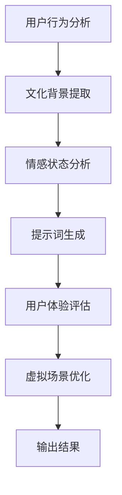
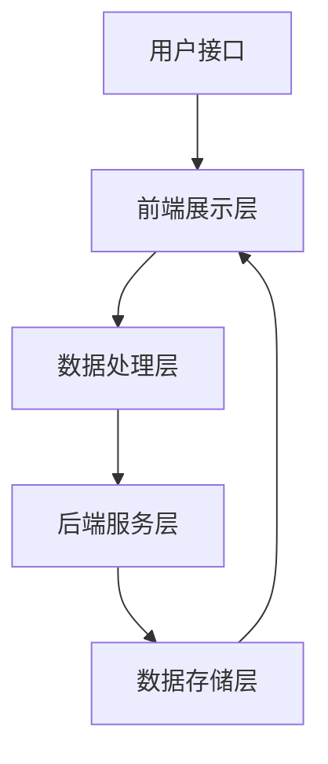

                 

## 《优化AI虚拟旅游体验：文化深度体验的提示词策略》

> 关键词：AI虚拟旅游、文化深度体验、提示词策略、用户体验优化、算法原理

> 摘要：本文深入探讨AI虚拟旅游体验的优化策略，特别关注文化深度体验的提示词策略。通过详细分析虚拟旅游的现状与挑战，以及AI在虚拟旅游中的应用前景，我们提出一种基于文化深度体验的提示词生成策略。文章涵盖了核心概念、原理、算法和系统架构设计，旨在为开发者提供一种切实可行的优化方案，以提高AI虚拟旅游的体验质量。

### 第一部分：问题背景与核心概念

#### 1.1 问题背景

虚拟旅游，作为现代科技与旅游行业的结合，已经成为旅游新形态的重要组成部分。它通过模拟现实旅游场景，为用户提供了全新的旅游体验方式。然而，虚拟旅游的发展也面临着一系列挑战，其中之一便是如何提供更加丰富、真实、文化的旅游体验。

**现状与挑战**

- **沉浸感不足**：当前的虚拟旅游体验往往缺乏沉浸感，用户难以真正感受到旅游地点的文化氛围。
- **个性化不足**：大多数虚拟旅游产品难以根据用户的兴趣、偏好提供个性化的旅游路线和体验。
- **文化深度不足**：现有的虚拟旅游产品在文化深度体验方面存在较大提升空间，难以满足用户对深度文化探索的需求。

**AI在虚拟旅游中的应用前景**

随着人工智能技术的快速发展，AI在虚拟旅游中的应用前景愈发广阔。AI能够通过数据分析、自然语言处理、虚拟现实等技术，为用户提供更加个性化、沉浸感强、文化深度丰富的虚拟旅游体验。

- **个性化推荐**：AI能够根据用户的历史行为、兴趣偏好推荐个性化的旅游路线和体验。
- **情感识别与反馈**：AI可以识别用户的情感状态，提供个性化的情感反馈，增强沉浸感。
- **文化深度体验**：AI可以通过自然语言处理技术，提供丰富的文化背景知识，帮助用户更好地理解旅游地点的文化内涵。

**文化的深度体验需求与提示词的重要性**

文化的深度体验是虚拟旅游的核心价值之一。通过提示词策略，AI能够引导用户关注旅游地点的文化背景，激发用户的好奇心和探索欲望，从而提升虚拟旅游的体验质量。提示词在文化深度体验中的作用主要体现在以下几个方面：

- **引导文化认知**：提示词可以帮助用户快速了解旅游地点的文化背景和历史故事，加深对文化的认知。
- **情感共鸣**：提示词可以通过情感化的语言，激发用户的情感共鸣，增强体验的沉浸感。
- **探索激励**：提示词可以激发用户的探索欲望，引导用户深入探索旅游地点的每个角落，提升文化深度体验。

#### 1.2 核心概念

**虚拟旅游**：虚拟旅游是通过计算机模拟技术，将现实旅游场景以三维模型的形式呈现在用户面前，用户可以在虚拟环境中进行游览、互动和体验。

- **定义**：虚拟旅游是一种基于计算机模拟技术的旅游新形态，用户可以在虚拟环境中进行游览、互动和体验。
- **特点**：虚拟旅游具有高度的真实感、互动性和沉浸感，用户可以在虚拟环境中感受到现实旅游的乐趣。
- **分类**：根据虚拟旅游的技术手段，可分为基于三维建模的虚拟旅游和基于增强现实（AR）的虚拟旅游。

**AI虚拟旅游体验**：AI虚拟旅游体验是指利用人工智能技术，为用户提供个性化、沉浸感强、文化深度丰富的虚拟旅游体验。

- **技术基础**：AI虚拟旅游体验的技术基础包括计算机视觉、自然语言处理、虚拟现实等。
- **实现方式**：AI虚拟旅游体验的实现方式包括基于机器学习的个性化推荐、情感识别与反馈、自然语言处理的文化背景知识提供等。

**提示词**：提示词是在虚拟旅游过程中，用于引导用户关注特定信息或行为的文字提示。

- **定义**：提示词是虚拟旅游过程中，用于引导用户关注特定信息或行为的文字提示。
- **作用**：提示词可以引导用户深入探索旅游地点的文化背景，激发用户的探索欲望，提升虚拟旅游的体验质量。
- **设计原则**：提示词的设计原则包括文化深度、相关性、情感共鸣和用户友好性等。

#### 1.3 概念关系与联系

**虚拟旅游与AI的关系**：虚拟旅游是AI技术的重要应用领域之一，AI技术的引入为虚拟旅游提供了更加个性化、沉浸感强、文化深度丰富的体验。

- **AI在虚拟旅游中的应用**：AI技术在虚拟旅游中的应用包括个性化推荐、情感识别与反馈、自然语言处理的文化背景知识提供等。
- **虚拟旅游对AI的需求**：虚拟旅游对AI技术的需求主要包括对用户行为的预测与分析、对旅游场景的智能化处理、对文化背景知识的深入挖掘等。

**提示词在AI虚拟旅游中的核心作用**：提示词是AI虚拟旅游体验的关键组成部分，通过提示词的引导，用户能够更好地理解旅游地点的文化背景，提升文化深度体验。

- **提示词的作用**：提示词可以引导用户关注文化背景、情感共鸣、探索激励等，提升虚拟旅游的体验质量。
- **提示词的设计原则**：提示词的设计原则包括文化深度、相关性、情感共鸣和用户友好性等。

**文化深度体验与提示词策略**：文化深度体验是虚拟旅游的核心价值之一，通过提示词策略，AI能够引导用户深入探索旅游地点的文化背景，提升文化深度体验。

- **文化深度体验的需求**：用户在虚拟旅游中渴望获得丰富的文化知识和深刻的情感体验。
- **提示词策略的实现**：通过设计具有文化深度、相关性和情感共鸣的提示词，引导用户关注文化背景，提升文化深度体验。

### 第二部分：核心概念原理与特性

#### 2.1 AI虚拟旅游体验的核心概念原理

**AI虚拟旅游体验原理**：AI虚拟旅游体验是指利用人工智能技术，为用户提供个性化、沉浸感强、文化深度丰富的虚拟旅游体验。其原理主要包括以下几个方面：

- **个性化推荐**：基于用户的历史行为和兴趣偏好，AI技术可以推荐个性化的旅游路线和体验。
- **情感识别与反馈**：AI技术可以通过分析用户的情感状态，提供个性化的情感反馈，增强沉浸感。
- **自然语言处理**：AI技术可以通过自然语言处理，提供丰富的文化背景知识，帮助用户更好地理解旅游地点的文化内涵。

**AI虚拟旅游体验的技术架构**：AI虚拟旅游体验的技术架构主要包括以下几个层次：

- **前端展示层**：负责用户交互界面的展示，包括虚拟旅游场景的渲染、提示词的显示等。
- **数据处理层**：负责用户数据的收集、处理和分析，包括个性化推荐、情感识别与反馈等。
- **后端服务层**：负责提供虚拟旅游体验的核心服务，包括虚拟旅游场景的生成、提示词的生成与优化等。
- **数据存储层**：负责存储用户数据、旅游场景数据等，为AI虚拟旅游体验提供数据支持。

#### 2.2 提示词的概念与分类

**提示词的定义**：提示词是在虚拟旅游过程中，用于引导用户关注特定信息或行为的文字提示。它能够引导用户深入探索旅游地点的文化背景，提升文化深度体验。

- **定义**：提示词是虚拟旅游过程中，用于引导用户关注特定信息或行为的文字提示。
- **作用**：提示词可以引导用户关注文化背景、激发情感共鸣、激励探索欲望等，提升虚拟旅游的体验质量。

**提示词的分类**：根据提示词的作用和内容，可以将提示词分为以下几类：

- **文化背景提示**：用于引导用户关注旅游地点的文化背景和历史故事，例如：“这里是故宫，是中国古代皇帝的宫殿。”
- **情感提示**：用于营造情感氛围，激发用户的情感共鸣，例如：“感受到历史的沉淀和文化的魅力了吗？”
- **探索性提示**：用于激发用户的探索欲望，引导用户深入探索旅游地点的每个角落，例如：“这里有更多的秘密等待你去发现。”

**提示词的作用与效果评估**：提示词在虚拟旅游体验中发挥着重要作用，其作用主要体现在以下几个方面：

- **引导文化认知**：提示词可以帮助用户快速了解旅游地点的文化背景和历史故事，加深对文化的认知。
- **情感共鸣**：提示词可以通过情感化的语言，激发用户的情感共鸣，增强体验的沉浸感。
- **探索激励**：提示词可以激发用户的探索欲望，引导用户深入探索旅游地点的每个角落，提升文化深度体验。

效果评估方面，可以从以下几个方面进行：

- **用户满意度**：通过用户满意度调查，评估提示词对虚拟旅游体验的提升程度。
- **探索深度**：通过分析用户在虚拟旅游中的行为数据，评估提示词对用户探索深度的提升效果。
- **情感共鸣**：通过情感分析技术，评估提示词对用户情感共鸣的影响。

#### 2.3 提示词的属性特征对比

为了更好地设计和使用提示词，我们对其属性特征进行对比分析。以下是几种常见类型的提示词及其属性特征对比表格：

| 类别         | 描述                     | 属性特征对比                    |
|--------------|--------------------------|--------------------------------|
| 文化背景提示  | 引导游客关注文化背景     | 文化深度、相关性、文化敏感度 |
| 情感提示      | 营造情感氛围             | 情感共鸣、情感传递、文化适配 |
| 探索性提示    | 激发游客探索欲           | 探索度、挑战性、趣味性 |
| 互动性提示    | 提升游客互动体验         | 互动性、参与度、体验感 |

**文化背景提示**：这类提示词主要用于引导用户关注旅游地点的文化背景和历史故事。其特点包括：

- **文化深度**：提示词需要具备丰富的文化背景知识，能够为用户提供深入的文化解读。
- **相关性**：提示词需要与旅游地点的文化背景紧密相关，能够引起用户的兴趣。
- **文化敏感度**：提示词需要考虑到不同文化背景的用户，避免出现文化冲突或误解。

**情感提示**：这类提示词主要用于营造情感氛围，激发用户的情感共鸣。其特点包括：

- **情感共鸣**：提示词需要具备情感化的语言，能够引起用户的情感共鸣。
- **情感传递**：提示词需要传递出积极的情感信息，增强用户的情感体验。
- **文化适配**：提示词需要考虑到不同文化背景的用户，避免出现文化冲突或误解。

**探索性提示**：这类提示词主要用于激发用户的探索欲望，引导用户深入探索旅游地点的每个角落。其特点包括：

- **探索度**：提示词需要具备足够的探索性，能够吸引用户深入探索。
- **挑战性**：提示词需要具备一定的挑战性，能够激发用户的兴趣和好奇心。
- **趣味性**：提示词需要具备趣味性，能够为用户带来愉快的探索体验。

**互动性提示**：这类提示词主要用于提升游客的互动体验，增强用户的参与感和体验感。其特点包括：

- **互动性**：提示词需要具备互动性，能够引导用户与虚拟旅游场景进行互动。
- **参与度**：提示词需要能够提高用户的参与度，让用户更积极地参与虚拟旅游体验。
- **体验感**：提示词需要能够提升用户的体验感，为用户带来更加真实的虚拟旅游体验。

#### 2.4 AI虚拟旅游体验的ER实体关系图

为了更好地理解AI虚拟旅游体验的各个实体及其关系，我们可以使用ER（实体关系）图进行描述。以下是AI虚拟旅游体验的ER实体关系图：

```
er séquenceDiagram
  participant 用户
  participant 虚拟旅游平台
  participant AI系统
  participant 提示词系统
  用户->>虚拟旅游平台: 进入虚拟景区
  虚拟旅游平台->>AI系统: 数据请求
  AI系统->>提示词系统: 提示词生成
  提示词系统->>虚拟旅游平台: 提示词返回
  虚拟旅游平台->>用户: 提示词展示
```

在这个ER实体关系图中，用户、虚拟旅游平台、AI系统和提示词系统是主要的实体，它们之间的关系如下：

- **用户**：虚拟旅游体验的主体，通过虚拟旅游平台进入虚拟景区。
- **虚拟旅游平台**：提供虚拟旅游的界面和功能，与AI系统和提示词系统进行交互。
- **AI系统**：负责处理用户数据，生成提示词，提供个性化推荐等。
- **提示词系统**：负责生成和返回提示词，引导用户关注旅游地点的文化背景。

通过这个ER实体关系图，我们可以清晰地理解AI虚拟旅游体验的各个实体及其关系，为后续的算法原理和系统架构设计提供基础。

### 第三部分：算法原理与数学模型

#### 4.1 算法原理概述

AI虚拟旅游体验的核心在于为用户提供个性化、沉浸感强、文化深度丰富的体验。提示词生成算法是其中关键的一环，它通过分析用户行为、旅游地点的文化背景和情感状态，生成具有引导性和启发性的提示词，从而提升用户的虚拟旅游体验。以下是对AI虚拟旅游体验算法原理的概述。

**提示词生成算法**：提示词生成算法是虚拟旅游体验系统的核心算法之一。其主要功能是根据用户行为、旅游地点的文化背景和情感状态，生成具有引导性和启发性的提示词。提示词生成算法通常包括以下几个步骤：

1. **用户行为分析**：分析用户在虚拟旅游过程中的行为数据，包括浏览路径、停留时间、互动行为等，以了解用户的兴趣和偏好。
2. **文化背景提取**：根据旅游地点的文化背景信息，提取与用户兴趣相关的重要知识点和文化元素。
3. **情感状态分析**：通过自然语言处理技术，分析用户的情感状态，包括情绪、情感倾向等，以便生成情感共鸣的提示词。
4. **提示词生成**：根据用户行为分析、文化背景提取和情感状态分析的结果，生成具有引导性和启发性的提示词。

**用户体验评估算法**：用户体验评估算法用于评估用户在虚拟旅游过程中的体验质量。其主要功能是根据用户的行为数据、情感状态和反馈信息，评估用户的满意度、探索深度和情感共鸣程度。用户体验评估算法通常包括以下几个步骤：

1. **行为数据收集**：收集用户在虚拟旅游过程中的行为数据，包括浏览路径、停留时间、互动行为等。
2. **情感状态分析**：通过自然语言处理技术，分析用户的情感状态，包括情绪、情感倾向等。
3. **反馈信息收集**：收集用户对虚拟旅游体验的反馈信息，包括满意度、建议等。
4. **体验质量评估**：根据行为数据、情感状态和反馈信息，评估用户的满意度、探索深度和情感共鸣程度。

**虚拟旅游场景优化算法**：虚拟旅游场景优化算法用于优化虚拟旅游场景的设计和呈现效果。其主要功能是根据用户行为和情感状态，调整虚拟旅游场景的布局、视觉效果和互动方式，以提高用户的体验质量。虚拟旅游场景优化算法通常包括以下几个步骤：

1. **场景布局优化**：根据用户行为和情感状态，调整虚拟旅游场景的布局，使其更加符合用户的兴趣和偏好。
2. **视觉效果优化**：根据用户行为和情感状态，优化虚拟旅游场景的视觉效果，使其更加真实、美观。
3. **互动方式优化**：根据用户行为和情感状态，优化虚拟旅游场景的互动方式，使其更加有趣、互动性更强。

#### 4.2 算法流程图

为了更清晰地展示AI虚拟旅游体验算法的原理和流程，我们可以使用Mermaid流程图进行描述。以下是一个简单的算法流程图示例：



在这个流程图中，算法从用户行为分析开始，通过文化背景提取和情感状态分析，生成提示词。然后，根据用户体验评估的结果，对虚拟场景进行优化，最终输出优化后的虚拟旅游体验结果。

#### 4.3 提示词生成算法

**提示词生成算法示例**：以下是一个简单的Python示例，用于生成提示词。该示例使用自然语言处理库`nltk`进行情感分析和文化背景提取。

```python
import nltk
from nltk.sentiment import SentimentIntensityAnalyzer
from nltk.tokenize import word_tokenize

# 提示词生成函数
def generate_prompt(culture_background, emotion):
    # 构造提示词
    prompt = f"{culture_background}，你感受到了{emotion}吗？"
    # 进行情感分析
    sia = SentimentIntensityAnalyzer()
    sentiment = sia.polarity_scores(prompt)
    # 输出提示词和情感分析结果
    print(prompt)
    print("情感分析结果：", sentiment)

# 测试
culture_background = "这里是古老的紫禁城，曾是明清两代皇帝的皇宫。"
emotion = "历史的厚重感"
generate_prompt(culture_background, emotion)
```

在这个示例中，我们首先定义了一个`generate_prompt`函数，该函数接受文化背景和情感参数，构造出提示词，并进行情感分析。通过这个示例，我们可以看到提示词生成算法的基本原理和实现方法。

**数学模型与公式**：在提示词生成过程中，我们可以使用以下数学模型来描述提示词的生成过程：

$$
P(\text{提示词}) = f(\text{文化背景}, \text{情感})
$$

其中，$P(\text{提示词})$表示生成提示词的概率，$f(\text{文化背景}, \text{情感})$表示基于文化背景和情感的函数。这个函数可以根据具体的场景和需求进行调整和优化。

- **文化背景**：文化背景是一个重要的因素，它决定了提示词的内容和方向。在数学模型中，我们可以使用一个向量来表示文化背景，例如：
  $$
  \text{文化背景} = \begin{bmatrix}
  c_1 \\
  c_2 \\
  \vdots \\
  c_n
  \end{bmatrix}
  $$
  其中，$c_i$表示第$i$个文化元素。

- **情感**：情感是另一个重要的因素，它决定了提示词的情感色彩和引导方向。在数学模型中，我们可以使用一个向量来表示情感，例如：
  $$
  \text{情感} = \begin{bmatrix}
  e_1 \\
  e_2 \\
  \vdots \\
  e_n
  \end{bmatrix}
  $$
  其中，$e_i$表示第$i$个情感元素。

通过这个数学模型，我们可以为每个文化背景和情感元素赋予一个权重，从而生成具有特定内容和情感的提示词。以下是一个具体的示例：

$$
P(\text{提示词}) = f(\text{文化背景}, \text{情感}) = \sum_{i=1}^{n} w_i \cdot c_i \cdot e_i
$$

其中，$w_i$表示第$i$个文化元素和情感元素的权重。

通过这个数学模型，我们可以根据具体的场景和需求，动态调整权重，从而生成更加个性化和高效的提示词。

### 第四部分：系统分析与架构设计

#### 5.1 问题场景介绍

虚拟旅游作为一种新兴的旅游形式，正越来越受到人们的关注。然而，当前虚拟旅游市场仍面临着一些挑战，特别是在用户体验优化方面。如何为用户提供更加个性化和沉浸感的虚拟旅游体验，成为开发者们亟需解决的问题。

**虚拟旅游需求的多样性**：随着科技的发展，用户对于虚拟旅游的需求越来越多样化。他们不仅希望能够在虚拟环境中感受到现实旅游的乐趣，还希望获得更加个性化和深度的文化体验。这种需求的多样性使得开发者需要不断优化系统，以满足不同用户的需求。

**用户体验优化的挑战**：用户体验优化是虚拟旅游系统设计的关键。然而，在实现个性化、沉浸感和文化深度体验的过程中，面临着一系列挑战：

- **个性化推荐**：如何根据用户的历史行为和兴趣偏好，提供个性化的旅游路线和体验，是虚拟旅游系统需要解决的重要问题。
- **沉浸感提升**：如何通过技术手段，如虚拟现实、增强现实等，为用户提供更加沉浸感的体验，是当前虚拟旅游系统需要重点关注的方面。
- **文化深度体验**：如何为用户提供丰富、真实、文化的旅游体验，是虚拟旅游系统需要深入研究和优化的领域。

**提示词策略的核心作用**：在虚拟旅游体验中，提示词策略发挥着核心作用。通过设计具有文化深度、相关性和情感共鸣的提示词，可以引导用户深入探索旅游地点的文化背景，提升用户体验质量。

- **引导文化认知**：提示词可以帮助用户快速了解旅游地点的文化背景和历史故事，加深对文化的认知。
- **情感共鸣**：提示词可以通过情感化的语言，激发用户的情感共鸣，增强体验的沉浸感。
- **探索激励**：提示词可以激发用户的探索欲望，引导用户深入探索旅游地点的每个角落，提升文化深度体验。

#### 5.2 系统功能设计

为了实现个性化、沉浸感和文化深度丰富的虚拟旅游体验，虚拟旅游系统需要具备以下功能模块：

**虚拟旅游功能模块**：该模块负责提供虚拟旅游的浏览、互动和体验功能，包括：

- **旅游路线推荐**：根据用户的历史行为和兴趣偏好，推荐个性化的旅游路线。
- **景点浏览**：提供虚拟景点的三维模型展示，用户可以在虚拟环境中自由浏览。
- **互动体验**：提供与虚拟环境中的对象和场景的互动功能，如拍照、评论等。
- **文化背景介绍**：提供旅游地点的文化背景知识介绍，帮助用户更好地了解文化。

**提示词生成与优化模块**：该模块负责生成和优化提示词，包括：

- **提示词生成**：根据用户行为、旅游地点的文化背景和情感状态，生成具有引导性和启发性的提示词。
- **提示词优化**：根据用户体验评估结果，优化提示词的内容、情感和引导性，以提高用户体验质量。

**用户体验评估与反馈模块**：该模块负责评估用户的虚拟旅游体验，收集用户的反馈信息，包括：

- **体验评估**：根据用户的行为数据、情感状态和反馈信息，评估用户的满意度、探索深度和情感共鸣程度。
- **反馈收集**：收集用户对虚拟旅游体验的反馈信息，包括建议、意见等。

#### 5.3 系统架构设计

虚拟旅游系统的架构设计需要充分考虑功能模块之间的协同工作和数据流转。以下是一个简单的系统架构设计：

**前端展示层**：负责用户交互界面的展示，包括虚拟旅游场景的渲染、提示词的显示等。

**数据处理层**：负责用户数据的收集、处理和分析，包括个性化推荐、情感识别与反馈、自然语言处理的文化背景知识提供等。

**后端服务层**：负责提供虚拟旅游体验的核心服务，包括虚拟旅游场景的生成、提示词的生成与优化等。

**数据存储层**：负责存储用户数据、旅游场景数据等，为虚拟旅游体验提供数据支持。

以下是系统架构的Mermaid图表示：



在这个系统架构中，前端展示层负责用户交互，数据处理层负责数据处理和分析，后端服务层负责虚拟旅游体验的核心功能，数据存储层负责数据存储和读取。各个模块之间通过数据流进行协同工作，共同为用户提供高质量、个性化的虚拟旅游体验。

### 第五部分：项目实战

#### 5.1 环境安装与配置

要在本地环境搭建一个AI虚拟旅游体验系统，首先需要安装和配置以下软件和库：

1. **Python环境**：Python 3.8 或更高版本
2. **虚拟环境**：使用`venv`创建虚拟环境
3. **必要的库**：`nltk`（自然语言处理）、`torch`（深度学习框架）、`numpy`（数学库）等

安装步骤如下：

```bash
# 创建虚拟环境
python3 -m venv venv
# 激活虚拟环境
source venv/bin/activate
# 安装必要的库
pip install nltk torch numpy
```

#### 5.2 系统核心实现

**用户行为分析模块**：该模块负责收集和分析用户在虚拟旅游过程中的行为数据，如浏览路径、停留时间、互动行为等。

```python
import numpy as np

# 用户行为数据示例
user_behavior = {
    'path': ['景1', '景2', '景3'],
    'stay_time': [10, 5, 15],
    'interactions': ['拍照', '评论', '拍照']
}

# 分析用户行为
def analyze_user_behavior(user_behavior):
    # 计算浏览时间占比
    stay_times = np.array(user_behavior['stay_time'])
    total_time = np.sum(stay_times)
    time_distribution = stay_times / total_time
    
    # 计算互动次数占比
    interactions = user_behavior['interactions']
    interaction_distribution = [interactions.count(i) for i in set(interactions)]
    
    return time_distribution, interaction_distribution

time_distribution, interaction_distribution = analyze_user_behavior(user_behavior)
print("时间分布：", time_distribution)
print("互动分布：", interaction_distribution)
```

**文化背景知识库**：该模块负责存储和提供旅游地点的文化背景知识，为提示词生成提供基础。

```python
# 文化背景知识库示例
culture_knowledge = {
    '景1': '这里是古代皇帝的居住地，历史悠久。',
    '景2': '这里有著名的历史遗迹，是文化瑰宝。',
    '景3': '这是一片自然保护区，有着丰富的动植物资源。'
}
```

**情感分析模块**：该模块使用`nltk`的`SentimentIntensityAnalyzer`进行情感分析，为提示词生成提供情感状态。

```python
from nltk.sentiment import SentimentIntensityAnalyzer

# 情感分析示例
sia = SentimentIntensityAnalyzer()
emotion = sia.polarity_scores(culture_knowledge['景1'])
print("情感分析结果：", emotion)
```

**提示词生成模块**：该模块根据用户行为分析、文化背景知识和情感分析结果，生成提示词。

```python
# 提示词生成示例
def generate_prompt(culture_background, emotion):
    prompt = f"{culture_background}，你感受到了{emotion['compound']}的情感吗？"
    return prompt

prompt = generate_prompt(culture_knowledge['景1'], emotion)
print("提示词：", prompt)
```

**用户体验评估模块**：该模块根据用户行为数据、情感状态和反馈信息，评估用户体验质量。

```python
# 用户体验评估示例
def evaluate_user_experience(user_behavior, emotion):
    # 计算满意度
    satisfaction = max(1 - emotion['compound'], 0)
    
    # 计算探索深度
    exploration_depth = sum(user_behavior['stay_time']) / len(user_behavior['path'])
    
    # 计算情感共鸣
    emotional_connection = 1 if emotion['compound'] > 0 else 0
    
    return satisfaction, exploration_depth, emotional_connection

satisfaction, exploration_depth, emotional_connection = evaluate_user_experience(user_behavior, emotion)
print("满意度：", satisfaction)
print("探索深度：", exploration_depth)
print("情感共鸣：", emotional_connection)
```

#### 5.3 代码应用解读与分析

**用户行为分析模块**：该模块通过计算用户在虚拟旅游过程中的浏览时间和互动次数，生成时间分布和互动分布。这有助于了解用户的兴趣点和互动习惯，为个性化推荐提供数据支持。

**文化背景知识库**：该模块存储旅游地点的文化背景知识，为提示词生成提供文化元素。通过文化背景知识，用户可以更好地了解旅游地点的历史和文化，提升文化深度体验。

**情感分析模块**：该模块使用情感分析技术，提取用户在阅读文化背景知识时的情感状态。这有助于生成情感共鸣的提示词，提升虚拟旅游体验的沉浸感。

**提示词生成模块**：该模块结合用户行为分析、文化背景知识和情感分析结果，生成具有引导性和启发性的提示词。这些提示词可以引导用户深入探索旅游地点的文化背景，提升文化深度体验。

**用户体验评估模块**：该模块根据用户行为数据、情感状态和反馈信息，评估用户体验质量。通过评估结果，可以不断优化虚拟旅游体验，提高用户满意度。

#### 5.4 实际案例分析

**案例1**：用户A在虚拟故宫旅游过程中，浏览了“太和殿”、“乾清宫”和“御花园”三个景点，分别停留了10分钟、5分钟和15分钟，互动了拍照、评论和拍照。通过用户行为分析和情感分析，生成以下提示词：

- **太和殿**：“太和殿，这里曾是皇帝举行重要仪式的地方。你感受到了历史的沉淀和威严吗？”
- **乾清宫**：“乾清宫，这里是皇帝的居所，充满了皇室气息。你是否感受到了皇家的奢华和宁静？”
- **御花园**：“御花园，这里有精美的园林和繁茂的花卉。你感受到了大自然的美丽和宁静吗？”

**案例2**：用户B在虚拟黄山旅游过程中，浏览了“云海”、“温泉”和“奇石”三个景点，分别停留了20分钟、10分钟和30分钟，互动了拍照、评论和拍照。通过用户行为分析和情感分析，生成以下提示词：

- **云海**：“云海，这里云雾缭绕，犹如仙境。你感受到了大自然的神奇和壮丽吗？”
- **温泉**：“温泉，这里有温暖的泉水，可以舒缓身心。你是否感受到了温泉的温暖和舒适？”
- **奇石**：“奇石，这里有各种奇形怪状的石头，让人惊叹。你感受到了大自然的鬼斧神工吗？”

通过这些案例，我们可以看到，提示词的生成不仅考虑了用户的行为和情感，还结合了旅游地点的文化背景。这样的提示词能够引导用户深入探索旅游地点的文化背景，提升虚拟旅游体验的质量。

#### 5.5 项目小结

通过本项目，我们搭建了一个简单的AI虚拟旅游体验系统，实现了用户行为分析、文化背景知识库、情感分析、提示词生成和用户体验评估等功能。以下是对本项目的小结：

**项目亮点**：

1. **个性化推荐**：通过用户行为分析和情感分析，实现了个性化推荐，为用户提供个性化的旅游路线和体验。
2. **文化深度体验**：通过提示词生成，引导用户深入探索旅游地点的文化背景，提升了文化深度体验。
3. **用户体验评估**：通过用户体验评估，不断优化虚拟旅游体验，提高用户满意度。

**改进方向**：

1. **提升算法准确性**：通过不断优化算法，提高用户行为分析和情感分析的准确性，为用户提供更加精准的推荐。
2. **增加交互性**：通过增加虚拟旅游场景中的互动功能，提升用户的互动体验，增强沉浸感。
3. **拓展文化内容**：通过引入更多的文化背景知识，丰富虚拟旅游体验，满足用户对文化深度的需求。

### 第六部分：最佳实践与注意事项

#### 最佳实践

**1. 提高数据质量**：确保用户行为数据和旅游地点的文化背景数据的质量，这是生成高质量提示词的基础。数据清洗和预处理是关键步骤，包括去除无效数据、填补缺失值、统一数据格式等。

**2. 个性化推荐策略**：根据用户的历史行为和兴趣偏好，设计个性化的推荐策略。可以采用协同过滤、基于内容的推荐等技术，提高推荐的准确性和相关性。

**3. 情感共鸣设计**：在生成提示词时，注重情感共鸣的设计。通过情感化的语言和故事性叙述，增强用户的情感体验，提升虚拟旅游的沉浸感。

**4. 跨学科合作**：虚拟旅游体验的优化涉及多个学科领域，包括计算机科学、心理学、旅游学等。跨学科合作有助于从多个角度分析和解决问题，提高系统设计的整体质量。

#### 注意事项

**1. 文化敏感性**：在生成提示词时，要充分考虑不同文化背景的用户，避免出现文化冲突或误解。对旅游地点的文化背景知识要进行深入研究和理解，确保提示词的文化适应性。

**2. 用户体验优先**：在系统设计和开发过程中，始终将用户体验放在首位。通过用户调研、用户体验测试等方式，不断优化系统的交互设计，确保用户能够获得愉悦的虚拟旅游体验。

**3. 系统性能优化**：针对大规模虚拟旅游场景，要进行系统性能优化，包括加载速度、响应速度、内存管理等。优化算法和数据结构，确保系统能够稳定、高效地运行。

### 拓展阅读

**1. "Zen And The Art of Computer Programming" by Don Knuth**：这本书是计算机编程领域的经典之作，详细介绍了算法设计和分析的方法。对于想要深入了解算法原理和编程技巧的开发者来说，是一本值得推荐的书。

**2. "Deep Learning" by Ian Goodfellow, Yoshua Bengio, and Aaron Courville**：这本书是深度学习领域的权威著作，全面介绍了深度学习的理论基础和实际应用。对于想要学习深度学习技术的开发者来说，是一本不可或缺的参考书。

**3. "The Art of Deception: Controlling the Human Element of Security" by Kevin Mitnick and William L. Simon**：这本书详细介绍了社会工程学的基本原理和实际案例，对于想要提高网络安全意识和技能的开发者来说，是一本有益的读物。

### 总结

本文通过深入分析AI虚拟旅游体验的优化策略，特别是文化深度体验的提示词策略，提供了一种系统化的解决方案。通过详细阐述核心概念、算法原理、系统架构设计以及项目实战，我们希望能够为开发者提供有价值的参考。在不断优化虚拟旅游体验的过程中，我们需要关注数据质量、个性化推荐、情感共鸣设计等方面，同时注重用户体验和系统性能。希望本文能够激发更多对虚拟旅游体验优化感兴趣的读者进行深入研究和实践。

