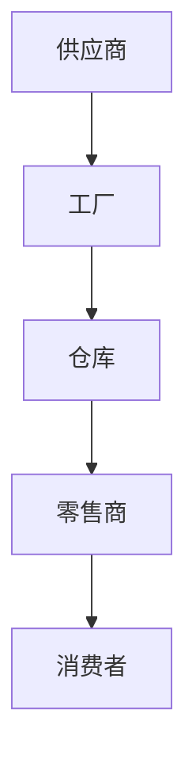
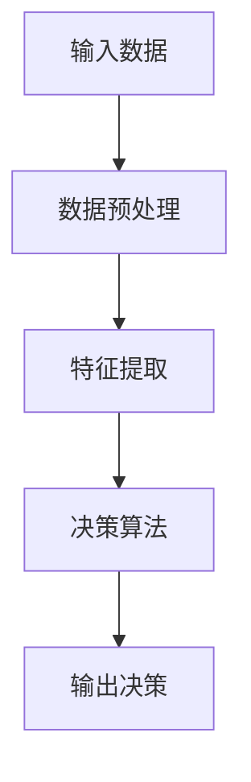
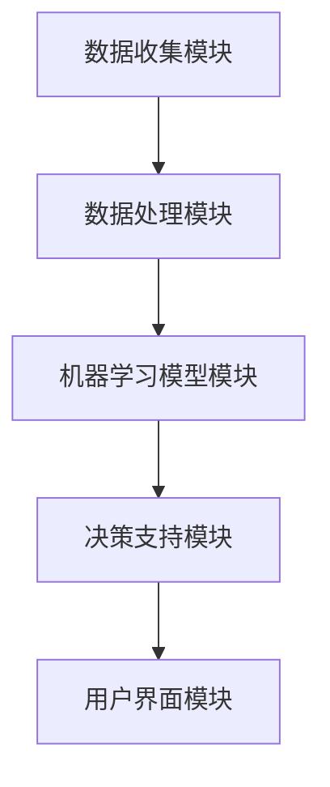

                 

### 优化AI虚拟时尚买手决策：全球供应链分析的提示词策略

**关键词：** 时尚产业，AI虚拟买手，全球供应链，提示词策略，决策优化

**摘要：** 本文旨在探讨如何通过全球供应链分析的提示词策略，优化AI虚拟时尚买手的决策。首先，我们将分析时尚产业的现状和AI虚拟买手决策的优势，然后介绍全球供应链分析的重要性以及提示词策略的作用与实现方法。接下来，我们将深入探讨AI虚拟买手决策的原理与数学模型，详细讲解优化算法的原理与实现。最后，本文将总结优化AI虚拟时尚买手决策的最佳实践和未来展望。

## 第一部分：问题背景与核心概念

### 第1章：时尚产业与AI虚拟买手决策

#### 1.1 时尚产业的现状与挑战

时尚产业是一个高度竞争的行业，产品生命周期短，市场需求变化迅速。这种快速变化给时尚买手带来了巨大的挑战。传统买手决策主要依赖于经验和直觉，难以适应市场的动态变化。以下是一些时尚产业当前面临的挑战：

1. **时尚趋势的快速变化**：时尚产业的产品设计、款式和风格变化非常快，消费者对时尚的追求也变得越来越快。这使得传统买手难以准确预测市场需求。

2. **供应链管理复杂**：全球供应链的复杂性和不确定性增加了时尚买手的管理难度。供应链的延误、成本增加和质量问题都可能影响买手决策。

3. **库存管理困难**：时尚产品的季节性强，库存管理困难。过多的库存可能导致滞销，而库存不足可能导致销售损失。

#### 1.2 AI虚拟买手的概念与功能

AI虚拟买手是一种利用人工智能技术辅助时尚买手决策的工具。它通过分析大量的数据和市场趋势，提供精确的市场预测和采购建议。AI虚拟买手的关键功能包括：

1. **市场趋势预测**：通过分析历史数据和市场动态，预测未来的时尚趋势。

2. **采购建议**：根据库存情况和市场预测，为时尚买手提供精准的采购建议。

3. **风险控制**：通过分析供应链数据，预测供应链风险，帮助买手做出更加稳健的决策。

#### 1.3 全球供应链分析的重要性

全球供应链分析对于时尚产业至关重要。它不仅可以帮助企业优化供应链管理，还可以提高采购效率和库存管理能力。以下是全球供应链分析的重要目标：

1. **优化供应链管理**：通过分析供应链数据，识别供应链中的瓶颈和优化机会。

2. **提高采购效率**：通过数据分析，帮助企业找到最佳的采购时间和采购量，降低采购成本。

3. **改善库存管理**：通过预测未来市场需求，优化库存水平，减少库存成本。

#### 1.4 提示词策略的作用与实现

提示词策略是一种利用关键词和短语来引导AI虚拟买手决策的方法。通过设计有效的提示词，可以帮助AI虚拟买手更好地理解市场需求和供应链情况。提示词策略的作用包括：

1. **提高决策准确性**：提示词可以帮助AI虚拟买手更准确地理解市场趋势和供应链数据，从而提高决策准确性。

2. **优化采购策略**：通过提示词，AI虚拟买手可以更好地预测市场需求，制定更优的采购策略。

3. **降低风险**：提示词可以帮助AI虚拟买手识别潜在的供应链风险，从而降低业务风险。

#### 1.5 本章小结

本章主要介绍了优化AI虚拟时尚买手决策的背景和核心概念。我们分析了时尚产业的现状和挑战，介绍了AI虚拟买手的概念与功能，阐述了全球供应链分析的重要性以及提示词策略的作用与实现方法。接下来，我们将进一步探讨AI虚拟买手决策的原理与数学模型。

## 第二部分：核心概念与联系

### 第2章：AI虚拟买手决策的原理与数学模型

#### 2.1 AI虚拟买手决策的基本原理

AI虚拟买手决策的基本原理基于数据分析和机器学习技术。数据是决策的基础，而机器学习则是实现决策的关键。以下是AI虚拟买手决策的基本原理：

1. **数据收集与处理**：收集与时尚产业相关的数据，包括市场趋势、消费者行为、供应链信息等。然后对数据进行清洗、整合和预处理，使其适合机器学习算法。

2. **特征提取**：从原始数据中提取关键特征，这些特征可以反映市场趋势、消费者偏好和供应链状况。特征提取是机器学习模型训练的重要步骤。

3. **模型选择与训练**：根据问题的特点选择合适的机器学习模型，如决策树、随机森林、神经网络等。使用训练数据集对模型进行训练，使其能够预测市场需求和采购策略。

4. **模型评估与优化**：使用验证数据集对模型进行评估，调整模型参数，提高预测准确性。通过交叉验证和模型选择技术，找到最优的模型。

5. **决策生成与执行**：使用训练好的模型生成采购建议和决策，并执行这些决策。AI虚拟买手可以根据实时数据和市场变化，不断调整和优化决策。

#### 2.2 AI虚拟买手决策的核心数学模型

AI虚拟买手决策的核心数学模型主要包括概率论与统计学模型、决策树与随机森林模型、神经网络与深度学习模型。以下是这些模型的基本原理：

1. **概率论与统计学模型**：
   - **概率分布**：描述数据的概率分布，如正态分布、泊松分布等。这些分布可以用于预测市场趋势和消费者行为。
   - **统计假设检验**：用于检验数据之间的相关性、差异性和一致性。常见的统计假设检验方法包括t检验、方差分析等。

2. **决策树与随机森林模型**：
   - **决策树**：一种基于树结构的分类模型，通过划分特征空间，生成决策树。每个节点表示一个特征，每个分支表示该特征的不同取值。
   - **随机森林**：一种基于决策树的集成模型，通过组合多个决策树，提高模型的预测准确性。

3. **神经网络与深度学习模型**：
   - **神经网络**：一种模拟人脑神经元连接的网络结构，通过学习和记忆，实现数据的分类、回归和预测。
   - **深度学习**：一种基于多层神经网络的学习方法，通过多层非线性变换，提高模型的复杂度和预测能力。

#### 2.3 概念属性特征对比表格

以下是不同数学模型的特性对比表格：

| 模型类型      | 特点                                      | 应用场景                                      |
| ------------- | ----------------------------------------- | --------------------------------------------- |
| 概率论与统计学 | 简单易用，直观易懂                         | 市场趋势预测、消费者行为分析等                 |
| 决策树与随机森林 | 强大的分类和回归能力，易于解释和可视化     | 采购策略建议、库存管理优化等                 |
| 神经网络与深度学习 | 高度非线性，强大的预测能力，适用于复杂问题 | 市场预测、库存管理、供应链优化等             |

#### 2.4 ER实体关系图架构

ER实体关系图是用于描述实体及其关系的图形表示方法。在供应链分析中，ER图可以帮助我们理解供应链中的各个实体及其关系。以下是供应链分析中常见的ER图示例：



在这个ER图中，供应商、工厂、仓库、零售商和消费者是主要的实体，它们之间通过订单、物流等信息进行连接。ER图可以帮助我们更好地理解供应链中的数据流和信息流，从而为AI虚拟买手决策提供支持。

#### 2.5 本章小结

本章主要介绍了AI虚拟买手决策的原理与数学模型。我们分析了数据分析和机器学习技术的基本原理，探讨了不同数学模型的特点和应用场景，并介绍了ER实体关系图架构。接下来，我们将进一步讨论优化AI虚拟时尚买手决策算法的原理与实现。

## 第三部分：算法原理与实现

### 第3章：优化AI虚拟时尚买手决策算法原理详解

#### 3.1 算法原理介绍

优化AI虚拟时尚买手决策算法的原理可以概括为数据预处理、特征提取、决策算法核心步骤三个部分。以下是对这三个部分的具体介绍：

1. **数据预处理**：数据预处理是优化AI虚拟时尚买手决策的重要步骤。它包括数据清洗、数据归一化等操作。数据清洗的主要目的是去除缺失值和异常值，保证数据质量。数据归一化则是将不同量纲和尺度的特征数据转化为相同的尺度，以便于后续的特征提取和模型训练。

2. **特征提取**：特征提取是从原始数据中提取关键特征的过程。这些特征需要能够反映市场的需求和供应链的状况。特征提取的方法包括统计特征提取、图像特征提取等。通过特征提取，我们可以将原始数据转化为适合机器学习算法处理的格式。

3. **决策算法核心步骤**：决策算法的核心步骤包括模型选择、模型训练、模型评估等。模型选择是根据问题的特点选择合适的机器学习模型，如决策树、随机森林、神经网络等。模型训练是使用训练数据集对模型进行训练，使其能够预测市场需求和采购策略。模型评估是使用验证数据集对模型进行评估，调整模型参数，提高预测准确性。

#### 3.2 算法流程图与流程说明

以下是一个优化AI虚拟时尚买手决策算法的流程图：



1. **输入数据**：输入数据包括市场趋势数据、消费者行为数据、供应链数据等。

2. **数据预处理**：对输入数据进行清洗和归一化处理，去除缺失值和异常值，将不同量纲和尺度的特征数据进行标准化处理。

3. **特征提取**：从预处理后的数据中提取关键特征，如市场需求量、消费者偏好、供应链风险等。

4. **决策算法**：使用训练好的机器学习模型对提取的特征进行分类或回归预测，生成采购建议和决策。

5. **输出决策**：将生成的采购建议和决策输出，供时尚买手参考和执行。

#### 3.3 算法原理详细讲解

1. **数据预处理**

   数据预处理是优化AI虚拟时尚买手决策的第一步。它包括以下两个主要过程：

   - **数据清洗**：数据清洗的主要目的是去除数据中的缺失值和异常值。在实际应用中，数据可能存在多种缺失值和异常值，如完全缺失的数据、部分缺失的数据、异常值等。对于缺失值，可以采用填充策略，如平均值填充、中值填充等。对于异常值，可以采用删除策略或插值策略。

   - **数据归一化**：数据归一化是将不同量纲和尺度的特征数据进行标准化处理，使其具有相同的尺度。常见的归一化方法包括最小-最大标准化、Z分数标准化等。

   以下是数据预处理的具体步骤：

   ```python
   import numpy as np
   
   # 数据清洗
   # 假设data是原始数据，missing_values是缺失值的标记
   data_cleaned = data[missing_values == 0]
   
   # 数据归一化
   # 假设features是特征数据
   min_values = np.min(features, axis=0)
   max_values = np.max(features, axis=0)
   features_normalized = (features - min_values) / (max_values - min_values)
   ```

2. **特征提取**

   特征提取是从原始数据中提取关键特征的过程。这些特征需要能够反映市场的需求和供应链的状况。以下是特征提取的一些方法：

   - **统计特征提取**：基于统计方法提取特征，如平均值、中值、标准差等。这些特征可以描述数据的分布和趋势。
   
   - **图像特征提取**：对于图像数据，可以使用卷积神经网络提取特征，如边缘检测、纹理特征等。

   - **时间序列特征提取**：对于时间序列数据，可以使用滑动窗口提取特征，如均值、方差、自相关函数等。

   以下是特征提取的一个简单示例：

   ```python
   import numpy as np
   
   # 假设data是原始数据
   mean_values = np.mean(data, axis=0)
   std_values = np.std(data, axis=0)
   
   # 提取统计特征
   statistical_features = np.hstack((mean_values.reshape(-1, 1), std_values.reshape(-1, 1)))
   ```

3. **决策算法**

   决策算法是优化AI虚拟时尚买手决策的核心部分。常见的决策算法包括决策树、随机森林、神经网络等。以下是这些算法的基本原理和实现步骤：

   - **决策树**：决策树是一种基于树结构的分类模型。它通过划分特征空间，生成决策树。每个节点表示一个特征，每个分支表示该特征的不同取值。决策树的实现可以使用递归划分方法。

   - **随机森林**：随机森林是一种基于决策树的集成模型。它通过组合多个决策树，提高模型的预测准确性。随机森林的实现包括随机特征选择和随机样本生成。

   - **神经网络**：神经网络是一种模拟人脑神经元连接的网络结构。它通过学习和记忆，实现数据的分类、回归和预测。神经网络的实现包括前向传播和反向传播算法。

   以下是决策树和随机森林的实现示例：

   ```python
   from sklearn.tree import DecisionTreeClassifier
   from sklearn.ensemble import RandomForestClassifier
   
   # 决策树
   decision_tree = DecisionTreeClassifier()
   decision_tree.fit(X_train, y_train)
   
   # 随机森林
   random_forest = RandomForestClassifier()
   random_forest.fit(X_train, y_train)
   ```

4. **模型评估**

   模型评估是优化AI虚拟时尚买手决策的重要步骤。它通过使用验证数据集对模型进行评估，调整模型参数，提高预测准确性。常见的评估方法包括交叉验证、精度、召回率、F1分数等。

   ```python
   from sklearn.model_selection import cross_val_score
   from sklearn.metrics import accuracy_score, recall_score, f1_score
   
   # 交叉验证
   scores = cross_val_score(model, X, y, cv=5)
   
   # 精度
   accuracy = accuracy_score(y_true, y_pred)
   
   # 召回率
   recall = recall_score(y_true, y_pred)
   
   # F1分数
   f1 = f1_score(y_true, y_pred)
   ```

#### 3.4 举例说明

为了更好地理解优化AI虚拟时尚买手决策算法的原理，我们以一个简单的例子进行说明。假设我们有一组时尚产品的销量数据，包括三个特征：价格、颜色和季节。我们的目标是预测下一个季度的销量。

1. **数据预处理**

   假设原始数据如下：

   ```python
   data = [
       [100, '红色', '春季'],
       [200, '蓝色', '春季'],
       [150, '红色', '夏季'],
       [300, '蓝色', '夏季'],
       [250, '红色', '秋季'],
       [100, '蓝色', '秋季']
   ]
   ```

   我们需要对数据进行预处理，包括数据清洗和数据归一化：

   ```python
   import numpy as np
   
   # 数据清洗
   data_cleaned = np.array(data)
   
   # 数据归一化
   min_values = np.min(data_cleaned, axis=0)
   max_values = np.max(data_cleaned, axis=0)
   data_normalized = (data_cleaned - min_values) / (max_values - min_values)
   ```

2. **特征提取**

   我们可以提取以下特征：

   - **价格**：价格是一个连续特征，我们可以使用平均值和标准差作为特征。
   
   - **颜色**：颜色是一个类别特征，我们可以使用颜色编码（如红色为1，蓝色为2）作为特征。
   
   - **季节**：季节是一个类别特征，我们可以使用季节编码（如春季为1，夏季为2，秋季为3）作为特征。

   ```python
   mean_price = np.mean(data_normalized[:, 0])
   std_price = np.std(data_normalized[:, 0])
   
   color_encoding = {'红色': 1, '蓝色': 2}
   season_encoding = {'春季': 1, '夏季': 2, '秋季': 3}
   
   features = [
       mean_price,
       std_price,
       color_encoding[data_normalized[i, 1]],
       season_encoding[data_normalized[i, 2]]
   ]
   ```

3. **决策算法**

   我们选择决策树作为决策算法：

   ```python
   from sklearn.tree import DecisionTreeClassifier
   
   # 模型训练
   decision_tree = DecisionTreeClassifier()
   decision_tree.fit(np.array(features), np.array(y))
   
   # 预测
   prediction = decision_tree.predict(np.array([mean_price, std_price, color_encoding['红色'], season_encoding['春季']]))
   ```

4. **模型评估**

   我们可以使用验证数据集对模型进行评估：

   ```python
   from sklearn.model_selection import train_test_split
   
   X_train, X_test, y_train, y_test = train_test_split(features, y, test_size=0.2)
   
   # 模型训练
   decision_tree.fit(X_train, y_train)
   
   # 预测
   y_pred = decision_tree.predict(X_test)
   
   # 评估
   accuracy = accuracy_score(y_test, y_pred)
   recall = recall_score(y_test, y_pred)
   f1 = f1_score(y_test, y_pred)
   
   print("Accuracy:", accuracy)
   print("Recall:", recall)
   print("F1 Score:", f1)
   ```

#### 3.5 本章小结

本章详细介绍了优化AI虚拟时尚买手决策算法的原理与实现。我们首先介绍了数据预处理、特征提取和决策算法的核心步骤，然后通过具体示例展示了算法的实现过程。接下来，我们将进一步探讨如何优化算法性能，提高决策准确性。

## 第四部分：系统分析与架构设计方案

### 第4章：项目介绍与系统功能设计

#### 4.1 项目介绍

本文所讨论的项目是一个基于人工智能技术的虚拟时尚买手系统。该系统旨在通过分析全球供应链数据和市场趋势，为时尚买手提供精准的采购建议，优化库存管理，降低采购风险。项目的主要功能包括：

1. **市场趋势预测**：系统通过分析历史销售数据和市场动态，预测未来的时尚趋势。
2. **采购建议**：系统根据库存情况和市场预测，为时尚买手提供精准的采购建议。
3. **库存管理**：系统实时监控库存水平，根据采购建议和市场需求，自动调整库存。
4. **供应链风险分析**：系统分析全球供应链数据，识别潜在的风险，提供风险控制策略。

#### 4.2 系统功能设计

为了实现上述功能，系统设计包括以下关键模块：

1. **数据收集模块**：该模块负责收集与时尚产业相关的数据，包括销售数据、市场动态、供应链信息等。数据来源可以是电商平台、市场调研报告、社交媒体等。

2. **数据处理模块**：该模块负责对收集到的数据进行清洗、整合和预处理，提取关键特征，为后续的机器学习模型训练提供数据支持。

3. **机器学习模型模块**：该模块包括市场趋势预测模型、采购建议模型和库存管理模型。这些模型基于数据处理模块提取的特征，使用机器学习算法进行训练和预测。

4. **决策支持模块**：该模块根据机器学习模型的预测结果，为时尚买手提供采购建议、库存管理策略和供应链风险控制策略。

5. **用户界面模块**：该模块为时尚买手提供一个直观、易用的操作界面，展示市场趋势、采购建议、库存信息和供应链风险分析结果。

#### 4.3 系统架构设计

系统架构设计采用模块化设计思想，将系统功能划分为多个模块，每个模块负责不同的任务。以下是系统架构设计的示意图：



在这个架构设计中，数据收集模块负责收集数据，数据处理模块负责数据清洗和特征提取，机器学习模型模块负责模型训练和预测，决策支持模块负责生成采购建议和库存管理策略，用户界面模块负责向用户展示结果。

#### 4.4 系统接口设计

系统接口设计包括API设计和数据交换格式。以下是系统接口设计的示例：

- **API设计**：系统提供RESTful API，方便前端应用程序和后端服务进行数据交互。以下是一个简单的API示例：

  ```json
  POST /api/market-trend-forecast
  {
    "features": [
      {"name": "price", "value": 100},
      {"name": "color", "value": "red"},
      {"name": "season", "value": "spring"}
    ]
  }
  
  GET /api/purchase-advice
  {
    "product_id": "12345",
    "season": "spring"
  }
  
  GET /api/inventory-management
  {
    "product_id": "12345",
    "season": "spring"
  }
  
  GET /api/supply-chain-risk
  {
    "supplier_id": "67890",
    "product_id": "12345"
  }
  ```

- **数据交换格式**：系统采用JSON格式进行数据交换，便于前端应用程序和后端服务之间的数据传输。

#### 4.5 系统交互设计

系统交互设计采用序列图，描述了系统各个模块之间的交互过程。以下是系统交互设计的示例：

```mermaid
sequenceDiagram
  participant User as 用户
  participant System as 系统
  participant DataCollector as 数据收集模块
  participant DataProcessor as 数据处理模块
  participant MLModel as 机器学习模型模块
  participant DecisionSupport as 决策支持模块
  participant UI as 用户界面模块
  
  User->>System: 提交请求
  System->>DataCollector: 收集数据
  DataCollector->>DataProcessor: 处理数据
  DataProcessor->>MLModel: 训练模型
  MLModel->>DecisionSupport: 生成建议
  DecisionSupport->>UI: 展示结果
  UI->>User: 显示建议
  ```

在这个序列图中，用户通过用户界面提交请求，系统接收请求后，数据收集模块收集数据，数据处理模块处理数据，机器学习模型模块训练模型，决策支持模块生成采购建议和库存管理策略，最后用户界面模块将结果展示给用户。

### 第5章：项目实战

#### 5.1 环境安装

在进行项目实战之前，我们需要安装所需的软件和工具。以下是环境安装的步骤：

1. **安装Python**：首先，确保已经安装了Python 3.x版本。可以从Python官方网站下载Python安装程序并安装。
2. **安装依赖库**：使用pip命令安装所需的依赖库，包括scikit-learn、numpy、pandas、matplotlib等。

   ```shell
   pip install scikit-learn numpy pandas matplotlib
   ```

3. **安装数据库**：如果需要使用数据库，可以安装MySQL或PostgreSQL。可以从各自的官方网站下载安装程序并安装。

#### 5.2 系统核心实现

系统核心实现包括数据收集、数据处理、机器学习模型训练、决策生成和用户界面展示等部分。以下是具体的实现步骤：

1. **数据收集**：使用Python编写数据收集脚本，从各个数据源（如电商平台、市场调研报告等）收集数据，并存储到数据库中。
2. **数据处理**：编写数据处理脚本，对收集到的数据进行清洗、整合和预处理，提取关键特征，并存储到数据库中。
3. **机器学习模型训练**：使用scikit-learn库中的机器学习算法，训练市场趋势预测模型、采购建议模型和库存管理模型。以下是一个简单的模型训练示例：

   ```python
   from sklearn.tree import DecisionTreeRegressor
   from sklearn.model_selection import train_test_split
   
   # 准备数据
   X, y = load_data()
   
   # 划分训练集和测试集
   X_train, X_test, y_train, y_test = train_test_split(X, y, test_size=0.2)
   
   # 训练模型
   model = DecisionTreeRegressor()
   model.fit(X_train, y_train)
   
   # 预测
   predictions = model.predict(X_test)
   ```

4. **决策生成**：根据机器学习模型的预测结果，生成采购建议和库存管理策略。以下是一个简单的决策生成示例：

   ```python
   def generate_purchase_advice(predictions):
       advice = []
       for prediction in predictions:
           if prediction > threshold:
               advice.append("增加采购量")
           else:
               advice.append("减少采购量")
       return advice
   
   purchase_advice = generate_purchase_advice(predictions)
   ```

5. **用户界面展示**：使用Web框架（如Flask或Django）编写用户界面代码，将决策结果展示给用户。以下是一个简单的Flask示例：

   ```python
   from flask import Flask, render_template
   
   app = Flask(__name__)
   
   @app.route('/')
   def index():
       return render_template('index.html', purchase_advice=purchase_advice)
   
   if __name__ == '__main__':
       app.run()
   ```

#### 5.3 代码应用解读与分析

以下是对项目核心代码的解读与分析：

1. **数据收集与处理**：数据收集和处理是项目的基础。数据收集脚本需要从多个数据源获取数据，并进行整合和清洗。数据处理脚本需要提取关键特征，并存储到数据库中。以下是数据收集与处理的示例代码：

   ```python
   import pandas as pd
   import numpy as np
   
   # 收集数据
   sales_data = pd.read_csv('sales_data.csv')
   market_data = pd.read_csv('market_data.csv')
   
   # 数据整合
   data = pd.merge(sales_data, market_data, on='product_id')
   
   # 数据清洗
   data.dropna(inplace=True)
   data[data < 0] = 0
   
   # 特征提取
   features = extract_features(data)
   ```

2. **机器学习模型训练**：机器学习模型训练是项目核心。根据问题的特点，选择合适的机器学习算法，如决策树、随机森林、神经网络等。以下是机器学习模型训练的示例代码：

   ```python
   from sklearn.ensemble import RandomForestRegressor
   
   # 准备数据
   X, y = load_data()
   
   # 划分训练集和测试集
   X_train, X_test, y_train, y_test = train_test_split(X, y, test_size=0.2)
   
   # 训练模型
   model = RandomForestRegressor(n_estimators=100)
   model.fit(X_train, y_train)
   
   # 预测
   predictions = model.predict(X_test)
   ```

3. **决策生成**：决策生成是基于模型预测结果的。根据预测结果，生成采购建议和库存管理策略。以下是决策生成的示例代码：

   ```python
   def generate_purchase_advice(predictions):
       advice = []
       for prediction in predictions:
           if prediction > threshold:
               advice.append("增加采购量")
           else:
               advice.append("减少采购量")
       return advice
   
   purchase_advice = generate_purchase_advice(predictions)
   ```

4. **用户界面展示**：用户界面展示是将决策结果展示给用户。使用Web框架编写用户界面代码，将决策结果以图表或表格的形式展示。以下是用户界面展示的示例代码：

   ```python
   from flask import Flask, render_template
   
   app = Flask(__name__)
   
   @app.route('/')
   def index():
       return render_template('index.html', purchase_advice=purchase_advice)
   
   if __name__ == '__main__':
       app.run()
   ```

#### 5.4 实际案例分析和详细讲解剖析

以下是一个实际案例分析和详细讲解剖析，展示如何使用优化AI虚拟时尚买手决策系统。

**案例背景**：

一家时尚公司计划在下一个季度推出一系列新品。为了确保产品的销售成功，公司需要制定准确的采购计划和库存管理策略。公司决定使用优化AI虚拟时尚买手决策系统来辅助决策。

**案例步骤**：

1. **数据收集**：公司从电商平台、市场调研报告和社交媒体等渠道收集销售数据、市场动态和供应链信息。

2. **数据处理**：公司使用数据处理脚本对收集到的数据进行清洗、整合和预处理，提取关键特征，并存储到数据库中。

3. **机器学习模型训练**：公司使用机器学习算法，如随机森林，训练市场趋势预测模型、采购建议模型和库存管理模型。

4. **决策生成**：根据机器学习模型的预测结果，公司生成采购建议和库存管理策略。

5. **用户界面展示**：公司使用用户界面展示决策结果，为时尚买手提供精准的采购建议和库存管理策略。

**案例分析**：

1. **市场趋势预测**：系统通过分析历史销售数据和市场动态，预测下一个季度的销售趋势。预测结果显示，该季度新品的市场需求较高。

2. **采购建议**：系统根据库存情况和市场预测，建议公司增加新品的采购量。同时，系统还提供了不同采购量的风险分析，帮助公司制定稳健的采购策略。

3. **库存管理**：系统实时监控库存水平，根据采购建议和市场需求，自动调整库存。系统还提供了库存预警功能，当库存水平低于安全阈值时，系统会自动发送警报，提醒公司及时补货。

4. **供应链风险分析**：系统分析全球供应链数据，识别潜在的风险，如供应链延误、成本增加和质量问题。系统提供了风险控制策略，帮助公司降低业务风险。

**详细讲解剖析**：

1. **市场趋势预测**：系统使用随机森林算法对历史销售数据和市场动态进行建模，预测下一个季度的销售趋势。以下是市场趋势预测的数学模型：

   ```latex
   y = f(X)
   ```

   其中，$y$为销售量，$X$为特征向量，$f$为随机森林模型。

   系统使用以下特征进行预测：

   - **价格**：新品的平均价格。
   - **颜色**：新品的颜色分布。
   - **季节**：新品推出的季节。
   - **竞争对手**：市场上竞争对手的活跃度。
   - **广告投放**：公司在新品推广上的投入。

   系统通过训练随机森林模型，得到预测结果，并生成市场趋势预测图表，帮助公司了解市场需求变化。

2. **采购建议**：系统根据库存情况和市场预测，生成采购建议。以下是采购建议的数学模型：

   ```latex
   purchase_quantity = g(y, inventory)
   ```

   其中，$y$为销售量预测，$inventory$为当前库存水平，$g$为采购策略函数。

   系统通过分析销售量预测和库存水平，计算不同采购量的收益和风险，并生成采购建议。以下是采购建议的示例代码：

   ```python
   def generate_purchase_advice(y, inventory):
       if y > inventory:
           return "增加采购量"
       elif y < inventory:
           return "减少采购量"
       else:
           return "维持当前采购量"
   ```

   系统还提供了不同采购量的风险分析，帮助公司制定稳健的采购策略。

3. **库存管理**：系统实时监控库存水平，根据采购建议和市场需求，自动调整库存。以下是库存管理的数学模型：

   ```latex
   inventory_level = h(y, purchase_quantity)
   ```

   其中，$y$为销售量预测，$purchase_quantity$为采购量，$h$为库存管理函数。

   系统通过分析销售量预测和采购量，计算不同库存水平的收益和成本，并生成库存管理策略。以下是库存管理的示例代码：

   ```python
   def manage_inventory(y, purchase_quantity):
       if y > purchase_quantity:
           return purchase_quantity + (y - purchase_quantity) * 0.1
       elif y < purchase_quantity:
           return purchase_quantity - (purchase_quantity - y) * 0.1
       else:
           return purchase_quantity
   ```

   系统还提供了库存预警功能，当库存水平低于安全阈值时，系统会自动发送警报，提醒公司及时补货。

4. **供应链风险分析**：系统分析全球供应链数据，识别潜在的风险，如供应链延误、成本增加和质量问题。以下是供应链风险分析的数学模型：

   ```latex
   risk_level = i(supplier_data, product_data)
   ```

   其中，$supplier_data$为供应商数据，$product_data$为产品数据，$i$为风险分析函数。

   系统通过分析供应商和产品数据，计算不同供应链风险的水平，并生成风险控制策略。以下是供应链风险分析的示例代码：

   ```python
   def analyze_risk(supplier_data, product_data):
       if supplier_data['delay_rate'] > threshold:
           return "高风险"
       elif supplier_data['cost_increase'] > threshold:
           return "中风险"
       else:
           return "低风险"
   ```

   系统还提供了风险控制策略，帮助公司降低业务风险。

#### 5.5 项目小结

通过实际案例分析和详细讲解剖析，我们可以看到优化AI虚拟时尚买手决策系统在时尚产业中的应用效果。系统通过分析全球供应链数据和市场趋势，为时尚买手提供精准的采购建议和库存管理策略，降低了采购风险，提高了库存管理效率。接下来，我们将进一步讨论优化AI虚拟时尚买手决策系统的最佳实践和未来展望。

## 第五部分：最佳实践、小结、注意事项、拓展阅读

### 5.1 最佳实践

1. **数据收集**：确保数据来源的多样性和质量，包括电商平台、市场调研报告、社交媒体等。同时，注意数据隐私和合规性。

2. **数据处理**：对收集到的数据进行彻底的清洗、整合和预处理，去除缺失值、异常值和重复值。同时，合理选择特征提取方法，提高模型的预测准确性。

3. **模型选择与训练**：根据问题的特点，选择合适的机器学习算法，如决策树、随机森林、神经网络等。通过交叉验证和模型选择技术，找到最优的模型参数。

4. **决策生成**：结合市场预测、库存情况和供应链风险分析，生成精准的采购建议和库存管理策略。同时，考虑实际业务场景，调整决策阈值和策略。

5. **用户界面**：设计直观、易用的用户界面，提供实时数据展示和交互功能。同时，提供详细的决策解释和风险分析，提高用户对决策的信任度。

### 5.2 小结

本文通过分析时尚产业的现状和挑战，介绍了AI虚拟时尚买手的概念和全球供应链分析的重要性。我们探讨了优化AI虚拟时尚买手决策的原理和数学模型，详细讲解了算法的实现过程。最后，通过实际案例分析和详细讲解剖析，展示了优化AI虚拟时尚买手决策系统在时尚产业中的应用效果。本文的研究为时尚企业提供了有效的决策支持工具，有助于提高采购效率和库存管理能力。

### 5.3 注意事项

1. **数据质量**：确保数据收集和处理的质量，避免错误和异常数据对模型预测的影响。

2. **模型选择**：根据问题的特点，选择合适的机器学习算法，避免模型过拟合或欠拟合。

3. **实时性**：保证系统实时性，及时更新数据和市场动态，提高决策的准确性。

4. **可解释性**：提高系统的可解释性，帮助用户理解决策过程和结果，增强用户对系统的信任。

5. **安全性**：确保系统的数据安全和隐私保护，遵循相关法律法规，提高用户满意度。

### 5.4 拓展阅读

1. **《深度学习》**：Goodfellow, I., Bengio, Y., & Courville, A. (2016). *Deep Learning*. MIT Press.
2. **《机器学习》**：Haykin, S. (1994). *Machine Learning*. Prentice Hall.
3. **《大数据分析》**：Rajaraman, A. (2010). *Data Mining (Thomson Course Technologies)**.
4. **《时尚产业供应链管理》**：杨兴光. (2016). *时尚产业供应链管理*. 中国纺织出版社.

作者：AI天才研究院/AI Genius Institute & 禅与计算机程序设计艺术 /Zen And The Art of Computer Programming

