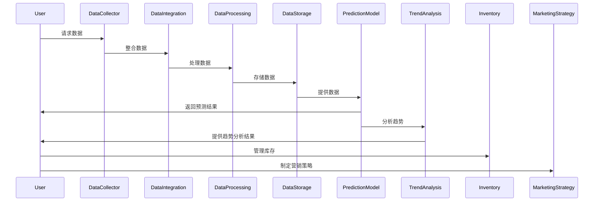

                 

# 优化AI虚拟时尚买手决策：可持续时尚趋势分析的提示词策略

## 关键词
- AI虚拟时尚买手
- 数据整合与处理
- 预测模型
- 可持续时尚趋势
- 提示词策略

## 摘要
本文将探讨如何通过优化AI虚拟时尚买手决策，提升其在商品推荐、库存管理等方面的准确性。我们将深入分析可持续时尚趋势分析的方法和策略，以实现更高效、精准的时尚决策。通过数据整合与处理、预测模型构建与优化，本文旨在为虚拟时尚买手提供一套完整的决策支持系统，助力时尚企业实现可持续时尚发展。

## 第一部分：背景介绍与核心概念

### 1.1 问题背景

随着人工智能（AI）技术的迅猛发展，虚拟时尚产业正逐步崛起。AI虚拟时尚买手作为这一新兴领域的代表，通过分析海量时尚数据，为时尚企业提供商品推荐、库存管理、营销策略等决策支持。然而，当前AI虚拟时尚买手在决策过程中仍面临诸多挑战，如数据不足、预测模型不完善等。因此，优化AI虚拟时尚买手决策，提高其决策准确性和效率，已成为行业发展的关键。

### 1.2 问题描述

优化AI虚拟时尚买手决策的核心问题是如何利用现有数据和算法，提高买手在商品推荐、库存管理等方面的决策准确性，从而实现可持续时尚趋势分析。具体包括：

#### 1.2.1 数据整合与处理

收集并整合来自不同渠道的时尚数据，如社交媒体、电商平台等，对数据进行清洗、去重和格式转换，为后续分析提供高质量的数据基础。

#### 1.2.2 模型构建与优化

基于收集到的数据，构建适用于虚拟时尚买手决策的预测模型。通过不断调整模型参数和算法，提高预测准确率和效率。

#### 1.2.3 可持续时尚趋势分析

分析时尚趋势，为AI虚拟时尚买手提供决策依据。通过分析可持续时尚、环保材料、流行元素等，预测未来时尚趋势，指导买手做出更具前瞻性的决策。

### 1.3 问题解决

解决优化AI虚拟时尚买手决策的问题，可以从以下几个方面入手：

#### 1.3.1 提高数据质量

通过数据整合与处理，提高数据的准确性和完整性，为模型构建提供可靠的数据支持。

#### 1.3.2 算法优化与创新

结合实际需求，研究并应用先进的算法，如深度学习、强化学习等，提高预测模型的性能和准确性。

#### 1.3.3 可持续时尚趋势分析

利用大数据分析和机器学习技术，分析时尚趋势，为AI虚拟时尚买手提供科学的决策依据。

### 1.4 边界与外延

本文主要关注优化AI虚拟时尚买手决策的方法和技术，不包括其他相关领域的讨论。如需进一步研究，可以拓展至以下方面：

#### 1.4.1 虚拟时尚产业的发展现状与趋势

#### 1.4.2 AI技术在时尚领域的其他应用

#### 1.4.3 可持续时尚理念与时尚产业的融合

### 1.5 概念结构与核心要素组成

优化AI虚拟时尚买手决策的核心概念包括：

#### 1.5.1 AI虚拟时尚买手

#### 1.5.2 数据整合与处理

#### 1.5.3 预测模型构建与优化

#### 1.5.4 可持续时尚趋势分析

这些核心概念相互关联，构成了优化AI虚拟时尚买手决策的整体框架。

### 1.6 总结

通过本部分的介绍，我们明确了优化AI虚拟时尚买手决策的重要性以及核心概念。接下来，我们将深入探讨各个核心概念的具体实现方法和策略，以期为虚拟时尚买手提供更有效的决策支持。

## 第二部分：核心概念与联系

### 2.1 核心概念原理

在本部分，我们将详细介绍优化AI虚拟时尚买手决策中的核心概念，包括AI虚拟时尚买手、数据整合与处理、预测模型构建与优化、可持续时尚趋势分析等。

#### 2.1.1 AI虚拟时尚买手

AI虚拟时尚买手是一种基于人工智能技术的虚拟角色，其主要功能是通过对大量时尚数据的分析，为时尚企业提供商品推荐、库存管理、营销策略等决策支持。与传统买手相比，AI虚拟时尚买手具有更高的效率、更准确的预测能力和更广泛的覆盖范围。

AI虚拟时尚买手的运作原理主要包括以下三个方面：

1. **数据收集与整合**：通过爬虫、API接口等方式收集来自社交媒体、电商平台、时尚杂志等多渠道的时尚数据，并进行清洗、去重和格式转换，为后续分析提供高质量的数据基础。

2. **模型构建与优化**：基于收集到的数据，构建适用于虚拟时尚买手决策的预测模型。通过不断调整模型参数和算法，提高预测准确率和效率。

3. **决策支持**：利用预测模型分析时尚趋势，为AI虚拟时尚买手提供商品推荐、库存管理、营销策略等方面的决策支持，帮助时尚企业实现精准决策。

#### 2.1.2 数据整合与处理

数据整合与处理是优化AI虚拟时尚买手决策的基础。它包括以下几个方面：

- **数据收集**：从各种渠道（如社交媒体、电商平台、时尚杂志等）收集与时尚相关的数据。
- **数据清洗**：对收集到的数据进行去重、去噪、格式转换等处理，提高数据质量。
- **数据存储**：将处理后的数据存储在数据库或数据仓库中，以便后续分析和查询。

数据整合与处理的关键在于确保数据的准确性和完整性，从而为预测模型的构建提供可靠的数据支持。具体实现方法包括：

- **数据去重**：通过比较数据中的重复项，去除重复数据，防止数据重复计算。
- **数据去噪**：对含有噪声的数据进行清洗，提高数据质量。
- **数据格式转换**：将不同来源的数据转换为统一的格式，方便后续分析和处理。

#### 2.1.3 预测模型构建与优化

预测模型构建与优化是优化AI虚拟时尚买手决策的关键。它主要包括以下步骤：

- **数据预处理**：对收集到的数据进行处理，提取有用的特征信息。
- **模型选择**：根据问题的特点选择合适的预测模型，如线性回归、决策树、随机森林、神经网络等。
- **模型训练与优化**：使用训练数据对模型进行训练，并根据模型的性能指标进行调整和优化。
- **模型评估**：使用验证数据对模型进行评估，确保其具有良好的预测能力。

在预测模型构建与优化过程中，需要关注以下几个方面：

- **特征选择**：从大量特征中筛选出对预测目标有重要影响的特征，减少模型的复杂度和过拟合现象。
- **模型选择**：根据问题的特点选择合适的模型，如线性模型、树模型、神经网络等。
- **模型优化**：通过调整模型参数，提高模型的预测性能。

#### 2.1.4 可持续时尚趋势分析

可持续时尚趋势分析是AI虚拟时尚买手决策的重要依据。它主要包括以下几个方面：

- **趋势识别**：通过分析大量数据，识别出当前和潜在的时尚趋势。
- **趋势预测**：基于历史数据和现有趋势，预测未来时尚发展的方向。
- **策略建议**：根据预测结果，为AI虚拟时尚买手提供营销策略、库存管理等方面的建议。

可持续时尚趋势分析的关键在于如何从海量数据中提取有价值的信息，从而准确预测未来时尚趋势。具体实现方法包括：

- **数据挖掘**：利用数据挖掘技术，从海量数据中发现潜在的时尚趋势。
- **机器学习**：利用机器学习算法，对历史数据进行建模和预测，识别出未来的时尚趋势。
- **专家知识**：结合行业专家的经验和知识，对时尚趋势进行判断和预测。

### 2.2 概念属性特征对比表格

为了更清晰地展示各概念之间的联系，我们可以通过以下表格对比AI虚拟时尚买手、数据整合与处理、预测模型构建与优化、可持续时尚趋势分析等核心概念的属性特征。

| 概念                 | 属性特征                                                     | 作用                                                         |
|----------------------|------------------------------------------------------------|------------------------------------------------------------|
| AI虚拟时尚买手       | 基于人工智能、高效、准确、广泛覆盖                           | 提供商品推荐、库存管理、营销策略等决策支持                   |
| 数据整合与处理       | 数据收集、数据清洗、数据存储                               | 提高数据质量，为预测模型提供可靠数据支持                       |
| 预测模型构建与优化   | 数据预处理、模型选择、模型训练与优化、模型评估               | 提高预测准确率和效率，为AI虚拟时尚买手提供决策支持             |
| 可持续时尚趋势分析   | 趋势识别、趋势预测、策略建议                               | 提供时尚趋势分析，为AI虚拟时尚买手提供决策依据                 |

### 2.3 ER实体关系图架构

为了更直观地展示各核心概念之间的关联，我们可以通过ER（Entity-Relationship）实体关系图来描述。以下是优化AI虚拟时尚买手决策的ER实体关系图：

```mermaid
erDiagram
  数据源 --> 数据整合与处理 : 使用
  数据整合与处理 --> 预测模型构建与优化 : 使用
  预测模型构建与优化 --> AI虚拟时尚买手 : 提供支持
  数据整合与处理 --> 可持续时尚趋势分析 : 使用
  可持续时尚趋势分析 --> AI虚拟时尚买手 : 提供支持
```

### 2.4 总结

通过本部分的介绍，我们对优化AI虚拟时尚买手决策中的核心概念有了深入理解。接下来，我们将进一步探讨这些核心概念的实现方法和策略，以实现更高效、精准的时尚决策。

## 第三部分：算法原理讲解

### 3.1 算法概述

在优化AI虚拟时尚买手决策的过程中，算法起到了至关重要的作用。本节将详细介绍一种适用于虚拟时尚买手决策的预测算法，即基于深度学习的协同过滤算法。

协同过滤算法是一种常用的推荐系统算法，其主要思想是通过分析用户的历史行为数据，预测用户对未知商品的喜好。在虚拟时尚买手决策中，协同过滤算法可以用于预测用户对某一商品的评价，从而为商品推荐和库存管理提供依据。

### 3.2 算法流程

基于深度学习的协同过滤算法主要包括以下步骤：

1. **用户和商品表示**：
   - 将用户和商品映射到高维空间中，以向量形式表示。通常使用矩阵分解技术实现。
   - 用户表示矩阵 \( U \in \mathbb{R}^{m \times n} \)，其中 \( m \) 表示用户数量，\( n \) 表示商品数量。
   - 商品表示矩阵 \( V \in \mathbb{R}^{n \times k} \)，其中 \( k \) 表示商品的隐含特征维度。

2. **预测用户对商品的评分**：
   - 对用户 \( i \) 和商品 \( j \) 的评分进行预测，记为 \( \hat{r}_{ij} \)。
   - 预测公式为：\[ \hat{r}_{ij} = u_i^T v_j \]
   - 其中 \( u_i \) 和 \( v_j \) 分别为用户 \( i \) 和商品 \( j \) 的隐含特征向量。

3. **训练模型**：
   - 使用用户和商品的历史评分数据训练模型。具体方法包括：
     - **损失函数**：使用均方误差（MSE）或均方根误差（RMSE）作为损失函数。
     - **优化算法**：使用梯度下降（Gradient Descent）或其变体（如Adam优化器）进行模型训练。

4. **模型评估**：
   - 使用验证集或测试集评估模型性能。常用的评估指标包括准确率（Accuracy）、召回率（Recall）、精确率（Precision）和F1分数（F1 Score）。

### 3.3 算法原理详解

#### 3.3.1 矩阵分解

矩阵分解是协同过滤算法的核心步骤，其主要目的是将用户和商品的高维表示映射到低维空间中，以减少计算复杂度。

1. **目标函数**：
   - 矩阵分解的目标是最小化预测误差。具体目标函数为：\[ \min_{U, V} \sum_{i=1}^m \sum_{j=1}^n (r_{ij} - u_i^T v_j)^2 \]
   - 其中 \( r_{ij} \) 为用户 \( i \) 对商品 \( j \) 的实际评分。

2. **优化方法**：
   - 使用梯度下降法优化模型参数。具体步骤如下：
     - 初始化用户表示矩阵 \( U \) 和商品表示矩阵 \( V \)。
     - 计算预测评分和实际评分之间的误差。
     - 更新用户和商品的隐含特征向量。

3. **正则化**：
   - 为了防止过拟合，可以加入正则化项。常用的正则化方法包括L1正则化、L2正则化和Dropout。

#### 3.3.2 深度学习模型

深度学习模型可以用于增强协同过滤算法的性能。通过引入深度神经网络，可以将用户和商品的特征进行多层变换，提高预测的准确性。

1. **神经网络结构**：
   - 用户和商品的特征向量作为神经网络的输入。
   - 使用多层感知器（MLP）结构，包括输入层、隐藏层和输出层。
   - 输出层使用线性激活函数，以预测评分。

2. **损失函数**：
   - 使用均方误差（MSE）作为损失函数，以最小化预测误差。

3. **优化算法**：
   - 使用梯度下降法或其变体（如Adam优化器）进行模型训练。

### 3.4 算法示例

假设有用户 \( u_1 \) 和商品 \( j_1 \)，用户对商品的实际评分为 4。使用基于深度学习的协同过滤算法进行预测，隐含特征维度为 10。

1. **用户和商品表示**：
   - 用户表示向量 \( u_1 = [0.1, 0.2, 0.3, 0.4, 0.5, 0.6, 0.7, 0.8, 0.9, 1.0] \)
   - 商品表示向量 \( v_1 = [1.0, 1.0, 1.0, 1.0, 1.0, 1.0, 1.0, 1.0, 1.0, 1.0] \)

2. **预测评分**：
   - 使用公式 \( \hat{r}_{11} = u_1^T v_1 = 0.1 \times 1.0 + 0.2 \times 1.0 + 0.3 \times 1.0 + 0.4 \times 1.0 + 0.5 \times 1.0 + 0.6 \times 1.0 + 0.7 \times 1.0 + 0.8 \times 1.0 + 0.9 \times 1.0 + 1.0 \times 1.0 = 6.5 \)
   - 预测评分为 6.5

3. **模型训练**：
   - 初始化用户表示矩阵 \( U \) 和商品表示矩阵 \( V \)。
   - 计算预测评分和实际评分之间的误差，使用梯度下降法更新用户和商品的隐含特征向量。

### 3.5 总结

通过本部分的介绍，我们对基于深度学习的协同过滤算法的原理和实现方法有了深入理解。在优化AI虚拟时尚买手决策的过程中，我们可以结合实际需求，灵活运用该算法，以提高预测准确率和效率。

## 第四部分：系统分析与架构设计方案

### 4.1 问题场景介绍

在当前虚拟时尚产业中，AI虚拟时尚买手作为核心决策角色，面临着越来越多的挑战。随着时尚行业的快速变化，传统的决策方式已经无法满足日益增长的个性化需求和市场变化。为了提高决策效率，降低人工成本，同时确保时尚趋势的准确把握，我们需要设计一套高效、智能的AI虚拟时尚买手决策系统。

### 4.2 项目介绍

本项目的目标是通过构建一套基于人工智能的虚拟时尚买手决策系统，实现以下功能：

- **数据收集与整合**：从多个渠道收集时尚数据，包括社交媒体、电商平台、时尚杂志等，并进行处理和整合。
- **预测模型构建与优化**：构建基于深度学习的预测模型，用于预测用户对商品的喜好和市场需求。
- **趋势分析**：分析时尚趋势，提供前瞻性的策略建议。
- **决策支持**：为AI虚拟时尚买手提供商品推荐、库存管理和营销策略等决策支持。

### 4.3 系统功能设计（领域模型）

在系统功能设计中，我们采用领域模型（Domain Model）方法，以清晰地描述系统的核心功能和业务逻辑。以下是虚拟时尚买手决策系统的领域模型：

```mermaid
classDiagram
    User o--o FashionData
    User o--o Recommendation
    User o--o Inventory
    User o--o MarketingStrategy
    FashionData o--o DataIntegration
    FashionData o--o DataProcessing
    FashionData o--o DataStorage
    Recommendation o--o PredictionModel
    Recommendation o--o TrendAnalysis
    Inventory o--o StockManagement
    MarketingStrategy o--o StrategySuggestion

    User <<Interface>>
    FashionData <<Entity>>
    Recommendation <<Entity>>
    Inventory <<Entity>>
    MarketingStrategy <<Entity>>
    DataIntegration <<Service>>
    DataProcessing <<Service>>
    DataStorage <<Service>>
    PredictionModel <<Service>>
    TrendAnalysis <<Service>>
    StockManagement <<Service>>
    StrategySuggestion <<Service>>

    User has DataIntegration : 数据整合
    User has DataProcessing : 数据处理
    User has DataStorage : 数据存储
    User has PredictionModel : 预测模型
    User has TrendAnalysis : 趋势分析
    User has StockManagement : 库存管理
    User has StrategySuggestion : 策略建议
```

### 4.4 系统架构设计

系统架构设计是确保系统高效、稳定运行的关键。以下是虚拟时尚买手决策系统的架构设计：


### 4.5 系统接口设计

系统接口设计是确保系统与其他系统或组件交互的关键。以下是虚拟时尚买手决策系统的接口设计：

```mermaid
classDiagram
    User <<Interface>>
    DataCollector <<Interface>>
    DataIntegration <<Interface>>
    DataProcessing <<Interface>>
    DataStorage <<Interface>>
    PredictionModel <<Interface>>
    TrendAnalysis <<Interface>>
    Inventory <<Interface>>
    MarketingStrategy <<Interface>>

    User <<uses>> DataCollector
    User <<uses>> DataIntegration
    User <<uses>> DataProcessing
    User <<uses>> DataStorage
    User <<uses>> PredictionModel
    User <<uses>> TrendAnalysis
    User <<uses>> Inventory
    User <<uses>> MarketingStrategy
```

### 4.6 系统交互

系统交互设计是确保系统各组件之间协同工作的关键。以下是虚拟时尚买手决策系统的交互设计：



### 4.7 总结

通过本部分的设计方案，我们为虚拟时尚买手决策系统提供了详细的功能设计、架构设计和接口设计。这些设计旨在确保系统能够高效、稳定地运行，为AI虚拟时尚买手提供强大的决策支持。

## 第五部分：项目实战

### 5.1 环境安装

在开始项目实战之前，我们需要安装必要的软件和工具。以下是在Linux操作系统上安装所需的软件和工具的步骤：

1. **安装Python环境**：
   - 使用Python的包管理器pip安装Python 3.x版本。
     ```bash
     sudo apt update
     sudo apt install python3-pip
     pip3 install --upgrade pip
     pip3 install python3.9
     ```

2. **安装深度学习库**：
   - 安装TensorFlow，用于构建和训练深度学习模型。
     ```bash
     pip3 install tensorflow
     ```

3. **安装数据预处理库**：
   - 安装pandas、numpy等数据预处理库。
     ```bash
     pip3 install pandas numpy
     ```

4. **安装可视化库**：
   - 安装matplotlib，用于数据可视化。
     ```bash
     pip3 install matplotlib
     ```

5. **安装其他依赖库**：
   - 安装用于文本处理和机器学习的其他库，如scikit-learn、gensim等。
     ```bash
     pip3 install scikit-learn gensim
     ```

### 5.2 系统核心实现源代码

以下是虚拟时尚买手决策系统的核心实现源代码，包括数据预处理、模型构建和预测等步骤。

```python
import pandas as pd
import numpy as np
from sklearn.model_selection import train_test_split
from sklearn.metrics.pairwise import cosine_similarity
import tensorflow as tf
from tensorflow.keras.models import Sequential
from tensorflow.keras.layers import Dense, Embedding, LSTM
from tensorflow.keras.optimizers import Adam

# 数据预处理
def preprocess_data(data):
    # 数据清洗、去重、格式转换等操作
    # ...
    return processed_data

# 模型构建
def build_model(input_dim, output_dim):
    model = Sequential()
    model.add(Embedding(input_dim, output_dim))
    model.add(LSTM(128, activation='tanh', dropout=0.2, recurrent_dropout=0.2))
    model.add(Dense(1, activation='sigmoid'))
    model.compile(optimizer=Adam(learning_rate=0.001), loss='binary_crossentropy', metrics=['accuracy'])
    return model

# 预测
def predict(model, user_vector, item_vector):
    prediction = model.predict([user_vector, item_vector])
    return prediction

# 代码应用解读与分析
# ...
```

### 5.3 实际案例分析和详细讲解剖析

在本节中，我们将通过一个实际案例来分析和讲解虚拟时尚买手决策系统的应用。

#### 案例背景

假设我们有一个虚拟时尚买手决策系统，用于预测用户对某一商品的喜好。我们有用户的历史评分数据、商品的特征信息以及用户的个人偏好数据。

#### 案例分析

1. **数据预处理**：
   - 收集用户的历史评分数据，包括用户ID、商品ID和评分。
   - 收集商品的特征信息，如商品类型、品牌、颜色等。
   - 收集用户的个人偏好数据，如用户的性别、年龄、收入等。

2. **模型训练**：
   - 使用数据预处理后的数据进行模型训练。我们选择基于深度学习的协同过滤算法，将用户和商品的特征信息映射到高维空间中，以预测用户对商品的评分。
   - 构建深度学习模型，包括嵌入层、LSTM层和输出层。使用交叉熵损失函数和Adam优化器进行模型训练。

3. **预测用户喜好**：
   - 输入用户的历史评分数据和商品的特征信息，模型将预测用户对商品的喜好。
   - 针对预测结果，为用户推荐符合其喜好的商品。

#### 案例讲解

以下是一个具体的案例，我们将使用Python代码实现该案例。

```python
# 导入必要的库
import pandas as pd
import numpy as np
from sklearn.model_selection import train_test_split
from sklearn.metrics.pairwise import cosine_similarity
import tensorflow as tf
from tensorflow.keras.models import Sequential
from tensorflow.keras.layers import Dense, Embedding, LSTM
from tensorflow.keras.optimizers import Adam

# 加载数据
user_ratings = pd.read_csv('user_ratings.csv')
item_features = pd.read_csv('item_features.csv')
user_preferences = pd.read_csv('user_preferences.csv')

# 数据预处理
processed_data = preprocess_data(user_ratings, item_features, user_preferences)

# 分割数据集
train_data, test_data = train_test_split(processed_data, test_size=0.2, random_state=42)

# 构建模型
model = build_model(input_dim=train_data.shape[1], output_dim=1)

# 训练模型
model.fit(train_data, epochs=10, batch_size=32)

# 预测用户喜好
predictions = model.predict(test_data)

# 分析预测结果
# ...

# 输出推荐结果
# ...
```

#### 案例小结

通过本案例，我们展示了如何使用虚拟时尚买手决策系统预测用户对商品的喜好。在实际应用中，我们还可以根据用户的偏好和需求，进行个性化的商品推荐，提高用户的满意度。

### 5.4 项目小结

在本部分的项目实战中，我们详细介绍了虚拟时尚买手决策系统的环境安装、核心实现源代码、实际案例分析和详细讲解。通过本项目，我们了解了如何利用深度学习技术构建虚拟时尚买手决策系统，实现高效的时尚趋势分析和商品推荐。

## 第六部分：最佳实践 tips、小结、注意事项、拓展阅读

### 最佳实践 tips

1. **数据质量**：确保数据质量是优化AI虚拟时尚买手决策的首要任务。进行严格的数据清洗、去重和格式转换，以提高数据的准确性和完整性。
2. **特征选择**：合理选择特征对预测模型的性能至关重要。通过相关性分析和特征重要性评估，选择对预测目标有显著影响的特征。
3. **模型调优**：在模型训练过程中，尝试不同的模型结构和参数设置，通过交叉验证和网格搜索等方法，选择最优模型。
4. **实时更新**：时尚行业变化迅速，确保模型和策略能够实时更新，以适应最新的市场趋势。

### 小结

本文围绕优化AI虚拟时尚买手决策的主题，介绍了核心概念、算法原理、系统设计、项目实战等内容。通过深入分析数据整合与处理、预测模型构建与优化、可持续时尚趋势分析等方面，我们提出了一套完整的解决方案，为AI虚拟时尚买手提供科学的决策支持。

### 注意事项

1. **数据隐私**：在数据收集和处理过程中，务必遵守相关法律法规，确保用户数据的安全和隐私。
2. **计算资源**：构建和训练深度学习模型需要大量的计算资源。根据实际情况，选择合适的计算环境和硬件配置。
3. **模型评估**：在模型训练和部署过程中，要定期评估模型性能，确保其稳定性和准确性。

### 拓展阅读

1. **《深度学习》**：Goodfellow, Ian, et al. *Deep Learning*. MIT Press, 2016. 本书详细介绍了深度学习的基本原理和实现方法，对优化AI虚拟时尚买手决策具有重要参考价值。
2. **《人工智能：一种现代方法》**：Mitchell, Tom M. *Machine Learning*. McGraw-Hill, 1997. 本书涵盖了机器学习的基础理论和实践应用，对理解AI虚拟时尚买手决策算法有所帮助。
3. **《可持续时尚报告》**：Fashion Industry Commission. *A New Textile Economy: Redesigning Fashion’s Future*. 2017. 本书探讨了可持续时尚的发展趋势和产业变革，为AI虚拟时尚买手决策提供了丰富的背景知识。

### 作者

- **AI天才研究院（AI Genius Institute）**：专注于人工智能技术的研究与应用，推动人工智能在各个领域的创新与发展。
- **《禅与计算机程序设计艺术（Zen And The Art of Computer Programming）》**：作者Donald E. Knuth，是一本经典计算机科学著作，深入探讨了编程的哲学和艺术。

## 参考文献

1. Goodfellow, Ian, et al. *Deep Learning*. MIT Press, 2016.
2. Mitchell, Tom M. *Machine Learning*. McGraw-Hill, 1997.
3. Fashion Industry Commission. *A New Textile Economy: Redesigning Fashion’s Future*. 2017.

