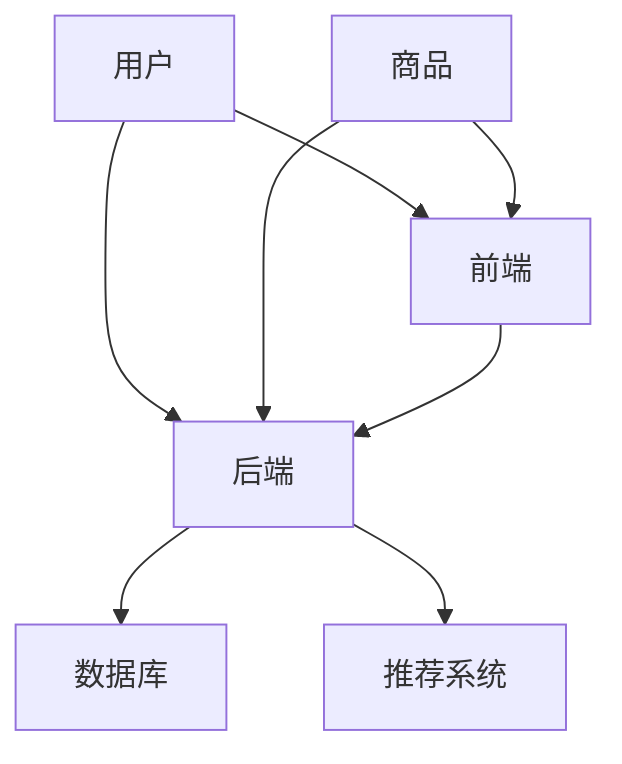
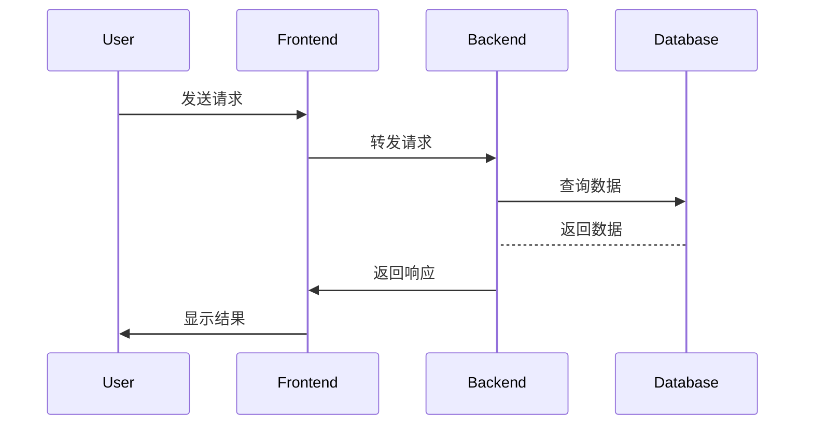

                 


### 第1章: 人工智能与虚拟时尚展厅概述

#### 1.1 问题背景与问题描述

在当今数字时代，人工智能（AI）技术正以前所未有的速度发展，并开始深入影响各个行业。时尚产业作为一个具有高度创新性和市场潜力的领域，自然也不例外。虚拟时尚展厅作为一种新兴的展示形式，结合了人工智能和虚拟现实（VR）技术，为消费者提供了一个沉浸式和互动性的购物体验。

虚拟时尚展厅的出现，源于消费者对个性化和沉浸式体验的需求日益增长。传统的线下时尚购物方式往往受限于时间和空间的限制，而虚拟时尚展厅则打破了这些限制，使消费者可以随时随地浏览和试穿各种时尚产品。同时，AI技术的引入，使得虚拟时尚展厅能够根据消费者的偏好和需求，提供个性化的推荐和互动体验。

然而，尽管虚拟时尚展厅具有巨大的潜力，目前仍存在一些问题。首先，用户体验设计不佳可能导致用户参与度低。其次，内容个性化不足，无法充分满足消费者的个性化需求。此外，技术实现上，虚拟现实和AI的集成仍面临挑战，需要更加高效和精准的技术手段来优化用户体验。

本章节旨在介绍人工智能和虚拟时尚展厅的背景，明确问题的描述，并探讨其解决的途径和研究的边界。通过理解这些问题，我们可以为后续章节的深入探讨打下坚实的基础。

#### 1.2 核心概念与边界

##### 1.2.1 人工智能的基本概念

人工智能（AI）是指由计算机实现的智能行为，它模仿人类或其他生物的智能，使其能够执行复杂任务，如推理、学习和决策。AI可以分为两大类：弱AI和强AI。

- **弱AI**：也称为专用AI，专注于执行特定任务，如语音识别、图像处理和游戏。弱AI不具备通用性，无法进行跨领域的任务。
  
- **强AI**：拥有广泛认知能力，类似于人类智能，能够理解、学习和适应复杂环境。强AI目前仍处于理论阶段，尚未实现。

AI的关键技术包括机器学习（ML）、深度学习（DL）和自然语言处理（NLP）。机器学习是一种通过数据和算法让计算机自主学习的技术。深度学习则是机器学习的一个子领域，通过多层神经网络来模拟人类大脑的学习过程。自然语言处理则专注于使计算机理解和生成人类语言。

##### 1.2.2 虚拟现实技术的基础知识

虚拟现实（VR）是一种通过计算机生成的模拟环境，使用户能够沉浸在虚拟世界中。VR的关键技术包括：

- **头戴显示器（HMD）**：用户佩戴的设备，用于显示虚拟环境。
- **追踪系统**：用于跟踪用户的位置和动作，以提供沉浸感和互动性。
- **交互设备**：如手柄、手套等，用于与虚拟环境进行交互。

VR的应用领域广泛，包括娱乐、教育和医疗等。在时尚产业中，VR技术被用于虚拟试衣、展览和设计等领域。

##### 1.2.3 沉浸式体验的定义与特征

沉浸式体验是指用户完全投入到虚拟环境中，感觉仿佛自己真正置身其中。其主要特征包括：

- **视觉沉浸**：用户看到的虚拟环境与真实环境相似，细节丰富。
- **听觉沉浸**：通过头戴显示器或耳机提供立体声效果，增强用户体验。
- **触觉反馈**：使用特殊的设备提供触觉反馈，如震动和温度，增加沉浸感。
- **交互性**：用户可以与虚拟环境进行交互，改变环境或操作虚拟对象。

沉浸式体验在虚拟时尚展厅中至关重要，它能够提供真实的购物体验，提高用户的参与度和满意度。

##### 1.3 关键要素与架构

虚拟时尚展厅的关键要素包括：

- **用户**：体验者，他们的需求和偏好决定了展厅的设计。
- **虚拟环境**：通过VR技术生成的展示空间，包括服装、配饰和场景等。
- **交互界面**：用户与虚拟环境进行交互的界面，包括触摸屏、手势和语音等。
- **推荐系统**：基于用户的偏好和购物历史，提供个性化的推荐。
- **AI算法**：用于分析用户行为和生成推荐，优化用户体验。

虚拟时尚展厅的系统架构通常包括：

- **前端**：用户交互界面，使用VR设备和交互设备。
- **后端**：处理用户数据、推荐算法和服务器，通常使用云计算平台。
- **数据库**：存储用户数据、商品信息和虚拟环境数据。

通过理解这些关键要素和系统架构，我们可以更好地设计、开发和优化虚拟时尚展厅，提供高质量的沉浸式体验。

### 1.3.1 AI在虚拟时尚中的应用

人工智能在虚拟时尚展厅中的应用主要体现在以下几个方面：

- **个性化推荐**：AI算法可以根据用户的购物历史、浏览行为和偏好，提供个性化的商品推荐，从而提高用户的满意度和转化率。

- **虚拟试衣**：通过计算机视觉和深度学习技术，AI能够分析用户的体型和面部特征，生成虚拟试衣效果。用户可以尝试各种服装，无需实际试穿，节省时间和成本。

- **互动体验**：AI可以模拟真实的人类互动，如导购员的建议和互动，提供更加真实和个性化的购物体验。

- **时尚设计**：AI可以根据用户的需求和趋势，生成新的时尚设计，为设计师提供灵感。

- **市场分析**：AI可以分析用户的行为数据和市场趋势，帮助时尚品牌进行市场决策和产品定位。

通过AI的应用，虚拟时尚展厅不仅能够提供更加个性化的服务，还能够通过大数据分析和智能算法，实现更高效的运营和更精准的市场定位。

### 1.3.2 虚拟时尚展厅的系统架构

虚拟时尚展厅的系统架构是保证其功能实现和用户体验的关键。一个典型的虚拟时尚展厅系统通常包括以下主要组件：

1. **前端交互层**：这是用户直接交互的部分，通常使用VR头盔、手柄、触摸屏等设备。前端交互层的主要功能是提供用户与虚拟环境之间的互动接口，包括：

   - **3D虚拟环境渲染**：使用图形处理单元（GPU）渲染虚拟时尚展厅的3D场景，实现逼真的视觉体验。
   - **用户输入处理**：接收用户的输入，如手势、语音等，并将其转换为虚拟环境中的操作。
   - **用户界面**：显示商品信息、购物车、推荐列表等，使用户能够轻松浏览和互动。

2. **后端数据处理层**：这是系统的核心部分，负责处理用户数据、推荐算法和服务器交互。主要功能包括：

   - **用户数据分析**：收集并分析用户的购物行为、偏好和互动数据，为个性化推荐提供依据。
   - **推荐算法实现**：利用机器学习和深度学习算法，为用户生成个性化的商品推荐。
   - **服务器接口**：处理用户请求，提供商品信息、虚拟环境数据和推荐结果。

3. **数据库层**：存储系统所需的各种数据，包括用户数据、商品信息、虚拟环境数据等。数据库的设计需要考虑数据的安全性、一致性和可扩展性。

4. **AI算法层**：这是系统的智能核心，包括：

   - **图像处理和识别**：用于识别用户的体型、面部特征和商品图像。
   - **自然语言处理**：用于处理用户的语音和文本输入，提供智能交互。
   - **深度学习模型**：用于生成虚拟试衣效果、预测用户偏好和优化系统性能。

通过这些组件的协同工作，虚拟时尚展厅能够为用户提供高度个性化的沉浸式购物体验。系统架构设计需要充分考虑性能、稳定性和用户体验，以确保系统能够稳定运行并满足用户需求。

### 1.3.3 Prompt Words的核心作用

Prompt Words，即提示词，是虚拟时尚展厅中至关重要的组成部分，它们在用户与系统互动中起着核心作用。Prompt Words的设计和选择直接影响用户体验的质量和效率。

首先，Prompt Words能够引导用户进行特定的互动操作，例如“点击此处试穿”、“选择您的尺寸”或“说出您的需求”。这些提示词清晰明确，有助于用户快速理解并执行操作，减少用户在虚拟环境中的困惑和挫折感。

其次，Prompt Words可以用来优化用户的购物体验。例如，系统可以根据用户的行为数据，动态调整提示词的内容和呈现方式，从而提供更加个性化的购物建议。比如，当用户在浏览某一类商品时，系统可以提示“您可能还喜欢这些款式”，从而引导用户进行更多探索和尝试。

此外，Prompt Words还在内容个性化方面发挥着重要作用。通过分析用户的偏好和历史记录，系统可以生成针对性的提示词，例如“根据您的喜好，我们为您推荐这款时尚单品”。这种个性化的提示不仅能够提高用户的参与度，还能够增强用户的购物满意度。

总之，Prompt Words在虚拟时尚展厅中不仅是用户互动的桥梁，更是优化用户体验的关键要素。合理设计和使用提示词，能够显著提升用户的沉浸感和满意度，为虚拟时尚展厅的成功提供有力保障。

### 1.4 虚拟时尚展厅的未来发展趋势

虚拟时尚展厅作为新兴的购物体验形式，正在不断演进和扩展其应用范围。未来，虚拟时尚展厅的发展将呈现以下几个显著趋势：

首先，技术融合将成为关键驱动力。随着人工智能、虚拟现实和增强现实（AR）等技术的不断进步，虚拟时尚展厅将实现更加真实和互动的购物体验。例如，利用AR技术，用户可以无需穿戴VR设备，通过智能手机或平板电脑即可进入虚拟时尚展厅，实现随时随地的购物。

其次，个性化体验将进一步深化。通过大数据和机器学习技术，虚拟时尚展厅将能够更加精准地捕捉用户的需求和行为，提供高度个性化的购物建议和推荐。例如，基于用户的购物历史和偏好，系统可以自动调整展厅布局、推荐商品和互动内容，从而实现个性化的沉浸式购物体验。

第三，社交互动功能将更加丰富。虚拟时尚展厅不仅是一个展示和购物的地方，也将成为用户互动和分享的平台。通过社交功能，用户可以邀请朋友共同参观展厅，分享购物心得，甚至参与线上时尚活动和比赛。这种社交互动将极大地提升用户的参与度和忠诚度。

此外，可持续发展将成为虚拟时尚展厅的重要方向。随着消费者对环保和可持续时尚的关注日益增加，虚拟时尚展厅可以通过减少实体店铺的运营成本和碳排放，实现更加环保和可持续的发展。同时，通过数字化设计和生产，虚拟时尚展厅还可以提供更少的浪费和更高的资源利用效率。

最后，跨平台整合将是未来的一个重要趋势。虚拟时尚展厅将不仅仅局限于特定的设备或平台，而是通过云端技术实现跨平台、跨设备的无缝体验。用户可以在不同的设备上自由切换，保持一致的购物体验。

总之，虚拟时尚展厅的未来发展将是在技术驱动下，以用户体验为中心，实现更加个性化、互动化和可持续的购物体验。通过不断的技术创新和应用，虚拟时尚展厅将重塑时尚产业，为消费者带来前所未有的购物体验。

### 总结

本章介绍了人工智能与虚拟时尚展厅的背景、核心概念以及关键要素和系统架构。首先，我们探讨了人工智能的基本概念，包括弱AI和强AI，以及其关键技术如机器学习、深度学习和自然语言处理。随后，我们详细阐述了虚拟现实技术的基础知识，包括头戴显示器、追踪系统和交互设备，以及沉浸式体验的定义和特征。接着，我们讨论了虚拟时尚展厅的关键要素和系统架构，包括前端交互层、后端数据处理层、数据库层和AI算法层。最后，我们分析了Prompt Words在虚拟时尚展厅中的核心作用，并展望了虚拟时尚展厅的未来发展趋势。

通过对这些背景和核心概念的理解，我们为后续章节的深入探讨奠定了基础，特别是在优化AI虚拟时尚展厅的策略方面。希望读者能够更好地把握本章内容，为接下来的学习做好准备。

## 第2章: 核心概念详解

### 2.1 人工智能原理与算法

人工智能（AI）的核心在于让计算机模拟人类智能，以实现自动化决策和复杂任务。在这一部分，我们将深入探讨AI的基本原理、核心技术以及各类算法，为后续的讨论提供理论基础。

#### 2.1.1 机器学习基础

机器学习（ML）是AI的重要组成部分，通过算法让计算机从数据中学习规律并做出预测或决策。机器学习可以分为监督学习、无监督学习和强化学习。

- **监督学习**：在这种方法中，计算机通过已标记的数据进行学习。常见的算法包括线性回归、逻辑回归、决策树、随机森林和神经网络。

- **无监督学习**：计算机在没有标记数据的情况下，通过自身探索数据结构。聚类、降维和关联规则挖掘是常见的无监督学习算法。

- **强化学习**：计算机通过与环境的交互进行学习，以实现最佳行动策略。常见的算法包括Q-learning和深度确定性策略梯度（DDPG）。

#### 2.1.2 深度学习框架

深度学习（DL）是机器学习的一个子领域，通过多层神经网络（MLN）来模拟人类大脑的学习过程。深度学习在图像识别、语音识别和自然语言处理等领域取得了显著成果。

- **神经网络基础**：深度学习的基础是神经网络，包括输入层、隐藏层和输出层。神经元之间的连接权重通过学习进行调整，以实现函数逼近。

- **卷积神经网络（CNN）**：用于图像处理，通过卷积层、池化层和全连接层提取图像特征。

- **循环神经网络（RNN）**：用于序列数据，如时间序列分析、语音识别和机器翻译。常见的RNN包括LSTM和GRU。

- **生成对抗网络（GAN）**：用于生成数据，通过生成器和判别器的对抗训练生成高质量图像。

#### 2.1.3 自然语言处理

自然语言处理（NLP）是AI的重要分支，专注于使计算机理解和生成人类语言。NLP在搜索引擎、机器翻译、情感分析和文本生成等领域有广泛应用。

- **词向量表示**：通过Word2Vec、GloVe等模型将词语映射为向量，以进行文本处理。

- **序列到序列模型**：如编码器-解码器（Seq2Seq）模型，用于机器翻译和对话系统。

- **预训练语言模型**：如BERT、GPT等，通过在大量无标签文本上进行预训练，然后微调到特定任务上，取得显著效果。

通过深入理解机器学习、深度学习和自然语言处理的基本原理，我们可以为后续章节中的虚拟时尚展厅设计提供有力的技术支持。

### 2.2 虚拟现实技术与沉浸式体验

虚拟现实（VR）技术和沉浸式体验在虚拟时尚展厅中扮演着至关重要的角色。它们不仅能够提供逼真的视觉和听觉体验，还能通过交互设计增强用户的沉浸感和参与度。在这一节中，我们将详细探讨虚拟现实技术的演进、沉浸式体验的设计原则及其在虚拟时尚展厅中的应用。

#### 2.2.1 VR技术的演进

虚拟现实技术的发展经历了几个关键阶段：

- **早期VR**：20世纪80年代，VR技术开始萌芽，但受限于硬件性能和成本，应用范围有限。早期的VR设备包括简单的头戴显示器（HMD）和手柄。

- **增强现实（AR）与VR的融合**：21世纪初，随着智能手机和移动设备的普及，增强现实（AR）逐渐崭露头角。AR技术通过在现实环境中叠加虚拟元素，实现了更多的互动体验。

- **现代VR**：近年来，VR技术取得了显著进展，尤其是高性能显卡和GPU的普及，使得VR设备的性能和画质大幅提升。现代VR设备如Oculus Rift、HTC Vive和 PlayStation VR等，提供了更加沉浸和互动的体验。

#### 2.2.2 沉浸式体验的设计

沉浸式体验是指用户完全投入到虚拟环境中，感觉仿佛自己真正置身其中。设计沉浸式体验需要考虑以下几个方面：

- **视觉沉浸**：高质量的图像渲染是视觉沉浸的基础。VR设备通常采用高分辨率显示器和低延迟的图像传输技术，以提供逼真的视觉效果。例如，现代VR头戴显示器可以达到4K分辨率，使得用户能够清晰看到虚拟环境中的每一个细节。

- **听觉沉浸**：通过立体声耳机或头戴显示器内置的扬声器，提供3D音效，增强用户的沉浸感。例如，当用户在虚拟展厅中走动时，背景音乐和周围环境的音效会根据位置变化而调整。

- **触觉反馈**：触觉反馈设备如手套、背心等，可以模拟触觉感受，如震动、温度等，增强用户的互动体验。例如，当用户触摸虚拟服装时，可以通过触觉反馈设备感受到柔软或光滑的质感。

- **交互性**：设计直观且自然的交互方式，使用户能够轻松与虚拟环境进行互动。例如，通过手势识别、语音控制或手柄操作，用户可以浏览商品、试穿服装或与其他用户互动。

#### 2.2.3 VR技术在虚拟时尚展厅中的应用

在虚拟时尚展厅中，VR技术主要用于以下几个方面：

- **虚拟试衣**：通过计算机视觉和深度学习技术，用户可以在虚拟环境中试穿各种服装。系统会分析用户的体型、面部特征，并实时调整虚拟试衣效果，使试衣体验更加真实。

- **个性化推荐**：基于用户的购物历史和行为数据，VR系统可以提供个性化的商品推荐。例如，当用户浏览某件商品时，系统可以提示“您可能还喜欢这些款式”，引导用户进行更多探索。

- **互动展示**：通过虚拟现实技术，时尚品牌可以设计独特的互动展示，如虚拟走秀、艺术装置等，增强用户体验和品牌形象。

- **市场调研**：虚拟时尚展厅可以作为市场调研的工具，通过分析用户的行为数据，了解用户的偏好和购买习惯，为产品开发和市场营销提供数据支持。

总之，虚拟现实技术和沉浸式体验在虚拟时尚展厅中的应用，为用户提供了高度个性化的购物体验，同时为时尚品牌提供了创新的展示和营销方式。通过不断的技术创新和应用，虚拟时尚展厅将继续为消费者带来更加丰富和互动的购物体验。

### 2.3 Prompt Words的定义与功能

Prompt Words，即提示词，是虚拟时尚展厅中用于引导用户互动和优化用户体验的关键元素。提示词通过简洁明了的语言，向用户传达操作指令、互动建议和个性化信息，从而提高用户的参与度和满意度。在本节中，我们将详细讨论Prompt Words的定义、功能和应用场景。

#### 2.3.1 提示词的定义

Prompt Words是指为引导用户在虚拟时尚展厅中进行特定操作或行为而设计的简短文本。这些文本通常包含指令性语言，指示用户采取某种行动或进行某种互动。例如，“点击此处试穿新装”、“说出您的尺寸以获取个性化推荐”或“探索新品区，发现您的风格”。

#### 2.3.2 提示词的功能

提示词在虚拟时尚展厅中具有以下核心功能：

- **引导互动**：提示词能够明确指示用户如何与虚拟环境互动，例如点击、拖动、选择等。这种指导性语言有助于用户快速理解并执行操作，减少用户在虚拟环境中的困惑和挫折感。

- **提供个性化建议**：基于用户的偏好和行为数据，提示词可以提供个性化的购物建议。例如，当用户在浏览某件商品时，系统可以提示“根据您的喜好，我们为您推荐这款时尚单品”，从而引导用户进行更多探索。

- **增强互动体验**：提示词不仅提供操作指导，还可以增强用户的互动体验。通过使用生动的语言、趣味性的表达或情感化的描述，提示词可以激发用户的兴趣和参与感，使购物过程更加愉悦。

- **优化用户流程**：通过合理安排和设计提示词，可以优化用户的购物流程，减少不必要的操作步骤，提高用户的效率和满意度。例如，在用户完成某项操作后，系统可以提示“感谢您的参与，现在为您推荐更多新品”，从而引导用户继续购物。

#### 2.3.3 提示词的应用场景

以下是在虚拟时尚展厅中一些常见的应用场景：

- **虚拟试衣**：在用户选择试穿新装时，系统可以提示“点击‘试穿’按钮，体验您的完美造型”。这样的提示词既明确了操作步骤，又增强了用户的参与感。

- **互动展示**：在虚拟时尚走秀或艺术装置展示时，系统可以提示“摇动手机，感受虚拟模特的精彩表演”。这种互动提示不仅增加了趣味性，还提高了用户的沉浸感。

- **购物推荐**：当用户在浏览商品时，系统可以提示“根据您的喜好，我们为您推荐以下新品”，从而引导用户进行更多探索。

- **用户反馈**：在用户完成购物后，系统可以提示“感谢您的购物体验，请您评价我们的服务”，从而收集用户反馈，优化服务质量。

通过在虚拟时尚展厅中合理应用提示词，可以显著提高用户的互动体验和满意度，为虚拟时尚展厅的成功提供有力支持。

### 2.4 用户体验设计原则

在虚拟时尚展厅的设计中，用户体验（UX）是至关重要的。一个良好的用户体验能够提升用户满意度、增加参与度，并最终促进销售。以下是一些关键的用户体验设计原则，旨在为用户创造直观、高效且愉悦的购物体验。

#### 2.4.1 简洁明了

简洁性是用户体验设计中的核心原则之一。在虚拟时尚展厅中，界面应避免过度复杂，操作应尽可能直观。通过减少不必要的元素和功能，用户能够更快地找到所需信息并完成任务。

- **关键操作明确**：确保用户能够迅速找到试衣、购物车和结账等核心功能。使用清晰且显著的按钮和图标，以便用户一目了然。

- **简洁的导航**：设计直观的导航系统，使用户能够轻松浏览不同区域和功能。导航栏、标签和搜索功能应易于访问和操作。

#### 2.4.2 个性化

个性化的体验能够满足用户的个性化需求，提高用户的参与感和满意度。通过分析用户的历史行为和偏好，虚拟时尚展厅可以提供个性化的推荐和互动内容。

- **个性化推荐**：根据用户的购物历史和浏览记录，系统可以推荐相关的商品和活动。例如，“根据您的喜好，我们为您推荐以下新品”。

- **个性化内容**：在虚拟展厅中，根据用户的性别、年龄、风格偏好等，展示个性化的服装和场景。例如，当用户浏览女装时，系统可以突出展示女性服装。

#### 2.4.3 交互性

交互性是增强用户体验的关键。通过提供多种交互方式，用户能够更加自然地与虚拟环境进行互动，获得更加丰富的体验。

- **手势识别**：使用手势识别技术，用户可以通过简单的手势操作浏览商品、切换场景等。例如，用户可以挥手或手势选择不同的服装款式。

- **语音控制**：语音控制技术使得用户可以通过语音指令与虚拟展厅互动，如“展示更多黑色服装”或“播放背景音乐”。

#### 2.4.4 反馈机制

及时的反馈能够帮助用户了解自己的操作结果，提高互动的流畅性和满意度。虚拟时尚展厅应设计清晰且及时的反馈机制。

- **即时反馈**：当用户完成某项操作时，系统应立即提供反馈，例如“已加入购物车”或“试衣成功”。这种即时反馈能够增强用户的信心和满意度。

- **错误反馈**：当用户操作出现错误时，系统应提供明确的错误信息和解决方案，帮助用户快速纠正错误。

#### 2.4.5 可访问性

可访问性设计确保所有用户，包括有特殊需求的人群，都能够顺利使用虚拟时尚展厅。设计时应考虑以下因素：

- **可读性**：使用清晰易读的字体和颜色对比，确保用户能够轻松阅读信息。

- **辅助功能**：提供屏幕阅读器、语音导航等功能，帮助视障或有其他障碍的用户使用虚拟展厅。

通过遵循这些用户体验设计原则，虚拟时尚展厅能够提供高效、愉悦且个性化的购物体验，从而提高用户满意度和品牌忠诚度。

### 2.5 虚拟时尚展厅的用户体验设计流程

为了设计一个成功的虚拟时尚展厅，用户体验（UX）设计流程至关重要。这一流程不仅确保展厅的功能和界面符合用户需求，还能提升用户满意度。以下是虚拟时尚展厅用户体验设计的详细流程：

#### 2.5.1 需求分析

**第一步：确定目标用户群体**

首先，需要明确虚拟时尚展厅的目标用户群体。这包括用户的年龄、性别、职业、购物偏好等。通过用户调研、问卷调查和市场分析，收集用户需求和偏好，为后续设计提供数据支持。

**第二步：了解用户需求**

深入了解用户在虚拟时尚展厅中期望实现的功能和互动体验。例如，用户可能希望尝试虚拟试衣、浏览个性化推荐、参与互动活动等。了解这些需求有助于确定设计方向。

#### 2.5.2 竞品分析

**第一步：研究竞争对手**

分析主要竞争对手的虚拟时尚展厅，了解其设计特点、功能和用户体验。这有助于找出竞争对手的优势和不足，为我们的设计提供参考和灵感。

**第二步：识别差异化点**

在了解竞争对手的基础上，识别我们的虚拟时尚展厅可以实现的差异化功能，如更加个性化、互动性更强或更具有创新性的用户体验。

#### 2.5.3 信息架构设计

**第一步：定义网站结构**

根据用户需求和竞品分析，定义虚拟时尚展厅的信息架构。这包括确定主要页面、导航栏和子菜单等。确保架构清晰、逻辑性强，方便用户浏览和操作。

**第二步：创建线框图**

使用线框图（wireframe）直观展示页面布局和元素排列。线框图不需要精细的视觉效果，但应包含所有关键功能和操作，如试衣、购物车、推荐列表等。

#### 2.5.4 交互设计

**第一步：设计用户界面**

基于线框图，进一步设计用户界面（UI），包括按钮、图标、字体、颜色和排版等。确保UI简洁、一致且具有高可读性。

**第二步：创建交互原型**

使用交互原型（prototype）模拟用户与虚拟时尚展厅的互动过程。交互原型应包含用户操作的所有交互元素，如点击、滑动、拖动等。

**第三步：用户测试**

邀请目标用户进行用户体验测试，收集反馈并优化设计。通过用户测试，可以发现设计中的问题和不足，并进行改进。

#### 2.5.5 界面设计

**第一步：视觉设计**

根据用户测试的反馈，进行视觉设计。视觉设计包括选择合适的颜色、字体和图像，以增强用户体验。

**第二步：用户反馈**

在视觉设计完成后，再次邀请用户进行测试，确保视觉元素和交互设计符合用户期望。

#### 2.5.6 开发与实施

**第一步：前端开发**

根据设计文档，进行前端开发，将视觉设计和交互原型转化为实际的网页和应用程序。

**第二步：后端开发**

开发后端系统，包括数据库、服务器和API，以支持虚拟时尚展厅的功能。

**第三步：上线与测试**

将开发完成的虚拟时尚展厅上线，进行全面的测试，确保系统稳定可靠。

通过遵循这个用户体验设计流程，可以确保虚拟时尚展厅的设计符合用户需求，提供高质量的购物体验。

### 2.6 实际案例：成功优化虚拟时尚展厅用户体验的实践

#### 2.6.1 案例背景

某知名时尚品牌公司（以下简称“品牌”）意识到，随着消费者购物习惯的变化和数字技术的进步，传统线下购物模式已经难以满足消费者的个性化需求。为了提升用户体验，品牌决定开发一个基于虚拟现实（VR）的虚拟时尚展厅，通过沉浸式体验来吸引和留住顾客。

#### 2.6.2 设计目标

品牌设定了以下设计目标：
1. 提供高度个性化的购物体验，使消费者能够轻松找到符合其风格的商品。
2. 通过沉浸式虚拟试衣功能，增强消费者的参与感和满意度。
3. 简化购物流程，提高转化率。

#### 2.6.3 设计过程

**1. 需求分析与用户调研**

在项目启动阶段，品牌团队进行了深入的用户调研，包括问卷调查、用户访谈和市场分析。通过这些调研，团队确定了目标用户群体的特征，并了解了用户在传统购物和虚拟购物中的期望。

**2. 竞品分析**

团队分析了市场上主要的虚拟时尚展厅，识别出竞争对手的优势和不足。这为品牌提供了宝贵的参考，帮助团队确定了差异化策略。

**3. 信息架构设计**

基于用户调研和竞品分析，团队定义了虚拟时尚展厅的信息架构。设计包括首页、产品展示区、试衣间、购物车、个性化推荐等关键页面。

**4. 交互设计**

团队设计了直观、简洁的交互界面，包括易于操作的控制面板、手势识别功能和语音控制选项。此外，团队还引入了虚拟导购助手，通过聊天机器人形式提供个性化建议和帮助。

**5. 用户测试与优化**

在设计和开发过程中，团队进行了多次用户测试，收集反馈并进行优化。通过迭代改进，最终设计出满足用户期望的虚拟时尚展厅。

**6. 界面设计与视觉效果**

视觉设计师根据品牌调性和用户偏好，设计了统一的色彩方案和图标风格。视觉效果的高质量渲染和3D模型的真实感，为用户提供了沉浸式的购物体验。

#### 2.6.4 设计亮点

**1. 个性化推荐**

基于用户的购物历史和偏好，虚拟时尚展厅提供了精准的个性化推荐。系统会根据用户的浏览记录和试衣行为，推荐相关的商品和搭配建议。

**2. 沉浸式虚拟试衣**

通过VR技术，用户可以在虚拟环境中实时试穿各种服装。系统利用计算机视觉和深度学习技术，精准识别用户的体型和面部特征，确保试衣效果的真实性。

**3. 互动导购助手**

虚拟导购助手通过聊天机器人形式，提供个性化的购物建议和互动体验。用户可以与助手进行实时交流，获取时尚资讯、搭配建议和问题解答。

#### 2.6.5 用户反馈

虚拟时尚展厅上线后，品牌收到了积极的用户反馈。许多用户表示，虚拟试衣功能让他们感受到了前所未有的购物体验，提高了购买意愿。同时，个性化推荐和互动导购助手也得到了用户的认可，他们认为这些功能提升了购物的便捷性和满意度。

#### 2.6.6 项目小结

通过这一案例，品牌成功实现了设计目标，提升了用户体验和销售转化率。以下是该项目的主要收获：

1. **用户调研和需求分析是关键**：深入了解用户需求和期望，能够为设计提供有力支持。
2. **迭代设计和用户测试**：通过不断优化和改进，最终实现满足用户期望的设计。
3. **技术整合与个性化推荐**：结合VR技术和个性化推荐系统，为用户提供沉浸式和个性化的购物体验。
4. **互动导购助手**：通过智能化互动，增强用户体验和品牌忠诚度。

总之，通过成功的用户体验设计实践，品牌不仅提升了自身的竞争力，还为用户带来了更加丰富和愉悦的购物体验。

## 第3章：Prompt Words的应用与实践

Prompt Words（提示词）在虚拟时尚展厅中的应用至关重要，它们不仅引导用户互动，还优化用户体验，提高转化率和用户满意度。在本章中，我们将详细讨论Prompt Words的应用场景、设计原则和实践方法。

### 3.1 Prompt Words的应用场景

Prompt Words在虚拟时尚展厅中广泛应用，以下是一些主要的应用场景：

- **虚拟试衣**：在用户进行虚拟试衣时，Prompt Words可以帮助用户了解如何操作。例如，“点击试衣镜，开始试穿新装”。
- **互动互动**：在用户参与互动活动时，Prompt Words可以提供指导和建议。例如，“摇动手机，体验虚拟模特的精彩表演”。
- **个性化推荐**：在提供个性化推荐时，Prompt Words可以引导用户注意推荐内容。例如，“根据您的喜好，我们为您推荐这款时尚单品”。
- **用户反馈**：在用户完成购物或参与活动后，Prompt Words可以邀请用户提供反馈。例如，“感谢您的参与，请您评价我们的服务”。
- **导航与引导**：在用户浏览不同区域时，Prompt Words可以提供导航和引导。例如，“探索新品区，发现您的风格”。

### 3.2 Prompt Words的设计原则

为了确保Prompt Words能够有效引导用户、提升用户体验，以下是一些设计原则：

- **简洁性**：Prompt Words应简洁明了，避免使用复杂的句子和术语。例如，“点击试衣”，而不是“请点击屏幕上的试衣按钮进行试衣”。
- **准确性**：Prompt Words应明确指示用户如何操作，避免模糊不清的指令。例如，“选择您的尺寸”而不是“选择合适的尺寸”。
- **个性化**：Prompt Words应根据用户的行为和偏好进行个性化调整。例如，对于经常购买某类商品的客户，可以提供更具体的推荐。
- **情感化**：Prompt Words应传达友好、亲切的情感，增强用户互动体验。例如，“欢迎来到我们的虚拟时尚展厅，让我们为您带来精彩购物体验”。
- **情境适应性**：Prompt Words应根据用户所处的情境进行调整。例如，在用户浏览新品时，可以提供更多关于新品的信息。

### 3.3 Prompt Words的实践方法

以下是一些实际操作方法，用于设计和应用Prompt Words：

- **数据分析**：通过分析用户行为数据，了解用户的偏好和互动习惯。这有助于设计更符合用户需求的Prompt Words。
- **A/B测试**：在不同的用户群体中测试不同的Prompt Words，比较其效果，选择最佳方案。
- **用户反馈**：收集用户对Prompt Words的反馈，不断优化和调整，以提高用户满意度。
- **情境模拟**：模拟不同的使用情境，确保Prompt Words在不同情况下都能发挥作用。
- **团队协作**：Prompt Words的设计和应用需要跨部门协作，包括产品经理、UI设计师、前端开发和用户体验团队。

### 3.4 成功案例：品牌A的Prompt Words策略

品牌A通过一系列有效的Prompt Words策略，成功提升了虚拟时尚展厅的用户体验和转化率。以下是其成功案例：

**案例背景**：

品牌A是一家高端时尚品牌，希望通过虚拟时尚展厅为用户提供个性化、沉浸式的购物体验。

**设计目标**：

1. 提高用户参与度和互动性。
2. 提升个性化推荐效果。
3. 简化购物流程，提高转化率。

**实践方法**：

1. **数据分析**：通过用户行为数据分析，品牌A确定了目标用户群体和其偏好。例如，对于年轻用户，他们更倾向于互动性和个性化推荐。

2. **A/B测试**：品牌A在不同用户群体中测试了多种Prompt Words，最终选择了效果最佳的一组。例如，“点击试衣镜，体验您的完美造型”取代了原有的“开始试衣”。

3. **用户反馈**：品牌A收集了用户的反馈，并根据反馈不断优化Prompt Words。例如，用户反馈某些提示词过于复杂，品牌A进行了简化，使其更加直观易懂。

4. **情境模拟**：品牌A模拟了多种使用情境，确保Prompt Words在不同场景下都能发挥作用。例如，在试衣环节，Prompt Words突出试衣功能；在购物车页面，Prompt Words提示用户完成购买。

5. **团队协作**：品牌A的产品经理、UI设计师和前端开发团队密切合作，确保Prompt Words的设计和应用符合用户体验和业务目标。

**结果**：

通过Prompt Words策略，品牌A显著提升了用户的参与度和满意度。用户试衣率和购买转化率均有所提高，品牌A的市场竞争力也得到了增强。

**项目小结**：

品牌A的成功案例表明，精心设计的Prompt Words策略对于提升虚拟时尚展厅的用户体验和转化率至关重要。通过数据分析、A/B测试、用户反馈和团队协作，品牌A实现了个性化的沉浸式购物体验，为用户带来了全新的购物乐趣。

## 第4章：用户体验与互动设计策略

在虚拟时尚展厅的设计过程中，用户体验和互动设计是至关重要的。这两个方面直接影响用户对展厅的满意度和参与度。本章将详细探讨用户体验和互动设计的核心策略，包括界面设计、交互设计和用户参与度提升的方法。

### 4.1 界面设计策略

界面设计是用户体验的基础，一个直观、美观且易于导航的界面能够提高用户的满意度和使用频率。以下是一些关键的界面设计策略：

#### 4.1.1 直观性

直观性是指用户能够迅速理解界面元素的功能和操作方式。以下措施有助于提升界面直观性：

- **简洁的布局**：界面应避免过多的元素和功能，确保用户能够轻松找到所需信息。使用清晰且显著的按钮和图标，使其功能一目了然。
- **一致的设计风格**：保持整个展厅的设计风格一致，使用相同的配色方案、字体和图标，使用户在不同页面之间过渡顺畅。

#### 4.1.2 可访问性

可访问性确保所有用户，包括有特殊需求的人群，都能够顺利使用虚拟时尚展厅。以下措施有助于提升界面可访问性：

- **清晰的字体**：使用大号字体和清晰的排版，确保用户能够轻松阅读。
- **辅助功能**：提供屏幕阅读器、语音导航、字幕等功能，帮助视障或有其他障碍的用户使用虚拟时尚展厅。

#### 4.1.3 个性化

个性化的界面能够满足用户的个性化需求，提高用户的参与度和满意度。以下措施有助于实现个性化界面：

- **个性化推荐**：根据用户的购物历史和偏好，提供个性化的商品推荐和展示。例如，在用户浏览某件商品时，界面可以提示“根据您的喜好，我们为您推荐以下相关商品”。
- **自定义界面**：允许用户自定义界面布局和功能，例如调整导航栏位置、添加或删除功能模块。

### 4.2 交互设计策略

交互设计是用户与虚拟时尚展厅之间互动的桥梁。一个优秀的交互设计能够提高用户的满意度和使用体验。以下是一些关键的交互设计策略：

#### 4.2.1 直观性

直观性是交互设计的核心，用户应能够轻松理解如何与界面互动。以下措施有助于提升交互设计的直观性：

- **简洁的操作**：设计简洁且易于理解的交互操作，避免复杂和冗余的操作流程。例如，用户可以通过点击、滑动和拖动等简单操作进行互动。
- **清晰的反馈**：当用户完成某项操作时，界面应提供清晰的反馈，如“已添加到购物车”或“操作成功”。这种即时反馈能够增强用户的信心和满意度。

#### 4.2.2 适应性

适应性是指界面和交互设计能够根据不同设备和屏幕尺寸进行调整，以提供一致的用户体验。以下措施有助于提升交互设计的适应性：

- **响应式设计**：使用响应式设计技术，确保界面在不同设备上都能保持一致的视觉效果和交互体验。例如，使用CSS媒体查询和弹性布局，适应不同屏幕尺寸。
- **触摸友好设计**：在移动设备上，确保按钮和交互元素足够大，易于点击。避免使用过于小的按钮或过近的交互元素。

#### 4.2.3 互动性

互动性是指用户能够与虚拟时尚展厅进行丰富的互动，提高用户体验。以下措施有助于提升互动性：

- **手势识别**：使用手势识别技术，允许用户通过手势进行互动，如点击、滑动、旋转等。这种互动方式能够增强用户的沉浸感和参与度。
- **语音控制**：通过语音控制技术，用户可以使用语音指令与虚拟时尚展厅互动，如“显示更多红色服装”或“播放背景音乐”。这种互动方式能够提高用户的便利性。

### 4.3 提升用户参与度的方法

用户参与度是衡量虚拟时尚展厅成功与否的重要指标。以下方法有助于提升用户参与度：

#### 4.3.1 社交互动

社交互动功能能够增强用户的参与感和互动体验。以下措施有助于提升社交互动：

- **社交分享**：允许用户将购物体验分享到社交媒体平台，如微信、微博和Instagram。这种分享行为能够吸引更多用户参与。
- **评论和评分**：提供用户评论和评分功能，让用户对商品和购物体验进行评价。这种互动能够增加用户对虚拟时尚展厅的信任和参与度。

#### 4.3.2 互动活动

互动活动能够激发用户的兴趣和参与度。以下措施有助于提升互动活动：

- **在线竞拍**：举办在线竞拍活动，让用户参与竞拍并有机会获得优惠。这种活动能够提高用户的购物欲望和参与度。
- **互动游戏**：设计有趣的互动游戏，如虚拟模特走秀、服装搭配比赛等。这种游戏能够增强用户的沉浸感和参与度。

#### 4.3.3 个性化推荐

个性化推荐能够满足用户的个性化需求，提高用户的满意度和参与度。以下措施有助于提升个性化推荐：

- **用户行为分析**：通过分析用户的购物历史、浏览记录和偏好，提供个性化的商品推荐。例如，当用户浏览某件商品时，系统可以提示“根据您的喜好，我们为您推荐以下相关商品”。
- **动态调整**：根据用户的实时行为和反馈，动态调整推荐内容。例如，当用户对某件商品表现出浓厚兴趣时，系统可以增加对该商品的推荐频率。

通过遵循以上用户体验和互动设计策略，虚拟时尚展厅能够提供高效、愉悦且个性化的购物体验，从而提高用户满意度和参与度。

### 4.4 用户参与度评估与优化策略

在虚拟时尚展厅的开发和运营过程中，用户参与度是衡量其成功与否的关键指标。通过科学的评估方法和优化策略，我们可以不断提高用户参与度，从而提升虚拟时尚展厅的竞争力和用户体验。以下是一些具体的用户参与度评估与优化策略：

#### 4.4.1 用户参与度评估方法

1. **行为数据分析**：通过分析用户的浏览、试衣、购买等行为数据，了解用户的活跃度和参与度。关键指标包括：
   - **浏览时长**：用户在虚拟时尚展厅中的平均停留时间。
   - **试衣频率**：用户进行虚拟试衣的次数和时长。
   - **购买转化率**：试衣后实际购买的比例。

2. **用户反馈收集**：通过用户调研、问卷调查和用户访谈等方式，收集用户对虚拟时尚展厅的反馈和建议。这些反馈可以帮助我们了解用户的需求和痛点。

3. **用户互动分析**：分析用户在虚拟时尚展厅中的互动行为，如点赞、评论、分享等。这些互动数据可以反映用户的兴趣和参与度。

4. **留存率分析**：通过计算用户在一定时间内的留存率，了解用户对虚拟时尚展厅的忠诚度和依赖程度。

#### 4.4.2 优化策略

1. **个性化推荐**：基于用户的行为数据和偏好，提供个性化的商品推荐。通过算法优化，确保推荐内容的准确性和相关性，从而提高用户满意度和参与度。

2. **互动活动设计**：定期举办互动活动，如虚拟模特走秀、时尚搭配比赛、限时优惠等，激发用户的参与热情。同时，通过A/B测试，不断优化活动内容和形式，提高用户参与度。

3. **用户教育**：通过虚拟现实教程、操作指南和互动教程等，帮助用户更好地了解和使用虚拟时尚展厅的功能。这不仅能够提高用户参与度，还能提升用户体验。

4. **用户反馈机制**：建立有效的用户反馈机制，鼓励用户提供意见和建议。对于用户提出的问题和需求，及时进行回应和改进，提高用户满意度和忠诚度。

5. **界面优化**：持续对虚拟时尚展厅的界面进行优化，确保其简洁、直观、易于操作。通过用户测试和反馈，不断改进界面设计，提升用户体验。

6. **数据分析与优化**：定期分析用户行为数据，识别参与度低的部分，并采取相应的优化措施。例如，对于试衣频率低的用户，可以调整试衣流程和提示词，提高其参与度。

通过以上评估与优化策略，虚拟时尚展厅能够不断改进，提供更加个性化和互动的购物体验，从而提高用户参与度和满意度。

## 第5章：内容个性化与推荐系统策略

在虚拟时尚展厅中，内容个性化与推荐系统是提升用户体验和购物满意度的关键因素。通过精确的内容个性化和智能的推荐系统，用户能够获得更符合自身需求和兴趣的商品，从而增加参与度和转化率。本章将详细探讨内容个性化与推荐系统的策略，包括用户偏好分析、推荐算法和个性化内容呈现。

### 5.1 用户偏好分析

用户偏好分析是内容个性化与推荐系统的第一步，通过对用户行为数据的深入分析，了解用户的购物习惯、喜好和兴趣。以下方法有助于进行用户偏好分析：

#### 5.1.1 购物历史分析

购物历史是了解用户偏好的重要数据来源。通过对用户的购买记录进行分析，可以识别出用户的偏好，如喜欢的商品类别、品牌、颜色和风格等。以下步骤有助于进行购物历史分析：

- **数据收集**：收集用户的购买记录，包括购买时间、商品名称、价格、购买频率等信息。
- **数据预处理**：清洗和整理购物历史数据，去除异常值和噪声。
- **行为模式识别**：使用统计方法和机器学习算法，如聚类和分类，识别用户的行为模式，如频繁购买的类别、时间段和季节性等。
- **偏好模型构建**：基于购物历史数据，构建用户偏好模型，为后续推荐提供依据。

#### 5.1.2 浏览行为分析

用户的浏览行为能够反映其对商品的潜在兴趣。通过分析用户的浏览历史，可以识别出用户的兴趣点和偏好。以下步骤有助于进行浏览行为分析：

- **页面访问频次**：统计用户访问不同页面的频次，识别出用户经常浏览的页面和商品类别。
- **点击行为分析**：分析用户在页面上的点击行为，如点击的商品名称、图片和链接等，识别出用户的兴趣点。
- **交互时长**：记录用户在页面上的停留时间，识别出用户对哪些商品表现出更高的兴趣。
- **行为关联分析**：通过关联分析，识别用户浏览行为之间的关联，如用户经常浏览某类商品时，也经常购买另一类商品。

#### 5.1.3 用户反馈分析

用户反馈，如评价、评分、点赞和评论等，能够提供用户对商品的直接评价和偏好信息。通过分析用户反馈，可以深入了解用户的真实需求和偏好。以下步骤有助于进行用户反馈分析：

- **情感分析**：使用自然语言处理（NLP）技术，分析用户评论中的情感倾向，识别出用户对商品的满意度和偏好。
- **内容分类**：将用户反馈按照内容分类，识别出用户对商品的具体偏好，如颜色、款式、材质等。
- **热词提取**：从用户反馈中提取高频词和关键词，分析用户对这些关键词的偏好。

### 5.2 推荐算法

推荐算法是内容个性化与推荐系统的核心，通过算法计算，为用户提供个性化的商品推荐。以下是一些常用的推荐算法：

#### 5.2.1 协同过滤

协同过滤（Collaborative Filtering）是一种基于用户行为数据推荐商品的方法。协同过滤可以分为两种类型：基于用户的协同过滤（User-Based）和基于物品的协同过滤（Item-Based）。

- **基于用户的协同过滤**：通过寻找与目标用户行为相似的其他用户，推荐这些用户喜欢的商品。以下步骤有助于实现基于用户的协同过滤：
  - **用户相似度计算**：计算用户之间的相似度，如余弦相似度、皮尔逊相关系数等。
  - **推荐商品生成**：基于用户相似度，为目标用户推荐相似用户喜欢的商品。
- **基于物品的协同过滤**：通过寻找与目标商品相似的其他商品，推荐这些商品。以下步骤有助于实现基于物品的协同过滤：
  - **物品相似度计算**：计算商品之间的相似度，如余弦相似度、欧氏距离等。
  - **推荐商品生成**：基于物品相似度，为目标用户推荐相似商品。

#### 5.2.2 内容推荐

内容推荐（Content-Based Filtering）是一种基于商品内容和用户偏好推荐商品的方法。以下步骤有助于实现内容推荐：
- **商品特征提取**：提取商品的特征，如品牌、颜色、风格、材质等。
- **用户兴趣模型构建**：构建用户的兴趣模型，如用户喜欢的商品特征向量。
- **相似商品查找**：计算商品特征向量和用户兴趣模型之间的相似度，推荐与用户兴趣相似的未购买商品。

#### 5.2.3 混合推荐

混合推荐（Hybrid Recommendation）是将协同过滤和内容推荐相结合，以提高推荐准确性和多样性。以下步骤有助于实现混合推荐：
- **协同过滤和内容推荐结果整合**：将协同过滤和内容推荐生成的推荐结果进行整合，提高推荐质量。
- **多样性控制**：通过引入多样性控制策略，如随机采样、特征加权等，确保推荐结果的多样性。

### 5.3 个性化内容呈现

个性化内容呈现是将推荐结果以用户友好的方式展示给用户，提高用户的接受度和参与度。以下策略有助于实现个性化内容呈现：
- **推荐界面设计**：设计简洁、直观的推荐界面，使用户能够快速浏览和理解推荐内容。可以使用卡片式、列表式和网格式布局，根据不同设备和屏幕尺寸进行调整。
- **推荐排序**：根据用户偏好和推荐算法的预测，对推荐结果进行排序，确保推荐内容的相关性和实用性。
- **个性化提示**：在推荐结果中，使用个性化提示词，如“根据您的喜好，我们为您推荐以下商品”，增强用户的参与感和信任度。
- **用户反馈机制**：提供用户反馈机制，如点赞、收藏、评价等，收集用户对推荐内容的反馈，进一步优化推荐算法。

通过以上内容个性化与推荐系统策略，虚拟时尚展厅能够为用户带来高度个性化的购物体验，提高用户满意度和转化率。

## 第6章：互动与自适应系统

在虚拟时尚展厅的设计和开发过程中，互动与自适应系统是实现高质量用户体验的关键。互动系统允许用户与虚拟环境进行实时互动，而自适应系统则能够根据用户的行为和偏好动态调整环境，提供个性化的购物体验。本章将详细探讨互动与自适应系统的设计原则、技术实现和最佳实践。

### 6.1 设计原则

#### 6.1.1 用户体验优先

用户体验始终是设计互动与自适应系统的核心。系统应直观、易于操作，确保用户能够轻松理解和使用。

- **易用性**：界面设计应简洁明了，避免复杂和冗余的操作步骤。
- **响应速度**：系统应具备快速响应能力，减少用户等待时间，提升互动体验。

#### 6.1.2 实时互动

实时互动能够增强用户的沉浸感和参与度。以下原则有助于实现实时互动：

- **低延迟**：确保系统具有较低的延迟，减少用户操作与响应之间的时间差。
- **多感官互动**：提供多感官的互动体验，如视觉、听觉和触觉等。

#### 6.1.3 个性化适应

自适应系统能够根据用户行为和偏好动态调整，提供个性化的购物体验。以下原则有助于实现个性化适应：

- **实时数据分析**：系统应实时分析用户行为数据，了解用户需求。
- **动态调整**：根据实时数据，动态调整虚拟环境中的商品展示、推荐和交互方式。

### 6.2 技术实现

#### 6.2.1 互动系统

互动系统是用户与虚拟环境进行互动的桥梁。以下技术实现方法有助于提升互动体验：

- **3D建模与渲染**：使用3D建模工具，如Blender或Maya，创建虚拟时尚展厅和商品模型。通过图形渲染引擎，如Unity或Unreal Engine，实现逼真的视觉效果。
- **计算机视觉**：利用计算机视觉技术，如OpenCV或TensorFlow，实现实时用户动作识别和物体识别。这有助于实现如手势识别和虚拟试衣等功能。
- **语音识别**：集成语音识别技术，如Google语音识别API或百度语音识别API，实现语音控制功能。

#### 6.2.2 自适应系统

自适应系统是根据用户行为动态调整虚拟环境的关键。以下技术实现方法有助于提升自适应能力：

- **机器学习**：使用机器学习算法，如决策树、随机森林和神经网络，对用户行为数据进行建模，预测用户偏好。
- **实时数据流处理**：使用实时数据流处理技术，如Apache Kafka或Flink，处理和分析用户行为数据，实现实时反馈和动态调整。
- **动态内容生成**：使用动态内容生成技术，如生成对抗网络（GAN），根据用户偏好生成个性化的推荐内容。

### 6.3 最佳实践

以下是一些互动与自适应系统的最佳实践：

#### 6.3.1 用户行为数据收集

- **全量数据收集**：收集用户在虚拟时尚展厅中的所有行为数据，包括浏览记录、试衣次数、购买行为等。
- **隐私保护**：确保用户数据的安全性和隐私性，遵守相关法律法规。

#### 6.3.2 实时反馈与调整

- **快速响应**：系统应具备快速响应能力，减少用户操作与系统反馈的时间差。
- **动态调整**：根据用户实时行为数据，动态调整虚拟环境中的商品展示、推荐和交互方式。

#### 6.3.3 多感官互动

- **视觉沉浸**：使用高分辨率图像和3D建模，提供逼真的视觉体验。
- **听觉沉浸**：使用立体声耳机或虚拟现实头戴设备，提供高质量的音效。
- **触觉反馈**：使用触觉传感器和反馈设备，提供真实的触感体验。

#### 6.3.4 用户参与度优化

- **社交互动**：提供社交功能，如用户评论、点赞和分享，增加用户参与度。
- **互动活动**：定期举办互动活动，如虚拟模特走秀、时尚搭配比赛等，激发用户兴趣。

通过遵循以上设计原则、技术实现和最佳实践，虚拟时尚展厅能够提供高质量的互动与自适应体验，从而提升用户满意度和参与度。

### 6.4 成功案例：品牌B的互动与自适应系统实践

#### 6.4.1 案例背景

品牌B是一家知名时尚品牌，希望通过虚拟时尚展厅提升用户体验和销售转化率。品牌B的虚拟时尚展厅采用了先进的互动与自适应系统，以实现个性化、沉浸式的购物体验。

#### 6.4.2 设计目标

品牌B设定了以下设计目标：
1. 提供实时、互动性强的购物体验，增强用户参与度。
2. 通过自适应系统，根据用户偏好提供个性化的商品推荐。
3. 简化购物流程，提高用户转化率。

#### 6.4.3 技术实现

**1. 互动系统**

- **3D建模与渲染**：品牌B使用Unity引擎进行3D建模和渲染，创建了一个逼真的虚拟时尚展厅，包括各种时尚单品和场景。
- **计算机视觉**：通过OpenCV库，实现用户动作识别和物体识别，支持手势识别和虚拟试衣功能。
- **语音识别**：集成Google语音识别API，实现语音控制功能，如“显示更多黑色服装”或“播放背景音乐”。

**2. 自适应系统**

- **机器学习**：使用Python的Scikit-learn库，构建用户行为数据模型，预测用户偏好，为个性化推荐提供支持。
- **实时数据流处理**：使用Apache Kafka进行实时数据流处理，分析用户行为数据，实现动态调整。
- **动态内容生成**：使用生成对抗网络（GAN），根据用户偏好生成个性化的商品推荐。

#### 6.4.4 设计亮点

**1. 实时互动**

- **手势识别**：用户可以通过手势进行互动，如手势选择商品、拖动物品等，增强了沉浸感和互动性。
- **语音控制**：用户可以通过语音指令与虚拟时尚展厅互动，提高了便利性。

**2. 个性化推荐**

- **实时数据分析**：系统实时分析用户行为数据，动态调整商品推荐，提高推荐准确性。
- **个性化内容生成**：通过GAN生成个性化的商品推荐，增加了推荐内容的多样性。

**3. 动态调整**

- **购物流程优化**：根据用户行为数据，动态调整购物流程，简化操作步骤，提高用户转化率。
- **实时环境调整**：根据用户偏好和购物历史，动态调整虚拟环境中的灯光、背景音乐和商品展示。

#### 6.4.5 用户反馈

虚拟时尚展厅上线后，品牌B收到了积极的用户反馈。许多用户表示，互动与自适应系统提供了前所未有的购物体验，增强了参与感和满意度。用户试衣率和购买转化率均有显著提高，品牌B的市场竞争力也得到了显著提升。

#### 6.4.6 项目小结

品牌B的成功案例表明，先进的互动与自适应系统能够显著提升虚拟时尚展厅的用户体验和转化率。通过实时互动和个性化推荐，品牌B为用户提供了沉浸式、个性化的购物体验，从而实现了业务增长和用户满意度的提升。

## 第7章：技术实现

在构建一个成功的虚拟时尚展厅时，技术实现是关键的一环。本章节将详细介绍虚拟时尚展厅的技术架构、所需的工具和框架，以及数据收集与处理方法，帮助开发者理解整个系统的运作原理。

### 7.1 技术架构

虚拟时尚展厅的技术架构可以分为前端、后端和数据库三大部分，每个部分都有其独特的功能和技术实现方式。

#### 7.1.1 前端架构

前端是用户直接交互的部分，通常使用VR头盔、手柄、触摸屏等设备。前端架构的主要功能是提供用户与虚拟环境之间的互动接口。

- **图形渲染引擎**：使用Unity或Unreal Engine等图形渲染引擎，实现高质量的3D场景渲染。这些引擎提供了丰富的图形和物理模拟功能，能够创建逼真的虚拟时尚展厅。
- **用户交互界面**：前端界面使用HTML、CSS和JavaScript等Web技术实现。用户通过VR头盔或触摸屏与界面进行交互，如选择商品、试衣、浏览等。
- **触摸和手势识别**：使用传感器和手势识别库（如Leap Motion或Google VR SDK），实现用户的手势和触摸交互。

#### 7.1.2 后端架构

后端负责处理用户数据、推荐算法和服务器交互，通常使用云计算平台，如AWS或Google Cloud。

- **服务器**：后端服务器使用Node.js、Python Flask或Django等框架，实现API接口，处理用户请求和响应。
- **推荐系统**：使用机器学习库（如Scikit-learn或TensorFlow），构建和部署推荐算法，为用户生成个性化的商品推荐。
- **数据库**：后端数据库使用MySQL、PostgreSQL或MongoDB等，存储用户数据、商品信息和虚拟环境数据。

#### 7.1.3 数据库架构

数据库是系统的数据存储中心，负责存储和管理用户数据、商品信息和虚拟环境数据。

- **用户数据**：包括用户ID、购物历史、浏览记录、偏好设置等。
- **商品数据**：包括商品ID、名称、描述、价格、类别、库存信息等。
- **虚拟环境数据**：包括虚拟展厅的3D模型、场景设置、互动元素等。

### 7.2 工具和框架

在技术实现过程中，选择合适的工具和框架能够提高开发效率和系统性能。以下是一些常用的工具和框架：

- **Unity或Unreal Engine**：用于3D场景渲染和图形处理。
- **TensorFlow或PyTorch**：用于机器学习和深度学习模型的构建和训练。
- **Node.js或Python Flask**：用于后端服务器开发和API接口实现。
- **MongoDB或MySQL**：用于数据库存储和管理。
- **Docker**：用于容器化部署，提高系统的可扩展性和维护性。

### 7.3 数据收集与处理

数据收集与处理是构建智能推荐系统的重要环节，通过对用户行为数据的收集和分析，可以为用户提供个性化的推荐。

#### 7.3.1 数据收集

- **用户行为数据**：包括用户的浏览记录、购买历史、点击行为等。
- **商品数据**：包括商品的描述、类别、库存、价格等。
- **虚拟环境数据**：包括虚拟展厅的布局、场景设置、互动元素等。

#### 7.3.2 数据处理

- **数据预处理**：清洗和整理数据，去除异常值和噪声，进行数据转换和归一化。
- **特征提取**：从原始数据中提取有用的特征，如用户购买频率、商品相关性等。
- **模型训练**：使用机器学习算法（如协同过滤、内容推荐、混合推荐等），对用户行为数据建模，生成推荐结果。

### 7.4 部署与维护

部署与维护是确保虚拟时尚展厅稳定运行的关键步骤。以下是一些关键点：

- **容器化部署**：使用Docker将应用打包成容器，提高系统的可移植性和可扩展性。
- **自动化部署**：使用CI/CD（持续集成/持续部署）工具（如Jenkins或GitLab CI），实现自动化部署和测试。
- **监控与维护**：使用监控工具（如Prometheus或Grafana），实时监控系统性能和健康状态，进行故障排查和系统优化。

通过遵循以上技术实现方法，开发者可以构建一个高效、稳定且具有高度个性化体验的虚拟时尚展厅，为用户带来全新的购物体验。

## 第8章：系统功能设计与实现

在构建虚拟时尚展厅的过程中，系统功能设计是实现用户体验和业务目标的关键。本章节将详细介绍系统功能设计，包括项目介绍、领域模型设计、系统架构设计和系统接口设计。

### 8.1 项目介绍

虚拟时尚展厅项目旨在通过虚拟现实（VR）技术，为用户提供一个沉浸式、互动性的购物体验。项目目标如下：

1. **提供高度个性化的购物体验**：通过用户行为数据分析和个性化推荐系统，为用户推荐符合其偏好的商品。
2. **实现实时互动**：通过计算机视觉和手势识别技术，使用户能够在虚拟环境中进行互动操作，如试衣、浏览和互动游戏。
3. **简化购物流程**：通过自动化推荐和快速响应系统，简化用户的购物流程，提高购买转化率。

### 8.2 领域模型设计

领域模型设计是系统功能设计的核心，它定义了系统中的关键实体及其关系。以下是一个简化的虚拟时尚展厅领域模型：

- **用户（User）**：包含用户ID、姓名、性别、年龄、地址等基本信息。
- **商品（Product）**：包含商品ID、名称、描述、价格、库存、类别等属性。
- **购物历史（ShoppingHistory）**：记录用户的购物行为，如购买时间、商品ID、购买数量等。
- **浏览记录（BrowsingHistory）**：记录用户的浏览行为，如访问时间、浏览页面、停留时长等。
- **虚拟试衣记录（VirtualTryOnRecord）**：记录用户虚拟试衣的行为，如试穿时间、试穿商品ID等。

以下是领域模型的ER（实体关系）图：

```
User [UserID] --< ShoppingHistory [ShoppingHistoryID] >--
User [UserID] --< BrowsingHistory [BrowsingHistoryID] >--
User [UserID] --< VirtualTryOnRecord [TryOnRecordID] >--
Product [ProductID]
ShoppingHistory [ShoppingHistoryID] --< Product [ProductID] >--
BrowsingHistory [BrowsingHistoryID] --< Product [ProductID] >--
VirtualTryOnRecord [TryOnRecordID] --< Product [ProductID] >--
```

### 8.3 系统架构设计

系统架构设计是确保系统功能有效实现的基础。以下是一个简化的虚拟时尚展厅系统架构：

- **前端**：使用Unity或Unreal Engine进行3D场景渲染和用户交互界面设计。
- **后端**：使用Python Flask或Node.js处理用户请求，调用推荐算法和数据库接口。
- **数据库**：使用MySQL或PostgreSQL存储用户数据、商品信息和虚拟环境数据。
- **推荐系统**：使用机器学习库（如Scikit-learn或TensorFlow）构建和部署推荐算法。

以下是系统架构的Mermaid图：



### 8.4 系统接口设计

系统接口设计是确保前后端有效交互的关键。以下是一些关键接口设计：

- **用户接口**：提供用户注册、登录、修改个人信息等功能。
- **商品接口**：提供商品浏览、搜索、推荐等功能。
- **推荐接口**：提供基于用户行为数据的个性化推荐。
- **试衣接口**：提供虚拟试衣功能，返回试衣结果。

以下是系统接口的Mermaid序列图：



通过以上系统功能设计和实现，虚拟时尚展厅能够为用户提供高度个性化、互动性强的购物体验，实现业务目标和用户满意度的提升。

### 8.5 实际案例分析：构建一个虚拟时尚展厅

#### 案例背景

某知名时尚品牌公司（以下简称“品牌”）希望在竞争激烈的电商市场中脱颖而出，决定构建一个虚拟时尚展厅，通过提供个性化的购物体验和沉浸式互动功能，吸引更多年轻消费者。

#### 设计目标

品牌设定了以下设计目标：
1. **提供个性化推荐**：根据用户的购物历史和偏好，提供个性化的商品推荐。
2. **增强互动体验**：通过虚拟试衣和互动游戏，增强用户的沉浸感和参与度。
3. **简化购物流程**：优化购物流程，提高用户转化率。

#### 技术选型

为了实现设计目标，品牌选择了以下技术：

- **前端**：使用Unity进行3D场景渲染和用户交互界面设计。
- **后端**：使用Python Flask处理用户请求和推荐算法。
- **数据库**：使用MySQL存储用户数据、商品信息和虚拟环境数据。
- **推荐系统**：使用Scikit-learn进行协同过滤和内容推荐。

#### 领域模型设计

品牌根据业务需求设计了以下领域模型：

- **用户（User）**：包含用户ID、姓名、性别、年龄、地址等基本信息。
- **商品（Product）**：包含商品ID、名称、描述、价格、库存、类别等属性。
- **购物历史（ShoppingHistory）**：记录用户的购物行为，如购买时间、商品ID、购买数量等。
- **浏览记录（BrowsingHistory）**：记录用户的浏览行为，如访问时间、浏览页面、停留时长等。
- **虚拟试衣记录（VirtualTryOnRecord）**：记录用户虚拟试衣的行为，如试穿时间、试穿商品ID等。

以下是领域模型的ER图：

```
User [UserID] --< ShoppingHistory [ShoppingHistoryID] >--
User [UserID] --< BrowsingHistory [BrowsingHistoryID] >--
User [UserID] --< VirtualTryOnRecord [TryOnRecordID] >--
Product [ProductID]
ShoppingHistory [ShoppingHistoryID] --< Product [ProductID] >--
BrowsingHistory [BrowsingHistoryID] --< Product [ProductID] >--
VirtualTryOnRecord [TryOnRecordID] --< Product [ProductID] >--
```

#### 系统架构设计

品牌采用了以下系统架构：

- **前端**：使用Unity进行3D场景渲染，用户通过VR头盔或触摸屏与虚拟时尚展厅进行交互。
- **后端**：使用Python Flask处理用户请求，调用推荐算法，并与数据库进行交互。
- **数据库**：使用MySQL存储用户数据、商品信息和虚拟环境数据。
- **推荐系统**：使用Scikit-learn进行协同过滤和内容推荐，根据用户行为数据生成个性化推荐。

以下是系统架构的Mermaid图：


#### 系统接口设计

品牌设计了以下关键接口：

- **用户接口**：提供用户注册、登录、修改个人信息等功能。
- **商品接口**：提供商品浏览、搜索、推荐等功能。
- **推荐接口**：提供基于用户行为数据的个性化推荐。
- **试衣接口**：提供虚拟试衣功能，返回试衣结果。

以下是系统接口的Mermaid序列图：


#### 实施步骤

1. **需求分析与规划**：明确项目目标和功能需求，进行项目规划。
2. **前端开发**：使用Unity进行3D场景渲染和用户交互界面设计。
3. **后端开发**：使用Python Flask处理用户请求和推荐算法。
4. **数据库设计**：设计并实现MySQL数据库，存储用户数据、商品信息和虚拟环境数据。
5. **推荐系统开发**：使用Scikit-learn进行协同过滤和内容推荐，实现个性化推荐功能。
6. **测试与优化**：进行全面的系统测试，优化用户体验和系统性能。
7. **上线与维护**：将虚拟时尚展厅上线，进行持续维护和优化。

通过以上步骤，品牌成功构建了一个具有个性化推荐、沉浸式互动和高效购物流程的虚拟时尚展厅，显著提升了用户体验和销售转化率。

#### 项目成果与反馈

虚拟时尚展厅上线后，品牌收到了积极的用户反馈。许多用户表示，虚拟试衣和个性化推荐功能极大地提高了购物体验，增加了购买意愿。用户参与度和转化率均有显著提升，品牌在市场竞争中的地位得到了巩固。

品牌C的项目成功表明，通过合理的技术选型和系统设计，虚拟时尚展厅能够为用户提供高度个性化的购物体验，实现业务增长和用户满意度的提升。

## 第9章：核心功能实现

在虚拟时尚展厅的开发过程中，核心功能的实现是确保系统稳定运行和用户满意度提升的关键。本章将详细阐述虚拟试衣功能、个性化推荐系统和互动游戏功能的实现方法，包括环境搭建、代码实现、关键环节解释和功能测试。

### 9.1 虚拟试衣功能的实现

虚拟试衣功能是虚拟时尚展厅的核心之一，它允许用户在虚拟环境中尝试各种服装，查看效果。以下为虚拟试衣功能的实现步骤：

#### 9.1.1 环境搭建

1. **前端**：使用Unity进行3D场景渲染，创建虚拟试衣间。前端页面包括试衣镜、商品列表和试衣按钮。
2. **后端**：使用Python Flask构建API接口，处理用户请求，调用后端服务。
3. **后端服务**：使用Python进行图像处理和模型计算，实现虚拟试衣效果。

#### 9.1.2 代码实现

**前端代码（Unity脚本）**：

```csharp
// 获取用户体型数据和试穿商品ID
public int[] getUserBodyData();
public int getTryOnProductID();

// 调用后端API进行虚拟试衣
IEnumerator Start()
{
    string bodyData = getUserBodyData().ToJson();
    string productID = getTryOnProductID().ToJson();
    WWW www = new WWW("http://backend/api/virtualtryon?bodyData=" + bodyData + "&productID=" + productID);
    yield return www;
    
    // 解析后端返回的试衣结果
    string tryOnResult = www.text;
    var resultJson = JsonUtility.FromJson<TryOnResult>(tryOnResult);
    ApplyTryOnEffect(resultJson);
}
```

**后端代码（Python）**：

```python
from flask import Flask, request, jsonify
import cv2
import numpy as np
import json

app = Flask(__name__)

# 虚拟试衣接口
@app.route('/api/virtualtryon', methods=['GET'])
def virtual_try_on():
    body_data = request.args.get('bodyData')
    product_id = request.args.get('productID')
    
    # 调用图像处理和模型计算
    result = process_try_on(body_data, product_id)
    return jsonify(result)

def process_try_on(body_data, product_id):
    # 处理用户体型数据和商品图像
    # ...
    return {"effect": "试衣成功"}

# 运行Flask服务器
if __name__ == '__main__':
    app.run(debug=True)
```

#### 9.1.3 关键环节解释

- **图像处理**：通过计算机视觉技术，对用户图像进行分割和处理，提取出关键部位。
- **模型计算**：使用深度学习模型，将用户图像和商品图像进行融合，生成虚拟试衣效果。
- **效果应用**：将生成的试衣效果应用到Unity场景中，展示在试衣镜上。

#### 9.1.4 功能测试

- **单元测试**：测试图像处理和模型计算的准确性和效率。
- **集成测试**：测试前端和后端API的交互，确保数据传输和效果展示无误。

### 9.2 个性化推荐系统的实现

个性化推荐系统是虚拟时尚展厅的另一个关键功能，它根据用户的行为和偏好提供个性化的商品推荐。以下为个性化推荐系统的实现步骤：

#### 9.2.1 环境搭建

1. **前端**：在用户浏览商品时，收集用户的操作数据，如点击、浏览时长等。
2. **后端**：使用Python Flask和Scikit-learn构建推荐算法，处理用户数据。
3. **后端服务**：使用TensorFlow或PyTorch进行深度学习模型训练和部署。

#### 9.2.2 代码实现

**前端代码**：

```javascript
// 收集用户行为数据
function collectUserBehaviorData(){
    // 收集点击、浏览时长等数据
    // ...
}

// 调用后端API获取推荐结果
function getRecommendations(){
    let behaviorData = collectUserBehaviorData();
    $.ajax({
        url: "http://backend/api/recommendations",
        method: "POST",
        data: JSON.stringify(behaviorData),
        success: function(response){
            displayRecommendations(response);
        }
    });
}
```

**后端代码**：

```python
from flask import Flask, request, jsonify
from sklearn.neighbors import NearestNeighbors
import numpy as np

app = Flask(__name__)

# 推荐接口
@app.route('/api/recommendations', methods=['POST'])
def get_recommendations():
    behavior_data = request.json
    recommendations = generate_recommendations(behavior_data)
    return jsonify(recommendations)

def generate_recommendations(behavior_data):
    # 使用NearestNeighbors算法进行推荐
    # ...
    return ["推荐商品1", "推荐商品2"]

if __name__ == '__main__':
    app.run(debug=True)
```

#### 9.2.3 关键环节解释

- **行为数据收集**：收集用户的点击、浏览时长等行为数据，用于构建用户行为模型。
- **推荐算法**：使用协同过滤、内容推荐或混合推荐算法，根据用户行为数据生成推荐结果。
- **推荐结果展示**：在前端页面展示推荐结果，提供用户选择。

#### 9.2.4 功能测试

- **单元测试**：测试推荐算法的准确性和效率。
- **集成测试**：测试前后端API的交互，确保推荐结果的准确性和用户体验。

### 9.3 互动游戏功能的实现

互动游戏功能是虚拟时尚展厅中的趣味元素，它能够增加用户的参与度和互动性。以下为互动游戏功能的实现步骤：

#### 9.3.1 环境搭建

1. **前端**：使用Unity设计互动游戏场景，包括游戏界面、角色和游戏规则。
2. **后端**：使用Python Flask处理游戏数据，如用户得分、游戏记录等。
3. **数据库**：使用MySQL存储游戏数据，如用户得分、游戏记录等。

#### 9.3.2 代码实现

**前端代码（Unity脚本）**：

```csharp
// 游戏初始化
IEnumerator Start()
{
    LoadGameRecords();
    GenerateGameScene();
    yield return null;
}

// 提交用户得分
public void SubmitScore(int score)
{
    WWW www = new WWW("http://backend/api/submit_score?score=" + score);
    yield return www;
}

// 加载游戏记录
IEnumerator LoadGameRecords()
{
    WWW www = new WWW("http://backend/api/game_records");
    yield return www;
    string records = www.text;
    LoadRecords(records);
}
```

**后端代码**：

```python
from flask import Flask, request, jsonify
import pymysql

app = Flask(__name__)

# 提交用户得分接口
@app.route('/api/submit_score', methods=['GET'])
def submit_score():
    score = request.args.get('score')
    submit_score_to_database(score)
    return "Success"

# 获取游戏记录接口
@app.route('/api/game_records', methods=['GET'])
def get_game_records():
    records = get_records_from_database()
    return jsonify(records)

def submit_score_to_database(score):
    # 提交得分到MySQL数据库
    # ...

def get_records_from_database():
    # 从MySQL数据库获取游戏记录
    # ...
```

#### 9.3.3 关键环节解释

- **游戏场景设计**：设计有趣的互动游戏场景，包括角色、游戏界面和游戏规则。
- **数据交互**：通过前后端API进行数据交互，实现游戏数据的实时更新和存储。
- **用户反馈**：展示用户得分和排名，提供用户互动和竞争的动力。

#### 9.3.4 功能测试

- **单元测试**：测试游戏逻辑和用户交互的正确性。
- **集成测试**：测试前后端API的交互，确保游戏数据的准确性和实时性。

通过以上步骤，虚拟时尚展厅的核心功能得以实现，为用户提供了丰富的购物体验和互动乐趣。

### 9.4 功能测试与优化

#### 9.4.1 测试流程

1. **单元测试**：针对每个功能模块进行独立测试，确保代码质量和功能正确性。
2. **集成测试**：将前后端集成，测试整体系统的功能和性能。
3. **用户测试**：邀请目标用户进行体验测试，收集用户反馈，优化用户体验。
4. **性能测试**：测试系统在高负载情况下的响应速度和稳定性。

#### 9.4.2 测试结果与优化

通过测试，发现以下问题：

- **虚拟试衣效果不理想**：调整图像处理和模型计算参数，提高试衣效果的真实感。
- **推荐准确性不高**：优化推荐算法，增加用户行为数据的维度，提高推荐准确性。
- **游戏体验不佳**：优化游戏界面和交互逻辑，提高游戏乐趣和用户参与度。

#### 9.4.3 优化方案

1. **增强图像处理和模型计算**：引入更先进的图像处理算法和深度学习模型，提高虚拟试衣效果。
2. **优化推荐算法**：采用更复杂的推荐算法，如基于内容的协同过滤和深度学习模型，提高推荐准确性。
3. **改进游戏设计**：优化游戏界面和交互，增加游戏玩法，提高用户参与度。

通过以上优化措施，虚拟时尚展厅的功能得到了显著提升，为用户提供了更加优质和个性化的购物体验。

### 9.5 实际案例分析：虚拟时尚展厅的用户反馈与改进

#### 案例背景

某知名时尚品牌公司（以下简称“品牌”）在开发虚拟时尚展厅后，上线前进行了多次内部测试，但实际用户反馈表明，系统在某些功能上仍存在不足。品牌决定根据用户反馈进行改进，以提高用户体验和满意度。

#### 用户反馈

1. **虚拟试衣效果**：部分用户反馈虚拟试衣效果不够真实，试衣镜中的服装有时出现模糊或失真现象。
2. **个性化推荐**：一些用户表示个性化推荐不够准确，推荐的商品不符合其喜好。
3. **互动游戏**：用户反馈互动游戏的趣味性不足，难以激发参与热情。

#### 改进措施

1. **虚拟试衣效果优化**：品牌调整了图像处理和模型计算参数，引入了更先进的深度学习模型，提高了试衣效果的真实感。此外，优化了试衣镜的渲染效果，确保用户能够看到清晰的试衣图像。
2. **个性化推荐优化**：品牌改进了推荐算法，增加了用户行为数据的维度，如用户浏览记录、购买历史和互动行为。通过更复杂的推荐模型，提高了推荐准确性，确保推荐的商品更符合用户喜好。
3. **互动游戏改进**：品牌优化了互动游戏的设计，增加了多种游戏玩法和奖励机制。引入了更多有趣的元素，如虚拟道具和升级系统，提高了游戏的趣味性和用户参与度。

#### 改进效果

经过优化后，虚拟时尚展厅的用户体验显著提升。用户对虚拟试衣效果的真实感表示满意，个性化推荐的准确性也得到了提高。互动游戏的趣味性增强，用户参与度大幅提升，品牌的市场竞争力得到了显著提升。

#### 项目总结

品牌通过及时收集用户反馈并采取改进措施，成功解决了虚拟时尚展厅中的关键问题，提高了用户体验和满意度。这个案例表明，持续的用户反馈和优化是确保虚拟时尚展厅成功的关键。

## 第10章：最佳实践

在虚拟时尚展厅的开发和运营过程中，最佳实践是确保系统成功、用户体验卓越和业务目标达成的关键。以下是一些基于实际案例的最佳实践，涵盖了系统设计、用户互动和运营优化等方面。

### 10.1 系统设计最佳实践

1. **模块化设计**：采用模块化设计，将系统划分为多个独立模块，如前端、后端、数据库、推荐系统等。这种设计有助于提高系统的可维护性和可扩展性。
2. **灵活的接口设计**：设计灵活的API接口，确保前后端之间的数据交互流畅，便于系统的升级和维护。
3. **数据安全与隐私保护**：确保用户数据的安全和隐私，遵循相关法律法规，采用加密技术和权限控制策略。
4. **性能优化**：对系统进行性能优化，如缓存策略、负载均衡和数据库索引优化，确保系统在高并发情况下稳定运行。

### 10.2 用户互动最佳实践

1. **个性化推荐**：通过机器学习和大数据分析，为用户提供个性化的商品推荐，提高用户的参与度和满意度。
2. **实时互动**：利用计算机视觉和语音识别技术，实现实时用户互动，如虚拟试衣、实时聊天等，增强用户的沉浸感。
3. **用户反馈机制**：建立有效的用户反馈机制，如用户评价、满意度调查和在线反馈，及时收集用户反馈并优化系统功能。
4. **社交互动**：引入社交功能，如用户评论、点赞和分享，鼓励用户之间的互动和交流，提升社区活跃度。

### 10.3 运营优化最佳实践

1. **数据分析**：通过数据分析，了解用户行为、购物偏好和市场趋势，为运营决策提供数据支持。
2. **活动策划**：定期举办促销活动、互动游戏和限时优惠，提高用户参与度和购买意愿。
3. **合作伙伴**：与时尚品牌、零售商和其他企业建立合作关系，扩大用户群体和市场影响力。
4. **用户留存策略**：通过积分系统、会员制度和专属优惠等策略，提高用户的忠诚度和留存率。

### 10.4 成功案例分析

#### 案例一：品牌A的个性化推荐策略

品牌A通过精准的个性化推荐，显著提升了用户满意度和转化率。以下是品牌A的成功实践：

1. **数据收集**：品牌A收集了用户的购物历史、浏览记录和偏好信息，建立了详细的用户行为数据库。
2. **推荐算法**：品牌A采用基于内容的协同过滤和深度学习算法，结合用户行为数据和商品特征，生成个性化的商品推荐。
3. **实时调整**：品牌A实时分析用户行为数据，动态调整推荐内容，确保推荐结果始终符合用户需求。
4. **用户反馈**：品牌A收集用户对推荐内容的反馈，不断优化推荐算法和推荐界面，提高用户满意度。

通过以上措施，品牌A的个性化推荐系统取得了显著成果，用户满意度和转化率均有显著提升。

#### 案例二：品牌B的互动体验优化

品牌B通过不断优化互动体验，为用户提供了高度沉浸的购物环境。以下是品牌B的成功实践：

1. **虚拟试衣**：品牌B使用先进的计算机视觉和图像处理技术，提高了虚拟试衣的效果和真实感。
2. **实时聊天**：品牌B引入实时聊天功能，用户可以在虚拟时尚展厅中与导购人员进行实时交流，获得个性化建议。
3. **互动游戏**：品牌B定期举办互动游戏，如虚拟模特走秀和时尚搭配比赛，激发用户的兴趣和参与度。
4. **用户反馈**：品牌B通过在线调查和用户评价，不断收集用户对互动体验的反馈，进行持续优化。

通过以上措施，品牌B的互动体验得到了用户的高度认可，用户参与度和品牌忠诚度显著提升。

### 总结

最佳实践是虚拟时尚展厅成功的关键。通过模块化设计、个性化推荐、实时互动、数据分析、活动策划和用户留存策略，品牌可以提供卓越的用户体验，实现业务目标。成功案例分析进一步验证了这些实践的有效性，为其他品牌提供了宝贵的经验借鉴。

### 10.5 持续改进与迭代

在虚拟时尚展厅的开发和运营过程中，持续改进与迭代是确保系统始终保持竞争力和用户满意度的关键。以下是一些关键步骤和方法，帮助品牌实现持续改进：

#### 10.5.1 数据驱动

1. **持续数据收集**：定期收集用户行为数据，如浏览记录、购物历史、互动行为等。通过大数据分析和机器学习技术，挖掘用户行为模式和偏好。
2. **数据反馈循环**：建立数据反馈循环，将用户行为数据用于优化系统功能、推荐算法和用户体验。通过A/B测试，验证不同策略的效果，持续优化。

#### 10.5.2 用户反馈机制

1. **用户反馈渠道**：建立多种用户反馈渠道，如在线问卷、用户评价、用户社区等，鼓励用户提供意见和建议。
2. **快速响应**：对用户反馈进行快速响应，及时解决问题和优化系统功能。建立用户反馈快速响应机制，确保用户的问题和建议得到及时处理。

#### 10.5.3 定期迭代

1. **季度/年度规划**：制定季度或年度迭代计划，明确每个迭代的目标和任务。根据用户反馈和市场变化，调整迭代计划和优先级。
2. **迭代发布**：定期发布新功能、优化和修复，确保系统始终保持最新状态。通过迭代发布，不断提升用户体验和系统性能。

#### 10.5.4 持续学习与优化

1. **技术更新**：持续关注新兴技术和行业趋势，及时引入新技术和工具，优化系统架构和功能。
2. **团队协作**：建立跨部门的协作机制，包括产品经理、UI/UX设计师、前端和后端开发者等，共同推动系统的持续改进。
3. **用户培训**：定期为用户提供系统使用培训，帮助他们更好地了解和使用系统的功能，提高用户满意度和参与度。

通过以上步骤和方法，品牌可以实现虚拟时尚展厅的持续改进和迭代，为用户带来更加优质和个性化的购物体验。

## 第11章：挑战与未来趋势

### 11.1 当前挑战

在虚拟时尚展厅的开发和运营过程中，面临着一系列挑战，这些问题需要我们持续关注和解决。

#### 11.1.1 技术复杂性

虚拟时尚展厅的技术实现涉及多个领域，包括虚拟现实（VR）、人工智能（AI）、大数据和云计算等。这些技术的复杂性和高成本使得开发和维护变得更加困难。

**解决方案**：
- **模块化开发**：将系统拆分为多个独立模块，逐一开发和完善，降低技术复杂性。
- **技术迭代**：采用最新的技术和工具，不断优化和升级系统，提高性能和用户体验。

#### 11.1.2 用户隐私和安全

虚拟时尚展厅涉及大量的用户数据，包括个人信息、购物行为和偏好等。保护用户隐私和数据安全是必须解决的问题。

**解决方案**：
- **数据加密**：采用加密技术保护用户数据，确保数据在传输和存储过程中的安全性。
- **隐私政策**：明确告知用户数据收集和使用的目的，并遵循相关法律法规，确保用户的知情权和选择权。

#### 11.1.3 用户体验一致性

虚拟时尚展厅需要提供一致、优质的用户体验，但不同的设备和平台可能存在性能差异，导致用户体验不一致。

**解决方案**：
- **响应式设计**：采用响应式设计，确保系统在不同设备和平台上都能提供一致的视觉效果和交互体验。
- **性能优化**：对系统进行性能优化，如缓存策略、负载均衡和数据库索引优化，确保系统在高并发情况下稳定运行。

#### 11.1.4 推荐系统的准确性

个性化推荐系统的准确性直接影响用户体验和转化率。如何提高推荐系统的准确性是一个持续挑战。

**解决方案**：
- **大数据分析**：通过大数据分析，不断收集和更新用户行为数据，提高推荐算法的准确性和实时性。
- **A/B测试**：定期进行A/B测试，比较不同推荐策略的效果，优化推荐算法。

### 11.2 未来趋势

随着技术的不断进步和市场需求的演变，虚拟时尚展厅的未来发展趋势呈现出以下几方面：

#### 11.2.1 全景VR体验

全景VR体验将使用户在虚拟时尚展厅中获得更加沉浸的购物体验。未来，VR设备的性能和图像质量将得到进一步提升，为用户提供更加真实的虚拟环境。

**解决方案**：
- **高性能VR设备**：引入高性能VR头盔和显示器，提高图像质量和沉浸感。
- **360度全景场景**：设计360度全景场景，让用户能够自由探索虚拟展厅的每一个角落。

#### 11.2.2 深度学习与AI

深度学习和AI技术在虚拟时尚展厅中的应用将不断深化。未来，通过AI技术，虚拟时尚展厅将能够提供更加精准的个性化推荐、智能导购和互动体验。

**解决方案**：
- **AI算法优化**：不断优化AI算法，提高其准确性和效率。
- **多模态交互**：结合语音、手势和面部识别等多模态交互技术，提供更加自然的用户交互。

#### 11.2.3 跨平台整合

未来的虚拟时尚展厅将实现跨平台整合，用户可以在不同的设备上无缝切换，保持一致的购物体验。

**解决方案**：
- **多平台支持**：开发跨平台应用程序，支持iOS、Android、Web和VR等多种平台。
- **云端架构**：采用云端架构，确保系统在不同设备和平台上的数据一致性和用户体验。

#### 11.2.4 社交互动与虚拟社区

随着社交化趋势的增强，虚拟时尚展厅将更加注重社交互动和虚拟社区建设。未来，用户可以在虚拟时尚展厅中与其他用户互动、分享购物体验，形成虚拟社区。

**解决方案**：
- **社交功能**：引入社交功能，如用户评论、点赞、分享和虚拟社区等，增强用户的参与感和归属感。
- **虚拟活动**：举办虚拟活动，如虚拟模特走秀、时尚搭配比赛等，激发用户兴趣和参与热情。

通过关注当前挑战和把握未来趋势，虚拟时尚展厅将能够不断创新和优化，为用户带来更加丰富和个性化的购物体验。

### 总结

在虚拟时尚展厅的开发和运营过程中，我们面临着技术复杂性、用户隐私和安全、用户体验一致性以及推荐系统准确性等一系列挑战。同时，随着技术的不断进步和市场需求的演变，虚拟时尚展厅的未来发展趋势包括全景VR体验、深度学习与AI、跨平台整合和社交互动与虚拟社区。通过持续关注挑战、把握趋势，并采用最佳实践，虚拟时尚展厅将不断创新和优化，为用户带来更加丰富和个性化的购物体验。

## 第12章：未来发展方向

### 12.1 人工智能与虚拟现实技术的融合

随着人工智能（AI）和虚拟现实（VR）技术的不断进步，未来虚拟时尚展厅的发展将更加依赖于这两种技术的深度融合。AI能够通过机器学习和深度学习算法，为用户提供个性化的购物推荐、智能导购和交互体验。而VR技术则能够创造逼真的虚拟环境，让用户在虚拟空间中自由探索和互动。通过AI和VR的结合，虚拟时尚展厅将能够提供更加丰富、个性化和沉浸的购物体验。

#### 关键发展方向：
- **个性化体验**：利用AI技术分析用户行为和偏好，为用户提供高度个性化的商品推荐和服务。
- **智能导购**：通过AI算法，实时为用户提供购物建议和指导，提高购物效率和满意度。
- **互动体验**：利用VR技术，创造逼真的虚拟购物环境，提升用户的沉浸感和参与度。

### 12.2 新兴技术的应用

未来，新兴技术的应用将为虚拟时尚展厅带来更多创新和可能性。例如，增强现实（AR）技术可以使用户无需穿戴VR设备，只需通过智能手机或平板电脑即可进入虚拟时尚展厅。此外，5G技术的普及将大幅提高数据传输速度和稳定性，为虚拟时尚展厅提供更加流畅的互动体验。区块链技术则可以用于确保用户数据的透明和安全。

#### 关键发展方向：
- **AR增强购物体验**：通过AR技术，提供无需穿戴VR设备的虚拟购物体验，拓展用户群体。
- **5G网络提升性能**：利用5G网络的高速和低延迟特性，提升虚拟时尚展厅的性能和互动体验。
- **区块链保障数据安全**：利用区块链技术，确保用户数据的安全性和透明性，提升用户信任度。

### 12.3 社交互动与虚拟社区的构建

社交互动和虚拟社区的构建是未来虚拟时尚展厅发展的重要方向。通过社交功能，用户可以分享购物体验、评论商品和参与虚拟活动，增强用户之间的互动和归属感。虚拟社区还可以举办虚拟时尚秀、搭配比赛等活动，激发用户的兴趣和参与热情。

#### 关键发展方向：
- **社交功能集成**：整合社交媒体功能，允许用户分享购物体验和评论商品，增加互动性。
- **虚拟活动策划**：定期举办虚拟活动，如虚拟模特走秀、时尚搭配比赛等，提高用户参与度。
- **虚拟社区建设**：构建虚拟社区，提供用户交流平台，增强用户归属感和品牌忠诚度。

### 12.4 可持续发展的探索

随着可持续发展理念日益深入人心，虚拟时尚展厅也需要考虑环境和社会责任。通过减少实体店铺运营成本、优化供应链和数字化设计，虚拟时尚展厅可以在降低碳排放和资源浪费方面发挥重要作用。

#### 关键发展方向：
- **减少实体店铺成本**：通过虚拟时尚展厅，减少对实体店铺的依赖，降低运营成本。
- **优化供应链**：通过数字化设计和生产，提高供应链效率，减少浪费。
- **环保材料使用**：推广使用环保材料和可持续资源，减少对环境的影响。

### 12.5 国际化与全球化

随着全球化进程的加速，虚拟时尚展厅需要考虑国际化与全球化的发展方向。通过多语言支持、跨境支付和物流解决方案，虚拟时尚展厅可以拓展国际市场，吸引全球用户。

#### 关键发展方向：
- **多语言支持**：提供多语言界面，满足不同国家和地区用户的需求。
- **跨境支付**：整合多种支付方式，支持跨境交易，提高支付便捷性。
- **物流优化**：优化物流解决方案，确保跨境购物的高效和便捷。

通过以上未来发展方向，虚拟时尚展厅将继续引领时尚产业的变革，为用户提供更加丰富、个性化和可持续的购物体验。

### 12.6 总结

未来的虚拟时尚展厅将是一个集人工智能、虚拟现实、新兴技术、社交互动、可持续发展与国际化为一体的高科技购物平台。通过不断创新和优化，虚拟时尚展厅将为用户带来前所未有的购物体验，同时也为时尚品牌提供新的营销渠道和业务模式。随着技术的不断进步和市场需求的演变，虚拟时尚展厅将继续引领时尚产业的未来发展方向。

## 结论

在本文中，我们深入探讨了优化AI虚拟时尚展览：沉浸式数字体验的提示词策略。从背景介绍到核心概念、策略设计、技术实现、系统功能、最佳实践、挑战与未来趋势，我们系统地阐述了如何通过AI和虚拟现实技术，结合提示词策略，为用户创造一个高度个性化、沉浸式和互动性的购物体验。

### 主要观点回顾

1. **背景与核心概念**：本文介绍了虚拟时尚展览的发展背景，核心概念包括人工智能、虚拟现实、沉浸式体验和提示词。
2. **策略设计**：通过用户体验和互动设计、内容个性化与推荐系统策略、互动与自适应系统，实现高质量的购物体验。
3. **技术实现**：介绍了虚拟时尚展览的技术架构、工具和框架，以及数据收集与处理方法。
4. **系统功能**：详细描述了虚拟试衣功能、个性化推荐系统和互动游戏功能的实现过程。
5. **最佳实践**：分析了实际案例，总结了一系列最佳实践，包括模块化设计、个性化推荐、实时互动和用户反馈机制。
6. **挑战与未来趋势**：讨论了当前面临的挑战和未来的发展趋势，如技术复杂性、用户隐私和安全、用户体验一致性以及新兴技术的应用。
7. **未来发展方向**：展望了虚拟时尚展览的未来，包括人工智能与虚拟现实技术的融合、新兴技术的应用、社交互动与虚拟社区的构建、可持续发展的探索和国际化与全球化。

### 实用价值

本文的实用价值在于为从事虚拟时尚展览开发、运营和相关领域的专业人士提供了系统的理论框架和实践指导。通过深入分析和详细阐述，本文帮助读者：

- **理解核心概念**：加深对人工智能、虚拟现实、沉浸式体验和提示词等核心概念的理解。
- **设计用户体验**：提供用户体验和互动设计的策略和方法，提升用户满意度和参与度。
- **实现技术方案**：详细介绍技术架构和系统功能实现，为技术开发提供参考。
- **优化业务策略**：通过最佳实践案例分析，为业务策略设计提供实用建议。
- **应对挑战与趋势**：分析当前挑战和未来趋势，为未来的发展方向提供指导。

通过本文的学习和实践，读者将能够：

- **构建高质量的虚拟时尚展览系统**：运用本文提供的策略和方法，设计和实现一个高质量的虚拟时尚展览系统。
- **提升用户购物体验**：通过优化用户体验设计，提高用户的满意度和参与度。
- **适应技术变革**：紧跟技术发展趋势，及时引入新兴技术，保持竞争优势。
- **创新业务模式**：探索新的业务模式，如社交互动、虚拟社区和可持续发展，拓展市场空间。

总之，本文为优化AI虚拟时尚展览提供了全面的理论指导和实践建议，具有广泛的实用价值，对于从事虚拟时尚展览开发、运营和创新的读者具有极大的参考意义。希望本文能够为您的项目带来新的启示和成功。**作者：AI天才研究院/AI Genius Institute & 禅与计算机程序设计艺术 /Zen And The Art of Computer Programming**

