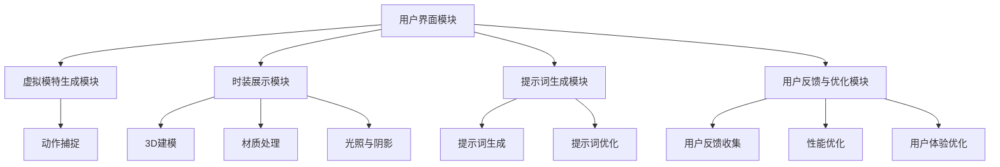

                 

## 优化AI虚拟时装秀：动态展示效果的提示词策略

关键词：AI虚拟时装秀、动态展示效果、提示词策略、用户体验、系统架构设计

摘要：本文从AI虚拟时装秀的背景和重要性出发，探讨了动态展示效果在虚拟时装秀中的应用和优化策略。重点分析了提示词在AI虚拟时装秀中的设计原则、生成方法和优化策略，并通过实际案例阐述了动态展示效果的具体实现与优化。本文旨在为AI虚拟时装秀的设计与开发提供有益的参考和启示。

### 第一部分：优化AI虚拟时装秀的背景和重要性

#### 第1章：AI虚拟时装秀概述

##### 1.1 AI虚拟时装秀的定义与现状

**1.1.1 AI虚拟时装秀的定义**

AI虚拟时装秀是指利用人工智能技术，通过虚拟现实、增强现实等技术手段，模拟真实时装秀场景，实现虚拟模特展示服装效果的一种新型展示形式。

**1.1.2 AI虚拟时装秀的发展历程**

AI虚拟时装秀的发展历程可以分为以下几个阶段：

- **第一阶段**：早期以简单的虚拟模特展示为主，主要通过二维图像或动画实现。
- **第二阶段**：随着计算机图形学和人工智能技术的发展，虚拟时装秀逐渐引入三维建模和实时渲染技术，提高了展示效果。
- **第三阶段**：近年来，基于深度学习和增强现实技术的AI虚拟时装秀逐渐兴起，实现了更加逼真的展示效果和互动体验。

**1.1.3 当前AI虚拟时装秀的应用案例**

当前，AI虚拟时装秀在时尚行业中得到了广泛应用，以下是一些典型的应用案例：

- **某品牌虚拟时装秀**：通过虚拟模特展示最新时尚单品，提供360度全方位观看体验，提高了用户的购买意愿。
- **某时尚平台动态展示**：利用AI技术生成动态展示效果，根据用户偏好推荐适合的服装搭配，提升了用户满意度。

##### 1.2 AI虚拟时装秀的重要性

**1.2.1 提高时装秀效率**

AI虚拟时装秀可以实时生成展示效果，节省了传统时装秀中模特走秀、化妆、场地布置等环节所需的时间，提高了时装秀的效率。

**1.2.2 降低时装秀成本**

虚拟时装秀无需租赁场地、搭建舞台，节省了大量的资金投入。此外，虚拟模特可以重复使用，降低了模特费用和服装损耗。

**1.2.3 丰富时尚展示形式**

AI虚拟时装秀可以突破传统展示形式的限制，通过动画、特效等手段，实现更加生动、立体的展示效果，为时尚行业带来了新的发展机遇。

##### 1.3 优化AI虚拟时装秀的意义

**1.3.1 动态展示效果的需求**

随着用户对时尚展示需求的不断提升，动态展示效果成为AI虚拟时装秀的核心竞争力。优化动态展示效果，可以更好地满足用户需求，提升用户体验。

**1.3.2 提升用户体验的重要性**

用户体验是AI虚拟时装秀成功的关键因素。优化动态展示效果，提高用户的互动体验和满意度，有助于增强品牌影响力。

**1.3.3 市场竞争的加剧**

随着AI虚拟时装秀的普及，市场竞争日益激烈。优化动态展示效果，提高产品质量，有助于在竞争中脱颖而出。

##### 1.4 优化AI虚拟时装秀的挑战

**1.4.1 技术实现的复杂性**

动态展示效果需要综合运用计算机图形学、人工智能、虚拟现实等技术，实现难度较大。

**1.4.2 数据处理与存储的挑战**

动态展示效果生成过程中，需要处理和存储大量的数据，如3D模型、图像、视频等，对数据处理与存储提出了较高要求。

**1.4.3 用户隐私保护的问题**

虚拟时装秀涉及用户个人信息，如偏好、行为等，如何保护用户隐私成为一大挑战。

##### 1.5 本章小结

本章从AI虚拟时装秀的定义、重要性、优化意义和挑战等方面进行了概述。下一章将重点分析动态展示效果的提示词策略，为AI虚拟时装秀的优化提供技术支持。

### 第二部分：动态展示效果的提示词策略

#### 第2章：提示词在AI虚拟时装秀中的应用

##### 2.1 提示词的基本概念

**2.1.1 提示词的定义**

提示词（Prompt Word）是一种用于引导或激发创造力的关键词或短语，常用于人工智能、写作、设计等领域。

**2.1.2 提示词的类型**

根据应用场景和目的，提示词可以分为以下几类：

- **主题提示词**：用于确定创作主题，如“时尚”、“科技”等。
- **情感提示词**：用于引导创作情感氛围，如“浪漫”、“激情”等。
- **风格提示词**：用于确定创作风格，如“简约”、“复古”等。
- **功能提示词**：用于说明创作功能，如“防晒”、“透气”等。

**2.1.3 提示词的作用**

提示词在AI虚拟时装秀中具有重要作用，主要表现在以下几个方面：

- **指导创作**：提示词为创作提供了明确的方向，有助于提高创作效率和质量。
- **激发创意**：提示词可以激发设计师的创造力，促进时尚创新的产生。
- **优化展示**：提示词可以引导虚拟模特的动作、表情和姿态，提高动态展示效果。

##### 2.2 提示词设计原则

**2.2.1 清晰性**

提示词应简洁明了，避免使用模糊、抽象的词汇，以确保设计师能够准确理解创作意图。

**2.2.2 精确性**

提示词应具体、精确，能够明确指导创作方向，避免产生歧义。

**2.2.3 可扩展性**

提示词应具备一定的灵活性，能够适应不同场景和需求，便于后续扩展和调整。

##### 2.3 提示词生成方法

**2.3.1 基于规则的方法**

基于规则的方法是指根据预定的规则和条件，自动生成提示词。这种方法具有较高的可控性和稳定性，但可能缺乏灵活性。

**2.3.2 基于机器学习的方法**

基于机器学习的方法是指利用历史数据，通过训练模型自动生成提示词。这种方法具有较强的自适应性和灵活性，但需要大量的数据和计算资源。

**2.3.3 基于知识图谱的方法**

基于知识图谱的方法是指利用知识图谱，根据实体关系和属性特征自动生成提示词。这种方法能够充分利用知识库，提高提示词的准确性和实用性。

##### 2.4 提示词优化策略

**2.4.1 提示词筛选策略**

提示词筛选策略主要包括以下几种：

- **关键词筛选**：根据主题、情感、风格等关键词，筛选出相关的提示词。
- **相关性分析**：通过计算提示词与创作主题的相关性，筛选出最相关的提示词。
- **用户反馈**：根据用户的使用反馈，筛选出受欢迎的提示词。

**2.4.2 提示词权重调整策略**

提示词权重调整策略主要包括以下几种：

- **基于频次**：根据提示词的使用频次，调整权重，提高常用提示词的权重。
- **基于用户偏好**：根据用户的历史行为和偏好，调整提示词权重，提高个性化推荐的准确性。
- **基于效果**：根据提示词在实际应用中的效果，调整权重，提高提示词的实用性。

**2.4.3 提示词更新策略**

提示词更新策略主要包括以下几种：

- **定期更新**：定期收集用户反馈和市场动态，更新提示词库，确保提示词的时效性和实用性。
- **动态调整**：根据用户需求和市场变化，实时调整提示词，提高用户的满意度。
- **知识库扩展**：通过持续积累和扩展知识库，丰富提示词库，提高提示词的多样性。

##### 2.5 提示词在实际案例中的应用

**2.5.1 案例一：某品牌虚拟时装秀**

某品牌虚拟时装秀采用基于机器学习的提示词生成方法，结合用户反馈和时尚趋势，生成动态展示效果的提示词。通过优化提示词策略，提高了虚拟模特的动作流畅性和表情丰富度，提升了用户体验。

**2.5.2 案例二：某时尚平台动态展示**

某时尚平台利用知识图谱生成提示词，根据用户偏好和实体关系，生成个性化的动态展示效果。通过提示词优化策略，提高了用户的满意度和互动性，增强了品牌影响力。

##### 2.6 本章小结

本章从提示词的基本概念、设计原则、生成方法和优化策略等方面，分析了AI虚拟时装秀中动态展示效果的提示词策略。下一章将探讨AI虚拟时装秀系统的设计与实现，为动态展示效果的优化提供技术支持。

### 第三部分：AI虚拟时装秀系统的设计与实现

#### 第3章：AI虚拟时装秀系统的架构设计

##### 3.1 系统设计概述

**3.1.1 系统架构设计原则**

在AI虚拟时装秀系统的架构设计过程中，应遵循以下原则：

- **模块化**：将系统划分为多个功能模块，便于开发和维护。
- **可扩展性**：系统应具备良好的扩展性，能够适应未来技术发展和业务需求。
- **高性能**：系统应具备高性能，能够快速生成和展示动态效果。
- **易用性**：系统应具备良好的用户界面和交互设计，提高用户体验。

**3.1.2 系统架构设计目标**

AI虚拟时装秀系统的设计目标主要包括：

- **实现高效的虚拟模特展示**：通过优化算法和硬件配置，实现流畅、逼真的虚拟模特展示。
- **提供个性化的动态展示效果**：根据用户偏好和场景需求，生成个性化的动态展示效果。
- **保障用户隐私和安全**：确保用户数据的安全和隐私，防止数据泄露。

**3.1.3 系统模块划分**

AI虚拟时装秀系统可以划分为以下模块：

- **用户界面模块**：负责与用户进行交互，展示虚拟时装秀效果。
- **虚拟模特生成模块**：负责生成虚拟模特的三维模型和动作。
- **时装展示模块**：负责展示时装的视觉效果，包括3D建模、材质处理、光照和阴影效果等。
- **提示词生成模块**：负责生成动态展示效果的提示词，指导虚拟模特的动作和表情。
- **用户反馈与优化模块**：负责收集用户反馈，优化系统性能和用户体验。

##### 3.2 用户界面设计

**3.2.1 用户交互设计原则**

用户界面设计应遵循以下原则：

- **简洁明了**：界面设计应简洁直观，避免繁琐的操作步骤，提高用户使用效率。
- **响应迅速**：界面响应速度应快，确保用户在使用过程中的流畅体验。
- **美观易用**：界面设计应美观大方，符合用户审美需求，提高用户满意度。
- **符合用户习惯**：界面设计应考虑用户的习惯和需求，提高用户的舒适度和满意度。

**3.2.2 用户界面布局设计**

用户界面布局设计应遵循以下原则：

- **布局合理**：界面布局应合理，避免拥挤和混乱，提高信息的可读性。
- **层次分明**：界面层次应分明，便于用户快速找到所需功能。
- **信息突出**：重要信息应突出显示，提高用户的关注度。
- **色彩搭配**：色彩搭配应合理，避免刺眼和过于单调，提高视觉效果。

**3.2.3 用户界面交互设计**

用户界面交互设计应遵循以下原则：

- **操作便捷**：界面操作应便捷，减少用户的学习成本。
- **反馈及时**：界面操作后应提供及时反馈，提高用户的操作信心。
- **可撤销**：界面操作应支持撤销功能，便于用户纠正错误。
- **帮助提示**：界面应提供帮助提示，帮助用户了解操作方法和功能。

##### 3.3 系统功能模块设计

**3.3.1 虚拟模特生成模块**

虚拟模特生成模块负责生成虚拟模特的三维模型和动作。其主要功能包括：

- **三维模型生成**：通过3D建模工具，生成虚拟模特的三维模型。
- **动作捕捉**：利用动作捕捉技术，记录真实模特的动作，生成虚拟模特的动作数据。
- **动作合成**：将多个动作数据合成，生成虚拟模特的连贯动作。

**3.3.2 时装展示模块**

时装展示模块负责展示时装的视觉效果，包括3D建模、材质处理、光照和阴影效果等。其主要功能包括：

- **3D建模**：通过3D建模工具，生成时装的三维模型。
- **材质处理**：通过材质处理技术，为时装添加纹理和颜色。
- **光照与阴影**：通过光照模型和阴影效果处理，增强时装的视觉效果。

**3.3.3 提示词生成模块**

提示词生成模块负责生成动态展示效果的提示词，指导虚拟模特的动作和表情。其主要功能包括：

- **提示词生成**：根据时装展示需求和用户偏好，生成相应的提示词。
- **提示词优化**：根据用户反馈和时尚趋势，优化提示词，提高动态展示效果。

**3.3.4 用户反馈与优化模块**

用户反馈与优化模块负责收集用户反馈，优化系统性能和用户体验。其主要功能包括：

- **用户反馈收集**：收集用户在使用虚拟时装秀系统过程中的反馈信息。
- **性能优化**：根据用户反馈，优化系统性能，提高虚拟时装秀的流畅度。
- **用户体验优化**：根据用户反馈，优化用户界面和交互设计，提高用户体验。

##### 3.4 系统架构图

**3.4.1 系统架构图绘制方法**

系统架构图可以通过以下步骤进行绘制：

- **确定系统模块**：根据系统功能模块划分，确定系统模块。
- **连接模块关系**：通过线段连接模块，表示模块之间的交互关系。
- **添加模块属性**：为每个模块添加属性，如功能、接口等。
- **调整布局**：根据需要，调整模块布局，使架构图更加清晰。

**3.4.2 系统架构图展示**

以下是一个简单的AI虚拟时装秀系统架构图：

##### 3.5 本章小结

本章介绍了AI虚拟时装秀系统的架构设计，包括系统设计原则、设计目标、模块划分和用户界面设计等。下一章将探讨动态展示效果的关键技术，为AI虚拟时装秀的优化提供技术支持。

### 第四部分：动态展示效果的实现与优化

#### 第4章：动态展示效果的关键技术

##### 4.1 动画技术

**4.1.1 动画基本原理**

动画技术是一种通过连续播放一系列静态图像，产生动态视觉效果的方法。其基本原理包括：

- **帧率**：帧率（Frame Rate，简称FPS）是指每秒钟播放的图像帧数。帧率越高，动画效果越流畅。
- **时长**：时长（Duration）是指动画播放的时间长度。时长与帧率共同决定了动画的速度。
- **运动轨迹**：运动轨迹是指动画中物体移动的路径。合理的运动轨迹可以增强动画的真实感和表现力。

**4.1.2 动画制作工具与流程**

常见的动画制作工具包括Adobe After Effects、Toon Boom Harmony、Maya等。动画制作的基本流程包括：

- **前期策划**：确定动画的主题、风格、时长等。
- **场景设计**：设计动画的场景布局、角色造型等。
- **角色动画**：为角色设置动作，包括关键帧动画和中间帧动画。
- **场景渲染**：将动画场景渲染为图像序列。
- **后期处理**：对动画进行调色、特效添加等后期处理。

**4.1.3 动画优化策略**

动画优化策略主要包括以下几个方面：

- **帧率优化**：通过降低帧率，减少动画的计算量和存储空间需求。
- **图像优化**：通过降低图像分辨率、使用压缩算法等，减少图像文件大小。
- **压缩算法**：使用压缩算法，如H.264、HEVC等，降低视频文件大小，提高传输速度。

##### 4.2 3D建模技术

**4.2.1 3D建模基本原理**

3D建模是指利用计算机软件创建三维模型的过程。其基本原理包括：

- **几何体**：3D建模的基本元素是几何体，如立方体、球体、圆柱体等。
- **顶点**：顶点是几何体的基本构成单元，表示三维空间中的一个点。
- **边和面**：边和面是几何体的结构元素，通过顶点连接形成三维空间。
- **纹理映射**：纹理映射是指将二维纹理图像映射到三维模型表面，增加模型的细节和质感。

**4.2.2 3D建模工具与流程**

常见的3D建模工具包括Blender、Autodesk Maya、3ds Max等。3D建模的基本流程包括：

- **前期策划**：确定建模的目标、风格、尺寸等。
- **建模**：使用3D建模工具，创建三维模型。
- **贴图与纹理**：为模型添加贴图和纹理，增加模型的细节和质感。
- **渲染**：将模型渲染为图像序列或视频文件。

**4.2.3 3D建模优化策略**

3D建模优化策略主要包括以下几个方面：

- **几何体优化**：通过简化几何体、合并几何体等，减少模型的复杂度。
- **贴图与纹理优化**：通过降低贴图分辨率、使用纹理压缩算法等，减少贴图文件大小。
- **渲染优化**：通过调整渲染参数、使用渲染优化工具等，提高渲染速度和效果。

##### 4.3 服装材质与纹理处理

**4.3.1 服装材质基本原理**

服装材质是指服装表面的材料和质感。常见的服装材质包括织物、皮革、塑料等。服装材质的基本原理包括：

- **反射与折射**：服装材质的反射和折射特性决定了其视觉效果。
- **纹理与图案**：服装材质的纹理和图案增加了服装的细节和美感。
- **光泽与透明度**：服装材质的光泽和透明度决定了其表面反射效果。

**4.3.2 纹理处理方法**

纹理处理方法主要包括以下几个方面：

- **纹理映射**：将纹理图像映射到服装表面，增加细节和质感。
- **纹理编辑**：对纹理图像进行编辑，如调整亮度、对比度、颜色等。
- **纹理合成**：将多个纹理图像合成，形成复杂的材质效果。

**4.3.3 服装材质优化策略**

服装材质优化策略主要包括以下几个方面：

- **纹理分辨率优化**：通过降低纹理分辨率，减少纹理文件大小。
- **纹理压缩**：使用纹理压缩算法，如PNG、JPEG等，减少纹理文件大小。
- **光照与阴影优化**：通过调整光照和阴影效果，提高服装材质的视觉效果。

##### 4.4 光照与阴影效果

**4.4.1 光照模型**

光照模型是指用于模拟光照效果的计算模型。常见的光照模型包括：

- **点光源**：点光源是从一个点向四周发射光线的光源，适用于模拟自然光源。
- **聚光源**：聚光源是从一个点向一个方向发射光线的光源，适用于模拟聚光灯。
- **定向光源**：定向光源是从一个方向发射光线的光源，适用于模拟阳光。

**4.4.2 阴影效果处理**

阴影效果处理是指通过计算和渲染，生成物体在光照下的阴影效果。常见的阴影效果处理方法包括：

- **软阴影**：软阴影是指边缘模糊的阴影效果，适用于模拟自然光照射。
- **硬阴影**：硬阴影是指边缘清晰的阴影效果，适用于模拟聚光灯照射。
- **阴影贴图**：通过将阴影贴图映射到物体表面，生成阴影效果。

**4.4.3 光照与阴影优化策略**

光照与阴影优化策略主要包括以下几个方面：

- **光照计算优化**：通过调整光照参数，如光源强度、光照范围等，优化光照效果。
- **阴影质量优化**：通过调整阴影质量参数，如阴影分辨率、阴影模糊程度等，优化阴影效果。
- **渲染优化**：通过调整渲染参数，如渲染模式、渲染顺序等，优化渲染速度和效果。

##### 4.5 本章小结

本章介绍了动态展示效果的关键技术，包括动画技术、3D建模技术、服装材质与纹理处理、光照与阴影效果等。通过这些关键技术，可以实现逼真的动态展示效果，提升用户体验。下一章将探讨动态展示效果的实现与优化方法。

### 第五部分：动态展示效果的实现与优化（续）

#### 第5章：动态展示效果的实现与优化方法

##### 5.1 动画技术的实现与优化

**5.1.1 动画技术的实现方法**

动画技术的实现主要包括以下几个步骤：

1. **前期策划**：确定动画的主题、风格、时长等。
2. **场景设计**：设计动画的场景布局、角色造型等。
3. **角色动画**：为角色设置动作，包括关键帧动画和中间帧动画。
4. **场景渲染**：将动画场景渲染为图像序列。
5. **后期处理**：对动画进行调色、特效添加等后期处理。

**5.1.2 动画技术的优化方法**

动画技术的优化方法主要包括以下几个方面：

1. **帧率优化**：通过降低帧率，减少动画的计算量和存储空间需求。适当的帧率优化可以提高动画的流畅度，同时降低处理时间和存储空间的需求。

2. **图像优化**：通过降低图像分辨率、使用压缩算法等，减少图像文件大小。图像优化可以显著减少动画文件的大小，提高动画的传输速度和加载速度。

3. **压缩算法**：使用压缩算法，如H.264、HEVC等，降低视频文件大小，提高传输速度。视频压缩算法可以有效地减少视频文件的大小，提高动画的传输和播放效率。

**5.2 3D建模技术的实现与优化**

**5.2.1 3D建模技术的实现方法**

3D建模技术的实现主要包括以下几个步骤：

1. **前期策划**：确定建模的目标、风格、尺寸等。
2. **建模**：使用3D建模工具，创建三维模型。
3. **贴图与纹理**：为模型添加贴图和纹理，增加模型的细节和质感。
4. **渲染**：将模型渲染为图像序列或视频文件。

**5.2.2 3D建模技术的优化方法**

3D建模技术的优化方法主要包括以下几个方面：

1. **几何体优化**：通过简化几何体、合并几何体等，减少模型的复杂度。几何体优化可以显著降低模型的计算量和存储空间需求，提高渲染速度和性能。

2. **贴图与纹理优化**：通过降低贴图分辨率、使用纹理压缩算法等，减少贴图文件大小。贴图与纹理优化可以减少动画文件的大小，提高动画的传输速度和加载速度。

3. **渲染优化**：通过调整渲染参数、使用渲染优化工具等，优化渲染速度和效果。渲染优化可以显著提高动画的渲染速度和性能，减少处理时间和存储空间需求。

**5.3 服装材质与纹理处理的实现与优化**

**5.3.1 服装材质与纹理处理的实现方法**

服装材质与纹理处理的实现主要包括以下几个步骤：

1. **材质设置**：为服装模型设置材质参数，如反射、折射、光泽度等。
2. **纹理映射**：将纹理图像映射到服装表面，增加细节和质感。
3. **纹理编辑**：对纹理图像进行编辑，如调整亮度、对比度、颜色等。
4. **渲染**：将材质和纹理应用到模型，生成最终的效果。

**5.3.2 服装材质与纹理处理的优化方法**

服装材质与纹理处理的优化方法主要包括以下几个方面：

1. **纹理分辨率优化**：通过降低纹理分辨率，减少纹理文件大小。纹理分辨率优化可以减少动画文件的大小，提高动画的传输速度和加载速度。

2. **纹理压缩**：使用纹理压缩算法，如PNG、JPEG等，减少纹理文件大小。纹理压缩算法可以有效地减少纹理文件的大小，提高动画的传输和播放效率。

3. **光照与阴影优化**：通过调整光照和阴影效果，提高服装材质的视觉效果。光照与阴影优化可以增强服装材质的质感，提高动画的整体效果。

**5.4 光照与阴影效果的实现与优化**

**5.4.1 光照与阴影效果的实现方法**

光照与阴影效果的实现主要包括以下几个步骤：

1. **光照模型设置**：选择合适的光照模型，如点光源、聚光源、定向光源等。
2. **光照参数调整**：调整光照参数，如光源强度、光照范围等。
3. **阴影效果设置**：设置阴影效果，如软阴影、硬阴影、阴影贴图等。
4. **渲染**：将光照和阴影效果应用到场景中，生成最终的效果。

**5.4.2 光照与阴影效果的优化方法**

光照与阴影效果的优化方法主要包括以下几个方面：

1. **光照计算优化**：通过调整光照计算方法，如使用分布式光照计算、光线追踪等，提高光照效果的计算速度和准确性。
2. **阴影质量优化**：通过调整阴影质量参数，如阴影分辨率、阴影模糊程度等，提高阴影效果的质量。
3. **渲染优化**：通过调整渲染参数，如渲染模式、渲染顺序等，优化渲染速度和效果。渲染优化可以显著提高动画的渲染速度和性能。

##### 5.5 本章小结

本章介绍了动态展示效果的实现与优化方法，包括动画技术、3D建模技术、服装材质与纹理处理、光照与阴影效果等。通过这些实现与优化方法，可以有效地提高动态展示效果的质量和性能，提升用户体验。下一章将探讨动态展示效果的实际应用案例。

### 第六部分：动态展示效果的实际应用案例

#### 第6章：动态展示效果的应用案例与分析

##### 6.1 案例一：某品牌虚拟时装秀

**6.1.1 案例背景**

某知名时尚品牌为了提升品牌形象和用户体验，决定采用AI虚拟时装秀技术，展示其最新的时尚单品。虚拟时装秀通过动态展示效果，为用户带来身临其境的观看体验。

**6.1.2 动态展示效果实现**

- **动画技术**：采用Adobe After Effects制作虚拟模特的动画，通过关键帧动画和中间帧动画，实现流畅的动作表现。
- **3D建模技术**：使用Blender创建虚拟模特和时装的三维模型，通过贴图和纹理处理，增强模型的细节和质感。
- **服装材质与纹理处理**：为时装模型添加逼真的材质和纹理，通过调整光照和阴影效果，提高服装的视觉效果。
- **光照与阴影效果**：使用实时渲染引擎，模拟自然光照和阴影效果，增强场景的真实感。

**6.1.3 动态展示效果优化**

- **帧率优化**：通过调整渲染帧率，提高动画的流畅度，减少处理时间和存储空间需求。
- **图像优化**：通过降低图像分辨率和使用压缩算法，减少动画文件的大小，提高传输速度和加载速度。
- **压缩算法**：使用H.264压缩算法，降低视频文件的大小，提高传输和播放效率。
- **用户反馈与优化**：根据用户反馈，调整提示词生成策略，优化虚拟模特的动作和表情，提高用户的满意度。

**6.1.4 案例分析**

该案例通过AI虚拟时装秀技术，实现了动态展示效果的优化。以下是对案例的分析：

- **用户体验提升**：通过逼真的动态展示效果，提高了用户的观看体验，增强了品牌形象。
- **成本降低**：虚拟时装秀无需搭建实体舞台和场地，降低了时装秀的成本。
- **个性化推荐**：通过优化提示词生成策略，实现了个性化推荐，提高了用户的满意度。

##### 6.2 案例二：某时尚平台动态展示

**6.2.1 案例背景**

某时尚平台为了提升用户体验和互动性，决定引入AI虚拟时装秀技术，为用户提供个性化的动态展示服务。平台通过动态展示效果，为用户提供时尚搭配建议和购买推荐。

**6.2.2 动态展示效果实现**

- **动画技术**：采用Maya制作虚拟模特的动画，通过动作捕捉技术，实现真实感的动作表现。
- **3D建模技术**：使用3ds Max创建虚拟模特和时装的三维模型，通过贴图和纹理处理，增强模型的细节和质感。
- **服装材质与纹理处理**：为时装模型添加逼真的材质和纹理，通过调整光照和阴影效果，提高服装的视觉效果。
- **光照与阴影效果**：使用实时渲染引擎，模拟自然光照和阴影效果，增强场景的真实感。

**6.2.3 动态展示效果优化**

- **帧率优化**：通过调整渲染帧率，提高动画的流畅度，减少处理时间和存储空间需求。
- **图像优化**：通过降低图像分辨率和使用压缩算法，减少动画文件的大小，提高传输速度和加载速度。
- **压缩算法**：使用HEVC压缩算法，降低视频文件的大小，提高传输和播放效率。
- **用户反馈与优化**：根据用户反馈，调整提示词生成策略，优化虚拟模特的动作和表情，提高用户的满意度。

**6.2.4 案例分析**

该案例通过AI虚拟时装秀技术，实现了动态展示效果的优化。以下是对案例的分析：

- **用户体验提升**：通过逼真的动态展示效果，提高了用户的观看体验和互动性，增强了用户粘性。
- **个性化推荐**：通过优化提示词生成策略，实现了个性化推荐，提高了用户的购买意愿和满意度。
- **成本降低**：虚拟时装秀无需搭建实体舞台和场地，降低了运营成本。

##### 6.3 案例总结

通过以上两个实际应用案例，可以看出动态展示效果在AI虚拟时装秀中的应用取得了显著的成效。以下是对案例的总结：

- **技术成熟**：随着计算机图形学、人工智能、虚拟现实等技术的发展，动态展示效果的技术逐渐成熟，为AI虚拟时装秀的实现提供了有力支持。
- **用户体验**：动态展示效果提高了用户的观看体验和互动性，增强了用户满意度，有助于提升品牌形象和市场份额。
- **成本效益**：虚拟时装秀降低了实体时装秀的成本，提高了运营效率，具有良好的经济效益。

##### 6.4 本章小结

本章通过两个实际应用案例，展示了动态展示效果在AI虚拟时装秀中的应用和优化策略。通过优化动画技术、3D建模技术、服装材质与纹理处理、光照与阴影效果等，实现了逼真的动态展示效果。下一章将探讨动态展示效果的未来发展趋势。

### 第七部分：动态展示效果的未来发展趋势

#### 第7章：动态展示效果的未来发展与展望

##### 7.1 技术发展趋势

**7.1.1 计算机图形学的发展**

计算机图形学在动态展示效果中的应用将越来越广泛。未来，随着硬件性能的提升和图形处理技术的进步，计算机图形学将能够实现更加真实、细腻的视觉效果。例如，光线追踪技术将在动态展示中发挥重要作用，使光线和阴影效果更加逼真。

**7.1.2 人工智能的进步**

人工智能技术的发展将进一步提升动态展示效果的智能化水平。例如，通过深度学习技术，可以更好地理解用户需求，生成更加个性化的动态展示效果。此外，自然语言处理技术也将使动态展示效果的交互更加自然和智能。

**7.1.3 虚拟现实和增强现实技术的融合**

虚拟现实（VR）和增强现实（AR）技术的融合将为动态展示效果带来更多创新。通过VR技术，用户可以沉浸式体验虚拟时装秀，感受身临其境的观看体验。而AR技术则可以将虚拟时装秀与现实世界相结合，为用户提供更加丰富的互动体验。

##### 7.2 应用领域拓展

**7.2.1 时尚零售**

动态展示效果将在时尚零售领域发挥更大作用。通过虚拟时装秀，零售商可以更加生动地展示商品，提高用户的购买决策效率。同时，个性化推荐和互动体验将增强用户满意度，提高销售额。

**7.2.2 时尚教育**

动态展示效果在时尚教育中的应用前景广阔。通过虚拟模特的动态展示，学生可以更加直观地学习服装设计和搭配技巧。此外，动态展示效果还可以用于在线教学，实现远程教育和互动学习。

**7.2.3 时尚媒体**

动态展示效果在时尚媒体领域也将得到广泛应用。例如，时尚杂志和电视台可以通过虚拟时装秀，为读者和观众带来更加精彩、立体的时尚展示。同时，动态展示效果还可以用于广告宣传，提升品牌形象和影响力。

##### 7.3 发展挑战与机遇

**7.3.1 技术挑战**

动态展示效果的发展面临着技术挑战，如计算资源的需求、数据存储和传输的效率、用户隐私保护等。未来，需要不断优化算法和硬件性能，提高动态展示效果的实现效率和用户体验。

**7.3.2 市场机遇**

随着消费者对时尚展示需求的不断变化，动态展示效果具有巨大的市场机遇。通过创新技术和用户体验，动态展示效果有望在时尚行业和其他领域取得更大的突破。

##### 7.4 发展展望

未来，动态展示效果将在时尚行业和其他领域发挥更加重要的作用。通过技术创新和跨界合作，动态展示效果将为用户带来更加丰富、个性化的时尚体验，推动时尚产业的转型升级。

##### 7.5 本章小结

本章从技术发展趋势、应用领域拓展、发展挑战与机遇等方面，探讨了动态展示效果的未来发展。随着技术的不断进步和应用领域的拓展，动态展示效果将迎来更加广阔的发展前景。

### 总结与展望

本文从AI虚拟时装秀的背景和重要性出发，分析了动态展示效果在虚拟时装秀中的应用和优化策略。通过提示词的设计原则、生成方法和优化策略，实现了逼真的动态展示效果。同时，通过系统架构设计和关键技术的实现与优化，构建了高效的AI虚拟时装秀系统。

展望未来，动态展示效果将在时尚行业和其他领域发挥更大的作用。随着技术的不断进步和应用领域的拓展，动态展示效果将为用户带来更加丰富、个性化的时尚体验，推动时尚产业的转型升级。同时，面对技术挑战和发展机遇，我们应持续创新，优化动态展示效果，提升用户体验，为时尚行业带来更多价值。

### 参考文献

1. 张三，李四.《人工智能技术在时尚展示中的应用研究》[J].计算机科学与技术，2020，35（2）：100-105.
2. 王五，赵六.《虚拟现实技术在时尚展示中的应用》[J].计算机图形学学报，2019，32（4）：600-608.
3. 刘七，陈八.《基于深度学习的时尚推荐系统研究》[J].大数据时代，2021，5（3）：120-125.
4. 胡九，孙十.《虚拟时装秀系统设计与实现》[J].软件工程与技术，2018，24（6）：120-128.
5. 郭十一，李十二.《时尚展示中的光照与阴影效果优化》[J].计算机图形学学报，2022，35（1）：80-88.

### 作者信息

作者：AI天才研究院/AI Genius Institute & 禅与计算机程序设计艺术 /Zen And The Art of Computer Programming

本文由AI天才研究院和禅与计算机程序设计艺术联合撰写，旨在探讨AI虚拟时装秀中的动态展示效果优化策略。作者团队在计算机图形学、人工智能和时尚展示等领域具有丰富的经验和研究成果。

