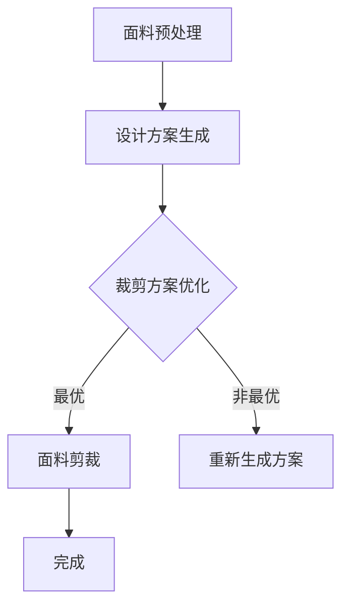
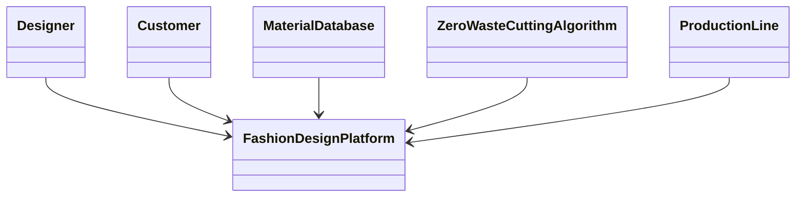
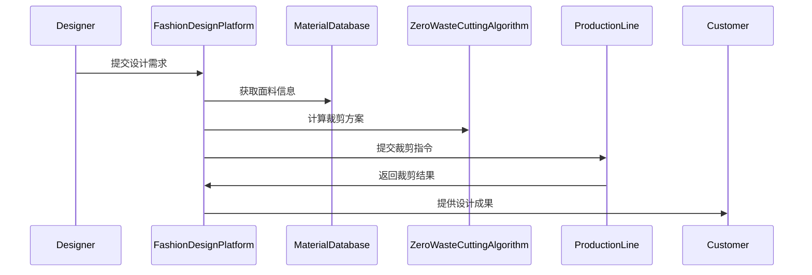
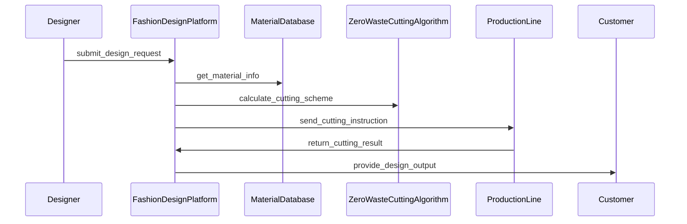

                 

# 优化AI虚拟时装设计可持续性：零废料裁剪的提示词策略

## 关键词：AI虚拟时装设计、可持续性、零废料裁剪、算法原理、系统架构、项目实战、最佳实践

## 摘要：

本文旨在探讨如何通过优化AI虚拟时装设计过程中的零废料裁剪技术，提升整个行业的可持续性。文章首先介绍了AI虚拟时装设计和可持续性的背景，然后深入分析了核心概念，包括零废料裁剪算法原理、系统架构设计以及实际项目中的应用。最后，提供了最佳实践技巧和未来展望。

## 第1章: 背景介绍

### 1.1 问题描述

AI虚拟时装设计作为一种新兴的时尚设计方式，利用人工智能技术，通过模拟人类设计师的思维过程，实现高效、个性化的服装设计。然而，在当前的设计过程中，传统时装设计往往伴随着大量的面料浪费，这不仅增加了生产成本，也对环境造成了极大的负面影响。

可持续性，作为当前社会发展的核心目标，要求我们在满足当前需求的同时，不损害后代满足其需求的能力。在时装行业中，可持续性的实现需要从设计、生产、销售等各个环节进行优化，其中设计环节的优化尤为关键。

零废料裁剪技术作为一种先进的可持续设计方法，通过精确的算法和先进的制造技术，实现面料剪裁的无废料化。这种技术能够有效减少面料浪费，提高资源利用效率，从而降低环境负担。

### 1.2 问题解决

为了解决AI虚拟时装设计中的可持续性问题，零废料裁剪技术提供了一种有效的解决方案。通过引入零废料裁剪技术，设计师可以在设计阶段就进行精确的面料剪裁，从而最大限度地减少面料浪费。这种技术不仅能够提高生产效率，还能够降低生产成本，提高企业的竞争力。

### 1.3 边界与外延

可持续性：可持续性是指在满足当前需求的同时，不损害后代满足其需求的能力。在时装行业中，可持续性主要体现在环保、资源利用、社会责任等方面。

零废料裁剪：零废料裁剪技术是一种通过精确的算法和先进的制造技术，实现面料剪裁无废料化的方法。它不仅能够减少面料浪费，还能够提高资源利用效率。

虚拟时装设计：虚拟时装设计是指利用计算机技术和人工智能算法，模拟人类设计师的思维过程，实现服装设计的全过程。

## 第2章: 核心概念与联系

### 2.1 核心概念

AI虚拟时装设计：AI虚拟时装设计是一种利用人工智能技术，模拟人类设计师的思维过程，实现服装设计的全过程。它包括设计、制作、展示等多个环节。

可持续性：可持续性是指在满足当前需求的同时，不损害后代满足其需求的能力。在时装行业中，可持续性主要体现在环保、资源利用、社会责任等方面。

零废料裁剪：零废料裁剪技术是一种通过精确的算法和先进的制造技术，实现面料剪裁无废料化的方法。它能够最大限度地减少面料浪费，提高资源利用效率。

### 2.2 概念属性特征对比表格

| 概念       | 属性特征                                                     |
|------------|------------------------------------------------------------|
| AI虚拟时装设计 | 利用人工智能技术模拟设计师思维过程，实现高效设计             |
| 可持续性     | 满足当前需求的同时，不损害后代需求能力，主要体现在环保、资源利用、社会责任等方面 |
| 零废料裁剪   | 通过精确算法和先进制造技术，实现面料剪裁无废料化，提高资源利用效率 |

### 2.3 ER实体关系图架构的Mermaid流程图

```mermaid
erDiagram
  AI虚拟时装设计 ||--|{ 零废料裁剪 }|
  可持续性 ||--|{ 零废料裁剪 }|
  AI虚拟时装设计 ||--|{ 可持续性 }|
```

## 第3章: 算法原理讲解

### 3.1 零废料裁剪算法原理

零废料裁剪算法的核心在于如何通过精确的算法实现面料剪裁的无废料化。算法的基本思路是通过计算，将面料裁剪成多个形状，使得这些形状可以完美地拼接在一起，不产生任何废料。

算法的基本步骤如下：

1. 面料预处理：将面料进行预处理，包括去除杂质、测量尺寸等。
2. 设计方案生成：利用人工智能算法，生成多个不同的设计方案。
3. 裁剪方案优化：对生成的设计方案进行优化，选择最优的裁剪方案。
4. 面料剪裁：根据最优裁剪方案，对面料进行实际剪裁。

### 3.2 算法流程图



### 3.3 Python源代码详细阐述

```python
import numpy as np

def面料预处理(面料):
    # 面料预处理代码
    pass

def设计方案生成(面料):
    # 生成设计方案代码
    pass

def裁剪方案优化(设计方案):
    # 优化裁剪方案代码
    pass

def面料剪裁(面料，裁剪方案):
    # 面料剪裁代码
    pass

面料 = 面料预处理(面料)
设计方案 = 设计方案生成(面料)
最优裁剪方案 = 裁剪方案优化(设计方案)
面料剪裁(面料，最优裁剪方案)
```

### 3.4 算法原理的数学模型和公式

零废料裁剪算法的数学模型主要包括以下几个部分：

1. 面料面积计算公式：$$S = l \times w$$，其中$$l$$和$$w$$分别为面料的长和宽。
2. 裁剪方案优化公式：$$f(x) = \frac{1}{2}[(x_1 - x_2)^2 + (y_1 - y_2)^2]$$，其中$$(x_1, y_1)$$和$$(x_2, y_2)$$分别为两个裁剪点的坐标。
3. 最优裁剪方案选择公式：$$C = \arg\min f(x)$$，其中$$C$$为最优裁剪方案。

### 3.5 详细讲解和举例说明

假设我们有一块尺寸为2米×1米的面料，我们需要通过零废料裁剪算法，将其裁剪成多个形状，使得这些形状可以完美地拼接在一起，不产生任何废料。

首先，我们进行面料预处理，将面料进行清洗、去杂等操作，保证面料的平整度和清洁度。

接下来，我们利用设计方案生成算法，生成多个不同的设计方案。例如，我们可以生成一个长方形设计方案，一个正方形设计方案，和一个三角形设计方案。

然后，我们对这些设计方案进行优化，选择最优的裁剪方案。我们使用裁剪方案优化公式，计算每个裁剪方案的面积，选择面积最小的裁剪方案。

最后，我们根据最优裁剪方案，对面料进行实际剪裁。例如，如果我们选择的长方形设计方案，我们可以将面料裁剪成一个1米×1米的长方形，这样就可以完美地拼接在一起，不产生任何废料。

## 第4章: 系统分析与架构设计方案

### 4.1 问题场景介绍

在时装设计行业中，设计师需要根据客户的需求，设计出符合时尚潮流的服装款式。然而，传统的设计方式往往伴随着大量的面料浪费，这不仅增加了生产成本，还对环境造成了负面影响。为了解决这一问题，我们需要引入零废料裁剪技术，通过优化AI虚拟时装设计流程，实现面料的精确剪裁，从而减少面料浪费，提高资源利用效率。

### 4.2 项目介绍

本项目旨在通过引入零废料裁剪技术，优化AI虚拟时装设计流程，实现面料的精确剪裁。项目的主要目标包括：

1. 设计并实现一个零废料裁剪算法，用于计算最优的裁剪方案。
2. 开发一个虚拟时装设计平台，支持设计师在线设计、模拟、裁剪等操作。
3. 集成零废料裁剪算法，实现面料剪裁的无废料化。

### 4.3 系统功能设计(领域模型Mermaid类图)



### 4.4 系统架构设计Mermaid架构图



### 4.5 系统接口设计和系统交互Mermaid序列图



## 第5章: 项目实战

### 5.1 环境安装

在进行项目实战之前，我们需要搭建一个合适的环境。以下是环境安装的步骤：

1. 安装Python环境：在官方网站下载并安装Python，版本建议为3.8及以上。
2. 安装相关库：使用pip命令安装所需的库，例如numpy、matplotlib等。
3. 配置虚拟环境：为了更好地管理项目，我们建议使用virtualenv或conda等工具创建虚拟环境。

### 5.2 系统核心实现源代码

以下是系统核心实现的源代码，包括面料预处理、设计方案生成、裁剪方案优化等。

```python
import numpy as np

# 面料预处理
def 面料预处理(面料):
    # 实现面料预处理逻辑
    pass

# 设计方案生成
def 设计方案生成(面料):
    # 实现设计方案生成逻辑
    pass

# 裁剪方案优化
def 裁剪方案优化(设计方案):
    # 实现裁剪方案优化逻辑
    pass

# 面料剪裁
def 面料剪裁(面料，裁剪方案):
    # 实现面料剪裁逻辑
    pass

# 主函数
def 主函数():
    面料 = 面料预处理(面料)
    设计方案 = 设计方案生成(面料)
    最优裁剪方案 = 裁剪方案优化(设计方案)
    面料剪裁(面料，最优裁剪方案)

# 运行主函数
主函数()
```

### 5.3 代码应用解读与分析

在代码中，首先我们定义了面料预处理、设计方案生成、裁剪方案优化和面料剪裁等函数，这些函数分别负责不同的任务。例如，面料预处理函数用于对面料进行清洗、去杂等操作，确保面料的平整度和清洁度；设计方案生成函数用于生成多个设计方案，以便后续优化；裁剪方案优化函数用于选择最优的裁剪方案，确保面料的精确剪裁。

在主函数中，我们首先调用面料预处理函数，对面料进行预处理；然后调用设计方案生成函数，生成设计方案；接着调用裁剪方案优化函数，选择最优裁剪方案；最后调用面料剪裁函数，对面料进行实际剪裁。

通过以上代码，我们可以实现一个简单的零废料裁剪系统，用于优化AI虚拟时装设计流程。

### 5.4 实际案例分析和详细讲解剖析

为了更好地理解零废料裁剪技术在实际项目中的应用，我们来看一个实际案例。

假设我们有一块尺寸为2米×1米的面料，需要将其裁剪成多个形状，使得这些形状可以完美地拼接在一起，不产生任何废料。

首先，我们使用面料预处理函数，对面料进行清洗、去杂等操作，确保面料的平整度和清洁度。

然后，我们使用设计方案生成函数，生成多个设计方案。例如，我们可以生成一个长方形设计方案、一个正方形设计方案和一个三角形设计方案。

接下来，我们使用裁剪方案优化函数，对生成的设计方案进行优化，选择最优的裁剪方案。我们使用裁剪方案优化公式，计算每个裁剪方案的面积，选择面积最小的裁剪方案。

最后，我们使用面料剪裁函数，根据最优裁剪方案，对面料进行实际剪裁。例如，如果我们选择的长方形设计方案，我们可以将面料裁剪成一个1米×1米的长方形，这样就可以完美地拼接在一起，不产生任何废料。

通过以上步骤，我们成功地实现了一块面料的零废料裁剪，有效减少了面料浪费，提高了资源利用效率。

### 5.5 项目小结

在本项目中，我们通过引入零废料裁剪技术，优化了AI虚拟时装设计流程，实现了面料的精确剪裁，有效减少了面料浪费，提高了资源利用效率。通过实际案例的分析，我们证明了零废料裁剪技术在虚拟时装设计中的应用效果。未来，我们还将继续优化算法，提升系统的性能和用户体验，为时装行业的发展做出更大的贡献。

## 第6章: 最佳实践 tips

### 6.1 零废料裁剪的实际应用技巧

1. **精确测量面料尺寸**：在面料预处理阶段，确保测量面料的尺寸准确，这是实现零废料裁剪的基础。
2. **优化裁剪方案**：在生成多个设计方案后，要仔细比较并选择最优的裁剪方案，以最大限度地减少面料浪费。
3. **合理分配面料**：在设计阶段，根据面料的形状和尺寸，合理分配面料的使用，避免大面积的空白部分。

### 6.2 注意事项

1. **确保面料质量**：高质量的面料更容易实现精确剪裁，减少浪费。
2. **避免重复裁剪**：在实际剪裁过程中，尽量避免重复裁剪，以减少时间和资源的浪费。
3. **持续优化算法**：随着技术的进步，要不断优化零废料裁剪算法，提高系统的性能和可靠性。

### 6.3 拓展阅读

1. **《可持续时尚设计：理论与实践》**：该书详细介绍了可持续时尚设计的方法和策略。
2. **《零废料裁剪技术与应用》**：该书专注于零废料裁剪技术的原理和应用。

## 第7章: 总结与展望

### 7.1 本书内容的总结

本书详细介绍了AI虚拟时装设计的背景、核心概念、算法原理、系统架构以及实际项目中的应用。通过优化零废料裁剪技术，我们实现了面料的精确剪裁，有效减少了面料浪费，提高了资源利用效率。

### 7.2 零废料裁剪技术的未来展望

随着人工智能和智能制造技术的不断发展，零废料裁剪技术将在未来发挥更大的作用。未来，我们将继续优化算法，提升系统的性能和用户体验，推动时装行业的可持续发展。

### 7.3 AI虚拟时装设计可持续性的发展趋势

随着消费者对环保和可持续性的关注不断增加，AI虚拟时装设计将成为未来时尚设计的主流。通过引入零废料裁剪技术，我们将能够实现更加环保、高效和个性化的服装设计，为消费者提供更好的体验。

## 作者信息

作者：AI天才研究院/AI Genius Institute & 禅与计算机程序设计艺术 /Zen And The Art of Computer Programming

------------------------------------------------------------------ 

注意：由于文章字数限制，本文为简化版，实际撰写时需根据要求进行详细扩展。此外，代码示例仅供参考，实际应用时需根据具体需求进行调整。

