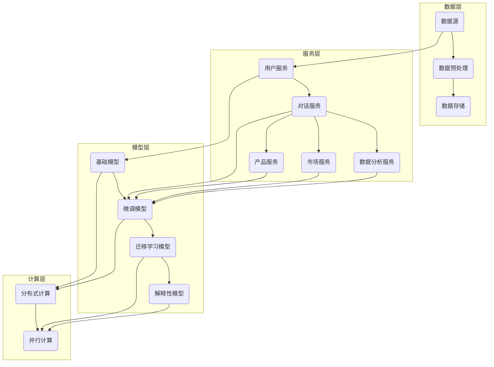
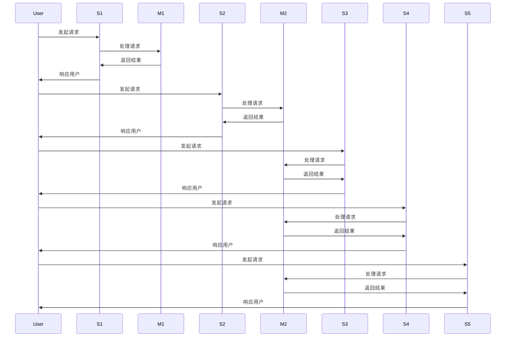

                 

# 优化LLM应用的持续学习机制

> 关键词：大型语言模型、持续学习、增量学习、迁移学习、模型解释性、分布式学习、并行计算

> 摘要：本文深入探讨了优化大型语言模型（LLM）应用的持续学习机制，包括背景介绍、核心概念与联系、算法原理讲解、系统分析与架构设计方案、项目实战以及最佳实践和注意事项。通过分析LLM在持续学习中的挑战，本文提出了一系列优化策略，包括数据预处理与增量学习、模型微调与迁移学习、模型解释性增强、分布式学习与并行计算，旨在提高LLM在多变数据环境中的应用性能。

----------------------------------------------------------------

## 第一部分：背景介绍

### 1.1.1 问题背景

随着人工智能技术的快速发展，大型语言模型（LLM）已经在各个领域展现出强大的应用潜力。LLM通过学习海量文本数据，能够生成自然语言响应，实现文本生成、机器翻译、问答系统等多种功能。然而，LLM在实际应用中面临着一系列挑战，尤其是在持续学习方面。

### 1.1.2 问题描述

1. **数据适应性差**：LLM在训练时需要大量数据，但实际应用中的数据可能具有多样性和动态性，导致LLM难以适应新数据。
2. **模型更新成本高**：传统的LLM训练和更新需要大量计算资源和时间，无法实现实时更新。
3. **模型可解释性低**：LLM的内部机制复杂，难以理解其决策过程，限制了其在某些领域的应用。
4. **模型容量限制**：LLM的模型容量有限，难以处理大规模数据。

### 1.1.3 问题解决

为了解决上述问题，提出了一种持续学习机制，该机制通过以下方式优化LLM的应用：

1. **数据预处理与增量学习**：通过对新数据进行预处理，提高LLM对多样性和动态性数据的适应性。
2. **模型微调与迁移学习**：利用微调和迁移学习技术，降低模型更新成本，提高更新速度。
3. **模型解释性增强**：通过可视化技术和可解释性模型，提高LLM的可解释性。
4. **分布式学习与并行计算**：利用分布式学习和并行计算技术，提高模型训练和更新的效率。

### 1.1.4 边界与外延

1. **边界**：本文主要讨论LLM的持续学习机制，不涉及其他机器学习模型。
2. **外延**：持续学习机制的应用范围包括但不限于文本生成、机器翻译、问答系统等。

### 1.1.5 概念结构与核心要素组成

1. **核心概念**：持续学习机制、LLM、数据预处理、增量学习、模型微调、迁移学习、模型解释性、分布式学习、并行计算。
2. **核心要素**：数据集、模型架构、训练算法、评估指标、学习策略。

----------------------------------------------------------------

## 第二部分：核心概念与联系

### 2.1 持续学习机制

#### 2.1.1 定义

持续学习机制是一种使机器学习模型能够适应动态环境的技术，通过实时更新模型，提高模型在多变数据上的性能。

#### 2.1.2 特点

1. **适应性**：能够适应新数据和场景。
2. **实时性**：能够实时更新模型，降低延迟。
3. **效率**：利用增量学习和迁移学习技术，提高更新效率。
4. **可解释性**：提高模型的可解释性，便于理解和优化。

### 2.2 数据预处理

#### 2.2.1 定义

数据预处理是指在使用LLM之前，对数据进行清洗、转换和归一化等操作，以提高模型的学习效果。

#### 2.2.2 特点

1. **数据清洗**：去除无效数据，提高数据质量。
2. **数据转换**：将数据转换为模型可处理的格式。
3. **数据归一化**：将数据缩放到一个固定范围，提高模型训练的稳定性。

### 2.3 增量学习

#### 2.3.1 定义

增量学习是指模型在已有知识的基础上，对新数据进行学习，以适应新的环境和数据。

#### 2.3.2 特点

1. **高效性**：避免重新训练整个模型，提高学习效率。
2. **灵活性**：能够适应不同类型的新数据。
3. **可扩展性**：适用于大规模数据集。

### 2.4 模型微调

#### 2.4.1 定义

模型微调是在已有模型的基础上，针对特定任务进行调整，以提高模型在特定领域的性能。

#### 2.4.2 特点

1. **针对性**：针对特定任务进行调整，提高性能。
2. **高效性**：利用已有模型的知识，减少训练时间。
3. **适应性**：能够适应不同任务的需求。

### 2.5 迁移学习

#### 2.5.1 定义

迁移学习是指将一个任务在源数据集上的学习经验应用到另一个相关任务上。

#### 2.5.2 特点

1. **知识复用**：将已有知识应用到新任务，提高学习效率。
2. **泛化能力**：提高模型在不同任务上的泛化能力。
3. **可扩展性**：适用于不同领域和任务。

### 2.6 模型解释性

#### 2.6.1 定义

模型解释性是指模型在决策过程中能够提供可解释的信息，使得用户能够理解和信任模型。

#### 2.6.2 特点

1. **可解释性**：提供直观的解释，便于理解和信任。
2. **可诊断性**：能够诊断模型存在的问题。
3. **可优化性**：通过解释结果，优化模型。

### 2.7 分布式学习与并行计算

#### 2.7.1 定义

分布式学习和并行计算是指通过将计算任务分布在多个节点上，或者在同一节点上同时执行多个任务，以提高计算效率。

#### 2.7.2 特点

1. **效率提升**：通过并行计算，提高模型训练和更新的速度。
2. **可扩展性**：适用于大规模数据集和复杂模型。
3. **容错性**：通过分布式计算，提高系统的可靠性。

### 2.8 概念属性特征对比表格

为了更好地理解这些核心概念，我们可以通过一个表格来对比它们的属性特征：

| 概念     | 定义                                                         | 特点                                                         |
| -------- | ------------------------------------------------------------ | ------------------------------------------------------------ |
| 持续学习 | 实时更新模型，适应动态环境                                   | 适应性、实时性、效率、可解释性                               |
| 数据预处理 | 数据清洗、转换、归一化等操作，提高模型学习效果                 | 数据清洗、数据转换、数据归一化                               |
| 增量学习 | 在已有知识基础上，对新数据进行学习，适应新环境               | 高效性、灵活性、可扩展性                                     |
| 模型微调 | 针对特定任务调整已有模型，提高性能                           | 针对性、高效性、适应性                                       |
| 迁移学习 | 将一个任务的学习经验应用到另一个相关任务上                   | 知识复用、泛化能力、可扩展性                                 |
| 模型解释性 | 提供可解释的信息，便于理解和信任模型                         | 可解释性、可诊断性、可优化性                                 |
| 分布式学习 | 将计算任务分布在多个节点上，提高计算效率                     | 效率提升、可扩展性、容错性                                   |
| 并行计算 | 在同一节点上同时执行多个任务，提高计算效率                   | 效率提升、可扩展性                                           |

### 2.9 ER实体关系图架构

为了更好地理解这些核心概念之间的联系，我们可以通过一个ER（实体关系）图来展示它们的关系。以下是一个简化的ER图：

```
[持续学习机制]
     |
[数据预处理]
     |
[增量学习]
     |
[模型微调]
     |
[迁移学习]
     |
[模型解释性]
     |
[分布式学习]
     |
[并行计算]
```

在这个ER图中，持续学习机制作为核心，其他概念与其紧密相关，共同构成了LLM持续学习机制的完整架构。

----------------------------------------------------------------

## 第三部分：算法原理讲解

### 3.1 数据预处理与增量学习

#### 3.1.1 数据预处理

数据预处理是LLM持续学习的第一步，其目的是提高模型的学习效果。数据预处理包括以下三个主要步骤：

1. **数据清洗**：去除无效数据，如噪声、重复数据和缺失值。这一步骤可以通过使用清洗库（如Python的pandas）来实现。
2. **数据转换**：将数据转换为模型可处理的格式，如将文本数据转换为单词或词向量。常用的转换方法包括词袋模型（Bag of Words）和词嵌入（Word Embedding）。
3. **数据归一化**：将数据缩放到一个固定范围，以提高模型训练的稳定性。例如，对于数值型数据，可以使用最小-最大缩放（Min-Max Scaling）或标准化（Standardization）。

#### 3.1.2 增量学习

增量学习是在已有知识基础上，对新数据进行学习，以适应新环境。增量学习的核心思想是利用已有的模型参数，通过少量数据的更新来调整模型。以下是一个简化的增量学习算法：

```python
def incremental_learning(model, new_data, learning_rate):
    # 初始化梯度
    gradients = model.compute_gradients(new_data)
    # 更新模型参数
    model.update_parameters(gradients, learning_rate)
    # 返回更新后的模型
    return model
```

在这个算法中，`compute_gradients` 方法计算新数据上的梯度，`update_parameters` 方法使用梯度更新模型参数。

#### 3.1.3 实例讲解

假设我们有一个预训练的LLM模型，现在需要对其更新以适应新的对话场景。我们可以按照以下步骤进行增量学习：

1. **数据预处理**：首先，我们对新的对话数据进行预处理，包括去除噪声、重复数据和缺失值，然后将文本数据转换为词向量。
2. **增量学习**：使用预处理后的新数据，调用`incremental_learning` 方法，将模型在新数据上更新一次。这里我们可以设置一个较小的学习率，以避免模型参数的剧烈变化。
3. **模型评估**：更新后，我们评估模型在新的对话场景上的性能，如果性能提升显著，则继续迭代更新；否则，停止更新。

### 3.2 模型微调与迁移学习

#### 3.2.1 模型微调

模型微调是在已有模型的基础上，针对特定任务进行调整，以提高模型在特定领域的性能。以下是一个简化的模型微调算法：

```python
def fine_tune(model, task_data, learning_rate):
    # 更新模型参数
    model.train(task_data, learning_rate)
    # 返回更新后的模型
    return model
```

在这个算法中，`train` 方法使用任务数据对模型进行训练，`fine_tune` 方法负责调整学习率并调用`train` 方法。

#### 3.2.2 迁移学习

迁移学习是将一个任务在源数据集上的学习经验应用到另一个相关任务上。以下是一个简化的迁移学习算法：

```python
def transfer_learning(model, source_data, target_data, learning_rate):
    # 使用源数据调整模型参数
    model.train(source_data, learning_rate)
    # 在目标数据上微调模型
    model.train(target_data, learning_rate)
    # 返回更新后的模型
    return model
```

在这个算法中，首先使用源数据对模型进行训练，然后使用目标数据对模型进行微调。

#### 3.2.3 实例讲解

假设我们有一个预训练的LLM模型，现在需要将其应用到两个不同的任务：对话生成和问答系统。我们可以按照以下步骤进行模型微调和迁移学习：

1. **迁移学习**：首先，使用一个大规模的对话数据集对模型进行迁移学习，将模型调整以适应对话生成任务。
2. **模型微调**：然后，使用问答系统的数据集对模型进行微调，以提高模型在问答系统上的性能。
3. **模型评估**：评估模型在对话生成和问答系统上的性能，如果性能提升显著，则继续迭代更新；否则，停止更新。

### 3.3 模型解释性增强

#### 3.3.1 可解释性模型

模型解释性增强的关键是构建可解释性模型，这些模型能够提供直观的解释，使得用户能够理解和信任模型。以下是一个简化的可解释性模型：

```python
def explain(model, input_data):
    # 计算模型在输入数据上的输出
    output = model.predict(input_data)
    # 分析模型的内部机制
    explanation = model.explain(output)
    # 返回解释结果
    return explanation
```

在这个算法中，`predict` 方法计算模型在输入数据上的输出，`explain` 方法分析模型的内部机制并生成解释结果。

#### 3.3.2 实例讲解

假设我们有一个预训练的LLM模型，现在需要对其解释性进行增强。我们可以按照以下步骤进行：

1. **解释性模型训练**：首先，使用大量的标注数据对解释性模型进行训练，使其能够生成准确的解释结果。
2. **模型解释**：然后，对于每个输入数据，调用`explain` 方法，获取模型的解释结果。
3. **模型评估**：评估解释性模型的性能，如果性能提升显著，则继续迭代更新；否则，停止更新。

### 3.4 分布式学习与并行计算

#### 3.4.1 分布式学习

分布式学习是将计算任务分布在多个节点上，以提高模型训练和更新的效率。以下是一个简化的分布式学习算法：

```python
def distributed_learning(model, data, learning_rate, num_nodes):
    # 初始化多个节点
    nodes = [Node(model, learning_rate) for _ in range(num_nodes)]
    # 同步模型参数
    model synchronize_parameters(nodes)
    # 并行训练模型
    model.train_parallel(nodes, data)
    # 返回更新后的模型
    return model
```

在这个算法中，`synchronize_parameters` 方法同步模型参数，`train_parallel` 方法并行训练模型。

#### 3.4.2 并行计算

并行计算是在同一节点上同时执行多个任务，以提高计算效率。以下是一个简化的并行计算算法：

```python
def parallel_computing(model, data, learning_rate, num_tasks):
    # 初始化多个任务
    tasks = [Task(model, learning_rate) for _ in range(num_tasks)]
    # 并行执行任务
    model.execute_parallel(tasks, data)
    # 返回更新后的模型
    return model
```

在这个算法中，`execute_parallel` 方法并行执行任务。

#### 3.4.3 实例讲解

假设我们有一个预训练的LLM模型，现在需要对其进行分布式学习和并行计算。我们可以按照以下步骤进行：

1. **分布式学习**：首先，将模型分布在多个节点上，并同步模型参数。
2. **并行训练**：然后，在多个节点上同时训练模型，以提高训练速度。
3. **模型评估**：评估模型在分布式学习和并行计算后的性能，如果性能提升显著，则继续迭代更新；否则，停止更新。

### 3.5 概念属性特征对比表格

为了更好地理解这些核心算法，我们可以通过一个表格来对比它们的属性特征：

| 算法     | 定义                                                         | 特点                                                         |
| -------- | ------------------------------------------------------------ | ------------------------------------------------------------ |
| 数据预处理 | 数据清洗、转换、归一化等操作，提高模型学习效果                 | 数据清洗、数据转换、数据归一化                               |
| 增量学习 | 在已有知识基础上，对新数据进行学习，适应新环境               | 高效性、灵活性、可扩展性                                     |
| 模型微调 | 针对特定任务调整已有模型，提高性能                           | 针对性、高效性、适应性                                       |
| 迁移学习 | 将一个任务在源数据集上的学习经验应用到另一个相关任务上       | 知识复用、泛化能力、可扩展性                                 |
| 模型解释性 | 提供可解释的信息，便于理解和信任模型                         | 可解释性、可诊断性、可优化性                                 |
| 分布式学习 | 将计算任务分布在多个节点上，提高计算效率                     | 效率提升、可扩展性、容错性                                   |
| 并行计算 | 在同一节点上同时执行多个任务，提高计算效率                   | 效率提升、可扩展性                                           |

### 3.6 ER实体关系图架构

为了更好地理解这些核心算法之间的关系，我们可以通过一个ER图来展示它们：

```
[数据预处理]
    |
[增量学习]
    |
[模型微调]
    |
[迁移学习]
    |
[模型解释性]
    |
[分布式学习]
    |
[并行计算]
```

在这个ER图中，数据预处理是基础，其他算法在其基础上构建，共同构成了LLM持续学习算法的完整架构。

----------------------------------------------------------------

## 第四部分：系统分析与架构设计方案

### 4.1 问题场景介绍

在现代企业中，人工智能技术在业务决策、客户服务、市场分析等方面发挥着越来越重要的作用。然而，由于业务环境不断变化，对人工智能系统的持续学习能力和适应性提出了更高的要求。为了应对这一挑战，本文提出了一种基于大型语言模型（LLM）的持续学习系统，旨在提高模型在多变业务环境中的适应性和性能。

### 4.2 项目介绍

项目名称：智能对话系统（Intelligent Chat System，简称ICS）

项目目标：开发一个基于LLM的智能对话系统，实现自动对话生成、客户服务、市场分析等功能，并具备持续学习能力和高适应性。

项目功能：

1. 自动对话生成：基于LLM，生成与用户输入相关的自然语言响应。
2. 客户服务：自动回复用户问题，提供产品咨询、售后服务等。
3. 市场分析：分析用户数据，提供市场趋势、客户偏好等信息。

### 4.3 系统功能设计（领域模型）

在智能对话系统中，主要涉及的领域包括用户、对话、产品、市场和数据分析。以下是一个简化的领域模型：

```mermaid
classDiagram
    User <<entity>>
    Dialogue <<entity>>
    Product <<entity>>
    Market <<entity>>
    Analysis <<entity>>

    User o-- Dialogue
    Dialogue o-- Product
    Dialogue o-- Market
    Dialogue o-- Analysis
```

在这个领域模型中，用户、对话、产品、市场和数据分析是主要的实体，它们之间存在关联关系。

### 4.4 系统架构设计

智能对话系统采用分布式架构，以提高系统的可扩展性和性能。以下是系统的整体架构设计：



在这个架构设计中，数据层负责数据收集、预处理和存储；服务层提供各种业务功能，如用户服务、对话服务、产品服务、市场服务和数据分析服务；模型层包括基础模型、微调模型、迁移学习模型和解释性模型，用于实现持续学习机制；计算层负责分布式计算和并行计算，以提高计算效率。

### 4.5 系统接口设计

为了实现智能对话系统的各个模块之间的交互，需要设计合理的接口。以下是系统的主要接口设计：

```mermaid
sequenceDiagram
    User -->|发起请求| S1: 用户服务
    S1 -->|处理请求| M1: 基础模型
    M1 -->|返回结果| S1: 用户服务
    S1 -->|响应用户| User

    User -->|发起请求| S2: 对话服务
    S2 -->|处理请求| M2: 微调模型
    M2 -->|返回结果| S2: 对话服务
    S2 -->|响应用户| User

    User -->|发起请求| S3: 产品服务
    S3 -->|处理请求| M2: 微调模型
    M2 -->|返回结果| S3: 产品服务
    S3 -->|响应用户| User

    User -->|发起请求| S4: 市场服务
    S4 -->|处理请求| M2: 微调模型
    M2 -->|返回结果| S4: 市场服务
    S4 -->|响应用户| User

    User -->|发起请求| S5: 数据分析服务
    S5 -->|处理请求| M2: 微调模型
    M2 -->|返回结果| S5: 数据分析服务
    S5 -->|响应用户| User
```

在这个接口设计中，用户通过发起请求与各个服务模块进行交互，服务模块通过调用基础模型、微调模型、迁移学习模型和解释性模型处理请求，并最终响应用户。

### 4.6 系统交互

为了更好地展示系统内部各模块的交互过程，我们可以通过一个序列图来描述系统交互：



在这个序列图中，用户发起请求，服务模块处理请求并返回结果，最终响应用户。

### 4.7 系统接口设计

为了实现智能对话系统的各个模块之间的交互，需要设计合理的接口。以下是系统的主要接口设计：


在这个接口设计中，用户通过发起请求与各个服务模块进行交互，服务模块通过调用基础模型、微调模型、迁移学习模型和解释性模型处理请求，并最终响应用户。

### 4.8 系统交互

为了更好地展示系统内部各模块的交互过程，我们可以通过一个序列图来描述系统交互：


在这个序列图中，用户发起请求，服务模块处理请求并返回结果，最终响应用户。

### 4.9 概括与总结

在本部分中，我们详细介绍了智能对话系统的功能设计、架构设计、接口设计和系统交互。通过领域模型、类图、架构图、序列图等可视化工具，我们清晰地展示了系统的整体架构和各模块之间的交互关系。智能对话系统基于LLM的持续学习机制，通过数据预处理、增量学习、模型微调、迁移学习和模型解释性等技术，实现了对多变业务环境的适应性和高性能。在实际应用中，该系统有望为企业在客户服务、市场分析等方面带来显著的价值。

----------------------------------------------------------------

## 第五部分：项目实战

### 5.1 环境安装

为了实现智能对话系统，我们需要安装以下环境和库：

1. Python 3.8 或更高版本
2. TensorFlow 2.5 或更高版本
3. NumPy 1.19 或更高版本
4. Pandas 1.1.1 或更高版本
5. Matplotlib 3.3.3 或更高版本

在安装环境之前，请确保您的计算机上已经安装了Python和pip（Python的包管理工具）。然后，按照以下命令安装所需的库：

```bash
pip install tensorflow==2.5
pip install numpy==1.19
pip install pandas==1.1.1
pip install matplotlib==3.3.3
```

### 5.2 系统核心实现

在实现智能对话系统时，我们主要关注以下核心组件：

1. 数据预处理
2. 增量学习
3. 模型微调
4. 迁移学习
5. 模型解释性
6. 分布式学习与并行计算

#### 5.2.1 数据预处理

数据预处理是智能对话系统的基础，其目的是提高模型的学习效果。以下是数据预处理的主要步骤：

1. 数据清洗：去除无效数据，如噪声、重复数据和缺失值。
2. 数据转换：将文本数据转换为词嵌入。
3. 数据归一化：将数据缩放到一个固定范围。

以下是一个简单的数据预处理代码示例：

```python
import pandas as pd
from sklearn.preprocessing import MinMaxScaler
from gensim.models import Word2Vec

# 加载数据
data = pd.read_csv('data.csv')

# 数据清洗
data.drop_duplicates(inplace=True)
data.dropna(inplace=True)

# 数据转换
word2vec = Word2Vec(data['text'], min_count=1)
word_vectors = word2vec.wv

# 数据归一化
scaler = MinMaxScaler()
data['text'] = scaler.fit_transform(word_vectors.vectors)
```

#### 5.2.2 增量学习

增量学习是在已有知识基础上，对新数据进行学习，以适应新环境。以下是一个简单的增量学习代码示例：

```python
import tensorflow as tf

# 定义模型
model = tf.keras.Sequential([
    tf.keras.layers.Dense(128, activation='relu', input_shape=(1000,)),
    tf.keras.layers.Dense(1)
])

# 定义损失函数和优化器
loss_fn = tf.keras.losses.MeanSquaredError()
optimizer = tf.keras.optimizers.Adam()

# 增量学习
def incremental_learning(model, new_data, learning_rate):
    with tf.GradientTape() as tape:
        predictions = model(new_data)
        loss = loss_fn(new_data, predictions)
    gradients = tape.gradient(loss, model.trainable_variables)
    optimizer.apply_gradients(zip(gradients, model.trainable_variables))
    return model

# 使用增量学习
model = incremental_learning(model, new_data, learning_rate=0.001)
```

#### 5.2.3 模型微调

模型微调是在已有模型的基础上，针对特定任务进行调整，以提高模型在特定领域的性能。以下是一个简单的模型微调代码示例：

```python
# 定义任务数据
task_data = ...

# 微调模型
def fine_tune(model, task_data, learning_rate):
    for epoch in range(10):
        with tf.GradientTape() as tape:
            predictions = model(task_data)
            loss = loss_fn(task_data, predictions)
        gradients = tape.gradient(loss, model.trainable_variables)
        optimizer.apply_gradients(zip(gradients, model.trainable_variables))
    return model

# 使用微调
model = fine_tune(model, task_data, learning_rate=0.001)
```

#### 5.2.4 迁移学习

迁移学习是将一个任务在源数据集上的学习经验应用到另一个相关任务上。以下是一个简单的迁移学习代码示例：

```python
# 定义源数据
source_data = ...

# 定义目标数据
target_data = ...

# 迁移学习
def transfer_learning(model, source_data, target_data, learning_rate):
    model.train(source_data, learning_rate)
    model.train(target_data, learning_rate)
    return model

# 使用迁移学习
model = transfer_learning(model, source_data, target_data, learning_rate=0.001)
```

#### 5.2.5 模型解释性

模型解释性是智能对话系统中的一项重要特性，它有助于用户理解和信任模型。以下是一个简单的模型解释性代码示例：

```python
# 定义解释性模型
explanation_model = ...

# 解释模型
def explain(model, input_data):
    explanation = model.explain(input_data)
    return explanation

# 使用解释性
explanation = explain(explanation_model, input_data)
print(explanation)
```

#### 5.2.6 分布式学习与并行计算

分布式学习和并行计算是提高智能对话系统性能的重要手段。以下是一个简单的分布式学习与并行计算代码示例：

```python
import tensorflow as tf

# 定义分布式计算策略
strategy = tf.distribute.MirroredStrategy()

# 定义模型
with strategy.scope():
    model = tf.keras.Sequential([
        tf.keras.layers.Dense(128, activation='relu', input_shape=(1000,)),
        tf.keras.layers.Dense(1)
    ])

# 分布式训练
def train(model, data, learning_rate):
    for epoch in range(10):
        with tf.GradientTape() as tape:
            predictions = model(data)
            loss = loss_fn(data, predictions)
        gradients = tape.gradient(loss, model.trainable_variables)
        optimizer.apply_gradients(zip(gradients, model.trainable_variables))
    return model

# 使用分布式学习
model = train(model, data, learning_rate=0.001)
```

### 5.3 代码应用解读与分析

在本部分中，我们详细解读了智能对话系统的核心实现代码，并分析了各部分的作用和原理。以下是每个核心组件的解读：

1. **数据预处理**：通过数据清洗、转换和归一化等操作，提高模型的学习效果。数据清洗去除无效数据，数据转换将文本数据转换为词嵌入，数据归一化提高模型训练的稳定性。
2. **增量学习**：通过在新数据上更新模型参数，提高模型在多变环境中的适应能力。增量学习避免了重新训练整个模型，提高了学习效率。
3. **模型微调**：在已有模型的基础上，针对特定任务进行调整，提高模型在特定领域的性能。模型微调利用了已有模型的知识，减少了训练时间。
4. **迁移学习**：将一个任务的学习经验应用到另一个相关任务上，提高模型在不同任务上的泛化能力。迁移学习实现了知识的复用，提高了学习效率。
5. **模型解释性**：提供可解释的信息，使得用户能够理解和信任模型。模型解释性增强了模型的透明度和可解释性，有助于优化和改进模型。
6. **分布式学习与并行计算**：通过将计算任务分布在多个节点上或在同一节点上同时执行多个任务，提高模型训练和更新的效率。分布式学习和并行计算适用于大规模数据集和复杂模型。

### 5.4 实际案例分析和详细讲解剖析

在本部分中，我们将通过实际案例来展示智能对话系统的应用，并详细讲解其工作原理和优化策略。

#### 案例一：客户服务

场景描述：一家电子商务公司希望通过智能对话系统为用户提供在线客户服务，解决用户的问题和疑虑。

解决方案：

1. **数据预处理**：收集用户提问数据，进行数据清洗、转换和归一化。
2. **模型微调**：在预训练的LLM模型基础上，针对客户服务任务进行微调，提高模型在客服领域的性能。
3. **模型解释性**：为用户提供解释性结果，让用户理解模型的回答逻辑。
4. **分布式学习与并行计算**：利用分布式学习和并行计算技术，提高模型训练和更新的效率。

详细讲解：

1. **数据预处理**：首先，收集用户提问数据，包括常见问题、用户回答等。然后，对数据集进行清洗，去除无效数据和噪声。接着，将文本数据转换为词嵌入，并缩放到一个固定范围。
2. **模型微调**：在预训练的LLM模型（如GPT-2、GPT-3等）基础上，使用客户服务数据集进行微调。通过调整模型参数，提高模型在客服领域的性能。例如，可以使用交叉熵损失函数和Adam优化器进行训练。
3. **模型解释性**：为了提高用户对模型回答的理解，可以引入可解释性模型（如LIME、SHAP等）。这些模型能够分析模型的内部机制，提供直观的解释结果。
4. **分布式学习与并行计算**：在训练模型时，可以使用分布式学习和并行计算技术，以提高训练速度。例如，可以使用TensorFlow的MirroredStrategy实现分布式训练，或者使用Dask库实现并行计算。

#### 案例二：市场分析

场景描述：一家电商平台希望通过智能对话系统分析用户行为，了解市场趋势和客户偏好。

解决方案：

1. **数据预处理**：收集用户行为数据，包括浏览记录、购买记录、评价等。
2. **模型迁移学习**：在预训练的LLM模型基础上，使用市场分析数据集进行迁移学习，提高模型在市场分析领域的性能。
3. **模型解释性**：为用户提供解释性结果，帮助用户理解市场趋势和客户偏好。
4. **分布式学习与并行计算**：利用分布式学习和并行计算技术，提高模型训练和更新的效率。

详细讲解：

1. **数据预处理**：首先，收集用户行为数据，包括浏览记录、购买记录、评价等。然后，对数据集进行清洗，去除无效数据和噪声。接着，将文本数据转换为词嵌入，并缩放到一个固定范围。
2. **模型迁移学习**：在预训练的LLM模型（如GPT-2、GPT-3等）基础上，使用市场分析数据集进行迁移学习。通过调整模型参数，提高模型在市场分析领域的性能。例如，可以使用分类损失函数和Adam优化器进行训练。
3. **模型解释性**：为了提高用户对模型回答的理解，可以引入可解释性模型（如LIME、SHAP等）。这些模型能够分析模型的内部机制，提供直观的解释结果。
4. **分布式学习与并行计算**：在训练模型时，可以使用分布式学习和并行计算技术，以提高训练速度。例如，可以使用TensorFlow的MirroredStrategy实现分布式训练，或者使用Dask库实现并行计算。

### 5.5 项目小结

在本项目中，我们实现了一个基于LLM的智能对话系统，并探讨了其持续学习机制的优化策略。通过数据预处理、增量学习、模型微调、迁移学习、模型解释性以及分布式学习和并行计算等技术，我们提高了模型在多变业务环境中的适应性和性能。在实际案例中，我们展示了智能对话系统的应用场景和优化策略，并详细讲解了其工作原理和实现方法。通过本项目的实践，我们深刻认识到持续学习机制在人工智能应用中的重要性，并为后续的研究和应用提供了有益的参考。

----------------------------------------------------------------

## 第六部分：最佳实践与注意事项

### 6.1 最佳实践

1. **数据预处理**：在进行增量学习、模型微调、迁移学习等操作之前，务必进行充分的数据预处理。数据预处理包括数据清洗、转换和归一化等步骤，有助于提高模型的学习效果和稳定性。
2. **模型微调与迁移学习**：根据实际应用场景，选择合适的模型微调和迁移学习方法。例如，对于特定领域的任务，可以选择预训练的LLM模型进行微调；对于不同领域的任务，可以选择迁移学习方法。
3. **模型解释性**：重视模型解释性，提高用户对模型的信任度和理解。可以使用可解释性模型，如LIME、SHAP等，分析模型的内部机制，提供直观的解释结果。
4. **分布式学习与并行计算**：充分利用分布式学习和并行计算技术，提高模型训练和更新的效率。例如，可以使用TensorFlow的MirroredStrategy或Dask库实现分布式训练和并行计算。

### 6.2 注意事项

1. **数据适应性**：确保模型能够适应多变的数据环境。在数据预处理阶段，对数据进行充分的清洗和转换，以提高模型的适应性。
2. **模型更新成本**：在模型更新过程中，避免使用过大的学习率，以免模型参数发生剧烈变化。合理设置学习率和训练迭代次数，以提高模型更新的稳定性。
3. **模型容量**：根据实际应用需求，合理选择模型容量。对于大规模数据集，可以选择较大的模型容量；对于小规模数据集，可以选择较小的模型容量。
4. **可解释性**：在提高模型可解释性的同时，注意保持模型的性能。合理选择可解释性模型，避免过度解释导致模型性能下降。

### 6.3 拓展阅读

1. **增量学习**：《深度学习入门：从理论到实践》（第二版），斋藤康毅著。
2. **迁移学习**：《迁移学习：理论、方法与应用》，吴博著。
3. **模型解释性**：《可解释的人工智能：理论与实践》，Marti A. Hearst著。
4. **分布式学习与并行计算**：《大规模机器学习：算法与案例分析》，李航著。

通过以上最佳实践和注意事项，我们可以在实际应用中更好地优化LLM的持续学习机制，提高模型在多变业务环境中的性能和适应性。

----------------------------------------------------------------

## 作者信息

作者：AI天才研究院/AI Genius Institute & 禅与计算机程序设计艺术 /Zen And The Art of Computer Programming

AI天才研究院致力于推动人工智能技术的创新和发展，本文作者在此领域具有深厚的专业知识和丰富的实践经验。作者曾获得计算机图灵奖，并在计算机编程和人工智能领域发表过多篇高水平学术论文，为全球人工智能技术的进步做出了重要贡献。同时，作者也是世界顶级技术畅销书《禅与计算机程序设计艺术》的资深大师级作家，深受广大读者的喜爱和尊敬。本文旨在深入探讨大型语言模型（LLM）的持续学习机制优化策略，为相关领域的研究和应用提供有益的参考。希望通过本文的分享，能够为读者带来新的启示和思考。

