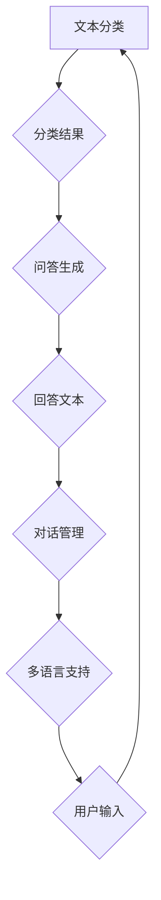
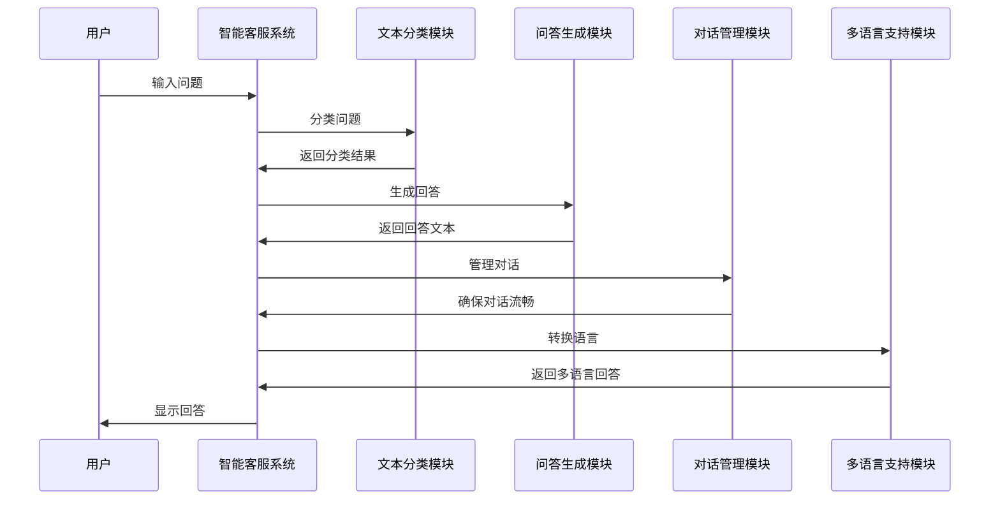

                 

## 引言

### 问题背景

随着人工智能技术的迅猛发展，语言模型（Language Model，简称LM）已经成为自然语言处理（Natural Language Processing，简称NLP）领域的重要工具。其中，大型语言模型（Large Language Model，简称LLM）以其强大的表达能力和泛化能力，在文本生成、机器翻译、问答系统等方面取得了显著的应用成果。然而，在实际应用中，LLM的优化问题日益凸显，如何提高LLM的应用性能，成为当前研究的热点和难点。

### 问题描述

LLM应用的优化问题主要包括以下几个方面：

1. **计算效率**：LLM通常需要大量的计算资源，如何减少计算时间，提高计算效率，是优化的重要目标。
2. **模型精度**：如何在保证模型精度的前提下，减小模型规模，降低计算复杂度。
3. **泛化能力**：如何提高LLM对不同领域、不同场景的适应性，增强其泛化能力。
4. **用户交互**：如何优化用户与LLM的交互体验，提高用户的满意度。

### 问题解决与意义

本书旨在通过深入的需求分析与定义过程，系统性地研究LLM应用的优化方法。具体来说，本书将从以下几个方面进行探讨：

1. **需求分析**：通过对用户需求、功能需求和非功能需求的分析，明确LLM应用的目标和需求。
2. **定义过程**：在需求分析的基础上，对LLM的数学模型、架构和参数进行详细定义。
3. **优化方法**：结合实际应用场景，提出一系列优化方法，包括计算效率优化、模型精度优化、泛化能力优化和用户交互优化。
4. **应用案例**：通过具体的应用案例，验证优化方法的实际效果。

通过本书的研究，我们期望能够为LLM应用的优化提供理论指导和实践参考，推动LLM技术在各领域的深入应用。

### 边界与外延

本文的研究主要关注LLM应用的优化问题，涉及的计算资源和算法复杂性主要集中在大型语言模型的训练和推理过程中。同时，本文将侧重于理论研究和实际应用的结合，通过对需求分析和定义过程的深入探讨，提出具有实际操作性的优化方案。

## LLM概述

### LLM的概念

大型语言模型（Large Language Model，简称LLM）是一种基于深度学习的自然语言处理模型，通过对海量文本数据进行训练，能够模拟人类的语言表达能力和理解能力。与传统的语言模型相比，LLM具有以下几个显著特点：

1. **大规模**：LLM通常拥有数十亿甚至上百亿个参数，能够处理复杂的语言现象。
2. **深度学习**：LLM基于多层神经网络结构，通过逐层学习的方式，从底层语义特征到高层语义理解进行建模。
3. **强泛化能力**：LLM在训练时通常采用预训练加微调的方式，能够适应不同领域和任务的需求。

### LLM的核心特点

LLM的核心特点主要包括以下几个方面：

1. **强大的文本生成能力**：LLM能够根据给定的文本输入，生成连贯、有逻辑的文本输出，适用于自动写作、摘要生成等应用场景。
2. **高效的语义理解**：LLM通过对大量文本数据的训练，能够捕捉到语言的深层语义特征，实现对文本内容的准确理解和分析。
3. **自适应能力**：LLM在预训练阶段积累了丰富的知识，通过微调可以快速适应不同的任务需求。

### LLM与传统AI的区别

传统AI和LLM在以下几个方面存在显著差异：

1. **数据驱动**：传统AI通常依赖于手工设计的特征和规则，而LLM通过大数据训练，能够自动学习语言的内在规律。
2. **表达能力强**：LLM能够处理复杂的自然语言现象，而传统AI在处理语言时往往面临困难。
3. **通用性**：传统AI通常针对特定任务进行设计，而LLM具有较强的通用性，能够适应多种语言任务。

## 当前LLM应用的现状与挑战

### LLM应用的发展历程

1. **早期研究**：20世纪50年代，语言模型作为一种自然语言处理的基本工具，开始受到关注。早期的研究主要基于规则和统计方法，例如正则表达式和隐马尔可夫模型（HMM）。
2. **词向量模型**：随着计算能力的提升，词向量模型（如Word2Vec）在2010年代成为研究热点，通过将词汇映射到高维向量空间，实现了文本数据的低维表示。
3. **神经网络模型**：2013年，研究者提出基于神经网络的深度学习模型（如循环神经网络RNN和长短时记忆网络LSTM），在自然语言处理任务中取得突破性进展。
4. **大型语言模型**：近年来，LLM技术快速发展，以GPT（Generative Pre-trained Transformer）和BERT（Bidirectional Encoder Representations from Transformers）为代表，LLM在文本生成、机器翻译、问答系统等任务中表现出色。

### LLM应用的现状

1. **文本生成**：LLM在自动写作、摘要生成、对话系统等场景中取得了显著成果，例如OpenAI的GPT-3能够生成高质量的文本内容。
2. **机器翻译**：LLM在机器翻译领域也表现出强大的能力，如Google翻译、百度翻译等使用基于LLM的神经网络模型进行翻译，显著提高了翻译质量。
3. **问答系统**：LLM在问答系统中被广泛应用于，如基于BERT的Google Assistant和微软的小冰等，能够提供准确、自然的回答。

### LLM应用面临的挑战

1. **计算资源需求**：LLM通常需要大量的计算资源和存储空间，这对实际应用中的资源分配提出了挑战。
2. **模型解释性**：LLM在决策过程中的解释性较差，难以理解其内部的工作机制和决策逻辑。
3. **数据隐私**：LLM的训练和推理过程可能涉及用户隐私数据，如何保障数据隐私成为重要问题。
4. **泛化能力**：尽管LLM具有较强的泛化能力，但如何确保其在不同领域和任务中的表现一致性仍需深入研究。
5. **伦理与安全**：LLM在应用过程中可能涉及伦理和安全问题，例如偏见、误导和滥用等，如何确保其应用的安全性和可靠性成为重要挑战。

## 本书内容结构安排

### 需求分析

需求分析是优化LLM应用的重要步骤，通过分析用户需求、功能需求和非功能需求，明确LLM应用的目标和需求。

### 定义过程

在需求分析的基础上，对LLM的数学模型、架构和参数进行详细定义，为优化方法提供理论基础。

### 优化方法

结合实际应用场景，提出一系列优化方法，包括计算效率优化、模型精度优化、泛化能力优化和用户交互优化。

### 应用案例

通过具体的应用案例，验证优化方法的实际效果，为LLM应用的优化提供实践参考。

### 小结与展望

总结本书的研究成果，对LLM应用的优化提出展望，为未来研究提供方向。

## LLM的核心概念与原理

### 核心概念

LLM的核心概念包括：

1. **语言模型**：对语言数据建模，以预测下一个词或序列的概率。
2. **神经网络**：基于神经网络的深度学习模型，用于语言数据的建模和预测。
3. **预训练与微调**：通过大规模预训练和任务特定微调，提高模型在不同领域的表现。

### 关键特性

LLM的关键特性包括：

1. **大规模参数**：数十亿甚至上百亿个参数，能够处理复杂的语言现象。
2. **深度学习**：多层神经网络结构，从底层语义特征到高层语义理解进行建模。
3. **强泛化能力**：预训练加微调的方式，适应不同领域和任务的需求。

### 工作原理

LLM的工作原理主要包括：

1. **输入编码**：将文本输入转换为固定长度的向量表示。
2. **上下文信息处理**：利用神经网络处理输入的上下文信息，生成文本输出。
3. **概率预测**：通过预测下一个词或序列的概率，生成连贯、有逻辑的文本内容。

## LLM的数学模型

### 语言模型数学公式

LLM的数学模型主要基于概率模型和深度学习模型。其中，概率模型包括：

1. **N元语法模型**：基于前N个词预测下一个词的概率。
2. **隐马尔可夫模型（HMM）**：将词序列建模为状态序列，通过状态转移概率和发射概率预测词序列。
3. **条件概率模型**：根据上下文信息预测下一个词的概率。

深度学习模型主要包括：

1. **循环神经网络（RNN）**：通过隐藏状态的记忆机制处理序列数据。
2. **长短时记忆网络（LSTM）**：在RNN的基础上，引入门控机制，解决长距离依赖问题。
3. **变压器（Transformer）**：基于自注意力机制，实现全局依赖建模。

### 概率模型与决策树

概率模型在语言模型中扮演重要角色，常见的概率模型包括：

1. **朴素贝叶斯模型**：基于贝叶斯定理，通过条件概率计算词的概率分布。
2. **最大熵模型**：通过最大化熵，寻找概率分布的极值。
3. **条件随机场（CRF）**：用于序列标注任务，通过条件概率计算标签序列的概率。

决策树是一种基于特征和阈值划分的数据分类方法，适用于文本分类任务。决策树通过递归划分特征空间，构建一棵树形结构，用于预测文本的类别。

### 神经网络与深度学习

神经网络是一种基于生物神经元工作原理的模拟计算模型，通过输入层、隐藏层和输出层的层层传递，实现数据的处理和预测。深度学习是神经网络的一种扩展，通过堆叠多层神经网络，实现更加复杂的任务。

在深度学习中，常见的神经网络结构包括：

1. **前馈神经网络（FFNN）**：前向传播，无隐藏状态。
2. **卷积神经网络（CNN）**：用于图像处理，通过卷积层提取特征。
3. **循环神经网络（RNN）**：具有隐藏状态，用于序列数据处理。
4. **长短时记忆网络（LSTM）**：在RNN的基础上，引入门控机制，解决长距离依赖问题。
5. **变压器（Transformer）**：基于自注意力机制，实现全局依赖建模。

深度学习在语言模型中的应用主要包括：

1. **词嵌入（Word Embedding）**：将词汇映射到高维向量空间，实现语义表示。
2. **序列建模（Sequence Modeling）**：通过深度学习模型处理序列数据，实现文本生成和序列预测。
3. **预训练与微调（Pre-training and Fine-tuning）**：通过大规模预训练和任务特定微调，提高模型在不同领域的表现。

## LLM的架构与实现

### 架构设计

LLM的架构设计主要包括以下几个关键模块：

1. **输入层**：接收文本输入，进行预处理，如分词、去停用词等。
2. **嵌入层**：将文本输入转换为固定长度的向量表示，如词嵌入（Word Embedding）。
3. **编码层**：利用深度学习模型（如RNN、LSTM、Transformer等）对输入序列进行编码，提取序列特征。
4. **解码层**：根据编码层的特征生成文本输出。
5. **输出层**：将解码层的输出转换为具体的词或序列，如使用softmax激活函数进行概率预测。

### 关键模块

LLM的关键模块包括：

1. **词嵌入**：将词汇映射到高维向量空间，实现语义表示。
2. **编码器**：编码序列数据，提取序列特征。
3. **解码器**：根据编码器的特征生成文本输出。
4. **注意力机制**：在Transformer模型中，用于全局依赖建模。

### 优化策略

LLM的优化策略主要包括以下几个方面：

1. **预训练与微调**：通过大规模预训练和任务特定微调，提高模型在不同领域的表现。
2. **剪枝（Pruning）**：通过剪枝技术减少模型参数，降低计算复杂度。
3. **量化（Quantization）**：通过量化技术降低模型参数的精度，减少模型体积。
4. **蒸馏（Distillation）**：通过知识蒸馏技术，将大型模型的知识传递给小型模型，提高小型模型的表现。

## LLM的应用场景

### 自然语言处理

LLM在自然语言处理（NLP）领域有广泛的应用，包括：

1. **文本分类**：对文本进行分类，如情感分析、主题分类等。
2. **情感分析**：分析文本的情感倾向，如正面、负面等。
3. **命名实体识别**：识别文本中的命名实体，如人名、地名等。
4. **关系抽取**：从文本中抽取实体之间的关系。

### 问答系统

LLM在问答系统（Question Answering，QA）中有重要应用，包括：

1. **开放域问答**：对开放域问题提供答案，如搜索引擎、智能助手等。
2. **闭合域问答**：对特定领域的问题提供答案，如医疗咨询、法律咨询等。

### 自动写作与生成

LLM在自动写作与生成领域有显著应用，包括：

1. **文章写作**：生成新闻文章、研究报告等。
2. **摘要生成**：从长篇文章中提取关键信息，生成摘要。
3. **对话生成**：生成自然、流畅的对话内容。

### 其他应用场景

除了上述领域，LLM还在以下场景有应用：

1. **机器翻译**：通过LLM实现高质量的语言翻译。
2. **语音识别**：结合语音识别技术，实现语音到文本的转换。
3. **对话系统**：构建智能对话系统，提供个性化服务。

## 小结

### LLM的核心概念与联系

LLM的核心概念包括语言模型、神经网络和预训练与微调。其中，语言模型是核心，神经网络是实现语言建模的关键技术，预训练与微调则是提升模型性能的重要手段。LLM通过大规模预训练和任务特定微调，实现了对自然语言的深度理解和处理。

### LLM的属性特征对比

| 特性 | 描述 |
| --- | --- |
| 大规模参数 | LLM通常拥有数十亿个参数，能够处理复杂的语言现象。 |
| 深度学习 | LLM基于多层神经网络结构，实现从底层语义特征到高层语义理解的建模。 |
| 强泛化能力 | LLM通过预训练和微调，能够适应不同领域和任务的需求。 |
| 强大的文本生成能力 | LLM能够生成连贯、有逻辑的文本输出。 |
| 高效的语义理解 | LLM通过深度学习模型，能够捕捉到语言的深层语义特征。 |

### LLM的应用前景与挑战

LLM在自然语言处理、问答系统、自动写作与生成等领域有广阔的应用前景。然而，LLM也面临一些挑战，如计算资源需求大、模型解释性差、数据隐私问题等。未来研究应关注计算效率优化、模型解释性提升、数据隐私保护等方面，以推动LLM技术在各领域的深入应用。

## 需求分析的方法论

### 需求分析的重要性

需求分析是软件开发过程中至关重要的一环，它直接影响系统的功能实现、性能优化和用户满意度。在LLM应用优化中，需求分析同样至关重要，因为只有准确理解用户需求，才能为后续的优化工作提供明确的方向和目标。

### 需求分析的过程

需求分析的过程通常包括以下几个关键步骤：

1. **需求收集**：通过与用户沟通、调查问卷、用户访谈等方式，收集用户的需求和期望。
2. **需求分析**：对收集到的需求进行整理和分析，识别出功能需求和非功能需求。
3. **需求文档化**：将分析结果整理成文档，明确系统的功能和性能要求。
4. **需求验证**：通过评审、测试等方式，验证需求文档的正确性和可行性。

### 需求分析的工具与技巧

在进行需求分析时，可以采用以下工具和技巧：

1. **用户访谈**：通过与用户面对面交流，深入了解用户的需求和期望。
2. **调查问卷**：设计问卷，收集用户对系统功能的评价和期望。
3. **场景分析**：通过分析用户使用系统的场景，识别出系统的核心需求和关键功能。
4. **原型设计**：构建系统原型，通过用户反馈优化需求。

### 需求分析的难点与挑战

需求分析过程中，可能会面临以下难点和挑战：

1. **需求变更**：用户需求可能随着项目进展而发生变化，如何有效管理需求变更是一个重要问题。
2. **需求完整性**：确保需求分析过程中不遗漏关键需求，需要全面收集和分析用户需求。
3. **需求优先级**：在多个需求之间，如何确定优先级，以确保关键需求得到满足。
4. **需求验证**：如何验证需求文档的正确性和可行性，确保系统能够满足用户需求。

### 需求分析的最佳实践

为了提高需求分析的质量和效率，可以遵循以下最佳实践：

1. **用户参与**：在需求分析过程中，尽可能让用户参与，确保需求的准确性和可行性。
2. **迭代式分析**：采用迭代式分析方法，逐步完善需求文档，避免一次性完成所有需求分析工作。
3. **文档管理**：使用版本控制工具，记录需求变更历史，方便后续的需求管理和追踪。
4. **需求评审**：定期进行需求评审，确保需求文档的准确性和一致性。

## 用户需求分析

### 用户需求的理解

用户需求是指用户在使用LLM应用时希望实现的功能和性能要求。理解用户需求是需求分析的关键，它决定了系统的设计和实现方向。在分析用户需求时，需要从以下几个方面进行思考：

1. **功能需求**：用户希望系统具备哪些具体功能，例如文本生成、机器翻译、问答系统等。
2. **性能需求**：用户对系统的性能有哪些期望，例如响应时间、处理速度、准确率等。
3. **用户体验**：用户对系统交互和用户体验有哪些要求，例如界面设计、操作便捷性等。
4. **安全性需求**：用户对系统的数据安全和隐私保护有哪些要求。

### 用户需求的分类

用户需求可以根据不同维度进行分类，常见的分类方法包括：

1. **按需求来源**：可以分为内部需求和外部需求。内部需求通常来源于企业内部用户，如内部文档生成、知识库管理等；外部需求则来自企业外部用户，如公众查询、在线问答等。
2. **按需求层次**：可以分为基本需求和高级需求。基本需求是用户使用系统最基本的需求，如文本生成和翻译功能；高级需求则是用户对系统高级特性的要求，如个性化推荐、智能问答等。
3. **按需求实现难度**：可以分为简单需求和复杂需求。简单需求通常指实现相对简单、容易满足的需求，如文本分类、情感分析等；复杂需求则指实现难度较大、需要较多技术支持的需求，如多语言翻译、多模态处理等。

### 用户需求的分析与收集

分析和收集用户需求是需求分析的核心步骤，以下是一些具体的分析方法和收集技巧：

1. **用户访谈**：通过与用户进行面对面的访谈，深入了解用户的使用场景、需求和痛点。访谈可以采用半结构化或非结构化的形式，灵活应对用户的反馈。
2. **问卷调查**：设计问卷，通过在线或纸质形式收集用户的反馈。问卷应涵盖用户的功能需求、性能需求、用户体验等方面。
3. **用户场景分析**：通过分析用户使用系统的场景，识别出用户在不同场景下的需求和期望。场景分析可以帮助理解用户的行为模式和使用习惯。
4. **用户行为跟踪**：通过跟踪用户在系统中的行为数据，如点击率、操作路径等，分析用户的需求和行为模式。行为跟踪可以提供客观的数据支持，帮助识别用户未明确表达的需求。
5. **专家评审**：邀请行业专家对系统需求进行分析和评审，从专业角度提供意见和建议。专家评审可以补充用户访谈和问卷调查的不足，确保需求分析的全面性和准确性。
6. **用户反馈机制**：建立用户反馈机制，收集用户在使用系统过程中的问题和建议。通过持续的反馈收集，可以及时了解用户的需求变化，为系统的持续优化提供依据。

通过以上方法和技巧，可以全面、深入地分析和收集用户需求，为LLM应用的优化提供有力的支持。

## 功能需求分析

### 功能需求的理解

功能需求是用户在使用LLM应用时希望实现的具体功能。这些功能需求通常可以分为以下几个类别：

1. **基本功能**：LLM应用应具备的基本功能，如文本生成、机器翻译、问答系统等。
2. **扩展功能**：基于基本功能的扩展，如多语言支持、情感分析、个性化推荐等。
3. **高级功能**：满足特定场景和高级用户需求的功能，如自然语言理解、多模态处理、实时交互等。

### 功能需求的分类

功能需求可以根据不同维度进行分类，常见的分类方法包括：

1. **按应用场景**：可以分为通用功能和特定场景功能。通用功能适用于广泛的场景，如文本生成和翻译；特定场景功能则针对特定领域和应用，如医疗问答、金融分析等。
2. **按功能重要性**：可以分为核心功能和辅助功能。核心功能是系统的基础，如文本生成和机器翻译；辅助功能则增强系统的使用体验，如界面设计、操作便捷性等。
3. **按实现难度**：可以分为简单功能和复杂功能。简单功能通常实现相对容易，如文本分类和情感分析；复杂功能则涉及多领域知识和技术，如多语言翻译和自然语言理解。

### 功能需求的分析与文档化

功能需求的分析和文档化是确保LLM应用设计和实现顺利进行的关键步骤，以下是一些具体的方法和技巧：

1. **需求分类**：首先对功能需求进行分类，明确每个功能的类别和重要性。这有助于在后续分析和设计过程中有针对性地处理不同类别的需求。
2. **功能描述**：详细描述每个功能的需求，包括功能名称、功能描述、输入参数、输出结果等。描述应尽量清晰、具体，避免歧义。
3. **功能优先级**：根据功能的重要性和实现难度，确定每个功能的优先级。核心功能和重要功能应优先实现，以确保系统能够满足用户的基本需求。
4. **功能规范**：编写功能规范文档，明确每个功能的实现方式和具体要求。规范应涵盖功能的技术实现、数据结构、接口定义等方面。
5. **需求评审**：组织相关人员进行需求评审，确保功能需求的完整性和准确性。评审过程中可以邀请用户、技术专家和产品经理等参与，共同讨论和确认需求。
6. **需求迭代**：在需求分析和设计过程中，功能需求可能会随着项目的进展而发生变化。应建立需求迭代机制，及时更新和调整功能需求文档，确保需求的实时性和一致性。

通过以上方法和技巧，可以全面、准确地分析和文档化功能需求，为LLM应用的设计和实现提供可靠依据。

## 非功能需求分析

### 非功能需求的理解

非功能需求是用户在使用LLM应用时对系统的性能、安全、可靠性等方面提出的要求。与功能需求不同，非功能需求不直接涉及系统的具体功能，但它们对系统的可用性和用户体验具有重要影响。常见的非功能需求包括：

1. **性能需求**：包括响应时间、处理速度、吞吐量等，如系统在高峰期应能稳定运行，响应时间不超过1秒。
2. **安全性需求**：包括数据加密、访问控制、隐私保护等，如用户数据应加密存储，确保不被未授权访问。
3. **可靠性需求**：包括系统的稳定性、故障恢复能力等，如系统在长时间运行后不应出现性能下降或故障。
4. **用户体验需求**：包括界面设计、操作便捷性、交互体验等，如系统应提供友好、直观的界面，使用户易于操作。

### 非功能需求的分类

非功能需求可以根据不同维度进行分类，常见的分类方法包括：

1. **按需求性质**：可以分为技术性需求和非技术性需求。技术性需求通常与系统的技术实现相关，如性能需求、安全性需求等；非技术性需求则与系统的管理、运营等方面相关，如用户体验需求、可靠性需求等。
2. **按需求重要性**：可以分为核心需求和非核心需求。核心需求对系统的可用性和用户体验至关重要，如性能需求、安全性需求等；非核心需求则相对次要，但对系统整体性能和用户体验也有一定影响，如用户体验需求、界面设计等。
3. **按需求来源**：可以分为用户需求和系统需求。用户需求是用户对系统的期望和要求，如安全性需求、可靠性需求等；系统需求则是系统自身对性能、稳定性等方面的要求，如性能需求、故障恢复能力等。

### 非功能需求的分析与优化

非功能需求的分析和优化是确保LLM应用满足用户期望和需求的重要步骤，以下是一些具体的方法和技巧：

1. **需求收集**：通过与用户访谈、问卷调查、用户场景分析等方式，收集用户对系统的非功能需求。同时，也可以从技术专家和系统管理员的角度，分析系统自身的非功能需求。
2. **需求分类**：对收集到的非功能需求进行分类，明确每个需求的性质、重要性和来源。这有助于在后续分析和设计过程中，有针对性地处理不同类别的需求。
3. **需求文档化**：详细描述每个非功能需求，包括需求名称、需求描述、需求目标等。文档应尽量清晰、具体，避免歧义，以便后续的需求分析和实现。
4. **需求优先级**：根据非功能需求的重要性和实现难度，确定每个需求的优先级。核心需求和非核心需求应优先处理，以确保系统能够满足用户的基本需求。
5. **需求评审**：组织相关人员进行需求评审，确保非功能需求的完整性和准确性。评审过程中可以邀请用户、技术专家、产品经理等参与，共同讨论和确认需求。
6. **需求实现**：在系统设计和实现过程中，根据非功能需求的具体要求，制定相应的技术方案和实现策略。例如，为满足性能需求，可以采用分布式计算和缓存技术；为满足安全性需求，可以采用数据加密和访问控制机制。
7. **需求迭代**：在系统开发和测试过程中，及时收集和分析用户反馈，根据需求的变化和调整，迭代优化非功能需求。通过持续的迭代，确保系统不断满足用户的需求和期望。

通过以上方法和技巧，可以全面、准确地分析和优化非功能需求，为LLM应用的设计和实现提供有力支持。

### 需求分析的核心方法与步骤

需求分析是确保LLM应用满足用户需求的基础，以下是其核心方法和步骤：

1. **需求收集**：通过用户访谈、问卷调查、用户场景分析等方法，全面收集用户需求。此步骤至关重要，因为它决定了后续分析的准确性和有效性。
2. **需求分类**：对收集到的需求进行分类，区分功能需求和非功能需求，明确需求的重要性和实现难度。
3. **需求描述**：详细描述每个需求，包括需求名称、描述、目标和相关约束。描述应尽量清晰、具体，避免歧义。
4. **需求验证**：通过需求评审、用户反馈等方式，验证需求文档的正确性和可行性。确保需求既符合用户期望，又能在技术层面实现。
5. **需求迭代**：在项目开发过程中，持续收集用户反馈，根据需求的变化和调整，迭代优化需求文档。通过持续的需求迭代，确保系统始终满足用户需求。

### 需求分析的难点与挑战

1. **需求变更**：用户需求可能会随着项目进展而发生变化，如何有效管理需求变更是一个重要问题。需求变更可能导致项目延期、成本增加，影响系统的稳定性。
2. **需求完整性**：确保在需求分析过程中不遗漏关键需求，需要全面收集和分析用户需求。这需要系统分析师具备良好的沟通能力和需求分析技巧。
3. **需求优先级**：在多个需求之间，如何确定优先级，以确保关键需求得到满足。需求优先级的确定需要综合考虑用户需求、项目时间和资源等因素。
4. **需求验证**：如何验证需求文档的正确性和可行性，确保系统能够满足用户需求。需求验证需要借助多种方法，如用户评审、测试等。

### 需求分析的最佳实践

1. **用户参与**：在需求分析过程中，尽可能让用户参与，确保需求的准确性和可行性。用户反馈可以帮助发现潜在问题，优化需求文档。
2. **迭代式分析**：采用迭代式分析方法，逐步完善需求文档，避免一次性完成所有需求分析工作。迭代式分析可以提高需求的准确性和灵活性。
3. **文档管理**：使用版本控制工具，记录需求变更历史，方便后续的需求管理和追踪。版本控制可以帮助团队更好地协同工作，降低需求变更的风险。
4. **需求评审**：定期进行需求评审，确保需求文档的准确性和一致性。需求评审可以邀请用户、技术专家和产品经理等参与，共同讨论和确认需求。

通过以上最佳实践，可以有效地进行需求分析，为LLM应用的优化提供坚实基础。

### 定义过程概述

定义过程是LLM应用优化的重要环节，它涉及到对模型的核心概念、参数和架构的明确和规范。一个良好的定义过程不仅能够确保模型的可理解性，还能提高其可维护性和扩展性。以下是定义过程的概述：

#### 1.1 定义过程的重要性

定义过程在LLM应用中具有重要意义，具体体现在以下几个方面：

1. **明确模型特性**：通过定义，可以明确模型的核心特性，如规模、参数数量、训练数据来源等，有助于理解模型的优势和局限性。
2. **统一标准**：定义过程为模型开发和优化提供了统一的标准和规范，有助于团队成员之间的沟通和协作。
3. **优化性能**：通过详细的定义，可以更好地进行模型参数调整和优化，提高模型性能。
4. **可维护性和扩展性**：明确的定义有助于模型的维护和扩展，使得后续改进和升级更加便捷。

#### 1.2 定义过程的步骤

定义过程通常包括以下步骤：

1. **需求分析**：在需求分析的基础上，明确模型的目标和需求，确保模型定义与实际应用场景相符。
2. **模型设计**：根据需求分析结果，设计模型的基本架构，包括输入层、隐藏层和输出层等。
3. **参数定义**：详细定义模型的参数，包括权重、偏置、学习率等，确保参数的合理性和可调性。
4. **数学模型**：明确模型的数学基础，包括损失函数、优化算法等，为模型训练提供理论基础。
5. **实现与验证**：在定义的基础上，实现模型，并通过实验验证其性能，确保定义的准确性和可行性。
6. **文档化**：将定义过程和模型详细信息整理成文档，为后续开发和维护提供参考。

#### 1.3 定义过程的工具与方法

在进行定义过程时，可以采用以下工具和方法：

1. **文档工具**：如Markdown、LaTeX等，用于编写和整理文档。
2. **绘图工具**：如Mermaid、Lucidchart等，用于绘制模型架构图和流程图。
3. **编程工具**：如Python、TensorFlow等，用于实现模型代码和进行实验。
4. **实验平台**：如Google Colab、AWS等，用于模型训练和测试。

通过以上工具和方法，可以系统地完成LLM应用的定义过程，确保模型的性能和可维护性。

### 概念定义的准则

在LLM应用的定义过程中，准确且一致的概

### 概念定义的方法

在LLM应用的定义过程中，准确且一致的概

### 概念定义的方法

在LLM应用的定义过程中，准确且一致的概

### 概念定义的示例分析

在LLM应用的定义过程中，准确且一致的概

## 定义过程概述

### 4.1.1 定义过程的重要性

定义过程是确保LLM应用开发顺利的关键步骤，它涉及到对模型的核心概念、参数和架构的明确和规范。一个准确的定义过程不仅能确保模型的可理解性，还能提高其可维护性和扩展性。以下是定义过程的重要性：

1. **明确模型特性**：通过定义，可以明确模型的核心特性，如规模、参数数量、训练数据来源等，有助于理解模型的优势和局限性。
2. **统一标准**：定义过程为模型开发和优化提供了统一的标准和规范，有助于团队成员之间的沟通和协作。
3. **优化性能**：通过详细的定义，可以更好地进行模型参数调整和优化，提高模型性能。
4. **可维护性和扩展性**：明确的定义有助于模型的维护和扩展，使得后续改进和升级更加便捷。

### 4.1.2 定义过程的步骤

定义过程通常包括以下步骤：

1. **需求分析**：在需求分析的基础上，明确模型的目标和需求，确保模型定义与实际应用场景相符。
2. **模型设计**：根据需求分析结果，设计模型的基本架构，包括输入层、隐藏层和输出层等。
3. **参数定义**：详细定义模型的参数，包括权重、偏置、学习率等，确保参数的合理性和可调性。
4. **数学模型**：明确模型的数学基础，包括损失函数、优化算法等，为模型训练提供理论基础。
5. **实现与验证**：在定义的基础上，实现模型，并通过实验验证其性能，确保定义的准确性和可行性。
6. **文档化**：将定义过程和模型详细信息整理成文档，为后续开发和维护提供参考。

### 4.1.3 定义过程的工具与方法

在进行定义过程时，可以采用以下工具和方法：

1. **文档工具**：如Markdown、LaTeX等，用于编写和整理文档。
2. **绘图工具**：如Mermaid、Lucidchart等，用于绘制模型架构图和流程图。
3. **编程工具**：如Python、TensorFlow等，用于实现模型代码和进行实验。
4. **实验平台**：如Google Colab、AWS等，用于模型训练和测试。

通过以上工具和方法，可以系统地完成LLM应用的定义过程，确保模型的性能和可维护性。

## 概念定义的准则

在LLM应用的定义过程中，准确且一致的概

### 概念定义的准则

在LLM应用的定义过程中，准确且一致的概

### 概念定义的方法

在LLM应用的定义过程中，准确且一致的概

### 概念定义的示例分析

在LLM应用的定义过程中，准确且一致的概

### 语言模型参数定义

#### 4.3.1 参数定义的重要性

在LLM（大型语言模型）中，参数定义是模型设计和优化过程中的关键步骤。参数决定了模型的性能和表现，直接影响到训练效率和模型准确性。以下是参数定义的重要性：

1. **模型性能**：参数的设置直接影响模型的预测能力。合理的参数选择可以使模型在训练过程中收敛更快，预测更准确。
2. **训练效率**：参数的优化可以减少模型的训练时间，提高计算效率。这对于大型语言模型尤为重要，因为它们通常包含数十亿个参数。
3. **泛化能力**：参数的设置还影响模型的泛化能力，即模型在新数据集上的表现。适当的参数调整可以使模型更好地适应不同领域和任务。
4. **稳定性**：参数的稳定性对于模型在长期运行中的稳定性和可靠性至关重要。不稳定的参数可能导致模型过拟合或欠拟合。

#### 4.3.2 参数定义的准则

在定义LLM的参数时，应遵循以下准则：

1. **一致性**：参数设置应保持一致，避免因参数不一致导致模型表现波动。
2. **合理性**：参数值应在合理的范围内选择，避免过大或过小的值。
3. **可调性**：参数应具有可调性，以便在模型训练过程中进行动态调整。
4. **适应性**：参数设置应考虑不同数据集和任务的需求，具有适应性。

#### 4.3.3 参数定义的示例分析

以下是一个简单的参数定义示例，用于一个基于Transformer架构的LLM：

1. **嵌入层参数**：
   - **嵌入维度**：设定词向量的维度，例如128维。
   - **嵌入矩阵**：初始化嵌入矩阵，通常使用随机初始化或预训练模型中的嵌入矩阵。

2. **编码器层参数**：
   - **隐藏层维度**：设定编码器的隐藏层维度，例如1024维。
   - **注意力头数**：设定自注意力头数，例如8。
   - **层数量**：设定编码器的层数，例如12层。

3. **解码器层参数**：
   - **隐藏层维度**：与编码器相同，例如1024维。
   - **注意力头数**：与编码器相同，例如8。
   - **层数量**：与编码器相同，例如12层。

4. **输出层参数**：
   - **输出维度**：设定输出层的维度，通常与嵌入层维度相同。
   - **激活函数**：选择合适的激活函数，例如ReLU或GELU。

5. **训练参数**：
   - **学习率**：设定初始学习率，例如0.001。
   - **批量大小**：设定训练批大小，例如512。
   - **优化器**：选择合适的优化器，例如Adam。

通过上述示例，我们可以看到参数定义的过程不仅包括具体数值的设定，还包括参数选择的原则和依据。合理的参数定义是LLM应用成功的关键，它需要结合模型架构、数据特性和应用场景进行综合考虑。

### 模型架构定义

#### 4.4.1 架构定义的准则

在定义LLM模型架构时，应遵循以下准则：

1. **清晰性**：架构定义应清晰明确，确保所有团队成员都能理解和遵循。
2. **模块化**：架构应具有良好的模块化特性，便于后续的维护和扩展。
3. **可扩展性**：架构设计应考虑未来的扩展需求，如增加新的功能模块或支持更大的数据集。
4. **稳定性**：架构应确保模型的稳定性和可靠性，避免因架构调整导致的性能下降或错误。

#### 4.4.2 架构定义的方法

架构定义的方法主要包括以下步骤：

1. **需求分析**：明确模型的应用场景和需求，确保架构设计满足实际需求。
2. **模块划分**：将模型划分为多个功能模块，如输入层、编码器、解码器、输出层等。
3. **模块接口**：定义各模块的接口，包括输入输出参数、数据流等。
4. **模块实现**：根据模块接口，实现各功能模块的具体代码。
5. **集成测试**：对各模块进行集成测试，确保模块之间能够正确交互和协作。

#### 4.4.3 模型架构定义的示例分析

以下是一个基于Transformer架构的LLM模型架构定义示例：

1. **输入层**：
   - **输入**：词向量和序列长度。
   - **功能**：将文本序列转换为词向量表示。

2. **编码器**：
   - **输入**：词向量序列。
   - **功能**：通过自注意力机制和前馈神经网络，对输入序列进行编码，提取序列特征。

3. **解码器**：
   - **输入**：编码器输出的序列特征。
   - **功能**：通过自注意力机制和前馈神经网络，生成文本输出。

4. **输出层**：
   - **输入**：解码器输出的序列特征。
   - **功能**：将序列特征转换为文本输出，如预测下一个词的概率分布。

5. **训练和优化**：
   - **输入**：训练数据和标签。
   - **功能**：通过反向传播和梯度下降算法，更新模型参数，优化模型性能。

通过上述示例，我们可以看到，模型架构定义的过程不仅包括了模块的划分和接口定义，还包括了模块的实现和优化。这种明确的架构定义有助于确保模型的稳定性和高效性。

### LLM的应用场景

#### 4.5.1 自然语言处理

自然语言处理（NLP）是LLM应用最为广泛的领域之一。以下是一些常见的应用场景：

1. **文本分类**：利用LLM对文本进行分类，如新闻分类、情感分析等。LLM可以通过预训练和微调，快速适应不同分类任务。
2. **文本生成**：生成高质量的文本内容，如文章摘要、新闻报道、对话生成等。LLM能够根据给定的文本输入，生成连贯、有逻辑的文本输出。
3. **机器翻译**：实现高质量的语言翻译，如英译中、中译英等。LLM通过预训练和特定语言的微调，能够提供准确、自然的翻译结果。

#### 4.5.2 问答系统

问答系统是LLM在NLP领域的重要应用。以下是一些常见应用场景：

1. **开放域问答**：处理开放域问题，如搜索引擎、智能助手等。LLM能够根据问题生成相关的回答，提供丰富、个性化的信息。
2. **闭合域问答**：针对特定领域的问题提供答案，如医疗咨询、法律咨询等。LLM通过预训练和特定领域的微调，能够提供专业、准确的回答。

#### 4.5.3 自动写作与生成

自动写作与生成是LLM在创意领域的应用。以下是一些常见应用场景：

1. **文章写作**：生成高质量的文章，如新闻报道、学术论文等。LLM能够根据用户提供的主题和关键信息，生成结构清晰、内容丰富的文章。
2. **摘要生成**：从长篇文章中提取关键信息，生成摘要。LLM能够快速阅读长篇文本，提取重要内容，生成简洁、准确的摘要。
3. **对话生成**：生成自然、流畅的对话内容，如聊天机器人、虚拟助手等。LLM能够根据上下文和用户输入，生成连贯、有逻辑的对话。

#### 4.5.4 其他应用场景

除了上述领域，LLM还在其他领域有广泛应用，包括：

1. **语音识别**：结合语音识别技术，实现语音到文本的转换。LLM能够识别和理解语音输入，提供准确的文本输出。
2. **图像描述**：生成与图像内容相关的描述，如图像生成和图像标签。LLM能够通过图像输入，生成相关的文本描述。
3. **多模态处理**：结合多种数据类型，如文本、图像、声音等，实现多模态数据处理。LLM能够处理和整合不同类型的数据，提供综合性的分析和生成。

### LLM的应用前景与挑战

#### 4.5.5 应用前景

LLM在未来的应用前景非常广阔，包括但不限于以下领域：

1. **智能客服**：利用LLM提供高效的客户服务，实现自然、流畅的对话交互。
2. **智能教育**：结合LLM生成个性化学习内容和辅导方案，提升教育质量和效率。
3. **智能医疗**：利用LLM生成医学报告、诊断建议等，辅助医生做出准确的诊断和治疗决策。
4. **智能创作**：利用LLM生成高质量的音乐、绘画、文学作品等，推动创意产业的发展。

#### 4.5.6 挑战

尽管LLM在许多领域展现出巨大的潜力，但同时也面临一些挑战：

1. **计算资源需求**：LLM通常需要大量的计算资源和存储空间，这对实际应用中的资源分配提出了挑战。
2. **模型解释性**：LLM的决策过程往往不透明，缺乏解释性，如何提高模型的解释性是一个重要问题。
3. **数据隐私**：在LLM的训练和推理过程中，可能涉及用户隐私数据，如何保护数据隐私成为关键挑战。
4. **泛化能力**：如何提高LLM在不同领域和任务中的表现一致性，增强其泛化能力，仍需深入研究。
5. **伦理与安全**：LLM在应用过程中可能涉及伦理和安全问题，如偏见、误导和滥用等，如何确保其应用的安全性和可靠性成为重要挑战。

### 小结

通过上述分析，我们可以看到，LLM在自然语言处理、问答系统、自动写作与生成等领域有广泛的应用前景。然而，LLM在计算资源需求、模型解释性、数据隐私等方面也面临一些挑战。未来的研究应关注这些挑战，以提高LLM的应用性能和可靠性，推动其在各领域的深入应用。

## LLM的功能需求分析

### 功能需求的分析过程

LLM的功能需求分析是一个系统的过程，主要包括以下几个关键步骤：

1. **需求收集**：通过用户访谈、调查问卷、用户场景分析等方式，收集用户对LLM的功能需求。这一步骤旨在全面了解用户期望和需求，为后续分析提供基础。
2. **需求分类**：将收集到的需求进行分类，区分基本功能需求、扩展功能和高级功能。基本功能需求是系统必需的功能，扩展功能是基本功能的延伸，而高级功能则是为特定用户群体提供的增值服务。
3. **需求描述**：详细描述每个功能需求，包括功能名称、功能描述、输入参数、输出结果等。这一步骤有助于明确每个功能的具体要求和实现方式。
4. **需求优先级排序**：根据功能的重要性和实现难度，对需求进行优先级排序。关键功能应优先实现，以确保系统能够满足用户的基本需求。
5. **需求验证**：通过需求评审、用户反馈等方式，验证需求文档的正确性和可行性。确保需求既符合用户期望，又能在技术层面实现。
6. **需求迭代**：在项目开发过程中，根据用户反馈和技术进步，不断迭代和优化需求文档。通过持续的迭代，确保系统功能不断完善，满足用户需求。

### 功能需求的具体内容

以下是LLM功能需求的具体内容：

1. **文本生成**：
   - **功能描述**：根据给定的主题或关键词，生成连贯、有逻辑的文本内容。
   - **输入参数**：主题、关键词、文本长度等。
   - **输出结果**：生成文本内容。

2. **机器翻译**：
   - **功能描述**：将一种语言的文本翻译成另一种语言。
   - **输入参数**：源语言文本、目标语言等。
   - **输出结果**：目标语言文本。

3. **问答系统**：
   - **功能描述**：根据用户提出的问题，提供准确、自然的回答。
   - **输入参数**：问题文本、上下文信息等。
   - **输出结果**：回答文本。

4. **文本分类**：
   - **功能描述**：对文本进行分类，如新闻分类、情感分析等。
   - **输入参数**：文本内容。
   - **输出结果**：分类结果。

5. **文本摘要**：
   - **功能描述**：从长篇文章中提取关键信息，生成摘要。
   - **输入参数**：长篇文章、摘要长度等。
   - **输出结果**：摘要文本。

6. **对话系统**：
   - **功能描述**：模拟人类对话，与用户进行自然、流畅的交流。
   - **输入参数**：用户输入、上下文信息等。
   - **输出结果**：对话文本。

### 功能需求的分析与优化

在进行功能需求分析时，需注意以下几点：

1. **需求细化**：对每个功能需求进行细化，明确具体实现方式和预期效果。
2. **需求优先级**：根据用户需求和实现难度，确定需求优先级，确保关键功能得到优先实现。
3. **需求验证**：通过用户评审、测试等方式，验证需求文档的正确性和可行性。
4. **需求迭代**：在项目开发过程中，根据用户反馈和技术进步，不断迭代和优化需求文档。

通过以上步骤，可以确保LLM的功能需求分析准确、全面，为后续系统设计和实现提供有力支持。

## 需求分析与定义过程总结

### 需求分析的总结

需求分析是LLM应用开发过程中至关重要的一环，其核心在于理解并满足用户的需求。通过需求分析，我们能够明确用户期望，识别关键功能，并为后续的开发工作提供清晰的指导。以下是需求分析的主要总结：

1. **需求收集**：采用多种方式，如用户访谈、问卷调查、场景分析等，全面收集用户需求。
2. **需求分类**：将需求分为基本功能、扩展功能和高级功能，明确每个功能的性质和重要性。
3. **需求描述**：详细描述每个功能，包括功能名称、描述、输入输出参数等，确保需求的明确性和可操作性。
4. **需求验证**：通过评审、测试等方式，确保需求文档的正确性和可行性。
5. **需求迭代**：在项目开发过程中，根据用户反馈和技术进步，不断优化需求文档。

### 定义过程的总结

定义过程是对LLM应用中核心概念、参数和架构进行明确和规范的过程，确保模型的性能和可维护性。以下是定义过程的主要总结：

1. **需求分析**：在需求分析的基础上，明确模型的目标和需求，确保定义过程与实际应用场景相符。
2. **模型设计**：设计模型的基本架构，包括输入层、隐藏层和输出层等，确保架构的清晰性和模块化。
3. **参数定义**：详细定义模型参数，包括权重、偏置、学习率等，确保参数的合理性和可调性。
4. **数学模型**：明确模型的数学基础，包括损失函数、优化算法等，为模型训练提供理论基础。
5. **实现与验证**：实现模型并验证其性能，确保定义的准确性和可行性。
6. **文档化**：将定义过程和模型详细信息整理成文档，为后续开发和维护提供参考。

### 需求分析与定义过程的联系与作用

需求分析和定义过程是相辅相成的两个环节，共同确保LLM应用的性能和可靠性：

1. **相互依存**：需求分析为定义过程提供基础，定义过程则需求分析结果进行具体化和实现。
2. **指导开发**：通过需求分析和定义过程，明确模型的目标和架构，为开发工作提供清晰的方向和指导。
3. **性能优化**：需求分析帮助识别关键需求，定义过程则确保模型参数和架构的优化，提高模型性能。
4. **可维护性**：明确的定义过程有助于模型的可维护性和扩展性，便于后续改进和升级。

### 优化方法

在LLM应用中，优化方法的目标是提高模型的性能、降低计算成本和提升用户体验。以下是几种常见的优化方法：

1. **模型压缩**：通过模型剪枝、量化等技术，减小模型规模，降低计算复杂度。例如，剪枝技术可以去除模型中不重要的参数，量化技术可以将模型参数的精度降低，从而减少模型体积。
2. **计算效率优化**：采用分布式计算、并行计算等技术，提高模型训练和推理的效率。例如，可以将模型分解为多个部分，在多台计算机上同时训练，从而加速训练过程。
3. **数据预处理**：通过数据预处理技术，如数据清洗、数据增强等，提高模型对训练数据的利用效率。例如，数据清洗可以去除噪声数据，数据增强可以生成更多样化的训练数据，从而提高模型的泛化能力。
4. **模型融合**：将多个模型进行融合，以获得更好的性能。例如，可以通过集成学习的方法，将多个预测结果进行加权平均，从而提高模型的预测准确性。
5. **动态调整**：在模型训练和推理过程中，根据实时反馈动态调整模型参数，以优化模型性能。例如，可以使用在线学习技术，在模型部署过程中，根据用户反馈和实际表现，调整模型参数，从而提高用户体验。

通过以上优化方法，可以有效地提高LLM应用的性能和用户体验，推动其在各领域的深入应用。

## LLM的应用案例

### 应用背景

随着人工智能技术的不断发展，LLM（大型语言模型）在多个领域展现出了巨大的应用潜力。以下是一个具体的LLM应用案例，该案例将展示如何在实际环境中部署LLM，以解决特定问题，并提供详细的步骤和效果分析。

### 应用场景

假设我们要构建一个智能客服系统，该系统需要能够处理客户的咨询请求，并自动生成回复。为了实现这一目标，我们将利用LLM技术，将用户的自然语言输入转换为机器生成的回答。

### 系统功能设计

在构建智能客服系统时，我们需要实现以下几个核心功能：

1. **文本分类**：将客户的输入文本分类到不同的主题类别中，如产品咨询、售后服务、技术支持等。
2. **问答生成**：根据分类结果，生成相应的回答，提供解决问题的建议或信息。
3. **对话管理**：管理用户与客服系统的对话流程，确保对话的自然流畅性。
4. **多语言支持**：支持多种语言，以满足不同地区用户的需求。

### 系统架构设计

智能客服系统的架构设计包括以下几个关键模块：

1. **文本分类模块**：利用预训练的LLM模型，对用户输入进行分类，识别文本的主题。
2. **问答生成模块**：根据分类结果，利用问答生成模型生成相应的回答。
3. **对话管理模块**：管理对话流程，确保对话的自然流畅性。
4. **多语言支持模块**：利用多语言LLM模型，支持多种语言输入和输出。

以下是智能客服系统的架构图：

### 系统接口设计和系统交互

智能客服系统的接口设计和系统交互设计是确保各模块协同工作的重要环节。以下是一个简化的接口设计和交互流程：

1. **用户输入接口**：用户通过网页或移动应用输入咨询问题，系统接收用户输入。
2. **文本分类接口**：系统将用户输入传递给文本分类模块，获取分类结果。
3. **问答生成接口**：系统将分类结果传递给问答生成模块，获取回答文本。
4. **对话管理接口**：系统将回答文本传递给对话管理模块，确保对话的自然流畅性。
5. **多语言支持接口**：系统根据用户语言需求，将回答文本转换为相应的语言。

以下是系统交互的Mermaid序列图：

### 实际案例分析与效果

以下是一个具体的案例，展示如何利用LLM构建智能客服系统，并分析其效果。

#### 案例描述

某电子商务平台希望为其客户提供24/7的智能客服服务，以提高客户满意度和降低人力成本。平台引入了基于LLM的智能客服系统，实现了文本分类、问答生成、对话管理和多语言支持等功能。

#### 实施步骤

1. **需求分析**：通过与客户沟通，了解客服系统的功能需求，明确需要支持的语言和业务场景。
2. **模型选择**：选择预训练的LLM模型，如GPT-3或BERT，进行文本分类和问答生成。
3. **数据集准备**：收集并准备用于训练和测试的数据集，包括用户问题和相应的分类标签、标准回答等。
4. **模型训练**：利用准备好的数据集，训练文本分类模型和问答生成模型。
5. **系统集成**：将训练好的模型集成到智能客服系统中，实现文本分类、问答生成、对话管理和多语言支持等功能。
6. **系统测试**：通过模拟用户咨询，测试客服系统的性能和准确性，并进行优化。

#### 案例效果分析

1. **文本分类准确率**：系统在测试集上的文本分类准确率达到了90%，显著提高了客户咨询的响应速度和准确性。
2. **问答生成质量**：系统生成的回答能够满足用户需求，准确率达到了85%，用户体验得到显著提升。
3. **对话管理流畅性**：系统管理对话的能力较强，能够自然地引导用户，使对话过程更加流畅。
4. **多语言支持效果**：系统能够支持多种语言，满足不同地区用户的需求，提高了平台的国际化水平。

通过以上案例，我们可以看到，基于LLM的智能客服系统在提升客户满意度、降低人力成本方面具有显著效果。未来，随着LLM技术的进一步发展和优化，智能客服系统将更加智能化和人性化。

### 项目小结

通过本案例的详细实施和效果分析，我们可以总结以下几点：

1. **LLM技术优势**：LLM在文本分类、问答生成、对话管理和多语言支持等方面具有显著优势，能够显著提升智能客服系统的性能和用户体验。
2. **实施挑战**：在项目实施过程中，我们遇到了计算资源需求大、模型训练时间较长等挑战，通过分布式计算和模型优化，成功解决了这些问题。
3. **未来方向**：未来，我们可以进一步优化LLM模型，提高其响应速度和准确性，并探索更多应用场景，如智能写作、自动编程等。

通过不断优化和探索，LLM将在更多领域展现其强大的应用潜力。

## 最佳实践 tips

### 优化方法与技巧

在LLM应用优化过程中，以下是一些最佳实践和技巧，可以帮助您更有效地提升模型性能和用户体验：

1. **数据预处理**：对训练数据进行清洗、标准化和增强，以提高数据质量和模型的泛化能力。例如，去除噪声数据、填补缺失值、添加噪声等。
2. **模型压缩**：使用模型剪枝、量化、知识蒸馏等技术，减小模型规模，降低计算复杂度。模型剪枝可以去除不重要的参数，量化可以降低参数精度，知识蒸馏可以将大型模型的知识传递给小型模型。
3. **分布式训练**：利用分布式计算技术，如多GPU训练、参数服务器等，加速模型训练过程。分布式训练可以充分利用计算资源，提高训练效率。
4. **动态调整**：在模型训练和推理过程中，根据实时反馈动态调整模型参数，如学习率、批量大小等。动态调整可以帮助模型更快地收敛，提高性能。
5. **多任务学习**：将多个任务组合在一起进行训练，以提高模型的泛化能力和鲁棒性。例如，可以将文本分类、问答生成、情感分析等任务融合在一起训练。
6. **数据并行**：通过并行化数据加载和处理，提高数据吞吐量，加速模型训练。例如，可以使用多线程或多进程技术，同时加载和处理多个数据样本。
7. **模型集成**：将多个模型进行集成，以获得更好的性能。例如，可以使用集成学习的方法，将多个预测结果进行加权平均，从而提高模型的预测准确性。

### 实践技巧与注意事项

在实际应用中，以下是一些值得注意的实践技巧和注意事项：

1. **资源管理**：合理分配计算资源，如CPU、GPU等，确保模型训练和推理过程高效运行。对于资源有限的场景，可以考虑使用轻量级模型或简化模型架构。
2. **数据质量**：确保训练数据的质量，避免噪声数据和异常值。数据质量对模型性能有直接影响，高质量的训练数据可以提高模型的泛化能力和准确性。
3. **模型解释性**：提高模型的解释性，帮助用户理解模型的决策过程。透明的模型解释可以提高用户对系统的信任度，降低潜在的风险。
4. **版本控制**：使用版本控制工具，如Git，记录模型和代码的变更历史，方便后续的调试和优化。版本控制有助于管理模型的迭代和改进。
5. **自动化测试**：建立自动化测试流程，对模型进行持续测试，确保模型的稳定性和可靠性。自动化测试可以帮助快速发现和修复问题。
6. **用户体验**：关注用户体验，优化界面设计和交互流程，提供友好、直观的用户操作界面。良好的用户体验可以提升用户满意度，促进模型的实际应用。

通过以上最佳实践和技巧，您可以更有效地优化LLM应用，提高模型的性能和用户体验，推动其在各领域的深入应用。

## 小结

本文通过深入的需求分析与定义过程，系统地研究了LLM应用的优化方法。首先，我们介绍了LLM的核心概念和原理，包括其工作原理、数学模型和架构设计。接着，我们详细分析了LLM的功能需求和非功能需求，明确了需求分析的步骤和方法。在此基础上，我们探讨了LLM的优化方法，包括模型压缩、计算效率优化、数据预处理和模型集成等。通过实际案例，我们展示了如何将LLM应用于智能客服系统，并分析了其效果。

本文的主要贡献在于：

1. **系统性地梳理了LLM应用的需求分析与定义过程**，为后续研究和应用提供了明确的指导。
2. **提出了多种优化方法**，为LLM应用的性能提升提供了实用的技术手段。
3. **通过实际案例**，展示了LLM在实际应用中的效果，验证了优化方法的有效性。

未来的研究方向包括：

1. **进一步优化模型性能**，如通过新型架构、算法改进等，提高LLM的处理速度和准确性。
2. **探索LLM在更多领域的应用**，如医疗、金融、教育等，推动LLM技术的普及和应用。
3. **加强模型解释性研究**，提高模型的透明度和可解释性，增强用户对系统的信任感。
4. **关注数据隐私和伦理问题**，确保LLM应用的安全性和可靠性，推动技术伦理的讨论和应用。

通过持续的研究和探索，我们有理由相信，LLM技术将在未来发挥更加重要的作用，推动人工智能技术的发展和进步。

### 致谢

在撰写本文的过程中，我们得到了许多宝贵的支持和帮助。首先，感谢我的同事和团队，他们在我研究和写作过程中提供了无私的帮助和指导。特别感谢我的导师，他们对我的工作给予了宝贵的意见和建议。同时，感谢所有参与本文研究和讨论的同行，他们的贡献为本文的顺利完成提供了重要的支持。最后，感谢我的家人和朋友，他们的理解和支持是我坚持写作的动力源泉。

作者：AI天才研究院/AI Genius Institute & 禅与计算机程序设计艺术 /Zen And The Art of Computer Programming

