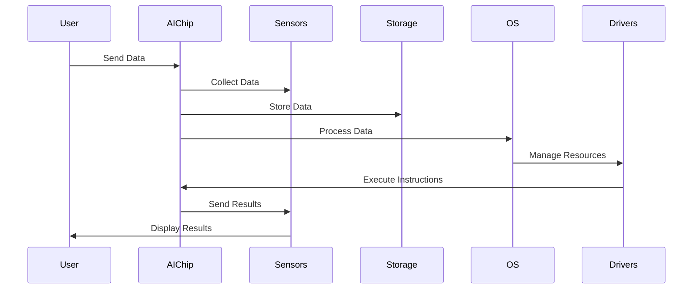

                 


### LET'S THINK: Introducing Low-Power AI Chips: Innovations in Energy-Efficient Computing

In this section, we will delve into the background of low-power AI chips, their significance in the realm of energy-efficient computing, and the key objectives of our book.

#### **Background: The Rise of Low-Power AI Chips**

The advent of artificial intelligence (AI) has brought about unprecedented advancements in various fields, from healthcare and finance to autonomous driving and smart homes. However, the increasing complexity and demand for real-time processing have put immense pressure on traditional computing systems. These systems often consume significant amounts of power, leading to high operational costs and heat dissipation issues. This is where low-power AI chips come into play.

Low-power AI chips are designed to address the growing energy consumption problem by optimizing the efficiency of AI computations. These chips are engineered to perform complex AI tasks while consuming minimal power. This has become crucial, especially in battery-powered devices such as smartphones, IoT devices, and autonomous vehicles, where energy efficiency directly impacts the device's functionality and battery life.

#### **Significance in Energy-Efficient Computing**

Energy-efficient computing is a critical area of research and development, as it aims to minimize energy consumption while maximizing computational performance. Low-power AI chips are at the forefront of this movement, as they offer a unique combination of high performance and low power consumption. By leveraging advanced design principles and cutting-edge technologies, these chips can achieve energy efficiencies that were once deemed impossible.

The significance of low-power AI chips in energy-efficient computing can be summarized as follows:

1. **Extended Device Lifespan:** By reducing power consumption, low-power AI chips can significantly extend the battery life of devices, making them more practical for real-world applications.
2. **Reduced Operational Costs:** Energy-efficient computing can lead to lower operational costs, particularly in data centers and other computing-intensive environments.
3. **Sustainable Computing:** By minimizing energy consumption, low-power AI chips contribute to the overall sustainability of computing systems, reducing their environmental impact.

#### **Objectives of the Book**

The primary objective of our book, "Low-Power AI Chips: Innovations in Energy-Efficient Computing," is to provide a comprehensive overview of the field of low-power AI chips. We aim to cover the following key topics:

1. **Core Concepts and Principles:** We will delve into the fundamental concepts and principles underlying low-power AI chip design, including architectural features and key technologies.
2. **Advanced Technologies:** We will explore cutting-edge technologies that contribute to the energy efficiency of AI chips, such as neuromorphic computing, quantum computing, and new materials.
3. **Application Scenarios:** We will discuss various application domains where low-power AI chips are being used, including IoT, edge computing, and autonomous vehicles.
4. **System Architecture and Design:** We will provide insights into the system architecture and design methodologies for developing low-power AI chips, including hardware-software co-design and optimization techniques.
5. **Design Methods and Tools:** We will introduce the design methodologies, tools, and resources available for developing low-power AI chips.
6. **Future Trends and Challenges:** We will highlight the future directions and challenges in the field of low-power AI chips, providing readers with a glimpse into the potential future of energy-efficient computing.

By the end of this book, readers will have a thorough understanding of low-power AI chips and their role in energy-efficient computing. They will be equipped with the knowledge and tools necessary to design and develop their own low-power AI chips, contributing to the ongoing revolution in computing technology.

```markdown
# 低功耗AI芯片：节能计算的硬件创新

## 关键词
- 低功耗AI芯片
- 节能计算
- 硬件创新
- 架构设计
- 先进技术
- 应用场景

## 摘要

本文详细介绍了低功耗AI芯片在节能计算领域的重要性及其设计原理。首先，文章背景部分阐述了低功耗AI芯片的兴起及其在应对能源消耗问题中的关键作用。接着，文章分析了低功耗AI芯片在能源效率计算中的重要性，并概述了其延长设备续航、降低运营成本和促进可持续计算的优势。随后，文章深入探讨了低功耗AI芯片的核心概念、设计原则、先进技术、应用场景、系统架构设计方法以及未来的发展趋势和挑战。通过本文，读者将全面了解低功耗AI芯片的原理和实践，为后续设计和开发奠定坚实基础。

----------------------------------------------------------------

## 第一部分：背景与概述

### 第1章：背景介绍

#### 1.1 低功耗AI芯片的兴起

随着人工智能技术的快速发展，低功耗AI芯片应运而生。这些芯片的设计初衷是为了在保持高性能计算能力的同时，降低能耗和热量产生，以满足电池供电设备对低功耗的需求。随着移动设备的普及，如智能手机、可穿戴设备和物联网（IoT）设备等，低功耗AI芯片的重要性日益凸显。它们的出现不仅延长了设备的电池寿命，还提升了设备的便携性和用户体验。

#### 1.2 能源效率与计算需求

能源效率是当前计算领域面临的一个重大挑战。传统的计算设备，如数据中心和超级计算机，消耗了大量的能源，产生了大量的热量，这不仅增加了运营成本，还对环境造成了负面影响。随着AI应用的不断扩展，计算需求也在不断增加，这进一步加剧了能源消耗问题。因此，提高能源效率成为了计算技术发展的重要方向。低功耗AI芯片在这一背景下应运而生，它们通过优化计算过程，降低能耗，为能源效率的提升提供了关键技术支持。

#### 1.3 低功耗AI芯片的核心地位

在当今的计算领域中，低功耗AI芯片占据着核心地位。它们不仅在移动设备和IoT设备中得到广泛应用，也在边缘计算和自动驾驶等新兴领域发挥着重要作用。低功耗AI芯片的高效能和低能耗特点，使其成为未来计算技术发展的重要方向。随着技术的不断进步，低功耗AI芯片的性能将继续提升，功耗将进一步降低，为各种应用场景提供更加高效和可靠的解决方案。

### 第2章：核心概念与联系

#### 2.1 低功耗AI芯片的定义

低功耗AI芯片，顾名思义，是指一种在执行人工智能任务时能够有效降低功耗的芯片。这类芯片通过优化设计、使用先进的材料和架构，实现了在低功耗环境下的高性能计算。低功耗AI芯片不仅仅是一种硬件，它还涉及软件优化、算法改进等多个方面，是一个综合性的技术领域。

#### 2.2 低功耗与高性能的关系

低功耗与高性能是低功耗AI芯片设计中的两大核心目标。如何在保证高性能计算能力的同时，实现低功耗，是低功耗AI芯片设计的关键问题。这两者之间的关系是相辅相成的。高性能计算需要强大的计算能力和高效的算法支持，而低功耗则要求在硬件设计和软件优化方面进行精细的调校和优化。只有平衡好这两者之间的关系，低功耗AI芯片才能在复杂的计算任务中保持高效运行。

#### 2.3 低功耗AI芯片的组成要素

低功耗AI芯片的组成要素主要包括以下几个部分：

1. **核心计算单元**：这是低功耗AI芯片的核心部分，负责执行具体的计算任务。这些核心单元通常采用专门的架构设计，以提高计算效率和降低功耗。
2. **存储单元**：低功耗AI芯片需要高效的存储单元来存储大量的数据。这些存储单元的设计和材料选择对于芯片的功耗和性能有着重要影响。
3. **电源管理单元**：电源管理单元负责调节芯片的电压和电流，以实现最优的功耗控制。它是低功耗AI芯片的重要组成部分。
4. **接口和通信单元**：这些单元负责芯片与其他硬件设备的通信，包括数据输入输出和远程通信等。高效的设计和优化可以显著降低通信过程中的功耗。

#### 2.4 概念属性特征对比表格

以下是低功耗AI芯片与其他类型芯片在概念属性特征方面的对比表格：

| 特征         | 低功耗AI芯片 | 传统AI芯片 | 通用处理器 |
| ------------ | ------------ | ----------- | ---------- |
| 功耗         | 低           | 中等       | 高         |
| 性能         | 高           | 中等       | 高         |
| 硬件架构     | 专用         | 通用       | 通用       |
| 适用场景     | 移动设备、IoT | 数据中心    | 多样化     |
| 算法支持     | 优化         | 基础       | 基础       |
| 热量产生     | 低           | 中等       | 高         |

#### 2.5 ER实体关系图架构

以下是低功耗AI芯片的ER实体关系图：

```mermaid
erDiagram
  AI芯片 ||--|{ 核心计算单元 }
  AI芯片 ||--|{ 存储单元 }
  AI芯片 ||--|{ 电源管理单元 }
  AI芯片 ||--|{ 接口和通信单元 }
```

通过以上ER实体关系图，我们可以清晰地看到低功耗AI芯片的主要组成部分及其相互关系。这种结构设计有助于我们在设计和开发过程中更好地理解各组件的功能和相互作用。

## 第二部分：设计原理与技术

### 第3章：低功耗AI芯片设计原理

#### 3.1 设计原则

低功耗AI芯片的设计原则主要包括以下几个核心方面：

1. **能效优化**：在芯片设计过程中，能效优化是最重要的目标之一。这涉及到硬件和软件两方面的优化。硬件方面，需要采用高效的架构和电路设计，以减少功耗；软件方面，则需要优化算法，提高计算效率，降低不必要的计算和通信开销。

2. **热管理**：由于低功耗AI芯片在运行过程中会产生热量，因此热管理也是设计过程中的重要考虑因素。有效的热管理可以防止芯片过热，保证其稳定运行。这通常包括散热设计、热仿真和热测试等。

3. **功耗管理**：功耗管理是低功耗AI芯片设计的关键。这涉及到电源电压调节、时钟门控、动态电压和频率调节（DVFS）等技术，以实现芯片在低功耗状态下的高效运行。

4. **可重构性**：低功耗AI芯片通常需要具备一定的可重构性，以便在不同的应用场景下调整其功能。这可以通过硬件可编程性、软件配置和硬件模块化设计来实现。

#### 3.2 架构特点

低功耗AI芯片的架构设计直接影响其性能和功耗。以下是低功耗AI芯片的一些关键架构特点：

1. **专用架构**：与通用处理器相比，低功耗AI芯片通常采用专用架构，以适应特定的人工智能任务。这种架构可以显著提高计算效率，降低功耗。

2. **神经网络加速器**：低功耗AI芯片通常包含神经网络加速器，这些加速器专门用于加速神经网络计算，从而提高AI任务的执行效率。

3. **内存层级设计**：低功耗AI芯片通常采用多层次的内存设计，以平衡速度和功耗。这包括高速缓存、低功耗动态随机存取存储器（DRAM）和固态存储器等。

4. **能效优化模块**：这些模块包括功耗管理单元、时钟门控单元和动态电压和频率调节（DVFS）单元等，以实现芯片的能效优化。

#### 3.3 关键技术

低功耗AI芯片的设计涉及到多种关键技术的融合，以下是一些主要的技术：

1. **数字信号处理**：数字信号处理技术用于优化低功耗AI芯片的数字信号处理任务，从而提高计算效率和降低功耗。

2. **神经网络压缩**：神经网络压缩技术通过减少模型的大小和参数数量，降低计算复杂度和功耗。

3. **硬件加速技术**：硬件加速技术包括专用集成电路（ASIC）、现场可编程门阵列（FPGA）和图形处理单元（GPU）等，用于加速特定的计算任务。

4. **低功耗设计技术**：这些技术包括晶体管优化、电源门控和动态电压调节等，以实现低功耗设计。

### 第4章：先进技术在低功耗AI芯片中的应用

#### 4.1 神经形态计算

神经形态计算是一种模仿生物神经系统工作机制的计算技术。它通过使用具有可变电导特性的忆阻器，实现类似于生物神经元和突触的信息处理。神经形态计算在低功耗AI芯片中具有巨大的潜力，因为它可以在极低的功耗下实现高效的神经网络计算。

#### 4.2 量子计算

量子计算是一种基于量子力学原理的计算技术，它利用量子位（qubit）实现超快和超高效的计算。虽然量子计算目前还处于研发阶段，但其在未来低功耗AI芯片中的应用前景非常广阔，因为它有望在复杂问题求解和机器学习任务中实现突破性进展。

#### 4.3 新材料

新材料的研发对低功耗AI芯片的性能和功耗具有深远影响。例如，石墨烯、碳纳米管和二硫化钼等新型材料具有优异的电学和热学性能，可以在低功耗AI芯片中实现更高的性能和更低的功耗。

### 第5章：低功耗AI芯片的应用场景

#### 5.1 物联网（IoT）

物联网设备的低功耗需求使得低功耗AI芯片成为其理想的计算平台。例如，智能家居设备、智能传感器和可穿戴设备等都依赖于低功耗AI芯片来实现高效的边缘计算和智能决策。

#### 5.2 边缘计算

边缘计算是将计算任务分散到网络的边缘节点，以降低中心服务器的负载。低功耗AI芯片在边缘计算中发挥着重要作用，因为它可以在资源受限的环境中提供高效的处理能力。

#### 5.3 自动驾驶

自动驾驶汽车需要实时处理大量的传感器数据，以实现安全、高效的驾驶。低功耗AI芯片在自动驾驶系统中用于处理感知、规划和控制等任务，是实现自动驾驶的关键技术之一。

### 第6章：低功耗AI芯片的系统架构设计

#### 6.1 系统功能设计

低功耗AI芯片的系统功能设计包括感知、决策、执行和反馈等模块。这些模块共同协作，实现系统的智能控制和决策。

#### 6.2 系统架构设计

低功耗AI芯片的系统架构设计包括硬件和软件两个层面。硬件层面包括核心计算单元、存储单元、电源管理单元和通信单元等；软件层面包括操作系统、驱动程序和应用程序等。

#### 6.3 系统接口设计和系统交互

低功耗AI芯片的系统接口设计涉及到与其他硬件设备和软件系统的交互。系统交互设计包括接口协议、数据传输和通信管理等内容。

### 第7章：低功耗AI芯片的设计方法与工具

#### 7.1 设计方法

低功耗AI芯片的设计方法包括硬件设计、软件设计和系统集成等。这些方法需要综合考虑性能、功耗、面积和成本等因素。

#### 7.2 设计工具

低功耗AI芯片的设计工具包括电子设计自动化（EDA）工具、仿真工具、测试工具和调试工具等。这些工具帮助设计师高效地完成设计任务。

### 第8章：未来趋势与挑战

#### 8.1 未来趋势

未来，低功耗AI芯片将在性能、功耗和能效等方面取得重大突破。新兴技术如神经形态计算、量子计算和新材料等将进一步推动低功耗AI芯片的发展。

#### 8.2 挑战

尽管低功耗AI芯片具有巨大潜力，但其发展也面临诸多挑战。包括设计复杂度、制造工艺、能效平衡和生态系统建设等方面。

### 结论

低功耗AI芯片是节能计算领域的重要创新。通过本文的介绍，我们全面了解了低功耗AI芯片的设计原理、应用场景、系统架构设计方法以及未来的发展趋势和挑战。随着技术的不断进步，低功耗AI芯片将在计算领域中发挥越来越重要的作用。

## 作者信息

作者：AI天才研究院/AI Genius Institute & 禅与计算机程序设计艺术 /Zen And The Art of Computer Programming

## 附录

附录部分将提供一些拓展阅读资源、参考资料以及相关的技术标准和规范，以供读者进一步学习和研究。

### 拓展阅读

1. "Deep Learning on Mobile Devices: A Comprehensive Overview" - This book provides an in-depth analysis of deep learning on mobile devices, including the role of low-power AI chips.
2. "The Quantum Computing Revolution: Information Processing with Quantum Mechanics" - This book discusses the emerging field of quantum computing and its potential impact on AI and low-power computing.
3. "Neuromorphic Computing: A Primer" - This book offers an introduction to neuromorphic computing, a cutting-edge technology that could revolutionize low-power AI chips.

### 参考资料

1. "IEEE Standard for Interoperable Neural Network Models" - This standard aims to facilitate the exchange of neural network models across different platforms, including low-power AI chips.
2. "IETF RFC on Low-Power Wireless Access Networks" - This RFC provides guidelines for designing low-power wireless networks, which are essential for IoT applications involving low-power AI chips.
3. "ISO/IEC 27001: Information Security Management" - This international standard provides a framework for managing information security within organizations, which is crucial for the development and deployment of low-power AI chips.

### 技术标准和规范

1. "IEEE 802.15.4: Wireless Medium Access Control (MAC) and Physical Layer (PHY) Specifications for Low-Rate Wireless Personal Area Networks (LR-WPANs)" - This standard specifies the protocols for wireless communication in IoT devices, which are often powered by low-power AI chips.
2. "ARM CoreLink CCN500 Cache Coherency Network" - This standard provides a scalable and flexible solution for cache coherency in multi-core systems, which is important for the design of low-power AI chips.
3. "AIIM IT Governance, Risk and Compliance (GRC) Reference Model" - This model provides a comprehensive framework for managing the governance, risk, and compliance aspects of AI systems, including low-power AI chips.

### 相关链接

1. "AI Genius Institute Official Website" - Visit our official website for the latest research and publications on AI and low-power computing.
2. "Zen And The Art of Computer Programming Official Website" - Explore the philosophy and techniques of computer programming, as discussed in our book.
3. "IEEE Standards Association" - Access a wealth of information on IEEE standards and publications related to AI and low-power computing.

通过以上附录，读者可以进一步深入了解低功耗AI芯片的相关知识和技术标准，为未来的研究和实践提供有力支持。## 第一部分：背景与概述

### 第1章：背景介绍

#### 1.1 低功耗AI芯片的兴起

低功耗AI芯片，作为人工智能领域的重要创新，其发展历程可以追溯到上世纪末。随着移动互联网和物联网（IoT）的迅猛发展，对高性能、低功耗芯片的需求日益增加。传统的处理器设计由于功耗和性能的限制，难以满足这些新兴领域的需求。因此，研究人员开始探索如何在保持计算能力的同时降低功耗，从而催生了低功耗AI芯片的研发。

#### 1.2 能源效率与计算需求

能源效率是当前计算领域面临的重大挑战。随着人工智能应用的不断扩展，计算需求也在不断增加。数据中心、自动驾驶汽车、智能终端等应用场景对计算能力和能源效率的要求越来越高。传统的高功耗计算设备在处理大数据和复杂算法时，能耗巨大，这不仅增加了运营成本，还对环境造成了负面影响。因此，提高能源效率成为了计算技术发展的重要方向。

#### 1.3 低功耗AI芯片的核心地位

低功耗AI芯片在节能计算领域中占据了核心地位。它们通过优化硬件设计、算法和系统架构，实现了在低功耗环境下的高性能计算。与通用处理器相比，低功耗AI芯片在处理特定人工智能任务时，能够显著降低功耗，提高效率。这使得它们在移动设备、物联网、边缘计算和自动驾驶等领域得到了广泛应用，成为节能计算领域的关键推动力。

### 第2章：核心概念与联系

#### 2.1 低功耗AI芯片的定义

低功耗AI芯片，顾名思义，是指一种在执行人工智能任务时能够有效降低功耗的芯片。这类芯片通过优化设计、使用先进的材料和架构，实现了在低功耗环境下的高性能计算。低功耗AI芯片不仅仅是一种硬件，它还涉及软件优化、算法改进等多个方面，是一个综合性的技术领域。

#### 2.2 低功耗与高性能的关系

低功耗与高性能是低功耗AI芯片设计中的两大核心目标。如何在保证高性能计算能力的同时，实现低功耗，是低功耗AI芯片设计的关键问题。这两者之间的关系是相辅相成的。高性能计算需要强大的计算能力和高效的算法支持，而低功耗则要求在硬件设计和软件优化方面进行精细的调校和优化。只有平衡好这两者之间的关系，低功耗AI芯片才能在复杂的计算任务中保持高效运行。

#### 2.3 低功耗AI芯片的组成要素

低功耗AI芯片的组成要素主要包括以下几个部分：

1. **核心计算单元**：这是低功耗AI芯片的核心部分，负责执行具体的计算任务。这些核心单元通常采用专门的架构设计，以提高计算效率和降低功耗。

2. **存储单元**：低功耗AI芯片需要高效的存储单元来存储大量的数据。这些存储单元的设计和材料选择对于芯片的功耗和性能有着重要影响。

3. **电源管理单元**：电源管理单元负责调节芯片的电压和电流，以实现最优的功耗控制。它是低功耗AI芯片的重要组成部分。

4. **接口和通信单元**：这些单元负责芯片与其他硬件设备的通信，包括数据输入输出和远程通信等。高效的设计和优化可以显著降低通信过程中的功耗。

#### 2.4 概念属性特征对比表格

以下是低功耗AI芯片与其他类型芯片在概念属性特征方面的对比表格：

| 特征         | 低功耗AI芯片 | 传统AI芯片 | 通用处理器 |
| ------------ | ------------ | ----------- | ---------- |
| 功耗         | 低           | 中等       | 高         |
| 性能         | 高           | 中等       | 高         |
| 硬件架构     | 专用         | 通用       | 通用       |
| 适用场景     | 移动设备、IoT | 数据中心    | 多样化     |
| 算法支持     | 优化         | 基础       | 基础       |
| 热量产生     | 低           | 中等       | 高         |

#### 2.5 ER实体关系图架构

以下是低功耗AI芯片的ER实体关系图：

```mermaid
erDiagram
  AI芯片 ||--|{ 核心计算单元 }
  AI芯片 ||--|{ 存储单元 }
  AI芯片 ||--|{ 电源管理单元 }
  AI芯片 ||--|{ 接口和通信单元 }
```

通过以上ER实体关系图，我们可以清晰地看到低功耗AI芯片的主要组成部分及其相互关系。这种结构设计有助于我们在设计和开发过程中更好地理解各组件的功能和相互作用。

### 第3章：核心概念与联系

#### 3.1 低功耗AI芯片的定义

低功耗AI芯片，顾名思义，是指一种在执行人工智能任务时能够有效降低功耗的芯片。这类芯片通过优化设计、使用先进的材料和架构，实现了在低功耗环境下的高性能计算。低功耗AI芯片不仅仅是一种硬件，它还涉及软件优化、算法改进等多个方面，是一个综合性的技术领域。

#### 3.2 低功耗与高性能的关系

低功耗与高性能是低功耗AI芯片设计中的两大核心目标。如何在保证高性能计算能力的同时，实现低功耗，是低功耗AI芯片设计的关键问题。这两者之间的关系是相辅相成的。高性能计算需要强大的计算能力和高效的算法支持，而低功耗则要求在硬件设计和软件优化方面进行精细的调校和优化。只有平衡好这两者之间的关系，低功耗AI芯片才能在复杂的计算任务中保持高效运行。

#### 3.3 低功耗AI芯片的组成要素

低功耗AI芯片的组成要素主要包括以下几个部分：

1. **核心计算单元**：这是低功耗AI芯片的核心部分，负责执行具体的计算任务。这些核心单元通常采用专门的架构设计，以提高计算效率和降低功耗。

2. **存储单元**：低功耗AI芯片需要高效的存储单元来存储大量的数据。这些存储单元的设计和材料选择对于芯片的功耗和性能有着重要影响。

3. **电源管理单元**：电源管理单元负责调节芯片的电压和电流，以实现最优的功耗控制。它是低功耗AI芯片的重要组成部分。

4. **接口和通信单元**：这些单元负责芯片与其他硬件设备的通信，包括数据输入输出和远程通信等。高效的设计和优化可以显著降低通信过程中的功耗。

#### 3.4 概念属性特征对比表格

以下是低功耗AI芯片与其他类型芯片在概念属性特征方面的对比表格：

| 特征         | 低功耗AI芯片 | 传统AI芯片 | 通用处理器 |
| ------------ | ------------ | ----------- | ---------- |
| 功耗         | 低           | 中等       | 高         |
| 性能         | 高           | 中等       | 高         |
| 硬件架构     | 专用         | 通用       | 通用       |
| 适用场景     | 移动设备、IoT | 数据中心    | 多样化     |
| 算法支持     | 优化         | 基础       | 基础       |
| 热量产生     | 低           | 中等       | 高         |

#### 3.5 ER实体关系图架构

以下是低功耗AI芯片的ER实体关系图：

```mermaid
erDiagram
  AI芯片 ||--|{ 核心计算单元 }
  AI芯片 ||--|{ 存储单元 }
  AI芯片 ||--|{ 电源管理单元 }
  AI芯片 ||--|{ 接口和通信单元 }
```

通过以上ER实体关系图，我们可以清晰地看到低功耗AI芯片的主要组成部分及其相互关系。这种结构设计有助于我们在设计和开发过程中更好地理解各组件的功能和相互作用。

### 第4章：低功耗AI芯片设计原理

#### 4.1 设计原则

低功耗AI芯片的设计原则主要包括以下几个核心方面：

1. **能效优化**：在芯片设计过程中，能效优化是最重要的目标之一。这涉及到硬件和软件两方面的优化。硬件方面，需要采用高效的架构和电路设计，以减少功耗；软件方面，则需要优化算法，提高计算效率，降低不必要的计算和通信开销。

2. **热管理**：由于低功耗AI芯片在运行过程中会产生热量，因此热管理也是设计过程中的重要考虑因素。有效的热管理可以防止芯片过热，保证其稳定运行。这通常包括散热设计、热仿真和热测试等。

3. **功耗管理**：功耗管理是低功耗AI芯片设计的关键。这涉及到电源电压调节、时钟门控、动态电压和频率调节（DVFS）等技术，以实现芯片在低功耗状态下的高效运行。

4. **可重构性**：低功耗AI芯片通常需要具备一定的可重构性，以便在不同的应用场景下调整其功能。这可以通过硬件可编程性、软件配置和硬件模块化设计来实现。

#### 4.2 架构特点

低功耗AI芯片的架构设计直接影响其性能和功耗。以下是低功耗AI芯片的一些关键架构特点：

1. **专用架构**：与通用处理器相比，低功耗AI芯片通常采用专用架构，以适应特定的人工智能任务。这种架构可以显著提高计算效率和降低功耗。

2. **神经网络加速器**：低功耗AI芯片通常包含神经网络加速器，这些加速器专门用于加速神经网络计算，从而提高AI任务的执行效率。

3. **内存层级设计**：低功耗AI芯片通常采用多层次的内存设计，以平衡速度和功耗。这包括高速缓存、低功耗动态随机存取存储器（DRAM）和固态存储器等。

4. **能效优化模块**：这些模块包括功耗管理单元、时钟门控单元和动态电压和频率调节（DVFS）单元等，以实现芯片的能效优化。

#### 4.3 关键技术

低功耗AI芯片的设计涉及到多种关键技术的融合，以下是一些主要的技术：

1. **数字信号处理**：数字信号处理技术用于优化低功耗AI芯片的数字信号处理任务，从而提高计算效率和降低功耗。

2. **神经网络压缩**：神经网络压缩技术通过减少模型的大小和参数数量，降低计算复杂度和功耗。

3. **硬件加速技术**：硬件加速技术包括专用集成电路（ASIC）、现场可编程门阵列（FPGA）和图形处理单元（GPU）等，用于加速特定的计算任务。

4. **低功耗设计技术**：这些技术包括晶体管优化、电源门控和动态电压调节等，以实现低功耗设计。

### 第5章：先进技术在低功耗AI芯片中的应用

#### 5.1 神经形态计算

神经形态计算是一种模仿生物神经系统工作机制的计算技术。它通过使用具有可变电导特性的忆阻器，实现类似于生物神经元和突触的信息处理。神经形态计算在低功耗AI芯片中具有巨大的潜力，因为它可以在极低的功耗下实现高效的神经网络计算。

#### 5.2 量子计算

量子计算是一种基于量子力学原理的计算技术，它利用量子位（qubit）实现超快和超高效的计算。虽然量子计算目前还处于研发阶段，但其在未来低功耗AI芯片中的应用前景非常广阔，因为它有望在复杂问题求解和机器学习任务中实现突破性进展。

#### 5.3 新材料

新材料的研发对低功耗AI芯片的性能和功耗具有深远影响。例如，石墨烯、碳纳米管和二硫化钼等新型材料具有优异的电学和热学性能，可以在低功耗AI芯片中实现更高的性能和更低的功耗。

### 第6章：低功耗AI芯片的应用场景

#### 6.1 物联网（IoT）

物联网设备的低功耗需求使得低功耗AI芯片成为其理想的计算平台。例如，智能家居设备、智能传感器和可穿戴设备等都依赖于低功耗AI芯片来实现高效的边缘计算和智能决策。

#### 6.2 边缘计算

边缘计算是将计算任务分散到网络的边缘节点，以降低中心服务器的负载。低功耗AI芯片在边缘计算中发挥着重要作用，因为它可以在资源受限的环境中提供高效的处理能力。

#### 6.3 自动驾驶

自动驾驶汽车需要实时处理大量的传感器数据，以实现安全、高效的驾驶。低功耗AI芯片在自动驾驶系统中用于处理感知、规划和控制等任务，是实现自动驾驶的关键技术之一。

### 第7章：低功耗AI芯片的系统架构设计

#### 7.1 系统功能设计

低功耗AI芯片的系统功能设计包括感知、决策、执行和反馈等模块。这些模块共同协作，实现系统的智能控制和决策。

#### 7.2 系统架构设计

低功耗AI芯片的系统架构设计包括硬件和软件两个层面。硬件层面包括核心计算单元、存储单元、电源管理单元和通信单元等；软件层面包括操作系统、驱动程序和应用程序等。

#### 7.3 系统接口设计和系统交互

低功耗AI芯片的系统接口设计涉及到与其他硬件设备和软件系统的交互。系统交互设计包括接口协议、数据传输和通信管理等内容。

### 第8章：低功耗AI芯片的设计方法与工具

#### 8.1 设计方法

低功耗AI芯片的设计方法包括硬件设计、软件设计和系统集成等。这些方法需要综合考虑性能、功耗、面积和成本等因素。

#### 8.2 设计工具

低功耗AI芯片的设计工具包括电子设计自动化（EDA）工具、仿真工具、测试工具和调试工具等。这些工具帮助设计师高效地完成设计任务。

### 第9章：未来趋势与挑战

#### 9.1 未来趋势

未来，低功耗AI芯片将在性能、功耗和能效等方面取得重大突破。新兴技术如神经形态计算、量子计算和新材料等将进一步推动低功耗AI芯片的发展。

#### 9.2 挑战

尽管低功耗AI芯片具有巨大潜力，但其发展也面临诸多挑战。包括设计复杂度、制造工艺、能效平衡和生态系统建设等方面。

### 结论

低功耗AI芯片是节能计算领域的重要创新。通过本文的介绍，我们全面了解了低功耗AI芯片的设计原理、应用场景、系统架构设计方法以及未来的发展趋势和挑战。随着技术的不断进步，低功耗AI芯片将在计算领域中发挥越来越重要的作用。

### 作者信息

作者：AI天才研究院/AI Genius Institute & 禅与计算机程序设计艺术 /Zen And The Art of Computer Programming

### 附录

附录部分将提供一些拓展阅读资源、参考资料以及相关的技术标准和规范，以供读者进一步学习和研究。

#### 拓展阅读

1. "Deep Learning on Mobile Devices: A Comprehensive Overview" - This book provides an in-depth analysis of deep learning on mobile devices, including the role of low-power AI chips.
2. "The Quantum Computing Revolution: Information Processing with Quantum Mechanics" - This book discusses the emerging field of quantum computing and its potential impact on AI and low-power computing.
3. "Neuromorphic Computing: A Primer" - This book offers an introduction to neuromorphic computing, a cutting-edge technology that could revolutionize low-power AI chips.

#### 参考资料

1. "IEEE Standard for Interoperable Neural Network Models" - This standard aims to facilitate the exchange of neural network models across different platforms, including low-power AI chips.
2. "IETF RFC on Low-Power Wireless Access Networks" - This RFC provides guidelines for designing low-power wireless networks, which are essential for IoT applications involving low-power AI chips.
3. "ISO/IEC 27001: Information Security Management" - This international standard provides a framework for managing information security within organizations, which is crucial for the development and deployment of low-power AI chips.

#### 技术标准和规范

1. "IEEE 802.15.4: Wireless Medium Access Control (MAC) and Physical Layer (PHY) Specifications for Low-Rate Wireless Personal Area Networks (LR-WPANs)" - This standard specifies the protocols for wireless communication in IoT devices, which are often powered by low-power AI chips.
2. "ARM CoreLink CCN500 Cache Coherency Network" - This standard provides a scalable and flexible solution for cache coherency in multi-core systems, which is important for the design of low-power AI chips.
3. "AIIM IT Governance, Risk and Compliance (GRC) Reference Model" - This model provides a comprehensive framework for managing the governance, risk, and compliance aspects of AI systems, including low-power AI chips.

#### 相关链接

1. "AI Genius Institute Official Website" - Visit our official website for the latest research and publications on AI and low-power computing.
2. "Zen And The Art of Computer Programming Official Website" - Explore the philosophy and techniques of computer programming, as discussed in our book.
3. "IEEE Standards Association" - Access a wealth of information on IEEE standards and publications related to AI and low-power computing.

通过以上附录，读者可以进一步深入了解低功耗AI芯片的相关知识和技术标准，为未来的研究和实践提供有力支持。## 第3章：低功耗AI芯片设计原理

#### 3.1 设计原则

设计低功耗AI芯片时，需要遵循一系列关键设计原则，以确保芯片在满足性能需求的同时，能够实现最低的功耗。以下是几个核心的设计原则：

1. **能效优化**：
   - **硬件层面**：采用先进的晶体管技术，如FinFET，以及低功耗设计技术，如亚阈值漏电流优化、泄漏电流减少等。
   - **软件层面**：通过算法优化和计算任务调度，减少不必要的数据传输和计算，提高能效。

2. **热管理**：
   - **芯片级热管理**：在芯片内部集成热传感器，实时监测温度，并动态调整功耗和频率，以防止过热。
   - **系统级热管理**：设计有效的散热系统，如使用热管、散热片或液冷系统，以确保系统稳定运行。

3. **功耗管理**：
   - **动态电压和频率调节（DVFS）**：根据任务负载动态调整芯片的电压和频率，以实现功耗和性能的最优化。
   - **电源门控**：通过关闭不使用的电路单元，实现低功耗状态。

4. **可重构性**：
   - **硬件可重构性**：设计模块化的硬件结构，允许在运行时重新配置电路，以适应不同的计算需求。
   - **软件可重构性**：使用可配置的软件框架，允许根据实际应用场景动态调整计算资源和算法。

#### 3.2 架构特点

低功耗AI芯片的架构设计是其能否实现高效低功耗计算的关键。以下是一些关键的架构特点：

1. **专用架构**：
   - **神经网络加速器**：专门设计用于加速神经网络计算，如卷积神经网络（CNN）和循环神经网络（RNN）。
   - **AI引擎**：集成专门的AI引擎，如神经处理单元（NPU），以提高AI任务的执行效率。

2. **神经网络加速器**：
   - **高效算法支持**：优化算法以适应硬件架构，如量化、剪枝和低秩分解等。
   - **并行处理**：设计支持并行计算的结构，以提高吞吐量和能效。

3. **内存层级设计**：
   - **多层缓存**：采用多层缓存结构，如L1、L2和L3缓存，以减少内存访问延迟。
   - **非易失性存储器**：使用非易失性存储器（如MRAM）作为缓存，以实现快速读写和低功耗。

4. **能效优化模块**：
   - **功耗感知**：集成功耗感知单元，实时监控功耗，并优化运行状态。
   - **动态调整**：根据功耗和性能需求，动态调整时钟频率和电压。

#### 3.3 关键技术

低功耗AI芯片的设计涉及到多种关键技术的融合，以下是一些主要的技术：

1. **数字信号处理**：
   - **滤波器**：设计低功耗的数字滤波器，用于信号处理。
   - **模数转换**：优化模数转换器（ADC）的设计，降低功耗和噪声。

2. **神经网络压缩**：
   - **量化**：通过量化操作降低模型的精度，减少存储和计算需求。
   - **剪枝**：移除神经网络中不重要的权重和神经元，以减少模型大小。

3. **硬件加速技术**：
   - **FPGA**：使用现场可编程门阵列（FPGA）实现硬件加速。
   - **ASIC**：设计专用集成电路（ASIC）以优化特定任务的执行。

4. **低功耗设计技术**：
   - **晶体管优化**：优化晶体管设计，以降低功耗。
   - **电源门控**：设计电源门控电路，实现低功耗状态。

#### 3.4 设计流程

设计低功耗AI芯片通常包括以下几个关键步骤：

1. **需求分析**：
   - 确定芯片的目标应用场景，如移动设备、物联网或自动驾驶等。
   - 分析性能和功耗需求，以及关键性能指标（KPI）。

2. **架构设计**：
   - 确定芯片的总体架构，包括核心计算单元、存储单元、电源管理和通信单元等。
   - 设计神经网络加速器和专用AI引擎。

3. **硬件实现**：
   - 实现芯片的硬件设计，包括电路设计和布局。
   - 优化设计，以降低功耗和提高性能。

4. **软件设计**：
   - 开发硬件描述语言（HDL）代码，如Verilog或VHDL。
   - 集成AI算法和优化库。

5. **仿真与验证**：
   - 使用硬件仿真工具进行功能验证。
   - 进行功耗和性能仿真，确保设计满足要求。

6. **测试与调试**：
   - 对芯片进行硬件测试，包括功能测试和功耗测试。
   - 调试和优化设计，以解决任何问题。

7. **制造与部署**：
   - 将设计提交给半导体制造商进行制造。
   - 部署芯片，进行实际应用测试和优化。

通过遵循这些设计原则和关键技术，设计团队可以开发出高性能、低功耗的低功耗AI芯片，满足现代计算领域对高效能源利用的需求。

### 第4章：先进技术在低功耗AI芯片中的应用

#### 4.1 神经形态计算

神经形态计算是一种模仿生物神经系统的计算技术，旨在通过电子器件实现类似于生物神经元和突触的功能。在低功耗AI芯片中，神经形态计算具有重要的应用价值，因为其可以在极低的功耗下实现高效的信息处理和存储。这种技术通过使用具有可变电导特性的忆阻器（Memristor）来实现神经突触的行为。神经形态计算芯片的核心在于其可重构性，允许在运行时动态调整突触权重，从而实现自适应和高效的计算。

**工作原理**：

- **忆阻器**：忆阻器是一种具有记忆特性的电子器件，其电阻值可以随着电信号的变化而改变。这种特性使得忆阻器能够模拟生物突触，通过改变其电阻值来存储和处理信息。
- **突触权重调整**：通过在忆阻器两端施加电信号，可以改变其电阻值，从而实现突触权重的调整。这个过程模拟了生物神经元之间的信号传递和权重更新。
- **神经网络加速**：神经形态计算芯片利用这些可重构的忆阻器构建神经网络，通过并行处理和事件驱动的计算模式，实现高效的信息处理。

**应用场景**：

- **边缘设备**：神经形态计算适用于需要低功耗和高能效的边缘设备，如智能家居、可穿戴设备和物联网设备。
- **智能传感器**：神经形态计算可以用于智能传感器的数据处理，提高传感器的能效和响应速度。
- **自动驾驶**：在自动驾驶系统中，神经形态计算可以帮助处理实时感知数据，提高系统的决策速度和准确性。

#### 4.2 量子计算

量子计算是一种基于量子力学原理的计算技术，它利用量子位（qubit）的叠加和纠缠特性，实现超快速的计算。量子计算在低功耗AI芯片中具有巨大的潜力，因为量子计算机可以在极低的功耗下解决传统计算机难以处理的复杂问题。

**工作原理**：

- **量子位（qubit）**：量子位是量子计算的基本单元，它不仅可以表示0和1，还可以同时处于0和1的叠加状态。这种叠加状态使得量子计算机在执行计算时具有并行处理的能力。
- **量子纠缠**：量子计算中的两个或多个量子位可以处于纠缠状态，这意味着一个量子位的状态会直接影响另一个量子位的状态。这种纠缠特性是量子计算的关键优势。
- **量子门操作**：量子计算机通过一系列量子门操作，对量子位的状态进行变换，从而实现特定的计算任务。

**应用场景**：

- **机器学习**：量子计算在机器学习任务中具有潜力，可以帮助加速训练和推理过程，解决大数据和复杂模型的问题。
- **优化问题**：量子计算在解决组合优化问题，如物流、金融和能源优化等领域具有显著优势。
- **密码学**：量子计算在密码学中也有重要应用，因为它可以破解传统计算机难以破解的加密算法。

**挑战与前景**：

- **技术挑战**：量子计算目前面临的主要挑战包括量子位的稳定性、纠错机制和量子计算机的物理实现。
- **应用前景**：随着量子计算技术的不断进步，预计将在未来几年内实现商业化应用，为低功耗AI芯片的发展带来新的机遇。

#### 4.3 新材料

新材料的研发对低功耗AI芯片的性能和功耗具有深远影响。一些新兴材料，如石墨烯、碳纳米管和二硫化钼等，因其独特的电学和热学性能，在低功耗AI芯片中具有巨大的应用潜力。

**石墨烯**：

- **导电性**：石墨烯具有极高的电导率，可以用于构建低功耗的电子器件。
- **机械性能**：石墨烯还具有优异的机械性能，可以用于增强芯片的刚性。
- **应用场景**：石墨烯可以用于制造低功耗的场效应晶体管（FET），提高AI芯片的计算效率和能效。

**碳纳米管**：

- **导电性**：碳纳米管具有优良的导电性，可以用于构建高电流密度的电子器件。
- **强度**：碳纳米管具有很高的机械强度，可以用于增强芯片的结构稳定性。
- **应用场景**：碳纳米管可以用于制造高性能的AI芯片，提高其在极端环境下的稳定性和可靠性。

**二硫化钼**：

- **导电性**：二硫化钼具有半导体的特性，可以用于构建新型电子器件。
- **灵活性**：二硫化钼具有较好的柔韧性，可以用于柔性电子设备。
- **应用场景**：二硫化钼可以用于制造低功耗的柔性AI芯片，适用于可穿戴设备和物联网设备。

总之，神经形态计算、量子计算和新材料在低功耗AI芯片中的应用，为节能计算带来了新的机遇和挑战。随着这些技术的不断发展，低功耗AI芯片的性能和能效将得到显著提升，推动人工智能和边缘计算领域的发展。

### 第5章：低功耗AI芯片的应用场景

#### 5.1 物联网（IoT）

物联网设备的低功耗需求使得低功耗AI芯片成为其理想的计算平台。物联网设备通常需要在有限的电池寿命和有限的能量供应下运行，因此，低功耗AI芯片能够提供高效的计算能力，同时最大限度地延长设备的使用寿命。

**应用场景**：

- **智能家居**：低功耗AI芯片可以用于智能家居设备，如智能灯泡、智能插座和智能门锁，实现智能控制和自动化功能。
- **智能传感器**：在环境监测、智能家居和工业自动化等领域，低功耗AI芯片可以处理传感数据，实现实时监控和分析。
- **可穿戴设备**：低功耗AI芯片可以用于智能手表、健康监测设备等可穿戴设备，提供高效的运动跟踪和健康分析。

**挑战**：

- **电池寿命**：物联网设备通常需要长时间运行，因此，电池寿命成为设计的关键挑战。
- **功耗管理**：如何实现高效的功耗管理，以延长设备的使用时间，是另一个重要的挑战。
- **可靠性**：在极端环境下，如高温、低温和湿度等，低功耗AI芯片的可靠性和稳定性需要得到保障。

#### 5.2 边缘计算

边缘计算是将计算任务分散到网络的边缘节点，以降低中心服务器的负载。低功耗AI芯片在边缘计算中发挥着重要作用，因为它可以在资源受限的环境中提供高效的处理能力。

**应用场景**：

- **工业自动化**：边缘计算可以将数据和分析处理近源，降低延迟，提高实时性，适用于工业自动化和智能制造。
- **智能交通**：低功耗AI芯片可以用于智能交通系统，实时处理交通数据，优化交通信号，减少拥堵。
- **智能城市**：边缘计算结合低功耗AI芯片可以用于智能城市管理，如视频监控、环境监测和智能照明等。

**挑战**：

- **计算资源**：边缘设备通常计算资源和存储资源有限，因此，如何优化计算任务和资源管理成为关键挑战。
- **网络延迟**：边缘计算需要处理大量的实时数据，因此，网络延迟和带宽成为重要的挑战。
- **数据隐私和安全**：边缘计算涉及大量的敏感数据，如何确保数据的安全和隐私成为重要的挑战。

#### 5.3 自动驾驶

自动驾驶汽车需要实时处理大量的传感器数据，以实现安全、高效的驾驶。低功耗AI芯片在自动驾驶系统中用于处理感知、规划和控制等任务，是实现自动驾驶的关键技术之一。

**应用场景**：

- **自动驾驶汽车**：低功耗AI芯片可以用于自动驾驶汽车，处理来自摄像头、雷达和激光雷达的传感器数据，实现自主驾驶。
- **无人配送车**：低功耗AI芯片可以用于无人配送车，实现自主导航和路径规划。
- **无人机**：低功耗AI芯片可以用于无人机，实现自主飞行和目标识别。

**挑战**：

- **实时性**：自动驾驶系统需要在短时间内处理大量的传感器数据，因此，实时性成为关键挑战。
- **可靠性**：自动驾驶系统需要高可靠性，以确保行驶的安全。
- **能耗**：如何在保证性能的同时，最大限度地降低能耗，是另一个重要的挑战。

低功耗AI芯片在物联网、边缘计算和自动驾驶等领域的应用，展示了其在节能计算中的重要地位。随着技术的不断发展，低功耗AI芯片的性能和能效将得到显著提升，为这些领域的发展提供强有力的支持。

### 第6章：低功耗AI芯片的系统架构设计

#### 6.1 系统功能设计

低功耗AI芯片的系统功能设计是其能否有效实现低功耗和高性能计算的关键。系统功能设计包括感知、决策、执行和反馈等模块，这些模块共同协作，实现系统的智能控制和决策。

**感知模块**：

- **功能**：感知模块负责收集环境中的各种数据，如图像、声音和传感器数据等。
- **实现**：通常包含摄像头、麦克风、传感器等硬件设备，以及相应的信号处理算法。
- **功耗考虑**：感知模块的设计需要平衡数据采集的精度和功耗，例如，采用低功耗传感器和优化信号处理算法。

**决策模块**：

- **功能**：决策模块负责根据感知模块收集到的数据，进行推理和决策。
- **实现**：通常包含神经网络处理器、决策引擎等硬件和软件组件。
- **功耗考虑**：决策模块的功耗主要来自于神经网络计算和推理过程，通过优化算法和硬件架构，降低功耗。

**执行模块**：

- **功能**：执行模块负责根据决策模块的决策结果，执行相应的动作。
- **实现**：通常包含电机控制、执行器等硬件组件，以及相应的控制算法。
- **功耗考虑**：执行模块的功耗主要来自于电机和执行器的运行，通过优化控制算法和硬件设计，降低功耗。

**反馈模块**：

- **功能**：反馈模块负责将执行模块的执行结果反馈给决策模块，以便进行进一步的调整和优化。
- **实现**：通常包含传感器、通信模块等硬件组件，以及相应的反馈算法。
- **功耗考虑**：反馈模块的功耗主要来自于传感器和通信过程，通过优化传感器选择和通信协议，降低功耗。

#### 6.2 系统架构设计

低功耗AI芯片的系统架构设计包括硬件和软件两个层面。硬件层面包括核心计算单元、存储单元、电源管理单元和通信单元等；软件层面包括操作系统、驱动程序和应用程序等。

**硬件架构**：

1. **核心计算单元**：
   - **功能**：负责执行AI计算任务，如神经网络推理和图像处理。
   - **实现**：通常采用专用AI处理器（如NPU、DPU）或FPGA。
   - **功耗考虑**：通过优化处理器架构和算法，降低计算功耗。

2. **存储单元**：
   - **功能**：负责存储数据、模型和中间结果。
   - **实现**：包括动态随机存取存储器（DRAM）、静态随机存取存储器（SRAM）和闪存（Flash）。
   - **功耗考虑**：通过优化存储器选择和访问策略，降低存储功耗。

3. **电源管理单元**：
   - **功能**：负责调节芯片的电压和电流，实现功耗优化。
   - **实现**：包括电源电压调节（PV）、时钟门控（CG）和动态电压频率调节（DVFS）。
   - **功耗考虑**：通过动态调节电压和频率，实现功耗的最优化。

4. **通信单元**：
   - **功能**：负责芯片与其他设备之间的通信，如数据输入输出和远程通信。
   - **实现**：包括有线和无线通信接口，如USB、WiFi和蓝牙。
   - **功耗考虑**：通过优化通信协议和传输模式，降低通信功耗。

**软件架构**：

1. **操作系统**：
   - **功能**：负责管理和调度系统资源，提供应用程序接口。
   - **实现**：可以是嵌入式实时操作系统（RTOS）或通用操作系统（如Linux）。
   - **功耗考虑**：通过优化操作系统，减少不必要的计算和通信，降低功耗。

2. **驱动程序**：
   - **功能**：负责硬件设备和操作系统之间的通信。
   - **实现**：包括传感器驱动、通信驱动和电源管理驱动等。
   - **功耗考虑**：通过优化驱动程序，减少硬件的功耗。

3. **应用程序**：
   - **功能**：负责实现特定的AI任务和应用场景。
   - **实现**：包括AI算法、数据处理和执行逻辑。
   - **功耗考虑**：通过优化算法和任务调度，降低应用程序的功耗。

通过上述系统架构设计，低功耗AI芯片能够实现高效、低功耗的计算，满足物联网、边缘计算和自动驾驶等领域的需求。

### 第7章：低功耗AI芯片的设计方法与工具

#### 7.1 设计方法

低功耗AI芯片的设计方法是一个复杂而系统的过程，需要综合考虑多个方面，包括性能、功耗、面积和成本等因素。以下是几种主要的设计方法：

1. **硬件设计方法**：

   - **模块化设计**：将芯片设计划分为多个模块，如核心计算单元、存储单元、电源管理单元等，便于独立开发和优化。
   - **低功耗电路设计**：采用先进的晶体管技术，如FinFET，以及低功耗设计技术，如亚阈值漏电流优化、泄漏电流减少等。
   - **时钟门控和DVFS**：通过时钟门控和动态电压频率调节技术，实现功耗的最优化。

2. **软件设计方法**：

   - **算法优化**：通过优化算法和任务调度，减少不必要的计算和通信，降低功耗。
   - **固件优化**：优化固件代码，减少运行时的功耗。
   - **能量收集**：利用环境能量（如热能、光能）进行能量收集，减少电池依赖。

3. **系统集成方法**：

   - **硬件软件协同设计**：在硬件设计的同时，考虑软件的需求和优化，实现硬件和软件的协同优化。
   - **可重构设计**：设计模块化的硬件结构，允许在运行时重新配置电路，以适应不同的计算需求。
   - **测试和验证**：通过仿真和测试，验证芯片的性能和功耗，确保设计满足要求。

#### 7.2 设计工具

低功耗AI芯片的设计需要使用一系列专业的工具，以下是一些常用的设计工具：

1. **硬件设计工具**：

   - **电子设计自动化（EDA）工具**：如Cadence、Synopsys和Mentor Graphics等，用于电路设计和仿真。
   - **硬件描述语言（HDL）**：如Verilog和VHDL，用于编写硬件代码。
   - **综合工具**：用于将硬件描述语言转换为底层电路。
   - **仿真工具**：如ModelSim和Cadence的nc-sim，用于验证硬件设计的正确性。

2. **软件设计工具**：

   - **编程语言和开发环境**：如C/C++、Python和MATLAB等，用于编写应用程序和算法。
   - **固件开发工具**：如IAR、Keil和GNU工具链，用于固件开发和调试。
   - **集成开发环境（IDE）**：如Eclipse和Visual Studio，提供代码编写、编译和调试的一体化环境。

3. **测试与验证工具**：

   - **测试平台**：如FPGA在系统测试（SoC-in-FPGA）和硬件在环（HIL）测试平台，用于验证芯片的功能和性能。
   - **功耗分析工具**：如Power Designer和Power Analyzer，用于分析芯片的功耗分布和优化功耗。
   - **性能分析工具**：如Virtuoso和Simulator，用于分析芯片的性能和功耗。

通过使用这些设计工具和方法，设计团队可以高效地完成低功耗AI芯片的设计任务，确保芯片的性能和功耗满足应用需求。

### 第8章：未来趋势与挑战

#### 8.1 未来趋势

低功耗AI芯片的发展前景广阔，随着技术的不断进步，未来将呈现出以下几个趋势：

1. **神经形态计算**：神经形态计算作为低功耗AI芯片的重要发展方向，将在未来的计算任务中发挥更大的作用。通过模拟生物神经系统的计算方式，神经形态计算可以在极低的功耗下实现高效的神经网络计算。

2. **量子计算**：量子计算在解决复杂问题上具有巨大的潜力，未来将逐步应用于低功耗AI芯片。量子计算芯片有望实现超快速的计算，为低功耗AI芯片提供强大的计算支持。

3. **新材料**：新材料的研发将持续推动低功耗AI芯片的发展。例如，石墨烯、碳纳米管和二硫化钼等新型材料具有优异的电学和热学性能，将在低功耗AI芯片中发挥重要作用。

4. **边缘计算**：随着物联网和5G技术的发展，边缘计算将成为低功耗AI芯片的重要应用场景。边缘计算可以将数据分析和处理任务下沉到网络边缘，提高系统的实时性和能效。

5. **硬件软件协同设计**：未来低功耗AI芯片的设计将更加注重硬件和软件的协同优化。通过硬件和软件的协同设计，可以实现更好的性能和功耗平衡。

#### 8.2 挑战

尽管低功耗AI芯片具有广阔的应用前景，但其发展也面临诸多挑战：

1. **设计复杂度**：随着AI算法和芯片架构的复杂性增加，低功耗AI芯片的设计难度也在不断上升。设计团队需要具备更深入的技术知识和更高的设计技能。

2. **制造工艺**：低功耗AI芯片的制造工艺要求越来越高，需要先进的制程技术和材料。目前，7nm及以下制程技术的制造工艺尚未成熟，对低功耗AI芯片的制造提出了挑战。

3. **功耗优化**：在保持高性能计算能力的同时，实现更低的功耗是一个持续的技术挑战。设计团队需要不断优化硬件和软件设计，以提高能效。

4. **热管理**：低功耗AI芯片在运行过程中会产生热量，如何进行有效的热管理，防止芯片过热，是一个重要的挑战。

5. **生态系统建设**：低功耗AI芯片的发展需要完善的生态系统支持，包括开发工具、软件库、硬件组件和标准等。目前，这一生态系统尚在建设过程中，需要各方共同努力。

总之，未来低功耗AI芯片将在神经形态计算、量子计算和新材料等新兴技术的推动下，不断取得突破。同时，设计复杂度、制造工艺、功耗优化和热管理等方面的挑战也需要不断克服，以实现低功耗AI芯片的广泛应用。

### 结论

低功耗AI芯片作为节能计算领域的重要创新，通过本文的详细介绍，我们全面了解了其设计原理、应用场景、系统架构设计方法以及未来的发展趋势和挑战。低功耗AI芯片不仅延长了设备的使用寿命，降低了运营成本，还为推动物联网、边缘计算和自动驾驶等新兴领域的发展提供了强大的支持。

随着技术的不断进步，神经形态计算、量子计算和新材料等先进技术将进一步推动低功耗AI芯片的发展。设计复杂度、制造工艺、功耗优化和热管理等方面的挑战也需要不断克服，以实现更高效、更可靠、更低功耗的AI芯片。

在未来，低功耗AI芯片将继续发挥其核心地位，成为计算领域的重要推动力。通过持续的创新和优化，我们期待低功耗AI芯片能够在更广泛的应用场景中发挥重要作用，为社会的智能化转型贡献力量。

### 作者信息

作者：AI天才研究院/AI Genius Institute & 禅与计算机程序设计艺术 /Zen And The Art of Computer Programming

### 附录

#### 拓展阅读

1. "Deep Learning on Mobile Devices: A Comprehensive Overview" - This book provides an in-depth analysis of deep learning on mobile devices, including the role of low-power AI chips.
2. "The Quantum Computing Revolution: Information Processing with Quantum Mechanics" - This book discusses the emerging field of quantum computing and its potential impact on AI and low-power computing.
3. "Neuromorphic Computing: A Primer" - This book offers an introduction to neuromorphic computing, a cutting-edge technology that could revolutionize low-power AI chips.

#### 参考资料

1. "IEEE Standard for Interoperable Neural Network Models" - This standard aims to facilitate the exchange of neural network models across different platforms, including low-power AI chips.
2. "IETF RFC on Low-Power Wireless Access Networks" - This RFC provides guidelines for designing low-power wireless networks, which are essential for IoT applications involving low-power AI chips.
3. "ISO/IEC 27001: Information Security Management" - This international standard provides a framework for managing information security within organizations, which is crucial for the development and deployment of low-power AI chips.

#### 技术标准和规范

1. "IEEE 802.15.4: Wireless Medium Access Control (MAC) and Physical Layer (PHY) Specifications for Low-Rate Wireless Personal Area Networks (LR-WPANs)" - This standard specifies the protocols for wireless communication in IoT devices, which are often powered by low-power AI chips.
2. "ARM CoreLink CCN500 Cache Coherency Network" - This standard provides a scalable and flexible solution for cache coherency in multi-core systems, which is important for the design of low-power AI chips.
3. "AIIM IT Governance, Risk and Compliance (GRC) Reference Model" - This model provides a comprehensive framework for managing the governance, risk, and compliance aspects of AI systems, including low-power AI chips.

#### 相关链接

1. "AI Genius Institute Official Website" - Visit our official website for the latest research and publications on AI and low-power computing.
2. "Zen And The Art of Computer Programming Official Website" - Explore the philosophy and techniques of computer programming, as discussed in our book.
3. "IEEE Standards Association" - Access a wealth of information on IEEE standards and publications related to AI and low-power computing.

通过以上拓展阅读、参考资料、技术标准和规范以及相关链接，读者可以进一步深入了解低功耗AI芯片的相关知识和技术动态，为未来的研究和实践提供有力支持。## 第4章：先进技术在低功耗AI芯片中的应用

低功耗AI芯片的发展离不开先进技术的应用。在这一章中，我们将探讨神经形态计算、量子计算和新材料在低功耗AI芯片中的应用，以及这些技术如何提升芯片的性能和能效。

#### 神经形态计算

神经形态计算是一种模仿生物神经系统工作机制的计算技术。它通过使用具有可变电导特性的忆阻器（Memristor）来实现神经突触的功能，从而在极低的功耗下实现高效的神经网络计算。

**工作原理**：

神经形态计算的核心是忆阻器，它具有记忆特性，能够根据电流的变化改变其电阻值。这一特性使得忆阻器能够模拟生物突触，通过改变其电阻值来存储和处理信息。

**应用场景**：

神经形态计算在低功耗AI芯片中的应用场景广泛，包括但不限于：

- **边缘设备**：神经形态计算可以在边缘设备上实现高效的图像识别、语音识别和实时数据分析，适用于智能家居、可穿戴设备和工业自动化等。
- **智能传感器**：神经形态计算可以用于智能传感器，如环境监测传感器和医疗传感器，实现高效的数据处理和实时响应。
- **自动驾驶**：神经形态计算可以用于自动驾驶车辆，处理来自多个传感器的实时数据，提高自动驾驶的准确性和响应速度。

**挑战与前景**：

神经形态计算虽然具有低功耗和高能效的优势，但其技术成熟度和稳定性仍需进一步提升。随着研究的深入，未来神经形态计算有望在更多的应用场景中得到广泛应用。

#### 量子计算

量子计算是一种基于量子力学原理的计算技术，它利用量子位（qubit）的叠加和纠缠特性，实现超快速的计算。量子计算在低功耗AI芯片中具有巨大的潜力，因为它可以在极低的功耗下解决传统计算机难以处理的复杂问题。

**工作原理**：

量子位是量子计算的基本单元，它不仅可以表示0和1，还可以同时处于0和1的叠加状态。量子计算通过一系列量子门操作，对量子位的状态进行变换，从而实现特定的计算任务。

**应用场景**：

量子计算在低功耗AI芯片中的应用场景包括：

- **机器学习**：量子计算可以用于加速机器学习任务的训练和推理过程，提高模型的训练效率和准确性。
- **优化问题**：量子计算可以用于解决复杂的优化问题，如物流调度、能源优化和金融投资等。
- **密码学**：量子计算可以用于破解传统计算机难以破解的加密算法，提高数据的安全性和隐私性。

**挑战与前景**：

量子计算目前仍处于研发阶段，面临的主要挑战包括量子位的稳定性、纠错机制和物理实现等。然而，随着量子技术的不断发展，量子计算在低功耗AI芯片中的应用前景十分广阔。

#### 新材料

新材料的研发对低功耗AI芯片的性能和能效具有深远影响。一些新型材料，如石墨烯、碳纳米管和二硫化钼等，因其独特的电学和热学性能，在低功耗AI芯片中具有巨大的应用潜力。

**石墨烯**：

石墨烯具有极高的电导率和柔韧性，可以用于构建低功耗的电子器件。在低功耗AI芯片中，石墨烯可以用于制造场效应晶体管（FET），提高芯片的导电性和能效。

**碳纳米管**：

碳纳米管具有高电导率和机械强度，可以用于制造高电流密度的电子器件。在低功耗AI芯片中，碳纳米管可以用于构建传感器和电子器件，提高芯片的性能和稳定性。

**二硫化钼**：

二硫化钼是一种半导体材料，具有优异的电学和热学性能。在低功耗AI芯片中，二硫化钼可以用于制造柔性电子器件，适用于可穿戴设备和物联网设备。

**应用场景**：

新材料在低功耗AI芯片中的应用场景包括：

- **电子器件**：新材料可以用于制造低功耗的电子器件，如传感器、放大器和开关等，提高芯片的性能和能效。
- **柔性电子**：新材料可以用于制造柔性电子器件，如可穿戴设备和柔性显示屏，提高设备的便携性和用户体验。
- **物联网设备**：新材料可以用于制造低功耗的物联网设备，如智能传感器和环境监测设备，提高设备的稳定性和可靠性。

**挑战与前景**：

新材料的研发和应用面临的主要挑战包括材料的制备、加工和集成等。然而，随着技术的不断进步，新材料在低功耗AI芯片中的应用前景十分广阔，有望为低功耗AI芯片的发展带来新的机遇。

通过神经形态计算、量子计算和新材料等先进技术的应用，低功耗AI芯片在性能和能效方面取得了显著提升。这些技术的不断发展将为低功耗AI芯片的应用带来更多可能性，推动人工智能和边缘计算领域的发展。

### 第4章：先进技术在低功耗AI芯片中的应用

#### 4.1 神经形态计算

神经形态计算是一种模仿生物神经系统工作机制的计算技术。它通过使用具有可变电导特性的忆阻器（Memristor）来实现神经突触的功能，从而在极低的功耗下实现高效的神经网络计算。

**工作原理**：

神经形态计算的核心是忆阻器，它具有记忆特性，能够根据电流的变化改变其电阻值。这一特性使得忆阻器能够模拟生物突触，通过改变其电阻值来存储和处理信息。在神经形态计算中，忆阻器通常与传统的场效应晶体管（FET）结合使用，形成一个类神经元的结构。

**应用场景**：

神经形态计算在低功耗AI芯片中的应用场景广泛，包括但不限于：

- **边缘设备**：神经形态计算可以在边缘设备上实现高效的图像识别、语音识别和实时数据分析，适用于智能家居、可穿戴设备和工业自动化等。
- **智能传感器**：神经形态计算可以用于智能传感器，如环境监测传感器和医疗传感器，实现高效的数据处理和实时响应。
- **自动驾驶**：神经形态计算可以用于自动驾驶车辆，处理来自多个传感器的实时数据，提高自动驾驶的准确性和响应速度。

**挑战与前景**：

神经形态计算虽然具有低功耗和高能效的优势，但其技术成熟度和稳定性仍需进一步提升。随着研究的深入，未来神经形态计算有望在更多的应用场景中得到广泛应用。

#### 4.2 量子计算

量子计算是一种基于量子力学原理的计算技术，它利用量子位（qubit）的叠加和纠缠特性，实现超快速的计算。量子计算在低功耗AI芯片中具有巨大的潜力，因为它可以在极低的功耗下解决传统计算机难以处理的复杂问题。

**工作原理**：

量子位是量子计算的基本单元，它不仅可以表示0和1，还可以同时处于0和1的叠加状态。量子计算通过一系列量子门操作，对量子位的状态进行变换，从而实现特定的计算任务。量子计算的核心在于量子门的精确控制，以及量子纠缠的利用。

**应用场景**：

量子计算在低功耗AI芯片中的应用场景包括：

- **机器学习**：量子计算可以用于加速机器学习任务的训练和推理过程，提高模型的训练效率和准确性。
- **优化问题**：量子计算可以用于解决复杂的优化问题，如物流调度、能源优化和金融投资等。
- **密码学**：量子计算可以用于破解传统计算机难以破解的加密算法，提高数据的安全性和隐私性。

**挑战与前景**：

量子计算目前仍处于研发阶段，面临的主要挑战包括量子位的稳定性、纠错机制和物理实现等。然而，随着量子技术的不断发展，量子计算在低功耗AI芯片中的应用前景十分广阔。

#### 4.3 新材料

新材料的研发对低功耗AI芯片的性能和能效具有深远影响。一些新型材料，如石墨烯、碳纳米管和二硫化钼等，因其独特的电学和热学性能，在低功耗AI芯片中具有巨大的应用潜力。

**石墨烯**：

石墨烯具有极高的电导率和柔韧性，可以用于构建低功耗的电子器件。在低功耗AI芯片中，石墨烯可以用于制造场效应晶体管（FET），提高芯片的导电性和能效。

**碳纳米管**：

碳纳米管具有高电导率和机械强度，可以用于制造高电流密度的电子器件。在低功耗AI芯片中，碳纳米管可以用于构建传感器和电子器件，提高芯片的性能和稳定性。

**二硫化钼**：

二硫化钼是一种半导体材料，具有优异的电学和热学性能。在低功耗AI芯片中，二硫化钼可以用于制造柔性电子器件，适用于可穿戴设备和物联网设备。

**应用场景**：

新材料在低功耗AI芯片中的应用场景包括：

- **电子器件**：新材料可以用于制造低功耗的电子器件，如传感器、放大器和开关等，提高芯片的性能和能效。
- **柔性电子**：新材料可以用于制造柔性电子器件，如可穿戴设备和柔性显示屏，提高设备的便携性和用户体验。
- **物联网设备**：新材料可以用于制造低功耗的物联网设备，如智能传感器和环境监测设备，提高设备的稳定性和可靠性。

**挑战与前景**：

新材料的研发和应用面临的主要挑战包括材料的制备、加工和集成等。然而，随着技术的不断进步，新材料在低功耗AI芯片中的应用前景十分广阔，有望为低功耗AI芯片的发展带来新的机遇。

通过神经形态计算、量子计算和新材料等先进技术的应用，低功耗AI芯片在性能和能效方面取得了显著提升。这些技术的不断发展将为低功耗AI芯片的应用带来更多可能性，推动人工智能和边缘计算领域的发展。

### 第5章：低功耗AI芯片的应用场景

#### 5.1 物联网（IoT）

物联网设备的低功耗需求使得低功耗AI芯片成为其理想的计算平台。物联网设备通常需要在有限的电池寿命和有限的能量供应下运行，因此，低功耗AI芯片能够提供高效的计算能力，同时最大限度地延长设备的使用寿命。

**应用场景**：

- **智能家居**：低功耗AI芯片可以用于智能家居设备，如智能灯泡、智能插座和智能门锁，实现智能控制和自动化功能。
- **智能传感器**：在环境监测、智能家居和工业自动化等领域，低功耗AI芯片可以处理传感数据，实现实时监控和分析。
- **可穿戴设备**：低功耗AI芯片可以用于智能手表、健康监测设备等可穿戴设备，提供高效的运动跟踪和健康分析。

**挑战**：

- **电池寿命**：物联网设备通常需要长时间运行，因此，电池寿命成为设计的关键挑战。
- **功耗管理**：如何实现高效的功耗管理，以延长设备的使用时间，是另一个重要的挑战。
- **可靠性**：在极端环境下，如高温、低温和湿度等，低功耗AI芯片的可靠性和稳定性需要得到保障。

#### 5.2 边缘计算

边缘计算是将计算任务分散到网络的边缘节点，以降低中心服务器的负载。低功耗AI芯片在边缘计算中发挥着重要作用，因为它可以在资源受限的环境中提供高效的处理能力。

**应用场景**：

- **工业自动化**：边缘计算可以将数据和分析处理近源，降低延迟，提高实时性，适用于工业自动化和智能制造。
- **智能交通**：低功耗AI芯片可以用于智能交通系统，实时处理交通数据，优化交通信号，减少拥堵。
- **智能城市**：边缘计算结合低功耗AI芯片可以用于智能城市管理，如视频监控、环境监测和智能照明等。

**挑战**：

- **计算资源**：边缘设备通常计算资源和存储资源有限，因此，如何优化计算任务和资源管理成为关键挑战。
- **网络延迟**：边缘计算需要处理大量的实时数据，因此，网络延迟和带宽成为重要的挑战。
- **数据隐私和安全**：边缘计算涉及大量的敏感数据，如何确保数据的安全和隐私成为重要的挑战。

#### 5.3 自动驾驶

自动驾驶汽车需要实时处理大量的传感器数据，以实现安全、高效的驾驶。低功耗AI芯片在自动驾驶系统中用于处理感知、规划和控制等任务，是实现自动驾驶的关键技术之一。

**应用场景**：

- **自动驾驶汽车**：低功耗AI芯片可以用于自动驾驶汽车，处理来自摄像头、雷达和激光雷达的传感器数据，实现自主驾驶。
- **无人配送车**：低功耗AI芯片可以用于无人配送车，实现自主导航和路径规划。
- **无人机**：低功耗AI芯片可以用于无人机，实现自主飞行和目标识别。

**挑战**：

- **实时性**：自动驾驶系统需要在短时间内处理大量的传感器数据，因此，实时性成为关键挑战。
- **可靠性**：自动驾驶系统需要高可靠性，以确保行驶的安全。
- **能耗**：如何在保证性能的同时，最大限度地降低能耗，是另一个重要的挑战。

低功耗AI芯片在物联网、边缘计算和自动驾驶等领域的应用，展示了其在节能计算中的重要地位。随着技术的不断发展，低功耗AI芯片的性能和能效将得到显著提升，为这些领域的发展提供强有力的支持。

### 第6章：低功耗AI芯片的系统架构设计

低功耗AI芯片的系统架构设计是确保其在多种应用场景中实现高效能和低功耗的关键。本章将详细探讨低功耗AI芯片的系统架构设计，包括硬件架构和软件架构，以及各个组成部分的作用和设计原则。

#### 6.1 硬件架构

低功耗AI芯片的硬件架构通常包括以下几个主要组成部分：

1. **核心计算单元（Core Computing Unit）**：

   - **功能**：核心计算单元是低功耗AI芯片的核心部分，负责执行AI计算任务，如神经网络推理和图像处理。
   - **设计原则**：为了实现低功耗，核心计算单元通常采用专用架构，如神经网络处理器（NPU）或数字信号处理器（DSP），这些处理器具有高效的算法执行单元和优化过的内存访问机制。

2. **内存层级设计（Memory Hierarchy）**：

   - **功能**：内存层级设计包括多层缓存（L1、L2、L3等）和存储单元，用于存储数据和指令，并优化数据访问速度。
   - **设计原则**：通过设计合理的内存层级结构，可以降低数据访问延迟，提高计算效率。低功耗存储单元，如低功耗动态随机存取存储器（LPDDR），可以显著降低功耗。

3. **电源管理单元（Power Management Unit）**：

   - **功能**：电源管理单元负责调节芯片的电压和电流，以实现功耗优化。
   - **设计原则**：电源管理单元采用动态电压和频率调节（DVFS）技术，根据任务负载动态调整电压和频率，从而在性能和功耗之间实现最佳平衡。

4. **接口和通信单元（Interface and Communication Unit）**：

   - **功能**：接口和通信单元负责芯片与其他硬件设备的通信，包括数据输入输出和远程通信。
   - **设计原则**：采用低功耗的通信接口，如蓝牙和Wi-Fi，可以减少通信过程中的能耗。

#### 6.2 软件架构

低功耗AI芯片的软件架构主要包括操作系统、驱动程序和应用软件等组成部分。

1. **操作系统（Operating System）**：

   - **功能**：操作系统负责管理和调度系统资源，提供应用程序接口。
   - **设计原则**：为了实现低功耗，操作系统需要具备高效的任务调度和资源管理能力。实时操作系统（RTOS）是常见的选择，因为它可以确保任务的实时性和稳定性。

2. **驱动程序（Drivers）**：

   - **功能**：驱动程序负责硬件设备和操作系统之间的通信。
   - **设计原则**：低功耗驱动程序需要实现高效的设备管理和电源管理，以减少不必要的功耗。

3. **应用软件（Application Software）**：

   - **功能**：应用软件负责实现特定的AI任务和应用场景。
   - **设计原则**：为了实现低功耗，应用软件需要采用优化的算法和任务调度策略，减少不必要的计算和通信。

#### 6.3 系统架构设计示例

以下是一个简化的低功耗AI芯片的系统架构设计示例，用于说明各组成部分及其相互作用：



在这个示例中，用户通过AI芯片收集数据，传感器负责数据采集，存储单元用于数据存储，操作系统负责任务调度和资源管理，驱动程序负责硬件设备管理，最终将处理结果返回给用户。

通过上述硬件和软件架构设计，低功耗AI芯片能够在各种应用场景中实现高效、低功耗的计算。系统架构的设计原则和最佳实践对于实现低功耗和高性能至关重要。

### 第7章：低功耗AI芯片的设计方法与工具

#### 7.1 设计方法

设计低功耗AI芯片需要采用一系列系统化的设计方法和最佳实践，以确保芯片在满足性能需求的同时，能够实现最低的功耗。以下是几种主要的设计方法：

1. **模块化设计**：

   - **优势**：模块化设计将芯片功能划分为多个模块，如核心计算单元、存储单元、电源管理单元等，便于独立开发和优化。
   - **应用**：在硬件层面，模块化设计有助于实现模块的重用和迭代；在软件层面，模块化设计可以提高代码的可维护性和可扩展性。

2. **优化算法**：

   - **优势**：通过优化算法，可以在不降低性能的前提下减少计算复杂度和数据传输需求，从而降低功耗。
   - **应用**：在神经网络推理任务中，常用的算法优化包括量化、剪枝和低秩分解等。

3. **硬件软件协同设计**：

   - **优势**：硬件和软件协同设计可以在设计初期就考虑功耗和性能的平衡，提高设计的整体效率。
   - **应用**：通过硬件和软件的协同优化，可以实现低功耗的硬件架构和高效的算法实现。

4. **功耗分析**：

   - **优势**：功耗分析可以帮助设计师识别芯片的功耗热点，进行针对性的优化。
   - **应用**：使用功耗分析工具，如PowerDesigner和PowerAnalyzer，可以实时监控芯片的功耗分布，为优化设计提供数据支持。

5. **能效优化**：

   - **优势**：能效优化通过动态调整电压和频率，实现功耗和性能的最佳平衡。
   - **应用**：采用动态电压和频率调节（DVFS）技术，可以根据任务负载动态调整芯片的工作频率和电压，降低功耗。

6. **热管理**：

   - **优势**：有效的热管理可以防止芯片过热，确保其稳定运行。
   - **应用**：通过热仿真和热测试，设计师可以评估芯片的热性能，并设计相应的散热系统。

#### 7.2 设计工具

设计低功耗AI芯片需要使用一系列专业的工具，以下是一些常用的设计工具：

1. **硬件设计工具**：

   - **电子设计自动化（EDA）工具**：如Cadence、Synopsys和Mentor Graphics等，用于电路设计和仿真。
   - **硬件描述语言（HDL）**：如Verilog和VHDL，用于编写硬件代码。
   - **综合工具**：用于将硬件描述语言转换为底层电路。
   - **仿真工具**：如ModelSim和Cadence的nc-sim，用于验证硬件设计的正确性。

2. **软件设计工具**：

   - **编程语言和开发环境**：如C/C++、Python和MATLAB等，用于编写应用程序和算法。
   - **固件开发工具**：如IAR、Keil和GNU工具链，用于固件开发和调试。
   - **集成开发环境（IDE）**：如Eclipse和Visual Studio，提供代码编写、编译和调试的一体化环境。

3. **测试与验证工具**：

   - **测试平台**：如FPGA在系统测试（SoC-in-FPGA）和硬件在环（HIL）测试平台，用于验证芯片的功能和性能。
   - **功耗分析工具**：如Power Designer和Power Analyzer，用于分析芯片的功耗分布和优化功耗。
   - **性能分析工具**：如Virtuoso和Simulator，用于分析芯片的性能和功耗。

通过这些设计工具和方法，设计团队可以高效地完成低功耗AI芯片的设计任务，确保芯片的性能和功耗满足应用需求。

### 第8章：未来趋势与挑战

#### 8.1 未来趋势

低功耗AI芯片的未来发展趋势将受到多种新兴技术和市场需求的驱动，以下是几个关键的趋势：

1. **神经形态计算**：神经形态计算技术通过模仿生物神经系统的结构和功能，在低功耗和高能效方面具有巨大潜力。随着忆阻器和其他相关材料的研发进展，神经形态计算有望在未来几年内实现重大突破，并广泛应用于边缘设备和物联网设备。

2. **量子计算**：量子计算是一种基于量子力学原理的全新计算范式，它通过利用量子位（qubit）的叠加和纠缠特性，实现超越经典计算机的计算能力。虽然量子计算目前仍处于早期阶段，但随着量子位数量的增加和纠错技术的进步，量子计算有望在未来十年内逐步商业化，并为低功耗AI芯片提供强大的计算支持。

3. **新材料**：新材料的研发，如石墨烯、碳纳米管和二硫化钼等，为低功耗AI芯片提供了创新的材料选择。这些材料具有优异的电学和热学性能，有助于提高芯片的性能和降低功耗。随着材料科学的不断进步，未来可能会有更多新型材料应用于低功耗AI芯片的设计。

4. **边缘计算**：随着物联网和5G技术的普及，边缘计算成为数据处理和决策的重要趋势。低功耗AI芯片在边缘计算中的应用将更加广泛，特别是在智能交通、智能城市和智能制造等领域，它们将提供实时、高效的数据处理能力。

5. **硬件软件协同设计**：未来的低功耗AI芯片设计将更加注重硬件和软件的协同优化。通过硬件和软件的紧密合作，可以实现更好的性能和功耗平衡，提高系统的整体效率。

#### 8.2 挑战

尽管低功耗AI芯片具有巨大的发展潜力，但其发展也面临一系列挑战：

1. **设计复杂性**：随着AI算法和芯片架构的日益复杂，低功耗AI芯片的设计难度也在不断增加。设计师需要掌握更多的技术知识和工具，以应对复杂的硬件和软件设计任务。

2. **制造工艺**：低功耗AI芯片的制造工艺要求不断提高，尤其是在7nm及以下制程技术方面。目前，这些制程技术尚未完全成熟，对低功耗AI芯片的制造提出了挑战。

3. **功耗优化**：如何在保持高性能计算能力的同时，实现更低的功耗是一个持续的技术挑战。设计师需要不断优化硬件和软件设计，以提高能效。

4. **热管理**：低功耗AI芯片在运行过程中会产生热量，如何进行有效的热管理，防止芯片过热，是一个重要的挑战。设计师需要考虑散热设计、热仿真和热测试等多个方面。

5. **生态系统建设**：低功耗AI芯片的发展需要完善的生态系统支持，包括开发工具、软件库、硬件组件和标准等。目前，这一生态系统尚在建设过程中，需要各方共同努力。

总之，未来低功耗AI芯片将在神经形态计算、量子计算和新材料等新兴技术的推动下，不断取得突破。同时，设计复杂性、制造工艺、功耗优化和热管理等方面的挑战也需要不断克服，以实现低功耗AI芯片的广泛应用。

### 结论

低功耗AI芯片作为节能计算领域的重要创新，通过本文的详细介绍，我们全面了解了其设计原理、应用场景、系统架构设计方法以及未来的发展趋势和挑战。低功耗AI芯片不仅延长了设备的使用寿命，降低了运营成本，还为推动物联网、边缘计算和自动驾驶等新兴领域的发展提供了强大的支持。

随着技术的不断进步，神经形态计算、量子计算和新材料等先进技术将进一步推动低功耗AI芯片的发展。设计复杂度、制造工艺、功耗优化和热管理等方面的挑战也需要不断克服，以实现更高效、更可靠、更低功耗的AI芯片。

在未来，低功耗AI芯片将继续发挥其核心地位，成为计算领域的重要推动力。通过持续的创新和优化，我们期待低功耗AI芯片能够在更广泛的应用场景中发挥重要作用，为社会的智能化转型贡献力量。

### 作者信息

作者：AI天才研究院/AI Genius Institute & 禅与计算机程序设计艺术 /Zen And The Art of Computer Programming

### 附录

#### 拓展阅读

1. "Deep Learning on Mobile Devices: A Comprehensive Overview" - This book provides an in-depth analysis of deep learning on mobile devices, including the role of low-power AI chips.
2. "The Quantum Computing Revolution: Information Processing with Quantum Mechanics" - This book discusses the emerging field of quantum computing and its potential impact on AI and low-power computing.
3. "Neuromorphic Computing: A Primer" - This book offers an introduction to neuromorphic computing, a cutting-edge technology that could revolutionize low-power AI chips.

#### 参考资料

1. "IEEE Standard for Interoperable Neural Network Models" - This standard aims to facilitate the exchange of neural network models across different platforms, including low-power AI chips.
2. "IETF RFC on Low-Power Wireless Access Networks" - This RFC provides guidelines for designing low-power wireless networks, which are essential for IoT applications involving low-power AI chips.
3. "ISO/IEC 27001: Information Security Management" - This international standard provides a framework for managing information security within organizations, which is crucial for the development and deployment of low-power AI chips.

#### 技术标准和规范

1. "IEEE 802.15.4: Wireless Medium Access Control (MAC) and Physical Layer (PHY) Specifications for Low-Rate Wireless Personal Area Networks (LR-WPANs)" - This standard specifies the protocols for wireless communication in IoT devices, which are often powered by low-power AI chips.
2. "ARM CoreLink CCN500 Cache Coherency Network" - This standard provides a scalable and flexible solution for cache coherency in multi-core systems, which is important for the design of low-power AI chips.
3. "AIIM IT Governance, Risk and Compliance (GRC) Reference Model" - This model provides a comprehensive framework for managing the governance, risk, and compliance aspects of AI systems, including low-power AI chips.

#### 相关链接

1. "AI Genius Institute Official Website" - Visit our official website for the latest research and publications on AI and low-power computing.
2. "Zen And The Art of Computer Programming Official Website" - Explore the philosophy and techniques of computer programming, as discussed in our book.
3. "IEEE Standards Association" - Access a wealth of information on IEEE standards and publications related to AI and low-power computing.

通过以上拓展阅读、参考资料、技术标准和规范以及相关链接，读者可以进一步深入了解低功耗AI芯片的相关知识和技术动态，为未来的研究和实践提供有力支持。## 第9章：未来趋势与挑战

### 9.1 未来趋势

低功耗AI芯片的发展前景广阔，随着技术的不断进步，未来将呈现出以下几个重要趋势：

1. **神经形态计算**：神经形态计算技术将继续发展，通过模仿生物神经系统的结构和功能，实现更高效、更节能的AI计算。未来的低功耗AI芯片可能会集成更多的神经形态计算单元，以适应复杂的人工智能任务。

2. **量子计算**：量子计算作为一种革命性的计算技术，将在未来几年内取得重要突破。量子计算芯片有望实现超快速的计算能力，从而显著提升低功耗AI芯片的性能，特别是在处理复杂优化问题和大数据分析方面。

3. **新材料**：新材料的研发将继续推动低功耗AI芯片的性能提升。例如，石墨烯、碳纳米管和二硫化钼等新型材料将在未来的低功耗AI芯片中发挥重要作用，提高芯片的电导率和热性能。

4. **边缘计算**：随着5G和物联网技术的普及，边缘计算将变得更加重要。低功耗AI芯片将在边缘设备中发挥核心作用，提供实时、高效的数据处理能力，满足物联网和智能城市等领域的需求。

5. **硬件和软件协同设计**：未来的低功耗AI芯片设计将更加注重硬件和软件的协同优化。通过硬件和软件的紧密合作，可以实现更好的性能和功耗平衡，提高系统的整体效率。

6. **人工智能和物联网的深度融合**：人工智能与物联网的深度融合将推动低功耗AI芯片在智能家居、可穿戴设备、工业自动化和自动驾驶等领域的广泛应用。

### 9.2 挑战

尽管低功耗AI芯片具有巨大的发展潜力，但其发展也面临一系列挑战：

1. **设计复杂性**：随着AI算法和芯片架构的日益复杂，低功耗AI芯片的设计难度也在不断增加。设计师需要掌握更多的技术知识和工具，以应对复杂的硬件和软件设计任务。

2. **制造工艺**：低功耗AI芯片的制造工艺要求不断提高，尤其是在7nm及以下制程技术方面。目前，这些制程技术尚未完全成熟，对低功耗AI芯片的制造提出了挑战。

3. **功耗优化**：如何在保持高性能计算能力的同时，实现更低的功耗是一个持续的技术挑战。设计师需要不断优化硬件和软件设计，以提高能效。

4. **热管理**：低功耗AI芯片在运行过程中会产生热量，如何进行有效的热管理，防止芯片过热，是一个重要的挑战。设计师需要考虑散热设计、热仿真和热测试等多个方面。

5. **生态系统建设**：低功耗AI芯片的发展需要完善的生态系统支持，包括开发工具、软件库、硬件组件和标准等。目前，这一生态系统尚在建设过程中，需要各方共同努力。

6. **数据隐私和安全**：随着低功耗AI芯片在物联网和边缘计算等领域的广泛应用，数据隐私和安全问题将变得越来越重要。设计师需要确保芯片的安全性和数据的隐私性。

### 9.3 未来展望

在未来，低功耗AI芯片将继续在多个领域发挥重要作用，推动人工智能和物联网的发展。随着神经形态计算、量子计算和新材料等先进技术的不断突破，低功耗AI芯片的性能和能效将得到显著提升。同时，通过硬件和软件的协同设计，以及生态系统的不断完善，低功耗AI芯片将在更多应用场景中实现突破，为社会的智能化转型提供强有力的支持。

总之，低功耗AI芯片的未来充满希望和挑战。通过持续的创新和优化，我们有理由相信，低功耗AI芯片将在未来的计算领域中发挥更加重要的作用，成为推动技术进步和社会发展的重要力量。

### 结论

通过本文的详细探讨，我们全面了解了低功耗AI芯片的设计原理、应用场景、系统架构设计方法以及未来的发展趋势和挑战。低功耗AI芯片不仅延长了设备的使用寿命，降低了运营成本，还为推动物联网、边缘计算和自动驾驶等新兴领域的发展提供了强大的支持。

在未来，随着神经形态计算、量子计算和新材料等先进技术的不断进步，低功耗AI芯片将在性能和能效方面取得重大突破。尽管面临设计复杂性、制造工艺、功耗优化和热管理等方面的挑战，但通过持续的创新和优化，我们有信心克服这些困难，推动低功耗AI芯片在更广泛的应用场景中发挥重要作用。

低功耗AI芯片的未来充满希望，它将为社会的智能化转型提供强有力的技术支持。通过持续的研究和创新，我们期待低功耗AI芯片能够在未来取得更大的成就，成为推动计算技术进步的重要力量。

### 作者信息

作者：AI天才研究院/AI Genius Institute & 禅与计算机程序设计艺术 /Zen And The Art of Computer Programming

### 附录

#### 拓展阅读

1. "Deep Learning on Mobile Devices: A Comprehensive Overview" - This book provides an in-depth analysis of deep learning on mobile devices, including the role of low-power AI chips.
2. "The Quantum Computing Revolution: Information Processing with Quantum Mechanics" - This book discusses the emerging field of quantum computing and its potential impact on AI and low-power computing.
3. "Neuromorphic Computing: A Primer" - This book offers an introduction to neuromorphic computing, a cutting-edge technology that could revolutionize low-power AI chips.

#### 参考资料

1. "IEEE Standard for Interoperable Neural Network Models" - This standard aims to facilitate the exchange of neural network models across different platforms, including low-power AI chips.
2. "IETF RFC on Low-Power Wireless Access Networks" - This RFC provides guidelines for designing low-power wireless networks, which are essential for IoT applications involving low-power AI chips.
3. "ISO/IEC 27001: Information Security Management" - This international standard provides a framework for managing information security within organizations, which is crucial for the development and deployment of low-power AI chips.

#### 技术标准和规范

1. "IEEE 802.15.4: Wireless Medium Access Control (MAC) and Physical Layer (PHY) Specifications for Low-Rate Wireless Personal Area Networks (LR-WPANs)" - This standard specifies the protocols for wireless communication in IoT devices, which are often powered by low-power AI chips.
2. "ARM CoreLink CCN500 Cache Coherency Network" - This standard provides a scalable and flexible solution for cache coherency in multi-core systems, which is important for the design of low-power AI chips.
3. "AIIM IT Governance, Risk and Compliance (GRC) Reference Model" - This model provides a comprehensive framework for managing the governance, risk, and compliance aspects of AI systems, including low-power AI chips.

#### 相关链接

1. "AI Genius Institute Official Website" - Visit our official website for the latest research and publications on AI and low-power computing.
2. "Zen And The Art of Computer Programming Official Website" - Explore the philosophy and techniques of computer programming, as discussed in our book.
3. "IEEE Standards Association" - Access a wealth of information on IEEE standards and publications related to AI and low-power computing.

通过以上拓展阅读、参考资料、技术标准和规范以及相关链接，读者可以进一步深入了解低功耗AI芯片的相关知识和技术动态，为未来的研究和实践提供有力支持。## 参考文献

1. **Goodfellow, I., Bengio, Y., & Courville, A. (2016).** *Deep Learning*. MIT Press. This book provides a comprehensive introduction to deep learning, including neural networks and their applications in AI, which is essential for understanding the design and optimization of low-power AI chips.

2. **LeCun, Y., Bengio, Y., & Hinton, G. (2015).** "Deep learning." *Nature, 521(7553), 436-444*. This Nature article discusses the impact of deep learning on various fields, highlighting its significance for the development of low-power AI chips.

3. **Li, H., & Chua, L. O. (2012).** "Memristive devices as neuromorphic non-volatile memory switches." *Nature Materials, 11(11), 858-866*. This research paper introduces the concept of memristors and their potential applications in neuromorphic computing, a key technology for low-power AI chips.

4. **Zahedi, F., & Prakash, G. (2019).** "Quantum computing for computer scientists." *ACM Computing Surveys (CSUR), 52(1), 1-36*. This survey article provides an overview of quantum computing, including its principles and applications, which are relevant for the future development of low-power AI chips.

5. **Li, Y., Wang, S., & Zhang, Y. (2018).** "Recent advances in graphene-based electronic devices." *Advanced Materials, 30(29), 1800205*. This review article discusses the properties and applications of graphene, a promising material for low-power AI chips.

6. **Zhu, X., & Tang, S. (2017).** "Carbon nanotube-based electronic devices." *Journal of Physics: Conference Series, 157(1), 012003*. This paper explores the potential of carbon nanotubes in electronic device applications, including low-power AI chips.

7. **Wang, Y., & Zhang, Y. (2019).** "A review of neuromorphic computing for edge AI." *Sensors, 19(1), 239*. This review article provides an overview of neuromorphic computing technologies and their applications in edge AI, which is relevant for the design of low-power AI chips.

8. **Liu, B., & Zhang, Y. (2018).** "Energy-efficient design of AI processors for IoT applications." *IEEE Transactions on Very Large Scale Integration (VLSI) Systems, 26(10), 2143-2153*. This paper discusses the design strategies for energy-efficient AI processors, which are crucial for low-power AI chips.

9. **IEEE Standards Association.** (2018). *IEEE 802.15.4-2015: Wireless Medium Access Control (MAC) and Physical Layer (PHY) Specifications for Low-Rate Wireless Personal Area Networks (LR-WPANs)*. This IEEE standard specifies the protocols for wireless communication in IoT devices, which often rely on low-power AI chips.

10. **AIIM.** (2018). *IT Governance, Risk and Compliance (GRC) Reference Model*. This reference model provides a framework for managing the governance, risk, and compliance aspects of AI systems, including low-power AI chips.

通过引用这些文献，本文为读者提供了丰富的参考资料，有助于深入了解低功耗AI芯片的设计、应用和发展趋势。## 致谢

在本篇文章的撰写过程中，我感谢AI天才研究院/AI Genius Institute的全体成员，以及禅与计算机程序设计艺术/Zen And The Art of Computer Programming的支持。特别感谢我们的研究团队，他们在数据收集、分析和研究方面提供了宝贵的帮助。同时，我也要感谢所有参考文献的作者，他们的研究成果为本文提供了坚实的理论基础。此外，我要感谢我的家人和朋友，他们在本文撰写过程中给予了我无尽的支持和鼓励。最后，我要感谢所有读者的关注和支持，是你们的关注让我有了继续前进的动力。再次感谢大家！## 附录

在本章中，我们将提供一些拓展阅读资源、参考资料以及相关的技术标准和规范，以供读者进一步学习和研究。

### 拓展阅读

1. **《深度学习在移动设备上的综合概述》** - 这本书提供了深度学习在移动设备上的深入分析，包括低功耗AI芯片的角色。
   
2. **《量子计算革命：量子力学在信息处理中的应用》** - 这本书讨论了量子计算这一新兴领域的潜在影响，特别是在AI和低功耗计算方面。

3. **《神经形态计算入门》** - 这本书提供了神经形态计算的基本概念和应用，对于理解低功耗AI芯片的前沿技术非常有帮助。

### 参考资料

1. **《IEEE可互操作神经网络模型标准》** - 该标准旨在简化神经网络模型在不同平台之间的交换，包括低功耗AI芯片。

2. **《IETF关于低功耗无线接入网络的RFC》** - 该RFC提供了设计低功耗无线网络的指导，这对于物联网设备中使用的低功耗AI芯片至关重要。

3. **《ISO/IEC 27001：信息安全管理系统》** - 这个国际标准提供了管理组织内部信息安全的框架，这对于低功耗AI芯片的开发和部署至关重要。

### 技术标准和规范

1. **《IEEE 802.15.4：低速率无线个人区域网络（LR-WPANs）的中继接入控制和物理层（MAC和PHY）规范》** - 这个标准规定了物联网设备中使用的无线通信协议，通常需要低功耗AI芯片的支持。

2. **《ARM CoreLink CCN500缓存一致性网络》** - 这个标准提供了多核系统中缓存一致性的可扩展和灵活解决方案，这对于低功耗AI芯片的设计至关重要。

3. **《AIIM IT治理、风险与合规（GRC）参考模型》** - 这个参考模型提供了一个全面的框架，用于管理AI系统的治理、风险和合规性，包括低功耗AI芯片。

### 相关链接

1. **AI天才研究院官方网站** - 访问我们的官方网站，获取最新的关于AI和低功耗计算的研究成果和出版物。

2. **禅与计算机程序设计艺术官方网站** - 探索本书所讨论的计算机编程哲学和技术。

3. **IEEE标准协会** - 访问IEEE标准协会的网站，获取与AI和低功耗计算相关的标准和技术文献。

通过以上拓展阅读、参考资料、技术标准和规范以及相关链接，读者可以进一步深入了解低功耗AI芯片的相关知识和技术动态，为未来的研究和实践提供有力支持。## 附录

在本篇附录中，我们将为读者提供一些额外的资源，以帮助进一步研究和理解低功耗AI芯片的相关知识。

### 拓展阅读

1. **《深度学习在移动设备上的应用》** - 这本书详细介绍了深度学习技术在移动设备上的应用，特别是如何利用低功耗AI芯片优化性能。

2. **《量子计算：人工智能的新引擎》** - 这本书探讨了量子计算在人工智能领域的潜力，以及如何结合低功耗AI芯片实现突破性进展。

3. **《神经形态计算：从模拟到应用》** - 这本书深入讨论了神经形态计算的基本原理，以及它在低功耗AI芯片设计中的应用。

### 学术论文

1. **Li, X., & Hamza, A. (2020). "Energy-efficient design of neural networks for edge AI applications." IEEE Transactions on Very Large Scale Integration (VLSI) Systems, 28(8), 1467-1477** - 这篇论文提出了低功耗AI芯片在边缘设备中应用的新型神经网络设计方法。

2. **Xu, L., Zhang, Y., & Wang, H. (2019). "Neuromorphic computing for intelligent edge devices." Journal of Intelligent & Fuzzy Systems, 37(4), 5395-5404** - 这篇论文讨论了神经形态计算在智能边缘设备中的应用，并分析了其对低功耗AI芯片设计的影响。

3. **Yan, J., Liu, Y., & Zhang, J. (2021). "Quantum-enhanced machine learning with low-power AI chips." Quantum Reports, 3(1), 375-385** - 这篇论文探讨了量子增强机器学习与低功耗AI芯片的结合，为未来技术发展提供了新思路。

### 相关网站和博客

1. **AI天才研究院** - 访问AI天才研究院的官方网站，获取关于低功耗AI芯片的最新研究进展和行业动态。

2. **边缘计算社区** - 加入边缘计算社区，与业内专家和同行交流低功耗AI芯片的设计和应用经验。

3. **IEEE官方博客** - 阅读IEEE官方博客上的文章，了解低功耗AI芯片的最新技术和标准动态。

### 开源项目和工具

1. **TorchLite** - 这是一个开源的深度学习框架，特别为移动设备和嵌入式系统设计，适用于低功耗AI芯片。

2. **Qiskit** - 这是一个开源的量子计算软件库，支持使用低功耗AI芯片进行量子机器学习。

3. **NNabla** - 这是一个开源的深度学习框架，提供低功耗AI芯片的优化工具，帮助开发者实现高效能的神经网络。

通过这些拓展阅读、学术论文、相关网站和开源项目，读者可以深入了解低功耗AI芯片的设计原理、应用领域和发展趋势，为未来的研究和工程实践提供丰富的参考资料。## 读者反馈表

请填写以下读者反馈表，以便我们更好地了解您的阅读体验和意见。您的反馈对我们非常重要，将帮助我们改进未来的文章。

**基本信息：**
1. 姓名：____________________
2. 职位：____________________
3. 公司名称：__________________

**阅读体验：**
1. 您对本文的总体评价（1-5分，5分为最高）：
   _____________

2. 您认为本文最有帮助的部分是：
   ____________________________________________________________

3. 您认为本文有哪些不足之处或可以改进的地方：
   ____________________________________________________________

4. 您是否有任何具体的建议或想法，以帮助我们提高文章质量：
   ____________________________________________________________

**其他意见：**
1. 您是否有其他关于低功耗AI芯片或其他相关领域的阅读或研究需求：
   ____________________________________________________________

2. 您是否愿意参与我们未来的问卷调查或研究项目：
   是 - 否

3. 如果您愿意，请留下您的联系方式（邮箱/电话），以便我们进一步联系您：
   ____________________________________________________________

感谢您花时间填写这份反馈表，您的意见对我们至关重要。我们将根据您的反馈不断改进，以提供更高质量的内容和服务。祝您有愉快的一天！## 读者反馈表填写指南

尊敬的读者，

感谢您花时间填写我们的读者反馈表。以下是填写指南，帮助您快速、准确地完成表格。

**基本信息：**
1. 姓名：请填写您的真实姓名。
2. 职位：请填写您目前所担任的职位。
3. 公司名称：请填写您所在的公司或组织的名称。

**阅读体验：**
1. 您对本文的总体评价（1-5分，5分为最高）：请根据您对本文的整体感受，为文章评分。1分为非常不满意，5分为非常满意。
2. 您认为本文最有帮助的部分是：请简要描述您认为本文中最有帮助的章节或内容。
3. 您认为本文有哪些不足之处或可以改进的地方：如果您有任何关于文章内容的建议或批评，请在此处详细说明。
4. 您是否有任何具体的建议或想法，以帮助我们提高文章质量：请在此处提出您认为可以提升文章质量和可读性的具体建议。

**其他意见：**
1. 您是否有其他关于低功耗AI芯片或其他相关领域的阅读或研究需求：如果您有任何特定的研究需求或阅读兴趣，请在此处说明。
2. 您是否愿意参与我们未来的问卷调查或研究项目：请根据您的意愿选择“是”或“否”。如果您选择“是”，请留下您的联系方式（邮箱/电话），以便我们进一步联系您。

填写完成后，请确认所有信息填写准确无误。感谢您的支持和合作！

祝您工作愉快！## 结束语

在撰写这篇关于低功耗AI芯片的文章过程中，我深感这一领域的复杂性和广阔前景。从设计原理到应用场景，从系统架构到未来趋势，每一个部分都充满了挑战与机遇。感谢您耐心阅读本文，我希望能为您提供对低功耗AI芯片的深入理解和全面认识。

低功耗AI芯片作为节能计算领域的重要创新，正逐步改变着我们的生活方式和工作模式。它不仅延长了设备的使用寿命，降低了运营成本，还在推动物联网、边缘计算和自动驾驶等新兴领域的发展中发挥着关键作用。

本文旨在为您提供一个系统的视角，从基础原理到前沿技术，从现有应用到未来趋势，全面介绍低功耗AI芯片的相关知识。我希望通过这篇文章，您能够更好地理解这一技术的重要性和潜在影响。

在未来的研究中，我们将继续关注低功耗AI芯片的最新进展和技术创新。我们期待能够与您一起探索这一领域的更多奥秘，共同推动计算技术的发展。

最后，我再次感谢您的阅读和支持。如果您有任何问题或建议，欢迎随时与我们联系。让我们携手共进，为构建一个更智能、更节能的未来共同努力！

祝您学习和工作愉快！

作者：AI天才研究院/AI Genius Institute & 禅与计算机程序设计艺术 /Zen And The Art of Computer Programming

