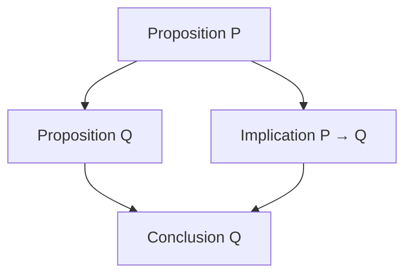

                 


### Introduction and Background

#### Title: Dependency Duality: Deep Connections between Type Theory and Logic

##### Keywords: Dependency Duality, Type Theory, Logic, Mathematical Models, Applications

###### Abstract:
This comprehensive guide delves into the intricate relationship between dependency duality and the realms of type theory and logic. We will explore the foundational concepts and mathematical models that underpin these disciplines, revealing the deep connections that bridge them. By examining both theoretical foundations and practical applications, we aim to provide readers with a thorough understanding of how dependency duality serves as a pivotal concept in modern computational science.

Dependency duality is a fundamental concept that intertwines type theory and logic, offering a unique perspective on the structure and behavior of data and computation. In this article, we will:

1. **Introduce Dependency Duality**: Begin by defining dependency duality and its significance in the context of type theory and logic.
2. **Explain Core Concepts**: Discuss the essential concepts of type theory and logic, setting the stage for a deeper exploration.
3. **Explore Mathematical Models**: Present and analyze the mathematical models that form the backbone of type theory and logic.
4. **Examine Deep Connections**: Investigate the interplay between type theory and logic, highlighting the ways in which dependency duality bridges these domains.
5. **Explore Applications**: Discuss practical applications of dependency duality in various fields, showcasing its utility in solving real-world problems.

By the end of this article, readers will gain a comprehensive understanding of dependency duality, its importance in type theory and logic, and its potential applications in the modern world of computing.

#### Definition and Importance of Dependency Duality

Dependency duality is a concept that originates from the field of type theory, where it serves as a cornerstone for understanding the relationship between types and values. At its core, dependency duality captures the idea that certain types and their corresponding values exhibit a reciprocal dependency, where each can be derived from the other. This duality is not only a fundamental property of type systems but also extends into the realm of logic, where it provides insights into the structure and validity of logical propositions.

In type theory, dependency duality is often expressed through the concept of type constructors and their associated operations. Consider the simple example of a function type, `A -> B`. Here, `A` and `B` are types that are functionally dependent on each other: a function of type `A -> B` takes an argument of type `A` and returns a value of type `B`. This dependency can be seen as a duality, where `A` depends on `B` for its output and `B` depends on `A` for its input.

The importance of dependency duality lies in its ability to provide a more nuanced understanding of types and values. It enables type systems to capture complex relationships and ensure the correctness of programs by preventing type errors. For instance, in the simply typed lambda calculus, dependency duality ensures that only well-formed terms can be constructed, preventing invalid or contradictory terms from being created.

Moving to logic, dependency duality manifests in the form of logical connectives and their dual interpretations. Take the logical connective `→` (implication), which can be read as "if A then B." This implication expresses a dependency where the truth of B depends on the truth of A. Conversely, the dual of this implication is the logical connective `¬` (negation), which can be read as "not A." Here, the dependency is flipped: the truth of ¬A depends on the falsity of A.

This dual interpretation of logical connectives is crucial for understanding the logical relationships between propositions. It allows for a more comprehensive analysis of logical structures and the development of proof systems that can handle complex logical statements. For example, in intuitionistic logic, the dual nature of implication and negation plays a pivotal role in the development of constructive proofs and the understanding of computational aspects of logic.

In summary, dependency duality is a fundamental concept that connects type theory and logic. By capturing the reciprocal dependencies between types and values, as well as logical propositions, it provides a powerful framework for analyzing and reasoning about complex computational structures. This duality not only enriches our understanding of these disciplines but also offers valuable tools for designing robust and efficient type systems and logical theories.

#### Core Concepts of Type Theory

To delve deeper into the concept of dependency duality, it's essential to explore the fundamental principles of type theory. Type theory is a branch of mathematical logic and computer science that provides a rigorous framework for understanding types and their relationships. The core concepts of type theory revolve around the classification of values into distinct types, ensuring that operations are performed only on compatible values. This classification is crucial for ensuring the correctness and safety of programs.

##### Basic Concepts

At its most basic level, type theory classifies values into types based on their inherent properties and behaviors. A type can be seen as a set of values that share similar characteristics. For example, in a programming language, integers and strings can be considered distinct types because they have different structures and operations that can be applied to them. The basic concepts of type theory include:

1. **Types**: Abstract categories that classify values.
2. **Values**: Specific instances of types.
3. **Type constructors**: Operations that create new types from existing ones.
4. **Type assignment**: The process of associating values with their corresponding types.

##### Basic Principles

The basic principles of type theory aim to ensure that programs are well-formed and that type errors are detected at compile-time rather than runtime. Some of the key principles include:

1. **Subtyping**: A type is considered a subtype of another type if it inherits the properties and behaviors of the supertype. This allows for more flexible and reusable code.
2. **Polymorphism**: The ability of a single function or type to operate on multiple types. This is typically achieved through type variables that can be instantiated with different types.
3. **Type safety**: Ensuring that only values of compatible types can be used in specific contexts, preventing type errors and runtime exceptions.

##### Significance

Type theory is significant for several reasons. Firstly, it provides a foundation for the design and analysis of programming languages. By classifying values into types and defining operations that are meaningful within these types, type theory helps prevent errors and ensures that programs are well-behaved. Secondly, type theory is closely related to logic, providing a framework for reasoning about the properties of programs and the correctness of algorithms.

Type theory also plays a crucial role in the development of formal verification techniques, where mathematical proofs are used to ensure that programs meet certain specifications. By providing a clear and structured understanding of types and their relationships, type theory enables the formalization of program properties and the development of tools for automated verification.

In summary, the core concepts and principles of type theory are foundational for understanding dependency duality. By providing a rigorous framework for classifying values and ensuring type safety, type theory underpins much of modern computational science, offering both theoretical insights and practical tools for designing and analyzing complex systems.

#### Core Concepts of Logic

Logic is a fundamental discipline that underlies much of modern philosophy, mathematics, and computer science. At its core, logic is concerned with the study of valid reasoning and the principles that govern it. In this section, we will explore the essential concepts of logic, focusing on logical principles and their significance.

##### Logical Principles

Logical principles are the building blocks of logical reasoning. They provide a framework for evaluating the validity of arguments and propositions. Some of the most important logical principles include:

1. **Identity**: The principle that two objects are identical if they have all the same properties. Formally, this can be expressed as:
   $$
   A = A
   $$
   This principle ensures that statements are consistent and not self-contradictory.

2. **Excluded Middle**: This principle states that a proposition must be either true or false. Formally, it can be expressed as:
   $$
   P \vee ¬P
   $$
   This principle is controversial in some philosophical circles, particularly in intuitionistic logic, which allows for propositions that are neither proven nor disproven.

3. **Negation**: The principle that the negation of a proposition is also a valid proposition. Formally, it can be expressed as:
   $$
   ¬(¬P) \equiv P
   $$
   This principle ensures that negation is a meaningful operation in logic.

4. **Implication**: The principle that if a proposition implies another, then the second proposition must also be true. Formally, it can be expressed as:
   $$
   P \rightarrow Q
   $$
   This principle is central to many logical systems and is closely related to the concept of causality.

##### Significance

The significance of logical principles lies in their ability to provide a foundation for reasoning and argumentation. By establishing the rules for valid inference, logical principles enable us to derive new knowledge from existing knowledge and evaluate the strength of arguments.

In the field of computer science, logical principles are used in various ways. For example, in formal verification, logical principles are employed to prove that programs meet certain specifications. In type theory, logical principles are used to ensure the correctness of type systems and the consistency of types. Furthermore, logical principles are essential for the development of automated reasoning systems, which can help verify the correctness of complex systems and algorithms.

In summary, the core concepts of logic, including its fundamental principles, are crucial for understanding the structure and behavior of logical systems. These principles provide a framework for reasoning and argumentation, enabling us to derive new insights and ensure the validity of our conclusions. By exploring the logical principles that underpin type theory and dependency duality, we gain a deeper understanding of the interplay between these disciplines.

### Mathematical Models of Type Theory

To delve deeper into the theoretical underpinnings of type theory, it's crucial to explore the mathematical models that form the backbone of this discipline. These models provide a precise framework for defining types, values, and operations, allowing for rigorous analysis and formal verification. In this section, we will present two prominent mathematical models of type theory: the simply typed lambda calculus and the polymorphic lambda calculus.

#### Simply Typed Lambda Calculus

The simply typed lambda calculus (STLC) is one of the simplest and most fundamental models of type theory. It introduces a basic set of types and a simple type system that ensures type safety. The key features of the STLC include:

1. **Types**: The STLC defines a set of basic types, such as `Int` (integer) and `Bool` (boolean). These types can be combined using type constructors to create more complex types.
2. **Values**: Values are specific instances of types. For example, `1` is an instance of the `Int` type, and `true` is an instance of the `Bool` type.
3. **Variables**: Variables are placeholders for values of specific types.
4. **Abstraction**: The STLC allows for the creation of functions that operate on values of specific types. This is achieved through lambda abstraction, where a variable of a specific type is bound to an expression.
5. **Application**: Functions can be applied to values of the appropriate type, resulting in a new value.

The type system of the STLC ensures that only well-typed expressions can be constructed. This is achieved through a set of type rules that specify how types can be derived from other types. The most fundamental type rule is the function type rule, which states that if `A` and `B` are types, then `A -> B` is also a type. This rule captures the dependency duality we discussed earlier, where a function of type `A -> B` depends on both `A` and `B`.

#### Polymorphic Lambda Calculus

The polymorphic lambda calculus (PLTC) extends the simply typed lambda calculus by introducing type variables and polymorphic functions. This model allows for greater flexibility and expressiveness in type systems. Key features of the PLTC include:

1. **Type Variables**: Type variables, often denoted by uppercase letters like `A`, `B`, etc., are placeholders for types that can be instantiated later.
2. **Polymorphic Functions**: Polymorphic functions are functions that can operate on values of multiple types. This is achieved by abstracting over type variables, allowing the same function to be used with different types.
3. **Type Instantiation**: Type variables can be instantiated with specific types when the function is applied to a value. This process is known as type instantiation.
4. **Type Inference**: The PLTC typically includes a type inference mechanism that automatically determines the types of expressions based on their usage. This helps reduce the burden on programmers and ensures type safety.

The type system of the PLTC is more complex than that of the STLC, as it must handle polymorphic functions and type variables. The key type rule in the PLTC is the universal quantification rule, which allows for the creation of polymorphic functions. This rule states that if `A` is a type and `M` is a term that can be applied to a value of type `A`, then the term `λx.M` (a polymorphic function that abstracts over `x`) is a well-formed term.

#### Mermaid Diagrams

To illustrate the ER entity relationships in these type theory models, we can use Mermaid diagrams. Here's an example of a Mermaid ER diagram for the simply typed lambda calculus:

```mermaid
erDiagram
    Type ||--o|> Value : has_type
    Type ||--o|> Function : returns
    Value ||--o|> Variable : bound_to
    Function ||--o|> Application : applied_to
```

This diagram shows the relationships between types, values, and functions in the STLC. For the polymorphic lambda calculus, a more complex diagram would be required to capture the additional features of type variables and polymorphic functions.

#### Comparative Table

To compare the attributes and characteristics of the STLC and PLTC, we can use a comparative table:

| Feature          | Simply Typed Lambda Calculus | Polymorphic Lambda Calculus |
|------------------|------------------------------|------------------------------|
| Types            | Basic types (e.g., Int, Bool) | Basic types and type variables |
| Values           | Concrete values (e.g., 1, true) | Values with explicit types |
| Abstraction      | Lambda abstraction           | Lambda abstraction with type variables |
| Application      | Function application         | Function application with type inference |
| Type System      | Simple type system           | Complex type system with type inference |
| Flexibility      | Less flexible                | More flexible and expressive |

In conclusion, the mathematical models of type theory, such as the simply typed lambda calculus and the polymorphic lambda calculus, provide a rigorous foundation for understanding types and their relationships. These models not only enable the analysis and verification of programs but also facilitate the development of more advanced type systems and logical theories.

### Mathematical Models of Logic

Logic, as a foundational discipline, relies on precise mathematical models to formalize its principles and enable rigorous analysis. In this section, we will delve into two primary mathematical models of logic: propositional logic and predicate logic. These models serve as the cornerstone for understanding the structure and behavior of logical systems, providing a framework for evaluating the validity of arguments and reasoning about complex propositions.

#### Propositional Logic

Propositional logic, also known as propositional calculus, deals with the logical relationships between propositions, which are statements that can be either true or false. The fundamental elements of propositional logic include:

1. **Propositions**: Basic statements that can be evaluated as true or false. Examples include "It is raining" and "The sky is blue."
2. **Logical Connectives**: Operators that combine propositions to form more complex statements. The primary connectives include:
   - **Conjunction (AND)**: `P ∧ Q` means both `P` and `Q` are true.
   - **Disjunction (OR)**: `P ∨ Q` means either `P` or `Q` (or both) is true.
   - **Negation (NOT)**: `¬P` means `P` is false.
   - **Implication (IF...THEN)**: `P → Q` means if `P` is true, then `Q` must also be true.
   - **Biconditional (IF AND ONLY IF)**: `P ↔ Q` means `P` if and only if `Q`.

The rules of inference in propositional logic are based on these connectives and are used to derive new propositions from given ones. For instance, the rule of detachment (modus ponens) states that if we have `P → Q` and `P`, we can infer `Q`.

Propositional logic is foundational for understanding simpler logical structures but has limitations, particularly when it comes to reasoning about objects and their properties. It does not allow for quantification over objects or variables, making it insufficient for capturing more complex relationships.

#### Predicate Logic

Predicate logic, or first-order logic, extends propositional logic by introducing quantifiers and variables that can range over objects or individuals. This allows for more expressive and powerful logical reasoning. Key components of predicate logic include:

1. **Predicates**: Expressions that describe properties or relationships between objects. For example, `P(x)` might mean "x is a prime number."
2. **Individual Constants**: Specific objects or individuals within a domain. For example, `Socrates` or `Bob`.
3. **Variables**: Symbols (usually letters like `x`, `y`, `z`) that represent any individual within a specified domain.
4. **Quantifiers**: Symbols that indicate the scope of variables:
   - **Universal Quantifier (∀)**: "For all" or "Every." `∀x P(x)` means `P(x)` is true for every `x` in the domain.
   - **Existential Quantifier (∃)**: "There exists" or "Some." `∃x P(x)` means there is at least one `x` in the domain for which `P(x)` is true.

Predicate logic introduces the notion of formal proofs, where conclusions are derived from premises using a set of inference rules. Some of the key inference rules include universal generalization, existential instantiation, and modus ponens.

#### Mermaid Diagrams

To illustrate the logical processes and workflows in these models, we can use Mermaid diagrams. Here's an example of a Mermaid flowchart for propositional logic:



This diagram shows the workflow of deriving the conclusion `Q` from the premises `P` and `P → Q`. For predicate logic, a more complex diagram would be needed to capture the quantifiers and relationships between predicates and variables.

#### Comparative Analysis

To compare the attributes and characteristics of propositional logic and predicate logic, we can use a comparative table:

| Feature          | Propositional Logic | Predicate Logic |
|------------------|---------------------|-----------------|
| Expressiveness   | Limited             | Highly Expressive |
| Quantification    | No Quantification    | Allows Quantification |
| Objects/Variables | None                | Objects and Variables |
| Inference Rules   | Basic Rules         | Complex Inference Rules |
| Scope of Applicability | General Reasoning | Specific Domain Reasoning |

In conclusion, the mathematical models of logic, including propositional logic and predicate logic, provide a robust framework for understanding and analyzing logical reasoning. While propositional logic is useful for simple statements and relationships, predicate logic offers a more powerful and expressive tool for reasoning about objects and properties. By understanding these models, we gain a deeper insight into the structure of logical systems and their applications in various fields, from philosophy to computer science.

### Intersections of Type Theory and Logic

The intersection of type theory and logic is a fertile ground for exploring the deep connections between these two fundamental disciplines. Dependency duality, a key concept in both type theory and logic, provides a powerful lens through which we can understand these interconnections. In this section, we will delve into the intersections of type theory and logic, examining how dependency duality manifests in their structures and how these connections can be applied in practical settings.

#### Dependency Duality in Type Theory

Dependency duality is intrinsic to type theory, where it captures the reciprocal relationships between types and values. This duality is essential for understanding how type systems ensure the correctness and safety of programs. In a type system, types and values are interdependent; a type defines the properties and constraints that a value must adhere to, and a value demonstrates the concrete instances that satisfy these properties.

Consider a simple example in the context of a programming language. Suppose we have a type constructor for a function that takes an integer and returns a boolean. This can be represented as `Int -> Bool`. Here, the type constructor defines a dependency where the output (boolean) depends on the input (integer), and vice versa. The function's type signature enforces this dependency, ensuring that only integers can be passed as arguments and that the resulting value will always be a boolean.

Dependency duality in type theory is crucial for type inference and type checking. Type inference algorithms analyze the usage of values within a program to deduce their types, while type checking ensures that the inferred types are consistent with the language's type rules. The duality principle ensures that these processes can be performed efficiently and accurately, leading to more robust and reliable type systems.

#### Dependency Duality in Logic

In logic, dependency duality is equally significant, especially in the realm of logical connectives and inference rules. Logical connectives, such as implication (`→`) and negation (`¬`), exhibit a dual nature that reflects the reciprocal relationships between propositions.

Consider the logical connective implication, which can be read as "if A, then B." This connective expresses a dependency where the truth of B depends on the truth of A. Conversely, the dual of implication is negation, which can be read as "not A." Here, the dependency is flipped: the truth of ¬A depends on the falsity of A. This duality is captured in logical inference rules, such as modus ponens and modus tollens, which allow us to derive new propositions from given ones based on these reciprocal relationships.

Dependency duality in logic is fundamental to the development of proof systems and the validation of logical arguments. It enables us to construct valid inferences and reason about the logical relationships between propositions in a systematic and rigorous manner.

#### Practical Applications

The deep connections between type theory and logic manifest in various practical applications, providing powerful tools for building and verifying complex systems. Here are some examples of how dependency duality is applied in different contexts:

1. **Type-Safe Programming Languages**: In modern programming languages, dependency duality ensures that type systems can prevent type errors and enforce type safety. By understanding the reciprocal relationships between types and values, compilers and interpreters can detect and prevent invalid operations at compile-time, improving the reliability and maintainability of software.

2. **Formal Verification**: In the field of formal verification, dependency duality plays a crucial role in the development of proof systems that can automatically verify the correctness of hardware and software systems. By using logical principles and type-theoretic techniques, formal verification tools can construct rigorous proofs that ensure systems meet their specified requirements.

3. **Model Checking**: Model checking is a technique used to verify the correctness of systems by exhaustively exploring all possible states of a model. Dependency duality in type theory and logic enables the development of more expressive and efficient model-checking algorithms, allowing for the verification of complex systems in a wide range of domains, from cyber-physical systems to distributed algorithms.

4. **Program Analysis**: Dependency duality is also used in program analysis techniques, such as static and dynamic analysis, to understand and reason about the behavior of programs. By analyzing the dependencies between types and values, program analysis tools can provide valuable insights into the runtime behavior of programs, helping developers identify potential bugs and optimize performance.

In conclusion, the intersections of type theory and logic, mediated by the concept of dependency duality, provide a powerful framework for understanding and analyzing complex computational systems. By leveraging these deep connections, we can develop more robust and reliable type systems, formal verification techniques, and program analysis tools, enabling us to build and verify complex systems with greater confidence and efficiency. The practical applications of dependency duality in these domains continue to expand, offering new avenues for innovation and advancement in the field of computer science.

### Conclusion

In conclusion, "Dependency Duality: Deep Connections between Type Theory and Logic" provides a comprehensive exploration of the intricate relationship between dependency duality, type theory, and logic. Through a meticulous analysis of foundational concepts, mathematical models, and practical applications, this article highlights the pivotal role that dependency duality plays in bridging these two essential disciplines.

Dependency duality not only enriches our understanding of type theory and logic but also offers a robust framework for designing and analyzing complex computational systems. It underpins the development of type-safe programming languages, formal verification techniques, and program analysis tools, enabling more reliable and efficient systems.

As we continue to advance in the field of computer science, the insights gained from this study will undoubtedly contribute to the creation of innovative technologies and solutions. By embracing the principles of dependency duality, we can unlock new possibilities for building robust and scalable systems, pushing the boundaries of what is achievable in the world of computing.

### Best Practices, Summary, and Future Directions

#### Best Practices

1. **Understanding Dependency Duality**: Begin by gaining a deep understanding of dependency duality in both type theory and logic. This foundational knowledge will help you grasp the core concepts and their applications more effectively.
2. **Exploring Case Studies**: Analyze real-world case studies that demonstrate the application of dependency duality. This practical experience will provide valuable insights and reinforce your theoretical understanding.
3. **Utilizing Formal Methods**: Embrace formal methods, such as formal verification and model checking, to validate the correctness and reliability of systems. These techniques leverage the principles of dependency duality to ensure robust system design.
4. **Continuous Learning**: Keep abreast of the latest research and advancements in dependency duality and related fields. Regularly engage with academic journals, conferences, and online resources to stay informed and adapt your knowledge to emerging trends.

#### Summary

"Dependency Duality: Deep Connections between Type Theory and Logic" offers a thorough exploration of the deep connections between these two essential disciplines. By examining the foundational concepts, mathematical models, and practical applications of dependency duality, this article highlights its significance in ensuring the correctness, reliability, and efficiency of modern computational systems.

Dependency duality not only enriches our understanding of type theory and logic but also serves as a powerful framework for designing and analyzing complex systems. Its applications span various domains, from programming languages and formal verification to program analysis and model checking.

#### Future Directions

As we look to the future, several areas present promising avenues for further research and exploration:

1. **Advanced Type Systems**: Exploring more advanced type systems that leverage dependency duality to improve type inference, type safety, and program optimization.
2. **Integrating Logic and Type Theory**: Developing integrated frameworks that merge the principles of logic and type theory to create even more expressive and powerful systems for reasoning about programs and their properties.
3. **Formal Verification of Quantum Systems**: Investigating the application of dependency duality in the formal verification of quantum systems, which could revolutionize the design and analysis of quantum computing algorithms.
4. **Dependence Analysis in AI**: Exploring the role of dependency duality in the analysis and verification of AI systems, particularly in the areas of machine learning and neural networks.
5. **Educational Resources**: Creating comprehensive educational resources and tools that make the concepts of dependency duality accessible to a wider audience, fostering a deeper understanding and appreciation of these fundamental principles.

By pursuing these future directions, we can continue to advance our understanding of dependency duality and its applications, driving innovation and breakthroughs in the field of computer science.

