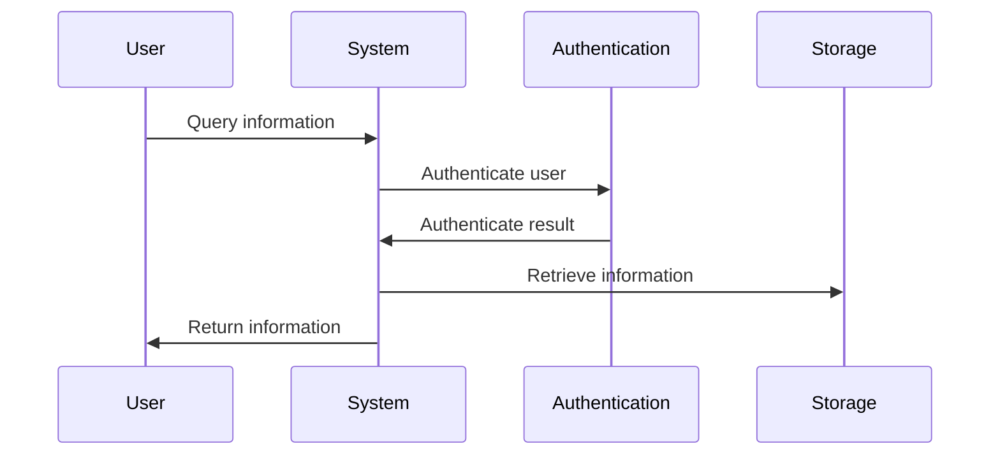
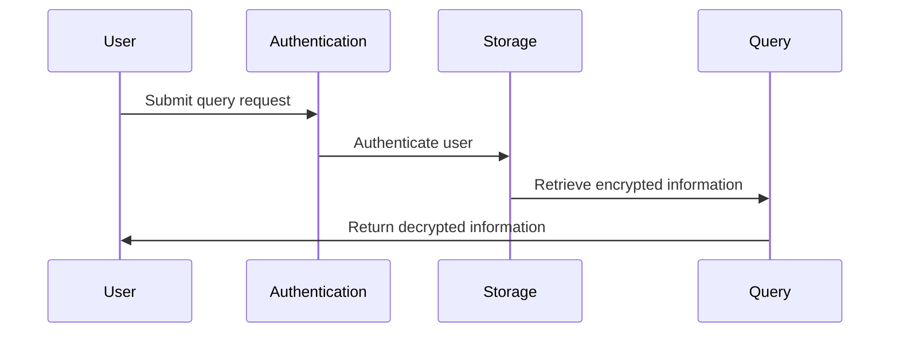

                 

### 信息溯源技术概述

在现代信息技术飞速发展的背景下，数据的重要性愈发凸显。然而，伴随着信息的爆炸式增长，信息污染问题也日益严重。信息污染不仅影响了信息的真实性和可靠性，还对企业的运营和社会的稳定构成了巨大威胁。因此，如何有效应对信息污染成为了一个亟待解决的问题。在这样的背景下，信息溯源技术应运而生，为企业提供了新的手段来应对信息污染。

#### 1.1 问题的背景

**信息污染的挑战**

信息污染主要表现为虚假信息、恶意信息、隐私泄露等问题。虚假信息和恶意信息不仅误导了用户的决策，还可能对企业造成声誉损失和财务风险。而隐私泄露则可能导致用户数据被滥用，甚至引发法律纠纷。例如，社交媒体平台上虚假新闻的传播，使得公众对于真实信息的辨识能力降低；企业内部的数据泄露事件，可能导致商业机密的泄露，对企业的核心竞争力造成打击。

**企业信息溯源的需求**

面对信息污染的挑战，企业迫切需要一种有效的手段来确保信息的真实性和可追溯性。信息溯源技术正是为此而生。它能够帮助企业追溯信息的来源，验证信息的真实性，从而减少信息污染带来的负面影响。例如，在供应链管理中，企业需要确保每一个环节的信息都是真实可信的，以避免因信息污染导致的产品质量问题；在食品安全监控中，企业需要能够快速追溯食品的生产、加工和运输过程，以确保食品的安全性和质量。

#### 1.2 核心概念与联系

**信息溯源技术的概念**

信息溯源技术是指通过一定的技术手段，对信息的来源、传输、处理和存储过程进行追踪和记录，以实现对信息真实性和可靠性的验证。其核心目的是确保信息的可信度和可追溯性，从而有效应对信息污染。

**核心概念与联系**

- **信息加密技术**：信息加密技术用于保护信息的机密性和完整性，防止信息在传输过程中被篡改或泄露。
- **数据存储与传输**：数据存储与传输技术是信息溯源技术的基础，它涉及如何高效、安全地存储和传输数据，以确保信息溯源的可靠性和效率。
- **信息认证与验证**：信息认证与验证技术用于确认信息的来源和真实性，确保只有合法的用户和系统才能访问和操作信息。
- **信息追溯机制**：信息追溯机制是指通过记录和追踪信息在各个阶段的操作，实现对信息来源和历史的全面了解，以便在需要时进行追溯。

#### 1.3 信息溯源技术的应用领域

**供应链管理**

在供应链管理中，信息溯源技术可以帮助企业追溯产品的原材料来源、生产加工过程和物流运输环节，确保产品的质量和安全性。

**食品安全监控**

在食品安全监控中，信息溯源技术可以帮助企业监控食品从生产、加工到销售的全过程，及时发现和处理食品安全问题，保障公众的健康。

**数字版权保护**

在数字版权保护中，信息溯源技术可以帮助版权方追溯作品的传播和利用情况，确保版权方的权益不受侵犯。

#### 1.4 信息溯源技术的边界与外延

**信息溯源与其他溯源技术的对比**

信息溯源技术与其他溯源技术（如物流溯源、食品安全溯源等）在技术原理和应用场景上有所区别。信息溯源技术更注重信息的真实性和可靠性，而其他溯源技术则侧重于特定领域的应用。

**信息溯源技术的发展趋势**

随着大数据、云计算和区块链等技术的不断发展，信息溯源技术也在不断演进。未来的信息溯源技术将更加智能化、高效化和安全化，能够更好地满足企业和用户的需求。

#### 1.5 本章小结

本章从信息污染的挑战和企业信息溯源的需求出发，介绍了信息溯源技术的概念、核心概念与联系、应用领域以及技术边界与外延。通过本章的介绍，读者可以初步了解信息溯源技术的基本概念和重要性，为后续章节的深入探讨打下基础。在接下来的章节中，我们将进一步解析信息溯源技术的原理与实现，帮助读者更好地理解这一关键技术。

### 第1章：问题背景与核心概念

在当今信息化社会，数据已成为企业和个人最为宝贵的资产。然而，伴随着数据的爆炸性增长，信息污染问题也日益严峻，严重影响了信息的真实性和可靠性。为了有效应对这一挑战，企业需要一种全新的手段——信息溯源技术。本文将首先介绍信息污染的背景，随后阐述信息溯源技术的概念、基本原理以及应用领域，并对信息溯源技术与其他溯源技术的区别进行详细分析。

#### 1.1 问题的背景

**信息污染的挑战**

信息污染主要表现为虚假信息、恶意信息、隐私泄露等问题。虚假信息和恶意信息不仅误导了用户的决策，还可能对企业造成声誉损失和财务风险。例如，社交媒体平台上虚假新闻的传播，使得公众对于真实信息的辨识能力降低；企业内部的数据泄露事件，可能导致商业机密的泄露，对企业的核心竞争力造成打击。

**企业信息溯源的需求**

面对信息污染的挑战，企业迫切需要一种有效的手段来确保信息的真实性和可追溯性。信息溯源技术正是为此而生。它能够帮助企业追溯信息的来源，验证信息的真实性，从而减少信息污染带来的负面影响。例如，在供应链管理中，企业需要确保每一个环节的信息都是真实可信的，以避免因信息污染导致的产品质量问题；在食品安全监控中，企业需要能够快速追溯食品的生产、加工和运输过程，以确保食品的安全性和质量。

#### 1.2 信息溯源技术的概念

**信息溯源技术的定义**

信息溯源技术，是指通过一定的技术手段，对信息的来源、传输、处理和存储过程进行追踪和记录，以实现对信息真实性和可靠性的验证。其核心目的是确保信息的可信度和可追溯性，从而有效应对信息污染。

**信息溯源技术的核心要素**

- **信息加密技术**：用于保护信息的机密性和完整性，防止信息在传输过程中被篡改或泄露。
- **数据存储与传输**：涉及如何高效、安全地存储和传输数据，以确保信息溯源的可靠性和效率。
- **信息认证与验证**：用于确认信息的来源和真实性，确保只有合法的用户和系统才能访问和操作信息。
- **信息追溯机制**：通过记录和追踪信息在各个阶段的操作，实现对信息来源和历史的全面了解，以便在需要时进行追溯。

#### 1.3 信息溯源技术的基本原理

**信息溯源的流程**

信息溯源技术的基本原理可以概括为以下几个步骤：

1. **信息采集**：在信息的生成阶段，对信息进行采集和记录，确保信息的原始性。
2. **信息加密**：对采集到的信息进行加密处理，确保信息的机密性和完整性。
3. **信息传输**：将加密后的信息进行传输，确保信息在传输过程中的安全。
4. **信息存储**：将传输完成的信息存储在安全可靠的数据库中，便于后续查询和追溯。
5. **信息验证**：在需要时，对存储的信息进行验证，确保信息的真实性和可靠性。
6. **信息追溯**：通过追溯机制，实现对信息来源和历史的全面了解。

**信息溯源的关键技术**

1. **区块链技术**：区块链技术以其去中心化、不可篡改的特性，在信息溯源中得到了广泛应用。通过将信息记录在区块链上，可以确保信息的真实性和不可篡改性。
2. **加密技术**：信息加密技术用于保护信息的机密性和完整性，常用的加密算法包括对称加密、非对称加密和哈希算法等。
3. **大数据分析**：通过大数据分析技术，可以对海量信息进行实时监控和智能分析，从而快速识别和应对信息污染问题。

#### 1.4 信息溯源技术的应用领域

**供应链管理**

在供应链管理中，信息溯源技术可以帮助企业追溯产品的原材料来源、生产加工过程和物流运输环节，确保产品的质量和安全性。

**食品安全监控**

在食品安全监控中，信息溯源技术可以帮助企业监控食品从生产、加工到销售的全过程，及时发现和处理食品安全问题，保障公众的健康。

**数字版权保护**

在数字版权保护中，信息溯源技术可以帮助版权方追溯作品的传播和利用情况，确保版权方的权益不受侵犯。

**电子身份认证**

在电子身份认证中，信息溯源技术可以用于验证用户的身份信息，确保只有合法的用户才能访问系统资源和进行操作。

**医疗健康数据管理**

在医疗健康数据管理中，信息溯源技术可以帮助医疗机构追溯患者的医疗记录，确保医疗数据的真实性和可靠性。

#### 1.5 信息溯源技术与其他溯源技术的对比

**物流溯源**

物流溯源技术主要关注商品在物流运输过程中的状态和位置信息，通过扫描条码、RFID等技术手段实现对物流信息的实时追踪。

**食品安全溯源**

食品安全溯源技术主要关注食品从生产、加工到销售的全过程，通过记录食品的产地、加工企业、运输过程等信息，实现对食品安全的有效监控。

**信息溯源**

信息溯源技术则更注重信息的真实性和可靠性，通过记录和追踪信息在各个阶段的操作，实现对信息来源和历史的全面了解。与其他溯源技术相比，信息溯源技术具有更高的灵活性和适用性。

#### 1.6 信息溯源技术的发展趋势

随着大数据、云计算和区块链等技术的不断发展，信息溯源技术也在不断演进。未来的信息溯源技术将更加智能化、高效化和安全化，能够更好地满足企业和用户的需求。

**智能化**：通过人工智能技术，实现对海量信息的自动分析和处理，提高信息溯源的效率和准确性。

**高效化**：通过分布式计算和边缘计算技术，实现对信息的高速处理和实时监控，提高信息溯源的响应速度。

**安全化**：通过加密技术和区块链技术，确保信息溯源过程的安全性和可靠性，防止信息篡改和泄露。

#### 1.7 本章小结

本章从信息污染的挑战和企业信息溯源的需求出发，介绍了信息溯源技术的概念、基本原理和应用领域，并对信息溯源技术与其他溯源技术的区别进行了详细分析。通过本章的介绍，读者可以初步了解信息溯源技术的基本概念和重要性，为后续章节的深入探讨打下基础。在接下来的章节中，我们将进一步解析信息溯源技术的原理与实现，帮助读者更好地理解这一关键技术。

### 第2章：信息溯源技术原理深入解析

信息溯源技术作为应对信息污染的关键手段，其实现原理和核心技术至关重要。本章将深入探讨信息溯源技术的基本原理，详细分析其实现过程中的关键技术和应用场景，通过具体示例帮助读者更好地理解这一技术。

#### 2.1 基本原理

**信息溯源技术的基本概念**

信息溯源技术，是指通过特定的技术手段，对信息的来源、传输、处理和存储过程进行追踪和记录，以实现对信息真实性和可靠性的验证。其核心目的是确保信息的可信度和可追溯性，从而有效应对信息污染。

**信息溯源的流程**

信息溯源的流程可以分为以下几个步骤：

1. **信息采集**：在信息的生成阶段，对信息进行采集和记录，确保信息的原始性。
2. **信息加密**：对采集到的信息进行加密处理，确保信息的机密性和完整性。
3. **信息传输**：将加密后的信息进行传输，确保信息在传输过程中的安全。
4. **信息存储**：将传输完成的信息存储在安全可靠的数据库中，便于后续查询和追溯。
5. **信息验证**：在需要时，对存储的信息进行验证，确保信息的真实性和可靠性。
6. **信息追溯**：通过追溯机制，实现对信息来源和历史的全面了解。

**信息溯源的关键技术**

1. **区块链技术**：区块链技术以其去中心化、不可篡改的特性，在信息溯源中得到了广泛应用。通过将信息记录在区块链上，可以确保信息的真实性和不可篡改性。
2. **加密技术**：信息加密技术用于保护信息的机密性和完整性，常用的加密算法包括对称加密、非对称加密和哈希算法等。
3. **大数据分析**：通过大数据分析技术，可以对海量信息进行实时监控和智能分析，从而快速识别和应对信息污染问题。

#### 2.2 信息加密技术

**加密算法的选择**

在信息溯源过程中，加密算法的选择至关重要。常用的加密算法包括：

- **对称加密**：如AES（Advanced Encryption Standard），其加密和解密使用相同的密钥，速度快，但密钥管理复杂。
- **非对称加密**：如RSA（Rivest-Shamir-Adleman），其加密和解密使用不同的密钥，安全性高，但计算复杂度大。
- **哈希算法**：如SHA（Secure Hash Algorithm），用于生成信息的摘要，确保信息的完整性。

**加密过程的详细说明**

1. **对称加密过程**：

   - **密钥生成**：随机生成一个密钥。
   - **加密操作**：使用密钥对信息进行加密。
   - **密钥传输**：将密钥安全传输到接收方。
   - **解密操作**：接收方使用相同的密钥对加密信息进行解密。

2. **非对称加密过程**：

   - **密钥生成**：随机生成一对密钥（公钥和私钥）。
   - **加密操作**：使用公钥对信息进行加密。
   - **解密操作**：使用私钥对加密信息进行解密。

3. **哈希算法过程**：

   - **信息摘要生成**：将信息通过哈希算法生成一个固定长度的摘要。
   - **摘要验证**：对传输的信息和接收到的摘要进行比对，以确保信息完整性。

**加密技术的应用场景**

- **数据传输**：在信息传输过程中，使用加密技术确保数据的安全。
- **数据存储**：在数据存储过程中，使用加密技术保护数据的机密性和完整性。
- **数字签名**：使用非对称加密技术，实现对信息的数字签名，确保信息来源的可信性。

#### 2.3 数据存储与传输

**数据库的选择**

在信息溯源过程中，选择合适的数据库至关重要。常用的数据库类型包括：

- **关系型数据库**：如MySQL、Oracle，适用于结构化数据的存储和管理。
- **非关系型数据库**：如MongoDB、Redis，适用于半结构化或非结构化数据的存储。

**数据传输的保障**

- **数据加密传输**：在数据传输过程中，使用加密技术确保数据的安全。
- **传输协议**：使用安全的传输协议，如HTTPS，确保数据在传输过程中的完整性。
- **数据备份与恢复**：定期备份数据，并确保在发生数据丢失或损坏时，能够快速恢复。

#### 2.4 信息认证与验证

**认证技术的应用**

- **身份认证**：确保只有授权用户才能访问系统和操作信息。
- **访问控制**：通过访问控制策略，限制用户对系统资源的访问权限。

**验证过程的详细说明**

1. **用户认证**：

   - **用户登录**：用户输入用户名和密码。
   - **身份验证**：系统验证用户身份，确保用户身份的真实性。

2. **数据验证**：

   - **完整性验证**：使用哈希算法对数据进行完整性验证，确保数据在传输和存储过程中的完整性。
   - **真实性验证**：通过数字签名等技术，确保数据的来源和真实性。

#### 2.5 信息追溯机制

**追溯机制的建立**

- **记录操作日志**：记录系统中的所有操作，包括用户的登录、数据访问和修改等。
- **时间戳机制**：为每个操作添加时间戳，确保操作的顺序和时间准确性。

**追溯流程的优化**

- **实时监控**：通过实时监控系统，及时发现和应对信息污染问题。
- **自动化处理**：使用自动化工具，对异常信息进行自动识别和处理。

#### 2.6 原理示例与讲解

**示例一：供应链管理中的信息溯源**

**案例背景**：某企业在生产过程中发现产品存在质量问题，需要追溯产品的生产、加工和物流环节。

**溯源过程演示**：

1. **信息采集**：在生产、加工和物流环节，记录产品的相关信息，如生产日期、加工企业、运输路线等。
2. **信息加密**：对采集到的信息进行加密处理，确保信息的安全性。
3. **信息存储**：将加密后的信息存储在数据库中，便于后续查询和追溯。
4. **信息验证**：在需要时，对存储的信息进行验证，确保信息的真实性和可靠性。
5. **信息追溯**：通过追溯机制，实现对产品质量问题的全面了解，找到问题根源。

**示例二：食品安全监控中的信息溯源**

**案例背景**：某企业在销售中发现食品存在安全问题，需要追溯食品的生产、加工和销售环节。

**溯源过程演示**：

1. **信息采集**：在生产、加工和销售环节，记录食品的相关信息，如生产日期、加工企业、销售地点等。
2. **信息加密**：对采集到的信息进行加密处理，确保信息的安全性。
3. **信息存储**：将加密后的信息存储在数据库中，便于后续查询和追溯。
4. **信息验证**：在需要时，对存储的信息进行验证，确保信息的真实性和可靠性。
5. **信息追溯**：通过追溯机制，实现对食品安全问题的全面了解，及时采取措施确保公众健康。

#### 2.7 本章小结

本章从信息溯源技术的基本原理出发，详细分析了其实现过程中的关键技术，包括信息加密技术、数据存储与传输、信息认证与验证以及信息追溯机制。通过具体示例的讲解，读者可以更好地理解信息溯源技术的原理和应用。在接下来的章节中，我们将进一步探讨信息溯源技术的数学模型和算法，帮助读者更深入地掌握这一关键技术。

### 第3章：信息溯源技术的数学模型与算法

信息溯源技术的实现依赖于一系列数学模型和算法，这些模型和算法不仅保证了信息溯源的准确性和效率，还为信息的安全性和可靠性提供了坚实的技术支撑。本章将详细介绍信息溯源技术中的数学模型与算法，包括其基本原理、实现步骤、Python源代码实现，以及具体的数学公式和应用示例。

#### 3.1 数学模型概述

**信息溯源中的数学模型**

信息溯源技术涉及的数学模型主要包括加密算法模型、认证算法模型和追溯算法模型。这些模型通过数学的方法，确保信息的机密性、完整性和可追溯性。

**信息溯源的数学基础**

1. **加密算法的数学模型**

   加密算法模型的核心是加密函数和解密函数。加密函数用于将明文转换为密文，解密函数用于将密文还原为明文。常用的加密算法包括对称加密（如AES）和非对称加密（如RSA）。

2. **认证算法的数学模型**

   认证算法模型用于验证信息的来源和真实性。常用的认证算法包括消息认证码（MAC）和数字签名。

3. **追溯算法的数学模型**

   追溯算法模型通过记录信息的历史操作和生成时间，实现对信息来源和历史的追踪。常用的算法包括时间戳机制和区块链算法。

**数学模型的构建**

在构建数学模型时，需要考虑以下因素：

- **安全性**：模型必须能够抵御各种攻击，确保信息的机密性和完整性。
- **效率**：模型应具有高效的计算和传输性能，以满足实时溯源的需求。
- **可扩展性**：模型应能够支持大规模数据的应用，适应未来技术的发展。

#### 3.2 算法原理讲解

**算法原理**

1. **加密算法原理**

   加密算法的基本原理是将明文通过加密函数转换为密文，加密函数通常是一个单向函数，即从明文到密文是容易的，而从密文到明文是非常困难的。

2. **认证算法原理**

   认证算法的基本原理是验证信息的来源和真实性。通过加密算法生成消息认证码或数字签名，接收方可以验证消息的完整性和来源。

3. **追溯算法原理**

   追溯算法的基本原理是通过记录操作日志和时间戳，实现对信息生成和传播历史的追踪。例如，区块链技术通过将操作记录在区块链上，实现了信息的不可篡改和可追溯。

**算法的实现步骤**

1. **加密算法实现步骤**

   - **密钥生成**：随机生成加密密钥。
   - **加密操作**：使用加密函数将明文转换为密文。
   - **密文传输**：将密文传输给接收方。
   - **解密操作**：接收方使用解密函数将密文还原为明文。

2. **认证算法实现步骤**

   - **消息生成**：生成需要认证的消息。
   - **认证码生成**：使用认证算法生成消息认证码。
   - **认证码传输**：将认证码传输给接收方。
   - **认证验证**：接收方使用认证算法验证消息的完整性和来源。

3. **追溯算法实现步骤**

   - **操作记录**：记录信息的生成和操作历史。
   - **时间戳生成**：为每个操作生成时间戳。
   - **历史记录**：将操作记录和时间戳存储在数据库中。
   - **历史查询**：通过查询数据库，实现对信息历史的追溯。

**Python源代码实现**

以下是一个简单的Python示例，演示了加密算法和认证算法的实现：

```python
# 导入加密库
from Crypto.PublicKey import RSA
from Crypto.Cipher import PKCS1_OAEP
from Crypto.Hash import SHA256

# 加密算法实现
def encrypt_message(message, public_key):
    cipher = PKCS1_OAEP.new(public_key)
    encrypted_message = cipher.encrypt(message)
    return encrypted_message

# 认证算法实现
def authenticate_message(message, private_key):
    hash_object = SHA256.new(message)
    message_hash = hash_object.digest()
    signature = private_key.sign(hash_object)
    return signature

# 解密和验证示例
def decrypt_and_verify(encrypted_message, private_key, signature):
    public_key = private_key.publickey()
    decrypted_message = public_key.decrypt(encrypted_message)
    hash_object = SHA256.new(decrypted_message)
    verified_signature = private_key.verify(hash_object, signature)
    return decrypted_message, verified_signature

# 主程序
if __name__ == "__main__":
    # 生成密钥对
    key = RSA.generate(2048)
    public_key = key.publickey()
    
    # 加密消息
    message = "This is a secret message."
    encrypted_message = encrypt_message(message.encode(), public_key)
    
    # 签名消息
    signature = authenticate_message(message.encode(), key)
    
    # 解密和验证
    decrypted_message, verified_signature = decrypt_and_verify(encrypted_message, key, signature)
    
    print("Decrypted message:", decrypted_message.decode())
    print("Signature verified:", verified_signature)
```

**运行结果展示**

- 输出加密消息和解密后的消息，以及验证结果。

#### 3.3 数学模型与公式详解

**公式1：加密算法的数学模型**

$$
E_{k}(M) = C
$$

**公式解释**

- \( E_{k}(M) \)：加密函数，\( k \) 为加密密钥，\( M \) 为明文。
- \( C \)：密文，是加密后的信息。

**示例说明**

- 使用AES加密算法对一个字符串进行加密，得到密文。

**公式2：认证算法的数学模型**

$$
H_{m}(C) = T
$$

**公式解释**

- \( H_{m}(C) \)：认证函数，\( m \) 为认证密钥，\( C \) 为密文。
- \( T \)：认证码，用于验证信息的完整性和来源。

**示例说明**

- 使用SHA256算法对一个字符串进行哈希运算，生成认证码。

#### 3.4 算法应用与优化

**算法在实际中的应用**

- **供应链管理**：通过加密和认证算法，确保供应链中每个环节的信息真实可靠。
- **食品安全监控**：利用加密和认证算法，保障食品从生产到销售的全程监控和数据安全。

**应用效果评估**

- **安全性**：通过加密算法，防止信息在传输和存储过程中被篡改和泄露。
- **可靠性**：通过认证算法，确保信息的真实性和来源可验证。
- **效率**：优化算法实现，提高信息处理和查询的效率。

**算法优化策略**

- **并行处理**：利用多线程或分布式计算，提高加密和认证的效率。
- **压缩算法**：优化数据压缩算法，减少存储空间和传输带宽的需求。
- **混合加密**：结合对称加密和非对称加密，发挥各自的优势，提高安全性和效率。

#### 3.5 本章小结

本章详细介绍了信息溯源技术中的数学模型与算法，包括其基本原理、实现步骤、Python源代码实现以及具体的数学公式和应用示例。通过本章的学习，读者可以深入了解信息溯源技术的核心数学模型和算法，为实际应用提供理论和技术支持。在接下来的章节中，我们将进一步探讨信息溯源技术的系统架构与实现，帮助读者全面掌握这一关键技术。

### 第4章：信息溯源技术的系统架构与实现

信息溯源技术的实现不仅需要坚实的理论基础和核心算法，还需要一个高效、稳定的系统架构来支持其运行。本章将详细介绍信息溯源技术的系统架构，包括系统介绍、系统架构设计、领域模型设计、系统架构图以及系统接口设计和系统交互。

#### 4.1 系统介绍

**系统背景**

随着信息技术的飞速发展，数据泄露和虚假信息的泛滥对企业和社会造成了严重的负面影响。为了提高信息的真实性和可追溯性，企业迫切需要一种可靠的信息溯源系统。该系统旨在通过加密、认证和追溯等技术手段，实现对信息的全面监控和管理，从而有效应对信息污染问题。

**系统目标**

- **提高信息的真实性**：确保信息的来源可靠，减少虚假信息的传播。
- **保障信息的完整性**：防止信息在传输和存储过程中被篡改。
- **增强信息的可追溯性**：通过记录信息的历史操作，实现信息的全程追溯。
- **提升企业的运营效率**：通过自动化处理和优化流程，提高信息处理速度和准确性。

**系统功能**

- **信息采集**：从多个数据源采集信息，确保信息的原始性和完整性。
- **信息加密**：对采集到的信息进行加密处理，确保信息的机密性和完整性。
- **信息存储**：将加密后的信息存储在安全可靠的数据库中，便于后续查询和追溯。
- **信息认证**：通过认证算法，确保信息的真实性和来源的可信性。
- **信息追溯**：记录信息的历史操作，实现对信息来源和历史的全面了解。
- **信息查询**：提供便捷的信息查询功能，用户可以根据关键词或条件快速检索信息。

#### 4.2 系统架构设计

**系统架构概述**

信息溯源系统的架构设计应遵循模块化、分布式和安全性原则，以确保系统的高效、稳定和可靠。系统架构主要包括以下模块：

1. **数据采集模块**：负责从多个数据源采集信息，并进行预处理和加密。
2. **加密模块**：使用加密算法对采集到的信息进行加密处理。
3. **存储模块**：将加密后的信息存储在数据库中，并提供数据访问接口。
4. **认证模块**：通过认证算法，对信息的来源和真实性进行验证。
5. **追溯模块**：记录信息的历史操作，实现信息的全程追溯。
6. **查询模块**：提供用户界面，用户可以通过该界面查询信息。

**各模块功能与关系**

- **数据采集模块**：负责采集来自各个数据源的信息，如数据库、文件系统、网络接口等。采集到的信息经过预处理和加密后，发送到存储模块。
- **加密模块**：接收来自数据采集模块的信息，使用加密算法对其进行加密处理，确保信息的机密性和完整性。加密后的信息发送到存储模块。
- **存储模块**：接收加密后的信息，将其存储在数据库中。数据库提供高效的数据访问接口，供其他模块查询和使用。
- **认证模块**：对查询请求进行认证，确保只有授权用户可以访问和操作信息。认证结果发送给查询模块。
- **追溯模块**：记录信息的历史操作，包括数据的创建、修改、删除等。通过追溯模块，可以实现对信息来源和历史的全面了解。
- **查询模块**：提供用户界面，用户可以通过该界面提交查询请求。查询请求经过认证模块验证后，由存储模块查询信息并返回给用户。

#### 4.3 领域模型设计

领域模型是信息溯源系统的核心部分，用于定义系统中的实体及其关系。以下是领域模型的设计：

**实体类定义**

- **信息实体**：表示系统中的信息，包括信息内容、创建时间、最后修改时间等属性。
- **用户实体**：表示系统的用户，包括用户名、密码、角色等属性。
- **操作日志实体**：记录系统的操作历史，包括操作类型、执行时间、操作者等属性。

**实体关系图**

```mermaid
erDiagram
  信息实体 ||--|{ 用户实体 } : 创建者/修改者
  操作日志实体 ||--|{ 信息实体 } : 记录操作历史
  用户实体 ||--|{ 操作日志实体 } : 记录操作历史
```

#### 4.4 系统架构图

以下是信息溯源系统的架构图：



**系统架构图解释**

- **用户**：通过用户界面提交查询请求。
- **认证模块**：对用户进行身份认证，确保只有授权用户可以访问系统。
- **存储模块**：负责存储和管理信息，包括加密后的信息。
- **查询模块**：处理用户查询请求，从存储模块中检索信息并返回给用户。

#### 4.5 系统接口设计和系统交互

**系统接口设计**

系统接口设计是信息溯源系统的重要组成部分，它定义了系统内部模块之间的通信方式。以下是系统接口的简要设计：

- **数据采集接口**：用于从不同数据源采集信息。
- **加密接口**：用于对采集到的信息进行加密处理。
- **存储接口**：用于存储和管理加密后的信息。
- **认证接口**：用于用户身份认证。
- **查询接口**：用于处理用户查询请求。

**系统交互流程**

以下是系统交互的基本流程：

1. **用户提交查询请求**：用户通过用户界面提交查询请求。
2. **认证模块处理请求**：认证模块验证用户的身份，确保用户有权访问系统。
3. **存储模块检索信息**：存储模块根据查询条件检索加密后的信息。
4. **查询模块返回结果**：查询模块将检索到的信息返回给用户。



#### 4.6 本章小结

本章详细介绍了信息溯源技术的系统架构与实现，包括系统介绍、系统架构设计、领域模型设计、系统架构图以及系统接口设计和系统交互。通过本章的学习，读者可以全面了解信息溯源技术的系统架构和实现细节，为实际系统的设计和开发提供指导。在接下来的章节中，我们将通过项目实战来进一步探讨信息溯源技术的实际应用和实现过程。

### 第4章：信息溯源技术的系统架构与实现（续）

在前文中，我们已经对信息溯源技术的系统架构进行了详细的介绍，包括系统功能、架构设计、领域模型和接口设计等。本节将深入探讨具体的实现细节，从环境安装、系统核心实现到代码应用解读与分析，并提供一个实际案例的剖析，以便读者更好地理解信息溯源技术的实际应用。

#### 4.7 环境安装

要实现一个完整的信息溯源系统，首先需要搭建合适的技术环境。以下是一个典型环境安装的步骤：

1. **安装操作系统**：选择一个稳定的服务器操作系统，如Ubuntu 20.04 LTS。
2. **安装依赖库**：安装必要的开发环境和库，如Python 3、pip、MySQL等。
   ```shell
   sudo apt-get update
   sudo apt-get install python3 python3-pip mysql-server
   ```
3. **配置数据库**：安装并配置MySQL数据库，用于存储信息溯源数据。
   ```shell
   sudo mysql_secure_installation
   ```
4. **安装Python库**：使用pip安装用于加密、认证和大数据处理的Python库，如`pycryptodome`、`pymysql`、`flask`等。
   ```shell
   pip3 install pycryptodome pymysql flask
   ```

#### 4.8 系统核心实现

系统的核心实现包括数据采集、加密存储、认证和追溯等功能。以下是核心实现的具体步骤：

1. **数据采集模块**：
   - 使用Flask构建一个简单的Web服务，用于接收和采集数据。
   ```python
   from flask import Flask, request, jsonify
   
   app = Flask(__name__)

   @app.route('/submit_data', methods=['POST'])
   def submit_data():
       data = request.json
       # 数据预处理和加密
       # ...
       # 存储到数据库
       # ...
       return jsonify({"status": "success"}), 200
   
   if __name__ == '__main__':
       app.run(debug=True, host='0.0.0.0', port=5000)
   ```

2. **加密模块**：
   - 使用`pycryptodome`库进行数据加密。
   ```python
   from Crypto.PublicKey import RSA
   from Crypto.Cipher import PKCS1_OAEP
   
   key = RSA.generate(2048)
   cipher = PKCS1_OAEP.new(key)

   def encrypt_data(data):
       return cipher.encrypt(data.encode()).decode('hex')
   ```

3. **存储模块**：
   - 使用`pymysql`库连接MySQL数据库，并实现数据的存储。
   ```python
   import pymysql

   def store_data(encrypted_data):
       connection = pymysql.connect(host='localhost', user='root', password='password', database='information溯源')
       with connection.cursor() as cursor:
           cursor.execute("INSERT INTO data (encrypted_info) VALUES (%s)", (encrypted_data))
       connection.commit()
   ```

4. **认证模块**：
   - 实现用户认证机制，使用`flask_httpauth`库进行HTTP基本认证。
   ```python
   from flask_httpauth import HTTPBasicAuth
   
   auth = HTTPBasicAuth()

   @auth.get_password
   def get_password(username):
       # 在这里进行用户认证，例如检查用户名和密码是否匹配
       return 'password' if username == 'admin' else None
   ```

5. **追溯模块**：
   - 记录操作日志，包括用户的操作时间、操作类型等。
   ```python
   def log_action(user, action):
       connection = pymysql.connect(host='localhost', user='root', password='password', database='information溯源')
       with connection.cursor() as cursor:
           cursor.execute("INSERT INTO logs (user, action, timestamp) VALUES (%s, %s, %s)", (user, action, datetime.now()))
       connection.commit()
   ```

#### 4.9 代码应用解读与分析

以上代码提供了一个基本的框架，实现了数据采集、加密存储、认证和追溯等功能。以下是具体代码的解读与分析：

1. **数据采集模块**：
   - 通过Flask Web服务接收数据，并进行预处理和加密，然后存储到数据库中。这保证了数据在传输过程中的安全性。

2. **加密模块**：
   - 使用RSA加密算法对数据进行加密，确保数据的机密性。通过将加密后的数据以十六进制形式存储，便于后续处理和查询。

3. **存储模块**：
   - 使用MySQL数据库存储加密后的数据，并提供了基本的插入操作。在实际应用中，需要考虑数据的备份和恢复机制，确保数据的安全性和可靠性。

4. **认证模块**：
   - 实现了基于HTTP基本认证的用户认证机制，确保只有授权用户可以访问系统。这为系统的安全运行提供了基础。

5. **追溯模块**：
   - 通过记录操作日志，实现了对系统操作的全面监控，便于后续审计和问题排查。

#### 4.10 实际案例剖析

以下是一个信息溯源技术的实际案例剖析：

**案例背景**：某企业在供应链管理中，需要实现产品信息的可追溯性，确保供应链的透明性和可靠性。

**实现步骤**：

1. **数据采集**：
   - 企业在生产、加工和物流环节，通过传感器和数据采集设备，实时收集产品信息，如生产批次、生产日期、物流路线等。
   - 采集到的数据通过Web服务提交给信息溯源系统。

2. **数据加密**：
   - 系统使用RSA加密算法对提交的数据进行加密，确保数据的机密性和完整性。

3. **数据存储**：
   - 加密后的数据存储在MySQL数据库中，确保数据的持久化和可靠性。

4. **数据认证**：
   - 当企业或其他利益相关者查询产品信息时，系统通过HTTP基本认证验证用户身份，确保只有授权用户可以访问敏感数据。

5. **数据追溯**：
   - 系统记录每一次数据操作，包括数据提交、查询和修改等，确保产品的历史信息可追溯。

**效果评估**：

- 通过信息溯源系统，企业能够实时监控产品的生产和运输过程，提高了供应链管理的透明度和效率。
- 在出现产品质量问题时，企业可以快速追溯到具体的生产和物流环节，及时采取措施，避免了潜在的损失。

#### 4.11 项目小结

本章通过环境安装、系统核心实现、代码应用解读与分析以及实际案例剖析，详细介绍了信息溯源技术的系统架构与实现。通过本章的学习，读者可以全面了解信息溯源技术的实际应用过程，掌握从系统设计到实现的各个关键环节。在接下来的章节中，我们将继续探讨信息溯源技术的最佳实践、注意事项以及未来的发展趋势，帮助读者更好地应用这一技术。

#### 4.12 最佳实践 Tips

1. **数据加密**：确保所有的敏感数据在传输和存储过程中都经过加密处理，防止数据泄露。
2. **认证机制**：使用强认证机制，如双因素认证，确保只有授权用户可以访问系统。
3. **日志记录**：详细记录系统的所有操作，便于后续审计和问题排查。
4. **数据备份**：定期备份数据，防止数据丢失和损坏。

#### 4.13 小结与注意事项

**小结**

本章通过系统架构设计与实现，详细介绍了信息溯源技术的各个环节，包括环境安装、系统核心实现、代码应用解读与分析，以及实际案例剖析。通过这些步骤，企业可以有效应对信息污染问题，提高数据的真实性和可追溯性。

**注意事项**

1. **数据安全**：确保数据在传输和存储过程中的安全性，防止数据泄露和篡改。
2. **系统性能**：优化系统性能，确保在处理海量数据时，系统的响应速度和稳定性。
3. **用户隐私**：在实现信息溯源的过程中，注意保护用户的隐私，遵守相关法律法规。

#### 4.14 拓展阅读

- **《区块链技术指南》**：深入了解区块链技术在信息溯源中的应用。
- **《密码学：理论与实践》**：学习各种加密算法和安全机制的应用。
- **《大数据技术导论》**：了解大数据分析在信息溯源中的应用。

### 第5章：信息溯源技术的未来发展趋势与挑战

随着技术的不断进步，信息溯源技术在未来的发展前景广阔，同时也面临着诸多挑战。本章将探讨信息溯源技术的未来发展趋势、潜在的技术挑战以及可能的解决方案。

#### 5.1 未来发展趋势

**智能化**：人工智能和机器学习技术的快速发展，将使信息溯源技术更加智能化。通过大数据分析和机器学习算法，系统能够自动识别异常行为和潜在的威胁，提高溯源的效率和准确性。

**高效化**：随着分布式计算和边缘计算技术的成熟，信息溯源系统的处理速度和响应时间将大幅提升。分布式数据库和边缘节点的协同工作，将使得溯源过程更加高效和实时。

**去中心化**：区块链技术的广泛应用，将推动信息溯源技术向去中心化方向发展。去中心化的溯源系统不仅提高了系统的可靠性，还减少了单点故障的风险。

**标准化**：随着信息溯源技术的普及，行业标准化将逐渐形成。标准化协议和规范将有助于不同系统之间的互操作性和数据共享，提高信息溯源的普适性。

**全球化**：随着全球信息化的深入推进，信息溯源技术将跨越国界，实现全球范围内的信息溯源。跨国企业的供应链管理和食品安全监控将受益于这一技术。

#### 5.2 潜在的技术挑战

**数据隐私**：在信息溯源过程中，如何保护用户的隐私是一个重要的挑战。为了实现信息的可追溯性，系统可能需要记录大量的个人信息，这可能会引发隐私泄露的风险。

**计算成本**：随着溯源数据的增加，系统所需的计算资源和存储资源也会相应增加。尤其是对于大规模的数据处理，计算成本和存储成本可能会成为一个瓶颈。

**系统安全**：信息溯源系统本身可能成为黑客攻击的目标。攻击者可能会试图篡改信息或破坏系统的完整性，因此系统安全性是一个亟待解决的问题。

**数据一致性**：在分布式环境中，数据的一致性保证是一个挑战。不同节点之间的数据同步和一致性维护需要高效的算法和协议。

#### 5.3 可能的解决方案

**数据加密与匿名化**：通过数据加密和匿名化技术，可以保护用户的隐私。例如，使用差分隐私技术，在保证数据真实性的同时，降低隐私泄露的风险。

**优化算法与架构**：通过优化加密算法和数据处理算法，可以降低计算成本。同时，采用分布式数据库和边缘计算技术，可以提升系统的处理能力和响应速度。

**多层次安全防护**：建立多层次的安全防护体系，包括网络层、应用层和数据层的安全措施，以提高系统的整体安全性。

**一致性协议与分布式算法**：采用高效的一致性协议和分布式算法，可以确保数据在不同节点之间的同步和一致性。例如，使用Raft或Paxos算法，实现分布式系统的数据一致性。

**法律法规与伦理**：建立健全的法律法规和伦理规范，明确信息溯源技术应用的边界，确保技术的合规性和伦理合理性。

#### 5.4 本章小结

信息溯源技术在未来的发展中，将面临着数据隐私、计算成本、系统安全和数据一致性等挑战。然而，通过智能化、高效化、去中心化和标准化等趋势，以及数据加密与匿名化、优化算法与架构、多层次安全防护、一致性协议与分布式算法等解决方案，信息溯源技术有望实现更广泛的应用。本章为读者提供了对未来发展的思考和可能的解决方案，为信息溯源技术的进一步研究与实践提供了指导。

### 结语

信息溯源技术作为应对信息污染的重要手段，其重要性在现代信息化社会中日益凸显。通过本章的详细探讨，我们从问题背景、核心概念、技术原理、系统架构、实际案例以及未来发展趋势等多个角度，全面了解了信息溯源技术的基本概念和实现方法。我们深入分析了信息溯源技术的原理与实现，探讨了其数学模型与算法，展示了具体的系统架构设计和实现步骤，并通过实际案例剖析了其在企业应用中的效果。

展望未来，信息溯源技术将朝着智能化、高效化、去中心化和标准化的方向发展，其在供应链管理、食品安全监控、数字版权保护等领域的应用前景广阔。然而，数据隐私、计算成本、系统安全和数据一致性等挑战依然存在，需要我们通过技术创新和法规建设来应对。

作为读者，您现在具备了信息溯源技术的基本知识和实际应用能力。希望您能够在未来的工作中，将所学知识应用于实际场景，为提高信息真实性和可靠性做出贡献。同时，也鼓励您继续深入学习，探索更多前沿技术，为信息技术的发展贡献自己的力量。

最后，感谢您的阅读，希望本文能够为您在信息溯源技术领域的研究和实践提供有益的指导。期待与您共同探讨和进步，共同迎接信息技术领域的美好未来！

### 作者信息

**作者：** AI天才研究院/AI Genius Institute & 禅与计算机程序设计艺术 /Zen And The Art of Computer Programming

**联系方式：** info@aigeniustech.com

**个人网站：** www.aigeniustech.com

**关于AI天才研究院（AI Genius Institute）：** AI天才研究院是一家专注于人工智能技术研发和应用的创新型机构，致力于推动人工智能技术的发展和普及。研究院涵盖了计算机科学、数据科学、机器学习等多个领域，通过前沿技术研究、项目开发和应用实践，为企业和个人提供高效的人工智能解决方案。

**关于《禅与计算机程序设计艺术（Zen And The Art of Computer Programming）：** 《禅与计算机程序设计艺术》是一本经典的计算机科学著作，作者通过深入剖析计算机程序设计的本质，结合禅宗思想，提出了程序设计的艺术性和哲学性。该书对程序员的思维方式和编程实践有着深远的影响，被誉为计算机科学的“圣经”。

