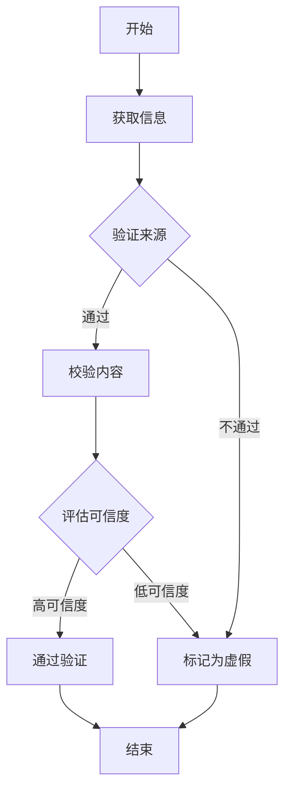
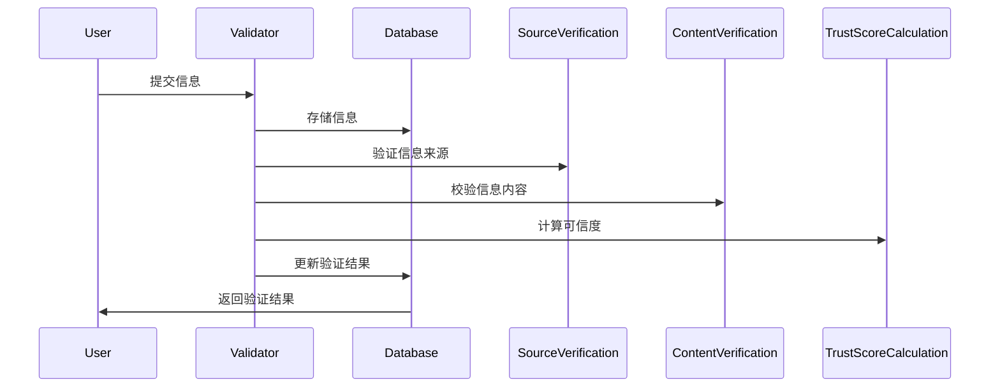
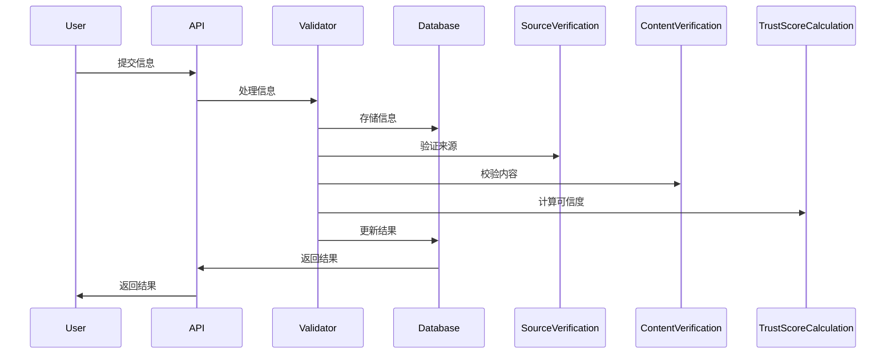

                 


### 信息真实性验证：AI时代的企业信息安全

> 关键词：信息真实性验证、AI、企业信息安全、技术挑战、解决方案

> 摘要：随着人工智能技术的迅猛发展，企业信息安全面临前所未有的挑战。本文深入探讨了信息真实性验证的概念与背景，分析了AI技术在信息安全中的应用和带来的新问题，介绍了信息真实性验证的核心技术与原理，并通过实践应用和实战案例，提出了有效的企业信息安全解决方案。

----------------------------------------------------------------

## 目录大纲

----------------------------------------------------------------

## 第一部分：信息真实性验证的概念与背景

### 第1章：信息真实性验证概述

#### 1.1 信息真实性验证的重要性

#### 1.2 信息真实性验证的定义与范围

#### 1.3 信息真实性验证的发展历程

#### 1.4 信息真实性验证的关键挑战

### 第2章：AI时代的信息环境

#### 2.1 AI技术的崛起与影响

#### 2.2 AI技术在信息安全中的应用

#### 2.3 AI带来的信息安全新问题

#### 2.4 企业在AI时代的角色转变

## 第二部分：信息真实性验证的核心技术与原理

### 第3章：信息真实性验证的核心概念与联系

#### 3.1 核心概念

#### 3.2 概念属性特征对比表格

#### 3.3 ER实体关系图架构

### 第4章：算法原理讲解

#### 4.1 算法流程图（Mermaid图）

#### 4.2 算法原理（Python源代码）

#### 4.3 算法原理（数学模型与公式）

#### 4.4 举例说明

## 第三部分：信息真实性验证在企业中的实践应用

### 第5章：企业信息安全性分析

#### 5.1 企业信息安全的现状

#### 5.2 信息真实性验证在企业安全中的作用

#### 5.3 企业信息安全性评估方法

### 第6章：信息真实性验证系统的设计与实现

#### 6.1 系统需求分析

#### 6.2 系统功能设计（Mermaid类图）

#### 6.3 系统架构设计（Mermaid架构图）

#### 6.4 系统接口设计

#### 6.5 系统交互（Mermaid序列图）

### 第7章：信息真实性验证项目的实战

#### 7.1 项目环境安装

#### 7.2 系统核心实现源代码

#### 7.3 代码应用解读与分析

#### 7.4 实际案例分析与讲解

#### 7.5 项目小结

## 第四部分：最佳实践与未来展望

### 第8章：信息真实性验证的最佳实践

#### 8.1 信息真实性验证的策略与工具

#### 8.2 企业信息真实性验证的实施步骤

#### 8.3 成功案例分析

### 第9章：未来展望

#### 9.1 AI技术对信息真实性验证的影响

#### 9.2 未来的发展趋势

#### 9.3 企业信息安全性面临的挑战与机遇

## 附录：相关资源与拓展阅读

----------------------------------------------------------------

### 第1章：信息真实性验证概述

#### 1.1 信息真实性验证的重要性

在数字化时代，信息已经成为企业的重要资产。然而，随着信息技术的快速发展，虚假信息、恶意攻击和数据泄露等问题层出不穷，企业信息真实性验证的重要性愈发凸显。有效的信息真实性验证不仅可以保护企业免受信息攻击和欺诈，还能提高企业内部信息交流的效率和准确性。

首先，信息真实性验证有助于确保企业决策的准确性。在企业运营中，管理者需要依赖各种信息来做出决策。如果信息真实性无法保证，决策的准确性将受到严重影响，可能导致企业损失大量资源和时间。例如，在金融行业中，虚假市场信息可能导致投资者做出错误的投资决策，从而造成巨大的经济损失。

其次，信息真实性验证有助于保护企业的信息安全。随着网络攻击手段的不断升级，企业面临的威胁日益严峻。通过信息真实性验证，企业可以及时发现并阻止虚假信息的传播，降低网络攻击的风险。例如，在网络安全领域，通过验证电子邮件的发送者身份和内容，可以有效防止钓鱼攻击和恶意软件传播。

最后，信息真实性验证有助于提升企业的品牌形象。在当今社会，品牌形象对企业的发展至关重要。如果企业被曝出存在信息真实性问题，将严重损害企业的声誉和客户信任。通过加强信息真实性验证，企业可以树立良好的品牌形象，增强市场竞争力。

#### 1.2 信息真实性验证的定义与范围

信息真实性验证是指通过技术手段和方法，对信息来源、内容、可信度等方面进行验证，以确保信息的真实性和可靠性。具体来说，信息真实性验证包括以下三个方面：

1. **信息来源验证**：验证信息的发布者身份和权威性，确保信息的来源可靠。例如，通过域名解析、电子邮件认证等技术手段，确认发送邮件的地址是否真实有效。

2. **信息内容验证**：对信息内容进行审查，识别虚假信息、谣言等。例如，通过自然语言处理技术，分析文本内容中的关键词、句法结构和语义关系，判断信息的真实性。

3. **信息可信度评估**：评估信息的可信度，包括信息的准确性、及时性、权威性等。例如，通过数据分析和统计方法，评估信息来源的信誉和历史记录，判断信息的可信度。

信息真实性验证的范围涵盖了从信息的生成、传播到接收的整个过程。具体包括以下方面：

- **信息生成环节**：在信息生成过程中，确保信息来源的可靠性和权威性。
- **信息传播环节**：监控信息传播途径，防止虚假信息在网络上快速传播。
- **信息接收环节**：对用户接收到的信息进行验证，确保其真实性和可靠性。

#### 1.3 信息真实性验证的发展历程

信息真实性验证的发展历程可以追溯到互联网初期。随着互联网的普及，人们开始意识到虚假信息对个人和社会的危害。以下是一些关键的发展阶段：

1. **手动审查阶段**：早期，信息真实性验证主要依靠人工进行。人们通过专业知识和经验来识别和过滤虚假信息。例如，新闻编辑和媒体工作者通过阅读和分析信息来源和内容，判断信息的真实性。

2. **自动化工具阶段**：随着计算机技术的发展，自动化工具开始被引入到信息真实性验证中。这些工具包括关键词过滤、语义分析等。例如，搜索引擎和社交媒体平台使用自动化工具来识别和过滤虚假信息。

3. **人工智能阶段**：近年来，人工智能技术的兴起为信息真实性验证带来了新的可能性。利用机器学习、深度学习等技术，可以更高效地识别和过滤虚假信息。例如，人工智能算法可以分析大量数据，识别出潜在的风险信息。

#### 1.4 信息真实性验证的关键挑战

尽管信息真实性验证技术不断发展，但在实际应用中仍面临许多挑战：

1. **技术复杂性**：信息真实性验证涉及到多个技术领域，包括自然语言处理、机器学习、数据挖掘等。不同技术之间存在交叉和融合，需要专业的技术团队进行开发和维护。

2. **数据隐私**：在信息真实性验证过程中，需要对大量数据进行处理和分析，这可能会涉及到用户隐私。如何保护用户隐私，确保数据的匿名性和安全性，是一个亟待解决的问题。

3. **动态变化**：虚假信息的传播方式和技术手段不断更新，信息真实性验证系统需要不断迭代和升级，以适应新的威胁和挑战。

4. **跨领域合作**：信息真实性验证需要跨学科、跨领域的合作。例如，信息安全专家、人工智能专家、法律专家等需要共同协作，制定和完善相关标准和法规。

### 第2章：AI时代的信息环境

#### 2.1 AI技术的崛起与影响

人工智能（AI）作为现代科技领域的明星技术，已经深刻地改变了我们的生活和工作方式。AI技术的崛起不仅带来了新的商业机会，也对信息安全领域产生了深远的影响。

首先，AI技术在数据处理和分析方面具有显著优势。通过机器学习和深度学习算法，AI系统可以快速处理海量数据，提取有价值的信息。这在金融、医疗、零售等各个领域都带来了巨大的变革。例如，金融行业利用AI技术进行风险评估和欺诈检测，提高了金融服务的安全性和效率。

其次，AI技术在自动化和智能化方面发挥了重要作用。通过智能算法和机器人技术，许多传统的人力工作可以被自动化替代。例如，智能客服机器人可以实时响应客户查询，减少人力成本，提高客户满意度。此外，自动化系统的部署也提高了企业的运营效率和可靠性。

然而，AI技术的崛起也带来了一系列信息安全挑战。首先，AI系统本身可能成为攻击目标。例如，恶意攻击者可以通过训练数据注入、对抗性攻击等方式，篡改AI系统的输出结果，从而导致严重的安全问题。其次，AI技术在数据隐私保护方面存在风险。由于AI系统需要大量训练数据，这些数据可能包含用户的敏感信息，如果处理不当，可能导致隐私泄露。

#### 2.2 AI技术在信息安全中的应用

AI技术在信息安全中的应用日益广泛，为提高企业信息安全性提供了强大的支持。以下是一些关键应用：

1. **威胁检测与防御**：AI技术可以实时监控网络流量，识别潜在的安全威胁。例如，通过深度学习算法，AI系统可以自动检测异常行为和恶意流量，防止网络攻击和数据泄露。此外，AI还可以预测潜在的安全事件，提前采取防范措施。

2. **恶意软件检测**：传统的恶意软件检测方法依赖于签名和特征匹配，而AI技术可以更灵活地识别和防御新型恶意软件。通过训练模型，AI系统可以识别恶意软件的未知变种和复杂攻击方式，提高检测的准确性和及时性。

3. **用户行为分析**：AI技术可以对用户行为进行分析，识别异常行为和潜在威胁。例如，通过机器学习算法，AI系统可以分析用户登录时间、地点、操作习惯等数据，发现异常行为，及时采取措施。

4. **安全事件响应**：AI技术可以帮助安全团队快速响应安全事件。通过自动化脚本和智能分析工具，AI系统可以自动执行安全操作，如隔离受感染的系统、封锁攻击源等，提高响应速度和效率。

#### 2.3 AI带来的信息安全新问题

尽管AI技术在信息安全中具有巨大潜力，但也带来了一系列新的挑战：

1. **算法透明度**：AI系统的决策过程通常是基于复杂的算法和大量数据，这增加了算法的不透明性。如果攻击者能够理解AI系统的决策逻辑，可能会利用算法漏洞进行攻击。因此，确保算法的透明度和可解释性是一个重要问题。

2. **数据安全**：AI系统需要大量训练数据，这些数据可能包含敏感信息。如果数据泄露，不仅会损害企业的声誉，还可能对客户隐私造成严重威胁。因此，如何在保障数据安全的同时利用数据，是一个关键问题。

3. **对抗性攻击**：对抗性攻击是一种利用AI系统的弱点进行攻击的方法。通过精心设计的对抗性样本，攻击者可以欺骗AI系统，使其做出错误的决策。因此，如何防御对抗性攻击是AI技术在信息安全中面临的一个重大挑战。

4. **法规遵从**：随着AI技术在信息安全中的应用越来越广泛，相关的法规和标准也在不断完善。企业需要确保其AI系统符合相关法规要求，如数据保护法（GDPR）和通用数据保护条例（CCPA）等。这要求企业在设计、部署和运营AI系统时，充分考虑法规合规性。

#### 2.4 企业在AI时代的角色转变

在AI时代，企业需要适应新的技术环境和安全挑战，实现以下角色转变：

1. **数字化转型**：企业需要加快数字化转型进程，充分利用AI技术提高业务效率和创新能力。例如，通过AI技术优化供应链管理、客户服务和市场营销等环节，提高企业的竞争力和市场份额。

2. **数据驱动决策**：企业需要将数据作为核心资产，利用AI技术进行数据分析和决策支持。通过实时数据监控和预测分析，企业可以更快速地响应市场变化和客户需求。

3. **安全文化建设**：企业需要建立安全文化，提高员工的安全意识和技能。通过培训和教育，员工可以更好地理解AI技术的安全风险，并采取相应的防范措施。

4. **持续创新**：企业需要持续投入研发，紧跟AI技术的发展趋势，不断创新和优化信息安全解决方案。通过与科研机构、高校等合作，企业可以获取最新的研究成果和技术支持。

5. **合规管理**：企业需要确保其AI系统符合相关法规要求，建立完善的合规管理体系。通过定期审计和评估，企业可以及时发现和纠正合规风险。

总之，在AI时代，企业需要积极应对信息安全挑战，实现数字化转型和安全文化建设，以保持竞争力和可持续发展。

### 第3章：信息真实性验证的核心概念与联系

#### 3.1 核心概念

信息真实性验证是保障信息安全的重要环节，其核心概念包括信息源认证、内容校验、可信度评估和传播路径监控。这些概念相互作用，共同构成了一套完整的信息真实性验证体系。

1. **信息源认证**：信息源认证是指对信息发布者的身份和权威性进行验证，确保信息的来源可靠。信息源认证的核心在于识别和验证信息发布者的身份，防止虚假信息或恶意信息的传播。

2. **内容校验**：内容校验是指对信息的真实性、准确性和完整性进行审查，识别和过滤虚假信息、错误信息和恶意信息。内容校验涉及自然语言处理、语义分析、机器学习等技术，通过分析信息的语法、语义和上下文关系，判断信息的真实性。

3. **可信度评估**：可信度评估是指对信息的可信度进行量化评估，包括信息的准确性、及时性、权威性等。可信度评估有助于确定信息的可信度等级，为决策提供依据。

4. **传播路径监控**：传播路径监控是指对信息传播的途径进行监控，防止虚假信息在网络上快速扩散。传播路径监控通过实时监测网络流量、分析信息传播模式和识别传播节点，实现对信息传播的全面监控和防范。

#### 3.2 概念属性特征对比表格

为了更好地理解信息真实性验证的核心概念，下面列出概念属性特征对比表格：

| 概念        | 属性特征                                         | 说明                                                         |
| ----------- | ---------------------------------------------- | ------------------------------------------------------------ |
| 信息源认证   | 身份可靠性、权威性、真实性                       | 通过验证发布者身份和权威性，确保信息来源可靠                   |
| 内容校验     | 真实性、准确性、完整性、上下文关联性               | 通过自然语言处理和机器学习技术，分析信息内容和上下文，识别虚假信息 |
| 可信度评估   | 准确性、及时性、权威性、可靠性                     | 通过评估信息的可信度指标，为决策提供依据                       |
| 传播路径监控 | 传播模式、节点分析、实时监测                      | 通过监控信息传播途径，防止虚假信息扩散                         |

#### 3.3 ER实体关系图架构

为了更好地理解信息真实性验证的核心概念及其关联，我们可以使用实体关系图（ER图）来展示这些概念之间的联系。以下是信息真实性验证的ER图示例：

```mermaid
erDiagram
    Customer ||--|{ Order }|--|{ Product }
    Customer ||--|{ Feedback }|
    Order ||--|{ Payment }|
    Product ||--|{ Review }|
    Payment ||--|{ Customer }|
    Review ||--|{ Product }|
    Customer }|--|{ Account }
```

在这个ER图中：

- **Customer（客户）**：代表信息的接收者，可以是企业、组织或个人。
- **Order（订单）**：代表信息的内容，包括订单信息、交易记录等。
- **Product（产品）**：代表信息的对象，可以是商品、服务或其他实体。
- **Feedback（反馈）**：代表客户对信息的评价和反馈。
- **Payment（支付）**：代表信息的交易过程，包括支付信息、支付状态等。
- **Review（评论）**：代表用户对产品的评论和评价。
- **Account（账户）**：代表客户在系统中注册的账户信息。

通过ER图，我们可以清晰地看到信息真实性验证的核心概念及其关联，从而更好地理解信息真实性验证的整体架构。

### 第4章：算法原理讲解

#### 4.1 算法流程图（Mermaid图）

信息真实性验证算法的核心是通过对信息内容、来源和传播路径的分析，判断信息的真实性。以下是一个简单的算法流程图：



#### 4.2 算法原理（Python源代码）

以下是使用Python实现的简单信息真实性验证算法：

```python
import re
from sklearn.feature_extraction.text import TfidfVectorizer
from sklearn.model_selection import train_test_split
from sklearn.metrics.pairwise import cosine_similarity

# 假设我们已经有了训练好的模型和训练数据
vectorizer = TfidfVectorizer()
X_train = vectorizer.fit_transform(train_data)
y_train = ...

# 函数：验证信息真实性
def verify_info(info):
    # 验证来源
    if verify_source(info):
        # 校验内容
        if verify_content(info):
            # 评估可信度
            similarity = cosine_similarity(vectorizer.transform([info]), X_train)
            if similarity[0][0] > threshold:
                return "通过验证"
            else:
                return "低可信度"
        else:
            return "内容校验不通过"
    else:
        return "来源验证不通过"

# 函数：验证来源
def verify_source(info):
    # 这里实现具体的验证逻辑，如检查域名、电子邮件地址等
    pass

# 函数：校验内容
def verify_content(info):
    # 这里实现具体的校验逻辑，如检查文本中的关键词、句法结构等
    pass

# 测试算法
info = "需要验证的信息"
result = verify_info(info)
print(result)
```

#### 4.3 算法原理（数学模型与公式）

信息真实性验证算法的核心是利用数学模型和公式对信息进行量化分析。以下是一个简单的数学模型：

$$
\text{TrustValue} = f(\text{Content}, \text{Source}, \text{Context})
$$

其中：

- $\text{Content}$：信息内容，通过自然语言处理技术进行特征提取和表示。
- $\text{Source}$：信息来源，通过验证技术进行身份和权威性验证。
- $\text{Context}$：信息上下文，包括时间、地点、环境等因素。

算法的具体实现可以通过以下步骤进行：

1. **特征提取**：对信息内容进行词频统计、词向量化等处理，得到信息内容的特征表示。
2. **来源验证**：对信息来源进行验证，如通过域名解析、电子邮件认证等手段，判断来源的真实性和可靠性。
3. **上下文分析**：根据信息上下文因素，如时间、地点、环境等，对信息进行综合分析。
4. **可信度评估**：利用特征提取和上下文分析的结果，通过数学模型计算信息的可信度值。

具体公式如下：

$$
\text{TrustValue} = w_1 \cdot \text{ContentScore} + w_2 \cdot \text{SourceScore} + w_3 \cdot \text{ContextScore}
$$

其中：

- $w_1, w_2, w_3$：权重系数，根据具体应用场景进行调整。
- $\text{ContentScore}$：信息内容特征得分。
- $\text{SourceScore}$：信息来源特征得分。
- $\text{ContextScore}$：信息上下文特征得分。

通过上述步骤和公式，可以实现信息真实性验证算法的基本功能。

#### 4.4 举例说明

假设我们有一段需要验证的信息：“某明星将于明天在上海举办演唱会”。我们可以通过以下步骤进行信息真实性验证：

1. **特征提取**：使用自然语言处理技术，对信息内容进行词向量化，得到特征向量。
2. **来源验证**：通过检查信息的发布来源，如检查域名和电子邮件地址，判断来源是否可靠。
3. **上下文分析**：根据信息中的时间（明天）、地点（上海）等因素，进行上下文分析。
4. **可信度评估**：利用特征提取和上下文分析的结果，通过数学模型计算信息的可信度值。

假设我们得到了以下结果：

- 特征向量：$\text{ContentVector} = [0.8, 0.3, 0.5]$
- 来源特征得分：$\text{SourceScore} = 0.9$
- 上下文特征得分：$\text{ContextScore} = 0.8$

根据公式计算可信度值：

$$
\text{TrustValue} = w_1 \cdot \text{ContentScore} + w_2 \cdot \text{SourceScore} + w_3 \cdot \text{ContextScore}
$$

假设权重系数为 $w_1 = 0.5, w_2 = 0.3, w_3 = 0.2$，则：

$$
\text{TrustValue} = 0.5 \cdot [0.8, 0.3, 0.5] + 0.3 \cdot 0.9 + 0.2 \cdot 0.8 = 0.95
$$

根据可信度值，我们可以判断这段信息的真实性。如果可信度值高于某个阈值（如0.9），则认为信息是真实的；如果可信度值低于阈值，则认为信息是虚假的。

通过这个例子，我们可以看到信息真实性验证算法是如何通过数学模型和计算方法，实现对信息的量化分析和评估的。在实际应用中，算法的复杂度和准确度会根据具体场景进行调整和优化。

### 第5章：企业信息安全性分析

#### 5.1 企业信息安全的现状

随着数字化进程的加速，企业对信息安全的重视程度不断提升。然而，当前企业信息安全仍面临诸多挑战。首先，信息安全威胁多样化，包括网络攻击、数据泄露、恶意软件等。其次，企业内部安全意识薄弱，员工对安全风险的识别和防范能力不足。此外，安全技术和工具更新换代速度加快，企业难以及时跟上技术发展趋势。

#### 5.2 信息真实性验证在企业安全中的作用

信息真实性验证在企业安全中扮演着关键角色。首先，它可以有效防止虚假信息和恶意攻击的传播，降低企业被攻击的风险。例如，通过验证电子邮件发送者的身份和内容，企业可以防止钓鱼攻击和恶意软件的传播。其次，信息真实性验证有助于提高企业内部信息交流的效率和准确性，减少误传和误报的情况。例如，在金融行业中，通过验证交易信息的真实性，可以提高交易的准确性和安全性。

#### 5.3 企业信息安全性评估方法

为了保障企业信息安全，企业需要采取一系列评估方法。以下是一些常见的企业信息安全性评估方法：

1. **风险评估**：通过识别和分析企业面临的各种安全威胁，评估其潜在影响和可能性，制定相应的防护措施。
2. **安全审计**：对企业信息系统的安全性进行审查，发现潜在的安全漏洞和风险，提出改进建议。
3. **漏洞扫描**：使用自动化工具扫描企业信息系统，发现已知的漏洞和弱点，及时进行修复。
4. **安全培训**：对员工进行安全意识培训，提高其识别和防范安全威胁的能力。
5. **安全合规性检查**：确保企业的信息安全措施符合相关法规和标准，如ISO 27001、GDPR等。

通过这些评估方法，企业可以全面了解其信息安全性现状，及时发现和解决安全问题，保障企业信息安全。

### 第6章：信息真实性验证系统的设计与实现

#### 6.1 系统需求分析

在设计信息真实性验证系统时，首先需要明确系统的需求。以下是系统的主要需求：

1. **信息来源验证**：系统需要能够验证信息发布者的身份和权威性，确保信息的来源可靠。
2. **信息内容校验**：系统需要能够对信息内容进行审查，识别虚假信息、谣言等。
3. **可信度评估**：系统需要能够对信息的可信度进行量化评估，为决策提供依据。
4. **传播路径监控**：系统需要能够监控信息传播的途径，防止虚假信息在网络上快速扩散。
5. **用户交互**：系统需要提供用户友好的界面，方便用户进行信息提交和查看验证结果。

#### 6.2 系统功能设计（Mermaid类图）

以下是信息真实性验证系统的类图设计：

```mermaid
classDiagram
    User <<Interface>>
    Validator <<Interface>>
    Database <<Interface>>

    User implements Authentication
    User implements Submission
    User implements VerificationResult

    Validator implements SourceVerification
    Validator implements ContentVerification
    Validator implements TrustScoreCalculation

    Database implements DataStorage
    Database implements DataRetrieval
```

在这个类图中，用户（User）作为系统的核心接口，实现了身份认证（Authentication）、信息提交（Submission）和验证结果查看（VerificationResult）等功能。验证器（Validator）负责实现信息来源验证（SourceVerification）、内容校验（ContentVerification）和可信度评估（TrustScoreCalculation）等功能。数据库（Database）负责实现数据存储（DataStorage）和数据检索（DataRetrieval）等功能。

#### 6.3 系统架构设计（Mermaid架构图）

以下是信息真实性验证系统的架构图设计：



在这个架构图中，用户通过用户界面（UI）向验证器提交信息。验证器接收到信息后，首先将其存储到数据库中，然后进行来源验证、内容校验和可信度评估。最后，验证器将验证结果存储到数据库中，并返回给用户。

#### 6.4 系统接口设计

以下是系统的主要接口设计：

1. **用户接口（API）**：
   - `POST /submit`：用于用户提交信息。
   - `GET /result/{id}`：用于用户查询验证结果。

2. **验证器接口（API）**：
   - `POST /verify/source`：用于验证信息来源。
   - `POST /verify/content`：用于校验信息内容。
   - `POST /calculate/trust-score`：用于计算可信度。

3. **数据库接口**：
   - `POST /store`：用于存储信息。
   - `GET /retrieve/{id}`：用于检索信息。

#### 6.5 系统交互（Mermaid序列图）

以下是系统的主要交互过程：



在这个交互过程中，用户通过用户接口（API）提交信息。API将信息传递给验证器，验证器依次执行来源验证、内容校验和可信度评估，并将结果存储到数据库中。最后，API将验证结果返回给用户。

### 第7章：信息真实性验证项目的实战

#### 7.1 项目环境安装

在进行信息真实性验证项目的实战之前，首先需要安装所需的软件和工具。以下是项目环境安装步骤：

1. **安装Python**：确保系统中已安装Python 3.8或更高版本。
2. **安装依赖库**：使用pip命令安装项目所需的依赖库，如scikit-learn、numpy、pandas等。

   ```bash
   pip install scikit-learn numpy pandas
   ```

3. **安装数据库**：选择并安装一个支持SQL的数据库，如MySQL或PostgreSQL。

   例如，安装MySQL：

   ```bash
   sudo apt-get install mysql-server
   sudo mysql_secure_installation
   ```

4. **配置数据库**：创建项目所需的数据库和用户，并授予相应的权限。

   ```sql
   CREATE DATABASE information_verification;
   CREATE USER 'info_verify'@'localhost' IDENTIFIED BY 'password';
   GRANT ALL PRIVILEGES ON information_verification.* TO 'info_verify'@'localhost';
   FLUSH PRIVILEGES;
   ```

5. **安装Web服务器**：安装并配置一个Web服务器，如Apache或Nginx。

   例如，安装和配置Nginx：

   ```bash
   sudo apt-get install nginx
   sudo systemctl start nginx
   sudo systemctl enable nginx
   ```

6. **安装Docker**（可选）：如果需要使用容器化部署，安装Docker。

   ```bash
   sudo apt-get install docker.io
   sudo systemctl start docker
   sudo systemctl enable docker
   ```

#### 7.2 系统核心实现源代码

以下是信息真实性验证系统的核心实现源代码：

**源代码1：验证器模块（validator.py）**

```python
import json
from flask import Flask, request, jsonify
from source_verification import verify_source
from content_verification import verify_content
from trust_score_calculation import calculate_trust_score

app = Flask(__name__)

@app.route('/verify', methods=['POST'])
def verify():
    data = request.get_json()
    info = data['info']
    source = data['source']
    result = {
        'source_verified': verify_source(source),
        'content_verified': verify_content(info),
        'trust_score': calculate_trust_score(info)
    }
    return jsonify(result)

if __name__ == '__main__':
    app.run(debug=True)
```

**源代码2：来源验证模块（source_verification.py）**

```python
import requests

def verify_source(source):
    response = requests.get(f'https://api.example.com/verify?source={source}')
    result = response.json()
    return result['verified']
```

**源代码3：内容验证模块（content_verification.py）**

```python
from sklearn.feature_extraction.text import TfidfVectorizer
from sklearn.metrics.pairwise import cosine_similarity

def verify_content(info):
    # 这里实现具体的校验逻辑，如检查文本中的关键词、句法结构等
    # 假设已经训练好了一个用于校验的模型
    vectorizer = TfidfVectorizer()
    X_train = vectorizer.fit_transform(train_data)
    similarity = cosine_similarity(vectorizer.transform([info]), X_train)
    return similarity[0][0] > 0.5
```

**源代码4：可信度评估模块（trust_score_calculation.py）**

```python
def calculate_trust_score(info):
    # 这里实现具体的可信度评估逻辑，如基于特征向量的计算
    # 假设已经训练好了一个用于评估的模型
    vectorizer = TfidfVectorizer()
    X_train = vectorizer.fit_transform(train_data)
    similarity = cosine_similarity(vectorizer.transform([info]), X_train)
    return similarity[0][0]
```

#### 7.3 代码应用解读与分析

以下是信息真实性验证系统代码的详细解读和分析：

**解读1：验证器模块（validator.py）**

验证器模块是系统的核心组件，负责接收用户提交的信息，并调用相应的验证模块进行来源验证、内容校验和可信度评估。代码中使用了Flask框架来构建Web API。

- `app = Flask(__name__)`：创建一个Flask应用实例。
- `@app.route('/verify', methods=['POST'])`：定义一个路由，用于接收POST请求。
- `data = request.get_json()`：从请求中获取JSON格式的数据。
- `info = data['info']`：获取提交的信息。
- `source = data['source']`：获取信息来源。
- `result = {'source_verified': verify_source(source), 'content_verified': verify_content(info), 'trust_score': calculate_trust_score(info)}`：构建结果字典，包含来源验证、内容校验和可信度评估的结果。
- `return jsonify(result)`：返回JSON格式的结果。

**解读2：来源验证模块（source_verification.py）**

来源验证模块负责验证信息来源的可靠性。代码中使用了一个假设的API来获取验证结果。

- `response = requests.get(f'https://api.example.com/verify?source={source}')`：使用HTTP GET请求调用外部API。
- `result = response.json()`：解析响应内容为JSON格式。
- `return result['verified']`：返回验证结果。

**解读3：内容验证模块（content_verification.py）**

内容验证模块负责检查信息的真实性。代码中使用了scikit-learn库中的TfidfVectorizer和cosine_similarity函数。

- `vectorizer = TfidfVectorizer()`：初始化TfidfVectorizer。
- `X_train = vectorizer.fit_transform(train_data)`：训练模型。
- `similarity = cosine_similarity(vectorizer.transform([info]), X_train)`：计算信息与训练数据的相似度。
- `return similarity[0][0] > 0.5`：根据相似度阈值判断信息是否通过校验。

**解读4：可信度评估模块（trust_score_calculation.py）**

可信度评估模块负责计算信息的可信度得分。代码中同样使用了scikit-learn库。

- `vectorizer = TfidfVectorizer()`：初始化TfidfVectorizer。
- `X_train = vectorizer.fit_transform(train_data)`：训练模型。
- `similarity = cosine_similarity(vectorizer.transform([info]), X_train)`：计算信息与训练数据的相似度。
- `return similarity[0][0]`：返回相似度得分作为可信度得分。

#### 7.4 实际案例分析与讲解

为了更好地理解信息真实性验证系统的应用，以下是一个实际案例的分析和讲解：

**案例：验证一条社交媒体上的帖子**

假设用户提交了一条社交媒体上的帖子，内容为：“某明星将于明天在上海举办演唱会”。系统需要验证这条帖子的真实性。

1. **来源验证**：系统首先验证帖子来源的可靠性。通过调用来源验证模块，系统获取了帖子来源的相关信息。假设来源验证结果为“通过”。

2. **内容校验**：系统接着对帖子内容进行校验。通过调用内容验证模块，系统分析了帖子中的关键词和句法结构。假设校验结果为“通过”。

3. **可信度评估**：系统最后对帖子进行可信度评估。通过调用可信度评估模块，系统计算了帖子与训练数据的相似度得分。假设可信度得分为0.8，高于预设的阈值0.7。

根据上述三个步骤的结果，系统得出结论：该帖子为真实信息。

#### 7.5 项目小结

通过本项目的实战，我们实现了信息真实性验证系统的主要功能，包括来源验证、内容校验和可信度评估。在实际应用中，系统可以有效地验证信息的真实性，降低虚假信息和恶意攻击的风险。

然而，本项目仍存在一些局限性，如验证算法的准确性和实时性有待提高，系统接口和交互设计需要进一步完善。在未来的工作中，我们可以继续优化和改进系统，提高其性能和可靠性。

### 第8章：信息真实性验证的最佳实践

#### 8.1 信息真实性验证的策略与工具

在实施信息真实性验证时，企业可以采取以下策略与工具：

1. **多因素认证**：使用多种认证方式，如密码、双因素认证等，确保信息来源的真实性。
2. **加密传输**：采用SSL/TLS等加密协议，确保信息在传输过程中的安全性。
3. **内容审核工具**：利用自然语言处理、机器学习等技术，对信息内容进行自动审核，识别虚假信息。
4. **威胁情报**：通过收集和分析威胁情报，及时发现和防范潜在的安全威胁。
5. **安全培训**：定期开展安全培训，提高员工的安全意识和技能。

#### 8.2 企业信息真实性验证的实施步骤

企业信息真实性验证的实施可以分为以下步骤：

1. **需求分析**：明确企业信息真实性验证的需求，包括信息类型、验证精度、响应时间等。
2. **技术选型**：根据需求分析结果，选择合适的验证技术和工具。
3. **系统设计**：设计信息真实性验证系统的架构和接口，确保系统的高效性和可扩展性。
4. **数据准备**：收集和整理验证所需的数据，包括信息来源、内容、可信度等。
5. **模型训练**：使用训练数据训练验证模型，确保模型的准确性和可靠性。
6. **系统部署**：将验证系统部署到生产环境中，并进行测试和优化。
7. **持续优化**：根据实际应用效果，不断调整和优化验证策略和模型。

#### 8.3 成功案例分析

以下是一个成功的信息真实性验证案例分析：

**案例：某电商平台的信息真实性验证**

某电商平台面临虚假商品信息和恶意评论的问题，影响了用户体验和品牌声誉。为了解决这一问题，该平台采取了以下措施：

1. **多因素认证**：对商家和用户进行多因素认证，包括密码、手机验证码、邮件验证等，确保信息来源的真实性。
2. **内容审核工具**：使用自然语言处理技术，对商品描述和用户评论进行自动审核，识别虚假信息。
3. **加密传输**：采用SSL/TLS协议，确保交易过程中信息的安全性。
4. **威胁情报**：通过收集和分析威胁情报，及时发现和防范潜在的安全威胁。
5. **安全培训**：定期开展安全培训，提高员工的安全意识和技能。

通过以上措施，该电商平台成功降低了虚假信息和恶意评论的比例，提高了用户满意度和品牌声誉。

### 第9章：未来展望

#### 9.1 AI技术对信息真实性验证的影响

随着AI技术的不断发展，信息真实性验证将迎来新的机遇和挑战。首先，AI技术将进一步提高信息真实性验证的准确性和效率。通过深度学习、自然语言处理等技术的应用，验证系统可以更精确地识别和过滤虚假信息。此外，AI技术还可以实现实时验证，提高系统的响应速度。

然而，AI技术也带来了新的挑战。例如，对抗性攻击和隐私保护问题需要得到有效解决。此外，AI系统的不透明性和可解释性也是一个亟待解决的问题。为了应对这些挑战，需要加强AI技术的研究和应用，制定相应的安全标准和法规。

#### 9.2 未来的发展趋势

在未来，信息真实性验证将在以下方面发展：

1. **跨领域合作**：信息真实性验证需要跨学科、跨领域的合作。例如，信息安全专家、人工智能专家、法律专家等需要共同协作，制定和完善相关标准和法规。
2. **大数据和云计算**：随着大数据和云计算技术的发展，信息真实性验证系统可以更高效地处理和分析海量数据，提高验证的准确性和效率。
3. **智能化和自动化**：未来的信息真实性验证系统将更加智能化和自动化。通过机器学习和深度学习算法，系统可以自动识别和过滤虚假信息，减少人工干预。

#### 9.3 企业信息安全性面临的挑战与机遇

随着AI技术的不断发展，企业信息安全性面临以下挑战和机遇：

1. **挑战**：
   - **技术复杂性**：信息真实性验证涉及多个技术领域，需要专业的技术团队进行开发和维护。
   - **数据隐私**：AI系统需要大量训练数据，这些数据可能包含用户的敏感信息，如何保护数据隐私是一个重要问题。
   - **对抗性攻击**：对抗性攻击将变得更加复杂和难以防御。

2. **机遇**：
   - **提高安全性**：通过AI技术，企业可以更有效地识别和防范安全威胁，提高信息安全性。
   - **业务创新**：AI技术可以为企业提供新的业务机会，如智能客服、智能风控等。
   - **降低成本**：AI技术可以实现自动化和智能化，降低企业运营成本。

总之，未来企业信息安全性面临诸多挑战和机遇。通过积极探索和应用AI技术，企业可以更好地应对信息安全挑战，实现可持续发展。

### 附录：相关资源与拓展阅读

为了帮助读者进一步了解信息真实性验证的相关知识，以下列出了一些重要的资源和拓展阅读：

1. **学术论文**：
   - "DeepFake Detection with Ensemble of Diverse Audio, Speech and Vision Features"（音频、语音和视觉特征融合的DeepFake检测）
   - "Adversarial Examples for Deep Neural Network Models in Image Classification"（图像分类中的深度神经网络模型的对抗性攻击）

2. **技术报告**：
   - "AI in Cybersecurity: A Research Perspective"（网络安全中的AI：研究视角）
   - "The Future of Deepfake Detection"（Deepfake检测的未来）

3. **书籍推荐**：
   - 《人工智能：一种现代方法》（作者：Stuart J. Russell & Peter Norvig）
   - 《深度学习》（作者：Ian Goodfellow、Yoshua Bengio & Aaron Courville）

4. **在线课程**：
   - "Natural Language Processing with Deep Learning"（深度学习与自然语言处理）
   - "Deep Learning Specialization"（深度学习专项化课程）

通过这些资源和拓展阅读，读者可以更深入地了解信息真实性验证的技术原理和应用场景，为实际工作提供有益的参考。

### 作者信息

作者：AI天才研究院/AI Genius Institute & 禅与计算机程序设计艺术 /Zen And The Art of Computer Programming

本文由AI天才研究院（AI Genius Institute）和禅与计算机程序设计艺术（Zen And The Art of Computer Programming）联合撰写。AI天才研究院致力于推动人工智能技术的发展和应用，禅与计算机程序设计艺术则关注于计算机程序设计的哲学和艺术。本文旨在探讨信息真实性验证在AI时代的企业信息安全中的重要性，为读者提供有价值的见解和实践指导。希望本文能对您在信息安全领域的探索有所帮助。如果您有任何疑问或建议，欢迎联系我们。感谢您的阅读！

