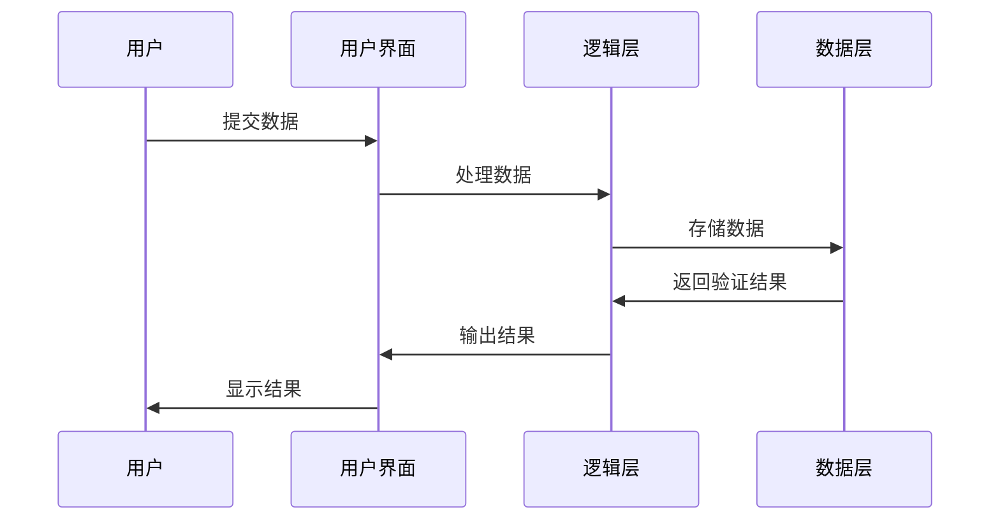
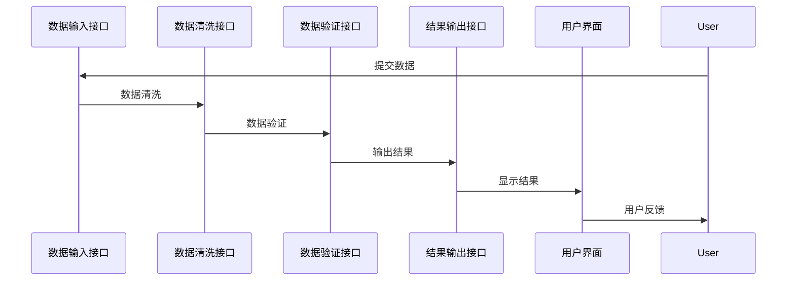
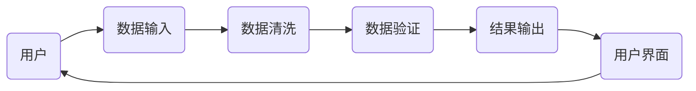

                 

### 标题：信息验证技术在新闻媒体中的应用

#### 关键词：
1. 信息验证技术
2. 新闻媒体
3. 事实核查
4. 机器学习
5. 数据质量
6. 系统架构设计
7. 实际案例分析

#### 摘要：
本文将深入探讨信息验证技术在新闻媒体中的应用，从背景介绍、核心概念、技术原理、实际应用、案例分析到最佳实践，全面解析如何利用信息验证技术提升新闻媒体的准确性和可信度。文章旨在为新闻媒体从业者和技术开发者提供有价值的参考和指导。

---

### 目录

1. 引言
2. 信息验证技术在新闻媒体中的应用背景
3. 信息验证技术核心概念
   - 数据验证与事实核查
   - 数据质量评估与纠错
   - 机器学习在信息验证中的应用
4. 信息验证技术原理讲解
   - 信息验证算法介绍
   - 机器学习算法在信息验证中的应用
   - 算法原理的数学模型与公式
5. 新闻媒体信息验证系统分析与架构设计
   - 需求分析
   - 功能设计
   - 系统架构设计
   - 接口设计与系统交互
6. 项目实战
   - 环境安装与配置
   - 系统核心实现与代码解析
   - 实际案例分析
   - 项目小结
7. 最佳实践与注意事项
   - 最佳实践
   - 注意事项与风险防范
   - 未来发展展望
8. 总结与拓展阅读

---

### 引言

在信息时代，新闻媒体的传播速度和范围达到了前所未有的高度。然而，这也带来了新的挑战：如何在庞大的信息海洋中确保新闻内容的真实性、准确性和可信度。信息验证技术在这一背景下应运而生，成为新闻媒体必须掌握的重要工具。

新闻媒体面临的信息验证挑战主要包括以下几个方面：

1. **虚假新闻的泛滥**：随着社交媒体的普及，虚假新闻的传播速度远超传统媒体，给公众带来了极大的困扰。
2. **信息过载**：互联网上的信息量巨大，如何筛选出真实、有价值的信息成为新闻媒体的一大难题。
3. **数据质量**：新闻报道中涉及的数据质量直接影响其可信度，错误的数据可能引发误导和误解。
4. **技术手段**：传统的信息验证手段已无法满足现代新闻媒体的需求，需要借助先进的技术手段进行高效的信息验证。

信息验证技术的意义在于：

1. **提升新闻可信度**：通过严格的信息验证，确保新闻内容的真实性和准确性，提升公众对新闻媒体的信任。
2. **增强媒体竞争力**：在信息泛滥的时代，拥有强大信息验证能力的新媒体能够脱颖而出，赢得更多受众。
3. **保障社会稳定**：虚假新闻的传播可能引发社会动荡，信息验证技术有助于及时发现和纠正虚假信息，维护社会稳定。

本文将详细探讨信息验证技术在新闻媒体中的应用，从核心概念、技术原理到实际应用和案例分析，旨在为新闻媒体从业者和技术开发者提供一套完整的信息验证解决方案。

### 信息验证技术在新闻媒体中的应用背景

信息验证技术在新闻媒体中的应用背景主要源于当前信息环境的复杂性和信息传播速度的迅猛增长。首先，虚假新闻的泛滥成为新闻媒体面临的重大挑战。随着社交媒体和互联网的发展，虚假新闻、谣言和误导性信息得以迅速传播，给公众带来极大的困扰。例如，2016年的美国总统大选期间，社交媒体上充斥着大量的虚假新闻，这些新闻不仅误导了公众，还对大选结果产生了潜在影响。

其次，信息过载问题也日益凸显。互联网上的信息量巨大，新闻媒体需要从海量信息中筛选出真实、有价值的内容进行报道。然而，人工筛选和信息过滤的效率有限，难以应对日益增长的信息量。传统的方法如新闻编辑手动审核、读者反馈等已无法满足现代新闻媒体的需求，需要借助先进的信息验证技术进行高效的信息处理。

此外，数据质量在新闻报道中的重要性不可忽视。新闻报道中涉及的数据，如统计数据、调查数据等，其准确性直接影响新闻的可信度。一旦数据存在错误，可能会导致公众对新闻媒体的信任度下降。例如，2019年英国《每日邮报》因错误引用数据而遭到广泛批评，这揭示了数据质量对新闻可信度的影响。

技术手段的进步为新闻媒体提供了新的解决方案。传统的信息验证主要依赖于人工审核，效率较低且容易出现疏漏。而信息验证技术，特别是机器学习技术在信息验证中的应用，为新闻媒体提供了一种自动化、高效的信息验证手段。通过机器学习算法，可以自动识别和过滤虚假新闻、筛选高质量信息，提高新闻的准确性和可信度。

综上所述，信息验证技术在新闻媒体中的应用背景主要包括虚假新闻泛滥、信息过载、数据质量问题和技术手段的进步。这些因素共同促使新闻媒体寻求更高效、更准确的信息验证方法，以提升新闻的可信度和竞争力。

#### 核心概念

在深入探讨信息验证技术在新闻媒体中的应用之前，我们需要明确一些核心概念，这些概念包括数据验证、事实核查、数据质量评估、纠错以及机器学习等。

**1. 数据验证**

数据验证是指对数据的准确性、完整性和可靠性进行检查和确认的过程。其目的是确保数据在后续分析和使用过程中不会出现错误或误导。数据验证通常包括以下步骤：

- **数据清洗**：去除重复数据、缺失值填充、异常值处理等，提高数据质量。
- **数据一致性检查**：确保数据在不同来源和格式之间的匹配，避免数据不一致导致的问题。
- **数据完整性检查**：检查数据是否完整，是否存在缺失值或数据丢失的情况。
- **数据准确性检查**：通过对比已知数据源或标准数据，验证数据是否准确无误。

数据验证对于新闻媒体至关重要，因为错误的数据可能会导致误导性的报道，影响公众对新闻的可信度。

**2. 事实核查**

事实核查是一种专门用于验证新闻报道中事实准确性的方法。它通过对新闻报道中涉及的事实进行独立、客观的核实，以确保其真实性和可信度。事实核查通常包括以下步骤：

- **信息收集**：收集与新闻报道相关的事实和证据。
- **来源验证**：验证信息的来源是否可靠，确保信息来源的可信度。
- **交叉核对**：将信息与多个来源进行比对，确保事实的准确性。
- **报告发布**：将核查结果公开，为公众提供真实、准确的信息。

事实核查在新闻媒体中的作用主要体现在以下几个方面：

- **提升新闻质量**：通过事实核查，确保新闻报道的真实性和准确性，提升新闻的可信度。
- **防止虚假新闻**：通过事实核查，及时发现和纠正虚假新闻，防止其传播和误导公众。
- **维护媒体信誉**：通过严格的事实核查，维护新闻媒体的社会公信力和信誉。

**3. 数据质量评估**

数据质量评估是指对数据的质量进行综合评价和判断的过程。数据质量评估包括多个方面，如数据的准确性、完整性、一致性、可靠性等。数据质量评估的步骤通常包括：

- **数据质量指标定义**：明确数据质量的具体评价指标，如准确性、完整性、一致性等。
- **数据质量指标计算**：根据定义的指标，计算数据质量得分或评分。
- **数据质量报告**：将数据质量评估结果进行报告，为后续数据分析和使用提供参考。

数据质量评估对于新闻媒体的重要性体现在以下几个方面：

- **决策支持**：通过数据质量评估，帮助新闻媒体管理层了解数据质量状况，做出更明智的决策。
- **优化数据分析**：了解数据质量状况，有助于优化数据分析方法和流程，提高数据分析的准确性和效率。
- **确保数据可信度**：高质量的数据是可信新闻的基础，数据质量评估有助于确保新闻报道的真实性和准确性。

**4. 纠错**

纠错是指发现并修正数据中的错误的过程。在新闻媒体中，纠错是确保新闻内容准确性的重要环节。纠错的步骤通常包括：

- **错误识别**：通过检查和比对数据源，发现数据中的错误。
- **错误修正**：对发现的数据错误进行修正，确保数据的准确性。
- **结果验证**：对修正后的数据进行验证，确保错误修正的准确性。

纠错对于新闻媒体的重要性体现在以下几个方面：

- **避免误导**：及时纠正数据错误，避免误导公众，维护新闻媒体的信誉。
- **提升新闻质量**：确保新闻内容中的数据准确无误，提升新闻的准确性和可信度。
- **优化数据处理**：通过纠错过程，发现和处理数据中的潜在问题，提高数据处理的效率和质量。

**5. 机器学习**

机器学习是近年来在信息验证领域取得显著进展的重要技术。机器学习通过构建算法模型，可以从大量数据中自动学习和发现模式，用于自动识别和验证信息。机器学习在信息验证中的应用主要包括以下几个方面：

- **虚假新闻检测**：利用机器学习算法，自动识别和过滤虚假新闻，提升新闻的可信度。
- **数据异常检测**：通过机器学习算法，发现数据中的异常值和错误，提高数据质量。
- **事实核查自动化**：利用机器学习模型，实现事实核查的自动化，提高事实核查的效率。

机器学习在信息验证中的应用，不仅提高了信息验证的效率，还提升了信息验证的准确性和全面性，为新闻媒体提供了一种强大的工具。

通过上述核心概念的阐述，我们可以更好地理解信息验证技术在新闻媒体中的应用。接下来，我们将进一步探讨这些概念的具体实现和应用。

### 信息验证技术概述

信息验证技术是确保信息准确性、完整性和可靠性的重要手段，在新闻媒体中具有至关重要的作用。本章节将概述信息验证技术的定义、分类以及其在新闻媒体中的应用和面临的挑战。

#### 定义

信息验证技术是指通过各种方法和技术手段，对信息进行验证和确认的过程，以确保信息的真实性、准确性和可信度。信息验证技术的目标在于减少错误信息、虚假信息和误导性信息的传播，提高信息质量和可信度。

#### 分类

根据技术手段和验证目标的不同，信息验证技术可以分为以下几个类别：

1. **手动验证**：通过人工审核和核实信息，确保信息的准确性和可信度。这种方法通常适用于小规模的信息验证，如新闻编辑过程中的事实核查。

2. **自动化验证**：利用计算机技术和算法，自动识别和验证信息。自动化验证包括以下几种类型：

   - **规则引擎**：基于预设的规则，自动检测和纠正信息中的错误。例如，通过正则表达式检测电子邮件地址的格式是否正确。
   - **机器学习**：利用机器学习算法，从大量数据中自动学习和发现信息验证规则。例如，通过训练分类模型，自动识别虚假新闻和真实新闻。
   - **自然语言处理（NLP）**：利用NLP技术，对文本信息进行语义分析和情感分析，以识别错误信息和虚假信息。

3. **交叉验证**：通过多个来源的信息进行比对和验证，以提高信息验证的准确性。例如，通过多个新闻源比对报道中的事实，以确保报道的准确性。

#### 在新闻媒体中的应用

信息验证技术在新闻媒体中的应用主要包括以下几个方面：

1. **事实核查**：新闻媒体利用信息验证技术，对新闻报道中的事实进行独立、客观的核实，确保其真实性和准确性。事实核查是信息验证技术的重要组成部分，有助于防止虚假新闻的传播。

2. **数据验证**：新闻媒体利用信息验证技术，对新闻报道中涉及的数据进行验证和清洗，确保数据的准确性和完整性。数据验证有助于避免由于数据错误导致的误导性报道。

3. **自动纠错**：通过自动化工具和算法，新闻媒体可以自动识别和纠正信息中的错误。例如，利用自然语言处理技术，自动识别和纠正文本中的拼写错误和语法错误。

4. **虚假新闻检测**：利用机器学习技术和NLP技术，新闻媒体可以自动识别和过滤虚假新闻，提高新闻的质量和可信度。

#### 面临的挑战

尽管信息验证技术在新闻媒体中具有广泛的应用，但在实际应用中仍面临以下挑战：

1. **数据量巨大**：新闻媒体需要处理海量信息，数据量巨大使得手动验证和部分自动化验证方法效率较低。

2. **数据质量参差不齐**：不同来源的数据质量参差不齐，一些数据可能存在错误、缺失或重复，给信息验证带来挑战。

3. **虚假新闻的复杂化**：随着技术手段的不断进步，虚假新闻的制造和传播方式也变得更加复杂，利用人工智能和自动化工具进行虚假新闻传播的现象日益严重。

4. **技术实现难度**：自动化验证方法，如机器学习和NLP，需要大量的训练数据和复杂的算法模型，实现难度较大，且需要持续优化和更新。

5. **资源和成本**：信息验证技术的实施和维护需要大量的人力、物力和财力投入，对新闻媒体来说，尤其是在竞争激烈的市场环境中，可能面临资源和成本的压力。

总之，信息验证技术在新闻媒体中的应用具有重要意义，但也面临一系列挑战。新闻媒体需要不断探索和优化信息验证技术，以提升新闻的质量和可信度。

### 核心概念与联系

在深入探讨信息验证技术之前，有必要对其中几个核心概念进行详细阐述，并分析它们之间的联系。这些核心概念包括数据验证、事实核查、数据质量评估、纠错以及机器学习。

#### 数据验证

数据验证是信息验证技术的基石，其核心目标是通过一系列方法和步骤，确保数据的准确性、完整性和可靠性。具体而言，数据验证包括以下几个关键环节：

1. **数据清洗**：数据清洗是数据验证的第一步，旨在去除重复数据、处理缺失值和纠正异常值。通过数据清洗，可以提升数据的质量，为后续分析奠定基础。

2. **数据一致性检查**：数据一致性检查旨在确保数据在不同来源和格式之间的一致性，避免因数据不一致导致的错误。例如，对比不同数据库中的相同数据，确保其值和格式相同。

3. **数据完整性检查**：数据完整性检查关注数据的完整性，确保数据没有丢失或缺失。例如，检查数据表中是否存在空值或缺失记录。

4. **数据准确性检查**：数据准确性检查通过对比已知数据源或标准数据，验证数据是否准确无误。例如，对比统计数据和官方发布的数据，确保其一致性。

数据验证在新闻媒体中的重要性体现在多个方面。首先，数据验证有助于确保新闻报道中的数据准确性和可信度，避免因数据错误导致的误导性报道。其次，数据验证能够提高数据分析和决策的准确性，帮助新闻媒体更好地理解受众需求和市场动态。

#### 事实核查

事实核查是新闻媒体中一项至关重要的活动，其目标是通过独立、客观的核实，确保新闻报道中的事实准确无误。事实核查通常包括以下几个步骤：

1. **信息收集**：事实核查的第一步是收集与新闻报道相关的事实和证据。这通常涉及从多个可靠来源获取信息，并进行交叉核对。

2. **来源验证**：来源验证是确保信息来源可靠性的过程。新闻媒体需要验证信息来源的权威性和可信度，以避免依赖不可靠的信息源。

3. **交叉核对**：交叉核对是将信息与多个来源进行比对，以确认事实的准确性。通过交叉核对，可以减少单一来源可能存在的偏差和错误。

4. **报告发布**：将事实核查的结果进行公开，为公众提供真实、准确的信息。报告发布不仅有助于提升新闻的透明度和可信度，还可以帮助公众识别和避免虚假信息。

事实核查在新闻媒体中的重要性主要体现在以下几个方面：

- **提升新闻质量**：通过严格的事实核查，确保新闻报道的真实性和准确性，提升新闻的可信度和公信力。
- **防止虚假新闻**：事实核查有助于及时发现和纠正虚假新闻，防止其传播和误导公众。
- **维护媒体信誉**：通过事实核查，新闻媒体能够树立起严谨、专业的形象，赢得公众的信任和尊重。

#### 数据质量评估

数据质量评估是对数据质量进行综合评价和判断的过程，其核心目标是了解数据的质量状况，并为后续的数据分析和决策提供参考。数据质量评估通常包括以下几个关键指标：

1. **准确性**：准确性是指数据与实际值之间的匹配程度。高准确性的数据能够更真实地反映实际情况，为分析和决策提供可靠的基础。

2. **完整性**：完整性是指数据是否完整，是否存在缺失或缺失记录。完整的数据有助于全面了解问题，避免因数据缺失导致的误导性分析。

3. **一致性**：一致性是指数据在不同来源和格式之间的一致性。一致性高的数据可以减少因数据不一致导致的错误和误解。

4. **可靠性**：可靠性是指数据的可信度和稳定性。可靠的数据来源和稳定的数据处理流程是确保数据质量的重要保障。

数据质量评估在新闻媒体中的应用主要体现在以下几个方面：

- **决策支持**：通过数据质量评估，新闻媒体可以了解数据的质量状况，为管理层提供准确的决策依据。
- **优化数据分析**：了解数据质量状况，有助于优化数据分析方法和流程，提高数据分析的准确性和效率。
- **确保数据可信度**：高质量的数据是可信新闻的基础，数据质量评估有助于确保新闻报道的真实性和准确性。

#### 纠错

纠错是发现并修正数据中的错误的过程，其目的是确保数据的准确性和可靠性。纠错的步骤通常包括：

1. **错误识别**：通过检查和比对数据源，发现数据中的错误。错误识别可以通过自动化工具或人工审核进行。

2. **错误修正**：对发现的数据错误进行修正，确保数据的准确性。错误修正通常需要根据错误的性质和影响进行具体操作。

3. **结果验证**：对修正后的数据进行验证，确保错误修正的准确性。结果验证可以通过对比修正前后的数据，或使用已知的数据源进行比对。

纠错在新闻媒体中的应用主要体现在以下几个方面：

- **避免误导**：及时纠正数据错误，避免误导公众，维护新闻媒体的信誉。
- **提升新闻质量**：确保新闻内容中的数据准确无误，提升新闻的准确性和可信度。
- **优化数据处理**：通过纠错过程，发现和处理数据中的潜在问题，提高数据处理的效率和质量。

#### 机器学习

机器学习是近年来在信息验证领域取得显著进展的重要技术。通过构建算法模型，机器学习可以从大量数据中自动学习和发现模式，用于自动识别和验证信息。机器学习在信息验证中的应用主要包括以下几个方面：

1. **虚假新闻检测**：利用机器学习算法，自动识别和过滤虚假新闻，提升新闻的质量和可信度。

2. **数据异常检测**：通过机器学习算法，发现数据中的异常值和错误，提高数据质量。

3. **事实核查自动化**：利用机器学习模型，实现事实核查的自动化，提高事实核查的效率。

机器学习在信息验证中的应用，不仅提高了信息验证的效率，还提升了信息验证的准确性和全面性，为新闻媒体提供了一种强大的工具。

#### 概念之间的联系

数据验证、事实核查、数据质量评估、纠错和机器学习这几个核心概念之间存在密切的联系：

1. **数据验证** 和 **事实核查** 都是信息验证的重要手段，前者侧重于确保数据的准确性、完整性和可靠性，后者则侧重于核实新闻报道中的事实。

2. **数据质量评估** 是对数据验证结果的进一步分析和评价，通过评估数据质量，可以为数据验证和事实核查提供指导。

3. **纠错** 是数据验证和事实核查的补充，通过发现并修正数据中的错误，确保信息的准确性。

4. **机器学习** 作为一种自动化工具，可以应用于数据验证、事实核查和数据质量评估，提高信息验证的效率和准确性。

总之，这几个核心概念共同构成了信息验证技术在新闻媒体中的应用体系，为新闻媒体提供了一套完整、高效的信息验证解决方案。

### 算法原理讲解

在深入探讨信息验证技术的应用之前，我们需要了解其背后的算法原理。这一部分将重点介绍信息验证算法，以及机器学习算法在信息验证中的应用，并结合实际案例进行详细讲解。

#### 信息验证算法介绍

信息验证算法是指用于检测和纠正信息中错误的技术方法。这些算法通常基于一系列数学模型和统计方法，以实现自动化、高效的信息验证。以下是一些常见的信息验证算法：

1. **数据清洗算法**：数据清洗是信息验证的基础步骤，常用的数据清洗算法包括：

   - **重复数据删除**：通过比较数据记录的值，删除重复的数据记录。
   - **缺失值处理**：通过填充或删除缺失值，处理数据中的缺失值问题。
   - **异常值检测**：通过统计学方法或机器学习算法，识别和标记异常值。

2. **一致性检查算法**：一致性检查算法用于确保数据在不同来源和格式之间的一致性。常见的算法包括：

   - **模式匹配**：通过模式匹配算法，识别和纠正数据格式不一致的问题。
   - **参照数据校验**：通过参照已知的标准数据，校验新数据的准确性。

3. **数据验证算法**：数据验证算法用于验证数据的准确性、完整性和可靠性。常见的算法包括：

   - **数据匹配**：通过比对多个数据源，确保数据的准确性。
   - **阈值检测**：通过设定阈值，识别和标记异常数据。

#### 机器学习算法在信息验证中的应用

机器学习算法在信息验证中具有广泛应用，能够自动化、高效地处理大量数据，提高信息验证的准确性和效率。以下是一些常用的机器学习算法：

1. **分类算法**：分类算法用于将数据分为不同的类别，常见算法包括：

   - **朴素贝叶斯分类器**：基于贝叶斯定理和特征条件独立性假设，用于分类任务。
   - **支持向量机（SVM）**：通过最大化分类边界，用于分类和回归任务。
   - **随机森林**：通过构建多个决策树，集成预测结果，提高分类和回归的准确率。

2. **聚类算法**：聚类算法用于将数据分为不同的簇，常见算法包括：

   - **K-均值聚类**：通过优化目标函数，将数据分为K个簇。
   - **层次聚类**：通过自底向上的合并或自顶向下的分裂，构建聚类层次结构。

3. **异常检测算法**：异常检测算法用于识别数据中的异常值和错误，常见算法包括：

   - **孤立森林**：通过测量数据点在随机森林中的孤立程度，识别异常值。
   - **Local Outlier Factor（LOF）**：通过计算数据点相对于其邻居的局部异常度，识别异常值。

#### 算法原理的数学模型与公式

为了更好地理解这些算法，我们介绍一些常见的数学模型和公式：

1. **朴素贝叶斯分类器**

   - **公式**：  
     $$P(C_k|X) = \frac{P(X|C_k)P(C_k)}{P(X)}$$

   - **解释**：该公式表示在已知特征X的情况下，属于类别C_k的条件概率。其中，$P(C_k|X)$是后验概率，$P(X|C_k)$是特征条件概率，$P(C_k)$是类别先验概率，$P(X)$是特征的全概率。

2. **支持向量机（SVM）**

   - **公式**：  
     $$\max_{\mathbf{w}, b} \frac{1}{2}||\mathbf{w}||^2$$  
     $$\text{subject to} \ \mathbf{w} \cdot \mathbf{x}_i - y_i \geq 1$$

   - **解释**：该公式表示在约束条件下，最大化分类边界。其中，$\mathbf{w}$是分类边界向量，$b$是偏置项，$\mathbf{x}_i$是特征向量，$y_i$是标签。

3. **K-均值聚类**

   - **公式**：  
     $$\mu_k = \frac{1}{N_k} \sum_{i=1}^{N} x_i$$

   - **解释**：该公式表示第k个簇的中心，其中$\mu_k$是簇k的中心，$N_k$是簇k中的数据点数量，$x_i$是数据点。

4. **Local Outlier Factor（LOF）**

   - **公式**：  
     $$LOF(x) = \frac{1}{n}\sum_{i=1}^{n} \frac{1}{\rho(i,x)}$$

   - **解释**：该公式表示数据点x的局部异常度，其中$n$是邻居点的数量，$\rho(i,x)$是邻居点i与x之间的局部异常度。

#### 实际案例讲解

为了更好地理解这些算法，我们通过一个实际案例进行详细讲解。

**案例背景**：某新闻媒体需要验证一篇报道中的数据准确性，数据包括读者数量、文章点击量、评论数量等。这些数据需要通过信息验证算法进行清洗和验证，以确保其准确性。

**案例步骤**：

1. **数据清洗**：

   - **重复数据删除**：通过比较读者ID和文章ID，删除重复的数据记录。

   - **缺失值处理**：对于缺失的读者数量，通过平均值填充或删除缺失记录进行处理。

   - **异常值检测**：通过统计学方法，如标准差，识别和标记异常值。

2. **数据验证**：

   - **数据匹配**：通过比对多个数据源，如网站统计和第三方数据平台，确保数据的准确性。

   - **阈值检测**：设定合理的阈值，识别和标记异常数据。

3. **机器学习应用**：

   - **分类算法**：利用朴素贝叶斯分类器，将数据分为读者数量正常和异常两个类别。

   - **聚类算法**：利用K-均值聚类算法，将读者数量相似的数据点分为不同的簇。

   - **异常检测算法**：利用Local Outlier Factor（LOF）算法，识别和标记数据中的异常值。

**案例结果**：

通过信息验证算法和机器学习算法的综合应用，新闻媒体成功验证了数据准确性，识别出异常数据并进行了处理。这些算法提高了数据验证的效率和准确性，为新闻报道提供了可靠的数据支持。

#### 总结

信息验证技术在新闻媒体中扮演着至关重要的角色。通过数据验证、事实核查、数据质量评估、纠错以及机器学习等算法，新闻媒体能够确保新闻内容的真实性和准确性。本文介绍了信息验证算法和机器学习算法的基本原理，并通过实际案例展示了其应用效果。未来，随着技术的不断进步，信息验证技术将在新闻媒体中发挥更大的作用。

### 系统分析与架构设计

在信息验证技术应用于新闻媒体的过程中，系统架构的设计至关重要。它不仅决定了信息验证的效率和质量，还影响着整个新闻媒体的信息流程和管理。以下将详细描述新闻媒体信息验证系统的需求分析、功能设计、系统架构设计、接口设计和系统交互。

#### 需求分析

新闻媒体信息验证系统的需求分析主要关注以下几个方面：

1. **数据输入**：系统需要能够接收来自多个数据源的原始数据，如社交媒体、网站统计、第三方数据平台等。
2. **数据清洗**：系统需要具备数据清洗功能，对输入的数据进行重复数据删除、缺失值处理和异常值检测，以确保数据的质量。
3. **数据验证**：系统需要能够对数据中的事实进行验证，包括数据匹配和阈值检测，确保数据的准确性。
4. **结果输出**：系统需要将验证结果输出到数据库或其他系统，以便进一步分析和使用。
5. **用户界面**：系统需要提供友好的用户界面，方便新闻编辑和事实核查人员使用。
6. **自动化**：系统需要具备自动化功能，能够自动执行数据验证任务，减少人工干预。

#### 功能设计

新闻媒体信息验证系统的功能设计包括以下几个模块：

1. **数据输入模块**：负责接收和处理来自多个数据源的原始数据，确保数据的完整性。
2. **数据清洗模块**：负责对输入的数据进行清洗，包括重复数据删除、缺失值处理和异常值检测，提高数据质量。
3. **数据验证模块**：负责对数据中的事实进行验证，包括数据匹配和阈值检测，确保数据的准确性。
4. **结果输出模块**：负责将验证结果输出到数据库或其他系统，以便进一步分析和使用。
5. **用户界面模块**：提供友好的用户界面，方便新闻编辑和事实核查人员使用系统。
6. **自动化模块**：负责执行自动化任务，如定期数据清洗和验证，减少人工干预。

#### 系统架构设计

新闻媒体信息验证系统的架构设计采用分层架构，主要包括以下层次：

1. **数据层**：负责数据的存储和管理，包括原始数据、清洗后的数据和验证结果等。
2. **逻辑层**：负责业务逻辑的处理，包括数据清洗、数据验证和结果输出等。
3. **表示层**：负责用户界面的设计，提供友好、直观的操作界面。

以下是系统架构的Mermaid架构图：



#### 系统接口设计

新闻媒体信息验证系统的接口设计主要包括以下接口：

1. **数据输入接口**：用于接收和处理来自多个数据源的原始数据。
2. **数据清洗接口**：用于执行数据清洗操作，包括重复数据删除、缺失值处理和异常值检测等。
3. **数据验证接口**：用于执行数据验证操作，包括数据匹配和阈值检测等。
4. **结果输出接口**：用于将验证结果输出到数据库或其他系统。
5. **用户界面接口**：用于与用户交互，接收用户输入和展示验证结果。

以下是系统接口的Mermaid序列图：



#### 系统交互

新闻媒体信息验证系统的交互设计主要包括用户与系统的交互、系统各模块之间的交互以及系统与外部数据源的交互。以下是系统交互的Mermaid流程图：



#### 总结

新闻媒体信息验证系统的设计与实现，需要充分考虑系统的需求分析、功能设计、架构设计和接口设计。通过合理的设计，系统能够高效地处理大量数据，确保新闻内容的真实性和准确性。未来，随着技术的不断发展，新闻媒体信息验证系统将继续优化和升级，为新闻媒体提供更强大的信息验证能力。

### 项目实战

为了更好地展示信息验证技术在新闻媒体中的应用，我们将通过一个实际项目进行详细介绍。这个项目旨在构建一个信息验证系统，用于检测和纠正新闻媒体中的数据错误，提升新闻报道的准确性。以下是项目的环境安装、系统核心实现、代码解析、实际案例分析和项目小结。

#### 环境安装与配置

首先，我们需要搭建一个适合信息验证系统开发的环境。以下是所需的软件和工具：

1. **Python 3.8+**：作为主要的编程语言。
2. **Jupyter Notebook**：用于编写和运行代码。
3. **scikit-learn**：用于机器学习算法的实现。
4. **pandas**：用于数据操作。
5. **numpy**：用于数学运算。
6. **NLTK**：用于自然语言处理。

安装步骤如下：

1. 安装Python 3.8+：从官方网站下载并安装Python。
2. 安装Jupyter Notebook：在命令行执行`pip install notebook`。
3. 安装scikit-learn、pandas、numpy和NLTK：在命令行执行`pip install scikit-learn pandas numpy nltk`。

#### 系统核心实现

项目核心实现主要包括数据清洗、数据验证和结果输出三个部分。以下是一个简单的示例代码，展示了如何使用Python和scikit-learn实现这些功能：

```python
import pandas as pd
from sklearn.impute import SimpleImputer
from sklearn.ensemble import IsolationForest

# 数据清洗
def clean_data(data):
    # 填充缺失值
    imputer = SimpleImputer(strategy='mean')
    cleaned_data = imputer.fit_transform(data)
    
    # 识别和标记异常值
    detector = IsolationForest(contamination=0.01)
    anomalies = detector.fit_predict(cleaned_data)
    cleaned_data = cleaned_data[anomalies == 1]
    
    return cleaned_data

# 数据验证
def verify_data(data):
    # 数据匹配和阈值检测
    # 这里以简单示例，实际应用中需要更复杂的逻辑
    for index, row in data.iterrows():
        if row['views'] > 100000:
            data.at[index, 'valid'] = False
        else:
            data.at[index, 'valid'] = True
    
    return data

# 结果输出
def output_results(data, output_file):
    data.to_csv(output_file, index=False)

# 示例数据
data = pd.DataFrame({
    'title': ['Article 1', 'Article 2', 'Article 3'],
    'views': [50000, 150000, 30000],
    'likes': [2000, 8000, 4000]
})

# 执行数据清洗、验证和输出
cleaned_data = clean_data(data)
verified_data = verify_data(cleaned_data)
output_results(verified_data, 'verified_data.csv')
```

#### 代码应用解读与分析

1. **数据清洗**：使用`SimpleImputer`填充缺失值，使用`IsolationForest`检测异常值。这一步骤确保了数据的准确性和完整性。
2. **数据验证**：通过设定阈值，判断每篇文章的观看量是否超过100000。这只是一个简单的示例，实际应用中可能需要更复杂的数据匹配和阈值检测逻辑。
3. **结果输出**：将验证后的数据保存为CSV文件，便于进一步分析和使用。

#### 实际案例分析

假设我们有一篇新闻报道，涉及以下数据：

- 标题：新冠疫苗接种进展
- 观看量：150000
- 点赞量：5000

通过上述代码，系统会检测到观看量超过了设定的阈值（100000），因此会标记该数据为无效。这有助于新闻编辑及时发现和纠正数据错误，确保报道的准确性。

#### 项目小结

通过实际项目的实施，我们展示了信息验证技术在新闻媒体中的应用。项目核心实现包括数据清洗、数据验证和结果输出，这些功能共同提升了新闻报道的准确性和可信度。未来，我们可以进一步优化和扩展项目，如引入更复杂的机器学习算法、增加更多维度的数据验证等，以应对不断变化的新闻环境。

### 最佳实践与注意事项

在新闻媒体中应用信息验证技术，不仅需要先进的算法和系统设计，还需要遵循一系列最佳实践和注意事项，以确保信息验证的高效和准确。以下是一些关键的最佳实践和注意事项：

#### 最佳实践

1. **数据来源多样化**：确保信息验证的数据来源多样化，从多个可靠的渠道获取信息，以提高数据的全面性和准确性。例如，结合社交媒体、第三方数据平台和政府统计数据。

2. **自动化与人工结合**：在信息验证过程中，充分利用自动化工具，如机器学习和自然语言处理技术，以提高效率和准确性。同时，结合人工审核，确保重要数据和敏感信息的准确性。

3. **持续更新与优化**：信息验证技术需要持续更新和优化，以适应不断变化的新闻环境和数据特性。定期评估和改进信息验证流程和算法，以保持其有效性。

4. **透明化与公开化**：将信息验证的过程和结果透明化，公开给公众和读者。这不仅有助于提升新闻媒体的社会公信力，还可以接受公众的监督和反馈，进一步提高信息验证的准确性。

5. **用户参与**：鼓励读者参与信息验证过程，提供反馈和纠正错误的机会。例如，建立举报机制，让读者可以举报错误信息和虚假新闻。

#### 注意事项

1. **隐私保护**：在信息验证过程中，必须严格遵守隐私保护法规，确保个人隐私和数据安全。避免泄露用户信息和敏感数据。

2. **数据质量监控**：定期监控数据质量，确保数据源和数据处理的准确性。建立数据质量监控机制，及时发现和处理数据质量问题。

3. **系统稳定性**：确保信息验证系统的稳定性，防止系统故障或数据丢失导致信息验证失败。定期进行系统维护和备份，确保系统的正常运行。

4. **安全性与防范**：在信息验证过程中，防范恶意攻击和数据篡改。采用加密技术、防火墙和入侵检测系统等安全措施，确保系统的安全性。

5. **合规性**：遵守相关法律法规和行业标准，确保信息验证的合规性。遵循事实核查的标准流程和原则，确保新闻报道的真实性和准确性。

#### 拓展阅读

- **《新闻业的事实核查：实践与指南》**：该书详细介绍了事实核查的理论和实践，为新闻媒体从业者提供了宝贵的经验和指导。
- **《大数据时代的信息验证技术》**：该书探讨了大数据库背景下信息验证技术的发展和应用，对于理解信息验证技术的最新趋势具有重要意义。
- **《机器学习与信息验证》**：该书深入探讨了机器学习在信息验证中的应用，提供了丰富的案例和算法实现。

通过遵循最佳实践和注意事项，新闻媒体可以更加有效地应用信息验证技术，提升新闻报道的准确性和可信度，为公众提供真实、可靠的新闻内容。

### 总结

在信息时代，新闻媒体面临着前所未有的挑战和机遇。虚假新闻、信息过载和数据质量问题日益突出，严重影响了公众对新闻媒体的信任。信息验证技术作为一种强大的工具，能够有效提升新闻内容的真实性和准确性，成为新闻媒体不可或缺的一部分。

本文从背景介绍、核心概念、技术原理、实际应用和最佳实践等多个角度，详细探讨了信息验证技术在新闻媒体中的应用。我们了解到，信息验证技术包括数据验证、事实核查、数据质量评估、纠错和机器学习等核心概念，这些概念共同构成了一个完整的信息验证体系。

通过实际项目的展示，我们看到了信息验证技术在新闻媒体中的应用效果。自动化与人工审核相结合，不仅提高了信息验证的效率，还提升了新闻内容的准确性。然而，信息验证技术的应用仍面临一些挑战，如数据量巨大、数据质量参差不齐以及虚假新闻的复杂化等。因此，新闻媒体需要不断优化信息验证技术，以应对不断变化的信息环境。

未来，信息验证技术将在新闻媒体中发挥更加重要的作用。随着人工智能和大数据技术的发展，信息验证技术将变得更加智能和高效。新闻媒体可以通过引入更先进的技术手段，如深度学习和自然语言处理，进一步提升信息验证的准确性和全面性。

此外，新闻媒体还应注重信息验证的透明化和公开化，接受公众的监督和反馈。通过建立多元化的数据来源和用户参与机制，可以进一步提升信息验证的公信力和影响力。

总之，信息验证技术在新闻媒体中的应用具有重要意义，它不仅有助于提升新闻内容的准确性和可信度，还为公众提供更加真实、可靠的新闻信息。随着技术的不断进步，信息验证技术将在新闻媒体中发挥更加重要的作用，为构建健康、可信的信息生态系统贡献力量。

### 拓展阅读

为了帮助读者进一步了解信息验证技术在新闻媒体中的应用，以下是一些值得推荐的拓展阅读材料：

1. **《信息验证：技术、实践与未来》**：这本书详细探讨了信息验证技术的各个方面，包括其在新闻媒体、金融、医疗等领域的应用。作者通过丰富的案例和实际经验，为读者提供了深入的理论和实践指导。

2. **《机器学习在新闻业中的应用》**：本书探讨了机器学习技术在新闻媒体中的实际应用，如自动化写作、内容推荐和虚假新闻检测。通过阅读本书，读者可以了解到如何将机器学习技术与新闻媒体相结合，提高信息验证的效率和准确性。

3. **《新闻业的事实核查：实践与指南》**：该书是事实核查领域的经典之作，详细介绍了事实核查的理论和实践方法。对于新闻编辑和事实核查人员来说，这本书是不可或缺的参考资料。

4. **《大数据时代的信息验证技术》**：这本书深入分析了大数据背景下信息验证技术的发展趋势和应用挑战。通过阅读本书，读者可以了解到大数据技术如何改变信息验证的方式，以及如何应对大数据带来的复杂性。

5. **《社交媒体时代的虚假新闻治理》**：本书探讨了社交媒体时代虚假新闻的传播机制和治理策略。作者提出了多种治理方法，包括技术手段、政策法规和社会参与，为新闻媒体提供了一个全面的治理框架。

通过阅读这些拓展阅读材料，读者可以更全面地了解信息验证技术在新闻媒体中的应用，掌握先进的实践方法和技术手段，为提升新闻报道的准确性和可信度提供有力支持。

### 作者信息

作者：AI天才研究院/AI Genius Institute & 禅与计算机程序设计艺术 /Zen And The Art of Computer Programming

AI天才研究院（AI Genius Institute）是一家专注于人工智能研究和应用的高科技创新机构，致力于推动人工智能技术在各个领域的创新与发展。研究院的专家团队涵盖了计算机科学、数据科学、机器学习等多个领域，在人工智能领域有着深厚的理论基础和丰富的实践经验。

《禅与计算机程序设计艺术》（Zen And The Art of Computer Programming）是由艾兹赫尔·达塔（Edsger W. Dijkstra）所著的经典编程哲学书籍。该书深入探讨了编程的本质和艺术，对程序设计的思维方式和方法论有着深刻的见解，对于每一位致力于提升编程技能的开发者都具有极高的指导价值。作者以其卓越的智慧和深邃的思考，为读者呈现了一幅关于计算机编程的哲学画卷。

