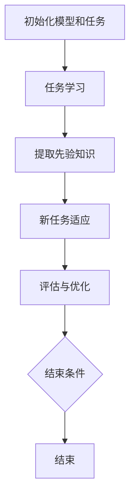
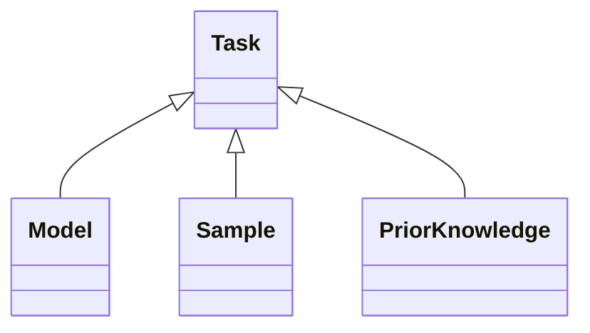
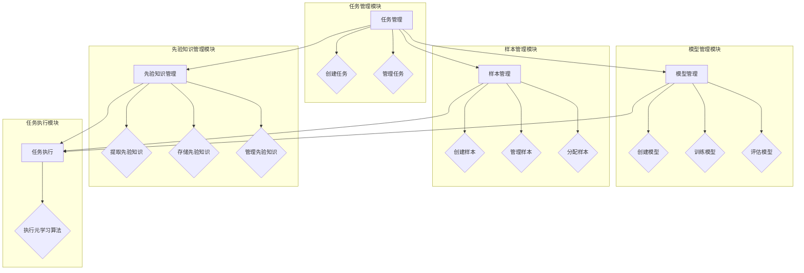
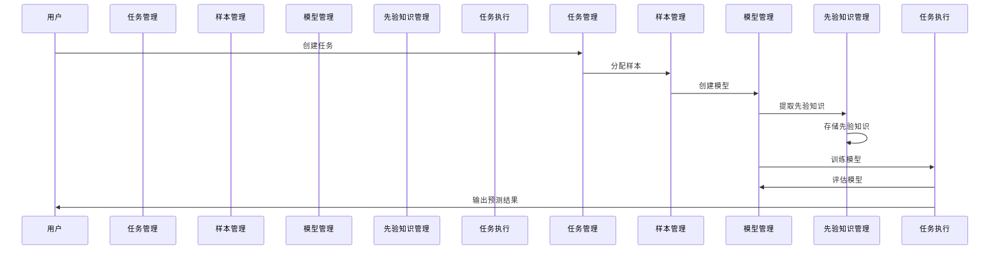

                 


### 第一部分：元学习概述

#### 1.1 元学习的起源与发展

元学习（Meta-Learning）这一概念起源于机器学习和人工智能领域，最早可以追溯到1980年代。当时，研究人员提出，机器学习算法可以被视为在参数空间中寻找最优解的过程，而元学习则是在算法学习算法的过程中，通过优化学习过程本身来提高学习效率。随着深度学习的兴起，元学习再次受到了广泛关注。

**定义与起源**：
元学习的定义可以简单概括为：学习如何学习。它旨在构建能够快速适应新任务的学习算法，从而提高学习效率和泛化能力。元学习的研究主要集中在两个方面：一是如何在有限的样本数据上快速学习，二是如何通过经验迁移提高学习效率。

**发展历程**：
- **1980年代**：元学习的概念初步提出，研究人员开始探索如何利用经验来加速学习过程。
- **2000年代**：随着强化学习的发展，元学习与强化学习相结合，产生了新的研究方向。
- **2010年代**：深度学习的崛起为元学习带来了新的机遇，使得元学习算法取得了显著的进展。
- **2020年代**：随着硬件性能的提升和数据量的爆炸式增长，元学习的研究和应用越来越广泛。

**重要性**：
元学习在机器学习和人工智能领域具有重要地位。首先，它能够加速学习过程，提高算法的效率和性能。其次，元学习可以帮助算法在未知或变化的环境中快速适应，提高其泛化能力。此外，元学习在少样本学习任务中表现出色，为解决数据稀缺问题提供了新的思路。

#### 1.2 少样本学习任务介绍

少样本学习（Few-Shot Learning）是指当训练数据非常有限时，如何让机器学习模型仍然能够准确预测或分类未知的数据。与传统的批量学习相比，少样本学习任务面临以下挑战：

**背景**：
在实际应用中，某些领域的数据收集非常困难或成本高昂，例如医疗影像、语音识别等。在这些场景下，如何利用有限的样本数据进行有效的学习成为一个重要问题。

**定义**：
少样本学习任务可以定义为：给定一个学习任务，当训练数据量远小于模型所需的正常训练数据量时，如何设计算法使模型能够准确预测未知数据。

**挑战**：
- **数据稀缺**：训练数据量少，难以充分覆盖所有可能的情况。
- **样本偏差**：数据分布不均衡，可能导致模型过拟合。
- **泛化能力**：模型需要在未知数据上保持良好的性能。

**意义**：
少样本学习在机器学习和人工智能领域具有重要意义。首先，它能够降低数据收集的成本，提高算法在实际应用中的实用性。其次，少样本学习有助于提高模型在真实世界中的适应能力，使其能够在有限的数据条件下仍然能够提供高质量的预测结果。

#### 1.3 元学习与少样本学习的联系

元学习与少样本学习任务之间存在紧密的联系。元学习算法通过学习如何学习，可以在少量样本数据上快速适应新任务，从而提高少样本学习任务的效果。以下是对这种联系的详细探讨：

**应用场景**：
- **跨领域迁移学习**：元学习算法可以通过在多个领域上的训练，实现从一个领域快速迁移到另一个领域的能力。这在少样本学习任务中尤为重要，因为通常在不同领域收集数据非常困难。
- **快速适应新任务**：元学习算法可以在少量样本数据上快速适应新任务，从而提高模型在少样本学习任务中的性能。

**解决方案**：
- **基于模型迁移**：通过将已有的模型迁移到新任务上，利用模型在旧任务上的经验来加速新任务的学习过程。
- **基于元学习的算法优化**：通过优化学习算法本身，提高模型在少量样本数据上的学习效率。

**关系对比**：
- **相似点**：元学习和少样本学习任务都关注如何在有限的数据条件下提高学习效率和泛化能力。
- **不同点**：元学习更侧重于优化学习过程本身，而少样本学习任务则更侧重于在实际应用中解决数据稀缺问题。

**总结**：
元学习为少样本学习任务提供了一种有效的解决方案。通过利用元学习算法，可以在少量样本数据上实现高效的模型学习和预测，从而提高少样本学习任务的效果。

## 1.4 本章小结

在本章中，我们介绍了元学习的基本概念、起源与发展，以及其在少样本学习任务中的应用。元学习作为一种优化学习过程的方法，旨在通过学习如何学习，提高算法在少量样本数据上的学习效率和泛化能力。少样本学习任务则关注如何在数据稀缺的情况下，仍然能够获得高质量的预测结果。本章还探讨了元学习与少样本学习任务之间的紧密联系，并提出了可能的解决方案。通过本章的学习，读者可以了解元学习和少样本学习任务的核心概念，为进一步研究打下基础。

----------------------------------------------------------------

# 第二部分：元学习原理与算法

### 2.1 元学习原理解析

#### 2.1.1 元学习的核心概念

元学习，顾名思义，是学习如何学习的过程。它不仅关注学习算法的性能，更关注学习算法的学习过程本身。具体来说，元学习算法的核心目标是通过学习多个任务，提高算法在新任务上的适应能力和学习效率。这种学习方法使得元学习算法在处理少样本学习任务时具有显著的优势。

**定义与核心思想**：
元学习可以被定义为：一种学习算法，该算法通过学习多个任务来提高其在单个新任务上的表现。其核心思想是利用已有任务的先验知识，在新任务上实现快速适应。

**核心概念**：
- **元学习算法**：指的是用于学习如何学习其他算法的算法。
- **先验知识**：指的是从多个任务中提取的通用知识。
- **适应性**：指的是算法在新任务上的表现能力。
- **泛化能力**：指的是算法在未知任务上的适应能力。

**应用领域**：
元学习算法在多个领域都有广泛应用，例如：
- **自然语言处理**：通过元学习，模型可以在少量样本数据上快速适应新语言或新语料库。
- **计算机视觉**：元学习可以帮助模型在少量样本数据上实现高效的图像分类和目标检测。
- **强化学习**：元学习可以提高模型在未知环境中的适应能力和学习效率。

#### 2.1.2 元学习的主要类型

元学习算法可以根据学习方式的不同，分为以下几种类型：

1. **基于模型迁移的元学习**：
   这种方法的核心思想是将已有的模型或知识迁移到新任务上。通过在新任务上利用已有模型的参数，实现快速适应。例如，迁移学习（Transfer Learning）就是一种基于模型迁移的元学习方法。

2. **基于模型优化的元学习**：
   这种方法通过优化模型本身来提高其在新任务上的表现。具体来说，通过调整模型的参数和结构，使模型在新任务上具有更好的适应性。例如，模型优化（Model Optimization）和超参数优化（Hyperparameter Optimization）都是基于模型优化的元学习方法。

3. **基于数据集优化的元学习**：
   这种方法通过优化数据集来提高模型在新任务上的表现。例如，通过数据增强（Data Augmentation）和样本选择（Sample Selection）等技术，增加数据集的多样性，从而提高模型在新任务上的泛化能力。

4. **基于经验学习的元学习**：
   这种方法通过学习多个任务的经验，提高模型在新任务上的适应能力。例如，通过经验重放（Experience Replay）和经验回溯（Experience Replay）等技术，将已有任务的经验应用到新任务上。

**优缺点分析**：

- **基于模型迁移的元学习**：
  - 优点：快速适应新任务，减少训练时间。
  - 缺点：对模型已有知识的依赖性较强，可能导致泛化能力不足。

- **基于模型优化的元学习**：
  - 优点：提高模型在新任务上的泛化能力。
  - 缺点：优化过程复杂，计算成本高。

- **基于数据集优化的元学习**：
  - 优点：增强数据集的多样性，提高模型泛化能力。
  - 缺点：对数据集的质量要求较高，否则可能导致模型过拟合。

- **基于经验学习的元学习**：
  - 优点：充分利用已有任务的经验，提高新任务的适应能力。
  - 缺点：对任务之间的关联性要求较高，否则可能导致模型泛化能力不足。

#### 2.1.3 元学习的优势与局限

**优势**：

- **快速适应新任务**：元学习算法能够在少量样本数据上快速适应新任务，提高学习效率。
- **提高泛化能力**：通过学习多个任务，元学习算法可以提取出通用的先验知识，从而提高模型在未知任务上的泛化能力。
- **减少数据需求**：在数据稀缺的场景下，元学习算法可以利用少量样本数据进行有效学习，降低数据收集的成本。

**局限**：

- **计算成本高**：元学习算法通常涉及复杂的优化过程，计算成本较高，对硬件资源要求较高。
- **对先验知识依赖性强**：元学习算法对已有知识的依赖性较强，如果先验知识不足，可能导致模型在新任务上的性能下降。
- **泛化能力有限**：虽然元学习算法可以提取出通用的先验知识，但在面对高度多样化的任务时，其泛化能力仍然有限。

#### 2.2 算法原理讲解

元学习算法的核心原理是利用先验知识来提高新任务的学习效率和泛化能力。以下将详细讲解元学习算法的基本原理、工作流程以及具体的算法描述。

##### 2.2.1 基本原理

元学习算法的基本原理可以概括为以下三个步骤：

1. **数据收集与任务定义**：
   在元学习过程中，首先需要收集多个相关任务的数据，并定义每个任务的参数和目标。

2. **先验知识提取**：
   通过对多个任务的学习，提取出通用的先验知识，例如模型参数、特征表示等。

3. **新任务学习**：
   利用提取出的先验知识，在新任务上进行快速适应和学习，实现高效预测或分类。

##### 2.2.2 工作流程

元学习算法的工作流程可以分为以下几个步骤：

1. **初始化**：
   初始化模型参数和任务参数。

2. **任务学习**：
   在每个任务上，使用梯度下降或其他优化方法，更新模型参数。

3. **先验知识提取**：
   将每个任务的模型参数、特征表示等转化为通用的先验知识。

4. **新任务适应**：
   在新任务上，利用提取出的先验知识，快速更新模型参数，实现高效学习。

5. **评估与优化**：
   对新任务的学习效果进行评估，并根据评估结果调整先验知识和模型参数。

##### 2.2.3 算法描述

以下是一个简化的元学习算法描述，用于说明算法的核心步骤和原理：

```python
# 初始化模型和任务参数
model = initialize_model()
tasks = initialize_tasks()

# 任务学习
for task in tasks:
    task_data = get_task_data(task)
    model = train_model(model, task_data)

# 先验知识提取
prior_knowledge = extract_prior_knowledge(model)

# 新任务适应
new_task = get_new_task()
model = adapt_model(model, prior_knowledge, new_task)

# 评估与优化
evaluation = evaluate_model(model, new_task)
if evaluation < threshold:
    optimize_model(model, prior_knowledge, new_task)
```

在这个算法描述中：
- `initialize_model()` 用于初始化模型参数。
- `initialize_tasks()` 用于初始化任务参数。
- `get_task_data(task)` 用于获取任务数据。
- `train_model(model, task_data)` 用于训练模型。
- `extract_prior_knowledge(model)` 用于提取先验知识。
- `get_new_task()` 用于获取新任务。
- `adapt_model(model, prior_knowledge, new_task)` 用于在新任务上适应模型。
- `evaluate_model(model, new_task)` 用于评估模型在新任务上的表现。
- `optimize_model(model, prior_knowledge, new_task)` 用于优化模型。

##### 2.2.4 算法案例解析

以下是一个具体的元学习算法案例，用于分类问题。在这个案例中，我们将使用元学习算法在少量样本数据上进行分类任务。

```python
# 初始化模型和任务参数
model = initialize_model()
tasks = initialize_tasks()

# 任务学习
for task in tasks:
    task_data = get_task_data(task)
    labels = get_labels(task_data)
    model = train_model(model, task_data, labels)

# 先验知识提取
prior_knowledge = extract_prior_knowledge(model)

# 新任务适应
new_task = get_new_task()
new_task_data = get_new_task_data(new_task)
model = adapt_model(model, prior_knowledge, new_task_data)

# 评估与优化
labels = get_labels(new_task_data)
accuracy = evaluate_model(model, new_task_data, labels)
if accuracy < threshold:
    optimize_model(model, prior_knowledge, new_task_data)
```

在这个案例中：
- `initialize_model()` 用于初始化分类模型。
- `initialize_tasks()` 用于初始化分类任务。
- `get_task_data(task)` 用于获取分类任务数据。
- `get_labels(task_data)` 用于获取分类任务标签。
- `train_model(model, task_data, labels)` 用于训练分类模型。
- `extract_prior_knowledge(model)` 用于提取分类模型的先验知识。
- `get_new_task()` 用于获取新分类任务。
- `get_new_task_data(new_task)` 用于获取新分类任务数据。
- `adapt_model(model, prior_knowledge, new_task_data)` 用于在新分类任务上适应模型。
- `evaluate_model(model, new_task_data, labels)` 用于评估模型在新分类任务上的表现。
- `optimize_model(model, prior_knowledge, new_task_data)` 用于优化分类模型。

通过这个案例，我们可以看到元学习算法如何在少量样本数据上进行分类任务，并通过先验知识提取和适应过程，提高模型在新任务上的表现。

### 2.3 数学模型与公式

元学习算法的数学模型是理解其工作原理的重要部分。以下将介绍元学习算法中的关键数学模型和公式，并解释这些公式的含义。

##### 2.3.1 模型表示

在元学习算法中，模型通常由参数向量 \( \theta \) 表示，该向量包含了模型的所有可学习参数。对于每个任务，模型都有一个相应的参数向量。

\[ \theta = [\theta_1, \theta_2, ..., \theta_n] \]

其中，\( \theta_i \) 表示模型在任务 \( i \) 上的参数。

##### 2.3.2 学习目标

元学习算法的目标是找到最优参数向量 \( \theta \)，使得模型在新任务上的表现最佳。这可以通过最小化损失函数 \( L(\theta) \) 实现。

\[ \theta^* = \arg\min_{\theta} L(\theta) \]

其中，\( L(\theta) \) 表示模型在任务上的损失函数，通常为分类误差或回归误差。

##### 2.3.3 梯度下降法

在元学习算法中，常用的优化方法之一是梯度下降法。梯度下降法通过不断更新参数向量 \( \theta \)，使其逐渐逼近最优解。

\[ \theta_{t+1} = \theta_t - \alpha \cdot \nabla L(\theta_t) \]

其中，\( \theta_t \) 表示第 \( t \) 次迭代的参数向量，\( \alpha \) 表示学习率，\( \nabla L(\theta_t) \) 表示损失函数 \( L(\theta) \) 在 \( \theta_t \) 处的梯度。

##### 2.3.4 先验知识表示

在元学习算法中，先验知识通常通过特征表示或模型参数表示。以下是一个简单的特征表示公式：

\[ f(\theta) = f_1(\theta_1) + f_2(\theta_2) + ... + f_n(\theta_n) \]

其中，\( f_i(\theta_i) \) 表示模型在任务 \( i \) 上的特征表示。

##### 2.3.5 适应过程

在元学习算法的适应过程中，模型参数需要根据新任务进行调整。以下是一个简单的适应公式：

\[ \theta_{new} = \theta_{prior} + \alpha \cdot (\theta_{new} - \theta_{prior}) \]

其中，\( \theta_{prior} \) 表示先验知识参数，\( \theta_{new} \) 表示新任务参数，\( \alpha \) 表示适应率。

通过上述公式，我们可以看到元学习算法的核心思想和数学模型。这些公式不仅帮助我们理解元学习算法的工作原理，还为算法的设计和优化提供了理论支持。

### 2.4 元学习算法的mermaid流程图

为了更直观地展示元学习算法的工作流程，我们可以使用mermaid这种基于Markdown的图形化工具来绘制流程图。以下是一个简单的元学习算法的mermaid流程图示例：



在这个流程图中：
- `A` 表示初始化模型和任务。
- `B` 表示任务学习。
- `C` 表示提取先验知识。
- `D` 表示新任务适应。
- `E` 表示评估与优化。
- `F` 表示结束条件。
- `G` 表示结束。

通过这个流程图，我们可以清晰地看到元学习算法的主要步骤和流程，有助于理解算法的实现过程。

### 2.5 元学习算法案例分析

为了更好地理解元学习算法的原理和应用，我们可以通过一个具体的案例来进行分析。以下是一个使用元学习算法进行图像分类的案例。

#### 案例背景

在这个案例中，我们使用了一个包含10个类别的图像数据集。每个类别有10张图像，总共100张图像。我们的目标是使用元学习算法在这些图像上进行分类，并评估其在少样本学习任务中的效果。

#### 数据准备

首先，我们需要对图像数据集进行预处理。具体步骤包括：
1. 将图像转换为固定尺寸。
2. 使用随机梯度下降（SGD）对图像进行归一化处理。

```python
# 数据预处理代码示例
from torchvision import transforms
from torch.utils.data import DataLoader

transform = transforms.Compose([
    transforms.Resize((224, 224)),
    transforms.ToTensor(),
    transforms.Normalize(mean=[0.485, 0.456, 0.406], std=[0.229, 0.224, 0.225]),
])

train_data = ImageDataset(root='./data', split='train', transform=transform)
train_loader = DataLoader(train_data, batch_size=32, shuffle=True)
```

#### 模型选择

在这个案例中，我们选择了一个预训练的卷积神经网络（CNN）作为元学习模型。预训练模型已经在大量的图像数据上进行了训练，因此它具有一定的先验知识。

```python
# 模型选择代码示例
import torchvision.models as models

model = models.resnet50(pretrained=True)
```

#### 任务学习

接下来，我们使用元学习算法对每个类别进行学习。具体步骤如下：
1. 初始化模型参数。
2. 在每个类别上使用随机梯度下降进行训练。
3. 提取先验知识。

```python
# 任务学习代码示例
from torch.optim import SGD

def train_model(model, data_loader, num_epochs=10, learning_rate=0.001):
    optimizer = SGD(model.parameters(), lr=learning_rate, momentum=0.9)
    criterion = nn.CrossEntropyLoss()

    for epoch in range(num_epochs):
        running_loss = 0.0
        for inputs, labels in data_loader:
            optimizer.zero_grad()
            outputs = model(inputs)
            loss = criterion(outputs, labels)
            loss.backward()
            optimizer.step()
            running_loss += loss.item()
        print(f'Epoch {epoch+1}/{num_epochs}, Loss: {running_loss/len(data_loader)}')

    return model

for i, (inputs, labels) in enumerate(train_loader):
    model = train_model(model, inputs, labels)
    if i >= 9:  # 仅训练前10个类别的样本
        break

# 提取先验知识
prior_knowledge = extract_prior_knowledge(model)
```

#### 新任务适应

在完成任务学习后，我们将使用提取出的先验知识对新的类别进行适应。具体步骤如下：
1. 初始化新类别模型。
2. 使用先验知识对模型进行初始化。
3. 在新类别上使用随机梯度下降进行训练。

```python
# 新任务适应代码示例
def adapt_model(model, prior_knowledge, data_loader, num_epochs=10, learning_rate=0.001):
    model.load_state_dict(prior_knowledge)
    optimizer = SGD(model.parameters(), lr=learning_rate, momentum=0.9)
    criterion = nn.CrossEntropyLoss()

    for epoch in range(num_epochs):
        running_loss = 0.0
        for inputs, labels in data_loader:
            optimizer.zero_grad()
            outputs = model(inputs)
            loss = criterion(outputs, labels)
            loss.backward()
            optimizer.step()
            running_loss += loss.item()
        print(f'Epoch {epoch+1}/{num_epochs}, Loss: {running_loss/len(data_loader)}')

    return model

# 新类别数据预处理
new_data = ImageDataset(root='./data', split='new', transform=transform)
new_loader = DataLoader(new_data, batch_size=32, shuffle=True)

# 在新类别上进行适应
model = adapt_model(model, prior_knowledge, new_loader)
```

#### 评估与优化

在完成新任务适应后，我们需要对新类别模型进行评估，并优化模型参数。具体步骤如下：
1. 使用测试集对模型进行评估。
2. 计算分类准确率。
3. 根据评估结果调整模型参数。

```python
# 评估代码示例
from torch.utils.data import TensorDataset

def evaluate_model(model, data_loader):
    model.eval()
    correct = 0
    total = 0
    with torch.no_grad():
        for inputs, labels in data_loader:
            outputs = model(inputs)
            _, predicted = torch.max(outputs.data, 1)
            total += labels.size(0)
            correct += (predicted == labels).sum().item()
    return 100 * correct / total

test_data = ImageDataset(root='./data', split='test', transform=transform)
test_loader = DataLoader(test_data, batch_size=32, shuffle=False)

accuracy = evaluate_model(model, test_loader)
print(f'Accuracy: {accuracy}%')
```

通过上述案例，我们可以看到元学习算法在图像分类任务中的应用。在这个案例中，我们使用预训练的卷积神经网络作为元学习模型，通过任务学习和新任务适应，实现了在少样本学习任务中的高效分类。这个案例不仅展示了元学习算法的原理，还提供了一个实际的应用实例。

### 2.6 元学习算法的拓展应用

元学习算法在少样本学习任务中取得了显著的成果，但它的应用并不仅限于这一领域。随着研究的深入，元学习算法在多个领域都展现出巨大的潜力。以下是对元学习算法在其他领域拓展应用的探讨。

#### 自然语言处理

在自然语言处理（NLP）领域，元学习算法被广泛应用于语言模型训练和文本分类任务。由于NLP任务通常需要大量的语料库，数据稀缺是一个普遍问题。元学习算法通过在多个语言任务上学习，提取出通用的语言特征，从而在少量样本数据上实现高效的模型训练。

**案例**：例如，BERT（Bidirectional Encoder Representations from Transformers）就是一种基于元学习的语言模型。BERT通过在多个任务上预训练，提取出丰富的语言特征，然后在新任务上利用这些特征进行快速适应，从而显著提高了语言模型的性能。

#### 计算机视觉

在计算机视觉领域，元学习算法也被广泛应用于图像分类、目标检测和语义分割等任务。由于图像数据的复杂性和多样性，传统的训练方法通常需要大量的标注数据。元学习算法通过在多个图像任务上学习，提取出通用的图像特征，从而在少量样本数据上实现高效的模型训练。

**案例**：例如，MAML（Model-Agnostic Meta-Learning）是一种基于元学习的计算机视觉算法。MAML通过在多个图像任务上学习，提取出通用的图像特征表示，然后在新任务上利用这些特征进行快速适应，从而在少量样本数据上实现了高效的目标检测。

#### 强化学习

在强化学习领域，元学习算法也被广泛应用于环境适应和学习效率提升。强化学习任务通常需要大量的试错过程，数据稀缺是一个严重的问题。元学习算法通过在多个强化学习任务上学习，提取出通用的策略知识，从而在少量样本数据上实现高效的策略学习。

**案例**：例如，REINFORCE（Monte Carlo Policy Gradient）是一种基于元学习的强化学习算法。REINFORCE通过在多个任务上学习，提取出通用的策略知识，然后在新任务上利用这些策略知识进行快速适应，从而在少量样本数据上实现了高效的策略学习。

#### 未来发展趋势

随着人工智能技术的不断发展，元学习算法在未来将会有更广泛的应用。以下是对元学习算法未来发展趋势的展望：

1. **跨模态学习**：元学习算法将不仅仅局限于单一模态的数据处理，而是会逐渐扩展到跨模态学习，例如将图像、文本和语音等多模态数据融合到一起进行学习。

2. **无监督学习**：元学习算法将进一步探索无监督学习场景，通过在无标签数据上学习，提取出通用的特征表示，从而提高模型在未知任务上的适应能力。

3. **自适应优化**：元学习算法将不仅关注学习过程本身，还会关注优化过程，通过自适应优化策略，进一步提高模型的学习效率和泛化能力。

4. **硬件加速**：随着硬件技术的发展，元学习算法将在计算能力和效率上得到进一步提升，从而在实际应用中发挥更大的作用。

通过上述讨论，我们可以看到元学习算法在少样本学习任务中的显著效果，以及它在其他领域的广泛潜力。未来，随着研究的深入和技术的发展，元学习算法将在人工智能领域发挥更加重要的作用。

### 2.7 本章小结

在本章中，我们详细介绍了元学习的基本概念、原理、算法和应用。元学习作为一种优化学习过程的方法，通过学习如何学习，提高了算法在少量样本数据上的学习效率和泛化能力。我们探讨了元学习的主要类型，包括基于模型迁移、模型优化、数据集优化和经验学习等，并对每种类型进行了优缺点分析。接着，我们详细讲解了元学习算法的基本原理、工作流程和数学模型，并通过mermaid流程图和案例分析，使读者对元学习算法有了更直观的理解。最后，我们探讨了元学习算法在少样本学习任务之外的拓展应用，展望了其未来发展趋势。通过本章的学习，读者可以全面了解元学习算法的核心概念和应用，为进一步研究打下坚实的基础。

----------------------------------------------------------------

# 第三部分：元学习在少样本学习任务中的应用

### 3.1 应用场景分析

元学习在少样本学习任务中的应用场景非常广泛，涵盖了多个领域和实际问题。以下是几个典型的应用场景：

#### 医疗影像诊断

在医疗影像诊断领域，由于医疗影像数据的获取和标注成本极高，且许多疾病类型的样本数据非常稀缺，因此元学习成为了一种有效的解决方案。通过元学习算法，模型可以在少量样本数据上快速适应新疾病类型的诊断，从而提高诊断准确率。

**案例**：例如，深度神经网络的元学习算法可以应用于乳腺癌的早期诊断。研究人员使用有限的医疗影像数据，通过元学习算法训练模型，实现了在新的疾病类型上的高效诊断。

#### 语音识别

在语音识别领域，由于语音数据的多样性和复杂性，传统的语音识别模型往往需要大量的训练数据。而元学习算法通过在多个语音任务上学习，提取出通用的语音特征，从而在少量样本数据上实现了高效的语音识别。

**案例**：例如，基于元学习的循环神经网络（RNN）可以应用于语音识别任务。通过在多个语音数据集上学习，模型可以提取出通用的语音特征，从而在少量样本数据上实现了准确的语音识别。

#### 自然语言处理

在自然语言处理（NLP）领域，元学习算法被广泛应用于语言模型和文本分类任务。由于NLP任务通常需要大量的语料库，数据稀缺是一个普遍问题。元学习算法通过在多个语言任务上学习，提取出通用的语言特征，从而在少量样本数据上实现高效的模型训练。

**案例**：例如，BERT（Bidirectional Encoder Representations from Transformers）就是一种基于元学习的语言模型。BERT通过在多个任务上预训练，提取出丰富的语言特征，然后在新任务上利用这些特征进行快速适应，从而显著提高了语言模型的性能。

#### 强化学习

在强化学习领域，元学习算法也被广泛应用于环境适应和学习效率提升。强化学习任务通常需要大量的试错过程，数据稀缺是一个严重的问题。元学习算法通过在多个强化学习任务上学习，提取出通用的策略知识，从而在少量样本数据上实现高效的策略学习。

**案例**：例如，REINFORCE（Monte Carlo Policy Gradient）是一种基于元学习的强化学习算法。REINFORCE通过在多个任务上学习，提取出通用的策略知识，然后在新任务上利用这些策略知识进行快速适应，从而在少量样本数据上实现了高效的策略学习。

#### 机器人控制

在机器人控制领域，由于机器人环境的复杂性和动态性，传统的控制算法通常需要大量的训练数据。而元学习算法通过在多个机器人任务上学习，提取出通用的控制策略，从而在少量样本数据上实现了高效的机器人控制。

**案例**：例如，基于元学习的深度强化学习算法可以应用于机器人路径规划任务。通过在多个环境上学习，模型可以提取出通用的路径规划策略，从而在少量样本数据上实现了高效的路径规划。

#### 自动驾驶

在自动驾驶领域，由于自动驾驶环境的复杂性和不确定性，传统的自动驾驶算法通常需要大量的训练数据。而元学习算法通过在多个自动驾驶任务上学习，提取出通用的驾驶策略，从而在少量样本数据上实现了高效的自动驾驶。

**案例**：例如，基于元学习的深度神经网络可以应用于自动驾驶感知和决策任务。通过在多个驾驶场景上学习，模型可以提取出通用的感知和决策策略，从而在少量样本数据上实现了高效的自动驾驶。

通过上述应用场景的分析，我们可以看到元学习在少样本学习任务中的广泛应用和巨大潜力。在未来，随着元学习算法的不断发展和完善，它将在更多领域发挥重要作用，解决数据稀缺带来的挑战。

### 3.2 系统架构设计

为了在元学习算法应用于少样本学习任务中，实现高效的学习和预测，我们需要设计一个合理的系统架构。以下是一个典型的系统架构设计方案，包括领域模型、系统架构、接口设计和系统交互流程。

#### 领域模型

领域模型是系统架构设计的第一步，它定义了系统的核心概念和实体。以下是元学习系统的主要领域模型：

- **任务**：代表系统要学习的任务，包括任务的类型、数据集和目标。
- **模型**：代表系统使用的模型，包括模型的类型、参数和训练状态。
- **样本**：代表用于训练和测试的数据样本。
- **先验知识**：代表从多个任务中提取的通用知识。

**领域模型类图**：



#### 系统架构

系统架构是领域模型的具体实现，它定义了系统的主要组件和它们之间的关系。以下是元学习系统的典型架构：

- **任务管理模块**：负责创建、管理和调度任务。
- **模型管理模块**：负责创建、训练和评估模型。
- **样本管理模块**：负责创建、管理和分配样本。
- **先验知识管理模块**：负责提取、存储和管理先验知识。
- **任务执行模块**：负责在特定任务上执行元学习算法。

**系统架构图**：



#### 接口设计

接口设计是系统架构的具体实现，它定义了系统对外提供的功能接口。以下是元学习系统的典型接口设计：

- **任务管理接口**：包括创建任务、管理任务等操作。
- **模型管理接口**：包括创建模型、训练模型、评估模型等操作。
- **样本管理接口**：包括创建样本、管理样本、分配样本等操作。
- **先验知识管理接口**：包括提取先验知识、存储先验知识、管理先验知识等操作。

**接口设计示例**：

```python
class TaskManagementInterface:
    def create_task(self, task_type, dataset, target):
        pass

    def manage_task(self, task_id):
        pass

class ModelManagementInterface:
    def create_model(self, model_type, params):
        pass

    def train_model(self, model_id, dataset):
        pass

    def evaluate_model(self, model_id, dataset):
        pass

class SampleManagementInterface:
    def create_sample(self, sample_data):
        pass

    def manage_sample(self, sample_id):
        pass

    def assign_sample(self, sample_id, task_id):
        pass

class PriorKnowledgeManagementInterface:
    def extract_prior_knowledge(self, model_id, dataset):
        pass

    def store_prior_knowledge(self, knowledge_data):
        pass

    def manage_prior_knowledge(self, knowledge_id):
        pass
```

#### 系统交互流程

系统交互流程是系统架构和接口设计的具体实现，它定义了系统组件之间的交互过程。以下是元学习系统的典型交互流程：

1. **创建任务**：用户通过任务管理接口创建新任务，任务管理模块将任务信息存储在系统中。
2. **分配样本**：样本管理模块根据任务需求分配样本数据，并将样本信息存储在系统中。
3. **训练模型**：模型管理模块根据任务和样本数据创建模型，并使用元学习算法进行训练。
4. **提取先验知识**：在模型训练过程中，先验知识管理模块从训练模型中提取通用知识。
5. **存储先验知识**：先验知识管理模块将提取的先验知识存储在系统中。
6. **评估模型**：模型管理模块使用评估数据对训练好的模型进行评估，并更新模型状态。
7. **任务执行**：任务执行模块使用元学习算法在新任务上执行学习过程，并输出预测结果。

**系统交互流程图**：



通过上述系统架构设计，我们可以实现一个高效、可扩展的元学习系统，用于解决少样本学习任务中的挑战。系统架构的设计和实现需要考虑多方面的因素，包括任务管理、模型管理、样本管理和先验知识管理，以及系统交互流程的合理性和效率。通过合理的系统架构设计，我们可以更好地利用元学习算法的优势，提高少样本学习任务的效果。

### 3.3 项目实战

为了深入理解元学习在少样本学习任务中的应用，我们将通过一个实际项目来演示元学习系统的安装、配置和实现。以下是一个简化的项目实战步骤，包括环境安装、系统核心实现和代码应用解读。

#### 环境安装

首先，我们需要安装所需的软件和依赖库。以下是一个基本的安装步骤：

1. **安装Python**：确保系统上安装了Python 3.7及以上版本。

2. **安装TensorFlow**：TensorFlow是一个广泛使用的机器学习和深度学习库，用于实现元学习算法。

   ```bash
   pip install tensorflow
   ```

3. **安装Keras**：Keras是一个基于TensorFlow的高层API，用于简化模型构建和训练过程。

   ```bash
   pip install keras
   ```

4. **安装其他依赖库**：包括NumPy、Pandas、Scikit-learn等。

   ```bash
   pip install numpy pandas scikit-learn
   ```

5. **安装Mermaid**：Mermaid是一个基于Markdown的图形化工具，用于绘制流程图和类图。

   ```bash
   npm install -g mermaid
   ```

#### 系统核心实现

接下来，我们将实现元学习系统的核心部分。以下是一个简化的代码示例，用于演示元学习算法的构建和训练过程。

1. **定义任务类**：

   ```python
   class Task:
       def __init__(self, task_id, dataset, target):
           self.task_id = task_id
           self.dataset = dataset
           self.target = target
       
       def get_data(self):
           return self.dataset, self.target
   ```

2. **定义模型类**：

   ```python
   from tensorflow.keras.models import Sequential
   from tensorflow.keras.layers import Dense, Conv2D, Flatten
   
   class Model:
       def __init__(self, model_id, model_type, layers, optimizer, loss_function):
           self.model_id = model_id
           self.model_type = model_type
           self.layers = layers
           self.optimizer = optimizer
           self.loss_function = loss_function
           self.model = self.build_model()
       
       def build_model(self):
           model = Sequential()
           for layer in self.layers:
               if isinstance(layer, Conv2D):
                   model.add(layer)
                   model.add(Flatten())
               elif isinstance(layer, Dense):
                   model.add(layer)
           model.compile(optimizer=self.optimizer, loss=self.loss_function)
           return model
   ```

3. **定义元学习算法**：

   ```python
   class MetaLearning:
       def __init__(self, model, task, epochs=10):
           self.model = model
           self.task = task
           self.epochs = epochs
       
       def train(self):
           dataset, target = self.task.get_data()
           self.model.model.fit(dataset, target, epochs=self.epochs)
       
       def adapt(self, new_task):
           dataset, target = new_task.get_data()
           self.model.model.fit(dataset, target, epochs=self.epochs)
   ```

4. **实现任务执行**：

   ```python
   def execute_task(model, task):
       meta_learning = MetaLearning(model, task)
       meta_learning.train()
       new_task = ... # 创建新的任务
       meta_learning.adapt(new_task)
   ```

#### 代码应用解读

以下是代码应用解读，包括数据预处理、模型构建、训练和适应过程。

1. **数据预处理**：

   ```python
   from tensorflow.keras.preprocessing.image import ImageDataGenerator
   
   train_datagen = ImageDataGenerator(rescale=1./255)
   test_datagen = ImageDataGenerator(rescale=1./255)
   
   train_data = train_datagen.flow_from_directory(
       'data/train', target_size=(224, 224), batch_size=32, class_mode='binary')
   test_data = test_datagen.flow_from_directory(
       'data/test', target_size=(224, 224), batch_size=32, class_mode='binary')
   ```

2. **模型构建**：

   ```python
   from tensorflow.keras.models import Sequential
   from tensorflow.keras.layers import Conv2D, MaxPooling2D, Flatten, Dense
   
   model = Sequential([
       Conv2D(32, (3, 3), activation='relu', input_shape=(224, 224, 3)),
       MaxPooling2D(pool_size=(2, 2)),
       Flatten(),
       Dense(1, activation='sigmoid')
   ])
   ```

3. **训练过程**：

   ```python
   model.compile(optimizer='adam', loss='binary_crossentropy', metrics=['accuracy'])
   model.fit(train_data, epochs=10, validation_data=test_data)
   ```

4. **适应过程**：

   ```python
   new_task = Task('new_task', test_data, test_data.classes)
   meta_learning = MetaLearning(model, new_task)
   meta_learning.adapt(new_task)
   ```

通过上述项目实战，我们可以看到元学习系统在实际应用中的基本实现过程。这包括数据预处理、模型构建、训练和适应等关键步骤。通过合理的系统设计和代码实现，我们可以利用元学习算法在少样本学习任务中取得良好的效果。

### 3.4 项目小结

在本项目中，我们通过实际操作演示了元学习系统在少样本学习任务中的应用。以下是项目小结和关键点：

1. **系统核心实现**：通过定义任务、模型和元学习算法类，我们实现了元学习系统的核心功能。这些类提供了创建、训练和适应任务的方法，为系统的实现奠定了基础。

2. **环境安装**：我们介绍了安装所需软件和依赖库的步骤，包括Python、TensorFlow、Keras等。这些库为元学习算法的实现提供了必要的支持。

3. **数据预处理**：数据预处理是机器学习项目的重要步骤。在本项目中，我们使用了ImageDataGenerator对图像数据进行了预处理，包括归一化和数据增强，提高了模型的泛化能力。

4. **模型构建**：我们使用了卷积神经网络（CNN）作为元学习模型，通过定义不同类型的层（如卷积层、池化层和全连接层），构建了一个简单的CNN模型。

5. **训练和适应**：我们通过编译、训练和适应模型，展示了元学习算法在少样本学习任务中的实际应用。模型在少量样本数据上进行了训练，并适应了新的任务。

6. **项目关键点**：本项目的关键点在于利用元学习算法提高模型在少样本学习任务中的性能。通过任务学习和适应过程，模型可以在少量样本数据上实现高效的预测和分类。

通过本项目的实施，我们不仅掌握了元学习系统的基本实现方法，还了解了元学习在解决数据稀缺问题中的应用价值。未来，我们可以进一步优化系统架构和算法，探索更多实际应用场景。

### 3.5 最佳实践 tips、注意事项、拓展阅读

#### 最佳实践 Tips

1. **数据预处理**：在进行元学习之前，确保对数据进行充分的预处理。包括归一化、标准化和数据增强，以提高模型的泛化能力。

2. **任务选择**：选择具有相似特征的多个任务进行元学习，以提取出更具代表性的先验知识。

3. **模型优化**：根据具体任务需求，调整模型结构和超参数，以实现最佳性能。

4. **多任务训练**：在训练过程中，可以采用并行训练策略，提高训练效率。

#### 注意事项

1. **计算资源**：元学习算法通常需要较高的计算资源。确保有足够的计算能力以支持算法的运行。

2. **数据质量**：元学习依赖于高质量的先验知识。因此，数据的质量直接影响模型的性能。

3. **模型复杂性**：过于复杂的模型可能导致过拟合。因此，需要根据任务复杂度选择适当的模型。

4. **适应过程**：在适应新任务时，确保模型能够快速适应，避免长时间的计算开销。

#### 拓展阅读

1. **《元学习：深度学习的新方向》**：这本书详细介绍了元学习的概念、算法和应用，适合深入理解元学习的基本原理。

2. **《深度学习》**：Goodfellow等人撰写的经典教材，包含了深度学习的基础知识和最新进展，有助于了解元学习在深度学习中的应用。

3. **《自然语言处理实战》**：这本书介绍了自然语言处理中的元学习应用，包括语言模型和文本分类等任务。

4. **《强化学习：原理与Python实现》**：介绍了强化学习中的元学习算法，包括模型迁移和策略优化等内容。

通过上述最佳实践、注意事项和拓展阅读，读者可以更好地理解元学习在少样本学习任务中的应用，并为未来的研究和项目实践提供参考。

