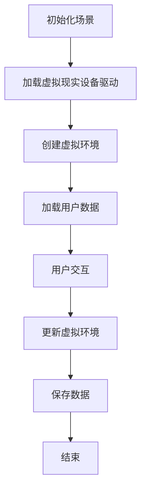
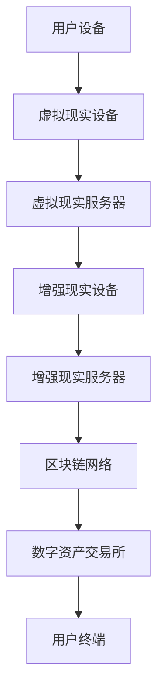
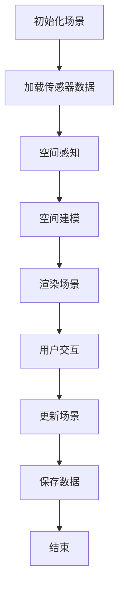
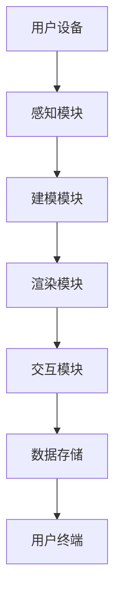

                 

### 文章关键词

1. **元宇宙技术**
2. **空间计算**
3. **虚拟办公**
4. **空间感知**
5. **虚拟会议**
6. **协作工具**
7. **系统集成**

### 文章摘要

本文旨在深入探讨元宇宙技术在虚拟办公中的应用，特别是空间计算这一关键技术的角色和影响。通过分析空间计算的定义、原理及其在虚拟办公中的具体应用，本文揭示了空间计算如何提升虚拟办公的效率和用户体验。同时，本文还将探讨虚拟办公面临的挑战及其解决方案，提供最佳实践建议，并展望未来技术发展的方向。读者将了解元宇宙与虚拟办公的深度融合如何重塑现代工作方式。

---

### 第1章 元宇宙技术概述

**背景介绍**

元宇宙（Metaverse）作为一个新兴的概念，最早可以追溯到科幻作家的笔下。然而，随着科技的发展，特别是虚拟现实（VR）、增强现实（AR）和区块链等技术的进步，元宇宙逐渐从虚构走向现实。元宇宙可以被定义为一个由多个虚拟世界组成的网络，用户可以在这个网络中以数字化的身份（即“虚拟化身”）进行交互和体验。它不仅包括了虚拟现实和增强现实，还涉及社交网络、数字资产和经济系统等多个方面。

在当前的状态下，元宇宙技术已经取得了一些显著的进展。虚拟现实和增强现实设备的性能不断提高，使得用户能够获得更加沉浸式的体验。同时，区块链技术的应用为元宇宙中的虚拟资产提供了安全的存储和交易机制。元宇宙的愿景是创建一个无缝连接的虚拟世界，其中用户可以自由地探索、创造和社交。

**未来发展趋势**

元宇宙技术的未来发展趋势显示出几个关键方向。首先，随着5G和边缘计算技术的发展，网络延迟将进一步降低，使得元宇宙中的实时交互成为可能。其次，人工智能和机器学习的进步将为元宇宙提供更智能的交互和内容生成。此外，虚拟现实和增强现实设备的普及和性能提升也将推动元宇宙的广泛应用。最后，区块链技术的完善和普及将进一步加强元宇宙中的去中心化经济和数字资产的流动性。

**关键词解释**

- **元宇宙**：一个由多个虚拟世界组成的网络，用户可以在其中以数字化的身份进行交互和体验。
- **虚拟现实**：通过计算机模拟出一个三维的虚拟环境，用户可以在这个环境中进行沉浸式的交互。
- **增强现实**：通过在现实世界中叠加虚拟元素，增强用户的感知和体验。
- **区块链**：一种去中心化的数据库技术，用于存储和验证交易，确保数据的透明和安全。

**核心概念与联系**

元宇宙技术中涉及的核心概念包括虚拟现实、增强现实、区块链、物联网和人工智能等。这些概念之间存在着紧密的联系。虚拟现实和增强现实为元宇宙提供了沉浸式的体验，而区块链技术则为元宇宙中的虚拟资产提供了安全的交易和存储机制。物联网使得元宇宙中的各种设备能够互联互通，而人工智能则提升了元宇宙中交互和内容生成的智能化水平。

**算法原理讲解**

为了更好地理解元宇宙技术，我们可以通过一个简单的算法示例来展示其基本原理。以下是一个用于创建虚拟场景的算法流程图：



这个算法流程展示了元宇宙技术的基本操作流程。首先，初始化场景并加载虚拟现实设备驱动。然后，创建虚拟环境和加载用户数据。在用户交互过程中，虚拟环境会根据用户的动作进行更新，并保存数据以便后续使用。

**数学模型和数学公式**

元宇宙中的许多技术都涉及复杂的数学模型。以下是一个用于计算虚拟环境中物体位置和运动的数学公式：

$$
\text{位置} = \text{初始位置} + \text{速度} \times \text{时间}
$$

这个公式描述了物体在虚拟环境中的位置是如何随时间变化的。其中，初始位置、速度和时间是影响物体运动的三个关键参数。

**系统分析与架构设计方案**

元宇宙技术涉及多个系统的集成，包括虚拟现实系统、增强现实系统和区块链系统等。以下是一个简化的元宇宙技术系统架构设计：



在这个架构中，用户设备通过虚拟现实设备和增强现实设备与元宇宙系统进行交互。虚拟现实服务器和增强现实服务器负责处理和存储虚拟环境和用户数据。区块链网络用于管理元宇宙中的数字资产交易。用户终端则是用户与元宇宙系统进行交互的入口。

**项目实战**

为了更好地理解元宇宙技术在虚拟办公中的应用，我们可以通过一个具体的案例来进行分析。假设我们正在开发一个虚拟办公系统，该系统需要支持远程会议、文档协作和虚拟办公空间的设计。

**环境安装**

首先，我们需要安装必要的开发环境和工具，包括虚拟现实设备驱动、增强现实设备驱动、区块链节点和虚拟会议软件。

```bash
# 安装虚拟现实设备驱动
sudo apt-get install oculus-vr

# 安装增强现实设备驱动
sudo apt-get install google-ar

# 安装区块链节点
git clone https://github.com/ethereum/go-ethereum.git
cd go-ethereum
make geth
```

**系统实现源代码**

接下来，我们需要编写虚拟办公系统的源代码。以下是一个简单的Python代码示例，用于创建虚拟会议房间：

```python
import avango

# 创建虚拟环境
env = avango Ambiente()

# 创建虚拟会议房间
room = env.create_room()

# 添加用户
user1 = env.create_user("Alice")
room.add_user(user1)

# 添加远程用户
remote_user = env.create_user("Bob")
remote_user.set_location([10, 0, 0])
room.add_user(remote_user)

# 开始会议
room.start_meeting()
```

**代码解读与分析**

上述代码首先创建了一个虚拟环境，然后创建了一个虚拟会议房间。接着，添加了本地用户“Alice”和远程用户“Bob”。最后，启动了虚拟会议。

**实际案例剖析**

假设我们有一个具体的案例，需要支持多人的远程会议。在这种情况下，我们需要扩展上述代码以支持更多的用户和更复杂的交互。以下是一个扩展后的代码示例：

```python
import avango

# 创建虚拟环境
env = avango.Ambiente()

# 创建虚拟会议房间
room = env.create_room()

# 添加多个用户
user1 = env.create_user("Alice")
user2 = env.create_user("Bob")
user3 = env.create_user("Charlie")
room.add_user(user1)
room.add_user(user2)
room.add_user(user3)

# 设置用户位置
user1.set_location([0, 0, 0])
user2.set_location([5, 0, 0])
user3.set_location([-5, 0, 0])

# 启动会议
room.start_meeting()

# 加入远程用户
remote_user1 = env.create_user("Dave")
remote_user1.set_location([10, 0, 0])
room.add_user(remote_user1)

# 更新用户位置
user1.set_location([0, 3, 0])
user2.set_location([5, 3, 0])
user3.set_location([-5, 3, 0])

# 结束会议
room.end_meeting()
```

在这个案例中，我们添加了三个本地用户和一个远程用户。我们设置了用户的位置，并在会议过程中更新了用户的位置。最后，我们结束了会议。

**项目小结**

通过这个案例，我们可以看到元宇宙技术在虚拟办公中的强大应用潜力。虚拟会议系统能够支持远程协作，提升工作效率，减少物理距离带来的障碍。然而，这只是一个简单的示例，实际的虚拟办公系统需要更复杂的架构和功能，包括实时交互、数据同步和安全性等。

**最佳实践 tips**

1. **性能优化**：确保虚拟环境中的物体和用户动作流畅，避免卡顿和延迟。
2. **用户体验**：提供直观易用的用户界面，提升用户的沉浸感和满意度。
3. **安全性**：保护用户数据和虚拟资产的安全，采用区块链技术来确保数据的不可篡改。

**小结**

元宇宙技术为虚拟办公带来了巨大的变革潜力。通过空间计算技术，我们可以创建高度沉浸的虚拟工作环境，提升协作效率和用户体验。未来，随着技术的进一步发展和普及，元宇宙技术将在虚拟办公中发挥越来越重要的作用。

**注意事项**

1. **硬件要求**：虚拟办公系统对硬件要求较高，特别是虚拟现实和增强现实设备。
2. **网络稳定性**：网络稳定性是虚拟办公系统的关键，需要确保网络环境良好。

**拓展阅读**

1. **《元宇宙：概念、技术与应用》**：一本关于元宇宙技术的全面介绍书籍。
2. **《虚拟现实与增强现实技术》**：一本介绍虚拟现实和增强现实技术原理与应用的书籍。
3. **《区块链技术指南》**：一本介绍区块链技术原理和应用开发的指南。

---

### 第2章 空间计算核心技术

**背景介绍**

空间计算（Spatial Computing）是元宇宙技术中的核心组成部分，它涉及到虚拟现实、增强现实、人工智能和计算机图形学等多个领域。空间计算的定义可以扩展到任何涉及到三维空间中物体、场景和人交互的计算过程。这一技术最早可以追溯到虚拟现实技术的兴起，但随着增强现实和人工智能的发展，空间计算的应用场景和范围得到了极大的扩展。

在当前的状态下，空间计算已经广泛应用于游戏、教育、医疗、设计和建筑等多个领域。随着硬件设备的性能提升和算法的进步，空间计算在虚拟办公中的应用也越来越受到关注。空间计算的核心在于对三维空间中的信息进行感知、建模、渲染和交互，从而为用户提供更加真实和沉浸的体验。

**未来发展趋势**

空间计算的未来发展趋势主要表现在以下几个方面：

1. **硬件性能的提升**：随着硬件技术的发展，特别是高性能计算设备和传感器的普及，空间计算的能力将得到进一步提升。这将使得空间计算的交互更加流畅，真实感更强。
2. **人工智能的融合**：人工智能技术的发展将大大提升空间计算的智能化水平。通过机器学习和深度学习算法，空间计算可以更好地理解和预测用户的意图，提供更加个性化的交互体验。
3. **物联网的整合**：物联网技术的整合将使得空间计算的应用场景更加丰富。各种智能设备和传感器可以与空间计算平台进行无缝连接，实现更广泛的数据交互和协同工作。
4. **跨平台的发展**：随着虚拟现实和增强现实设备的多样化，空间计算将逐渐实现跨平台应用。用户可以在不同的设备上无缝切换，继续他们的空间计算体验。

**核心概念与联系**

空间计算中涉及的核心概念包括空间感知、空间建模、空间交互和空间渲染等。这些概念之间存在着紧密的联系。

- **空间感知**：通过传感器和计算机视觉技术，感知三维空间中的物体和环境。
- **空间建模**：将感知到的空间信息进行建模，创建虚拟环境。
- **空间交互**：用户与虚拟环境之间的交互过程，包括手势、语音和其他交互方式。
- **空间渲染**：将虚拟环境中的三维场景渲染到用户的设备上，提供视觉体验。

这些概念共同构成了空间计算的基础框架，它们之间的相互作用决定了空间计算系统的整体性能和用户体验。

**算法原理讲解**

为了更好地理解空间计算的核心算法，我们可以通过一个简单的算法流程图来展示其基本原理。以下是一个用于创建虚拟场景的算法流程图：



这个算法流程展示了空间计算的基本操作流程。首先，初始化场景并加载传感器数据。然后，通过空间感知技术获取三维空间中的物体和环境信息，并进行空间建模。接着，将虚拟环境渲染到用户的设备上，并响应用户的交互。在交互过程中，虚拟环境会根据用户的动作进行更新，并保存数据以便后续使用。

**数学模型和数学公式**

空间计算中涉及到的数学模型和数学公式主要用于描述三维空间中的物体位置、运动和变换。以下是一个用于计算物体位置和运动的数学公式：

$$
\text{位置} = \text{初始位置} + \text{速度} \times \text{时间}
$$

这个公式描述了物体在三维空间中的位置是如何随时间变化的。其中，初始位置、速度和时间是影响物体运动的三个关键参数。

**系统分析与架构设计方案**

空间计算系统通常涉及多个子系统，包括感知、建模、渲染和交互等。以下是一个简化的空间计算系统架构设计：



在这个架构中，用户设备通过感知模块获取三维空间中的信息，这些信息随后被建模模块处理，创建虚拟环境。渲染模块将虚拟环境渲染到用户的设备上，并提供交互接口。数据存储模块用于保存和查询用户数据和虚拟环境信息。用户终端则是用户与空间计算系统进行交互的入口。

**项目实战**

为了更好地理解空间计算技术，我们可以通过一个具体的案例来进行分析。假设我们正在开发一个空间计算应用，该应用需要支持虚拟现实游戏。

**环境安装**

首先，我们需要安装必要的开发环境和工具，包括虚拟现实设备驱动、感知模块和渲染模块。

```bash
# 安装虚拟现实设备驱动
sudo apt-get install oculus-vr

# 安装感知模块
git clone https://github.com/spatial-computing/pcl.git
cd pcl
./bootstrap
./configure
make
sudo make install

# 安装渲染模块
git clone https://github.com/OpenSceneGraph/scene-graph.git
cd scene-graph
./configure
make
sudo make install
```

**系统实现源代码**

接下来，我们需要编写空间计算应用的源代码。以下是一个简单的Python代码示例，用于创建虚拟场景：

```python
import pcl
import osg

# 创建感知模块
感知器 = pcl.Sensor()

# 创建渲染模块
渲染器 = osg.Renderer()

# 创建虚拟场景
场景 = osg.Scene()

# 添加物体
物体 = osg.Obj("models/obj_file.obj")
场景.add_child(物体)

# 更新感知数据
感知器.update()

# 渲染场景
渲染器.render_scene(场景)
```

**代码解读与分析**

上述代码首先创建了感知模块和渲染模块，然后创建了一个虚拟场景。接着，添加了一个物体到场景中，并更新了感知数据。最后，渲染器将虚拟场景渲染到用户的设备上。

**实际案例剖析**

假设我们有一个具体的案例，需要支持多人在线虚拟现实游戏。在这种情况下，我们需要扩展上述代码以支持更多的用户和更复杂的交互。以下是一个扩展后的代码示例：

```python
import pcl
import osg
import threading

# 创建感知模块
感知器 = pcl.Sensor()

# 创建渲染模块
渲染器 = osg.Renderer()

# 创建虚拟场景
场景 = osg.Scene()

# 创建用户列表
用户列表 = []

# 添加用户
def add_user(user):
    用户对象 = osg.Obj("models/obj_file.obj")
    场景.add_child(用户对象)
    用户列表.append(用户对象)

# 更新用户位置
def update_user_location(user, position):
    user.set_location(position)

# 更新感知数据
感知器.update()

# 渲染场景
渲染器.render_scene(场景)

# 启动游戏
def start_game():
    while True:
        # 更新用户位置
        for user in 用户列表:
            position = 感知器.get_user_position(user)
            update_user_location(user, position)
        
        # 渲染场景
       渲染器.render_scene(场景)

# 添加用户
add_user("Alice")
add_user("Bob")
add_user("Charlie")

# 启动游戏线程
游戏线程 = threading.Thread(target=start_game)
游戏线程.start()
```

在这个案例中，我们添加了三个用户，并创建了一个游戏线程来不断更新用户位置和渲染场景。

**项目小结**

通过这个案例，我们可以看到空间计算技术在虚拟现实游戏中的强大应用潜力。虚拟现实游戏系统能够支持多人在线互动，提供更加真实和沉浸的游戏体验。然而，这只是一个简单的示例，实际的空间计算应用需要更复杂的架构和功能，包括实时交互、数据同步和安全性等。

**最佳实践 tips**

1. **性能优化**：确保虚拟环境中的物体和用户动作流畅，避免卡顿和延迟。
2. **用户体验**：提供直观易用的用户界面，提升用户的沉浸感和满意度。
3. **安全性**：保护用户数据和虚拟资产的安全，采用区块链技术来确保数据的不可篡改。

**小结**

空间计算技术是元宇宙技术中的核心组成部分，它为虚拟办公和其他领域提供了强大的计算能力。通过空间感知、空间建模、空间交互和空间渲染等核心技术，空间计算能够为用户提供高度沉浸的体验。未来，随着技术的进一步发展和普及，空间计算将在虚拟办公和其他领域发挥越来越重要的作用。

**注意事项**

1. **硬件要求**：空间计算应用对硬件要求较高，特别是高性能计算设备和传感器。
2. **网络稳定性**：网络稳定性是空间计算应用的关键，需要确保网络环境良好。

**拓展阅读**

1. **《空间计算：概念、技术与应用》**：一本关于空间计算技术的全面介绍书籍。
2. **《虚拟现实技术：原理与应用》**：一本介绍虚拟现实技术原理和应用开发的书籍。
3. **《人工智能基础：算法与应用》**：一本介绍人工智能算法和应用开发的书籍。

---

### 第3章 虚拟办公应用场景设计

**背景介绍**

虚拟办公（Virtual Office）是一种利用信息技术和互联网实现远程办公的方式。它通过虚拟会议、协作工具和虚拟办公空间等应用，使员工可以在任何地点进行工作，从而提高工作效率和灵活性。随着元宇宙技术的发展，虚拟办公的应用场景越来越丰富，特别是在空间计算技术的支持下，虚拟办公体验得到了显著提升。

**虚拟会议设计与实现**

**需求分析**

虚拟会议是虚拟办公的核心应用之一。它的需求包括：

1. **实时沟通**：用户需要能够实时交流，包括语音、视频和文字。
2. **多用户参与**：支持多人同时参与会议，包括本地用户和远程用户。
3. **虚拟场景**：提供沉浸式的虚拟会议环境，增强互动体验。
4. **文档共享**：支持会议中实时共享和协作文档。

**技术实现**

虚拟会议的实现通常包括以下步骤：

1. **会议系统搭建**：选择合适的虚拟会议平台，如Zoom、Microsoft Teams或WebEx等。
2. **虚拟场景构建**：使用空间计算技术创建虚拟会议空间，包括虚拟会议室和虚拟设备。
3. **实时通信**：使用网络通信技术实现实时语音和视频传输，保证通信质量。
4. **文档共享与协作**：集成文档协作工具，如Google Docs或Microsoft Office 365，实现实时文档编辑和共享。

**创新应用**

虚拟会议的创新应用包括：

1. **沉浸式体验**：通过空间计算技术提供沉浸式的会议体验，增强用户的参与感。
2. **虚拟会议房间设计**：设计个性化的虚拟会议室，提升会议氛围。
3. **远程协作**：支持异地团队成员的实时协作，提高项目执行效率。

**虚拟办公空间规划**

**基本原则**

虚拟办公空间规划的基本原则包括：

1. **灵活性**：确保办公空间能够适应不同类型的工作需求和员工个性化需求。
2. **效率**：优化工作流程，提高工作效率。
3. **舒适度**：提供舒适的工作环境，提升员工的工作满意度和幸福感。

**设计要点**

虚拟办公空间的设计要点包括：

1. **空间布局**：合理规划虚拟办公空间，确保工作区、休息区和会议区的布局合理。
2. **虚拟设备**：选择合适的虚拟设备，如VR头盔、AR眼镜和智能音箱等，提升办公体验。
3. **虚拟背景**：使用虚拟背景技术，创建个性化或专业的背景，提升虚拟办公的沉浸感。

**实际案例**

一个实际案例是某公司采用虚拟办公空间进行远程办公。公司采用了虚拟现实技术和协作工具，构建了一个虚拟办公环境。员工可以通过VR头盔进入虚拟办公空间，与同事实时交流，并共享文档和项目。这种虚拟办公模式不仅提高了工作效率，还增强了团队的凝聚力。

**虚拟办公协作工具**

**分类**

虚拟办公协作工具可以分为以下几类：

1. **沟通工具**：如Slack、Microsoft Teams和Zoom等，用于实时沟通和交流。
2. **文档协作工具**：如Google Docs、Microsoft Office 365和Notion等，用于文档编辑和共享。
3. **项目管理工具**：如Trello、JIRA和Asana等，用于任务管理和项目协作。
4. **日程安排工具**：如Google Calendar和Microsoft Outlook等，用于日程管理和会议安排。

**选用与集成**

选用和集成虚拟办公协作工具的关键点包括：

1. **兼容性**：选择兼容性好的工具，确保不同系统和平台的协作无缝。
2. **用户体验**：选择用户界面友好、易于使用的工具，提高员工的使用率。
3. **整合度**：选择能够与其他工具整合的工具，实现数据共享和工作流的自动化。

**最佳实践**

最佳实践包括：

1. **定期培训**：定期组织培训，提高员工对协作工具的熟练度。
2. **流程优化**：根据实际需求优化工作流程，提高协作效率。
3. **数据安全**：确保协作工具的数据安全和隐私保护。

**虚拟办公与物理办公的融合**

**必要性**

虚拟办公与物理办公的融合具有以下必要性：

1. **互补性**：虚拟办公提供了灵活的工作方式，而物理办公提供了面对面交流的机会，两者互补。
2. **效率提升**：融合办公模式可以最大化利用资源，提高工作效率。
3. **员工满意度**：提供更多的工作选择，提升员工的工作满意度和幸福感。

**实现方法**

实现虚拟办公与物理办公的融合的方法包括：

1. **混合工作模式**：结合远程办公和现场办公，根据工作性质和需求灵活安排。
2. **虚拟会议室**：通过虚拟现实技术创建虚拟会议室，实现异地团队的实时交流。
3. **数字化办公**：采用数字化工具和流程，实现办公的无纸化和自动化。

**应用场景**

虚拟办公与物理办公的融合在以下应用场景中表现出色：

1. **跨地区项目协作**：异地团队成员可以通过虚拟会议室进行实时协作，提高项目执行效率。
2. **远程办公**：员工可以选择远程办公，提高工作效率和工作质量。
3. **现场支持**：现场团队可以与远程团队进行实时沟通，提供及时的技术支持和解决问题。

**小结**

虚拟办公应用场景设计包括虚拟会议、虚拟办公空间规划、协作工具选用与集成和虚拟办公与物理办公的融合。通过合理的设计和实现，虚拟办公能够提高工作效率、增强团队协作和提升员工满意度。未来，随着元宇宙技术的发展，虚拟办公的应用场景将更加丰富，为现代工作方式带来更多创新和变革。

**注意事项**

1. **网络稳定性**：确保网络环境良好，避免虚拟办公过程中出现卡顿和延迟。
2. **数据安全**：重视数据安全和隐私保护，采用加密技术确保数据安全。

**拓展阅读**

1. **《虚拟办公：设计、实践与案例》**：一本关于虚拟办公设计与应用的全面指南。
2. **《元宇宙：概念、技术与应用》**：一本关于元宇宙技术和虚拟办公应用的全面介绍书籍。
3. **《数字化办公：原理与实践》**：一本关于数字化办公和虚拟办公融合的实践指南。

---

### 第4章 元宇宙技术与虚拟办公的集成

**背景介绍**

随着元宇宙技术的发展，虚拟办公逐渐从单一的技术应用演变为一个复杂的集成系统。元宇宙技术，特别是空间计算，为虚拟办公提供了强大的技术支持，使得虚拟办公环境更加真实、交互更加自然、协作更加高效。本章节将探讨元宇宙技术在虚拟办公中的集成应用，包括技术架构、系统集成和实际应用案例。

**技术架构**

元宇宙技术与虚拟办公的集成涉及多个技术层次，包括感知层、计算层和应用层。以下是元宇宙技术在虚拟办公中的技术架构：

1. **感知层**：这一层负责收集和感知用户和环境的信息。具体包括传感器数据、用户行为数据和环境数据等。常用的感知技术有计算机视觉、语音识别、手势识别和生物特征识别等。

2. **计算层**：这一层负责处理和计算感知层收集的数据，提供实时交互和智能分析。常用的计算技术包括人工智能、机器学习和大数据分析等。

3. **应用层**：这一层是虚拟办公的具体应用，包括虚拟会议、虚拟办公空间、协作工具和虚拟培训等。应用层利用感知层和计算层提供的技术支持，实现高度沉浸的虚拟办公体验。

**系统集成**

元宇宙技术与虚拟办公的集成需要考虑多个系统的协同工作，包括虚拟现实系统、增强现实系统、区块链系统和协作工具等。以下是系统集成的主要步骤：

1. **感知系统集成**：将不同类型的感知设备（如VR头盔、AR眼镜和智能音箱等）集成到虚拟办公系统中，确保系统能够实时获取用户和环境信息。

2. **计算系统集成**：集成人工智能和机器学习算法，提供智能分析和服务。例如，通过语音识别和自然语言处理技术，实现语音指令的识别和响应。

3. **区块链系统集成**：将区块链技术应用于虚拟办公中的数据存储和交易，确保数据的安全性和透明性。例如，在虚拟资产交易和数字身份认证中，使用区块链技术来确保数据的不可篡改。

4. **协作工具系统集成**：集成各种协作工具，如邮件、日程安排、任务管理和文档协作等，实现虚拟办公环境中的无缝协作。

**实际应用案例**

以下是一个元宇宙技术与虚拟办公集成的实际应用案例：

**案例描述**

某公司采用元宇宙技术搭建了一个虚拟办公平台，实现了远程会议、虚拟办公空间和协作工具的集成。以下是该案例的具体实现：

1. **感知系统集成**：公司为员工配备了VR头盔和AR眼镜，用于实时感知和交互。员工可以通过VR头盔进入虚拟会议室，与同事实时交流，通过AR眼镜在现实环境中进行虚拟物体的叠加和交互。

2. **计算系统集成**：公司采用人工智能和机器学习算法，提供智能会议管理和智能任务分配。例如，通过语音识别技术，实现会议语音转文字，并通过自然语言处理技术，生成会议摘要和任务分配。

3. **区块链系统集成**：公司在虚拟办公平台中集成了区块链技术，用于虚拟资产交易和数字身份认证。员工可以通过区块链平台进行虚拟货币的交易和资产的登记。

4. **协作工具系统集成**：公司集成了邮件系统、日程安排、任务管理和文档协作工具，实现了虚拟办公环境中的无缝协作。员工可以通过虚拟办公平台查看邮件、安排日程、分配任务和编辑文档。

**项目成果**

通过元宇宙技术与虚拟办公的集成，公司实现了以下成果：

1. **提升工作效率**：通过智能会议管理和任务分配，提高了会议效率和任务执行效率。

2. **增强协作体验**：通过虚拟会议和虚拟办公空间，增强了员工的协作体验，提升了团队的凝聚力。

3. **保障数据安全**：通过区块链技术，确保了虚拟资产交易和数字身份认证的安全性和透明性。

**总结与展望**

元宇宙技术与虚拟办公的集成为现代工作方式带来了巨大的变革。通过集成感知、计算和应用层技术，实现了高度沉浸的虚拟办公体验，提升了工作效率和协作效果。未来，随着元宇宙技术的进一步发展和应用，虚拟办公将变得更加智能化、自动化和个性化，为现代工作带来更多创新和可能。

**注意事项**

1. **硬件要求**：元宇宙技术和虚拟办公集成对硬件要求较高，需要配备高性能的VR头盔、AR眼镜和其他相关设备。

2. **网络稳定性**：确保网络环境良好，避免虚拟办公过程中出现卡顿和延迟。

3. **数据安全**：重视数据安全和隐私保护，采用加密技术和安全协议确保数据安全。

**拓展阅读**

1. **《元宇宙技术与应用》**：一本关于元宇宙技术原理和应用开发的全面指南。

2. **《虚拟现实与增强现实技术》**：一本介绍虚拟现实和增强现实技术原理与应用的书籍。

3. **《区块链技术指南》**：一本介绍区块链技术原理和应用开发的指南。

---

### 小结

元宇宙技术，尤其是空间计算，正在深刻地改变虚拟办公的形态。通过本章的探讨，我们可以看到元宇宙技术如何通过空间感知、空间建模、空间交互和空间渲染等核心技术，提升虚拟办公的效率和用户体验。空间计算不仅提供了更真实的虚拟环境，还通过智能化的交互和协作工具，实现了远程办公的顺畅和高效。

虚拟办公的应用场景设计，包括虚拟会议、虚拟办公空间规划、协作工具的选用与集成，以及虚拟办公与物理办公的融合，展示了元宇宙技术在现代工作方式中的广泛应用。这些应用不仅提高了工作效率，还增强了团队的协作能力和员工的满意度。

随着元宇宙技术的不断发展和普及，虚拟办公的未来将更加智能化、自动化和个性化。这将为企业和组织带来更多的创新机会和竞争优势。然而，实现这一目标需要克服硬件要求、网络稳定性和数据安全等挑战。

未来的研究应关注以下几个方面：

1. **硬件性能的提升**：开发更高性能的虚拟现实和增强现实设备，以提供更流畅的虚拟办公体验。
2. **网络技术的进步**：优化网络技术，确保虚拟办公过程中的低延迟和高稳定性。
3. **安全与隐私保护**：加强数据安全和个人隐私保护，确保虚拟办公环境的安全可靠。

**注意事项**

- **硬件要求**：确保虚拟办公设备具备足够性能，以支持高质量的空间计算体验。
- **网络稳定性**：网络环境需稳定，以避免虚拟办公过程中出现延迟和卡顿。
- **数据安全**：采取严格的数据安全措施，保护用户数据和虚拟资产的安全。

**拓展阅读**

- **《元宇宙技术：概念、技术与应用》**：深入探讨元宇宙技术的全面介绍。
- **《虚拟现实与增强现实技术》**：详细介绍虚拟现实和增强现实技术的应用和实践。
- **《区块链技术指南》**：了解区块链技术在虚拟办公和元宇宙中的应用。

### 作者信息

作者：AI天才研究院/AI Genius Institute & 禅与计算机程序设计艺术 /Zen And The Art of Computer Programming

