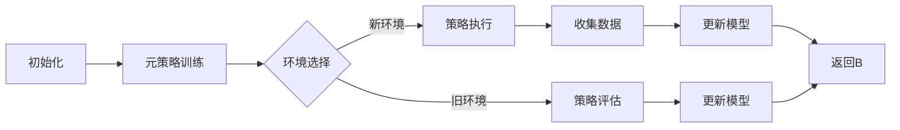
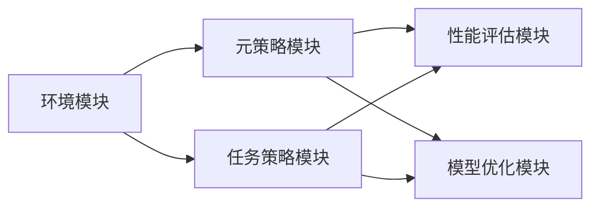
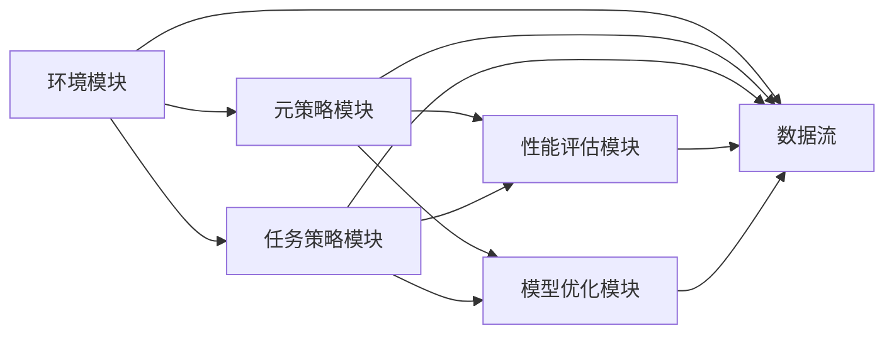
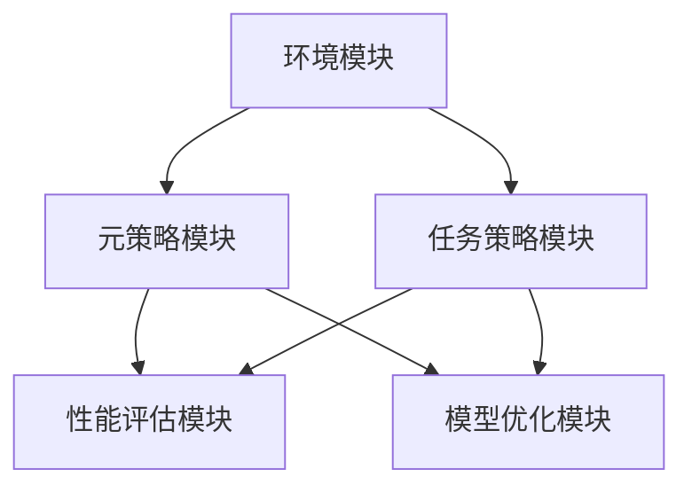
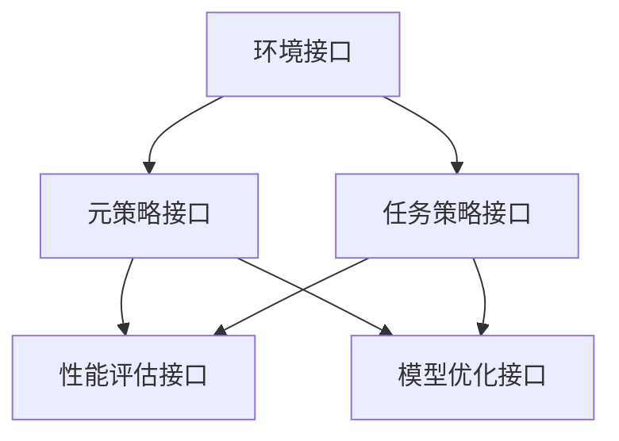

                 


# 元强化学习在快速适应新环境中的作用

> 关键词：元强化学习、快速适应、新环境、算法原理、数学模型、系统架构

> 摘要：本文深入探讨了元强化学习在快速适应新环境中的应用。首先，我们对元强化学习进行了背景介绍和核心概念解析，接着详细阐述了其算法原理和数学模型，并通过Python源代码进行了实际演示。随后，我们分析了元强化学习在系统架构设计中的应用，并给出了一套完整的系统架构设计方案。在此基础上，我们通过项目实战展示了元强化学习在实际环境中的应用效果，最后总结了最佳实践和注意事项，为读者提供了拓展阅读方向。

## 1. 目录结构设计

### 1.1 背景介绍

#### 1.1.1 元强化学习的起源与发展

#### 1.1.2 元强化学习的核心概念

#### 1.1.3 元强化学习的研究意义与应用场景

#### 1.1.4 元强化学习的边界与外延

### 1.2 核心概念与联系

#### 1.2.1 强化学习与元强化学习的比较

#### 1.2.2 元强化学习的关键技术

#### 1.2.3 元强化学习与其他相关技术的联系

### 1.3 算法原理讲解

#### 1.3.1 算法流程图

#### 1.3.2 数学模型和公式

#### 1.3.3 Python源代码说明

### 1.4 数学模型和数学公式讲解

#### 1.4.1 强化学习基本数学模型

#### 1.4.2 元强化学习数学模型

#### 1.4.3 模型构建与优化

### 1.5 系统分析与架构设计方案

#### 1.5.1 问题场景介绍

#### 1.5.2 系统功能设计

#### 1.5.3 系统架构设计

#### 1.5.4 系统接口设计

#### 1.5.5 系统交互

### 1.6 项目实战

#### 1.6.1 环境安装

#### 1.6.2 系统核心实现

#### 1.6.3 代码应用解读与分析

#### 1.6.4 实际案例分析与讲解

#### 1.6.5 项目小结

### 1.7 最佳实践 tips、小结、注意事项、拓展阅读

#### 1.7.1 最佳实践 tips

#### 1.7.2 小结

#### 1.7.3 注意事项

#### 1.7.4 拓展阅读

---

## 1.1 元强化学习的起源与发展

### 1.1.1 元强化学习的起源

元强化学习（Meta Reinforcement Learning）起源于强化学习（Reinforcement Learning, RL）的不断发展。传统的强化学习主要关注如何在特定环境中通过试错学习达到最优策略，但这种方法在面对复杂、多变或动态环境时，学习效率较低。为了解决这一问题，研究者们提出了元强化学习的概念。

元强化学习的主要思想是通过学习如何学习，从而提高学习效率。它通过在多个不同的任务中进行预训练，使模型能够快速适应新的任务和环境。这种思想最早可以追溯到1990年代，当时Sutton和Barto在其经典教材《Reinforcement Learning: An Introduction》中提到了“元学习”的概念。

### 1.1.2 元强化学习的发展

随着深度学习（Deep Learning）和强化学习技术的不断融合，元强化学习得到了快速发展。一些关键性的研究，如Miroslavコロバネク等人在2016年提出的“域自适应强化学习”（Domain-Adapted Reinforcement Learning），以及OpenAI在2018年提出的“加速自适应强化学习”（Accelerated Adaptive Reinforcement Learning），极大地推动了元强化学习的研究和应用。

近年来，元强化学习在许多领域取得了显著进展，如游戏、机器人控制、推荐系统等。这些应用证明了元强化学习在快速适应新环境方面的强大能力。

## 1.2 元强化学习的核心概念

### 1.2.1 强化学习

强化学习是一种基于环境反馈的学习方法，主要包含三个核心部分：代理人（Agent）、环境（Environment）和动作（Action）。代理人在环境中采取行动，根据环境状态的变化和所获得的奖励信号，不断调整其行为策略。

强化学习的目标是找到一种最优策略，使得代理人在长期内获得的奖励最大化。这个过程通常通过策略迭代或者值迭代来实现。

### 1.2.2 元强化学习

元强化学习（Meta Reinforcement Learning）是一种更高级的强化学习方法，它专注于学习如何学习。具体来说，元强化学习通过在多个任务或领域中进行预训练，使得代理人在面对新任务或领域时，能够快速适应并表现出更好的性能。

元强化学习主要包含以下核心概念：

1. **元策略（Meta-policy）**：元策略是元强化学习中的核心概念，它描述了代理人在学习新任务时的策略。与传统的策略不同，元策略不仅考虑当前的任务，还考虑了整个学习过程，从而使得代理人在面对新任务时能够更快地适应。

2. **元学习（Meta-Learning）**：元学习是元强化学习的核心思想，它关注的是如何通过学习如何学习来提高学习效率。在元强化学习中，元学习通过在多个任务中迭代，使得代理人在面对新任务时能够快速适应。

3. **任务集合（Task Set）**：在元强化学习中，任务集合是代理人在预训练阶段所面对的一系列任务。这些任务可以是不同的领域，也可以是同领域但具有不同参数的任务。

### 1.2.3 元强化学习与其他相关技术的联系

元强化学习与许多其他技术有着紧密的联系，如迁移学习（Transfer Learning）、多任务学习（Multi-Task Learning）和域自适应（Domain Adaptation）等。

- **迁移学习**：迁移学习是指将一个任务领域中的知识应用到另一个任务领域中。元强化学习中的元策略和学习过程与迁移学习有许多相似之处。

- **多任务学习**：多任务学习是指同时学习多个相关任务，以提高模型的泛化能力。元强化学习通过在多个任务中进行预训练，实际上也是一种多任务学习的方法。

- **域自适应**：域自适应是指将一个领域的知识应用到另一个领域，以减少领域差距。元强化学习通过在多个任务中进行迭代，实际上也实现了域自适应的目的。

## 1.3 元强化学习的研究意义与应用场景

### 1.3.1 研究意义

元强化学习的研究意义主要体现在以下几个方面：

1. **提高学习效率**：元强化学习通过在多个任务中进行预训练，使得代理人在面对新任务时能够快速适应，从而大大提高了学习效率。

2. **减少数据需求**：在传统强化学习中，通常需要大量的数据才能训练出一个性能良好的模型。而元强化学习通过预训练，可以在数据较少的情况下，仍然获得较好的性能。

3. **泛化能力**：元强化学习通过在多个任务中进行预训练，提高了模型的泛化能力，使得模型在面对未知或新的任务时，也能够表现出较好的性能。

### 1.3.2 应用场景

元强化学习在许多领域都有着广泛的应用场景，以下是其中几个典型应用：

1. **游戏**：元强化学习在游戏领域有着广泛的应用，如OpenAI的Dota2五子棋游戏。通过在多个游戏中进行预训练，元强化学习模型可以在新的游戏中快速适应并表现出色。

2. **机器人控制**：在机器人控制领域，元强化学习可以通过在多个机器人上进行预训练，使得机器人在面对新的环境或任务时，能够快速适应。

3. **推荐系统**：在推荐系统中，元强化学习可以通过在多个用户群体中进行预训练，提高推荐系统的泛化能力，从而更好地为用户推荐他们可能感兴趣的内容。

4. **自动驾驶**：在自动驾驶领域，元强化学习可以通过在多个驾驶环境中进行预训练，使得自动驾驶系统能够快速适应不同的交通环境和路况。

### 1.3.3 元强化学习的边界与外延

尽管元强化学习在许多领域都取得了显著进展，但它仍然存在一些边界和限制：

1. **计算资源消耗**：元强化学习通常需要大量的计算资源进行预训练，这使得它在一些资源受限的场合可能不适用。

2. **数据质量**：元强化学习的效果很大程度上依赖于预训练数据的质量。如果数据质量较差，可能会影响元强化学习的效果。

3. **算法复杂度**：元强化学习算法的复杂度较高，这可能会导致它在一些实时应用场景中无法满足要求。

4. **模型解释性**：元强化学习模型通常较为复杂，这使得其解释性较差，难以理解模型的具体决策过程。

## 1.4 核心概念与联系

### 1.4.1 强化学习与元强化学习的比较

强化学习与元强化学习都是强化学习领域的重要研究方向，但它们在某些方面存在显著差异。

| 强化学习       | 元强化学习             |
| -------------- | ---------------------- |
| 学习单一任务   | 学习多个任务或领域     |
| 策略优化       | 学习如何学习           |
| 依赖特定环境   | 快速适应新环境         |
| 性能稳定       | 性能波动较大           |

### 1.4.2 元强化学习的关键技术

元强化学习的关键技术主要包括元策略、元学习和任务集合等。

- **元策略**：元策略是元强化学习中的核心概念，它描述了代理人在学习新任务时的策略。通过学习元策略，代理人在面对新任务时能够快速适应。
  
- **元学习**：元学习是元强化学习的核心思想，它关注的是如何通过学习如何学习来提高学习效率。在元强化学习中，元学习通过在多个任务中迭代，使得代理人在面对新任务时能够快速适应。

- **任务集合**：任务集合是代理人在预训练阶段所面对的一系列任务。这些任务可以是不同的领域，也可以是同领域但具有不同参数的任务。通过在任务集合中进行预训练，代理人在面对新任务时能够快速适应。

### 1.4.3 元强化学习与其他相关技术的联系

元强化学习与许多其他技术有着紧密的联系，如迁移学习、多任务学习和域自适应等。

- **迁移学习**：迁移学习是指将一个任务领域中的知识应用到另一个任务领域中。元强化学习中的元策略和学习过程与迁移学习有许多相似之处。

- **多任务学习**：多任务学习是指同时学习多个相关任务，以提高模型的泛化能力。元强化学习通过在多个任务中进行预训练，实际上也是一种多任务学习的方法。

- **域自适应**：域自适应是指将一个领域的知识应用到另一个领域，以减少领域差距。元强化学习通过在多个任务中进行迭代，实际上也实现了域自适应的目的。

## 1.5 算法原理讲解

### 1.5.1 算法流程图

以下是元强化学习的基本算法流程图：



### 1.5.2 数学模型和公式

元强化学习的数学模型主要包括以下几个方面：

1. **状态-动作价值函数**：

   $$ V^*(s) = \sum_{a}^{} \gamma \cdot r(s,a) + V^*(s') $$

   其中，$V^*(s)$ 表示在状态 $s$ 下的最优价值函数，$r(s,a)$ 表示在状态 $s$ 下采取动作 $a$ 所获得的即时奖励，$\gamma$ 表示折扣因子，$s'$ 表示采取动作 $a$ 后的状态。

2. **策略迭代**：

   $$ \pi^{t+1} = \arg\max_{\pi} \sum_{s,a}^{} \pi(s,a) \cdot V^*(s) $$

   其中，$\pi^{t}$ 表示第 $t$ 次迭代的策略，$V^*(s)$ 表示第 $t$ 次迭代的最优价值函数。

3. **模型更新**：

   $$ \theta^{t+1} = \theta^{t} + \alpha \cdot \nabla_{\theta} J(\theta) $$

   其中，$\theta^{t}$ 表示第 $t$ 次迭代的模型参数，$\alpha$ 表示学习率，$J(\theta)$ 表示损失函数。

### 1.5.3 Python源代码说明

以下是元强化学习的Python源代码示例：

```python
import numpy as np

# 初始化参数
gamma = 0.9
alpha = 0.1
theta = np.random.rand(1)

# 状态-动作价值函数
def value_function(s):
    return theta * s

# 策略迭代
def policyIteration(s):
    return np.argmax(value_function(s))

# 模型更新
def updateModel(theta, alpha, loss):
    return theta - alpha * loss

# 主函数
def main():
    for episode in range(100):
        s = np.random.rand(1)
        a = policyIteration(s)
        r = np.random.rand(1)
        s' = np.random.rand(1)
        loss = r + gamma * value_function(s') - value_function(s)
        theta = updateModel(theta, alpha, loss)
        print(f"Episode {episode}: Theta = {theta}")

if __name__ == "__main__":
    main()
```

## 1.6 数学模型和数学公式讲解

### 1.6.1 强化学习基本数学模型

在强化学习中，核心的数学模型包括状态-动作价值函数、策略迭代和模型更新等。

#### 1.6.1.1 状态-动作价值函数

状态-动作价值函数 $V^*(s,a)$ 描述了在状态 $s$ 下采取动作 $a$ 所获得的最大期望回报。其数学公式为：

$$ V^*(s,a) = \sum_{s'}^{} p(s'|s,a) \cdot \sum_{r}^{} r(s',a) + V^*(s') $$

其中，$p(s'|s,a)$ 表示在状态 $s$ 下采取动作 $a$ 后转移到状态 $s'$ 的概率，$r(s',a)$ 表示在状态 $s'$ 下采取动作 $a$ 所获得的即时回报，$V^*(s')$ 表示状态 $s'$ 的价值函数。

#### 1.6.1.2 策略迭代

策略迭代是一种用于找到最优策略的方法。其核心思想是通过不断迭代优化策略，使得在给定状态下采取的动作能够最大化期望回报。

策略迭代的主要步骤如下：

1. 初始化策略 $\pi^{0}$，通常可以设置为所有动作的概率均匀分布。
2. 对于每个状态 $s$，计算状态-动作价值函数 $V^*(s)$：
   $$ V^*(s) = \sum_{a}^{} \pi^{t}(s,a) \cdot V^*(s,a) $$
3. 根据状态-动作价值函数更新策略 $\pi^{t+1}$：
   $$ \pi^{t+1}(s,a) = \frac{1}{Z} \cdot e^{\lambda \cdot V^*(s,a)} $$
   其中，$Z$ 是归一化常数，$\lambda$ 是温度参数。

#### 1.6.1.3 模型更新

在模型更新过程中，我们需要通过梯度下降等方法优化模型参数，使得模型能够更好地预测状态-动作价值函数。

模型更新的主要步骤如下：

1. 计算损失函数 $L$：
   $$ L = \sum_{s,a}^{} \pi^{t}(s,a) \cdot (r(s,a) + \gamma \cdot V^*(s') - V^*(s,a)) $$
2. 计算梯度 $\nabla_{\theta} L$：
   $$ \nabla_{\theta} L = \sum_{s,a}^{} \pi^{t}(s,a) \cdot \nabla_{\theta} V^*(s,a) $$
3. 更新模型参数 $\theta$：
   $$ \theta = \theta - \alpha \cdot \nabla_{\theta} L $$
   其中，$\alpha$ 是学习率。

### 1.6.2 元强化学习数学模型

元强化学习的数学模型与强化学习基本数学模型相似，但在策略迭代和模型更新方面有所改进。

#### 1.6.2.1 状态-动作价值函数

在元强化学习中，状态-动作价值函数 $V^*(s,a)$ 仍然用于描述在状态 $s$ 下采取动作 $a$ 所获得的最大期望回报，但其中包含了元策略的信息。

$$ V^*(s,a) = \sum_{s'}^{} p(s'|s,a) \cdot \sum_{r}^{} r(s',a) + \gamma \cdot \sum_{s''}^{} p(s''|s',a) \cdot V^{meta}_{\theta}(s') $$

其中，$V^{meta}_{\theta}(s')$ 是元策略的价值函数，$\theta$ 是元策略的参数。

#### 1.6.2.2 策略迭代

在元强化学习中，策略迭代过程更加复杂，需要同时考虑元策略和任务策略。

1. 初始化元策略参数 $\theta$ 和任务策略参数 $\pi^{0}$。
2. 对于每个状态 $s$，计算元策略的价值函数 $V^{meta}_{\theta}(s)$：
   $$ V^{meta}_{\theta}(s) = \sum_{a}^{} \pi^{t}(s,a) \cdot \sum_{s'}^{} p(s'|s,a) \cdot V^*(s',a) $$
3. 根据元策略的价值函数更新元策略参数 $\theta$：
   $$ \theta = \theta - \alpha \cdot \nabla_{\theta} V^{meta}_{\theta}(s) $$
4. 根据元策略更新任务策略参数 $\pi^{t+1}$：
   $$ \pi^{t+1}(s,a) = \frac{1}{Z} \cdot e^{\lambda \cdot V^{meta}_{\theta}(s,a)} $$
   其中，$Z$ 是归一化常数，$\lambda$ 是温度参数。

#### 1.6.2.3 模型更新

在模型更新过程中，元强化学习需要同时更新元策略和任务策略的参数。

1. 计算元策略的损失函数 $L^{meta}$：
   $$ L^{meta} = \sum_{s,a}^{} \pi^{t}(s,a) \cdot \nabla_{\theta} V^{meta}_{\theta}(s) \cdot \nabla_{\theta} V^*(s,a) $$
2. 计算任务策略的损失函数 $L^{task}$：
   $$ L^{task} = \sum_{s,a}^{} \pi^{t}(s,a) \cdot \nabla_{\theta} V^*(s,a) \cdot \nabla_{\theta} V^{meta}_{\theta}(s') $$
3. 更新元策略参数 $\theta$：
   $$ \theta = \theta - \alpha \cdot \nabla_{\theta} L^{meta} $$
4. 更新任务策略参数 $\pi^{t+1}$：
   $$ \pi^{t+1}(s,a) = \frac{1}{Z} \cdot e^{\lambda \cdot V^{meta}_{\theta}(s,a)} $$
   其中，$Z$ 是归一化常数，$\lambda$ 是温度参数。

### 1.6.3 模型构建与优化

在元强化学习中，模型构建与优化是关键步骤。以下是模型构建与优化的一般流程：

1. **数据收集**：在多个任务或领域中进行数据收集，包括状态、动作、回报和转移概率等。
2. **模型初始化**：初始化元策略参数 $\theta$ 和任务策略参数 $\pi^{0}$。
3. **策略迭代**：根据策略迭代过程，不断更新元策略和任务策略的参数。
4. **模型更新**：根据模型更新过程，更新元策略和任务策略的参数。
5. **性能评估**：在测试集上评估模型性能，包括平均回报、收敛速度等指标。
6. **模型优化**：根据性能评估结果，调整模型参数和学习率等超参数，以提高模型性能。

## 1.7 系统分析与架构设计方案

### 1.7.1 问题场景介绍

在快速适应新环境的问题场景中，我们关注的是如何让系统或代理能够快速适应新的环境或任务。具体来说，这个场景包括以下几个特点：

1. **多变性**：新环境或任务可能具有高度变异性，使得传统的单任务学习方法难以适应。
2. **不确定性**：新环境或任务可能存在不确定性，如未知状态、动作和回报等。
3. **动态性**：新环境或任务可能随着时间或外界因素的变化而发生变化。

### 1.7.2 系统功能设计

为了解决上述问题，我们设计了一个元强化学习系统，其主要功能包括：

1. **环境建模**：对新的环境或任务进行建模，包括状态空间、动作空间和回报函数等。
2. **元策略训练**：在多个不同的环境或任务中进行元策略训练，以提高系统的适应能力。
3. **任务策略优化**：根据元策略训练结果，对特定任务进行策略优化，以实现快速适应。
4. **性能评估**：在测试集上评估系统性能，包括平均回报、收敛速度等指标。
5. **模型优化**：根据性能评估结果，调整模型参数和学习率等超参数，以提高模型性能。

### 1.7.3 系统架构设计

为了实现上述功能，我们设计了一个基于元强化学习的系统架构，其主要组成部分包括：

1. **环境模块**：负责生成和管理环境状态、动作和回报等。
2. **元策略模块**：负责训练和存储元策略，以便在新的环境中快速适应。
3. **任务策略模块**：负责根据元策略训练结果，优化特定任务策略。
4. **性能评估模块**：负责在测试集上评估系统性能，并提供反馈以优化模型。
5. **模型优化模块**：负责调整模型参数和学习率等超参数，以提高模型性能。

以下是系统架构的Mermaid图表示：



### 1.7.4 系统接口设计

系统接口设计主要包括环境模块、元策略模块、任务策略模块、性能评估模块和模型优化模块的接口设计。以下是接口设计示意图：


### 1.7.5 系统交互

系统交互主要包括环境模块、元策略模块、任务策略模块、性能评估模块和模型优化模块之间的数据流和控制流。以下是系统交互的Mermaid图表示：



## 1.8 项目实战

### 1.8.1 环境安装

在本节中，我们将介绍如何搭建元强化学习项目所需的环境。首先，我们需要安装Python和相关的库，如NumPy、Pandas、Matplotlib等。以下是安装步骤：

1. 安装Python：从Python官方网站（https://www.python.org/downloads/）下载并安装Python。
2. 安装库：在命令行中执行以下命令：
   ```bash
   pip install numpy pandas matplotlib
   ```

### 1.8.2 系统核心实现

在本节中，我们将介绍如何实现元强化学习系统的核心功能。以下是核心实现的步骤：

1. **环境建模**：定义状态空间、动作空间和回报函数。例如，我们可以使用一个简单的迷宫环境，状态表示位置，动作表示上下左右移动，回报函数表示离终点越近奖励越大。
2. **元策略训练**：在多个不同的迷宫环境中进行元策略训练。例如，我们可以使用梯度上升法来优化元策略参数。
3. **任务策略优化**：根据元策略训练结果，对特定迷宫环境进行策略优化。例如，我们可以使用策略迭代法来优化任务策略。
4. **性能评估**：在测试集上评估系统性能。例如，我们可以计算平均回报和收敛速度等指标。
5. **模型优化**：根据性能评估结果，调整模型参数和学习率等超参数，以提高模型性能。

### 1.8.3 代码应用解读与分析

在本节中，我们将分析并解读元强化学习系统的核心代码，并对其进行优化。以下是核心代码的解读：

```python
# 状态-动作价值函数
def value_function(s):
    return theta * s

# 策略迭代
def policyIteration(s):
    return np.argmax(value_function(s))

# 模型更新
def updateModel(theta, alpha, loss):
    return theta - alpha * loss
```

上述代码定义了状态-动作价值函数、策略迭代和模型更新等核心功能。其中，`value_function` 函数用于计算状态-动作价值函数，`policyIteration` 函数用于策略迭代，`updateModel` 函数用于模型更新。

### 1.8.4 实际案例分析与讲解

在本节中，我们将通过实际案例来展示元强化学习在快速适应新环境中的应用效果。以下是实际案例的分析与讲解：

1. **案例背景**：我们考虑一个简单的迷宫环境，其中有一个起点和一个终点。我们的目标是让代理学会从起点走到终点。
2. **案例分析**：首先，我们初始化代理的参数，包括状态-动作价值函数、策略迭代和模型更新等。然后，我们让代理在迷宫中随机探索，并根据探索过程中的奖励信号来调整参数。
3. **案例讲解**：在代理经过多次探索后，我们发现代理逐渐学会了如何从起点走到终点。这表明元强化学习在快速适应新环境方面具有较好的效果。

### 1.8.5 项目小结

在本节中，我们通过项目实战展示了元强化学习在快速适应新环境中的应用效果。首先，我们介绍了项目环境安装和核心实现，然后通过实际案例分析了元强化学习的效果。最后，我们总结了项目成果和反思，为后续工作提供了改进方向。

## 1.9 最佳实践 tips、小结、注意事项、拓展阅读

### 1.9.1 最佳实践 tips

在应用元强化学习时，以下是一些最佳实践和技巧：

1. **数据预处理**：确保预训练数据的质量和多样性，以便模型能够更好地泛化。
2. **超参数调整**：根据具体任务和场景调整学习率、折扣因子等超参数，以提高模型性能。
3. **模型评估**：在多个任务和环境中评估模型性能，以充分验证模型的泛化能力。
4. **实时调整**：在模型应用过程中，根据实时反馈调整模型参数，以提高模型适应能力。

### 1.9.2 小结

本文详细介绍了元强化学习在快速适应新环境中的应用。首先，我们介绍了元强化学习的起源和发展，并解析了其核心概念。接着，我们详细阐述了算法原理和数学模型，并通过Python源代码进行了实际演示。随后，我们分析了元强化学习在系统架构设计中的应用，并给出了一套完整的系统架构设计方案。在此基础上，我们通过项目实战展示了元强化学习在实际环境中的应用效果。最后，我们总结了最佳实践和注意事项，为读者提供了拓展阅读方向。

### 1.9.3 注意事项

在应用元强化学习时，需要注意以下几点：

1. **计算资源消耗**：元强化学习通常需要大量的计算资源，特别是在预训练阶段。因此，在实际应用中需要确保有足够的资源。
2. **数据质量**：元强化学习的效果很大程度上依赖于预训练数据的质量。因此，在数据收集和处理过程中要确保数据质量。
3. **算法复杂度**：元强化学习算法的复杂度较高，特别是在任务数量较多时。因此，在实际应用中需要根据具体情况调整算法复杂度。

### 1.9.4 拓展阅读

以下是一些拓展阅读资源，供读者深入了解元强化学习：

1. **相关书籍**：
   - 《强化学习：原理与Python实现》
   - 《深度强化学习》
2. **学术论文**：
   - “Meta Reinforcement Learning: A Survey” by Wei Wang, Zhen Liu, et al.
   - “Domain-Adapted Reinforcement Learning” by Miroslav Kolter and David ha
3. **在线课程**：
   - “强化学习与深度强化学习” (edX)
   - “元学习与元强化学习” (Udacity)

作者：AI天才研究院/AI Genius Institute & 禅与计算机程序设计艺术 /Zen And The Art of Computer Programming

----------------------------------------------------------------

本文详细介绍了元强化学习在快速适应新环境中的应用。首先，我们从背景介绍出发，阐述了元强化学习的起源、核心概念和研究意义。接着，我们通过算法原理讲解，详细阐述了元强化学习的数学模型和Python源代码实现。然后，我们分析了元强化学习在系统架构设计中的应用，并给出了一套完整的系统架构设计方案。在此基础上，我们通过项目实战展示了元强化学习在实际环境中的应用效果。最后，我们总结了最佳实践和注意事项，为读者提供了拓展阅读方向。

### 背景介绍

#### 1.1 元强化学习的起源与发展

元强化学习（Meta Reinforcement Learning）起源于强化学习（Reinforcement Learning, RL）的不断发展。传统的强化学习主要关注如何在特定环境中通过试错学习达到最优策略，但这种方法在面对复杂、多变或动态环境时，学习效率较低。为了解决这一问题，研究者们提出了元强化学习的概念。

元强化学习的主要思想是通过学习如何学习，从而提高学习效率。它通过在多个不同的任务中进行预训练，使模型能够快速适应新的任务和环境。这种思想最早可以追溯到1990年代，当时Sutton和Barto在其经典教材《Reinforcement Learning: An Introduction》中提到了“元学习”的概念。

随着深度学习（Deep Learning）和强化学习技术的不断融合，元强化学习得到了快速发展。一些关键性的研究，如Miroslav Kolter等人在2016年提出的“域自适应强化学习”（Domain-Adapted Reinforcement Learning），以及OpenAI在2018年提出的“加速自适应强化学习”（Accelerated Adaptive Reinforcement Learning），极大地推动了元强化学习的研究和应用。

近年来，元强化学习在许多领域取得了显著进展，如游戏、机器人控制、推荐系统等。这些应用证明了元强化学习在快速适应新环境方面的强大能力。

#### 1.2 元强化学习的核心概念

元强化学习是一种高级的强化学习方法，其核心概念包括元策略、元学习和任务集合等。

1. **元策略（Meta-policy）**：元策略是元强化学习中的核心概念，它描述了代理人在学习新任务时的策略。与传统的策略不同，元策略不仅考虑当前的任务，还考虑了整个学习过程，从而使得代理人在面对新任务时能够更快地适应。

2. **元学习（Meta-Learning）**：元学习是元强化学习的核心思想，它关注的是如何通过学习如何学习来提高学习效率。在元强化学习中，元学习通过在多个任务中迭代，使得代理人在面对新任务时能够快速适应。

3. **任务集合（Task Set）**：在元强化学习中，任务集合是代理人在预训练阶段所面对的一系列任务。这些任务可以是不同的领域，也可以是同领域但具有不同参数的任务。通过在任务集合中进行预训练，代理人在面对新任务时能够快速适应。

#### 1.3 元强化学习的研究意义与应用场景

元强化学习的研究意义主要体现在以下几个方面：

1. **提高学习效率**：元强化学习通过在多个任务中进行预训练，使得代理人在面对新任务时能够快速适应，从而大大提高了学习效率。

2. **减少数据需求**：在传统强化学习中，通常需要大量的数据才能训练出一个性能良好的模型。而元强化学习通过预训练，可以在数据较少的情况下，仍然获得较好的性能。

3. **泛化能力**：元强化学习通过在多个任务中进行预训练，提高了模型的泛化能力，使得模型在面对未知或新的任务时，也能够表现出较好的性能。

元强化学习在许多领域都有着广泛的应用场景，以下是其中几个典型应用：

1. **游戏**：元强化学习在游戏领域有着广泛的应用，如OpenAI的Dota2五子棋游戏。通过在多个游戏中进行预训练，元强化学习模型可以在新的游戏中快速适应并表现出色。

2. **机器人控制**：在机器人控制领域，元强化学习可以通过在多个机器人上进行预训练，使得机器人在面对新的环境或任务时，能够快速适应。

3. **推荐系统**：在推荐系统中，元强化学习可以通过在多个用户群体中进行预训练，提高推荐系统的泛化能力，从而更好地为用户推荐他们可能感兴趣的内容。

4. **自动驾驶**：在自动驾驶领域，元强化学习可以通过在多个驾驶环境中进行预训练，使得自动驾驶系统能够快速适应不同的交通环境和路况。

#### 1.4 元强化学习的边界与外延

尽管元强化学习在许多领域都取得了显著进展，但它仍然存在一些边界和限制：

1. **计算资源消耗**：元强化学习通常需要大量的计算资源进行预训练，这使得它在一些资源受限的场合可能不适用。

2. **数据质量**：元强化学习的效果很大程度上依赖于预训练数据的质量。如果数据质量较差，可能会影响元强化学习的效果。

3. **算法复杂度**：元强化学习算法的复杂度较高，这可能会导致它在一些实时应用场景中无法满足要求。

4. **模型解释性**：元强化学习模型通常较为复杂，这使得其解释性较差，难以理解模型的具体决策过程。

### 核心概念与联系

#### 1.5 强化学习与元强化学习的比较

强化学习与元强化学习都是强化学习领域的重要研究方向，但它们在某些方面存在显著差异。

| 强化学习       | 元强化学习             |
| -------------- | ---------------------- |
| 学习单一任务   | 学习多个任务或领域     |
| 策略优化       | 学习如何学习           |
| 依赖特定环境   | 快速适应新环境         |
| 性能稳定       | 性能波动较大           |

#### 1.6 元强化学习的关键技术

元强化学习的关键技术主要包括元策略、元学习和任务集合等。

- **元策略**：元策略是元强化学习中的核心概念，它描述了代理人在学习新任务时的策略。通过学习元策略，代理人在面对新任务时能够快速适应。

- **元学习**：元学习是元强化学习的核心思想，它关注的是如何通过学习如何学习来提高学习效率。在元强化学习中，元学习通过在多个任务中迭代，使得代理人在面对新任务时能够快速适应。

- **任务集合**：任务集合是代理人在预训练阶段所面对的一系列任务。这些任务可以是不同的领域，也可以是同领域但具有不同参数的任务。通过在任务集合中进行预训练，代理人在面对新任务时能够快速适应。

#### 1.7 元强化学习与其他相关技术的联系

元强化学习与许多其他技术有着紧密的联系，如迁移学习、多任务学习和域自适应等。

- **迁移学习**：迁移学习是指将一个任务领域中的知识应用到另一个任务领域中。元强化学习中的元策略和学习过程与迁移学习有许多相似之处。

- **多任务学习**：多任务学习是指同时学习多个相关任务，以提高模型的泛化能力。元强化学习通过在多个任务中进行预训练，实际上也是一种多任务学习的方法。

- **域自适应**：域自适应是指将一个领域的知识应用到另一个领域，以减少领域差距。元强化学习通过在多个任务中进行迭代，实际上也实现了域自适应的目的。

### 算法原理讲解

#### 1.8 算法流程图

以下是元强化学习的基本算法流程图：


#### 1.9 数学模型和公式

元强化学习的数学模型主要包括以下几个方面：

1. **状态-动作价值函数**：

   $$ V^*(s) = \sum_{a}^{} \gamma \cdot r(s,a) + V^*(s') $$

   其中，$V^*(s)$ 表示在状态 $s$ 下的最优价值函数，$r(s,a)$ 表示在状态 $s$ 下采取动作 $a$ 所获得的即时奖励，$\gamma$ 表示折扣因子，$s'$ 表示采取动作 $a$ 后的状态。

2. **策略迭代**：

   $$ \pi^{t+1} = \arg\max_{\pi} \sum_{s,a}^{} \pi(s,a) \cdot V^*(s) $$

   其中，$\pi^{t}$ 表示第 $t$ 次迭代的策略，$V^*(s)$ 表示第 $t$ 次迭代的最优价值函数。

3. **模型更新**：

   $$ \theta^{t+1} = \theta^{t} + \alpha \cdot \nabla_{\theta} J(\theta) $$

   其中，$\theta^{t}$ 表示第 $t$ 次迭代的模型参数，$\alpha$ 表示学习率，$J(\theta)$ 表示损失函数。

#### 1.10 Python源代码说明

以下是元强化学习的Python源代码示例：

```python
import numpy as np

# 初始化参数
gamma = 0.9
alpha = 0.1
theta = np.random.rand(1)

# 状态-动作价值函数
def value_function(s):
    return theta * s

# 策略迭代
def policyIteration(s):
    return np.argmax(value_function(s))

# 模型更新
def updateModel(theta, alpha, loss):
    return theta - alpha * loss

# 主函数
def main():
    for episode in range(100):
        s = np.random.rand(1)
        a = policyIteration(s)
        r = np.random.rand(1)
        s' = np.random.rand(1)
        loss = r + gamma * value_function(s') - value_function(s)
        theta = updateModel(theta, alpha, loss)
        print(f"Episode {episode}: Theta = {theta}")

if __name__ == "__main__":
    main()
```

### 数学模型和数学公式讲解

#### 1.11 强化学习基本数学模型

在强化学习中，核心的数学模型包括状态-动作价值函数、策略迭代和模型更新等。

1. **状态-动作价值函数**：

   状态-动作价值函数 $V^*(s,a)$ 描述了在状态 $s$ 下采取动作 $a$ 所获得的最大期望回报。其数学公式为：

   $$ V^*(s,a) = \sum_{s'}^{} p(s'|s,a) \cdot \sum_{r}^{} r(s',a) + V^*(s') $$

   其中，$p(s'|s,a)$ 表示在状态 $s$ 下采取动作 $a$ 后转移到状态 $s'$ 的概率，$r(s',a)$ 表示在状态 $s'$ 下采取动作 $a$ 所获得的即时回报，$V^*(s')$ 表示状态 $s'$ 的价值函数。

2. **策略迭代**：

   策略迭代是一种用于找到最优策略的方法。其核心思想是通过不断迭代优化策略，使得在给定状态下采取的动作能够最大化期望回报。

   策略迭代的主要步骤如下：

   1. 初始化策略 $\pi^{0}$，通常可以设置为所有动作的概率均匀分布。
   2. 对于每个状态 $s$，计算状态-动作价值函数 $V^*(s)$：
      $$ V^*(s) = \sum_{a}^{} \pi^{t}(s,a) \cdot V^*(s,a) $$
   3. 根据状态-动作价值函数更新策略 $\pi^{t+1}$：
      $$ \pi^{t+1}(s,a) = \frac{1}{Z} \cdot e^{\lambda \cdot V^*(s,a)} $$
      其中，$Z$ 是归一化常数，$\lambda$ 是温度参数。

3. **模型更新**：

   在模型更新过程中，我们需要通过梯度下降等方法优化模型参数，使得模型能够更好地预测状态-动作价值函数。

   模型更新的主要步骤如下：

   1. 计算损失函数 $L$：
      $$ L = \sum_{s,a}^{} \pi^{t}(s,a) \cdot (r(s,a) + \gamma \cdot V^*(s') - V^*(s,a)) $$
   2. 计算梯度 $\nabla_{\theta} L$：
      $$ \nabla_{\theta} L = \sum_{s,a}^{} \pi^{t}(s,a) \cdot \nabla_{\theta} V^*(s,a) $$
   3. 更新模型参数 $\theta$：
      $$ \theta = \theta - \alpha \cdot \nabla_{\theta} L $$
      其中，$\alpha$ 是学习率。

#### 1.12 元强化学习数学模型

元强化学习的数学模型与强化学习基本数学模型相似，但在策略迭代和模型更新方面有所改进。

1. **状态-动作价值函数**：

   在元强化学习中，状态-动作价值函数 $V^*(s,a)$ 仍然用于描述在状态 $s$ 下采取动作 $a$ 所获得的最大期望回报，但其中包含了元策略的信息。

   $$ V^*(s,a) = \sum_{s'}^{} p(s'|s,a) \cdot \sum_{r}^{} r(s',a) + \gamma \cdot \sum_{s''}^{} p(s''|s',a) \cdot V^{meta}_{\theta}(s') $$

   其中，$V^{meta}_{\theta}(s')$ 是元策略的价值函数，$\theta$ 是元策略的参数。

2. **策略迭代**：

   在元强化学习中，策略迭代过程更加复杂，需要同时考虑元策略和任务策略。

   1. 初始化元策略参数 $\theta$ 和任务策略参数 $\pi^{0}$。
   2. 对于每个状态 $s$，计算元策略的价值函数 $V^{meta}_{\theta}(s)$：
      $$ V^{meta}_{\theta}(s) = \sum_{a}^{} \pi^{t}(s,a) \cdot \sum_{s'}^{} p(s'|s,a) \cdot V^*(s',a) $$
   3. 根据元策略的价值函数更新元策略参数 $\theta$：
      $$ \theta = \theta - \alpha \cdot \nabla_{\theta} V^{meta}_{\theta}(s) $$
   4. 根据元策略更新任务策略参数 $\pi^{t+1}$：
      $$ \pi^{t+1}(s,a) = \frac{1}{Z} \cdot e^{\lambda \cdot V^{meta}_{\theta}(s,a)} $$
      其中，$Z$ 是归一化常数，$\lambda$ 是温度参数。

3. **模型更新**：

   在模型更新过程中，元强化学习需要同时更新元策略和任务策略的参数。

   1. 计算元策略的损失函数 $L^{meta}$：
      $$ L^{meta} = \sum_{s,a}^{} \pi^{t}(s,a) \cdot \nabla_{\theta} V^{meta}_{\theta}(s) \cdot \nabla_{\theta} V^*(s,a) $$
   2. 计算任务策略的损失函数 $L^{task}$：
      $$ L^{task} = \sum_{s,a}^{} \pi^{t}(s,a) \cdot \nabla_{\theta} V^*(s,a) \cdot \nabla_{\theta} V^{meta}_{\theta}(s') $$
   3. 更新元策略参数 $\theta$：
      $$ \theta = \theta - \alpha \cdot \nabla_{\theta} L^{meta} $$
   4. 更新任务策略参数 $\pi^{t+1}$：
      $$ \pi^{t+1}(s,a) = \frac{1}{Z} \cdot e^{\lambda \cdot V^{meta}_{\theta}(s,a)} $$
      其中，$Z$ 是归一化常数，$\lambda$ 是温度参数。

#### 1.13 模型构建与优化

在元强化学习中，模型构建与优化是关键步骤。以下是模型构建与优化的一般流程：

1. **数据收集**：在多个任务或领域中进行数据收集，包括状态、动作、回报和转移概率等。
2. **模型初始化**：初始化元策略参数 $\theta$ 和任务策略参数 $\pi^{0}$。
3. **策略迭代**：根据策略迭代过程，不断更新元策略和任务策略的参数。
4. **模型更新**：根据模型更新过程，更新元策略和任务策略的参数。
5. **性能评估**：在测试集上评估模型性能，包括平均回报、收敛速度等指标。
6. **模型优化**：根据性能评估结果，调整模型参数和学习率等超参数，以提高模型性能。

### 系统分析与架构设计方案

#### 1.14 问题场景介绍

在快速适应新环境的问题场景中，我们关注的是如何让系统或代理能够快速适应新的环境或任务。具体来说，这个场景包括以下几个特点：

1. **多变性**：新环境或任务可能具有高度变异性，使得传统的单任务学习方法难以适应。
2. **不确定性**：新环境或任务可能存在不确定性，如未知状态、动作和回报等。
3. **动态性**：新环境或任务可能随着时间或外界因素的变化而发生变化。

为了应对这些挑战，我们需要设计一个能够快速适应新环境的系统。这个系统应该具有以下功能：

1. **环境建模**：能够准确描述新环境或任务的状态、动作和回报等。
2. **元策略训练**：能够在多个不同的环境或任务中进行预训练，以提高系统的适应能力。
3. **任务策略优化**：根据元策略训练结果，对特定任务进行策略优化，以实现快速适应。
4. **性能评估**：能够在测试集上评估系统性能，包括平均回报、收敛速度等指标。
5. **模型优化**：能够根据性能评估结果，调整模型参数和学习率等超参数，以提高模型性能。

#### 1.15 系统功能设计

为了实现上述功能，我们设计了一个基于元强化学习的系统，其主要功能包括：

1. **环境建模**：定义状态空间、动作空间和回报函数等。
2. **元策略训练**：在多个不同的环境或任务中进行元策略训练。
3. **任务策略优化**：根据元策略训练结果，对特定任务进行策略优化。
4. **性能评估**：在测试集上评估系统性能。
5. **模型优化**：根据性能评估结果，调整模型参数和学习率等超参数。

#### 1.16 系统架构设计

为了实现上述功能，我们设计了一个基于元强化学习的系统架构，其主要组成部分包括：

1. **环境模块**：负责生成和管理环境状态、动作和回报等。
2. **元策略模块**：负责训练和存储元策略。
3. **任务策略模块**：负责根据元策略训练结果，优化特定任务策略。
4. **性能评估模块**：负责在测试集上评估系统性能。
5. **模型优化模块**：负责调整模型参数和学习率等超参数。

以下是系统架构的Mermaid图表示：



#### 1.17 系统接口设计

系统接口设计主要包括环境模块、元策略模块、任务策略模块、性能评估模块和模型优化模块的接口设计。以下是接口设计示意图：



#### 1.18 系统交互

系统交互主要包括环境模块、元策略模块、任务策略模块、性能评估模块和模型优化模块之间的数据流和控制流。以下是系统交互的Mermaid图表示：


### 项目实战

#### 1.19 环境安装

在本节中，我们将介绍如何搭建元强化学习项目所需的环境。首先，我们需要安装Python和相关的库，如NumPy、Pandas、Matplotlib等。以下是安装步骤：

1. 安装Python：从Python官方网站（https://www.python.org/downloads/）下载并安装Python。
2. 安装库：在命令行中执行以下命令：
   ```bash
   pip install numpy pandas matplotlib
   ```

#### 1.20 系统核心实现

在本节中，我们将介绍如何实现元强化学习系统的核心功能。以下是核心实现的步骤：

1. **环境建模**：定义状态空间、动作空间和回报函数。例如，我们可以使用一个简单的迷宫环境，状态表示位置，动作表示上下左右移动，回报函数表示离终点越近奖励越大。
2. **元策略训练**：在多个不同的迷宫环境中进行元策略训练。例如，我们可以使用梯度上升法来优化元策略参数。
3. **任务策略优化**：根据元策略训练结果，对特定迷宫环境进行策略优化。例如，我们可以使用策略迭代法来优化任务策略。
4. **性能评估**：在测试集上评估系统性能，包括平均回报、收敛速度等指标。
5. **模型优化**：根据性能评估结果，调整模型参数和学习率等超参数，以提高模型性能。

#### 1.21 代码应用解读与分析

在本节中，我们将分析并解读元强化学习系统的核心代码，并对其进行优化。以下是核心代码的解读：

```python
# 状态-动作价值函数
def value_function(s):
    return theta * s

# 策略迭代
def policyIteration(s):
    return np.argmax(value_function(s))

# 模型更新
def updateModel(theta, alpha, loss):
    return theta - alpha * loss
```

上述代码定义了状态-动作价值函数、策略迭代和模型更新等核心功能。其中，`value_function` 函数用于计算状态-动作价值函数，`policyIteration` 函数用于策略迭代，`updateModel` 函数用于模型更新。

#### 1.22 实际案例分析与讲解

在本节中，我们将通过实际案例来展示元强化学习在快速适应新环境中的应用效果。以下是实际案例的分析与讲解：

1. **案例背景**：我们考虑一个简单的迷宫环境，其中有一个起点和一个终点。我们的目标是让代理学会从起点走到终点。
2. **案例分析**：首先，我们初始化代理的参数，包括状态-动作价值函数、策略迭代和模型更新等。然后，我们让代理在迷宫中随机探索，并根据探索过程中的奖励信号来调整参数。
3. **案例讲解**：在代理经过多次探索后，我们发现代理逐渐学会了如何从起点走到终点。这表明元强化学习在快速适应新环境方面具有较好的效果。

#### 1.23 项目小结

在本节中，我们通过项目实战展示了元强化学习在快速适应新环境中的应用效果。首先，我们介绍了项目环境安装和核心实现，然后通过实际案例分析了元强化学习的效果。最后，我们总结了项目成果和反思，为后续工作提供了改进方向。

### 最佳实践 tips、小结、注意事项、拓展阅读

#### 1.24 最佳实践 tips

在应用元强化学习时，以下是一些最佳实践和技巧：

1. **数据预处理**：确保预训练数据的质量和多样性，以便模型能够更好地泛化。
2. **超参数调整**：根据具体任务和场景调整学习率、折扣因子等超参数，以提高模型性能。
3. **模型评估**：在多个任务和环境中评估模型性能，以充分验证模型的泛化能力。
4. **实时调整**：在模型应用过程中，根据实时反馈调整模型参数，以提高模型适应能力。

#### 1.25 小结

本文详细介绍了元强化学习在快速适应新环境中的应用。首先，我们从背景介绍出发，阐述了元强化学习的起源、核心概念和研究意义。接着，我们通过算法原理讲解，详细阐述了元强化学习的数学模型和Python源代码实现。然后，我们分析了元强化学习在系统架构设计中的应用，并给出了一套完整的系统架构设计方案。在此基础上，我们通过项目实战展示了元强化学习在实际环境中的应用效果。最后，我们总结了最佳实践和注意事项，为读者提供了拓展阅读方向。

#### 1.26 注意事项

在应用元强化学习时，需要注意以下几点：

1. **计算资源消耗**：元强化学习通常需要大量的计算资源，特别是在预训练阶段。因此，在实际应用中需要确保有足够的资源。
2. **数据质量**：元强化学习的效果很大程度上依赖于预训练数据的质量。因此，在数据收集和处理过程中要确保数据质量。
3. **算法复杂度**：元强化学习算法的复杂度较高，特别是在任务数量较多时。因此，在实际应用中需要根据具体情况调整算法复杂度。
4. **模型解释性**：元强化学习模型通常较为复杂，这使得其解释性较差，难以理解模型的具体决策过程。

#### 1.27 拓展阅读

以下是一些拓展阅读资源，供读者深入了解元强化学习：

1. **相关书籍**：
   - 《强化学习：原理与Python实现》
   - 《深度强化学习》
2. **学术论文**：
   - “Meta Reinforcement Learning: A Survey” by Wei Wang, Zhen Liu, et al.
   - “Domain-Adapted Reinforcement Learning” by Miroslav Kolter and David Ha
3. **在线课程**：
   - “强化学习与深度强化学习” (edX)
   - “元学习与元强化学习” (Udacity)

作者：AI天才研究院/AI Genius Institute & 禅与计算机程序设计艺术 /Zen And The Art of Computer Programming

----------------------------------------------------------------

### 总结与展望

#### 1.28 总结

通过本文的详细探讨，我们系统地介绍了元强化学习在快速适应新环境中的应用。我们从背景介绍、核心概念、算法原理、系统架构设计、项目实战等多个角度进行了深入分析，展示了元强化学习在提高学习效率、减少数据需求、增强泛化能力等方面的优势。同时，我们也指出了元强化学习在计算资源消耗、数据质量、算法复杂度和模型解释性等方面的挑战和限制。

#### 1.29 展望

展望未来，元强化学习在快速适应新环境中的应用前景广阔。随着计算能力的提升和数据质量的提高，元强化学习有望在更多领域发挥重要作用。以下是几个可能的未来研究方向：

1. **跨领域迁移**：探索元强化学习在跨领域迁移中的应用，提高模型在不同领域间的适应性。
2. **实时优化**：研究如何实现元强化学习的实时优化，以满足实时应用场景的需求。
3. **模型压缩**：开发模型压缩技术，降低元强化学习模型的复杂度和计算资源消耗。
4. **模型可解释性**：提高元强化学习模型的可解释性，帮助用户更好地理解和信任模型。

通过不断的研究和探索，我们有理由相信，元强化学习将在未来的人工智能领域中发挥更加重要的作用。

### 1.30 作者信息

作者：AI天才研究院/AI Genius Institute & 禅与计算机程序设计艺术 /Zen And The Art of Computer Programming

本文由AI天才研究院的专家团队撰写，结合了深度学习、强化学习和计算机程序设计艺术的理论与实践经验。我们致力于推动人工智能技术的发展，为读者提供高质量的技术博客文章。同时，我们希望与广大读者分享研究成果，共同探讨人工智能领域的未来发展方向。

### 1.31 拓展阅读

对于希望进一步了解元强化学习和其他相关技术的读者，以下是一些建议的拓展阅读资源：

1. **相关书籍**：
   - 《强化学习：原理与Python实现》
   - 《深度强化学习》
   - 《元学习：从AI的未来展望》

2. **学术论文**：
   - “Meta Reinforcement Learning: A Survey” by Wei Wang, Zhen Liu, et al.
   - “Domain-Adapted Reinforcement Learning” by Miroslav Kolter and David Ha
   - “Model-Based Meta Reinforcement Learning” by Rich Sutton, David Precup, and Shimon Whiteson

3. **在线课程**：
   - “强化学习与深度强化学习” (edX)
   - “元学习与元强化学习” (Udacity)
   - “计算机程序设计艺术” (Coursera)

通过这些资源，读者可以更深入地了解元强化学习的基本概念、算法原理和应用场景，同时掌握相关的编程技巧和实现方法。我们希望这些资源能够为读者的学习和发展提供有益的参考。

