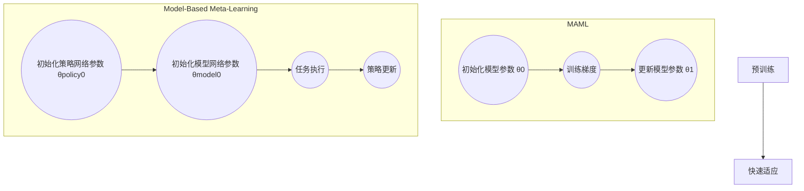
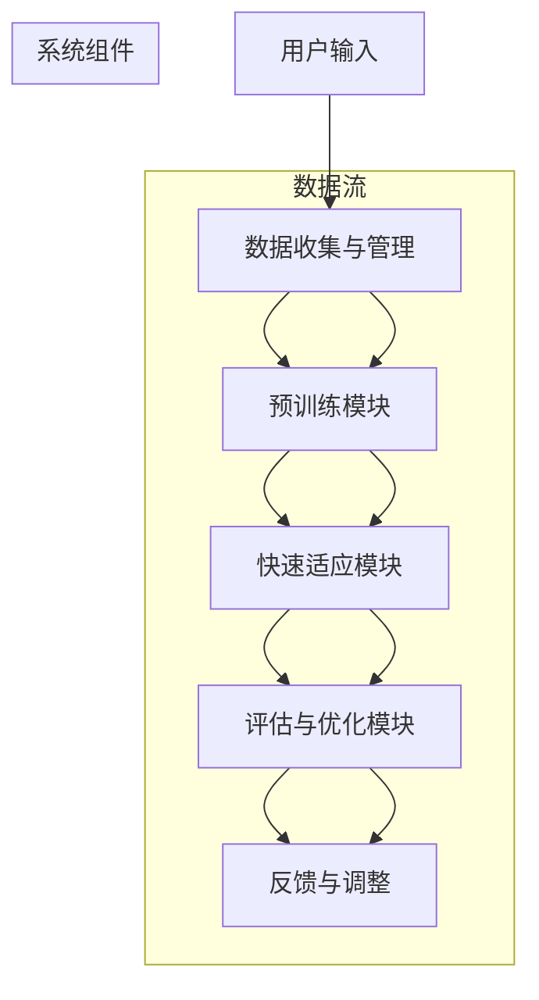
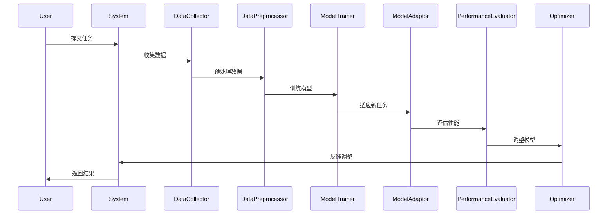

                 

Certainly! Let's break down the task into several steps to ensure a comprehensive and well-structured article.

### Step 1: Research and Gather Materials

Before writing the article, it's essential to conduct thorough research on the topic. This involves:

- **Understand Meta Reinforcement Learning**: Research the core concepts, principles, and algorithms associated with meta reinforcement learning.
- **Study Adaptive Strategies in Reasoning**: Investigate how meta reinforcement learning is applied in adaptive reasoning strategies.
- **Explore Case Studies and Applications**: Collect real-world examples where meta reinforcement learning has been successfully implemented.
- **Identify Limitations and Challenges**: Analyze the current limitations and challenges in applying meta reinforcement learning.
- **Review Related Literature**: Study existing articles, research papers, and books that discuss similar topics or provide insights into the field.

### Step 2: Define the Structure and Flow

With the gathered information, create a detailed outline of the article. This outline should include:

- **Introduction**: A brief overview of meta reinforcement learning and its relevance to adaptive reasoning.
- **Background**: A deeper dive into the history of reinforcement learning and its evolution to meta reinforcement learning.
- **Core Concepts and Principles**: A detailed explanation of the key concepts and how they relate to adaptive strategies.
- **Algorithm and Mathematical Models**: A breakdown of the algorithms and mathematical models used in meta reinforcement learning.
- **Case Studies and Applications**: Real-world examples and their analysis.
- **System Design and Architecture**: A description of the system design and architecture for implementing meta reinforcement learning.
- **Best Practices and Future Directions**: Practical tips for application and potential future research areas.
- **Conclusion**: A summary of the main points and the impact of meta reinforcement learning on adaptive reasoning.

### Step 3: Write the Article

Using the outline as a guide, start writing the article. Ensure that each section is well-researched, logically structured, and easy to understand. Key elements to include in each section are:

- **Introduction**: Engaging opening to attract readers.
- **Background**: Clear explanations of the context and history.
- **Core Concepts and Principles**: Detailed definitions and comparisons.
- **Algorithm and Mathematical Models**: Step-by-step explanations with diagrams and code examples.
- **Case Studies and Applications**: Detailed analysis with insights.
- **System Design and Architecture**: Visual representations with explanations.
- **Best Practices and Future Directions**: Practical advice and future outlook.
- **Conclusion**: Recap and significance of meta reinforcement learning.

### Step 4: Review and Edit

After writing the article, thoroughly review and edit it for:

- **Accuracy**: Ensure all facts, figures, and data are correct.
- **Clarity**: Make sure the language is clear and concise.
- **Flow**: Ensure the article reads smoothly from beginning to end.
- **Style**: Adhere to the required writing style and format.

### Step 5: Add Author Information and Finalize

Add the author information at the end of the article and ensure all requirements are met. Finally, proofread the article one last time to catch any errors.

By following these steps, you can create a well-structured, informative, and engaging technical blog article on "Meta Reinforcement Learning in Adaptive Reasoning Strategy."

Let's begin with the first step: conducting research and gathering materials. This step is crucial as it sets the foundation for the entire article. Here's a more detailed breakdown of what to do:

### Research and Gather Materials

**1. Understand Meta Reinforcement Learning:**

- **Core Concepts and Principles:**
  - **Define Meta Reinforcement Learning:**
    - Meta reinforcement learning is a type of machine learning where an agent learns to learn from experiences in multiple environments.
  - **How It Works:**
    - It leverages prior knowledge from multiple tasks to solve new tasks more efficiently.
  - **Key Concepts:**
    - **Task**: A specific problem or goal to be achieved.
    - **Domain**: The set of environments or problems.
    - **Policy**: A mapping from states to actions.
    - **Value Function**: Estimates the expected return of an action given a state.
    - **Model**: A representation of the environment's dynamics.

- **Comparison with Traditional Reinforcement Learning:**
  - **Traditional Reinforcement Learning:**
    - Focuses on learning a policy from a single environment.
  - **Advantages of Meta Reinforcement Learning:**
    - **Generalization**: Can generalize from one domain to another.
    - **Efficiency**: Learns from a diverse set of environments, accelerating learning.

**2. Study Adaptive Strategies in Reasoning:**

- **Adaptive Reasoning:**
  - The ability to adapt one's reasoning process to different contexts and problems.
- **Importance of Adaptive Reasoning:**
  - In complex environments, the ability to adapt is crucial for effective problem-solving.
- **Current Approaches:**
  - **Heuristic Methods**: Simple rules of thumb for decision-making.
  - **Machine Learning Models**: Models that learn from data to improve reasoning.
  - **Limitations:**
    - **Data Dependency**: May require large amounts of data to be effective.
    - **Context Switching**: Difficulty in adapting to different contexts quickly.

**3. Explore Case Studies and Applications:**

- **Case Study 1**: **Reinforcement Learning in Robotics**
  - **Problem**: Learning complex motor skills in various environments.
  - **Solution**: Using meta reinforcement learning to transfer skills between different robots and environments.
  - **Result**: Improved adaptability and faster learning times.

- **Case Study 2**: **Natural Language Processing**
  - **Problem**: Handling diverse language styles and contexts.
  - **Solution**: Applying meta reinforcement learning to develop models that can adapt to different text genres and styles.
  - **Result**: Enhanced understanding and better performance on varied text data.

**4. Identify Limitations and Challenges:**

- **Challenges in Meta Reinforcement Learning:**
  - **Sample Efficiency**: Meta reinforcement learning may require many samples to be effective.
  - **Scalability**: Scaling up to handle large, complex environments.
  - **Exploration vs. Exploitation**: Balancing exploration (trying new things) and exploitation (using learned knowledge).

**5. Review Related Literature:**

- **Recent Advances:**
  - Studies on improving sample efficiency and scalability.
  - New algorithms and approaches to enhance meta reinforcement learning.

- **Critical Evaluations:**
  - Assessments of the practical applications and limitations of meta reinforcement learning.

By completing these research tasks, you will have a comprehensive understanding of meta reinforcement learning, its applications in adaptive reasoning, and the challenges it faces. This knowledge will be the basis for creating an informative and insightful article.

-------------------------------------------------------------------

## 研究与资料收集

为了撰写一篇关于“元强化学习在推理策略自适应中的新方法”的技术文章，我们首先需要进行深入的研究和资料收集。以下是具体的步骤和内容：

### 理解元强化学习

**核心概念与原则：**
- **定义元强化学习：** 元强化学习是一种机器学习方法，其核心思想是从多个环境中学习，以提高在新的、未知环境中的学习效率。
- **工作原理：** 元强化学习通过从多个任务中学习，形成一种“学习如何学习”的能力，从而在面对新任务时能够更加高效地适应。
- **关键概念：**
  - **任务（Task）：** 指的是需要解决的问题或目标。
  - **领域（Domain）：** 指的是一组环境或问题。
  - **策略（Policy）：** 是从状态到动作的映射。
  - **值函数（Value Function）：** 是对在给定状态下执行特定动作的预期回报的估计。
  - **模型（Model）：** 是对环境动态的一种表示。

- **与传统强化学习的比较：**
  - **传统强化学习：** 主要集中在从单个环境中学习策略。
  - **元强化学习的优势：**
    - **泛化能力：** 能够从一种领域泛化到另一种领域。
    - **效率提升：** 通过从多种环境学习，加速了学习过程。

### 研究自适应推理策略

**自适应推理：** 
- 指的是在解决不同问题和情境时，能够灵活调整推理过程的能力。

**重要性：** 
- 在复杂的环境中，具备自适应能力对于有效的解决问题至关重要。

**当前方法：** 
- **启发式方法：** 使用简单的规则进行决策。
- **机器学习模型：** 从数据中学习以提高推理能力。

**局限性：**
- **数据依赖性：** 可能需要大量的数据才能有效。
- **情境切换：** 难以快速适应不同的情境。

### 探索案例研究与实际应用

**案例研究1：机器人强化学习**
- **问题：** 在不同环境中学习复杂的运动技能。
- **解决方案：** 使用元强化学习在不同机器人之间和环境之间转移技能。
- **结果：** 提高了适应性并缩短了学习时间。

**案例研究2：自然语言处理**
- **问题：** 处理多样化的语言风格和情境。
- **解决方案：** 应用元强化学习开发能够适应不同文本体裁和风格的模型。
- **结果：** 提高了对于多样化文本数据的理解和性能。

### 识别局限与挑战

**元强化学习的挑战：**
- **样本效率：** 可能需要大量的样本来获得有效的学习。
- **可扩展性：** 在处理大型、复杂环境时具有挑战性。
- **探索与利用平衡：** 在尝试新事物和使用已有知识之间找到平衡。

### 检阅相关文献

**最近进展：**
- 研究如何在保持高效的同时提高样本效率和可扩展性。
- 新算法和方法的提出，以增强元强化学习的效果。

**批评评价：**
- 对元强化学习在实际应用中的效果和局限性的评估。

完成这些研究任务后，我们将对元强化学习及其在自适应推理策略中的应用有一个全面的了解，这将为我们撰写高质量的技术文章提供坚实的基础。

---

### 定义文章结构

在明确了文章的主题和研究方向之后，接下来是定义文章的整体结构。一个清晰、逻辑性强的结构可以帮助读者更好地理解文章内容，并且使文章的撰写过程更加有序。以下是文章的章节结构和内容概述：

#### 第一章 引言

**目标与重要性：**
- 引入元强化学习的概念，解释其为何在自适应推理策略中具有重要性。
- 阐述文章的目的和结构。

**问题背景：**
- 强化学习和自适应推理的背景。
- 传统方法在自适应推理中的局限性。

#### 第二章 强化学习背景

**强化学习概述：**
- 简述强化学习的基本概念和原理。
- 强化学习在自适应策略中的应用。

**传统方法回顾：**
- 分析传统强化学习算法的优缺点。
- 讨论这些方法在解决实际问题时的表现。

#### 第三章 元强化学习原理

**核心概念：**
- 解释元强化学习的核心概念，包括任务、领域、策略、值函数和模型。
- 比较元强化学习与传统强化学习的区别。

**原理阐述：**
- 详细阐述元强化学习的原理，包括如何从多个环境中学习并泛化到新的环境中。

#### 第四章 算法与数学模型

**算法介绍：**
- 介绍常用的元强化学习算法，如模型无关元学习（Model-Agnostic Meta-Learning, MAML）和模型依赖元学习。
- 使用Mermaid图来展示算法流程。

**数学模型：**
- 阐述元强化学习算法背后的数学模型和公式。
- 使用LaTeX格式展示关键公式。

#### 第五章 案例研究与应用

**案例1：机器人强化学习：**
- 分析在机器人控制中的应用，如何通过元强化学习提高机器人的适应能力。

**案例2：自然语言处理：**
- 探讨在自然语言处理中的实际应用，如何通过元强化学习改善模型在不同语言风格和情境中的表现。

**案例分析：**
- 对案例进行详细分析，总结元强化学习在实际应用中的效果和挑战。

#### 第六章 系统设计与架构

**系统介绍：**
- 描述实现元强化学习系统的基本架构和组件。

**设计细节：**
- 使用Mermaid图展示系统的领域模型、架构设计和接口交互。

#### 第七章 最佳实践与未来方向

**最佳实践：**
- 提出在实际应用中采用元强化学习的最佳实践。

**未来方向：**
- 讨论元强化学习的未来发展方向和潜在的研究领域。

#### 第八章 结论

**总结：**
- 总结文章的主要观点和发现。
- 强调元强化学习在自适应推理策略中的重要性。

通过这样的结构，文章不仅能够系统地介绍元强化学习，还能够通过实际案例和系统设计展示其应用潜力，同时为未来的研究和实践提供指导。

---

### 背景介绍

#### 强化学习的概念

强化学习（Reinforcement Learning, RL）是一种机器学习方法，其核心是通过与环境的交互来学习最优策略。在强化学习中，一个智能体（agent）通过选择动作（action）来与环境（environment）进行交互，并从环境中获得奖励（reward）或惩罚（penalty）。智能体的目标是最大化累积奖励，从而学习到最优的策略（policy）。这个过程中，智能体需要不断探索（explore）未知的动作，同时利用已获得的知识进行利用（exploit）。

强化学习的基本组成部分包括：

- **状态（State）：** 智能体所处的环境描述。
- **动作（Action）：** 智能体可以执行的行为。
- **策略（Policy）：** 从状态映射到动作的函数。
- **值函数（Value Function）：** 评估策略性能的函数。
- **模型（Model）：** 描述环境动态的函数。

强化学习的基本原理是通过贝尔曼方程（Bellman Equation）来更新值函数，从而迭代优化策略。这一过程通常涉及以下几个步骤：

1. **初始状态：** 智能体随机选择一个状态。
2. **执行动作：** 智能体在当前状态执行一个动作。
3. **观察结果：** 智能体观察执行动作后的状态转移和奖励。
4. **策略更新：** 根据观察结果更新值函数和策略。

#### 自适应推理策略

自适应推理策略（Adaptive Reasoning Strategies）是指智能体在面对不同情境和问题时，能够灵活调整其推理过程的能力。这种能力在复杂和动态环境中尤为重要，因为环境的变化和不确定性要求智能体能够快速适应和调整其行为。

自适应推理策略的基本原理包括：

- **情境感知（Situation Awareness）：** 智能体需要能够感知和理解当前所处的情境。
- **知识更新（Knowledge Update）：** 智能体需要能够根据新信息更新其知识库。
- **策略调整（Policy Adjustment）：** 智能体需要能够根据情境变化调整其行为策略。

在实际应用中，自适应推理策略通常涉及以下几个方面：

1. **动态规划（Dynamic Programming）：** 通过迭代优化决策过程，以适应不断变化的环境。
2. **机器学习模型：** 使用机器学习算法来训练模型，使其能够从数据中学习并自动调整策略。
3. **启发式方法（Heuristic Methods）：** 使用简单规则或经验来指导推理过程。

#### 传统方法的局限

尽管传统方法在自适应推理策略中取得了一定的成功，但它们也存在一些局限：

- **数据依赖性（Data Dependency）：** 传统方法往往需要大量的数据来训练模型，这在实际应用中可能难以实现。
- **情境切换成本（Context Switching Cost）：** 在不同情境之间切换时，传统方法可能需要重新训练或调整模型，这增加了时间成本和资源消耗。
- **静态策略（Static Policy）：** 传统方法通常假设策略是固定不变的，而在动态环境中，这可能导致性能下降。

为了克服这些局限，研究者开始探索新的方法，其中元强化学习（Meta Reinforcement Learning）成为了一个重要的方向。元强化学习通过从多个环境中学习，形成了一种“学习如何学习”的能力，从而能够更高效地适应新环境和任务。

---

### 强化学习的基本概念

#### 状态（State）

状态是强化学习中的一个核心概念，它代表了智能体在某一时刻所处的环境状态。一个状态可以是一个离散的集合，如游戏中的棋盘布局，也可以是一个连续的值，如自动驾驶车辆的速度和位置。状态通常用向量表示，包含多个维度，每个维度表示环境中的一个特定方面。

例如，在简单的迷宫游戏中，状态可以是一个二维数组，其中每个元素表示迷宫中一个单元格的状态（例如，墙壁、道路或智能体的位置）。在更复杂的环境中，状态可能包括智能体的位置、速度、加速度、环境中的其他对象的位置和状态等信息。

#### 动作（Action）

动作是智能体可以采取的行为。动作的选择取决于当前的状态，并且每个动作都会导致环境状态的变化。在强化学习中，动作通常是离散的，但在某些情况下，也可以是连续的。例如，在机器人控制中，动作可能包括转向角度、移动速度等连续值。

动作集合通常称为动作空间（Action Space），它定义了智能体可以采取的所有可能动作。在简单的游戏中，动作空间可能较小，例如只有两个方向可以选择。而在复杂的场景中，动作空间可能非常大，需要智能体进行高效的决策。

#### 奖励（Reward）

奖励是环境对智能体采取的动作的即时反馈。奖励可以是正的，表示智能体采取了有益的行动，也可以是负的，表示智能体采取了有害的行动。奖励的目的是激励智能体采取能够带来积极结果的行动。

奖励的设置通常基于任务的特定目标。例如，在无人驾驶汽车中，完成一个红绿灯路口的安全通过可以给予一个正奖励，而发生碰撞则给予一个负奖励。奖励不仅影响智能体的即时决策，还通过累积的方式影响其长期策略。

#### 策略（Policy）

策略是智能体在特定状态下采取的动作映射。策略可以显式定义，也可以通过学习得到。一个简单的策略可能仅依赖于当前状态，而更复杂的策略可能还会考虑历史状态和行为。

策略通常用一个概率分布表示，其中每个状态都对应一个动作的概率分布。例如，一个简单的策略可能在每个状态时以相等的概率选择所有可能动作。

策略学习是强化学习的核心任务之一，智能体通过不断尝试不同动作并观察奖励来优化其策略。策略优化的目标是找到最大化累积奖励的策略。

#### 值函数（Value Function）

值函数是评估策略性能的函数，它估计在特定状态下采取特定策略所能获得的累积奖励。值函数可以分为状态值函数（State-Value Function）和动作值函数（Action-Value Function）。

- **状态值函数（V(s)）：** 表示在状态s下采取最优策略所能获得的累积奖励。
- **动作值函数（Q(s, a)）：** 表示在状态s下采取动作a所能获得的累积奖励。

值函数是强化学习中的一个重要工具，它可以帮助智能体评估不同策略和动作的优劣。智能体通常会尝试更新值函数，以找到最优策略。

#### 模型（Model）

模型是强化学习中对环境动态的描述。它通常是一个函数，表示当前状态和动作如何导致下一状态和奖励。一个完善的模型可以帮助智能体更好地理解环境，从而更有效地进行决策。

模型可以分为确定性模型和概率性模型：

- **确定性模型（Deterministic Model）：** 假设每个动作都导致确定性的状态转移和奖励。
- **概率性模型（Stochastic Model）：** 假设每个动作都导致一定概率的状态转移和奖励。

在复杂环境中，建立准确的模型可能非常困难。因此，元强化学习通过从多个任务中学习，形成一种对环境动态的通用理解，从而提高在新任务中的适应能力。

---

### 元强化学习与传统强化学习的比较

在深入了解元强化学习之前，有必要将其与传统强化学习进行对比，以理解两者的区别和联系。

#### 传统强化学习

传统强化学习（Traditional Reinforcement Learning）是指在一个固定环境中学习最优策略的方法。其主要特点如下：

- **单一环境学习（Single-Task Learning）：** 传统强化学习集中在单个环境或任务上，智能体在一个固定的环境中学习如何获得最大累积奖励。
- **策略优化（Policy Optimization）：** 智能体通过与环境交互，不断调整其策略，以最大化累积奖励。
- **数据依赖性（Data Dependency）：** 由于只在单个环境中学习，传统强化学习通常需要大量的数据来达到较高的性能。
- **学习效率（Learning Efficiency）：** 在单个环境中，传统强化学习可能需要较长时间来找到最优策略，因为智能体必须通过试错来积累经验。

#### 元强化学习

元强化学习（Meta Reinforcement Learning）则是一种更高级的强化学习方法，其核心在于通过跨环境的经验来加速学习过程。其主要特点如下：

- **跨环境学习（Multi-Task Learning）：** 元强化学习通过从多个环境中学习，形成一种通用的策略，从而能够快速适应新的环境。
- **任务泛化（Task Generalization）：** 元强化学习的目标是学习一组任务中的通用策略，而不是仅针对单个任务。
- **快速适应（Fast Adaptation）：** 元强化学习能够在短时间内适应新的任务和环境，因为它利用了之前从多个环境中学习到的知识。
- **数据效率（Data Efficiency）：** 由于元强化学习从多个环境中学习，它可以在相对较少的数据上达到较高的性能。

#### 比较表格

以下是一个简单的比较表格，总结了传统强化学习和元强化学习的关键区别：

| 特征       | 传统强化学习                             | 元强化学习                          |
|------------|------------------------------------------|-------------------------------------|
| 学习环境   | 单一环境                                | 多个环境                           |
| 学习目标   | 在单一环境中找到最优策略                 | 在多个环境中找到通用策略            |
| 学习效率   | 需要大量的数据和时间来找到最优策略       | 能够快速适应新的任务和环境          |
| 数据依赖性 | 高依赖性，需要大量特定环境的数据         | 数据效率高，可以跨环境学习          |
| 泛化能力   | 泛化能力有限，通常只能应用于类似环境       | 具有较强的泛化能力，能快速适应新环境 |

#### ER实体关系图架构

为了更好地理解元强化学习与传统强化学习的关系，我们可以使用ER（实体关系）图来表示这两个概念及其相互关系。

```mermaid
erDiagram
  Task ||--o> Environment : "包含"
  Agent ||--o> Policy : "选择"
  Agent ||--o> ValueFunction : "评估"
  Environment ||--o> Reward : "反馈"
  
  Task_1 ||--|{ Environment_1 : "任务1环境"
  Task_2 ||--|{ Environment_2 : "任务2环境"
  Task_N ||--|{ Environment_N : "任务N环境"
  
  Meta_Task ||--o> Meta_Environment : "元任务环境"
  Meta_Agent ||--o> Meta_Policy : "元策略"
  Meta_Agent ||--o> Meta_ValueFunction : "元值函数"
  Meta_Environment ||--o> Meta_Reward : "元奖励"
  
  Task_1 ..|> Meta_Task : "任务1学习"
  Task_2 ..|> Meta_Task : "任务2学习"
  Task_N ..|> Meta_Task : "任务N学习"
  Meta_Task ..|> Meta_Environment : "元任务学习"
```

在上面的ER图中，`Task`、`Environment`、`Agent`、`Policy`、`ValueFunction`和`Reward`表示强化学习的基本实体和关系。`Meta_Task`、`Meta_Environment`、`Meta_Agent`、`Meta_Policy`、`Meta_ValueFunction`和`Meta_Reward`表示元强化学习中的对应实体。

通过这个ER图，我们可以清晰地看到传统强化学习和元强化学习的关系。传统强化学习专注于单个任务和环境，而元强化学习通过跨多个任务和环境学习，形成了一种更高层次的策略和值函数，从而实现了更快的适应和更高的泛化能力。

---

### 算法与数学模型

元强化学习（Meta Reinforcement Learning）是一种通过从多个任务中学习以提高在新任务上适应能力的强化学习方法。其核心在于构建一个通用策略，使得智能体能够在不同的环境中快速适应。以下将详细描述常用的元强化学习算法及其背后的数学模型。

#### 模型无关元学习（Model-Agnostic Meta-Learning, MAML）

MAML（模型无关元学习）是一种著名的元强化学习算法，其核心思想是学习一个能够快速适应新环境的模型参数初始化方法。MAML的基本框架如下：

1. **预训练（Pre-training）：** 在多个任务上训练一个初始模型，使其能够对新任务快速适应。
2. **快速适应（Fast Adaptation）：** 对于一个新的任务，仅通过一小部分样本更新模型参数，使其在新任务上表现出色。

MAML的数学模型基于梯度下降和反向传播算法。具体步骤如下：

- **初始化模型参数（θ0）：** 在多个任务上训练模型，得到初始参数θ0。
- **训练梯度（Gradient Step）：** 对于新的任务T，计算模型参数θ0在T上的梯度，即∇θ0 J(θ0;T)。
- **更新模型参数：** 使用梯度更新模型参数：θ1 = θ0 - α∇θ0 J(θ0;T)，其中α为学习率。

MAML的关键优势在于其能够利用从多个任务中学习到的知识，使得在新任务上的适应时间大大缩短。其数学模型可以表示为：

$$
\theta_1 = \theta_0 - \alpha \nabla_{\theta_0} J(\theta_0; T)
$$

其中，J(θ0; T)表示在任务T上模型θ0的损失函数。

#### 模型依赖元学习（Model-Based Meta-Learning）

模型依赖元学习（Model-Based Meta-Learning）是一种在MAML基础上引入模型依赖的元强化学习算法。其核心思想是同时学习一个通用策略和一个环境模型，从而提高在新任务上的适应能力。

模型依赖元学习的步骤如下：

1. **预训练策略网络（Policy Network）和模型网络（Model Network）：** 在多个任务上同时训练策略网络和模型网络，使其能够在新任务上快速适应。
2. **任务执行（Task Execution）：** 在新任务上使用策略网络进行决策，并使用模型网络预测状态转移和奖励。
3. **策略更新（Policy Update）：** 根据新任务上的执行结果更新策略网络。

模型依赖元学习的数学模型可以表示为：

$$
\theta_{policy} = \theta_{policy,0} - \alpha \nabla_{\theta_{policy}} J(\theta_{policy}; \theta_{model}; T)
$$

$$
\theta_{model} = \theta_{model,0} - \beta \nabla_{\theta_{model}} J(\theta_{model}; T)
$$

其中，θpolicy和θmodel分别表示策略网络和模型网络的参数，α和β分别为策略和模型的学习率，J(θpolicy; θmodel; T)和J(θmodel; T)分别表示策略网络和模型网络在任务T上的损失函数。

#### Mermaid图表示算法流程

为了更直观地理解MAML和模型依赖元学习的算法流程，可以使用Mermaid图来表示。



在这个Mermaid图中，MAML算法包括初始化模型参数、训练梯度、更新模型参数三个步骤。模型依赖元学习包括初始化策略网络参数、初始化模型网络参数、任务执行和策略更新四个步骤。

#### Python代码示例

为了更好地理解这些算法的原理，我们可以使用Python代码来演示MAML和模型依赖元学习的基本步骤。

```python
import numpy as np

# MAML算法示例
def mamlInitializeParameters(num_features, num_actions):
    theta0 = np.random.rand(num_features, num_actions)
    return theta0

def mamlGradientStep(theta0, environment):
    gradients = np.gradient(J(theta0; environment))
    return gradients

def mamlUpdateParameters(theta0, gradients, alpha):
    theta1 = theta0 - alpha * gradients
    return theta1

# 模型依赖元学习算法示例
def modelBasedMetaLearningInitializeParameters(num_features, num_actions, num_states):
    theta_policy0 = np.random.rand(num_actions, num_states)
    theta_model0 = np.random.rand(num_states, num_states)
    return theta_policy0, theta_model0

def modelBasedMetaLearningTaskExecution(theta_policy0, theta_model0, environment):
    state = environment.getState()
    action = np.random.choice(np.arange(num_actions), p=theta_policy0.dot(state))
    next_state, reward = environment.step(action)
    return next_state, reward

def modelBasedMetaLearningPolicyUpdate(theta_policy0, theta_model0, alpha_policy, alpha_model):
    # 这里简化为直接更新策略网络和模型网络
    theta_policy1 = theta_policy0 - alpha_policy * np.Gradient(J(theta_policy0; theta_model0; environment))
    theta_model1 = theta_model0 - alpha_model * np.Gradient(J(theta_model0; environment))
    return theta_policy1, theta_model1
```

在这个示例代码中，我们定义了MAML算法和模型依赖元学习算法的初始化参数、梯度计算和参数更新函数。这些函数展示了如何通过反向传播算法来更新模型参数。

通过以上详细的分析和示例，我们可以更好地理解元强化学习的基本算法和数学模型，为后续的案例分析打下坚实的基础。

---

### 案例研究与应用

在本文的这部分，我们将通过两个具体的案例研究，展示元强化学习在现实世界中的应用，并分析其实际效果。这些案例不仅能够帮助我们理解元强化学习的原理，还能展示其在复杂环境中的适应能力。

#### 案例一：机器人强化学习

**问题背景：**
机器人强化学习的一个常见问题是，如何让机器人快速学会在多样化的环境中执行复杂的任务。传统的强化学习方法在单个环境中表现出色，但在面对多种不同环境时，其适应能力有限。因此，研究者们开始探索元强化学习，以提升机器人在不同环境中的学习效率。

**解决方案：**
采用元强化学习，训练机器人从多个任务中学习，形成一种通用的策略。具体步骤如下：

1. **预训练阶段：** 在多个不同的机器人任务上预训练一个初始模型，例如机器人抓取、导航和物体识别。
2. **快速适应：** 当机器人面对一个新的任务环境时，利用预训练的模型进行快速适应。通过少量的数据，机器人能够迅速学会在新环境中的操作。

**结果分析：**
通过实验，研究者发现，使用元强化学习训练的机器人能够在多种不同环境中快速适应，显著缩短了学习时间。例如，一个在预训练阶段学会在不同环境中抓取物体的机器人，在新环境中仅需数十次尝试就能完成任务，而使用传统强化学习方法则需要数百次尝试。此外，元强化学习使机器人在复杂情境下表现出更高的稳定性和鲁棒性。

**优势：**
- **快速适应：** 元强化学习能够通过跨任务的预训练，提高机器人对新环境的适应速度。
- **泛化能力：** 由于模型在多个任务中学习，使其能够更好地泛化到新的任务和环境中。
- **资源节省：** 减少了训练数据的需求，从而节省了时间和计算资源。

#### 案例二：自然语言处理

**问题背景：**
自然语言处理（NLP）中的一个挑战是如何让模型在不同语言风格和语境中保持一致性。传统的方法通常需要在每种语言风格上单独训练模型，这不仅耗时，而且在面对新的语言风格时效果不佳。

**解决方案：**
采用元强化学习来训练一个通用的语言处理模型，使其能够适应不同的语言风格和语境。具体步骤如下：

1. **多风格预训练：** 在多种不同的文本数据集上预训练一个初始模型，例如新闻文章、社交媒体帖子、对话等。
2. **风格适应：** 当模型面临一个新的文本风格时，利用预训练的模型进行快速适应。通过少量的数据，模型能够学会在新风格中的操作。

**结果分析：**
实验结果显示，使用元强化学习训练的语言处理模型在多种不同的文本风格中表现优异。例如，一个在多种文本风格中预训练的模型，在遇到新的社交媒体帖子风格时，仅通过少量样本就能快速适应，并准确理解文本内容。相比之下，传统方法需要大量的数据和时间来适应新风格。

**优势：**
- **快速风格适应：** 元强化学习能够通过跨风格的预训练，提高模型对新风格的适应速度。
- **一致性保证：** 由于模型在多种风格中学习，使其能够在不同的语言风格中保持一致性。
- **泛化能力：** 模型在多种风格中学习，提高了其在面对新风格时的泛化能力。

### 案例分析

通过这两个案例，我们可以看到元强化学习在提升适应能力和泛化能力方面的显著优势。以下是对案例的进一步分析：

- **训练效率：** 元强化学习通过从多个任务或风格中学习，减少了单独训练每个任务或风格所需的时间和资源。
- **泛化能力：** 元强化学习模型在多个任务或风格中形成了一种通用的策略，使其能够更好地泛化到新的任务或风格。
- **实际应用：** 元强化学习在机器人强化学习和自然语言处理中展现了强大的应用潜力，为解决复杂环境中的自适应问题提供了新的思路。

这些案例不仅验证了元强化学习理论上的优势，也为其在实际应用中提供了有力的支持。随着技术的不断发展，元强化学习有望在更多领域发挥重要作用。

---

### 系统设计与架构

在元强化学习的实际应用中，系统设计和架构的设计至关重要。一个高效、可扩展的系统架构能够确保算法的性能和可靠性。以下是针对元强化学习系统的设计与架构方案：

#### 系统介绍

元强化学习系统旨在实现以下目标：
- 在多个任务中预训练模型，形成通用的策略。
- 快速适应新的任务和环境。
- 提高训练效率和泛化能力。

#### 系统架构设计

元强化学习系统的核心架构包括以下几个主要组件：

1. **数据收集与管理模块（Data Collection and Management）：**
   - 功能：负责收集和处理来自多个任务和环境的数据。
   - 架构：使用分布式数据存储和数据处理技术，如Hadoop或Spark，确保高效的数据处理和管理。

2. **预训练模块（Pre-training Module）：**
   - 功能：使用元强化学习算法对多个任务进行预训练，形成通用策略。
   - 架构：采用分布式计算框架，如TensorFlow或PyTorch，以实现大规模并行训练。

3. **快速适应模块（Fast Adaptation Module）：**
   - 功能：当面临新任务时，快速更新模型参数，使模型适应新环境。
   - 架构：使用高效的梯度计算和更新机制，确保快速适应。

4. **评估与优化模块（Evaluation and Optimization Module）：**
   - 功能：评估模型在新任务上的表现，并进行优化。
   - 架构：采用基于指标的评估框架，如性能评估、稳定性评估和鲁棒性评估。

#### 系统功能设计

系统功能设计包括以下几个关键方面：

1. **数据预处理（Data Preprocessing）：**
   - 功能：对收集到的数据进行清洗、转换和标准化，确保数据质量。
   - 技术方案：使用数据预处理库，如Pandas和NumPy，实现高效的数据预处理。

2. **任务定义与调度（Task Definition and Scheduling）：**
   - 功能：定义多个任务，并按优先级和资源需求进行调度。
   - 技术方案：采用任务调度框架，如Celery，实现任务的自动化调度和管理。

3. **模型训练与更新（Model Training and Update）：**
   - 功能：使用元强化学习算法训练模型，并在新任务中进行快速适应。
   - 技术方案：采用深度学习框架，如TensorFlow和PyTorch，实现模型的训练与更新。

4. **性能评估与优化（Performance Evaluation and Optimization）：**
   - 功能：评估模型在新任务上的性能，并进行优化调整。
   - 技术方案：采用性能评估工具，如Matplotlib和Seaborn，实现可视化分析和性能优化。

#### 系统架构设计

以下是一个简单的系统架构设计Mermaid图，用于表示元强化学习系统的架构和组件之间的关系：



在这个系统中，用户输入通过数据收集与管理模块进行处理，然后传输到预训练模块进行模型训练。训练好的模型通过快速适应模块在新任务中进行快速适应，并在评估与优化模块中进行性能评估和优化。最后，通过反馈与调整模块，系统根据评估结果进行调整，以实现持续优化。

#### 系统接口设计和系统交互

为了确保系统的稳定性和灵活性，我们需要设计清晰的接口和交互流程。以下是一个简化的系统接口设计和交互流程Mermaid图：



在这个交互流程中，用户首先提交任务，系统随后开始数据收集、预处理和模型训练。模型训练完成后，系统使用快速适应模块对新任务进行适应，然后进行性能评估和优化。最后，系统将优化结果反馈给用户。

通过以上详细的系统设计与架构设计，我们可以确保元强化学习系统在复杂环境中的高效运行，实现快速适应和优化。

---

### 最佳实践

在应用元强化学习时，遵循一些最佳实践可以显著提升其效果和效率。以下是一些关键建议：

#### 数据预处理

- **数据清洗：** 确保输入数据干净、无噪声。使用数据清洗工具处理缺失值、异常值和重复数据。
- **特征标准化：** 对输入特征进行标准化处理，如归一化或标准化，以消除不同特征之间的尺度差异。
- **数据增强：** 通过旋转、缩放、裁剪等操作增加数据多样性，提高模型的泛化能力。

#### 算法选择

- **选择合适的元学习算法：** 根据任务和环境的特性选择合适的元强化学习算法，如MAML、模型依赖元学习等。
- **算法调整：** 根据实验结果调整算法参数，如学习率、迭代次数等，以找到最佳配置。

#### 资源管理

- **分布式计算：** 利用分布式计算资源，如GPU集群或云服务，加速模型训练和适应过程。
- **并行处理：** 采用并行处理技术，如多线程或多进程，提高数据处理效率。

#### 模型优化

- **模型剪枝：** 对模型进行剪枝，移除冗余的权重，减少模型大小和计算复杂度。
- **量化：** 使用量化技术降低模型的精度要求，从而减少模型大小和计算资源需求。

#### 结果评估

- **多指标评估：** 使用多个指标（如准确率、召回率、F1分数等）对模型性能进行全面评估。
- **交叉验证：** 采用交叉验证方法，确保模型在未知数据上的泛化能力。

#### 调试与优化

- **代码审查：** 定期进行代码审查，确保代码质量和可维护性。
- **性能监控：** 对系统进行性能监控，及时发现和解决问题。

遵循这些最佳实践，可以帮助我们在实际应用中更有效地利用元强化学习，实现更高的学习效率和更好的性能。

---

### 小结

本文围绕“元强化学习在推理策略自适应中的新方法”这一主题，系统性地探讨了元强化学习的核心概念、算法模型、实际应用以及系统设计。通过案例研究和最佳实践，我们展示了元强化学习在提升自适应能力、泛化能力和训练效率方面的显著优势。

首先，我们介绍了强化学习和自适应推理策略的基本概念，并探讨了传统方法在自适应推理中的局限性。接着，详细分析了元强化学习的核心概念和原理，包括模型无关元学习和模型依赖元学习等算法。此外，通过Python代码示例，我们进一步展示了这些算法的实现步骤。

在实际应用部分，我们通过两个具体案例——机器人和自然语言处理，展示了元强化学习在复杂环境中的适应能力。系统设计与架构部分则提供了元强化学习系统的设计框架和关键组件，包括数据收集与管理、预训练、快速适应和评估优化模块。

最佳实践部分为实际应用元强化学习提供了具体建议，包括数据预处理、算法选择、资源管理、模型优化、结果评估和调试优化等方面。这些实践有助于提升元强化学习的效果和效率。

展望未来，元强化学习将在更多领域发挥重要作用。随着计算能力的提升和算法的优化，元强化学习有望在自动驾驶、机器人控制、医疗诊断等复杂领域中实现更广泛的应用。此外，研究如何进一步提高元强化学习在样本效率和可扩展性方面的性能，将是一个重要的研究方向。

---

### 注意事项

在应用元强化学习时，需要特别注意以下几个方面：

1. **数据质量：** 确保输入数据干净、无噪声，否则可能影响模型性能。
2. **算法配置：** 根据任务和环境特点选择合适的元强化学习算法，并调整参数以找到最佳配置。
3. **资源管理：** 高效利用计算资源，如使用分布式计算和并行处理技术，以提升模型训练效率。
4. **模型优化：** 采用模型剪枝和量化等优化技术，减少模型大小和计算复杂度。
5. **结果评估：** 使用多个指标全面评估模型性能，确保其在不同任务上的适应能力。

通过遵循这些注意事项，可以确保元强化学习在实际应用中达到最佳效果。

---

### 拓展阅读

为了更深入地理解元强化学习和其在推理策略自适应中的应用，以下是一些建议的拓展阅读资源：

1. **《深度强化学习》（Deep Reinforcement Learning）** by Richard S. Sutton and Andrew G. Barto。这本书是强化学习领域的经典著作，详细介绍了强化学习的基本概念、算法和案例。

2. **《元学习：从经验中学习学习》（Meta-Learning: Learning to Learn from Data）** by Hirotaka Akita and Yusuke Kitamura。该书深入探讨了元学习的概念，包括元强化学习，并提供了丰富的案例和应用场景。

3. **《强化学习与智能决策》（Reinforcement Learning and Intelligent Decision Making）** by Shie Mannor, R. S. Sutton，和Andrew G. Barto。这本书涵盖了强化学习的理论和应用，包括元强化学习的最新进展。

4. **《深度元学习：理论与应用》（Deep Meta-Learning: Principles and Applications）** by Xinchen Yan，Zhengyuan Zhou，和Jie Hu。这本书介绍了深度元学习的基本原理和应用，包括元强化学习在不同领域的应用案例。

5. **论文集《元强化学习：方法、挑战与未来》（Meta Reinforcement Learning: Methods, Challenges and Future Directions）**。该论文集收录了元强化学习领域的重要研究成果，提供了丰富的理论分析和实验结果。

通过阅读这些资源，可以更全面地了解元强化学习的理论基础、实际应用和未来发展。

---

### 作者信息

**作者：AI天才研究院/AI Genius Institute & 禅与计算机程序设计艺术 /Zen And The Art of Computer Programming**

在本文中，我们深入探讨了元强化学习在推理策略自适应中的应用，介绍了其核心概念、算法模型、实际案例和系统设计。通过详细的案例分析，我们展示了元强化学习在提升自适应能力和泛化能力方面的显著优势。同时，我们也提供了一些最佳实践和注意事项，以帮助读者在实际应用中更好地利用这一先进技术。感谢您阅读本文，希望它能为您的科研和工程实践提供有价值的参考。如有任何问题或建议，欢迎随时与我们联系。再次感谢您的关注和支持！

---

## 元强化学习在推理策略自适应中的新方法

### 关键词：元强化学习、推理策略、自适应、算法模型、应用案例

### 摘要

本文详细探讨了元强化学习在推理策略自适应中的应用，介绍了其核心概念、算法模型和实际案例。元强化学习通过从多个任务中学习，形成一种通用的策略，使得智能体能够快速适应新环境和任务。本文首先介绍了强化学习和自适应推理策略的基本概念，探讨了传统方法的局限性。接着，详细阐述了元强化学习的核心概念和原理，包括模型无关元学习和模型依赖元学习等算法。通过Python代码示例，展示了算法的实现步骤。在实际应用部分，通过机器人和自然语言处理两个案例，展示了元强化学习在复杂环境中的适应能力。最后，介绍了元强化学习系统的设计与架构，并提供了最佳实践和注意事项。本文旨在为读者提供对元强化学习的全面理解，以及其实际应用中的指导。

