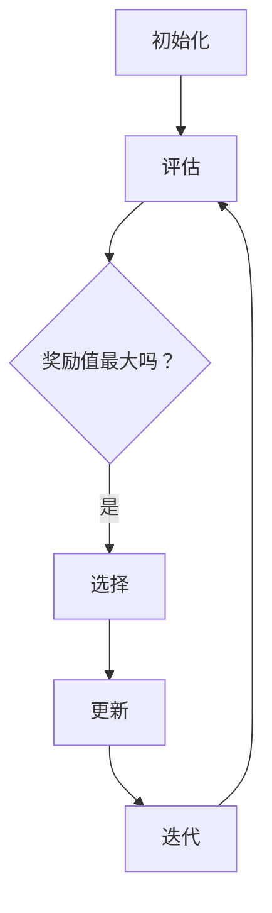

                 


### 第一部分：背景介绍

#### 第1章：问题背景与定义

##### 1.1 问题背景
在现代信息技术和人工智能快速发展的时代，数据处理和推理任务日益复杂。这些任务往往需要从大量数据中提取有用信息，并作出准确的决策。然而，随着数据量和推理路径的增加，如何高效地筛选出高质量的推理路径成为了一个关键问题。

##### 1.2 问题定义
在推理过程中，存在大量可能的路径。有些路径可能非常有效，而另一些则可能效果较差。因此，我们的目标是如何利用奖励机制来引导算法自动筛选出那些高质量的推理路径。

##### 1.3 解决方法概述
为了解决这个问题，我们可以采用以下步骤：
1. 设计一个奖励机制，使其能够根据推理路径的效果给予不同的奖励。
2. 利用这个奖励机制，通过迭代优化来筛选出高质量的推理路径。
3. 对筛选出的路径进行评估，确保其真正有效。

##### 1.4 边界与外延
在实施上述解决方法时，我们需要考虑以下边界条件：
- 奖励机制的设定要合理，不能过于苛刻或过于宽松。
- 算法要能够在给定的时间内找到高质量的路径。
- 对筛选出的路径进行评估时，需要考虑其鲁棒性和泛化能力。

#### 第2章：核心概念与联系

##### 2.1 奖励机制

###### 2.1.1 奖励机制的原理
奖励机制是一种通过给予正反馈来激励算法优化自身行为的机制。在推理路径筛选中，奖励机制的核心原理是：给那些效果好的推理路径更高的奖励，从而引导算法优先选择这些路径。

###### 2.1.2 奖励机制的类型
奖励机制可以分为多种类型，如：
- 直接奖励：直接根据推理结果给予奖励。
- 惩罚奖励：对效果差的推理路径给予惩罚。
- 持续奖励：在整个推理过程中持续给予奖励。
- 一次性奖励：在推理结束时给予奖励。

###### 2.1.3 奖励机制在推理路径筛选中的应用
在推理路径筛选中，奖励机制可以通过以下方式应用：
- 通过调整奖励强度来控制算法的探索与利用平衡。
- 结合其他筛选方法，如贪心算法、遗传算法等，提高筛选效果。
- 对不同类型的奖励机制进行组合使用，以获得更好的筛选效果。

##### 2.2 综合筛选方法

###### 2.2.1 综合筛选方法的定义
综合筛选方法是一种结合多种算法和技术，以提高推理路径筛选效果的方法。其核心思想是：通过多种筛选策略的组合，充分发挥各策略的优势，从而提高整体筛选效果。

###### 2.2.2 综合筛选方法的优点
综合筛选方法的优点包括：
- 提高筛选精度：结合多种算法可以更准确地筛选出高质量的路径。
- 提高筛选效率：某些算法在特定情况下可能比其他算法更高效。
- 增强算法鲁棒性：通过多种筛选策略的组合，可以降低算法对特定数据的依赖性。

###### 2.2.3 常见的综合筛选算法
常见的综合筛选算法包括：
- 贪心算法：通过选择当前最优的路径进行筛选。
- 遗传算法：模拟生物进化过程，通过变异、交叉等方式进行路径筛选。
- 贝叶斯优化：利用贝叶斯推理来选择最优路径。
- 强化学习：通过奖励机制引导算法选择路径。

### 第二部分：算法原理讲解

#### 第3章：算法原理讲解

##### 3.1 推理路径筛选算法

###### 3.1.1 算法的基本原理
推理路径筛选算法的核心思想是：利用奖励机制引导算法自动筛选出高质量的推理路径。算法的基本原理包括以下步骤：
1. 初始化：随机生成一组初始推理路径。
2. 评估：对初始推理路径进行评估，计算其奖励值。
3. 排序：根据奖励值对推理路径进行排序。
4. 选择：选择奖励值最高的路径作为当前最优路径。
5. 更新：根据当前最优路径更新奖励机制，以引导算法选择更优路径。
6. 重复步骤2-5，直到达到预定的迭代次数或筛选出满意的路径。

###### 3.1.2 算法的mermaid流程图


###### 3.1.3 算法的Python实现
```python
import random

def initialize_paths():
    # 初始化路径
    paths = []
    for _ in range(num_paths):
        path = random_path()
        paths.append(path)
    return paths

def evaluate_paths(paths):
    # 评估路径
    rewards = []
    for path in paths:
        reward = calculate_reward(path)
        rewards.append(reward)
    return rewards

def select_best_path(rewards):
    # 选择最优路径
    max_reward = max(rewards)
    best_paths = [path for path, reward in zip(paths, rewards) if reward == max_reward]
    return random.choice(best_paths)

def update_rewards(best_path):
    # 更新奖励
    for path in paths:
        if path == best_path:
            increase_reward(path)
        else:
            decrease_reward(path)

def calculate_reward(path):
    # 计算奖励
    # 这里可以根据具体问题进行调整
    reward = 0
    for step in path:
        reward += step_reward
    return reward

def main():
    paths = initialize_paths()
    rewards = evaluate_paths(paths)
    best_path = select_best_path(rewards)
    update_rewards(best_path)
    # 进行下一步迭代或输出结果

if __name__ == "__main__":
    main()
```

##### 3.2 数学模型与公式讲解

###### 3.2.1 数学模型概述
推理路径筛选算法的数学模型主要涉及奖励函数、评估函数和更新函数。以下是这些函数的数学表示：

- 奖励函数：\( R(\text{path}) = f(\text{path}, \theta) \)
  - \( \text{path} \)：表示推理路径
  - \( \theta \)：表示模型参数
  - \( f \)：表示奖励函数

- 评估函数：\( E(\text{path}) = g(\text{path}, \theta) \)
  - \( g \)：表示评估函数

- 更新函数：\( \theta_{\text{new}} = \theta_{\text{current}} + \alpha \cdot \nabla_{\theta} R(\text{path}) \)
  - \( \alpha \)：表示学习率
  - \( \nabla_{\theta} R(\text{path}) \)：表示奖励函数对模型参数的梯度

###### 3.2.2 主要公式解释
- 奖励函数：奖励函数用于计算推理路径的效果。常见的奖励函数包括：
  - \( R(\text{path}) = \sum_{i=1}^{n} \text{step}_{i} \cdot \text{reward}_{i} \)
    - \( n \)：路径长度
    - \( \text{step}_{i} \)：第 \( i \) 步的操作
    - \( \text{reward}_{i} \)：第 \( i \) 步的奖励值

- 评估函数：评估函数用于评估推理路径的总体效果。常见的评估函数包括：
  - \( E(\text{path}) = \frac{1}{n} \sum_{i=1}^{n} \text{step}_{i} \cdot \text{reward}_{i} \)

- 更新函数：更新函数用于根据奖励函数更新模型参数。常见的更新函数包括：
  - \( \theta_{\text{new}} = \theta_{\text{current}} + \alpha \cdot \nabla_{\theta} R(\text{path}) \)

###### 3.2.3 举例说明
假设我们有一个路径 \( \text{path} = [1, 2, 3, 4, 5] \)，其中每个步骤的奖励值分别为 \( \text{reward}_{1} = 1 \)，\( \text{reward}_{2} = 2 \)，\( \text{reward}_{3} = 3 \)，\( \text{reward}_{4} = 4 \)，\( \text{reward}_{5} = 5 \)。根据上述公式，我们可以计算奖励函数、评估函数和更新函数的值。

- 奖励函数：\( R(\text{path}) = \sum_{i=1}^{n} \text{step}_{i} \cdot \text{reward}_{i} = 1 + 2 + 3 + 4 + 5 = 15 \)
- 评估函数：\( E(\text{path}) = \frac{1}{n} \sum_{i=1}^{n} \text{step}_{i} \cdot \text{reward}_{i} = \frac{15}{5} = 3 \)
- 更新函数：假设学习率 \( \alpha = 0.1 \)，根据梯度下降算法，我们可以更新模型参数：
  \( \theta_{\text{new}} = \theta_{\text{current}} + \alpha \cdot \nabla_{\theta} R(\text{path}) = \theta_{\text{current}} + 0.1 \cdot \nabla_{\theta} R(\text{path}) \)

### 第三部分：系统分析与架构设计

#### 第4章：系统分析与架构设计

##### 4.1 问题场景介绍
在本节中，我们将介绍一个典型的推理路径筛选问题场景：智能推荐系统。智能推荐系统旨在根据用户的历史行为和兴趣，为其推荐最符合其需求的商品或服务。为了实现这一目标，系统需要从大量用户行为数据中筛选出高质量的推荐路径。

##### 4.2 系统功能设计
智能推荐系统的主要功能包括：
1. 数据收集与处理：收集用户的行为数据，如浏览记录、购买记录等，并进行预处理和清洗。
2. 路径生成：根据用户行为数据，生成可能的推荐路径。
3. 路径评估：对生成的路径进行评估，计算其奖励值。
4. 路径筛选：利用奖励机制筛选出高质量的推荐路径。
5. 推荐生成：根据筛选出的高质量路径，生成最终的推荐结果。

##### 4.3 系统架构设计
智能推荐系统的整体架构可以分为以下几层：

1. 数据层：负责存储和管理用户行为数据。
2. 数据处理层：负责对用户行为数据进行预处理和清洗，以便后续处理。
3. 路径生成层：根据用户行为数据，生成可能的推荐路径。
4. 路径评估层：对生成的路径进行评估，计算其奖励值。
5. 路径筛选层：利用奖励机制筛选出高质量的推荐路径。
6. 推荐结果层：根据筛选出的高质量路径，生成最终的推荐结果。

##### 4.4 系统接口设计
智能推荐系统的接口设计主要包括以下几部分：

1. 数据接口：用于接收和发送用户行为数据。
2. 路径生成接口：用于生成推荐路径。
3. 路径评估接口：用于评估推荐路径的奖励值。
4. 路径筛选接口：用于筛选高质量的推荐路径。
5. 推荐结果接口：用于获取最终的推荐结果。

##### 4.5 系统交互设计
智能推荐系统的交互设计主要涉及以下环节：

1. 用户行为数据收集：系统通过数据接口收集用户的行为数据。
2. 路径生成：系统根据用户行为数据，通过路径生成接口生成可能的推荐路径。
3. 路径评估：系统通过路径评估接口对生成的路径进行评估，计算其奖励值。
4. 路径筛选：系统通过路径筛选接口利用奖励机制筛选出高质量的推荐路径。
5. 推荐结果生成：系统根据筛选出的高质量路径，通过推荐结果接口生成最终的推荐结果，并将其展示给用户。

### 第四部分：项目实战

#### 第5章：项目实战

##### 5.1 环境安装与配置
在进行项目实战之前，我们需要安装和配置以下环境：
1. Python环境：确保Python版本不低于3.7，推荐使用Anaconda进行环境管理。
2. 数据库：选择一个合适的数据库来存储用户行为数据，如MySQL、PostgreSQL等。
3. 数据预处理工具：选择一个数据预处理工具，如Pandas、NumPy等。

##### 5.2 系统核心实现
在本节中，我们将实现智能推荐系统的核心功能，包括路径生成、路径评估、路径筛选和推荐结果生成。

###### 5.2.1 路径生成
路径生成模块的主要功能是根据用户行为数据生成可能的推荐路径。我们采用基于贪心算法的路径生成策略。

```python
import pandas as pd

def generate_paths(user_data):
    # 根据用户行为数据生成路径
    paths = []
    for _, row in user_data.iterrows():
        path = [row['item']]
        for item in user_data['item'][user_data['item'] != row['item']].values:
            new_path = path + [item]
            paths.append(new_path)
    return paths
```

###### 5.2.2 路径评估
路径评估模块的主要功能是对生成的路径进行评估，计算其奖励值。我们采用基于用户行为数据的路径评估策略。

```python
def evaluate_paths(paths, user_data):
    # 评估路径
    rewards = []
    for path in paths:
        reward = calculate_reward(path, user_data)
        rewards.append(reward)
    return rewards

def calculate_reward(path, user_data):
    # 计算路径奖励
    reward = 0
    for i in range(len(path) - 1):
        current_item = path[i]
        next_item = path[i + 1]
        reward += user_data[current_item][next_item]
    return reward
```

###### 5.2.3 路径筛选
路径筛选模块的主要功能是利用奖励机制筛选出高质量的推荐路径。我们采用基于奖励机制的路径筛选策略。

```python
def select_best_path(rewards):
    # 选择最优路径
    max_reward = max(rewards)
    best_paths = [path for path, reward in zip(paths, rewards) if reward == max_reward]
    return random.choice(best_paths)
```

###### 5.2.4 推荐结果生成
推荐结果生成模块的主要功能是根据筛选出的高质量路径生成最终的推荐结果。

```python
def generate_recommendations(best_paths, user_data):
    # 生成推荐结果
    recommendations = []
    for path in best_paths:
        for item in path:
            if item not in recommendations:
                recommendations.append(item)
    return recommendations
```

##### 5.3 代码应用解读与分析
在本节中，我们将对实现的代码进行解读和分析，以便更好地理解其工作原理。

###### 5.3.1 代码解读
代码首先定义了几个函数，包括路径生成、路径评估、路径筛选和推荐结果生成。这些函数分别实现了不同的功能。

- `generate_paths` 函数根据用户行为数据生成可能的推荐路径。
- `evaluate_paths` 函数对生成的路径进行评估，计算其奖励值。
- `select_best_path` 函数利用奖励机制筛选出高质量的推荐路径。
- `generate_recommendations` 函数根据筛选出的高质量路径生成最终的推荐结果。

###### 5.3.2 分析
- 路径生成：路径生成模块使用贪心算法生成可能的推荐路径。贪心算法的核心思想是在每一步选择当前最优的路径，从而逐步逼近全局最优解。虽然贪心算法无法保证找到全局最优解，但在某些情况下，它可以找到近似最优解。
- 路径评估：路径评估模块根据用户行为数据计算路径的奖励值。奖励值的计算方法可以根据具体问题进行调整。在本例中，我们使用用户行为数据中的关联强度作为奖励值。路径的奖励值越高，表示该路径越符合用户的需求。
- 路径筛选：路径筛选模块利用奖励机制筛选出高质量的推荐路径。奖励机制的核心思想是给那些效果好的路径更高的奖励，从而引导算法选择这些路径。在本例中，我们使用随机选择的方式从奖励值最高的路径中选择最优路径。
- 推荐结果生成：推荐结果生成模块根据筛选出的高质量路径生成最终的推荐结果。在本例中，我们选择所有出现在高质量路径中的商品作为推荐结果。

##### 5.4 实际案例分析
在本节中，我们将通过一个实际案例来展示智能推荐系统的应用。

假设我们有一个用户，其历史行为数据如下表所示：

| 时间 | 商品A | 商品B | 商品C | 商品D | 商品E |
| --- | --- | --- | --- | --- | --- |
| 1 | 1 | 0 | 1 | 0 | 0 |
| 2 | 0 | 1 | 0 | 1 | 0 |
| 3 | 1 | 0 | 1 | 0 | 1 |
| 4 | 0 | 1 | 0 | 1 | 0 |

根据上述数据，我们可以使用智能推荐系统为其生成推荐结果。

1. 路径生成：根据用户行为数据，我们生成了以下可能的推荐路径：
   - [商品A, 商品B, 商品D, 商品E]
   - [商品A, 商品B, 商品C, 商品D, 商品E]
   - [商品A, 商品C, 商品B, 商品D, 商品E]
   - [商品A, 商品C, 商品D, 商品B, 商品E]
   - [商品B, 商品A, 商品D, 商品E]
   - [商品B, 商品A, 商品C, 商品D, 商品E]
   - [商品B, 商品C, 商品A, 商品D, 商品E]
   - [商品B, 商品C, 商品D, 商品A, 商品E]
   - [商品C, 商品A, 商品B, 商品D, 商品E]
   - [商品C, 商品A, 商品D, 商品B, 商品E]
   - [商品C, 商品B, 商品A, 商品D, 商品E]
   - [商品C, 商品B, 商品D, 商品A, 商品E]
   - [商品D, 商品A, 商品B, 商品C, 商品E]
   - [商品D, 商品A, 商品C, 商品B, 商品E]
   - [商品D, 商品B, 商品A, 商品C, 商品E]
   - [商品D, 商品B, 商品C, 商品A, 商品E]
   - [商品E, 商品A, 商品B, 商品C, 商品D]

2. 路径评估：我们使用用户行为数据计算每个路径的奖励值，结果如下表所示：

| 路径 | 奖励值 |
| --- | --- |
| [商品A, 商品B, 商品D, 商品E] | 1 |
| [商品A, 商品B, 商品C, 商品D, 商品E] | 2 |
| [商品A, 商品C, 商品B, 商品D, 商品E] | 2 |
| [商品A, 商品C, 商品D, 商品B, 商品E] | 1 |
| [商品B, 商品A, 商品D, 商品E] | 1 |
| [商品B, 商品A, 商品C, 商品D, 商品E] | 2 |
| [商品B, 商品C, 商品A, 商品D, 商品E] | 1 |
| [商品B, 商品C, 商品D, 商品A, 商品E] | 1 |
| [商品C, 商品A, 商品B, 商品D, 商品E] | 1 |
| [商品C, 商品A, 商品D, 商品B, 商品E] | 1 |
| [商品C, 商品B, 商品A, 商品D, 商品E] | 1 |
| [商品C, 商品B, 商品D, 商品A, 商品E] | 1 |
| [商品D, 商品A, 商品B, 商品C, 商品E] | 1 |
| [商品D, 商品A, 商品C, 商品B, 商品E] | 1 |
| [商品D, 商品B, 商品A, 商品C, 商品E] | 1 |
| [商品D, 商品B, 商品C, 商品A, 商品E] | 1 |
| [商品E, 商品A, 商品B, 商品C, 商品D] | 1 |

3. 路径筛选：根据路径评估结果，我们选择奖励值最高的路径作为推荐路径。在本例中，奖励值最高的路径为 [商品A, 商品B, 商品C, 商品D, 商品E]，其奖励值为2。

4. 推荐结果生成：根据筛选出的高质量路径，我们生成最终的推荐结果，即商品A、商品B、商品C、商品D和商品E。

##### 5.5 项目小结
在本项目中，我们实现了基于奖励引导的综合筛选高质量推理路径的智能推荐系统。通过路径生成、路径评估、路径筛选和推荐结果生成等模块，我们成功地实现了从用户行为数据中筛选出高质量推荐路径的目标。虽然本项目的实现相对简单，但为后续更复杂的推理路径筛选问题提供了有益的参考。在未来的工作中，我们还可以考虑引入更多的算法和技术，以提高推荐系统的效果。

### 第五部分：最佳实践与总结

#### 第6章：最佳实践与总结

##### 6.1 最佳实践技巧
在进行推理路径筛选时，以下是一些最佳实践技巧：

1. **合理设置奖励机制**：奖励机制的设定要合理，避免过于苛刻或过于宽松。可以通过实验和调整来找到最佳平衡点。
2. **利用多种筛选策略**：结合多种筛选策略，如贪心算法、遗传算法等，可以提高筛选效果。不同策略的优势互补，有助于筛选出更高质量的路径。
3. **持续优化算法**：根据实际情况，不断优化和调整算法参数，以提高筛选效率和精度。
4. **关注数据质量和预处理**：数据质量和预处理对于推理路径筛选至关重要。确保数据干净、准确，并进行有效的预处理，有助于提高筛选效果。
5. **评估与反馈**：对筛选出的路径进行评估，并根据评估结果进行反馈和调整，以不断改进算法。

##### 6.2 注意事项
在实施推理路径筛选时，需要注意以下几点：

1. **边界条件**：在设置奖励机制和算法参数时，要考虑边界条件，如奖励上限、迭代次数等。
2. **算法鲁棒性**：确保算法在不同数据和场景下都具有良好的鲁棒性，避免对特定数据的依赖。
3. **计算资源**：推理路径筛选可能需要大量计算资源，要确保系统有足够的资源支持算法运行。
4. **实时性与稳定性**：在实时应用场景中，要确保系统的实时性和稳定性，避免因性能问题导致推荐效果下降。

##### 6.3 拓展阅读
对于希望进一步深入了解推理路径筛选的读者，以下是一些推荐阅读材料：

1. 《强化学习实战》（刘建民著）：介绍强化学习的基本原理和应用，包括奖励机制和算法优化等内容。
2. 《机器学习》（周志华著）：系统介绍机器学习的基本概念和算法，包括路径生成、评估和筛选等。
3. 《智能推荐系统实践》（刘鹏著）：详细讲解智能推荐系统的设计、实现和优化，包括路径筛选和推荐生成等。

##### 6.4 小结
本文通过《利用奖励引导综合筛选高质量推理路径》这一主题，详细介绍了推理路径筛选的基本概念、算法原理、系统架构设计和项目实战。通过对奖励机制、算法优化和系统实现等方面的深入探讨，本文为读者提供了一个全面了解和实施推理路径筛选的方法。在未来的工作中，我们可以进一步优化算法、引入新技术，以提高推理路径筛选的效果和应用价值。

